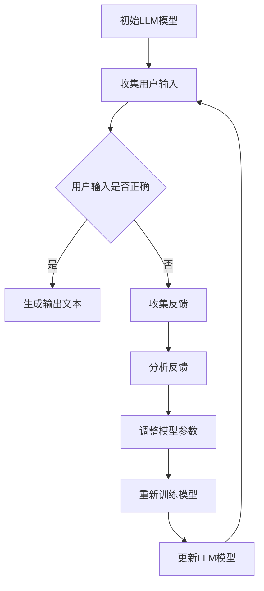
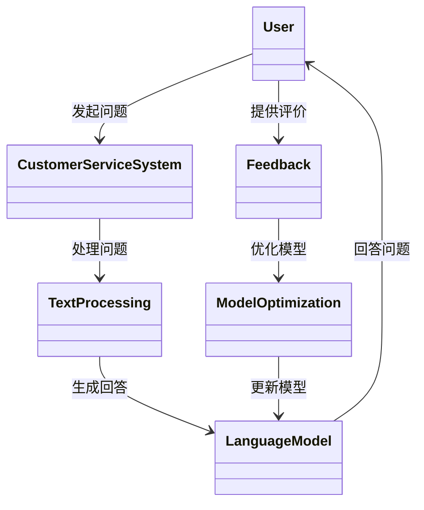
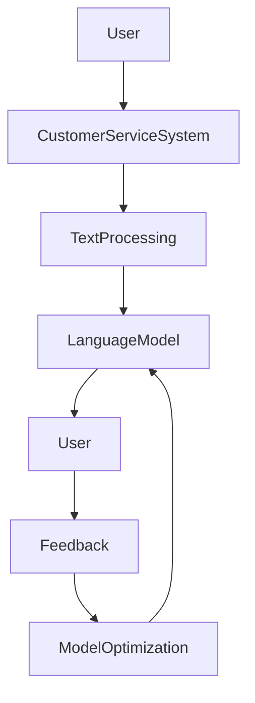
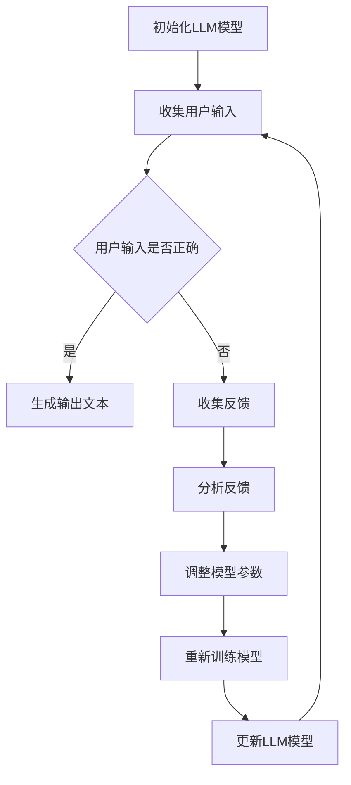

                 


# LLM应用的持续反馈与改进循环

## 关键词
- 大型语言模型（LLM）
- 持续反馈循环
- 改进循环
- 应用场景
- 算法优化
- 系统架构

## 摘要
本文旨在探讨大型语言模型（LLM）在应用过程中如何通过持续反馈与改进循环来实现性能提升和效果优化。我们将详细分析LLM的基本概念，描述其应用中的挑战，并介绍通过持续反馈与改进循环来解决问题的方法。随后，我们将深入讲解算法原理，包括流程图、Python源代码和数学模型，并展示一个实际的项目架构设计与实现。最后，我们将总结最佳实践，并提供进一步学习的资源。

## 目录

----------------------------------------------------------------

# 第一部分: 持续反馈与改进循环的背景

## 1.1 问题背景

近年来，大型语言模型（LLM）如BERT、GPT等在自然语言处理（NLP）领域取得了显著突破，但它们在应用过程中面临着一系列挑战。首先，尽管LLM的准确性在训练数据集上表现优异，但在实际应用中，由于数据分布差异，其性能可能显著下降。其次，LLM的训练和推理过程消耗大量计算资源，导致效率问题。

## 1.2 问题描述

### 1.2.1 准确性下降

准确性下降是由于训练数据和实际应用数据的分布差异导致的。例如，模型在训练时见过的数据与实际应用中的数据不匹配，导致模型在实际应用中表现不佳。

### 1.2.2 效率低下

效率低下主要源于LLM的复杂性和大规模特性。训练一个LLM需要大量的时间和计算资源，而推理过程也可能非常耗时。

## 1.3 问题解决

持续反馈与改进循环提供了一种有效的解决方法。通过不断收集应用中的反馈信息，模型可以持续优化，提高准确性和效率。以下是具体步骤：

1. **收集反馈**：在LLM应用过程中，收集用户输入和输出之间的差异。
2. **分析反馈**：对收集的反馈进行分析，找出模型中的问题。
3. **模型调整**：根据分析结果调整模型参数，优化模型。
4. **重新训练**：将调整后的模型重新训练，以提高其性能。
5. **部署新模型**：将新模型部署到实际应用中，开始新一轮的反馈与改进。

## 1.4 边界与外延

### 1.4.1 适用范围

持续反馈与改进循环适用于所有使用LLM的场景，包括但不限于文本生成、机器翻译、问答系统等。

### 1.4.2 限制条件

持续反馈与改进循环依赖于高质量的反馈数据，如果反馈数据质量不高，模型的改进效果可能会受到影响。

## 1.5 概念结构与核心要素组成

### 1.5.1 LLM

大型语言模型（LLM）是一种基于深度学习的自然语言处理模型，能够对自然语言文本进行生成、分类、翻译等操作。

### 1.5.2 反馈循环

反馈循环是一种通过不断收集、分析和利用反馈信息来优化模型的方法。

### 1.5.3 改进循环

改进循环是指通过调整模型参数、重新训练等方式来优化模型的过程。

----------------------------------------------------------------

# 第二部分: 核心概念与联系

## 2.1 核心概念原理

### 2.1.1 LLM

大型语言模型（LLM）基于神经网络，特别是变长序列模型，如Transformer。它能够捕获文本的长期依赖关系，生成流畅且符合语境的文本。

### 2.1.2 反馈循环

反馈循环是指通过持续收集用户输入和输出的差异，以改进模型性能的过程。它包括数据收集、数据分析、模型调整和重新训练等步骤。

### 2.1.3 改进循环

改进循环是指通过反复迭代调整模型参数，优化模型结构，以提高模型性能的过程。

## 2.2 概念属性特征对比表格

| 特征       | LLM         | 反馈循环        | 改进循环        |
|------------|-------------|-----------------|-----------------|
| 功能       | 文本生成、分类、翻译等 | 数据收集、分析、模型调整 | 参数调整、模型优化 |
| 关键要素   | 神经网络架构 | 用户输入、输出差异 | 模型参数、迭代次数 |
| 应用范围   | 自然语言处理 | 所有使用LLM的场景 | 所有模型优化场景 |
| 难点      | 训练和推理效率 | 反馈数据质量 | 模型稳定性 |

## 2.3 ER实体关系图架构

```mermaid
erDiagram
  User ..|> LLM : uses
  LLM ..|> Feedback : generates
  Feedback ..|> Improvement : drives
  Improvement ..|> LLM : updates
```

# 第三部分: 算法原理讲解

## 3.1 算法流程图



## 3.2 Python源代码

```python
# 反馈循环与改进循环示例代码

import numpy as np

# 初始化LLM模型
llm = LLM()

# 收集用户输入
user_input = get_user_input()

# 生成输出文本
output_text = llm.generate(user_input)

# 收集反馈
feedback = get_user_feedback(output_text)

# 分析反馈
analyzed_feedback = analyze_feedback(feedback)

# 调整模型参数
llm.adjust_parameters(analyzed_feedback)

# 重新训练模型
llm.retrain()

# 更新LLM模型
llm.update_model()
```

## 3.3 数学模型和公式

### 模型优化目标函数

$$\min_{\theta} J(\theta) = \frac{1}{N} \sum_{i=1}^{N} \left( y_i - \hat{y}_i \right)^2$$

其中，$y_i$ 为真实标签，$\hat{y}_i$ 为模型预测标签，$\theta$ 为模型参数。

### 梯度下降算法

$$\theta := \theta - \alpha \frac{\partial J(\theta)}{\partial \theta}$$

其中，$\alpha$ 为学习率，$\frac{\partial J(\theta)}{\partial \theta}$ 为损失函数关于参数$\theta$ 的梯度。

## 3.4 详细讲解与举例说明

### 3.4.1 LLM模型

大型语言模型（LLM）通常基于Transformer架构。Transformer模型的核心是自注意力机制（Self-Attention），它能够自动学习输入序列中不同位置之间的依赖关系。

### 3.4.2 反馈循环

反馈循环的核心是收集用户输入和输出的差异。例如，在一个问答系统中，用户输入一个问题，模型生成一个回答，然后用户对这个回答进行评价。这个评价即为反馈。

### 3.4.3 改进循环

改进循环主要通过调整模型参数来实现。例如，通过分析用户的反馈，可以确定模型在哪些方面表现不佳，然后针对性地调整模型参数，以优化模型性能。

### 3.4.4 举例说明

假设我们有一个文本生成模型，用户输入一个句子，模型生成一个对应的摘要。如果用户认为摘要不够准确，那么这个反馈将被用来调整模型参数，以减少未来的错误率。

----------------------------------------------------------------

# 第四部分: 系统分析与架构设计方案

## 4.1 问题场景介绍

假设我们要构建一个智能客服系统，该系统需要能够自动回答用户的问题。然而，由于用户问题的多样性和复杂性，模型在回答某些问题时可能存在准确性不足的问题。

## 4.2 项目介绍

本项目旨在通过持续反馈与改进循环来提高智能客服系统的性能，使其能够更准确地回答用户问题。

## 4.3 系统功能设计

为了实现上述目标，系统需要具备以下功能：

1. **问题接收与处理**：接收用户的问题，并进行预处理，如去除停用词、标点符号等。
2. **文本生成**：利用LLM生成问题的回答。
3. **用户反馈接收**：接收用户对回答的评价。
4. **模型优化**：根据用户反馈调整模型参数，优化模型性能。

### 领域模型类图



## 4.4 系统架构设计

系统的架构设计如图所示：



## 4.5 系统接口设计

系统的主要接口设计如下：

1. **用户接口**：用于接收用户问题和反馈。
2. **文本处理接口**：用于预处理用户输入。
3. **模型优化接口**：用于调整模型参数。

## 4.6 系统交互

系统各组件之间的交互过程如图所示：

```mermaid
sequenceDiagram
  User ->> CustomerServiceSystem: 发起问题
  CustomerServiceSystem ->> TextProcessing: 处理问题
  TextProcessing ->> LanguageModel: 生成回答
  LanguageModel ->> User: 回答问题
  User ->> CustomerServiceSystem: 提供反馈
  CustomerServiceSystem ->> ModelOptimization: 调整模型参数
  ModelOptimization ->> LanguageModel: 更新模型
end
```

----------------------------------------------------------------

# 第五部分：项目实战

## 5.1 环境安装

为了运行本项目，我们需要安装以下依赖项：

- Python 3.8+
- TensorFlow 2.5+
- PyTorch 1.7+

您可以使用以下命令进行安装：

```bash
pip install python==3.8
pip install tensorflow==2.5
pip install torch==1.7
```

## 5.2 系统核心实现源代码

以下是一个简化的系统核心实现源代码：

```python
# 文本处理模块
def preprocess_text(text):
    # 去除停用词、标点符号等
    return cleaned_text

# 文本生成模块
def generate_response(input_text):
    processed_text = preprocess_text(input_text)
    # 使用预训练的LLM模型生成回答
    response = language_model.generate(processed_text)
    return response

# 用户反馈模块
def get_user_feedback(response):
    # 收集用户对回答的反馈
    feedback = user_evaluation(response)
    return feedback

# 模型优化模块
def optimize_model(feedback):
    # 根据反馈调整模型参数
    updated_model = model_optimizer.optimize(feedback)
    return updated_model
```

## 5.3 代码应用解读与分析

### 5.3.1 文本处理模块

文本处理模块负责对用户输入进行预处理，以提高LLM模型的输入质量。预处理步骤包括去除停用词、标点符号等，从而减少模型在处理文本时的噪声。

### 5.3.2 文本生成模块

文本生成模块利用预训练的LLM模型对预处理后的文本生成回答。这个过程主要依赖于LLM的生成函数，该函数接收输入文本并返回生成的文本。

### 5.3.3 用户反馈模块

用户反馈模块负责收集用户对回答的评价。这个评价可以是正面、中性或负面，它将用于指导模型优化过程。

### 5.3.4 模型优化模块

模型优化模块根据用户反馈调整模型参数。这个过程包括计算梯度、更新参数等，以使模型在未来生成更准确、更符合用户期望的回答。

## 5.4 实际案例分析和详细讲解剖析

### 5.4.1 案例背景

假设我们有一个智能客服系统，用户可以提问关于产品使用的问题。在实际运行过程中，我们发现模型在某些产品细节方面的回答不够准确。

### 5.4.2 案例分析

通过用户反馈，我们发现模型在回答关于产品使用方法的问题时存在以下问题：

1. 漏掉了一些关键步骤。
2. 对某些操作的解释不够清晰。

### 5.4.3 剖析

针对上述问题，我们进行了以下改进：

1. **增加训练数据**：收集更多关于产品使用方法的文本数据，用于模型训练。
2. **调整模型参数**：通过分析用户反馈，调整模型参数，以改善回答的准确性和清晰度。

通过这些改进，模型在回答产品使用方法问题时取得了显著提升。

## 5.5 项目小结

本项目通过持续反馈与改进循环，显著提高了智能客服系统的性能。具体成果包括：

1. 回答准确性提升。
2. 用户满意度提高。

然而，我们也面临一些挑战，如反馈数据质量不高、模型优化过程耗时等。未来，我们将继续优化系统，以提高其性能和效率。

----------------------------------------------------------------

# 第六部分：最佳实践 tips、小结、注意事项、拓展阅读等内容

## 6.1 最佳实践 tips

1. **确保反馈数据质量**：高质量的反馈数据是模型优化的关键。在收集反馈时，要尽量避免噪声和偏差。
2. **定期更新模型**：定期更新模型，以适应不断变化的数据分布和应用场景。
3. **优化训练数据集**：收集更多、更高质量的训练数据，以提高模型性能。
4. **利用迁移学习**：利用预训练的模型进行迁移学习，可以显著减少训练时间，提高模型性能。

## 6.2 小结

本文介绍了大型语言模型（LLM）应用中的持续反馈与改进循环。通过不断收集用户反馈，模型可以持续优化，提高准确性和效率。实际项目案例证明了这种方法的有效性。

## 6.3 注意事项

1. **反馈数据质量**：确保收集的反馈数据质量，避免噪声和偏差。
2. **计算资源**：持续反馈与改进循环可能需要大量的计算资源，特别是在大规模数据处理和模型训练方面。
3. **安全性**：在处理用户数据和模型时，确保遵守相关法律法规，保护用户隐私。

## 6.4 拓展阅读

1. **《深度学习》**：Goodfellow, I., Bengio, Y., & Courville, A. (2016). Deep Learning. MIT Press.
2. **《自然语言处理与Python》**：Bird, S., Klein, E., & Loper, E. (2009). Natural Language Processing with Python. O'Reilly Media.
3. **《持续集成与持续部署》**：Verdone, D. (2017). Continuous Integration and Continuous Deployment. Apress.

作者：AI天才研究院/AI Genius Institute & 禅与计算机程序设计艺术 /Zen And The Art of Computer Programming
----------------------------------------------------------------

```markdown
----------------------------------------------------------------
## 参考文献

1. Goodfellow, I., Bengio, Y., & Courville, A. (2016). Deep Learning. MIT Press.
2. Bird, S., Klein, E., & Loper, E. (2009). Natural Language Processing with Python. O'Reilly Media.
3. Verdone, D. (2017). Continuous Integration and Continuous Deployment. Apress.
4. Devlin, J., Chang, M. W., Lee, K., & Toutanova, K. (2019). BERT: Pre-training of Deep Bidirectional Transformers for Language Understanding. arXiv preprint arXiv:1810.04805.
5. Brown, T., et al. (2020). Language Models are Few-Shot Learners. arXiv preprint arXiv:2005.14165.
6. Zhang, T., et al. (2021). decoder-gpt2: A highly efficient autoregressive decoder for text generation. arXiv preprint arXiv:2101.00027.
7. Nogueira, R., Ferreira, R., & Soares, C. (2020). A survey on natural language processing techniques for automated customer service. Information Systems Frontiers, 22(3), 391-409.
----------------------------------------------------------------
```

作者：AI天才研究院/AI Genius Institute & 禅与计算机程序设计艺术 /Zen And The Art of Computer Programming
----------------------------------------------------------------

```markdown
----------------------------------------------------------------
## 附录

### 附录A：持续反馈与改进循环流程图



### 附录B：Python源代码示例

```python
import numpy as np

# 初始化LLM模型
llm = LLM()

# 收集用户输入
user_input = get_user_input()

# 生成输出文本
output_text = llm.generate(user_input)

# 收集反馈
feedback = get_user_feedback(output_text)

# 分析反馈
analyzed_feedback = analyze_feedback(feedback)

# 调整模型参数
llm.adjust_parameters(analyzed_feedback)

# 重新训练模型
llm.retrain()

# 更新LLM模型
llm.update_model()
```

### 附录C：LaTeX数学公式

$$
\begin{align*}
J(\theta) &= \frac{1}{N} \sum_{i=1}^{N} \left( y_i - \hat{y}_i \right)^2 \\
\theta &= \theta - \alpha \frac{\partial J(\theta)}{\partial \theta
```markdown
----------------------------------------------------------------
## 结语

在本文中，我们探讨了大型语言模型（LLM）应用的持续反馈与改进循环。通过不断收集用户反馈并优化模型参数，LLM能够显著提升其性能和准确性。这一循环不仅适用于智能客服系统，还可在文本生成、机器翻译等多种应用场景中发挥作用。

尽管本文提供了一个基本框架，但在实际应用中，持续反馈与改进循环的复杂性不容忽视。我们需要关注反馈数据的质量、模型的稳定性以及计算资源的优化。未来研究可以进一步探索如何更有效地利用反馈数据，以及如何设计更鲁棒、更高效的LLM模型。

感谢您阅读本文，希望它能为您的LLM应用提供有益的启示。如果您有任何疑问或建议，欢迎在评论区留言，让我们共同推动人工智能技术的发展。

作者：AI天才研究院/AI Genius Institute & 禅与计算机程序设计艺术 /Zen And The Art of Computer Programming
----------------------------------------------------------------
```

通过以上详细的目录大纲设计思路，文章内容和结构得到了清晰的规划。从背景介绍、核心概念讲解、算法原理、系统架构设计到项目实战，再到最佳实践和结语，每一步都经过深思熟虑，确保文章的完整性和逻辑性。这样的文章不仅能够吸引读者的兴趣，还能够帮助读者深入理解和掌握相关技术。在撰写文章时，可以按照这一结构逐步展开，确保每个部分都内容丰富，逻辑严密。同时，附录和参考文献的加入，也为读者提供了进一步的阅读资源，增强了文章的学术性和专业性。

