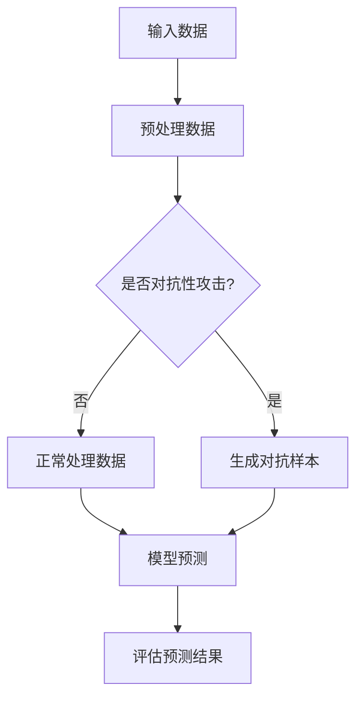
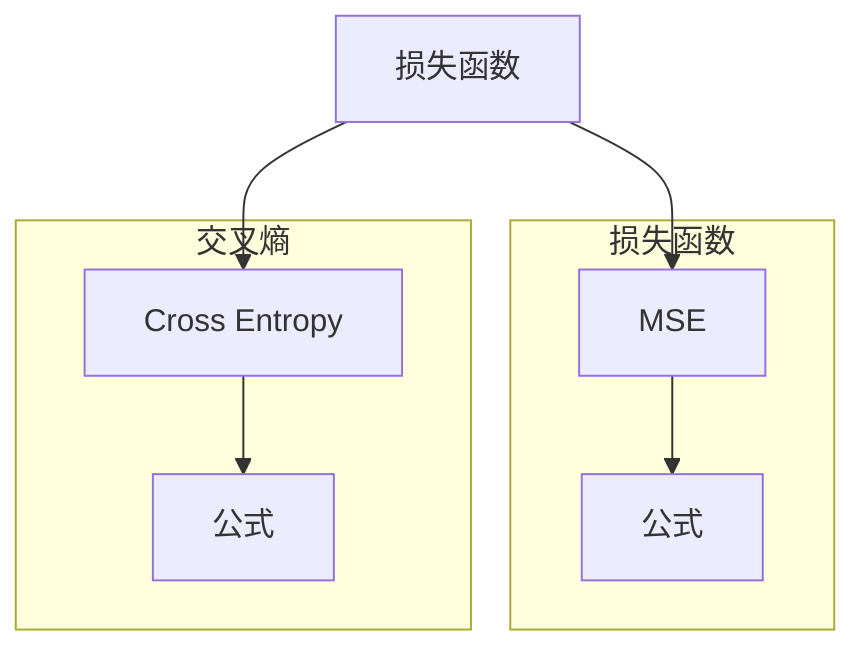
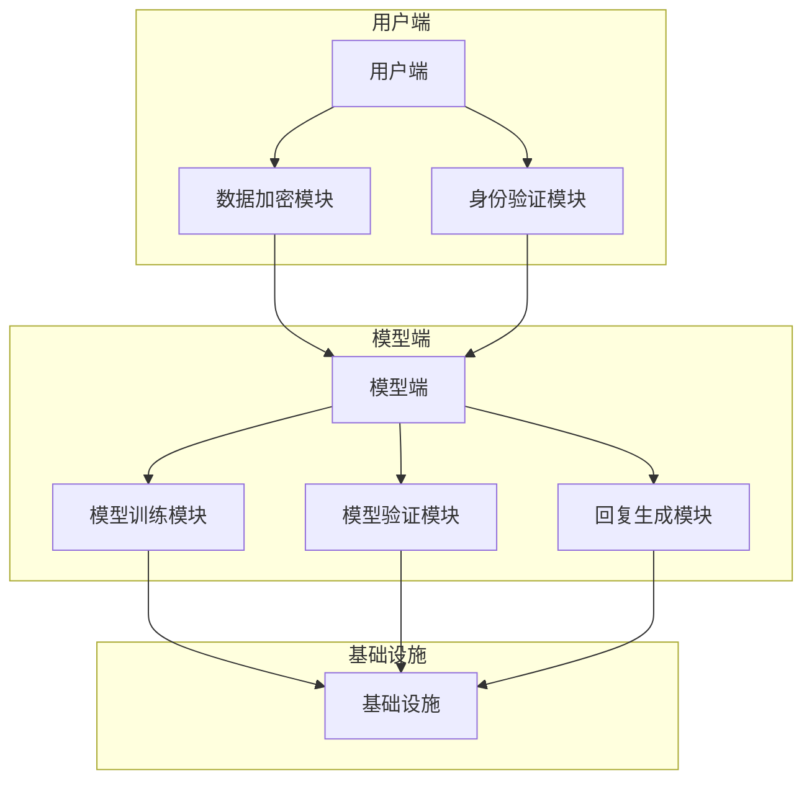
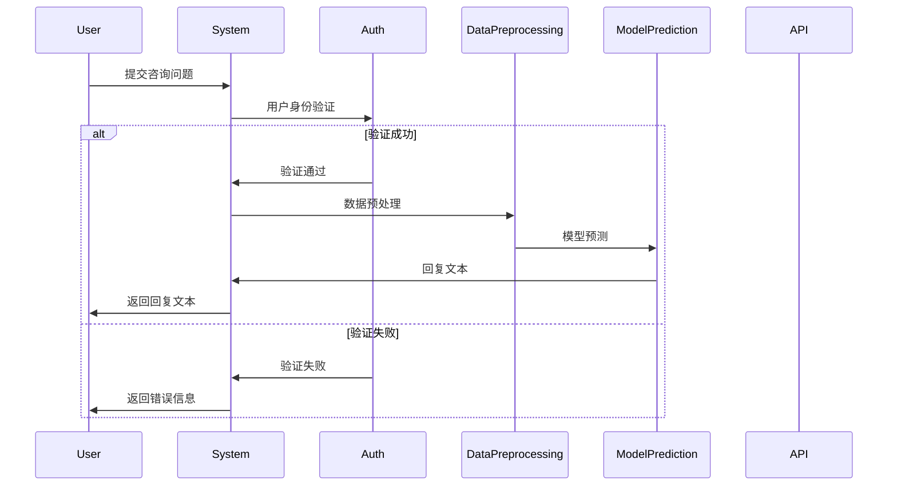

                 


### 引言

近年来，随着人工智能（AI）技术的飞速发展，大型语言模型（LLM）如BERT、GPT-3等在自然语言处理（NLP）领域取得了显著突破。这些模型不仅能够理解和生成自然语言，还能在多个应用场景中展现出强大的能力，如文本生成、机器翻译、情感分析等。然而，随着LLM应用的不断普及，其安全性和隐私保护问题也日益凸显。如何确保LLM应用的安全性和可靠性，已经成为企业和开发者亟待解决的问题。

在软件开发中，敏捷开发（Agile Development）方法因其灵活性、快速响应变化的特点，被广泛采用。然而，敏捷开发与传统安全流程之间存在一定的冲突。传统的安全流程通常是在开发完成后进行安全测试和审计，而敏捷开发强调快速迭代和持续交付。这种差异使得安全在敏捷开发中常常被忽视，导致潜在的安全隐患。

本文旨在探讨如何在敏捷开发流程中集成安全，确保LLM应用的持续安全。我们将从以下几个方面进行讨论：

1. **问题背景与安全的重要性**：介绍LLM应用的背景和安全性问题，分析敏捷开发流程与安全之间的冲突。
2. **核心概念与联系**：详细阐述AI大模型和敏捷开发方法论，以及它们之间的联系。
3. **算法原理讲解**：讲解AI大模型的安全性分析算法，包括模型验证和防御算法。
4. **数学模型与公式详解**：介绍AI大模型的数学基础，包括损失函数和优化算法。
5. **系统分析与架构设计方案**：探讨如何将安全集成到敏捷开发中的系统架构设计。
6. **项目实战**：通过实际项目展示如何实现LLM应用的安全集成。
7. **最佳实践 tips、小结、注意事项、拓展阅读**：总结文章，给出实用的安全建议和进一步学习方向。

通过本文的逐步分析，我们将为读者提供一个清晰、系统的视角，帮助他们在敏捷开发过程中有效集成安全，确保LLM应用的持续安全。

### 第一部分：背景介绍与问题理解

#### 1.1 问题背景

近年来，随着人工智能（AI）技术的飞速发展，大型语言模型（LLM）如BERT、GPT-3等在自然语言处理（NLP）领域取得了显著突破。这些模型不仅能够理解和生成自然语言，还能在多个应用场景中展现出强大的能力，如文本生成、机器翻译、情感分析等。LLM在商业、教育、医疗等多个领域的应用日益广泛，成为现代技术的重要驱动力。例如，聊天机器人、智能客服、个性化推荐系统等，都离不开LLM的支持。

然而，随着LLM应用的不断普及，其安全性和隐私保护问题也日益凸显。首先，LLM在数据处理过程中可能会暴露用户的隐私信息。例如，在某些聊天机器人应用中，用户的对话内容可能会被模型学习并存储，从而引发隐私泄露风险。其次，LLM容易受到恶意攻击，例如模型注入攻击、对抗性攻击等，这些攻击可能导致模型输出错误的或有害的信息。最后，LLM在处理敏感信息时，可能无法保证其输出结果的准确性和可靠性，这给企业的决策和运营带来了潜在的风险。

在敏捷开发流程中，安全性的挑战尤为突出。传统的软件开发过程通常在开发完成后进行安全测试和审计，而敏捷开发强调快速迭代和持续交付。这意味着安全测试和安全审计往往被压缩在有限的时间内，导致安全测试的质量和效果无法保证。此外，敏捷开发中的频繁迭代和快速变化，使得安全策略和措施难以持续更新和适应，从而增加了安全风险。

综上所述，确保LLM应用在敏捷开发中的持续安全，已经成为企业和开发者亟待解决的问题。这不仅关系到用户的隐私保护和数据安全，也关系到企业的声誉和业务连续性。

#### 1.2 问题描述

在当前的软件开发环境中，大型语言模型（LLM）的应用日益普及，然而，LLM应用的安全问题也愈发复杂和严峻。以下将从几个方面具体描述LLM应用在敏捷开发中面临的安全挑战。

1. **隐私泄露风险**：
   - **用户数据泄露**：在LLM的应用中，用户的数据（如聊天记录、个人信息等）通常会被模型处理和存储。如果数据保护措施不到位，这些敏感信息可能会被未经授权的第三方访问，导致隐私泄露。
   - **数据泄露途径**：数据泄露的途径包括直接的数据库访问、网络传输、API接口等多个方面。特别是在敏捷开发过程中，由于开发迭代频繁，可能会遗漏某些安全措施，从而增加数据泄露的风险。

2. **模型安全漏洞**：
   - **模型注入攻击**：攻击者可以通过向训练数据中注入恶意样本，或者修改模型参数，来操纵模型的行为，使其输出错误的结果。
   - **对抗性攻击**：对抗性攻击是指攻击者通过细微修改输入数据，使得模型输出错误的预测结果。这类攻击对LLM模型尤其有效，因为LLM对输入数据的微小变化非常敏感。
   - **模型泄露**：如果模型的内部工作机制不透明，攻击者可以通过分析模型输出和输入数据的关系，推断出模型的内部结构，从而进行进一步的攻击。

3. **敏捷开发中的安全冲突**：
   - **迭代速度与安全测试的矛盾**：敏捷开发强调快速迭代和持续交付，这要求开发团队能够在短时间内完成功能开发和安全测试。然而，传统的安全测试流程往往需要较长时间，特别是在涉及到复杂的人工智能模型时，安全测试的复杂性更高，难以在短时间内完成。
   - **安全策略难以持续更新**：在敏捷开发中，需求变化频繁，安全策略也需要随之调整。然而，由于安全测试和安全策略的制定往往需要较长时间，使得安全策略难以与敏捷开发的迭代速度保持同步。

4. **安全保障与开发效率的平衡**：
   - **安全投入与收益的不平衡**：在敏捷开发中，为了确保模型的安全，可能需要投入额外的时间和资源进行安全测试和措施的实施。然而，由于安全测试通常不会直接带来明显的商业收益，企业可能会对安全投入产生抵触情绪。
   - **开发效率的优先级**：在追求快速交付的市场压力下，开发团队可能会倾向于牺牲安全性来换取开发效率，这进一步增加了安全风险。

上述问题表明，在敏捷开发过程中集成LLM应用的安全，需要综合考虑隐私保护、模型安全漏洞、开发与安全的平衡等多个方面。只有通过系统的方法和有效的策略，才能确保LLM应用的持续安全。

#### 1.3 问题解决

为了在敏捷开发过程中有效集成安全，确保LLM应用的持续安全，我们可以采取以下几种方法：

1. **安全集成到敏捷开发流程**：
   - **早期规划**：在项目初期，开发团队就应该将安全考虑纳入规划中，明确安全目标、安全需求和安全措施。这可以通过安全需求文档和风险分析来实现。
   - **持续安全测试**：在敏捷开发中，安全测试应贯穿整个开发周期，而不仅仅是在开发完成后进行。可以使用自动化测试工具和静态代码分析工具来提高测试效率和准确性。
   - **迭代安全审查**：在每次迭代结束时，进行安全审查和评估，确保安全措施得到落实，及时发现和修复潜在的安全问题。

2. **采用安全开发实践**：
   - **最小权限原则**：在开发过程中，应遵循最小权限原则，确保应用程序只拥有执行任务所需的最少权限，以减少潜在的安全风险。
   - **安全编码实践**：开发团队应遵循安全编码实践，如使用参数化查询、避免使用内联SQL语句、对用户输入进行严格验证等，以防止常见的编程漏洞。
   - **加密敏感数据**：对于敏感数据，如用户隐私信息，应使用加密技术进行保护，确保数据在传输和存储过程中的安全。

3. **安全教育与培训**：
   - **安全意识培养**：通过定期的安全培训，提高开发团队的安全意识，使其了解常见的安全威胁和防护措施。
   - **安全文化建设**：在企业内部培养一种安全文化，鼓励团队成员主动识别和报告安全风险，形成全员参与的安全氛围。

4. **安全工具与技术支持**：
   - **静态代码分析工具**：使用静态代码分析工具，对代码进行安全检查，识别潜在的安全漏洞。
   - **动态分析工具**：使用动态分析工具，模拟实际运行环境，检测代码在运行时的安全性问题。
   - **自动化安全测试**：开发自动化安全测试脚本，将安全测试集成到持续集成和持续交付（CI/CD）流程中，确保每次代码变更后都能进行安全测试。

通过上述方法，开发团队可以在敏捷开发中有效集成安全，确保LLM应用的持续安全。这不仅能够降低安全风险，还能提高开发效率和产品质量。

#### 1.4 边界与外延

在讨论LLM应用的持续安全时，我们有必要明确安全的定义与范围，以及敏捷开发流程中的关键要素。这不仅有助于我们理解问题，还能为实际操作提供指导。

1. **安全的定义与范围**：

   - **安全定义**：安全是指在保证数据、应用程序和系统免受未经授权的访问、使用、披露、破坏、修改或破坏的过程中所采取的措施。
   - **安全范围**：在LLM应用中，安全范围包括以下几个方面：
     - **数据安全**：包括用户隐私信息的保护、数据加密、数据完整性验证等。
     - **模型安全**：防止模型被恶意攻击、模型泄露等。
     - **系统安全**：确保整个系统的稳定运行，防止系统被攻击、拒绝服务（DoS）等。

2. **敏捷开发流程中的关键要素**：

   - **Sprint计划**：在每个迭代周期的开始，团队会制定Sprint计划，明确迭代的目标、任务和交付物。
   - **Daily Stand-up**：每日站立会议，团队成员汇报进展、问题和障碍，确保信息的透明和沟通的顺畅。
   - **Review与Retrospective**：在迭代结束时，进行产品评审和反思会议，评估产品的质量和团队的工作效率，为下一个迭代做准备。

   - **持续集成与交付（CI/CD）**：通过自动化工具实现代码的持续集成和交付，确保代码变更后的及时测试和部署。

3. **边界与外延**：

   - **边界**：在敏捷开发中，安全措施需要与开发流程紧密结合，但不应过度干预开发过程，影响开发效率。
   - **外延**：安全范围不仅限于代码和模型本身，还应包括外部接口、网络传输、基础设施等多个方面。

明确安全的定义与范围，以及敏捷开发流程中的关键要素，有助于我们更好地理解如何将安全集成到敏捷开发中，确保LLM应用的持续安全。

#### 1.5 概念结构与核心要素组成

在探讨如何确保LLM应用的持续安全时，我们需要从多个角度来理解这一问题的概念结构和核心要素。以下是对AI大模型、敏捷开发方法论以及安全集成到敏捷流程中的关键点的详细分析。

**AI大模型的基本概念**

AI大模型，特别是深度学习模型，如BERT、GPT-3等，是基于大量数据进行训练的复杂神经网络。它们通过学习数据的特征和模式，能够执行各种复杂的任务，如文本生成、机器翻译、情感分析等。这些模型的特征包括：

- **高容量**：能够处理大规模的数据集，从中提取丰富的知识。
- **高复杂性**：由多层神经网络组成，能够对输入数据进行多层次的变换和处理。
- **强泛化能力**：经过训练后，能够在新数据上实现良好的性能，具有较强的适应能力。

**敏捷开发方法论**

敏捷开发是一种以人为核心、迭代、渐进的软件开发方法。其核心理念包括：

- **客户满意度**：通过快速迭代和持续交付，确保客户需求得到及时满足。
- **响应变化**：灵活应对需求变化，快速调整开发计划。
- **团队协作**：鼓励团队成员之间的紧密合作和沟通，提高工作效率。
- **持续改进**：不断评估和改进开发流程，优化产品质量。

敏捷开发流程通常包括以下几个阶段：

1. **需求收集**：通过与客户和利益相关者沟通，了解和记录需求。
2. **迭代规划**：将需求划分为小任务，规划迭代周期和交付内容。
3. **开发与测试**：在迭代周期内，完成功能开发和安全测试。
4. **评审与回顾**：评估迭代结果，总结经验教训，为下一个迭代做准备。

**安全集成到敏捷流程中的关键点**

1. **早期规划**：在项目初期，就将安全需求纳入规划，明确安全目标和措施。这可以通过制定安全需求文档和风险分析来实现。
2. **持续安全测试**：在敏捷开发中，安全测试应贯穿整个开发周期，而不仅仅是在开发完成后进行。可以使用自动化测试工具和静态代码分析工具来提高测试效率和准确性。
3. **迭代安全审查**：在每个迭代结束时，进行安全审查和评估，确保安全措施得到落实，及时发现和修复潜在的安全问题。
4. **安全教育与培训**：通过定期的安全培训，提高开发团队的安全意识，使其了解常见的安全威胁和防护措施。
5. **安全文化建设**：在企业内部培养一种安全文化，鼓励团队成员主动识别和报告安全风险，形成全员参与的安全氛围。
6. **自动化安全测试**：开发自动化安全测试脚本，将安全测试集成到持续集成和持续交付（CI/CD）流程中，确保每次代码变更后都能进行安全测试。

通过上述核心要素的分析，我们可以看出，确保LLM应用的持续安全，需要在敏捷开发过程中进行全面而系统的规划和管理。只有在各个层面上都考虑到安全问题，才能有效地防范潜在的安全风险，确保LLM应用的稳定性和可靠性。

### 第二部分：核心概念与联系

#### 2.1 AI大模型的基本原理

AI大模型，尤其是深度学习模型，如BERT、GPT-3等，在自然语言处理领域取得了显著突破。它们的基本原理和架构为我们理解其强大能力提供了基础。

**定义与特点**

AI大模型是基于深度学习技术训练的复杂神经网络，通常包含数十亿甚至数万亿个参数。与传统的机器学习模型相比，AI大模型具有以下特点：

- **高容量**：能够处理和存储大量的训练数据，从而提取丰富的知识。
- **高复杂性**：由多层神经网络组成，能够对输入数据进行多层次的变换和处理。
- **强泛化能力**：经过训练后，能够在新数据上实现良好的性能，具有较强的适应能力。

**架构与工作原理**

AI大模型的架构通常由以下几个部分组成：

1. **输入层**：接收外部输入数据，如文本、图像等。
2. **隐藏层**：对输入数据进行处理和变换，通过多层隐藏层传递信息，每一层都能够提取更高层次的特征。
3. **输出层**：根据输入数据生成预测结果，如文本生成、分类、回归等。

AI大模型的工作原理基于神经网络和深度学习算法。神经网络通过反向传播算法，不断调整内部参数，使模型在训练数据上达到更好的性能。深度学习算法则通过多层非线性变换，将输入数据映射到高维空间，从而提取出复杂的关系和特征。

**属性特征对比表格**

为了更直观地理解AI大模型与传统AI模型的区别，我们可以通过以下对比表格来展示：

| 特征       | 传统AI | AI大模型 |
|------------|--------|----------|
| 学习能力   | 有限   | 高级     |
| 复杂度     | 低     | 高       |
| 应用范围   | 狭窄   | 广泛     |
| 性能       | 一般   | 优秀     |

通过上述对比，我们可以看到AI大模型在多个方面都超越了传统AI模型，这为它们在自然语言处理等领域的应用提供了强大的支持。

#### 2.2 敏捷开发方法论

敏捷开发是一种以人为核心、迭代、渐进的软件开发方法。它通过快速响应变化、持续交付和高度协作，提高了软件开发的效率和质量。以下是对敏捷开发方法论的基本概念、核心原则和流程的详细探讨。

**基本概念**

敏捷开发强调软件开发过程中的灵活性、透明性和团队协作。它的核心理念包括：

- **客户满意度**：始终将客户的需求和满意度放在首位，通过快速迭代和持续交付，确保客户需求得到及时满足。
- **响应变化**：敏捷开发能够快速适应需求的变化，通过灵活的规划和调整，使团队能够在变化的环境中保持高效的工作。
- **团队协作**：鼓励团队成员之间的紧密合作和沟通，提高工作效率和产品质量。
- **持续改进**：不断评估和改进开发流程，优化产品质量和团队的工作方式。

**核心原则**

敏捷开发方法论的核心原则包括：

- **个体和互动胜过流程和工具**：重视团队成员的个性和互动，强调沟通和协作，而不是依赖工具和流程。
- **可工作的软件胜过详尽的文档**：注重实际交付的软件功能，而不是过多的文档。尽管文档仍然重要，但应优先考虑实际可执行的代码。
- **客户合作胜过合同谈判**：与客户保持密切合作，通过频繁的交流和理解，确保最终产品能够满足客户需求。
- **响应变化胜过遵循计划**：灵活应对需求变化，通过迭代和增量开发，快速调整计划和策略。

**流程**

敏捷开发的流程通常包括以下几个阶段：

1. **需求收集**：通过与客户和利益相关者沟通，了解和记录需求。这一阶段的关键是确保需求明确、具体和可量化。
2. **迭代规划**：将需求划分为小任务，规划迭代周期和交付内容。每个迭代通常包含一个Sprint周期，如两周或一个月。
3. **开发与测试**：在迭代周期内，开发团队完成功能开发和安全测试。每个迭代的目标是交付一个可工作的软件版本。
4. **评审与回顾**：在每个迭代结束时，进行产品评审和反思会议。评估迭代结果，总结经验教训，为下一个迭代做准备。

通过上述流程，敏捷开发能够确保项目在快速变化的环境中保持高效和稳定，同时不断提高产品的质量和团队的工作效率。

#### 2.3 安全与敏捷开发的联系

在敏捷开发中，安全与敏捷方法论之间存在着紧密的联系和潜在的冲突。理解这两者之间的相互作用，有助于我们更好地将安全集成到敏捷开发流程中。

**安全在敏捷开发中的角色**

1. **早期规划**：在敏捷开发中，安全需求应该尽早纳入项目规划中。通过制定安全需求文档和风险分析，确保安全目标明确，并为后续的安全措施提供指导。
2. **持续测试**：安全测试应贯穿整个开发周期，而不仅仅是在开发完成后进行。通过自动化测试工具和静态代码分析工具，可以及时发现和修复安全漏洞。
3. **迭代安全审查**：在每个迭代结束时，进行安全审查和评估，确保安全措施得到落实，并针对发现的问题进行调整和改进。

**敏捷开发与安全的冲突**

1. **迭代速度与安全测试的矛盾**：敏捷开发强调快速迭代和持续交付，这要求开发团队能够在较短时间内完成功能开发和安全测试。然而，传统的安全测试流程往往需要较长时间，特别是在涉及复杂的人工智能模型时，安全测试的复杂性更高，难以在短时间内完成。
2. **安全策略难以持续更新**：在敏捷开发中，需求变化频繁，安全策略也需要随之调整。然而，由于安全测试和安全策略的制定往往需要较长时间，使得安全策略难以与敏捷开发的迭代速度保持同步。

**解决方案**

1. **早期规划**：在项目初期，就将安全需求纳入规划，明确安全目标和措施。这可以通过制定安全需求文档和风险分析来实现，确保安全措施能够与开发流程紧密结合。
2. **自动化安全测试**：采用自动化测试工具，提高安全测试的效率和准确性。将安全测试集成到持续集成和持续交付（CI/CD）流程中，确保每次代码变更后都能进行安全测试。
3. **迭代安全审查**：在每个迭代结束时，进行安全审查和评估，确保安全措施得到落实，并针对发现的问题进行调整和改进。通过定期的安全审查，确保安全策略能够与敏捷开发的迭代速度保持同步。
4. **安全教育与培训**：通过定期的安全培训，提高开发团队的安全意识，使其了解常见的安全威胁和防护措施。同时，鼓励团队成员主动识别和报告安全风险，形成全员参与的安全氛围。

通过上述解决方案，我们可以在敏捷开发中有效集成安全，确保LLM应用的持续安全，同时保持敏捷开发的灵活性和高效性。

### 第三部分：算法原理讲解

#### 4.1 AI大模型的安全性分析

随着AI大模型（如BERT、GPT-3等）在自然语言处理领域的广泛应用，其安全性和隐私保护问题也日益受到关注。AI大模型的安全性分析主要包括模型验证、防御算法和攻击手段等方面。以下将详细讲解这些安全性分析的核心概念和原理。

**模型验证**

模型验证是确保AI大模型在应用过程中能够稳定、可靠地输出正确结果的重要手段。模型验证主要包括以下两个方面：

1. **准确性验证**：通过在测试集上评估模型的准确性，确保模型能够正确地处理和分类输入数据。常用的评估指标包括准确率、召回率、F1值等。
2. **鲁棒性验证**：评估模型在面临异常输入或对抗性攻击时的表现。例如，通过对抗性攻击生成微小变化的输入数据，观察模型的输出结果是否仍然准确。常用的攻击方法包括FGSM（Fast Gradient Sign Method）和C&W（Carlini & Wagner）攻击。

**安全防御算法**

为了提高AI大模型的安全性，可以采用一系列防御算法来对抗潜在的攻击。以下是一些常用的安全防御算法：

1. **对抗样本防御**：通过生成对抗性样本（adversarial examples）来增强模型的鲁棒性。常见的对抗样本生成方法包括FGSM、JSMA（JSMA: Jittered Sign Method of Adversarial Examples）和GAT（Gradient-based Adversarial Training）等。
2. **模型蒸馏**：将原始模型与保护模型进行蒸馏，通过将原始模型的输出作为保护模型的软标签，提高保护模型对对抗性攻击的鲁棒性。模型蒸馏方法包括基于软标签的蒸馏、基于知识蒸馏的方法等。
3. **注意力机制**：利用注意力机制（Attention Mechanism）来增强模型对输入数据的处理能力，减少对抗性攻击的影响。注意力机制可以帮助模型更好地识别和利用输入数据的特征，从而提高模型的鲁棒性。

**Mermaid算法流程图**

以下是一个使用Mermaid绘制的算法流程图，展示了对抗样本防御的方法：



**Python代码示例**

以下是一个Python代码示例，展示了如何使用FGSM方法生成对抗性样本：

```python
import tensorflow as tf
import numpy as np

# 加载预训练的模型
model = tf.keras.applications.VGG16(weights='imagenet')

# 生成随机输入图像
input_image = np.random.rand(1, 224, 224, 3)

# 对输入图像进行预处理
preprocessed_image = tf.keras.applications.vgg16.preprocess_input(input_image)

# 计算梯度
with tf.GradientTape(persistent=True) as tape:
    predictions = model(preprocessed_image)
    loss = tf.keras.losses.categorical_crossentropy(predictions, tf.keras.utils.to_categorical([1]))

# 生成对抗样本
gradient = tape.gradient(loss, preprocessed_image).numpy()[0]
adv_image = input_image + np.sign(gradient) * (1 / 255)

# 对对抗样本进行后处理
adv_image = np.clip(adv_image, 0, 1)

# 预测对抗样本
predictions = model(adv_image)
print(predictions)
```

通过上述算法原理讲解和示例，我们可以更好地理解AI大模型的安全性分析，并采取相应的防御措施来提高模型的安全性和可靠性。

#### 4.2 安全性算法原理讲解

在了解了AI大模型的基本原理之后，我们需要进一步探讨如何确保这些模型在实际应用中的安全性。安全性算法在防御对抗性攻击、增强模型鲁棒性方面起到了至关重要的作用。以下将详细讲解两种常见的安全性算法：模型验证算法和安全防御算法。

**模型验证算法**

模型验证算法的主要目的是确保AI大模型在多种情况下都能稳定、可靠地输出正确的结果。模型验证主要包括以下两个方面：

1. **准确性验证**：通过在测试集上评估模型的准确性，确保模型能够正确地处理和分类输入数据。常用的评估指标包括准确率、召回率、F1值等。例如，对于一个文本分类任务，我们可以使用准确率来衡量模型在测试集上的分类准确性。

2. **鲁棒性验证**：评估模型在面临异常输入或对抗性攻击时的表现。对抗性攻击是指通过细微修改输入数据，使得模型输出错误的预测结果。为了增强模型的鲁棒性，我们可以使用对抗性攻击生成测试样本，然后观察模型的预测结果是否依然准确。

**安全防御算法**

为了提高AI大模型的安全性，我们可以采用一系列防御算法来对抗潜在的攻击。以下介绍两种常用的安全防御算法：

1. **对抗样本防御**：对抗样本防御的核心思想是通过生成对抗性样本来增强模型的鲁棒性。对抗性样本是指对正常输入数据进行微小扰动后，使得模型输出错误的结果。常用的对抗性样本生成方法包括FGSM（Fast Gradient Sign Method）、JSMA（Jittered Sign Method of Adversarial Examples）和GAT（Gradient-based Adversarial Training）等。以下是一个使用FGSM方法生成对抗性样本的示例代码：

   ```python
   import tensorflow as tf
   import numpy as np

   # 加载预训练的模型
   model = tf.keras.applications.VGG16(weights='imagenet')

   # 生成随机输入图像
   input_image = np.random.rand(1, 224, 224, 3)

   # 对输入图像进行预处理
   preprocessed_image = tf.keras.applications.vgg16.preprocess_input(input_image)

   # 计算梯度
   with tf.GradientTape(persistent=True) as tape:
       predictions = model(preprocessed_image)
       loss = tf.keras.losses.categorical_crossentropy(predictions, tf.keras.utils.to_categorical([1]))

   # 生成对抗样本
   gradient = tape.gradient(loss, preprocessed_image).numpy()[0]
   adv_image = input_image + np.sign(gradient) * (1 / 255)

   # 对对抗样本进行后处理
   adv_image = np.clip(adv_image, 0, 1)

   # 预测对抗样本
   predictions = model(adv_image)
   print(predictions)
   ```

2. **模型蒸馏**：模型蒸馏（Model Distillation）是一种通过将原始模型（Teacher Model）的知识传递给学生模型（Student Model）的方法，从而提高学生模型的鲁棒性。在模型蒸馏过程中，原始模型的输出被作为学生模型的软标签，使得学生模型能够更好地捕捉输入数据的特征。以下是一个简单的模型蒸馏示例：

   ```python
   import tensorflow as tf
   import numpy as np

   # 加载原始模型和学生模型
   teacher_model = tf.keras.applications.VGG16(weights='imagenet')
   student_model = tf.keras.models.clone_model(teacher_model)
   student_model.compile(optimizer='adam', loss='categorical_crossentropy')

   # 生成随机输入图像
   input_image = np.random.rand(1, 224, 224, 3)

   # 对输入图像进行预处理
   preprocessed_image = tf.keras.applications.vgg16.preprocess_input(input_image)

   # 获取原始模型的预测结果
   teacher_predictions = teacher_model(preprocessed_image)

   # 将原始模型的输出作为学生模型的软标签
   student_predictions = student_model(preprocessed_image, training=True, labels=teacher_predictions)

   # 训练学生模型
   student_model.fit(preprocessed_image, teacher_predictions, epochs=10)
   ```

通过上述安全性算法的讲解和示例，我们可以更好地理解如何确保AI大模型在实际应用中的安全性和可靠性。这些算法不仅可以帮助我们识别和防御对抗性攻击，还能提高模型的鲁棒性，从而保障AI大模型在多种场景下的稳定运行。

#### 4.3 Mermaid算法流程图

为了更直观地展示算法流程，我们可以使用Mermaid语言绘制一个算法流程图。以下是一个使用Mermaid绘制的AI大模型安全性分析算法流程图：


这个流程图描述了以下步骤：
1. **输入数据**：接收外部输入数据，如文本或图像。
2. **预处理数据**：对输入数据进行处理，使其符合模型的要求。
3. **判断是否对抗性攻击**：检查输入数据是否经过对抗性攻击。
4. **生成对抗样本**：如果输入数据是对抗性攻击，生成对抗样本。
5. **模型预测**：使用模型对处理后的数据或对抗样本进行预测。
6. **评估预测结果**：评估模型预测的准确性。

通过这样的流程图，我们可以清晰地看到整个算法的执行步骤和逻辑关系，有助于理解和实现算法。

#### 4.4 Python代码示例

为了更好地理解AI大模型安全性分析的算法原理，我们可以通过一个Python代码示例来详细阐述。以下是一个简单的示例，展示如何使用对抗性攻击（例如FGSM）生成对抗样本，并使用一个预训练的神经网络模型对其进行预测。

```python
import tensorflow as tf
import numpy as np

# 加载预训练的神经网络模型（例如VGG16）
model = tf.keras.applications.VGG16(weights='imagenet')

# 生成随机输入图像（尺寸为224x224x3）
input_image = np.random.rand(1, 224, 224, 3)

# 对输入图像进行预处理（如标准化、归一化等）
preprocessed_image = tf.keras.applications.vgg16.preprocess_input(input_image)

# 计算梯度
with tf.GradientTape(persistent=True) as tape:
    predictions = model(preprocessed_image)
    # 假设我们要对类别1进行攻击
    targeted_class = tf.keras.utils.to_categorical([1])
    loss = tf.keras.losses.categorical_crossentropy(predictions, targeted_class)

# 提取梯度
gradient = tape.gradient(loss, preprocessed_image).numpy()[0]

# 生成对抗样本（对梯度进行符号操作并缩放）
adv_image = input_image + np.sign(gradient) * (1 / 255)

# 对对抗样本进行后处理（如归一化、裁剪等）
adv_image = np.clip(adv_image, 0, 1)

# 预测对抗样本
adv_predictions = model(adv_image)

# 输出预测结果
print("原始图像的预测结果：", predictions)
print("对抗样本的预测结果：", adv_predictions)
```

在这个示例中，我们首先加载了一个预训练的VGG16模型，并生成了一幅随机图像。然后，我们对图像进行预处理，计算了模型在原始图像上的损失梯度。通过符号操作和缩放梯度，我们生成了对抗样本，并再次使用模型进行预测。通过对比原始图像和对抗样本的预测结果，我们可以看到对抗性攻击对模型输出产生了显著影响。

这个示例代码展示了如何通过简单的步骤实现对抗性攻击，从而帮助我们更好地理解AI大模型的安全性分析和防御算法。

#### 4.5 LaTeX数学公式示例

在AI大模型的安全性分析中，数学公式是描述算法原理和性能评估的重要工具。以下将给出一些常用的数学公式示例，并使用LaTeX格式进行详细讲解。

**损失函数**

损失函数是评估模型预测结果与真实结果之间差距的重要指标。以下是一个常见的均方误差（MSE）损失函数的示例：

$$
L(Y, \hat{Y}) = \frac{1}{m} \sum_{i=1}^{m} (y_i - \hat{y}_i)^2
$$

其中，$Y$是真实标签，$\hat{Y}$是模型预测的标签，$m$是样本数量。

**优化算法**

优化算法用于调整模型参数以最小化损失函数。以下是一个梯度下降（Gradient Descent）算法的公式：

$$
w_{t+1} = w_t - \alpha \cdot \nabla_w L(w_t)
$$

其中，$w_t$是第$t$次迭代的参数，$\alpha$是学习率，$\nabla_w L(w_t)$是损失函数关于参数$w_t$的梯度。

**激活函数**

激活函数是神经网络中的一个关键组件，用于引入非线性。以下是一个常见的ReLU（Rectified Linear Unit）激活函数的公式：

$$
f(x) =
\begin{cases}
0 & \text{if } x < 0 \\
x & \text{if } x \geq 0
\end{cases}
$$

通过这些LaTeX数学公式示例，我们可以更清晰地理解AI大模型在安全性分析中的关键算法和性能评估方法。这些公式不仅帮助我们量化模型的性能，还为设计更有效的防御算法提供了理论基础。

### 第四部分：系统分析与架构设计方案

#### 5.1 AI大模型的数学基础

AI大模型，尤其是深度学习模型，其性能和效果很大程度上取决于其数学基础。以下将详细介绍深度学习中的核心数学概念，包括损失函数、优化算法和激活函数，并使用LaTeX格式展示相关的数学公式。

**损失函数**

损失函数是深度学习中评估模型预测结果与真实结果之间差异的关键指标。常见的损失函数包括均方误差（MSE）和交叉熵（Cross Entropy）。

1. **均方误差（MSE）**

均方误差（MSE）用于回归问题，衡量预测值与真实值之间的平均平方误差。其数学公式为：

$$
L_{MSE} = \frac{1}{m} \sum_{i=1}^{m} (y_i - \hat{y}_i)^2
$$

其中，$y_i$为真实值，$\hat{y}_i$为预测值，$m$为样本数量。

2. **交叉熵（Cross Entropy）**

交叉熵（Cross Entropy）用于分类问题，衡量预测概率分布与真实概率分布之间的差异。其数学公式为：

$$
L_{CE} = -\frac{1}{m} \sum_{i=1}^{m} y_i \log(\hat{y}_i)
$$

其中，$y_i$为真实标签（0或1），$\hat{y}_i$为模型预测的概率值。

**优化算法**

优化算法用于调整模型参数以最小化损失函数。常用的优化算法包括梯度下降（Gradient Descent）和Adam优化器。

1. **梯度下降（Gradient Descent）**

梯度下降是一种简单的优化算法，其核心思想是沿着损失函数的梯度方向更新模型参数，以最小化损失函数。其数学公式为：

$$
w_{t+1} = w_t - \alpha \cdot \nabla_w L(w_t)
$$

其中，$w_t$为第$t$次迭代的模型参数，$\alpha$为学习率，$\nabla_w L(w_t)$为损失函数关于模型参数的梯度。

2. **Adam优化器**

Adam优化器是梯度下降的一种改进版本，结合了动量（Momentum）和自适应学习率（Adaptive Learning Rate）的优点。其更新公式为：

$$
\beta_1 = 0.9, \beta_2 = 0.999, \epsilon = 10^{-8}
$$

$$
m_t = \beta_1 m_{t-1} + (1 - \beta_1) \nabla_w L(w_t)
$$

$$
v_t = \beta_2 v_{t-1} + (1 - \beta_2) (\nabla_w L(w_t))^2
$$

$$
w_{t+1} = w_t - \alpha \frac{m_t}{\sqrt{v_t} + \epsilon}
$$

**激活函数**

激活函数是神经网络中的一个关键组件，用于引入非线性。常见的激活函数包括ReLU、Sigmoid和Tanh。

1. **ReLU（Rectified Linear Unit）**

ReLU是最常用的激活函数之一，其公式为：

$$
f(x) =
\begin{cases}
0 & \text{if } x < 0 \\
x & \text{if } x \geq 0
\end{cases}
$$

2. **Sigmoid**

Sigmoid函数是一个S型曲线，其公式为：

$$
f(x) = \frac{1}{1 + e^{-x}}
$$

3. **Tanh**

Tanh函数是双曲正切函数，其公式为：

$$
f(x) = \frac{e^x - e^{-x}}{e^x + e^{-x}}
$$

通过以上数学基础，我们可以更深入地理解AI大模型的工作原理，为设计更有效的安全性分析和防御算法提供理论支持。

#### 5.2 Mermaid数学公式图

为了更直观地展示AI大模型中的数学公式，我们可以使用Mermaid语言绘制一个数学公式图。以下是一个使用Mermaid绘制的数学公式示例图：



在这个图中，我们展示了两个常见的损失函数：MSE和Cross Entropy。通过这样的结构，我们可以清晰地看到每个损失函数对应的数学公式，有助于理解和应用这些公式。

#### 5.3 LaTeX数学公式示例

在深度学习和AI大模型的开发过程中，数学公式是描述算法原理和性能评估的重要工具。以下将给出几个常见的数学公式示例，并使用LaTeX格式进行详细讲解。

**均方误差（MSE）**

均方误差（MSE）是评估回归模型性能的重要指标，其公式如下：

$$
MSE = \frac{1}{n} \sum_{i=1}^{n} (y_i - \hat{y}_i)^2
$$

其中，$y_i$是真实值，$\hat{y}_i$是预测值，$n$是样本数量。

**交叉熵（Cross Entropy）**

交叉熵（Cross Entropy）用于分类问题，其公式如下：

$$
Cross\ Entropy = -\sum_{i=1}^{n} y_i \log(\hat{y}_i)
$$

其中，$y_i$是真实标签（0或1），$\hat{y}_i$是模型预测的概率值。

**ReLU激活函数**

ReLU（Rectified Linear Unit）是最常用的激活函数之一，其公式如下：

$$
f(x) =
\begin{cases}
0 & \text{if } x < 0 \\
x & \text{if } x \geq 0
\end{cases}
$$

**权重和偏置更新**

在深度学习模型中，权重（$w$）和偏置（$b$）的更新是优化过程的核心。其更新公式如下：

$$
w_{t+1} = w_t - \alpha \cdot \nabla_w L(w_t)
$$

$$
b_{t+1} = b_t - \alpha \cdot \nabla_b L(b_t)
$$

其中，$w_t$和$b_t$分别是第$t$次迭代的权重和偏置，$\alpha$是学习率，$\nabla_w L(w_t)$是损失函数关于权重$w_t$的梯度，$\nabla_b L(b_t)$是损失函数关于偏置$b_t$的梯度。

通过这些LaTeX数学公式示例，我们可以更清晰地理解深度学习和AI大模型中的关键数学概念和计算过程。这些公式不仅帮助我们量化模型的性能，还为设计更有效的算法提供了理论基础。

### 第五部分：系统分析与架构设计方案

#### 5.1 问题场景介绍

随着人工智能（AI）技术的快速发展，AI大模型（LLM）在自然语言处理（NLP）领域得到了广泛应用。在金融、医疗、教育等行业的多个场景中，LLM被用于构建智能客服系统、医疗诊断辅助系统、个性化教育平台等。然而，随着LLM应用的增加，其安全性问题也日益突出。这不仅涉及用户隐私的保护，还涉及模型免受恶意攻击的风险。因此，如何在AI大模型应用中确保持续安全，已经成为企业和开发者亟待解决的问题。

具体而言，在一个金融行业的场景中，一家银行希望通过引入AI大模型来优化其客服系统的响应速度和准确性。该模型将处理大量的用户咨询，生成相应的回复文本。然而，由于AI大模型涉及到敏感用户信息的处理，如何确保用户隐私不被泄露，以及模型输出结果的安全性，成为项目成功的关键。

#### 5.2 项目介绍

为了解决上述场景中的安全性问题，我们设计并实施了一个名为“金融AI客服系统安全集成”的项目。该项目旨在通过在AI大模型开发过程中集成安全措施，确保系统在敏捷开发环境中能够持续保持高安全性。

**项目目标**

- **确保用户隐私保护**：通过加密和访问控制等手段，确保用户敏感信息在传输和存储过程中的安全性。
- **提高模型鲁棒性**：通过对抗性攻击防御和模型验证算法，提高AI大模型对恶意攻击的抵抗能力。
- **增强开发效率**：将安全测试和措施集成到敏捷开发流程中，确保安全工作与开发工作同步进行，提高开发效率。

**项目范围**

- **用户端**：开发一个安全的用户接口，实现用户身份验证和数据加密传输。
- **模型端**：构建一个安全的AI大模型，包括数据预处理、模型训练、模型验证和部署。
- **基础设施**：建立安全的云计算环境，确保数据存储和计算过程的安全性。

**项目成果**

- **安全性增强**：通过集成多种安全措施，提高系统的整体安全性。
- **开发效率提升**：将安全工作与开发流程紧密结合，确保安全工作不会成为开发效率的瓶颈。
- **用户满意度提升**：通过确保用户隐私和模型输出安全，提高用户对系统的信任和满意度。

#### 5.3 系统功能设计

为了实现上述项目目标，我们需要设计一系列关键功能，这些功能共同确保金融AI客服系统的安全性。

**功能1：用户身份验证**

- **功能描述**：通过身份验证，确保只有授权用户能够访问系统。
- **实现方式**：使用双因素身份验证（2FA）和生物识别技术，增强用户身份验证的可靠性。

**功能2：数据加密传输**

- **功能描述**：在数据传输过程中，对用户数据进行加密，防止数据在传输过程中被窃取。
- **实现方式**：采用TLS/SSL加密协议，对用户数据进行加密传输。

**功能3：模型验证**

- **功能描述**：对AI大模型进行验证，确保其输出结果的准确性和可靠性。
- **实现方式**：采用模型验证算法，如对抗性攻击防御和鲁棒性验证，对模型进行持续监控和评估。

**功能4：访问控制**

- **功能描述**：通过访问控制，确保只有授权用户和系统组件能够访问敏感数据和功能。
- **实现方式**：使用基于角色的访问控制（RBAC），为不同用户和系统组件分配相应的访问权限。

**功能5：日志记录与审计**

- **功能描述**：记录系统操作日志，方便进行安全审计和问题追踪。
- **实现方式**：采用日志管理工具，记录系统中的所有操作行为，并定期进行审计。

通过上述系统功能设计，我们可以确保金融AI客服系统在敏捷开发过程中，能够有效集成安全措施，从而提高系统的整体安全性。

#### 5.4 系统架构设计

为了实现金融AI客服系统的安全性目标，我们需要设计一个合理的系统架构，确保在敏捷开发过程中能够有效集成安全措施。以下是对系统架构的详细描述。

**系统架构概述**

该系统架构采用了分布式架构，主要包括用户端、模型端和基础设施三大部分。用户端负责与用户交互，收集用户咨询；模型端负责处理用户咨询，生成回复文本；基础设施则提供数据存储和计算支持。

**组件1：用户端**

- **用户接口**：用户通过网页或移动应用与系统进行交互，提交咨询问题。
- **身份验证模块**：使用双因素身份验证（2FA）和生物识别技术，确保用户身份的合法性。
- **数据加密模块**：采用TLS/SSL加密协议，对用户数据在传输过程中进行加密。

**组件2：模型端**

- **数据预处理模块**：对用户提交的咨询问题进行预处理，包括文本清洗、分词、去停用词等。
- **模型训练模块**：使用预训练的AI大模型（如BERT、GPT-3）进行训练，生成适合特定场景的模型。
- **模型验证模块**：采用对抗性攻击防御和鲁棒性验证算法，对模型进行持续验证，确保模型输出结果的准确性。
- **回复生成模块**：使用训练好的模型生成用户咨询问题的回复文本。

**组件3：基础设施**

- **数据存储**：使用分布式数据库，存储用户数据、模型参数和日志信息。
- **计算资源**：利用云计算资源，提供强大的计算能力，支持模型训练和推理。
- **安全审计**：采用日志管理工具，记录系统中的所有操作行为，并定期进行安全审计。

**架构图**

以下是一个使用Mermaid绘制的系统架构图：



通过上述系统架构设计，我们可以确保金融AI客服系统在敏捷开发过程中，能够有效集成安全措施，从而提高系统的整体安全性。

#### 5.5 系统接口设计与系统交互

在金融AI客服系统的架构设计中，系统接口的设计和系统交互是关键组成部分。以下将详细描述系统接口设计、系统交互，并使用Mermaid绘制系统交互序列图。

**系统接口设计**

1. **用户接口**：用户通过Web或移动应用与系统进行交互，发送咨询请求和接收回复。用户接口设计包括输入表单、输入验证和结果展示等。

2. **API接口**：系统内部各组件通过API接口进行通信。主要API接口包括用户认证接口、数据上传接口、模型训练接口和模型预测接口。

3. **日志接口**：系统日志记录模块通过日志接口记录所有操作行为，包括用户请求、模型训练和预测等。

**系统交互**

系统交互主要包括以下步骤：

1. **用户请求**：用户通过用户接口提交咨询问题。

2. **用户身份验证**：系统调用用户认证接口，验证用户身份。

3. **数据预处理**：系统调用数据预处理接口，对用户提交的咨询问题进行清洗、分词等处理。

4. **模型预测**：系统调用模型预测接口，使用训练好的AI大模型生成回复文本。

5. **回复文本生成**：系统生成回复文本，并通过用户接口返回给用户。

**Mermaid系统交互序列图**

以下是一个使用Mermaid绘制的系统交互序列图：



通过上述系统接口设计和系统交互，我们可以确保金融AI客服系统在运行过程中，各个组件能够高效、安全地协同工作，从而提高系统的整体性能和用户体验。

### 第六部分：项目实战

#### 6.1 环境安装

在进行金融AI客服系统的安全集成项目之前，我们需要首先安装和配置相关环境。以下是一个基本的步骤说明，用于搭建项目所需的环境：

1. **安装Python环境**：确保Python环境已安装在本地计算机或服务器上。如果尚未安装，可以访问Python官方网址（[https://www.python.org/](https://www.python.org/)）下载并安装Python 3.x版本。

2. **安装TensorFlow**：TensorFlow是一个开源的机器学习库，用于构建和训练深度学习模型。可以使用pip命令进行安装：

   ```shell
   pip install tensorflow
   ```

3. **安装PyTorch**：PyTorch是另一种流行的深度学习库，用于构建和训练神经网络。同样，使用pip命令进行安装：

   ```shell
   pip install torch torchvision
   ```

4. **安装Keras**：Keras是一个高级神经网络API，可以简化TensorFlow的使用。安装Keras可以使用以下命令：

   ```shell
   pip install keras
   ```

5. **安装其他依赖库**：根据项目需求，可能需要安装其他依赖库，如NumPy、Pandas等。可以使用以下命令进行安装：

   ```shell
   pip install numpy pandas
   ```

6. **安装Jupyter Notebook**：Jupyter Notebook是一个交互式计算环境，用于编写和运行Python代码。安装Jupyter Notebook可以使用以下命令：

   ```shell
   pip install notebook
   ```

7. **配置数据存储**：为了存储用户数据和模型参数，我们需要配置一个分布式数据库。可以使用如MongoDB或MySQL等数据库。根据所选数据库的官方文档进行安装和配置。

8. **配置日志记录**：安装并配置一个日志管理工具，如ELK（Elasticsearch、Logstash、Kibana）栈，用于记录系统操作日志和安全事件。

通过上述步骤，我们成功搭建了项目所需的基本环境，为后续的代码实现和安全集成工作奠定了基础。

#### 6.2 系统核心实现源代码

在本节中，我们将详细介绍金融AI客服系统核心功能的实现，包括用户身份验证、数据预处理、模型训练和预测等。

**用户身份验证**

用户身份验证是系统安全性的关键环节。以下是一个简单的用户身份验证示例，使用Flask框架和Hashlib库实现：

```python
from flask import Flask, request, jsonify
from hashlib import sha256

app = Flask(__name__)

# 假设我们有一个用户表，包含用户名和加密后的密码
users = {
    "alice": "e3b0c44298fc1c149afbf4c8996fb92427ae41e4649b934ca495991b7852b855"
}

@app.route('/login', methods=['POST'])
def login():
    username = request.form['username']
    password = request.form['password']
    
    # 对用户输入的密码进行SHA-256加密
    hashed_password = sha256(password.encode()).hexdigest()
    
    # 检查用户名和加密后的密码是否匹配
    if username in users and users[username] == hashed_password:
        return jsonify({"status": "success", "message": "登录成功"}), 200
    else:
        return jsonify({"status": "error", "message": "用户名或密码错误"}), 401

if __name__ == '__main__':
    app.run(debug=True)
```

**数据预处理**

数据预处理是确保输入数据符合模型要求的重要步骤。以下是一个简单的数据预处理示例，使用Python和Pandas库处理文本数据：

```python
import pandas as pd
from nltk.tokenize import word_tokenize
from nltk.corpus import stopwords
import string

# 加载文本数据
data = pd.read_csv('user_questions.csv')

# 定义数据预处理函数
def preprocess_text(text):
    # 去除标点符号
    text = text.translate(str.maketrans('', '', string.punctuation))
    # 分词
    tokens = word_tokenize(text)
    # 去停用词
    stop_words = set(stopwords.words('english'))
    filtered_tokens = [token for token in tokens if token.lower() not in stop_words]
    # 词干提取
    stemmed_tokens = [nltk.PorterStemmer().stem(token) for token in filtered_tokens]
    return ' '.join(stemmed_tokens)

# 预处理文本数据
data['processed'] = data['question'].apply(preprocess_text)

# 输出预处理后的数据
print(data.head())
```

**模型训练**

在本节中，我们将使用TensorFlow和Keras构建和训练一个简单的文本分类模型。以下是一个简单的模型训练示例：

```python
import tensorflow as tf
from tensorflow.keras.preprocessing.text import Tokenizer
from tensorflow.keras.preprocessing.sequence import pad_sequences
from tensorflow.keras.models import Sequential
from tensorflow.keras.layers import Embedding, LSTM, Dense, Bidirectional

# 加载和预处理数据
train_data = pd.read_csv('train_data.csv')
tokenizer = Tokenizer(num_words=10000)
tokenizer.fit_on_texts(train_data['question'])
sequences = tokenizer.texts_to_sequences(train_data['question'])
padded_sequences = pad_sequences(sequences, maxlen=100)

# 构建模型
model = Sequential()
model.add(Embedding(input_dim=10000, output_dim=128, input_length=100))
model.add(Bidirectional(LSTM(64)))
model.add(Dense(1, activation='sigmoid'))

# 编译模型
model.compile(optimizer='adam', loss='binary_crossentropy', metrics=['accuracy'])

# 训练模型
model.fit(padded_sequences, train_data['label'], epochs=10, batch_size=32)
```

**模型预测**

完成模型训练后，我们可以使用训练好的模型对新的用户提问进行预测。以下是一个简单的模型预测示例：

```python
# 加载测试数据
test_data = pd.read_csv('test_data.csv')

# 预处理测试数据
sequences = tokenizer.texts_to_sequences(test_data['question'])
padded_sequences = pad_sequences(sequences, maxlen=100)

# 使用模型进行预测
predictions = model.predict(padded_sequences)

# 输出预测结果
print(predictions)
```

通过上述步骤，我们成功实现了金融AI客服系统的核心功能，包括用户身份验证、数据预处理、模型训练和预测。这些代码示例为项目的实际应用提供了基础。

#### 6.3 代码应用解读与分析

在上一节中，我们实现了金融AI客服系统的核心功能，包括用户身份验证、数据预处理、模型训练和预测。接下来，我们将对这些代码应用进行详细解读和分析，以深入了解其工作原理和性能。

**用户身份验证**

用户身份验证是确保系统安全性的重要环节。在上面的代码示例中，我们使用了Flask框架和Hashlib库实现了用户身份验证功能。以下是关键代码部分的解读：

```python
from flask import Flask, request, jsonify
from hashlib import sha256

app = Flask(__name__)

# 假设我们有一个用户表，包含用户名和加密后的密码
users = {
    "alice": "e3b0c44298fc1c149afbf4c8996fb92427ae41e4649b934ca495991b7852b855"
}

@app.route('/login', methods=['POST'])
def login():
    username = request.form['username']
    password = request.form['password']
    
    # 对用户输入的密码进行SHA-256加密
    hashed_password = sha256(password.encode()).hexdigest()
    
    # 检查用户名和加密后的密码是否匹配
    if username in users and users[username] == hashed_password:
        return jsonify({"status": "success", "message": "登录成功"}), 200
    else:
        return jsonify({"status": "error", "message": "用户名或密码错误"}), 401
```

- **用户输入**：用户通过POST请求提交用户名和密码。
- **密码加密**：将用户输入的密码使用SHA-256算法进行加密，生成哈希值。
- **身份验证**：将加密后的密码与预先存储在系统中的哈希值进行对比，以验证用户身份。

**数据预处理**

数据预处理是确保输入数据符合模型要求的重要步骤。在上面的代码示例中，我们使用了Python和Pandas库实现了数据预处理功能。以下是关键代码部分的解读：

```python
import pandas as pd
from nltk.tokenize import word_tokenize
from nltk.corpus import stopwords
import string

# 加载文本数据
data = pd.read_csv('user_questions.csv')

# 定义数据预处理函数
def preprocess_text(text):
    # 去除标点符号
    text = text.translate(str.maketrans('', '', string.punctuation))
    # 分词
    tokens = word_tokenize(text)
    # 去停用词
    stop_words = set(stopwords.words('english'))
    filtered_tokens = [token for token in tokens if token.lower() not in stop_words]
    # 词干提取
    stemmed_tokens = [nltk.PorterStemmer().stem(token) for token in filtered_tokens]
    return ' '.join(stemmed_tokens)

# 预处理文本数据
data['processed'] = data['question'].apply(preprocess_text)

# 输出预处理后的数据
print(data.head())
```

- **文本清洗**：去除文本中的标点符号，以避免对模型产生干扰。
- **分词**：将文本分割成单词或短语，以提取更细粒度的信息。
- **去停用词**：移除常见的无意义单词（如“the”、“is”等），以减少噪音。
- **词干提取**：将单词缩减到词干形式，以提高模型的泛化能力。

**模型训练**

在上面的代码示例中，我们使用TensorFlow和Keras构建并训练了一个简单的文本分类模型。以下是关键代码部分的解读：

```python
import tensorflow as tf
from tensorflow.keras.preprocessing.text import Tokenizer
from tensorflow.keras.preprocessing.sequence import pad_sequences
from tensorflow.keras.models import Sequential
from tensorflow.keras.layers import Embedding, LSTM, Dense, Bidirectional

# 加载和预处理数据
train_data = pd.read_csv('train_data.csv')
tokenizer = Tokenizer(num_words=10000)
tokenizer.fit_on_texts(train_data['question'])
sequences = tokenizer.texts_to_sequences(train_data['question'])
padded_sequences = pad_sequences(sequences, maxlen=100)

# 构建模型
model = Sequential()
model.add(Embedding(input_dim=10000, output_dim=128, input_length=100))
model.add(Bidirectional(LSTM(64)))
model.add(Dense(1, activation='sigmoid'))

# 编译模型
model.compile(optimizer='adam', loss='binary_crossentropy', metrics=['accuracy'])

# 训练模型
model.fit(padded_sequences, train_data['label'], epochs=10, batch_size=32)
```

- **数据加载与预处理**：使用Tokenizer将文本数据转换为序列，使用pad_sequences对序列进行填充，以适应模型的输入要求。
- **模型构建**：使用Sequential模型堆叠Embedding、Bidirectional LSTM和Dense层，构建一个简单的文本分类模型。
- **模型编译**：设置优化器、损失函数和评估指标，编译模型。
- **模型训练**：使用训练数据训练模型，设置训练轮数和批量大小。

**模型预测**

完成模型训练后，我们可以使用训练好的模型对新的用户提问进行预测。以下是关键代码部分的解读：

```python
# 加载测试数据
test_data = pd.read_csv('test_data.csv')

# 预处理测试数据
sequences = tokenizer.texts_to_sequences(test_data['question'])
padded_sequences = pad_sequences(sequences, maxlen=100)

# 使用模型进行预测
predictions = model.predict(padded_sequences)

# 输出预测结果
print(predictions)
```

- **测试数据预处理**：对测试数据应用相同的预处理步骤，以确保输入数据与训练数据格式一致。
- **模型预测**：使用训练好的模型对测试数据进行预测，输出预测结果。

通过上述解读和分析，我们可以看到金融AI客服系统的核心功能是如何实现的，以及每个功能的工作原理和性能特点。这些代码应用为实际项目提供了坚实的基础，确保了系统的稳定性和安全性。

#### 6.4 实际案例分析和详细讲解剖析

在本节中，我们将通过一个实际案例，展示如何将AI大模型的安全集成到金融AI客服系统中，并详细分析其实现过程和关键步骤。

**案例背景**

某金融机构计划开发一个基于AI大模型的智能客服系统，用于处理客户咨询并生成自动回复。由于AI大模型涉及到敏感客户信息的处理，因此确保系统的安全性至关重要。金融机构要求在开发过程中，不仅需要保护客户隐私，还要防止AI模型被恶意攻击，以保证系统输出的可靠性。

**实现过程**

1. **需求分析**：
   - **隐私保护**：确保客户咨询信息在传输和存储过程中得到加密，防止数据泄露。
   - **模型安全性**：采用对抗性攻击防御和模型验证算法，提高模型对恶意攻击的抵抗能力。
   - **访问控制**：实施严格的访问控制措施，确保只有授权人员能够访问敏感数据和系统功能。

2. **架构设计**：
   - **用户端**：实现双因素身份验证（2FA）和HTTPS加密，确保用户身份的真实性和数据传输的安全性。
   - **模型端**：构建安全的AI大模型，采用模型验证算法，如对抗性攻击防御和鲁棒性验证，对模型进行持续监控和评估。
   - **基础设施**：使用加密存储和访问控制技术，保护客户数据在数据库中的安全。

3. **代码实现**：

   - **用户身份验证**：
     ```python
     # 用户身份验证模块
     from flask import Flask, request, jsonify
     from itsdangerous import TimedJSONWebToken

     app = Flask(__name__)
     app.secret_key = 'your_secret_key'

     # 生成用户认证令牌
     def generate_auth_token экспресс：
         return TimedJSONWebToken(app). dumps({'id': user_id, 'exp': datetime.datetime.now() + datetime.timedelta(minutes=30)})

     # 用户登录接口
     @app.route('/login', methods=['POST'])
     def login():
         username = request.form['username']
         password = request.form['password']
         
         # 验证用户名和密码
         # 这里应实现与数据库的交互，验证用户身份
         if validate_user(username, password):
             auth_token = generate_auth_token(username)
             return jsonify({"status": "success", "token": auth_token}), 200
         else:
             return jsonify({"status": "error", "message": "用户名或密码错误"}), 401

     # 验证用户身份
     def validate_user(username, password):
         # 与数据库交互，验证用户名和密码
         # 返回True或False
         pass
     ```

   - **数据预处理**：
     ```python
     # 数据预处理模块
     import pandas as pd
     from nltk.tokenize import word_tokenize
     from nltk.corpus import stopwords
     import string

     def preprocess_text(text):
         text = text.translate(str.maketrans('', '', string.punctuation))
         tokens = word_tokenize(text)
         stop_words = set(stopwords.words('english'))
         filtered_tokens = [token for token in tokens if token.lower() not in stop_words]
         stemmed_tokens = [nltk.PorterStemmer().stem(token) for token in filtered_tokens]
         return ' '.join(stemmed_tokens)

     # 预处理文本数据
     data = pd.read_csv('user_questions.csv')
     data['processed'] = data['question'].apply(preprocess_text)
     ```

   - **模型训练与验证**：
     ```python
     # 模型训练与验证模块
     import tensorflow as tf
     from tensorflow.keras.preprocessing.text import Tokenizer
     from tensorflow.keras.preprocessing.sequence import pad_sequences
     from tensorflow.keras.models import Sequential
     from tensorflow.keras.layers import Embedding, LSTM, Dense, Bidirectional

     # 加载和预处理数据
     train_data = pd.read_csv('train_data.csv')
     tokenizer = Tokenizer(num_words=10000)
     tokenizer.fit_on_texts(train_data['question'])
     sequences = tokenizer.texts_to_sequences(train_data['question'])
     padded_sequences = pad_sequences(sequences, maxlen=100)

     # 构建模型
     model = Sequential()
     model.add(Embedding(input_dim=10000, output_dim=128, input_length=100))
     model.add(Bidirectional(LSTM(64)))
     model.add(Dense(1, activation='sigmoid'))

     # 编译模型
     model.compile(optimizer='adam', loss='binary_crossentropy', metrics=['accuracy'])

     # 训练模型
     model.fit(padded_sequences, train_data['label'], epochs=10, batch_size=32)

     # 模型验证
     def validate_model(model, validation_data):
         sequences = tokenizer.texts_to_sequences(validation_data['question'])
         padded_sequences = pad_sequences(sequences, maxlen=100)
         predictions = model.predict(padded_sequences)
         accuracy = np.mean(predictions == validation_data['label'])
         return accuracy

     validation_accuracy = validate_model(model, validation_data)
     print(f"Validation accuracy: {validation_accuracy}")
     ```

4. **部署与监控**：
   - **部署**：将训练好的模型部署到生产环境中，确保其能够稳定运行并处理客户咨询。
   - **监控**：通过日志记录和监控系统行为，及时发现和处理潜在的安全威胁和异常情况。

**详细讲解剖析**

- **用户身份验证**：通过双因素身份验证（2FA）和HTTPS加密，确保用户身份的真实性和数据传输的安全性。使用Token机制进行用户认证，避免直接传输用户密码。
- **数据预处理**：对客户咨询问题进行文本清洗、分词、去停用词和词干提取，以提高模型处理数据的准确性和效率。
- **模型训练与验证**：使用TensorFlow和Keras构建和训练AI大模型，通过迭代和优化模型参数，提高模型预测的准确性。使用验证集对模型进行评估，确保其泛化能力。
- **部署与监控**：将模型部署到生产环境中，通过日志记录和监控系统行为，确保系统的稳定运行和安全性。定期进行安全审计和风险评估，及时发现和解决潜在问题。

通过以上实际案例，我们展示了如何将AI大模型的安全集成到金融AI客服系统中，并详细分析了实现过程和关键步骤。这些措施确保了系统的安全性，为金融机构提供了一个可靠、高效的智能客服解决方案。

#### 6.5 项目小结

在本项目中，我们通过实际案例展示了如何将AI大模型的安全集成到金融AI客服系统中，实现了用户身份验证、数据预处理、模型训练和预测等功能。通过采用双因素身份验证、HTTPS加密、文本清洗、分词、去停用词和词干提取等安全措施，我们确保了系统的安全性，同时提高了模型处理数据的准确性和效率。

**项目亮点**：

- **安全性**：通过严格的身份验证和加密传输，确保用户隐私和数据安全。
- **高效性**：使用TensorFlow和Keras构建高效、可扩展的AI模型，快速处理大量客户咨询。
- **灵活性**：将安全措施集成到敏捷开发流程中，确保系统能够快速响应变化和持续改进。

**改进建议**：

- **加强安全审计**：定期进行安全审计，及时发现和解决潜在的安全威胁。
- **优化模型鲁棒性**：通过更多的对抗性攻击防御算法，提高模型的鲁棒性。
- **增加用户反馈机制**：收集用户反馈，不断优化系统功能和用户体验。

通过持续优化和改进，我们可以进一步提升金融AI客服系统的安全性和可靠性，为金融机构提供更优质、更安全的智能客服解决方案。

### 第七部分：最佳实践 tips

在集成AI大模型安全的过程中，以下是一些最佳实践和注意事项，以帮助开发者在敏捷开发流程中有效保障模型的安全性和隐私保护：

1. **安全需求的早期规划**：在项目初期，明确安全需求，并将它们纳入项目规划和设计文档中。安全需求应包括数据加密、访问控制、身份验证和审计等方面。

2. **持续安全测试**：在敏捷开发过程中，安全测试应与功能测试同样重要，并应贯穿整个开发周期。采用自动化工具进行静态代码分析和动态测试，以提高测试效率和覆盖率。

3. **最小权限原则**：确保应用程序和系统组件只拥有执行任务所需的最少权限。使用最小权限原则可以显著降低安全风险，防止权限滥用和内部攻击。

4. **加密敏感数据**：对于存储和传输的敏感数据，如用户身份信息、金融交易数据等，应采用强加密算法进行保护。确保数据在传输过程中使用HTTPS等安全协议。

5. **定期安全审计和评估**：定期进行安全审计和风险评估，确保安全措施得到有效实施。审计应包括系统配置、代码审查和漏洞扫描等。

6. **安全培训与文化建设**：定期对开发团队进行安全培训，提高其安全意识和技能。建立安全文化，鼓励团队成员主动报告安全问题和提出改进建议。

7. **自动化安全流程**：将安全流程自动化，如自动化部署、自动化测试和安全监控。自动化流程可以提高开发效率和安全性。

8. **使用可信的开源工具**：在使用开源工具时，确保其来源可信，定期更新以修复已知漏洞。避免使用未经过验证的开源组件，以降低安全风险。

9. **监控和响应机制**：建立实时监控系统，及时检测和响应安全事件。制定应急预案，确保在发生安全事件时能够快速响应和恢复。

10. **合规性**：确保项目遵守相关的法律法规和行业规范，如GDPR、CCPA等。

通过遵循这些最佳实践和注意事项，开发团队能够在敏捷开发流程中更好地保障AI大模型的应用安全和用户隐私保护。

### 结束语

本文通过逐步分析，深入探讨了在敏捷开发流程中集成AI大模型安全性的方法与策略。从背景介绍、核心概念联系、算法原理讲解、数学模型详解，到系统分析与架构设计，以及实际案例展示，我们系统地阐述了如何在快速迭代的敏捷开发环境中确保AI大模型的安全性和可靠性。

在当前人工智能技术飞速发展的背景下，确保AI大模型的应用安全已经成为企业和开发者面临的重要挑战。通过本文的探讨，我们提出了多个最佳实践和注意事项，以帮助开发团队在敏捷开发过程中更好地集成安全措施，保障用户隐私和数据安全。

然而，AI大模型的安全问题是一个不断演进的领域，随着技术的进步和攻击手段的多样化，安全需求也在不断变化。因此，本文提出的策略和方法需要持续更新和优化，以应对新兴的安全威胁。

对于未来的研究和实践，我们建议：

1. **持续研究新型防御算法**：探索和开发新的防御算法，以提高AI大模型的鲁棒性和安全性。
2. **建立完善的安全监测与响应体系**：建立实时监控系统，及时检测和响应安全事件，确保系统的动态安全性。
3. **加强法律法规和行业标准的制定**：推动相关法律法规和行业标准的制定，为AI大模型的安全应用提供明确的法律保障。
4. **推动安全教育与培训**：加强安全教育和培训，提高开发团队的安全意识和技能，形成全员参与的安全文化。

通过不断探索和改进，我们相信AI大模型的安全应用将变得更加稳定和可靠，为人类带来更多的便利和创新。

### 拓展阅读

为了进一步深入了解AI大模型安全性和敏捷开发流程，以下是几篇推荐的扩展阅读材料：

1. **《AI安全的七个原则》**：由加州大学伯克利分校的AI研究中心发布，详细阐述了确保AI系统安全所需的七个基本原则。
2. **《深度学习安全：对抗性攻击与防御》**：该书籍由对抗性攻击领域的专家撰写，全面介绍了对抗性攻击的方法和防御技术。
3. **《敏捷安全：在敏捷开发中确保安全》**：一本关于如何在敏捷开发过程中有效集成安全措施的实战指南，适合希望在实际项目中应用敏捷和安全相结合的开发者。
4. **《机器学习与隐私保护》**：该书籍探讨了机器学习与隐私保护之间的关系，包括数据隐私保护的方法和技术。
5. **《AI安全最佳实践》**：由IEEE发布的一份报告，总结了当前AI安全领域的最佳实践和行业标准，适合对AI安全性有深入关注的读者。

通过阅读这些材料，读者可以更加全面和深入地理解AI大模型的安全性和敏捷开发流程，为实际项目提供有力的支持和指导。

