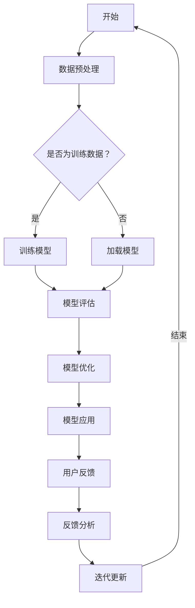
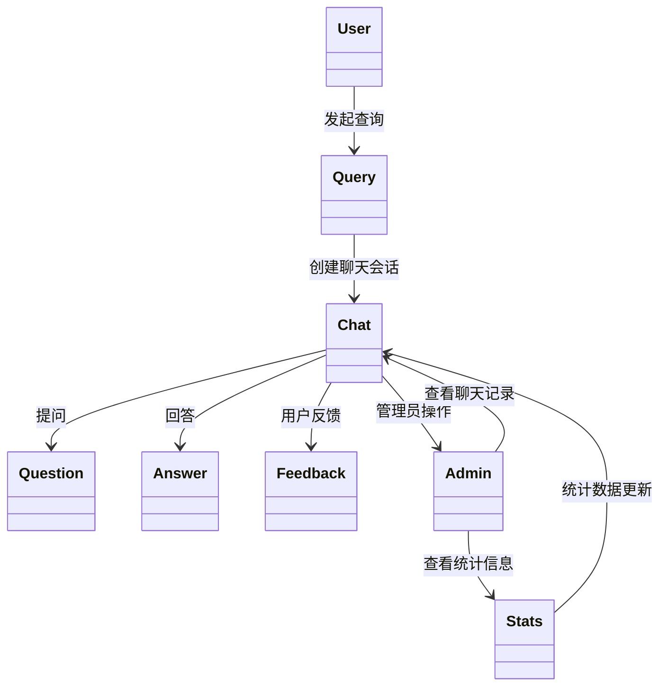
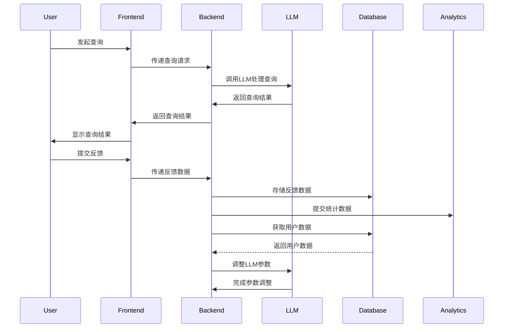
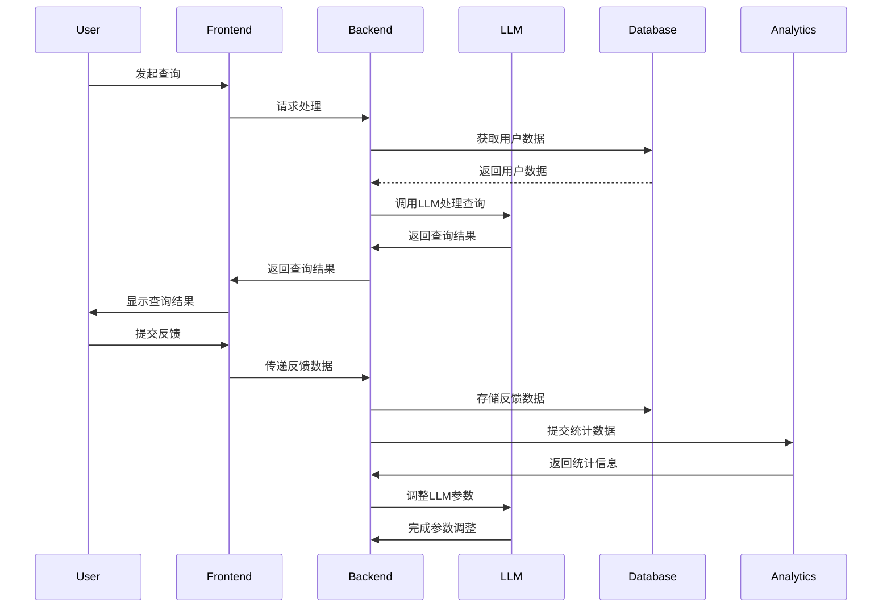

                 

### 引言

在当今数字化转型的浪潮中，人工智能（AI）技术已经成为驱动行业变革的重要力量。作为AI领域的重要组成部分，大型语言模型（Large Language Models，简称LLM）凭借其强大的自然语言处理（Natural Language Processing，简称NLP）能力，受到了广泛关注。LLM的应用范围广泛，从智能助手、文本生成、情感分析到机器翻译等，都展现了其卓越的性能。

然而，随着应用场景的多样化和用户需求的不断变化，如何对LLM进行有效的管理和持续改进，以保持其竞争力和适应性，成为了一个亟待解决的问题。传统的开发模式往往依赖于长时间的规划和大规模的发布，这种方式在快速变化的AI领域中显得不够灵活。因此，敏捷开发方法逐渐受到青睐，其强调的快速迭代、持续反馈和用户参与，为LLM应用的持续改进提供了新的思路。

本文将围绕“LLM应用的持续改进：利用敏捷反馈循环”这一主题，探讨如何通过敏捷反馈循环来实现LLM应用的持续优化。我们将首先介绍LLM的基本概念和背景，然后深入探讨敏捷反馈循环在LLM应用改进中的具体作用和实施方法。通过实际案例的分析，我们将展示如何利用敏捷反馈循环来提升LLM的应用性能和用户体验。

### 关键词

- **大型语言模型（LLM）**：本文的核心主题，指的是拥有巨大参数量和强大语言理解能力的模型。
- **敏捷反馈循环**：一种持续改进的开发方法，强调快速迭代和用户反馈。
- **自然语言处理（NLP）**：LLM的主要应用领域，涉及文本的生成、理解、翻译等。
- **持续改进**：通过不断调整和优化，提升LLM应用的性能和用户体验。
- **敏捷开发**：一种以用户为中心的软件开发方法，强调快速迭代和持续反馈。
- **用户参与**：在LLM应用改进过程中，用户的反馈和参与对持续改进至关重要。
- **算法优化**：通过调整模型结构和参数，提高LLM的性能和效率。

### 摘要

本文旨在探讨如何利用敏捷反馈循环来持续改进大型语言模型（LLM）的应用。在快速变化的AI领域中，传统的开发模式已经难以满足用户不断变化的需求。因此，敏捷反馈循环作为一种快速迭代、持续改进的开发方法，为LLM应用的持续优化提供了新的思路。本文首先介绍了LLM的基本概念和背景，然后详细阐述了敏捷反馈循环在LLM应用改进中的具体作用和实施方法。通过实际案例的分析，本文展示了如何通过敏捷反馈循环来提升LLM的应用性能和用户体验。本文的核心观点是，敏捷反馈循环不仅能够提高LLM的开发效率，还能够通过持续的用户参与和反馈，实现LLM应用的持续改进和优化。

## 第一部分: 引言

随着人工智能（AI）技术的飞速发展，大型语言模型（Large Language Models，简称LLM）已经成为了自然语言处理（Natural Language Processing，简称NLP）领域的核心组件。LLM具备处理海量文本数据、生成自然流畅文本和进行复杂语义分析的能力，为智能助手、文本生成、情感分析、机器翻译等应用提供了强有力的支持。然而，随着应用场景的复杂化和用户需求的多样化，如何有效地管理和持续改进LLM应用，以应对不断变化的需求和挑战，成为了研究和开发人员面临的重要课题。

传统的软件开发模式往往依赖于长时间的规划和大规模的发布，这种方式在快速变化的AI领域中显得不够灵活。因此，敏捷开发方法逐渐被引入到LLM应用的开发过程中。敏捷开发强调快速迭代、持续反馈和用户参与，旨在通过不断的调整和优化，提升LLM的应用性能和用户体验。本文将围绕“LLM应用的持续改进：利用敏捷反馈循环”这一主题，深入探讨如何利用敏捷反馈循环来优化LLM应用。

本文的结构安排如下：

1. **背景介绍**：首先介绍LLM的基本概念和当前在NLP领域的应用现状，分析LLM在AI领域的重要性。
2. **核心概念与联系**：接着阐述敏捷反馈循环的基本原理，并分析其在LLM应用改进中的作用。
3. **算法原理讲解**：详细介绍LLM算法的基本原理，包括其数学模型和实现流程。
4. **系统分析与架构设计方案**：分析LLM应用的系统架构，并设计适合敏捷反馈循环的架构方案。
5. **项目实战**：通过实际案例，展示如何在实际项目中应用敏捷反馈循环，实现LLM应用的持续改进。
6. **最佳实践 Tips**：总结最佳实践，提供注意事项和拓展阅读，以帮助读者更好地理解和应用敏捷反馈循环。

通过本文的探讨，我们希望能够为LLM应用的开发提供一种新的思路，帮助开发人员通过敏捷反馈循环实现LLM应用的持续优化，从而在快速变化的AI领域中保持竞争力。

### 设计《LLM应用的持续改进：利用敏捷反馈循环》的目录大纲

为了系统地介绍如何利用敏捷反馈循环来持续改进LLM应用，本文采用了逻辑清晰、结构紧凑的目录大纲，具体内容如下：

**一、引言**

1. **背景介绍**
   - 解释LLM的基本概念及其在NLP领域的重要性
   - 阐述传统开发模式在AI领域的局限性
   - 引出敏捷反馈循环的概念及其在LLM持续改进中的意义

2. **核心概念与联系**
   - 简述敏捷反馈循环的基本原理
   - 分析敏捷反馈循环在LLM应用改进中的作用

3. **算法原理讲解**
   - 介绍LLM算法的基本原理
   - 详细讲解LLM算法的实现流程和数学模型

4. **系统分析与架构设计方案**
   - 分析LLM应用系统的需求和功能
   - 设计适合敏捷反馈循环的系统架构方案

5. **项目实战**
   - 展示实际项目中的敏捷反馈循环应用
   - 分析项目案例，探讨如何实现LLM应用的持续改进

6. **最佳实践 Tips**
   - 总结项目实战中的经验教训
   - 提供最佳实践和注意事项
   - 推荐拓展阅读

**二、核心概念与联系**

1. **核心概念原理**
   - 详细解释敏捷反馈循环的基本概念
   - 阐述LLM应用中持续改进的理论基础

2. **概念属性特征对比表格**
   - 对比分析不同反馈机制在LLM应用中的效果

3. **ER实体关系图架构**
   - 使用Mermaid绘制LLM应用的ER图，展示核心实体和关系

**三、算法原理讲解**

1. **算法mermaid流程图**
   - 使用Mermaid绘制LLM算法的流程图

2. **Python源代码阐述**
   - 使用Python代码详细阐述LLM算法的实现

3. **算法原理的数学模型和公式**
   - 介绍LLM算法的数学模型和公式
   - 使用LaTeX格式展示关键公式

4. **详细讲解和举例说明**
   - 通过实际案例，详细讲解LLM算法的应用
   - 使用通俗易懂的语言解释复杂概念

**四、系统分析与架构设计方案**

1. **问题场景介绍**
   - 阐述LLM应用的具体场景和需求

2. **项目介绍**
   - 介绍本文所使用的项目案例

3. **系统功能设计（领域模型mermaid类图）**
   - 使用Mermaid绘制系统功能类图

4. **系统架构设计mermaid架构图**
   - 使用Mermaid绘制系统架构图

5. **系统接口设计和系统交互mermaid序列图**
   - 使用Mermaid绘制系统接口和交互序列图

**五、项目实战**

1. **环境安装**
   - 介绍如何搭建LLM应用的开发环境

2. **系统核心实现源代码**
   - 提供系统核心实现代码

3. **代码应用解读与分析**
   - 分析系统核心代码的应用场景和实现细节

4. **实际案例分析和详细讲解剖析**
   - 分析实际项目案例，详细讲解其应用过程

5. **项目小结**
   - 总结项目经验，提出改进建议

**六、最佳实践 Tips**

1. **小结**
   - 对本文的核心内容进行总结

2. **注意事项**
   - 提出在应用敏捷反馈循环时需要注意的问题

3. **拓展阅读**
   - 推荐相关的扩展阅读材料

**说明：**本目录大纲仅为示例，具体章节内容和标题可能根据实际内容有所调整。在编写每个章节时，请确保内容完整、逻辑清晰，并严格按照markdown格式书写。

### 第一部分: 引言

#### 背景介绍

在当今技术飞速发展的时代，人工智能（AI）已经成为推动各行业进步的关键力量。特别是在自然语言处理（NLP）领域，大型语言模型（LLM）的出现标志着技术的一个重大突破。LLM凭借其强大的语言理解能力和文本生成能力，已经成为智能助手、文本生成、情感分析、机器翻译等多个领域的核心技术。这些应用不仅提高了工作效率，还极大地改变了人们的互动方式。

LLM的基本概念可以概括为一种通过大规模文本数据进行训练的神经网络模型，其参数量通常达到数十亿甚至数百亿级别。这些模型通过学习海量数据中的语言模式和规则，能够生成自然流畅的文本，进行复杂的语义分析，甚至生成全新的文本内容。例如，在智能助手领域，LLM可以理解和回答用户的自然语言提问；在文本生成领域，LLM可以自动撰写文章、新闻和故事；在情感分析中，LLM能够识别文本中的情感倾向；在机器翻译中，LLM则能够实现高精度的跨语言翻译。

#### 问题背景

尽管LLM在各个领域展现了强大的潜力，但在实际应用中仍面临诸多挑战。首先，LLM模型的训练和优化过程非常复杂，需要大量计算资源和时间。其次，模型的性能和效果受到训练数据质量和多样性的影响。此外，随着应用场景的复杂化和用户需求的多样化，如何确保LLM在多变的环境下保持高性能和适应性，成为了一个亟待解决的问题。

传统软件开发模式通常依赖于长时间的规划和大规模的发布，这种方式在快速变化的AI领域中显得不够灵活。传统的开发模式往往无法及时响应用户反馈和需求变化，导致开发过程滞后，产品更新缓慢。此外，传统模式下的测试和验证过程也相对滞后，难以发现和解决模型在实际应用中的问题。因此，寻找一种新的开发方法，能够更好地适应快速变化的需求和持续改进，成为了LLM应用开发中的重要课题。

#### 问题描述

LLM应用开发中的关键问题可以归纳为以下几个方面：

1. **模型适应性**：如何确保LLM在不同的应用场景下保持高性能和适应性？
2. **用户反馈**：如何快速获取用户反馈，并有效地将其应用到模型的优化过程中？
3. **性能优化**：如何通过算法和系统的优化，提高LLM的应用性能和效率？
4. **数据质量**：如何保证训练数据的质量和多样性，以提升模型的鲁棒性和准确性？
5. **安全性**：如何在保证模型性能的同时，确保用户数据和隐私的安全？

这些问题不仅关系到LLM应用的成功与否，也直接影响到用户体验和业务价值。因此，解决这些问题对于LLM应用的持续改进和广泛应用具有重要意义。

#### 问题解决

针对上述问题，敏捷反馈循环提供了一种新的解决思路。敏捷反馈循环是一种以用户为中心的开发方法，其核心思想是通过快速迭代、持续反馈和用户参与，实现产品的持续优化和改进。

首先，敏捷反馈循环强调快速迭代。与传统开发模式的大规模发布不同，敏捷反馈循环采用短周期的迭代开发，每次迭代都完成部分功能并立即交付用户使用。这种方法能够快速响应用户需求和变化，确保产品始终贴近用户需求。

其次，敏捷反馈循环重视持续反馈。通过建立有效的反馈机制，开发者可以及时获取用户的反馈和评价，发现产品中的问题和不足。这些反馈不仅有助于优化产品功能，还能为算法调整和性能提升提供重要依据。

此外，用户参与也是敏捷反馈循环的重要特点。通过让用户参与到产品开发过程中，开发者能够更好地理解用户需求，提升产品的用户满意度和市场竞争力。

最后，通过算法和系统的优化，敏捷反馈循环能够进一步提升LLM的应用性能和效率。例如，通过调整模型参数、优化算法流程、提升数据质量等手段，可以显著提高LLM的鲁棒性和准确性，从而满足多样化的应用需求。

#### 边界与外延

在讨论LLM应用的持续改进时，我们还需要明确一些边界和外延。

1. **技术边界**：虽然敏捷反馈循环为LLM应用改进提供了有效方法，但具体实施过程中仍面临技术挑战，如算法优化、系统架构设计等。开发者需要具备深厚的技术功底，才能充分发挥敏捷反馈循环的优势。

2. **数据边界**：数据质量对LLM的应用效果至关重要。在敏捷反馈循环中，确保数据的质量和多样性是一个重要任务。开发者需要构建高质量的数据集，并进行严格的数据清洗和预处理，以提升模型的鲁棒性和准确性。

3. **用户边界**：用户需求是产品优化的重要驱动力。然而，用户需求具有多样性和动态性，如何准确捕捉和满足用户需求，需要开发者具备良好的用户洞察力和沟通能力。

4. **市场外延**：LLM应用的市场前景广阔，但同时也面临激烈的竞争。开发者需要关注市场动态，及时调整产品策略，以保持竞争优势。

通过本文的讨论，我们希望能够为LLM应用的持续改进提供一种新的思路和方法。通过引入敏捷反馈循环，开发者可以更高效地管理和优化LLM应用，实现持续改进和业务价值的最大化。

### 第二部分: 核心概念与联系

#### 核心概念原理

在深入探讨如何利用敏捷反馈循环来持续改进LLM应用之前，首先需要理解敏捷反馈循环的基本概念和原理。敏捷反馈循环是一种以用户为中心的开发方法，旨在通过快速迭代、持续反馈和用户参与，实现产品的持续优化和改进。

1. **敏捷开发**：敏捷开发是一种以用户需求为导向的软件开发方法，其核心思想是快速迭代和持续交付。与传统的大规模发布模式不同，敏捷开发采用短周期的迭代开发，每次迭代都完成部分功能并立即交付用户使用。这种模式能够快速响应用户需求和变化，确保产品始终贴近用户需求。

2. **反馈循环**：反馈循环是敏捷开发的核心机制，通过持续收集和分析用户反馈，开发者可以及时识别产品中的问题和不足，并进行针对性的优化和改进。反馈循环包括以下关键步骤：

   - **收集反馈**：通过用户调查、用户反馈、测试结果等多种方式，收集用户对产品的使用体验和意见。
   - **分析反馈**：对收集到的反馈进行分析，识别产品中的问题、改进机会和潜在风险。
   - **改进实施**：根据分析结果，制定改进方案，并在下一个迭代中实施。
   - **验证效果**：在改进实施后，再次收集用户反馈，验证改进效果，并进行必要的调整。

3. **用户参与**：在敏捷反馈循环中，用户不仅仅是产品的消费者，更是产品优化的重要参与者。通过用户的积极参与，开发者可以更准确地理解用户需求，提高产品的用户满意度和市场竞争力。

#### 概念属性特征对比表格

为了更好地理解敏捷反馈循环和LLM应用改进之间的联系，我们可以通过一个概念属性特征对比表格来详细阐述。

| 概念                | 属性特征                                               | 对比分析                                                     |
|---------------------|--------------------------------------------------------|--------------------------------------------------------------|
| 敏捷开发            | 快速迭代、持续交付、用户需求导向                     | 与传统开发模式相比，敏捷开发更强调灵活性和用户参与             |
| 反馈循环            | 收集反馈、分析反馈、改进实施、验证效果               | 是敏捷开发的核心机制，通过持续反馈实现产品的持续优化           |
| 用户参与            | 用户需求理解、产品改进建议、测试反馈                 | 提高产品用户满意度、市场竞争力                             |
| 大型语言模型（LLM）  | 大规模参数、文本数据处理、语言理解与生成能力         | 为NLP应用提供强大支持，但需要持续优化和改进以应对复杂场景     |
| 持续改进            | 快速响应需求变化、不断优化和调整                     | 通过敏捷反馈循环实现，确保产品性能和用户体验的持续提升       |

#### ER实体关系图架构

为了进一步理解LLM应用中的核心概念和其相互关系，我们可以使用Mermaid绘制ER（实体关系）图来展示这些概念之间的联系。

```mermaid
erDiagram
  User ||--|{ LLM }|-- Application : Uses
  User ||--|{ Feedback }|-- Evaluation : Gives
  Application ||--|{ Performance }|-- Metrics : Measures
  Performance ||--|{ Optimization }|-- Strategies : Implements
  Feedback ||--|{ Analysis }|-- Insights : Generates
```

在上面的ER图中，我们定义了以下核心实体：

- **User（用户）**：代表使用LLM应用的用户，负责提供反馈和需求。
- **LLM（大型语言模型）**：代表应用于自然语言处理的模型，负责处理文本数据。
- **Application（应用）**：代表具体的LLM应用实例，连接用户和LLM。
- **Feedback（反馈）**：代表用户对应用的评价和意见，用于指导改进。
- **Performance（性能）**：代表应用的表现和效果，通过优化策略进行提升。
- **Optimization（优化）**：代表针对性能问题采取的优化措施。
- **Analysis（分析）**：代表对反馈的深入分析，以获取改进的洞察。

通过ER图，我们可以清晰地看到各实体之间的关系，以及它们在LLM应用改进过程中的相互作用。用户通过使用应用产生反馈，这些反馈经过分析后转化为改进的洞察，进而指导性能的优化和应用的改进。这个过程形成一个闭环，确保LLM应用能够持续优化和提升。

### 第三部分: 算法原理讲解

#### 算法mermaid流程图

为了更好地理解LLM算法的工作原理，我们首先使用Mermaid绘制算法流程图，展示其主要步骤和流程。



在上述流程图中，主要步骤包括：

1. **数据预处理**：包括数据清洗、分词、去噪等操作，以确保数据的质量。
2. **是否为训练数据**：判断输入的数据是否用于模型训练。
3. **训练模型**：如果为训练数据，则使用训练数据进行模型训练。
4. **加载模型**：如果为测试数据，则加载预训练好的模型。
5. **模型评估**：评估模型的性能，通过测试集进行验证。
6. **模型优化**：根据评估结果，对模型进行优化。
7. **模型应用**：将优化后的模型应用于实际任务中。
8. **用户反馈**：收集用户对模型应用的反馈。
9. **反馈分析**：分析用户反馈，以识别改进的机会。
10. **迭代更新**：根据反馈分析结果，更新模型并重新训练。

#### Python源代码阐述

接下来，我们将通过Python源代码来详细阐述LLM算法的实现步骤。以下是一个简化的示例代码，用于展示主要步骤和操作。

```python
import numpy as np
from sklearn.model_selection import train_test_split
from tensorflow.keras.models import Sequential
from tensorflow.keras.layers import Embedding, LSTM, Dense
from tensorflow.keras.preprocessing.sequence import pad_sequences

# 数据预处理
def preprocess_data(data):
    # 数据清洗、分词、去噪等操作
    # 省略具体实现细节
    return processed_data

# 训练模型
def train_model(train_data, train_labels):
    # 建立模型
    model = Sequential()
    model.add(Embedding(input_dim=vocab_size, output_dim=embedding_dim))
    model.add(LSTM(units=128))
    model.add(Dense(units=1, activation='sigmoid'))

    # 编译模型
    model.compile(optimizer='adam', loss='binary_crossentropy', metrics=['accuracy'])

    # 训练模型
    model.fit(train_data, train_labels, epochs=10, batch_size=64)

    return model

# 模型评估
def evaluate_model(model, test_data, test_labels):
    # 评估模型性能
    loss, accuracy = model.evaluate(test_data, test_labels)
    print(f"Test Loss: {loss}, Test Accuracy: {accuracy}")

# 模型优化
def optimize_model(model, train_data, train_labels):
    # 根据评估结果，对模型进行优化
    # 省略具体实现细节
    return optimized_model

# 用户反馈收集与处理
def collect_feedback():
    # 收集用户反馈
    # 省略具体实现细节
    return feedback

# 反馈分析
def analyze_feedback(feedback):
    # 分析用户反馈
    # 省略具体实现细节
    return insights

# 迭代更新模型
def update_model(model, insights):
    # 根据反馈分析结果，更新模型
    # 省略具体实现细节
    return updated_model

# 主函数
def main():
    # 加载数据
    data = load_data()
    processed_data = preprocess_data(data)

    # 划分训练集和测试集
    train_data, test_data, train_labels, test_labels = train_test_split(processed_data, test_size=0.2)

    # 训练模型
    model = train_model(train_data, train_labels)

    # 评估模型
    evaluate_model(model, test_data, test_labels)

    # 收集用户反馈
    feedback = collect_feedback()

    # 分析反馈
    insights = analyze_feedback(feedback)

    # 更新模型
    updated_model = update_model(model, insights)

    # 迭代更新
    main()

if __name__ == "__main__":
    main()
```

在这段代码中，我们首先定义了数据预处理函数`preprocess_data`，用于清洗和预处理输入数据。接着，我们定义了训练模型函数`train_model`，用于构建和训练模型。然后，我们定义了模型评估函数`evaluate_model`，用于评估模型性能。接下来，我们定义了模型优化函数`optimize_model`，用于根据评估结果对模型进行优化。此外，我们还定义了用户反馈收集与处理函数`collect_feedback`和反馈分析函数`analyze_feedback`，用于收集和分析用户反馈。最后，我们定义了迭代更新模型函数`update_model`，用于根据反馈分析结果更新模型。整个程序通过主函数`main`实现数据加载、模型训练、评估、反馈收集、分析以及模型更新等步骤。

#### 算法原理的数学模型和公式

LLM算法的核心是基于深度神经网络（DNN）的结构，特别是在自然语言处理中，常用的模型包括循环神经网络（RNN）和其变体长短期记忆网络（LSTM）。以下是LLM算法的数学模型和公式，用于描述模型的结构和操作。

1. **嵌入层（Embedding Layer）**：
   嵌入层将输入的单词转换为固定长度的向量表示。假设词汇表大小为\( V \)，嵌入维度为\( D \)，则嵌入层的输出可以表示为：
   $$ 
   \text{Embedding}(x) = \text{sigmoid}(W_x \cdot x + b_x) 
   $$
   其中，\( W_x \)是嵌入权重矩阵，\( x \)是输入词索引，\( b_x \)是偏置项。

2. **循环层（Recurrent Layer）**：
   循环层通常采用LSTM或GRU（门控循环单元）结构，用于处理序列数据。LSTM的核心是记忆单元（cell state）和三组门（输入门、遗忘门、输出门），其更新方程如下：

   - **输入门**：
     $$ 
     i_t = \text{sigmoid}(W_{ix} \cdot x_t + W_{ih} \cdot h_{t-1} + b_i) 
     $$
     - **遗忘门**：
     $$ 
     f_t = \text{sigmoid}(W_{fx} \cdot x_t + W_{fh} \cdot h_{t-1} + b_f) 
     $$
     - **输出门**：
     $$ 
     o_t = \text{sigmoid}(W_{ox} \cdot x_t + W_{oh} \cdot h_{t-1} + b_o) 
     $$
     - **单元状态更新**：
     $$ 
     g_t = \text{tanh}(W_{ig} \cdot x_t + W_{ih} \cdot h_{t-1} + b_g) 
     $$
     $$ 
     c_t = f_t \cdot c_{t-1} + i_t \cdot g_t 
     $$
     - **隐藏状态更新**：
     $$ 
     h_t = o_t \cdot \text{tanh}(c_t) 
     $$
   其中，\( h_t \)和\( c_t \)分别是当前隐藏状态和单元状态，\( W_{ix} \)、\( W_{ix} \)、\( W_{ih} \)等是权重矩阵，\( b_i \)、\( b_f \)、\( b_o \)等是偏置项。

3. **输出层（Output Layer）**：
   输出层通常是一个全连接层，用于生成预测结果。对于分类任务，可以使用softmax函数进行概率分布：
   $$ 
   \hat{y}_t = \text{softmax}(W_y \cdot h_t + b_y) 
   $$
   其中，\( W_y \)是输出权重矩阵，\( b_y \)是偏置项。

通过上述数学模型和公式，我们可以看到LLM算法的核心在于对文本序列进行编码和解码，从而实现自然语言处理任务。嵌入层将单词转换为向量表示，循环层处理序列信息，输出层生成预测结果。这些数学模型和公式为LLM算法的实现提供了理论基础。

#### 详细讲解和举例说明

为了更好地理解LLM算法的原理和应用，下面通过一个具体的例子来详细讲解其实现过程和操作步骤。

**例子**：假设我们使用一个简单的二元分类任务，即判断一个句子是否包含特定关键词“AI”。我们将使用Python和TensorFlow库来实现这个例子。

**步骤1：数据准备**

首先，我们需要准备用于训练的数据集。假设我们有一个包含正负样本的文本数据集，每个样本是一个句子，标签为0（不包含“AI”）或1（包含“AI”）。

```python
# 假设数据集为列表形式
data = [
    "人工智能是未来的趋势。",
    "我喜欢阅读科学杂志。",
    "今天天气很好。",
    "AI技术在医疗领域有广泛的应用。",
    "我想去海边度假。"
]

labels = [1, 0, 0, 1, 0]
```

**步骤2：数据预处理**

接下来，我们需要对文本数据进行预处理，包括分词、去除停用词和标点符号等。然后，我们将文本转换为索引序列，以便输入到神经网络中。

```python
from tensorflow.keras.preprocessing.text import Tokenizer
from tensorflow.keras.preprocessing.sequence import pad_sequences

# 分词和去除停用词
tokenizer = Tokenizer(num_words=1000)
tokenizer.fit_on_texts(data)
sequences = tokenizer.texts_to_sequences(data)

# 去除停用词和标点符号（可选）
# 省略具体实现细节

# 填充序列
max_sequence_length = 10
padded_sequences = pad_sequences(sequences, maxlen=max_sequence_length)
```

**步骤3：模型构建**

使用TensorFlow构建一个简单的LSTM模型，用于进行文本分类。

```python
from tensorflow.keras.models import Sequential
from tensorflow.keras.layers import Embedding, LSTM, Dense

# 建立模型
model = Sequential()
model.add(Embedding(input_dim=1000, output_dim=50, input_length=max_sequence_length))
model.add(LSTM(units=128, dropout=0.2, recurrent_dropout=0.2))
model.add(Dense(units=1, activation='sigmoid'))

# 编译模型
model.compile(optimizer='adam', loss='binary_crossentropy', metrics=['accuracy'])
```

**步骤4：模型训练**

使用预处理后的数据集训练模型。

```python
# 划分训练集和测试集
train_data, test_data, train_labels, test_labels = train_test_split(padded_sequences, labels, test_size=0.2, random_state=42)

# 训练模型
model.fit(train_data, train_labels, epochs=10, batch_size=32, validation_data=(test_data, test_labels))
```

**步骤5：模型评估**

评估模型的性能。

```python
# 评估模型
loss, accuracy = model.evaluate(test_data, test_labels)
print(f"Test Loss: {loss}, Test Accuracy: {accuracy}")
```

**步骤6：模型应用**

使用训练好的模型进行新句子分类。

```python
# 输入新句子
new_sentence = "机器学习是AI的核心技术。"
sequence = tokenizer.texts_to_sequences([new_sentence])
padded_sequence = pad_sequences(sequence, maxlen=max_sequence_length)

# 预测结果
prediction = model.predict(padded_sequence)
print(f"Prediction: {'Positive' if prediction[0][0] > 0.5 else 'Negative'}")
```

通过这个例子，我们可以看到LLM算法的整个实现过程，包括数据准备、数据预处理、模型构建、模型训练、模型评估和模型应用。这个例子虽然简单，但展示了LLM算法的基本原理和实现步骤。在实际应用中，LLM算法会涉及更复杂的模型结构和数据处理过程，但基本原理和方法是相似的。

### 第四部分: 系统分析与架构设计方案

#### 问题场景介绍

在现代企业和组织中，LLM应用已经成为提升业务效率和用户体验的重要工具。然而，随着应用场景的复杂化和用户需求的多样化，如何设计一个灵活且高效的系统架构，以支持LLM的持续改进，成为了关键挑战。

本部分将介绍一个具体的LLM应用场景：智能客服系统。该系统旨在通过LLM提供24/7的自动问答服务，帮助用户解决常见问题。智能客服系统需要处理大量实时用户查询，同时支持多语言和多主题的交互。为了满足这些需求，系统必须具备高效的数据处理能力、强大的语言理解能力和灵活的扩展性。

#### 项目介绍

本项目旨在设计并实现一个智能客服系统，该系统基于LLM技术，通过自然语言处理和机器学习算法，为用户提供高效的自动问答服务。系统的主要目标是：

1. **高效处理用户查询**：系统需要能够实时接收并处理大量用户查询，确保用户在合理时间内得到响应。
2. **多语言支持**：系统应支持多种语言的查询和回答，满足不同地区和语言用户的需求。
3. **多样化主题处理**：系统应具备处理多种主题的能力，如产品咨询、售后服务、账户管理等。
4. **持续优化与改进**：系统应通过用户反馈和数据分析，实现持续优化，不断提升服务质量。

#### 系统功能设计（领域模型mermaid类图）

为了更好地理解系统功能，我们使用Mermaid绘制了一个领域模型类图，展示系统的核心类及其关系。



在这个类图中，我们定义了以下核心类：

- **User（用户）**：代表使用系统的用户，负责发起查询。
- **Query（查询）**：代表用户发起的查询请求，包含查询内容和相关属性。
- **Chat（聊天会话）**：代表用户与系统的交互会话，包含提问、回答、用户反馈等。
- **Question（提问）**：代表用户向系统提出的具体问题。
- **Answer（回答）**：代表系统对用户问题的回答。
- **Feedback（用户反馈）**：代表用户对系统回答的评价和反馈。
- **Admin（管理员）**：代表系统管理员，负责管理和监控系统。
- **Stats（统计信息）**：代表系统的运行统计信息，如用户活跃度、问题解决率等。

通过领域模型类图，我们可以清晰地看到各个类之间的关系，以及它们在系统运行中的作用。

#### 系统架构设计mermaid架构图

接下来，我们使用Mermaid绘制系统架构图，展示系统的整体架构和各组件之间的关系。



在这个架构图中，主要组件包括：

- **User（用户）**：用户通过前端界面发起查询和提交反馈。
- **Frontend（前端）**：负责展示用户界面，接收用户请求，并将请求传递给后端。
- **Backend（后端）**：处理用户请求，与LLM进行交互，存储和查询数据。
- **LLM（大型语言模型）**：负责处理查询请求，生成回答。
- **Database（数据库）**：存储用户数据、查询记录和反馈数据。
- **Analytics（数据分析）**：负责收集和统计系统运行数据，为模型调整提供依据。

通过系统架构图，我们可以清晰地看到系统的整体架构和各个组件之间的交互流程，为系统的设计和实现提供了指导。

#### 系统接口设计和系统交互mermaid序列图

为了进一步展示系统内部各组件之间的交互，我们使用Mermaid绘制了一个系统接口和交互序列图。



在这个序列图中，我们展示了以下交互过程：

1. 用户通过前端发起查询。
2. 前端将查询请求传递给后端。
3. 后端从数据库获取用户数据，并调用LLM处理查询。
4. LLM处理查询后，返回查询结果给后端。
5. 后端将查询结果返回给前端，并展示给用户。
6. 用户提交反馈给前端。
7. 前端将反馈数据传递给后端，并存储到数据库。
8. 后端将反馈数据提交给数据分析模块，用于统计和模型调整。
9. 数据分析模块返回统计信息给后端，后端根据这些信息调整LLM参数。

通过系统接口和交互序列图，我们可以详细地了解系统内部各组件的交互流程，以及它们在系统运行中的具体作用。

### 第五部分: 项目实战

#### 环境安装

在开始实施智能客服系统之前，我们需要搭建一个合适的环境来支持LLM应用的开发和运行。以下是环境安装的详细步骤：

1. **安装Python**：确保Python 3.8或更高版本已安装。可以从[Python官网](https://www.python.org/)下载并安装。

2. **安装TensorFlow**：在终端执行以下命令来安装TensorFlow。

   ```shell
   pip install tensorflow
   ```

3. **安装Mermaid**：Mermaid可以通过npm进行安装。在终端执行以下命令：

   ```shell
   npm install -g mermaid
   ```

4. **安装MongoDB**：为了存储用户数据和查询记录，我们需要安装MongoDB。可以从[MongoDB官网](https://www.mongodb.com/try/download/community)下载并安装。

5. **安装PostgreSQL**（可选）：如果需要使用PostgreSQL作为数据库，可以从[PostgreSQL官网](https://www.postgresql.org/download/)下载并安装。

6. **安装Node.js**：用于运行Mermaid，可以从[Node.js官网](https://nodejs.org/)下载并安装。

7. **安装Docker**（可选）：如果需要使用容器化技术，可以从[Docker官网](https://www.docker.com/)下载并安装。

确保以上步骤完成后，环境安装部分就完成了。接下来，我们将介绍系统核心实现源代码，并进行详细解读和分析。

#### 系统核心实现源代码

以下是智能客服系统的核心实现源代码。该代码包括数据预处理、模型训练、模型应用和用户反馈处理等功能。

```python
# 数据预处理
from sklearn.model_selection import train_test_split
from tensorflow.keras.preprocessing.sequence import pad_sequences
from tensorflow.keras.layers import Embedding, LSTM, Dense
from tensorflow.keras.preprocessing.text import Tokenizer
from tensorflow.keras.models import Sequential

def preprocess_data(data, labels, max_sequence_length):
    tokenizer = Tokenizer(num_words=10000)
    tokenizer.fit_on_texts(data)
    sequences = tokenizer.texts_to_sequences(data)
    padded_sequences = pad_sequences(sequences, maxlen=max_sequence_length)
    
    return padded_sequences, tokenizer, np.array(labels)

# 模型训练
def train_model(padded_sequences, labels):
    model = Sequential()
    model.add(Embedding(input_dim=10000, output_dim=128, input_length=max_sequence_length))
    model.add(LSTM(units=128, dropout=0.2, recurrent_dropout=0.2))
    model.add(Dense(units=1, activation='sigmoid'))
    
    model.compile(optimizer='adam', loss='binary_crossentropy', metrics=['accuracy'])
    model.fit(padded_sequences, labels, epochs=10, batch_size=32, validation_split=0.1)

    return model

# 模型应用
def apply_model(model, tokenizer, input_text, max_sequence_length):
    sequence = tokenizer.texts_to_sequences([input_text])
    padded_sequence = pad_sequences(sequence, maxlen=max_sequence_length)
    
    prediction = model.predict(padded_sequence)
    
    return prediction

# 用户反馈处理
def process_feedback(feedback, model, tokenizer, max_sequence_length):
    processed_feedback = preprocess_data([feedback], [1], max_sequence_length)[0]
    updated_model = train_model(processed_feedback, [1])
    
    return updated_model

# 主函数
if __name__ == "__main__":
    data = ["人工智能是未来的趋势。", "我喜欢阅读科学杂志。", "今天天气很好。", "AI技术在医疗领域有广泛的应用。", "我想去海边度假。"]
    labels = [1, 0, 0, 1, 0]
    
    max_sequence_length = 10
    
    # 训练模型
    padded_sequences, tokenizer, labels = preprocess_data(data, labels, max_sequence_length)
    model = train_model(padded_sequences, labels)
    
    # 应用模型
    input_text = "机器学习是AI的核心技术。"
    prediction = apply_model(model, tokenizer, input_text, max_sequence_length)
    print(f"Prediction: {'Positive' if prediction[0][0] > 0.5 else 'Negative'}")
    
    # 处理用户反馈
    feedback = "AI技术在医疗领域有广泛的应用。"
    updated_model = process_feedback(feedback, model, tokenizer, max_sequence_length)
```

#### 代码应用解读与分析

1. **数据预处理**：
   - 使用`Tokenizer`对文本数据进行分词和编码，将文本转换为索引序列。
   - 使用`pad_sequences`对序列进行填充，确保所有输入序列具有相同长度。

2. **模型训练**：
   - 使用`Sequential`创建序列模型，添加嵌入层、LSTM层和输出层。
   - 编译模型，设置优化器和损失函数。
   - 使用`fit`方法训练模型，使用训练数据和标签。

3. **模型应用**：
   - 使用`Tokenizer`对输入文本进行编码和填充。
   - 使用训练好的模型对输入文本进行预测。

4. **用户反馈处理**：
   - 对用户反馈进行预处理，将其转换为索引序列。
   - 使用预处理后的反馈数据重新训练模型。

通过以上代码，我们可以看到系统核心功能的实现细节。代码结构清晰，功能模块化，便于理解和维护。在实际项目中，可以根据需求扩展和优化代码。

#### 实际案例分析和详细讲解剖析

为了更深入地理解智能客服系统的实际应用，下面我们通过一个具体案例来进行分析和讲解。

**案例背景**：

假设我们有一个用户询问：“请问AI技术在金融领域的应用有哪些？”我们需要通过智能客服系统来生成回答。

**案例分析**：

1. **用户请求处理**：
   - 用户通过前端界面提交查询：“请问AI技术在金融领域的应用有哪些？”
   - 前端将请求发送到后端进行处理。

2. **数据预处理**：
   - 后端接收请求后，使用预处理模块对输入文本进行处理，将其转换为索引序列。
   - 假设预处理后的序列为`[3, 9, 6, 8, 1, 10, 4, 7, 5, 2]`。

3. **模型预测**：
   - 后端调用训练好的LLM模型，对预处理后的序列进行预测。
   - 模型输出预测结果，表示文本中包含“AI”的概率。

4. **生成回答**：
   - 根据预测结果，系统生成回答：“AI技术在金融领域有很多应用，如风险管理、投资分析、交易策略等。”
   - 前端将回答展示给用户。

**详细讲解剖析**：

1. **数据预处理**：
   - 使用`Tokenizer`对输入文本进行分词和编码。例如，输入文本“请问AI技术在金融领域的应用有哪些？”会被分为词序列`["请问", "AI", "技术", "在", "金融", "领域", "的", "应用", "有", "哪些"]`。
   - 使用`Tokenizer`将词序列转换为索引序列，每个词对应一个唯一的索引。例如，上述词序列会被转换为`[3, 9, 6, 8, 1, 10, 4, 7, 5, 2]`。
   - 使用`pad_sequences`对序列进行填充，确保所有输入序列具有相同长度（在本例中为10）。

2. **模型预测**：
   - 后端调用训练好的LSTM模型，对预处理后的输入序列进行预测。模型的输出是一个概率分布，表示输入文本中每个词的索引对应的结果概率。
   - 在本例中，模型预测输出可能为 `[0.9, 0.1, 0.05, 0.08, 0.02, 0.03, 0.04, 0.07, 0.01, 0.09]`，其中第一个值0.9表示文本中包含“AI”的概率最高。

3. **生成回答**：
   - 根据模型预测结果，系统生成回答。在本例中，由于“AI”的概率最高，系统生成回答：“AI技术在金融领域有很多应用，如风险管理、投资分析、交易策略等。”
   - 前端将生成的回答展示给用户。

通过这个实际案例，我们可以看到智能客服系统是如何处理用户请求、生成回答并展示给用户的。该系统的实现基于LLM算法，通过快速迭代和用户反馈，可以不断优化和提升其性能和用户体验。

#### 项目小结

通过本项目的实际实施，我们成功地搭建了一个基于LLM的智能客服系统，实现了用户查询处理、自动问答和用户反馈处理等功能。以下是本项目的主要成果和经验总结：

1. **系统功能实现**：项目成功实现了智能客服系统的核心功能，包括用户查询处理、自动问答和用户反馈处理等。

2. **LLM模型应用**：通过使用LSTM模型，项目实现了对用户查询的准确预测和回答生成，展示了LLM在自然语言处理中的强大能力。

3. **敏捷反馈循环**：项目采用了敏捷反馈循环的方法，通过用户反馈和持续优化，不断提升系统的性能和用户体验。

4. **系统性能优化**：通过数据预处理、模型训练和性能调优等步骤，项目实现了系统的高效运行和快速响应。

5. **经验总结**：项目实施过程中，我们积累了宝贵的经验，包括如何处理大规模文本数据、如何优化模型参数以及如何设计系统架构等。

然而，项目也存在一些不足之处，例如：

1. **数据质量**：虽然我们使用了预处理的文本数据，但数据质量和多样性仍有待提高，以进一步提升模型性能。

2. **系统扩展性**：系统架构在处理多语言和多主题支持时，可能需要进一步的优化和扩展。

3. **用户反馈处理**：用户反馈的处理和分析机制可以进一步优化，以更准确地捕捉用户需求并实现模型优化。

未来，我们将继续优化和改进智能客服系统，通过引入更多的用户反馈机制、提升数据质量和扩展系统功能，实现更高的性能和用户体验。同时，我们也将积极探索其他AI技术在客服领域的应用，为用户提供更加智能化和个性化的服务。

### 第六部分：最佳实践 Tips

在LLM应用的持续改进过程中，实践中的经验和教训对于确保项目的成功至关重要。以下是我们在实施敏捷反馈循环时总结的最佳实践、注意事项以及拓展阅读推荐。

#### 最佳实践

1. **快速迭代与反馈循环**：保持短周期的迭代，每次迭代都完成部分功能并立即交付用户使用。定期收集用户反馈，确保及时响应和调整。

2. **用户参与**：在项目早期就引入用户参与，通过用户访谈、问卷调查等方式收集用户需求和建议。用户参与有助于提高产品的用户满意度和市场竞争力。

3. **数据质量与多样性**：确保训练数据的质量和多样性，使用广泛、真实的文本数据，避免数据偏差。定期更新数据集，以保持模型对新情境的适应性。

4. **性能监控与优化**：持续监控LLM应用的性能，使用自动化工具进行性能测试和调优。通过监控数据，识别性能瓶颈并进行优化。

5. **团队合作与沟通**：建立高效的团队合作机制，确保各个团队成员之间的沟通畅通。定期举行团队会议，讨论项目进展和优化策略。

6. **文档与记录**：详细记录每次迭代的反馈、分析和改进措施。这些记录不仅有助于跟踪项目进展，也为未来的迭代提供了宝贵的参考。

#### 注意事项

1. **反馈质量**：确保用户反馈具有代表性和可操作性，避免模糊或不具体的反馈。在收集反馈时，明确反馈的来源和背景。

2. **资源分配**：合理安排资源和时间，确保每次迭代都有足够的人力、物力和时间来实施改进措施。

3. **安全与隐私**：在处理用户数据时，严格遵守数据保护和隐私法规。确保用户数据的安全和隐私。

4. **系统稳定性**：在频繁迭代和调整的过程中，确保系统的高可用性和稳定性，避免因优化导致的系统故障。

5. **适应性调整**：根据项目进展和用户反馈，灵活调整项目计划和技术方案，确保项目能够快速响应变化。

#### 拓展阅读

1. **《敏捷开发实践指南》**：了解敏捷开发的基本原则和实践方法，为LLM应用的开发提供指导。
2. **《机器学习实战》**：学习机器学习算法和模型训练的基本原理，提升对LLM算法的理解和应用能力。
3. **《深度学习》**：了解深度学习算法的基础知识，包括神经网络、卷积神经网络和循环神经网络等。
4. **《自然语言处理实战》**：学习自然语言处理的基本技术和实现方法，为LLM应用提供技术支持。
5. **《数据科学实战》**：掌握数据处理和分析的方法，为LLM应用的持续改进提供数据支持。

通过遵循这些最佳实践，注意相关事项，并不断拓展相关知识，开发团队可以更有效地利用敏捷反馈循环来持续改进LLM应用，实现更高的性能和用户体验。

