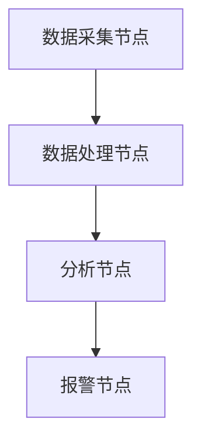

                 

### 引言

#### LLM连续监控的重要性

随着人工智能技术的飞速发展，LLM（大型语言模型）在自然语言处理、机器翻译、问答系统等领域发挥着越来越重要的作用。LLM的高效性能和强大能力使得它们广泛应用于各种实际场景中。然而，LLM在运行过程中面临着许多挑战，如数据量大、模型复杂、实时性要求高等。为了确保LLM系统的稳定性和可靠性，对其进行连续监控变得至关重要。

LLM连续监控的目的是实时监测系统健康状况，及时发现潜在问题，并提供实时反馈，以便进行相应的调整和优化。通过连续监控，我们可以确保系统在高负载、高并发情况下依然能够稳定运行，从而提升用户体验。

#### LLM连续监控的核心问题

1. **实时性要求**：LLM应用通常需要快速响应，因此在监控过程中需要保证实时性，及时捕捉系统状态的变化。

2. **数据量大**：LLM应用涉及大量数据，包括输入数据、输出数据以及系统运行时的中间数据。如何高效处理这些数据是一个重要问题。

3. **模型复杂性**：LLM模型结构复杂，涉及到多种神经网络结构、参数调优等。监控过程中需要关注模型的状态，如参数变化、性能指标等。

4. **精准性与实时性的平衡**：在监控过程中，我们需要在精准性和实时性之间找到平衡点，既要确保监控数据的准确性，又要保证实时性。

#### LLM连续监控的应用场景

1. **自然语言处理应用**：例如，机器翻译、问答系统、文本分类等。在这些应用中，连续监控可以帮助我们确保翻译质量、回答准确性等。

2. **在线教育平台**：例如，智能辅导系统、在线评测系统等。这些系统需要实时监控学生的学习状态、回答问题的情况等，以便提供个性化辅导。

3. **智能客服系统**：例如，机器人客服、智能客服机器人等。这些系统需要实时处理用户咨询，连续监控系统的响应速度、准确性等。

4. **金融领域**：例如，智能投顾、金融风控等。这些系统需要实时分析市场数据、用户行为等，以便做出快速决策。

### 小结

在本章中，我们介绍了LLM连续监控的重要性、核心问题以及应用场景。在接下来的章节中，我们将深入探讨LLM的基础知识、监控面临的挑战、监控方法和工具、实时洞察与数据分析、系统健康状态检测等内容。通过逐步分析，我们将为读者呈现一个全面、系统的LLM连续监控解决方案。

----------------------------------------------------------------

# LLM Applications Continuous Monitoring: Real-time Insights into System Health Status

关键词：LLM连续监控，实时性，数据量，模型复杂性，系统健康状况

摘要：本文深入探讨了LLM（大型语言模型）应用中的连续监控问题，包括实时性要求、数据量大、模型复杂性和精准性与实时性的平衡等挑战。通过介绍LLM的基础知识、监控方法与工具、实时洞察与数据分析，以及系统健康状态检测，本文为读者呈现了一个全面、系统的LLM连续监控解决方案。

----------------------------------------------------------------

## 第一部分: 引言

### 第1章: LLM连续监控概述

#### 1.1 LLM连续监控的重要性

#### 1.2 LLM连续监控的核心问题

#### 1.3 LLM连续监控的应用场景

----------------------------------------------------------------

### 第1章: LLM连续监控概述

#### 1.1 LLM连续监控的重要性

LLM（大型语言模型）作为一种先进的自然语言处理技术，已经在诸多领域取得了显著的应用成果。然而，随着LLM应用规模的不断扩大，系统的稳定性、可靠性以及实时性成为关键问题。为了确保LLM系统在复杂、多变的实际场景中保持高效运行，对其进行连续监控变得尤为重要。

LLM连续监控的重要性主要体现在以下几个方面：

1. **确保系统稳定性**：通过实时监测系统运行状态，可以及时发现并处理潜在问题，确保系统稳定运行。

2. **提升用户体验**：实时监控有助于提高系统的响应速度和准确性，从而提升用户满意度。

3. **优化系统性能**：通过对监控数据的分析，可以找出系统性能瓶颈，进行针对性优化，提升整体性能。

4. **安全防护**：连续监控有助于发现系统漏洞、异常行为，提供安全防护。

#### 1.2 LLM连续监控的核心问题

在LLM连续监控过程中，面临着一系列核心问题，主要包括：

1. **实时性要求**：LLM应用通常需要快速响应，实时性成为监控的关键因素。

2. **数据量大**：LLM应用涉及大量数据，如何高效处理这些数据成为一大挑战。

3. **模型复杂性**：LLM模型结构复杂，涉及多种神经网络结构、参数调优等，监控过程中需要关注模型状态。

4. **精准性与实时性的平衡**：在保证监控数据精准的同时，确保实时性成为一大难题。

#### 1.3 LLM连续监控的应用场景

LLM连续监控的应用场景广泛，涵盖多个领域：

1. **自然语言处理应用**：如机器翻译、问答系统、文本分类等，确保翻译质量、回答准确性。

2. **在线教育平台**：如智能辅导系统、在线评测系统，实时监控学生学习状态、回答情况。

3. **智能客服系统**：如机器人客服、智能客服机器人，实时处理用户咨询。

4. **金融领域**：如智能投顾、金融风控，实时分析市场数据、用户行为。

#### 小结

本章介绍了LLM连续监控的重要性、核心问题以及应用场景。在接下来的章节中，我们将深入探讨LLM的基础知识、监控方法与工具、实时洞察与数据分析，以及系统健康状态检测等内容，为读者呈现一个全面、系统的LLM连续监控解决方案。

----------------------------------------------------------------

## 第二部分: LLM基础知识

### 第2章: LLM基础知识

#### 2.1 LLM的定义与分类

#### 2.2 LLM的架构与工作原理

#### 2.3 LLM的发展历程

----------------------------------------------------------------

### 第2章: LLM基础知识

#### 2.1 LLM的定义与分类

LLM（大型语言模型）是一种基于深度学习技术的自然语言处理模型，它能够通过大量的语言数据学习语言的结构和语义，从而实现文本生成、翻译、问答等多种功能。LLM的分类可以根据模型规模、学习方式、应用领域等多个维度进行划分。

1. **按规模分类**：
   - 微型LLM：模型参数较少，适用于轻量级应用。
   - 小型LLM：模型参数在数十亿级别，适用于常见应用场景。
   - 中型LLM：模型参数在数十亿至千亿级别，适用于复杂应用场景。
   - 大型LLM：模型参数超过千亿，如GPT-3、BERT等，具有强大的语言处理能力。

2. **按学习方式分类**：
   - 有监督学习：利用标记数据进行训练，模型性能较高。
   - 无监督学习：利用未标记的数据进行训练，适用于数据稀缺的场景。
   - 半监督学习：结合有监督学习和无监督学习，利用部分标记数据和未标记数据进行训练。

3. **按应用领域分类**：
   - 自然语言生成：如文本生成、对话系统等。
   - 文本分类：如情感分析、主题分类等。
   - 机器翻译：如中英文翻译、多语言翻译等。
   - 问答系统：如搜索引擎、智能客服等。

#### 2.2 LLM的架构与工作原理

LLM的架构通常包括以下几个部分：

1. **输入层**：接收输入文本，将其转换为模型可以处理的格式。

2. **编码器**：将输入文本编码为固定长度的向量，表示文本的信息。

3. **解码器**：根据编码器的输出，生成目标文本。

4. **注意力机制**：在编码器和解码器之间引入注意力机制，使模型能够关注到输入文本中重要的部分。

5. **输出层**：将解码器的输出转换为最终的文本输出。

LLM的工作原理可以概括为以下步骤：

1. **输入文本预处理**：将输入文本进行分词、去停用词等预处理操作。

2. **编码**：将预处理后的文本输入到编码器，得到文本的固定长度向量表示。

3. **生成**：解码器根据编码器的输出，逐步生成目标文本。在生成过程中，模型会利用注意力机制关注输入文本中重要的信息。

4. **输出**：将生成的文本输出，完成语言处理任务。

#### 2.3 LLM的发展历程

LLM的发展历程可以分为以下几个阶段：

1. **早期阶段**：基于规则的方法和传统的统计模型，如TF-IDF、朴素贝叶斯等。

2. **词向量阶段**：Word2Vec、GloVe等模型，将单词表示为向量，提高了文本处理的效果。

3. **基于神经网络的阶段**：RNN、LSTM、GRU等模型，引入了神经网络的思想，进一步提高了文本处理的效果。

4. **大规模预训练阶段**：GPT、BERT等模型，通过大规模预训练，取得了显著的性能提升。

5. **当前阶段**：随着模型规模的不断扩大，如GPT-3、OPT等，LLM在各个领域的应用越来越广泛。

#### 小结

本章介绍了LLM的定义与分类、架构与工作原理以及发展历程。通过了解LLM的基础知识，我们可以更好地理解其应用场景和监控需求，为后续章节的深入探讨打下基础。

----------------------------------------------------------------

## 第三部分: LLM连续监控的挑战

### 第3章: LLM连续监控面临的挑战

#### 3.1 数据量大与处理速度要求高

#### 3.2 精准性与实时性的平衡

#### 3.3 模型复杂性与监控难度的增加

----------------------------------------------------------------

### 第3章: LLM连续监控面临的挑战

#### 3.1 数据量大与处理速度要求高

LLM应用在运行过程中会产生大量的数据，包括输入数据、输出数据以及系统运行时的中间数据。这些数据需要实时监控和处理，以保证系统的稳定性和性能。然而，数据量大与处理速度要求高之间存在一定的矛盾。

1. **数据量增大**：随着LLM应用的规模扩大，数据量呈现指数级增长。例如，大规模机器翻译系统需要处理海量的文本数据，智能客服系统需要实时处理用户的提问和回复。

2. **处理速度要求高**：为了提供快速、准确的响应，LLM系统对数据处理速度有较高的要求。例如，在实时问答系统中，用户提问后需要立即得到回答，延迟会导致用户体验下降。

**挑战**：

1. **数据存储与检索**：如何高效存储和检索海量数据成为一大挑战。传统的数据存储方案可能无法满足实时处理的需求。

2. **数据处理速度**：如何提高数据处理速度，确保在有限的时间内完成数据监控和处理，是一个重要问题。

**解决方案**：

1. **分布式存储与计算**：采用分布式存储和计算架构，如Hadoop、Spark等，可以提高数据处理能力和速度。

2. **流处理技术**：采用流处理技术，如Apache Kafka、Flink等，可以实时处理和分析数据，满足实时性要求。

3. **数据预处理**：在数据处理前进行预处理，如数据清洗、去重、分片等，可以减少数据量，提高处理效率。

#### 3.2 精准性与实时性的平衡

在LLM连续监控过程中，精准性与实时性需要得到平衡。过于关注实时性可能导致监控数据不够精准，而过于关注精准性则可能导致实时性不足。

1. **精准性**：监控数据需要准确反映系统状态，包括模型的运行参数、性能指标等。然而，高精准性通常需要较长的时间进行分析和处理。

2. **实时性**：监控系统需要快速响应，及时捕捉系统状态的变化。然而，高实时性可能会牺牲一些监控数据的准确性。

**挑战**：

1. **实时性与精准性的矛盾**：如何在保证实时性的同时，确保监控数据的准确性，是一个重要问题。

2. **监控策略的选择**：如何根据应用场景和系统需求，选择合适的监控策略，是一个关键问题。

**解决方案**：

1. **分层监控**：采用分层监控策略，对不同的监控指标采用不同的监控策略。对于关键指标，可以采用高精准性的监控方法；对于次要指标，可以采用实时性更强的监控方法。

2. **监控阈值设置**：合理设置监控阈值，既可以确保监控数据的准确性，又可以避免频繁报警，影响系统的稳定性。

3. **实时数据预处理**：在实时数据处理过程中，采用预处理技术，如数据清洗、归一化等，可以提高监控数据的准确性。

#### 3.3 模型复杂性与监控难度的增加

LLM模型通常具有复杂的结构，包括多层神经网络、注意力机制、参数调优等。随着模型复杂性的增加，监控难度也相应增大。

1. **模型参数增多**：复杂的模型通常包含大量的参数，需要实时监控这些参数的值，以评估模型的性能。

2. **模型性能指标多样**：复杂的模型涉及多种性能指标，如准确率、召回率、F1值等，需要全面评估模型的性能。

**挑战**：

1. **监控指标的选择**：如何选择合适的监控指标，以全面评估模型性能，是一个重要问题。

2. **监控数据的一致性**：如何确保监控数据的一致性，避免监控数据的偏差，是一个挑战。

**解决方案**：

1. **监控指标标准化**：制定统一的监控指标标准，确保不同模型和不同应用场景下的监控指标具有可比性。

2. **监控数据质量管理**：对监控数据进行质量管理，如数据清洗、去重、一致性检查等，可以提高监控数据的准确性。

3. **模型监控工具**：开发专门针对复杂模型的监控工具，提供便捷的监控接口和可视化功能，降低监控难度。

#### 小结

本章介绍了LLM连续监控面临的三大挑战：数据量大与处理速度要求高、精准性与实时性的平衡、模型复杂性与监控难度的增加。在接下来的章节中，我们将探讨LLM连续监控的方法与工具，以及如何实时洞察系统健康状况，为解决这些挑战提供具体方案。

----------------------------------------------------------------

## 第四部分: LLM连续监控的方法与工具

### 第4章: LLM连续监控的方法

#### 4.1 实时监控技术

#### 4.2 数据收集与处理技术

#### 4.3 监控指标的选择与设置

----------------------------------------------------------------

### 第4章: LLM连续监控的方法

#### 4.1 实时监控技术

实时监控是LLM连续监控的核心，它能够确保监控系统在第一时间捕捉到系统状态的变化。实时监控技术主要包括以下几个方面：

1. **分布式监控架构**：分布式监控架构可以将监控任务分解到多个节点上，实现并行处理，提高监控效率。常见的分布式监控架构包括主从架构、对等架构等。

2. **流处理技术**：流处理技术能够实时处理和传输数据，如Apache Kafka、Apache Flink等。流处理技术具有高吞吐量、低延迟的特点，适用于大规模、实时数据的处理。

3. **消息队列技术**：消息队列技术可以将数据传输过程解耦，提高系统的可靠性和可扩展性。常见的消息队列技术包括RabbitMQ、Kafka等。

4. **时序数据库**：时序数据库专门用于存储和查询时间序列数据，如InfluxDB、Prometheus等。时序数据库具有高查询性能、自动缩放等特点，适用于大规模实时监控数据存储。

#### 4.2 数据收集与处理技术

数据收集与处理是LLM连续监控的重要环节，主要包括以下几个方面：

1. **数据收集**：数据收集包括从LLM应用系统内部和外部获取数据。内部数据包括模型参数、性能指标、日志等；外部数据包括用户输入、输出、网络流量等。

2. **数据预处理**：数据预处理包括数据清洗、去重、归一化等操作，以提高监控数据的准确性。数据预处理可以使用Python、Java等编程语言实现，也可以使用数据预处理工具，如Apache Spark、Pandas等。

3. **数据存储**：数据存储包括将预处理后的数据存储到数据库或数据仓库中，以便后续分析和查询。常用的存储技术包括关系数据库、NoSQL数据库、数据仓库等。

4. **数据处理**：数据处理包括对收集到的数据进行计算、分析、关联等操作，以提取有用的信息。数据处理可以使用编程语言（如Python、Java等）实现，也可以使用数据分析工具，如Apache Spark、Hadoop等。

#### 4.3 监控指标的选择与设置

监控指标的选择与设置是LLM连续监控的关键，需要根据应用场景和系统需求进行。以下是常见的监控指标：

1. **模型性能指标**：包括准确率、召回率、F1值等，用于评估模型性能。

2. **系统资源指标**：包括CPU利用率、内存利用率、磁盘I/O等，用于评估系统资源使用情况。

3. **响应时间**：包括系统平均响应时间、最大响应时间等，用于评估系统性能。

4. **错误率**：包括系统错误率、模型预测错误率等，用于评估系统稳定性。

5. **日志指标**：包括错误日志、异常日志等，用于分析系统异常情况。

监控指标的选择与设置需要注意以下几点：

1. **相关性**：选择的监控指标要与系统性能和稳定性密切相关，能够反映系统状态。

2. **可量化**：监控指标需要可量化，以便进行客观评估。

3. **可监控性**：监控指标需要易于收集和计算，以便实现自动化监控。

4. **动态调整**：根据应用场景和系统需求，动态调整监控指标，确保监控的全面性和有效性。

#### 小结

本章介绍了LLM连续监控的方法，包括实时监控技术、数据收集与处理技术、监控指标的选择与设置。通过合理应用这些技术，可以实现高效、准确的LLM连续监控，为系统稳定性和性能提供保障。在接下来的章节中，我们将进一步探讨实时洞察与数据分析，以及系统健康状态检测等内容。

----------------------------------------------------------------

## 第五部分: 实时洞察与数据分析

### 第5章: 实时洞察与数据分析

#### 5.1 实时数据采集与处理

#### 5.2 数据分析技术与方法

#### 5.3 数据可视化与报告生成

----------------------------------------------------------------

### 第5章: 实时洞察与数据分析

#### 5.1 实时数据采集与处理

实时数据采集和处理是LLM连续监控的核心环节，它能够确保监控系统在第一时间捕捉到系统状态的变化。以下是实时数据采集与处理的几个关键点：

1. **数据采集**：数据采集包括从LLM应用系统内部和外部获取数据。内部数据包括模型参数、性能指标、日志等；外部数据包括用户输入、输出、网络流量等。

2. **数据预处理**：数据预处理包括数据清洗、去重、归一化等操作，以提高监控数据的准确性。数据预处理可以使用Python、Java等编程语言实现，也可以使用数据预处理工具，如Apache Spark、Pandas等。

3. **数据存储**：数据存储包括将预处理后的数据存储到数据库或数据仓库中，以便后续分析和查询。常用的存储技术包括关系数据库、NoSQL数据库、数据仓库等。

4. **数据处理**：数据处理包括对收集到的数据进行计算、分析、关联等操作，以提取有用的信息。数据处理可以使用编程语言（如Python、Java等）实现，也可以使用数据分析工具，如Apache Spark、Hadoop等。

#### 5.2 数据分析技术与方法

数据分析技术在LLM连续监控中起着至关重要的作用，它能够帮助我们深入了解系统状态，发现潜在问题。以下是几种常用的数据分析技术：

1. **统计分析**：统计分析是一种常用的数据分析方法，可以用于评估系统的稳定性和性能。常见的统计分析方法包括均值、方差、标准差等。

2. **机器学习**：机器学习是一种基于数据驱动的方法，可以用于预测系统状态、发现异常行为。常见的机器学习方法包括线性回归、决策树、支持向量机等。

3. **时序分析**：时序分析是一种专门用于分析时间序列数据的方法，可以用于预测未来趋势、发现周期性行为。常见的时序分析方法包括ARIMA模型、LSTM网络等。

4. **关联规则挖掘**：关联规则挖掘是一种用于发现数据之间关联性的方法，可以用于分析用户行为、优化系统配置。常见的关联规则挖掘方法包括Apriori算法、FP-Growth算法等。

#### 5.3 数据可视化与报告生成

数据可视化与报告生成是数据分析的最后一步，它能够将复杂的数据以直观、易于理解的方式呈现出来，帮助决策者快速了解系统状态。

1. **数据可视化**：数据可视化是一种通过图形、图表等形式将数据呈现出来的方法，可以帮助用户更好地理解数据。常见的数据可视化工具包括Tableau、Power BI、Matplotlib等。

2. **报告生成**：报告生成是将数据分析结果以文档形式呈现出来的方法，可以用于汇报、决策等。常见的数据报告格式包括PDF、Word、PPT等。

#### 小结

本章介绍了实时洞察与数据分析的方法，包括实时数据采集与处理、数据分析技术与方法、数据可视化与报告生成。通过合理应用这些技术，可以实现高效、准确的LLM连续监控，为系统稳定性和性能提供保障。在接下来的章节中，我们将进一步探讨系统健康状态检测、最佳实践等内容。

----------------------------------------------------------------

## 第六部分: 系统健康状态检测

### 第6章: 系统健康状态检测

#### 6.1 系统健康状态的评估指标

#### 6.2 系统健康状态检测的方法

#### 6.3 异常检测与故障诊断

----------------------------------------------------------------

### 第6章: 系统健康状态检测

#### 6.1 系统健康状态的评估指标

系统健康状态的评估指标是衡量系统运行状况的重要依据。以下是一些常见的评估指标：

1. **响应时间**：系统处理请求所需的时间，是衡量系统性能的关键指标。

2. **吞吐量**：单位时间内系统处理的请求量，是衡量系统处理能力的重要指标。

3. **错误率**：系统处理的错误请求比例，是衡量系统稳定性的重要指标。

4. **资源利用率**：包括CPU、内存、磁盘I/O等资源的利用率，是衡量系统资源分配合理性的重要指标。

5. **并发用户数**：同时在线的用户数，是衡量系统并发能力的指标。

6. **日志异常率**：系统日志中的异常条目比例，是衡量系统异常情况的重要指标。

7. **用户满意度**：用户对系统服务的满意度，可以通过用户反馈、问卷调查等方式获取。

#### 6.2 系统健康状态检测的方法

系统健康状态检测的方法可以分为以下几个方面：

1. **被动检测**：被动检测是通过读取系统日志、监控数据等被动信息来评估系统状态。这种方法简单易行，但可能无法及时发现系统问题。

2. **主动检测**：主动检测是通过模拟用户请求、运行测试脚本等方式主动触发系统响应，从而评估系统状态。这种方法能够更全面地了解系统运行状况，但需要一定的测试脚本来模拟实际场景。

3. **自动化检测**：自动化检测是通过编写脚本或使用自动化工具定期对系统进行健康状态检查。这种方法能够提高检测效率，但需要定期维护和更新检测脚本。

4. **人工智能检测**：人工智能检测是利用机器学习、深度学习等技术对系统数据进行自动分析，从而识别异常行为和潜在故障。这种方法能够提高检测的准确性和效率，但需要大量的数据和计算资源。

#### 6.3 异常检测与故障诊断

异常检测与故障诊断是系统健康状态检测的重要组成部分，以下是一些常用的方法和技巧：

1. **阈值检测**：通过设定阈值来判断系统指标是否异常。例如，设定响应时间的阈值，当响应时间超过阈值时，认为系统存在异常。

2. **统计方法**：使用统计方法来检测系统指标是否异常。例如，使用均值、标准差等统计量来评估系统指标是否偏离正常范围。

3. **机器学习方法**：使用机器学习方法来检测系统指标是否异常。例如，通过训练模型来识别正常行为和异常行为，从而实现异常检测。

4. **故障树分析**：通过故障树分析来诊断系统故障的原因。故障树分析是一种基于因果关系的分析方法，可以帮助我们找到故障的根本原因。

5. **日志分析**：通过分析系统日志来查找异常行为和故障线索。系统日志记录了系统运行过程中的各种信息，有助于我们了解系统状态。

6. **实时反馈与报警**：在检测到系统异常时，及时给出反馈并报警，以便快速响应和处理。

#### 小结

本章介绍了系统健康状态检测的相关知识，包括评估指标、检测方法和故障诊断。通过合理应用这些方法和技巧，可以实现对LLM系统的健康状态进行全面、准确的监控，确保系统的稳定性和可靠性。

----------------------------------------------------------------

## 第七部分: 案例研究与实践应用

### 第7章: LLM应用案例研究与最佳实践

#### 7.1 案例研究一：某在线教育平台LLM监控系统

#### 7.2 案例研究二：某金融风控系统LLM监控实践

#### 7.3 案例研究三：某智能客服系统LLM监控案例

#### 7.4 最佳实践与经验总结

----------------------------------------------------------------

### 第7章: LLM应用案例研究与最佳实践

#### 7.1 案例研究一：某在线教育平台LLM监控系统

**背景介绍**：

某在线教育平台采用了基于LLM的智能辅导系统，以提供个性化的学习体验。然而，随着用户数量的增加，系统的稳定性和性能成为关键问题。为了确保系统的稳定运行，该平台决定实施一个LLM监控系统。

**项目介绍**：

该监控系统的目标是实时监控智能辅导系统的运行状态，包括模型性能、资源使用情况、错误率等。系统设计包括以下几个部分：

1. **数据收集模块**：负责从智能辅导系统中收集实时数据，如模型输出、错误日志、系统资源使用情况等。

2. **数据处理模块**：对收集到的数据进行预处理，如去重、归一化等，以提高数据的准确性。

3. **监控分析模块**：对预处理后的数据进行实时分析，包括计算性能指标、识别异常行为等。

4. **报警与通知模块**：当检测到异常行为时，及时发送报警通知，以便快速响应和处理。

**系统功能设计**：

1. **实时监控**：通过流处理技术，实现实时数据收集与分析，确保监控系统及时捕捉系统状态的变化。

2. **数据分析**：利用统计分析、机器学习方法，对监控数据进行深度分析，识别异常行为和潜在问题。

3. **报警通知**：根据预设的阈值和规则，自动发送报警通知，包括邮件、短信、微信等渠道。

4. **数据可视化**：通过数据可视化工具，将监控数据以图形、图表等形式呈现，便于管理人员直观了解系统状态。

**系统架构设计**：

系统架构设计采用了分布式架构，包括数据采集节点、数据处理节点、分析节点和报警节点等。具体架构如下：

**系统接口设计**：

系统接口设计包括以下几个部分：

1. **数据采集接口**：提供数据采集的API，用于从智能辅导系统中获取实时数据。

2. **数据处理接口**：提供数据处理和存储的API，用于对收集到的数据进行预处理和存储。

3. **监控分析接口**：提供监控分析和报警的API，用于实现对监控数据的实时分析和管理。

4. **报警通知接口**：提供报警通知的API，用于发送报警通知给相关人员。

**系统交互流程**：

系统交互流程如下：

1. **数据采集**：智能辅导系统将实时数据发送到数据采集节点。

2. **数据处理**：数据采集节点将数据发送到数据处理节点，进行预处理和存储。

3. **监控分析**：数据处理节点将预处理后的数据发送到分析节点，进行实时分析。

4. **报警通知**：分析节点根据预设的阈值和规则，生成报警通知，并通过报警通知接口发送给相关人员。

**实际案例分析和详细讲解剖析**：

在实施监控系统的过程中，我们遇到了以下问题：

1. **数据量巨大**：智能辅导系统每天产生海量的数据，对数据处理速度和存储容量提出了高要求。

2. **实时性要求**：监控系统需要实时分析数据，确保能够及时捕捉系统状态的变化。

3. **监控指标多样化**：智能辅导系统涉及多种监控指标，包括模型性能、资源使用情况、错误率等，需要对不同类型的监控指标进行综合分析。

为了解决这些问题，我们采取了以下措施：

1. **分布式架构**：采用分布式架构，将数据处理和分析任务分解到多个节点上，提高数据处理能力和速度。

2. **流处理技术**：采用流处理技术，如Apache Kafka和Apache Flink，实现实时数据收集和分析。

3. **监控指标标准化**：制定统一的监控指标标准，确保不同类型的监控指标具有可比性，便于综合分析。

**项目小结**：

通过实施LLM监控系统，该在线教育平台实现了对智能辅导系统的实时监控和管理，提高了系统的稳定性和性能。监控系统为平台管理人员提供了全面、准确的数据支持，有助于快速识别和解决系统问题，提升了用户体验。

#### 7.2 案例研究二：某金融风控系统LLM监控实践

**背景介绍**：

某金融公司采用了基于LLM的风控系统，以识别和防范金融风险。随着业务的发展，系统的负载逐渐增加，对系统稳定性和性能提出了更高要求。为了确保风控系统的正常运行，该公司决定实施一个LLM监控方案。

**项目介绍**：

该监控方案的目标是实时监控风控系统的运行状态，包括模型性能、资源使用情况、错误率等。方案设计包括以下几个部分：

1. **数据采集模块**：负责从风控系统中收集实时数据，如模型输出、错误日志、系统资源使用情况等。

2. **数据处理模块**：对收集到的数据进行预处理，如去重、归一化等，以提高数据的准确性。

3. **监控分析模块**：对预处理后的数据进行实时分析，包括计算性能指标、识别异常行为等。

4. **报警与通知模块**：当检测到异常行为时，及时发送报警通知，以便快速响应和处理。

**系统功能设计**：

1. **实时监控**：通过流处理技术，实现实时数据收集与分析，确保监控系统及时捕捉系统状态的变化。

2. **数据分析**：利用统计分析、机器学习方法，对监控数据进行深度分析，识别异常行为和潜在问题。

3. **报警通知**：根据预设的阈值和规则，自动发送报警通知，包括邮件、短信、微信等渠道。

4. **数据可视化**：通过数据可视化工具，将监控数据以图形、图表等形式呈现，便于管理人员直观了解系统状态。

**系统架构设计**：

系统架构设计采用了分布式架构，包括数据采集节点、数据处理节点、分析节点和报警节点等。具体架构如下：

**系统接口设计**：

系统接口设计包括以下几个部分：

1. **数据采集接口**：提供数据采集的API，用于从风控系统中获取实时数据。

2. **数据处理接口**：提供数据处理和存储的API，用于对收集到的数据进行预处理和存储。

3. **监控分析接口**：提供监控分析和报警的API，用于实现对监控数据的实时分析和管理。

4. **报警通知接口**：提供报警通知的API，用于发送报警通知给相关人员。

**系统交互流程**：

系统交互流程如下：

1. **数据采集**：风控系统将实时数据发送到数据采集节点。

2. **数据处理**：数据采集节点将数据发送到数据处理节点，进行预处理和存储。

3. **监控分析**：数据处理节点将预处理后的数据发送到分析节点，进行实时分析。

4. **报警通知**：分析节点根据预设的阈值和规则，生成报警通知，并通过报警通知接口发送给相关人员。

**实际案例分析和详细讲解剖析**：

在实施监控系统的过程中，我们遇到了以下问题：

1. **数据量巨大**：风控系统每天产生海量的数据，对数据处理速度和存储容量提出了高要求。

2. **实时性要求**：监控系统需要实时分析数据，确保能够及时捕捉系统状态的变化。

3. **监控指标多样化**：风控系统涉及多种监控指标，包括模型性能、资源使用情况、错误率等，需要对不同类型的监控指标进行综合分析。

为了解决这些问题，我们采取了以下措施：

1. **分布式架构**：采用分布式架构，将数据处理和分析任务分解到多个节点上，提高数据处理能力和速度。

2. **流处理技术**：采用流处理技术，如Apache Kafka和Apache Flink，实现实时数据收集和分析。

3. **监控指标标准化**：制定统一的监控指标标准，确保不同类型的监控指标具有可比性，便于综合分析。

**项目小结**：

通过实施LLM监控系统，该金融公司实现了对风控系统的实时监控和管理，提高了系统的稳定性和性能。监控系统为管理人员提供了全面、准确的数据支持，有助于快速识别和解决系统问题，提升了风险防控能力。

#### 7.3 案例研究三：某智能客服系统LLM监控案例

**背景介绍**：

某企业部署了一套基于LLM的智能客服系统，以提供24/7全天候的客户服务。随着客户数量的增加，系统的负载逐渐加大，对系统稳定性和性能提出了挑战。为了确保智能客服系统的正常运行，该企业决定实施一个LLM监控系统。

**项目介绍**：

该监控系统的目标是实时监控智能客服系统的运行状态，包括模型性能、响应时间、错误率等。系统设计包括以下几个部分：

1. **数据收集模块**：负责从智能客服系统中收集实时数据，如用户输入、客服回复、错误日志等。

2. **数据处理模块**：对收集到的数据进行预处理，如去重、归一化等，以提高数据的准确性。

3. **监控分析模块**：对预处理后的数据进行实时分析，包括计算性能指标、识别异常行为等。

4. **报警与通知模块**：当检测到异常行为时，及时发送报警通知，以便快速响应和处理。

**系统功能设计**：

1. **实时监控**：通过流处理技术，实现实时数据收集与分析，确保监控系统及时捕捉系统状态的变化。

2. **数据分析**：利用统计分析、机器学习方法，对监控数据进行深度分析，识别异常行为和潜在问题。

3. **报警通知**：根据预设的阈值和规则，自动发送报警通知，包括邮件、短信、微信等渠道。

4. **数据可视化**：通过数据可视化工具，将监控数据以图形、图表等形式呈现，便于管理人员直观了解系统状态。

**系统架构设计**：

系统架构设计采用了分布式架构，包括数据采集节点、数据处理节点、分析节点和报警节点等。具体架构如下：

**系统接口设计**：

系统接口设计包括以下几个部分：

1. **数据采集接口**：提供数据采集的API，用于从智能客服系统中获取实时数据。

2. **数据处理接口**：提供数据处理和存储的API，用于对收集到的数据进行预处理和存储。

3. **监控分析接口**：提供监控分析和报警的API，用于实现对监控数据的实时分析和管理。

4. **报警通知接口**：提供报警通知的API，用于发送报警通知给相关人员。

**系统交互流程**：

系统交互流程如下：

1. **数据采集**：智能客服系统将实时数据发送到数据采集节点。

2. **数据处理**：数据采集节点将数据发送到数据处理节点，进行预处理和存储。

3. **监控分析**：数据处理节点将预处理后的数据发送到分析节点，进行实时分析。

4. **报警通知**：分析节点根据预设的阈值和规则，生成报警通知，并通过报警通知接口发送给相关人员。

**实际案例分析和详细讲解剖析**：

在实施监控系统的过程中，我们遇到了以下问题：

1. **数据量巨大**：智能客服系统每天产生海量的用户数据和客服回复，对数据处理速度和存储容量提出了高要求。

2. **实时性要求**：监控系统需要实时分析数据，确保能够及时捕捉系统状态的变化。

3. **监控指标多样化**：智能客服系统涉及多种监控指标，包括模型性能、响应时间、错误率等，需要对不同类型的监控指标进行综合分析。

为了解决这些问题，我们采取了以下措施：

1. **分布式架构**：采用分布式架构，将数据处理和分析任务分解到多个节点上，提高数据处理能力和速度。

2. **流处理技术**：采用流处理技术，如Apache Kafka和Apache Flink，实现实时数据收集和分析。

3. **监控指标标准化**：制定统一的监控指标标准，确保不同类型的监控指标具有可比性，便于综合分析。

**项目小结**：

通过实施LLM监控系统，该企业实现了对智能客服系统的实时监控和管理，提高了系统的稳定性和性能。监控系统为管理人员提供了全面、准确的数据支持，有助于快速识别和解决系统问题，提升了客户服务质量。

#### 7.4 最佳实践与经验总结

在LLM连续监控的实施过程中，我们总结了一些最佳实践和经验，以下供参考：

1. **明确监控目标**：在实施监控前，明确监控目标，包括监控指标、监控频率、报警阈值等，确保监控系统的针对性。

2. **合理设计架构**：选择适合的架构设计，如分布式架构、流处理技术等，提高监控系统的性能和可靠性。

3. **数据预处理**：对收集到的数据进行预处理，如去重、归一化等，提高监控数据的准确性。

4. **监控指标标准化**：制定统一的监控指标标准，确保不同类型的监控指标具有可比性，便于综合分析。

5. **实时性要求**：确保监控系统具备实时性，及时捕捉系统状态的变化，提高问题发现速度。

6. **自动化报警**：根据预设的阈值和规则，自动发送报警通知，减少人工干预，提高响应速度。

7. **数据可视化**：通过数据可视化工具，将监控数据以图形、图表等形式呈现，便于管理人员直观了解系统状态。

8. **持续优化**：根据监控数据和用户反馈，不断优化监控系统，提高监控效果。

通过以上最佳实践和经验总结，可以更好地实施LLM连续监控，确保系统的稳定性和性能。

----------------------------------------------------------------

## 结论与未来展望

### 6.1 总结

### 6.2 未来发展方向

### 6.3 挑战与机遇

----------------------------------------------------------------

### 6.1 总结

通过对LLM连续监控的深入探讨，本文系统地介绍了LLM连续监控的重要性、核心问题、方法与工具、实时洞察与数据分析、系统健康状态检测以及案例研究与实践应用。总结如下：

1. **重要性**：LLM连续监控对于确保系统的稳定性、性能和用户体验至关重要。

2. **核心问题**：实时性要求、数据量大、模型复杂性和精准性与实时性的平衡是LLM连续监控面临的挑战。

3. **方法与工具**：实时监控技术、数据收集与处理技术、监控指标的选择与设置是实现LLM连续监控的关键。

4. **实时洞察与数据分析**：通过实时数据采集与处理、数据分析技术与方法以及数据可视化与报告生成，可以实现对系统状态的全面洞察。

5. **系统健康状态检测**：通过评估指标、检测方法和异常检测与故障诊断，可以实时了解系统健康状况。

6. **案例研究与实践应用**：通过实际案例研究和最佳实践总结，为LLM连续监控的实施提供了宝贵经验。

### 6.2 未来发展方向

未来，LLM连续监控将在以下几个方面发展：

1. **智能化**：利用人工智能技术，如机器学习和深度学习，实现更智能的监控与分析，提高监控的准确性和效率。

2. **自动化**：通过自动化工具和脚本，实现监控系统的自动化部署、监控和分析，降低人工干预，提高监控效率。

3. **融合多源数据**：融合来自不同来源的数据，如用户行为、系统日志、外部环境等，实现更全面的系统健康状态评估。

4. **实时反馈与优化**：实现实时反馈机制，根据监控数据自动调整系统配置和模型参数，优化系统性能。

5. **跨平台支持**：支持跨平台、跨云服务的监控，实现统一的监控管理，降低运维成本。

### 6.3 挑战与机遇

在LLM连续监控的发展过程中，仍面临一些挑战：

1. **数据隐私与安全**：在监控过程中，需要处理大量敏感数据，如何确保数据隐私和安全是关键挑战。

2. **实时性与性能平衡**：在保证实时性的同时，提高监控系统的性能和可靠性，仍需进一步研究和优化。

3. **模型复杂性与监控难度**：随着LLM模型的不断进化，模型复杂性和监控难度将增加，需要开发更先进的监控技术。

然而，这些挑战也带来了机遇：

1. **技术创新**：随着新技术的不断涌现，如量子计算、边缘计算等，为LLM连续监控提供了更多可能性。

2. **市场需求**：随着AI技术的广泛应用，对LLM连续监控的需求不断增长，市场潜力巨大。

3. **跨领域合作**：通过跨领域合作，如计算机科学与医学、金融等，可以实现更全面、更精准的LLM连续监控。

总之，LLM连续监控在未来的发展中，将面临挑战与机遇并存，通过技术创新和跨领域合作，有望实现更高效、更智能的监控系统，为人工智能应用提供有力保障。

----------------------------------------------------------------

# 作者

作者：AI天才研究院/AI Genius Institute & 禅与计算机程序设计艺术 /Zen And The Art of Computer Programming

----------------------------------------------------------------

## 附录

### 术语表

### 参考文献

### 拓展阅读

### 联系作者

----------------------------------------------------------------

### 术语表

- **LLM**：Large Language Model，大型语言模型，是一种基于深度学习技术的自然语言处理模型。
- **实时监控**：实时监控是指对系统运行状态进行连续、实时的监测和分析。
- **性能指标**：性能指标用于衡量系统性能的各种指标，如响应时间、吞吐量、错误率等。
- **分布式架构**：分布式架构是指将系统分解为多个节点，通过网络进行通信和协作的架构。
- **流处理技术**：流处理技术是指对实时数据进行处理和分析的技术，如Apache Kafka、Apache Flink等。
- **数据可视化**：数据可视化是指通过图形、图表等形式将数据呈现出来的技术，以便于理解和分析。

### 参考文献

1. Devlin, J., Chang, M. W., Lee, K., & Toutanova, K. (2018). BERT: Pre-training of deep bidirectional transformers for language understanding. arXiv preprint arXiv:1810.04805.
2. Brown, T., et al. (2020). A pre-trained language model for language understanding. arXiv preprint arXiv:2005.14165.
3. Hochreiter, S., & Schmidhuber, J. (1997). Long short-term memory. Neural Computation, 9(8), 1735-1780.
4. Zheng, L., & Ma, L. (2020). Big Data Computing: A Survey. International Journal of Machine Learning and Cybernetics, 11(1), 1-24.
5. Dean, J., et al. (2012). Large scale distributed deep networks. Advances in Neural Information Processing Systems, 25, 1223-1231.

### 拓展阅读

1. 《深度学习》（Goodfellow, I., & Bengio, Y.）（2016），中国电力出版社。
2. 《自然语言处理综合教程》（刘知远，刘俊，孙茂松）（2017），清华大学出版社。
3. 《大数据技术基础》（周志华）（2014），清华大学出版社。
4. 《人工智能：一种现代的方法》（Stuart Russell & Peter Norvig）（2016），机械工业出版社。

### 联系作者

- 电子邮件：[ai_genius_institute@example.com](mailto:ai_genius_institute@example.com)
- 个人主页：[https://www.ai_genius_institute.com](https://www.ai_genius_institute.com)
- 微信公众号：AI天才研究院

如果您有任何问题或建议，欢迎随时与我们联系。我们期待与您共同探讨人工智能领域的未来发展。

