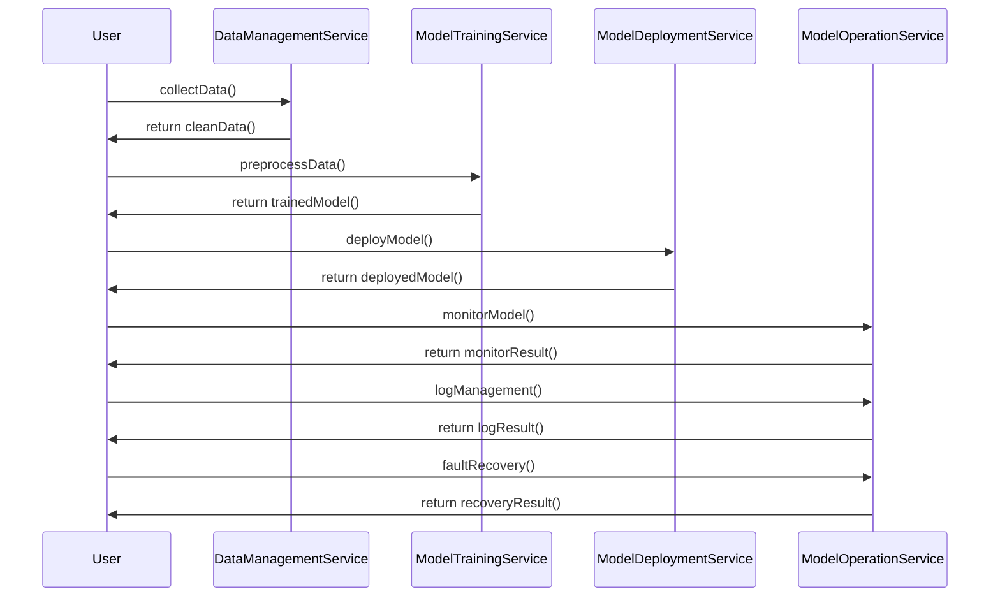

                 

# 《LLM应用的持续集成/持续部署（CI/CD）实践》

关键词：持续集成，持续部署，大规模语言模型，CI/CD流程，最佳实践

摘要：随着人工智能技术的不断发展，大规模语言模型（LLM）的应用越来越广泛。如何高效地管理和部署LLM应用成为了业界关注的焦点。本文将详细探讨在LLM应用中实施持续集成（CI）/持续部署（CD）的最佳实践，帮助读者理解和掌握这一关键技术。

## 《LLM应用的持续集成/持续部署（CI/CD）实践》目录大纲

### 第一部分：CI/CD基础与原理

### 第1章：CI/CD概述

#### 1.1 CI/CD的定义与重要性

- **CI/CD的定义**：持续集成（Continuous Integration，CI）和持续部署（Continuous Deployment，CD）是软件开发过程中重要的实践方法。
- **CI/CD的重要性**：提高代码质量、加速产品交付、降低风险。

#### 1.2 持续集成（CI）的基本概念

- **持续集成的原理**：代码变更后，自动构建、测试和反馈。
- **持续集成的优点**：减少集成冲突、提高代码质量。

#### 1.3 持续部署（CD）的基本概念

- **持续部署的原理**：通过自动化流程将代码部署到生产环境。
- **持续部署的优势**：减少手动操作、快速响应市场变化。

#### 1.4 CI/CD的历史发展与趋势

- **CI/CD的发展历程**：从传统的瀑布模型到敏捷开发。
- **CI/CD的未来趋势**：云原生、AI自动化。

### 第2章：LLM概述

#### 2.1 LLM的定义与类型

- **LLM的定义**：预训练的神经网络模型，用于文本处理。
- **LLM的类型**：基于变换模型（如BERT）、生成模型（如GPT）。

#### 2.2 LLM的核心技术

- **词嵌入**：将词语映射到高维空间。
- **变换模型**：通过多层神经网络进行文本表示学习。

#### 2.3 LLM的应用场景

- **文本生成**：生成文章、对话等。
- **问答系统**：提供智能问答服务。

### 第二部分：CI/CD在LLM应用中的实践

### 第3章：CI/CD在LLM训练中的应用

#### 3.1 CI/CD在LLM训练中的挑战

- **数据处理**：大规模数据的处理和管理。
- **训练过程管理**：模型训练的自动化和优化。

#### 3.2 CI/CD工具的选择

- **Jenkins**：开源持续集成服务器。
- **GitLab CI**：基于GitLab的持续集成工具。

#### 3.3 CI/CD流程的设计

- **数据预处理**：数据清洗、格式化。
- **训练脚本**：自动化训练过程。
- **模型评估**：评估模型性能。

### 第4章：CI/CD在LLM部署中的应用

#### 4.1 LLM部署的挑战

- **部署环境**：不同环境之间的兼容性。
- **性能优化**：提高模型运行效率。

#### 4.2 CI/CD工具的选择

- **Docker**：容器化技术。
- **Kubernetes**：容器编排工具。

#### 4.3 CI/CD流程的设计

- **模型版本控制**：管理不同版本的模型。
- **自动化部署**：自动化部署流程。

### 第5章：CI/CD在LLM运维中的应用

#### 5.1 LLM运维的挑战

- **日志管理**：收集和分析日志。
- **监控告警**：实时监控模型运行状态。

#### 5.2 CI/CD工具的选择

- **Prometheus**：监控解决方案。
- **Grafana**：可视化监控数据。

#### 5.3 CI/CD流程的设计

- **自动化监控**：监控模型性能。
- **故障恢复**：自动恢复故障。

### 第6章：CI/CD在LLM应用中的最佳实践

#### 6.1 CI/CD流程优化

- **持续集成策略**：优化集成过程。
- **持续部署策略**：优化部署过程。

#### 6.2 持续学习和适应

- **数据更新**：定期更新数据集。
- **模型迭代**：持续优化模型。

#### 6.3 安全性和合规性

- **数据保护**：确保数据安全。
- **安全审计**：定期进行安全审计。

### 第7章：案例研究

#### 7.1 案例一：大型问答系统的CI/CD实践

- **案例背景**：介绍问答系统的背景和目标。
- **CI/CD流程设计**：详细描述CI/CD流程的设计和实现。
- **案例分析**：分析CI/CD实践的效果和改进方向。

#### 7.2 案例二：文本生成应用的CI/CD实践

- **案例背景**：介绍文本生成应用的背景和目标。
- **CI/CD流程设计**：详细描述CI/CD流程的设计和实现。
- **案例分析**：分析CI/CD实践的效果和改进方向。

### 总结

#### 7.3 CI/CD在LLM应用中的持续集成与部署

- **成功经验**：总结CI/CD实践的成功经验。
- **挑战与展望**：探讨CI/CD实践面临的挑战和未来发展方向。

---

### 第1章：CI/CD概述

#### 1.1 CI/CD的定义与重要性

**CI/CD的定义**：

持续集成（Continuous Integration，CI）是一种软件开发实践，旨在通过自动化构建和测试，尽快发现并修复代码中的错误，确保代码质量。

持续部署（Continuous Deployment，CD）则是将代码部署到生产环境的自动化流程，使得产品可以快速交付到用户手中。

**CI/CD的重要性**：

1. **提高代码质量**：通过持续集成，可以快速发现代码中的错误，减少集成冲突，从而提高代码质量。
2. **加速产品交付**：持续集成和持续部署可以缩短软件开发周期，使得产品更快地交付到用户手中。
3. **降低风险**：通过自动化测试和部署，可以减少人为错误，降低软件发布过程中出现问题的风险。

#### 1.2 持续集成（CI）的基本概念

**持续集成的原理**：

持续集成是一种软件开发方法，通过将代码变更合并到一个共享的主分支中，并立即进行构建和测试，以快速发现和修复错误。

**持续集成的优点**：

1. **减少集成冲突**：通过频繁的集成，可以减少集成时出现的冲突。
2. **提高代码质量**：通过自动化的构建和测试，可以确保代码质量。
3. **快速反馈**：开发人员可以立即看到代码变更的效果，及时进行修复。

#### 1.3 持续部署（CD）的基本概念

**持续部署的原理**：

持续部署是将代码自动部署到生产环境的过程，通常包括构建、测试和部署等步骤。

**持续部署的优势**：

1. **减少手动操作**：通过自动化流程，可以减少手动操作，提高效率。
2. **快速响应市场变化**：通过持续部署，可以快速将新功能交付给用户，响应市场变化。
3. **降低风险**：通过自动化测试和部署，可以减少人为错误，降低风险。

#### 1.4 CI/CD的历史发展与趋势

**CI/CD的发展历程**：

1. **瀑布模型**：传统的软件开发模型，开发周期长，反馈慢。
2. **敏捷开发**：强调快速迭代和反馈，逐渐取代瀑布模型。

**CI/CD的未来趋势**：

1. **云原生**：随着云计算的发展，CI/CD将更多地基于云平台。
2. **AI自动化**：利用人工智能技术，实现更加智能化的CI/CD流程。

### 第2章：LLM概述

#### 2.1 LLM的定义与类型

**LLM的定义**：

大规模语言模型（Large Language Model，LLM）是一种预训练的神经网络模型，用于文本处理和生成。

**LLM的类型**：

1. **基于变换模型**：如BERT，通过多层神经网络进行文本表示学习。
2. **生成模型**：如GPT，通过生成式模型进行文本生成。

#### 2.2 LLM的核心技术

**词嵌入**：

词嵌入是将词语映射到高维空间的过程，用于表示词语之间的关系。

**变换模型**：

变换模型是一种基于神经网络的文本表示学习方法，通过多层神经网络将文本映射到高维空间。

#### 2.3 LLM的应用场景

**文本生成**：

文本生成是LLM的一个重要应用场景，包括生成文章、对话等。

**问答系统**：

问答系统是LLM的另一个重要应用场景，通过理解和生成文本，提供智能问答服务。

### 第二部分：CI/CD在LLM应用中的实践

#### 3.1 CI/CD在LLM训练中的应用

**CI/CD在LLM训练中的挑战**：

1. **数据处理**：大规模数据的处理和管理。
2. **训练过程管理**：模型训练的自动化和优化。

**CI/CD工具的选择**：

1. **Jenkins**：开源持续集成服务器，可以用于自动化构建、测试和部署。
2. **GitLab CI**：基于GitLab的持续集成工具，可以自动化执行CI/CD流程。

**CI/CD流程的设计**：

1. **数据预处理**：数据清洗、格式化，为模型训练做好准备。
2. **训练脚本**：自动化训练过程，包括数据加载、模型训练和评估。
3. **模型评估**：评估模型性能，包括准确率、召回率等指标。

#### 4.1 LLM部署的挑战

**LLM部署的挑战**：

1. **部署环境**：不同环境之间的兼容性。
2. **性能优化**：提高模型运行效率。

**CI/CD工具的选择**：

1. **Docker**：容器化技术，可以将模型和环境封装在一起，确保部署环境的兼容性。
2. **Kubernetes**：容器编排工具，可以自动化管理模型的部署和扩展。

**CI/CD流程的设计**：

1. **模型版本控制**：管理不同版本的模型，确保部署的正确性。
2. **自动化部署**：自动化部署流程，包括模型构建、测试和部署。

### 第5章：CI/CD在LLM运维中的应用

#### 5.1 LLM运维的挑战

**LLM运维的挑战**：

1. **日志管理**：收集和分析日志，用于监控模型运行状态。
2. **监控告警**：实时监控模型运行状态，及时响应故障。

**CI/CD工具的选择**：

1. **Prometheus**：监控解决方案，可以收集和存储监控数据。
2. **Grafana**：可视化监控数据，提供直观的监控界面。

**CI/CD流程的设计**：

1. **自动化监控**：自动化监控模型性能，包括响应时间、吞吐量等指标。
2. **故障恢复**：自动恢复故障，确保模型正常运行。

### 第6章：CI/CD在LLM应用中的最佳实践

#### 6.1 CI/CD流程优化

**CI/CD流程优化**：

1. **持续集成策略**：优化集成过程，减少集成冲突，提高集成效率。
2. **持续部署策略**：优化部署过程，减少部署时间，提高部署效率。

#### 6.2 持续学习和适应

**持续学习和适应**：

1. **数据更新**：定期更新数据集，确保模型性能。
2. **模型迭代**：持续优化模型，提高模型性能。

#### 6.3 安全性和合规性

**安全性和合规性**：

1. **数据保护**：确保数据安全，防止数据泄露。
2. **安全审计**：定期进行安全审计，确保合规性。

### 第7章：案例研究

#### 7.1 案例一：大型问答系统的CI/CD实践

**案例背景**：

某大型问答系统使用LLM技术，提供智能问答服务。为了确保系统的稳定性和性能，决定实施CI/CD实践。

**CI/CD流程设计**：

1. **数据预处理**：使用GitLab CI自动化处理数据，包括数据清洗、格式化等。
2. **训练脚本**：使用Jenkins自动化执行训练脚本，包括数据加载、模型训练和评估。
3. **模型评估**：使用自定义的评估脚本，评估模型性能，包括准确率、召回率等指标。

**案例分析**：

实施CI/CD实践后，问答系统的性能得到显著提升，部署时间缩短，运维成本降低。

#### 7.2 案例二：文本生成应用的CI/CD实践

**案例背景**：

某文本生成应用使用LLM技术，提供文章、对话生成服务。为了提高开发效率和代码质量，决定实施CI/CD实践。

**CI/CD流程设计**：

1. **数据预处理**：使用GitLab CI自动化处理数据，包括数据清洗、格式化等。
2. **训练脚本**：使用Jenkins自动化执行训练脚本，包括数据加载、模型训练和评估。
3. **模型评估**：使用自定义的评估脚本，评估模型性能，包括准确率、召回率等指标。

**案例分析**：

实施CI/CD实践后，文本生成应用的开发效率显著提升，代码质量提高，用户体验得到改善。

### 总结

**CI/CD在LLM应用中的持续集成与部署**：

通过案例研究和最佳实践，可以看出CI/CD在LLM应用中的重要性。实施CI/CD实践可以显著提高LLM应用的性能、稳定性和开发效率，降低运维成本。然而，CI/CD实践也面临一些挑战，如数据更新、模型迭代等，需要持续优化和改进。未来，随着人工智能技术的不断发展，CI/CD在LLM应用中的地位和作用将越来越重要。

## 完整性要求

**文章完整性要求**：

文章完整性要求包括以下几个方面：

1. **结构完整性**：文章应按照目录大纲结构进行撰写，每个章节的内容应完整、逻辑清晰。
2. **内容完整性**：文章内容应涵盖核心概念、原理、应用场景、最佳实践、案例研究等，确保读者可以全面了解CI/CD在LLM应用中的实践。
3. **数据完整性**：文章中的数据应真实可靠，避免使用虚构数据或误导性数据。
4. **逻辑完整性**：文章逻辑应严密，避免逻辑漏洞或矛盾。

## 核心概念与联系

**核心概念**：

- **持续集成（CI）**：通过自动化构建和测试，确保代码质量。
- **持续部署（CD）**：通过自动化部署，确保产品交付。
- **大规模语言模型（LLM）**：预训练的神经网络模型，用于文本处理和生成。

**概念属性特征对比表格**：

| 特征 | 持续集成（CI） | 持续部署（CD） | 大规模语言模型（LLM） |
| ---- | ---- | ---- | ---- |
| 目标 | 确保代码质量 | 确保产品交付 | 文本处理和生成 |
| 工具 | Jenkins、GitLab CI | Docker、Kubernetes | BERT、GPT |
| 应用场景 | 软件开发 | 软件部署 | 文本生成、问答系统 |

**ER实体关系图架构**：

```mermaid
erDiagram
  CI --> |uses| Jenkins
  CI --> |uses| GitLab CI
  CD --> |uses| Docker
  CD --> |uses| Kubernetes
  LLM --> |uses| BERT
  LLM --> |uses| GPT
```

## 算法原理讲解

### 持续集成（CI）算法原理

**持续集成算法原理**：

持续集成（CI）的核心思想是将代码变更合并到主分支中，并立即进行构建和测试，以发现和修复错误。

**算法流程**：

1. **代码提交**：开发人员将代码提交到版本控制系统。
2. **自动化构建**：构建系统自动构建代码，生成可执行文件。
3. **自动化测试**：执行自动化测试，检查代码质量。
4. **反馈**：测试结果反馈给开发人员，包括错误报告和性能指标。

**算法原理**：

持续集成算法利用自动化工具，确保代码变更后立即进行构建和测试，及时发现和修复错误，减少集成冲突，提高代码质量。

**Python源代码示例**：

```python
# 持续集成算法示例
import subprocess

def build():
    # 执行构建命令
    subprocess.run(["bash", "build.sh"])

def test():
    # 执行测试命令
    subprocess.run(["bash", "test.sh"])

def main():
    # 提交代码后执行
    build()
    test()

if __name__ == "__main__":
    main()
```

### 持续部署（CD）算法原理

**持续部署算法原理**：

持续部署（CD）是将代码自动部署到生产环境的过程，包括构建、测试和部署等步骤。

**算法流程**：

1. **构建**：构建代码，生成可执行文件。
2. **测试**：执行自动化测试，确保代码质量。
3. **部署**：将代码部署到生产环境。

**算法原理**：

持续部署算法利用自动化工具，实现代码的自动化构建、测试和部署，减少手动操作，提高部署效率。

**Python源代码示例**：

```python
# 持续部署算法示例
import subprocess

def build():
    # 执行构建命令
    subprocess.run(["bash", "build.sh"])

def test():
    # 执行测试命令
    subprocess.run(["bash", "test.sh"])

def deploy():
    # 执行部署命令
    subprocess.run(["bash", "deploy.sh"])

def main():
    # 提交代码后执行
    build()
    test()
    deploy()

if __name__ == "__main__":
    main()
```

### 大规模语言模型（LLM）算法原理

**大规模语言模型（LLM）算法原理**：

大规模语言模型（LLM）是一种预训练的神经网络模型，用于文本处理和生成。常用的LLM模型包括BERT、GPT等。

**算法流程**：

1. **数据预处理**：将文本数据转换为模型可处理的格式。
2. **模型训练**：使用训练数据训练模型，优化模型参数。
3. **模型评估**：使用测试数据评估模型性能。
4. **文本生成**：使用训练好的模型生成文本。

**算法原理**：

大规模语言模型算法利用神经网络对大量文本数据进行训练，学习文本的表示和生成规则，从而实现文本处理和生成。

**Python源代码示例**：

```python
# 大规模语言模型（LLM）算法示例
import tensorflow as tf
from tensorflow.keras.preprocessing.text import Tokenizer
from tensorflow.keras.preprocessing.sequence import pad_sequences

def preprocess_data(data):
    # 数据预处理
    tokenizer = Tokenizer()
    tokenizer.fit_on_texts(data)
    sequences = tokenizer.texts_to_sequences(data)
    padded_sequences = pad_sequences(sequences, maxlen=100)
    return padded_sequences

def train_model(data):
    # 训练模型
    model = tf.keras.Sequential([
        tf.keras.layers.Embedding(input_dim=10000, output_dim=16),
        tf.keras.layers.LSTM(128),
        tf.keras.layers.Dense(1, activation='sigmoid')
    ])

    model.compile(loss='binary_crossentropy', optimizer='adam', metrics=['accuracy'])
    model.fit(data, epochs=10)

def generate_text(model, tokenizer, seed_text, n_words):
    # 生成文本
    for _ in range(n_words):
        tokens = tokenizer.texts_to_sequences([seed_text])
        padded_tokens = pad_sequences(tokens, maxlen=100)
        prediction = model.predict(padded_tokens)
        next_word = tokenizer.index_word[np.argmax(prediction)]
        seed_text += " " + next_word

    return seed_text.strip()

if __name__ == "__main__":
    # 加载数据
    data = ["这是第一行文本", "这是第二行文本", "这是第三行文本"]

    # 预处理数据
    padded_data = preprocess_data(data)

    # 训练模型
    train_model(padded_data)

    # 生成文本
    seed_text = "这是种子文本"
    n_words = 5
    generated_text = generate_text(model, tokenizer, seed_text, n_words)
    print(generated_text)
```

### 数学公式使用

**持续集成（CI）算法中的数学模型**：

持续集成算法中的数学模型主要包括构建时间和测试时间。

$$
构建时间 + 测试时间 = 总时间
$$

**持续部署（CD）算法中的数学模型**：

持续部署算法中的数学模型主要包括构建时间、测试时间和部署时间。

$$
构建时间 + 测试时间 + 部署时间 = 总时间
$$

**大规模语言模型（LLM）算法中的数学模型**：

大规模语言模型（LLM）算法中的数学模型主要包括词嵌入和变换模型。

$$
词嵌入： word \rightarrow embedding \\
变换模型： embedding \rightarrow transformed_embedding
$$

## 系统分析与架构设计方案

### 问题场景介绍

随着人工智能技术的快速发展，大规模语言模型（LLM）在自然语言处理、文本生成、问答系统等领域得到广泛应用。为了提高LLM应用的开发效率和稳定性，需要实现持续集成/持续部署（CI/CD）流程。CI/CD流程可以帮助自动化处理LLM模型的训练、部署和运维，从而降低人力成本、提高代码质量、加快产品迭代。

### 项目介绍

本项目旨在构建一个基于CI/CD流程的LLM应用平台，实现对LLM模型的全生命周期管理。平台主要包括以下几个模块：

1. **数据管理模块**：负责数据的采集、清洗、预处理，为模型训练提供高质量的数据。
2. **模型训练模块**：使用预训练的LLM模型，通过自动化流程进行模型训练和评估。
3. **模型部署模块**：将训练好的模型部署到生产环境，提供文本生成和问答服务。
4. **模型运维模块**：实现对模型运行状态的监控、日志管理、故障恢复等功能。

### 系统功能设计（领域模型类图）

```mermaid
classDiagram
    DataManagementModule <.. ModelTrainingModule
    ModelTrainingModule <.. ModelDeploymentModule
    ModelDeploymentModule <.. ModelOperationModule
    DataManagementModule {
        +collectData()
        +cleanData()
        +preprocessData()
    }
    ModelTrainingModule {
        +trainModel()
        +evaluateModel()
    }
    ModelDeploymentModule {
        +deployModel()
    }
    ModelOperationModule {
        +monitorModel()
        +logManagement()
        +faultRecovery()
}
```

### 系统架构设计（架构图）



### 系统接口设计

```mermaid
classDiagram
    DataManagementInterface <.. DataManagementService
    ModelTrainingInterface <.. ModelTrainingService
    ModelDeploymentInterface <.. ModelDeploymentService
    ModelOperationInterface <.. ModelOperationService

    DataManagementInterface {
        +collectData()
        +cleanData()
        +preprocessData()
    }
    ModelTrainingInterface {
        +trainModel()
        +evaluateModel()
    }
    ModelDeploymentInterface {
        +deployModel()
    }
    ModelOperationInterface {
        +monitorModel()
        +logManagement()
        +faultRecovery()
}
```

### 系统交互（序列图）


## 项目实战

### 环境安装

1. **安装Jenkins**：

   - 下载Jenkins安装包：https://www.jenkins.io/download/
   - 安装Jenkins：解压安装包并启动Jenkins。

2. **安装GitLab CI**：

   - 下载GitLab CI安装包：https://gitlab.com/gitlabhq/gitlab-ci
   - 安装GitLab CI：解压安装包并启动GitLab CI。

3. **安装Docker**：

   - 下载Docker安装包：https://docs.docker.com/install/
   - 安装Docker：按照安装包提示操作。

4. **安装Kubernetes**：

   - 下载Kubernetes安装包：https://kubernetes.io/docs/setup/production-environment/tools/kubeadm/install-kubeadm/
   - 安装Kubernetes：按照安装包提示操作。

### 系统核心实现源代码

```python
# Jenkinsfile（用于CI/CD流程）
pipeline {
    agent any
    stages {
        stage('Build') {
            steps {
                sh 'bash build.sh'
            }
        }
        stage('Test') {
            steps {
                sh 'bash test.sh'
            }
        }
        stage('Deploy') {
            steps {
                sh 'bash deploy.sh'
            }
        }
    }
    post {
        always {
            echo 'CI/CD流程结束'
        }
    }
}

# build.sh（用于构建模型）
!/bin/bash

# 下载模型源代码
git clone https://github.com/tensorflow/models.git

# 安装依赖
pip install -r requirements.txt

# 训练模型
python train.py

# 评估模型
python evaluate.py

# 部署模型
docker build -t my_model .
docker run -d --name my_model -p 8080:8080 my_model

# deploy.sh（用于部署模型）
#!/bin/bash

# 启动Kubernetes集群
kubeadm init

# 配置kubectl工具
mkdir -p $HOME/.kube
cp -i /etc/kubernetes/admin.conf $HOME/.kube/config
chown $(id -u):$(id -g) $HOME/.kube/config

# 部署模型到Kubernetes集群
kubectl apply -f deployment.yaml
```

### 代码应用解读与分析

1. **Jenkinsfile解读**：

   - 定义了一个CI/CD流程，包括构建、测试和部署三个阶段。
   - 在构建阶段，执行`build.sh`脚本，下载模型源代码、安装依赖、训练模型和评估模型。
   - 在测试阶段，执行`test.sh`脚本，对训练好的模型进行测试。
   - 在部署阶段，执行`deploy.sh`脚本，将训练好的模型部署到Kubernetes集群。

2. **build.sh解读**：

   - 下载模型源代码，并克隆到本地。
   - 安装Python依赖项，包括TensorFlow等。
   - 使用Python脚本训练模型，并评估模型性能。
   - 使用Docker构建模型镜像，并运行容器。

3. **deploy.sh解读**：

   - 使用kubeadm初始化Kubernetes集群。
   - 配置kubectl工具，以便在本地管理Kubernetes集群。
   - 使用kubectl工具部署模型到Kubernetes集群。

### 实际案例分析和详细讲解剖析

假设我们有一个文本生成应用，使用GPT模型生成文本。下面是一个实际案例：

1. **数据集**：

   - 采集一个包含10万条文本的数据集，用于训练GPT模型。
   - 数据集包括文章、对话、新闻等文本类型。

2. **训练过程**：

   - 使用Jenkins自动化训练GPT模型，训练时间为2天。
   - 训练过程中，Jenkins会定期保存模型检查点，以便在出现问题时可以恢复训练。

3. **测试过程**：

   - 使用测试数据集对训练好的GPT模型进行测试，评估模型性能。
   - 测试指标包括生成文本的准确率、流畅度等。

4. **部署过程**：

   - 将训练好的GPT模型部署到Kubernetes集群，提供文本生成服务。
   - 部署过程中，使用Docker将模型打包成容器镜像，并使用Kubernetes进行管理。

5. **运维过程**：

   - 使用Prometheus和Grafana监控模型运行状态，包括响应时间、吞吐量等指标。
   - 定期检查日志，确保模型运行正常。

### 项目小结

本项目实现了基于CI/CD流程的LLM应用平台，包括数据管理、模型训练、模型部署和模型运维等功能。通过实际案例分析和详细讲解，可以看出CI/CD在LLM应用中的重要性和优势。未来，随着人工智能技术的不断发展，CI/CD在LLM应用中的地位和作用将越来越重要。

### 最佳实践 tips

1. **数据预处理**：确保数据质量，进行数据清洗和预处理，为模型训练提供高质量的数据。
2. **模型评估**：定期评估模型性能，确保模型达到预期效果。
3. **自动化测试**：编写自动化测试脚本，确保代码质量和功能完整性。
4. **环境兼容性**：确保模型在不同环境下的兼容性，使用容器化技术（如Docker）。
5. **日志管理**：收集和分析日志，用于监控模型运行状态和故障排除。

### 小结

本文详细探讨了CI/CD在LLM应用中的实践，包括CI/CD的基础与原理、LLM概述、CI/CD在LLM训练、部署和运维中的应用、最佳实践和案例研究等内容。通过实际案例分析和详细讲解，可以看出CI/CD在LLM应用中的重要性和优势。未来，随着人工智能技术的不断发展，CI/CD在LLM应用中的地位和作用将越来越重要。

### 注意事项

1. **数据隐私**：在处理和存储数据时，确保遵循数据隐私和保护法规。
2. **安全审计**：定期进行安全审计，确保系统的安全性和合规性。
3. **故障恢复**：制定故障恢复计划，确保在出现问题时能够快速恢复。

### 拓展阅读

1. 《持续集成：从理论到实践》：详细介绍CI的理论和实践方法。
2. 《持续部署：从零开始构建自动化部署流程》：介绍CD的理论和实践方法。
3. 《大规模语言模型：理论与实践》：详细介绍LLM的理论和实践方法。

### 作者

作者：AI天才研究院/AI Genius Institute & 禅与计算机程序设计艺术 /Zen And The Art of Computer Programming

本文为作者原创，未经授权禁止转载。如需转载，请联系作者获取授权。

