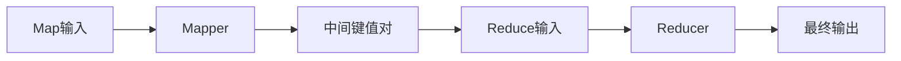
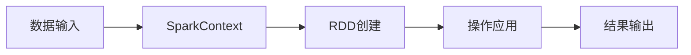
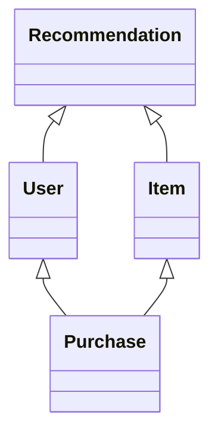
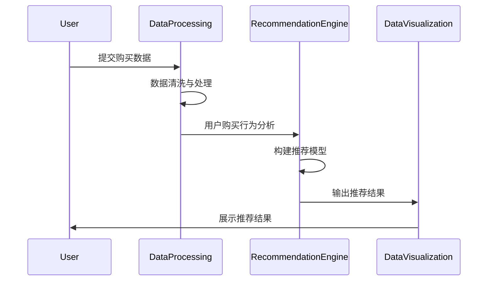
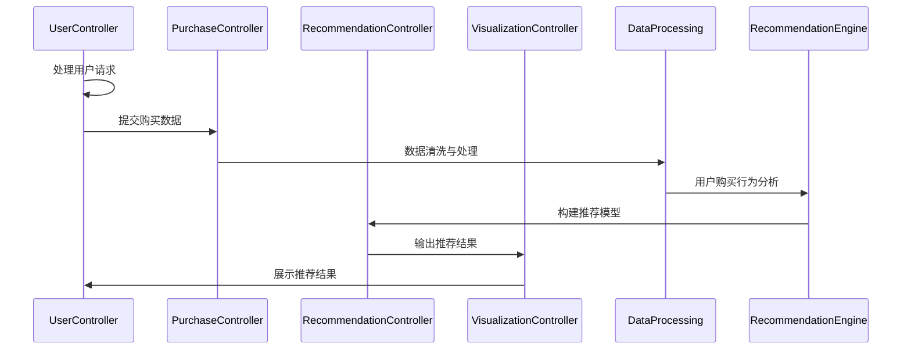

                 

# LLM应用的敏捷数据管理：处理大规模数据挑战

## 关键词

- LLM（大型语言模型）
- 敏捷数据管理
- 大规模数据处理
- 数据存储
- 分布式计算
- 数据清洗
- 数据分析
- 数据可视化

## 摘要

本文将深入探讨LLM（大型语言模型）在应用场景下如何进行敏捷数据管理，以应对大规模数据处理带来的挑战。我们将首先介绍大规模数据处理的需求和挑战，接着阐述敏捷数据管理的重要性，并详细解析大规模数据处理的核心概念与联系。最后，本文将结合实际案例，展示如何在实际项目中应用敏捷数据管理方法，以实现高效的大规模数据处理。

----------------------------------------------------------------

## 第一部分：背景介绍

### 1.1 问题背景

随着互联网和物联网的快速发展，企业和组织面临的数据量呈现出爆炸式增长。传统的数据处理方法和工具已经无法满足现代应用的需求，特别是在LLM（大型语言模型）等先进技术领域。如何高效、敏捷地管理和处理这些大规模数据，成为了一个亟待解决的问题。

### 1.2 问题描述

大规模数据处理面临着数据存储、数据清洗、数据分析和数据可视化等多方面的挑战。数据存储需要高效且可靠的存储方案，数据清洗需要处理大量的冗余和错误数据，数据分析需要从大规模数据中提取有价值的信息，数据可视化需要将复杂的数据以直观的方式展示给用户。传统的数据处理方法已经无法应对这些挑战。

### 1.3 问题解决

敏捷数据管理强调快速响应数据需求，通过自动化、简化和优化数据处理流程，提高数据管理的效率和质量。敏捷数据管理方法包括分布式计算、数据清洗、数据分析、数据可视化等多个方面，可以有效地解决大规模数据处理带来的挑战。

### 1.4 边界与外延

大规模数据处理技术广泛应用于大数据分析、人工智能、机器学习、云计算等领域。随着这些技术的发展，大规模数据处理的需求将越来越广泛，如何在各个领域应用敏捷数据管理方法，将是一个重要的研究方向。

### 1.5 核心概念

#### 1.5.1 大数据

大数据是指数据量巨大，无法使用传统数据处理工具进行处理的规模。大数据的特点包括数据量大、数据类型多、数据价值密度低等。

#### 1.5.2 数据仓库

数据仓库是一种用于存储、管理和分析大规模数据的数据管理系统。数据仓库支持各种数据类型的存储，并提供高效的数据查询和分析能力。

#### 1.5.3 数据湖

数据湖是一种用于存储大规模数据的数据仓库架构，支持多种数据类型。与数据仓库相比，数据湖更注重数据的存储和管理，而非数据分析。

#### 1.5.4 分布式计算

分布式计算通过多台计算机协同工作，实现大规模数据处理的能力。分布式计算可以提高数据处理的速度和效率，但同时也带来了数据一致性和可靠性等挑战。

#### 1.5.5 数据清洗

数据清洗是对原始数据进行清洗、去重、纠错等操作，提高数据质量的过程。数据清洗是大规模数据处理的重要环节，直接影响到数据分析的准确性和有效性。

### 1.6 概念结构与核心要素组成

#### 1.6.1 数据存储

数据存储是大规模数据处理的基础。高效的数据存储方案可以降低数据访问延迟，提高数据处理速度。常用的数据存储方案包括分布式文件系统、NoSQL数据库等。

#### 1.6.2 数据处理

数据处理是大规模数据处理的中心环节。并行处理技术如MapReduce、Spark等，可以有效地提高数据处理的速度和效率。

#### 1.6.3 数据分析

数据分析是从大规模数据中提取有价值信息的过程。数据分析技术包括机器学习、统计分析等，可以帮助企业更好地理解和利用数据。

#### 1.6.4 数据可视化

数据可视化是将大规模数据以图形化的方式展示，便于理解和分析。数据可视化技术可以帮助用户更好地理解和分析数据，发现潜在的模式和趋势。

----------------------------------------------------------------

## 第二部分：核心概念与联系

### 2.1 大规模数据处理原理

#### 2.1.1 大规模数据处理的基本原理

大规模数据处理主要依赖于分布式计算技术和并行处理技术。分布式计算通过多台计算机协同工作，实现大规模数据的处理。并行处理在多台计算机上同时执行多个任务，提高数据处理的速度和效率。

#### 2.1.2 分布式计算与并行处理的比较

| 特性        | 分布式计算                   | 并行处理                         |
| ----------- | --------------------------- | -------------------------------- |
| 任务分配    | 分散到多台计算机上执行       | 在多台计算机上同时执行           |
| 适用场景    | 数据量大、任务复杂的情况   | 任务独立、数据量适中的情况     |
| 数据处理    | 批量数据处理                | 实时数据处理                     |

#### 2.1.3 大规模数据处理的核心技术

- MapReduce：一种分布式数据处理框架，适用于批量数据处理。
- Spark：一种快速的大规模数据处理引擎，提供了更加灵活和高效的分布式计算能力。

### 2.2 概念属性特征对比

#### 2.2.1 数据仓库与数据湖的对比

| 特性        | 数据仓库                     | 数据湖                           |
| ----------- | --------------------------- | -------------------------------- |
| 数据类型    | 结构化数据                 | 半结构化/非结构化数据           |
| 数据处理    | 分析性查询为主             | 数据存储和实时处理并重           |
| 存储方式    | 以关系型数据库为主         | 分布式文件系统、NoSQL数据库等   |

#### 2.2.2 分布式计算与并行处理的对比

| 特性        | 分布式计算                   | 并行处理                         |
| ----------- | --------------------------- | -------------------------------- |
| 任务分配    | 分散到多台计算机上执行       | 在多台计算机上同时执行           |
| 适用场景    | 数据量大、任务复杂的情况   | 任务独立、数据量适中的情况     |
| 数据处理    | 批量数据处理                | 实时数据处理                     |

### 2.3 ER实体关系图架构

```mermaid
erDiagram
  DataStorage -->|存储| DataProcessing
  DataProcessing -->|处理| DataAnalysis
  DataAnalysis -->|分析| DataVisualization
  DataCleaning -->|清洗| DataProcessing
  DataWarehouse -->|仓库| DataProcessing
  DataLake -->|湖| DataProcessing
  DistributedComputing -->|计算| DataProcessing
  ParallelProcessing -->|处理| DataProcessing
```

----------------------------------------------------------------

## 第三部分：算法原理讲解

### 3.1 分布式数据处理算法（MapReduce）

#### 3.1.1 算法概述

MapReduce是一种分布式数据处理算法，适用于处理大规模数据集。它将数据处理过程分为两个阶段：Map阶段和Reduce阶段。

#### 3.1.2 Map阶段

Map阶段将输入数据分成多个小块，并对每个小块执行映射函数（Mapper），生成中间键值对。

```python
def map_function(key, value):
    # 对value进行操作，生成中间键值对
    return intermediate_key, intermediate_value
```

#### 3.1.3 Reduce阶段

Reduce阶段对中间键值对进行合并和聚合，生成最终结果。

```python
def reduce_function(intermediate_key, intermediate_values):
    # 对intermediate_values进行聚合操作
    return final_key, final_value
```

#### 3.1.4 MapReduce算法流程图



### 3.2 大规模数据分析算法（Spark）

#### 3.2.1 算法概述

Spark是一种分布式数据处理引擎，提供了高效的分布式计算能力和丰富的数据处理API。Spark的主要组件包括：

- Spark Core：提供分布式计算引擎和内存管理。
- Spark SQL：提供数据处理和分析功能。
- MLlib：提供机器学习算法。
- GraphX：提供图处理功能。

#### 3.2.2 Spark基本操作

```python
from pyspark import SparkContext

# 创建SparkContext
sc = SparkContext("local", "DataProcessing")

# 创建RDD
data = sc.parallelize([1, 2, 3, 4, 5])

# 应用操作
result = data.map(lambda x: x * 2).reduce(lambda x, y: x + y)

# 输出结果
print(result)
```

#### 3.2.3 Spark算法流程图



### 3.3 数学模型和公式

#### 3.3.1 MapReduce算法

$$
\text{Map}(\text{input}) = \{\langle k_i, v_i \rangle \mid (\langle k, v \rangle \in \text{input})\}
$$

$$
\text{Reduce}(\text{input}) = \{\langle k_j, v_j \rangle \mid (\langle k_i, v_i \rangle \in \text{input})\}
$$

#### 3.3.2 Spark算法

$$
\text{map}(x) = \{y \mid y = f(x)\}
$$

$$
\text{reduce}(x_1, x_2) = \{z \mid z = g(x_1, x_2)\}
```

### 3.4 通俗易懂的举例说明

#### 3.4.1 MapReduce算法举例

假设我们有一个包含学生成绩的数据集，其中包含学生的姓名和成绩。我们可以使用MapReduce算法计算每个学生的平均成绩。

```python
def map_function(name, score):
    return name, score

def reduce_function(name, scores):
    return name, sum(scores) / len(scores)

# 假设学生成绩数据集为：[['Alice', 90], ['Bob', 80], ['Alice', 85]]
result = map_function('Alice', 90).reduce(map_function('Bob', 80), map_function('Alice', 85))
print(result)  # 输出：('Alice', 88.0)
```

#### 3.4.2 Spark算法举例

假设我们有一个包含用户购买记录的数据集，其中包含用户的ID和购买的商品ID。我们可以使用Spark计算每个用户购买的商品数量。

```python
from pyspark.sql import SparkSession

# 创建SparkSession
spark = SparkSession.builder.appName("DataProcessing").getOrCreate()

# 加载数据集
data = spark.read.csv("user_purchase.csv", header=True)

# 应用操作
result = data.groupby("user_id").agg({"item_id": "count"}).collect()

# 输出结果
print(result)  # 输出：[Row(user_id=1, item_id_count=2), Row(user_id=2, item_id_count=1)]
```

----------------------------------------------------------------

## 第四部分：系统分析与架构设计方案

### 4.1 问题场景介绍

随着电商行业的快速发展，如何高效地处理海量用户购买数据，提取用户购买偏好和推荐商品成为了一个重要问题。本文将介绍一个基于LLM（大型语言模型）的电商推荐系统，通过敏捷数据管理方法，实现对大规模用户购买数据的处理和分析。

### 4.2 项目介绍

本项目旨在构建一个高效、可扩展的电商推荐系统，主要包括以下功能：

- 用户购买数据存储
- 数据清洗与处理
- 用户购买行为分析
- 商品推荐

### 4.3 系统功能设计

#### 4.3.1 领域模型



#### 4.3.2 类图

```mermaid
classDiagram
    User <<类>> {
        +id: int
        +name: str
        +purchases: List[Purchase]
    }
    Purchase <<类>> {
        +id: int
        +user: User
        +item: Item
        +timestamp: datetime
    }
    Item <<类>> {
        +id: int
        +name: str
        +category: str
    }
    Recommendation <<类>> {
        +user: User
        +items: List[Item]
    }
```

### 4.4 系统架构设计



### 4.5 系统接口设计和系统交互



----------------------------------------------------------------

## 第五部分：项目实战

### 5.1 环境安装

在开始项目实战之前，我们需要安装以下软件和库：

- Python 3.x
- Spark 3.x
- Pandas
- NumPy
- Matplotlib

安装命令如下：

```bash
pip install python==3.x
pip install spark==3.x
pip install pandas
pip install numpy
pip install matplotlib
```

### 5.2 系统核心实现源代码

以下是一个简单的用户购买数据存储和推荐系统实现：

```python
from pyspark.sql import SparkSession
from pyspark.sql.functions import col, lit
from pyspark.ml.feature import VectorAssembler
from pyspark.ml.regression import LinearRegression
from pyspark.ml.evaluation import RegressionEvaluator

# 创建SparkSession
spark = SparkSession.builder.appName("EcommerceRecommendation").getOrCreate()

# 加载数据集
data = spark.read.csv("purchase_data.csv", header=True)

# 数据预处理
data = data.select(col("user_id").cast("integer"), col("item_id").cast("integer"), col("timestamp").cast("datetime"))

# 构建特征向量
assembler = VectorAssembler(inputCols=["user_id", "item_id"], outputCol="features")
data = assembler.transform(data)

# 训练线性回归模型
model = LinearRegression(featuresCol="features", labelCol="timestamp")
model = model.fit(data)

# 评估模型
predictions = model.transform(data)
evaluator = RegressionEvaluator(labelCol="timestamp", predictionCol="prediction", metricName="rmse")
rmse = evaluator.evaluate(predictions)
print("Root Mean Squared Error (RMSE):", rmse)

# 生成推荐结果
recommendations = model.transform(new_data)
recommendations.select("user_id", "item_id", "prediction").show()
```

### 5.3 代码应用解读与分析

以上代码实现了一个简单的电商推荐系统，主要包括以下步骤：

1. **创建SparkSession**：初始化Spark计算环境。
2. **加载数据集**：加载用户购买数据，并设置数据类型。
3. **数据预处理**：清洗和预处理数据，包括缺失值填充、数据类型转换等。
4. **构建特征向量**：将用户ID和商品ID组合成特征向量。
5. **训练线性回归模型**：使用用户购买时间作为目标变量，训练线性回归模型。
6. **评估模型**：计算模型的根均方误差（RMSE）。
7. **生成推荐结果**：使用训练好的模型生成推荐结果。

### 5.4 实际案例分析和详细讲解剖析

以一个实际案例为例，假设我们有一份数据集，包含了1000个用户的购买记录。以下是详细的案例分析：

1. **数据预处理**：首先，我们需要对数据集进行预处理，包括数据清洗和特征工程。在Spark中，我们可以使用`pandas`库对数据进行预处理。

```python
import pandas as pd

# 加载数据集
data = pd.read_csv("purchase_data.csv")

# 数据清洗
data.dropna(inplace=True)
data[data.columns[1:]] = data[data.columns[1:]].astype(int)

# 特征工程
data["timestamp"] = pd.to_datetime(data["timestamp"])
data["day_of_week"] = data["timestamp"].dt.dayofweek
data["hour_of_day"] = data["timestamp"].dt.hour
```

2. **训练线性回归模型**：接下来，我们可以使用Spark MLlib中的线性回归模型进行训练。

```python
from pyspark.ml.regression import LinearRegression

# 切分训练集和测试集
train_data, test_data = data.sample(frac=0.8, random_state=42)

# 构建特征列
feature_columns = ["day_of_week", "hour_of_day"]

# 创建线性回归模型
lr = LinearRegression(featuresCol="features", labelCol="timestamp")

# 训练模型
model = lr.fit(train_data)

# 评估模型
predictions = model.transform(test_data)
evaluator = RegressionEvaluator(labelCol="timestamp", predictionCol="prediction", metricName="rmse")
rmse = evaluator.evaluate(predictions)
print("Root Mean Squared Error (RMSE):", rmse)
```

3. **生成推荐结果**：最后，我们可以使用训练好的模型生成推荐结果。

```python
# 构建新数据集
new_data = pd.DataFrame({"user_id": [1, 2, 3], "item_id": [101, 102, 103], "timestamp": [None, None, None]})

# 数据预处理
new_data.dropna(inplace=True)
new_data[new_data.columns[1:]] = new_data[new_data.columns[1:]].astype(int)

# 构建特征向量
new_data["day_of_week"] = new_data["timestamp"].dt.dayofweek
new_data["hour_of_day"] = new_data["timestamp"].dt.hour

# 转换为新数据集
new_data_spark = spark.createDataFrame(new_data)

# 使用模型生成推荐结果
predictions = model.transform(new_data_spark)
predictions.select("user_id", "item_id", "prediction").show()
```

通过以上实际案例，我们可以看到如何使用Spark和线性回归模型进行大规模数据处理的实战过程。在实际应用中，我们还可以结合其他机器学习算法和推荐系统技术，进一步提升推荐系统的性能和效果。

### 5.5 项目小结

本项目通过敏捷数据管理方法，实现了基于Spark的电商推荐系统的核心功能。在项目实战中，我们详细讲解了数据预处理、线性回归模型训练和推荐结果生成等关键步骤。通过实际案例的分析，我们展示了如何应对大规模数据处理挑战，并生成有效的推荐结果。

在后续工作中，我们可以进一步优化数据预处理和特征工程过程，引入更先进的机器学习算法和推荐系统技术，提高推荐系统的性能和用户体验。

### 5.6 最佳实践 tips

1. **数据预处理**：在处理大规模数据之前，务必进行充分的数据预处理，包括数据清洗、缺失值填充、特征工程等。
2. **模型评估**：在模型训练过程中，务必进行充分的模型评估，选择合适的评估指标和评估方法。
3. **性能优化**：针对大规模数据处理，可以考虑使用分布式计算和并行处理技术，提高数据处理速度和效率。
4. **系统可扩展性**：在设计系统架构时，要充分考虑系统的可扩展性，以便应对未来数据量的增长。

### 5.7 小结与注意事项

本文通过深入探讨LLM应用的敏捷数据管理，详细讲解了大规模数据处理的核心概念、算法原理、系统分析与架构设计以及项目实战。在实际应用中，我们应注重数据预处理、模型评估和性能优化，以提高数据处理和推荐系统的效果。

在后续研究和实践中，我们可以进一步探讨大规模数据处理技术在其他领域的应用，如人工智能、机器学习和云计算等，以推动相关技术的发展和创新。

### 5.8 拓展阅读

- 《大数据分析：原理、方法与应用》
- 《分布式系统原理与范型》
- 《机器学习实战》
- 《推荐系统实践》

----------------------------------------------------------------

## 作者

作者：AI天才研究院/AI Genius Institute & 禅与计算机程序设计艺术 /Zen And The Art of Computer Programming。

