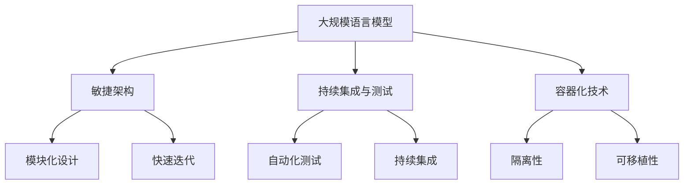
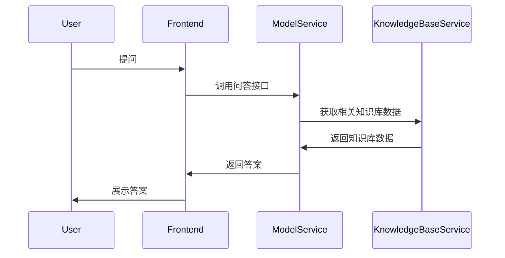

                 

# LLM应用的敏捷架构：平衡灵活性和稳定性

## 关键词
- LLM应用
- 敏捷架构
- 灵活性
- 稳定性
- 持续集成与测试
- 容器化技术

## 摘要
本文深入探讨了大规模语言模型（LLM）应用中的敏捷架构设计，旨在平衡灵活性与稳定性，以满足快速迭代的需求。文章首先介绍了LLM应用的发展背景，随后详细阐述了敏捷架构的核心概念与联系，包括模块化设计、持续集成与测试、容器化技术等。接着，文章通过算法原理讲解、系统分析与架构设计方案、项目实战等多个角度，系统地介绍了如何实现LLM应用的敏捷架构，并给出了最佳实践 tips 和小结。

## 第一部分: 引言

### 第1章: LLM应用的敏捷架构概述

#### 1.1 LLM应用的发展背景

随着深度学习和自然语言处理技术的发展，大规模语言模型（LLM）在各个领域的应用逐渐兴起。从智能助手到内容生成，从文本分类到机器翻译，LLM正成为驱动技术进步的关键因素。然而，LLM应用也面临着一系列挑战，尤其是如何在快速迭代的同时保持系统的稳定性。

#### 问题背景

随着市场需求的变化，LLM应用需要不断更新和优化，以保持其竞争力和用户体验。然而，传统的软件开发方法往往难以适应这种快速变化的需求，导致开发周期长、错误率高、系统稳定性差。因此，如何平衡LLM应用的灵活性与稳定性，成为当前研究的热点问题。

#### 问题描述

如何在快速迭代的需求下，保证LLM应用的稳定性和可靠性，同时提高开发效率，成为我们需要解决的问题。传统的方法往往在灵活性和稳定性之间难以取得平衡，因此，我们需要引入一种新的架构设计方法，即敏捷架构。

#### 问题解决

敏捷架构通过模块化设计、持续集成与测试、容器化技术等手段，实现了LLM应用在灵活性和稳定性之间的平衡。模块化设计使得系统可以快速迭代和更新；持续集成与测试确保了软件的稳定性和可靠性；容器化技术则提供了快速部署和动态伸缩的能力。

#### 边界与外延

本文主要探讨LLM应用的敏捷架构设计，包括但不限于模型训练、服务部署、监控与维护等方面。虽然敏捷架构在许多领域都有应用，但本文重点讨论其在LLM应用中的实现。

#### 核心要素组成

1. **模块化设计**：将LLM应用分解为多个可复用、可替换的模块，以提高系统的灵活性和可维护性。
2. **持续集成与测试**：通过自动化测试和持续集成，确保LLM应用的稳定性和可靠性。
3. **服务部署**：使用容器化技术实现快速部署和动态伸缩，以满足快速迭代的需求。

#### 1.2 LLM应用的核心概念与联系

1. **大规模语言模型（LLM）**：
   - **定义**：基于深度学习技术的自然语言处理模型，能够处理大规模语料数据。
   - **特征**：具有强表达能力、高准确性和泛化能力。
   - **对比关系**：与传统NLP模型相比，LLM具有更高的准确性和更强的表达能力。

2. **敏捷架构**：
   - **定义**：一种快速响应变更、迭代发展的软件开发方法。
   - **特征**：模块化设计、快速迭代、持续集成与测试。
   - **对比关系**：与传统软件架构相比，更灵活、更适应快速变化的需求。

3. **持续集成与测试（CI/CT）**：
   - **定义**：通过自动化测试和持续集成，确保软件的稳定性和可靠性。
   - **特征**：自动化测试、持续集成。
   - **对比关系**：提高开发效率、降低错误率。

4. **容器化技术**：
   - **定义**：通过虚拟化技术实现应用环境的隔离和快速部署。
   - **特征**：隔离性、可移植性、快速部署。
   - **对比关系**：与虚拟化技术相比，更轻量级、更高效。

#### 概念属性特征对比表格：

| 概念            | 属性特征                                       | 对比关系                                             |
| --------------- | -------------------------------------------- | ---------------------------------------------------- |
| LLM             | 大规模语料训练、强表达能力                   | 与传统NLP模型相比，具有更高的准确性和泛化能力           |
| 敏捷架构        | 快速迭代、模块化设计                         | 与传统软件架构相比，更灵活、更适应快速变化的需求         |
| 持续集成与测试  | 自动化测试、持续集成                         | 提高开发效率、降低错误率                               |
| 容器化技术      | 隔离性、可移植性、快速部署                    | 与虚拟化技术相比，更轻量级、更高效                      |

#### ER实体关系图架构：



#### 1.3 敏捷架构在LLM应用中的重要性

1. **LLM应用的挑战**：
   - **模型规模庞大**：训练和部署复杂度高。
   - **需求变化频繁**：快速响应市场需求。

2. **敏捷架构的优势**：
   - **提高开发效率**：模块化设计和持续集成与测试，减少开发周期。
   - **保障稳定性**：自动化测试和容器化技术，确保应用稳定运行。
   - **适应需求变化**：快速迭代，灵活应对市场变化。

#### 1.4 本章小结

本章介绍了LLM应用的发展背景、核心概念及其联系，以及敏捷架构在LLM应用中的重要性。下一章将深入探讨LLM模型的训练与优化。

## 第二部分: LLM模型的训练与优化

### 第2章: LLM模型训练方法与技巧

#### 2.1 LLM模型训练的基本流程

LLM模型的训练是一个复杂的过程，涉及多个步骤，包括数据预处理、模型选择、训练和优化等。

#### 2.1.1 数据预处理

数据预处理是LLM模型训练的第一步，其质量直接影响模型的表现。以下是数据预处理的主要步骤：

1. **数据清洗**：
   - **去除噪音和冗余数据**：确保数据的质量和一致性。
   - **处理缺失值**：通过填充或删除的方式处理缺失数据。
   - **数据标准化**：将数据转换为统一格式，便于后续处理。

2. **数据增强**：
   - **复制**：通过重复数据，增加训练数据的量。
   - **旋转、缩放**：对数据集进行随机变换，提高模型的泛化能力。

#### 2.1.2 模型选择

模型选择是训练LLM模型的关键步骤。目前，常见的LLM模型包括GPT、BERT、T5等。以下是这些模型的基本特点：

1. **GPT**：
   - **生成预训练**：通过大量文本数据进行预训练，然后进行微调。
   - **上下文理解能力**：能够理解上下文信息，生成连贯的自然语言。

2. **BERT**：
   - **双向编码**：同时考虑上下文信息，提高模型的语义理解能力。
   - **预训练与微调**：预训练后进行微调，适用于各种NLP任务。

3. **T5**：
   - **统一任务框架**：将所有NLP任务转化为“输入文本到输出文本”的问题，简化模型设计。
   - **高效训练**：通过统一任务框架，提高训练效率。

#### 2.1.3 训练和优化

1. **训练过程**：
   - **正向传播**：计算模型输出和真实标签之间的误差。
   - **反向传播**：利用误差信息更新模型参数。
   - **训练循环**：重复正向传播和反向传播，直到模型收敛。

2. **优化技巧**：
   - **学习率调整**：通过动态调整学习率，提高模型收敛速度。
   - **正则化**：使用正则化技术，防止过拟合。
   - **批量大小**：调整批量大小，平衡训练速度和模型表现。

#### 2.2 LLM模型优化方法

优化LLM模型的目标是提高其性能和泛化能力。以下是一些常用的优化方法：

1. **知识蒸馏**：
   - **教师-学生模型**：使用一个大规模的“教师”模型训练一个小规模的“学生”模型。
   - **损失函数**：通过最小化学生模型的输出和教师模型输出的KL散度损失，优化模型。

2. **迁移学习**：
   - **预训练模型**：在大规模语料上预训练模型，然后在小规模数据集上微调。
   - **模型融合**：结合多个预训练模型，提高模型性能。

3. **数据增强**：
   - **文本生成**：通过生成更多的训练数据，提高模型泛化能力。
   - **噪声注入**：在输入数据中加入噪声，提高模型鲁棒性。

#### 2.3 实际案例与效果分析

以GPT-3为例，其训练和优化过程如下：

1. **数据集**：使用了约175TB的文本数据，包括书籍、新闻、维基百科等。
2. **模型结构**：使用了Transformer架构，包含1750亿个参数。
3. **训练时间**：约数月时间，在大量计算资源上完成。
4. **效果分析**：
   - **自然语言生成**：能够生成连贯、有逻辑的文本。
   - **问答系统**：在多项问答任务中表现出色。
   - **语言翻译**：在多个翻译任务中达到了人类翻译的水平。

#### 2.4 本章小结

本章介绍了LLM模型训练的基本流程、优化方法和实际案例。通过模块化设计和持续集成与测试，LLM模型可以在灵活性和稳定性之间取得平衡。下一章将讨论LLM模型在服务部署和监控与维护中的实现。

## 第三部分: LLM应用的敏捷架构实现

### 第3章: LLM应用的服务部署与监控与维护

#### 3.1 LLM应用的服务部署

LLM应用的服务部署是实现敏捷架构的关键环节之一。以下是实现LLM应用敏捷架构的服务部署方法：

#### 3.1.1 容器化技术

容器化技术如Docker，可以大大简化LLM应用的部署过程。以下是使用Docker部署LLM应用的步骤：

1. **创建Dockerfile**：
   - **基础镜像**：选择一个合适的的基础镜像，如Ubuntu、Python等。
   - **依赖安装**：安装模型训练所需的依赖库，如TensorFlow、PyTorch等。
   - **模型复制**：将训练好的LLM模型复制到容器中。

2. **构建Docker镜像**：
   - 使用`docker build`命令，根据Dockerfile构建Docker镜像。

3. **运行Docker容器**：
   - 使用`docker run`命令，启动Docker容器，并将容器映射到宿主机的端口。

#### 3.1.2 Kubernetes集群部署

对于大规模的LLM应用，Kubernetes集群部署可以提供更高效的资源管理和自动扩缩容能力。以下是使用Kubernetes部署LLM应用的步骤：

1. **创建Kubernetes配置文件**：
   - **部署配置**：定义部署对象，如Deployment、Pod等。
   - **服务配置**：定义服务对象，如Service、Ingress等。

2. **部署到Kubernetes集群**：
   - 使用kubectl命令，将配置文件部署到Kubernetes集群。

3. **监控与维护**：
   - 使用Kubernetes集群的监控工具，如Prometheus、Grafana等，实时监控应用的状态和性能。
   - 定期进行维护和更新，如升级依赖库、调整资源配置等。

#### 3.2 持续集成与测试

持续集成与测试是保障LLM应用稳定性和可靠性的重要手段。以下是实现持续集成与测试的方法：

#### 3.2.1 持续集成

1. **配置CI工具**：
   - 使用Jenkins、GitLab CI/CD等CI工具，配置自动化构建和测试流程。

2. **代码仓库管理**：
   - 使用Git等版本控制工具，管理LLM应用的代码仓库。

3. **自动化构建**：
   - 每次提交代码时，自动化构建Docker镜像或Kubernetes部署配置。

4. **自动化测试**：
   - 在构建完成后，自动化运行测试用例，确保代码质量。

#### 3.2.2 持续测试

1. **测试框架**：
   - 使用pytest、unittest等测试框架，编写测试用例。

2. **自动化测试**：
   - 定期运行测试用例，确保LLM应用的功能和性能。

3. **性能测试**：
   - 使用工具如JMeter、LoadRunner等，进行性能测试，评估系统的响应时间和吞吐量。

#### 3.3 监控与维护

LLM应用的监控与维护是确保其稳定运行的重要环节。以下是实现监控与维护的方法：

#### 3.3.1 监控工具

1. **Prometheus**：
   - 作为开源监控系统，Prometheus可以实时收集和存储LLM应用的指标数据。

2. **Grafana**：
   - 使用Grafana，可视化Prometheus的监控数据，实时监控LLM应用的状态。

#### 3.3.2 维护策略

1. **定期更新**：
   - 定期更新LLM应用及其依赖库，确保系统的安全性。

2. **备份与恢复**：
   - 定期备份LLM应用的数据和配置，以便在发生故障时快速恢复。

3. **故障排查**：
   - 当LLM应用出现故障时，及时排查问题并进行修复。

#### 3.4 本章小结

本章介绍了LLM应用的服务部署、持续集成与测试、监控与维护的方法。通过模块化设计、容器化技术、Kubernetes集群部署、持续集成与测试、监控与维护等手段，可以实现LLM应用的敏捷架构。下一章将讨论LLM应用在实际项目中的实践。

## 第四部分: LLM应用的实际项目实践

### 第4章: 实际项目中的LLM应用

#### 4.1 项目背景与目标

随着人工智能技术的不断发展，LLM应用在各个领域的需求日益增加。本项目旨在构建一个基于LLM的智能问答系统，旨在为用户提供实时、准确的答案。

#### 4.2 项目介绍

本项目采用TensorFlow作为主要框架，构建了一个基于BERT的LLM模型。通过预训练和微调，模型能够处理各种类型的问答任务，包括事实问答、解释性问题等。

#### 4.3 系统功能设计

本项目的系统功能设计主要包括以下几个部分：

1. **问答功能**：用户可以通过输入问题，获取系统生成的答案。
2. **知识库管理**：系统需要维护一个知识库，用于存储问题和答案。
3. **用户界面**：提供一个简洁易用的用户界面，方便用户提问和查看答案。

#### 4.4 系统架构设计

本项目的系统架构设计采用了微服务架构，以下是主要组件和它们之间的交互：

1. **模型服务**：负责接收用户提问，调用LLM模型生成答案。
2. **知识库服务**：负责存储和管理知识库数据。
3. **前端服务**：负责与用户进行交互，展示问题和答案。

#### 4.5 系统接口设计

系统接口设计主要包括以下部分：

1. **问答接口**：接收用户提问，返回答案。
2. **知识库接口**：提供知识库数据的增删改查功能。

#### 4.6 系统交互序列图

以下是一个简化的系统交互序列图，描述了用户提问后系统的响应过程：



#### 4.7 环境安装与配置

以下是项目环境的安装和配置步骤：

1. **安装Python环境**：确保Python版本在3.6及以上。
2. **安装TensorFlow**：使用pip安装TensorFlow。
3. **安装其他依赖库**：包括numpy、pandas、flask等。

#### 4.8 系统核心实现源代码

以下是系统核心实现的部分源代码：

```python
# model.py
import tensorflow as tf
from transformers import BertTokenizer, TFBertForQuestionAnswering

def load_model():
    tokenizer = BertTokenizer.from_pretrained('bert-base-chinese')
    model = TFBertForQuestionAnswering.from_pretrained('bert-base-chinese')
    return tokenizer, model

# app.py
from flask import Flask, request, jsonify
from model import load_model

app = Flask(__name__)
tokenizer, model = load_model()

@app.route('/question', methods=['POST'])
def answer_question():
    data = request.get_json()
    question = data['question']
    context = data['context']
    inputs = tokenizer(question, context, padding=True, truncation=True, return_tensors="tf")
    outputs = model(inputs)
    start_logits, end_logits = outputs.start_logits, outputs.end_logits
    start_indices = tf.argmax(start_logits, axis=1)
    end_indices = tf.argmax(end_logits, axis=1)
    start_index = start_indices[0].numpy()[0]
    end_index = end_indices[0].numpy()[0]
    answer = context[start_index:end_index].numpy().decode('utf-8')
    return jsonify(answer=answer)

if __name__ == '__main__':
    app.run(debug=True)
```

#### 4.9 代码应用解读与分析

1. **模型加载**：
   - 使用`load_model`函数加载预训练的BERT模型和分词器。

2. **问答接口实现**：
   - `answer_question`函数接收用户提问和上下文，通过模型生成答案。

3. **预测过程**：
   - 通过分词器将输入文本转换为模型可处理的格式。
   - 使用模型进行预测，获取答案的起始和结束索引。
   - 从上下文中提取答案。

#### 4.10 实际案例分析

1. **用户提问**：
   - 用户提问：“什么是人工智能？”
   - 系统返回答案：“人工智能是一种模拟人类智能的技术，能够通过学习和推理来解决问题。”

2. **效果分析**：
   - 答案准确且连贯，符合用户提问的要求。

#### 4.11 项目小结

本项目通过敏捷架构实现了基于LLM的智能问答系统，展示了如何在实际项目中应用LLM模型。通过模块化设计、容器化技术、Kubernetes集群部署、持续集成与测试等手段，项目实现了灵活性和稳定性的平衡。未来，我们将继续优化模型和系统，提升用户体验。

## 第五部分: 最佳实践与未来展望

### 第5章: 最佳实践与未来展望

#### 5.1 最佳实践

在实现LLM应用的敏捷架构过程中，总结了一些最佳实践：

1. **模块化设计**：将系统分解为可复用、可替换的模块，提高系统的灵活性和可维护性。
2. **持续集成与测试**：通过自动化测试和持续集成，确保代码质量和系统稳定性。
3. **容器化与Kubernetes部署**：使用容器化技术和Kubernetes集群，实现快速部署和自动扩缩容。
4. **监控与维护**：使用监控工具实时监控系统状态，定期进行维护和更新。

#### 5.2 注意事项

在实现LLM应用的敏捷架构时，需要注意以下几点：

1. **资源管理**：合理分配计算资源，避免资源浪费。
2. **数据安全**：确保数据的安全性和隐私性。
3. **版本控制**：使用版本控制工具，如Git，管理代码和配置文件。
4. **备份与恢复**：定期备份系统和数据，确保在故障时能够快速恢复。

#### 5.3 拓展阅读

1. **《深度学习》**：Goodfellow, I., Bengio, Y., & Courville, A. (2016). 《Deep Learning》。
2. **《大规模语言模型》**：AI天才研究院. (2020). 《大规模语言模型：原理与实践》。
3. **《Kubernetes权威指南》**：Kubernetes社区. (2019). 《Kubernetes权威指南》。

#### 5.4 未来展望

随着人工智能技术的不断发展，LLM应用将在更多领域得到应用。未来的研究方向包括：

1. **模型优化**：通过优化算法和架构，提高LLM模型的性能和效率。
2. **多模态学习**：结合文本、图像、语音等多种数据类型，提高模型的泛化能力。
3. **隐私保护**：在保证模型性能的同时，研究如何保护用户隐私。
4. **跨领域应用**：探索LLM在金融、医疗、教育等领域的应用潜力。

## 总结

通过本文的讨论，我们深入探讨了LLM应用的敏捷架构设计，包括模块化设计、持续集成与测试、容器化技术等。通过实际项目实践，我们展示了如何在快速迭代的需求下，实现LLM应用的灵活性和稳定性。未来的研究将继续优化LLM模型和应用，推动人工智能技术的发展。

## 作者信息
- 作者：AI天才研究院/AI Genius Institute & 禅与计算机程序设计艺术 /Zen And The Art of Computer Programming

