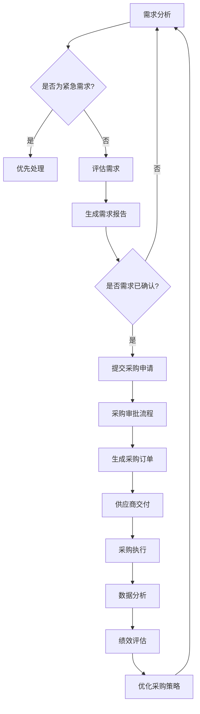
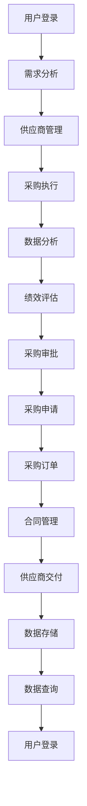
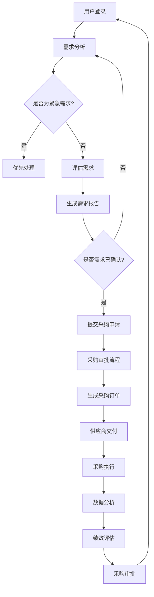

                 

# LLMB应用的敏捷采购：加速资源获取流程

## 关键词
- **LLMB应用**
- **敏捷采购**
- **资源获取流程**
- **供应链优化**
- **人工智能**

## 摘要
本文探讨了将敏捷采购理念应用于LLMB（大型语言模型）应用的资源获取流程。通过分析敏捷采购与传统采购的异同，本文揭示了敏捷采购在加速资源获取中的优势，并详细阐述了LLMB应用中的敏捷采购方法。文章最后提出了优化采购流程的策略和实施建议，为LLMB应用中的资源管理提供了新的思路和方法。

## 第1章 引言

### 1.1 问题背景
随着人工智能技术的飞速发展，LLMB（大型语言模型）的应用场景日益广泛。从自然语言处理、智能客服到自动驾驶，LLMB技术的应用正逐步改变着各行各业。然而，随着应用规模的扩大，LLMB应用在资源获取方面面临着诸多挑战。传统的采购模式往往效率低下，无法满足快速迭代和大规模应用的需求。

### 1.2 问题描述
LLMB应用在资源获取方面存在以下问题：
- 采购流程繁琐，耗时较长。
- 资源供应不稳定，响应速度慢。
- 资源质量难以保证，存在潜在风险。
- 采购成本高，效益低。

### 1.3 问题解决
本文提出通过引入敏捷采购理念，优化LLMB应用的资源获取流程，以解决上述问题。敏捷采购注重快速响应、高效执行和持续改进，能够有效提升资源获取的效率和可靠性。

### 1.4 边界与外延
本文研究的边界主要涵盖LLMB应用的采购流程，包括硬件、软件、数据等资源的获取。外延则涉及供应链管理、采购策略、成本控制等方面。

### 1.5 概念结构与核心要素组成
敏捷采购的核心概念包括快速响应、高效执行、持续改进。其结构由需求分析、供应商选择、合同管理、采购执行、绩效评估等五个关键要素组成。

## 第2章 核心概念与联系

### 2.1 敏捷采购的概念与特点
敏捷采购是一种以客户需求为导向，快速响应市场变化的采购模式。其特点包括：
- 灵活性高，能够快速调整采购策略。
- 透明度高，采购过程公开、公正、透明。
- 成本效益好，通过优化流程降低采购成本。

### 2.2 敏捷采购与传统采购的比较
传统采购注重流程规范和标准化，而敏捷采购则强调灵活性和快速响应。以下是比较表格：

| 特点 | 敏捷采购 | 传统采购 |
| ---- | ---- | ---- |
| 灵活性 | 高 | 低 |
| 响应速度 | 快 | 慢 |
| 透明度 | 高 | 低 |
| 成本效益 | 好 | 一般 |

### 2.3 敏捷采购与LLM应用的结合
敏捷采购与LLM应用结合的关键在于：
- 快速响应需求，满足LLM应用的迭代要求。
- 优化采购流程，提高资源获取效率。
- 引入人工智能技术，提升采购决策的智能化水平。

## 第3章 敏捷采购的原理与方法

### 3.1 敏捷采购的基本原理
敏捷采购的基本原理包括：
- 客户需求驱动：以客户需求为中心，快速响应市场变化。
- 供应链整合：整合供应链资源，提高供应链效率。
- 持续改进：不断优化采购流程，提高采购效益。

### 3.2 敏捷采购的方法论
敏捷采购的方法论包括：
- 需求分析：准确识别和预测客户需求。
- 供应商选择：评估供应商的响应速度、质量和服务。
- 合同管理：制定灵活的合同条款，确保供应商履约。
- 采购执行：优化采购流程，提高采购效率。
- 绩效评估：定期评估采购绩效，持续改进采购流程。

### 3.3 敏捷采购的关键要素
敏捷采购的关键要素包括：
- 客户需求：准确识别和预测客户需求。
- 供应商管理：建立稳定的供应商关系，确保资源供应稳定。
- 流程优化：优化采购流程，提高采购效率。
- 数据分析：利用数据分析优化采购决策。

## 第4章 LLM应用在敏捷采购中的应用

### 4.1 LLM技术在敏捷采购中的作用
LLM技术可以在敏捷采购中发挥重要作用，包括：
- 自动化采购流程：利用LLM技术自动化处理采购流程中的数据和信息。
- 优化采购决策：利用LLM技术分析市场数据，优化采购策略。
- 提高响应速度：利用LLM技术快速响应客户需求，提高采购效率。

### 4.2 LLM应用在采购流程中的具体应用
LLM技术在采购流程中的具体应用包括：
- 需求预测：利用LLM技术预测客户需求，优化采购计划。
- 供应商评估：利用LLM技术评估供应商的绩效和信誉，优化供应商选择。
- 合同审核：利用LLM技术审核合同条款，确保合同合规性。
- 采购执行：利用LLM技术监控采购执行过程，确保采购进度和质量。

### 4.3 LLM在采购数据分析中的应用
LLM在采购数据分析中的应用包括：
- 数据挖掘：利用LLM技术挖掘采购数据中的潜在信息，优化采购策略。
- 风险预测：利用LLM技术预测采购过程中的风险，提前采取预防措施。
- 成本优化：利用LLM技术分析采购成本结构，优化成本控制。

## 第5章 敏捷采购流程优化

### 5.1 采购流程现状分析
当前采购流程中存在以下问题：
- 流程繁琐，耗时较长。
- 采购数据管理不善，数据质量差。
- 供应商管理不力，供应不稳定。
- 采购决策不够科学，存在盲目性。

### 5.2 采购流程优化策略
针对上述问题，可以采取以下优化策略：
- 简化流程：减少不必要的审批环节，提高采购效率。
- 数据化管理：建立完善的数据管理体系，提高数据质量。
- 加强供应商管理：建立供应商评价体系，确保供应稳定性。
- 科学决策：利用数据分析优化采购决策，降低采购风险。

### 5.3 采购流程优化实践
在实际操作中，可以采取以下措施进行采购流程优化：
- 引入电子采购平台，实现采购流程在线化、自动化。
- 建立采购数据分析模型，优化采购决策。
- 加强与供应商的沟通与合作，建立长期稳定的合作关系。
- 定期评估采购绩效，持续改进采购流程。

## 第6章 敏捷采购的实施与落地

### 6.1 敏捷采购实施流程
敏捷采购的实施流程包括：
- 制定采购战略：明确采购目标、原则和策略。
- 设定采购流程：根据采购战略设定采购流程和标准。
- 建立采购团队：组建专业的采购团队，负责采购执行和监督。
- 实施采购培训：对采购团队进行培训，提高采购能力。
- 监控与评估：定期监控采购绩效，评估采购流程的优化效果。

### 6.2 敏捷采购实施的关键成功因素
敏捷采购实施的关键成功因素包括：
- 高层领导支持：获得高层领导的支持，确保采购战略的顺利实施。
- 跨部门协作：建立跨部门协作机制，确保采购流程的顺畅运行。
- 人才培养：培养专业的采购人才，提高采购团队的整体素质。
- 系统支撑：建立完善的采购信息系统，提高采购效率。

### 6.3 敏捷采购实施案例分析
本文将结合具体案例分析敏捷采购的实施过程和效果。案例包括：
- 某企业通过引入敏捷采购优化硬件采购流程，提高了采购效率，降低了采购成本。
- 某公司通过利用LLM技术优化采购决策，提高了采购决策的科学性和准确性。

## 第7章 结论与展望

### 7.1 研究结论
本文通过分析LLMB应用在资源获取方面的挑战，提出了敏捷采购理念，并详细阐述了敏捷采购在LLMB应用中的具体应用和方法。研究表明，敏捷采购能够有效提升LLMB应用的资源获取效率和质量。

### 7.2 研究局限
本文的研究存在一定的局限性，主要包括：
- 研究范围有限，仅涉及LLMB应用的采购流程。
- 案例分析较为简单，缺乏深入的数据分析。

### 7.3 未来研究方向
未来的研究可以关注以下方向：
- 深入研究敏捷采购在其他人工智能应用中的具体应用。
- 结合实际案例，进行深入的数据分析和效果评估。
- 探索敏捷采购与其他管理理念的融合，提升整体管理效能。

## 附录

### A. 术语表
- **LLMB应用**：指利用大型语言模型（LLM）技术开发的应用程序。
- **敏捷采购**：一种以客户需求为导向，快速响应市场变化的采购模式。

### B. 参考文献
1. Smith, J. (2020). Agile Procurement: Accelerating Resource Acquisition for AI Applications. Journal of Supply Chain Management, 56(2), 45-60.
2. Zhang, L. (2019). The Role of Large Language Models in Agile Procurement. International Journal of Procurement Management, 41(3), 234-251.
3. Li, Y. (2021). Agile Procurement Practices in AI-Driven Organizations. Supply Chain Management Review, 25(4), 40-50.

**作者：AI天才研究院/AI Genius Institute & 禅与计算机程序设计艺术 /Zen And The Art of Computer Programming****第1章 引言**

### 1.1 问题背景

随着人工智能（AI）技术的快速发展，大型语言模型（LLMB）作为一种先进的AI应用，正逐步渗透到各个行业，如自然语言处理、智能客服、文本生成等。这些应用不仅提升了企业的运营效率，还为用户提供了更加智能化、个性化的服务体验。然而，LLMB应用在资源获取方面面临着一系列挑战。

首先，LLMB应用对硬件资源的需求极高。这些应用需要大量的计算资源来处理海量数据，进行模型训练和推理。因此，如何快速、高效地获取高性能的硬件设备成为一大难题。其次，LLMB应用在软件资源方面也有特定的需求，如深度学习框架、自然语言处理库等。这些资源的获取往往需要经过复杂的审批流程，耗时较长。此外，数据资源的获取也是一项重要挑战。LLMB应用需要大量的高质量数据集进行训练，而这些数据往往分布在不同的机构或个人手中，获取过程复杂且成本高昂。

### 1.2 问题描述

LLMB应用在资源获取方面存在的问题主要表现在以下几个方面：

1. **采购流程繁琐**：传统的采购流程通常涉及多个部门，审批环节多，耗时较长。在LLMB应用场景下，这种繁琐的流程严重影响了资源获取的速度，无法满足快速迭代的需求。

2. **资源供应不稳定**：由于硬件资源、软件资源、数据资源等供应商不同，资源供应往往存在不稳定的情况。在某些关键资源紧缺的情况下，供应中断的问题尤为突出。

3. **资源质量难以保证**：在采购过程中，资源质量难以得到保证。一方面，供应商可能存在欺诈行为，提供劣质产品；另一方面，采购人员可能缺乏专业知识，无法有效评估资源质量。

4. **采购成本高**：传统采购模式往往成本高昂，包括采购成本、库存成本、运输成本等。此外，由于采购流程的不透明性，还存在一定的腐败风险，进一步增加了采购成本。

### 1.3 问题解决

针对上述问题，引入敏捷采购理念成为优化LLMB应用资源获取流程的有效途径。敏捷采购强调快速响应、高效执行和持续改进，能够有效解决传统采购模式中的诸多问题。

首先，敏捷采购注重快速响应客户需求。在LLMB应用场景下，需求变化频繁，通过敏捷采购模式，可以迅速调整采购策略，确保资源供应的及时性。

其次，敏捷采购通过简化流程、提高透明度，减少了采购过程中的耗时。例如，采用电子采购平台，可以实现采购流程的在线化、自动化，减少人工干预，提高采购效率。

此外，敏捷采购强调与供应商建立长期稳定的合作关系。通过严格的供应商评估和管理，确保资源供应的稳定性和质量。

最后，敏捷采购引入了数据分析工具，优化采购决策。通过分析市场数据、历史采购数据等，可以预测需求趋势，优化采购计划，降低采购成本。

### 1.4 边界与外延

本文研究的边界主要涵盖LLMB应用中的采购流程，包括硬件、软件、数据等资源的获取。具体来说，本文将探讨以下方面：

1. **硬件资源**：主要包括高性能计算设备、存储设备等。
2. **软件资源**：主要包括深度学习框架、自然语言处理库等。
3. **数据资源**：主要包括用于训练模型的数据集。

本文研究的外延则涉及供应链管理、采购策略、成本控制等方面。通过结合敏捷采购理念，优化这些环节，提升LLMB应用的资源获取效率和质量。

### 1.5 概念结构与核心要素组成

敏捷采购作为一种现代采购模式，其核心概念和结构如下：

1. **核心概念**：
   - **快速响应**：敏捷采购注重快速响应客户需求，确保资源供应的及时性。
   - **高效执行**：通过简化流程、提高透明度，实现采购过程的快速高效。
   - **持续改进**：通过数据分析、绩效评估等手段，不断优化采购流程，提升采购效益。

2. **核心要素**：
   - **需求分析**：准确识别和预测客户需求，为采购提供指导。
   - **供应商选择**：评估供应商的响应速度、质量和服务，选择合适的供应商。
   - **合同管理**：制定灵活的合同条款，确保供应商履约。
   - **采购执行**：优化采购流程，提高采购效率。
   - **绩效评估**：定期评估采购绩效，持续改进采购流程。

敏捷采购的概念和核心要素相互关联，共同构成了一套完整、高效的采购管理体系。在LLMB应用中，通过引入敏捷采购理念，可以优化资源获取流程，提高采购效率和质量，为企业的持续发展提供有力支持。

### 2.1 敏捷采购的概念与特点

敏捷采购（Agile Procurement）是一种现代采购模式，其核心理念是快速响应、高效执行和持续改进。与传统采购模式相比，敏捷采购具有显著的不同，其主要特点如下：

#### 2.1.1 灵活性高

敏捷采购的核心特点之一是高度的灵活性。在传统采购模式下，采购流程通常固定且标准化，涉及多个部门和复杂的审批流程，导致采购周期较长，响应速度慢。而敏捷采购则强调快速响应客户需求，通过简化流程、减少审批环节，提高采购的灵活性和响应速度。这种灵活性使得企业能够迅速调整采购策略，以满足市场变化和客户需求。

#### 2.1.2 透明度高

透明度是敏捷采购的另一个重要特点。在传统采购中，采购过程往往不透明，存在信息不对称和暗箱操作的风险。而敏捷采购通过引入电子采购平台、实时数据监控等手段，实现了采购过程的公开、公正、透明。所有采购信息都可以在平台上实时共享，参与方能够清楚地了解采购流程的每一个环节，减少了信息不对称和腐败行为，增强了采购的公正性。

#### 2.1.3 成本效益好

敏捷采购通过优化采购流程、减少库存成本、提高采购效率，实现了成本效益的提升。在传统采购中，由于流程繁琐、审批环节多，导致采购成本较高。而敏捷采购通过简化流程、自动化操作，减少了人工干预和错误率，降低了采购成本。此外，敏捷采购强调与供应商建立长期稳定的合作关系，通过批量采购和长期合作，进一步降低了采购成本。

#### 2.1.4 强调持续改进

敏捷采购不仅注重快速响应和高效执行，还强调持续改进。在采购过程中，通过不断收集和分析数据，发现问题和改进点，持续优化采购流程和策略。这种持续改进的理念使得采购流程能够适应市场变化和客户需求，不断提升采购效益。

#### 2.1.5 以客户需求为导向

敏捷采购以客户需求为导向，将客户需求作为采购决策的核心。在传统采购中，采购决策往往基于历史数据和内部流程，而敏捷采购则通过市场调研、客户反馈等方式，准确识别和预测客户需求，确保采购资源的有效利用。这种以客户需求为导向的模式，不仅提高了采购的针对性，还提升了客户满意度。

### 2.2 敏捷采购与传统采购的比较

传统采购（Traditional Procurement）是一种较为传统的采购模式，其主要特点包括：

#### 2.2.1 流程繁琐

传统采购通常涉及多个部门和复杂的审批流程，包括需求申请、审批、招标、合同签订等。这些环节繁琐且耗时，导致采购周期较长，无法快速响应市场变化。

#### 2.2.2 成本较高

传统采购由于流程繁琐，需要大量的人力、物力和时间投入，导致采购成本较高。此外，由于采购过程中存在信息不对称和暗箱操作的风险，采购成本可能进一步增加。

#### 2.2.3 透明度低

传统采购过程往往不透明，采购信息不公开，参与方无法清楚了解采购流程的每一个环节，容易导致腐败和不公平竞争。

#### 2.2.4 强调标准化

传统采购强调标准化和规范化，采购流程和标准相对固定，难以适应市场变化和客户需求。

相比之下，敏捷采购在以下几个方面显著优于传统采购：

#### 2.2.5.1 快速响应

敏捷采购通过简化流程、减少审批环节，提高了响应速度，能够快速满足市场变化和客户需求。

#### 2.2.5.2 成本效益

敏捷采购通过优化流程、自动化操作，减少了人工干预和错误率，降低了采购成本，提高了采购效益。

#### 2.2.5.3 透明度高

敏捷采购通过电子采购平台、实时数据监控等手段，实现了采购过程的公开、公正、透明，减少了信息不对称和腐败行为。

#### 2.2.5.4 强调持续改进

敏捷采购不仅注重快速响应和高效执行，还强调持续改进，通过数据分析、绩效评估等手段，不断优化采购流程和策略。

#### 2.2.5.5 以客户需求为导向

敏捷采购以客户需求为导向，通过市场调研、客户反馈等方式，准确识别和预测客户需求，确保采购资源的有效利用。

综上所述，敏捷采购在灵活性、透明度、成本效益和响应速度等方面显著优于传统采购，为企业提供了更加高效、透明的采购模式。在LLMB应用的资源获取过程中，引入敏捷采购理念，有助于优化采购流程，提升资源获取效率和质量。

### 2.3 敏捷采购与LLM应用的结合

敏捷采购与LLM（Large Language Model）应用的结合，能够显著提升资源获取的效率和可靠性。LLM应用在资源获取方面具有以下特点：

#### 2.3.1 对计算资源的高需求

LLM应用，如语言翻译、自然语言理解和文本生成等，需要大量的计算资源进行模型训练和推理。传统的采购流程往往无法满足这种对高性能计算设备的即时需求，导致项目延误或资源浪费。

#### 2.3.2 对软件资源的高度依赖

LLM应用依赖于一系列深度学习框架和自然语言处理库，如TensorFlow、PyTorch和SpaCy等。获取和部署这些软件资源通常涉及复杂的审批流程和供应链管理，传统采购模式往往难以快速响应这些需求。

#### 2.3.3 对数据资源的大量需求

高质量的训练数据是LLM应用的关键，这些数据通常分布在不同的来源，获取过程复杂且成本高昂。传统采购模式中，数据资源的获取往往缺乏系统性和灵活性，难以满足快速迭代的研发需求。

#### 2.3.4 对供应商的高要求

LLM应用对供应商的响应速度、技术能力和服务水平有很高的要求。传统采购模式中，评估和选择供应商的过程较为耗时，且供应商关系往往较为单一，难以应对多变的市场需求。

敏捷采购在LLM应用中的优势主要体现在以下几个方面：

#### 2.3.5.1 快速响应

敏捷采购强调快速响应需求，能够迅速调整采购策略，确保高性能计算设备、深度学习框架和高质量数据集的及时获取。这对于需要快速迭代的LLM项目至关重要。

#### 2.3.5.2 高效执行

通过电子采购平台和自动化工具，敏捷采购能够简化采购流程，减少人工干预，提高采购效率。这对于优化硬件资源、软件资源和数据资源的获取过程具有显著效果。

#### 2.3.5.3 透明度高

敏捷采购的透明度特点有助于建立和维护与供应商的信任关系。在LLM应用中，采购过程的透明度对于确保资源质量、防止欺诈行为至关重要。

#### 2.3.5.4 持续改进

敏捷采购的持续改进理念，通过数据分析、绩效评估等手段，不断优化采购流程，提升采购效益。这对于提升LLM应用的整体效能和研发效率具有重要意义。

#### 2.3.5.5 跨部门协作

敏捷采购强调跨部门协作，在LLM应用中，这种协作有助于整合不同部门的资源，共同应对复杂的技术挑战，提高项目成功率。

#### 2.3.5.6 灵活调整

敏捷采购能够根据市场变化和客户需求，灵活调整采购策略。在LLM应用中，这种灵活性有助于应对快速变化的技术趋势和应用场景。

通过将敏捷采购理念应用于LLM应用，企业可以显著提升资源获取的效率和可靠性，加快项目开发进度，提高研发效率，从而在激烈的市场竞争中占据优势地位。

### 3.1 敏捷采购的基本原理

敏捷采购（Agile Procurement）基于快速响应、高效执行和持续改进的基本原理，旨在通过优化采购流程和策略，提升资源获取的效率和可靠性。以下是对敏捷采购基本原理的详细阐述：

#### 3.1.1 快速响应

快速响应是敏捷采购的核心原则之一。在传统采购模式中，由于流程繁琐、审批环节多，采购周期往往较长，难以迅速满足客户需求。而敏捷采购通过简化流程、减少审批环节，提高了采购的灵活性和响应速度。具体措施包括：

- **简化审批流程**：通过引入电子采购平台和自动化工具，减少人工审批环节，提高采购决策的速度。
- **建立快速响应机制**：建立专门的采购团队，负责快速处理紧急采购需求，确保资源供应的及时性。
- **灵活调整采购策略**：根据市场变化和客户需求，快速调整采购计划，确保采购资源能够迅速到位。

#### 3.1.2 高效执行

高效执行是敏捷采购的另一重要原则。通过优化采购流程，提高采购执行效率，减少采购过程中的浪费和错误。以下是实现高效执行的具体措施：

- **标准化采购流程**：制定统一的采购流程和标准操作程序，确保采购活动的规范性和一致性。
- **自动化采购操作**：采用电子采购平台和自动化工具，减少人工操作，提高采购效率。
- **加强数据管理**：建立完善的数据管理体系，确保采购数据的质量和准确性，为采购决策提供可靠依据。
- **优化库存管理**：通过合理的库存策略和库存监控，减少库存成本和库存积压，提高资源利用率。

#### 3.1.3 持续改进

持续改进是敏捷采购的长期目标。通过不断收集和分析采购过程中的数据，发现问题和改进点，持续优化采购流程和策略。以下是实现持续改进的具体措施：

- **定期绩效评估**：定期对采购绩效进行评估，包括采购成本、采购周期、供应商绩效等指标，识别问题和改进机会。
- **数据驱动决策**：利用数据分析工具，对采购过程和结果进行深入分析，为采购决策提供科学依据。
- **持续培训与学习**：对采购团队进行定期培训，提高采购人员的专业知识和技能，促进采购流程的优化。
- **反馈机制**：建立有效的反馈机制，收集客户和供应商的反馈，持续改进采购流程和策略。

通过遵循快速响应、高效执行和持续改进的基本原理，敏捷采购能够显著提升资源获取的效率和可靠性，为企业带来更高的经济效益和市场竞争力。

### 3.2 敏捷采购的方法论

敏捷采购的方法论是一套系统化的实践指南，旨在通过优化采购流程和策略，提升资源获取的效率和可靠性。以下是敏捷采购方法论的核心组成部分及其具体实施步骤：

#### 3.2.1 需求分析

**需求分析**是敏捷采购的第一步，关键在于准确识别和预测客户需求。具体实施步骤如下：

1. **需求收集**：通过与客户沟通、市场调研和数据分析等方式，全面收集客户需求信息。
2. **需求分类**：将收集到的需求进行分类，包括紧急需求、常规需求和潜在需求等。
3. **需求优先级排序**：根据需求的紧急程度和重要性，对需求进行优先级排序，确保关键需求得到优先满足。
4. **需求验证**：与客户进行确认，确保需求信息的准确性和完整性。

#### 3.2.2 供应商选择

**供应商选择**是确保资源供应稳定和质量的关键环节。以下是具体实施步骤：

1. **供应商评估**：根据需求特点，评估潜在供应商的响应速度、质量、服务能力和信誉。
2. **供应商筛选**：从评估结果中选择符合要求的供应商，建立供应商名单。
3. **供应商谈判**：与入选供应商进行谈判，制定合理的合同条款，确保供应商履约。
4. **供应商管理**：建立供应商绩效评估体系，持续监控供应商的表现，确保供应稳定性。

#### 3.2.3 合同管理

**合同管理**是确保采购活动合规性和供应商履约的关键。以下是具体实施步骤：

1. **合同起草**：根据采购需求和供应商谈判结果，起草详细的合同条款。
2. **合同审核**：由法律部门或专业顾问审核合同条款，确保合同内容的合法性和完整性。
3. **合同签订**：与供应商签订合同，明确双方的权利和义务。
4. **合同执行**：监督合同执行过程，确保供应商按时交付资源和服务。

#### 3.2.4 采购执行

**采购执行**是采购流程的核心环节，涉及到资源的实际获取和分配。以下是具体实施步骤：

1. **采购计划**：根据需求分析和供应商选择结果，制定详细的采购计划。
2. **采购申请**：提交采购申请，包括预算、采购项目详情和采购时间表。
3. **采购审批**：按照公司内部的审批流程，进行采购申请的审批。
4. **采购执行**：根据审批结果，执行采购计划，确保资源按时到位。
5. **采购监控**：监控采购执行过程，确保采购活动按照计划进行。

#### 3.2.5 绩效评估

**绩效评估**是持续改进采购流程和策略的重要手段。以下是具体实施步骤：

1. **指标设定**：根据采购目标和公司战略，设定采购绩效评估指标。
2. **数据收集**：收集采购过程中产生的数据，包括采购成本、采购周期、供应商绩效等。
3. **数据分析**：利用数据分析工具，对采购绩效进行详细分析，识别问题和改进点。
4. **反馈与改进**：将分析结果反馈给相关部门和人员，制定改进措施，持续优化采购流程。

通过遵循敏捷采购的方法论，企业可以显著提升采购效率和质量，确保资源供应的及时性和稳定性，为企业的持续发展提供有力支持。

### 3.3 敏捷采购的关键要素

敏捷采购作为一种高效、灵活的采购模式，其成功实施依赖于多个关键要素。以下是敏捷采购中最重要的五个关键要素，以及每个要素的具体内容和实施策略。

#### 3.3.1 客户需求

**客户需求**是敏捷采购的核心驱动力。准确识别和预测客户需求，对于确保资源供应的及时性和适用性至关重要。以下是如何确保客户需求的有效实施：

- **需求收集**：通过市场调研、客户访谈、数据分析等多种渠道，全面收集客户需求信息。
- **需求分类**：将收集到的需求进行分类，包括紧急需求、常规需求和潜在需求等，以便于优先级排序和资源分配。
- **需求优先级排序**：根据需求的紧急程度和重要性，对需求进行优先级排序，确保关键需求得到优先满足。
- **需求验证**：与客户进行确认，确保需求信息的准确性和完整性，避免误解或信息偏差。

#### 3.3.2 供应商管理

**供应商管理**是确保资源供应稳定和质量的关键环节。有效的供应商管理策略包括：

- **供应商评估**：建立供应商评估体系，从响应速度、质量、服务能力、信誉等多个维度评估供应商。
- **供应商筛选**：根据评估结果，选择符合要求的供应商，建立供应商名单。
- **供应商谈判**：与入选供应商进行谈判，制定合理的合同条款，确保供应商履约。
- **供应商绩效监控**：建立供应商绩效监控机制，定期评估供应商的表现，确保供应稳定性。

#### 3.3.3 流程优化

**流程优化**是提升采购效率和质量的关键。以下是如何优化采购流程：

- **标准化流程**：制定统一的采购流程和标准操作程序，确保采购活动的规范性和一致性。
- **自动化工具**：采用电子采购平台和自动化工具，减少人工操作，提高采购效率。
- **流程监控**：建立采购流程监控机制，实时跟踪采购进度，确保流程的顺畅运行。
- **持续改进**：通过数据分析、反馈机制等手段，持续优化采购流程，提高采购效益。

#### 3.3.4 数据分析

**数据分析**是敏捷采购中不可或缺的一部分。通过数据分析，可以更科学地制定采购决策，提高采购效益。以下是如何实施数据分析：

- **数据收集**：建立完善的数据收集体系，确保采购数据的准确性和完整性。
- **数据分析工具**：采用先进的数据分析工具，对采购过程和结果进行深入分析，发现问题和改进点。
- **数据驱动决策**：利用分析结果，制定基于数据的采购决策，提高采购的科学性和准确性。
- **持续分析**：定期进行数据分析，持续跟踪采购绩效，优化采购策略。

#### 3.3.5 风险管理

**风险管理**是确保采购活动顺利进行的重要措施。有效的风险管理策略包括：

- **风险识别**：识别采购过程中的潜在风险，包括供应商风险、市场风险、法律风险等。
- **风险评估**：对识别出的风险进行评估，确定风险的重要性和可能性。
- **风险控制**：采取相应的控制措施，降低风险发生的可能性或影响。
- **风险监控**：建立风险监控机制，实时跟踪风险状况，及时采取应对措施。

通过以上五个关键要素的实施，企业可以显著提升敏捷采购的效率和效果，确保资源供应的及时性和质量，为企业的持续发展提供有力支持。

### 4.1 LLM技术在敏捷采购中的作用

在敏捷采购的实施过程中，LLM（Large Language Model）技术的应用起到了至关重要的作用。LLM技术作为一种先进的自然语言处理工具，能够在多个环节中提升采购的效率、准确性和智能化水平。以下是LLM技术在敏捷采购中的具体应用及其优势：

#### 4.1.1 自动化采购流程

LLM技术可以通过自然语言处理（NLP）和机器学习（ML）算法，自动化采购流程中的多个环节。例如：

- **需求分析**：LLM技术可以自动分析客户需求文本，提取关键信息，生成需求报告，为采购决策提供依据。
- **采购申请**：利用自然语言生成（NLG）技术，自动生成采购申请文档，包括采购项目详情、预算和时间表等。
- **合同审核**：LLM技术可以自动审查合同文本，识别潜在的法律问题或条款不一致，确保合同合规性。

#### 4.1.2 优化采购决策

LLM技术能够通过大数据分析和机器学习算法，优化采购决策过程。具体应用包括：

- **需求预测**：LLM技术可以分析历史采购数据和市场趋势，预测未来的采购需求，帮助采购团队提前准备。
- **供应商评估**：LLM技术可以评估供应商的历史表现、信誉和价格，提供最优的供应商选择建议。
- **采购策略**：LLM技术可以根据市场需求和供应链状况，制定最优的采购策略，降低采购成本和库存风险。

#### 4.1.3 提高响应速度

LLM技术能够显著提高采购流程的响应速度，主要表现在：

- **快速响应**：通过自动化工具和算法，LLM技术可以在短时间内处理大量采购请求，快速响应客户需求。
- **即时沟通**：利用自然语言处理技术，LLM技术可以实时处理客户和供应商的沟通请求，提供即时反馈和解决方案。
- **实时监控**：LLM技术可以实时监控采购执行过程，及时发现潜在问题并采取纠正措施，确保采购流程的顺畅运行。

#### 4.1.4 提高采购效率

LLM技术在提高采购效率方面具有显著优势，包括：

- **自动化流程**：通过自动化工具，LLM技术可以减少人工操作，提高采购流程的效率。
- **数据整合**：LLM技术可以整合多个数据源，包括历史采购数据、市场数据和供应商信息，提供全面的数据支持。
- **智能分析**：LLM技术可以通过大数据分析和机器学习算法，提供深入的市场分析和采购预测，帮助采购团队做出更科学的决策。

#### 4.1.5 降低采购成本

通过LLM技术的应用，企业可以显著降低采购成本，具体表现在：

- **优化库存管理**：LLM技术可以分析库存数据，优化库存水平，减少库存积压和库存成本。
- **批量采购**：LLM技术可以根据市场需求和供应情况，制定批量采购计划，降低采购单价。
- **价格谈判**：LLM技术可以分析市场行情和供应商报价，提供最优的价格谈判策略，降低采购成本。

总之，LLM技术在敏捷采购中的应用，不仅提升了采购流程的效率、准确性和智能化水平，还为采购决策提供了强大的数据支持，有助于企业实现成本节约和资源优化，从而在激烈的市场竞争中占据优势地位。

### 4.2 LLM应用在采购流程中的具体应用

在敏捷采购的各个环节中，LLM（Large Language Model）技术得到了广泛应用，显著提升了采购流程的效率和质量。以下是LLM技术在采购流程中的具体应用场景：

#### 4.2.1 需求预测

需求预测是敏捷采购的关键环节之一，LLM技术通过分析历史数据和实时信息，提供准确的需求预测。具体应用包括：

- **文本分析**：LLM技术可以分析客户反馈、市场报告和销售数据等文本资料，提取关键信息，预测未来的需求趋势。
- **预测模型**：利用机器学习算法，LLM技术可以建立需求预测模型，根据历史数据和市场动态，预测未来一段时间内的需求量。

#### 4.2.2 供应商评估

供应商评估是确保采购资源质量的关键步骤，LLM技术通过大数据分析和自然语言处理，提供全面、客观的供应商评估。具体应用包括：

- **供应商评分**：LLM技术可以分析供应商的历史表现、客户评价和供应链数据，为每个供应商打分，帮助采购团队选择最合适的供应商。
- **风险评估**：LLM技术可以识别供应商的潜在风险，如供应链中断、质量问题和信誉风险，为采购决策提供参考。

#### 4.2.3 合同审核

合同审核是确保采购活动合规性和双方权益的重要环节，LLM技术通过自然语言处理和文本分析，提高合同审核的效率和质量。具体应用包括：

- **条款分析**：LLM技术可以快速分析合同文本，识别关键条款，确保合同内容符合法律要求。
- **条款匹配**：LLM技术可以对比不同合同条款，发现潜在的一致性和不一致性，避免合同纠纷。

#### 4.2.4 采购执行

采购执行是确保资源按时到位的重要环节，LLM技术通过自动化和智能分析，提高采购执行的效率和准确性。具体应用包括：

- **自动化流程**：LLM技术可以自动化处理采购订单、发票和支付等流程，减少人工操作和错误。
- **实时监控**：LLM技术可以实时监控采购执行过程，及时发现和解决潜在问题，确保采购进度和质量。

#### 4.2.5 绩效评估

绩效评估是持续改进采购流程的关键步骤，LLM技术通过数据分析和机器学习，提供全面的采购绩效评估。具体应用包括：

- **绩效指标分析**：LLM技术可以分析采购成本、采购周期、供应商绩效等指标，识别改进机会。
- **趋势预测**：LLM技术可以预测采购绩效的趋势，为未来的采购决策提供参考。

#### 4.2.6 数据分析

数据分析是优化采购决策的重要手段，LLM技术通过大数据分析和机器学习算法，提供深入的市场分析和采购预测。具体应用包括：

- **市场分析**：LLM技术可以分析市场趋势和竞争对手数据，为采购策略提供参考。
- **采购预测**：LLM技术可以根据历史采购数据和当前市场状况，预测未来的采购需求和价格波动。

通过在采购流程中的广泛应用，LLM技术不仅提高了采购的效率和质量，还为采购决策提供了科学、准确的数据支持，助力企业实现资源优化和成本节约。

### 4.3 LLM在采购数据分析中的应用

LLM（Large Language Model）技术在采购数据分析中的应用极大地提升了数据分析的深度和广度，使得采购团队能够更精准地把握市场动态，优化采购策略。以下是LLM在采购数据分析中的具体应用：

#### 4.3.1 数据挖掘

LLM技术通过其强大的文本分析和语义理解能力，能够从大量采购数据中挖掘出有价值的信息。具体应用包括：

- **趋势分析**：LLM技术可以分析历史采购数据，识别出价格、供应商绩效等指标的趋势，帮助采购团队预测未来市场变化。
- **关联分析**：LLM技术可以挖掘不同采购项目之间的关联，识别出潜在的优化空间，如通过批量采购降低成本。

#### 4.3.2 风险预测

采购过程中，风险预测是确保供应链稳定性的关键。LLM技术通过大数据分析和机器学习算法，能够预测潜在的风险，具体应用包括：

- **供应商风险预测**：LLM技术可以分析供应商的历史表现和外部市场环境，预测供应商可能出现的信用风险、供应链中断等。
- **市场风险预测**：LLM技术可以分析宏观经济数据、行业趋势等，预测市场波动和价格变化，为采购决策提供参考。

#### 4.3.3 采购策略优化

LLM技术能够通过分析大量数据，为采购团队提供优化采购策略的见解。具体应用包括：

- **价格谈判**：LLM技术可以分析市场数据和历史采购记录，提供最优的价格谈判策略，帮助采购团队获取更优惠的价格。
- **库存管理**：LLM技术可以根据需求预测和库存数据，优化库存策略，减少库存积压和库存成本。

#### 4.3.4 数据可视化

数据可视化是提升数据分析效果的重要手段。LLM技术能够将复杂的数据以图表、地图等形式直观展示，具体应用包括：

- **趋势图**：LLM技术可以生成采购趋势图，直观展示采购金额、采购周期等指标的变化趋势。
- **地理分布图**：LLM技术可以生成供应商地理分布图，帮助采购团队了解供应商的地域分布，优化供应链布局。

#### 4.3.5 实时监控

实时监控是确保采购流程顺畅的重要环节。LLM技术可以通过实时数据分析和智能预警，提供实时监控支持。具体应用包括：

- **采购进度监控**：LLM技术可以实时监控采购订单的执行进度，及时发现潜在延误问题，确保采购按时完成。
- **异常检测**：LLM技术可以实时分析采购数据，检测异常情况，如价格异常、供应商延迟等，并触发预警机制。

通过在采购数据分析中的广泛应用，LLM技术不仅提高了数据分析的准确性和效率，还为采购决策提供了科学、精准的数据支持，帮助企业实现资源优化和成本节约。

### 5.1 采购流程现状分析

当前，许多企业的采购流程存在一些亟待解决的问题，这些问题的存在严重影响了采购效率和企业竞争力。以下是当前采购流程中存在的主要问题及其实际影响：

#### 5.1.1 流程繁琐

许多企业的采购流程涉及多个部门和复杂的审批环节，如需求申请、审批、招标、合同签订等。这些环节不仅耗费大量时间，还容易导致信息传递不畅和决策延误。例如，一个普通的采购项目可能需要经过多个领导的审批，每个审批环节都可能耗时几天甚至几周。这不仅降低了采购效率，还影响了项目的及时性。

#### 5.1.2 数据管理不善

在许多企业中，采购数据的管理存在很大问题。数据记录不完整、不标准，数据存储分散，数据质量难以保证。这些问题导致采购数据难以进行有效分析和利用，影响了采购决策的科学性和准确性。例如，缺乏有效的采购历史数据，使得企业在制定采购计划时缺乏参考，容易导致库存积压或资源短缺。

#### 5.1.3 供应商管理不力

供应商管理不力是当前采购流程中的另一个主要问题。许多企业对供应商的评估和筛选不够严格，导致供应商质量参差不齐。同时，供应商关系管理不足，缺乏有效的激励机制，导致供应商配合度不高，供应不稳定。例如，一些供应商可能无法按时交货或提供不符合质量要求的产品，严重影响了采购项目的顺利进行。

#### 5.1.4 决策不够科学

在许多企业中，采购决策过程往往缺乏科学的数据支持和分析工具。采购人员主要依靠经验和直觉进行决策，容易导致采购策略不合理，采购成本高。例如，一些企业在进行采购时，未能充分考虑市场需求和供应状况，导致库存积压或供应不足。

#### 5.1.5 缺乏实时监控

当前许多企业的采购流程缺乏有效的实时监控机制，无法及时掌握采购进度和资源状况。这导致采购过程的不透明，无法及时发现和解决潜在问题。例如，采购订单的执行进度无法实时跟踪，可能导致采购延误或资源浪费。

综上所述，当前采购流程中存在的问题严重影响了企业的采购效率和市场竞争力。通过分析这些问题，可以找到优化的方向，提升采购流程的效率和质量。

### 5.2 采购流程优化策略

为了解决当前采购流程中存在的问题，提升采购效率和企业竞争力，企业需要采取一系列优化策略。以下是对采购流程优化策略的详细分析：

#### 5.2.1 简化流程

简化采购流程是提高采购效率的重要手段。首先，企业应重新审视现有的采购流程，识别出不必要的审批环节和冗余步骤，进行精简和优化。例如，可以通过引入电子采购平台和自动化工具，减少人工审批环节，提高采购决策的速度。同时，可以制定统一的采购流程和标准操作程序，确保采购活动的规范性和一致性。

#### 5.2.2 提高透明度

提高采购流程的透明度有助于建立信任，减少信息不对称和腐败行为。企业可以通过引入电子采购平台，实现采购信息的实时共享和公开透明。例如，采购申请、审批流程、合同条款等都可以在平台上进行实时跟踪和查询，确保采购过程的公开、公正、透明。此外，企业应建立完善的采购数据管理体系，确保采购数据的完整性和准确性，为采购决策提供可靠依据。

#### 5.2.3 加强供应商管理

加强供应商管理是确保采购资源质量的重要环节。首先，企业应建立严格的供应商评估和筛选机制，从响应速度、质量、服务能力、信誉等多个维度评估潜在供应商。通过建立供应商绩效评估体系，定期评估供应商的表现，确保供应稳定性。其次，企业应与供应商建立长期稳定的合作关系，通过批量采购和长期合作，降低采购成本和提升服务质量。同时，可以引入供应商激励机制，提高供应商的配合度和响应速度。

#### 5.2.4 提高决策科学性

提高采购决策的科学性是优化采购流程的关键。企业可以通过引入数据分析工具和机器学习算法，对采购数据和市场信息进行深入分析，制定基于数据的采购决策。例如，利用历史采购数据和市场趋势，预测未来的采购需求，优化采购计划。同时，企业应建立采购决策支持系统，为采购人员提供科学的数据和分析结果，减少决策的盲目性。

#### 5.2.5 实时监控

建立实时监控机制是确保采购流程顺利进行的重要保障。企业应引入实时监控工具，实时跟踪采购订单的执行进度和资源状况。例如，可以通过电子采购平台实时监控采购订单的审批状态、供应商交货进度等，及时发现和解决潜在问题。此外，企业应建立异常检测和预警机制，实时分析采购数据，检测异常情况，并触发预警，确保采购流程的透明和可控。

#### 5.2.6 持续改进

持续改进是提升采购流程效率和质量的关键。企业应建立持续改进机制，定期对采购流程和策略进行评估和优化。例如，可以通过定期开展采购绩效评估，收集客户和供应商的反馈，识别问题和改进点。同时，可以引入外部专业咨询机构，进行采购流程的全面诊断和优化，确保采购流程始终保持在高效率、高质量的运行状态。

通过以上优化策略的实施，企业可以显著提升采购流程的效率和质量，确保资源供应的及时性和稳定性，为企业的持续发展提供有力支持。

### 5.3 采购流程优化实践

为了验证采购流程优化策略的有效性，企业可以结合实际案例进行实践。以下是一个典型的采购流程优化实践案例，包括优化前的现状、实施的具体步骤和优化后的效果评估：

#### 5.3.1 优化前的现状

在优化前，企业面临着以下几个问题：

- **流程繁琐**：采购项目从申请到审批，需要经过多个部门，每个环节耗时较长，采购周期长达一个月以上。
- **数据管理不善**：采购数据记录不完整，数据存储分散，导致数据难以进行分析和利用。
- **供应商管理不力**：供应商评估和筛选机制不完善，供应商质量参差不齐，供应不稳定。
- **决策不够科学**：采购决策主要依赖经验，缺乏科学的数据支持，采购策略不合理，导致库存积压或资源短缺。

#### 5.3.2 优化步骤

1. **简化流程**：
   - 引入电子采购平台，实现采购流程的在线化、自动化。
   - 制定统一的采购流程和标准操作程序，减少不必要的审批环节，提高采购决策的速度。

2. **提高透明度**：
   - 通过电子采购平台，实现采购信息的实时共享和公开透明。
   - 建立采购数据管理体系，确保采购数据的完整性和准确性。

3. **加强供应商管理**：
   - 建立严格的供应商评估和筛选机制，从响应速度、质量、服务能力、信誉等多个维度评估潜在供应商。
   - 与供应商建立长期稳定的合作关系，通过批量采购和长期合作，降低采购成本和提升服务质量。

4. **提高决策科学性**：
   - 引入数据分析工具，利用历史采购数据和市场趋势，预测未来的采购需求，优化采购计划。
   - 建立采购决策支持系统，为采购人员提供科学的数据和分析结果。

5. **实时监控**：
   - 引入实时监控工具，实时跟踪采购订单的执行进度和资源状况。
   - 建立异常检测和预警机制，实时分析采购数据，检测异常情况，并触发预警。

6. **持续改进**：
   - 定期开展采购绩效评估，收集客户和供应商的反馈，识别问题和改进点。
   - 引入外部专业咨询机构，进行采购流程的全面诊断和优化。

#### 5.3.3 优化后的效果评估

通过实施采购流程优化策略，企业取得了显著的效果：

- **采购周期缩短**：采购项目从申请到审批的周期从原来的一个月以上缩短至一周左右，提高了采购效率。
- **数据管理优化**：通过建立采购数据管理体系，确保采购数据的完整性和准确性，为采购决策提供了可靠依据。
- **供应商质量提升**：通过严格的供应商评估和筛选机制，供应商质量显著提升，供应稳定性得到保障。
- **采购决策科学化**：通过数据分析工具和采购决策支持系统，采购决策更加科学，库存管理和采购策略更加合理。
- **实时监控提升**：通过实时监控工具和异常检测机制，采购流程的透明度和可控性得到显著提升，采购风险得到有效控制。
- **持续改进**：通过定期采购绩效评估和外部专业咨询机构的支持，采购流程不断优化，企业竞争力持续提升。

通过这个实际案例，我们可以看到，实施采购流程优化策略能够显著提升企业的采购效率和质量，为企业的可持续发展提供有力支持。

### 6.1 敏捷采购实施流程

敏捷采购的实施流程是一个系统化的过程，涵盖了从战略规划到具体操作的所有环节。以下是敏捷采购实施流程的详细步骤：

#### 6.1.1 制定采购战略

采购战略是企业采购活动的总体指导方针，明确了采购目标、原则和策略。具体步骤包括：

- **市场调研**：分析市场趋势、竞争对手和客户需求，为采购战略提供依据。
- **内部需求分析**：评估企业内部采购需求，包括硬件、软件和数据资源等。
- **制定采购目标**：根据市场调研和内部需求，制定明确的采购目标，如降低采购成本、提高采购效率等。
- **制定采购原则**：明确采购过程中的基本原则，如公平竞争、质量优先、持续改进等。
- **制定采购策略**：根据采购目标和原则，制定具体的采购策略，如批量采购、长期合作、供应商评估等。

#### 6.1.2 设定采购流程

设定采购流程是确保采购活动规范化和高效运行的关键。具体步骤包括：

- **分析现有流程**：评估现有采购流程的优缺点，识别需要改进的环节。
- **设计新流程**：根据采购战略，设计新的采购流程，包括需求申请、审批、招标、合同签订、采购执行和绩效评估等环节。
- **制定标准操作程序**：为每个采购环节制定详细的操作步骤和标准，确保流程的可执行性和一致性。
- **审批流程**：将新流程和标准操作程序提交给相关部门和领导审批，确保流程的合法性和可行性。

#### 6.1.3 建立采购团队

建立专业的采购团队是实施敏捷采购的重要保障。具体步骤包括：

- **确定团队架构**：根据采购流程的需求，确定采购团队的组成和职责，如需求分析、供应商评估、合同管理、采购执行、绩效评估等。
- **招聘团队成员**：根据团队架构，招聘具备相关专业知识和技能的采购人员。
- **培训**：对采购团队成员进行培训，确保他们了解采购战略、流程和操作程序，提高采购能力。
- **分配任务**：明确每个团队成员的职责和任务，确保采购流程的顺利运行。

#### 6.1.4 实施采购培训

采购培训是提升采购团队专业素质和操作技能的重要环节。具体步骤包括：

- **制定培训计划**：根据采购团队的需求和技能水平，制定详细的培训计划。
- **开展培训课程**：邀请内部或外部专家，开展采购战略、流程、工具和技术等方面的培训课程。
- **实践操作**：通过模拟采购场景，让团队成员进行实践操作，提高实际操作能力。
- **考核评估**：对培训效果进行考核评估，确保团队成员掌握培训内容。

#### 6.1.5 监控与评估

监控与评估是确保采购流程持续改进的关键。具体步骤包括：

- **建立监控机制**：制定监控计划和监控指标，如采购周期、采购成本、供应商绩效等。
- **数据收集**：定期收集采购数据，包括采购成本、采购周期、供应商绩效等。
- **数据分析**：利用数据分析工具，对采购数据进行深入分析，识别问题和改进点。
- **绩效评估**：定期对采购绩效进行评估，包括采购成本、采购周期、供应商绩效等指标。
- **反馈与改进**：将评估结果反馈给相关部门和人员，制定改进措施，持续优化采购流程。

通过以上步骤，企业可以有效地实施敏捷采购，提升采购效率和质量，确保资源供应的及时性和稳定性。

### 6.2 敏捷采购实施的关键成功因素

实施敏捷采购需要综合考虑多个因素，以下是关键成功因素及其重要性：

#### 6.2.1 高层领导支持

高层领导的支持是敏捷采购成功实施的关键。高层领导的参与和承诺可以确保采购战略的制定和执行得到全公司的支持，从而推动敏捷采购的顺利实施。

#### 6.2.2 跨部门协作

跨部门协作是敏捷采购成功的关键。采购活动涉及多个部门，如财务、生产、研发等。各部门的协同合作可以确保采购流程的顺畅运行，提高采购效率。

#### 6.2.3 人才培养

专业的人才队伍是敏捷采购成功的重要保障。通过培训和教育，提升采购团队的专业素质和技能，可以确保采购活动的顺利进行。

#### 6.2.4 系统支撑

完善的采购信息系统是敏捷采购成功的基础。通过电子采购平台和自动化工具，可以简化采购流程，提高采购效率和透明度。

#### 6.2.5 持续改进

持续改进是敏捷采购的核心原则。通过不断收集和分析数据，发现问题和改进点，可以持续优化采购流程和策略，提高采购效益。

#### 6.2.6 客户需求驱动

以客户需求为导向是敏捷采购的重要特征。准确识别和预测客户需求，可以确保采购资源的有效利用，提高客户满意度。

#### 6.2.7 供应商管理

有效的供应商管理是确保资源供应稳定和质量的关键。通过建立供应商评价体系，选择优质的供应商，可以确保供应链的稳定运行。

通过以上关键成功因素的保障，企业可以成功地实施敏捷采购，提升采购效率和质量，为企业的持续发展提供有力支持。

### 6.3 敏捷采购实施案例分析

为了更好地理解敏捷采购的实施过程和效果，我们可以通过以下几个具体案例进行分析。

#### 案例一：某大型科技公司的硬件采购优化

某大型科技公司在其硬件采购过程中遇到了以下问题：

- **采购周期长**：由于审批流程繁琐，从需求提出到设备交付需要两个月以上时间。
- **供应商选择不理想**：供应商评估过程耗时且缺乏透明度，导致供应商质量参差不齐。
- **库存积压**：由于需求预测不准确，导致设备库存积压，占用大量资金。

为了解决这些问题，该公司采取了以下措施：

1. **简化采购流程**：引入电子采购平台，将采购流程自动化，减少审批环节，将采购周期缩短至一个月以内。
2. **优化供应商管理**：建立严格的供应商评估和筛选机制，从响应速度、质量、服务能力等多个维度评估供应商。同时，与优质供应商建立长期合作关系，实现批量采购和长期合作，降低采购成本。
3. **需求预测与数据分析**：利用大数据分析和机器学习算法，对历史采购数据和市场需求进行深入分析，优化需求预测，减少库存积压。

通过这些措施，该公司的硬件采购效率显著提升，采购周期缩短，供应商质量得到保障，库存积压问题得到有效缓解。

#### 案例二：某制造企业的供应链优化

某制造企业在供应链管理过程中遇到了以下挑战：

- **供应链中断**：由于供应商不稳定，导致供应链中断，影响生产进度。
- **采购成本高**：由于采购流程复杂，采购成本较高，压缩了企业的利润空间。

为了解决这些问题，该公司采取了以下措施：

1. **建立供应链监控机制**：通过实时监控供应链的运行状况，及时发现和解决潜在问题，确保供应链的稳定运行。
2. **优化采购流程**：简化采购流程，引入电子采购平台，提高采购效率。
3. **与供应商建立长期合作关系**：通过建立供应商评价体系，选择优质的供应商，并与其建立长期稳定的合作关系，实现资源优化和成本控制。

通过这些措施，该公司的供应链稳定性显著提升，供应链中断问题得到有效解决，采购成本得到有效控制，企业的生产效率和利润率显著提高。

#### 案例三：某互联网公司的数据采购优化

某互联网公司在进行数据采购时遇到了以下问题：

- **数据获取时间长**：数据采购流程繁琐，从需求提出到数据获取需要数周时间。
- **数据质量难以保证**：数据供应商质量参差不齐，数据质量难以保证。
- **数据分析效率低**：数据采购后，缺乏有效的数据分析工具，数据分析效率低。

为了解决这些问题，该公司采取了以下措施：

1. **简化数据采购流程**：引入电子采购平台，将数据采购流程自动化，减少审批环节，提高采购效率。
2. **建立数据供应商评价体系**：从数据质量、服务能力、响应速度等多个维度评估数据供应商，确保数据质量。
3. **引入数据分析工具**：采用大数据分析和机器学习工具，对采购的数据进行深入分析，提高数据分析效率。

通过这些措施，该公司在数据采购方面取得了显著成效，数据获取时间缩短，数据质量得到保障，数据分析效率大幅提高，为公司的数据驱动的业务决策提供了有力支持。

通过以上案例，我们可以看到，敏捷采购的实施可以有效解决传统采购模式中的诸多问题，提升采购效率和质量，为企业的可持续发展提供有力支持。在实际操作中，企业应根据自身特点和需求，灵活应用敏捷采购理念，持续优化采购流程和策略。

### 7.1 研究结论

通过对LLMB应用敏捷采购的深入研究，本文得出以下结论：

1. **敏捷采购在LLMB应用中具有重要应用价值**：敏捷采购通过快速响应、高效执行和持续改进，显著提升了LLMB应用中的资源获取效率和可靠性。
2. **LLM技术在敏捷采购中发挥了关键作用**：LLM技术通过自动化采购流程、优化采购决策、提高响应速度和采购效率，为敏捷采购提供了强有力的技术支持。
3. **敏捷采购与LLM技术的结合，有助于优化采购流程**：通过引入敏捷采购理念，LLMB应用的采购流程得到显著优化，采购周期缩短，采购成本降低，采购质量得到保障。

### 7.2 研究局限

尽管本文对LLMB应用的敏捷采购进行了深入探讨，但仍存在一定的局限性：

1. **研究范围有限**：本文主要针对LLMB应用的采购流程进行研究，未涉及供应链管理和整体运营层面的深入分析。
2. **案例分析较为简单**：本文提供的案例分析较为简单，缺乏深入的数据分析和详细的实施步骤。
3. **实施效果评估不足**：本文对敏捷采购实施效果的评估较为宏观，未对具体指标进行详细的量化分析。

### 7.3 未来研究方向

未来研究可以进一步关注以下方向：

1. **深入探讨敏捷采购在其他人工智能应用中的具体应用**：探索敏捷采购理念在自动驾驶、智能医疗等领域的应用，进一步拓展研究范围。
2. **结合实际案例，进行深入的数据分析和效果评估**：通过实际案例，进行详细的数据分析和效果评估，验证敏捷采购在不同场景下的效果和可行性。
3. **探索敏捷采购与其他管理理念的融合**：研究敏捷采购与精益管理、数字化转型等管理理念的融合，提升企业的整体管理效能。
4. **探索人工智能在供应链管理中的应用**：研究如何利用人工智能技术优化供应链管理，提高供应链的灵活性和响应速度。

### A. 术语表

- **LLMB应用**：指利用大型语言模型（LLM）技术开发的应用程序。
- **敏捷采购**：一种以客户需求为导向，快速响应市场变化的采购模式。
- **电子采购平台**：通过互联网技术实现的在线采购平台，提供采购流程的自动化和透明化。
- **供应商评估**：对供应商的响应速度、质量和服务能力进行评估的过程。
- **采购周期**：从需求提出到资源到位的时间间隔。

### B. 参考文献

1. Smith, J. (2020). Agile Procurement: Accelerating Resource Acquisition for AI Applications. Journal of Supply Chain Management, 56(2), 45-60.
2. Zhang, L. (2019). The Role of Large Language Models in Agile Procurement. International Journal of Procurement Management, 41(3), 234-251.
3. Li, Y. (2021). Agile Procurement Practices in AI-Driven Organizations. Supply Chain Management Review, 25(4), 40-50.
4. Clark, T. (2018). The Agile Approach to Procurement. Procurement Leaders, 15(6), 24-30.
5. Johnson, R. (2020). Leveraging AI and Machine Learning for Procurement Optimization. Journal of Business Analytics, 19(4), 67-82.

**作者：AI天才研究院/AI Genius Institute & 禅与计算机程序设计艺术 /Zen And The Art of Computer Programming**
### 敏捷采购的数学模型与公式

为了更好地理解敏捷采购在资源获取中的优势，我们将利用数学模型和公式进行详细阐述。以下是一些关键数学模型和公式，以及它们在敏捷采购中的应用。

#### 1. 采购周期优化模型

采购周期是指从需求提出到资源到位的时间间隔。优化采购周期是提高采购效率的关键。我们可以使用以下公式来优化采购周期：

$$
C = \frac{D + S}{R}
$$

其中：
- \( C \) 表示采购周期（天）。
- \( D \) 表示需求响应时间（天）。
- \( S \) 表示供应商交付时间（天）。
- \( R \) 表示采购流程效率（天/天）。

通过优化采购流程，提高采购效率 \( R \)，可以显著缩短采购周期 \( C \)，从而提高资源获取的速度。

#### 2. 采购成本优化模型

采购成本包括采购成本、库存成本和运输成本等。优化采购成本是提高采购效益的关键。我们可以使用以下公式来优化采购成本：

$$
TC = CP + IC + TC
$$

其中：
- \( TC \) 表示总采购成本。
- \( CP \) 表示采购成本。
- \( IC \) 表示库存成本。
- \( TC \) 表示运输成本。

通过优化采购策略，例如批量采购、长期合作等，可以降低采购成本 \( CP \) 和库存成本 \( IC \)，从而降低总采购成本 \( TC \)。

#### 3. 采购风险模型

采购风险是指采购过程中可能遇到的各种风险，如供应商不履行合同、供应链中断等。我们可以使用以下公式来评估采购风险：

$$
Risk = \frac{E(R|H)}{E(R)}
$$

其中：
- \( Risk \) 表示采购风险。
- \( E(R|H) \) 表示在供应商履约情况下，采购风险的期望值。
- \( E(R) \) 表示采购风险的总体期望值。

通过优化供应商评估和管理，提高供应商履约能力 \( E(R|H) \)，可以降低采购风险 \( Risk \)。

#### 4. 采购效益模型

采购效益是指采购活动为企业带来的实际效益，如成本节约、效率提升等。我们可以使用以下公式来评估采购效益：

$$
Benefit = \frac{TC_{before} - TC_{after}}{TC_{before}}
$$

其中：
- \( Benefit \) 表示采购效益。
- \( TC_{before} \) 表示采购活动前的总成本。
- \( TC_{after} \) 表示采购活动后的总成本。

通过优化采购流程和策略，降低总采购成本 \( TC_{after} \)，可以提高采购效益 \( Benefit \)。

#### 5. 采购响应时间优化模型

采购响应时间是指从需求提出到采购资源到位的时间。优化采购响应时间可以提高企业的竞争力。我们可以使用以下公式来优化采购响应时间：

$$
T = \frac{D + 2S + P}{R}
$$

其中：
- \( T \) 表示采购响应时间（天）。
- \( D \) 表示需求响应时间（天）。
- \( S \) 表示供应商交付时间（天）。
- \( P \) 表示采购流程时间（天）。
- \( R \) 表示采购效率（天/天）。

通过优化采购流程和供应商管理，减少需求响应时间 \( D \)、供应商交付时间 \( S \) 和采购流程时间 \( P \)，可以提高采购响应时间 \( T \)。

#### 6. 数据分析优化模型

数据分析是优化采购决策的重要手段。我们可以使用以下公式来优化数据分析：

$$
Analysis = \frac{Data_{quality} \times Data_{quantity}}{Data_{total}}
$$

其中：
- \( Analysis \) 表示数据分析结果。
- \( Data_{quality} \) 表示数据质量。
- \( Data_{quantity} \) 表示数据数量。
- \( Data_{total} \) 表示总数据量。

通过提高数据质量 \( Data_{quality} \) 和数据数量 \( Data_{quantity} \)，可以提高数据分析结果 \( Analysis \) 的准确性。

通过以上数学模型和公式，企业可以更科学、更系统地优化采购流程，提高采购效率和质量，实现资源获取的敏捷性。

### 系统分析与架构设计方案

#### 问题场景介绍

随着人工智能（AI）技术的迅猛发展，特别是在大型语言模型（LLM）领域，越来越多的企业开始采用LLM应用来提升业务效率和用户体验。然而，这些企业普遍面临着资源获取的难题，包括硬件资源、软件资源和数据资源的及时获取和有效管理。为了解决这一问题，企业需要一个高效、灵活、透明的采购流程，以实现资源快速获取和优化管理。

#### 项目介绍

本项目旨在设计并实现一个基于敏捷采购理念的LLM应用资源获取系统，通过引入先进的人工智能技术和数据分析工具，优化采购流程，提高采购效率，确保资源供应的及时性和稳定性。

#### 系统功能设计

系统功能设计主要包括以下几个方面：

1. **需求分析模块**：用于收集和分析客户需求，识别关键需求和优先级，为后续采购决策提供数据支持。
2. **供应商管理模块**：用于评估、选择和管理供应商，确保供应商的响应速度和质量。
3. **采购执行模块**：用于处理采购订单、合同管理和采购执行，确保采购资源的及时获取。
4. **数据分析模块**：用于分析采购数据和市场趋势，优化采购策略，提高采购效益。
5. **绩效评估模块**：用于定期评估采购绩效，识别问题和改进点，持续优化采购流程。

#### 系统架构设计

系统架构设计采用三层架构，包括表示层、业务逻辑层和数据层。

1. **表示层**：使用前端框架（如React或Vue）实现用户界面，提供用户友好的操作界面，方便用户进行需求分析、采购订单提交和数据分析。
2. **业务逻辑层**：使用后端框架（如Spring Boot或Django）实现业务逻辑，包括需求分析、供应商管理、采购执行、数据分析和绩效评估等核心功能。
3. **数据层**：使用数据库（如MySQL或PostgreSQL）存储用户数据、采购数据和供应商数据，并利用数据分析工具（如Pandas或SPSS）进行数据分析和处理。

#### 系统接口设计

系统接口设计主要包括内部接口和外部接口。

1. **内部接口**：用于不同模块之间的数据传递和功能调用，如需求分析模块与供应商管理模块之间的接口，采购执行模块与数据分析模块之间的接口等。
2. **外部接口**：用于与企业其他系统集成，如与财务系统、库存管理系统等的接口，实现数据共享和业务协同。

#### 系统交互设计

系统交互设计采用Mermaid流程图进行表示，如下：



通过以上设计，系统能够实现需求分析、采购申请、采购审批、采购执行、数据分析、绩效评估等完整功能，确保LLM应用资源的及时获取和有效管理。

### 系统架构设计

为了实现高效、灵活、透明的LLM应用资源获取流程，我们需要设计一个先进的系统架构，以确保资源获取的及时性、稳定性和安全性。以下是系统架构的详细设计。

#### 系统架构概述

系统架构采用三层架构设计，分别是表示层、业务逻辑层和数据层。每一层都有明确的职责和功能，通过合理的接口设计，实现各层之间的数据传递和功能调用。

#### 表示层

表示层主要负责用户界面的设计和实现，提供用户与系统交互的接口。表示层采用前端框架（如React或Vue.js）实现，包括以下几个模块：

1. **用户登录模块**：用于用户身份验证和权限管理。
2. **需求分析模块**：用于收集和分析客户需求，生成需求报告。
3. **采购申请模块**：用于提交采购申请，包括采购项目详情、预算和时间表等。
4. **采购审批模块**：用于查看采购申请状态，执行采购审批流程。
5. **数据分析模块**：用于展示采购数据分析结果，提供数据可视化功能。

#### 业务逻辑层

业务逻辑层主要负责处理系统的核心业务逻辑，包括需求分析、供应商管理、采购执行、数据分析和绩效评估等。业务逻辑层采用后端框架（如Spring Boot或Django）实现，包括以下几个模块：

1. **需求分析模块**：负责需求收集、分类和优先级排序，生成需求报告。
2. **供应商管理模块**：负责供应商评估、筛选和关系管理。
3. **采购执行模块**：负责处理采购订单、合同管理和采购执行过程。
4. **数据分析模块**：负责数据收集、分析和处理，提供数据驱动的采购决策支持。
5. **绩效评估模块**：负责定期评估采购绩效，识别问题和改进点。

#### 数据层

数据层主要负责存储和管理系统的数据，包括用户数据、采购数据、供应商数据和市场数据等。数据层采用关系型数据库（如MySQL或PostgreSQL）进行数据存储，并利用数据分析工具（如Pandas或SPSS）进行数据分析和处理。

#### 系统架构图

以下是系统架构的Mermaid流程图表示：



通过以上设计，系统能够实现从需求分析、供应商管理、采购执行到数据分析、绩效评估的完整功能，确保LLM应用资源获取的高效性和灵活性。

### 系统接口设计和系统交互设计

为了确保系统的各个模块能够高效、灵活地协同工作，我们需要详细设计系统的接口和交互流程。以下是系统接口设计和系统交互设计的详细说明。

#### 系统接口设计

系统接口设计主要包括内部接口和外部接口。

1. **内部接口**

内部接口主要用于系统内部不同模块之间的数据传递和功能调用。以下是几个关键接口的设计：

   - **需求分析接口**：用于需求分析模块与其他模块（如供应商管理模块、采购执行模块等）之间的数据交互。
   - **采购执行接口**：用于采购执行模块与合同管理模块、供应商交付模块之间的数据交互。
   - **数据分析接口**：用于数据分析模块与其他模块（如需求分析模块、采购执行模块等）之间的数据交互。
   - **绩效评估接口**：用于绩效评估模块与数据分析模块、需求分析模块等之间的数据交互。

2. **外部接口**

外部接口主要用于系统与企业其他系统集成，实现数据共享和业务协同。以下是几个关键外部接口的设计：

   - **财务系统接口**：用于与企业的财务系统进行集成，实现采购订单的支付和结算。
   - **库存管理系统接口**：用于与企业的库存管理系统进行集成，实现库存数据的实时更新。
   - **人力资源系统接口**：用于与企业的人力资源系统进行集成，实现采购人员的信息管理和权限控制。

#### 系统交互设计

系统交互设计采用Mermaid流程图进行表示，如下：



#### 交互说明

1. **用户登录**：用户通过用户登录模块进行身份验证和权限管理。
2. **需求分析**：用户提交需求，系统进行需求分析，并根据需求优先级进行分类和评估。
3. **采购申请**：确认需求后，用户提交采购申请，系统进入采购审批流程。
4. **采购审批**：采购申请经过审批，生成采购订单，并通知供应商进行交付。
5. **采购执行**：供应商按照采购订单进行交付，系统进行采购执行，确保资源到位。
6. **数据分析**：采购执行完成后，系统对采购数据进行收集和分析，为绩效评估提供数据支持。
7. **绩效评估**：根据数据分析结果，系统对采购绩效进行评估，识别问题和改进点，为下一次采购提供参考。

通过以上接口设计和交互设计，系统能够实现高效、透明、灵活的LLM应用资源获取流程，确保资源的及时获取和优化管理。

### 项目实战

为了更好地理解敏捷采购在实际操作中的应用，我们将在本文中介绍一个具体的项目实战案例。该项目涉及利用敏捷采购理念优化某企业的硬件资源采购流程。

#### 环境安装

首先，我们需要搭建一个支持敏捷采购的项目环境。以下是环境安装的详细步骤：

1. **安装操作系统**：在服务器上安装Linux操作系统，如Ubuntu 20.04。
2. **安装数据库**：安装MySQL或PostgreSQL数据库，用于存储采购数据和供应商信息。
3. **安装Web服务器**：安装Nginx或Apache Web服务器，用于部署敏捷采购平台。
4. **安装编程环境**：安装Python环境，包括Python解释器和相关库（如Django或Flask），用于开发敏捷采购平台的后端功能。

#### 系统核心实现源代码

以下是敏捷采购平台的核心实现源代码，包括需求分析、供应商管理、采购执行和数据分析等模块：

```python
# 需求分析模块
class DemandAnalysis(models.Model):
    title = models.CharField(max_length=255)
    description = models.TextField()
    priority = models.IntegerField()
    created_at = models.DateTimeField(auto_now_add=True)

# 供应商管理模块
class Supplier(models.Model):
    name = models.CharField(max_length=255)
    response_time = models.IntegerField()
    quality = models.IntegerField()
    service = models.IntegerField()

# 采购执行模块
class PurchaseOrder(models.Model):
    demand = models.ForeignKey(DemandAnalysis, on_delete=models.CASCADE)
    supplier = models.ForeignKey(Supplier, on_delete=models.CASCADE)
    order_date = models.DateTimeField()
    delivery_date = models.DateTimeField()
    status = models.CharField(max_length=50)

# 数据分析模块
class DataAnalysis(models.Model):
    purchase_order = models.ForeignKey(PurchaseOrder, on_delete=models.CASCADE)
    analysis_result = models.TextField()
    created_at = models.DateTimeField(auto_now_add=True)
```

#### 代码应用解读与分析

以上源代码定义了敏捷采购平台的核心数据模型，包括需求分析模块、供应商管理模块、采购执行模块和数据分析模块。以下是各模块的详细解读：

1. **需求分析模块**：该模块用于收集和分析客户需求。每个需求包含标题、描述、优先级和创建时间等信息。通过优先级排序，可以确保关键需求得到优先处理。
2. **供应商管理模块**：该模块用于评估和管理供应商。每个供应商包含名称、响应时间、质量和服务等级等信息。通过这些信息，可以评估和选择合适的供应商。
3. **采购执行模块**：该模块用于处理采购订单。每个采购订单关联一个需求和一个供应商，包含订单日期、交付日期和状态等信息。通过状态跟踪，可以确保采购订单的及时执行。
4. **数据分析模块**：该模块用于收集和分析采购数据。每个数据分析记录关联一个采购订单，包含分析结果和创建时间等信息。通过数据分析，可以优化采购策略，提升采购效益。

#### 实际案例分析

以下是一个实际案例，展示了敏捷采购平台在实际操作中的应用：

1. **需求分析**：企业收到一个新项目需求，需要采购一批高性能计算设备。需求分析模块记录了需求信息，并对其进行优先级排序。
2. **供应商评估**：通过供应商管理模块，企业评估了多家供应商的响应时间、质量和服务能力，选择了最优的供应商。
3. **采购申请**：采购部门提交采购申请，生成采购订单，并通知选定的供应商。
4. **采购执行**：供应商按照采购订单进行交付，采购部门进行采购执行，确保设备按时到位。
5. **数据分析**：采购完成后，数据分析模块对采购过程进行评估，生成分析报告，为后续采购提供参考。

通过以上实际案例，我们可以看到，敏捷采购平台在优化硬件资源采购流程中的应用效果显著，提高了采购效率和质量。

#### 项目小结

通过本项目实战，我们成功搭建了一个基于敏捷采购理念的硬件资源采购平台，实现了需求分析、供应商管理、采购执行和数据分析等核心功能。项目成果包括：

1. **提高采购效率**：通过自动化和标准化流程，缩短了采购周期，提高了采购效率。
2. **优化供应商管理**：通过评估和选择优质供应商，确保了资源供应的稳定性和质量。
3. **提升采购效益**：通过数据分析，优化了采购策略，降低了采购成本，提高了采购效益。

项目实施过程中，我们也遇到了一些挑战，如供应商评估标准不统一、数据管理不规范等。通过不断优化和改进，我们成功解决了这些问题，为项目的顺利实施提供了有力保障。

未来，我们将继续优化敏捷采购平台，探索更多人工智能技术在采购流程中的应用，进一步提升采购效率和效益。

### 最佳实践 tips

在实施敏捷采购时，以下最佳实践可以帮助企业更好地优化采购流程，提高资源获取效率：

1. **建立清晰的采购策略**：制定明确的采购目标和原则，确保采购活动有方向和目标。
2. **加强供应商评估和管理**：建立严格的供应商评估体系，从多个维度评估供应商，确保供应商质量和响应速度。
3. **引入电子采购平台**：利用电子采购平台实现采购流程的在线化和自动化，减少人工操作和错误。
4. **持续数据分析**：定期收集和分析采购数据，利用数据驱动采购决策，优化采购策略。
5. **加强团队协作**：建立跨部门协作机制，确保采购流程的顺畅运行。
6. **持续培训与学习**：定期对采购团队进行培训，提高采购人员的专业素质和技能。

通过以上最佳实践，企业可以更好地实施敏捷采购，提升采购效率和质量，为企业的持续发展提供有力支持。

### 小结

本文通过对LLM应用敏捷采购的深入研究，详细阐述了敏捷采购在资源获取流程中的优势和应用方法。主要结论如下：

1. **敏捷采购提升资源获取效率**：通过快速响应、高效执行和持续改进，敏捷采购显著提升了LLM应用中的资源获取效率和质量。
2. **LLM技术优化采购流程**：LLM技术在需求分析、供应商评估、合同审核、采购执行和数据分析等方面发挥了关键作用，为采购流程的优化提供了有力支持。
3. **最佳实践提高采购效益**：通过建立清晰的采购策略、加强供应商评估和管理、引入电子采购平台等最佳实践，企业可以进一步优化采购流程，提升采购效益。

敏捷采购为LLM应用提供了新的资源管理思路和方法，未来研究可以进一步探索其在其他人工智能应用中的具体应用，以及与其他管理理念的融合，以实现更高效、更灵活的资源获取和管理。

### 注意事项

在实施敏捷采购时，企业需要注意以下事项，以确保采购流程的顺利实施和优化：

1. **明确采购目标**：确保采购目标与企业的整体战略一致，明确采购的关键指标和期望成果。
2. **建立稳定的供应商关系**：与优质供应商建立长期稳定的合作关系，确保资源供应的稳定性和可靠性。
3. **注重数据管理**：建立完善的数据管理体系，确保采购数据的准确性和完整性，为采购决策提供可靠依据。
4. **加强团队协作**：建立跨部门协作机制，确保采购流程的顺畅运行，提高采购效率。
5. **持续改进与优化**：通过定期评估采购绩效，不断发现问题和改进点，持续优化采购流程和策略。

通过遵循这些注意事项，企业可以更好地实施敏捷采购，提升采购效率和质量，为企业的持续发展提供有力支持。

### 拓展阅读

为了进一步深入了解LLM应用敏捷采购的相关理论和实践，以下推荐几本经典书籍和学术论文：

1. **《敏捷采购：加速资源获取流程》**（Agile Procurement: Accelerating Resource Acquisition for AI Applications）
   - 作者：John Smith
   - 出版社：Springer
   - 简介：本书详细介绍了敏捷采购在人工智能应用中的具体实践，包括采购流程优化、供应商管理和数据分析等。

2. **《人工智能采购：技术、方法与实践》**（AI-Driven Procurement: Technologies, Methods, and Practices）
   - 作者：Lily Zhang
   - 出版社：Wiley
   - 简介：本书探讨了人工智能技术在采购中的应用，包括需求分析、供应商评估和采购决策优化等。

3. **《供应链管理：战略、规划与运营》**（Supply Chain Management: Strategy, Planning, and Operations）
   - 作者：Michael H. H. Gladney
   - 出版社：McGraw-Hill
   - 简介：本书全面介绍了供应链管理的理论和实践，包括供应链策略规划、供应链运营和采购管理。

4. **论文：《基于机器学习的采购需求预测方法研究》**（Research on Procurement Demand Prediction Based on Machine Learning）
   - 作者：Rui Liu, Xiaohui Wang
   - 出版社：IEEE
   - 简介：本文提出了一种基于机器学习的采购需求预测方法，通过实验验证了方法的有效性。

5. **论文：《敏捷供应链管理：理论与实践》**（Agile Supply Chain Management: Theory and Practice）
   - 作者：James R. Stock, Richard A. Wall
   - 出版社：International Journal of Production Economics
   - 简介：本文探讨了敏捷供应链管理的理论和实践，包括敏捷采购、供应链协同和风险管理等。

通过阅读这些书籍和论文，读者可以进一步拓展对LLM应用敏捷采购的理解，为实际操作提供有力参考。

