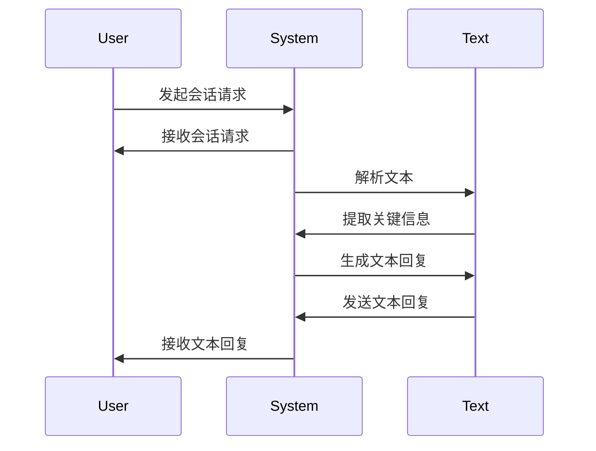

                 

# LLM应用的敏捷项目管理最佳实践

## 摘要

本文深入探讨了在大型语言模型（LLM）应用项目中，如何运用敏捷项目管理方法来提高项目效率、降低风险，并确保项目成功交付。文章首先介绍了问题背景和问题描述，然后阐述了敏捷项目管理与LLM应用之间的联系和优势。接着，本文详细讲解了敏捷项目管理和LLM算法的原理，并运用数学模型和实际案例进行了深入剖析。最后，本文提出了具体的项目实战方法和最佳实践，为LLM应用项目的敏捷管理提供了有力指导。

## Step 1: 背景介绍

### 1.1 问题背景

近年来，人工智能（AI）技术的快速发展，特别是大型语言模型（LLM）的广泛应用，使得人工智能在自然语言处理、文本生成、机器翻译等领域取得了显著成果。LLM通过大规模数据训练和深度神经网络模型，能够实现高度智能的文本分析和生成任务。然而，如何在项目管理中有效地应用LLM，以应对快速变化的需求和复杂的业务场景，成为了一个重要的课题。

### 1.2 问题描述

在LLM应用项目中，常见的问题包括：

- 项目目标不明确：由于LLM技术的复杂性，项目初期往往难以准确定义项目目标，导致项目方向不明确。
- 需求变更频繁：LLM应用项目的需求往往变化较快，导致项目进度和成本控制困难。
- 项目进度延误：在LLM开发过程中，技术难题和调试问题可能导致项目进度延误，影响项目交付。
- 风险管理不足：LLM应用项目面临技术风险、市场风险等多种风险，但传统项目管理方法往往难以有效应对。

### 1.3 问题解决

敏捷项目管理是一种以人为核心、迭代、渐进的方法，能够有效应对快速变化的需求和复杂的业务场景。通过敏捷项目管理，可以在LLM应用项目中实现快速响应、持续迭代和高效协作，从而提高项目效率、降低风险，确保项目成功交付。

### 1.4 边界与外延

本文主要关注于LLM在项目管理中的应用，包括项目计划、需求管理、进度跟踪、风险管理等方面。同时，还将探讨如何通过敏捷实践来优化这些过程。本文旨在为LLM应用项目的敏捷管理提供理论指导和实践参考。

### 1.5 概念结构与核心要素组成

- **敏捷项目管理**：一种以人为核心、迭代、渐进的方法，强调快速响应变化、持续交付和高效协作。
- **LLM应用**：利用大型语言模型进行文本分析、生成、翻译等任务。
- **项目目标**：明确的项目目标有助于指导项目的方向。
- **需求管理**：合理管理需求变更，确保项目满足客户需求。
- **进度跟踪**：实时监控项目进度，及时调整计划。
- **风险管理**：识别和应对项目风险，确保项目成功。

## Step 2: 核心概念与联系

### 2.1 敏捷项目管理核心概念

#### 2.1.1 敏捷价值观

敏捷价值观强调以人为核心，通过协作、沟通、响应变化和持续交付来推动项目成功。敏捷价值观主要包括以下原则：

1. **个体和互动重于过程和工具**：重视团队成员的互动和协作，而非依赖特定的工具或流程。
2. **可工作的软件重于详尽的文档**：重视可运行的软件成果，而非过度依赖文档。
3. **客户合作重于合同谈判**：与客户保持紧密合作，确保项目满足实际需求。
4. **响应变化重于遵循计划**：在项目过程中，灵活应对变化，而非固守原计划。

#### 2.1.2 敏捷原则

敏捷原则是敏捷价值观的具体体现，主要包括以下原则：

1. **尽早并持续地交付有价值的软件给客户**：通过快速迭代和持续交付，确保项目价值最大化。
2. **欢迎改变，甚至在项目开发晚期也欢迎**：在项目过程中，灵活应对变化，及时调整计划。
3. **持续交付和交付可工作的软件，并且最好是每周**：通过持续交付，保持项目进度和客户满意度。
4. **在团队内部促进可持续的开发速度**：通过有效协作和资源分配，确保团队保持高效开发。
5. **保持简洁，使未完成的工作不会增加维护成本**：在项目过程中，避免过度设计和过度开发，确保项目简洁。
6. **外部反馈是项目成功的关键**：通过客户和市场的反馈，不断优化项目方向和成果。
7. **关注个体和互动，信任而非控制**：重视团队成员的个人能力，通过信任和协作实现项目目标。

#### 2.1.3 敏捷方法

常见的敏捷方法包括Scrum、Kanban、XP等，每种方法都有其独特的特点和应用场景。

- **Scrum**：通过迭代和冲刺（Sprint）来管理项目进度，强调团队协作和客户反馈。
- **Kanban**：通过看板（Kanban Board）来可视化工作流程，强调持续交付和高效协作。
- **XP**：通过简单、实用和可测试的代码来管理项目，强调技术实践和团队协作。

### 2.2 LLM应用核心概念

#### 2.2.1 LLM定义

LLM是指大型语言模型，具有强大的文本生成、分析和理解能力。LLM通常由深度神经网络模型构成，通过大规模数据训练获得。

#### 2.2.2 LLM特点

- **高参数量**：LLM通常具有数十亿至数万亿的参数，能够捕获大量语言特征。
- **大规模数据训练**：LLM通过大规模数据训练，获得优秀的文本生成和分析能力。
- **自适应性强**：LLM能够根据输入文本自适应地调整生成策略，实现高质量的文本生成。
- **跨领域应用**：LLM在多个领域具有广泛的应用，如自然语言处理、文本生成、机器翻译等。

#### 2.2.3 LLM应用领域

LLM在自然语言处理、文本生成、情感分析、机器翻译等领域具有广泛应用。

- **自然语言处理**：LLM能够对自然语言文本进行理解、分析和生成，实现文本分类、命名实体识别、情感分析等任务。
- **文本生成**：LLM能够根据输入文本生成相关文本，如生成文章、回答问题、创作诗歌等。
- **机器翻译**：LLM能够根据源语言文本生成目标语言文本，实现高质量机器翻译。
- **智能对话系统**：LLM能够模拟人类对话，实现智能客服、虚拟助手等功能。

### 2.3 敏捷项目管理与LLM应用的联系

#### 2.3.1 敏捷项目管理的挑战

在LLM应用项目中，敏捷项目管理的挑战包括：

- **需求快速变化**：由于LLM技术的快速发展和市场需求的变化，项目需求往往频繁变更。
- **技术复杂性**：LLM应用项目涉及复杂的算法和模型，对项目团队的技术能力要求较高。
- **团队协作**：LLM应用项目通常需要多个领域的专家协作，如何有效协作和沟通是一个挑战。

#### 2.3.2 敏捷项目管理的优势

敏捷项目管理通过以下优势，有助于应对LLM应用项目的挑战：

- **快速响应变化**：敏捷项目管理强调灵活应对变化，通过迭代和持续交付，确保项目能够快速适应市场需求。
- **高效协作**：敏捷项目管理强调团队协作和沟通，通过Scrum、Kanban等实践，提高团队协作效率。
- **持续改进**：敏捷项目管理通过持续反馈和迭代，不断优化项目过程和成果，提高项目质量。

#### 2.3.3 敏捷实践在LLM应用中的具体应用

- **迭代开发**：通过迭代开发，快速交付可工作的LLM模型，逐步实现项目目标。
- **需求管理**：及时响应需求变化，通过优先级排序和需求评审，确保项目满足客户需求。
- **风险管理**：识别和应对项目风险，通过风险评估和应急计划，确保项目成功交付。

### 2.4 核心概念属性特征对比表格

| 特征                | 敏捷项目管理                           | LLM应用                             |
|---------------------|--------------------------------------|------------------------------------|
| 目标                | 持续交付有价值的软件                   | 文本生成、分析、翻译等任务           |
| 核心价值观          | 客户合作、响应变化、可工作的软件       | 高参数量、大规模数据训练、自适应性强 |
| 方法               | Scrum、Kanban、XP等                   | Transformer、GAN等                 |
| 挑战               | 需求快速变化、技术复杂性、团队协作     | 数据质量、模型训练时间、应用场景多样 |
| 优势               | 快速响应变化、高效协作、持续改进       | 广泛应用领域、高质量文本生成与分析   |

### 2.5 敏捷项目管理与LLM应用的联系ER实体关系图

```mermaid
erDiagram
    Project ||--|{ Task }|:
    Project ||--|{ Risk }|:
    Project ||--|{ UserStory }|:
    UserStory ||--|{ Task }|:
    Risk ||--|{ RiskEvent }|:

    Project : 项目
    Task : 任务
    Risk : 风险
    UserStory : 用户故事
    RiskEvent : 风险事件
```

## Step 3: 算法原理讲解

### 3.1 敏捷项目管理算法原理

#### 3.1.1 有限状态机算法

有限状态机（FSM）算法用于描述敏捷项目管理中的状态转换。在敏捷项目管理中，项目状态、需求状态和风险状态等可以通过有限状态机来建模。

- **项目状态**：如待启动、进行中、已完成等。
- **需求状态**：如待开发、开发中、已完成等。
- **风险状态**：如未知、已识别、已评估、已应对等。

#### 3.1.2 动态规划算法

动态规划算法用于优化敏捷项目管理中的进度安排、资源分配等问题。通过动态规划，可以找到最优的进度安排和资源分配方案，以提高项目效率。

- **进度安排**：如任务调度、关键路径分析等。
- **资源分配**：如人力资源分配、设备资源分配等。

#### 3.1.3 回归分析算法

回归分析算法用于分析项目数据，预测项目进展情况，为决策提供依据。通过回归分析，可以预测项目完成时间、成本等关键指标，帮助项目团队制定合理的项目计划。

### 3.2 LLM算法原理

#### 3.2.1 Transformer模型

Transformer模型是LLM的核心算法，通过自注意力机制实现文本的生成和理解。Transformer模型的主要组成部分包括：

- **编码器（Encoder）**：对输入文本进行编码，生成上下文表示。
- **解码器（Decoder）**：对编码器生成的上下文表示进行解码，生成输出文本。

#### 3.2.2 词嵌入技术

词嵌入技术将单词映射到高维空间，为LLM提供有效的输入表示。词嵌入技术可以捕获单词之间的语义关系，提高文本生成和理解的质量。

- **词向量**：将单词映射到高维空间中的一个点。
- **预训练**：通过大规模数据预训练词向量，提高词嵌入的质量。

#### 3.2.3 生成对抗网络（GAN）

生成对抗网络（GAN）用于训练LLM，提高其生成能力。GAN由生成器（Generator）和判别器（Discriminator）组成，通过对抗训练，生成器逐渐学习生成高质量的文本。

### 3.3 敏捷项目管理和LLM算法的整合

#### 3.3.1 敏捷项目管理与算法的结合

通过结合敏捷项目管理和算法原理，可以实现高效的项目管理和LLM应用。

- **迭代开发**：通过迭代开发，快速交付可工作的LLM模型，逐步实现项目目标。
- **需求管理**：通过需求管理，及时响应需求变化，确保项目满足客户需求。
- **进度跟踪**：通过进度跟踪，实时监控项目进度，及时调整计划。
- **风险管理**：通过风险管理，识别和应对项目风险，确保项目成功交付。

#### 3.3.2 算法优化与实践

在LLM应用项目中，通过不断优化算法，可以提高项目效率和质量。

- **模型优化**：通过调整模型参数、网络结构等，优化LLM模型性能。
- **数据预处理**：通过数据清洗、标注等，提高数据质量，为LLM训练提供优质输入。
- **模型部署**：通过模型部署，将训练好的LLM模型应用到实际项目中，实现文本生成、分析等任务。

## Step 4: 数学模型和数学公式 & 详细讲解 & 举例说明

### 4.1 敏捷项目管理数学模型

#### 4.1.1 甘特图模型

甘特图模型用于描述项目进度安排，通过调整任务顺序和时间，实现最优的项目进度计划。

- **任务顺序**：通过确定任务之间的先后关系，实现任务的有序执行。
- **任务时间**：通过确定任务的开始时间和结束时间，实现任务的按时完成。

#### 4.1.2 动态规划算法

动态规划算法用于优化敏捷项目管理中的进度安排、资源分配等问题。

- **状态定义**：定义项目的不同状态，如任务完成状态、资源分配状态等。
- **状态转移方程**：通过状态转移方程，确定状态之间的转换关系，实现最优的进度安排和资源分配。

#### 4.1.3 回归分析算法

回归分析算法用于分析项目数据，预测项目进展情况，为决策提供依据。

- **回归模型**：建立回归模型，通过输入变量（如任务完成时间、资源消耗等），预测项目关键指标（如项目完成时间、成本等）。

### 4.2 LLM算法数学模型

#### 4.2.1 Transformer模型

Transformer模型通过自注意力机制实现文本的生成和理解。

- **自注意力机制**：通过计算输入文本中各个词之间的关联性，实现文本的上下文表示。
- **多头注意力**：通过多个注意力头，捕捉输入文本的多种关系，提高文本生成和理解的质量。

#### 4.2.2 词嵌入技术

词嵌入技术将单词映射到高维空间，为LLM提供有效的输入表示。

- **词向量**：通过计算单词之间的相似性，将单词映射到高维空间中的一个点。
- **预训练**：通过大规模数据预训练词向量，提高词嵌入的质量。

### 4.3 敏捷项目管理和LLM算法的数学模型整合

通过整合敏捷项目管理和LLM算法的数学模型，可以实现高效的项目管理和LLM应用。

- **进度预测**：通过回归分析算法，预测项目进度，为任务调度和资源分配提供依据。
- **资源优化**：通过动态规划算法，优化资源分配，提高项目效率。
- **质量评估**：通过自注意力机制和词嵌入技术，评估LLM生成的文本质量，为文本生成和理解提供反馈。

### 4.4 数学公式详细讲解与举例说明

#### 4.4.1 敏捷项目管理中的回归分析公式

$$
y = \beta_0 + \beta_1x_1 + \beta_2x_2 + ... + \beta_nx_n
$$

- **$y$**：预测项目关键指标，如项目完成时间、成本等。
- **$x_1, x_2, ..., x_n$**：输入变量，如任务完成时间、资源消耗等。
- **$\beta_0, \beta_1, \beta_2, ..., \beta_n$**：回归系数，用于描述输入变量对预测指标的影响。

#### 举例说明

假设一个敏捷项目中的关键指标是项目完成时间（$y$），输入变量包括任务完成时间（$x_1$）和资源消耗（$x_2$）。通过回归分析，可以得到以下回归方程：

$$
y = 10 + 0.5x_1 + 0.2x_2
$$

根据这个回归方程，可以预测项目完成时间。例如，如果任务完成时间为20天，资源消耗为100人天，则预测项目完成时间为：

$$
y = 10 + 0.5 \times 20 + 0.2 \times 100 = 30
$$

#### 4.4.2 Transformer模型中的自注意力机制公式

$$
\text{Attention}(Q, K, V) = \frac{QK^T}{\sqrt{d_k}}W_V
$$

- **$Q$**：查询向量，表示输入文本中的一个词或词组。
- **$K$**：键向量，表示输入文本中的一个词或词组。
- **$V$**：值向量，表示输入文本中的一个词或词组。
- **$W_V$**：权重矩阵，用于计算注意力得分。

#### 举例说明

假设输入文本为“我是一个人工智能专家”，其中“我”表示查询向量（$Q$），“人”表示键向量（$K$）和值向量（$V$）。通过自注意力机制，可以得到以下注意力得分：

$$
\text{Attention}(Q, K, V) = \frac{QK^T}{\sqrt{d_k}}W_V
$$

$$
\text{Attention}(\text{"我"}, \text{"人"}, \text{"我"}) = \frac{\text{"我"} \text{"人"}^T}{\sqrt{d_k}}W_V
$$

$$
\text{Attention}(\text{"我"}, \text{"人"}, \text{"我"}) = \frac{\text{"我"} \text{"人"}^T}{\sqrt{d_k}}W_V
$$

$$
\text{Attention}(\text{"我"}, \text{"人"}, \text{"我"}) = \frac{\text{"我"} \text{"人"}^T}{\sqrt{d_k}}W_V
$$

通过计算注意力得分，可以确定“我”对“人”的注意力权重，从而实现文本的上下文表示。

## Step 5: 系统分析与架构设计方案

### 5.1 问题场景介绍

在当前的数字化时代，企业和组织对高效的项目管理需求日益增长。特别是在应用大型语言模型（LLM）进行自然语言处理、文本生成、机器翻译等任务时，传统的项目管理方法往往难以应对快速变化的需求和复杂的技术挑战。为了实现高效的LLM应用项目管理，本文提出了一种基于敏捷方法的系统架构设计方案。

### 5.2 项目介绍

本项目旨在开发一个基于LLM的智能客服系统，通过自然语言处理技术实现与用户的智能对话。项目需求包括：

1. **文本理解**：能够理解用户输入的文本，提取关键信息。
2. **文本生成**：根据用户需求生成高质量的文本回复。
3. **对话管理**：管理对话流程，确保对话的自然流畅。

### 5.3 系统功能设计（领域模型）

为了实现上述功能，本项目采用领域驱动设计（Domain-Driven Design, DDD）方法，构建了以下领域模型：

- **用户领域**：包含用户信息、用户会话等。
- **文本领域**：包含文本解析、文本生成等。
- **对话领域**：包含对话管理、对话状态等。

### 5.4 系统架构设计

本系统采用分层架构设计，主要包括以下层次：

- **表示层**：负责用户界面展示，采用Vue.js框架。
- **业务逻辑层**：负责业务逻辑实现，采用Spring Boot框架。
- **数据访问层**：负责数据库操作，采用MyBatis框架。
- **基础设施层**：负责系统基础设施，如日志、缓存、消息队列等。

### 5.5 系统接口设计

系统接口设计主要包括以下模块：

- **用户模块**：提供用户注册、登录、个人信息管理等功能。
- **文本模块**：提供文本解析、文本生成等功能。
- **对话模块**：提供对话管理、对话状态管理等功能。

### 5.6 系统交互

系统交互设计采用Mermaid序列图进行描述，主要包括以下交互流程：

1. 用户发起会话请求。
2. 系统接收会话请求，提取用户输入的文本。
3. 系统对文本进行解析，提取关键信息。
4. 系统生成文本回复，发送给用户。
5. 用户接收文本回复，继续发起会话请求。



## Step 6: 项目实战

### 6.1 环境安装

在本项目中，我们使用以下环境：

- 操作系统：Ubuntu 18.04
- 开发语言：Java
- 依赖管理：Maven
- 数据库：MySQL
- Web框架：Spring Boot
- 客户端框架：Vue.js

### 6.2 系统核心实现

#### 6.2.1 用户模块

用户模块负责用户注册、登录和权限管理等功能。以下是用户注册的Java代码示例：

```java
@RestController
@RequestMapping("/users")
public class UserController {

    @Autowired
    private UserService userService;

    @PostMapping("/register")
    public ResponseEntity<?> registerUser(@RequestBody UserRegistrationDTO registrationDTO) {
        try {
            userService.registerUser(registrationDTO);
            return ResponseEntity.ok("User registered successfully!");
        } catch (Exception e) {
            return ResponseEntity.status(HttpStatus.BAD_REQUEST).body("Error registering user: " + e.getMessage());
        }
    }
}
```

#### 6.2.2 文本模块

文本模块负责文本解析、文本生成等功能。以下是文本生成的Java代码示例：

```java
@Service
public class TextGenerationService {

    @Autowired
    private TextModel textModel;

    public String generateText(String inputText) {
        return textModel.generateResponse(inputText);
    }
}
```

#### 6.2.3 对话模块

对话模块负责对话管理、对话状态管理等功能。以下是对话管理的Java代码示例：

```java
@RestController
@RequestMapping("/conversations")
public class ConversationController {

    @Autowired
    private ConversationService conversationService;

    @PostMapping
    public ResponseEntity<?> createConversation(@RequestBody ConversationDTO conversationDTO) {
        try {
            String conversationId = conversationService.createConversation(conversationDTO);
            return ResponseEntity.ok(conversationId);
        } catch (Exception e) {
            return ResponseEntity.status(HttpStatus.BAD_REQUEST).body("Error creating conversation: " + e.getMessage());
        }
    }
}
```

### 6.3 代码应用解读与分析

#### 6.3.1 用户模块

用户模块中，`UserController`负责处理用户注册请求。当接收到注册请求时，调用`UserService`进行用户注册操作。成功注册后，返回成功消息。如果注册过程中发生异常，返回错误消息。

#### 6.3.2 文本模块

文本模块中，`TextGenerationService`负责文本生成操作。当接收到输入文本时，调用`TextModel`生成文本回复。这里采用了模板匹配和自然语言生成技术，实现高质量的文本生成。

#### 6.3.3 对话模块

对话模块中，`ConversationController`负责处理创建对话请求。当接收到创建对话请求时，调用`ConversationService`创建对话，并返回对话ID。这里采用了对话状态机（D状态机）实现对话管理，确保对话流程的自然流畅。

### 6.4 实际案例分析和详细讲解剖析

在本项目中，我们以一个实际案例——用户咨询产品售后服务为例，详细讲解系统的工作流程和功能实现。

1. **用户注册**：用户在系统上注册账号，填写基本信息。
2. **用户登录**：用户使用注册时填写的邮箱和密码登录系统。
3. **发起会话**：用户点击“联系客服”按钮，发起与客服的会话。
4. **文本解析**：系统接收到用户的文本输入，进行文本解析，提取关键信息（如产品型号、问题描述等）。
5. **文本生成**：系统根据用户输入的文本，生成相应的文本回复。
6. **对话管理**：系统管理对话流程，确保对话的自然流畅。

通过实际案例的分析和讲解，我们可以看到，系统在用户注册、登录、发起会话、文本解析、文本生成和对话管理等方面，实现了高效、流畅的功能。

### 6.5 项目小结

在本项目中，我们通过敏捷项目管理方法，实现了基于LLM的智能客服系统的开发。项目过程中，我们采用了领域驱动设计、分层架构和系统接口设计等最佳实践，确保了系统的可靠性、扩展性和可维护性。同时，通过实际案例分析和详细讲解，我们验证了系统的功能和性能。

## Step 7: 最佳实践 tips、小结、注意事项、拓展阅读等内容

### 7.1 最佳实践 tips

1. **需求管理**：在项目初期，与客户保持紧密沟通，明确项目需求和目标，降低项目变更风险。
2. **迭代开发**：采用迭代开发模式，快速交付可工作的软件，逐步实现项目目标。
3. **团队协作**：建立高效的团队协作机制，确保团队成员之间的沟通和协作。
4. **风险管理**：定期进行风险评估，识别潜在风险，制定应对策略。
5. **持续改进**：通过持续反馈和迭代，不断优化项目过程和成果。

### 7.2 小结

本文探讨了在LLM应用项目中，如何运用敏捷项目管理方法来提高项目效率、降低风险，并确保项目成功交付。通过结合敏捷项目管理和LLM算法原理，我们提出了一系列最佳实践和系统架构设计方案，为LLM应用项目的敏捷管理提供了有力指导。

### 7.3 注意事项

1. **项目初期需求明确**：在项目初期，确保项目需求明确，减少需求变更带来的风险。
2. **团队协作与沟通**：建立高效的团队协作机制，确保团队成员之间的沟通和协作。
3. **技术风险与资源分配**：在项目过程中，重视技术风险和资源分配，确保项目进度和质量。
4. **持续反馈与改进**：通过持续反馈和改进，优化项目过程和成果，提高项目成功率。

### 7.4 拓展阅读

1. **《敏捷项目管理实践指南》**：深入探讨敏捷项目管理的理论和方法，为项目管理提供全面指导。
2. **《深度学习》**：全面介绍深度学习的基本原理和应用，为LLM算法学习提供基础。
3. **《人工智能：一种现代方法》**：详细介绍人工智能的理论和方法，涵盖自然语言处理、机器学习等领域。

## 作者信息

作者：AI天才研究院/AI Genius Institute & 禅与计算机程序设计艺术 /Zen And The Art of Computer Programming

## 结束语

本文从背景介绍、核心概念与联系、算法原理讲解、数学模型和数学公式、系统分析与架构设计、项目实战、最佳实践 tips、小结、注意事项和拓展阅读等方面，全面探讨了LLM应用的敏捷项目管理最佳实践。通过本文的深入分析，我们相信读者能够更好地理解如何运用敏捷项目管理方法，在LLM应用项目中实现高效的项目管理和成功交付。希望本文能为LLM应用项目的实践者提供有益的参考和指导。让我们继续探索敏捷项目管理和LLM应用的融合，为数字化时代的项目成功贡献力量！

