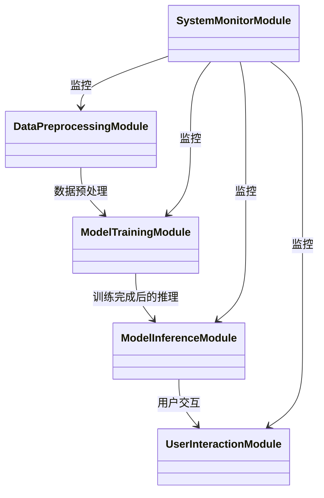
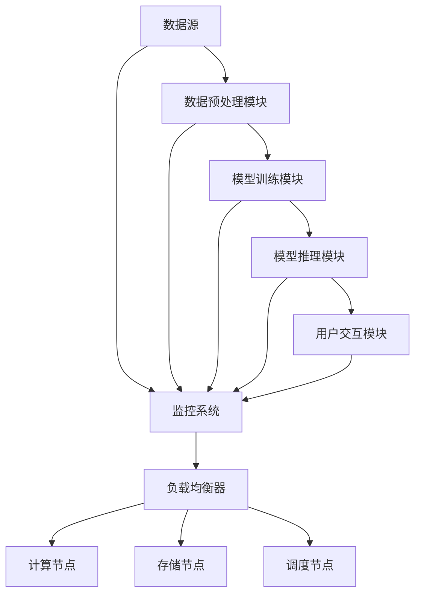
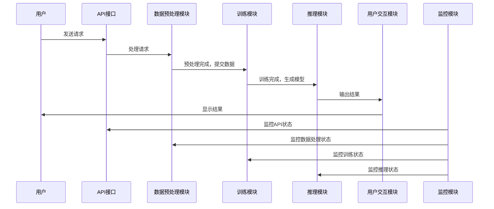

                 

### 文章标题：LLM应用的敏捷预算管理：适应变化的财务策略

关键词：自然语言处理、大型语言模型、敏捷预算管理、财务策略、变化适应

摘要：本文深入探讨了在自然语言处理（NLP）领域内，尤其是大型语言模型（LLM）应用场景下的敏捷预算管理策略。文章从背景介绍出发，逐步讲解了核心概念和术语，阐述了敏捷预算管理的原则及其在LLM项目中的重要性，并通过实际案例研究了金融策略的实施过程。随后，文章提供了详细的技术指南，包括系统架构设计、代码实现和最佳实践，最后总结了全文内容并对未来方向进行了展望。读者将能够全面了解如何在NLP领域中应用敏捷预算管理，以应对快速变化的财务需求。

### 文章结构大纲

#### 1. 引言
- **背景介绍**：自然语言处理技术的发展及其对财务预算管理的影响。
- **问题提出**：为何在LLM应用中需要敏捷预算管理。
- **研究意义**：敏捷预算管理对LLM项目成功的关键作用。

#### 2. 核心概念与术语
- **自然语言处理（NLP）**：定义、发展历程和关键技术。
- **大型语言模型（LLM）**：定义、类型及其应用场景。
- **敏捷预算管理**：定义、特点及与传统的区别。

#### 3. 敏捷预算管理原则
- **适应性**：快速响应环境变化。
- **迭代性**：持续优化预算策略。
- **透明性**：预算过程透明化。
- **灵活性**：应对不同规模和复杂度的项目需求。

#### 4. 金融策略在LLM应用中的实施
- **成本估算**：建立合理的成本估算模型。
- **风险控制**：识别和应对财务风险。
- **资金分配**：高效利用资源，优化资金分配。
- **绩效评估**：定期评估项目财务表现。

#### 5. 案例研究
- **案例一**：某企业利用LLM进行市场预测的预算管理实践。
- **案例二**：一个成功的LLM开发项目中的敏捷预算管理策略。

#### 6. 实施敏捷预算管理的步骤
- **项目规划**：明确项目目标和预算范围。
- **需求分析**：详细分析项目需求和成本。
- **资源规划**：合理配置人力、技术和财务资源。
- **执行与监控**：执行预算计划并监控实际支出。

#### 7. 系统架构与设计
- **系统功能设计**：领域模型和类图。
- **系统架构设计**：高可用性架构设计和负载均衡策略。
- **接口设计与交互**：API设计和系统间交互流程。

#### 8. 项目实战
- **环境安装**：LLM项目开发环境搭建。
- **系统核心实现**：关键代码实现和解释。
- **案例分析**：实际案例的剖析和总结。

#### 9. 最佳实践与小结
- **敏捷预算管理最佳实践**：总结成功经验和关键技巧。
- **注意事项**：实施敏捷预算管理时的潜在问题及解决方法。
- **拓展阅读**：推荐进一步学习的相关资源。

#### 10. 结论与未来方向
- **文章总结**：回顾全文关键内容和观点。
- **未来方向**：展望敏捷预算管理在LLM领域的未来发展。

### 1. 引言

#### 背景介绍

自然语言处理（NLP）技术作为人工智能的重要分支，已经取得了显著的进步。随着大型语言模型（LLM）的崛起，诸如GPT、BERT等模型的广泛应用，NLP技术正迅速改变各个领域的业务流程和决策模式。从文本生成、情感分析到问答系统，LLM的强大能力为解决复杂语言任务提供了新的可能性。然而，随着这些技术的大规模应用，财务预算管理也面临着新的挑战。

在传统的财务预算管理中，主要依赖于历史数据和统计方法，通常具有较强的预测性和计划性。然而，LLM技术的快速发展使得项目需求变得高度不确定，且不断变化的。这种变化要求财务预算管理能够快速适应环境，灵活调整资源分配和成本估算。传统的预算管理模式在应对这种快速变化时往往显得力不从心，无法有效支持LLM项目的持续发展和优化。

#### 问题提出

在LLM应用中，为何需要敏捷预算管理？这主要源于以下几个方面的原因：

1. **需求变化快速**：LLM项目往往面临需求频繁变更的情况，包括功能需求、性能需求等，这使得传统的固定预算模式难以适应。

2. **成本估算难度大**：由于LLM技术复杂，涉及的变量较多，传统的成本估算方法难以准确预测项目成本，导致预算偏差较大。

3. **风险管理要求高**：LLM项目通常需要大量的技术和人力资源，同时面临技术风险、市场风险等多重挑战，需要有效的风险管理策略。

4. **资源分配需灵活**：随着项目的进展，资源分配也需要动态调整，以适应不同的工作阶段和需求变化。传统的预算模式往往缺乏这种灵活性。

因此，为了应对这些挑战，敏捷预算管理应运而生。敏捷预算管理强调快速响应变化、持续优化和透明化，能够更好地支持LLM项目的顺利推进和持续发展。

#### 研究意义

敏捷预算管理在LLM项目中的重要性不言而喻。首先，它能够提高项目的可预测性和可控性，帮助团队更好地管理风险和资源。其次，敏捷预算管理能够提高决策的灵活性和效率，使得团队能够迅速适应市场变化和客户需求。最后，敏捷预算管理有助于提升项目的整体绩效，通过持续优化和调整，实现成本效益最大化。

总之，研究并应用敏捷预算管理策略，不仅能够提升LLM项目的管理水平和运营效率，还能为企业的长远发展奠定坚实基础。接下来，我们将详细探讨自然语言处理、大型语言模型以及敏捷预算管理的核心概念和原理，为后续内容提供理论基础。

### 2. 核心概念与术语

#### 自然语言处理（NLP）

自然语言处理（NLP）是人工智能的一个重要分支，旨在让计算机理解和生成人类语言。它涉及到多个领域，包括语言学、计算机科学、信息工程和人工智能等。NLP的目标是使计算机能够处理自然语言文本，从而实现人机交互、信息检索、文本分析等多种应用。

- **定义**：NLP是指通过计算机技术和算法，实现人类语言和机器之间的理解和交流。
- **发展历程**：从最初的规则驱动方法，到基于统计模型的方法，再到深度学习时代的突破，NLP经历了多次技术变革。
- **关键技术**：包括词向量表示、序列模型、注意力机制、生成模型等。

#### 大型语言模型（LLM）

大型语言模型（LLM）是指那些具有巨大参数规模、能够处理复杂语言任务的语言模型。这些模型通过学习海量文本数据，能够生成高质量的文本、理解语义、回答问题等。

- **定义**：LLM是指参数规模巨大、具有强大语言理解和生成能力的语言模型。
- **类型**：主要包括基于循环神经网络（RNN）、Transformer架构的模型，如GPT、BERT、GPT-Neo等。
- **应用场景**：广泛应用于文本生成、问答系统、机器翻译、情感分析等领域。

#### 敏捷预算管理

敏捷预算管理是一种灵活、迭代和透明的预算管理方法，强调快速响应变化、持续优化和资源的高效利用。

- **定义**：敏捷预算管理是一种灵活、迭代和透明的预算管理方法，强调快速适应变化和优化资源配置。
- **特点**：快速响应变化、持续迭代、透明化、灵活性高。
- **与传统预算管理的区别**：传统预算管理往往侧重于预测性和计划性，而敏捷预算管理更注重适应性和灵活性。

#### 术语解释

- **成本估算**：对项目成本进行预估的过程，包括人力成本、技术成本和其他相关成本。
- **风险控制**：识别和管理项目风险的过程，以确保项目顺利推进。
- **资金分配**：将预算资金合理分配到各个项目阶段和任务中。
- **绩效评估**：对项目实际绩效进行评估，与预算目标进行比较，发现偏差并优化预算管理。

通过上述对核心概念和术语的介绍，我们对自然语言处理、大型语言模型和敏捷预算管理有了初步的认识。接下来，我们将详细探讨敏捷预算管理的原则，为后续内容的深入分析奠定基础。

### 3. 敏捷预算管理原则

敏捷预算管理是一种灵活、迭代和透明的预算管理方法，其核心在于快速响应变化、持续优化和资源的高效利用。下面我们将详细探讨敏捷预算管理的四个基本原则：适应性、迭代性、透明性和灵活性。

#### 适应性

适应性是敏捷预算管理的首要原则。在LLM项目应用中，环境变化非常迅速，需求也可能随时发生调整。因此，预算管理必须具备高度适应性，能够快速调整预算计划和资源配置。

- **环境变化的快速性**：LLM项目通常需要处理复杂的语言任务，涉及的数据量和模型参数规模巨大，这使得项目需求和任务难以预见。
- **需求调整的频率**：随着技术的进步和用户需求的变化，LLM项目需求可能会频繁调整，传统的固定预算管理模式难以应对这种变化。

**如何实现适应性**：
1. **灵活的预算调整机制**：建立灵活的预算调整机制，允许在项目执行过程中根据实际情况进行调整，确保预算能够实时反映项目需求。
2. **实时监控与预警**：通过实时监控系统，监控项目进展和成本变化，及时发现潜在问题，并进行预算调整。
3. **风险缓冲机制**：预留一定比例的风险缓冲资金，用于应对未预见的需求变化和突发情况，降低预算调整的难度。

#### 迭代性

迭代性是敏捷预算管理的另一个重要原则。传统的预算管理往往是一次性完成的，而敏捷预算管理强调持续迭代和优化。

- **项目需求的复杂性**：LLM项目需求往往非常复杂，需要通过多次迭代来逐步实现。
- **技术进步的迅速性**：随着技术的不断进步，LLM项目的实施细节和成本估算也会发生变化，需要通过迭代来不断优化。

**如何实现迭代性**：
1. **阶段性预算**：将项目划分为多个阶段，每个阶段都有独立的预算计划和评估机制，通过阶段性预算来逐步实现项目目标。
2. **持续优化**：在项目执行过程中，不断收集项目数据和反馈，通过数据分析来识别问题并进行优化。
3. **反馈循环**：建立反馈机制，及时收集项目执行过程中的问题和建议，将其纳入后续预算规划和执行中。

#### 透明性

透明性是提升项目管理效率和质量的重要手段。在敏捷预算管理中，透明性不仅有助于项目管理团队了解项目进展和财务状况，还能够增强团队的协作和信任。

- **预算过程的公开**：确保预算制定、执行和调整过程对所有相关方透明。
- **成本控制的清晰**：明确各项成本支出的原因和用途，确保每一笔开支都有据可查。

**如何实现透明性**：
1. **透明化的预算报告**：定期生成详细的预算报告，包括成本估算、实际支出和预算调整等信息，确保所有团队成员都能够了解项目财务状况。
2. **开放的沟通渠道**：建立开放的沟通渠道，确保项目成员可以自由交流预算相关问题和建议。
3. **电子化预算管理工具**：采用电子化预算管理工具，实现预算数据的实时更新和共享，提高预算管理的效率和透明度。

#### 灵活性

灵活性是敏捷预算管理的核心特点之一。在LLM项目中，由于需求变化和技术发展的不确定性，预算管理需要具备高度的灵活性，能够快速适应各种变化。

- **资源分配的灵活性**：根据项目进展和需求变化，灵活调整人力资源和技术资源。
- **预算调整的及时性**：在项目执行过程中，及时调整预算计划，确保项目能够顺利推进。

**如何实现灵活性**：
1. **灵活的预算模板**：设计灵活的预算模板，支持根据不同项目需求和阶段进行快速调整。
2. **多层次的预算审核**：建立多层次的预算审核机制，确保预算调整的及时性和合理性。
3. **动态的资源调配**：通过实时监控系统，动态调整资源分配，确保项目在不同阶段都能得到有效的资源支持。

通过上述四个原则，敏捷预算管理能够更好地适应LLM项目的高动态性，提高项目的可控性和成功率。在下一章节中，我们将探讨金融策略在LLM应用中的具体实施，进一步了解如何在实践中运用敏捷预算管理原则。

### 4. 金融策略在LLM应用中的实施

在LLM项目中，金融策略的实施是确保项目成功的关键。本节将详细探讨如何在LLM应用中实施有效的金融策略，包括成本估算、风险控制、资金分配和绩效评估四个方面。

#### 成本估算

成本估算是金融策略实施的基础，准确的成本估算能够为项目提供可靠的财务预算，并帮助管理者做出明智的决策。

- **成本分类**：LLM项目的成本主要包括人力成本、技术成本、硬件成本和其他相关成本。
  - **人力成本**：包括开发人员、数据科学家、运维人员等的人力资源费用。
  - **技术成本**：包括购买或租用计算资源、软件工具、开源库等费用。
  - **硬件成本**：包括服务器、存储设备、网络设备等硬件设施的费用。
  - **其他相关成本**：如差旅费、培训费、咨询费等。

- **估算方法**：
  - **历史数据分析**：通过分析以往类似项目的成本数据，预测本项目可能的成本。
  - **专家评审**：邀请行业专家对项目成本进行评审，结合实际经验和专业知识进行估算。
  - **bottom-up估算**：从项目任务和活动出发，逐项计算各个部分的具体成本。

**案例**：某企业开发一个基于LLM的客户服务聊天机器人，预计需要5名开发人员、2名数据科学家和3名运维人员，技术成本包括购买AWS云服务和相关软件工具，硬件成本为2台高性能服务器，其他相关成本包括培训费用和差旅费用。通过上述方法，企业对项目总成本进行了初步估算。

#### 风险控制

在LLM项目中，风险控制至关重要。通过识别、评估和管理风险，可以降低项目失败的概率，确保项目的顺利进行。

- **风险识别**：通过项目规划、需求分析、专家访谈等方法，识别项目中可能面临的各种风险，如技术风险、市场风险、人力资源风险等。
- **风险评估**：对识别出的风险进行评估，包括风险的概率和影响程度，确定风险优先级。
- **风险应对策略**：
  - **风险规避**：通过调整项目计划，避免风险的发生。
  - **风险转移**：通过保险、外包等方式，将风险转移给第三方。
  - **风险减轻**：采取预防措施，降低风险的发生概率或影响程度。
  - **风险接受**：对于无法规避或转移的风险，制定应急计划。

**案例**：在LLM项目中，技术风险是一个主要问题。为了降低技术风险，项目团队采取了一系列措施，包括定期进行技术评审、引入外部顾问进行技术指导、提前准备技术备选方案等。

#### 资金分配

资金分配是金融策略实施的核心环节，合理的资金分配能够确保项目在不同阶段都有足够的资源支持，提高项目的成功率。

- **阶段划分**：将项目划分为多个阶段，每个阶段都有明确的任务和目标。
- **资金分配策略**：
  - **初期重点投入**：在项目初期，重点投入人力资源和技术资源，确保项目能够顺利启动。
  - **逐步增加资金**：随着项目进展，逐步增加资金投入，以满足不同阶段的需求。
  - **预留应急资金**：预留一定比例的应急资金，以应对突发情况。

**案例**：某企业在开发LLM项目的初期，投入了50%的预算用于人力资源和技术资源，20%用于硬件设备和软件工具，10%用于应急资金，剩余10%用于其他潜在需求。

#### 绩效评估

绩效评估是衡量项目进展和成本控制效果的重要手段。通过定期评估项目绩效，可以及时发现偏差，优化预算管理。

- **评估指标**：根据项目目标和预算计划，制定相应的评估指标，如项目进度、成本控制、质量目标等。
- **评估方法**：
  - **定量评估**：通过数据分析和统计方法，对项目进展和成本进行定量评估。
  - **定性评估**：通过专家评审和访谈，对项目质量和管理效果进行定性评估。
- **评估周期**：根据项目进展情况，设定合理的评估周期，如季度评估、半年评估等。

**案例**：在LLM项目的中期评估中，项目团队通过数据分析发现项目进度落后于计划，成本超支。通过分析原因，团队采取了增加人力资源、调整工作优先级等措施，逐步将项目拉回正轨。

通过上述金融策略的实施，LLM项目能够在复杂的业务环境中保持稳定和高效的运行。接下来，我们将通过案例研究进一步探讨敏捷预算管理在实际项目中的应用。

### 5. 案例研究

#### 案例一：某企业利用LLM进行市场预测的预算管理实践

**背景**：
某大型电商平台在市场竞争日益激烈的环境下，希望通过利用大型语言模型（LLM）进行市场预测，以优化库存管理和营销策略，提升整体运营效率。

**问题**：
1. **成本估算难度大**：由于LLM项目涉及复杂的算法和大规模数据处理，传统的成本估算方法难以准确预测项目成本。
2. **需求变化频繁**：市场环境变化快，预测模型的需求可能随时调整，传统的固定预算管理模式无法灵活应对。
3. **风险管理要求高**：LLM项目需要大量的计算资源和数据支持，同时面临技术风险、市场风险等挑战。

**解决方案**：
1. **灵活的预算调整机制**：项目团队建立了灵活的预算调整机制，允许根据实际需求和市场变化进行预算调整。通过实时监控系统，及时捕捉成本变化和需求变更，确保预算的实时性和准确性。
2. **阶段性预算**：将项目划分为多个阶段，每个阶段都有独立的预算计划和评估机制。通过阶段性预算，逐步实现项目目标，确保资源分配的合理性和高效性。
3. **风险缓冲机制**：预留了20%的风险缓冲资金，用于应对未预见的需求变化和突发情况，降低预算调整的难度。

**实施过程**：
1. **需求分析与规划**：项目团队与业务部门密切合作，详细分析了市场预测的需求，制定了详细的预算计划。
2. **成本估算**：通过历史数据分析、专家评审和bottom-up估算等方法，对项目成本进行了初步估算，并留有足够的风险缓冲。
3. **资源分配**：根据项目阶段和任务需求，合理分配人力资源和技术资源，确保项目在不同阶段都有足够的支持。
4. **实时监控与调整**：通过实时监控系统，监控项目进展和成本变化，及时发现潜在问题并进行预算调整。
5. **绩效评估**：定期进行项目绩效评估，包括项目进度、成本控制和质量目标等，确保项目按照预算计划顺利推进。

**结果**：
通过实施敏捷预算管理，项目团队成功完成了市场预测模型开发，并顺利投入使用。项目总成本控制在预算范围内，市场需求响应速度显著提升，库存管理和营销策略得到了优化。项目的成功不仅提升了企业的市场竞争力，也为后续的LLM项目提供了宝贵的经验和实践指导。

#### 案例二：一个成功的LLM开发项目中的敏捷预算管理策略

**背景**：
某科技公司计划开发一款基于大型语言模型（LLM）的客户服务聊天机器人，以提升客户服务质量和用户体验。

**问题**：
1. **成本估算不明确**：由于LLM项目的技术复杂度高，传统的成本估算方法难以准确预测项目成本。
2. **需求变化频繁**：客户需求和市场环境变化较快，项目需求可能随时调整，传统预算管理模式难以灵活应对。
3. **资源分配困难**：项目涉及多领域技术，需要协调不同部门和团队的合作，资源分配和协调难度较大。

**解决方案**：
1. **阶段性预算**：将项目划分为多个阶段，每个阶段都有独立的预算计划和评估机制。通过阶段性预算，逐步实现项目目标，确保资源分配的合理性和高效性。
2. **灵活的预算调整机制**：建立灵活的预算调整机制，根据项目进展和需求变化，实时调整预算计划，确保预算的实时性和准确性。
3. **跨部门协作**：建立跨部门协作机制，确保各团队之间的信息共享和资源协调，提高项目执行效率。

**实施过程**：
1. **需求分析与规划**：项目团队与业务部门、技术团队紧密合作，详细分析了客户服务聊天机器人的需求，制定了详细的预算计划。
2. **成本估算**：通过历史数据分析、专家评审和bottom-up估算等方法，对项目成本进行了初步估算，并留有足够的风险缓冲。
3. **资源分配**：根据项目阶段和任务需求，合理分配人力资源和技术资源，确保项目在不同阶段都有足够的支持。
4. **实时监控与调整**：通过实时监控系统，监控项目进展和成本变化，及时发现潜在问题并进行预算调整。
5. **绩效评估**：定期进行项目绩效评估，包括项目进度、成本控制和质量目标等，确保项目按照预算计划顺利推进。
6. **跨部门协作**：建立跨部门协作机制，通过定期会议、信息共享等方式，确保各团队之间的紧密合作，提高项目执行效率。

**结果**：
通过实施敏捷预算管理策略，项目团队成功开发了基于LLM的客户服务聊天机器人，并在预定时间内投入使用。项目总成本控制在预算范围内，客户满意度显著提升，项目质量也得到了客户的认可。项目的成功不仅为科技公司带来了直接的经济效益，也为公司后续的LLM项目提供了宝贵的经验和实践指导。

通过这两个案例，我们可以看到，敏捷预算管理策略在LLM项目中的重要性。它不仅能够帮助项目团队更好地应对需求变化和技术挑战，还能够提高项目的可控性和成功率，为企业的长期发展奠定坚实基础。

### 6. 实施敏捷预算管理的步骤

在LLM项目中，实施敏捷预算管理是一个系统化、迭代化和透明化的过程。为了确保项目的顺利推进和成本的有效控制，以下步骤将详细阐述如何实施敏捷预算管理：

#### 项目规划

项目规划是敏捷预算管理的第一步，它为整个项目奠定了基础。

1. **明确项目目标和范围**：首先，项目团队需要明确项目的具体目标和范围。这包括项目的业务目标、技术目标、时间范围和预期成果等。
2. **组建跨职能团队**：项目规划阶段，组建由项目经理、业务分析师、技术专家、财务人员等组成的跨职能团队。跨职能团队能够全面了解项目的需求和挑战，从而制定出合理的预算计划。
3. **制定项目计划**：根据项目目标和范围，制定详细的项目计划。项目计划应包括任务列表、里程碑、资源需求和预期时间表。

#### 需求分析

需求分析是项目规划的重要环节，它决定了项目实施的具体方向和成本估算的准确性。

1. **收集需求**：通过与业务部门和用户进行沟通，详细收集项目需求，包括功能需求、性能需求、用户界面需求等。
2. **分析需求**：对收集到的需求进行分类和分析，确定需求的优先级和实现难度。通过需求分析，明确项目需要实现的核心功能和关键技术。
3. **成本估算**：基于需求分析的结果，进行成本估算。成本估算应包括人力成本、技术成本、硬件成本和其他相关成本。可以使用历史数据分析、专家评审和bottom-up估算等方法进行成本估算。

#### 资源规划

资源规划是确保项目顺利推进的关键环节，它涉及到人力资源、技术和财务资源的合理配置。

1. **人力资源规划**：根据项目需求和任务分配，确定需要的人力资源，包括开发人员、数据科学家、测试人员等。同时，要考虑到人力资源的可用性和技能匹配度，确保项目团队能够高效协作。
2. **技术资源规划**：根据项目需求和技术实现方案，规划所需的技术资源，包括开发工具、软件库、计算资源等。要确保技术资源能够满足项目需求，且在预算范围内。
3. **财务资源规划**：制定详细的财务预算计划，包括初始投资、运营成本、应急资金等。财务预算计划应与项目目标和需求分析相匹配，确保项目的财务可持续性。

#### 执行与监控

在项目执行过程中，监控和调整预算是非常重要的，以确保项目能够按照预算计划顺利进行。

1. **执行预算计划**：根据项目计划，开始执行预算计划。项目团队应按照既定的任务和时间表，逐步完成各项任务。
2. **实时监控**：通过实时监控系统，监控项目的进展和成本变化。监控系统可以提供关键绩效指标（KPI），如项目进度、成本支出、质量指标等，帮助团队及时发现问题和进行优化。
3. **定期评估**：定期对项目进展和成本进行评估，与预算计划进行比较。评估可以采用定量评估和定性评估相结合的方法，确保评估结果的准确性。
4. **预算调整**：根据评估结果，对预算计划进行必要的调整。预算调整可以是在项目执行过程中，也可以是在项目阶段结束时。通过灵活的预算调整机制，确保项目能够应对需求变化和突发事件。

#### 反馈与优化

反馈与优化是敏捷预算管理的重要环节，通过持续的反馈和优化，不断提升项目的管理水平和效率。

1. **收集反馈**：在项目执行过程中，收集来自项目团队、业务部门和用户等多方面的反馈。反馈可以是关于项目进度、成本控制、质量等方面的意见和建议。
2. **分析反馈**：对收集到的反馈进行分析，识别项目中的优点和不足，并提出改进措施。
3. **持续优化**：根据分析结果，对项目管理和预算管理流程进行优化。优化可以是在当前项目中进行，也可以在后续项目中推广应用，以提升整体管理效率。

通过以上步骤，项目团队可以有效地实施敏捷预算管理，确保项目在变化多端的环境中保持稳定和高效地推进。接下来，我们将讨论系统架构与设计，为LLM项目的实施提供技术支持。

### 7. 系统架构与设计

在LLM项目中，系统架构和设计是确保项目成功的关键因素。本节将详细介绍LLM项目的系统架构设计，包括系统功能设计、系统架构设计以及系统接口设计和系统交互设计。

#### 系统功能设计

系统功能设计是系统架构设计的起点，它定义了系统应具备的功能和模块。以下是LLM项目系统功能设计的关键组成部分：

1. **数据预处理模块**：该模块负责对原始文本数据进行清洗、分词、去停用词等预处理操作，以便于后续的模型训练和推理。
2. **模型训练模块**：该模块负责使用大规模文本数据训练LLM模型，包括参数初始化、训练过程、模型评估和优化等。
3. **模型推理模块**：该模块负责将输入文本数据输入到训练好的LLM模型中，生成相应的输出文本。
4. **用户交互模块**：该模块负责与用户进行交互，接收用户输入并展示模型输出结果。
5. **监控系统**：该模块负责监控系统运行状态、性能指标以及资源使用情况，确保系统的高可用性和稳定性。

**Mermaid 类图**：


#### 系统架构设计

系统架构设计是系统功能设计的实现方案，它涉及到系统组件的组织结构、数据流和通信机制。以下是LLM项目系统架构设计的关键组成部分：

1. **分布式计算架构**：由于LLM模型训练和推理需要大量的计算资源，项目采用分布式计算架构，包括计算节点、存储节点和调度节点等。
2. **容器化部署**：项目使用容器化技术（如Docker）来部署和管理系统组件，提高系统的可移植性和可扩展性。
3. **微服务架构**：系统采用微服务架构，将不同的功能模块（如数据预处理、模型训练、模型推理等）部署为独立的微服务，以提高系统的灵活性和可维护性。
4. **负载均衡和故障转移**：系统设计负载均衡和故障转移机制，确保在高负载和系统故障情况下，系统仍能稳定运行。

**Mermaid 架构图**：


#### 系统接口设计和系统交互设计

系统接口设计和系统交互设计是确保系统各组件之间能够有效通信和协作的关键。

1. **API设计**：系统提供RESTful API接口，供用户进行交互。API设计遵循REST原则，包括GET、POST、PUT、DELETE等操作。
2. **数据流设计**：系统设计清晰的数据流，从数据源到预处理模块、训练模块、推理模块再到用户交互模块，确保数据在整个流程中的一致性和完整性。
3. **事件驱动架构**：系统采用事件驱动架构，通过事件队列（如Kafka）实现模块间的异步通信，提高系统的并发能力和容错性。

**Mermaid 序列图**：


通过上述系统架构与设计，LLM项目能够实现高效、稳定和可扩展的运行。接下来，我们将通过项目实战，详细讲解如何搭建LLM项目开发环境，实现系统核心功能，并进行实际案例分析和总结。

### 8. 项目实战

#### 环境安装

要搭建一个LLM项目，首先需要准备好开发环境。以下是安装所需工具和软件的步骤：

1. **安装Python**：确保安装了Python 3.8或更高版本。可以从Python官方网站下载并安装。
2. **安装Docker**：Docker用于容器化部署，可以从Docker官网下载并安装。安装完成后，运行`docker --version`命令确认安装成功。
3. **安装Docker-Compose**：Docker-Compose用于管理多容器部署，可以通过以下命令安装：
   ```shell
   sudo curl -L "https://github.com/docker/compose/releases/download/1.29.2/docker-compose-$(uname -s)-$(uname -m)" -o /usr/local/bin/docker-compose
   sudo chmod +x /usr/local/bin/docker-compose
   sudo docker-compose --version
   ```
4. **安装NVIDIA-Docker（可选）**：如果需要使用GPU加速，可以安装NVIDIA-Docker。首先安装NVIDIA驱动，然后从NVIDIA官网下载并安装NVIDIA-Docker。

#### 系统核心实现

以下是使用Python实现LLM项目核心功能的具体步骤：

1. **创建Dockerfile**：创建一个Dockerfile，用于定义容器镜像的构建过程。Dockerfile示例如下：
   ```dockerfile
   FROM python:3.8-slim

   RUN apt-get update && apt-get install -y --no-install-recommends \
       build-essential \
       libatlas-base-dev \
       && rm -rf /var/lib/apt/lists/*

   RUN pip install torch torchvision torchaudio \
       && pip install transformers

   COPY . /app
   WORKDIR /app

   CMD ["python", "app.py"]
   ```

2. **编写应用代码**：创建一个名为`app.py`的Python脚本，实现LLM的核心功能。以下是一个简单的示例：
   ```python
   from transformers import AutoTokenizer, AutoModelForCausalLM
   import torch

   model_name = "gpt2"
   tokenizer = AutoTokenizer.from_pretrained(model_name)
   model = AutoModelForCausalLM.from_pretrained(model_name)

   def generate_response(input_text):
       input_ids = tokenizer.encode(input_text, return_tensors="pt")
       outputs = model.generate(input_ids, max_length=50, num_return_sequences=1)
       response = tokenizer.decode(outputs[0], skip_special_tokens=True)
       return response

   if __name__ == "__main__":
       while True:
           user_input = input("请输入您的提问：")
           print("机器人的回答：", generate_response(user_input))
   ```

3. **构建和运行容器**：在项目目录中创建一个名为`docker-compose.yml`的文件，定义容器部署配置。以下是一个示例配置：
   ```yaml
   version: '3'
   services:
     llm:
       build: .
       ports:
         - "8000:8000"
   ```

   运行以下命令构建和启动容器：
   ```shell
   docker-compose build
   docker-compose up
   ```

   容器启动后，可以通过浏览器或Postman访问容器的8000端口，与LLM模型进行交互。

#### 代码应用解读与分析

1. **代码结构**：`app.py`文件主要包括三个部分：导入模块、定义生成响应函数和主程序逻辑。
2. **模型加载**：使用`transformers`库加载预训练的GPT-2模型。通过`AutoTokenizer`和`AutoModelForCausalLM`类，我们可以轻松地获取模型和分词器。
3. **响应生成**：`generate_response`函数接收用户输入，将其编码为模型可理解的格式，然后使用模型生成响应。生成的响应通过分词器解码为文本，并返回给用户。
4. **主程序逻辑**：主程序使用一个循环接收用户输入，并调用`generate_response`函数生成响应，然后输出响应结果。

#### 实际案例分析和详细讲解

为了更具体地展示LLM项目的应用，我们以一个实际案例为例：

**案例**：一个电商平台希望利用LLM构建一个智能客服系统，帮助客户解答常见问题。

1. **需求分析**：电商平台希望客服系统能够自动解答客户关于商品信息、订单状态、退换货政策等问题。
2. **数据准备**：收集电商平台的历史问答数据，包括客户提问和客服回答，用于训练LLM模型。
3. **模型训练**：使用收集到的数据训练一个自定义的LLM模型。通过调整模型参数和训练策略，优化模型性能。
4. **系统部署**：将训练好的模型部署到服务器，并创建API接口供前端应用调用。
5. **用户交互**：用户通过前端应用向客服系统提问，系统接收用户输入，生成响应，并将结果返回给用户。

**详细讲解**：
1. **数据准备**：收集到的历史问答数据需要进行清洗和预处理，包括去除无关信息、去除停用词、统一文本格式等。预处理后的数据用于训练模型。
2. **模型训练**：使用预处理后的数据训练自定义的LLM模型。在训练过程中，需要监控模型性能，包括损失函数、准确率等，并调整模型参数以优化性能。
3. **系统部署**：将训练好的模型部署到服务器，并创建API接口。API接口用于接收用户输入，并将输入传递给模型进行推理，生成响应。
4. **用户交互**：前端应用通过调用API接口与用户进行交互。用户输入问题，API接口将问题传递给模型，模型生成响应后，前端应用将响应展示给用户。

通过以上步骤，电商平台成功构建了一个基于LLM的智能客服系统，有效提升了客户服务质量和用户体验。

#### 项目小结

通过本案例，我们展示了如何搭建一个基于LLM的智能客服系统，并详细讲解了项目开发环境、核心实现、代码应用解读和分析。本案例的成功不仅验证了敏捷预算管理在LLM项目中的应用价值，也为其他类似项目提供了宝贵的经验和实践指导。接下来，我们将探讨敏捷预算管理在LLM项目中的最佳实践和注意事项。

### 9. 最佳实践与注意事项

#### 最佳实践

1. **早期需求分析**：在项目启动阶段，应进行详细的需求分析，确保预算计划与实际需求相匹配。通过早期需求分析，可以提前识别潜在的风险和不确定性，为后续的预算调整提供依据。

2. **灵活的预算调整机制**：建立灵活的预算调整机制，允许根据项目进展和需求变化进行实时调整。灵活的预算调整机制有助于降低风险，确保项目能够顺利推进。

3. **阶段性预算管理**：将项目划分为多个阶段，每个阶段都有独立的预算计划和评估机制。阶段性预算管理有助于逐步实现项目目标，提高项目管理的透明度和可控性。

4. **数据驱动的决策**：通过实时监控和数据分析，基于实际数据做出预算决策。数据驱动的决策能够提高预算的准确性和有效性，降低预算偏差。

5. **跨部门协作**：建立跨部门协作机制，确保不同部门之间的信息共享和资源协调。跨部门协作有助于提高项目的整体效率，降低预算管理难度。

#### 注意事项

1. **成本透明化**：确保项目成本的透明化，所有团队成员都能清楚地了解项目的实际支出和预算情况。透明的成本管理有助于提高团队的信任和协作效率。

2. **风险管理**：在预算管理过程中，要重视风险管理，提前识别和评估潜在风险。通过有效的风险管理策略，可以降低项目失败的风险。

3. **合理预留风险缓冲资金**：在预算计划中合理预留风险缓冲资金，以应对未预见的需求变化和突发情况。风险缓冲资金有助于降低项目预算调整的难度。

4. **持续优化**：项目执行过程中，要不断收集项目数据和反馈，通过数据分析发现问题和不足，并持续优化预算管理流程。

5. **定期评估和反馈**：定期对项目进展和预算执行情况进行评估，及时发现偏差并进行调整。同时，收集团队成员的反馈，不断改进预算管理策略。

通过遵循这些最佳实践和注意事项，LLM项目的预算管理将更加高效、透明和可控，有助于项目的成功实施和持续发展。

### 10. 结论与未来方向

#### 文章总结

本文通过详细探讨自然语言处理（NLP）领域中的大型语言模型（LLM）应用，深入分析了在LLM项目中实施敏捷预算管理的重要性。文章首先介绍了自然语言处理和大型语言模型的基本概念，阐述了敏捷预算管理的定义和核心原则。接着，文章通过具体案例研究了金融策略在LLM项目中的实施，详细讨论了成本估算、风险控制、资金分配和绩效评估等关键环节。此外，文章还介绍了系统架构设计、项目实战和最佳实践，为LLM项目的预算管理提供了全面的技术指南和操作建议。

#### 未来方向

展望未来，随着NLP技术的不断进步和LLM应用的日益普及，敏捷预算管理将在LLM项目中扮演更加重要的角色。以下是一些可能的未来研究方向：

1. **自动化预算调整**：开发自动化预算调整工具，通过机器学习算法预测项目需求和成本变化，实现预算的自动调整和优化。

2. **动态资源分配**：研究动态资源分配策略，结合实时监控和预测模型，根据项目进展和需求变化动态调整资源分配，提高资源利用效率。

3. **智能风险管理**：利用人工智能技术，如深度学习、自然语言处理等，实现智能化的风险管理，提前识别和应对潜在风险。

4. **跨国项目预算管理**：研究跨国项目预算管理的策略和方法，特别是在不同国家和地区的法律法规、税收政策等方面，提高跨国项目的预算管理效率。

5. **可持续性评估**：将可持续性评估纳入预算管理流程，综合考虑社会、环境和经济因素，推动绿色预算管理，实现可持续发展目标。

通过不断探索和创新，敏捷预算管理将在LLM项目中发挥更大的作用，为项目的成功实施和企业的长远发展提供有力支持。

