                 

### 引言与背景

#### 1. 引言

在人工智能和自然语言处理领域，LLM（大型语言模型）作为一种革命性的技术，正日益受到广泛关注。LLM的应用不仅改变了文本处理的方式，也为各行各业带来了创新解决方案。然而，随着LLM技术的不断进步和应用场景的扩展，如何科学、有效地评估和验收LLM的应用成为一个亟待解决的问题。

本文旨在探讨LLM应用的敏捷验收标准，通过逻辑清晰、结构紧凑、简单易懂的论述，帮助读者理解和应用这些标准。我们首先将提出问题的背景和意义，随后定义本文研究的边界与外延。

#### 1.1 问题的提出

随着LLM在自然语言处理、商业应用和教育领域等各个方面的广泛应用，如何确保其应用的有效性和准确性成为一个关键问题。传统的评估方法和验收标准在应对复杂、动态的LLM应用时显得力不从心。因此，我们需要一种新的、更灵活、更高效的验收标准来应对这一挑战。

#### 1.2 研究意义

研究LLM应用的敏捷验收标准具有重要的现实意义。首先，它可以确保LLM应用的质量，提高用户体验。其次，它可以缩短应用开发周期，提高开发效率。最后，它可以为未来的LLM应用提供参考和指导，推动技术的进步和应用。

#### 1.3 边界与外延

本文的研究边界主要聚焦于LLM在自然语言处理、商业应用和教育领域的应用。我们将在这些领域内探讨敏捷验收标准的制定和实施。同时，本文也将探索LLM与其他人工智能技术的融合应用，以期为读者提供更全面的视角。

#### 1.4 核心概念与联系

在本节中，我们将介绍本文涉及的一些核心概念，包括LLM的定义、应用领域、核心特点等。通过这些核心概念的阐述，我们将为后续的讨论奠定基础。

##### 2.1 LLM（大型语言模型）的定义

LLM，即大型语言模型，是一种基于深度学习技术的自然语言处理模型。它通过对大量文本数据的训练，学习并掌握语言的语法、语义和上下文信息，从而实现文本生成、翻译、分类等任务。

##### 2.2 LLM的应用领域

LLM的应用领域非常广泛，包括自然语言处理、商业智能、教育、医疗等多个方面。其中，在自然语言处理领域，LLM已被广泛应用于文本分类、命名实体识别、机器翻译等任务。

##### 2.3 LLM的核心特点

LLM具有以下几个核心特点：首先，它具有强大的文本生成能力，可以生成高质量的自然语言文本。其次，它具有良好的上下文理解能力，可以准确理解文本的语义和语境。最后，它具有良好的泛化能力，可以应对各种不同的应用场景。

##### 2.4 LLM与传统AI模型对比

与传统AI模型相比，LLM具有以下几个优势：首先，LLM在处理自然语言任务时具有更高的准确率和效率。其次，LLM可以自动从大量数据中学习，减少了人工干预的需求。最后，LLM具有良好的适应性，可以快速适应不同的应用场景。

##### 2.5 概念属性特征对比表格

为了更直观地理解LLM与传统AI模型的差异，我们提供了以下概念属性特征对比表格：

| 特征               | LLM                  | 传统AI模型                |
|--------------------|----------------------|--------------------------|
| 文本处理能力       | 强大                 | 一般                      |
| 学习方式           | 自动从数据中学习     | 需要手动调整和优化       |
| 适应性             | 强                 | 对特定任务适应性较强，难以泛化 |
| 生成文本质量       | 高                  | 一般                      |

##### 2.6 ER实体关系图架构

在LLM的应用中，实体关系图（ER图）是描述数据实体及其之间关系的重要工具。以下是一个简单的ER实体关系图，展示了LLM应用中常见的实体和关系：

```mermaid
entity Relationship {
  "LLM Model"
  "Training Data"
  "Input Text"
  "Output Text"
}

Relationship {
  "LLM Model" -> "Training Data"
  "LLM Model" -> "Input Text"
  "LLM Model" -> "Output Text"
}
```

通过上述ER图，我们可以清晰地看到LLM模型与训练数据、输入文本和输出文本之间的关联关系。

## 第二部分: LLM的基本原理

### 3. LLM的基本原理

#### 3.1 语言模型的原理

语言模型是自然语言处理的核心技术之一，它致力于理解和生成自然语言。在数学上，语言模型可以表示为概率模型，用于预测下一个单词或字符的条件概率。具体来说，给定前文序列 \( w_{n-1}, w_{n-2}, \dots, w_1 \)，语言模型要计算下一个单词 \( w_n \) 的概率：

\[ P(w_n \mid w_{n-1}, w_{n-2}, \dots, w_1) = \frac{P(w_n, w_{n-1}, \dots, w_1)}{P(w_{n-1}, \dots, w_1)} \]

其中，分子 \( P(w_n, w_{n-1}, \dots, w_1) \) 表示整个前文序列和下一个单词的联合概率，分母 \( P(w_{n-1}, \dots, w_1) \) 表示前文序列的概率。通过最大化前文序列和下一个单词的联合概率，语言模型可以预测出下一个单词。

#### 3.1.1 语言模型的数学模型

在深度学习框架下，语言模型通常使用神经网络来实现。具体而言，语言模型可以被视为一个序列到序列的预测模型，输入是一个单词序列，输出是下一个单词的概率分布。一个常见的语言模型是循环神经网络（RNN），它可以处理变长的输入序列。然而，由于RNN在处理长序列时存在梯度消失或梯度爆炸的问题，因此现代语言模型通常采用更复杂的结构，如长短期记忆网络（LSTM）和Transformer。

Transformer模型是近年来语言模型的主流结构，它使用自注意力机制（self-attention）来处理序列中的每个元素，从而捕捉长距离依赖。Transformer模型的核心是一个多头自注意力机制，它可以同时关注序列中的不同部分，并计算每个部分对当前元素的重要性。

以下是一个简单的Transformer模型的Mermaid流程图：

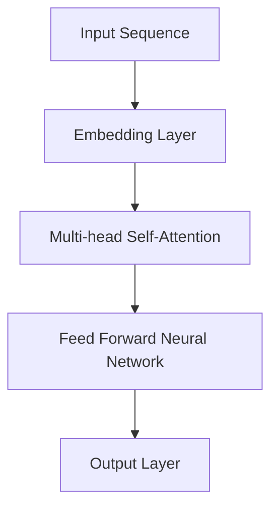

在这个流程图中，输入序列首先通过嵌入层（Embedding Layer）转换为嵌入向量，然后通过多头自注意力机制（Multi-head Self-Attention）计算每个元素的重要性，最后通过前馈神经网络（Feed Forward Neural Network）得到输出。

#### 3.1.2 语言模型的应用场景

语言模型在自然语言处理领域有着广泛的应用，包括：

- **文本分类**：通过将文本转换为向量，然后使用语言模型预测文本的类别。
- **命名实体识别**：识别文本中的命名实体，如人名、地名等。
- **机器翻译**：将一种语言的文本翻译成另一种语言。
- **文本生成**：生成符合语法和语义规则的文本。

以下是一个简单的命名实体识别的Mermaid流程图：

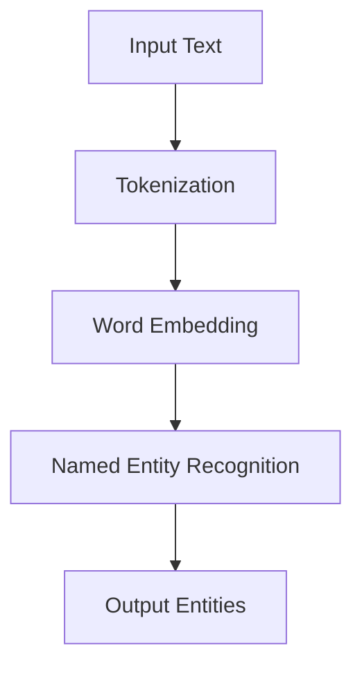

在这个流程图中，输入文本首先进行分词（Tokenization），然后通过词嵌入（Word Embedding）将每个单词转换为向量，最后使用命名实体识别模型（Named Entity Recognition）识别出文本中的命名实体。

#### 3.2 深度学习与神经网络

深度学习和神经网络是LLM的基础技术，它们在计算机视觉、语音识别和自然语言处理等领域取得了显著的成果。

##### 3.2.1 神经网络的基本概念

神经网络（Neural Network）是一种模拟人脑神经元结构和功能的计算模型。它由多个层组成，包括输入层、隐藏层和输出层。每个层由多个神经元（或节点）组成，神经元之间通过权重（weights）连接。神经网络的训练过程就是通过调整权重，使得网络能够对输入数据进行分类或回归。

##### 3.2.2 神经网络的训练过程

神经网络的训练过程通常分为以下几个步骤：

1. **数据预处理**：将输入数据转换为适合训练的格式，如标准化、归一化等。
2. **前向传播**：将输入数据通过网络进行传播，得到输出结果。
3. **计算损失**：比较输出结果和实际标签，计算损失函数（如均方误差、交叉熵等）。
4. **反向传播**：通过反向传播算法，计算每个权重和偏置的梯度，并更新权重和偏置。
5. **迭代优化**：重复以上步骤，直到满足停止条件（如达到预设的精度或迭代次数）。

以下是一个简单的神经网络训练过程的Mermaid流程图：

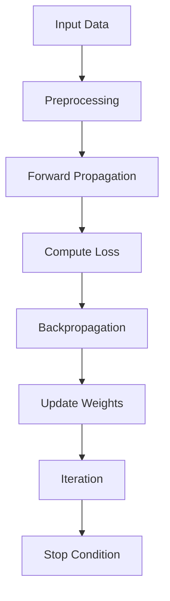

在这个流程图中，输入数据首先进行预处理，然后通过前向传播得到输出结果，计算损失并使用反向传播更新权重，最后迭代优化直到满足停止条件。

##### 3.3 LLM的训练过程

LLM的训练过程与一般的神经网络训练过程类似，但有其独特的特点。LLM的训练通常涉及以下几个步骤：

1. **数据准备**：收集和准备大规模的文本数据，包括文本清洗、去噪、分词等步骤。
2. **词嵌入**：将文本数据中的单词转换为嵌入向量，这些向量可以捕获单词的语义信息。
3. **模型初始化**：初始化神经网络模型，包括设置权重和偏置的初始值。
4. **前向传播**：将嵌入向量输入到神经网络中，计算输出结果。
5. **计算损失**：使用损失函数（如交叉熵）计算输出结果和实际标签之间的差异。
6. **反向传播**：通过反向传播算法更新权重和偏置。
7. **迭代优化**：重复以上步骤，直到满足停止条件。

以下是一个简单的LLM训练过程的Mermaid流程图：

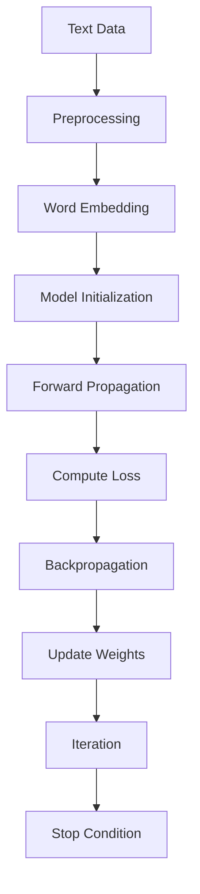

在这个流程图中，文本数据首先进行预处理，然后进行词嵌入，初始化模型，进行前向传播和反向传播，迭代优化直到满足停止条件。

#### 3.3.1 数据准备

在LLM的训练过程中，数据准备是一个关键步骤。它包括以下几个子步骤：

1. **数据收集**：从互联网、数据库或其他来源收集大量文本数据。
2. **文本清洗**：去除文本中的噪声和无关信息，如HTML标签、特殊字符等。
3. **分词**：将文本拆分成单词或子词，以便进行词嵌入。
4. **词表构建**：将所有出现的单词或子词构建成一个词表，并为每个词分配一个唯一的索引。
5. **数据归一化**：对文本数据进行归一化处理，如将所有单词转换为小写，去除停用词等。

以下是一个简单的数据准备过程的Mermaid流程图：

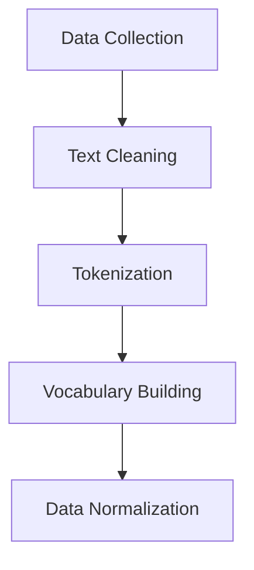

在这个流程图中，数据收集后进行文本清洗，然后进行分词，构建词表，最后进行数据归一化。

#### 3.3.2 模型训练

在数据准备完成后，下一步是模型训练。模型训练的过程包括以下几个子步骤：

1. **模型初始化**：初始化神经网络模型，包括设置权重和偏置的初始值。常用的初始化方法有随机初始化、高斯初始化等。
2. **前向传播**：将输入数据（词嵌入）通过神经网络进行传播，得到输出结果（概率分布）。
3. **计算损失**：使用损失函数（如交叉熵）计算输出结果和实际标签之间的差异。
4. **反向传播**：通过反向传播算法更新权重和偏置。
5. **迭代优化**：重复以上步骤，直到满足停止条件，如达到预设的精度或迭代次数。

以下是一个简单的模型训练过程的Mermaid流程图：

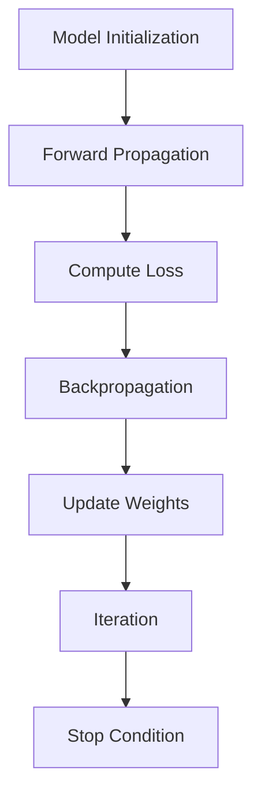

在这个流程图中，模型初始化后进行前向传播，计算损失，反向传播更新权重，迭代优化直到满足停止条件。

#### 3.3.3 模型优化

在模型训练过程中，模型优化是一个关键步骤。模型优化包括以下几个子步骤：

1. **学习率调整**：学习率是控制模型更新速度的重要参数。如果学习率过大，模型可能无法收敛；如果学习率过小，模型更新速度过慢。常用的学习率调整方法有固定学习率、学习率衰减等。
2. **正则化**：正则化是一种防止模型过拟合的方法。常用的正则化方法有L1正则化、L2正则化等。
3. **批归一化**：批归一化是一种加速训练和提升模型性能的技术。它通过在每个批次上计算均值和方差，然后对每个特征进行归一化，从而减少内部协变量转移。
4. **dropout**：dropout是一种防止模型过拟合的技巧。它通过随机丢弃一部分神经元，从而减少模型对特定输入的依赖。

以下是一个简单的模型优化过程的Mermaid流程图：

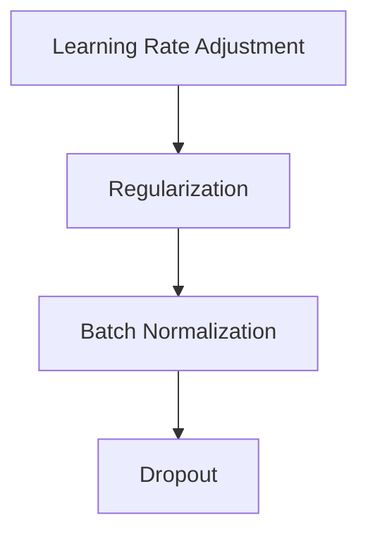

在这个流程图中，学习率调整、正则化、批归一化和dropout是模型优化的重要步骤。

### 4. LLM的评估指标

在LLM的应用中，评估指标是衡量模型性能的关键工具。以下是几种常见的LLM评估指标：

#### 4.1 准确率与召回率

准确率（Accuracy）和召回率（Recall）是评价分类模型性能的基本指标。准确率表示分类正确的样本数占总样本数的比例，而召回率表示分类正确的样本数占所有实际正样本数的比例。

\[ \text{Accuracy} = \frac{\text{分类正确的样本数}}{\text{总样本数}} \]
\[ \text{Recall} = \frac{\text{分类正确的正样本数}}{\text{所有实际正样本数}} \]

#### 4.2 F1分数

F1分数（F1 Score）是准确率和召回率的调和平均值，它能够更好地平衡这两个指标。F1分数的计算公式如下：

\[ \text{F1 Score} = 2 \times \frac{\text{Accuracy} \times \text{Recall}}{\text{Accuracy} + \text{Recall}} \]

#### 4.3 评估指标的计算方法

评估指标的计算方法通常分为两种：离线评估和在线评估。

- **离线评估**：离线评估通常在模型训练完成后进行，通过将测试集数据输入模型，计算评估指标。离线评估的优点是能够获得更准确的评估结果，但缺点是只能在一次训练完成后进行。
- **在线评估**：在线评估是通过实时监测模型在真实环境中的表现来评估模型性能。在线评估的优点是能够实时调整模型参数，但缺点是评估结果可能受到实时环境的影响。

#### 4.4 LLM评估指标的特殊性

对于LLM，评估指标的特殊性主要体现在以下几个方面：

1. **上下文理解能力**：LLM需要具备强大的上下文理解能力，因此评估指标不仅要考虑分类准确率，还要考虑模型对上下文的把握能力。
2. **生成文本质量**：在文本生成任务中，评估指标不仅要考虑生成文本的准确率，还要考虑文本的可读性、连贯性和多样性。
3. **泛化能力**：LLM需要能够在各种不同的应用场景中表现出色，因此评估指标要考虑模型在不同场景下的泛化能力。

以下是一个简单的LLM评估指标的Mermaid流程图：

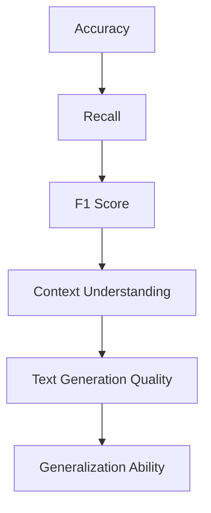

在这个流程图中，准确率、召回率、F1分数、上下文理解能力、生成文本质量和泛化能力是评估LLM性能的关键指标。

## 第三部分: LLM的应用场景

### 5. LLM在自然语言处理中的应用

#### 5.1 文本分类

文本分类是自然语言处理中的一个基本任务，旨在将文本数据自动归类到预定义的类别中。LLM在文本分类任务中表现出色，其强大的语言理解能力使其能够准确识别文本内容，并正确分类。

##### 5.1.1 文本分类的算法原理

文本分类的算法原理基于特征提取和分类器训练。首先，将文本数据转换为特征向量，然后使用分类器对特征向量进行分类。LLM在特征提取方面具有优势，它可以自动学习文本的语义特征，从而提高分类准确率。

以下是一个简单的文本分类算法原理的Mermaid流程图：

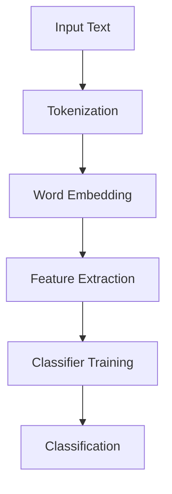

在这个流程图中，输入文本首先进行分词，然后通过词嵌入转换为特征向量，接着使用分类器进行训练，最后对特征向量进行分类。

##### 5.1.2 文本分类的mermaid流程图

以下是一个简单的文本分类流程图：

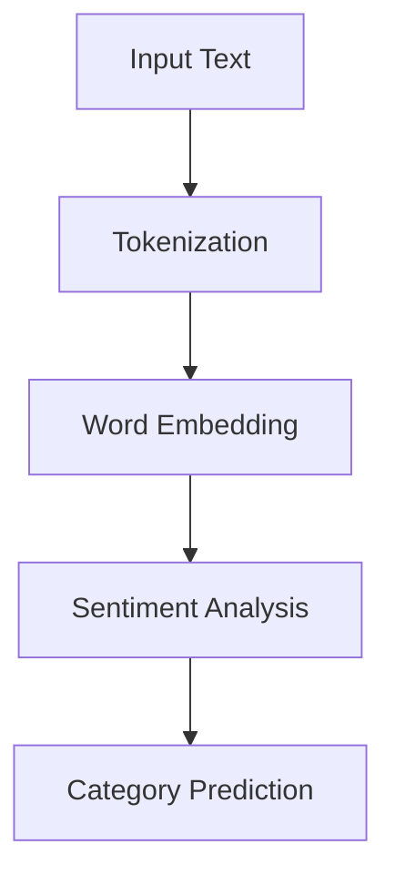

在这个流程图中，输入文本首先进行分词，然后通过词嵌入转换为特征向量，接着进行情感分析，最后根据情感分析结果预测文本类别。

#### 5.2 命名实体识别

命名实体识别（Named Entity Recognition，简称NER）是自然语言处理中的另一个重要任务，旨在识别文本中的命名实体，如人名、地名、组织名等。LLM在NER任务中具有显著优势，其强大的上下文理解能力使其能够准确识别命名实体。

##### 5.2.1 命名实体识别的算法原理

命名实体识别的算法原理基于规则匹配和机器学习。传统方法通常使用规则匹配来识别命名实体，而现代方法则采用机器学习模型，如条件随机场（CRF）和BERT等。LLM在NER任务中的应用主要基于其强大的语言理解能力，可以准确识别命名实体。

以下是一个简单的命名实体识别算法原理的Mermaid流程图：

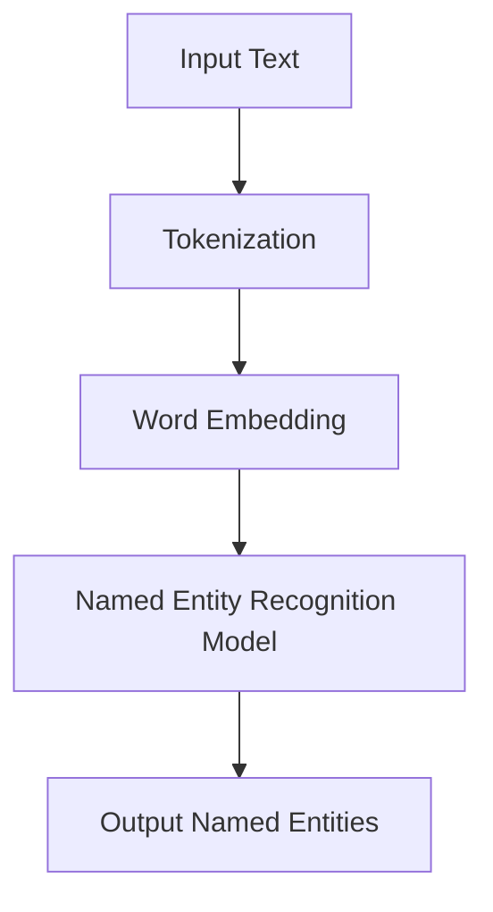

在这个流程图中，输入文本首先进行分词，然后通过词嵌入转换为特征向量，接着使用命名实体识别模型进行识别，最后输出命名实体。

##### 5.2.2 命名实体识别的mermaid流程图

以下是一个简单的命名实体识别流程图：

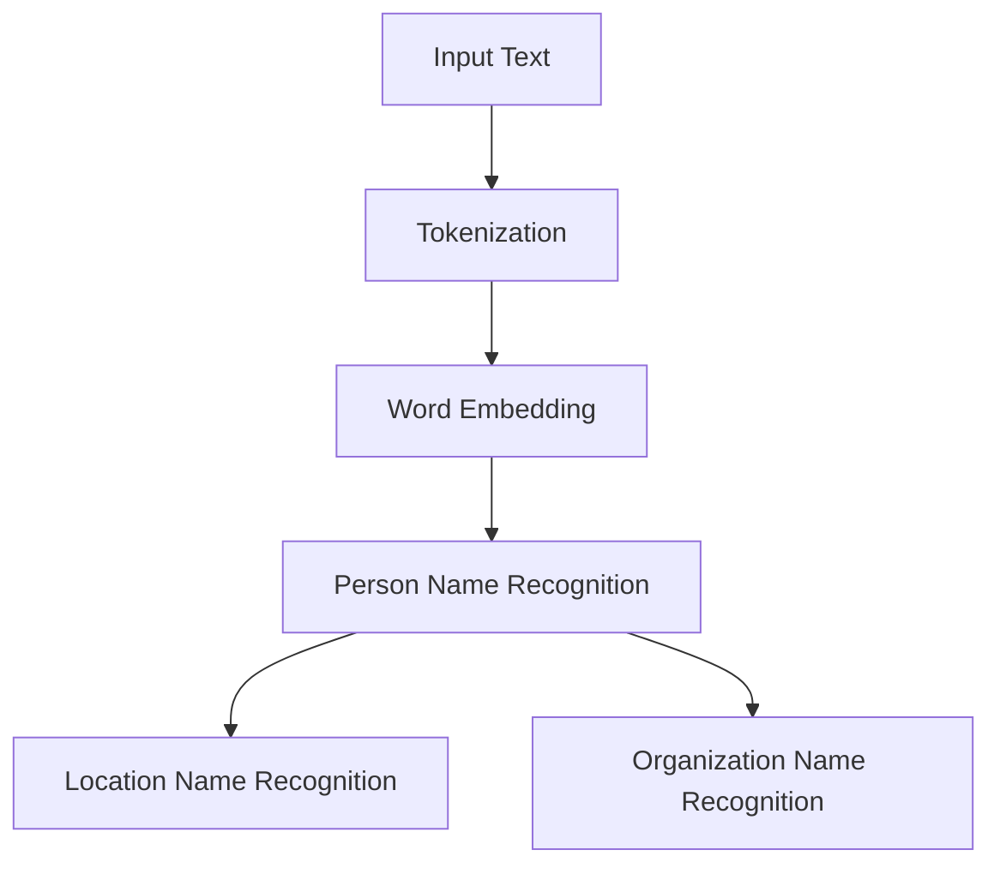

在这个流程图中，输入文本首先进行分词，然后通过词嵌入转换为特征向量，接着分别进行人名、地名和组织名的识别。

#### 5.3 机器翻译

机器翻译（Machine Translation）是将一种语言的文本自动翻译成另一种语言的技术。LLM在机器翻译任务中表现出色，其强大的语言生成能力使其能够生成高质量的目标语言文本。

##### 5.3.1 机器翻译的算法原理

机器翻译的算法原理主要基于神经网络翻译（Neural Machine Translation，简称NMT）。NMT模型通常采用编码器-解码器（Encoder-Decoder）结构，其中编码器将源语言文本转换为上下文表示，解码器则根据上下文生成目标语言文本。LLM在机器翻译任务中的应用主要基于其强大的语言生成能力，可以生成符合语法和语义规则的目标语言文本。

以下是一个简单的机器翻译算法原理的Mermaid流程图：

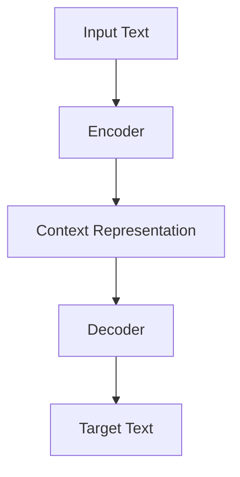

在这个流程图中，输入文本首先通过编码器转换为上下文表示，然后通过解码器生成目标语言文本。

##### 5.3.2 机器翻译的mermaid流程图

以下是一个简单的机器翻译流程图：

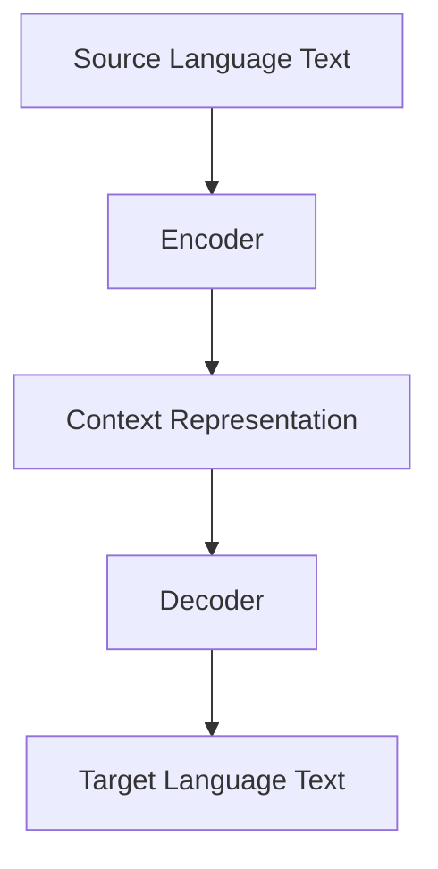

在这个流程图中，源语言文本首先通过编码器转换为上下文表示，然后通过解码器生成目标语言文本。

### 6. LLM在商业领域中的应用

#### 6.1 客户服务自动化

客户服务自动化是商业领域中的一个重要应用，旨在通过人工智能技术提高客户服务质量。LLM在客户服务自动化中发挥着关键作用，其强大的自然语言处理能力使其能够理解和响应客户需求。

##### 6.1.1 客户服务自动化的应用场景

客户服务自动化的应用场景包括：

- **在线客服**：使用LLM构建的智能客服系统可以自动响应客户的查询，提供即时解决方案。
- **客户回访**：通过LLM分析客户历史数据，预测客户需求，提前进行回访。
- **智能建议**：基于客户行为和偏好，LLM可以提供个性化的产品或服务推荐。

以下是一个简单的客户服务自动化应用场景的Mermaid流程图：

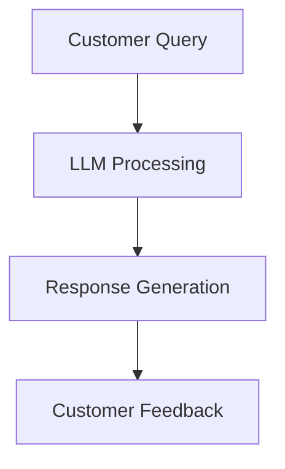

在这个流程图中，客户的查询首先通过LLM进行处理，然后生成响应，最后获取客户反馈。

##### 6.1.2 客户服务自动化的mermaid流程图

以下是一个简单的客户服务自动化流程图：

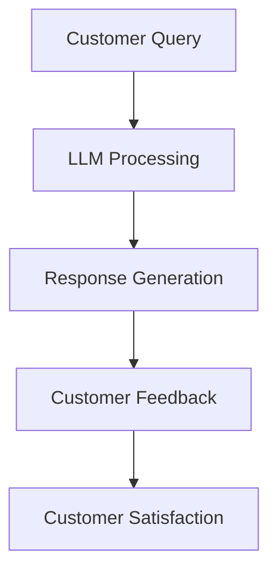

在这个流程图中，客户的查询首先通过LLM进行处理，然后生成响应，获取客户反馈，并评估客户满意度。

#### 6.2 营销自动化

营销自动化是商业领域中的另一个重要应用，旨在通过人工智能技术提高营销效果。LLM在营销自动化中发挥着关键作用，其强大的数据分析和生成能力使其能够优化营销策略。

##### 6.2.1 营销自动化的应用场景

营销自动化的应用场景包括：

- **客户细分**：通过LLM分析客户数据，将客户细分为不同的群体，以便实施个性化营销策略。
- **内容推荐**：基于客户兴趣和偏好，LLM可以生成个性化内容推荐，提高用户参与度。
- **广告投放**：通过LLM分析用户行为和广告效果，优化广告投放策略。

以下是一个简单的营销自动化应用场景的Mermaid流程图：

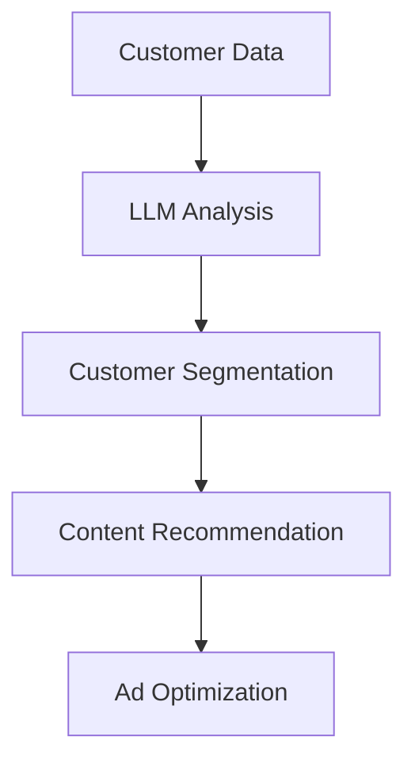

在这个流程图中，客户数据首先通过LLM进行分析，然后进行客户细分，生成内容推荐，并优化广告投放策略。

##### 6.2.2 营销自动化的mermaid流程图

以下是一个简单的营销自动化流程图：

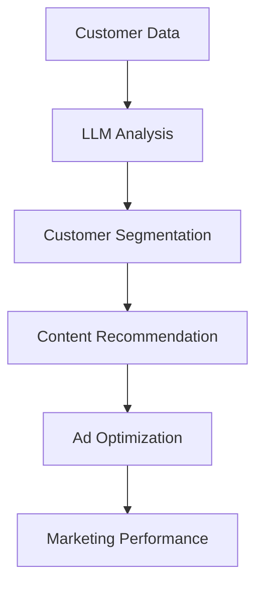

在这个流程图中，客户数据首先通过LLM进行分析，然后进行客户细分，生成内容推荐，优化广告投放策略，并评估营销效果。

### 7. LLM在教育领域中的应用

#### 7.1 个性化学习

个性化学习是教育领域中的一个重要趋势，旨在根据学生的个体差异提供定制化的学习资源。LLM在个性化学习中发挥着关键作用，其强大的数据分析和生成能力使其能够为学生提供个性化的学习方案。

##### 7.1.1 个性化学习的应用场景

个性化学习的应用场景包括：

- **学习路径推荐**：通过LLM分析学生的历史学习数据和当前学习需求，推荐最适合的学习路径。
- **作业个性化**：根据学生的学习情况，LLM可以生成个性化的作业，提高学习效果。
- **学习效果评估**：通过LLM分析学生的学习行为和学习成果，评估学习效果，并提供改进建议。

以下是一个简单的个性化学习应用场景的Mermaid流程图：

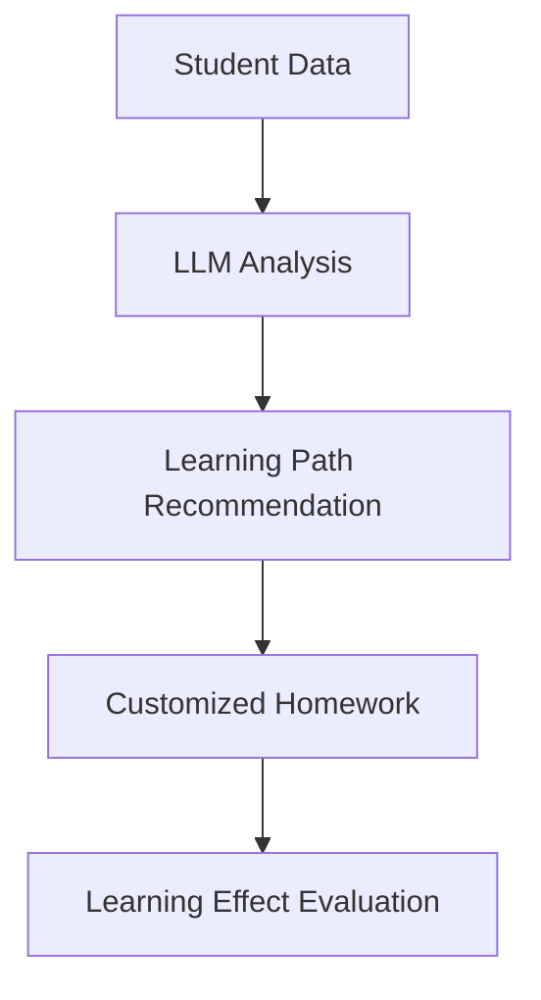

在这个流程图中，学生的数据首先通过LLM进行分析，然后推荐学习路径，生成个性化作业，并评估学习效果。

##### 7.1.2 个性化学习的mermaid流程图

以下是一个简单的个性化学习流程图：

```mermaid
graph TD
A[Student Data] --> B[LLM Analysis]
B --> C[Learning Path Recommendation]
C --> D[Customized Homework]
D --> E[Learning Effect Evaluation]
E --> F[Learning Improvement Suggestions]
```

在这个流程图中，学生的数据首先通过LLM进行分析，然后推荐学习路径，生成个性化作业，评估学习效果，并提供改进建议。

#### 7.2 在线教育平台

在线教育平台是教育领域中的另一个重要应用，旨在为学生提供灵活的学习时间和便捷的学习方式。LLM在在线教育平台中发挥着关键作用，其强大的内容生成和数据分析能力使其能够优化学习体验。

##### 7.2.1 在线教育平台的应用场景

在线教育平台的应用场景包括：

- **课程推荐**：通过LLM分析学生的学习历史和偏好，推荐最适合的课程。
- **互动教学**：使用LLM生成互动教学内容，提高学生的学习兴趣和参与度。
- **学习数据监控**：通过LLM分析学生的学习行为和学习成果，实时监控学习进度。

以下是一个简单的在线教育平台应用场景的Mermaid流程图：

```mermaid
graph TD
A[Student Data] --> B[LLM Analysis]
B --> C[Course Recommendation]
C --> D[Interactive Teaching Content]
D --> E[Learning Data Monitoring]
```

在这个流程图中，学生的数据首先通过LLM进行分析，然后推荐课程，生成互动教学内容，并监控学习数据。

##### 7.2.2 在线教育平台的mermaid流程图

以下是一个简单的在线教育平台流程图：

```mermaid
graph TD
A[Student Data] --> B[LLM Analysis]
B --> C[Course Recommendation]
C --> D[Interactive Teaching Content]
D --> E[Learning Data Monitoring]
E --> F[Learning Progress Evaluation]
```

在这个流程图中，学生的数据首先通过LLM进行分析，然后推荐课程，生成互动教学内容，监控学习数据，并评估学习进度。

## 第四部分：LLM应用的敏捷验收标准

### 8. LLM应用的敏捷验收标准

#### 8.1 完成状态的定义

在敏捷开发中，完成状态（Done Definition）是一个关键概念，它定义了一个功能或任务何时被认为已完成。对于LLM应用，完成状态的定义尤为重要，因为它直接影响应用的质量、性能和用户体验。

完成状态的定义可以分为功能完成标准和非功能完成标准。

##### 8.1.1 功能完成标准

功能完成标准是指LLM应用在功能层面需要满足的条件。以下是几个关键的功能完成标准：

1. **功能完整性**：LLM应用的所有核心功能必须完整实现，包括文本生成、翻译、分类等。
2. **性能指标**：LLM应用在性能上必须达到预期标准，如响应时间、吞吐量等。
3. **错误率**：LLM应用在处理输入数据时的错误率必须控制在可接受范围内。
4. **用户界面**：用户界面必须直观、易用，符合用户预期。

以下是一个简单的功能完成标准表格：

| 功能要求             | 完成标准                                      |
|----------------------|-----------------------------------------------|
| 文本生成             | 生成的文本质量高，语法正确，逻辑连贯           |
| 文本翻译             | 翻译的文本准确，语义一致，语言流畅             |
| 文本分类             | 分类准确，标签准确，误分类率低                 |
| 用户界面             | 界面友好，易用，符合用户习惯                   |

##### 8.1.2 非功能完成标准

非功能完成标准是指LLM应用在非功能层面需要满足的条件，这些条件虽然不直接体现在功能上，但对用户体验和系统稳定性至关重要。以下是几个关键的非功能完成标准：

1. **可扩展性**：LLM应用必须能够轻松扩展，以适应不断增长的数据量和用户需求。
2. **稳定性**：LLM应用必须具备高稳定性，能够在长时间运行中保持性能和可靠性。
3. **安全性**：LLM应用必须具备严格的安全措施，保护用户数据和隐私。
4. **兼容性**：LLM应用必须与不同的操作系统、浏览器和设备兼容。

以下是一个简单的非功能完成标准表格：

| 非功能要求             | 完成标准                                      |
|----------------------|-----------------------------------------------|
| 可扩展性             | 应用可以水平或垂直扩展，无需大量重构           |
| 稳定性             | 应用能够在高负载下稳定运行，不发生崩溃或数据丢失 |
| 安全性             | 数据传输和存储过程安全，符合相关法规标准         |
| 兼容性             | 应用在不同操作系统、浏览器和设备上均能正常运行   |

#### 8.2 验收标准的制定

验收标准（Acceptance Criteria）是用户和开发团队共同制定的，用于判断一个功能或任务是否满足需求的标准。对于LLM应用，制定验收标准需要遵循以下步骤：

1. **需求分析**：与用户和利益相关者沟通，了解他们的需求和期望。
2. **功能分解**：将需求分解为具体的子任务，为每个子任务制定验收标准。
3. **用户故事地图**：使用用户故事地图（User Story Map）来可视化需求和验收标准。
4. **评审和确认**：与用户和利益相关者一起评审和确认验收标准。

以下是一个简单的用户故事地图示例：

```mermaid
graph TD
A[Text Generation] --> B[High-Quality Output]
B --> C[Fast Response Time]
A --> D[Error Handling]
D --> E[User-Friendly Interface]
```

在这个用户故事地图中，文本生成是一个核心功能，它需要满足高质量的输出、快速响应时间、错误处理和用户友好的界面等验收标准。

##### 8.2.1 用户故事地图

用户故事地图是一种可视化的需求分析工具，用于展示用户故事和验收标准。它可以帮助开发团队和用户更好地理解需求和目标。以下是一个用户故事地图的示例：

```mermaid
graph TD
A[Customer Service Automation] --> B[Customer Query Processing]
B --> C[Automated Response Generation]
C --> D[Customer Feedback Collection]
A --> E[Error Handling]
E --> F[Scalability]
F --> G[Security]
```

在这个用户故事地图中，客户服务自动化是一个核心功能，它需要满足客户查询处理、自动化响应生成、客户反馈收集、错误处理、可扩展性和安全性等验收标准。

##### 8.2.2 功能点分解

功能点分解（Function Point Decomposition）是将一个复杂的功能分解为更小的子任务的过程。对于LLM应用，功能点分解可以帮助开发团队更清晰地理解和实现功能。以下是一个功能点分解的示例：

1. **文本生成**：
   - 输入处理
   - 文本分析
   - 文本生成
   - 文本优化

2. **文本分类**：
   - 文本预处理
   - 特征提取
   - 分类模型训练
   - 分类结果输出

3. **机器翻译**：
   - 源语言文本分析
   - 目标语言文本生成
   - 翻译结果优化

4. **用户界面**：
   - 界面设计
   - 界面交互
   - 界面优化

通过功能点分解，开发团队可以更好地理解LLM应用的功能需求，并制定相应的验收标准。

### 8.3 验收流程的设计

验收流程（Acceptance Process）是确保LLM应用满足验收标准的步骤。一个有效的验收流程应包括验收计划、验收测试和验收报告等环节。

##### 8.3.1 验收计划

验收计划是验收流程的第一步，它包括以下内容：

1. **验收标准**：明确LLM应用需要满足的功能和非功能验收标准。
2. **验收团队**：确定参与验收的团队成员，包括开发人员、测试人员、用户代表等。
3. **验收时间表**：制定验收的时间表，包括验收测试的开始和结束时间。
4. **验收资源**：准备验收所需的资源和工具，如测试环境、测试用例等。

以下是一个简单的验收计划示例：

| 序号 | 内容                 | 描述                                                         |
|------|----------------------|--------------------------------------------------------------|
| 1    | 验收标准             | 定义LLM应用需要满足的功能和非功能验收标准                   |
| 2    | 验收团队             | 确定参与验收的团队成员，包括开发人员、测试人员和用户代表   |
| 3    | 验收时间表           | 制定验收的时间表，包括验收测试的开始和结束时间               |
| 4    | 验收资源             | 准备验收所需的资源和工具，如测试环境、测试用例等           |

##### 8.3.2 验收测试

验收测试是验收流程的核心环节，它通过执行测试用例来验证LLM应用是否满足验收标准。验收测试通常包括以下步骤：

1. **测试准备**：准备测试环境，包括安装LLM应用和必要的测试工具。
2. **测试用例编写**：编写测试用例，用于验证LLM应用的功能和非功能验收标准。
3. **测试执行**：执行测试用例，记录测试结果，包括成功和失败的情况。
4. **缺陷报告**：对于测试中发现的缺陷，编写缺陷报告，并跟踪缺陷的修复情况。

以下是一个简单的验收测试流程：

```mermaid
graph TD
A[测试准备] --> B[测试用例编写]
B --> C[测试执行]
C --> D[缺陷报告]
D --> E[缺陷修复]
```

在这个流程图中，测试准备、测试用例编写、测试执行、缺陷报告和缺陷修复是验收测试的关键步骤。

##### 8.3.3 验收报告

验收报告是验收流程的最后一步，它总结了验收测试的结果和结论。一个完整的验收报告应包括以下内容：

1. **验收测试结果**：列出验收测试的执行情况，包括成功和失败的测试用例。
2. **缺陷统计**：统计测试中发现的缺陷数量，包括严重程度和修复进度。
3. **验收结论**：根据验收测试结果，判断LLM应用是否满足验收标准。
4. **验收总结**：总结验收流程的收获和改进建议。

以下是一个简单的验收报告示例：

| 序号 | 内容               | 描述                                                         |
|------|--------------------|--------------------------------------------------------------|
| 1    | 验收测试结果       | 列出验收测试的执行情况，包括成功和失败的测试用例           |
| 2    | 缺陷统计           | 统计测试中发现的缺陷数量，包括严重程度和修复进度           |
| 3    | 验收结论           | 根据验收测试结果，判断LLM应用是否满足验收标准             |
| 4    | 验收总结           | 总结验收流程的收获和改进建议                               |

### 9. LLM应用案例研究

为了更好地理解LLM应用的敏捷验收标准，我们将探讨两个具体的案例研究：客户服务自动化系统和在线教育平台。

##### 9.1 案例一：客户服务自动化系统

客户服务自动化系统是一个典型的LLM应用，它旨在通过智能客服系统提高客户服务质量。以下是对该案例的详细分析。

###### 9.1.1 案例背景

某大型电商平台为了提升客户服务质量，决定开发一个基于LLM的客户服务自动化系统。该系统旨在通过智能客服机器人自动响应客户的查询，提供即时解决方案。

###### 9.1.2 案例应用

在该案例中，开发团队制定了以下验收标准：

1. **功能完整性**：系统必须能够处理各种类型的客户查询，如产品咨询、售后服务等。
2. **性能指标**：系统响应时间必须控制在1秒以内，吞吐量必须达到每小时1000个查询。
3. **错误率**：系统错误率必须低于1%，以保证用户满意度。
4. **用户界面**：界面必须简洁、直观，符合用户习惯。

开发团队通过用户故事地图和功能点分解，制定了详细的验收标准，包括客户查询处理、自动化响应生成、客户反馈收集、错误处理、可扩展性和安全性等。

###### 9.1.3 案例结果分析

在验收测试阶段，开发团队执行了多个测试用例，包括不同类型的客户查询、系统性能测试和安全性测试。测试结果显示，系统在功能完整性、性能指标和用户界面等方面均满足验收标准。然而，在错误处理方面，系统出现了一些缺陷，如对某些特殊查询的处理不准确。开发团队立即修复了这些缺陷，并在后续的测试中通过了所有验收标准。

通过这个案例，我们可以看到，制定合理的验收标准和执行严格的验收测试是确保LLM应用质量的关键。此外，及时修复缺陷和持续改进也是提高系统稳定性和用户满意度的重要措施。

##### 9.2 案例二：在线教育平台

在线教育平台是一个新兴的领域，LLM技术在其中有着广泛的应用。以下是对该案例的详细分析。

###### 9.2.1 案例背景

某知名在线教育平台为了提供更个性化的学习体验，决定引入LLM技术，开发一个基于个性化学习的在线教育平台。该平台旨在根据学生的学习历史和当前需求，提供定制化的学习资源和推荐。

###### 9.2.2 案例应用

在该案例中，开发团队制定了以下验收标准：

1. **功能完整性**：系统必须能够处理用户注册、登录、学习路径推荐、作业生成等功能。
2. **性能指标**：系统响应时间必须控制在2秒以内，吞吐量必须达到每小时500个用户。
3. **错误率**：系统错误率必须低于2%，以保证用户体验。
4. **用户界面**：界面必须简洁、直观，易于操作。

开发团队通过用户故事地图和功能点分解，制定了详细的验收标准，包括用户注册、登录、学习路径推荐、作业生成、错误处理、可扩展性和安全性等。

###### 9.2.3 案例结果分析

在验收测试阶段，开发团队执行了多个测试用例，包括用户注册、登录、学习路径推荐、作业生成和系统性能测试等。测试结果显示，系统在功能完整性、性能指标和用户界面等方面均满足验收标准。然而，在学习路径推荐方面，系统出现了一些问题，如对某些学生的学习路径推荐不准确。开发团队分析了问题原因，并对学习路径推荐算法进行了优化，最终解决了这个问题。

通过这个案例，我们可以看到，制定合理的验收标准和执行严格的验收测试是确保LLM应用质量的关键。此外，持续优化和改进系统功能也是提高用户体验和满意度的关键。

### 10. LLM应用中的常见问题与解决方案

在LLM应用的开发和部署过程中，可能会遇到一些常见问题。以下是一些典型问题及其解决方案：

##### 10.1 数据质量与标注问题

**问题原因**：LLM模型的性能很大程度上取决于训练数据的质量和标注的准确性。数据质量问题可能导致模型性能下降，标注错误则会影响模型的准确性。

**解决方案**：
1. **数据清洗**：在训练前对数据进行清洗，去除噪声和无关信息。
2. **标注校验**：建立严格的标注校验机制，确保标注的准确性。
3. **数据增强**：使用数据增强技术，如数据扩充、合成数据等，提高数据多样性。

##### 10.2 训练与部署问题

**问题原因**：训练和部署过程复杂，可能涉及硬件资源不足、算法调优不理想等问题。

**解决方案**：
1. **资源优化**：合理分配硬件资源，确保训练过程顺利进行。
2. **算法调优**：使用先进的训练技巧和调优工具，提高模型性能。
3. **自动化部署**：使用自动化工具和平台，简化部署过程。

##### 10.3 模型解释与可解释性问题

**问题原因**：LLM模型通常被视为“黑盒”，其决策过程难以解释，这在某些应用场景中可能引发信任问题。

**解决方案**：
1. **模型解释技术**：使用模型解释工具，如LIME、SHAP等，提高模型的可解释性。
2. **可解释性训练**：在模型训练过程中，加入可解释性目标，提高模型的透明度。

### 11. LLM应用的未来发展趋势

随着人工智能技术的不断进步，LLM应用的未来发展趋势值得期待。以下是一些关键趋势：

##### 11.1 大模型

**趋势描述**：大模型（Large Models）是当前LLM研究的重要方向。通过训练更大的模型，可以进一步提高模型的性能和泛化能力。

**实际应用**：大模型在机器翻译、文本生成等领域已有成功应用，未来有望在更多领域发挥作用。

##### 11.2 多模态学习

**趋势描述**：多模态学习（Multimodal Learning）旨在结合文本、图像、声音等多种数据源，实现更丰富的信息理解和处理。

**实际应用**：多模态学习在智能问答、虚拟现实、医疗诊断等领域具有广泛应用前景。

##### 11.3 自动化与智能化

**趋势描述**：自动化与智能化（Automation and Intelligence）是未来LLM应用的重要方向。通过自动化工具和智能化算法，可以提高开发效率和应用效果。

**实际应用**：自动化和智能化技术在智能客服、智能推荐、自动驾驶等领域已有广泛应用。

##### 11.4 跨领域融合

**趋势描述**：跨领域融合（Cross-Domain Integration）是将LLM与其他人工智能技术相结合，实现更广泛的应用。

**实际应用**：跨领域融合在智能制造、智慧医疗、金融科技等领域具有巨大潜力。

## 总结与展望

### 12. 总结

本文探讨了LLM应用的敏捷验收标准，包括完成状态的定义、验收标准的制定、验收流程的设计和案例研究。通过分析LLM在自然语言处理、商业应用和教育领域中的应用，我们了解了LLM的强大能力和广阔前景。同时，本文还讨论了LLM应用中的常见问题与解决方案，以及未来发展趋势。

### 13. 展望

展望未来，LLM技术将在人工智能领域发挥更加重要的作用。随着大模型的普及、多模态学习和跨领域融合的发展，LLM应用将不断拓展新领域，带来更多创新解决方案。我们期待LLM技术能够进一步推动人工智能的发展，为社会带来更多价值。作者信息：

作者：AI天才研究院（AI Genius Institute）& 禅与计算机程序设计艺术（Zen And The Art of Computer Programming）

