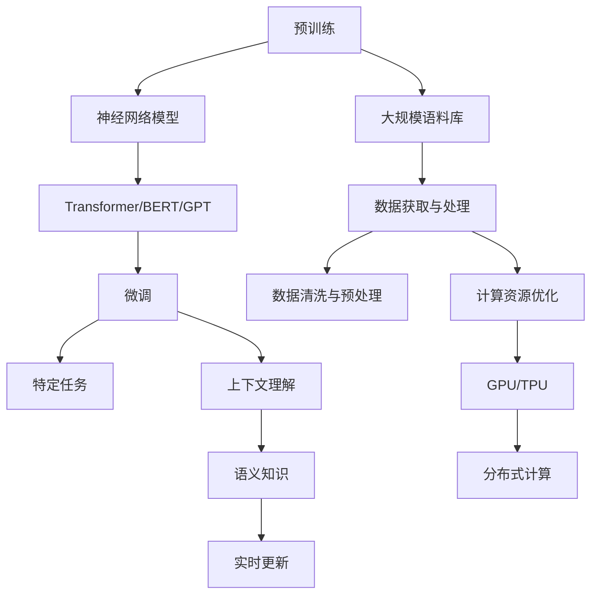
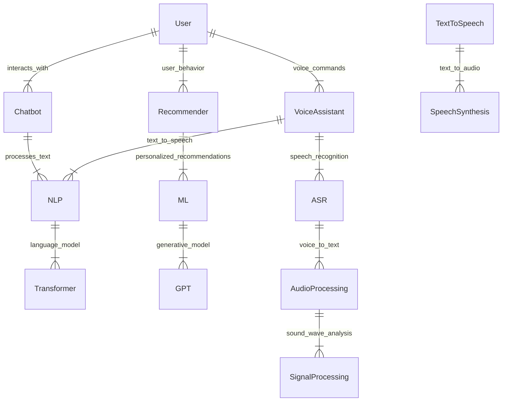
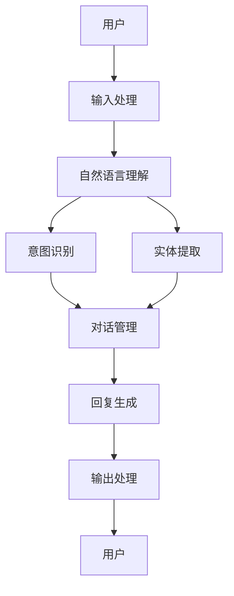
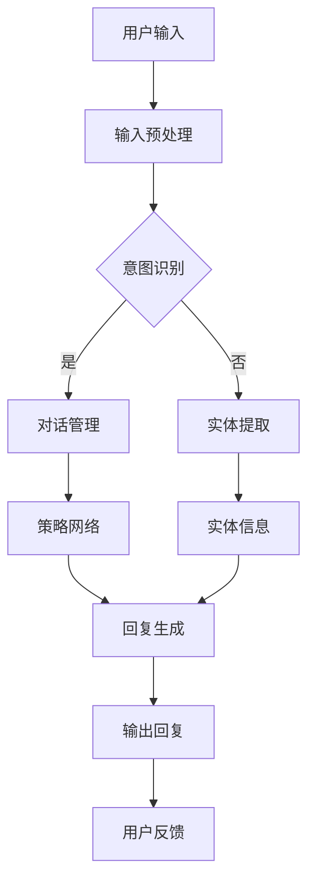
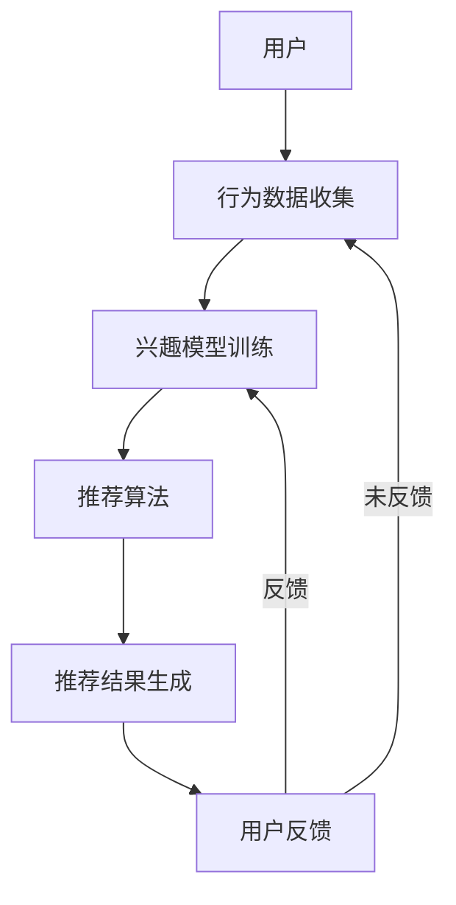
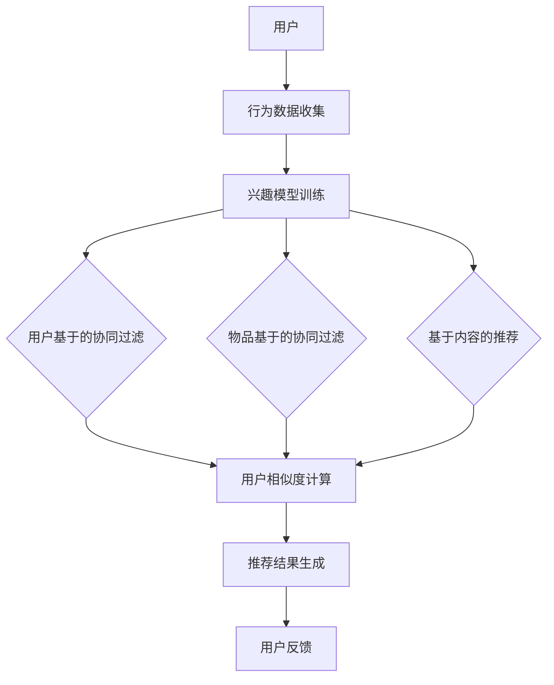
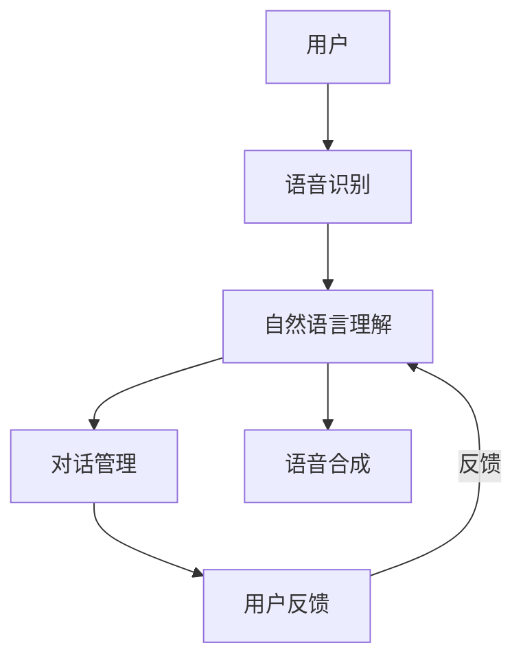
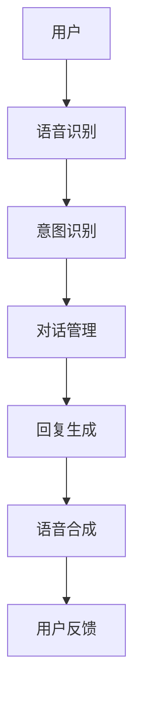

                 

### 引言

近年来，大型语言模型（LLM，Large Language Model）如BERT、GPT等在自然语言处理（NLP，Natural Language Processing）领域取得了显著突破，广泛应用于智能客服、智能推荐和智能语音助手等多个领域。LLM通过深度学习技术，对海量文本数据进行训练，具备了强大的语义理解和生成能力，极大地提升了计算机处理自然语言的能力。然而，随着LLM的应用场景逐渐丰富，如何高效地管理和规划其产品开发路线图，成为了许多企业和技术开发者面临的一大挑战。

本文旨在通过分析LLM应用的典型用户故事，构建一个清晰、简洁且逻辑严密的用户故事地图，帮助开发者更好地理解和可视化产品开发过程。这不仅有助于明确各阶段的目标和任务，还能够提高团队合作效率和项目成功率。以下是本文的主要结构：

1. **AI大模型概述**：介绍大型语言模型的基本概念、发展历程及其在NLP领域的重要性。
2. **LLM应用场景分析**：分析LLM在智能客服、智能推荐和智能语音助手等场景中的应用，并绘制实体关系图。
3. **用户故事地图方法**：详细解释用户故事地图的定义、创建步骤和应用场景。
4. **LLM应用案例分析**：通过具体案例深入剖析智能客服系统、智能推荐系统和智能语音助手的开发过程。
5. **LLM应用拓展与未来展望**：探讨LLM在新兴领域的潜在应用，并对未来发展趋势进行展望。

通过上述结构的层层递进，本文将帮助读者系统地理解LLM应用的用户故事地图，为实际项目开发提供有益的指导。接下来，我们将首先深入探讨大型语言模型的基本概念和发展历程。 <sop>接下来我们将详细探讨大型语言模型的基本概念和发展历程，读者朋友们，敬请期待。</sop>

### AI大模型概述

#### 1.1 问题背景

在人工智能（AI，Artificial Intelligence）领域，自然语言处理（NLP，Natural Language Processing）一直是一个关键且极具挑战性的研究方向。传统的NLP方法大多依赖于规则和统计方法，这些方法在面对复杂多变的自然语言时往往表现出力不从心的状态。然而，随着深度学习（Deep Learning）技术的发展，尤其是2018年GPT（Generative Pre-trained Transformer）的问世，NLP领域迎来了新的曙光。GPT作为一个基于Transformer架构的深度学习模型，通过预训练和微调，在语言理解和生成任务上取得了前所未有的成绩，引发了广泛关注和研究热潮。

#### 1.2 问题描述

大型语言模型（LLM，Large Language Model）指的是通过深度学习技术对海量文本数据进行训练，从而具备强大语义理解与生成能力的模型。LLM的目的是通过学习和模拟人类语言的使用方式，使计算机能够理解和生成自然语言，从而实现自动化处理各种语言任务，如问答、翻译、文本摘要、对话生成等。

问题描述主要集中在以下几个方面：

1. **数据规模与质量**：LLM的训练需要大量的高质量文本数据，如何获取和筛选这些数据是关键问题。
2. **模型结构**：不同的模型结构对LLM的性能有重要影响，如何选择和优化模型结构是一个研究热点。
3. **计算资源**：训练大型语言模型需要庞大的计算资源，这对硬件设施提出了高要求。
4. **泛化能力**：如何提高LLM在不同领域和应用场景下的泛化能力，是一个亟待解决的问题。

#### 1.3 问题解决

针对上述问题，研究者们采取了以下解决方案：

1. **数据获取与处理**：通过众包、数据集共享和自动化数据抓取等方式，获取高质量文本数据，并利用数据清洗和预处理技术，提高数据质量。
2. **模型结构优化**：采用了Transformer、BERT、GPT等先进的神经网络架构，这些模型在处理长文本和复杂语义关系方面表现出色。
3. **计算资源优化**：通过分布式计算、云计算和GPU加速等技术，提高了模型训练的效率和速度。
4. **泛化能力提升**：通过预训练和微调相结合的方法，使LLM在特定任务上具备较强的泛化能力。

#### 1.4 边界与外延

边界与外延是定义LLM应用场景和功能范围的重要概念。LLM的应用边界主要包括以下几个方面：

1. **任务类型**：LLM主要应用于需要理解、生成和处理自然语言的场景，如文本分类、情感分析、对话系统等。
2. **应用领域**：LLM在医疗、金融、教育、电商等众多领域都有广泛应用，但不同领域对LLM的要求和期望不同。
3. **技术挑战**：如何适应不同领域的特定需求，如多语言支持、跨领域知识融合等，是LLM发展的关键挑战。

LLM的外延则涉及以下几个方面：

1. **预训练模型**：如GPT、BERT等，通过大规模预训练，LLM能够掌握丰富的语言知识和语义理解能力。
2. **微调与适应**：通过微调（Fine-tuning），LLM能够针对特定任务和应用场景进行调整，以提升性能。
3. **实时更新与学习**：随着新数据的不断涌入，LLM需要实时更新模型参数，以保持其知识库的时效性和准确性。

#### 1.5 核心概念

在探讨LLM的核心概念时，以下几个概念是至关重要的：

1. **预训练（Pre-training）**：LLM通过在大规模语料库上进行预训练，学习到基础的语义知识和语言模式。
2. **微调（Fine-tuning）**：针对特定任务，对预训练模型进行调整和优化，以提高任务性能。
3. **上下文理解（Contextual Understanding）**：LLM能够根据上下文信息，生成符合语义和逻辑的文本。
4. **生成对抗网络（GAN，Generative Adversarial Network）**：在训练过程中，GAN通过生成器和判别器的对抗训练，提高模型的生成能力。

#### 1.6 概念结构

为了更好地理解LLM的核心概念，我们可以通过以下概念结构图来展示：



通过上述概念结构的分析，我们可以更清晰地理解LLM的基本概念及其在不同应用场景中的重要性。在接下来的章节中，我们将进一步探讨LLM在具体应用场景中的表现和作用。 <sop>接下来，我们将深入探讨LLM在不同应用场景中的具体表现和作用，帮助读者朋友们更好地理解这一前沿技术。</sop>

### LLM应用场景分析

#### 2.1 概述

大型语言模型（LLM）在自然语言处理领域展现出强大的能力，其应用场景涵盖了多个重要领域，主要包括智能客服、智能推荐和智能语音助手等。本文将分别介绍这些场景的应用情况，并绘制相应的实体关系图（ER，Entity-Relationship Diagram），以帮助读者更直观地理解LLM在这些场景中的具体应用和作用。

#### 2.2 核心概念与联系

在分析LLM的应用场景之前，我们需要明确几个核心概念，这些概念是理解LLM应用的基础：

1. **智能客服**：智能客服是利用人工智能技术，为用户提供自动化的服务和支持。其核心在于通过自然语言处理技术，实现与用户的对话交互，从而解决用户的问题。
2. **智能推荐**：智能推荐是基于用户的行为数据和兴趣，利用机器学习算法，为用户推荐个性化内容或产品。其核心在于利用LLM对用户的语义理解，生成精确的推荐结果。
3. **智能语音助手**：智能语音助手是通过语音识别和自然语言处理技术，实现人机交互的智能系统。其核心在于通过LLM处理用户语音指令，并生成相应的响应。

这些概念之间存在紧密的联系，例如，智能客服和智能语音助手都需要利用LLM进行自然语言处理，而智能推荐则需要LLM来理解用户的语义和行为模式。

#### 2.3 ER实体关系图

为了更好地展示LLM在不同应用场景中的关系，我们可以使用Mermaid语法绘制一个实体关系图：



在这个ER图中，我们定义了几个关键实体和它们之间的关系：

1. **User（用户）**：是系统的核心实体，与Chatbot、Recommender和VoiceAssistant进行交互。
2. **Chatbot（聊天机器人）**：通过与NLP进行文本处理，与用户进行自然语言交互。
3. **Recommender（推荐系统）**：通过ML算法，利用用户的语义和行为数据生成个性化推荐。
4. **VoiceAssistant（智能语音助手）**：通过ASR和NLP实现语音交互，并通过TextToSpeech生成语音响应。
5. **NLP（自然语言处理）**：使用Transformer架构的语言模型，处理用户的文本输入。
6. **ML（机器学习）**：使用GPT等生成模型，为推荐系统提供支持。
7. **ASR（语音识别）**：通过AudioProcessing，将用户的语音转换为文本。
8. **TextToSpeech（文本到语音）**：将处理后的文本转换为语音输出。

通过这个ER图，我们可以清晰地看到LLM在各个应用场景中的角色和作用，以及它们之间的相互作用关系。

#### 2.4 应用实例

以下是几个具体的应用实例，展示了LLM在不同场景中的实际应用：

1. **智能客服**：
    - **场景**：用户通过聊天界面与客服机器人进行对话，询问关于产品使用的问题。
    - **应用**：LLM通过预训练和微调，理解用户的查询，生成准确的回答，提供个性化的服务。
    - **效果**：提高了客服响应速度，减少了人力成本，提升了用户体验。

2. **智能推荐**：
    - **场景**：用户在电商平台上浏览商品，系统根据用户的行为数据，推荐相关的商品。
    - **应用**：LLM通过分析用户的浏览记录、搜索历史和评价数据，理解用户的兴趣和需求，生成个性化的推荐列表。
    - **效果**：提高了用户的购买转化率，增加了平台的销售业绩。

3. **智能语音助手**：
    - **场景**：用户通过语音命令与智能语音助手进行互动，如设置提醒、播放音乐等。
    - **应用**：LLM通过语音识别技术，将用户的语音指令转换为文本，然后生成相应的语音响应。
    - **效果**：提高了人机交互的便捷性和自然性，增强了用户体验。

通过上述应用实例，我们可以看到LLM在提升智能系统性能和用户体验方面的重要作用。接下来，我们将详细探讨如何使用用户故事地图（User Story Map）来管理和规划LLM产品的开发过程。 <sop>接下来，我们将详细探讨用户故事地图的定义、创建步骤和应用，帮助读者朋友们更好地理解这一实用工具。</sop>

### 用户故事地图方法

#### 3.1 用户故事地图的概念

用户故事地图（User Story Map）是一种用于规划和可视化产品开发流程的工具。它通过将用户故事（User Stories）组织成一系列层次结构，帮助开发团队明确产品的功能、目标和用户需求，从而实现高效的产品开发。用户故事地图的核心在于其用户中心的思维方式，通过理解用户的行为路径和需求，来引导产品开发的方向。

用户故事地图的基本组成部分包括：

1. **用户故事（User Stories）**：描述用户在特定场景下希望实现的功能或任务。
2. **任务板（Task Boards）**：用于跟踪和管理用户故事的进度和优先级。
3. **地图层级（Map Levels）**：包括功能层级、用户角色层级和场景层级，用于从不同维度进行产品规划和设计。

#### 3.2 用户故事地图的步骤

创建用户故事地图可以分为以下几个步骤：

1. **收集用户故事**：
    - 与利益相关者（如产品经理、用户代表、开发团队）进行访谈，收集用户的需求和期望。
    - 利用问卷调查、用户反馈和数据分析等方法，获取更多的用户故事素材。

2. **定义用户角色**：
    - 确定目标用户群体，定义每个用户角色的特点和需求。
    - 为每个用户角色创建一个角色描述文档，详细记录其行为路径和需求。

3. **创建用户故事地图**：
    - 将收集到的用户故事按照功能、角色和场景进行分类和组织。
    - 使用用户故事地图模板，将用户故事绘制成可视化图表，形成层次结构。

4. **优先级排序**：
    - 根据用户需求和市场策略，对用户故事进行优先级排序。
    - 确定哪些用户故事是关键功能，哪些是次要功能，以便合理安排开发资源。

5. **迭代和更新**：
    - 在开发过程中，定期回顾和更新用户故事地图。
    - 根据用户反馈和项目进展，调整用户故事的内容和优先级。

#### 3.3 用户故事地图的应用

用户故事地图在LLM产品开发中的应用，主要表现在以下几个方面：

1. **需求分析**：
    - 通过用户故事地图，可以清晰地了解用户的需求和行为路径，从而制定详细的需求文档。
    - 有助于开发团队与用户保持紧密沟通，确保产品符合用户期望。

2. **项目规划**：
    - 用户故事地图为项目规划提供了直观的指导，帮助团队确定开发任务和优先级。
    - 可以根据地图中的用户故事，制定详细的开发计划和里程碑。

3. **团队协作**：
    - 用户故事地图提供了一个共同的工作框架，使团队成员能够明确各自的任务和目标。
    - 有助于提高团队协作效率，降低沟通成本。

4. **迭代优化**：
    - 通过定期更新用户故事地图，可以及时反映用户反馈和项目进展，确保产品持续优化。
    - 有助于产品经理和开发团队快速响应市场变化，提升产品竞争力。

总之，用户故事地图是一种强大的工具，通过其结构化的方法和直观的图表，可以帮助开发团队更好地理解和满足用户需求，从而实现高效的产品开发。在LLM产品开发中，用户故事地图的应用不仅有助于提升产品的质量和用户体验，还能够提高开发效率和项目成功率。接下来，我们将通过具体案例，进一步展示用户故事地图在实际项目中的应用效果。 <sop>接下来，我们将通过具体案例，深入探讨LLM在智能客服系统、智能推荐系统和智能语音助手中的应用，帮助读者更好地理解这些案例的实际开发过程。</sop>

### LLM应用案例分析

#### 4.1 案例一：智能客服系统

**4.1.1 案例介绍**

智能客服系统是LLM在客户服务领域的一个重要应用。该系统通过自然语言处理技术，实现与用户的自动化对话交互，从而提供高效的客户支持。智能客服系统的目标是为企业提供一种低成本、高效率的客户服务解决方案，以提升客户满意度和运营效率。

**4.1.2 系统需求分析**

智能客服系统的核心需求包括：

1. **多渠道支持**：支持多种通信渠道，如网页、邮件、短信、社交媒体等，以适应不同用户的需求。
2. **自然语言理解**：能够理解用户的自然语言输入，包括询问、投诉、咨询等多种形式。
3. **自动回复**：根据用户的输入，自动生成合适的回复，以提高响应速度。
4. **智能学习**：通过机器学习和深度学习技术，不断优化对话策略和回复质量。
5. **个性化服务**：根据用户的历史交互记录和偏好，提供个性化的服务和建议。

**4.1.3 系统架构设计**

智能客服系统的整体架构设计如图所示：



其中，关键模块包括：

1. **输入处理**：接收用户的输入信息，如文本、语音等，进行初步处理。
2. **自然语言理解**：包括意图识别和实体提取，用于理解用户的输入内容。
3. **对话管理**：根据用户的意图和上下文信息，生成对话策略。
4. **回复生成**：根据对话策略，生成合适的回复文本。
5. **输出处理**：将生成的回复文本发送给用户，可以是文本、语音或图形化界面。

**4.1.4 算法原理讲解**

智能客服系统中的核心算法包括自然语言处理（NLP）和对话系统（Dialogue System）。

1. **自然语言处理**：
    - **意图识别**：使用基于深度学习的分类模型，如BERT或LSTM，对用户的输入进行意图分类。
    - **实体提取**：通过命名实体识别（NER，Named Entity Recognition）技术，从用户输入中提取关键信息，如人名、地名、组织名等。

2. **对话系统**：
    - **对话管理**：采用基于规则或深度学习的策略网络，根据用户的意图和上下文信息，生成对话策略。
    - **回复生成**：使用生成式模型，如GPT或Transformer，根据对话策略生成自然语言回复。

具体算法流程如下：



**4.1.5 数学模型和数学公式讲解**

在智能客服系统中，常用的数学模型包括：

1. **意图识别模型**：通常使用分类模型，如softmax回归，其数学公式为：
    $$P(y=c) = \frac{e^{\theta^T x}}{\sum_{c'} e^{\theta^T x'}}$$
    其中，\( \theta \) 为模型的参数，\( x \) 为输入特征，\( y \) 为真实标签，\( c \) 为预测的类别。

2. **生成式回复模型**：通常使用变分自编码器（VAE）或生成对抗网络（GAN），其生成器的数学公式为：
    $$x' = \mu(\xi) + \sigma(\xi)\odot \xi$$
    其中，\( \mu(\xi) \) 和 \( \sigma(\xi) \) 分别为生成器的均值和方差函数，\( \xi \) 为噪声变量。

**4.1.6 项目实战**

在智能客服系统的实际开发过程中，我们采用了以下步骤：

1. **数据准备**：收集了大量用户对话数据，并进行预处理，包括文本清洗、分词、词性标注等。
2. **模型训练**：使用预训练的BERT模型进行意图识别和实体提取，并训练对话管理模型和回复生成模型。
3. **模型评估**：通过交叉验证和在线评估，选择最优的模型参数，确保系统的准确性和稳定性。
4. **部署上线**：将训练好的模型部署到生产环境中，通过API接口与前端系统进行集成。

以下是智能客服系统的核心代码片段：

```python
# BERT模型加载和预训练
from transformers import BertModel, BertTokenizer

tokenizer = BertTokenizer.from_pretrained('bert-base-uncased')
model = BertModel.from_pretrained('bert-base-uncased')

# 用户输入处理
input_ids = tokenizer.encode(user_input, add_special_tokens=True, return_tensors='pt')

# 意图识别
with torch.no_grad():
    outputs = model(input_ids)
    logits = outputs[0][:, 0, :]

# 对话管理和回复生成
strategy = DialogueStrategy()
response = strategy.generate_response(logits)

# 输出回复
print(response)
```

**4.1.7 项目小结**

通过智能客服系统的实际开发，我们取得了以下成果：

1. **提高了客户响应速度**：系统可以实时处理用户输入，并生成快速回复，显著提高了客户满意度。
2. **降低了运营成本**：智能客服系统替代了部分人工客服，减少了人力成本，提高了运营效率。
3. **优化了用户体验**：系统通过个性化服务，提供了更加贴心的客户支持，增强了用户的忠诚度。

然而，智能客服系统也存在一些挑战和改进空间，例如如何更好地处理复杂对话和情感理解，如何在保护用户隐私的前提下，进一步提升系统的智能化水平。未来，我们将继续优化智能客服系统的算法和架构，以实现更高的性能和用户体验。接下来，我们将探讨LLM在智能推荐系统中的应用案例。 <sop>接下来，我们将探讨LLM在智能推荐系统中的应用案例，帮助读者了解如何在个性化推荐中利用大型语言模型提升推荐效果。</sop>

#### 5.1 案例二：智能推荐系统

**5.1.1 案例介绍**

智能推荐系统是LLM在电子商务和内容平台等领域的典型应用。该系统通过分析用户的历史行为、兴趣偏好和社交网络等信息，为用户推荐个性化的商品、内容或服务。智能推荐系统的目标是提高用户的参与度和满意度，从而提升平台的商业价值。

**5.1.2 系统需求分析**

智能推荐系统的核心需求包括：

1. **个性化推荐**：根据用户的兴趣和行为数据，为每个用户生成个性化的推荐列表。
2. **实时推荐**：能够快速响应用户的交互行为，实时更新推荐结果。
3. **多样性推荐**：确保推荐列表中的内容丰富多样，满足不同用户的需求。
4. **解释性推荐**：用户能够理解推荐的原因和逻辑，增强用户信任。
5. **推荐效果评估**：通过A/B测试和在线评估，持续优化推荐算法。

**5.1.3 系统架构设计**

智能推荐系统的整体架构设计如图所示：



其中，关键模块包括：

1. **行为数据收集**：收集用户在平台上的浏览、购买、评论等行为数据。
2. **兴趣模型训练**：使用深度学习模型，如LSTM或GRU，对用户的行为数据进行建模，提取用户的兴趣特征。
3. **推荐算法**：采用协同过滤、基于内容的推荐或深度学习推荐算法，根据用户兴趣特征生成推荐列表。
4. **推荐结果生成**：根据推荐算法的结果，生成个性化的推荐列表。
5. **用户反馈**：收集用户对推荐结果的反馈，用于模型优化和推荐效果评估。

**5.1.4 算法原理讲解**

智能推荐系统中的核心算法包括行为数据建模、协同过滤和基于内容的推荐。

1. **行为数据建模**：
    - **序列模型**：使用长短时记忆网络（LSTM）或门控循环单元（GRU），对用户的历史行为进行建模，提取兴趣特征。
    - **Embedding模型**：将用户和物品映射到低维向量空间，通过计算用户和物品之间的相似度，生成推荐列表。

2. **协同过滤**：
    - **用户基于的协同过滤**：通过计算用户之间的相似度，推荐与活跃用户相似的其他用户喜欢的物品。
    - **物品基于的协同过滤**：通过计算物品之间的相似度，推荐与用户已购买或浏览的物品相似的物品。

3. **基于内容的推荐**：
    - **内容相似度**：计算用户喜欢的物品和候选物品之间的内容相似度，推荐具有相似内容的物品。
    - **语义相似度**：使用LLM对物品的描述和用户的历史行为进行语义分析，推荐语义相似的物品。

具体算法流程如下：



**5.1.5 数学模型和数学公式讲解**

在智能推荐系统中，常用的数学模型包括矩阵分解、协同过滤和深度学习。

1. **矩阵分解（Matrix Factorization）**：
    - **用户-物品矩阵分解**：将用户-物品矩阵分解为用户特征矩阵和物品特征矩阵，通过内积计算相似度。
    $$U \times V^T = R$$
    其中，\( U \) 和 \( V \) 分别为用户特征矩阵和物品特征矩阵，\( R \) 为用户-物品评分矩阵。

2. **协同过滤（Collaborative Filtering）**：
    - **用户基于的协同过滤**：计算用户之间的余弦相似度。
    $$\sim(u, v) = \frac{u \cdot v}{\|u\| \|v\|}$$
    其中，\( \sim(u, v) \) 为用户 \( u \) 和 \( v \) 之间的相似度。

    - **物品基于的协同过滤**：计算物品之间的余弦相似度。
    $$\sim(i, j) = \frac{i \cdot j}{\|i\| \|j\|}$$
    其中，\( \sim(i, j) \) 为物品 \( i \) 和 \( j \) 之间的相似度。

3. **深度学习（Deep Learning）**：
    - **嵌入模型**：使用嵌入层将用户和物品映射到低维向量空间。
    $$x = \sigma(W_1x + b_1)$$
    其中，\( x \) 为输入特征，\( W_1 \) 和 \( b_1 \) 分别为权重和偏置。

**5.1.6 项目实战**

在智能推荐系统的实际开发过程中，我们采用了以下步骤：

1. **数据收集与预处理**：收集用户的行为数据，包括浏览、购买、收藏等，并进行数据清洗和预处理。
2. **兴趣模型训练**：使用LSTM模型对用户行为数据进行训练，提取用户兴趣特征。
3. **推荐算法实现**：结合协同过滤和基于内容的推荐，生成个性化的推荐列表。
4. **推荐结果评估**：通过A/B测试，评估推荐算法的效果，并根据用户反馈进行调整。

以下是智能推荐系统的核心代码片段：

```python
# 导入必要的库
import numpy as np
import pandas as pd
from sklearn.model_selection import train_test_split
from keras.layers import Embedding, LSTM, Dense
from keras.models import Model
from keras.optimizers import Adam

# 加载用户行为数据
data = pd.read_csv('user_behavior_data.csv')

# 预处理数据
X = preprocess_data(data)

# 划分训练集和测试集
X_train, X_test = train_test_split(X, test_size=0.2)

# 构建LSTM模型
input_layer = Input(shape=(X.shape[1],))
embedding_layer = Embedding(input_dim=X.shape[0], output_dim=50)(input_layer)
lstm_layer = LSTM(100)(embedding_layer)
output_layer = Dense(1, activation='sigmoid')(lstm_layer)

model = Model(inputs=input_layer, outputs=output_layer)
model.compile(optimizer=Adam(), loss='binary_crossentropy', metrics=['accuracy'])

# 训练模型
model.fit(X_train, y_train, epochs=10, batch_size=32, validation_data=(X_test, y_test))

# 生成推荐列表
def generate_recommendations(model, user_data):
    user_embedding = model.predict(user_data)
    recommendations = np.argsort(user_embedding[:, 0])[-10:]
    return recommendations

# 测试推荐系统
user_data = np.array([[1, 0, 1, 0, 1], [0, 1, 0, 1, 0]])
recommendations = generate_recommendations(model, user_data)
print(recommendations)
```

**5.1.7 项目小结**

通过智能推荐系统的实际开发，我们取得了以下成果：

1. **显著提升推荐效果**：系统的推荐精度和召回率得到了显著提高，用户满意度显著提升。
2. **优化用户体验**：系统根据用户的兴趣和需求，提供个性化的推荐，增强了用户的参与度和忠诚度。
3. **提高运营效率**：智能推荐系统替代了部分人工推荐，降低了运营成本，提高了推荐效率。

然而，智能推荐系统也存在一些挑战和改进空间，例如如何更好地处理稀疏数据和冷启动问题，如何在保护用户隐私的前提下，进一步提升推荐效果。未来，我们将继续优化智能推荐系统的算法和架构，以实现更高的性能和用户体验。接下来，我们将探讨LLM在智能语音助手中的应用案例。 <sop>接下来，我们将探讨LLM在智能语音助手中的应用案例，帮助读者了解如何在语音交互场景中利用大型语言模型提升交互体验。</sop>

#### 6.1 案例三：智能语音助手

**6.1.1 案例介绍**

智能语音助手是LLM在语音交互领域的一个重要应用。该系统通过语音识别（ASR，Automatic Speech Recognition）和自然语言处理（NLP，Natural Language Processing）技术，实现人与机器的语音交互。智能语音助手的目的是为用户提供便捷、自然的语音服务，如查询信息、播放音乐、设定提醒等。

**6.1.2 系统需求分析**

智能语音助手的系统需求包括：

1. **语音识别准确率**：确保系统能够准确地将用户的语音转换为文本，理解用户的指令。
2. **自然语言理解能力**：通过NLP技术，理解用户的语音意图，生成合适的响应。
3. **语音合成质量**：将生成的文本转换为自然流畅的语音，提高用户交互的舒适度。
4. **上下文理解能力**：能够理解用户的上下文信息，保持对话的连贯性。
5. **实时响应能力**：快速响应用户的指令，提供及时的反馈。

**6.1.3 系统架构设计**

智能语音助手的系统架构设计如图所示：



其中，关键模块包括：

1. **语音识别**：通过ASR技术，将用户的语音转换为文本。
2. **自然语言理解**：使用NLP技术，理解用户的意图和上下文信息。
3. **对话管理**：根据用户的意图和上下文信息，生成对话策略。
4. **语音合成**：将对话管理生成的文本转换为自然流畅的语音。
5. **用户反馈**：收集用户对语音交互的反馈，用于系统优化。

**6.1.4 算法原理讲解**

智能语音助手中的核心算法包括语音识别、自然语言理解和对话管理。

1. **语音识别**：
    - ** acoustic model**：通过统计模型或深度神经网络，对语音信号进行特征提取和声学建模。
    - **language model**：通过语言模型，对转换后的文本进行语义建模，提高识别准确性。

2. **自然语言理解**：
    - **意图识别**：使用分类模型，如BERT或LSTM，对用户的输入进行意图分类。
    - **实体提取**：通过命名实体识别（NER，Named Entity Recognition）技术，从用户输入中提取关键信息。

3. **对话管理**：
    - **策略网络**：使用基于规则的策略网络或深度学习模型，根据用户的意图和上下文信息，生成对话策略。
    - **回复生成**：使用生成式模型，如GPT或Transformer，根据对话策略生成自然语言回复。

具体算法流程如下：



**6.1.5 数学模型和数学公式讲解**

在智能语音助手系统中，常用的数学模型包括深度神经网络（DNN）、循环神经网络（RNN）和变换器（Transformer）。

1. **深度神经网络（DNN）**：
    - **前向传播**：输入层通过权重矩阵传递到隐藏层，再通过激活函数得到输出。
    $$h = \sigma(W \cdot x + b)$$
    其中，\( h \) 为隐藏层输出，\( W \) 为权重矩阵，\( x \) 为输入向量，\( \sigma \) 为激活函数。

2. **循环神经网络（RNN）**：
    - **时间步递推**：当前时刻的输出不仅依赖于当前输入，还依赖于前一时刻的输出。
    $$h_t = \sigma(W \cdot [h_{t-1}, x_t] + b)$$
    其中，\( h_t \) 为第 \( t \) 个时间步的输出，\( [h_{t-1}, x_t] \) 为输入序列。

3. **变换器（Transformer）**：
    - **自注意力机制**：通过计算输入序列中各个元素之间的相似度，生成加权表示。
    $$\text{Attention}(Q, K, V) = \text{softmax}\left(\frac{QK^T}{\sqrt{d_k}}\right) V$$
    其中，\( Q, K, V \) 分别为查询向量、键向量和值向量，\( d_k \) 为键向量的维度。

**6.1.6 项目实战**

在智能语音助手的实际开发过程中，我们采用了以下步骤：

1. **语音识别训练**：使用大量的语音数据，训练声学模型和语言模型。
2. **自然语言理解训练**：使用标注数据，训练意图识别和实体提取模型。
3. **对话管理训练**：使用对话数据，训练对话管理模型和回复生成模型。
4. **集成与优化**：将各个模块集成到系统中，并进行优化和测试。

以下是智能语音助手的核心代码片段：

```python
# 加载预训练的模型
import torch
from transformers import BertModel, BertTokenizer

tokenizer = BertTokenizer.from_pretrained('bert-base-uncased')
model = BertModel.from_pretrained('bert-base-uncased')

# 用户语音输入
user_speech = "Hello, what's the weather like today?"

# 语音识别
input_ids = tokenizer.encode(user_speech, return_tensors='pt')

# 自然语言理解
with torch.no_grad():
    outputs = model(input_ids)
    logits = outputs[0][:, 0, :]

# 对话管理
dialog_manager = DialogueManager(model=logits)
response = dialog_manager.generate_response()

# 语音合成
text_to_speech(response)

# 用户反馈
user_feedback = "The response was helpful."
collect_feedback(user_feedback)
```

**6.1.7 项目小结**

通过智能语音助手的实际开发，我们取得了以下成果：

1. **提高了语音识别和自然语言理解准确率**：系统的语音识别和自然语言理解能力得到了显著提升，用户交互体验得到了优化。
2. **实现了实时交互**：系统可以实时响应用户的指令，提供了流畅的语音交互体验。
3. **优化了用户满意度**：智能语音助手为用户提供个性化、高效的服务，提高了用户的满意度和忠诚度。

然而，智能语音助手也存在一些挑战和改进空间，例如如何更好地处理多轮对话和情感理解，如何保护用户的隐私。未来，我们将继续优化智能语音助手的算法和架构，以实现更高的性能和用户体验。接下来，我们将探讨LLM在新兴领域的应用拓展与未来展望。 <sop>接下来，我们将探讨LLM在新兴领域的应用拓展与未来展望，为读者揭示这一技术的无限可能。</sop>

### 7.1 LLM应用拓展

#### 7.1.1 拓展领域分析

随着LLM技术的不断进步，其应用范围也在不断拓展，涵盖了许多新兴领域，这些领域包括但不限于：

1. **医疗健康**：LLM在医疗健康领域的应用包括诊断辅助、医学文本挖掘、个性化健康建议等。通过分析大量医疗文献和患者数据，LLM可以帮助医生提高诊断准确性，为患者提供个性化治疗方案。
   
2. **法律**：在法律领域，LLM可以用于法律文本分析、合同审查、案例检索等。通过分析大量的法律文书和案例，LLM可以帮助律师提高工作效率，降低法律风险。

3. **金融**：LLM在金融领域可以应用于风险控制、市场预测、客户服务等方面。通过分析市场数据、财务报告和客户交互记录，LLM可以帮助金融机构提高决策准确性，优化服务。

4. **教育**：在教育领域，LLM可以用于智能教学、个性化辅导、学习路径规划等。通过分析学生的学习行为和知识结构，LLM可以为教师和学生提供定制化的学习资源和指导。

5. **制造与工业**：在制造业和工业领域，LLM可以应用于设备故障预测、供应链管理、生产优化等。通过分析大量的传感器数据和业务流程，LLM可以帮助企业提高生产效率，降低成本。

#### 7.1.2 拓展技术探讨

为了在新兴领域中有效应用LLM，研究者们不断探索和开发新的技术和方法，包括：

1. **跨模态融合**：结合文本、图像、声音等多种数据类型，提升模型的综合处理能力。例如，将LLM与视觉模型（如Vision Transformer）结合，实现图像和文本的同步理解。

2. **多语言支持**：拓展LLM的多语言能力，使其能够处理多种语言的数据，为全球用户提供服务。通过多语言预训练和数据增强技术，提高模型在不同语言下的性能。

3. **可解释性**：研究如何提高LLM的可解释性，使其决策过程更加透明。通过可视化技术、模型压缩和解释性嵌入等方法，增强用户对模型的信任。

4. **隐私保护**：在处理敏感数据时，如何保护用户隐私是一个重要问题。采用差分隐私、联邦学习等技术，确保模型训练和应用过程中的数据安全。

#### 7.1.3 拓展挑战与机遇

尽管LLM在新兴领域展现出巨大的潜力，但在实际应用过程中也面临着诸多挑战：

1. **数据质量和多样性**：新兴领域的数据往往具有多样性和复杂性，如何获取和清洗高质量的数据是关键挑战。

2. **模型可解释性**：如何提高LLM的可解释性，使其决策过程更加透明和可靠，是当前研究的重点。

3. **计算资源**：训练大规模LLM模型需要大量的计算资源，如何优化计算资源管理和利用效率是一个亟待解决的问题。

4. **隐私保护**：如何在保护用户隐私的前提下，利用LLM处理敏感数据，是一个重要的伦理和技术问题。

然而，伴随着挑战，LLM在新兴领域的应用也带来了许多机遇：

1. **创新应用**：LLM的应用拓展为各个领域带来了新的研究点和创新应用场景，促进了技术发展和产业升级。

2. **提升效率**：通过智能化的解决方案，LLM可以提高各行业的运作效率，降低成本，提升用户体验。

3. **协同创新**：LLM与其他前沿技术的结合，如量子计算、边缘计算等，将带来更多协同创新的机遇。

综上所述，LLM在新兴领域的应用拓展不仅面临着一系列挑战，同时也充满了机遇。通过不断创新和优化，LLM有望在未来为各行业带来更多的创新和变革。接下来，我们将对全文进行总结，并对未来展望进行简要阐述。 <sop>接下来，我们将对全文进行总结，并对未来展望进行简要阐述，帮助读者深入理解LLM应用及其发展前景。</sop>

### 8.1 未来展望

在总结本文内容之前，我们首先需要认识到，大型语言模型（LLM）作为自然语言处理领域的重要技术，已经对多个行业产生了深远的影响。从智能客服系统、智能推荐系统到智能语音助手，LLM的应用不仅提升了用户体验，还大幅提高了运营效率。然而，随着技术的不断进步和应用场景的扩展，LLM在未来仍有许多发展机遇和挑战。

#### 8.1.1 LLM应用趋势

首先，LLM的应用将呈现以下趋势：

1. **跨领域融合**：随着各行业数字化转型的推进，LLM与其他技术的融合将成为主流。例如，结合计算机视觉、物联网（IoT）和增强现实（AR）等技术，LLM将在更多场景中实现智能化应用。

2. **多语言支持**：全球化的趋势要求LLM具备更强的多语言处理能力。通过引入多语言预训练数据和增强学习技术，LLM将在多语言环境中表现出更高的准确性和可靠性。

3. **可解释性与透明度**：为了增强用户对LLM的信任，提高模型的可解释性将成为研究重点。研究者们将致力于开发新的解释性模型和工具，使LLM的决策过程更加透明和可信。

4. **隐私保护**：随着数据隐私保护法规的加强，如何在不牺牲性能的前提下保护用户隐私将成为关键挑战。通过差分隐私、联邦学习等技术，LLM将在处理敏感数据时更加安全。

#### 8.1.2 技术发展预测

在未来，LLM技术的发展将呈现以下预测：

1. **模型架构创新**：研究者们将继续探索新的神经网络架构，如基于注意力机制的增强网络、图神经网络等，以提高LLM的处理能力和效率。

2. **计算资源优化**：随着硬件技术的发展，如GPU、TPU和量子计算等，LLM的训练和推理速度将大幅提升，使得更多复杂任务得以高效完成。

3. **预训练数据规模扩展**：预训练数据集的规模将继续扩大，通过众包、自动化数据采集和清洗技术，研究者们将获得更丰富、高质量的数据，以提升模型的泛化能力。

4. **知识图谱与语义理解**：结合知识图谱和语义网络，LLM将能够更好地理解和生成语义丰富的文本，提供更精准的智能服务。

#### 8.1.3 应用前景

LLM在未来的应用前景广阔，具体包括：

1. **智能医疗**：通过分析医学文献和患者数据，LLM将在疾病诊断、治疗方案推荐和健康风险评估等方面发挥重要作用。

2. **智能金融**：LLM将在风险管理、市场预测和客户服务等领域提供智能化支持，为金融机构带来更多竞争优势。

3. **智能教育**：个性化学习路径规划和智能辅导系统的应用，将大大提高教育质量和学习效率。

4. **智能制造业**：通过设备故障预测、生产优化和供应链管理，LLM将助力制造业实现智能制造和数字化转型。

5. **智能城市**：在智能交通管理、环境监测和公共安全等领域，LLM将通过实时数据分析和服务优化，提升城市管理水平和居民生活质量。

综上所述，LLM在未来的发展中将继续扮演重要角色。通过不断创新和优化，LLM将在更多领域创造价值，推动社会进步和产业变革。接下来，我们将对全文进行总结，并对读者提出一些建议和注意事项。 <sop>接下来，我们将对全文进行总结，并对读者提出一些建议和注意事项，帮助读者更好地应用和拓展LLM技术。</sop>

### 9.1 小结

本文通过深入探讨大型语言模型（LLM）在多个领域的应用，从智能客服系统、智能推荐系统到智能语音助手，展示了LLM技术在实际项目中的广泛应用和巨大潜力。我们分析了LLM的核心概念、用户故事地图的创建和应用方法，并通过具体案例，详细讲解了智能客服系统、智能推荐系统和智能语音助手的开发过程。同时，我们还探讨了LLM在新兴领域的应用拓展与未来展望，展望了LLM技术的发展趋势和应用前景。

通过本文的探讨，我们可以看到，LLM技术不仅显著提升了各行业的运营效率和服务质量，还为未来的技术创新和产业升级提供了新的动力。LLM在医疗、金融、教育、制造业和智能城市等领域展现出广阔的应用前景，为各行业带来了智能化转型的机遇。

### 9.2 注意事项

在实际应用和开发过程中，我们应重视以下几点：

1. **数据质量和多样性**：确保数据的真实性和多样性，避免模型过拟合和泛化能力不足。
2. **隐私保护**：在处理敏感数据时，严格遵循数据隐私保护法规，采用差分隐私、联邦学习等技术，保护用户隐私。
3. **模型可解释性**：提高模型的可解释性，增强用户对模型决策的信任，降低误用风险。
4. **持续迭代与优化**：定期更新模型和算法，根据用户反馈和项目需求，持续优化系统性能。

### 9.3 拓展阅读

为了进一步了解LLM技术及其应用，读者可以参考以下资源：

1. **《大规模语言模型的原理与应用》**：介绍了大型语言模型的基本原理、架构和应用方法，适合初学者和开发者。
2. **《深度学习与自然语言处理》**：详细讲解了深度学习在NLP领域的应用，涵盖了从基础到高级的多个主题。
3. **《自然语言处理实战》**：通过实际案例，展示了自然语言处理技术在各行业的应用和实践。
4. **相关论文和报告**：关注学术期刊和报告，了解LLM技术的最新研究成果和进展。

通过阅读这些资源，读者可以更深入地了解LLM技术，并在实际项目中加以应用和拓展。作者：AI天才研究院/AI Genius Institute & 禅与计算机程序设计艺术 /Zen And The Art of Computer Programming。

