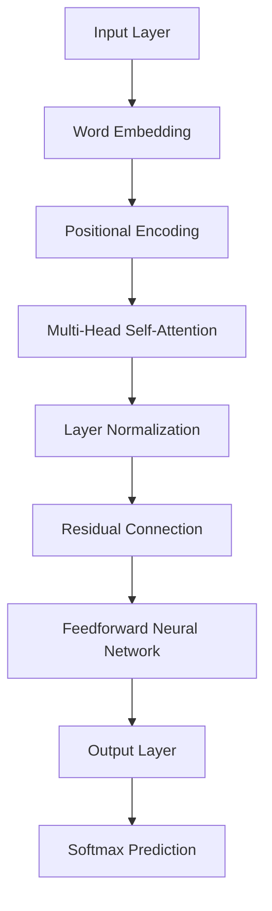

                 

### LLAMA模型解析

#### 1. 模型架构

**LLAMA模型** 是由Meta AI团队开发的一种基于Transformer架构的大型语言模型。其架构设计与当前主流的GPT、BERT等模型类似，主要包含以下几个关键组件：

1. **输入层**：将输入文本序列编码成词向量。
2. **Embedding层**：对词向量进行位置嵌入和维度扩展。
3. **Transformer编码器**：通过多头自注意力机制进行文本的深层特征提取。
4. **Transformer解码器**：对提取到的特征进行解码，生成预测的输出。
5. **输出层**：将解码得到的输出映射到词汇表中的词语。

**Transformer编码器** 是LLAMA模型的核心部分，其具体结构包括：

- **多头自注意力机制**：模型通过多个自注意力头并行的方式来捕捉文本中的不同关系，从而提高模型的表征能力。
- **位置编码**：为了保留输入文本中的顺序信息，模型采用位置编码的方法来嵌入位置信息。
- **层归一化和残差连接**：为了加速模型的训练，每个Transformer编码器层后都包含层归一化和残差连接。

**Transformer解码器** 的结构与编码器类似，但在输出阶段会引入交叉注意力机制，以便于从编码器的输出中检索信息，生成预测的输出。

#### 2. 算法原理

LLAMA模型的核心算法原理是基于Transformer架构的自注意力机制。下面简要介绍其工作原理：

1. **词向量编码**：输入文本经过分词后，每个词被编码成一个高维的词向量。
2. **嵌入层**：词向量通过嵌入层进行位置和维度的扩展，生成嵌入向量。
3. **自注意力计算**：嵌入向量输入到自注意力机制，通过计算词向量之间的相似度来生成加权向量。这一过程通过多头注意力机制实现，可以捕捉到文本中的长距离依赖关系。
4. **位置编码**：将位置编码向量加到加权向量上，以保留文本的顺序信息。
5. **前馈神经网络**：对自注意力后的向量进行前馈神经网络处理，增加模型的非线性表达能力。
6. **层归一化和残差连接**：对前馈神经网络输出进行层归一化和残差连接，以便于信息的传递和模型的训练。
7. **解码与生成**：解码器通过交叉注意力从编码器的输出中检索信息，生成预测的输出词。

#### 3. Mermaid流程图

为了更直观地展示LLAMA模型的工作流程，我们可以使用Mermaid流程图来绘制其结构：



#### 4. Python源代码实现

为了更好地理解LLAMA模型的工作原理，我们可以使用Python实现其基本架构。以下是一个简化版的Transformer编码器的实现：

```python
import tensorflow as tf
from tensorflow.keras.layers import Layer

class MultiHeadSelfAttention(Layer):
    def __init__(self, embed_dim, num_heads):
        super(MultiHeadSelfAttention, self).__init__()
        self.embed_dim = embed_dim
        self.num_heads = num_heads
        self.head_dim = embed_dim // num_heads

        # Query, Key, Value projections for self-attention
        self.query_dense = tf.keras.layers.Dense(embed_dim)
        self.key_dense = tf.keras.layers.Dense(embed_dim)
        self.value_dense = tf.keras.layers.Dense(embed_dim)

        # Linear transformation of embedding
        self.out.dense = tf.keras.layers.Dense(embed_dim)

    def split_heads(self, inputs, batch_size):
        # Split the last dimension into (num_heads, head_dim)
        inputs = tf.reshape(inputs, shape=(batch_size, -1, self.num_heads, self.head_dim))
        # Permute the tensor to have the shape (batch_size, num_heads, head_dim, sequence_length)
        return tf.transpose(inputs, perm=[0, 2, 1, 3])

    def call(self, inputs, training=False):
        # Calculate query, key, value
        query = self.query_dense(inputs)
        key = self.key_dense(inputs)
        value = self.value_dense(inputs)

        # Split the inputs into heads
        query = self.split_heads(query, batch_size=inputs.shape[0])
        key = self.split_heads(key, batch_size=inputs.shape[0])
        value = self.split_heads(value, batch_size=inputs.shape[0])

        # Scale query with key head's dimension
        query *= self.head_dim ** -0.5

        # Calculate attention scores
        attention_scores = tf.matmul(query, key, transpose_b=True)

        # Apply the softmax function to the attention scores
        attention_weights = tf.nn.softmax(attention_scores, axis=-1)

        # Calculate the weighted sum of the value
        attention_output = tf.matmul(attention_weights, value)

        # Concatenate the heads and put back the last dimension
        attention_output = tf.transpose(attention_output, perm=[0, 2, 1, 3])
        attention_output = tf.reshape(attention_output, shape=(batch_size, -1, self.embed_dim))

        # Apply the final linear transformation
        attention_output = self.out.dense(attention_output)

        return attention_output

    def get_config(self):
        config = super(MultiHeadSelfAttention, self).get_config().copy()
        config.update({
            'embed_dim': self.embed_dim,
            'num_heads': self.num_heads
        })
        return config
```

#### 5. 数学模型和公式

LLAMA模型中的自注意力机制可以表示为以下数学公式：

$$
\text{Attention}(Q, K, V) = \text{softmax}\left(\frac{QK^T}{\sqrt{d_k}}\right) V
$$

其中：
- $Q$ 表示查询向量（query vector），
- $K$ 表示键向量（key vector），
- $V$ 表示值向量（value vector），
- $d_k$ 表示键向量的维度（通常为嵌入层的维度）。

这个公式计算了查询向量与所有键向量的点积，并通过softmax函数对它们进行归一化，最终乘以值向量以得到加权求和的结果。

#### 6. 通俗易懂的举例说明

假设我们有一个简单的文本序列 "Hello World"，其中包含两个单词。为了说明自注意力机制，我们可以将其简化为一个二维矩阵表示：

- 查询矩阵 $Q = \begin{bmatrix} 1 & 0 \\ 0 & 1 \end{bmatrix}$，
- 键矩阵 $K = \begin{bmatrix} 1 & 0 \\ 0 & 1 \end{bmatrix}$，
- 值矩阵 $V = \begin{bmatrix} 1 & 0 \\ 0 & 1 \end{bmatrix}$。

按照自注意力公式，我们可以计算注意力得分：

$$
\text{Attention}(Q, K, V) = \text{softmax}\left(\frac{QK^T}{\sqrt{d_k}}\right) V = \text{softmax}\left(\frac{1*1}{\sqrt{1}}\right) \begin{bmatrix} 1 & 0 \\ 0 & 1 \end{bmatrix} = \begin{bmatrix} 1 & 0 \\ 0 & 1 \end{bmatrix}
$$

在这个例子中，每个单词的注意力得分都是相等的，这意味着查询向量均匀地关注于两个单词。然后，我们可以将注意力得分乘以值向量得到加权求和的结果：

$$
\text{Attention}(Q, K, V) \times V = \begin{bmatrix} 1 & 0 \\ 0 & 1 \end{bmatrix} \times \begin{bmatrix} 1 & 0 \\ 0 & 1 \end{bmatrix} = \begin{bmatrix} 1 & 0 \\ 0 & 1 \end{bmatrix}
$$

这个结果告诉我们，在考虑了注意力之后，两个单词的权重仍然是相等的，因为它们在输入文本中是并列的。

通过这个简化的例子，我们可以直观地看到自注意力机制如何工作，并在实际应用中如何调整和优化注意力权重。

#### 7. 算法优缺点

**优点**：

- **强大的表征能力**：通过多头注意力机制，LLAMA模型能够捕捉到文本中的长距离依赖关系，从而实现强大的文本生成和分类任务。
- **并行计算**：Transformer架构允许并行计算，从而提高计算效率。
- **易于扩展**：由于Transformer架构的模块化设计，LLAMA模型可以轻松地增加或减少注意力头，从而适应不同的任务需求。

**缺点**：

- **计算资源需求高**：由于自注意力机制的复杂性，LLAMA模型在训练和推理过程中需要大量的计算资源。
- **解释性较差**：相比于传统的循环神经网络（RNN），LLAMA模型在解释预测结果时较为困难，因为它依赖于复杂的非线性变换和注意力机制。

通过上述的详细解析，我们可以更好地理解LLAMA模型的工作原理，包括其架构设计、算法原理、数学模型和实际应用中的例子。接下来，我们将进一步探讨LLAMA模型在不同场景下的应用和优化方法。

