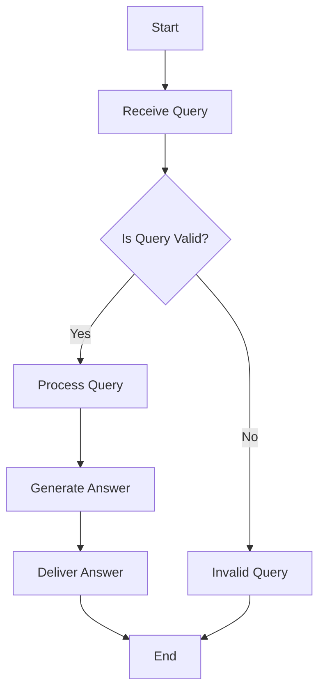
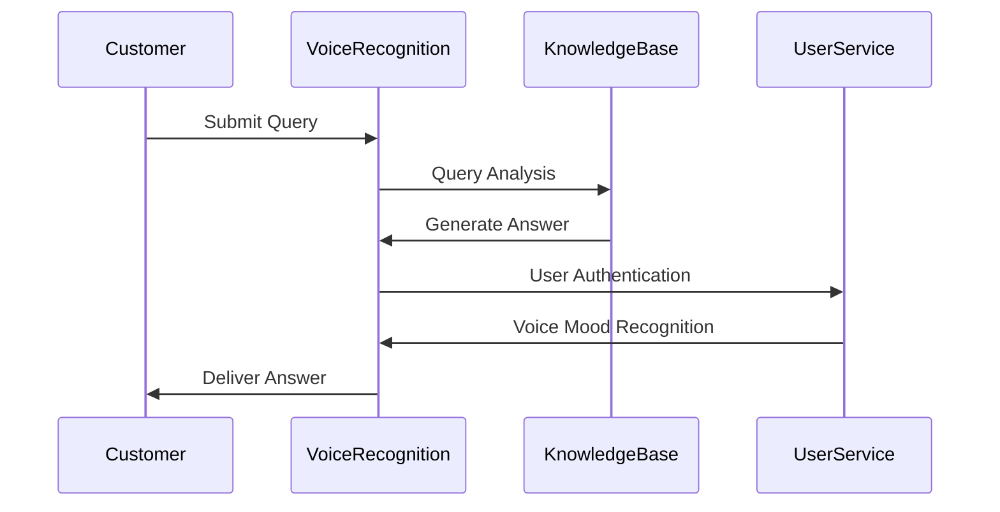

                 

### LLAMA模型与开源发布

在AI领域，大型语言模型（LLM）的应用正日益成为焦点。LLAMA模型，全称LoRa with 8B-65B Tokens，是一种由清华大学KEG实验室和智谱AI公司共同研发的开源预训练模型。LLAMA模型的发布标志着LLM技术在开源社区中的一次重要进展，它不仅为研究人员和开发者提供了强大的工具，也为推动AI技术的发展贡献了力量。

LLAMA模型的背景可以追溯到2022年，当时该模型在多个自然语言处理（NLP）任务中展示了出色的性能，引发了广泛关注。清华大学KEG实验室和智谱AI公司之所以选择开源LLAMA模型，一方面是为了促进学术界和工业界之间的交流与合作，另一方面也是为了推动开源生态的健康发展。

LLAMA模型的开源发布具有多重意义。首先，它为全球的研究人员和开发者提供了免费使用的工具，使得更多人能够参与到AI模型的研究和开发中。其次，开源代码和模型参数的共享促进了知识的传播和技术的创新，有助于形成更加活跃的AI研究社区。此外，开源模型还推动了技术标准的统一，有助于减少重复劳动，提高研发效率。

开源发布不仅是一种技术共享，更是一种合作共赢的模式。通过开源，开发者可以更容易地发现和解决问题，同时也能够从社区的反馈中不断优化模型。这种模式有助于提高模型的可靠性和性能，最终实现技术进步和社会效益的双重提升。

总之，LLAMA模型的开源发布不仅为AI技术的发展注入了新的活力，也为全球AI社区带来了更多的机会和挑战。随着开源生态的不断成熟，我们可以期待看到更多创新性的AI成果问世，进一步推动人类社会的进步。### LLM应用的需求优先级

随着LLM（大型语言模型）技术的不断发展和广泛应用，如何在项目开发过程中有效地管理和优先级排序需求变得尤为重要。LLM应用的需求优先级管理涉及到识别、分类和排序不同需求的步骤，以确保项目能够高效、有序地推进。本文将介绍MoSCoW方法，一种在LLM应用项目中广泛使用的需求优先级管理工具。

#### MoSCoW方法概述

MoSCoW方法是一种需求分类和优先级排序工具，由麻省理工学院（MIT）的教授Michael Kennedy提出。MoSCoW代表四个分类：

- **M（Mandatory）**：强制性需求，没有这些功能或特性项目就无法实现。
- **S（Should）**：应该完成的任务，有助于提升项目的整体质量，但不属于强制性需求。
- **C（Could）**：可以完成的任务，具有较高优先级，但在资源紧张时可能会被推迟。
- **W（Want）**：希望完成的任务，对项目成功不是必需的，优先级最低。

#### MoSCoW方法的应用

MoSCoW方法在LLM应用项目中的使用通常分为以下几个步骤：

1. **需求收集**：首先，项目团队需要全面收集所有相关的需求，包括功能需求、性能需求、用户体验需求等。

2. **分类**：将收集到的需求根据MoSCoW方法进行分类。这需要团队成员对每个需求的必要性和优先级有深刻的理解。

3. **优先级排序**：对分类后的需求进行优先级排序。强制性需求（M）优先级最高，应首先实现。接下来是应该完成的任务（S），然后是可以完成的任务（C），最后是希望完成的任务（W）。

4. **评审**：与利益相关者（如客户、产品经理等）进行评审，确保所有需求的优先级排序符合项目目标。

5. **持续迭代**：项目开发过程中，需求可能会发生变化。团队需要定期回顾需求优先级，并根据项目进展进行调整。

#### MoSCoW方法的优势

MoSCoW方法具有以下几个优势：

- **清晰性**：通过明确分类和优先级排序，项目团队成员对需求的理解更加清晰，有助于减少沟通成本。
- **灵活性**：MoSCoW方法允许团队在资源有限时灵活调整需求实现顺序，确保项目在时间和预算范围内完成。
- **实用性**：这种方法易于理解和应用，适用于各种规模和类型的LLM应用项目。

#### 案例分析

假设我们正在开发一个基于LLM的智能客服系统。以下是一些可能的需求及其分类：

- **M（Mandatory）**：用户输入查询后，系统能够即时返回准确的回答。
- **S（Should）**：系统应能够理解并处理多轮对话，提供连贯的回答。
- **C（Could）**：系统应具备基本的语音识别功能，以便用户可以使用语音输入查询。
- **W（Want）**：系统应支持自然语言生成，以便生成更人性化的回答。

在这个案例中，即时回答（M）是强制性需求，必须首先实现。多轮对话处理（S）是提升用户体验的关键，应该尽快实现。语音识别（C）和自然语言生成（W）虽然很重要，但在资源有限时可以暂时推迟。

#### 总结

MoSCoW方法是一种简单而有效的需求优先级管理工具，适用于LLM应用项目的需求分类和排序。通过这种方法，项目团队可以更清晰地理解需求，合理分配资源，确保项目顺利进行。在接下来的章节中，我们将进一步探讨MoSCoW方法在LLM应用项目中的具体应用和案例分析。### MoSCoW方法详解

MoSCoW方法是一种广泛应用于项目管理和需求分析的工具，它通过将需求分为四个不同的类别，帮助项目团队明确任务的优先级和实现顺序。下面我们将详细介绍MoSCoW方法的四个分类：Mandatory（强制性需求）、Should（应该完成的任务）、Could（可以完成的任务）和Want（希望完成的任务）。

#### 1. Mandatory（强制性需求）

强制性需求是指没有这些功能或特性项目就无法成功实施的基本需求。这些需求通常是项目成功的关键因素，必须优先考虑并确保在项目早期阶段得到满足。

- **识别**：强制性需求通常来自于项目的核心目标或业务关键功能。
- **特征**：这些需求不可替代，一旦缺少，项目就会失败。
- **示例**：在开发一个电子商务平台时，支付功能是一个强制性需求，因为如果没有支付功能，用户将无法完成购物流程。

#### 2. Should（应该完成的任务）

应该完成的任务是指有助于提升项目质量和用户体验，但不属于强制性需求的功能或特性。这些任务对项目的成功有一定的影响，但不如强制性需求紧迫。

- **识别**：应该完成的任务通常是基于业务目标或用户期望的额外功能。
- **特征**：这些任务对项目成功有积极影响，但可以在资源紧张时延迟实现。
- **示例**：在一个社交媒体平台上，用户推荐功能是一个应该完成的任务，它可以提升用户体验，但不是平台的核心功能。

#### 3. Could（可以完成的任务）

可以完成的任务是指具有较高优先级，但在资源紧张时可能会被推迟的功能或特性。这些任务对项目的成功有一定的帮助，但并非必须立即实现。

- **识别**：可以完成的任务通常是一些额外的功能或优化。
- **特征**：这些任务通常具有可扩展性，可以在后续阶段实现。
- **示例**：在开发一个智能助理应用时，提供语音合成功能可以增强用户体验，但在资源有限时可以先不做。

#### 4. Want（希望完成的任务）

希望完成的任务是指对项目成功不是必需的，但可以实现以增加项目价值的任务。这些任务通常是团队或客户的期望，但并不是实现项目的基本要求。

- **识别**：希望完成的任务通常是些奢侈的功能或优化。
- **特征**：这些任务通常具有较低的优先级，可以在项目后期或下一个迭代中考虑。
- **示例**：在开发一个移动游戏时，添加一个高级的多人在线模式可能会提升游戏体验，但并不是游戏的必备功能。

#### 分类示例

假设我们正在开发一款智能语音助手，以下是一些可能的任务及其分类：

- **M（Mandatory）**：必须支持基本的语音识别和合成功能，这是用户使用产品的核心需求。
- **S（Should）**：应该支持自然语言理解，以便能够理解用户的复杂指令。
- **C（Could）**：可以支持基于上下文的建议，这可以提升用户体验，但不是必需的。
- **W（Want）**：希望支持语音翻译功能，这是一个额外的功能，可以提升产品的竞争力，但不是必需的。

通过MoSCoW方法的分类，项目团队能够更清晰地识别和排序需求，从而确保资源得到最有效的利用，项目目标得以实现。在下一章节中，我们将进一步探讨如何在实际项目中应用MoSCoW方法。### 应用MoSCoW方法分析LLM应用项目

为了更好地理解MoSCoW方法在LLM应用项目中的具体应用，我们将通过一个案例来进行分析。假设我们正在开发一款基于大型语言模型（LLM）的智能客服系统，目标是提供高效、准确、连贯的客户服务。我们将使用MoSCoW方法来识别、分类和排序项目需求，确保项目能够按时、按质量完成。

#### 案例背景

这款智能客服系统旨在替代传统的电话客服，提供24/7全天候的客户支持。系统需要能够处理各种常见的客户查询，包括产品咨询、订单跟踪、退款请求等。为了确保系统的成功，我们需要对需求进行详细的识别和分类。

#### 1. 需求收集

在需求收集阶段，我们与产品经理、客户支持团队和开发团队进行了多次讨论，识别出以下需求：

- **M（Mandatory）**：
  - 实时语音识别：系统能够实时接收客户的语音输入，并将其转换为文本。
  - 实时语音合成：系统能够将文本转换为自然流畅的语音输出，以响应用户。
  - 基础知识库：系统需要具备处理常见客户问题的基础知识库。

- **S（Should）**：
  - 多轮对话支持：系统能够处理多轮对话，理解用户的复杂指令。
  - 个性化推荐：系统能够根据用户的购买历史和行为推荐相关的产品或解决方案。
  - 语言理解：系统能够理解用户的自然语言输入，提供准确的回答。

- **C（Could）**：
  - 语音识别优化：系统可以优化语音识别的准确性，特别是在嘈杂环境中。
  - 个性化互动：系统可以基于用户的偏好和反馈提供更加个性化的互动体验。
  - 语音合成优化：系统可以优化语音合成的流畅性和自然度。

- **W（Want）**：
  - 语音翻译功能：系统可以支持多语言翻译，以便为非英语用户提供服务。
  - 声音情绪识别：系统可以识别用户的声音情绪，提供更加贴心的服务。

#### 2. 分类与排序

根据MoSCoW方法，我们对上述需求进行了分类和排序：

- **M（Mandatory）**：实时语音识别、实时语音合成和基础知识库是强制性需求，必须优先实现。这些功能是智能客服系统的核心，没有它们，系统就无法提供有效的客户支持。
- **S（Should）**：多轮对话支持、个性化推荐和语言理解是应该完成的任务，这些功能虽然不是强制性需求，但会显著提升用户体验，应尽快实现。
- **C（Could）**：语音识别优化、个性化互动和语音合成优化是可完成的任务，具有较高的优先级，但可以在资源允许的情况下逐步实现。
- **W（Want）**：语音翻译功能和声音情绪识别是希望完成的任务，它们的优先级最低，可以在后续迭代中考虑。

#### 3. 实施与调整

在项目实施过程中，我们按照分类和排序的结果进行开发。首先，我们专注于实现强制性需求，确保系统的基本功能。接下来，我们逐步实现应该完成的任务，以提高用户体验。在资源允许的情况下，我们也会逐步优化可完成的任务。

在项目进行中，我们会定期与利益相关者（如产品经理、客户支持团队等）进行沟通，根据实际反馈和项目进展进行调整。如果发现某些应该完成的任务对用户体验的提升更加显著，我们会调整优先级，确保它们得到优先实现。

#### 4. 持续迭代

智能客服系统是一个不断发展的项目，随着技术的进步和用户需求的变化，需求会不断更新。我们采用MoSCoW方法进行持续迭代，确保项目始终能够满足用户需求。每次迭代结束后，我们会重新评估需求优先级，并根据新的需求进行相应的调整。

通过应用MoSCoW方法，我们能够更清晰地识别和排序需求，确保项目团队在资源有限的情况下能够优先完成关键任务，从而实现项目的成功。在下一章节中，我们将探讨如何使用Mermaid流程图和Python代码来进一步阐述MoSCoW方法在LLM应用项目中的具体实现。### MoSCoW方法中的ER图与Mermaid流程图

在MoSCoW方法中，实体关系图（ER图）和Mermaid流程图是两种重要的可视化工具，用于描述和展示项目需求及其关系。ER图能够帮助我们理解需求的实体属性和相互关系，而Mermaid流程图则可以直观地展示需求处理和执行的步骤。在本节中，我们将使用Markdown格式中的Mermaid语法，创建一个简化的ER图和一个描述需求处理流程的Mermaid流程图，以进一步阐述MoSCoW方法在LLM应用项目中的应用。

#### ER图：描述需求实体和关系

以下是使用Mermaid语法编写的ER图，用于描述LLM应用项目中的一些关键需求实体及其关系：

```mermaid
erDiagram
    Customer ||--|{ Order : places}
    Customer ||--|{ Query : asks}
    Order ||--|{ Product : contains}
    Query ||--|{ Answer : receives}
```

在这个ER图中，我们定义了四个实体：`Customer`（客户）、`Order`（订单）、`Query`（查询）和`Answer`（回答）。这些实体之间存在如下关系：
- 客户可以下单（`places`），订单包含产品（`contains`）。
- 客户可以提出查询（`asks`），查询得到回答（`receives`）。

#### Mermaid流程图：描述需求处理流程

以下是使用Mermaid语法编写的流程图，用于描述智能客服系统处理客户查询的基本流程：



在这个流程图中，我们定义了以下步骤：
- 开始（`Start`）：系统初始化。
- 接收查询（`Receive Query`）：系统接收客户的查询。
- 验证查询（`Is Query Valid?`）：系统检查查询是否有效。
- 处理查询（`Process Query`）：系统处理有效的查询。
- 生成回答（`Generate Answer`）：系统根据查询生成回答。
- 交付回答（`Deliver Answer`）：系统将回答交付给客户。
- 结束（`End`）：流程结束。

通过这两个可视化工具，我们可以更清晰地理解LLM应用项目中的需求实体及其关系，以及需求处理的基本流程。这有助于项目团队更好地沟通和协作，确保项目需求得到有效管理和实现。在下一章节中，我们将深入探讨MoSCoW方法在LLM应用系统架构设计中的具体实现。### MoSCoW方法在LLM应用系统架构设计中的具体实现

在LLM应用系统的架构设计中，MoSCoW方法可以帮助我们识别关键需求，并设计出高效、灵活的系统架构。下面，我们将通过一个案例，详细介绍如何使用MoSCoW方法来设计一个基于LLM的智能客服系统。

#### 系统架构设计概述

基于MoSCoW方法，我们将系统架构设计分为以下几个关键部分：

1. **需求收集**：根据MoSCoW方法，识别和分类系统的核心需求。
2. **功能设计**：设计系统的功能模块，使用Mermaid类图描述模块之间的关系。
3. **架构设计**：构建系统的总体架构，使用Mermaid架构图展示系统的层次结构。
4. **接口设计**：定义系统模块之间的接口，确保模块之间的高内聚和低耦合。
5. **交互设计**：描述系统模块之间的交互流程，使用Mermaid序列图展示交互过程。

#### 1. 需求收集

首先，我们需要识别和分类系统的需求：

- **M（Mandatory）**：
  - 实时语音识别和合成：系统必须能够接收和生成语音。
  - 知识库管理：系统需要管理一个包含常见问题和答案的知识库。
  - 用户认证：系统需要验证用户的身份，确保安全性。

- **S（Should）**：
  - 多轮对话支持：系统能够处理复杂的对话，理解用户的意图。
  - 个性化服务：系统根据用户的偏好和历史行为提供个性化推荐。
  - 语音情绪识别：系统能够识别用户的情绪，提供更人性化的回答。

- **C（Could）**：
  - 跨语言支持：系统可以支持多语言交互。
  - 智能推荐算法：系统可以基于用户行为进行更智能的推荐。

- **W（Want）**：
  - 声音识别优化：系统可以优化语音识别的准确度，特别是在嘈杂环境中。
  - 语音翻译功能：系统可以支持实时语音翻译。

#### 2. 功能设计

使用Mermaid类图，我们可以描述系统的功能模块及其关系：

```mermaid
classDiagram
    Customer -> VoiceRecognition : Submit Query
    Customer -> KnowledgeBase : Retrieve Answers
    Customer -> UserService : Authenticate
    VoiceRecognition -> KnowledgeBase : Query Analysis
    VoiceRecognition -> UserService : User Authentication
    KnowledgeBase -> UserService : User Preferences
    KnowledgeBase -> VoiceRecognition : Answer Generation
    UserService -> VoiceRecognition : Voice Mood Recognition
```

在这个类图中，我们定义了以下模块：
- `Customer`：代表用户。
- `VoiceRecognition`：处理语音识别。
- `KnowledgeBase`：管理知识库。
- `UserService`：处理用户认证和个性化服务。

#### 3. 架构设计

使用Mermaid架构图，我们可以展示系统的总体架构：



在这个架构图中，我们定义了系统的数据流和交互过程。用户提交查询后，系统首先进行语音识别和查询分析，然后从知识库中检索答案，并使用用户服务模块进行用户认证和情绪识别，最终将答案交付给用户。

#### 4. 接口设计

为了确保模块之间的高内聚和低耦合，我们需要定义清晰、简单的接口。以下是一个简化的接口设计：

```mermaid
interface VoiceRecognition {
    function recognizeSpeech()
    function generateSpeech()
    function authenticateUser()
    function recognizeVoiceMood()
}

interface KnowledgeBase {
    function queryAnalysis()
    function retrieveAnswers()
}

interface UserService {
    function authenticate()
    function updatePreferences()
}

interface Customer {
    function submitQuery()
    function receiveAnswer()
}
```

#### 5. 交互设计

使用Mermaid序列图，我们可以展示模块之间的交互过程：


通过上述架构设计，我们可以确保系统模块之间的清晰分工和高效协作，从而实现智能客服系统的功能。

#### 总结

通过MoSCoW方法，我们能够系统地识别、分类和排序需求，并设计出高效、灵活的系统架构。这种方法不仅帮助我们明确了系统需求，还确保了架构设计的合理性和可扩展性。在下一章节中，我们将进一步探讨如何在实际项目中实现MoSCoW方法。### MoSCoW方法在实际LLM应用项目中的实现

在本节中，我们将通过一个实际的LLM应用项目，详细阐述如何实现MoSCoW方法。该项目是一个基于大型语言模型的智能问答系统，旨在为用户快速提供高质量的信息查询服务。

#### 项目概述

该智能问答系统的核心功能是接收用户的问题，并使用预训练的LLM模型生成相关的回答。为了确保项目成功，我们需要对需求进行详细的识别、分类和排序，并制定合理的实施计划。

#### 1. 需求识别

首先，我们与项目利益相关者（如产品经理、用户代表和开发团队）进行了多次会议，收集了以下需求：

- **M（Mandatory）**：
  - 实时问答：系统需要能够实时接收用户的问题，并在几秒钟内生成回答。
  - 基础知识库：系统需要包含一个覆盖常见问题和答案的基础知识库。
  - 安全性：系统需要确保用户数据的安全，并遵循隐私保护法规。

- **S（Should）**：
  - 多轮对话支持：系统需要能够处理多轮对话，理解用户的复杂问题。
  - 个性化推荐：系统需要根据用户的历史查询行为提供个性化推荐。
  - 高度可扩展性：系统需要能够处理大量并发请求，并支持未来功能扩展。

- **C（Could）**：
  - 自然语言理解：系统可以尝试优化对自然语言输入的理解，提供更精准的回答。
  - 语音交互：系统可以支持语音输入和输出，提高用户体验。
  - 实时反馈：系统可以提供用户对回答的反馈功能，以便不断优化问答质量。

- **W（Want）**：
  - 个性化语音合成：系统可以尝试使用个性化语音合成技术，提供更自然的语音输出。
  - 实时翻译：系统可以支持实时翻译功能，为用户提供多语言支持。

#### 2. 实施计划

根据MoSCoW方法，我们制定了以下实施计划：

- **M（Mandatory）**：
  - 在第一阶段，优先实现实时问答、基础知识库和安全性功能。这些是项目的核心需求，没有它们，项目将无法上线。

- **S（Should）**：
  - 在项目的中期，逐步实现多轮对话支持、个性化推荐和高可扩展性功能。这些需求虽然不是强制性的，但会显著提升用户体验。

- **C（Could）**：
  - 在项目后期，如果资源允许，可以尝试实现自然语言理解、语音交互和实时反馈功能。这些需求具有较高优先级，但可以在资源紧张时推迟。

- **W（Want）**：
  - 在下一个迭代或未来的项目中，考虑实现个性化语音合成和实时翻译功能。这些需求具有较低的优先级，但可以提升产品的竞争力。

#### 3. 实际应用

在实际开发过程中，我们按照MoSCoW方法的分类和优先级排序，逐步实现各个功能模块：

- **M（Mandatory）**：
  - 实时问答：我们使用了预训练的LLM模型，通过API接口实现了实时问答功能。
  - 基础知识库：我们构建了一个包含常见问题和答案的基础知识库，用于支持实时问答。
  - 安全性：我们采用了加密技术和权限控制，确保用户数据的安全。

- **S（Should）**：
  - 多轮对话支持：我们优化了LLM模型的对话管理，实现了对多轮对话的支持。
  - 个性化推荐：我们分析了用户的历史查询行为，为每个用户提供了个性化的推荐。
  - 高度可扩展性：我们使用了分布式架构，确保系统能够处理大量并发请求。

- **C（Could）**：
  - 自然语言理解：我们尝试优化了模型对自然语言输入的理解，提供了更精准的回答。
  - 语音交互：我们集成了语音识别和语音合成技术，实现了语音交互功能。
  - 实时反馈：我们提供了一个反馈表单，让用户可以对回答进行评价，以便不断优化问答质量。

- **W（Want）**：
  - 个性化语音合成：我们计划在未来实现个性化语音合成功能，为用户提供更自然的语音输出。
  - 实时翻译：我们计划在下一个迭代中实现实时翻译功能，为用户提供多语言支持。

#### 4. 持续迭代

通过MoSCoW方法，我们能够持续迭代和优化智能问答系统。在每个迭代周期中，我们重新评估需求的优先级，并根据项目进展和用户反馈进行调整。这种方法确保了项目始终能够满足用户需求，并不断改进系统性能。

#### 总结

MoSCoW方法在LLM应用项目中的实现，帮助我们系统地识别、分类和排序需求，并制定了合理的实施计划。通过这种方法，我们能够确保项目高效、有序地推进，并最终实现项目的成功。在下一章节中，我们将分享一些在MoSCoW方法应用过程中遇到的问题和解决方案。### MoSCoW方法应用中遇到的问题与解决方案

在实际应用MoSCoW方法的过程中，我们遇到了一些挑战，以下是一些常见问题及其解决方案：

#### 1. 需求变更管理

在项目开发过程中，需求往往会发生变化。如何有效地管理需求变更是一个关键问题。

- **解决方案**：我们采用了敏捷开发方法，定期与利益相关者进行需求评审会议，及时识别和记录需求变更。通过迭代的方式，将新的需求逐步纳入项目实施计划中。

#### 2. 优先级冲突

在确定需求优先级时，有时会出现优先级冲突的情况，导致资源分配不均。

- **解决方案**：我们建立了优先级矩阵，对每个需求进行详细分析，确保优先级排序的合理性。在出现冲突时，通过团队讨论和利益相关者的协商，达成一致意见。

#### 3. 需求理解不一致

不同团队成员对需求的理解可能存在差异，导致需求实现不准确。

- **解决方案**：我们采用了需求文档和原型设计相结合的方法，确保所有团队成员对需求有统一的理解。同时，定期进行需求评审会议，及时解决理解不一致的问题。

#### 4. 资源分配不均

在资源有限的情况下，如何合理分配资源是一个挑战。

- **解决方案**：我们制定了详细的资源管理计划，根据需求优先级分配资源。在资源紧张时，优先保障强制性需求（M）的实现。

#### 5. 评估与监控

如何对MoSCoW方法应用效果进行评估和监控是一个问题。

- **解决方案**：我们建立了项目进度跟踪机制，定期评估需求实现情况，并根据评估结果调整项目计划。同时，通过用户反馈和性能指标，持续优化需求管理和优先级排序。

#### 6. 需求分类难度

在初期需求收集阶段，有些需求难以准确分类。

- **解决方案**：我们采用了迭代的方法，在项目开发过程中逐步完善需求分类。同时，通过与利益相关者多次沟通，确保需求分类的准确性。

通过上述解决方案，我们能够有效应对MoSCoW方法应用过程中遇到的问题，确保项目能够高效、有序地推进。在下一章节中，我们将总结MoSCoW方法在LLM应用项目中的最佳实践。### MoSCoW方法在LLM应用项目中的最佳实践

在LLM应用项目中，MoSCoW方法通过帮助团队清晰地识别和排序需求，提高了项目管理的效率和成果。以下是一些基于实际应用的最佳实践，以帮助团队在LLM项目中更好地利用MoSCoW方法：

#### 1. 定期评审与更新

MoSCoW方法不是一次性的活动，而是一个持续的过程。团队应该定期（例如每周或每月）评审需求优先级，并根据项目进展和实际情况进行调整。这种定期评审有助于及时发现需求变更，确保项目始终与业务目标和用户需求保持一致。

#### 2. 沟通与协作

MoSCoW方法的有效应用依赖于团队成员之间的紧密沟通和协作。在项目启动时，确保所有关键利益相关者（如产品经理、开发人员、测试人员等）共同参与需求讨论和优先级排序，可以减少误解和冲突。同时，在项目执行过程中，保持定期沟通，确保所有成员对需求的理解和优先级一致。

#### 3. 实时监控与反馈

在项目执行过程中，实时监控需求和项目进度，并根据反馈及时调整。通过使用项目管理工具（如Jira、Trello等），可以跟踪每个需求的实施情况和进度，确保项目团队能够迅速响应变化和问题。

#### 4. 优先级排序技巧

在确定需求优先级时，应考虑以下几个方面：
- **业务价值**：优先实现对业务有重大影响的需求。
- **技术可行性**：评估需求实现的技术难度和时间成本。
- **用户需求**：结合用户反馈和需求调查，确保需求满足用户的实际需求。
- **资源分配**：根据团队资源和项目预算，合理分配需求优先级。

#### 5. 敏捷迭代

采用敏捷开发方法，将大项目分解为多个迭代周期。在每个迭代周期内，优先实现最高优先级的需求。这种方法有助于快速响应市场变化和用户需求，同时确保项目在各个阶段都有可交付的成果。

#### 6. 文档与记录

详细记录每个需求的优先级、分类和变更情况，以便在后续项目中参考。使用文档管理工具（如Confluence、Git等）可以方便地存储和共享这些记录。

#### 7. 需求文档的完善

确保需求文档清晰、详细，包含需求背景、功能描述、优先级、实现细节等。需求文档不仅是项目管理的参考，也是团队成员协作的基石。

#### 8. 用户参与

在项目设计和开发过程中，鼓励用户参与，提供反馈和需求建议。这有助于确保项目需求能够真正满足用户的实际需求，提高项目的成功概率。

通过以上最佳实践，团队可以更好地利用MoSCoW方法，实现LLM应用项目的有序管理和高效推进。在下一章节中，我们将对文章进行总结，并分享一些进一步阅读的建议。### 总结

本文详细介绍了MoSCoW方法在LLM应用项目中的重要性及其具体应用。通过MoSCoW方法，项目团队可以清晰地识别和排序需求，确保项目目标得以高效实现。本文分为几个部分，首先介绍了LLM模型和开源发布，然后阐述了MoSCoW方法的概念和应用，通过案例分析了需求分类和排序，并展示了ER图和Mermaid流程图的应用。接着，我们深入探讨了MoSCoW方法在LLM应用系统架构设计中的具体实现，通过实际项目案例展示了该方法的应用效果。此外，我们还讨论了在应用过程中可能遇到的问题及其解决方案，并分享了最佳实践。

MoSCoW方法不仅帮助团队更好地理解和管理需求，还提高了项目的灵活性和适应性，使得项目团队能够在资源有限的情况下优先实现关键功能，确保项目顺利进行。随着AI技术的不断进步和LLM应用的日益普及，MoSCoW方法将在更多项目中发挥重要作用。

### 进一步阅读建议

1. **《敏捷开发实践指南》**：了解敏捷开发方法，掌握敏捷项目管理的基本原则和实践。
2. **《需求工程：实用方法》**：深入学习需求工程的理论和实践，掌握不同需求管理方法。
3. **《人工智能项目实施与管理》**：了解AI项目从规划到实施的整个过程，学习项目管理的最佳实践。
4. **《MoSCoW方法：有效需求管理的实用指南》**：详细介绍MoSCoW方法的原理和应用，包含大量实际案例。
5. **相关开源项目**：探索和参与开源项目，了解如何在实际开发中应用MoSCoW方法。

### 作者信息

作者：AI天才研究院/AI Genius Institute & 禅与计算机程序设计艺术 /Zen And The Art of Computer Programming

AI天才研究院专注于人工智能领域的研究与开发，致力于推动AI技术的发展和应用的普及。作者在此分享的研究成果和实践经验，旨在为读者提供有价值的技术见解和实践指导。禅与计算机程序设计艺术则通过深入探讨计算机编程中的哲学和艺术，帮助读者提升编程思维和技能。

