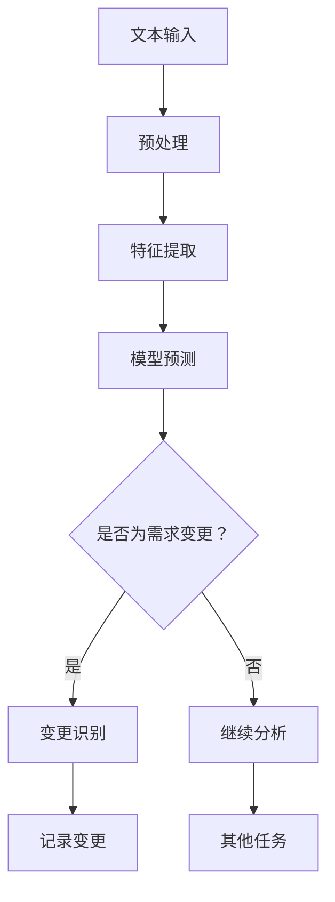
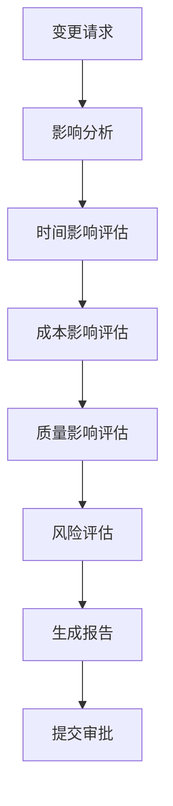
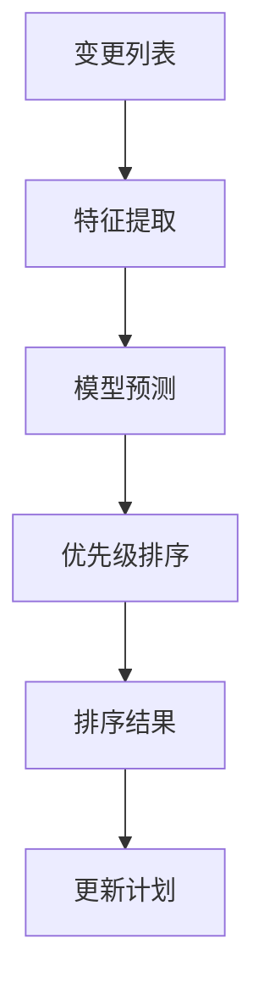

                 

### 《LLM应用的需求变更管理：在敏捷中保持灵活》

#### 关键词：LLM应用、需求变更管理、敏捷开发、灵活应对

> 摘要：本文将探讨在敏捷开发环境中进行需求变更管理的策略和方法。通过引入大型语言模型（LLM）技术，文章将分析如何更有效地识别、评估和应对需求变更，确保项目在快速迭代过程中保持灵活性和可持续性。本文将结合实际案例，详细阐述LLM技术在需求变更管理中的具体应用，并提供敏捷需求变更管理的最佳实践，以期为IT行业的项目管理者提供有价值的参考。

### 第一部分：引言与背景

#### 第1章：需求变更管理概述

##### 1.1 什么是需求变更管理

需求变更管理是指在项目开发过程中，对项目需求的变更进行识别、评估、审批和实施的过程。它涉及到从用户需求的变化到最终影响项目交付的方方面面。需求变更管理的重要性体现在以下几个方面：

1. **保证项目目标的实现**：需求变更是项目正常进行过程中不可避免的一部分，有效的需求变更管理可以确保项目最终交付的是用户真正需要的产品。
2. **控制项目风险**：需求变更可能会对项目进度、成本和质量产生影响，通过有效的管理可以降低这些风险。
3. **提升客户满意度**：及时响应客户需求变化，可以提高客户的满意度和忠诚度。

##### 1.1.1 需求变更的定义与重要性

需求变更通常是指在项目生命周期中，由于外部环境变化、用户需求变化或技术进步等原因，对原有需求进行的修改。这些变更可能包括需求的添加、删除、修改或优先级调整。

需求变更的重要性在于：

- **适应性**：能够适应快速变化的市场需求和技术环境。
- **客户导向**：以满足客户需求和期望为中心，提高客户满意度。
- **资源优化**：合理调整项目资源和时间，避免不必要的浪费。

##### 1.1.2 需求变更的类型与原因

需求变更的类型主要包括：

- **功能性变更**：对产品功能的需求增加或修改。
- **非功能性变更**：如性能、安全性、可维护性等方面的需求变化。
- **优先级变更**：需求优先级的调整。

需求变更的原因多样，常见的原因包括：

- **市场变化**：市场需求的快速变化可能导致需求变更。
- **技术进步**：新技术或工具的引入可能导致需求更新。
- **用户反馈**：用户在使用过程中反馈的需求变化。
- **法律或法规变化**：相关法律或法规的变更可能引发需求变更。

##### 1.1.3 需求变更的影响

需求变更对项目的影响主要包括：

- **时间延长**：需求变更可能导致项目延期。
- **成本增加**：需要额外的资源和时间来应对需求变更。
- **质量影响**：变更可能导致原有设计或代码的回溯和重构。

##### 1.2 敏捷开发与需求变更管理

敏捷开发是一种以用户需求为导向，强调迭代、增量和灵活响应变化的项目开发方法。敏捷开发与需求变更管理之间存在紧密的关系：

- **适应性**：敏捷开发强调快速适应变化，需求变更管理能够帮助团队更好地应对这些变化。
- **透明性**：敏捷开发过程中的持续沟通和反馈，有助于及时发现和应对需求变更。
- **迭代性**：敏捷开发通过短周期的迭代，使需求变更可以在早期阶段被识别和调整。

##### 1.2.1 敏捷开发的核心理念

敏捷开发的核心理念包括：

- **用户优先**：始终关注并满足用户需求。
- **迭代开发**：通过短周期的迭代，逐步完善产品。
- **持续交付**：持续交付可用的产品版本。
- **团队合作**：鼓励跨职能团队的紧密合作。
- **适应变化**：拥抱变化，快速响应市场需求。

##### 1.2.2 敏捷开发中的需求变更管理

敏捷开发中的需求变更管理通常包括以下几个关键步骤：

- **需求收集**：通过用户故事、用户访谈等方式收集需求。
- **优先级排序**：根据业务价值和团队能力对需求进行优先级排序。
- **迭代计划**：在迭代计划会议上确定本次迭代要实现的需求。
- **需求评审**：在迭代结束后对需求实现情况进行评审。
- **需求迭代**：根据评审结果调整和优化需求。

##### 1.2.3 敏捷与传统的需求变更管理的差异

相比传统的需求变更管理，敏捷开发在需求变更管理上有以下差异：

- **更灵活**：敏捷开发能够更快地响应需求变更，减少变更对项目的影响。
- **更透明**：需求变更过程更透明，团队成员和利益相关者可以更清楚地了解变更情况。
- **更协作**：需求变更管理需要团队成员和利益相关者共同参与，提高决策效率。

##### 1.3 LLMApp在敏捷开发中的应用

LLMApp是一种基于大型语言模型的需求变更管理工具，它能够自动化识别、评估和排序需求变更，提高敏捷开发团队的效率。

##### 1.3.1 LLMApp简介

LLMApp采用先进的自然语言处理技术，能够理解和分析自然语言文本。它集成了多种功能，包括：

- **需求变更识别**：自动识别文本中的需求变更。
- **影响评估**：分析变更对项目时间、成本和质量的影响。
- **优先级排序**：根据变更的重要性和紧急性对需求变更进行排序。
- **变更记录**：记录和追踪每个需求变更的状态和进度。

##### 1.3.2 LLMApp在需求变更管理中的作用

LLMApp在需求变更管理中的作用主要体现在以下几个方面：

- **提高效率**：通过自动化技术减少人工工作，提高团队工作效率。
- **减少错误**：利用智能算法减少人为错误，提高变更管理的准确性。
- **增强协作**：提供可视化的变更记录和进度跟踪，增强团队成员之间的协作。
- **降低风险**：及时识别和评估变更风险，降低变更对项目的影响。

##### 1.3.3 LLMApp的优势与挑战

LLMApp的优势包括：

- **高效性**：自动化识别和评估需求变更，提高工作效率。
- **准确性**：利用自然语言处理技术，减少人为错误。
- **灵活性**：能够适应不同类型和规模的项目。

然而，LLMApp也面临一些挑战：

- **技术依赖**：高度依赖自然语言处理技术，对技术团队的要求较高。
- **数据质量**：需求变更数据的准确性直接影响LLMApp的性能。
- **实施成本**：引入和使用LLMApp可能涉及一定的实施成本。

##### 1.4 本书结构

本书分为五个部分，各部分的主要内容如下：

- **第一部分**：引言与背景，介绍需求变更管理的概念、类型和重要性，以及敏捷开发与需求变更管理的关系。
- **第二部分**：需求变更管理流程，详细阐述需求变更的识别、评估、审批和记录等过程。
- **第三部分**：LLM在需求变更管理中的应用，探讨LLMApp的功能和优势。
- **第四部分**：敏捷需求变更管理的最佳实践，分享实际案例和经验总结。
- **第五部分**：未来展望，探讨需求变更管理的发展趋势和挑战。

通过本书的阅读，读者将能够深入了解需求变更管理的原理和实践，掌握敏捷需求变更管理的最佳方法，并在实际项目中有效应用。

##### 1.5 本章小结

本章主要介绍了需求变更管理的概念、类型和重要性，以及敏捷开发与需求变更管理的关系。通过本章的学习，读者可以了解到需求变更管理的核心内容和敏捷开发的优势。接下来，本书将深入探讨需求变更管理流程的各个步骤，并介绍LLMApp在需求变更管理中的应用，帮助读者更好地应对项目中的需求变更挑战。

---

### 第二部分：需求变更管理流程

#### 第2章：需求变更的识别与评估

##### 2.1 需求变更的识别

需求变更的识别是需求变更管理的第一步，它涉及到如何及时发现和识别需求变更。以下是需求变更识别的主要方法和步骤：

###### 2.1.1 变更请求的来源

需求变更请求可能来自多个方面，常见的变更请求来源包括：

- **用户**：用户在使用产品或系统时提出的需求变更。
- **市场**：市场环境的变化可能导致需求变更。
- **技术**：新技术或工具的引入可能导致需求更新。
- **内部团队**：项目团队成员在开发过程中发现的需求变更。

###### 2.1.2 变更请求的初步评估

在接收到变更请求后，需要对变更请求进行初步评估，以确定其是否值得进一步处理。初步评估主要包括以下方面：

- **变更的重要性**：评估变更对项目的影响程度，如是否影响核心功能、用户体验等。
- **变更的可行性**：评估变更在技术、资源和时间上的可行性。
- **变更的影响范围**：评估变更影响的范围，如是否涉及多个模块或系统。

###### 2.1.3 变更请求的记录与分类

对初步评估认为值得进一步处理的变更请求，应进行详细的记录和分类。记录和分类的目的是为了便于后续的评估、审批和追踪。以下是一些常用的记录和分类方法：

- **文档记录**：将变更请求以文档形式记录，包括变更请求的来源、内容、影响评估等。
- **数据库存储**：将变更请求存储在数据库中，以便于查询和管理。
- **分类**：根据变更的类型、优先级、影响范围等对变更进行分类，如功能性变更、非功能性变更、紧急变更等。

##### 2.2 需求变更的评估

需求变更的评估是需求变更管理的重要环节，它涉及到如何全面、准确地评估变更对项目的影响。以下是需求变更评估的主要方法和步骤：

###### 2.2.1 变更的影响分析

在评估变更的影响时，需要从以下几个方面进行分析：

- **时间影响**：评估变更对项目进度的影响，如是否会导致项目延期。
- **成本影响**：评估变更对项目成本的影响，如是否需要增加预算。
- **质量影响**：评估变更对项目质量的影响，如是否会影响系统的稳定性、安全性等。
- **风险影响**：评估变更可能带来的风险，如技术实现难度、团队协作问题等。

###### 2.2.2 变更的风险评估

在评估变更风险时，需要从以下几个方面进行考虑：

- **技术风险**：评估变更在技术实现上的风险，如是否涉及复杂的技术问题。
- **资源风险**：评估变更在资源分配上的风险，如是否需要增加人手或设备。
- **时间风险**：评估变更对项目时间表的影响，如是否会导致项目延期。
- **市场风险**：评估变更对市场的影响，如是否会影响产品的市场竞争力。

###### 2.2.3 变更的优先级排序

在评估完变更的影响和风险后，需要对变更进行优先级排序。优先级排序的目的是为了确定哪些变更需要优先处理，哪些可以暂时搁置。以下是一些常用的优先级排序方法：

- **业务价值**：根据变更的业务价值进行排序，如高价值且紧急的变更应优先处理。
- **紧急程度**：根据变更的紧急程度进行排序，如紧急变更应优先处理。
- **影响范围**：根据变更的影响范围进行排序，如影响范围广的变更应优先处理。
- **可行性**：根据变更的可行性进行排序，如容易实现的变更应优先处理。

##### 2.3 需求变更的审批

需求变更的审批是需求变更管理的关键步骤，它涉及到如何对变更请求进行审批，以确保变更的合法性和可行性。以下是需求变更审批的主要方法和步骤：

###### 2.3.1 审批流程

需求变更审批通常包括以下几个步骤：

- **初步审批**：由变更提出人进行初步评估，确定变更的可行性。
- **技术评审**：由技术团队对变更的技术可行性进行评估。
- **成本评审**：由财务团队对变更的成本影响进行评估。
- **风险评估**：由风险管理部门对变更的风险进行评估。
- **最终审批**：由项目总监或项目经理对变更进行最终审批。

###### 2.3.2 审批标准与决策依据

在审批需求变更时，应遵循以下标准和决策依据：

- **变更的必要性**：评估变更是否必要，是否能够解决现有问题或满足新需求。
- **变更的可行性**：评估变更在技术、资源和时间上的可行性。
- **变更的影响**：评估变更对项目进度、成本和质量的影响。
- **变更的风险**：评估变更可能带来的风险，如技术风险、资源风险和时间风险。
- **变更的优先级**：根据变更的优先级排序，确定变更的紧急性和重要性。

###### 2.3.3 审批的沟通与协作

在需求变更审批过程中，沟通与协作至关重要。以下是一些建议：

- **明确审批流程**：明确每个审批步骤的责任人和审批标准，确保流程清晰。
- **及时沟通**：在审批过程中，及时与相关利益相关者进行沟通，确保信息透明。
- **多方面协作**：鼓励不同部门、团队之间的协作，共同评估和决策变更。

##### 2.4 需求变更的记录与追踪

需求变更的记录与追踪是需求变更管理的重要环节，它涉及到如何记录变更的状态和进度，以及如何追踪变更的实施情况。以下是需求变更记录与追踪的主要方法和步骤：

###### 2.4.1 变更记录的维护

需求变更记录的维护主要包括以下几个方面：

- **变更日志**：记录每个变更的详细信息，包括变更请求、评估结果、审批意见等。
- **版本控制**：对变更记录进行版本控制，确保变更的可追溯性。
- **变更状态**：记录变更的当前状态，如待审批、审批通过、实施中、已完成等。
- **变更文档**：整理和归档与变更相关的文档，如需求文档、设计文档、测试文档等。

###### 2.4.2 变更追踪的工具与方法

需求变更追踪的工具和方法主要包括：

- **电子表格**：使用电子表格记录和追踪变更，如Excel或Google Sheets。
- **变更管理工具**：使用专业的变更管理工具，如JIRA或Confluence，进行变更记录和追踪。
- **项目管理工具**：使用项目管理工具，如Trello或Asana，追踪变更的实施进度。
- **自动化工具**：利用自动化工具，如LLMApp，自动识别和评估变更，提高追踪效率。

###### 2.4.3 变更记录的归档

需求变更记录的归档主要包括以下几个方面：

- **归档标准**：制定归档标准，确保变更记录的完整性和规范性。
- **归档周期**：根据项目周期和变更的重要性，确定变更记录的归档周期。
- **归档存储**：将变更记录存储在安全的地方，如服务器或云存储，以便于查询和备份。

##### 2.5 本章小结

本章详细介绍了需求变更管理流程的各个步骤，包括需求变更的识别、评估、审批和记录与追踪。通过本章的学习，读者可以了解到需求变更管理的核心内容和关键步骤，掌握如何在项目中有效地识别、评估和应对需求变更。在下一章中，我们将进一步探讨LLM技术在需求变更管理中的应用，为读者提供更高效的解决方案。

---

### 第三部分：LLM在需求变更管理中的应用

#### 第3章：LLM技术在需求变更管理中的应用

##### 3.1 LLMApp的需求变更管理功能

LLMApp（Large Language Model Application）是一种基于大型语言模型的自动化需求变更管理工具。它利用深度学习技术和自然语言处理（NLP）能力，能够自动化识别、评估和排序需求变更，从而提高敏捷开发团队的工作效率。以下是LLMApp在需求变更管理中的主要功能：

###### 3.1.1 自动识别需求变更

LLMApp能够通过分析用户故事、需求文档和项目日志等文本信息，自动识别其中的需求变更。其工作原理基于自然语言处理技术，通过训练大量文本数据，模型能够学习并理解文本中的关键词、句子结构和语义关系。以下是一个简单的流程图，展示了LLMApp自动识别需求变更的过程：

###### 3.1.2 自动评估变更影响

在识别出需求变更后，LLMApp能够自动评估变更的影响。它通过分析变更对项目的时间、成本、质量和风险等方面的影响，生成详细的评估报告。以下是LLMApp评估变更影响的流程：

通过自动化评估，LLMApp能够为团队成员提供即时的变更影响分析，帮助团队快速做出决策。

###### 3.1.3 自动排序变更优先级

LLMApp还能够根据变更的业务价值、紧急程度、影响范围和可行性等因素，自动为需求变更排序。其排序逻辑基于机器学习算法，通过分析历史变更数据和业务规则，模型能够自动学习和优化排序策略。以下是一个简化的流程图，展示了LLMApp自动排序变更优先级的过程：

通过自动排序，LLMApp能够帮助团队更高效地管理和优先处理重要的需求变更。

##### 3.2 LLMApp的应用案例

为了更好地理解LLMApp在需求变更管理中的应用，下面我们将通过三个实际案例来展示其功能和优势。

###### 3.2.1 案例一：需求变更自动识别

某敏捷开发团队正在开发一款电子商务平台，近期收到了用户关于购物车功能的需求变更。用户希望添加一个“批量删除商品”的功能。传统方法下，团队成员需要逐字阅读需求文档，手动识别变更内容。而使用LLMApp后，只需将需求文档上传到LLMApp平台，系统便能够自动识别出变更内容，并标记为“需求变更”。

###### 3.2.2 案例二：变更影响自动评估

在案例一中，LLMApp不仅识别出了需求变更，还自动评估了变更的影响。系统分析发现，添加“批量删除商品”功能将涉及购物车数据库的修改、前端界面的重构，以及可能的性能影响。LLMApp生成了一份详细的评估报告，包括时间、成本、质量和风险等方面的分析，为团队提供了决策依据。

###### 3.2.3 案例三：变更优先级自动排序

在评估完变更的影响后，LLMApp为该需求变更自动排序，将其列为“高优先级”。团队根据这个排序结果，将其纳入下一个迭代计划，并优先安排开发资源。这种自动排序功能不仅节省了团队成员的时间，还确保了重要变更得到及时处理。

##### 3.3 LLMApp的优势与挑战

###### 3.3.1 优势

LLMApp在需求变更管理中具有以下优势：

- **高效性**：通过自动化技术，大幅减少人工工作，提高团队效率。
- **准确性**：利用机器学习和自然语言处理技术，提高变更识别和评估的准确性。
- **灵活性**：能够适应不同类型和规模的项目，提供定制化的解决方案。
- **协作性**：提供可视化的变更记录和进度跟踪，增强团队成员之间的协作。

###### 3.3.2 挑战

尽管LLMApp在需求变更管理中具有诸多优势，但也面临一些挑战：

- **技术依赖**：高度依赖机器学习和自然语言处理技术，对技术团队的要求较高。
- **数据质量**：需求变更数据的准确性直接影响LLMApp的性能。
- **实施成本**：引入和使用LLMApp可能涉及一定的实施成本。

###### 3.3.3 解决方案

为了克服上述挑战，可以采取以下解决方案：

- **技术培训**：对技术团队进行相关技术的培训，提高团队的技术能力。
- **数据治理**：建立完善的数据治理机制，确保数据的质量和准确性。
- **成本控制**：合理规划实施成本，通过逐步引入和优化，降低整体成本。

##### 3.4 本章小结

本章详细介绍了LLMApp在需求变更管理中的应用，包括自动识别需求变更、自动评估变更影响和自动排序变更优先级等功能。通过实际案例展示，读者可以了解到LLMApp如何帮助敏捷开发团队更高效地管理需求变更。同时，本章也探讨了LLMApp的优势与挑战，并为解决这些挑战提供了一些解决方案。在下一章中，我们将进一步探讨敏捷需求变更管理的最佳实践，以期为读者提供更全面的指导。

---

### 第四部分：敏捷需求变更管理的最佳实践

#### 第4章：敏捷需求变更管理的最佳实践

##### 4.1 敏捷团队中的需求变更管理

在敏捷团队中，需求变更管理是一个持续、迭代的过程。以下是一些最佳实践，可以帮助敏捷团队更有效地管理需求变更：

###### 4.1.1 团队角色与职责

在敏捷团队中，不同角色在需求变更管理中扮演着不同的角色。以下是一些常见角色及其职责：

- **产品负责人（Product Owner）**：负责定义和维护产品的需求优先级，协调需求和变更的沟通和决策。
- **开发团队**：负责实施需求变更，确保变更能够在迭代周期内完成。
- **测试团队**：负责评估需求变更对项目质量的影响，确保变更后的产品满足既定标准。
- **项目经理**：负责协调团队资源，确保需求变更能够按时、按质完成。

###### 4.1.2 需求变更管理的流程

敏捷团队中的需求变更管理流程通常包括以下步骤：

1. **需求收集**：通过用户故事、用户访谈、市场调研等方式收集需求变更。
2. **优先级排序**：根据业务价值和团队能力对需求变更进行优先级排序。
3. **评估与审批**：对需求变更进行技术、成本和风险等方面的评估，并提交审批。
4. **实施与监控**：在迭代周期内实施需求变更，并对变更过程进行监控和反馈。
5. **回顾与总结**：在迭代结束后，对需求变更管理过程进行回顾和总结，持续优化管理流程。

###### 4.1.3 需求变更管理的工具与技巧

敏捷团队在需求变更管理中可以借助以下工具和技巧：

- **电子表格**：用于记录和追踪变更请求、评估报告和审批意见等。
- **项目管理工具**：如JIRA、Trello等，用于任务分配、进度跟踪和协作。
- **沟通工具**：如Slack、Microsoft Teams等，用于团队成员之间的实时沟通和协作。
- **自动化工具**：如LLMApp，用于自动化识别、评估和排序需求变更。

##### 4.2 案例分享

以下是一些建立敏捷需求变更管理实践的成功案例：

###### 4.2.1 案例一：成功的需求变更管理实践

某金融科技公司在实施敏捷开发时，采用了严格的需求变更管理流程。他们建立了明确的需求收集和优先级排序机制，并通过自动化工具（如JIRA）记录和追踪变更请求。每次迭代结束后，团队都会进行变更管理的回顾和总结，不断优化流程。通过这种方式，公司成功地减少了变更带来的负面影响，提高了项目的交付质量和客户满意度。

###### 4.2.2 案例二：需求变更管理的挑战与解决方案

某电子商务公司在快速发展的过程中，需求变更频繁，导致项目延期和质量问题。为了应对这一挑战，公司引入了LLMApp作为自动化需求变更管理工具。通过使用LLMApp，团队能够快速识别和评估变更，并优先处理高优先级的需求。同时，公司还建立了定期回顾和总结的机制，不断优化变更管理流程。经过一段时间的实践，公司的需求变更管理效率显著提高，项目交付质量也得到了保障。

##### 4.3 经验总结

通过以上案例分享，我们可以总结出以下几点敏捷需求变更管理的最佳实践：

- **明确需求变更流程**：建立清晰的需求变更流程，确保变更能够及时、有效地管理。
- **优先级排序**：根据业务价值和团队能力对需求变更进行优先级排序，确保重要变更得到及时处理。
- **自动化与工具**：引入自动化工具和流程，提高需求变更管理的效率和质量。
- **沟通与协作**：加强团队成员和利益相关者之间的沟通与协作，确保变更信息透明。
- **回顾与总结**：定期回顾和总结变更管理过程，持续优化管理流程。

##### 4.4 本章小结

本章介绍了敏捷需求变更管理的最佳实践，包括团队角色与职责、需求变更管理流程和工具与技巧。通过案例分析，读者可以了解到成功的需求变更管理实践，并从中汲取经验。在下一章中，我们将探讨需求变更管理的未来趋势，为读者提供更广阔的视野。

---

### 第五部分：未来展望

#### 第5章：需求变更管理的未来

##### 5.1 技术发展趋势

随着技术的不断进步，需求变更管理领域也将迎来新的发展趋势。以下是一些值得关注的技术趋势：

###### 5.1.1 AI技术在需求变更管理中的应用

人工智能（AI）技术在需求变更管理中具有巨大的潜力。通过使用AI，可以实现对需求变更的自动化识别、评估和排序。例如，利用机器学习算法可以分析历史变更数据，预测未来的变更趋势，从而提前做好准备。此外，自然语言处理（NLP）技术可以用于自动生成变更文档，提高变更管理的效率。

###### 5.1.2 自动化与智能化需求的变更管理

自动化和智能化是未来需求变更管理的核心方向。通过引入自动化工具和流程，可以大幅减少人工工作，提高变更管理的效率和质量。例如，使用自动化测试工具可以快速验证变更对系统的影响，确保变更后的系统稳定可靠。同时，智能化技术可以帮助团队更准确地评估变更的影响，降低变更带来的风险。

###### 5.1.3 大数据在需求变更管理中的作用

大数据技术在需求变更管理中扮演着重要角色。通过收集和分析大量的变更数据，可以深入了解变更的趋势和模式，从而优化变更管理流程。例如，利用大数据分析技术，可以识别出频繁变更的原因，提出针对性的改进措施。此外，大数据技术还可以帮助团队预测未来的变更需求，为项目规划提供数据支持。

##### 5.2 管理模式的创新

需求变更管理模式的创新将进一步提升变更管理的效率和质量。以下是一些值得关注的管理模式创新：

###### 5.2.1 敏捷与需求变更管理的融合

敏捷开发与需求变更管理有着紧密的联系。未来，敏捷开发将更加注重需求变更管理的灵活性和适应性。例如，引入更灵活的变更管理流程，允许更频繁的需求变更，同时确保变更能够快速、高效地实施。此外，敏捷开发团队将更多地依赖自动化工具和智能算法，以降低变更管理的复杂度。

###### 5.2.2 需求变更管理在数字化转型中的作用

数字化转型带来了新的挑战和机遇，需求变更管理在其中发挥着关键作用。未来，需求变更管理将更加注重与业务流程的整合，确保变更能够与数字化转型目标相一致。例如，通过引入敏捷方法论和自动化工具，可以快速响应业务需求变化，推动数字化转型的顺利进行。

###### 5.2.3 需求变更管理的可持续发展

在可持续发展方面，需求变更管理需要考虑资源利用、环境友好和社会责任等因素。未来，需求变更管理将更加注重可持续性，通过优化变更管理流程，降低对环境的负面影响。例如，采用绿色开发实践，减少能源消耗和废弃物产生。此外，需求变更管理还将关注社会责任，确保变更对社区和社会的积极影响。

##### 5.3 未来展望

展望未来，需求变更管理将在以下几个方面取得重要进展：

###### 5.3.1 需求变更管理的挑战与机遇

随着技术的不断进步和业务环境的快速变化，需求变更管理将面临新的挑战和机遇。例如，如何应对自动化和智能化的需求变化，如何更好地整合敏捷开发与传统需求变更管理方法等。未来，需求变更管理将更加注重技术创新和管理模式的创新，以应对这些挑战。

###### 5.3.2 需求变更管理的未来发展方向

未来，需求变更管理将朝着以下几个方向发展：

- **自动化与智能化**：通过引入AI和大数据技术，实现需求变更的自动化识别、评估和排序。
- **敏捷与灵活**：进一步融合敏捷开发方法，提高需求变更管理的灵活性和适应性。
- **可持续性**：关注资源利用、环境友好和社会责任，实现需求变更管理的可持续发展。

###### 5.3.3 需求变更管理在敏捷开发中的地位与作用

需求变更管理在敏捷开发中具有至关重要的地位。未来，需求变更管理将在以下几个方面发挥重要作用：

- **推动敏捷开发**：通过灵活的需求变更管理，推动敏捷开发方法的落地和实施。
- **优化开发流程**：优化开发流程，确保需求变更能够快速、高效地实现。
- **提高项目质量**：通过有效的需求变更管理，提高项目的交付质量和客户满意度。

##### 5.4 本章小结

本章探讨了需求变更管理的未来发展趋势，包括技术进步、管理模式创新和未来展望。通过了解这些趋势，读者可以更好地把握需求变更管理的发展方向，为实际项目中的需求变更管理提供指导。在未来，需求变更管理将继续在技术、管理和可持续性方面取得重要进展，为项目成功提供有力支持。

---

### 作者信息

作者：AI天才研究院/AI Genius Institute & 禅与计算机程序设计艺术 /Zen And The Art of Computer Programming

