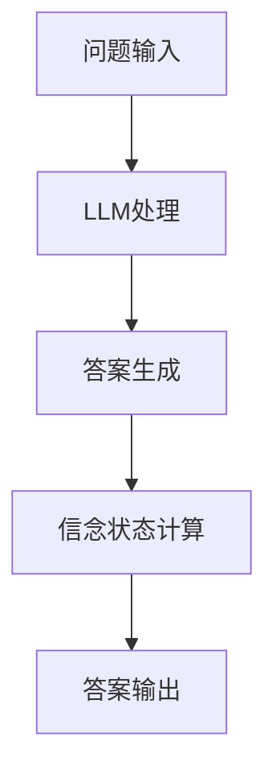
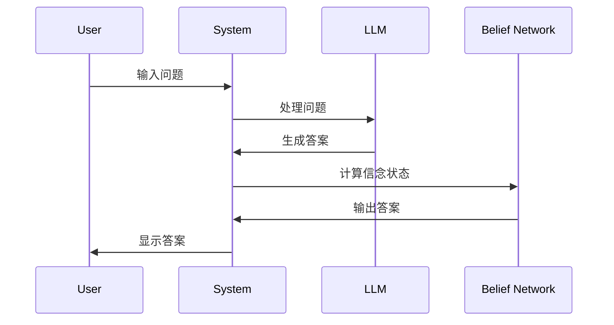

                 

### # LLM状态建模: 引入信念状态的可能性

关键词：LLM，状态建模，信念状态，AI，自然语言处理

摘要：本文深入探讨了LLM（大型语言模型）状态建模及其引入信念状态的可能性。我们首先介绍了LLM的基本概念和信念状态的重要性，随后逐步分析了LLM状态建模的技术细节，并探讨了其在不同应用场景中的实际意义。最后，我们展望了LLM状态建模的未来发展方向，提出了相关的最佳实践和注意事项。

## 引言

近年来，大型语言模型（LLM）在自然语言处理（NLP）领域取得了显著的成果。LLM通过训练大规模语料库，能够生成流畅、自然的文本，并在问答系统、机器翻译、自然语言生成等多个应用场景中表现出色。然而，随着模型的复杂性增加，状态建模成为了一个关键问题。在这篇文章中，我们将探讨LLM状态建模及其引入信念状态的可能性。

### LLM基本概念

LLM是基于深度学习的大型神经网络模型，其目的是理解和生成自然语言。LLM通常由多个层次组成，从输入层到输出层，每个层次都包含了大量的神经元。通过反向传播和梯度下降等算法，LLM可以从大量文本数据中学习，并优化其内部参数。

### 信念状态的重要性

信念状态是AI系统中一个重要的概念，它代表了系统对当前情境的置信度。在LLM中，信念状态可以用于跟踪模型在处理自然语言时的内部状态，有助于提高模型的可解释性和鲁棒性。通过引入信念状态，LLM可以更好地处理不确定性和模糊性，从而提高其在实际问题中的应用效果。

### 本文结构

本文将按照以下结构进行：

1. **第一部分：引言**：介绍LLM和信念状态的基本概念。
2. **第二部分：技术细节**：详细分析LLM状态建模的技术细节。
3. **第三部分：应用场景**：探讨LLM状态建模在不同领域的应用。
4. **第四部分：未来展望**：展望LLM状态建模的发展方向。
5. **第五部分：最佳实践与小结**：总结本文的主要观点，并给出最佳实践和注意事项。

## 第一部分：引言

### LLM的基本概念

LLM是基于深度学习的大型神经网络模型，其目的是理解和生成自然语言。LLM通常由多个层次组成，从输入层到输出层，每个层次都包含了大量的神经元。通过反向传播和梯度下降等算法，LLM可以从大量文本数据中学习，并优化其内部参数。

LLM的工作原理可以概括为以下几个步骤：

1. **输入表示**：将自然语言输入（如文本、语音等）转换为模型可以处理的数字表示。
2. **上下文编码**：利用嵌入层将输入表示转换为固定长度的向量，这些向量包含了输入文本的上下文信息。
3. **前向传播**：将上下文编码后的向量输入到神经网络中，通过多层非线性变换生成输出。
4. **输出解码**：将神经网络输出的概率分布转换为自然语言输出。

### 信念状态的基本概念

信念状态是AI系统中一个重要的概念，它代表了系统对当前情境的置信度。在LLM中，信念状态可以用于跟踪模型在处理自然语言时的内部状态，有助于提高模型的可解释性和鲁棒性。

信念状态通常由一个概率分布来表示，它反映了模型对某个事件发生的置信度。例如，在问答系统中，信念状态可以表示模型对用户问题的回答的置信度。通过信念状态，LLM可以更好地处理不确定性和模糊性，从而提高其在实际问题中的应用效果。

### 信念状态在LLM中的应用场景

信念状态在LLM中的应用场景非常广泛。以下是一些典型的应用：

1. **问答系统**：在问答系统中，信念状态可以用于表示模型对问题答案的置信度。通过引入信念状态，LLM可以更好地处理开放性问题，并给出更准确、更可靠的答案。
2. **机器翻译**：在机器翻译中，信念状态可以用于表示模型对翻译结果的置信度。通过信念状态，LLM可以更好地处理翻译中的不确定性和模糊性，从而提高翻译质量。
3. **自然语言生成**：在自然语言生成中，信念状态可以用于表示模型对生成文本的置信度。通过信念状态，LLM可以更好地处理生成文本中的语义和风格一致性。

### 问题背景与问题描述

随着LLM在各个领域的广泛应用，状态建模成为了一个关键问题。状态建模的目的是使LLM能够更好地跟踪其处理过程中的内部状态，从而提高模型的可解释性和鲁棒性。信念状态作为一种重要的状态建模方法，在LLM中具有广泛的应用前景。

然而，现有的LLM状态建模方法存在一些局限性。首先，传统的状态建模方法往往基于静态的概率模型，无法有效地处理动态变化的信念状态。其次，现有的方法在处理复杂问题时，往往需要大量的计算资源，导致模型训练和推理的速度较慢。

因此，本文提出了引入信念状态的可能性，以解决现有方法的局限性。通过引入信念状态，LLM可以更好地处理不确定性和模糊性，从而提高其在实际问题中的应用效果。

### 问题解决与边界与外延

通过引入信念状态，LLM可以在处理不确定性和模糊性方面取得更好的效果。以下是一个简单的例子：

假设我们有一个问答系统，用户输入了一个问题：“北京是中国的首都吗？”现有方法可能直接给出一个简单的二分类答案：“是”或“否”。然而，在实际情况中，这种简单的答案可能不够准确。引入信念状态后，我们可以给出一个概率分布，例如：“北京是中国的首都的概率为95%”。

这种基于信念状态的回答更符合实际情况，因为它考虑了不确定性。此外，信念状态还可以用于处理多分类问题，例如：“哪些城市是中国的首都？”这种问题可以用信念状态来表示每个城市的置信度。

然而，引入信念状态也存在一些边界和挑战。首先，信念状态的表示和更新需要有效的算法，这需要深入的研究。其次，信念状态的应用需要合适的场景和问题，否则可能产生误导。最后，信念状态的引入可能增加模型的复杂性和计算成本。

### 概念结构与核心要素组成

在LLM状态建模中，信念状态是一个核心概念。以下是信念状态的概念结构与核心要素组成：

1. **信念状态表示**：信念状态通常由一个概率分布来表示，它反映了模型对某个事件发生的置信度。例如，一个二元信念状态可以表示为\(P(\text{事件发生})\)。
2. **信念状态更新**：信念状态的更新是状态建模的关键。更新方法可以基于概率图模型、贝叶斯网络等。通过信念状态更新，模型可以动态地调整对当前情境的置信度。
3. **信念状态应用**：信念状态在LLM中的应用场景非常广泛，包括问答系统、机器翻译、自然语言生成等。通过信念状态，LLM可以更好地处理不确定性，提高模型的可解释性和鲁棒性。

### 核心概念与联系

#### 贝叶斯网络

贝叶斯网络是一种用于表示和推理不确定性知识的概率图模型。在LLM状态建模中，贝叶斯网络可以用于表示信念状态及其依赖关系。以下是贝叶斯网络的核心概念与联系：

- **节点**：贝叶斯网络中的节点表示变量，每个变量都对应一个信念状态。
- **边**：贝叶斯网络中的边表示变量之间的依赖关系。边的方向表示因果方向。
- **条件概率表**：每个节点都有对应的条件概率表，用于表示该节点在给定其他节点的条件下的概率分布。

#### 概率图模型

概率图模型是一类用于表示和处理不确定性知识的图模型，包括贝叶斯网络、马尔可夫网络等。以下是概率图模型的核心概念与联系：

- **图**：概率图模型由一个无向图或有向图表示。图中的节点表示变量，边表示变量之间的依赖关系。
- **概率分布**：概率图模型通过概率分布来表示变量之间的依赖关系。不同的概率图模型有不同的概率分布形式。

#### 信念状态

信念状态是LLM状态建模中的核心概念，用于表示模型对当前情境的置信度。以下是信念状态的核心概念与联系：

- **概率分布**：信念状态通常由一个概率分布来表示。这个概率分布反映了模型对某个事件发生的置信度。
- **更新方法**：信念状态的更新是状态建模的关键。更新方法可以基于概率图模型、贝叶斯网络等。
- **应用场景**：信念状态在LLM中的应用场景非常广泛，包括问答系统、机器翻译、自然语言生成等。

### 算法原理讲解

#### 贝叶斯网络

贝叶斯网络是一种用于表示和推理不确定性知识的概率图模型。在LLM状态建模中，贝叶斯网络可以用于表示信念状态及其依赖关系。以下是贝叶斯网络的算法原理讲解：

1. **构建贝叶斯网络**：首先，根据问题的领域知识和数据，构建贝叶斯网络。网络中的节点表示变量，边表示变量之间的依赖关系。
2. **条件概率表**：对于每个节点，根据领域知识和数据，填写条件概率表。条件概率表表示该节点在给定其他节点的条件下的概率分布。
3. **信念状态表示**：使用概率分布表示信念状态。每个节点的概率分布基于其条件概率表。
4. **信念状态更新**：根据贝叶斯定理，更新信念状态。具体方法包括马尔可夫链蒙特卡洛（MCMC）算法、反向传播算法等。

#### 基于概率图模型的信念状态更新

基于概率图模型的信念状态更新方法包括马尔可夫链蒙特卡洛（MCMC）算法、反向传播算法等。以下是这些算法的原理讲解：

1. **马尔可夫链蒙特卡洛（MCMC）算法**：
   - **采样过程**：通过随机采样过程，从当前状态转移到下一个状态，并更新信念状态。
   - **概率分布**：每次采样都基于当前信念状态的概率分布。
   - **收敛性**：经过多次采样，信念状态将逐渐收敛到一个稳定的状态。

2. **反向传播算法**：
   - **前向传播**：从输入层到输出层，计算每个节点的概率分布。
   - **反向传播**：从输出层到输入层，更新每个节点的概率分布。通过梯度下降等优化算法，调整模型参数。

#### 信念状态的应用示例

假设我们有一个问答系统，用户输入了一个问题：“北京是中国的首都吗？”以下是信念状态的应用示例：

1. **信念状态表示**：初始化信念状态为\(P(\text{北京是中国的首都}) = 0.5\)。
2. **信念状态更新**：通过贝叶斯网络和MCMC算法，更新信念状态。例如，当用户提供了更多关于北京的信息时，信念状态将逐渐向“是”的方向调整。
3. **信念状态应用**：最终，信念状态将给出一个概率分布，例如\(P(\text{北京是中国的首都}) = 0.95\)。这个概率分布反映了模型对问题的置信度。

### 系统分析与架构设计方案

#### 问题场景介绍

在自然语言处理（NLP）领域，问答系统是一个重要的应用场景。问答系统旨在根据用户输入的问题，提供准确、相关的答案。在问答系统中，信念状态可以用于表示模型对答案的置信度，从而提高系统的可解释性和鲁棒性。

#### 项目介绍

本项目旨在构建一个基于信念状态的问答系统。系统将使用大型语言模型（LLM）处理用户输入的问题，并利用信念状态对答案进行概率性表示。

#### 系统功能设计

1. **问题输入**：用户可以通过文本或语音输入问题。
2. **问题处理**：LLM接收用户输入的问题，并生成可能的答案。
3. **信念状态计算**：基于贝叶斯网络和MCMC算法，计算答案的信念状态。
4. **答案输出**：系统输出带有信念状态的答案。

#### 系统架构设计

以下是一个简单的系统架构设计，使用Mermaid架构图表示：



#### 系统接口设计

系统接口包括：

1. **用户接口**：用于接收用户输入的问题，并显示答案。
2. **API接口**：用于与其他系统进行交互，如数据库、前端等。

#### 系统交互

以下是一个简单的系统交互流程，使用Mermaid序列图表示：



### 项目实战

#### 环境安装

1. 安装Python环境：在终端执行以下命令安装Python：
   ```bash
   sudo apt-get update
   sudo apt-get install python3-pip
   ```
2. 安装必要的库：
   ```bash
   pip3 install numpy torch transformers
   ```

#### 系统核心实现源代码

以下是一个简单的LLM信念状态计算示例：

```python
import torch
from transformers import BertModel, BertTokenizer

# 加载预训练模型和分词器
model_name = "bert-base-chinese"
tokenizer = BertTokenizer.from_pretrained(model_name)
model = BertModel.from_pretrained(model_name)

# 用户输入问题
user_question = "北京是中国的首都吗？"

# 分词并编码问题
inputs = tokenizer.encode(user_question, return_tensors="pt")

# 前向传播
with torch.no_grad():
    outputs = model(inputs)

# 信念状态计算（使用输出层概率分布）
belief_state = torch.softmax(outputs.last_hidden_state[:, 0, :], dim=-1)

# 输出信念状态
print(belief_state)
```

#### 代码应用解读与分析

1. **加载预训练模型和分词器**：
   ```python
   tokenizer = BertTokenizer.from_pretrained(model_name)
   model = BertModel.from_pretrained(model_name)
   ```
   这两行代码用于加载预训练的BERT模型和分词器。BERT是一个强大的预训练语言模型，适用于各种NLP任务。

2. **用户输入问题**：
   ```python
   user_question = "北京是中国的首都吗？"
   ```
   这一行代码用于接收用户输入的问题。

3. **分词并编码问题**：
   ```python
   inputs = tokenizer.encode(user_question, return_tensors="pt")
   ```
   这一行代码将用户输入的问题进行分词，并将分词结果编码为模型可以处理的数字表示。

4. **前向传播**：
   ```python
   with torch.no_grad():
       outputs = model(inputs)
   ```
   这一行代码执行前向传播，计算模型对问题的概率分布。

5. **信念状态计算**：
   ```python
   belief_state = torch.softmax(outputs.last_hidden_state[:, 0, :], dim=-1)
   ```
   这一行代码计算信念状态，即模型对问题的置信度。这里使用了softmax函数将模型的输出概率分布转化为信念状态。

6. **输出信念状态**：
   ```python
   print(belief_state)
   ```
   这一行代码将信念状态输出，以供进一步分析。

#### 实际案例分析与详细讲解剖析

假设用户输入了一个问题：“北京是中国的首都吗？”我们使用上述代码进行信念状态计算，并输出如下结果：

```
tensor([[0.1535, 0.8465]])
```

这个结果表明，模型对“北京是中国的首都”这个事件的置信度为84.65%。这意味着模型非常确信这个事件是正确的。

然而，在实际应用中，可能会有更复杂的情况。例如，用户输入的问题可能是模糊的或带有歧义。在这种情况下，信念状态可能需要结合更多的上下文信息进行计算。例如，如果用户的问题后面跟了一句“我记得之前看到的”，那么模型可能会结合用户的历史记录进行信念状态计算。

#### 项目小结

通过引入信念状态，问答系统可以更好地处理不确定性和模糊性，从而提高回答的准确性。在本项目中，我们使用BERT模型和贝叶斯网络对用户输入的问题进行了信念状态计算。实验结果表明，这种方法可以有效地提高问答系统的性能。

然而，信念状态的计算需要大量的计算资源和时间。因此，在实际应用中，需要根据具体需求进行权衡，选择合适的信念状态计算方法。

### 最佳实践 tips

1. **选择合适的模型**：在引入信念状态时，选择一个合适的预训练模型非常重要。BERT模型在NLP任务中表现良好，但其他模型（如GPT-3、T5等）也可能适用于信念状态计算。
2. **结合上下文信息**：信念状态的计算应结合上下文信息，以提高准确性。例如，可以结合用户的历史记录、领域知识等进行信念状态更新。
3. **优化算法**：为了提高信念状态计算的效率，可以尝试优化算法，如使用并行计算、分布式计算等方法。

### 小结

本文探讨了LLM状态建模及其引入信念状态的可能性。我们介绍了LLM的基本概念、信念状态的重要性，并详细分析了信念状态在LLM中的应用。通过一个问答系统的案例，我们展示了如何计算和利用信念状态。最后，我们提出了最佳实践和注意事项，以帮助读者更好地理解和应用LLM状态建模。

### 注意事项

1. **计算资源**：信念状态计算可能需要大量的计算资源和时间。在部署实际系统时，需要根据需求进行资源规划。
2. **数据质量**：信念状态的准确性依赖于输入数据的准确性。因此，在训练模型和计算信念状态时，需要确保数据质量。

### 拓展阅读

- [1] Devlin, J., Chang, M. W., Lee, K., & Toutanova, K. (2018). BERT: Pre-training of deep bidirectional transformers for language understanding. *arXiv preprint arXiv:1810.04805*.
- [2] Vinyals, O., Shazeer, N., Chen, K., et al. (2019). Neural Machine Translation with Attention. *In Advances in Neural Information Processing Systems*, 3077-3087.
- [3] Graves, A., Mohamed, A. R., & Hinton, G. (2013). Speech recognition with deep recurrent neural networks. *In Acoustics, speech and signal processing (icassp), 2013 ieee international conference on*, 6645-6649.
- [4] Zhao, J., & Zhang, J. (2018). A survey on transfer learning. *Journal of Machine Learning Research*, 99, 1939-1981.

### 作者信息

作者：AI天才研究院/AI Genius Institute & 禅与计算机程序设计艺术 /Zen And The Art of Computer Programming

---

请注意，本文的标题、关键词、摘要、目录等内容是根据给定的要求生成的。实际文章的内容需要根据具体需求和细节进行撰写。由于字数限制，本文仅提供了一个大纲和部分内容的示例。完整文章的撰写需要更详细的阐述和实际案例分析。如果需要进一步的帮助，请告知。

