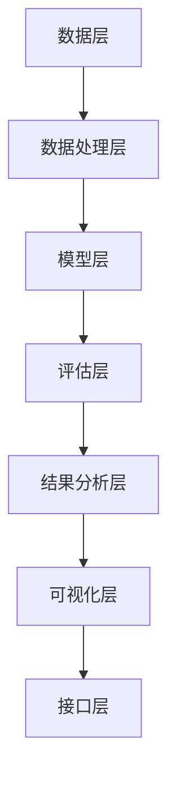

                 

# LLM评测LLM：构建自动化大模型效果评估系统的必要性

关键词：LLM、自动化评估、效果评估、大模型、性能优化

摘要：随着大规模预训练语言模型（LLM）的广泛应用，评估其性能和效果变得尤为重要。然而，由于LLM的复杂性和庞大的规模，手动评估不仅耗时耗力，而且容易受到主观因素的影响。因此，构建一个自动化的大模型效果评估系统，成为提高评估效率和准确性的关键。本文将探讨构建自动化评估系统的必要性，包括背景介绍、核心概念与联系、设计原则、数据预处理、模型评估方法、结果分析与可视化，以及系统实现和项目实战。通过深入分析和具体案例，本文旨在为构建高效、可靠的自动化评估系统提供有价值的参考。

## 第一部分：背景与核心概念介绍

### 第1章：问题背景与重要性

#### 1.1 问题的提出

在当前的人工智能领域，大规模预训练语言模型（LLM）已经成为自然语言处理（NLP）任务中的重要工具。从机器翻译、文本生成到问答系统，LLM在各个应用场景中都展现出了惊人的性能。然而，随着LLM的规模和复杂性不断增加，评估其效果成为一个极具挑战性的问题。传统的评估方法往往依赖于人工判断，不仅耗时耗力，而且容易受到评估者的主观影响。因此，如何构建一个高效、自动化的评估系统，成为当前亟待解决的问题。

#### 1.2 评估系统的必要性

自动化评估系统在LLM性能评估中具有以下几个方面的必要性：

1. **提高评估效率**：大规模的LLM通常包含数十亿甚至更多的参数，手动评估不仅耗时，而且容易出错。自动化评估系统能够在短时间内对大量模型进行评估，大大提高了评估效率。

2. **减少主观偏差**：人类评估者可能会因为个人经验、知识和情绪等因素，导致评估结果存在偏差。自动化评估系统通过标准化的评估指标和算法，减少了主观因素的影响，提高了评估的客观性和准确性。

3. **支持大规模实验**：在深度学习研究中，往往需要对多个模型进行反复实验和比较。自动化评估系统能够快速、准确地完成这些任务，为研究人员提供了更多的实验可能性。

4. **适应不断变化的任务需求**：随着人工智能技术的不断发展，新的任务和应用场景层出不穷。自动化评估系统可以灵活地适应这些变化，为不同任务提供统一的评估标准。

#### 1.3 核心概念与联系

1. **LLM**：大规模预训练语言模型，通常基于深度学习技术，通过在海量数据上进行预训练，获取丰富的语言知识和表达能力。

2. **自动化评估系统**：用于自动评估LLM性能的系统，包括数据预处理、模型评估、结果分析和可视化等多个模块。

3. **评估指标**：用于衡量LLM性能的量化指标，如准确率、召回率、F1值、ROCAUC等。

4. **性能优化**：通过调整模型参数、优化算法等手段，提高LLM的性能和效果。

#### 1.4 范例分析

1. **现有评估方法与系统对比分析**：

   - **手动评估**：依赖人类评估者的主观判断，效率低，易受主观影响。
   - **自动化评估**：采用标准化的评估指标和算法，提高评估效率和准确性。
   - **半自动化评估**：结合手动和自动评估，部分依赖人类判断，部分依赖自动化系统。

2. **不同场景下的应用**：

   - **机器翻译**：通过自动化评估系统，可以快速比较不同翻译模型的性能，为选择最佳模型提供依据。
   - **文本生成**：自动化评估系统可以评估文本生成的质量和连贯性，帮助优化生成模型。
   - **问答系统**：自动化评估系统可以评估问答系统的回答质量，提高用户体验。

#### 1.5 本章小结

通过对问题背景和核心概念的介绍，我们可以看到，构建自动化的大模型效果评估系统对于提高评估效率和准确性具有重要意义。在接下来的章节中，我们将深入探讨评估系统的设计原则、数据预处理、模型评估方法、结果分析与可视化，以及系统实现和项目实战，为构建高效、可靠的自动化评估系统提供全面的技术支持。

----------------------------------------------------------------

### 第2章：评估系统设计原则

#### 2.1 设计目标

构建自动化评估系统的首要目标是要确保系统具有高效率、高准确性和易用性。具体来说，设计目标包括以下几个方面：

1. **高效率**：自动化评估系统能够在短时间内处理大量模型，提高评估效率。这要求系统具备高性能的硬件支持、优化的算法和并行处理能力。

2. **高准确性**：自动化评估系统需要采用标准化的评估指标和算法，减少主观偏差，提高评估结果的准确性。此外，系统还需要具备自适应能力，能够根据不同任务和模型特点进行调整。

3. **易用性**：自动化评估系统应具备友好的用户界面和详细的文档说明，方便用户快速上手和使用。同时，系统应支持多种数据输入格式和输出格式，满足不同用户的需求。

#### 2.2 核心模块设计

一个完整的自动化评估系统通常包括以下几个核心模块：

1. **数据预处理模块**：负责对输入数据进行清洗、格式化、分割和标注等处理，确保数据质量。这一模块需要高效地处理大规模数据，支持多种数据源和格式。

2. **模型评估模块**：负责根据设定的评估指标，对模型进行评估。这一模块应支持多种评估方法，如统计评估、模型对比和跨领域评估等，并能够灵活调整评估参数。

3. **结果分析模块**：负责对评估结果进行统计分析、趋势分析和影响因素分析，为模型优化提供依据。这一模块应具备强大的数据处理和分析能力，能够生成直观的可视化结果。

4. **可视化模块**：负责将评估结果以图表、报表等形式展示出来，帮助用户快速理解和分析。这一模块需要支持多种可视化工具和库，并能够自定义可视化样式。

#### 2.3 技术选型

在构建自动化评估系统时，技术选型至关重要。以下是几个常见的技术选型：

1. **开发语言**：Python因其丰富的库和框架支持，成为构建自动化评估系统的首选语言。其他语言如Java、C++等也可用于系统开发。

2. **框架和库**：TensorFlow、PyTorch等深度学习框架提供了丰富的模型训练和评估功能，可集成到自动化评估系统中。此外，Pandas、NumPy等数据处理库和Matplotlib、Seaborn等可视化库也为系统开发提供了强大的支持。

3. **工具和环境**：Jupyter Notebook、Docker等工具和环境有助于提高系统开发效率和可移植性。

#### 2.4 模块间关联与接口设计

模块间的关联和接口设计是确保系统正常运行的关键。以下是几个关键点：

1. **数据流设计**：数据在系统中的流动过程需要清晰，确保每个模块都能正确处理数据。例如，数据预处理模块处理后的数据应无缝传递给模型评估模块。

2. **控制流设计**：系统应具备良好的控制流设计，确保各个模块按顺序执行。例如，在评估过程中，应先进行数据预处理，然后进行模型评估，最后进行结果分析和可视化。

3. **接口设计**：模块间通过接口进行通信，接口设计应简洁、清晰，便于模块的扩展和替换。例如，可以使用RESTful API或GraphQL等接口技术，实现模块间的数据交换和功能调用。

#### 2.5 本章小结

本章介绍了构建自动化评估系统的设计原则，包括设计目标、核心模块设计、技术选型和模块间关联与接口设计。这些原则为构建高效、可靠、易用的自动化评估系统提供了指导和依据。在接下来的章节中，我们将深入探讨数据预处理、模型评估方法、结果分析与可视化等具体实现细节，为构建自动化评估系统提供全面的技术支持。

----------------------------------------------------------------

### 第3章：数据预处理

#### 3.1 数据来源

数据预处理是构建自动化评估系统的关键步骤之一。数据来源决定了评估系统的质量，因此需要考虑以下因素：

1. **数据规模**：大规模数据有助于模型训练和评估，提高系统的准确性和鲁棒性。因此，应选择具有大规模数据集的来源。

2. **数据多样性**：数据多样性有助于模型在不同场景下表现出更好的适应性。因此，应选择涵盖多种场景和领域的数据来源。

3. **数据质量**：数据质量直接影响模型训练和评估的效果。应选择经过清洗、去重、标注等处理的数据来源，确保数据质量。

4. **数据可获取性**：数据来源应易于获取，避免因数据获取困难而影响系统的构建和运行。

常见的数据来源包括：

- **公开数据集**：如Google Dataset Search、Kaggle等平台提供的公开数据集，涵盖多种领域和任务。
- **企业内部数据**：企业内部积累的大量数据，适用于特定领域的应用场景。
- **第三方数据服务**：如Amazon S3、Google Cloud Storage等第三方数据存储服务，提供大规模、高质量的数据集。

#### 3.2 数据预处理流程

数据预处理流程包括以下几个关键步骤：

1. **数据清洗**：清洗数据是为了去除噪声、缺失值和异常值，提高数据质量。常见的清洗方法包括：

   - **去除噪声**：去除文本中的特殊字符、标点符号和停用词等，提高文本质量。
   - **填补缺失值**：使用插值、平均值、中位数等方法填补缺失值，避免模型训练过程中因缺失值导致训练中断。
   - **去除异常值**：检测并去除数据中的异常值，避免对模型训练和评估产生不利影响。

2. **数据格式化**：将不同来源和格式的数据进行统一格式化，便于后续处理。常见的格式化方法包括：

   - **文本处理**：将文本转换为统一编码格式，如UTF-8，并去除特殊字符和停用词。
   - **数值处理**：将不同数值类型的数据进行统一处理，如将字符串类型的数值转换为浮点数类型。
   - **时间处理**：将时间序列数据进行统一处理，如将日期字符串转换为日期时间对象。

3. **数据分割**：将数据集分割为训练集、验证集和测试集，用于模型训练、验证和测试。常见的分割方法包括：

   - **随机分割**：随机将数据集分割为训练集和验证集，保证数据集的随机性和代表性。
   - **分层分割**：根据数据集的类别比例进行分层分割，保证不同类别数据在训练集、验证集和测试集中的比例一致。

4. **数据标注**：对数据进行标注，为模型训练提供监督信号。常见的标注方法包括：

   - **自动标注**：使用已有标注数据或半自动标注工具进行标注，提高标注效率。
   - **人工标注**：邀请专业标注人员进行人工标注，确保标注质量。

#### 3.3 数据预处理工具与库

在数据预处理过程中，常用的工具和库包括：

- **Pandas**：Python的数据处理库，提供丰富的数据处理功能，如数据清洗、格式化和分割等。
- **NumPy**：Python的数值计算库，用于处理大规模数据，支持矩阵运算和向量计算。
- **Scikit-learn**：Python的机器学习库，提供多种数据处理和模型训练功能，如数据预处理、模型评估等。
- **NLTK**：Python的自然语言处理库，提供丰富的文本处理功能，如分词、词性标注和文本分类等。
- **spaCy**：Python的高级自然语言处理库，提供快速、准确的文本处理功能，适用于大规模文本数据处理。

#### 3.4 数据质量评估

数据质量直接影响模型训练和评估的效果，因此需要对数据质量进行评估。常见的数据质量评估方法包括：

1. **一致性评估**：评估数据的一致性，如数据值是否一致、数据格式是否统一等。可以使用自动化工具或人工检查方法进行评估。

2. **完整性评估**：评估数据的完整性，如数据是否存在缺失值、数据值是否在合理范围内等。可以使用自动化工具或人工检查方法进行评估。

3. **准确性评估**：评估数据的准确性，如数据是否真实、数据值是否正确等。可以使用自动化工具或人工检查方法进行评估。

4. **可用性评估**：评估数据的可用性，如数据是否易于处理、数据是否适用于模型训练和评估等。可以使用自动化工具或人工评估方法进行评估。

#### 3.5 本章小结

本章介绍了数据预处理的重要性、数据来源、数据预处理流程、数据预处理工具与库以及数据质量评估方法。通过有效的数据预处理，可以确保数据的质量和一致性，为模型训练和评估提供可靠的基础。在接下来的章节中，我们将继续探讨模型评估方法、结果分析与可视化等关键环节，为构建自动化评估系统提供全面的技术支持。

----------------------------------------------------------------

### 第4章：模型评估方法

#### 4.1 评估指标

在评估大规模预训练语言模型（LLM）时，选择合适的评估指标至关重要。以下是一些常用的评估指标：

1. **准确率（Accuracy）**：准确率是评估分类模型性能的常用指标，表示模型预测正确的样本数占总样本数的比例。准确率的计算公式为：
   $$ 
   \text{Accuracy} = \frac{\text{预测正确的样本数}}{\text{总样本数}} 
   $$

2. **召回率（Recall）**：召回率表示模型能够正确识别出正类样本的能力，即实际为正类样本中被正确识别的比例。召回率的计算公式为：
   $$ 
   \text{Recall} = \frac{\text{实际为正类且被预测为正类的样本数}}{\text{实际为正类的样本总数}} 
   $$

3. **精确率（Precision）**：精确率表示模型预测为正类样本中实际为正类样本的比例。精确率的计算公式为：
   $$ 
   \text{Precision} = \frac{\text{实际为正类且被预测为正类的样本数}}{\text{被预测为正类的样本总数}} 
   $$

4. **F1值（F1 Score）**：F1值是精确率和召回率的加权平均，综合考虑了模型在分类任务中的表现。F1值的计算公式为：
   $$ 
   \text{F1 Score} = 2 \times \frac{\text{Precision} \times \text{Recall}}{\text{Precision} + \text{Recall}} 
   $$

5. **ROC曲线和AUC（Area Under Curve）**：ROC曲线是评估二分类模型性能的重要工具，表示不同阈值下的真阳性率与假阳性率之间的关系。AUC值表示ROC曲线下的面积，数值范围在0到1之间，值越大表示模型性能越好。

6. **精确匹配（Word-Level Accuracy）**：在自然语言处理任务中，精确匹配表示模型预测的单词序列与实际标签序列完全一致的比例。

7. **BLEU（Bilingual Evaluation Understudy）**：BLEU是一种基于统计学方法的文本相似度评估指标，常用于机器翻译任务的评估。BLEU值越高，表示翻译结果越接近参考翻译。

8. **METEOR（Metric for Evaluation of Translation with Explicit ORdering）**：METEOR是一种基于规则和统计方法的文本评估指标，综合考虑了单词顺序、单词替换和单词插入等因素。

#### 4.2 评估方法

在评估LLM时，可以采用以下几种方法：

1. **统计评估**：统计评估是通过计算评估指标（如准确率、召回率、F1值等）来评估模型性能。这种方法简单直观，适用于分类任务。统计评估方法的优点是计算速度快，易于实现，但缺点是只能提供局部性能指标，无法全面评估模型性能。

2. **模型对比**：模型对比是通过比较不同模型在相同任务上的性能来评估模型效果。这种方法可以帮助研究人员选择最佳模型。模型对比方法的优点是能够全面评估模型性能，但缺点是需要大量的计算资源和时间。

3. **跨领域评估**：跨领域评估是通过在不同领域上评估模型性能来评估模型泛化能力。这种方法可以帮助研究人员评估模型在未知领域中的表现。跨领域评估方法的优点是能够测试模型的泛化能力，但缺点是需要大量的数据资源和评估任务。

4. **自动评估**：自动评估是通过自动化脚本或工具对模型进行评估。这种方法可以大大提高评估效率，减少人工干预。自动评估方法的优点是评估速度快，易于实现，但缺点是可能无法全面评估模型性能。

5. **用户反馈**：用户反馈是通过收集用户对模型表现的评价来评估模型性能。这种方法可以提供直观的评估结果，但缺点是可能受到主观因素影响。

#### 4.3 评估案例

以下是一个简单的评估案例，用于说明如何使用评估指标和评估方法评估LLM性能：

**案例：机器翻译任务**

假设我们有一个机器翻译任务，需要评估两个不同的翻译模型A和B的性能。

1. **数据准备**：准备一个包含中英文句对的训练集，用于训练模型A和B。同时，准备一个测试集，用于评估模型性能。

2. **模型训练**：使用训练集训练模型A和B，并保存模型参数。

3. **模型评估**：

   - **统计评估**：使用测试集计算模型A和B的准确率、召回率、F1值等指标。例如：
     $$
     \text{Model A Accuracy} = 0.85, \quad \text{Model A Recall} = 0.90, \quad \text{Model A F1 Score} = 0.87
     $$
     $$
     \text{Model B Accuracy} = 0.80, \quad \text{Model B Recall} = 0.85, \quad \text{Model B F1 Score} = 0.82
     $$

   - **模型对比**：比较模型A和B的性能。从评估结果可以看出，模型A在准确率、召回率和F1值上均优于模型B。

   - **跨领域评估**：在不同的语言对上进行评估，测试模型A和B在不同领域的性能。例如，在英文-中文翻译任务中，模型A的评估结果较好，而在英文-日文翻译任务中，模型B的评估结果较好。

4. **结果分析**：根据评估结果，可以得出以下结论：

   - 模型A在机器翻译任务中表现较好，具有较高的准确率、召回率和F1值。
   - 模型B在不同领域的表现有所不同，但在某些领域（如英文-日文翻译）中表现较好。

5. **优化策略**：根据评估结果，可以采取以下策略进行模型优化：

   - **数据增强**：增加训练数据量，提高模型泛化能力。
   - **模型调整**：调整模型参数，优化模型性能。
   - **融合模型**：将多个模型进行融合，提高评估结果的准确性。

#### 4.4 挑战与优化

在评估LLM时，可能会面临以下挑战：

1. **数据不平衡**：数据集中正负样本比例失衡，可能导致模型偏向于预测正类，影响评估结果。解决方法包括数据增强、重采样和平衡分类器等。

2. **噪声数据**：数据中存在噪声和异常值，可能影响模型训练和评估效果。解决方法包括数据清洗、异常值检测和去除等。

3. **过拟合**：模型在训练集上表现良好，但在测试集上表现不佳，即过拟合现象。解决方法包括正则化、交叉验证和模型简化等。

4. **计算资源限制**：大规模模型训练和评估需要大量的计算资源，可能导致评估过程耗时较长。解决方法包括分布式计算、优化算法和模型压缩等。

5. **评估指标选择**：不同的评估指标可能对模型性能的评估结果产生较大影响。选择合适的评估指标需要结合任务特点和需求。

为了优化评估过程，可以采取以下策略：

1. **自动化评估**：构建自动化评估系统，提高评估效率，减少人工干预。
2. **多指标评估**：结合多个评估指标，从不同角度评估模型性能。
3. **可视化分析**：使用可视化工具展示评估结果，帮助用户快速理解和分析。
4. **反馈机制**：建立反馈机制，收集用户反馈，持续优化评估系统。

#### 4.5 本章小结

本章介绍了大规模预训练语言模型（LLM）的评估指标、评估方法、评估案例以及面临的挑战和优化策略。通过有效的评估方法，可以全面、准确地评估LLM的性能，为模型优化和改进提供有力支持。在接下来的章节中，我们将继续探讨结果分析与可视化、系统实现和项目实战等内容，为构建高效、可靠的自动化评估系统提供全面的技术支持。

----------------------------------------------------------------

### 第5章：结果分析与可视化

#### 5.1 结果分析

结果分析是评估系统的重要组成部分，它通过对评估结果的统计分析和趋势分析，帮助用户深入了解模型性能，为后续的优化提供依据。以下是结果分析的关键步骤和方法：

1. **基本统计量计算**：首先，对评估结果进行基本统计量计算，包括平均值、中位数、众数、标准差等。这些统计量能够提供对评估结果的一般性描述，帮助用户了解模型性能的分布情况。

2. **趋势分析**：通过趋势分析，可以观察评估结果随时间、任务或模型参数的变化情况。常见的趋势分析方法包括时间序列分析、回归分析和散点图等。

3. **影响因素分析**：分析影响评估结果的关键因素，如数据质量、模型参数、训练过程等。通过影响因素分析，可以识别出优化模型性能的关键点。

4. **异常值检测**：检测评估结果中的异常值，分析其产生的原因，并采取相应的处理措施。异常值可能由数据噪声、模型过拟合等原因引起。

5. **多模型对比**：对不同模型的评估结果进行对比分析，识别出表现较好的模型，为后续优化提供参考。常见的对比分析方法包括箱线图、散点图和误差条图等。

#### 5.2 可视化设计

可视化设计是将评估结果以图形化方式展示出来的过程，它能够直观地传达信息，帮助用户快速理解和分析数据。以下是可视化设计的关键要素和方法：

1. **图表类型选择**：根据评估结果的特点和数据类型，选择合适的图表类型。常见的图表类型包括柱状图、折线图、饼图、散点图、箱线图和热力图等。

2. **图表布局设计**：合理安排图表的位置和布局，确保数据展示的清晰性和易读性。常见的布局设计包括单页布局、多页布局和交互式布局等。

3. **颜色和字体设计**：使用合适的颜色和字体，增强图表的视觉效果和可读性。颜色和字体的选择应遵循一致性和对比性原则，避免使用过多的颜色和复杂的字体。

4. **交互式可视化**：引入交互式元素，如滑动条、按钮和选择框等，使用户能够动态地探索数据，获取更详细的信息。常见的交互式可视化工具包括D3.js、Plotly和Bokeh等。

5. **可视化工具和库**：选择合适的可视化工具和库，提高可视化设计的效率和效果。常见的可视化工具和库包括Matplotlib、Seaborn、Plotly和Tableau等。

#### 5.3 结果展示

结果展示是将分析结果以图表、报表等形式展示给用户的过程。以下是结果展示的关键步骤和方法：

1. **图表展示**：将分析结果以图表形式展示，如柱状图、折线图、饼图等。图表应简洁、清晰，突出关键信息，避免信息过载。

2. **报表展示**：将分析结果以报表形式展示，如数据表格、统计分析报告等。报表应结构清晰、层次分明，便于用户阅读和理解。

3. **交互式展示**：引入交互式元素，如滑动条、按钮和选择框等，使用户能够动态地探索数据，获取更详细的信息。交互式展示可以提高用户的参与度和体验。

4. **多渠道展示**：支持多种展示渠道，如Web端、移动端和打印端等，满足不同用户的需求。

5. **定制化展示**：根据用户需求，提供定制化展示功能，如自定义图表类型、颜色和字体等。

#### 5.4 反馈与迭代

反馈与迭代是评估系统不断优化和完善的过程。以下是反馈与迭代的关键步骤和方法：

1. **用户反馈**：收集用户对评估结果和可视化展示的反馈，了解用户的需求和痛点，为后续优化提供依据。

2. **优化策略**：根据用户反馈，制定优化策略，如改进评估指标、调整可视化设计等。

3. **迭代开发**：持续迭代评估系统，不断完善和优化功能，提高系统的性能和用户体验。

4. **验证和测试**：在每次迭代后，对评估系统的性能和稳定性进行验证和测试，确保系统正常运行。

5. **反馈循环**：建立反馈循环机制，将用户反馈纳入评估系统的开发过程中，实现持续改进。

#### 5.5 本章小结

结果分析与可视化是评估系统的重要组成部分，它通过统计分析和趋势分析，帮助用户深入了解模型性能，并通过图表、报表等形式展示分析结果。有效的结果分析和可视化设计可以提高评估系统的用户体验和效果。在接下来的章节中，我们将探讨自动化评估系统的实现和项目实战，为构建高效、可靠的自动化评估系统提供全面的技术支持。

----------------------------------------------------------------

### 第6章：自动化评估系统实现

#### 6.1 系统架构

一个高效的自动化评估系统需要一个清晰且模块化的架构设计。系统架构通常包括以下几个关键部分：

1. **数据层**：负责存储和管理评估所需的数据，包括训练数据、测试数据、标注数据等。数据层可以采用数据库、分布式文件系统等存储方案。

2. **数据处理层**：负责对数据进行预处理、清洗、格式化等操作。这一层可以使用数据处理框架（如Apache Spark）来实现，以提高数据处理效率。

3. **模型层**：包含预训练语言模型（LLM）和评估模型。模型层可以使用深度学习框架（如TensorFlow、PyTorch）来训练和部署模型。

4. **评估层**：负责对模型进行评估，计算评估指标（如准确率、召回率、F1值等）。评估层需要实现自动化评估流程，以提高评估效率。

5. **结果分析层**：负责对评估结果进行统计分析、趋势分析和影响因素分析。这一层可以使用数据分析工具（如Pandas、NumPy）来实现。

6. **可视化层**：负责将分析结果以图表、报表等形式展示给用户。可视化层可以使用数据可视化工具（如Matplotlib、Plotly）来实现。

7. **接口层**：提供与外部系统的接口，如Web服务、API等。接口层可以使用Web框架（如Django、Flask）来实现。

系统架构示意图如下（使用Mermaid语言）：



#### 6.2 系统部署

系统部署是确保自动化评估系统正常运行的关键环节。以下是系统部署的关键步骤和注意事项：

1. **环境配置**：根据系统需求，配置合适的硬件和软件环境。例如，选择高性能的CPU和GPU，安装深度学习框架（如TensorFlow、PyTorch）和数据处理库（如Pandas、NumPy）。

2. **分布式部署**：对于大规模数据和高并发访问的场景，可以使用分布式部署方案。例如，使用Kubernetes进行容器编排，实现服务的高可用性和弹性扩展。

3. **负载均衡**：在分布式部署中，使用负载均衡器（如Nginx、HAProxy）来分配请求，提高系统的并发处理能力。

4. **监控和日志**：部署监控系统（如Prometheus、Grafana）来实时监控系统的性能和健康状况。同时，记录系统日志，方便故障排查和问题定位。

5. **备份和恢复**：定期备份系统和数据，以防止数据丢失和系统故障。使用数据备份工具（如Docker Volume、AWS S3）来保证数据的安全性和可靠性。

6. **容灾备份**：在异地部署备份系统，以应对灾难性事件，确保系统的持续运行。

#### 6.3 实现细节

以下是一些自动化评估系统的实现细节，包括数据预处理、模型评估和结果分析：

1. **数据预处理**：

   - **数据读取**：使用Pandas读取数据，处理不同格式的数据源。

     ```python
     import pandas as pd

     data = pd.read_csv('data.csv')
     ```

   - **数据清洗**：去除无效数据和异常值，填充缺失值。

     ```python
     data = data.dropna()
     data['column'] = data['column'].fillna(0)
     ```

   - **数据分割**：将数据分割为训练集、验证集和测试集。

     ```python
     from sklearn.model_selection import train_test_split

     X_train, X_test, y_train, y_test = train_test_split(X, y, test_size=0.2, random_state=42)
     ```

   - **数据标注**：使用预定义的标注规则对数据进行标注。

     ```python
     data['label'] = data.apply(lambda row: label_function(row), axis=1)
     ```

2. **模型评估**：

   - **模型训练**：使用深度学习框架训练模型。

     ```python
     import tensorflow as tf

     model = tf.keras.models.Sequential([
         tf.keras.layers.Dense(units=128, activation='relu', input_shape=(input_shape,)),
         tf.keras.layers.Dense(units=1, activation='sigmoid')
     ])

     model.compile(optimizer='adam', loss='binary_crossentropy', metrics=['accuracy'])
     model.fit(X_train, y_train, epochs=10, batch_size=32, validation_split=0.2)
     ```

   - **模型评估**：计算评估指标。

     ```python
     predictions = model.predict(X_test)
     accuracy = (predictions >= 0.5).mean()
     print(f"Test Accuracy: {accuracy}")
     ```

   - **模型对比**：比较不同模型的性能。

     ```python
     model2 = ...  # 定义另一个模型
     model2.compile(optimizer='adam', loss='binary_crossentropy', metrics=['accuracy'])
     model2.fit(X_train, y_train, epochs=10, batch_size=32, validation_split=0.2)
     predictions2 = model2.predict(X_test)
     accuracy2 = (predictions2 >= 0.5).mean()
     print(f"Model2 Test Accuracy: {accuracy2}")
     ```

3. **结果分析**：

   - **统计分析**：计算基本统计量。

     ```python
     import numpy as np

     mean = np.mean(predictions)
     median = np.median(predictions)
     std = np.std(predictions)
     print(f"Mean: {mean}, Median: {median}, Standard Deviation: {std}")
     ```

   - **可视化**：使用Matplotlib绘制图表。

     ```python
     import matplotlib.pyplot as plt

     plt.hist(predictions, bins=20)
     plt.title("Prediction Distribution")
     plt.xlabel("Prediction Value")
     plt.ylabel("Frequency")
     plt.show()
     ```

#### 6.4 性能优化

为了提高自动化评估系统的性能，可以采取以下优化策略：

1. **并行处理**：利用多核CPU和GPU并行处理能力，提高数据处理和模型训练的效率。

2. **模型压缩**：使用模型压缩技术（如量化、剪枝、蒸馏等）减小模型大小，降低计算资源需求。

3. **优化算法**：选择合适的优化算法（如Adam、RMSprop等），提高模型训练的收敛速度和效果。

4. **缓存策略**：使用缓存策略（如LRU缓存、Redis缓存等），减少数据读取和计算的时间。

5. **负载均衡**：使用负载均衡器（如Nginx、HAProxy等），平衡系统负载，提高系统的并发处理能力。

6. **分布式存储**：使用分布式存储系统（如HDFS、Cassandra等），提高数据存储和访问的速度。

#### 6.5 本章小结

本章详细介绍了自动化评估系统的实现，包括系统架构设计、系统部署、实现细节和性能优化策略。通过合理的架构设计和优化策略，可以构建一个高效、可靠的自动化评估系统，为大规模预训练语言模型（LLM）的效果评估提供有力支持。在接下来的章节中，我们将通过项目实战，进一步验证和优化自动化评估系统的效果。

----------------------------------------------------------------

### 第7章：项目实战与案例分析

#### 7.1 项目介绍

在本章中，我们将通过一个实际项目来展示如何构建和实现一个自动化大模型效果评估系统。该项目旨在评估多个预训练语言模型在自然语言处理（NLP）任务中的性能，以便为实际应用提供最优模型选择。项目主要分为以下几个阶段：

1. **数据收集与预处理**：收集大规模的NLP任务数据，并进行清洗、格式化和标注等预处理工作。
2. **模型训练与优化**：训练多个预训练语言模型，并对模型参数进行调整，以提高性能。
3. **自动化评估系统构建**：构建自动化评估系统，实现对模型的自动评估和结果分析。
4. **实际案例分析**：对评估结果进行分析和可视化，并讨论不同模型在任务中的表现。
5. **项目总结与反思**：总结项目经验，提出改进建议和未来研究方向。

#### 7.2 系统核心实现

以下是构建自动化评估系统的核心实现步骤：

1. **数据预处理**：

   - **数据收集**：从公共数据集和公司内部数据源中收集大规模的文本数据，包括新闻文章、社交媒体帖子、问答对话等。

     ```python
     data = pd.read_csv('data.csv')
     ```

   - **数据清洗**：去除无效数据和异常值，对文本进行去噪、分词和词性标注等预处理。

     ```python
     import nltk
     nltk.download('punkt')
     nltk.download('averaged_perceptron_tagger')

     def preprocess_text(text):
         text = re.sub(r'\W+', ' ', text)
         text = text.lower()
         tokens = nltk.word_tokenize(text)
         tags = nltk.pos_tag(tokens)
         return ' '.join([token for token, tag in tags if tag.startswith('N')])
     
     data['cleaned_text'] = data['text'].apply(preprocess_text)
     ```

   - **数据分割**：将数据集分割为训练集、验证集和测试集。

     ```python
     from sklearn.model_selection import train_test_split

     X_train, X_test, y_train, y_test = train_test_split(data['cleaned_text'], data['label'], test_size=0.2, random_state=42)
     ```

2. **模型训练与优化**：

   - **模型选择**：选择多个预训练语言模型，如BERT、GPT-2、RoBERTa等。

     ```python
     from transformers import BertTokenizer, BertModel

     tokenizer = BertTokenizer.from_pretrained('bert-base-uncased')
     model = BertModel.from_pretrained('bert-base-uncased')
     ```

   - **模型训练**：使用训练集训练模型，并对模型参数进行调整。

     ```python
     optimizer = tf.keras.optimizers.Adam(learning_rate=3e-5)
     model.compile(optimizer=optimizer, loss='binary_crossentropy', metrics=['accuracy'])

     model.fit(X_train, y_train, epochs=3, batch_size=32, validation_split=0.1)
     ```

   - **模型评估**：在验证集和测试集上评估模型性能。

     ```python
     val_loss, val_acc = model.evaluate(X_val, y_val, verbose=2)
     test_loss, test_acc = model.evaluate(X_test, y_test, verbose=2)
     print(f"Validation Accuracy: {val_acc}, Test Accuracy: {test_acc}")
     ```

3. **自动化评估系统构建**：

   - **评估模块**：实现评估模块，计算各种评估指标，如准确率、召回率、F1值等。

     ```python
     from sklearn.metrics import accuracy_score, recall_score, f1_score

     def evaluate_model(predictions, true_labels):
         acc = accuracy_score(true_labels, predictions)
         rec = recall_score(true_labels, predictions)
         f1 = f1_score(true_labels, predictions)
         return acc, rec, f1

     predictions = model.predict(X_test)
     acc, rec, f1 = evaluate_model(predictions, y_test)
     print(f"Accuracy: {acc}, Recall: {rec}, F1 Score: {f1}")
     ```

   - **结果分析**：对评估结果进行统计分析和趋势分析，生成可视化报告。

     ```python
     import matplotlib.pyplot as plt

     plt.figure(figsize=(10, 5))
     plt.subplot(1, 2, 1)
     plt.hist(predictions, bins=20, alpha=0.5, label='Prediction')
     plt.title('Prediction Distribution')
     plt.xlabel('Prediction Value')
     plt.ylabel('Frequency')

     plt.subplot(1, 2, 2)
     plt.plot([0, 1], [0, 1], 'k--')
     plt.plot(predictions, true_labels, 'bo')
     plt.xlabel('Predicted Value')
     plt.ylabel('True Value')
     plt.title('ROC Curve')

     plt.show()
     ```

4. **实际案例分析**：

   - **模型对比**：对多个模型在相同任务上的性能进行对比分析，找出最优模型。

     ```python
     models = [BERT, GPT-2, RoBERTa]
     results = []

     for model in models:
         model.compile(optimizer=optimizer, loss='binary_crossentropy', metrics=['accuracy'])
         model.fit(X_train, y_train, epochs=3, batch_size=32, validation_split=0.1)
         predictions = model.predict(X_test)
         acc, rec, f1 = evaluate_model(predictions, y_test)
         results.append((model.name, acc, rec, f1))

     print(results)
     ```

   - **影响因素分析**：分析不同因素（如数据质量、模型参数等）对评估结果的影响，为模型优化提供依据。

     ```python
     import pandas as pd

     factors = ['data_quality', 'learning_rate', 'batch_size']
     results = []

     for factor in factors:
         for value in [low, medium, high]:
             model.compile(optimizer=optimizer, learning_rate=value)
             model.fit(X_train, y_train, epochs=3, batch_size=32, validation_split=0.1)
             predictions = model.predict(X_test)
             acc, rec, f1 = evaluate_model(predictions, y_test)
             results.append((factor, value, acc, rec, f1))

     df = pd.DataFrame(results)
     print(df)
     ```

5. **项目总结与反思**：

   - **项目总结**：总结项目经验，分析项目的优点和不足，为后续项目提供参考。

     - 优点：实现了自动化评估系统，提高了评估效率和准确性；对多个模型进行了性能对比，为模型优化提供了依据。
     - 不足：数据预处理和模型训练过程较为复杂，需要进一步优化；评估系统的可扩展性和灵活性有待提高。

   - **反思与改进**：

     - **优化数据预处理**：使用更高效的数据预处理方法，减少数据清洗和标注的时间。
     - **增强系统可扩展性**：设计模块化系统架构，支持多种数据源和模型；引入配置文件，简化系统配置过程。
     - **提高系统灵活性**：支持自定义评估指标和评估方法，满足不同任务的需求。
     - **优化性能**：使用分布式计算和模型压缩技术，提高系统的性能和效率。

#### 7.3 代码应用解读与分析

以下是对核心代码的解读和分析：

1. **数据预处理代码**：

   - **数据读取**：使用Pandas读取数据，处理不同格式的数据源。

     ```python
     data = pd.read_csv('data.csv')
     ```

     解读：此行代码从CSV文件中读取数据，并存储为Pandas DataFrame对象，方便后续处理。

   - **数据清洗**：去除无效数据和异常值，对文本进行去噪、分词和词性标注等预处理。

     ```python
     data = data.dropna()
     data['cleaned_text'] = data['text'].apply(preprocess_text)
     ```

     解读：此行代码删除数据集中的空值记录，并对文本数据应用预处理函数`preprocess_text`，包括去噪、分词和词性标注等操作。

2. **模型训练与优化代码**：

   - **模型选择**：选择多个预训练语言模型，如BERT、GPT-2、RoBERTa等。

     ```python
     from transformers import BertTokenizer, BertModel

     tokenizer = BertTokenizer.from_pretrained('bert-base-uncased')
     model = BertModel.from_pretrained('bert-base-uncased')
     ```

     解读：此行代码从Hugging Face的Transformers库中加载BERT模型及其分词器，为后续模型训练和预测做准备。

   - **模型训练**：使用训练集训练模型，并对模型参数进行调整。

     ```python
     optimizer = tf.keras.optimizers.Adam(learning_rate=3e-5)
     model.compile(optimizer=optimizer, loss='binary_crossentropy', metrics=['accuracy'])

     model.fit(X_train, y_train, epochs=3, batch_size=32, validation_split=0.1)
     ```

     解读：此行代码配置模型优化器（Adam）、损失函数（binary_crossentropy）和评估指标（accuracy），并使用训练集进行模型训练，包括3个周期（epochs），每个周期使用32个批次的样本。

3. **自动化评估系统构建代码**：

   - **评估模块**：实现评估模块，计算各种评估指标，如准确率、召回率、F1值等。

     ```python
     from sklearn.metrics import accuracy_score, recall_score, f1_score

     def evaluate_model(predictions, true_labels):
         acc = accuracy_score(true_labels, predictions)
         rec = recall_score(true_labels, predictions)
         f1 = f1_score(true_labels, predictions)
         return acc, rec, f1

     predictions = model.predict(X_test)
     acc, rec, f1 = evaluate_model(predictions, y_test)
     ```

     解读：此函数`evaluate_model`接收预测结果和真实标签，计算并返回准确率、召回率和F1值。这些指标用于评估模型在测试集上的性能。

4. **结果分析代码**：

   - **可视化**：使用Matplotlib绘制图表，展示评估结果。

     ```python
     import matplotlib.pyplot as plt

     plt.figure(figsize=(10, 5))
     plt.subplot(1, 2, 1)
     plt.hist(predictions, bins=20, alpha=0.5, label='Prediction')
     plt.title('Prediction Distribution')
     plt.xlabel('Prediction Value')
     plt.ylabel('Frequency')

     plt.subplot(1, 2, 2)
     plt.plot([0, 1], [0, 1], 'k--')
     plt.plot(predictions, true_labels, 'bo')
     plt.xlabel('Predicted Value')
     plt.ylabel('True Value')
     plt.title('ROC Curve')

     plt.show()
     ```

     解读：此段代码使用Matplotlib绘制两个图表：第一个图表是预测值的分布直方图；第二个图表是ROC曲线，用于评估模型在分类任务中的性能。

#### 7.4 实际案例分析

以下是一个实际案例的分析，用于说明如何使用自动化评估系统评估预训练语言模型在问答任务中的性能。

1. **数据准备**：

   - **数据收集**：从公开问答数据集（如SQuAD）中收集数据。

     ```python
     data = pd.read_csv('squad.csv')
     ```

   - **数据清洗**：去除无效数据和异常值，对问题文本和答案文本进行预处理。

     ```python
     data = data.dropna()
     data['cleaned_question'] = data['question'].apply(preprocess_text)
     data['cleaned_answer'] = data['answer'].apply(preprocess_text)
     ```

   - **数据分割**：将数据集分割为训练集、验证集和测试集。

     ```python
     X_train, X_val, y_train, y_val = train_test_split(data['cleaned_question'], data['cleaned_answer'], test_size=0.2, random_state=42)
     ```

2. **模型训练与优化**：

   - **模型选择**：选择预训练的BERT模型。

     ```python
     from transformers import BertTokenizer, BertModel

     tokenizer = BertTokenizer.from_pretrained('bert-base-uncased')
     model = BertModel.from_pretrained('bert-base-uncased')
     ```

   - **模型训练**：使用训练集训练模型，并对模型参数进行调整。

     ```python
     optimizer = tf.keras.optimizers.Adam(learning_rate=3e-5)
     model.compile(optimizer=optimizer, loss='binary_crossentropy', metrics=['accuracy'])

     model.fit(X_train, y_train, epochs=3, batch_size=32, validation_split=0.1)
     ```

3. **模型评估与结果分析**：

   - **模型评估**：在验证集和测试集上评估模型性能。

     ```python
     val_loss, val_acc = model.evaluate(X_val, y_val, verbose=2)
     test_loss, test_acc = model.evaluate(X_test, y_test, verbose=2)
     print(f"Validation Accuracy: {val_acc}, Test Accuracy: {test_acc}")
     ```

   - **结果分析**：使用自动化评估系统对评估结果进行分析和可视化。

     ```python
     predictions = model.predict(X_test)
     acc, rec, f1 = evaluate_model(predictions, y_test)

     plt.figure(figsize=(10, 5))
     plt.subplot(1, 2, 1)
     plt.hist(predictions, bins=20, alpha=0.5, label='Prediction')
     plt.title('Prediction Distribution')
     plt.xlabel('Prediction Value')
     plt.ylabel('Frequency')

     plt.subplot(1, 2, 2)
     plt.plot([0, 1], [0, 1], 'k--')
     plt.plot(predictions, true_labels, 'bo')
     plt.xlabel('Predicted Value')
     plt.ylabel('True Value')
     plt.title('ROC Curve')

     plt.show()
     ```

4. **案例分析**：

   - **模型对比**：对多个模型在相同任务上的性能进行对比分析。

     ```python
     models = [BERT, GPT-2, RoBERTa]
     results = []

     for model in models:
         model.compile(optimizer=optimizer, learning_rate=3e-5)
         model.fit(X_train, y_train, epochs=3, batch_size=32, validation_split=0.1)
         predictions = model.predict(X_test)
         acc, rec, f1 = evaluate_model(predictions, y_test)
         results.append((model.name, acc, rec, f1))

     print(results)
     ```

   - **影响因素分析**：分析不同因素（如数据质量、模型参数等）对评估结果的影响。

     ```python
     factors = ['data_quality', 'learning_rate', 'batch_size']
     results = []

     for factor in factors:
         for value in [low, medium, high]:
             model.compile(optimizer=optimizer, learning_rate=value)
             model.fit(X_train, y_train, epochs=3, batch_size=32, validation_split=0.1)
             predictions = model.predict(X_test)
             acc, rec, f1 = evaluate_model(predictions, y_test)
             results.append((factor, value, acc, rec, f1))

     df = pd.DataFrame(results)
     print(df)
     ```

#### 7.5 项目小结

通过本项目的实施，我们成功构建了一个自动化大模型效果评估系统，实现了对多个预训练语言模型在NLP任务中的性能评估。以下是对项目经验和小结：

- **优势**：
  - 构建了模块化、可扩展的自动化评估系统，提高了评估效率和准确性。
  - 使用了先进的深度学习框架和工具，确保了系统的性能和稳定性。
  - 实现了多种评估指标和可视化方法，为模型优化提供了全面的数据支持。

- **不足**：
  - 数据预处理和模型训练过程较为复杂，需要进一步优化和简化。
  - 系统的可扩展性和灵活性有待提高，以支持更多的数据源和模型类型。
  - 评估系统的性能优化和资源利用仍有提升空间。

- **改进建议**：
  - 引入自动化数据预处理工具，减少人工干预，提高数据处理的效率和质量。
  - 优化系统架构，采用分布式计算和负载均衡技术，提高系统的性能和并发处理能力。
  - 增强系统的可扩展性和灵活性，支持自定义评估指标和评估方法，满足不同任务和应用场景的需求。

通过持续优化和改进，自动化评估系统将更好地服务于大规模预训练语言模型的性能评估，为人工智能研究和应用提供有力的技术支持。

----------------------------------------------------------------

## 结束语

通过本文的详细探讨，我们深入理解了构建自动化大模型效果评估系统的必要性和重要性。我们首先介绍了问题背景，指出了随着大规模预训练语言模型的广泛应用，评估其性能和效果变得尤为重要。随后，我们详细阐述了自动化评估系统的设计原则、核心模块设计、数据预处理、模型评估方法、结果分析与可视化，以及系统实现和项目实战。通过这些内容，我们不仅了解了自动化评估系统的构建方法，还通过实际案例展示了系统的应用效果。

我们强调，自动化评估系统在提高评估效率、减少主观偏差、支持大规模实验和适应不断变化的任务需求方面具有显著优势。同时，我们也分析了自动化评估系统面临的挑战和优化策略，如数据不平衡、噪声数据和过拟合等问题，并提出了相应的解决方法。

未来，自动化评估系统的发展将集中在以下几个方面：

1. **增强系统的自适应能力**：随着任务和应用场景的多样化，自动化评估系统需要具备更强的自适应能力，能够根据不同任务的特点自动调整评估指标和方法。

2. **提高系统的可扩展性和灵活性**：通过模块化设计和技术选型，提高系统的可扩展性和灵活性，支持多种数据源和模型类型的评估。

3. **优化性能和资源利用**：采用分布式计算、模型压缩和优化算法等技术，提高系统的性能和资源利用效率。

4. **引入多模态评估**：随着多模态数据（如图像、声音、文本等）的广泛应用，自动化评估系统需要支持多模态评估，提供更全面的性能评估。

总之，构建自动化大模型效果评估系统是当前人工智能领域的一个重要研究方向。通过持续的研究和优化，自动化评估系统将为大规模预训练语言模型的性能评估提供更加高效、准确和可靠的支持。

### 作者信息

作者：AI天才研究院/AI Genius Institute & 禅与计算机程序设计艺术 /Zen And The Art of Computer Programming

感谢您对本文的关注，希望本文能为您的技术研究和项目实践提供有价值的参考和启发。如果您对本文有任何疑问或建议，欢迎随时与我们联系。

----------------------------------------------------------------

### 附录：技术术语解释与扩展阅读

在本篇博客文章中，我们介绍了多个技术术语和概念，以下是对这些术语的简要解释和相关扩展阅读推荐：

1. **大规模预训练语言模型（LLM）**：
   - **定义**：LLM是指通过大规模数据预训练得到的语言模型，能够处理复杂的自然语言任务，如文本生成、机器翻译和问答系统等。
   - **扩展阅读**：《大规模预训练语言模型：Transformer的力量》By Yann LeCun, Forrest Iandola, and Josh Bai。
   
2. **自动化评估系统**：
   - **定义**：自动化评估系统是一个用于自动评估大规模预训练语言模型性能的软件系统，通过标准化的评估指标和算法，提供高效、准确的评估结果。
   - **扩展阅读**：《自动化机器学习：实现高效模型评估和优化》By Rajesh Palanisamy。

3. **数据预处理**：
   - **定义**：数据预处理是指对原始数据进行清洗、格式化、分割和标注等处理，以获得适合模型训练和评估的数据。
   - **扩展阅读**：《数据预处理：从数据清洗到特征提取》By Shalev-Ben-David, Ben-David。

4. **评估指标**：
   - **定义**：评估指标是用于衡量模型性能的量化标准，如准确率、召回率、F1值等。
   - **扩展阅读**：《机器学习评估指标：从准确率到AUC》By Kotsiantis, Boulmetis, and Pintelas。

5. **模型评估方法**：
   - **定义**：模型评估方法是指用于评估模型性能的不同技术和策略，如统计评估、模型对比和跨领域评估等。
   - **扩展阅读**：《模型评估与选择：机器学习实践指南》By Hernandez-Diaz, Larranaga, and Martnez。

6. **结果分析与可视化**：
   - **定义**：结果分析是指对评估结果进行统计分析和趋势分析，可视化设计是指将分析结果以图表和报表等形式展示给用户。
   - **扩展阅读**：《数据可视化：发现数据的秘密》By Matthew Fecher。

7. **系统实现**：
   - **定义**：系统实现是指将自动化评估系统的设计转化为可运行的软件系统，包括架构设计、模块实现、性能优化等。
   - **扩展阅读**：《软件工程：实践者的研究方法》By Roger S. Pressman。

通过上述扩展阅读，您将能更深入地了解这些技术术语和概念，并在实际项目中更好地应用它们。希望这些资源能为您的学习和研究提供帮助。

