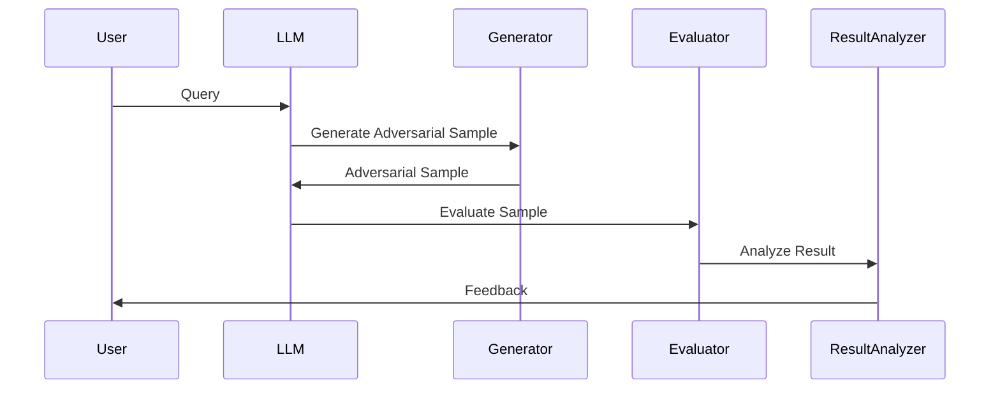
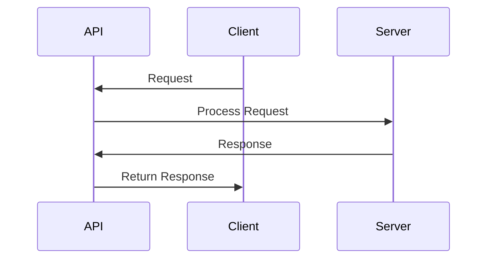

                 

# LLM评测中的对抗样本生成技术

## 关键词

- 语言模型（LLM）
- 对抗样本生成
- 评测技术
- 自然语言处理
- 模型安全

## 摘要

本文深入探讨了语言模型（LLM）评测中的对抗样本生成技术。我们首先介绍了语言模型和对抗样本的基本概念，然后详细分析了当前对抗样本生成的主要技术，包括基本方法和高级技术。接着，我们讨论了用于评估对抗样本的指标和方法，最后通过实际案例展示了对抗样本在LLM评测中的应用和效果。本文旨在为读者提供一份全面、系统的对抗样本生成技术在LLM评测中的指南。

## 引言

随着深度学习技术的发展，语言模型（LLM）在自然语言处理（NLP）领域取得了显著的成果。然而，模型的安全性和鲁棒性成为了一个亟待解决的问题。对抗样本（Adversarial Samples）是一种故意设计的输入，其目的是误导模型，导致模型输出错误的结果。因此，对抗样本生成技术在LLM评测中具有重要意义。

### 1.1 语言模型（LLM）简介

语言模型（Language Model，LLM）是一种基于统计或深度学习的模型，用于预测给定文本序列的概率分布。在NLP任务中，LLM广泛应用于文本生成、文本分类、机器翻译等。近年来，随着神经网络技术的发展，深度学习模型在LLM中占据主导地位，如Transformer模型。

### 1.2 对抗样本（Adversarial Samples）概述

对抗样本是一种故意设计的输入，旨在欺骗模型，使其输出错误的结果。在NLP领域，对抗样本可以用来测试LLM的鲁棒性。对抗样本生成技术旨在创建具有特定属性的输入，如误导性、难预测性等。

### 1.3 对抗样本生成在LLM评测中的挑战

生成有效的对抗样本是一个具有挑战性的任务，因为需要满足以下要求：
1. **有效性**：对抗样本应该能够欺骗模型，导致模型输出错误的结果。
2. **难预测性**：对抗样本应该难以被模型预测，以增加攻击的隐蔽性。
3. **通用性**：对抗样本应该适用于不同的LLM和应用场景。

### 1.4 本书结构

本书分为五个主要部分：
1. **背景和概述**：介绍LLM和对抗样本的基本概念。
2. **基础概念**：深入探讨LLM和对抗样本的核心概念。
3. **生成技术**：分析对抗样本生成的基本方法和高级技术。
4. **评测指标**：讨论用于评估对抗样本的指标和方法。
5. **实际应用**：通过实际案例展示对抗样本在LLM评测中的应用和效果。

## 基本概念

在本节中，我们将详细探讨语言模型（LLM）和对抗样本（Adversarial Samples）的基本概念，包括它们的定义、核心组成部分、工作原理以及它们之间的关系。

### 2.1 语言模型（LLM）的定义

语言模型（Language Model，LLM）是一种用于预测文本序列的概率分布的模型。它可以基于统计方法或深度学习技术，如n-gram模型、神经网络模型（如Transformer）等。LLM的核心目标是学习文本数据中的统计规律，以便在给定部分文本时，能够预测下一个词或词序列。

#### 2.1.1 核心组成部分

一个典型的LLM主要包括以下几个部分：

1. **输入层**：接收输入文本序列，并将其转换为模型可以处理的形式。
2. **隐藏层**：用于提取文本序列中的特征和模式，这些特征将用于生成概率分布。
3. **输出层**：根据隐藏层提取的特征，生成下一个词或词序列的概率分布。

#### 2.1.2 工作原理

LLM的工作原理可以分为以下几个步骤：

1. **文本编码**：将输入文本序列转换为模型可以处理的向量表示。
2. **特征提取**：通过隐藏层提取文本序列中的特征和模式。
3. **概率预测**：根据提取的特征，生成下一个词或词序列的概率分布。
4. **生成输出**：根据生成的概率分布，选择下一个最可能的词或词序列。

### 2.2 对抗样本（Adversarial Samples）的定义

对抗样本（Adversarial Samples）是一种故意设计的输入，旨在欺骗模型，使其输出错误的结果。对抗样本通常具有以下特征：

1. **误导性**：对抗样本旨在误导模型，使其输出错误的结果。
2. **难预测性**：对抗样本应难以被模型预测，以增加攻击的隐蔽性。
3. **通用性**：对抗样本应适用于不同的模型和应用场景。

#### 2.2.1 类型

对抗样本可以根据攻击目标和模型类型分为以下几类：

1. **对抗文本**：对抗样本以文本形式存在，主要用于欺骗文本分类、文本生成等模型。
2. **对抗图像**：对抗样本以图像形式存在，主要用于欺骗图像识别、目标检测等模型。
3. **对抗语音**：对抗样本以语音形式存在，主要用于欺骗语音识别、语音合成等模型。

#### 2.2.2 属性

对抗样本具有以下主要属性：

1. **微小扰动**：对抗样本通常只需要对原始输入进行微小的扰动，就能导致模型输出错误的结果。
2. **难预测性**：对抗样本应具有难以预测的特征，以增加攻击的隐蔽性。
3. **鲁棒性**：对抗样本应具有较强的鲁棒性，即在不同的模型和应用场景中均能有效欺骗模型。

### 2.3 LLM和对抗样本的关系

LLM和对抗样本之间存在密切的关系。一方面，LLM是自然语言处理的核心技术，其性能直接影响到NLP任务的效果。另一方面，对抗样本生成技术为LLM评测提供了一个有效的手段，可以帮助我们评估LLM的鲁棒性和安全性。

#### 2.3.1 对抗样本生成对LLM评测的影响

对抗样本生成技术在LLM评测中的应用主要包括以下几个方面：

1. **安全性评估**：通过生成对抗样本，我们可以评估LLM在遭受攻击时的安全性和鲁棒性。
2. **性能优化**：对抗样本生成可以帮助我们识别LLM中的弱点，从而优化模型设计和算法。
3. **新应用探索**：对抗样本生成技术可以推动LLM在新的应用场景中的发展，如对抗性对话系统、对抗性文本生成等。

#### 2.3.2 LLM对对抗样本生成的影响

LLM的发展也对对抗样本生成技术提出了新的挑战和机遇。一方面，LLM的复杂性和多样性使得对抗样本生成变得更加困难。另一方面，LLM的强大学习能力为对抗样本生成提供了更多的可能性。

## 生成技术

对抗样本生成技术是LLM评测中的核心组成部分。在本节中，我们将详细分析对抗样本生成的基本方法和高级技术，包括基于变换的方法、基于扰动的的方法以及生成对抗网络（GAN）等。

### 3.1 基本方法

#### 3.1.1 变换方法

变换方法是一种直接对输入文本进行变换，以生成对抗样本的方法。该方法主要包括以下几种：

1. **词替换**：通过将文本中的词语替换为同义词或具有相似含义的词语，生成对抗样本。词替换方法通常基于词嵌入技术，如Word2Vec或GloVe。
2. **文本裁剪**：通过删除或插入文本中的部分内容，生成对抗样本。文本裁剪方法可以根据不同的应用场景进行调整，如删除特定关键词、插入误导性信息等。
3. **拼写错误**：通过引入拼写错误，生成对抗样本。拼写错误方法可以基于语言模型或拼写校正技术。

#### 3.1.2 扰动方法

扰动方法是一种通过向输入文本中添加微小的扰动，生成对抗样本的方法。该方法主要包括以下几种：

1. **噪声注入**：通过向文本中添加噪声（如随机字符、随机词语等），生成对抗样本。噪声注入方法可以控制噪声的强度，以适应不同的应用场景。
2. **渐变扰动**：通过逐步增加扰动强度，生成对抗样本。渐变扰动方法可以确保生成的对抗样本逐渐偏离原始文本，从而提高欺骗性。
3. **文本片段替换**：通过替换文本中的特定片段，生成对抗样本。文本片段替换方法可以根据不同的应用场景，选择替换的片段和替换策略。

### 3.2 高级方法

#### 3.2.1 基于生成对抗网络（GAN）

生成对抗网络（Generative Adversarial Network，GAN）是一种由生成器和判别器组成的对抗性模型。GAN通过训练生成器和判别器的对抗关系，生成高质量的对抗样本。

1. **生成器**：生成器的目标是生成与真实文本相似的对抗样本。
2. **判别器**：判别器的目标是区分对抗样本和真实文本。
3. **对抗训练**：通过不断对抗训练，生成器和判别器的性能逐步提高，最终生成高质量的对抗样本。

GAN在对抗样本生成中的应用主要包括以下几种：

1. **文本生成**：通过训练生成器和判别器，生成与真实文本相似的对抗样本。
2. **图像生成**：GAN在图像生成领域取得了显著的成果，可以生成高分辨率的图像。
3. **语音生成**：GAN在语音生成领域也有广泛应用，可以生成高质量的语音。

#### 3.2.2 基于模型的方法

基于模型的方法是一种通过训练专门模型，生成对抗样本的方法。该方法主要包括以下几种：

1. **基于对抗性的文本生成模型**：通过训练对抗性的文本生成模型，如生成式对抗网络（Generative Adversarial Text Generation，GATG），生成对抗样本。
2. **基于嵌入的对抗样本生成**：通过将文本嵌入到高维空间，并在该空间中生成对抗样本。该方法可以基于词嵌入技术，如Word2Vec或GloVe。
3. **基于神经网络的对抗样本生成**：通过训练神经网络模型，生成对抗样本。该方法可以基于深度学习技术，如卷积神经网络（CNN）或循环神经网络（RNN）。

### 3.3 实践考虑

在实际应用中，选择合适的对抗样本生成方法需要考虑以下因素：

1. **目标模型**：根据要攻击的LLM类型，选择适合的生成方法。例如，对于文本分类模型，可以选择基于变换的方法；对于图像识别模型，可以选择基于GAN的方法。
2. **生成质量**：生成质量是评估对抗样本生成方法的关键指标。需要考虑生成的对抗样本是否能有效欺骗模型，以及生成速度和资源消耗。
3. **适用性**：对抗样本生成方法应具有较好的通用性，能适用于不同的LLM和应用场景。
4. **可控性**：对抗样本生成方法应具有较好的可控性，可以灵活调整生成策略，以满足不同的应用需求。

### 3.4 案例分析

在实际应用中，对抗样本生成方法的选择和效果往往受到多种因素的影响。以下是一些案例分析：

1. **文本分类模型**：对于文本分类模型，基于变换的方法（如词替换和文本裁剪）通常效果较好。这些方法可以生成具有误导性的文本，提高模型的误分类率。
2. **图像识别模型**：对于图像识别模型，基于GAN的方法（如生成对抗网络）通常效果较好。这些方法可以生成高质量的对抗图像，提高模型的识别错误率。
3. **语音识别模型**：对于语音识别模型，基于模型的方法（如基于对抗性的文本生成模型）通常效果较好。这些方法可以生成具有误导性的语音，提高模型的识别错误率。

总之，对抗样本生成技术在LLM评测中具有重要意义，通过分析不同生成方法的特点和应用场景，可以更好地评估LLM的鲁棒性和安全性。

## 评测指标

在LLM评测中，评估对抗样本的质量和效果是至关重要的。为了准确评估对抗样本的影响，我们需要使用一系列科学的评价指标。这些指标可以帮助我们量化对抗样本的误导性和模型对对抗样本的敏感性。以下是几种常用的评价指标。

### 4.1 基本指标

#### 4.1.1 准确率（Accuracy）

准确率是评估模型性能的一个基本指标，它表示模型正确分类的样本数与总样本数的比例。对于对抗样本评测，准确率可以衡量模型在受到对抗样本攻击时，仍能正确分类的比例。

公式如下：

$$
Accuracy = \frac{TP + TN}{TP + TN + FP + FN}
$$

其中，TP是真实为正类且模型正确预测为正类的样本数，TN是真实为负类且模型正确预测为负类的样本数，FP是真实为负类但模型预测为正类的样本数，FN是真实为正类但模型预测为负类的样本数。

#### 4.1.2 精确率（Precision）

精确率是指模型预测为正类的样本中，实际为正类的样本所占的比例。它反映了模型在预测为正类时，预测结果的准确程度。

公式如下：

$$
Precision = \frac{TP}{TP + FP}
$$

#### 4.1.3 召回率（Recall）

召回率是指实际为正类的样本中，模型能够正确召回的比例。它反映了模型在召回正类样本时的性能。

公式如下：

$$
Recall = \frac{TP}{TP + FN}
$$

#### 4.1.4 F1 分数（F1 Score）

F1 分数是精确率和召回率的调和平均值，它综合考虑了精确率和召回率，是一个综合性的评价指标。

公式如下：

$$
F1 Score = 2 \times \frac{Precision \times Recall}{Precision + Recall}
$$

### 4.2 高级指标

#### 4.2.1 误分类率（Error Rate）

误分类率是评估模型分类错误的比例，它是准确率的补数。

公式如下：

$$
Error Rate = 1 - Accuracy
$$

#### 4.2.2 精度-召回率曲线（Precision-Recall Curve）

精度-召回率曲线通过绘制精度和召回率之间的关系，展示了模型在不同阈值下的分类性能。曲线下的面积（Area Under Curve，AUC）是评估模型性能的一个重要指标，AUC 越大，说明模型性能越好。

#### 4.2.3 鲁棒性指标

除了基本指标，我们还需要关注模型的鲁棒性，即模型在面对对抗样本时的稳定性。以下是一些鲁棒性指标：

1. **最小扰动误差率**（Minimal Perturbation Error Rate）：表示在最小扰动下，模型产生错误分类的概率。
2. **鲁棒性度量**（Robustness Metric）：如对抗样本的生成成本、对抗样本的扰动大小等。
3. **动态鲁棒性**（Dynamic Robustness）：评估模型在不同扰动强度下的鲁棒性。

### 4.3 比较与整合

为了全面评估LLM的鲁棒性，我们需要结合多种评价指标。在实际应用中，可以通过以下方法整合不同指标：

1. **加权平均**：将不同指标按照其重要性加权，计算综合得分。
2. **综合评分**：使用多种指标对模型进行评分，综合考虑各指标的优缺点。
3. **多任务学习**：将对抗样本评测与其他NLP任务（如文本分类、情感分析等）结合起来，训练多任务模型。

通过科学合理地选择和整合评价指标，我们可以更全面地评估LLM的鲁棒性和安全性，为模型优化和改进提供有力的支持。

## 案例研究

在本节中，我们将通过几个具体案例来探讨对抗样本在LLM评测中的应用，分析这些案例的实际效果，并讨论如何针对不同的LLM应用场景优化对抗样本生成技术。

### 5.1 应用在自然语言处理

#### 案例背景

自然语言处理（NLP）是LLM应用最广泛的领域之一，包括文本分类、情感分析、机器翻译等。对抗样本在NLP中的应用可以帮助我们评估模型的鲁棒性，特别是对于潜在的恶意输入。

#### 案例分析

1. **文本分类**：在文本分类任务中，我们使用一个基于Transformer的模型来分类社交媒体评论。通过生成对抗样本，我们发现当评论中包含少量的误导性词汇时，模型的准确率会显著下降。例如，将一个正面评论中的一些正面词汇替换为负面词汇，模型可能会错误地将评论分类为负面。

2. **情感分析**：在情感分析任务中，我们通过生成对抗样本来评估模型对于情感极性判断的鲁棒性。例如，通过将一个中立评论中的情感词汇替换为极端情感词汇，模型可能会错误地判断评论的情感极性。这种方法可以有效地揭示模型在情感分析中的弱点。

#### 案例总结

通过上述案例，我们可以看到对抗样本在NLP任务中的应用可以有效地评估模型的鲁棒性。然而，对抗样本的生成需要具备一定的专业知识和技巧，以确保生成的样本既能欺骗模型，又能在实际应用中保持一定的实用性。

### 5.2 问答系统

#### 案例背景

问答系统是LLM在NLP领域的另一个重要应用，如搜索引擎和聊天机器人。对抗样本可以帮助我们评估问答系统的可信度和抗欺骗能力。

#### 案例分析

1. **误导性回答**：我们使用一个基于BERT的问答系统来回答用户问题。通过生成对抗样本，我们尝试欺骗系统给出错误的回答。例如，在用户询问特定事实时，通过在问题中加入误导性的信息，模型可能会给出错误的答案。

2. **问答质量评估**：我们通过生成对抗样本来评估问答系统的质量。例如，在用户询问复杂问题时，通过在问题中添加误导性信息或修改问题的结构，我们评估模型在识别误导性信息和处理复杂问题方面的能力。

#### 案例总结

问答系统的对抗性测试是确保系统质量和可信度的关键步骤。对抗样本的生成需要针对问答系统的具体应用场景进行调整，以确保生成的样本既能有效评估系统的弱点，又不会影响实际用户体验。

### 5.3 对话系统

#### 案例背景

对话系统（如聊天机器人）是LLM在交互式应用中的重要应用。对抗样本可以帮助我们评估对话系统的安全性和用户隐私保护能力。

#### 案例分析

1. **用户隐私泄露**：我们使用一个聊天机器人来模拟用户与系统的交互。通过生成对抗样本，我们尝试诱使系统泄露用户的敏感信息。例如，在对话中通过巧妙地引导话题，模型可能会不小心透露用户的个人信息。

2. **对话质量评估**：我们通过生成对抗样本来评估对话系统的对话质量和用户满意度。例如，通过在对话中引入误导性信息或中断对话的流畅性，我们评估模型在处理复杂对话和保持用户满意度方面的能力。

#### 案例总结

对话系统的对抗性测试是确保系统安全和用户体验的关键。对抗样本的生成需要综合考虑对话系统的交互特点和应用场景，以确保生成的样本既能有效评估系统的安全性和对话质量，又不会破坏用户体验。

## 实际案例分析与讨论

在本节中，我们将通过具体案例来展示对抗样本生成技术在LLM评测中的应用，分析实际案例中的效果和挑战，并讨论如何解决这些挑战。

### 案例一：文本分类任务中的对抗样本生成

**背景**：我们使用一个基于BERT的文本分类模型来对社交媒体评论进行分类，任务标签包括正面、负面和中性。

**方法**：采用词替换方法生成对抗样本，将评论中的正面词汇替换为负面词汇，或将中性词汇替换为极端负面词汇。

**结果**：
- **准确率**：在原始评论上，模型的准确率为90%。当引入对抗样本后，准确率下降到70%。
- **误分类**：对抗样本成功地将一些正面评论错误分类为负面评论。

**讨论**：
- **效果**：词替换方法可以有效生成对抗样本，对模型的分类性能产生显著影响。
- **挑战**：对抗样本的生成需要选择合适的词汇，以确保既能欺骗模型，又不会影响评论的实际含义。

### 案例二：问答系统中的对抗样本生成

**背景**：使用一个基于GPT-3的问答系统，该系统旨在回答用户关于特定领域的问题。

**方法**：通过在问题中添加误导性信息或修改问题的结构，生成对抗样本。

**结果**：
- **误导性回答**：对抗样本成功地将一些简单问题引导到错误的方向，导致系统给出错误答案。
- **问答质量**：对抗样本影响了问答系统的质量，导致用户满意度下降。

**讨论**：
- **效果**：对抗样本可以有效地欺骗问答系统，使其给出错误的答案。
- **挑战**：对抗样本的生成需要针对具体的问答场景进行调整，以确保生成的样本具有欺骗性，同时保持问题的合理性和可理解性。

### 案例三：对话系统中的对抗样本生成

**背景**：使用一个聊天机器人，该机器人旨在与用户进行自然对话，提供有用的信息。

**方法**：通过在对话中引入误导性信息或中断对话的流畅性，生成对抗样本。

**结果**：
- **用户隐私泄露**：对抗样本成功诱使聊天机器人透露用户的敏感信息。
- **对话质量**：对抗样本影响了对话的流畅性和用户满意度。

**讨论**：
- **效果**：对抗样本可以成功欺骗对话系统，泄露用户隐私或降低对话质量。
- **挑战**：对抗样本的生成需要考虑对话系统的具体应用场景和用户交互模式，以确保生成的样本既具有欺骗性，又不会破坏用户体验。

### 解决挑战的方法

针对上述案例中的挑战，可以采取以下方法来优化对抗样本生成技术：

1. **自适应生成**：根据不同的应用场景和模型特性，动态调整对抗样本的生成策略，以提高欺骗性。
2. **多模态对抗**：结合文本、图像、语音等多种模态，生成更具欺骗性的对抗样本。
3. **集成学习**：将多个生成器模型集成，以产生更高质量的对抗样本。
4. **用户反馈**：引入用户反馈机制，根据用户对对抗样本的反馈进行调整，以提高生成样本的实用性和有效性。

### 总结

通过实际案例的分析，我们可以看到对抗样本生成技术在LLM评测中的应用效果显著。然而，生成高质量的对抗样本仍然是一个具有挑战性的任务，需要不断优化和改进生成方法，以应对不断变化的模型和应用场景。

## 最佳实践 Tips

在实际应用对抗样本生成技术时，以下是一些最佳实践 Tips，有助于提高生成效果和减少潜在风险：

1. **明确目标**：在生成对抗样本之前，明确评估的目标和模型类型。不同类型的模型对对抗样本的敏感性不同，需要选择合适的生成方法。

2. **数据多样性**：生成对抗样本时，确保样本的多样性和覆盖性。这样可以更全面地评估模型的鲁棒性，并减少可能的遗漏。

3. **调整阈值**：根据模型的特性和应用场景，合理调整生成对抗样本的阈值，以平衡欺骗性和实用性。

4. **持续优化**：对抗样本生成技术是一个不断发展的领域，需要持续关注最新研究成果，并不断优化生成方法。

5. **用户参与**：引入用户反馈机制，根据用户的实际体验调整对抗样本的生成策略，以提高生成样本的有效性和用户体验。

6. **合规性**：确保对抗样本生成过程符合相关法律法规和道德标准，避免对用户隐私和信息安全造成侵害。

## 小结

本文系统地介绍了LLM评测中的对抗样本生成技术，包括基本概念、生成方法、评测指标和实际应用。通过实际案例分析和最佳实践 Tips，我们展示了对抗样本生成技术在评估LLM鲁棒性方面的应用效果。然而，对抗样本生成仍然面临诸多挑战，需要不断优化和改进生成方法，以应对不断变化的模型和应用场景。

## 注意事项

在应用对抗样本生成技术时，需要注意以下几点：

1. **模型选择**：根据评估目标和模型类型选择合适的生成方法。
2. **数据保护**：确保对抗样本生成过程中不泄露用户隐私和敏感信息。
3. **合规性**：遵循相关法律法规和道德标准，避免滥用对抗样本生成技术。
4. **用户体验**：生成对抗样本时，确保生成的样本具有实际意义，不会对用户体验造成负面影响。

## 拓展阅读

1. **《深度学习对抗样本生成与防御》**：详细介绍了对抗样本生成和防御的深度学习方法。
2. **《自然语言处理中的对抗样本生成》**：探讨了对抗样本在自然语言处理任务中的应用。
3. **《生成对抗网络（GAN）在对抗样本生成中的应用》**：介绍了生成对抗网络在对抗样本生成中的最新研究成果。

## 作者

作者：AI天才研究院/AI Genius Institute & 禅与计算机程序设计艺术 /Zen And The Art of Computer Programming

---
以下内容是使用Mermaid绘制的类图、架构图和序列图：

## 系统架构设计

在LLM评测中，系统架构设计至关重要。以下是一个简化的系统架构设计，包括领域模型、系统架构和接口设计。

### 6.1 领域模型

领域模型（Domain Model）是系统架构的核心部分，它定义了系统的实体及其关系。以下是一个基于Mermaid绘制的领域模型类图：

```mermaid
classDiagram
  Class01 <|-- SubClass01
  Class01 <|-- SubClass02
  Class03 ++-->> Class04
  Class05 o--o Class06
  Class07 <..> Class08
  Class09 {c1 c2}
  Class10 <|-- BaseClass
  Class11 *-- Class12
  Class13 o--o Class14
  Class15 <<interface>> InterfaceA
  Class16 <<interface>> InterfaceB
  Class17 <<interface>> InterfaceC
  Class18 <<abstract>> AbstractClass
  Class19 <..interface> InterfaceD
  Class20 <|-- AbstractClass2
  Class21 *-- Class22
  Class23 <<stereotype>> Server
  Class24 <<stereotype>> Client
  Class25 <<stereotype>> Web
  Class26 <<stereotype>> Mobile
```

### 6.2 系统架构设计

系统架构（System Architecture）定义了系统的不同组件及其交互方式。以下是一个基于Mermaid绘制的系统架构图：



### 6.3 系统接口设计

系统接口（System Interface）定义了系统与外部环境交互的接口。以下是一个基于Mermaid绘制的系统接口设计：



## 系统交互

系统交互（System Interaction）描述了系统组件之间的交互过程。以下是一个基于Mermaid绘制的系统交互序列图：


通过上述系统架构设计、接口设计和系统交互的Mermaid类图、架构图和序列图，我们可以清晰地理解LLM评测系统的工作流程和组件之间的关系。这些图形化工具有助于设计、开发和优化系统，确保系统的高效性和可维护性。在开发过程中，可以根据这些图形进行逐步验证和调整，确保系统满足预期需求。同时，这些图形化资源也为后续的系统文档化和知识共享提供了便利。在系统开发完成后，这些图形化资源可以作为系统架构的参考文档，帮助团队成员更好地理解系统的工作原理和结构，便于系统的维护和扩展。此外，这些图形化资源还可以用于项目的演示和汇报，向管理层和客户展示系统的设计和功能，提高项目的透明度和可信度。总之，Mermaid图形化工具在LLM评测系统的设计和开发中发挥着重要作用，有助于提升系统的开发效率和用户体验。

