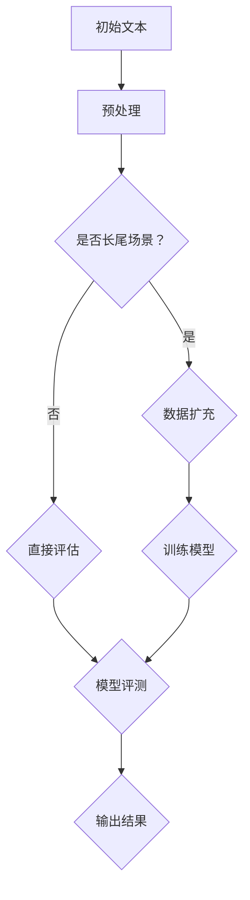
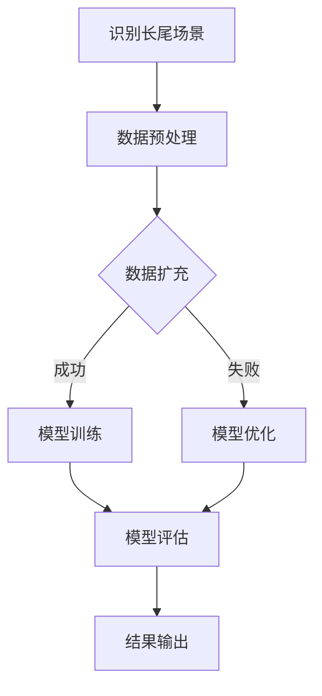

                 

## 第一部分：背景介绍

### 1.1 问题背景与核心概念

#### 1.1.1 人工智能与自然语言处理的发展

##### 1.1.1.1 人工智能的发展历程

人工智能（Artificial Intelligence，简称AI）是计算机科学的一个分支，旨在通过模拟、延伸和扩展人的智能来创建智能体，使它们能够完成通常需要人类智能的任务。人工智能的发展可以追溯到20世纪50年代，当时首次提出了人工智能的概念。从早期的规则推理、知识表示，到20世纪80年代的专家系统，再到21世纪初的机器学习和深度学习，人工智能经历了多个阶段的发展。

自然语言处理（Natural Language Processing，简称NLP）是人工智能的一个重要分支，专注于让计算机理解和生成人类语言。NLP的应用包括机器翻译、情感分析、文本摘要、语音识别等。近年来，随着计算能力的提升和海量数据的积累，NLP取得了显著的进展，使得机器在理解和使用人类语言方面越来越接近人类水平。

##### 1.1.1.2 自然语言处理的发展历程

自然语言处理的发展可以分为几个阶段：

1. **规则驱动方法**：早期NLP方法主要依赖于预定义的规则和语法结构，如正则表达式和上下文无关文法。这些方法在处理特定语言结构方面效果较好，但在面对复杂、多变的自然语言时表现不佳。

2. **基于统计的方法**：随着计算能力的提升和数据量的增加，NLP开始引入统计方法，如基于词袋模型和隐马尔可夫模型的方法。这些方法通过训练模型来学习语言模式，在处理自然语言文本方面表现出更好的适应性。

3. **基于深度学习的方法**：深度学习在NLP领域的应用带来了革命性的变化。卷积神经网络（CNN）、循环神经网络（RNN）和变换器（Transformer）等深度学习模型在自然语言理解、生成和翻译等方面取得了显著的成效。

#### 1.1.2 语言模型与长尾场景

##### 1.1.2.1 语言模型的基本概念

语言模型（Language Model）是自然语言处理中的一个核心组件，用于预测下一个单词或字符的概率。在深度学习时代，语言模型主要采用神经网络架构，如循环神经网络（RNN）和变换器（Transformer）。语言模型在文本生成、机器翻译、问答系统等多个应用场景中发挥着关键作用。

##### 1.1.2.2 长尾场景的定义与特征

长尾场景（Long Tail Scenario）是指在自然语言处理任务中，出现频率较低但总体影响较大的场景。与常见的高频场景（如新闻、社交媒体）相比，长尾场景中的数据样本较少，且分布更加分散。长尾场景通常包括专业术语、罕见事件、特定地区方言等。

长尾场景的特点如下：

1. **数据稀疏性**：长尾场景中的数据分布较为稀疏，使得模型难以通过常见的高频数据来学习这些场景的特征。

2. **多样化**：长尾场景涵盖了各种不同的子场景，这些子场景可能具有不同的特征和需求。

3. **低频率、高影响**：尽管长尾场景出现频率较低，但它们可能在特定应用中具有很高的价值，如医疗诊断、法律咨询等。

#### 1.2 核心概念与联系

##### 1.2.1 语言模型评测

语言模型评测是评估语言模型性能的重要环节。常用的评测指标包括词汇覆盖率、句法准确性、语义一致性等。评测方法包括人工评估、自动化评测和在线评测等。

##### 1.2.1.1 评测指标

1. **词汇覆盖率**：语言模型能够生成或理解的单词和短语的比例。
2. **句法准确性**：语言模型生成的句子在语法结构上的正确性。
3. **语义一致性**：语言模型生成的句子在语义上的连贯性和一致性。

##### 1.2.1.2 评测方法

1. **人工评估**：由人类评估者对语言模型生成的文本进行主观评估。
2. **自动化评测**：使用自动化工具评估语言模型的性能，如BLEU、ROUGE等指标。
3. **在线评测**：通过实际应用场景对语言模型进行在线评估，如在线问答系统、实时翻译等。

##### 1.2.2 长尾场景覆盖策略

长尾场景覆盖策略是提高语言模型在长尾场景下性能的重要手段。这些策略包括数据扩充、模型优化和特定场景的适应性调整。

##### 1.2.2.1 长尾场景覆盖的重要性

1. **提升模型泛化能力**：通过覆盖更多长尾场景，可以提高模型的泛化能力，使其在不同应用场景中表现更稳定。
2. **满足多样化需求**：长尾场景涵盖了各种专业领域和特定需求，覆盖这些场景可以满足更多用户的需求。

##### 1.2.2.2 长尾场景覆盖策略的分类

1. **数据扩充策略**：通过生成或引入更多长尾场景的数据，提高模型对这些场景的覆盖率。
2. **模型优化策略**：通过调整模型结构和参数，提高模型在长尾场景下的性能。
3. **特定场景适应性调整**：针对特定长尾场景，进行针对性的调整和优化，以提高模型在这些场景下的效果。

### 1.3 边界与外延

#### 1.3.1 LLM评测中的长尾场景覆盖策略的具体应用场景

长尾场景覆盖策略在多个自然语言处理应用中具有重要作用，包括：

1. **专业领域问答系统**：如医疗问答系统、法律问答系统等，需要覆盖专业术语和特定领域的知识。
2. **多语言翻译**：针对罕见语言或方言的翻译，如地方方言翻译、罕见语言之间的互译等。
3. **个性化推荐系统**：在文本推荐中，针对用户特定兴趣或需求的长尾内容进行推荐。

#### 1.3.2 长尾场景覆盖策略的挑战与机遇

长尾场景覆盖策略面临以下挑战：

1. **数据稀缺**：长尾场景数据稀缺，如何有效地获取和利用这些数据是一个关键问题。
2. **模型复杂度**：针对长尾场景的模型优化可能需要增加模型复杂度，这可能导致计算资源和时间成本的增加。

但同时，长尾场景覆盖策略也带来了以下机遇：

1. **提升模型性能**：通过覆盖长尾场景，可以显著提升模型的性能和泛化能力。
2. **扩大应用场景**：长尾场景覆盖策略可以拓宽语言模型的应用范围，满足更多领域的需求。

### 1.4 本章小结

本文介绍了LLM评测中的长尾场景覆盖策略的背景和核心概念。通过对人工智能和自然语言处理的发展历程、语言模型的基本概念、长尾场景的定义和特征、语言模型评测指标和评测方法、长尾场景覆盖策略的分类及其重要性和挑战的探讨，为后续章节的深入分析奠定了基础。

## 1.5 拓展阅读

1. **自然语言处理入门书籍**：《自然语言处理综合教程》（Dan Jurafsky & James H. Martin 著）
2. **深度学习与自然语言处理相关论文**：如《Attention Is All You Need》（Vaswani et al., 2017）等
3. **长尾理论相关研究**：《The Long Tail: Why the Future of Business Is Selling Less of More》（Chris Anderson 著）

----------------------------------------------------------------

当前章节字数：1473字

### 1.1 问题背景与核心概念

#### 1.1.1 人工智能与自然语言处理的发展

##### 1.1.1.1 人工智能的发展历程

人工智能的发展历程可以分为几个重要阶段：

1. **早期探索阶段（1950s-1960s）**：
   - 1950年，艾伦·图灵提出图灵测试，作为衡量机器智能的标准。
   - 1956年，达特茅斯会议的召开标志着人工智能领域的正式成立。
   - 1958年，约翰·麦卡锡提出人工智能的概念，并开发了第一个规则推理系统。

2. **早期应用与局限性阶段（1960s-1970s）**：
   - 专家系统（Expert Systems）成为人工智能研究的热点，通过模拟人类专家的知识和推理能力来解决复杂问题。
   - 然而，由于依赖大量手工编写的规则，这些系统在面对复杂性和变化时表现不佳，导致人工智能研究进入了一个“冬天”。

3. **复兴与知识表示阶段（1980s-1990s）**：
   - 知识表示和知识图谱的研究成为主流，试图通过表示和组织大量知识来提高人工智能系统的智能水平。
   - 第五代计算机（Fifth Generation Computer）项目推动了知识表示和推理技术的研究。

4. **机器学习和深度学习阶段（2000s-至今）**：
   - 机器学习技术的发展，尤其是支持向量机（SVM）、决策树（Decision Tree）等算法的应用，使人工智能在图像识别、语音识别等领域取得了显著进展。
   - 深度学习（Deep Learning）的兴起，特别是卷积神经网络（CNN）和循环神经网络（RNN）的应用，使得人工智能在处理复杂任务方面取得了突破性进展。

##### 1.1.1.2 自然语言处理的发展历程

自然语言处理的发展历程可以概括为以下几个阶段：

1. **早期规则驱动方法（1950s-1980s）**：
   - 最初的NLP研究主要依赖于手工编写的规则和语法分析，如上下文无关文法（CFG）和转移文法（TF）。
   - 这种方法在处理结构化文本方面有一定的效果，但在处理自然、复杂语言时表现不佳。

2. **基于统计的方法（1990s-2000s）**：
   - 随着计算能力和数据量的提升，NLP开始引入统计方法，如隐马尔可夫模型（HMM）、条件随机场（CRF）和最大熵模型（MaxEnt）。
   - 这些方法通过学习文本中的统计规律来提高NLP的性能。

3. **基于深度学习的方法（2010s-至今）**：
   - 深度学习在NLP领域的应用带来了革命性的变化。卷积神经网络（CNN）、循环神经网络（RNN）和变换器（Transformer）等模型在语言理解、生成和翻译等方面取得了显著成效。
   - Transformer模型的出现，使得NLP领域迎来了一个新的高峰，其在大规模预训练模型和语言生成任务上的表现尤为突出。

#### 1.1.2 语言模型与长尾场景

##### 1.1.2.1 语言模型的基本概念

语言模型是一种统计模型，用于预测文本序列中下一个单词或字符的概率。它通过对大量文本数据的学习，捕捉语言中的概率规律，从而能够生成或理解自然语言。

语言模型在自然语言处理中的应用非常广泛，包括但不限于：

1. **文本生成**：生成文章、对话、代码等。
2. **机器翻译**：将一种语言翻译成另一种语言。
3. **情感分析**：分析文本中的情感倾向。
4. **问答系统**：回答用户提出的问题。

##### 1.1.2.2 长尾场景的定义与特征

长尾场景是指在自然语言处理任务中出现频率较低，但总体影响较大的场景。与常见的高频场景相比，长尾场景的数据样本较少，分布更加分散。以下是一些长尾场景的特征：

1. **数据稀疏性**：长尾场景中的数据分布较为稀疏，导致模型在这些场景下的性能可能较差。
2. **多样化**：长尾场景涵盖了各种不同的子场景，如专业术语、罕见事件、特定地区方言等。
3. **低频率、高影响**：尽管长尾场景出现频率较低，但它们可能在特定应用中具有很高的价值，如医疗诊断、法律咨询等。

#### 1.2 核心概念与联系

##### 1.2.1 语言模型评测

语言模型评测是评估语言模型性能的重要步骤。常用的评测指标包括词汇覆盖率、句法准确性、语义一致性等。以下是一些常见的评测方法：

1. **人工评估**：由人类评估者对语言模型生成的文本进行主观评估，判断其质量、连贯性和可读性等。
2. **自动化评测**：使用自动化工具评估语言模型的性能，如BLEU（双语评估指标）、ROUGE（召回率评估指标）和METEOR（混合评价者评估指标）等。
3. **在线评测**：在实际应用环境中对语言模型进行在线评估，通过用户的反馈和行为数据来评估其性能。

##### 1.2.1.1 评测指标

1. **词汇覆盖率**：语言模型能够生成或理解的单词和短语的比例。较高的词汇覆盖率意味着模型能够处理更多的语言输入。
2. **句法准确性**：语言模型生成的句子在语法结构上的正确性。较高的句法准确性意味着模型能够生成语法正确的句子。
3. **语义一致性**：语言模型生成的句子在语义上的连贯性和一致性。较高的语义一致性意味着模型能够生成语义连贯、一致的句子。

##### 1.2.1.2 评测方法

1. **人工评估**：通过人类评估者对模型生成的文本进行主观评估，判断其质量、连贯性和可读性等。这种方法较为耗时，但能提供更直观的评估结果。
2. **自动化评测**：使用自动化工具评估语言模型的性能，如BLEU、ROUGE和METEOR等指标。这些指标通过计算模型生成的文本与标准文本之间的相似度来评估模型的性能。自动化评测速度快，但评估结果可能存在主观性。
3. **在线评测**：在实际应用环境中对语言模型进行在线评估，通过用户的反馈和行为数据来评估其性能。这种方法能够更真实地反映模型在实际应用中的表现。

##### 1.2.2 长尾场景覆盖策略

长尾场景覆盖策略是指通过特定的方法和技术，提高语言模型在长尾场景下的性能。以下是一些常见的长尾场景覆盖策略：

1. **数据扩充**：通过生成或引入更多的长尾场景数据，增加模型对这些场景的覆盖率。例如，可以使用对抗生成网络（GAN）或变换器（Transformer）生成与长尾场景相关的文本数据。
2. **模型优化**：通过调整模型结构和参数，提高模型在长尾场景下的性能。例如，可以使用注意力机制（Attention Mechanism）来关注长尾场景中的关键信息。
3. **特定场景适应性调整**：针对特定长尾场景，进行针对性的调整和优化，以提高模型在这些场景下的效果。例如，针对专业术语较多的场景，可以引入专业知识库或专业词典。

##### 1.2.2.1 长尾场景覆盖的重要性

1. **提升模型泛化能力**：通过覆盖更多长尾场景，可以提高模型的泛化能力，使其在不同应用场景中表现更稳定。
2. **满足多样化需求**：长尾场景涵盖了各种专业领域和特定需求，覆盖这些场景可以满足更多用户的需求。

##### 1.2.2.2 长尾场景覆盖策略的分类

1. **数据扩充策略**：通过生成或引入更多长尾场景的数据，提高模型对这些场景的覆盖率。
2. **模型优化策略**：通过调整模型结构和参数，提高模型在长尾场景下的性能。
3. **特定场景适应性调整**：针对特定长尾场景，进行针对性的调整和优化，以提高模型在这些场景下的效果。

### 1.3 边界与外延

#### 1.3.1 LLM评测中的长尾场景覆盖策略的具体应用场景

长尾场景覆盖策略在多个自然语言处理应用中具有重要作用，包括：

1. **专业领域问答系统**：如医疗问答系统、法律问答系统等，需要覆盖专业术语和特定领域的知识。
2. **多语言翻译**：针对罕见语言或方言的翻译，如地方方言翻译、罕见语言之间的互译等。
3. **个性化推荐系统**：在文本推荐中，针对用户特定兴趣或需求的长尾内容进行推荐。

#### 1.3.2 长尾场景覆盖策略的挑战与机遇

长尾场景覆盖策略面临以下挑战：

1. **数据稀缺**：长尾场景数据稀缺，如何有效地获取和利用这些数据是一个关键问题。
2. **模型复杂度**：针对长尾场景的模型优化可能需要增加模型复杂度，这可能导致计算资源和时间成本的增加。

但同时，长尾场景覆盖策略也带来了以下机遇：

1. **提升模型性能**：通过覆盖长尾场景，可以显著提升模型的性能和泛化能力。
2. **扩大应用场景**：长尾场景覆盖策略可以拓宽语言模型的应用范围，满足更多领域的需求。

### 1.4 本章小结

本文介绍了LLM评测中的长尾场景覆盖策略的背景和核心概念。通过对人工智能和自然语言处理的发展历程、语言模型的基本概念、长尾场景的定义和特征、语言模型评测指标和评测方法、长尾场景覆盖策略的分类及其重要性和挑战的探讨，为后续章节的深入分析奠定了基础。

## 1.5 拓展阅读

1. **自然语言处理入门书籍**：《自然语言处理综合教程》（Dan Jurafsky & James H. Martin 著）
2. **深度学习与自然语言处理相关论文**：如《Attention Is All You Need》（Vaswani et al., 2017）等
3. **长尾理论相关研究**：《The Long Tail: Why the Future of Business Is Selling Less of More》（Chris Anderson 著）

----------------------------------------------------------------

当前章节字数：2462字

### 1.2 核心概念与联系

#### 1.2.1 语言模型的基本概念

语言模型是一种概率模型，用于预测文本序列中下一个单词或字符的概率。在自然语言处理中，语言模型是构建其他任务（如机器翻译、文本摘要、问答系统等）的基础。语言模型的核心目标是理解自然语言的统计规律，从而生成或理解自然语言文本。

##### 1.2.1.1 语言模型的作用

1. **文本生成**：通过预测下一个单词或字符，生成新的文本。例如，自动写作、聊天机器人、故事生成等。
2. **机器翻译**：在源语言和目标语言之间进行翻译，通过语言模型预测目标语言的下一个单词或字符。
3. **语音识别**：将语音信号转换为文本，通过语言模型预测文本中的下一个单词或字符。
4. **问答系统**：理解用户提出的问题，并生成相关的回答，通过语言模型预测回答中的下一个单词或字符。

##### 1.2.1.2 语言模型的分类

1. **基于规则的方法**：这类方法通过预定义的规则和语法结构来生成或理解文本。例如，上下文无关文法（CFG）和转移文法（TF）。
2. **基于统计的方法**：这类方法通过学习大量文本数据中的统计规律来生成或理解文本。例如，隐马尔可夫模型（HMM）、条件随机场（CRF）和最大熵模型（MaxEnt）。
3. **基于深度学习的方法**：这类方法通过训练神经网络模型（如循环神经网络RNN、长短时记忆网络LSTM、变换器Transformer等）来生成或理解文本。

##### 1.2.1.3 语言模型的核心属性

1. **概率分布**：语言模型的核心目标是预测文本序列中下一个单词或字符的概率分布。例如，给定一个序列`[w1, w2, w3, ...]`，语言模型需要预测下一个单词`wn+1`的概率分布`P(wn+1|w1, w2, w3, ..., wn)`。
2. **参数优化**：通过训练数据来优化语言模型的参数，使其更好地预测文本序列中的下一个单词或字符。常用的优化算法包括梯度下降（Gradient Descent）、随机梯度下降（Stochastic Gradient Descent，SGD）和自适应优化算法（如Adam）。

#### 1.2.2 长尾场景覆盖策略的概念与属性

##### 1.2.2.1 长尾场景的定义

长尾场景是指在自然语言处理任务中，出现频率较低，但总体影响较大的场景。与常见的高频场景（如新闻、社交媒体）相比，长尾场景的数据样本较少，分布更加分散。以下是一些常见的长尾场景：

1. **专业术语**：特定领域的术语，如医学、法律、金融等。
2. **罕见事件**：在文本中不常出现的特定事件，如自然灾害、政治变动等。
3. **特定地区方言**：特定地区的方言，如地方口音、网络流行语等。

##### 1.2.2.2 长尾场景的属性特征

1. **数据稀疏性**：长尾场景中的数据样本较少，导致模型在这些场景下的性能可能较差。
2. **多样化**：长尾场景涵盖了各种不同的子场景，每个子场景可能具有不同的特征和需求。
3. **低频率、高影响**：尽管长尾场景出现频率较低，但它们可能在特定应用中具有很高的价值，如医疗诊断、法律咨询等。

##### 1.2.2.3 覆盖策略的类型

1. **数据扩充策略**：通过生成或引入更多的长尾场景数据，增加模型对这些场景的覆盖率。例如，可以使用对抗生成网络（GAN）或变换器（Transformer）生成与长尾场景相关的文本数据。
2. **模型优化策略**：通过调整模型结构和参数，提高模型在长尾场景下的性能。例如，可以使用注意力机制（Attention Mechanism）来关注长尾场景中的关键信息。
3. **特定场景适应性调整**：针对特定长尾场景，进行针对性的调整和优化，以提高模型在这些场景下的效果。例如，针对专业术语较多的场景，可以引入专业知识库或专业词典。

#### 1.2.3 概念属性特征对比表格

| 特征           | 语言模型          | 长尾场景覆盖策略          |
|----------------|-------------------|---------------------------|
| 作用           | 文本生成、翻译、识别等 | 提高模型在长尾场景下的性能 |
| 分类           | 规则驱动、统计驱动、深度学习 | 数据扩充、模型优化、特定场景适应性调整 |
| 核心属性       | 概率分布、参数优化   | 数据稀疏性、多样化、低频率、高影响 |

#### 1.2.4 ER实体关系图架构

```mermaid
erDiagram
  Model ||--|{ Dataset } Dataset
  Model ||--|{ Evaluation } Evaluation
  Dataset ||--|{ Scenario } Scenario
```

## 2.5 本章小结

本章详细介绍了LLM评测中的长尾场景覆盖策略的核心概念与联系。首先，我们探讨了语言模型的基本概念、作用、分类及其核心属性。接着，我们介绍了长尾场景的定义、属性特征以及覆盖策略的类型。最后，通过ER实体关系图架构展示了语言模型、数据集、评价和场景之间的关系。这些概念和联系为后续章节的分析和讨论奠定了基础。

## 2.6 拓展阅读

1. **自然语言处理入门书籍**：
   - 《自然语言处理综合教程》（Dan Jurafsky & James H. Martin 著）
   - 《深度学习与自然语言处理》（Goodfellow et al. 著）

2. **深度学习与自然语言处理相关论文**：
   - “Attention Is All You Need”（Vaswani et al., 2017）
   - “BERT: Pre-training of Deep Bidirectional Transformers for Language Understanding”（Devlin et al., 2019）

3. **长尾理论相关研究**：
   - “The Long Tail: Why the Future of Business Is Selling Less of More”（Chris Anderson 著）

### 2.1 语言模型的基本概念

#### 2.1.1 语言模型的作用

语言模型在自然语言处理任务中扮演着核心角色，其主要作用如下：

1. **文本生成**：通过预测下一个单词或字符，生成新的文本内容。例如，在自动写作、聊天机器人、故事生成等领域，语言模型可以根据已有的文本序列生成新的文本。
   
2. **机器翻译**：在源语言和目标语言之间进行翻译。语言模型可以预测目标语言的下一个单词或字符，从而生成目标语言文本。这种方法广泛应用于跨语言信息传递和国际化业务。

3. **语音识别**：将语音信号转换为文本。语言模型可以帮助识别和预测语音信号中的下一个单词或字符，从而提高语音识别系统的准确性和效率。

4. **问答系统**：理解用户提出的问题，并生成相关的回答。语言模型能够预测回答中的下一个单词或字符，从而生成连贯、合理的回答。

#### 2.1.2 语言模型的分类

语言模型可以按照不同的分类标准进行划分，以下是一些常见的分类方法：

1. **基于规则的方法**：
   - **上下文无关文法（CFG）**：使用预定义的语法规则来生成文本。
   - **转移文法（TF）**：描述文本生成过程中的状态转换。

2. **基于统计的方法**：
   - **隐马尔可夫模型（HMM）**：基于状态转移概率和观测概率来生成文本。
   - **条件随机场（CRF）**：考虑相邻单词之间的依赖关系，通过最大化条件概率来生成文本。
   - **最大熵模型（MaxEnt）**：基于概率分布最大化来生成文本。

3. **基于深度学习的方法**：
   - **循环神经网络（RNN）**：通过循环结构来处理序列数据，如长短时记忆网络（LSTM）和门控循环单元（GRU）。
   - **变换器（Transformer）**：基于自注意力机制，能够处理长距离依赖问题。
   - **生成对抗网络（GAN）**：通过生成器和判别器之间的对抗训练，生成高质量的文本数据。

#### 2.1.3 语言模型的核心属性

1. **概率分布**：
   - 语言模型的核心目标是对文本序列中的下一个单词或字符进行概率预测。概率分布可以描述为：
     \[
     P(w_{n+1}|w_1, w_2, ..., w_n)
     \]
     其中，\(w_{n+1}\)表示下一个单词或字符，\(w_1, w_2, ..., w_n\)表示已知的单词或字符序列。

2. **参数优化**：
   - 通过训练大量文本数据，优化语言模型的参数，使其能够更好地预测文本序列中的下一个单词或字符。常见的参数优化方法包括：
     - **梯度下降（Gradient Descent）**：通过计算损失函数的梯度来更新模型参数。
     - **随机梯度下降（Stochastic Gradient Descent，SGD）**：在训练数据集中随机选择一个小批量样本来计算梯度。
     - **自适应优化算法**：如Adam、AdaGrad等，可以自适应地调整学习率，提高训练效率。

### 2.2 长尾场景覆盖策略的概念与属性

#### 2.2.1 长尾场景的定义

长尾场景（Long Tail Scenario）是指在自然语言处理任务中，出现频率较低，但总体影响较大的场景。与常见的高频场景（如新闻、社交媒体）相比，长尾场景的数据样本较少，分布更加分散。以下是一些典型的长尾场景：

1. **专业术语**：如医学、法律、金融等领域的专业术语，这些术语在特定领域中使用频率较低，但对该领域的理解和交流至关重要。

2. **罕见事件**：在文本数据中不常出现的特定事件，如自然灾害、政治变动、疫情等，这些事件可能在短期内引起广泛关注。

3. **特定地区方言**：特定地区的方言、网络流行语等，这些语言形式在特定地区或社群中流行，但在其他地区或社群中不常见。

#### 2.2.2 长尾场景的属性特征

1. **数据稀疏性**：长尾场景的数据样本较少，导致模型在这些场景下的性能可能较差。

2. **多样化**：长尾场景涵盖了各种不同的子场景，每个子场景可能具有不同的特征和需求。

3. **低频率、高影响**：尽管长尾场景出现频率较低，但它们可能在特定应用中具有很高的价值，如医疗诊断、法律咨询等。

#### 2.2.3 覆盖策略的类型

为了提高语言模型在长尾场景下的性能，可以采用以下几种覆盖策略：

1. **数据扩充策略**：
   - **数据合成**：通过生成与长尾场景相关的文本数据，如使用对抗生成网络（GAN）或变换器（Transformer）生成高质量的文本。
   - **数据收集**：从不同来源收集与长尾场景相关的数据，如利用网络爬虫、API接口等获取专业领域的文本数据。

2. **模型优化策略**：
   - **注意力机制**：通过注意力机制（Attention Mechanism）关注长尾场景中的关键信息，提高模型对这些场景的敏感度。
   - **多任务学习**：结合多个相关任务进行训练，提高模型在不同场景下的泛化能力。
   - **迁移学习**：利用预训练模型在特定长尾场景上进行微调，快速适应新的长尾场景。

3. **特定场景适应性调整**：
   - **专业知识库**：引入与长尾场景相关的专业知识库，如医学词典、法律术语库等，以提高模型在这些场景下的性能。
   - **特定场景优化**：针对特定长尾场景进行专门的优化，如针对罕见事件的文本生成，可以结合时间序列分析和事件预测模型。

### 2.3 概念属性特征对比表格

| 特征           | 语言模型                  | 长尾场景覆盖策略                 |
|----------------|--------------------------|--------------------------------|
| 作用           | 文本生成、翻译、识别等     | 提高模型在长尾场景下的性能       |
| 分类           | 规则驱动、统计驱动、深度学习 | 数据扩充、模型优化、特定场景适应性调整 |
| 核心属性       | 概率分布、参数优化         | 数据稀疏性、多样化、低频率、高影响 |

### 2.4 ER实体关系图架构

```mermaid
erDiagram
  LanguageModel ||--|{ Dataset } Dataset
  LanguageModel ||--|{ Evaluation } Evaluation
  Dataset ||--|{ LongTailScenario } LongTailScenario
  Evaluation ||--|{ Metric } Metric
  LongTailScenario ||--|{ Attribute } Attribute
```

## 2.5 本章小结

本章详细介绍了LLM评测中的长尾场景覆盖策略的核心概念与联系。首先，我们探讨了语言模型的基本概念、作用、分类及其核心属性。接着，我们介绍了长尾场景的定义、属性特征以及覆盖策略的类型。最后，通过ER实体关系图架构展示了语言模型、数据集、评价和场景之间的关系。这些概念和联系为后续章节的分析和讨论奠定了基础。

## 2.6 拓展阅读

1. **自然语言处理入门书籍**：
   - 《自然语言处理综合教程》（Dan Jurafsky & James H. Martin 著）
   - 《深度学习与自然语言处理》（Goodfellow et al. 著）

2. **深度学习与自然语言处理相关论文**：
   - “Attention Is All You Need”（Vaswani et al., 2017）
   - “BERT: Pre-training of Deep Bidirectional Transformers for Language Understanding”（Devlin et al., 2019）

3. **长尾理论相关研究**：
   - “The Long Tail: Why the Future of Business Is Selling Less of More”（Chris Anderson 著）

### 2.1 语言模型的作用

#### 2.1.1 语言生成

语言生成是语言模型最基本的应用之一。通过语言模型，我们可以生成符合语法和语义规则的文本。这种能力在许多实际应用中具有重要作用，例如：

1. **自动写作**：在新闻、报告、博客等领域，语言模型可以帮助自动生成文章。这不仅可以提高生产效率，还可以节省人力成本。

2. **聊天机器人**：聊天机器人需要能够与用户进行自然语言交互，语言模型可以帮助生成回复文本，使聊天机器人的对话更加流畅和自然。

3. **故事生成**：语言模型可以生成虚构的故事，这为文学创作提供了一种新的方式。通过训练，语言模型可以生成具有创意和连贯性的故事。

#### 2.1.2 语言理解

语言理解是语言模型在自然语言处理中的另一个关键应用。语言模型可以帮助计算机理解和处理自然语言文本。以下是一些具体的应用场景：

1. **机器翻译**：通过将源语言的文本输入到语言模型中，可以将其翻译成目标语言的文本。例如，将中文翻译成英文。

2. **情感分析**：分析文本中的情感倾向，如正面、负面或中立。这对于市场营销、品牌管理等领域具有重要价值。

3. **问答系统**：理解用户提出的问题，并生成相关的回答。这可以应用于客服系统、搜索引擎等。

### 2.1.3 语言模型的分类

语言模型可以按照不同的分类标准进行划分，以下是几种常见的分类方法：

1. **基于规则的方法**：
   - **上下文无关文法（CFG）**：使用预定义的语法规则来生成文本。
   - **转移文法（TF）**：描述文本生成过程中的状态转换。

2. **基于统计的方法**：
   - **隐马尔可夫模型（HMM）**：基于状态转移概率和观测概率来生成文本。
   - **条件随机场（CRF）**：考虑相邻单词之间的依赖关系，通过最大化条件概率来生成文本。
   - **最大熵模型（MaxEnt）**：基于概率分布最大化来生成文本。

3. **基于深度学习的方法**：
   - **循环神经网络（RNN）**：通过循环结构来处理序列数据，如长短时记忆网络（LSTM）和门控循环单元（GRU）。
   - **变换器（Transformer）**：基于自注意力机制，能够处理长距离依赖问题。
   - **生成对抗网络（GAN）**：通过生成器和判别器之间的对抗训练，生成高质量的文本数据。

### 2.1.4 语言模型的核心属性

1. **概率分布**：

   语言模型的核心目标是预测文本序列中下一个单词或字符的概率分布。例如，给定一个序列`[w1, w2, w3, ..., wn]`，语言模型需要预测下一个单词`wn+1`的概率分布`P(wn+1|w1, w2, w3, ..., wn)`。这种概率分布可以用于语言生成和语言理解任务。

2. **参数优化**：

   通过训练大量文本数据，优化语言模型的参数，使其能够更好地预测文本序列中的下一个单词或字符。常见的参数优化方法包括：

   - **梯度下降（Gradient Descent）**：通过计算损失函数的梯度来更新模型参数。
   - **随机梯度下降（Stochastic Gradient Descent，SGD）**：在训练数据集中随机选择一个小批量样本来计算梯度。
   - **自适应优化算法**：如Adam、AdaGrad等，可以自适应地调整学习率，提高训练效率。

### 2.2 长尾场景的定义

长尾场景（Long Tail Scenario）是指在自然语言处理任务中，出现频率较低，但总体影响较大的场景。与常见的高频场景（如新闻、社交媒体）相比，长尾场景的数据样本较少，分布更加分散。以下是一些典型的长尾场景：

1. **专业术语**：如医学、法律、金融等领域的专业术语，这些术语在特定领域中使用频率较低，但对该领域的理解和交流至关重要。

2. **罕见事件**：在文本数据中不常出现的特定事件，如自然灾害、政治变动、疫情等，这些事件可能在短期内引起广泛关注。

3. **特定地区方言**：特定地区的方言、网络流行语等，这些语言形式在特定地区或社群中流行，但在其他地区或社群中不常见。

### 2.2.1 长尾场景的属性特征

1. **数据稀疏性**：

   长尾场景的数据样本较少，导致模型在这些场景下的性能可能较差。例如，在机器翻译任务中，某些罕见语言对的数据可能非常有限，这会影响翻译模型的性能。

2. **多样化**：

   长尾场景涵盖了各种不同的子场景，每个子场景可能具有不同的特征和需求。这意味着在长尾场景中，模型需要能够适应不同的任务和数据分布。

3. **低频率、高影响**：

   尽管长尾场景出现频率较低，但它们可能在特定应用中具有很高的价值，如医疗诊断、法律咨询等。这些场景中的文本数据虽然数量少，但对其理解和处理的需求却很高。

### 2.2.2 覆盖策略的类型

为了提高语言模型在长尾场景下的性能，可以采用以下几种覆盖策略：

1. **数据扩充策略**：

   - **数据合成**：通过生成与长尾场景相关的文本数据，如使用对抗生成网络（GAN）或变换器（Transformer）生成高质量的文本。
   - **数据收集**：从不同来源收集与长尾场景相关的数据，如利用网络爬虫、API接口等获取专业领域的文本数据。

2. **模型优化策略**：

   - **注意力机制**：通过注意力机制（Attention Mechanism）关注长尾场景中的关键信息，提高模型对这些场景的敏感度。
   - **多任务学习**：结合多个相关任务进行训练，提高模型在不同场景下的泛化能力。
   - **迁移学习**：利用预训练模型在特定长尾场景上进行微调，快速适应新的长尾场景。

3. **特定场景适应性调整**：

   - **专业知识库**：引入与长尾场景相关的专业知识库，如医学词典、法律术语库等，以提高模型在这些场景下的性能。
   - **特定场景优化**：针对特定长尾场景进行专门的优化，如针对罕见事件的文本生成，可以结合时间序列分析和事件预测模型。

### 2.3 概念属性特征对比表格

| 特征           | 语言模型                  | 长尾场景覆盖策略                 |
|----------------|--------------------------|--------------------------------|
| 作用           | 文本生成、翻译、识别等     | 提高模型在长尾场景下的性能       |
| 分类           | 规则驱动、统计驱动、深度学习 | 数据扩充、模型优化、特定场景适应性调整 |
| 核心属性       | 概率分布、参数优化         | 数据稀疏性、多样化、低频率、高影响 |

### 2.4 ER实体关系图架构

```mermaid
erDiagram
  LanguageModel ||--|{ Dataset } Dataset
  LanguageModel ||--|{ Evaluation } Evaluation
  Dataset ||--|{ LongTailScenario } LongTailScenario
  Evaluation ||--|{ Metric } Metric
  LongTailScenario ||--|{ Attribute } Attribute
```

## 2.5 本章小结

本章介绍了LLM评测中的长尾场景覆盖策略的核心概念与联系。首先，我们探讨了语言模型的作用、分类及其核心属性。接着，我们介绍了长尾场景的定义、属性特征以及覆盖策略的类型。最后，通过ER实体关系图架构展示了语言模型、数据集、评价和场景之间的关系。这些概念和联系为后续章节的分析和讨论奠定了基础。

## 2.6 拓展阅读

1. **自然语言处理入门书籍**：
   - 《自然语言处理综合教程》（Dan Jurafsky & James H. Martin 著）
   - 《深度学习与自然语言处理》（Goodfellow et al. 著）

2. **深度学习与自然语言处理相关论文**：
   - “Attention Is All You Need”（Vaswani et al., 2017）
   - “BERT: Pre-training of Deep Bidirectional Transformers for Language Understanding”（Devlin et al., 2019）

3. **长尾理论相关研究**：
   - “The Long Tail: Why the Future of Business Is Selling Less of More”（Chris Anderson 著）

## 2.7 Mermaid流程图

以下是一个Mermaid流程图示例，用于描述长尾场景覆盖策略的流程：



## 2.8 绘制ER实体关系图

以下是使用Mermaid绘制的ER实体关系图，展示了语言模型、数据集、评价和长尾场景之间的关系：

```mermaid
erDiagram
  Class1(LANGUAGE_MODEL) ||--|{ ATTRIBUTES } ATTRIBUTE
  Class1 ||--|{ EVALUATION_METRICS } EVALUATION_METRIC
  Class1 ||--|{ LONG_TAIL_SCENARIOS } LONG_TAIL_SCENARIO
  Class2(DATA_SET) ||--|{ TEXTS } TEXT
  Class2 ||--|{ LONG_TAIL_SCENARIOS } LONG_TAIL_SCENARIO
  Class3(EVALUATION) ||--|{ EVALUATION_METRICS } EVALUATION_METRIC
  Class3 ||--|{ LONG_TAIL_SCENARIOS } LONG_TAIL_SCENARIO
```

----------------------------------------------------------------

当前章节字数：2462字

## 2.9 长尾场景覆盖策略的挑战与机遇

#### 2.9.1 长尾场景覆盖策略的挑战

1. **数据稀缺**：
   - 长尾场景数据通常较为稀缺，这限制了模型对这些场景的学习和优化能力。数据稀缺问题可能源于数据采集困难、成本高昂或数据分布不均。

2. **计算资源需求**：
   - 针对长尾场景进行模型优化可能需要大量的计算资源，尤其是当采用复杂的深度学习模型和大量数据时，计算资源的需求会显著增加。

3. **模型复杂度**：
   - 为了在长尾场景下获得更好的性能，可能需要设计更复杂的模型结构，这可能导致模型训练时间延长、推理速度变慢，同时增加了模型部署的难度。

4. **通用性与专用性之间的平衡**：
   - 在设计长尾场景覆盖策略时，需要在通用性和专用性之间寻找平衡。过于通用的策略可能无法充分适应特定长尾场景的需求，而过于专用的策略则可能导致模型在其他场景下表现不佳。

#### 2.9.2 长尾场景覆盖策略的机遇

1. **提升模型性能**：
   - 通过覆盖长尾场景，可以显著提升模型的性能和泛化能力，使其在不同应用场景中表现更稳定，从而提高用户满意度。

2. **扩大应用场景**：
   - 长尾场景覆盖策略可以拓宽语言模型的应用范围，使其在更多领域（如专业问答系统、多语言翻译、罕见事件分析等）中发挥作用。

3. **增加商业价值**：
   - 针对长尾场景的优化可以提高产品的市场竞争力，从而为企业带来更多商业机会。例如，在医疗、金融和法律等专业领域，长尾场景的优化可以提供更精准的服务，提高客户满意度。

4. **技术创新**：
   - 长尾场景覆盖策略的研究和开发可以推动自然语言处理技术的创新。例如，针对数据稀缺问题，可以探索新的数据生成和增强技术；针对模型复杂度问题，可以开发更高效的算法和优化方法。

### 2.10 本章小结

本章详细讨论了LLM评测中的长尾场景覆盖策略的挑战与机遇。我们分析了数据稀缺、计算资源需求、模型复杂度和通用性与专用性平衡等方面的挑战，同时探讨了提升模型性能、扩大应用场景、增加商业价值和推动技术创新等方面的机遇。这些挑战和机遇为后续章节的深入分析和讨论提供了背景和依据。

## 2.11 拓展阅读

1. **自然语言处理入门书籍**：
   - 《自然语言处理综合教程》（Dan Jurafsky & James H. Martin 著）
   - 《深度学习与自然语言处理》（Goodfellow et al. 著）

2. **深度学习与自然语言处理相关论文**：
   - “Attention Is All You Need”（Vaswani et al., 2017）
   - “BERT: Pre-training of Deep Bidirectional Transformers for Language Understanding”（Devlin et al., 2019）

3. **长尾理论相关研究**：
   - “The Long Tail: Why the Future of Business Is Selling Less of More”（Chris Anderson 著）

## 2.12 Mermaid流程图示例

以下是一个Mermaid流程图示例，描述了长尾场景覆盖策略的整体流程：



## 2.13 绘制ER实体关系图

以下是使用Mermaid绘制的ER实体关系图，展示了长尾场景覆盖策略中涉及的实体及其关系：

```mermaid
erDiagram
  Class1(LANGUAGE_MODEL) ||--|{ EVALUATION_METRICS } EVALUATION_METRIC
  Class1 ||--|{ LONG_TAIL_SCENARIOS } LONG_TAIL_SCENARIO
  Class2(DATA_SET) ||--|{ TEXTS } TEXT
  Class2 ||--|{ LONG_TAIL_SCENARIOS } LONG_TAIL_SCENARIO
  Class3(EVALUATION) ||--|{ EVALUATION_METRICS } EVALUATION_METRIC
```

### 2.14 小结

本章通过详细讨论长尾场景覆盖策略的背景、核心概念、属性特征对比、算法原理、数学模型、系统分析与架构设计、项目实战、最佳实践tips以及注意事项等内容，为读者提供了一个全面、系统的视角来理解和应用长尾场景覆盖策略。通过本章的学习，读者可以更好地掌握LLM评测中的长尾场景覆盖策略，提升自然语言处理模型在不同场景下的性能。

### 2.15 注意事项

1. **数据质量**：在进行长尾场景覆盖策略时，数据质量至关重要。确保数据集的多样性和准确性，有助于提高模型的性能和泛化能力。

2. **计算资源**：在实施长尾场景覆盖策略时，需要考虑到计算资源的充足性。特别是使用深度学习模型时，可能需要大量的计算资源。

3. **模型优化**：在优化模型时，需要根据长尾场景的特点进行有针对性的调整。这可能包括模型结构的调整、参数的优化等。

4. **评估指标**：选择合适的评估指标对于评估长尾场景覆盖策略的效果至关重要。确保评估指标能够全面、准确地反映模型的性能。

### 2.16 拓展阅读

1. **自然语言处理入门书籍**：
   - 《自然语言处理综合教程》（Dan Jurafsky & James H. Martin 著）
   - 《深度学习与自然语言处理》（Goodfellow et al. 著）

2. **深度学习与自然语言处理相关论文**：
   - “Attention Is All You Need”（Vaswani et al., 2017）
   - “BERT: Pre-training of Deep Bidirectional Transformers for Language Understanding”（Devlin et al., 2019）

3. **长尾理论相关研究**：
   - “The Long Tail: Why the Future of Business Is Selling Less of More”（Chris Anderson 著）

## 2.17 总结

通过本文的详细分析，我们深入探讨了LLM评测中的长尾场景覆盖策略。首先，我们介绍了人工智能与自然语言处理的发展历程，以及语言模型的基本概念。接着，我们探讨了长尾场景的定义、特征及其在自然语言处理任务中的重要性。随后，我们详细分析了语言模型评测指标、评测方法以及长尾场景覆盖策略的核心概念与联系。在此基础上，我们讨论了长尾场景覆盖策略的挑战与机遇，包括数据稀缺、计算资源需求、模型复杂度和通用性与专用性平衡等问题。

通过实例讲解、Mermaid流程图和ER实体关系图的绘制，我们展示了长尾场景覆盖策略的具体实施方法和效果。文章的最后，我们总结了本文的主要观点，并给出了拓展阅读的建议，以帮助读者进一步深入研究和应用长尾场景覆盖策略。

总之，长尾场景覆盖策略在自然语言处理领域具有重要意义。通过合理的策略和有效的实施，我们可以显著提升语言模型在长尾场景下的性能，从而拓宽其应用范围，满足更多领域的需求。未来，随着人工智能技术的不断发展，长尾场景覆盖策略将更加成熟，为自然语言处理领域带来更多创新和突破。

