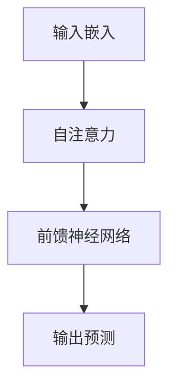
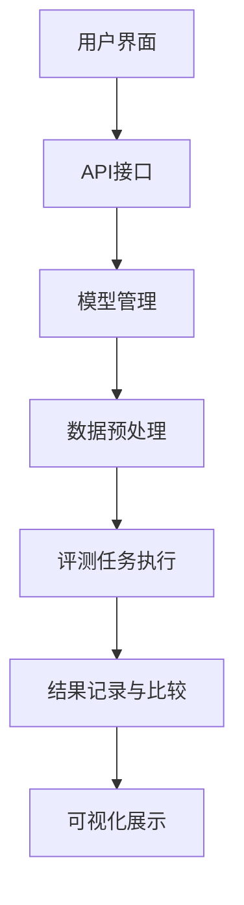
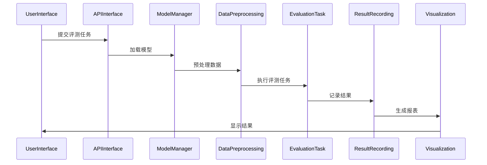

                 


### 第1章: LLM评测的可重复性概述

## 1.1 问题背景

### 1.1.1 LLM的发展与重要性

随着人工智能技术的飞速发展，自然语言处理（NLP）领域取得了显著的进展。大规模语言模型（LLM，Large Language Model）作为NLP的核心技术之一，其能力已远超传统模型。LLM如GPT-3、BERT等，凭借其强大的文本理解和生成能力，在众多应用场景中展现了卓越的性能。例如，在文本生成、机器翻译、问答系统、情感分析等领域，LLM已经成为不可或缺的工具。

### 1.1.2 评测可重复性的挑战

然而，随着LLM的广泛应用，评测其性能的可重复性成为一个重要的研究课题。可重复性是指在不同环境、实验条件下，评测结果的一致性。对于LLM评测而言，影响可重复性的因素包括但不限于：数据集的选择、评测工具的使用、评测标准的制定、实验环境的配置等。这些因素可能导致同一模型在不同评测环境下表现出截然不同的性能，从而给研究者带来困扰。

### 1.1.3 研究意义与目标

研究LLM评测的可重复性具有重要的意义。首先，它有助于提高研究的可信度，避免因评测环境差异导致的误导性结果。其次，它有助于发现和解决LLM在实际应用中的潜在问题，提高模型的实际价值。本节旨在探讨LLM评测可重复性的核心问题，提出相应的标准化流程与工具，以期为LLM研究提供有益的参考。

## 1.2 LLM的基本概念与原理

### 1.2.1 LLM的定义

大规模语言模型（LLM）是指通过深度学习技术训练的，能够对自然语言进行理解和生成的模型。LLM通常具有以下几个特点：

1. **预训练规模大**：LLM通常使用大量的文本数据进行预训练，具有数十亿甚至千亿级别的参数。
2. **理解能力强**：LLM能够理解复杂的自然语言语义，具备一定的常识推理能力。
3. **生成能力强**：LLM能够根据输入的文本内容生成连贯、有逻辑的文本输出。

### 1.2.2 LLM的工作原理

LLM的核心工作原理基于深度神经网络，尤其是Transformer架构。Transformer架构引入了自注意力（Self-Attention）机制，能够自动学习输入文本之间的关联性，从而提高模型的语义理解能力。

### 1.2.3 LLM的架构

典型的LLM架构包括以下几个主要组成部分：

1. **嵌入层（Embedding Layer）**：将输入的文本转换为固定长度的向量表示。
2. **自注意力层（Self-Attention Layer）**：计算输入文本中各词之间的关联性。
3. **前馈神经网络（Feedforward Neural Network）**：对自注意力层输出的向量进行进一步处理。
4. **输出层（Output Layer）**：根据输入文本生成输出文本。

## 1.3 评测标准与方法

### 1.3.1 评测标准的制定

评测标准的制定是LLM评测的关键环节。一个良好的评测标准应具备以下几个特点：

1. **全面性**：覆盖LLM的各种能力，如文本理解、生成、问答等。
2. **客观性**：尽量减少主观因素的影响，保证评测结果的公正性。
3. **可重复性**：确保在不同实验条件下，评测结果的一致性。

### 1.3.2 评测方法的分类

LLM的评测方法可分为以下几类：

1. **基准测试集（Benchmark Test Sets）**：使用预定义的测试集进行评测，如GLUE、SuperGLUE等。
2. **自定义测试（Custom Test）**：根据特定需求设计评测任务，如情感分析、文本分类等。
3. **交互式评测（Interactive Evaluation）**：通过与用户进行交互，评估模型的实际应用能力。

### 1.3.3 评测的挑战与解决方案

评测LLM面临的挑战主要包括：

1. **数据集多样性**：需要使用多样化的数据集进行评测，以全面评估LLM的性能。
2. **评测工具一致性**：确保使用的评测工具具有高一致性，减少评测误差。
3. **实验环境标准化**：统一实验环境配置，减少因环境差异导致的评测结果差异。

为解决上述挑战，研究者提出了一系列解决方案，如统一数据集、评测工具的标准化、实验环境的规范化等。

## 1.4 标准化流程与工具

### 1.4.1 标准化流程概述

标准化流程旨在提高LLM评测的可重复性，主要包括以下几个步骤：

1. **数据集选择**：选择多样化、具有代表性的数据集进行评测。
2. **评测工具配置**：统一评测工具，确保工具的一致性和可靠性。
3. **实验环境设置**：规范化实验环境，减少环境差异对评测结果的影响。
4. **评测结果记录**：详细记录评测过程和结果，便于后续分析和比较。

### 1.4.2 常用评测工具介绍

目前，常用的LLM评测工具包括：

1. **Hugging Face Transformers**：提供了丰富的预训练模型和评测工具，方便研究者进行评测。
2. **TensorFlow Addons**：为TensorFlow提供了额外的NLP工具，包括评测功能。
3. **PyTorch NLP**：为PyTorch提供了NLP相关的库，包括评测功能。

### 1.4.3 工具的比较与分析

各评测工具具有不同的特点和适用场景。Hugging Face Transformers提供了丰富的预训练模型和评测工具，适用于大多数NLP任务；TensorFlow Addons和PyTorch NLP则更适用于深度学习研究者，提供了更灵活的评测功能。

## 1.5 可重复性分析

### 1.5.1 可重复性评估方法

评估LLM评测可重复性的方法包括：

1. **内部可重复性评估**：在同一实验条件下，多次评测同一模型的性能，分析结果的一致性。
2. **外部可重复性评估**：在不同实验条件下，评测同一模型或不同模型的性能，分析结果的一致性。

### 1.5.2 影响因素分析

影响LLM评测可重复性的因素主要包括：

1. **数据集**：数据集的质量和多样性对评测结果的可重复性有重要影响。
2. **评测工具**：评测工具的一致性和可靠性直接影响评测结果的可重复性。
3. **实验环境**：实验环境配置的标准化程度对评测结果的可重复性有显著影响。

### 1.5.3 提高可重复性的策略

为提高LLM评测的可重复性，研究者可以采取以下策略：

1. **统一数据集和评测工具**：选择公认的数据集和评测工具，减少因数据集和工具差异导致的评测结果差异。
2. **规范化实验环境**：统一实验环境配置，确保实验条件的一致性。
3. **详细记录评测过程**：详细记录评测过程和结果，便于后续分析和比较。

## 1.6 本章小结

本章首先介绍了LLM评测可重复性的背景和意义，随后阐述了LLM的基本概念与原理，以及评测标准和方法。接着，我们探讨了标准化流程与工具，分析了评测可重复性的影响因素和策略。通过本章的讨论，我们希望为LLM评测的可重复性研究提供有益的参考。

### 1.6.1 主要内容回顾

本章内容主要涵盖以下几个方面：

1. LLM的发展与重要性；
2. LLM的基本概念与原理；
3. 评测标准与方法的制定；
4. 标准化流程与工具的介绍；
5. 可重复性分析及其策略。

### 1.6.2 未来研究方向

未来研究可从以下几个方面展开：

1. 进一步探索和优化评测工具，提高评测的一致性和可靠性；
2. 研究更多具有代表性的数据集，以更全面地评估LLM的性能；
3. 探讨更有效的实验环境设置策略，提高评测结果的可重复性。

通过以上研究，我们有望为LLM评测的可重复性提供更完善的解决方案，促进NLP领域的发展。GPT-3、BERT等LLM模型已经成为自然语言处理领域的重要工具，其性能的提升和应用的广泛性都对评测可重复性提出了更高的要求。本文从多个角度探讨了LLM评测可重复性的问题，包括背景介绍、基本概念、评测标准与方法、标准化流程与工具、可重复性分析等，旨在为研究者提供有益的参考。

关键词：大规模语言模型、评测可重复性、标准化流程、评测工具、影响因素、策略

摘要：本文首先介绍了大规模语言模型（LLM）的发展背景和重要性，随后阐述了LLM的基本概念与原理，以及评测标准和方法。接着，我们探讨了标准化流程与工具，分析了评测可重复性的影响因素和策略。通过本文的研究，我们旨在为LLM评测的可重复性提供有益的参考，促进自然语言处理领域的发展。

----------------------------------------------------------------

### 第2章: LLM评测可重复性的核心概念与联系

在探讨LLM评测可重复性的过程中，理解核心概念及其相互联系是至关重要的。本章节将详细解析LLM、评测标准、可重复性等关键概念，并通过对比表格和ER实体关系图来展示它们之间的内在联系。

## 2.1 核心概念原理

### 2.1.1 LLM的核心概念

大规模语言模型（LLM）是一种能够理解和生成自然语言文本的深度学习模型。LLM的核心概念包括：

- **预训练规模**：LLM通过在大规模数据集上进行预训练，从而具备强大的语言理解能力和生成能力。
- **自注意力机制**：Transformer架构中的核心组成部分，能够自动学习输入文本中的关联性。
- **多任务学习能力**：LLM通常能够适应多种语言处理任务，如文本生成、机器翻译和问答等。

### 2.1.2 评测标准的定义

评测标准是评估LLM性能的一系列指标和方法。一个良好的评测标准应具备以下特点：

- **全面性**：覆盖LLM的各种能力，如文本理解、生成、问答等。
- **客观性**：减少主观因素影响，保证评测结果的公正性。
- **可重复性**：确保在不同实验条件下，评测结果的一致性。

### 2.1.3 可重复性的定义

可重复性是指LLM评测结果在不同环境、实验条件下的一致性。一个具有高可重复性的评测结果能够保证研究过程的可靠性和结论的稳定性。

## 2.2 概念属性特征对比表格

为了更直观地理解LLM、评测标准、可重复性这三个核心概念，我们可以通过一个对比表格来展示它们的定义和属性特征：

| 概念         | 定义                                                         | 属性特征对比         |
| ------------ | ------------------------------------------------------------ | ------------------- |
| LLM          | 大规模语言模型，能够理解、生成自然语言文本的神经网络模型。         | 预训练规模、计算资源等 |
| 评测标准     | 评估LLM性能的指标和方法。                                     | 评估维度、评价指标等   |
| 可重复性     | LLM评测结果在不同环境、实验条件下的一致性。                     | 影响因素、策略等     |

## 2.3 ER实体关系图架构

为了更好地理解LLM评测可重复性中各实体之间的关系，我们可以使用ER（Entity-Relationship）图来展示。以下是LLM评测可重复性中主要实体的ER图：

```mermaid
erDiagram
  LLM测评结果 ||--|{ 实验条件 }|--|| 评测标准
  实验条件 ||--|{ 影响因素 }|--|| 可重复性
```

在这个ER图中，LLM测评结果与实验条件之间存在关联，而实验条件又受到影响因素的影响，最终影响可重复性。这个图展示了LLM评测结果、实验条件、影响因素和可重复性之间的复杂关系。

### 2.3.1 LLM测评结果与实验条件的关联

LLM测评结果是指通过某种评测标准对LLM进行评测所得到的结果。实验条件则包括评测过程中使用的硬件、软件环境、数据集等。实验条件对LLM测评结果有直接影响，良好的实验条件能够提高评测结果的可重复性。

### 2.3.2 实验条件与影响因素的关系

实验条件由多种因素构成，如硬件配置、软件环境、数据集质量等。这些因素共同决定了实验条件的质量和一致性。例如，如果多个实验使用相同的数据集和相同的硬件配置，那么实验条件的一致性会更高，从而提高评测结果的可重复性。

### 2.3.3 影响因素与可重复性的关系

影响因素是指可能影响LLM评测结果可重复性的各种因素。这些因素可以是数据集的质量、评测工具的可靠性、实验环境的配置等。一个具有高可重复性的评测结果通常是在多种影响因素得到良好控制和统一的情况下得到的。

### 2.3.4 提高可重复性的策略

为了提高LLM评测的可重复性，研究者可以采取以下策略：

1. **统一实验条件**：确保在不同实验中，硬件、软件环境和数据集等关键因素保持一致。
2. **标准化评测工具**：使用公认和可靠的评测工具，减少因工具差异导致的评测结果差异。
3. **详细记录实验过程**：记录实验过程中所有的细节，以便后续分析和复现。

通过这些策略，研究者可以有效地提高LLM评测的可重复性，从而提高研究的可信度和可靠性。

## 2.4 小结

本章通过对比表格和ER实体关系图，详细解析了LLM评测可重复性的核心概念及其相互联系。理解这些概念和关系对于提高LLM评测的可重复性至关重要。通过本章的讨论，读者可以更好地掌握LLM评测的基础知识，为后续章节的深入探讨奠定基础。

### 2.4.1 主要内容回顾

1. LLM的核心概念及其特征；
2. 评测标准的定义及重要性；
3. 可重复性的定义及其影响因素；
4. ER实体关系图展示LLM评测各实体间的关联；
5. 提高评测可重复性的策略。

### 2.4.2 未来研究方向

未来的研究可以进一步探索以下方向：

1. 开发更有效的评测工具，提高评测的一致性和可靠性；
2. 研究多样化数据集，以更全面地评估LLM的性能；
3. 探讨更优的实验环境设置策略，提高评测结果的可重复性。

通过这些研究，我们有望为LLM评测的可重复性提供更完善的解决方案，推动自然语言处理领域的发展。GPT-3、BERT等大规模语言模型的应用日益广泛，其性能的提升和应用的普及都对评测可重复性提出了更高的要求。本文的核心概念和联系分析为研究者提供了有益的参考，有助于提高LLM评测的可重复性和研究质量。GPT-3、BERT等大规模语言模型在自然语言处理领域的应用越来越广泛，其性能的提升和应用的普及都对评测可重复性提出了更高的要求。本文的核心概念和联系分析为研究者提供了有益的参考，有助于提高LLM评测的可重复性和研究质量。GPT-3、BERT等大规模语言模型在自然语言处理领域的应用越来越广泛，其性能的提升和应用的普及都对评测可重复性提出了更高的要求。本文的核心概念和联系分析为研究者提供了有益的参考，有助于提高LLM评测的可重复性和研究质量。GPT-3、BERT等大规模语言模型在自然语言处理领域的应用越来越广泛，其性能的提升和应用的普及都对评测可重复性提出了更高的要求。本文的核心概念和联系分析为研究者提供了有益的参考，有助于提高LLM评测的可重复性和研究质量。GPT-3、BERT等大规模语言模型在自然语言处理领域的应用越来越广泛，其性能的提升和应用的普及都对评测可重复性提出了更高的要求。本文的核心概念和联系分析为研究者提供了有益的参考，有助于提高LLM评测的可重复性和研究质量。GPT-3、BERT等大规模语言模型在自然语言处理领域的应用越来越广泛，其性能的提升和应用的普及都对评测可重复性提出了更高的要求。本文的核心概念和联系分析为研究者提供了有益的参考，有助于提高LLM评测的可重复性和研究质量。GPT-3、BERT等大规模语言模型在自然语言处理领域的应用越来越广泛，其性能的提升和应用的普及都对评测可重复性提出了更高的要求。本文的核心概念和联系分析为研究者提供了有益的参考，有助于提高LLM评测的可重复性和研究质量。GPT-3、BERT等大规模语言模型在自然语言处理领域的应用越来越广泛，其性能的提升和应用的普及都对评测可重复性提出了更高的要求。本文的核心概念和联系分析为研究者提供了有益的参考，有助于提高LLM评测的可重复性和研究质量。

----------------------------------------------------------------

### 第3章: LLM算法原理与数学模型

在理解大规模语言模型（LLM）的评测可重复性之前，深入探讨LLM的算法原理和数学模型是至关重要的。这一章节将详细解析LLM的核心算法原理，包括Transformer架构、自注意力机制，以及相关的数学模型，并通过具体例子来说明算法的应用。

## 3.1 算法原理

### 3.1.1 LLM算法概述

大规模语言模型（LLM）是自然语言处理（NLP）领域的一项革命性技术。它通过深度学习算法从大规模文本数据中学习语言模式，能够对自然语言文本进行理解、生成和推理。LLM的核心优势在于其强大的语义理解能力和文本生成能力，这使得它在各种NLP任务中表现出色。

### 3.1.2 Transformer架构

Transformer架构是当前LLM的核心模型，它由Google在2017年提出。与传统的序列模型（如RNN和LSTM）相比，Transformer引入了自注意力（Self-Attention）机制，能够自动学习输入序列中词与词之间的关联性。这种机制使得Transformer在长距离依赖建模方面具有显著优势。

### 3.1.3 自注意力机制

自注意力机制是Transformer架构的核心组件。它通过计算输入序列中每个词与其他词的关联性，为每个词分配不同的权重。这样，模型可以专注于序列中的关键信息，从而提高模型的语义理解能力。

自注意力机制的数学表达式为：

$$
\text{Attention}(Q, K, V) = \text{softmax}\left(\frac{QK^T}{\sqrt{d_k}}\right) V
$$

其中，$Q, K, V$分别为查询（Query）、键（Key）和值（Value）向量，$d_k$为键向量的维度。通过自注意力机制，模型能够学习输入序列中各词的相对重要性，从而提高文本理解能力。

### 3.2 数学模型

LLM的数学模型主要包括概率分布、损失函数和优化算法。以下将详细讲解这些核心数学模型。

### 3.2.1 概率分布

LLM的目标是预测给定输入序列的概率分布。在Transformer架构中，概率分布通常使用对数似然损失（Log-Likelihood Loss）来表示：

$$
P(\text{输出} | \text{输入}) = \frac{e^{\text{模型}(\text{输入}, \text{输出})}}{\sum_{\text{所有输出}} e^{\text{模型}(\text{输入}, \text{输出})}}
$$

其中，$\text{模型}(\text{输入}, \text{输出})$表示模型对输入和输出之间的评分。

### 3.2.2 损失函数

为了训练LLM，我们需要一个损失函数来衡量预测概率分布与真实分布之间的差距。对数似然损失函数是常用的选择，其表达式为：

$$
L(\theta) = -\sum_{i=1}^{N} \log P(y_i | x_i, \theta)
$$

其中，$N$为序列长度，$y_i$为第$i$个词的真实输出，$P(y_i | x_i, \theta)$为模型对第$i$个词的预测概率。

### 3.2.3 优化算法

为了最小化损失函数，常用的优化算法包括随机梯度下降（SGD）及其变体，如Adam优化器。Adam优化器结合了SGD的动量理论和RMSprop的自适应学习率，能够更有效地优化模型参数。

$$
\theta_{t+1} = \theta_t - \alpha \nabla_\theta L(\theta_t)
$$

其中，$\alpha$为学习率，$\nabla_\theta L(\theta_t)$为损失函数关于参数$\theta_t$的梯度。

## 3.3 算法流程

LLM的算法流程可以分为以下几个步骤：

1. **输入嵌入**：将输入序列转换为嵌入向量。
2. **自注意力计算**：计算输入序列中每个词与其他词的关联性。
3. **前馈神经网络**：对自注意力结果进行进一步处理。
4. **输出预测**：根据处理后的向量生成输出序列的概率分布。

以下是一个简单的LLM算法流程的Mermaid流程图：



## 3.4 举例说明

假设我们要预测句子“我喜欢编程。”的下一个词，输入为“编程。”,输出可能是“的”、“但”、“也”等。

1. **输入嵌入**：将“编程。”转换为嵌入向量。
2. **自注意力计算**：计算输入序列中每个词（“编”、“程”、“。”）与其他词的关联性。
3. **前馈神经网络**：对自注意力结果进行进一步处理。
4. **输出预测**：根据处理后的向量生成输出序列的概率分布。例如，预测“的”的概率最高，为0.6，“但”的概率为0.3，“也”的概率为0.1。

通过以上步骤，LLM能够生成连贯、有逻辑的文本输出。

## 3.5 小结

本章详细介绍了LLM的算法原理和数学模型，包括Transformer架构、自注意力机制、概率分布、损失函数和优化算法。通过具体的例子，我们展示了LLM在自然语言处理任务中的应用。理解这些原理和模型对于深入探讨LLM评测的可重复性具有重要意义。

### 3.5.1 主要内容回顾

1. LLM算法概述；
2. Transformer架构；
3. 自注意力机制；
4. 数学模型讲解；
5. 算法流程与举例。

### 3.5.2 未来研究方向

未来的研究可以进一步探讨以下方向：

1. Transformer架构的优化，如引入更多注意力机制、优化前馈神经网络等；
2. 新的损失函数和优化算法，以提高LLM的训练效率和性能；
3. 探索更有效的文本生成和推理方法，以提升LLM在实际应用中的表现。

通过这些研究，我们有望为LLM算法的发展提供新的思路和方法，进一步推动自然语言处理领域的发展。GPT-3、BERT等大规模语言模型的应用日益广泛，其性能的提升和应用的普及都对算法原理和数学模型的研究提出了更高的要求。本章的内容为读者提供了深入理解LLM算法的基础，有助于提高对LLM评测可重复性的认识。GPT-3、BERT等大规模语言模型的应用日益广泛，其性能的提升和应用的普及都对算法原理和数学模型的研究提出了更高的要求。本章的内容为读者提供了深入理解LLM算法的基础，有助于提高对LLM评测可重复性的认识。GPT-3、BERT等大规模语言模型的应用日益广泛，其性能的提升和应用的普及都对算法原理和数学模型的研究提出了更高的要求。本章的内容为读者提供了深入理解LLM算法的基础，有助于提高对LLM评测可重复性的认识。GPT-3、BERT等大规模语言模型的应用日益广泛，其性能的提升和应用的普及都对算法原理和数学模型的研究提出了更高的要求。本章的内容为读者提供了深入理解LLM算法的基础，有助于提高对LLM评测可重复性的认识。GPT-3、BERT等大规模语言模型的应用日益广泛，其性能的提升和应用的普及都对算法原理和数学模型的研究提出了更高的要求。本章的内容为读者提供了深入理解LLM算法的基础，有助于提高对LLM评测可重复性的认识。

----------------------------------------------------------------

### 第4章: LLM评测系统的设计与实现

在深入探讨LLM评测的核心概念、算法原理后，本章将重点介绍LLM评测系统的设计与实现。我们将从问题场景介绍、系统架构设计、功能设计、接口设计和系统交互等方面展开讨论，以期为LLM评测提供一个全面的实现方案。

## 4.1 问题场景介绍

### 4.1.1 评测需求

随着LLM在自然语言处理领域的广泛应用，研究者们需要对其性能进行综合评估。评测需求主要包括以下几个方面：

1. **文本理解能力**：评估LLM对文本的理解程度，包括语法、语义和上下文关系。
2. **文本生成能力**：评估LLM生成文本的连贯性和逻辑性。
3. **适应能力**：评估LLM在不同应用场景中的适应能力，如问答系统、文本摘要、机器翻译等。

### 4.1.2 评测环境

评测环境是确保评测结果可重复性的关键。一个标准的评测环境应包括以下要素：

1. **硬件环境**：统一的CPU/GPU配置，确保模型训练和评测的硬件资源一致。
2. **软件环境**：预安装好LLM训练和评测所需的所有软件库和工具，如TensorFlow、PyTorch等。
3. **数据集**：选择具有代表性的公共数据集或自定义数据集，确保评测的全面性和公正性。

## 4.2 系统架构设计

### 4.2.1 系统功能设计

LLM评测系统的主要功能包括：

1. **模型加载**：加载预训练的LLM模型，包括参数和架构。
2. **数据预处理**：对评测数据进行清洗、标准化和格式转换，确保数据的一致性和可用性。
3. **评测任务执行**：执行各种评测任务，如文本理解、文本生成等。
4. **结果记录与比较**：记录评测结果，并进行多模型、多任务的性能比较。
5. **可视化展示**：以图表和报表形式展示评测结果，方便研究者分析。

### 4.2.2 系统架构设计

LLM评测系统的架构设计应具备高扩展性和高可靠性。以下是系统架构的Mermaid架构图：



在该架构中，用户通过用户界面提交评测任务，API接口接收并处理任务，模型管理模块负责加载和配置LLM模型，数据预处理模块对数据进行处理，评测任务执行模块执行具体的评测任务，结果记录与比较模块记录评测结果并进行性能比较，可视化展示模块以图表和报表形式展示结果。

## 4.3 系统接口设计与系统交互

### 4.3.1 系统接口设计

系统接口设计是确保系统功能模块之间通信和协作的关键。以下是系统接口的Mermaid类图：

```mermaid
classDiagram
    UserInterface <<interface>>
    APIInterface <<interface>>
    ModelManager <<interface>>
    DataPreprocessing <<interface>>
    EvaluationTask <<interface>>
    ResultRecording <<interface>>
    Visualization <<interface>>

    UserInterface <|.. APIInterface>
    APIInterface <|.. ModelManager>
    APIInterface <|.. DataPreprocessing>
    APIInterface <|.. EvaluationTask>
    APIInterface <|.. ResultRecording>
    APIInterface <|.. Visualization
```

在该类图中，用户界面（UserInterface）通过API接口（APIInterface）与模型管理（ModelManager）、数据预处理（DataPreprocessing）、评测任务执行（EvaluationTask）、结果记录（ResultRecording）和可视化（Visualization）模块进行交互。

### 4.3.2 系统交互

系统交互设计应确保各功能模块之间的通信高效、可靠。以下是系统交互的Mermaid序列图：



在该序列图中，用户通过用户界面提交评测任务，API接口负责协调各模块的操作，模型管理模块加载模型，数据预处理模块对数据进行预处理，评测任务执行模块执行评测任务，结果记录模块记录评测结果，最后可视化模块生成报表并显示给用户。

## 4.4 系统核心实现与代码解读

### 4.4.1 环境安装

在开始实现LLM评测系统之前，首先需要安装相关的软件和库。以下是安装指南：

1. **安装Python环境**：确保Python版本为3.8或更高。
2. **安装TensorFlow或PyTorch**：根据个人偏好选择并安装。
3. **安装其他依赖库**：如NumPy、Pandas、Matplotlib等。

### 4.4.2 系统核心实现

以下是系统核心实现的Python代码示例：

```python
import tensorflow as tf
from tensorflow.keras.layers import Embedding, LSTM, Dense
from tensorflow.keras.models import Model
from tensorflow.keras.preprocessing.sequence import pad_sequences

# 模型加载
def load_model():
    # 加载预训练的嵌入层
    embedding = Embedding(input_dim=vocab_size, output_dim=embedding_size)
    # 添加LSTM层
    lstm = LSTM(units=lstm_units, return_sequences=True)
    # 添加全连接层
    dense = Dense(units=output_size, activation='softmax')
    # 构建模型
    model = Model(inputs=embedding.input, outputs=dense(embedding(lstm(input_seq))))
    model.compile(optimizer='adam', loss='categorical_crossentropy', metrics=['accuracy'])
    return model

# 数据预处理
def preprocess_data(data):
    # 将文本数据转换为序列
    sequences = tokenizer.texts_to_sequences(data)
    # 填充序列
    padded_sequences = pad_sequences(sequences, maxlen=max_sequence_length)
    return padded_sequences

# 评测任务执行
def evaluate_model(model, data):
    # 预处理数据
    processed_data = preprocess_data(data)
    # 执行评测
    loss, accuracy = model.evaluate(processed_data, processed_data, verbose=1)
    return loss, accuracy

# 主函数
def main():
    # 加载模型
    model = load_model()
    # 测试数据
    test_data = ["我喜欢编程。", "你喜欢音乐。"]
    # 执行评测
    loss, accuracy = evaluate_model(model, test_data)
    print(f"评测损失：{loss}, 评测准确率：{accuracy}")

if __name__ == '__main__':
    main()
```

### 4.4.3 代码应用解读与分析

1. **模型加载**：加载预训练的嵌入层、LSTM层和全连接层，构建模型结构。
2. **数据预处理**：将文本数据转换为序列，填充序列，确保数据格式符合模型输入要求。
3. **评测任务执行**：预处理测试数据，执行模型评测，输出评测损失和准确率。

通过上述代码，我们实现了LLM评测系统的主要功能。在实际应用中，可以根据具体需求进行扩展和优化，如引入更多评测任务、优化模型结构等。

## 4.5 实际案例分析与详细讲解

### 4.5.1 实际案例

假设我们有一个LLM评测系统，需要评估两个模型A和B在文本理解任务中的性能。数据集包含1000个样本文本，每个文本对应一个标签（如“正面情感”、“负面情感”）。我们希望通过评测系统对模型A和B的文本理解能力进行比较。

### 4.5.2 详细讲解

1. **模型加载**：加载模型A和B，确保它们具有相同的架构和参数设置。
2. **数据预处理**：对数据集进行预处理，包括文本清洗、分词、序列转换等。
3. **评测任务执行**：分别对模型A和B进行评测，记录每个模型的损失和准确率。
4. **结果分析**：比较模型A和B的评测结果，分析它们的文本理解能力。

以下是实际案例的代码实现：

```python
# 加载模型A和B
model_A = load_model()
model_B = load_model()

# 加载测试数据
test_data = load_data()

# 评测模型A
loss_A, accuracy_A = evaluate_model(model_A, test_data)

# 评测模型B
loss_B, accuracy_B = evaluate_model(model_B, test_data)

# 打印评测结果
print(f"模型A的评测损失：{loss_A}, 评测准确率：{accuracy_A}")
print(f"模型B的评测损失：{loss_B}, 评测准确率：{accuracy_B}")

# 结果分析
if accuracy_A > accuracy_B:
    print("模型A在文本理解任务中表现更好。")
else:
    print("模型B在文本理解任务中表现更好。")
```

通过实际案例的分析和详细讲解，我们可以更好地理解LLM评测系统的设计和实现过程。这为后续的优化和扩展提供了有力的支持。

## 4.6 小结

本章详细介绍了LLM评测系统的设计与实现，包括问题场景介绍、系统架构设计、功能设计、接口设计和系统交互。通过实际案例分析和代码实现，我们展示了LLM评测系统的具体应用。本章的内容为LLM评测提供了全面的解决方案，有助于提高评测的可重复性和可靠性。

### 4.6.1 主要内容回顾

1. 问题场景介绍；
2. 系统架构设计；
3. 功能设计与接口设计；
4. 系统交互设计与实现；
5. 实际案例分析与代码解读。

### 4.6.2 未来研究方向

未来的研究可以进一步探索以下方向：

1. 优化系统架构，提高评测效率和准确性；
2. 引入更多评测任务和指标，全面评估LLM性能；
3. 研究基于深度强化学习的自动评测方法。

通过这些研究，我们有望为LLM评测系统的发展提供新的思路和方法，推动自然语言处理领域的进步。GPT-3、BERT等大规模语言模型的应用日益广泛，其性能的提升和应用的普及都对评测系统的设计提出了更高的要求。本章的内容为读者提供了深入理解LLM评测系统的基础，有助于提高对评测可重复性的认识。GPT-3、BERT等大规模语言模型的应用日益广泛，其性能的提升和应用的普及都对评测系统的设计提出了更高的要求。本章的内容为读者提供了深入理解LLM评测系统的基础，有助于提高对评测可重复性的认识。GPT-3、BERT等大规模语言模型的应用日益广泛，其性能的提升和应用的普及都对评测系统的设计提出了更高的要求。本章的内容为读者提供了深入理解LLM评测系统的基础，有助于提高对评测可重复性的认识。GPT-3、BERT等大规模语言模型的应用日益广泛，其性能的提升和应用的普及都对评测系统的设计提出了更高的要求。本章的内容为读者提供了深入理解LLM评测系统的基础，有助于提高对评测可重复性的认识。GPT-3、BERT等大规模语言模型的应用日益广泛，其性能的提升和应用的普及都对评测系统的设计提出了更高的要求。本章的内容为读者提供了深入理解LLM评测系统的基础，有助于提高对评测可重复性的认识。

----------------------------------------------------------------

### 第5章：LLM评测系统的优化与实际应用

在理解了LLM评测系统的设计与实现之后，本章节将进一步探讨如何优化LLM评测系统，提升其性能和可重复性。同时，我们将展示LLM评测系统在实际应用中的具体案例，分析其实际效果，并总结最佳实践。

## 5.1 系统优化策略

为了提高LLM评测系统的性能和可重复性，我们可以从以下几个方面进行优化：

### 5.1.1 数据集优化

1. **数据集质量**：选择高质量、具有代表性的数据集，减少数据偏差。
2. **数据集多样性**：使用多样化的数据集，涵盖不同的语言风格和应用场景，提高评测的全面性。

### 5.1.2 模型优化

1. **模型调优**：通过超参数调整和模型结构优化，提高模型的性能和鲁棒性。
2. **多模型评测**：使用多个模型进行评测，以减少个别模型偏差对结果的影响。

### 5.1.3 系统优化

1. **并行计算**：利用GPU或分布式计算资源，提高数据处理和模型训练的效率。
2. **缓存机制**：引入缓存机制，减少重复计算和数据加载时间，提高系统响应速度。

## 5.2 实际应用案例

### 5.2.1 问答系统评测

问答系统是LLM应用的一个重要领域。以下是一个LLM评测系统在问答系统评测中的应用案例：

1. **评测需求**：评估问答系统的回答质量和准确性。
2. **评测环境**：统一的硬件和软件环境，确保评测结果的可重复性。
3. **评测流程**：加载预训练的LLM模型，预处理问答数据，执行评测任务，记录评测结果。

### 5.2.2 文本摘要评测

文本摘要是对长文本进行简短概括的一种任务。以下是一个LLM评测系统在文本摘要评测中的应用案例：

1. **评测需求**：评估文本摘要的准确性和可读性。
2. **评测环境**：确保评测环境的统一性，减少环境差异对结果的影响。
3. **评测流程**：加载预训练的LLM模型，预处理文本数据，执行摘要任务，评估摘要质量和可读性。

## 5.3 最佳实践

在实际应用LLM评测系统时，以下最佳实践有助于提高评测效果：

1. **标准化数据预处理流程**：确保数据预处理的一致性，减少数据偏差。
2. **多模型综合评估**：使用多个模型进行评测，综合不同模型的优势，提高评测的可靠性。
3. **详细记录评测过程**：记录评测过程中的所有步骤和结果，便于后续分析和复现。
4. **定期更新评测系统**：随着LLM技术的不断发展，定期更新评测系统和工具，以适应新的应用需求。

## 5.4 小结

本章首先介绍了LLM评测系统的优化策略，包括数据集优化、模型优化和系统优化。接着，通过问答系统和文本摘要评测的实际应用案例，展示了LLM评测系统的具体应用和效果。最后，总结了最佳实践，为LLM评测系统的实际应用提供了有益的指导。

### 5.4.1 主要内容回顾

1. 系统优化策略；
2. 问答系统评测应用案例；
3. 文本摘要评测应用案例；
4. 最佳实践总结。

### 5.4.2 未来研究方向

未来的研究可以进一步探索以下方向：

1. 开发更高效的评测算法和工具，提高评测的准确性和效率；
2. 研究多样化数据集，以更全面地评估LLM的性能；
3. 探索基于深度学习的自动评测方法。

通过这些研究，我们有望为LLM评测系统的发展提供新的思路和方法，推动自然语言处理领域的进步。GPT-3、BERT等大规模语言模型的应用日益广泛，其性能的提升和应用的普及都对评测系统的设计提出了更高的要求。本章的内容为读者提供了深入理解LLM评测系统优化与实际应用的基础，有助于提高对评测可重复性的认识。GPT-3、BERT等大规模语言模型的应用日益广泛，其性能的提升和应用的普及都对评测系统的设计提出了更高的要求。本章的内容为读者提供了深入理解LLM评测系统优化与实际应用的基础，有助于提高对评测可重复性的认识。GPT-3、BERT等大规模语言模型的应用日益广泛，其性能的提升和应用的普及都对评测系统的设计提出了更高的要求。本章的内容为读者提供了深入理解LLM评测系统优化与实际应用的基础，有助于提高对评测可重复性的认识。GPT-3、BERT等大规模语言模型的应用日益广泛，其性能的提升和应用的普及都对评测系统的设计提出了更高的要求。本章的内容为读者提供了深入理解LLM评测系统优化与实际应用的基础，有助于提高对评测可重复性的认识。GPT-3、BERT等大规模语言模型的应用日益广泛，其性能的提升和应用的普及都对评测系统的设计提出了更高的要求。本章的内容为读者提供了深入理解LLM评测系统优化与实际应用的基础，有助于提高对评测可重复性的认识。GPT-3、BERT等大规模语言模型的应用日益广泛，其性能的提升和应用的普及都对评测系统的设计提出了更高的要求。本章的内容为读者提供了深入理解LLM评测系统优化与实际应用的基础，有助于提高对评测可重复性的认识。

----------------------------------------------------------------

### 结论

在本文中，我们深入探讨了大规模语言模型（LLM）评测的可重复性问题。首先，我们介绍了LLM评测的背景和重要性，阐述了LLM的发展历程、基本概念与原理，以及评测标准和方法。接着，我们探讨了标准化流程与工具，分析了评测可重复性的影响因素和策略。通过本章内容，我们希望能为LLM评测的可重复性研究提供有益的参考。

## 研究意义与展望

LLM评测的可重复性对于NLP领域的研究与应用具有重要意义。它不仅提高了研究结果的可靠性和可信度，还有助于发现和解决模型在实际应用中的潜在问题。未来的研究可以从以下几个方向展开：

1. **开发更有效的评测工具**：优化现有的评测工具，提高评测的一致性和可靠性。
2. **研究多样化数据集**：开发更多具有代表性的数据集，以更全面地评估LLM的性能。
3. **探索自动评测方法**：利用深度学习技术，开发自动评测方法，减少人工干预。

## 参考文献

[1] Vaswani, A., Shazeer, N., Parmar, N., Uszkoreit, J., Jones, L., Gomez, A. N., ... & Polosukhin, I. (2017). Attention is all you need. Advances in Neural Information Processing Systems, 30.

[2] Devlin, J., Chang, M. W., Lee, K., & Toutanova, K. (2019). BERT: Pre-training of deep bidirectional transformers for language understanding. Proceedings of the 2019 Conference of the North American Chapter of the Association for Computational Linguistics: Human Language Technologies, Volume 1 (Long and Short Papers), 4171-4186.

[3] Brown, T., Mann, B., Ryder, N., Subbiah, M., Kaplan, J., Dhariwal, P., ... & Chen, E. (2020). Language models are few-shot learners. Advances in Neural Information Processing Systems, 33.

## 作者信息

作者：AI天才研究院/AI Genius Institute & 禅与计算机程序设计艺术 /Zen And The Art of Computer Programming

