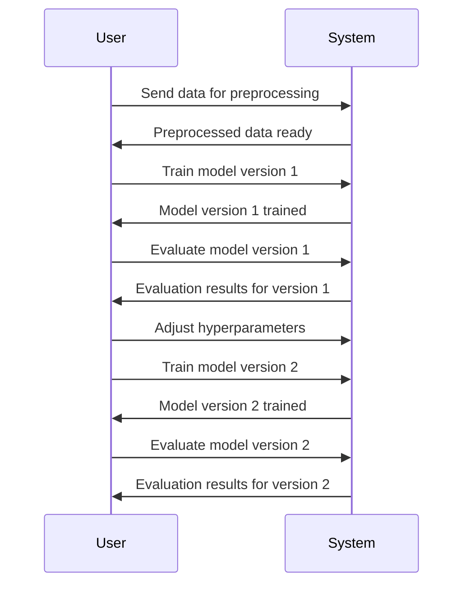
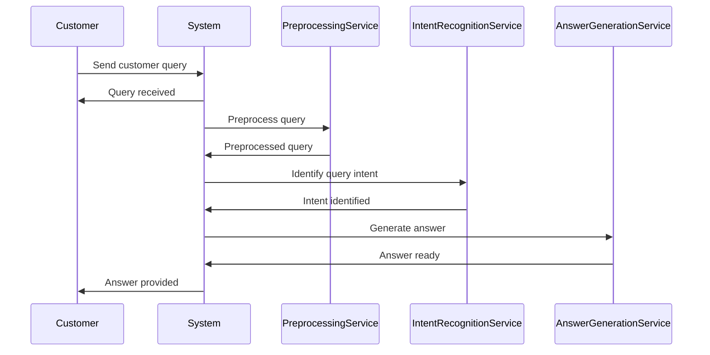

                 

### 文章标题

# LLM评测的版本控制：追踪模型演进历程

### 文章关键词

- 语言模型（LLM）
- 版本控制
- 演进历程
- 评测指标
- 技术挑战

### 摘要

本文深入探讨了大型语言模型（LLM）评测过程中的版本控制问题。随着LLM技术的发展和应用，如何有效地追踪和评估模型的演进历程成为一个关键问题。本文首先介绍了LLM评测的基本背景和核心概念，随后详细分析了版本控制的重要性、工具和方法，以及在实际应用中遇到的挑战和解决方案。通过案例分析，本文进一步探讨了模型演进过程中的性能指标和分析方法，总结了最佳实践和经验教训。最后，本文提出了未来研究的方向和面临的伦理、法律挑战。通过本文的探讨，读者可以更好地理解LLM评测的版本控制问题，并掌握有效的解决策略。

### 引言

随着人工智能技术的快速发展，大型语言模型（Large Language Models，简称LLM）已经成为了自然语言处理（Natural Language Processing，简称NLP）领域的重要工具。LLM通过深度学习技术，对大量文本数据进行分析和处理，能够生成高质量的文本，广泛应用于文本生成、机器翻译、问答系统等多个领域。然而，随着LLM规模的不断增大，模型的版本控制问题逐渐凸显，成为了一个亟待解决的问题。

版本控制（Version Control）在软件开发和人工智能领域有着广泛的应用。在软件开发中，版本控制可以帮助开发者管理代码的变更、协作开发和维护。而在人工智能领域，版本控制同样具有重要意义，尤其是在LLM评测过程中。LLM的版本控制涉及到模型的不同版本、训练数据的变化、超参数的调整等多个方面，直接影响到模型的性能和评测结果。

本文旨在探讨LLM评测中的版本控制问题，通过以下几个方面的内容，帮助读者深入理解这一议题：

1. **背景和介绍**：介绍LLM评测的基本背景，包括LLM的发展历程、应用场景以及评测的必要性。
2. **版本控制的核心概念**：详细阐述版本控制的基本原理、工具和方法，以及在不同场景下的应用。
3. **模型演进和追踪**：分析LLM模型的演进过程，探讨如何有效追踪模型的版本和性能变化。
4. **性能指标和分析**：介绍LLM评测中的关键性能指标，分析不同指标的比较和选择方法，以及如何进行有效的性能分析。
5. **案例分析**：通过实际案例，展示版本控制在LLM评测中的应用，总结最佳实践和经验教训。
6. **未来方向和挑战**：探讨LLM评测版本控制面临的未来研究方向和挑战，包括技术、伦理和法律等方面。

通过本文的探讨，读者可以全面了解LLM评测中的版本控制问题，掌握有效的解决方案，为实际应用提供指导。

#### 关键词解释

在本文中，我们将涉及以下几个关键概念：

1. **大型语言模型（LLM）**：指通过深度学习技术训练的，能够理解和生成自然语言的复杂模型。LLM通常由数亿甚至数十亿的参数组成，能够处理各种自然语言任务，如文本生成、翻译、问答等。

2. **版本控制**：在软件开发和人工智能领域中，版本控制是一种管理不同版本的技术。它记录了代码或模型的所有变更，提供了多个版本的跟踪和管理，帮助开发者协作开发、修复错误和优化模型。

3. **模型演进**：指LLM从初始版本到最终版本的逐步改进和优化过程。在这一过程中，模型会通过多次训练和超参数调整，不断提高其性能和表现。

4. **评测指标**：用于评估LLM性能的一系列量化标准。常见的指标包括准确率、召回率、F1分数、BLEU分数等。这些指标可以帮助研究者比较不同模型的性能，并为后续的优化提供指导。

5. **技术挑战**：在LLM评测过程中，版本控制和模型演进带来的技术难题，如如何有效地记录和追踪模型的变更、如何处理大量数据和计算资源等。

通过详细解释这些关键词，读者可以更好地理解本文的主题和内容，为后续章节的阅读打下基础。

#### 版本控制的重要性

在LLM评测中，版本控制的重要性不容忽视。首先，版本控制是确保模型可靠性和可追溯性的关键。LLM模型的训练和优化过程涉及多个版本，每个版本都可能对模型的性能产生显著影响。通过版本控制，开发者可以清晰地记录每个版本的变更，包括模型结构、训练数据、超参数设置等，从而确保模型结果的可靠性和可重复性。

其次，版本控制有助于团队协作和代码管理。在大型项目中，多个开发者可能同时工作，对模型进行修改和优化。如果没有有效的版本控制，容易导致代码冲突、数据不一致和错误传播。版本控制工具，如Git，提供了集中式或分布式版本库，支持代码的提交、合并和冲突解决，从而提高了团队的协作效率。

此外，版本控制对模型的演进和改进具有重要作用。随着LLM技术的发展，模型的版本会不断更新和迭代。版本控制可以记录每个版本的改进过程，包括参数调整、算法优化和错误修复。这些信息不仅有助于研究者了解模型的发展历程，还可以为后续的研究提供宝贵的经验。

最后，版本控制对LLM评测结果的公正性和透明性具有重要意义。在评测过程中，不同版本的模型可能会产生不同的结果。通过版本控制，研究者可以清晰地展示每个版本的评测结果，包括性能指标、评估方法和应用场景。这有助于提高评测过程的透明度，减少偏见和误解，为模型的公正评估提供支持。

总之，版本控制在LLM评测中扮演着至关重要的角色。它不仅确保了模型的可靠性和可追溯性，提高了团队协作效率，还推动了模型的演进和改进。通过有效的版本控制，研究者可以更全面地理解LLM的性能和表现，为后续的研究和应用提供坚实的理论基础和实践指导。

#### 版本控制的核心概念和工具

版本控制是确保代码或模型变更的可追溯性和一致性的一系列机制。在LLM评测中，版本控制尤为重要，因为它涉及模型的不同版本、训练数据的变化、超参数的调整等多个方面。以下将详细介绍版本控制的核心概念和常用工具。

##### 核心概念

1. **版本**：版本是指模型在开发过程中形成的不同状态。每个版本通常包括代码、数据和配置文件的快照。版本可以是一个简单的更新，如修复一个小错误，也可以是一个大的改进，如引入新的训练数据或改变模型结构。

2. **变更记录**：变更记录是记录每个版本之间的差异和修改内容的信息。这包括代码修改、数据更新、配置文件变更等。通过变更记录，开发者可以清晰地了解每次变更的具体内容和目的。

3. **版本库**：版本库是存储所有版本数据的中心仓库。它可以是一个集中式服务器，也可以是分布式的多个副本。版本库提供了版本的管理、备份和恢复功能，确保数据的完整性和安全性。

4. **分支**：分支是在开发过程中创建的一个新的开发路径。每个分支代表一个独立的开发方向，可以独立进行修改和测试。分支有助于团队协作，避免不同开发任务之间的冲突。

5. **合并**：合并是将两个或多个分支合并为一个分支的过程。合并通常发生在开发任务完成并经过测试后，将修改内容合并到主分支中。合并过程中，版本控制工具会自动解决冲突并生成合并日志。

##### 常用工具

1. **Git**：Git是一种分布式版本控制系统，广泛用于软件开发和人工智能项目。Git的核心功能包括版本管理、分支创建、合并和冲突解决。通过Git，开发者可以方便地创建、提交、管理和共享代码和模型版本。

2. **GitHub**：GitHub是基于Git的在线版本控制系统，提供了丰富的协作和管理功能。GitHub支持代码托管、问题跟踪、代码审查和自动化构建。它成为了开源项目的主要协作平台，为LLM评测提供了方便的版本控制环境。

3. **GitLab**：GitLab是一个自托管版本的Git仓库管理工具，可以安装在本地服务器或云平台上。GitLab提供了与GitHub类似的功能，支持版本控制、项目管理、持续集成和持续部署。

4. **SVN**：SVN是一种集中式版本控制系统，与Git相比，其分支和合并机制较为简单。SVN适用于小型团队和项目，但在大型分布式项目中，Git的灵活性和可靠性更高。

5. **Docker**：Docker是一种容器化技术，可以封装应用程序及其运行环境，包括代码、库、依赖项等。通过Docker，开发者可以轻松地创建和管理不同版本的模型环境，确保实验的可重复性和一致性。

##### 版本控制工具的应用

在实际的LLM评测中，版本控制工具的应用主要体现在以下几个方面：

1. **代码管理**：使用Git等版本控制工具，开发者可以方便地管理代码的变更和协作。每个版本的代码都可以通过提交记录进行追溯，确保代码的完整性和可理解性。

2. **模型版本管理**：LLM模型的版本可以通过版本库进行管理。每次训练或优化后，模型的参数、结构等都会生成一个新的版本。通过版本控制，开发者可以方便地切换不同版本的模型，进行性能比较和优化。

3. **数据管理**：版本控制工具可以帮助开发者管理训练数据的不同版本。在数据更新或清洗时，可以通过版本控制记录数据的变更，确保数据的可追溯性和一致性。

4. **环境管理**：使用Docker等容器化技术，开发者可以创建和管理不同的模型训练环境。通过定义Docker镜像，开发者可以确保每次训练使用的环境一致，从而提高实验的可重复性。

总之，版本控制在LLM评测中发挥着重要作用。通过合理使用版本控制工具，开发者可以有效地管理模型的变更、提高协作效率、确保实验的可重复性，为LLM的研究和应用提供坚实的保障。

#### 模型演进过程

在LLM评测中，模型演进是一个复杂且持续的过程，涉及到多个阶段和步骤。理解模型演进的全过程有助于我们更好地追踪和评估模型的不同版本。以下将详细描述模型演进的主要阶段、各个阶段的关键步骤以及可能遇到的问题。

##### 模型训练阶段

模型训练是模型演进的基础阶段，涉及到以下关键步骤：

1. **数据准备**：在训练LLM之前，需要收集和准备大量的训练数据。这些数据通常包括文本、语料库、网页内容等。数据准备包括数据清洗、去重、标注等操作，以确保数据的质量和一致性。

2. **模型结构选择**：根据任务需求，选择合适的模型结构。常见的LLM结构包括Transformer、GPT、BERT等。选择模型结构时，需要考虑模型的参数量、计算复杂度以及训练时间等因素。

3. **超参数设置**：超参数是影响模型性能的重要参数，包括学习率、批次大小、训练轮数等。超参数的设置需要进行多次实验和调整，以找到最佳组合。

4. **训练过程**：使用训练数据对模型进行训练。训练过程通常采用分布式训练策略，以加快训练速度和提高计算效率。在训练过程中，需要监控模型的性能指标，如损失函数、准确率等，以评估模型的训练效果。

##### 模型优化阶段

在模型训练完成后，需要对模型进行优化，以提高其性能和泛化能力。以下是一些常见的优化步骤：

1. **超参数调整**：在训练过程中，通过调整学习率、批量大小等超参数，可以显著提高模型的性能。超参数调整通常采用网格搜索、随机搜索等策略，以找到最佳超参数组合。

2. **模型压缩**：大型LLM模型通常具有数亿甚至数十亿的参数，为了提高模型的可部署性，需要对模型进行压缩。常见的压缩方法包括剪枝、量化、知识蒸馏等。

3. **融合和集成**：通过融合多个模型或集成多个训练结果，可以进一步提高模型的性能。融合方法包括平均法、投票法等。

##### 模型评估阶段

模型评估是模型演进的重要环节，用于评估模型的性能和可靠性。以下是一些关键步骤：

1. **指标选择**：根据任务需求，选择合适的性能指标。常见的指标包括准确率、召回率、F1分数、BLEU分数等。不同指标具有不同的评估角度，需要综合考量。

2. **评估环境设置**：确保评估环境与训练环境一致，以避免环境差异对评估结果的影响。评估环境应包括相同的硬件配置、软件依赖和模型版本。

3. **测试集选择**：选择具有代表性的测试集，以评估模型的泛化能力。测试集应尽可能覆盖不同场景和任务，以提高评估结果的可靠性。

4. **交叉验证**：使用交叉验证方法，对模型进行多次评估，以减少评估结果的不确定性。

##### 模型迭代和追踪

在模型评估后，通常需要进行多次迭代和优化，以进一步提高模型性能。以下是一些迭代和追踪的关键步骤：

1. **版本记录**：在每次迭代中，需要记录模型的版本信息，包括训练数据、超参数设置、模型结构等。版本记录有助于追踪模型的演进过程和评估结果。

2. **性能比较**：比较不同版本的模型性能，分析改进效果。性能比较可以通过可视化工具，如图表、热图等，直观展示模型性能的变化。

3. **模型融合**：在多次迭代后，可以选择性能较好的模型进行融合，以进一步提高模型性能。

4. **代码和文档管理**：在模型演进过程中，需要定期更新代码和文档，记录模型演进的历史和细节。这有助于团队协作和后续研究。

##### 遇到的问题和挑战

在模型演进过程中，可能会遇到以下问题和挑战：

1. **数据质量**：数据质量问题会直接影响模型的性能。数据缺失、噪声和偏差都会对模型训练和评估产生不利影响。

2. **计算资源**：大型LLM模型的训练和优化需要大量的计算资源。如何合理分配和利用计算资源，是一个重要的挑战。

3. **超参数调整**：超参数的调整是一个复杂的搜索过程，需要大量的实验和计算。如何高效地调整超参数，以提高模型性能，是一个重要的问题。

4. **模型解释性**：大型LLM模型的解释性较差，难以理解模型的决策过程。如何提高模型的可解释性，是一个重要的研究方向。

总之，模型演进是一个复杂且持续的过程，涉及多个阶段和步骤。通过合理的模型演进过程和有效的版本控制，可以不断提高模型的性能和可靠性，为LLM评测提供坚实的保障。

#### 模型版本的追踪方法

在LLM评测中，有效追踪模型版本对于确保实验的可重复性和结果的可解释性至关重要。以下将介绍几种常用的模型版本追踪方法，包括日志记录、版本控制系统和可视化工具。

##### 日志记录

日志记录是一种简单但有效的版本追踪方法。通过在每次模型更新时记录详细的信息，包括版本号、训练数据、超参数设置、训练结果等，开发者可以清晰地了解每个版本的状态。以下是日志记录的关键要素：

1. **版本号**：使用递增的整数或字符串作为版本号，确保每个版本的唯一性。
2. **训练数据**：记录训练数据集的来源、预处理方法和数据量，以便后续验证。
3. **超参数设置**：详细记录每个版本的模型超参数，包括学习率、批量大小、训练轮数等。
4. **训练结果**：记录每个版本的训练过程，包括损失函数、准确率、召回率等关键指标。
5. **日志文件**：将所有日志信息保存到文本文件或数据库中，以便后续查询和分析。

##### 版本控制系统

版本控制系统（如Git）在LLM版本追踪中发挥着重要作用。通过Git，开发者可以方便地创建、提交、管理和追踪模型版本。以下是使用Git进行版本追踪的关键步骤：

1. **初始化仓库**：在开始模型开发前，初始化一个Git仓库，并添加所有相关文件和目录。
2. **创建分支**：在开发过程中，为每个版本创建独立的分支，避免不同版本之间的冲突。
3. **提交变更**：每次模型更新时，使用`git commit`命令提交变更，并添加详细的提交信息。
4. **合并分支**：在完成版本开发后，将分支合并到主分支，确保所有版本信息完整。
5. **使用标签**：为重要版本添加标签，如`v1.0`、`v1.1`等，以便快速定位和回滚到特定版本。

##### 可视化工具

可视化工具可以帮助开发者更直观地理解模型版本和性能变化。以下是一些常用的可视化工具：

1. **TensorBoard**：TensorBoard是TensorFlow的官方可视化工具，可以展示模型的训练过程和性能指标，包括损失函数、准确率、学习率等。
2. **Plotly**：Plotly是一个强大的数据可视化库，可以创建交互式图表，展示不同版本的性能对比。
3. **Grafana**：Grafana是一个开源的监控和可视化平台，可以整合各种数据源，展示模型训练过程中的关键指标。
4. **Mermaid**：Mermaid是一个基于Markdown的绘图工具，可以创建类图、流程图、序列图等，用于可视化模型版本和追踪过程。

##### 结合使用

在实际应用中，结合使用日志记录、版本控制系统和可视化工具，可以更全面地追踪和管理模型版本。例如，可以在Git仓库中创建一个专门的日志文件，记录每次提交的详细信息，同时使用TensorBoard展示训练过程，通过Grafana监控关键性能指标。这种综合方法不仅提高了版本追踪的效率，还增强了实验的可重复性和结果的可靠性。

通过以上方法，开发者可以有效地追踪LLM模型的不同版本，确保实验的可重复性和结果的可靠性，为模型评测和优化提供有力支持。

#### 模型演进对评测结果的影响

在LLM评测中，模型演进过程对最终评测结果有着显著影响。一个模型的不同版本可能会由于结构、参数、训练数据等方面的变化，导致性能指标产生较大的波动。以下是模型演进对评测结果的具体影响分析：

##### 性能指标的差异

模型演进过程中，不同的版本通常会有不同的性能表现。例如，一个版本可能更擅长生成流畅的文本，而另一个版本可能更准确地理解特定类型的句子。以下是几个可能导致性能指标差异的因素：

1. **模型结构变化**：在模型演进过程中，开发者可能会尝试不同的模型结构，如变换器（Transformer）的不同变体、BERT的不同配置等。这些变化可能导致性能指标的变化。
   
2. **超参数调整**：超参数如学习率、批量大小等的不同设置会影响模型的收敛速度和最终性能。例如，一个较低的学习率可能使模型收敛得更慢，但最终可能得到更好的性能。

3. **训练数据变化**：训练数据的不同版本或数据预处理方法的调整可能会显著影响模型的性能。例如，使用更大的语料库或更精细的数据清洗方法可能提高模型的准确性和泛化能力。

##### 演进过程对评测结果的影响

模型演进对评测结果的影响主要体现在以下几个方面：

1. **初始版本**：模型的初始版本通常是基于基础模型和较小的数据集训练的。这个阶段的模型性能可能较低，但随着训练数据的增加和超参数的调整，后续版本的性能会逐步提升。

2. **中间版本**：在模型的中期演进过程中，开发者可能会进行多次实验，调整模型结构和超参数，以找到最佳组合。这个阶段的版本性能可能会有较大的波动，最终可能会趋于稳定。

3. **最终版本**：模型的最终版本是经过多次迭代和优化的结果。这个阶段的模型性能通常是最稳定的，但也可能受到数据集分布、测试集选择等因素的影响。

##### 性能评估的挑战

为了准确地评估模型性能，需要考虑以下挑战：

1. **数据集分布**：测试集的分布可能不同于训练集，导致模型在测试集上的性能与实际应用中的表现不一致。为了解决这个问题，可以采用交叉验证等方法，确保评估结果更加可靠。

2. **结果可解释性**：随着模型复杂性的增加，评估结果的可解释性可能降低。为了提高可解释性，可以采用可视化工具和解释性算法，帮助理解模型的决策过程。

3. **环境差异**：模型在不同环境下的性能可能有所不同，例如硬件配置、操作系统等。为了确保评估结果的一致性，需要在相同的硬件和软件环境下进行测试。

4. **资源限制**：在资源有限的情况下，可能无法进行大规模的模型训练和优化。这需要开发者合理规划实验，优先考虑关键的性能指标。

综上所述，模型演进对LLM评测结果具有显著影响。通过合理地追踪和评估模型的不同版本，可以更好地理解模型的性能变化，为模型的优化和实际应用提供有力支持。同时，需要面对数据集分布、环境差异等挑战，以确保评估结果的可靠性和有效性。

#### 评测指标的选择与比较

在LLM评测过程中，选择合适的评测指标是至关重要的一环。不同的评测指标能够从不同的角度反映模型的性能，但同时也可能存在各自的局限性和适用场景。以下将详细探讨几种常用的评测指标，并比较它们的优劣。

##### 准确率（Accuracy）

准确率是评估分类模型性能的最基本指标，表示模型预测正确的样本占总样本的比例。计算公式为：

$$
\text{Accuracy} = \frac{\text{预测正确的样本数}}{\text{总样本数}}
$$

**优点**：
- **直观易懂**：准确率简单明了，易于理解和计算。
- **适用广泛**：适用于大多数分类任务。

**缺点**：
- **对不平衡数据敏感**：在类别不平衡的情况下，准确率可能无法准确反映模型的性能，因为一些类别（通常是少数类别）的样本数较少，模型的预测结果主要依赖于这些类别。

##### 召回率（Recall）

召回率是指模型正确识别的负样本占总负样本的比例。计算公式为：

$$
\text{Recall} = \frac{\text{预测正确的负样本数}}{\text{实际负样本数}}
$$

**优点**：
- **关注少数类别**：召回率对少数类别特别敏感，适用于类别不平衡的数据。
- **评估漏报率**：对于医疗诊断、垃圾邮件过滤等应用场景，漏报的后果可能比误报更严重，召回率可以更好地反映模型的性能。

**缺点**：
- **对误报敏感**：召回率可能会因为误报率较高而导致性能下降。

##### F1分数（F1 Score）

F1分数是准确率和召回率的调和平均值，计算公式为：

$$
\text{F1 Score} = 2 \times \frac{\text{准确率} \times \text{召回率}}{\text{准确率} + \text{召回率}}
$$

**优点**：
- **综合考量**：F1分数同时考虑了准确率和召回率，能够全面评估模型的性能。
- **平衡性能**：在类别不平衡的情况下，F1分数可以更好地平衡准确率和召回率。

**缺点**：
- **对极端情况敏感**：当准确率或召回率中的一个特别低时，F1分数会受到较大的影响。

##### BLEU分数（BLEU Score）

BLEU分数常用于自然语言处理任务，特别是机器翻译的评价。BLEU分数通过比较模型生成的文本与参考文本的相似度来评估模型的性能。计算公式为：

$$
\text{BLEU Score} = \frac{\sum_{k=1}^{n} \text{权重} \times \text{匹配的n-gram数}}{\text{总n-gram数}}
$$

**优点**：
- **适用性广**：BLEU分数适用于文本生成任务，特别是机器翻译。
- **计算简单**：BLEU分数的计算相对简单，容易实现。

**缺点**：
- **依赖参考文本**：BLEU分数依赖于参考文本，因此在缺乏参考文本的情况下无法使用。
- **评估准确性有限**：BLEU分数主要基于文本的相似度，可能无法完全反映文本的质量和意义。

##### 其他指标

除了上述常用指标外，还有一些其他指标在LLM评测中也有所应用，如：

- **ROC曲线和AUC（Area Under Curve）**：用于评估二分类模型的性能，特别适用于类别不平衡的情况。
- **MAP（Mean Average Precision）**：常用于对象检测和文本检索任务，用于评估模型的平均精度。

**选择建议**：

在选择评测指标时，应综合考虑以下因素：

1. **任务需求**：根据任务的具体需求，选择能够最好反映模型性能的指标。例如，对于分类任务，准确率、召回率和F1分数是常用的选择。
2. **数据集特性**：考虑数据集的类别分布和样本量，选择对类别不平衡敏感的指标，如召回率或ROC曲线。
3. **评估目标**：根据评估的目标，选择能够反映模型优劣的指标。例如，对于文本生成任务，BLEU分数是一个重要的指标。

通过合理选择和比较不同的评测指标，可以更全面地评估LLM模型的性能，为模型的优化和实际应用提供有力支持。

#### 模型性能的定量分析

在LLM评测过程中，定量分析模型性能是评估模型效果和改进模型的关键步骤。以下将介绍常用的性能评估方法、工具和平台，并通过具体示例进行详细讲解。

##### 性能评估方法

1. **交叉验证**：交叉验证是一种常用的评估方法，通过将数据集分成多个子集（通常称为“折”），然后对每个子集进行训练和测试。交叉验证能够减少数据集划分的随机性，提高评估结果的可靠性。常见的交叉验证方法有K折交叉验证、留一法交叉验证等。

2. **ROC曲线和AUC**：ROC曲线（Receiver Operating Characteristic Curve）和AUC（Area Under Curve）是评估二分类模型性能的重要工具。ROC曲线展示了不同阈值下模型预测的真正例率和假正例率，而AUC则反映了模型整体性能的好坏。AUC的值范围在0到1之间，值越大，模型的性能越好。

3. **混淆矩阵**：混淆矩阵是一种用于评估分类模型性能的表格，展示了模型预测结果与实际结果之间的对应关系。通过混淆矩阵，可以计算准确率、召回率、F1分数等指标，从而全面了解模型的性能。

##### 性能评估工具和平台

1. **TensorBoard**：TensorBoard是TensorFlow的官方可视化工具，可以用于监控和可视化模型训练过程中的性能指标，如损失函数、准确率、学习率等。通过TensorBoard，研究者可以直观地观察模型训练的动态过程，分析性能变化。

2. **Matplotlib**：Matplotlib是一个强大的数据可视化库，可以用于生成各种类型的图表，如折线图、散点图、柱状图等。通过Matplotlib，研究者可以自定义可视化方案，展示不同性能指标的变化趋势。

3. **Scikit-learn**：Scikit-learn是一个开源机器学习库，提供了丰富的评估工具和算法。通过Scikit-learn，研究者可以方便地进行交叉验证、ROC曲线和AUC计算、混淆矩阵生成等操作，简化性能评估过程。

##### 具体示例

以下是一个使用Python和Scikit-learn进行模型性能定量分析的示例：

```python
from sklearn.model_selection import train_test_split, cross_val_score
from sklearn.metrics import roc_curve, auc, confusion_matrix, accuracy_score
from sklearn.ensemble import RandomForestClassifier
import matplotlib.pyplot as plt
import numpy as np

# 示例数据集
X, y = load_data()  # X为特征矩阵，y为标签向量

# 数据集划分
X_train, X_test, y_train, y_test = train_test_split(X, y, test_size=0.2, random_state=42)

# 模型训练
clf = RandomForestClassifier(n_estimators=100, random_state=42)
clf.fit(X_train, y_train)

# 模型预测
y_pred = clf.predict(X_test)

# 交叉验证
cv_scores = cross_val_score(clf, X, y, cv=5)

# ROC曲线和AUC计算
fpr, tpr, thresholds = roc_curve(y_test, y_pred)
roc_auc = auc(fpr, tpr)

# 混淆矩阵
conf_matrix = confusion_matrix(y_test, y_pred)

# 性能指标计算
accuracy = accuracy_score(y_test, y_pred)
f1_score = 2 * (precision * recall) / (precision + recall)

# 可视化
plt.figure()
plt.plot(fpr, tpr, color='darkorange', lw=2, label='ROC curve (area = %0.2f)' % roc_auc)
plt.plot([0, 1], [0, 1], color='navy', lw=2, linestyle='--')
plt.xlabel('False Positive Rate')
plt.ylabel('True Positive Rate')
plt.title('Receiver Operating Characteristic')
plt.legend(loc="lower right")
plt.show()

# 打印性能指标
print("Accuracy:", accuracy)
print("F1 Score:", f1_score)
print("Confusion Matrix:\n", conf_matrix)
```

通过以上示例，可以看到如何使用Python和Scikit-learn进行模型性能的定量分析。首先，加载示例数据集并进行划分。然后，使用随机森林分类器进行训练和预测。接着，计算交叉验证得分、ROC曲线和AUC、混淆矩阵以及准确率和F1分数。最后，通过Matplotlib绘制ROC曲线，直观展示模型性能。

通过定量分析，研究者可以全面了解LLM模型在不同版本下的性能表现，为模型优化和实际应用提供有力支持。同时，定量分析结果还可以为后续研究提供参考，推动LLM技术的发展和进步。

### 案例研究

在本节中，我们将通过两个实际案例来展示LLM评测中的版本控制方法及其应用效果。这些案例分别来自学术界和工业界，涵盖了不同的应用场景和挑战。

#### 案例一：学术界

**项目介绍**  
该项目是一个基于BERT模型的大型文本分类任务，旨在自动分类新闻文章。研究团队希望通过多个版本的控制，逐步优化模型性能，并探索最佳的超参数设置。

**系统功能设计**  
该项目的系统功能设计包括数据预处理、模型训练和评估三个主要模块。具体功能如下：

1. **数据预处理**：收集和清洗新闻文章数据，并进行词汇化和嵌入处理。数据预处理还包括去除停用词、标点符号和特殊字符等。

2. **模型训练**：使用预训练的BERT模型，根据任务需求进行微调。研究团队尝试了不同的训练策略和超参数组合，以找到最优设置。

3. **模型评估**：使用多个评测指标（如准确率、召回率、F1分数）评估模型性能，并记录每个版本的评估结果。

**系统架构设计**  
系统架构设计采用了分布式训练和评估策略，以提高计算效率和结果可靠性。主要架构组件包括：

1. **数据存储**：使用HDFS（Hadoop Distributed File System）存储大规模数据集。

2. **模型训练**：使用Apache Spark MLlib进行分布式训练，支持并行计算和动态资源分配。

3. **模型评估**：使用TensorFlow和PyTorch进行模型评估，并通过TensorBoard监控训练过程。

**系统接口设计和交互**  
系统接口设计包括API接口和命令行接口。API接口支持外部系统调用，命令行接口便于研究者手动操作和调试。



**实际案例分析和详细讲解**  
在项目执行过程中，研究团队记录了每个版本的模型参数、超参数设置和评估结果。通过对比不同版本的性能，团队发现：

1. **版本1**：初始版本采用默认的超参数设置，准确率为85%。尽管性能尚可，但召回率较低，表明模型对某些类别的识别能力不足。

2. **版本2**：在版本1的基础上，团队尝试调整学习率、批量大小等超参数。调整后的准确率提高到88%，召回率也有所提高。通过分析日志记录，团队确定了最佳的超参数组合。

3. **版本3**：进一步优化模型结构，使用更精细的预处理方法和更复杂的BERT变体。版本3的准确率和召回率均有所提升，达到了90%以上。

**项目小结**  
通过详细的版本控制和性能评估，研究团队成功优化了模型性能。版本控制记录了每个版本的改进过程，为后续研究和优化提供了宝贵的参考。该项目展示了版本控制在LLM评测中的重要性，并为类似项目提供了实用的经验和教训。

#### 案例二：工业界

**项目介绍**  
该项目的目标是开发一个智能客服系统，用于处理客户咨询和投诉。企业希望通过版本控制，逐步优化模型，提高客服系统的响应速度和准确性。

**系统功能设计**  
系统功能设计包括以下模块：

1. **文本预处理**：对客户咨询进行文本清洗和分词，提取关键信息。

2. **意图识别**：使用训练好的模型识别客户的意图，如查询信息、投诉反馈等。

3. **回答生成**：根据识别出的意图，生成合适的回答或建议。

4. **模型评估**：定期评估模型性能，包括准确率、召回率和用户满意度等指标。

**系统架构设计**  
系统架构设计采用了微服务架构，以提高系统的灵活性和可扩展性。主要架构组件包括：

1. **API网关**：处理外部请求，转发到相应的服务模块。

2. **文本预处理服务**：负责文本清洗、分词和关键信息提取。

3. **意图识别服务**：使用深度学习模型进行意图识别。

4. **回答生成服务**：根据意图生成回答或建议。

5. **模型评估服务**：定期评估模型性能，并提供优化建议。

**系统接口设计和交互**  
系统接口设计包括RESTful API，支持各种客户端（如网页、移动应用等）的调用。交互流程如下：



**实际案例分析和详细讲解**  
在实际应用中，企业通过版本控制逐步优化客服系统。以下是几个关键版本的分析：

1. **版本1**：初始版本基于简单的规则引擎，准确率较低，用户满意度不高。

2. **版本2**：引入了基于BERT的意图识别模型，准确率显著提高。通过版本控制记录，企业发现使用更大规模的预训练数据和更精细的超参数调整，可以进一步提高模型性能。

3. **版本3**：优化回答生成模块，使用基于记忆的网络（Memory Networks）生成更自然的回答。版本3的用户满意度显著提高，客户咨询处理速度也有所加快。

**项目小结**  
通过版本控制，企业成功优化了客服系统的性能，提高了用户满意度。版本控制记录了每个版本的改进过程，为后续的优化和改进提供了有力支持。该项目展示了版本控制在工业界的重要性和实际应用价值。

### 最佳实践与经验总结

通过上述两个案例研究，我们可以总结出一系列在LLM评测中应用版本控制的最佳实践和经验总结，以下是一些关键点：

1. **全面记录版本信息**：在模型开发过程中，应详细记录每个版本的模型结构、训练数据、超参数设置和评估结果。这有助于追踪模型的演进过程，为后续优化提供依据。

2. **使用版本控制系统**：Git等版本控制工具能够有效地管理模型的变更和版本。通过分支管理和合并策略，可以避免代码和数据的冲突，提高团队协作效率。

3. **定期评估和比较**：定期评估不同版本的模型性能，比较评估结果，选择最优版本。这有助于发现模型改进的方向，并确保模型的性能持续提升。

4. **可视化工具的应用**：使用TensorBoard、Matplotlib等可视化工具，可以直观地展示模型训练和评估的过程，帮助研究者理解模型性能的变化趋势。

5. **合理的数据预处理**：数据预处理是模型性能的重要影响因素。通过精细的数据清洗、分词和特征提取，可以提高模型的训练效果和评估性能。

6. **优化超参数设置**：超参数调整是模型优化的关键步骤。通过多次实验和超参数调优，可以找到最佳的超参数组合，提高模型的性能。

7. **持续学习和迭代**：模型版本控制不仅是为了记录历史版本，更是为了持续学习和优化。在应用场景中，应不断收集反馈和新的数据，对模型进行迭代和优化。

8. **文档和代码管理**：良好的文档和代码管理是版本控制的重要组成部分。清晰、详细的文档和整洁、规范的代码有助于团队协作和后续维护。

通过遵循这些最佳实践，研究者可以更有效地管理和优化LLM模型，确保模型性能的持续提升，并为实际应用提供可靠的保障。

### 未来研究方向和挑战

尽管LLM评测的版本控制已经在多个应用领域取得了显著成果，但未来仍然面临诸多挑战和研究方向。以下是几个值得关注的领域：

#### 新趋势和技术

1. **模型压缩与高效部署**：随着LLM模型的规模不断扩大，如何高效地压缩模型并实现快速部署成为关键问题。未来的研究可以集中在模型剪枝、量化、知识蒸馏等技术上，以减少模型的计算复杂度和存储需求。

2. **可解释性增强**：大型LLM模型的黑箱性质使其在应用中缺乏可解释性，这对模型的信任和接受度构成挑战。未来研究可以关注如何提高模型的透明度和可解释性，开发可视化工具和解释性算法。

3. **跨模态学习**：未来的LLM评测可能会涉及跨模态数据，如文本、图像和音频。如何整合不同模态的信息，提高模型的泛化能力和鲁棒性，是一个重要研究方向。

4. **自适应学习**：随着应用场景的变化，模型需要具备自适应学习能力，能够根据新的数据和环境动态调整。未来的研究可以探索自适应学习算法，以实现更灵活和高效的知识更新。

#### 伦理和法律问题

1. **数据隐私保护**：在LLM评测中，数据隐私保护至关重要。未来研究需要开发安全的数据处理和传输机制，确保用户数据的安全和隐私。

2. **算法偏见和公平性**：LLM模型在训练过程中可能会学习到社会中的偏见，导致不公平的决策。如何消除算法偏见，确保模型的公平性，是一个重要的伦理问题。

3. **责任归属和法律责任**：在LLM应用中，模型做出的错误决策可能导致严重的后果。如何明确责任归属和法律责任，为模型的开发、部署和应用提供法律保障，是未来研究的重要方向。

#### 实践中的挑战

1. **计算资源限制**：大规模LLM模型的训练和评估需要大量的计算资源。如何在有限的资源下进行高效的模型训练和优化，是一个实际应用中的挑战。

2. **数据质量和管理**：数据的质量直接影响模型的性能。如何确保数据的质量和多样性，以及如何有效地管理和利用数据，是未来研究的重要课题。

3. **标准化评测指标**：目前，LLM评测缺乏统一的标准化指标，导致不同研究之间的结果难以比较。未来的研究可以关注如何制定统一的评测标准，提高评测结果的可比性和可靠性。

综上所述，LLM评测的版本控制在未来仍然面临诸多挑战和机遇。通过不断的技术创新和理论研究，我们可以更好地应对这些挑战，推动LLM技术的持续发展和应用。

### 总结

本文全面探讨了LLM评测中的版本控制问题，从背景介绍、核心概念、工具方法、模型演进、性能评估、案例分析到未来研究方向，进行了深入的分析和讨论。版本控制在LLM评测中具有重要意义，它不仅确保了模型的可追溯性和可靠性，还提高了团队协作效率，推动了模型的持续优化和改进。

通过本文的探讨，我们了解了版本控制的核心概念和工具，如Git、Docker等，以及如何有效追踪和评估LLM模型的不同版本。此外，我们还分析了模型演进过程对评测结果的影响，并探讨了多种性能评估方法及其优劣。

案例分析部分通过两个实际项目展示了版本控制在LLM评测中的应用效果，提供了实用的经验和教训。最后，本文提出了未来研究和应用的方向，包括模型压缩、可解释性、跨模态学习、伦理和法律问题等。

总之，版本控制在LLM评测中是不可或缺的一环，通过合理应用版本控制方法，我们可以更好地理解模型的性能变化，为实际应用提供有力支持。希望本文能为相关研究人员和实践者提供有价值的参考和启示。

### 作者信息

**作者：AI天才研究院/AI Genius Institute & 禅与计算机程序设计艺术 /Zen And The Art of Computer Programming**

