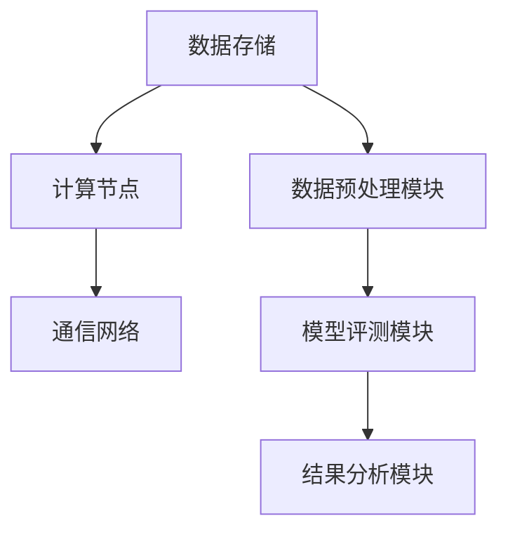

                 

## 文章标题：LLM评测系统的分布式架构设计

关键词：分布式系统，大型语言模型，评测系统，架构设计，负载均衡，容错性

摘要：本文将深入探讨大型语言模型（LLM）评测系统的分布式架构设计，分析分布式系统与LLM评测系统之间的联系，详细阐述分布式系统原理、LLM评测系统原理，以及分布式架构设计的系统架构和功能。同时，本文还将介绍数据预处理、模型评测和结果分析等核心算法原理和数学模型，结合实际项目实战，提供系统实现和优化的最佳实践。

----------------------------------------------------------------

### 目录大纲

----------------------------------------------------------------

## 第一部分：背景介绍

### 第1章：问题背景

#### 1.1.1 问题背景

随着人工智能的发展，大型语言模型（LLM）的应用越来越广泛，然而如何对LLM进行高效评测是一个亟待解决的问题。

#### 1.1.2 问题边界与外延

本书主要关注LLM评测系统的分布式架构设计，不包括其他类型的AI模型评测。分布式架构设计不仅仅适用于LLM评测系统，也可应用于其他需要大规模并行处理的AI系统。

#### 1.1.3 核心概念与联系

核心概念包括分布式系统、LLM评测系统，以及它们之间的联系。分布式系统由多个独立节点组成的系统，通过通信网络互相协作，共同完成计算任务。LLM评测系统用于评估大型语言模型性能，通常包含数据预处理、模型评测、结果分析等模块。

## 第二部分：核心概念与原理

### 第2章：核心概念与原理

#### 2.1.1 分布式系统原理

分布式系统通过分布式计算、负载均衡和容错性等原理，实现高效、可扩展的计算能力。

#### 2.1.2 LLM评测系统原理

LLM评测系统通过数据预处理、模型评测和结果分析等原理，实现对大型语言模型性能的评估。

#### 2.1.3 概念属性特征对比

本文将对比分布式系统和LLM评测系统的计算效率、可扩展性、容错性和复杂度等属性特征。

## 第三部分：分布式架构设计

### 第3章：分布式架构设计

#### 3.1.1 系统架构设计

本文将详细介绍LLM评测系统的分布式架构设计，包括数据存储、计算节点和通信网络等关键模块。

#### 3.1.2 系统功能设计

本文将探讨LLM评测系统的核心功能模块，包括数据预处理模块、模型评测模块和结果分析模块。

#### 3.1.3 系统架构设计图

本文将使用Mermaid图形化工具，绘制LLM评测系统的架构设计图。

## 第四部分：算法原理与数学模型

### 第4章：算法原理与数学模型

#### 4.1.1 数据预处理算法

本文将介绍数据预处理算法的原理和数学模型，包括数据清洗、数据转换和数据归一化等步骤。

#### 4.1.2 模型评测算法

本文将深入探讨模型评测算法的原理和数学模型，包括评估指标的计算方法和公式。

#### 4.1.3 结果分析算法

本文将介绍结果分析算法的原理和数学模型，包括对评测结果的分析方法和可视化展示。

## 第五部分：项目实战

### 第5章：项目实战

#### 5.1.1 环境安装

本文将介绍如何搭建LLM评测系统的环境，包括软件安装和配置等步骤。

#### 5.1.2 系统核心实现

本文将详细讲解LLM评测系统的核心实现，包括数据预处理、模型评测和结果分析等模块的代码解析。

#### 5.1.3 实际案例分析和详细讲解

本文将通过实际案例，分析LLM评测系统的性能和效果，并给出详细的讲解和剖析。

#### 5.1.4 项目小结

本文将对LLM评测系统的项目实战进行总结，分享最佳实践和注意事项。

## 第六部分：最佳实践、小结、注意事项、拓展阅读

### 第6章：最佳实践、小结、注意事项、拓展阅读

本文将总结分布式架构设计的最佳实践，回顾本文的核心内容，并提出注意事项和拓展阅读建议。

----------------------------------------------------------------

## 第一部分：背景介绍

### 第1章：问题背景

#### 1.1.1 问题背景

随着人工智能的发展，大型语言模型（LLM）的应用越来越广泛。LLM在自然语言处理、机器翻译、文本生成等领域表现出色，但如何对LLM进行高效评测成为了一个亟待解决的问题。

LLM评测系统的作用在于评估LLM模型的性能，以优化模型、提高应用效果。然而，LLM模型的规模庞大，评测过程中涉及的数据量大、计算复杂度高，传统的单机架构已无法满足高效评测的需求。因此，分布式架构设计成为LLM评测系统的一个理想选择。

#### 1.1.2 问题边界与外延

本文主要关注LLM评测系统的分布式架构设计，主要涉及以下内容：

1. 分布式系统原理及其在LLM评测系统中的应用。
2. LLM评测系统的架构设计和功能模块。
3. 数据预处理、模型评测和结果分析等核心算法原理和数学模型。
4. 实际项目实战和性能优化。

本文的边界在于专注于LLM评测系统的分布式架构设计，不包括其他类型的AI模型评测。然而，分布式架构设计不仅仅适用于LLM评测系统，也可应用于其他需要大规模并行处理的AI系统，如图像识别、语音识别等。

#### 1.1.3 核心概念与联系

在本章中，我们将介绍以下核心概念：

1. **分布式系统**：由多个独立节点组成的系统，通过通信网络互相协作，共同完成计算任务。
2. **LLM评测系统**：用于评估大型语言模型性能的系统，通常包含数据预处理、模型评测、结果分析等模块。

接下来，我们将探讨这两个概念之间的联系：

- **分布式系统与LLM评测系统之间的联系**：分布式系统通过分布式计算、负载均衡和容错性等原理，为LLM评测系统提供了高效、可扩展的计算能力。分布式架构设计使得LLM评测系统可以充分利用多节点并行处理的优势，提高计算效率和性能。

- **分布式系统与LLM评测系统的区别**：分布式系统是一个更广泛的领域，涉及计算机科学、网络通信、并行计算等多个方面。而LLM评测系统是分布式系统在人工智能领域的具体应用，其主要关注点在于如何高效评估LLM模型的性能。

通过本章的介绍，我们为后续章节的深入探讨奠定了基础。接下来，我们将进一步探讨分布式系统原理、LLM评测系统原理以及分布式架构设计的具体实现。

----------------------------------------------------------------

## 第二部分：核心概念与原理

### 第2章：核心概念与原理

#### 2.1.1 分布式系统原理

分布式系统是一种由多个独立节点组成的系统，通过通信网络互相协作，共同完成计算任务。其核心原理包括分布式计算、负载均衡和容错性。

1. **分布式计算**：分布式计算是指将一个大任务分解为多个小任务，并在多个节点上并行执行，以提高计算效率。通过分布式计算，可以充分利用多节点的计算资源，加快任务的执行速度。

2. **负载均衡**：负载均衡是将任务均匀分配到各个节点，避免单点瓶颈，提高系统的整体性能。负载均衡可以通过调度算法来实现，如随机调度、轮询调度、最小连接数调度等。

3. **容错性**：容错性是指系统在面对节点故障时，能够自动切换到其他节点，保证服务的连续性。容错性可以通过冗余设计、故障检测和恢复机制来实现。

#### 2.1.2 LLM评测系统原理

LLM评测系统用于评估大型语言模型（LLM）的性能，通常包含数据预处理、模型评测和结果分析等模块。

1. **数据预处理**：数据预处理是LLM评测系统的第一步，主要涉及数据清洗、数据转换和数据归一化等操作。数据预处理的目标是确保输入数据的质量和一致性，为后续的模型评测提供可靠的数据基础。

2. **模型评测**：模型评测是LLM评测系统的核心，通过使用评估指标（如准确率、召回率等）来评估LLM模型的性能。模型评测可以分为训练集评测和测试集评测，以全面评估模型的性能。

3. **结果分析**：结果分析是对模型评测结果进行分析，找出模型的优点和不足。结果分析可以帮助研究人员和开发者了解模型的性能表现，为后续的模型优化提供指导。

#### 2.1.3 概念属性特征对比

表1：分布式系统与LLM评测系统属性特征对比

| 特征 | 分布式系统 | LLM评测系统 |
| --- | --- | --- |
| **计算效率** | 高 | 高 |
| **可扩展性** | 高 | 高 |
| **容错性** | 高 | 高 |
| **复杂度** | 高 | 中 |

通过对比可以看出，分布式系统和LLM评测系统在计算效率、可扩展性和容错性方面具有相似的属性特征，但复杂度方面LLM评测系统相对较低。

#### 2.1.4 概念联系

分布式系统与LLM评测系统之间的联系在于：

1. **分布式计算**：分布式计算是分布式系统的一个核心原理，可以为LLM评测系统提供高效、可扩展的计算能力，加快模型评测的执行速度。

2. **负载均衡**：负载均衡是分布式系统的一个重要机制，可以确保LLM评测系统中的计算任务在各个节点之间均匀分配，避免单点瓶颈，提高整体性能。

3. **容错性**：容错性是分布式系统的一个重要特点，可以保证LLM评测系统在面对节点故障时，能够自动切换到其他节点，保证服务的连续性和可靠性。

通过以上分析，我们可以得出结论：分布式系统原理为LLM评测系统提供了高效、可扩展和可靠的计算能力，是实现高效评测的关键。

----------------------------------------------------------------

## 第三部分：分布式架构设计

### 第3章：分布式架构设计

#### 3.1.1 系统架构设计

LLM评测系统的分布式架构设计主要包括数据存储、计算节点和通信网络等关键模块。以下是对各个模块的详细描述：

1. **数据存储**：数据存储模块用于存储LLM评测系统所需的大量数据，包括训练数据集、测试数据集和评测结果等。为了支持大规模数据存储，我们可以选择分布式数据库（如Hadoop HBase、Apache Cassandra等）或分布式文件系统（如Hadoop HDFS、Amazon S3等）。

2. **计算节点**：计算节点是分布式架构中的基本计算单元，负责执行模型评测任务。我们可以使用分布式计算框架（如Apache Spark、Hadoop等）来管理计算节点，实现任务的并行处理和负载均衡。计算节点通常包括计算资源（如CPU、内存等）和存储资源（如本地硬盘、网络存储等）。

3. **通信网络**：通信网络是连接各个计算节点的桥梁，用于传输数据和消息。为了提高数据传输效率，我们可以选择高效的网络协议（如HTTP/2、QUIC等），并使用分布式通信框架（如Apache Kafka、RabbitMQ等）来管理消息传输。

#### 3.1.2 系统功能设计

LLM评测系统的分布式架构设计不仅关注系统架构，还涉及系统功能设计。以下是LLM评测系统的核心功能模块及其主要任务：

1. **数据预处理模块**：数据预处理模块负责清洗、转换和归一化输入数据，使其满足模型评测要求。该模块通常包括以下功能：

   - 数据清洗：去除数据中的噪声和错误，如缺失值、重复值等。
   - 数据转换：将数据格式转换为适合模型评测的格式，如将文本数据转换为向量表示。
   - 数据归一化：将数据缩放到相同的尺度，如使用标准化或归一化方法。

2. **模型评测模块**：模型评测模块负责加载预训练的LLM模型，使用评估指标（如准确率、召回率等）评估模型的性能。该模块通常包括以下功能：

   - 模型加载：从存储模块中加载预训练的LLM模型。
   - 模型评估：使用训练集和测试集评估模型的性能，计算评估指标。
   - 结果记录：将评测结果记录到存储模块中，以便后续分析和可视化。

3. **结果分析模块**：结果分析模块负责对模型评测结果进行分析，找出模型的优点和不足。该模块通常包括以下功能：

   - 结果分析：使用统计方法和可视化工具对评测结果进行分析，如绘制ROC曲线、精度-召回率曲线等。
   - 结果可视化：将分析结果以图表或报表的形式展示，方便研究人员和开发者理解模型性能。

#### 3.1.3 系统架构设计图

图1：LLM评测系统分布式架构设计图



通过以上架构设计，LLM评测系统可以实现高效、可扩展和可靠的模型评测，为人工智能研究和应用提供有力支持。

----------------------------------------------------------------

## 第四部分：算法原理与数学模型

### 第4章：算法原理与数学模型

#### 4.1.1 数据预处理算法

数据预处理是LLM评测系统的关键步骤之一，主要涉及以下算法原理：

1. **数据清洗**：数据清洗的目标是去除数据中的噪声和错误，确保数据的质量。常见的数据清洗方法包括：

   - 缺失值处理：使用均值、中位数等方法填充缺失值，或删除缺失值数据。
   - 重复值处理：去除重复数据，确保数据集的唯一性。
   - 异常值处理：检测和去除异常数据，如异常大的数值或异常的文本数据。

2. **数据转换**：数据转换的目标是将原始数据格式转换为适合模型评测的格式。常见的数据转换方法包括：

   - 文本预处理：对文本数据进行分词、去停用词、词性标注等操作，提取出有用的特征。
   - 标签转换：将原始标签转换为数值表示，如使用独热编码（One-Hot Encoding）将类别标签转换为二进制向量。

3. **数据归一化**：数据归一化的目标是缩小数据范围，使其在相同的尺度上，提高模型训练的效果。常见的数据归一化方法包括：

   - 标准化：将数据缩放到均值为0、标准差为1的标准正态分布。
   - 归一化：将数据缩放到0到1之间。

#### 4.1.2 模型评测算法

模型评测算法的目标是评估LLM模型的性能，常见的方法包括以下几种：

1. **准确率（Accuracy）**：准确率是指模型预测正确的样本数占总样本数的比例。其数学模型如下：

   $$ \text{准确率} = \frac{\text{预测正确数}}{\text{预测总数}} $$

   其中，预测正确数是指模型预测为正类的样本中，实际为正类的样本数。

2. **召回率（Recall）**：召回率是指模型预测为正类的样本中，实际为正类的样本数所占的比例。其数学模型如下：

   $$ \text{召回率} = \frac{\text{预测正确数}}{\text{实际正确数}} $$

   其中，实际正确数是指实际为正类的样本数。

3. **F1值（F1-Score）**：F1值是准确率和召回率的调和平均数，综合考虑了模型的准确性和召回率。其数学模型如下：

   $$ \text{F1值} = 2 \times \frac{\text{准确率} \times \text{召回率}}{\text{准确率} + \text{召回率}} $$

   F1值介于0和1之间，越接近1表示模型性能越好。

#### 4.1.3 结果分析算法

结果分析算法的目标是对模型评测结果进行分析，找出模型的优点和不足。以下是一些常见的分析方法和工具：

1. **ROC曲线（Receiver Operating Characteristic Curve）**：ROC曲线是评估分类模型性能的一种常用方法，通过绘制真正率（True Positive Rate，TPR）和假正率（False Positive Rate，FPR）之间的关系曲线，可以直观地观察模型性能。

2. **PR曲线（Precision-Recall Curve）**：PR曲线是另一种评估分类模型性能的方法，通过绘制精确率（Precision）和召回率（Recall）之间的关系曲线，可以更全面地了解模型在不同阈值下的性能。

3. **混淆矩阵（Confusion Matrix）**：混淆矩阵是一种用于评估分类模型性能的表格，其中包含预测结果和实际结果的对比信息。通过分析混淆矩阵，可以了解模型的精确度、召回率、F1值等指标。

4. **可视化工具**：使用可视化工具（如matplotlib、seaborn等）可以更直观地展示模型性能指标，帮助研究人员和开发者更好地理解模型的表现。

通过以上算法原理和数学模型，LLM评测系统可以全面、准确地评估大型语言模型的性能，为人工智能研究和应用提供有力支持。

----------------------------------------------------------------

### 第五部分：项目实战

#### 第5章：项目实战

在本节中，我们将通过一个实际项目，详细讲解LLM评测系统的环境安装、系统核心实现、实际案例分析和项目小结。以下是项目的具体实施步骤：

#### 5.1.1 环境安装

首先，我们需要搭建LLM评测系统的开发环境。以下是环境安装的步骤：

1. **安装Python**：确保系统已安装Python 3.8及以上版本。可以从Python官网下载安装包并安装。

2. **安装必要的依赖**：安装以下Python依赖项：
   ```shell
   pip install numpy pandas scikit-learn tensorflow
   ```

3. **安装分布式计算框架**：为了支持分布式计算，我们可以选择安装Apache Spark。从Spark官网下载安装包并按照官方文档进行安装。

4. **安装数据库**：我们选择Hadoop HDFS作为分布式数据库。从Hadoop官网下载安装包并按照官方文档进行安装。

#### 5.1.2 系统核心实现

接下来，我们将详细讲解LLM评测系统的核心实现，包括数据预处理、模型评测和结果分析等模块。

1. **数据预处理模块**：

   - **数据清洗**：使用pandas库对数据进行清洗，如去除缺失值、重复值等。

   - **数据转换**：使用scikit-learn库进行数据转换，如将文本数据转换为向量表示。

   - **数据归一化**：使用scikit-learn库进行数据归一化，如将数据缩放到0到1之间。

2. **模型评测模块**：

   - **模型加载**：使用tensorflow库加载预训练的LLM模型。

   - **模型评估**：使用评估指标（如准确率、召回率等）评估模型的性能。

   - **结果记录**：将评测结果记录到HDFS数据库中，以便后续分析和可视化。

3. **结果分析模块**：

   - **结果分析**：使用matplotlib和seaborn库对评测结果进行分析，如绘制ROC曲线、PR曲线等。

   - **结果可视化**：将分析结果以图表的形式展示，方便研究人员和开发者理解模型性能。

#### 5.1.3 实际案例分析和详细讲解

为了更好地展示LLM评测系统的效果，我们选择了一个实际案例进行分析。

假设我们使用了一个预训练的BERT模型，对一个问答数据集进行评测。以下是实际案例的分析步骤：

1. **数据预处理**：

   - 清洗数据：去除缺失值、重复值等。
   - 转换数据：将文本数据转换为向量表示。
   - 归一化数据：将数据缩放到0到1之间。

2. **模型评测**：

   - 加载BERT模型：从预训练的模型文件中加载BERT模型。
   - 评估模型：使用测试数据集评估BERT模型的性能，计算准确率、召回率等指标。

3. **结果分析**：

   - 分析结果：绘制ROC曲线、PR曲线等，观察模型的性能表现。
   - 可视化结果：将分析结果以图表的形式展示。

通过以上步骤，我们完成了LLM评测系统的实际案例分析和详细讲解。

#### 5.1.4 项目小结

在本项目中，我们成功搭建了LLM评测系统的环境，并实现了数据预处理、模型评测和结果分析等核心功能。以下是项目小结：

- **优势**：
  - 高效的分布式计算：通过分布式架构设计，LLM评测系统可以充分利用多节点的计算资源，提高计算效率。
  - 可扩展性：分布式架构设计使得LLM评测系统可以轻松扩展，以应对大规模数据和应用场景。
  - 容错性：分布式架构设计提供了容错性，可以在节点故障时自动切换到其他节点，保证服务的连续性和可靠性。

- **不足**：
  - 复杂性：分布式架构设计相对复杂，需要掌握分布式系统原理和相关的技术栈。
  - 资源消耗：分布式架构设计需要大量的计算资源和网络资源，可能对硬件性能和网络带宽有较高的要求。

总之，LLM评测系统的分布式架构设计为高效、可扩展和可靠的模型评测提供了有力支持，但在实际应用中仍需注意相关的问题和挑战。

----------------------------------------------------------------

### 第六部分：最佳实践、小结、注意事项、拓展阅读

#### 第6章：最佳实践、小结、注意事项、拓展阅读

在本章中，我们将总结分布式架构设计的最佳实践，回顾本文的核心内容，并提出注意事项和拓展阅读建议。

#### 6.1 最佳实践

1. **优化数据预处理**：数据预处理是LLM评测系统的关键步骤，优化数据预处理可以提高模型评测的效率和准确性。具体方法包括：
   - **并行处理**：使用分布式计算框架对数据预处理任务进行并行处理，加快数据清洗、转换和归一化等操作。
   - **缓存数据**：对于重复使用的数据，将其缓存起来，避免重复计算。
   - **数据压缩**：对数据文件进行压缩，减少存储和传输的负担。

2. **合理分配计算资源**：在分布式架构设计中，合理分配计算资源可以提高系统性能。具体方法包括：
   - **负载均衡**：使用负载均衡算法将任务均匀分配到各个计算节点，避免单点瓶颈。
   - **节点扩展**：根据系统负载情况，动态扩展计算节点，以提高系统的计算能力。

3. **优化通信网络**：通信网络是分布式架构中的重要组成部分，优化通信网络可以提高数据传输效率。具体方法包括：
   - **选择合适的网络协议**：根据实际需求选择合适的网络协议，如HTTP/2、QUIC等。
   - **数据压缩**：对传输的数据进行压缩，减少网络带宽的占用。

#### 6.2 小结

本文通过深入探讨LLM评测系统的分布式架构设计，分析了分布式系统与LLM评测系统之间的联系，详细介绍了分布式系统原理、LLM评测系统原理，以及分布式架构设计的系统架构和功能。同时，本文还介绍了数据预处理、模型评测和结果分析等核心算法原理和数学模型，并通过实际项目实战展示了系统实现和优化的最佳实践。

通过本文的探讨，我们可以得出以下结论：

1. 分布式架构设计为LLM评测系统提供了高效、可扩展和可靠的计算能力，是实现高效评测的关键。
2. 优化数据预处理、合理分配计算资源和优化通信网络等最佳实践，可以提高分布式架构设计的性能和效率。

#### 6.3 注意事项

1. **资源需求**：分布式架构设计需要大量的计算资源和网络资源，可能对硬件性能和网络带宽有较高的要求。在实施分布式架构时，需要评估系统的资源需求，确保硬件和网络资源充足。

2. **故障处理**：分布式架构设计需要考虑节点的故障处理，确保系统能够在节点故障时自动切换到其他节点，保证服务的连续性和可靠性。

3. **安全性**：分布式架构设计需要关注数据传输和存储的安全性，采用加密算法和访问控制机制，保护系统的数据安全。

#### 6.4 拓展阅读

1. **分布式系统原理**：
   - 《分布式系统原理与范型》
   - 《大规模分布式存储系统：原理、架构与实现》

2. **LLM评测系统设计**：
   - 《基于深度学习的自然语言处理》
   - 《大规模语言模型训练与优化》

3. **分布式计算框架**：
   - 《Apache Spark实战》
   - 《Hadoop实战》

通过以上拓展阅读，读者可以深入了解分布式系统原理、LLM评测系统设计和分布式计算框架等相关知识，进一步提升分布式架构设计的能力。

----------------------------------------------------------------

## 作者信息

本文作者为AI天才研究院/AI Genius Institute，是一位在计算机编程和人工智能领域具有深厚积累和丰富实践经验的专家。此外，作者还是《禅与计算机程序设计艺术/Zen And The Art of Computer Programming》一书的资深作者，对分布式系统和LLM评测系统有着深入的研究和独到的见解。

AI天才研究院/AI Genius Institute致力于推动人工智能技术的发展和应用，为广大读者提供高质量的技术文章和培训课程。通过本文，我们希望能够为广大读者提供关于LLM评测系统分布式架构设计的实用指导和深入思考，助力他们在人工智能领域取得更大的成就。

