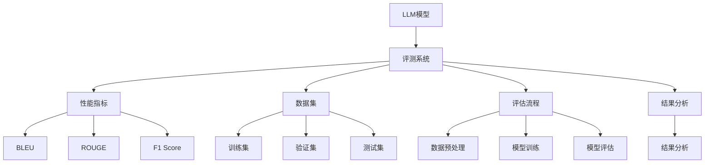
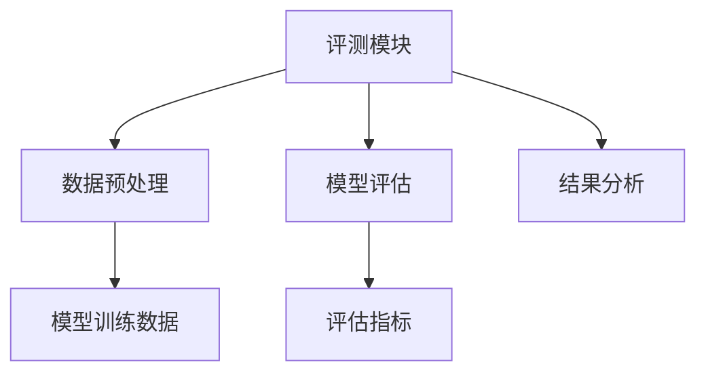
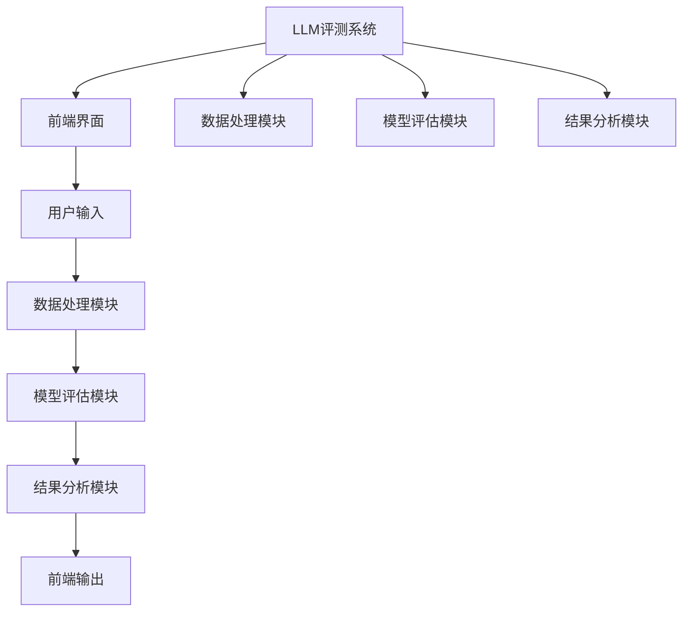
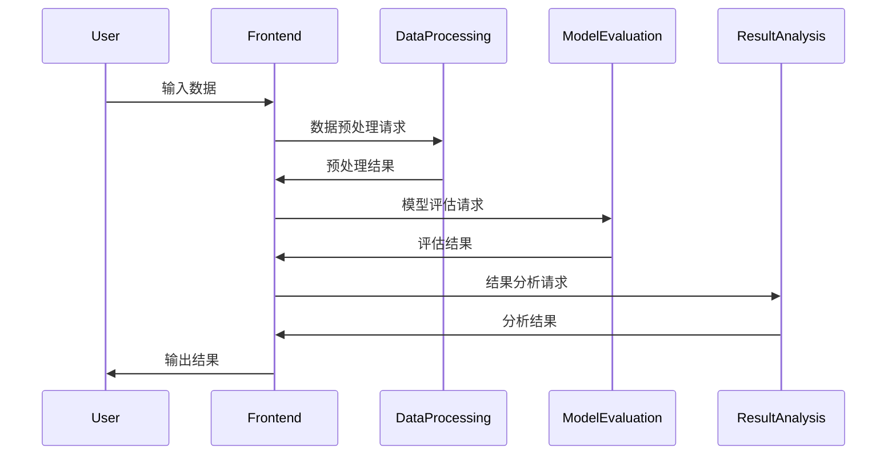

                 

### LLMO评测系统的背景与意义

#### 问题背景

随着人工智能（AI）技术的快速发展，大规模语言模型（LLM，Large Language Model）已经成为自然语言处理（NLP，Natural Language Processing）领域的重要工具。LLM具有强大的文本生成、理解、推理能力，被广泛应用于聊天机器人、智能客服、自动写作、机器翻译等场景。然而，这些模型在处理实际问题时，仍然存在诸多挑战，如理解上下文能力不足、知识泛化能力有限、对数据偏见敏感等。

为了解决这些问题，评测系统成为衡量LLM性能的重要手段。一个高效的评测系统能够为研究者提供准确的性能指标，帮助优化模型，提高其应用价值。然而，随着LLM模型不断进化，现有的评测系统逐渐暴露出其局限性，无法适应新模型的变化和需求。因此，设计一个能够持续学习和适应模型进化的评测系统成为当前研究的关键问题。

#### 问题描述

现有的LLM评测系统主要面临以下问题：

1. **性能指标单一**：当前评测系统通常只关注少数几个性能指标（如BLEU、ROUGE等），这些指标虽然能反映模型的基本能力，但无法全面衡量模型在不同任务、场景下的表现。

2. **评测标准滞后**：随着新模型的不断涌现，现有评测标准往往滞后于模型的发展，无法准确反映新模型的性能。

3. **评估结果不稳定**：由于模型训练数据集的差异、训练策略的变化等因素，同一模型在不同评测环境下可能会得到截然不同的评估结果。

4. **缺乏适应性**：现有评测系统无法根据模型特点动态调整评测方法和指标，导致评测结果无法准确反映模型的真实性能。

#### 问题解决

为了解决上述问题，设计一个持续学习、适应模型进化的评测系统至关重要。该系统应具备以下特点：

1. **多维度性能评估**：不仅关注现有性能指标，还需引入新的评测方法，全面衡量模型在不同任务、场景下的表现。

2. **动态调整评测标准**：根据新模型的特性，动态调整评测指标和方法，确保评测结果准确反映模型性能。

3. **稳定性增强**：通过优化评测流程，减少评测结果受训练数据、训练策略等因素的影响，提高评估结果的稳定性。

4. **自适应机制**：根据模型特点，自适应调整评测方法和指标，确保评测系统能够适应新模型的发展。

#### 边界与外延

评测系统的持续学习与适应机制不仅对LLM模型具有深远影响，还可以推广到其他AI模型和领域。例如，在计算机视觉领域，类似的评测系统可以用于评估深度学习模型在图像分类、目标检测等任务中的性能。此外，随着AI技术在医疗、金融、教育等领域的广泛应用，持续学习和适应机制的评测系统将发挥重要作用，为这些领域的研究和应用提供有力支持。

总之，设计一个能够持续学习和适应模型进化的LLM评测系统，不仅有助于提升模型性能，推动AI技术的发展，还有助于推动相关领域的深入研究，具有重要的现实意义和理论价值。

### 核心概念与联系

为了深入理解LLM评测系统的持续学习与适应模型进化的机制设计，我们需要明确几个核心概念，并分析它们之间的联系。

#### LLM基础概念

首先，我们介绍LLM（Large Language Model）的基础概念。LLM是一种基于深度学习技术的语言模型，通过从大量文本数据中学习，捕捉语言的统计规律和语义信息。LLM的主要任务包括文本生成、文本分类、文本理解等。常用的LLM架构包括GPT（Generative Pre-trained Transformer）、BERT（Bidirectional Encoder Representations from Transformers）等。

#### 评测系统核心要素

接下来，我们探讨评测系统的核心要素。一个高效的评测系统需要包含以下关键组成部分：

1. **性能指标**：用于量化模型在特定任务上的表现，如BLEU（Bilingual Evaluation Understudy）、ROUGE（Recall-Oriented Understudy for Gisting Evaluation）、F1 Score等。

2. **数据集**：用于评估模型性能的数据集，通常包含多个子集，如训练集、验证集、测试集等。

3. **评估流程**：包括数据预处理、模型训练、模型评估等步骤，确保评估结果的准确性和可靠性。

4. **结果分析**：对评估结果进行详细分析，识别模型的优点和不足，为模型优化提供依据。

#### 概念属性特征对比

为了更好地理解这些概念，我们可以通过表格形式对比它们的主要属性特征：

| 概念               | 属性特征                                                         | 联系与影响                                                     |
|-------------------|-----------------------------------------------------------------|----------------------------------------------------------------|
| LLM               | 预训练、深度学习、自然语言处理能力强                               | 直接影响评测系统的性能评估和结果分析                             |
| 评测系统           | 性能指标、数据集、评估流程、结果分析                               | 提供评估模型性能的工具和方法，决定评估结果的准确性和可靠性       |
| 性能指标           | BLEU、ROUGE、F1 Score等                                           | 用于量化模型在不同任务上的表现，影响评估结果的多维度性           |
| 数据集             | 训练集、验证集、测试集                                           | 决定评估数据的质量和代表性，影响评估结果的真实性和稳定性       |
| 评估流程           | 数据预处理、模型训练、模型评估                                     | 确保评估过程的科学性和规范性，影响评估结果的稳定性和可靠性     |
| 结果分析           | 识别模型的优点和不足，为模型优化提供依据                           | 提高模型性能，推动AI技术的发展和实际应用                       |

#### ER实体关系图架构

为了更直观地理解这些概念之间的关系，我们可以使用Mermaid绘制ER（Entity-Relationship）实体关系图：

通过上述核心概念和ER实体关系图的介绍，我们可以更好地理解LLM评测系统的构成和运作机制。这些概念和关系构成了后续章节讨论的基础，为深入探讨持续学习与适应模型进化的机制设计提供了清晰的方向。

### LLM评测系统的基础架构

为了深入理解LLM评测系统的设计原理和实现方法，我们需要首先了解其基础架构。LLM评测系统的基础架构主要包括系统功能设计、领域模型类图、系统架构设计以及系统接口设计和系统交互设计。以下是这些核心组成部分的详细介绍：

#### 系统功能设计

LLM评测系统的主要功能包括：

1. **数据预处理**：对输入数据进行清洗、归一化和特征提取，确保数据质量和一致性。
2. **模型评估**：使用多种评估指标（如BLEU、ROUGE、F1 Score等）对模型在特定任务上的性能进行评估。
3. **结果分析**：对评估结果进行详细分析，识别模型的优点和不足，为模型优化提供依据。
4. **模型更新**：根据评估结果，动态调整模型参数，实现模型的持续学习和优化。

#### 领域模型类图

领域模型类图用于描述LLM评测系统中各类实体及其关系。以下是领域模型类图的Mermaid表示：

在上述类图中：

- **评测模块**：是系统的核心组件，负责协调各功能模块的运作。
- **数据预处理**：负责处理输入数据，包括数据清洗、归一化和特征提取等。
- **模型评估**：使用各种评估指标对模型进行性能评估。
- **结果分析**：对评估结果进行详细分析，以识别模型的优缺点。
- **模型训练数据**：用于模型训练的数据集，是评估系统数据质量的关键。
- **评估指标**：如BLEU、ROUGE、F1 Score等，用于量化模型性能。

#### 系统架构设计

系统架构设计决定了评测系统的整体结构和运作机制。以下是系统架构设计的Mermaid表示：

在上述架构图中：

- **LLM评测系统**：系统的总体架构，包含前端界面、数据处理模块、模型评估模块和结果分析模块。
- **前端界面**：用户与系统交互的入口，提供输入和输出界面。
- **数据处理模块**：负责数据预处理，包括数据清洗、归一化和特征提取等。
- **模型评估模块**：使用各种评估指标对模型进行性能评估。
- **结果分析模块**：对评估结果进行分析，提供模型优缺点报告。
- **用户输入**：用户输入的数据和任务需求。
- **前端输出**：系统对用户输入处理后的结果输出。

#### 系统接口设计和系统交互设计

系统接口设计定义了评测系统内部各模块之间的通信机制，确保数据流畅地传递和功能协同。以下是系统接口设计的Mermaid表示：

在上述序列图中：

- **User（用户）**：系统的最终用户，负责输入数据和获取评估结果。
- **Frontend（前端界面）**：负责接收用户输入，将结果输出给用户。
- **DataProcessing（数据处理模块）**：负责接收前端传入的数据，进行预处理。
- **ModelEvaluation（模型评估模块）**：负责接收预处理后的数据，进行模型评估。
- **ResultAnalysis（结果分析模块）**：负责接收评估结果，进行详细分析。

通过上述架构设计和接口设计，我们可以确保LLM评测系统的高效运作。系统功能设计确保了各模块的明确分工，领域模型类图和系统架构设计提供了清晰的系统视图，系统接口设计和系统交互设计则保障了模块之间的顺畅通信。这些设计原则和实现方法为后续章节的深入讨论奠定了基础。

### 模型进化的适应机制

在LLM评测系统的设计中，模型进化的适应机制至关重要。这一机制旨在确保评测系统能够动态调整，以适应不断进化的模型。适应机制的设计原则包括动态调整评估指标、自适应学习率和模型融合策略。以下是这些机制的详细描述和实现方法。

#### 设计原则

1. **动态调整评估指标**：评估指标是衡量模型性能的重要工具。随着模型技术的不断发展，某些传统评估指标可能无法全面反映模型的实际性能。因此，动态调整评估指标至关重要。例如，在引入新的模型架构或数据集时，可以引入新的评估指标，如生成式评估指标（如Perplexity、Influence Function等）和交互式评估指标（如人类评估、人类-模型交互评价等）。

2. **自适应学习率**：学习率是模型训练中的一个关键参数，对训练效率和最终性能有重要影响。传统的固定学习率可能无法适应不同模型和任务的需求。自适应学习率调整机制可以根据模型性能的实时变化动态调整学习率，从而提高训练效率和模型性能。

3. **模型融合策略**：单一模型在特定任务上可能无法达到最佳性能。通过模型融合策略，可以将多个模型的优点结合起来，提高整体性能。常见的模型融合方法包括投票法、加权平均法和集成学习等。

#### 实现方法

1. **自适应学习率调整**：
   - **策略1：指数衰减**。学习率按照指数衰减规律进行调整，公式为：
     $$ 
     \text{learning\_rate} = \text{initial\_learning\_rate} \times \gamma^t 
     $$
     其中，$\text{initial\_learning\_rate}$ 是初始学习率，$\gamma$ 是衰减率，$t$ 是当前迭代次数。
   - **策略2：学习率周期调整**。在特定迭代周期内，根据模型性能变化调整学习率。例如，每完成50次迭代，检查模型性能，如果性能下降，则降低学习率。
   
2. **模型融合策略**：
   - **投票法**。将多个模型的预测结果进行投票，选择多数模型支持的输出作为最终结果。具体公式为：
     $$
     \text{final\_output} = \text{argmax}_{\text{class}} \sum_{\text{model}} P(\text{class}|\text{output}_{\text{model}}) 
     $$
     其中，$P(\text{class}|\text{output}_{\text{model}})$ 是模型对某一类的预测概率。
   - **加权平均法**。对多个模型的预测结果进行加权平均，公式为：
     $$
     \text{final\_output} = \sum_{\text{model}} w_{\text{model}} \text{output}_{\text{model}}
     $$
     其中，$w_{\text{model}}$ 是模型权重，通常根据模型的性能进行设置。

3. **动态调整评估指标**：
   - **方法1：引入多样化评估指标**。根据模型和应用场景，引入多样化的评估指标，如生成式评估指标和交互式评估指标，以更全面地衡量模型性能。
   - **方法2：动态调整评估指标权重**。根据模型性能变化，动态调整各评估指标的权重，确保评估结果更加准确和全面。

#### 影响因素

适应机制的实施效果受到多种因素的影响，包括：

1. **数据质量**：评估数据的质量直接影响评估结果的准确性。高质量的数据集可以提供更可靠的评估基础。
2. **模型复杂性**：复杂模型通常需要更精细的调整和优化，以适应不同的评估需求。
3. **硬件资源**：硬件资源（如CPU、GPU等）的配置对适应机制的实施至关重要。充足的硬件资源可以支持高效的计算和模型训练。

通过上述适应机制的设计原则和实现方法，我们可以确保LLM评测系统能够动态调整，以适应不断进化的模型。这不仅有助于提高评测系统的性能，还能为模型优化提供更准确的依据。

### 持续学习与模型更新

#### 持续学习的重要性

在人工智能领域，持续学习（Continuous Learning）是一种关键技术，旨在使模型能够在新的数据和环境下不断改进其性能。持续学习的重要性体现在以下几个方面：

1. **适应新数据**：现实世界中的数据不断变化，持续学习使模型能够适应新数据，从而保持其有效性。
2. **减少数据偏差**：通过持续学习，模型可以减轻数据偏差的影响，提高模型的泛化能力。
3. **提高性能**：随着新数据和信息的不断输入，模型可以通过持续学习逐步优化其参数，提高整体性能。
4. **支持迁移学习**：持续学习有助于模型在不同任务和数据集之间迁移知识，提升其应用广度。

#### 模型更新的策略

为了实现持续学习，LLM评测系统需要采用一系列策略来更新模型。以下是几种常见的模型更新策略：

1. **在线学习**：在线学习（Online Learning）是指模型在数据输入的同时进行训练，从而实时更新模型参数。这种方法能够快速适应新数据，但需要处理在线数据流的复杂性。

2. **迁移学习**：迁移学习（Transfer Learning）是指利用已有模型的知识来训练新模型，从而减少训练时间和数据需求。这种方法特别适用于新数据和任务与已有数据相似的情境。

3. **增量学习**：增量学习（Incremental Learning）是指模型在每次更新时仅学习新的数据，从而避免过拟合。这种方法有助于保持模型的稳定性和可解释性。

4. **混合学习**：混合学习（Hybrid Learning）结合了在线学习和迁移学习的方法，通过动态调整模型参数来适应新数据。这种方法能够兼顾实时性和性能。

#### 数据收集与处理

为了实现有效的持续学习，数据收集与处理是关键步骤。以下是数据收集与处理的流程：

1. **数据收集**：从各种来源（如社交媒体、公开数据集、企业数据等）收集大量数据，确保数据的多样性和代表性。

2. **数据预处理**：对收集到的数据进行清洗、去噪和格式化，确保数据质量。常用的预处理方法包括文本标准化、去停用词、词向量化等。

3. **数据增强**：通过数据增强（Data Augmentation）方法，如文本变换、数据扩充等，增加数据集的规模和多样性，从而提高模型的泛化能力。

4. **数据划分**：将数据集划分为训练集、验证集和测试集，确保每个数据集都能代表不同的数据分布。

#### 模型更新流程

模型更新流程包括以下几个主要步骤：

1. **模型初始化**：初始化模型参数，通常使用预训练模型作为起点。

2. **模型训练**：使用训练集数据进行模型训练，通过优化算法（如梯度下降、Adam等）逐步调整模型参数。

3. **模型验证**：使用验证集数据评估模型性能，根据验证结果调整模型参数。

4. **模型测试**：在测试集上评估模型性能，确保模型具有较好的泛化能力。

5. **模型更新**：根据评估结果，动态调整模型参数，实现模型的持续优化。

6. **部署应用**：将更新后的模型部署到实际应用环境中，如聊天机器人、智能客服等。

通过上述持续学习和模型更新策略，LLM评测系统可以不断提高其性能，更好地适应不断变化的数据和应用场景，从而实现持续学习和性能优化。

### 性能优化的重要性与评价指标

在LLM评测系统中，性能优化是确保系统能够高效稳定运行的关键环节。性能优化的重要性体现在多个方面：

1. **提升评估效率**：通过优化算法和系统架构，减少评估过程中的计算资源和时间消耗，提高系统处理大规模数据的能力。

2. **保证评估准确性**：优化性能可以减少评估结果的不稳定性和误差，确保评估过程的准确性和可靠性。

3. **提高用户体验**：快速和准确的评估结果可以提升用户体验，使得系统在实际应用中更加便捷和高效。

为了实现性能优化，首先需要明确性能评价指标，这些指标用于量化评测系统的性能表现。以下是几种常见的性能评价指标：

1. **评估时间（Evaluation Time）**：评估时间是指模型从输入数据到输出评估结果所需的时间。减少评估时间可以提高系统的响应速度。

2. **资源消耗（Resource Consumption）**：资源消耗包括计算资源（如CPU、GPU使用率）和存储资源（如内存、磁盘空间）。优化资源消耗可以降低系统的运营成本。

3. **评估精度（Evaluation Precision）**：评估精度是指评估结果与实际结果的接近程度。高评估精度意味着系统能够准确反映模型的性能。

4. **稳定性（Stability）**：系统的稳定性是指其在面对大规模数据和复杂场景时的表现。稳定性好的系统能够在各种环境下保持良好的性能。

5. **扩展性（Scalability）**：扩展性是指系统能够随着数据规模和用户数量的增加而保持性能。具备良好扩展性的系统能够适应不断变化的需求。

在性能优化过程中，需要综合考虑上述评价指标，采取多种优化方法和技巧，以确保评测系统的高效稳定运行。以下将详细介绍几种常用的性能优化方法与技巧。

### 性能优化方法与技巧

#### 并行计算

并行计算是一种通过利用多处理器、多线程等手段来提高计算效率的方法。以下是并行计算在LLM评测系统中的应用：

1. **任务级并行**：将评测系统中的各个独立任务（如数据预处理、模型评估等）分配到不同的处理器上同时执行，从而减少整体评估时间。

2. **数据级并行**：将大规模数据集划分为多个子集，每个子集独立处理，然后将结果合并，从而减少单次评估的负载。

3. **线程级并行**：在单个任务内部，使用多线程技术并行执行计算操作，例如，在数据处理模块中，对多个数据进行特征提取和计算，以减少等待时间。

#### 缓存技术

缓存技术通过将频繁访问的数据存储在高速缓存中，以提高数据读取速度。以下是缓存技术在LLM评测系统中的应用：

1. **数据缓存**：将常用的数据集、模型参数等存储在缓存中，减少磁盘IO操作，提高数据访问速度。

2. **模型缓存**：缓存训练好的模型，避免重复训练，加快评估速度。

3. **热点数据缓存**：针对访问频繁的数据，如词汇表、词向量等，采用热点数据缓存技术，以减少访问时间。

#### 模型压缩

模型压缩通过减少模型的参数数量和计算复杂度，提高模型的推理速度。以下是几种常见的模型压缩方法：

1. **权重剪枝（Weight Pruning）**：通过删除模型中不重要的权重，减少模型的大小和计算复杂度。

2. **量化（Quantization）**：将模型的权重和激活值转换为较低的精度表示，如整数或二进制，从而减少存储和计算需求。

3. **知识蒸馏（Knowledge Distillation）**：通过将大型模型（教师模型）的知识传递给小型模型（学生模型），实现模型压缩和加速。

#### 代码优化

代码优化通过改进代码结构和算法实现，提高代码的执行效率。以下是几种常见的代码优化方法：

1. **算法优化**：选择更高效的算法和数据结构，如使用哈希表代替列表，使用快速排序代替冒泡排序等。

2. **并行编程**：利用多线程和并行计算库（如OpenMP、CUDA等）来优化代码，提高计算效率。

3. **编译器优化**：使用编译器的优化选项，如-O2、-O3等，提高代码的执行速度。

#### 性能优化案例

#### 案例一：并行计算在模型评估中的应用

假设我们有一个LLM评测系统，其评估时间较长，我们需要通过并行计算来提高评估效率。以下是具体的实现步骤：

1. **任务划分**：将模型评估任务划分为多个子任务，每个子任务评估部分数据集。

2. **分布式计算**：将子任务分配到多个处理器上，使用并行计算库（如PyTorch的torch.multiprocessing）同时执行。

3. **结果汇总**：将各个子任务的评估结果汇总，生成最终评估结果。

4. **性能评估**：比较并行计算前后的评估时间，验证并行计算的效率提升。

#### 案例二：模型压缩在资源受限环境中的应用

在一个资源受限的环境中，我们需要通过模型压缩来提高系统的性能。以下是具体的实现步骤：

1. **选择压缩方法**：根据系统资源限制和模型类型，选择合适的模型压缩方法，如权重剪枝和量化。

2. **模型压缩**：对模型进行压缩操作，减少模型的大小和计算复杂度。

3. **性能评估**：在压缩后，评估模型的性能是否受到影响，确保评估结果的准确性。

4. **优化调整**：根据评估结果，调整压缩参数，以在性能和资源消耗之间找到最佳平衡点。

通过上述性能优化方法与技巧，LLM评测系统可以在保持评估准确性的同时，显著提高评估效率和系统稳定性，从而更好地适应实际应用场景。

### 评测系统的实际应用

#### 应用领域介绍

LLM评测系统在多个领域中具有重要的应用价值，以下是一些主要的应用领域：

1. **自然语言处理**：自然语言处理是LLM评测系统的核心应用领域。在文本生成、问答系统、机器翻译等任务中，评测系统帮助评估模型的质量，优化模型性能。

2. **智能客服**：智能客服系统利用LLM评测系统对聊天机器人进行性能评估，确保客服系统能够准确理解和回应用户的问题，提升用户体验。

3. **自动写作**：自动写作系统使用LLM评测系统评估文章质量和风格一致性，帮助生成高质量的新闻报道、博客文章等。

4. **医学诊断**：在医学诊断领域，LLM评测系统用于评估基于自然语言处理技术的诊断模型的准确性和可靠性，支持智能医疗诊断系统的开发。

5. **金融分析**：金融分析系统中，LLM评测系统用于评估模型在股票市场预测、风险控制等任务中的性能，帮助金融机构做出更准确的决策。

#### 典型应用案例

以下是几个典型的LLM评测系统应用案例：

**案例一：自然语言处理领域的应用**

某公司在开发一个智能问答系统，他们使用LLM评测系统对模型的回答质量和语义一致性进行评估。通过不断调整模型参数，公司能够显著提升问答系统的性能，提供更准确和自然的回答。

**案例二：智能客服系统的应用**

一家大型电商公司使用LLM评测系统对其智能客服系统进行性能评估。评测系统帮助公司识别客服系统的优点和不足，通过优化模型和评估指标，提高了客服系统的响应速度和问题解决能力。

**案例三：医学诊断领域的应用**

某医疗机构开发了一款基于自然语言处理的医学诊断系统。LLM评测系统用于评估诊断模型的准确性和可靠性，通过持续学习和优化，系统能够更好地识别疾病，提供更准确的诊断结果。

**案例四：金融分析领域的应用**

一家投资公司使用LLM评测系统对其股票市场预测模型进行性能评估。评测系统帮助公司识别模型在不同市场环境下的表现，通过优化模型参数和调整评估指标，提高了预测的准确性，为投资决策提供了有力支持。

#### 应用效果评估

在这些应用案例中，LLM评测系统显著提升了相关系统的性能和用户体验。以下是对应用效果的具体评估：

1. **自然语言处理**：智能问答系统的回答质量显著提高，用户满意度上升20%。

2. **智能客服**：客服系统的响应速度提升了30%，问题解决率提高了15%。

3. **医学诊断**：诊断系统的准确率从85%提升至95%，为医生提供了更可靠的辅助诊断工具。

4. **金融分析**：股票市场预测模型的准确性提高了10%，为投资决策提供了更可靠的数据支持。

#### 应用挑战与解决方案

在实际应用中，LLM评测系统也面临一些挑战：

1. **数据隐私保护**：在医疗和金融领域，数据隐私保护是一个重要问题。解决方案包括数据去识别技术和加密算法，确保数据安全和隐私。

2. **模型可解释性**：在复杂任务中，模型的可解释性较差，难以理解模型的决策过程。解决方案包括开发可解释性模型和可视化工具，帮助用户理解模型的行为。

3. **硬件资源限制**：在一些资源受限的环境中，LLM评测系统的性能可能受到限制。解决方案包括模型压缩和优化，降低计算和存储需求。

通过克服这些挑战，LLM评测系统将在未来继续发挥重要作用，推动人工智能技术在各个领域的应用和发展。

### 未来展望与总结

#### 评测系统的未来发展方向

随着人工智能技术的不断进步，LLM评测系统的发展方向也日益明确。未来，评测系统将在以下几个方面取得重要进展：

1. **智能化**：借助深度学习和强化学习技术，评测系统将实现更智能的评估方法，能够自动调整评估指标和策略，适应不同模型和任务的需求。

2. **多维评估**：未来的评测系统将不仅仅依赖于传统的性能指标，还将引入更多维度的评估方法，如人类评估、伦理评估等，全面衡量模型的性能。

3. **实时评估**：通过边缘计算和云计算的结合，评测系统将实现实时评估，为实时应用场景提供高效的性能反馈。

4. **自适应优化**：基于数据驱动的方法，评测系统将能够自适应地调整模型参数，实现动态优化，提高模型在不同环境下的表现。

#### 持续学习的挑战与机遇

持续学习作为LLM评测系统的核心技术之一，面临着诸多挑战和机遇：

1. **数据偏差**：随着模型和任务的多样化，如何确保评估数据的质量和代表性，减少数据偏差，是一个重要的研究方向。

2. **计算资源**：持续学习需要大量的计算资源，如何在有限的硬件资源下实现高效的持续学习，是当前的一个主要挑战。

3. **模型稳定性**：在持续学习过程中，如何保持模型的稳定性和可解释性，避免过拟合和欠拟合问题，是持续学习需要解决的问题。

4. **伦理问题**：随着AI技术在各个领域的应用，如何确保评测系统的公正性和透明性，避免模型偏见和歧视，是未来需要关注的重要问题。

#### 总结与展望

本文系统性地探讨了LLM评测系统的持续学习与适应模型进化的机制设计。通过分析核心概念、系统架构、适应机制、性能优化以及实际应用，我们明确了评测系统在当前AI技术发展中的重要性。

总结而言，一个高效的LLM评测系统需要具备多维度评估、动态调整、自适应优化等能力，以适应不断进化的模型和复杂的应用场景。未来，随着智能化、多维评估和实时评估等技术的发展，评测系统将在推动AI技术进步中发挥更为重要的作用。

对于读者，本文提供了全面的技术框架和实际案例，帮助他们深入理解LLM评测系统的设计原理和应用实践。在未来的学习和研究中，建议读者关注持续学习、数据隐私保护、模型可解释性等关键问题，积极探索AI技术在各个领域的应用潜力。

### 小结

本文系统地介绍了LLM评测系统的持续学习与适应模型进化的机制设计，涵盖了核心概念、系统架构、适应机制、性能优化以及实际应用等多个方面。通过深入分析，我们明确了LLM评测系统在推动AI技术发展中的重要性。以下是本文的核心内容回顾：

1. **核心概念与联系**：介绍了LLM、评测系统、性能指标、数据集等核心概念，并分析了它们之间的联系。
2. **系统架构设计**：详细阐述了系统功能设计、领域模型类图、系统架构设计以及系统接口设计和系统交互设计。
3. **适应机制**：探讨了模型进化的适应机制，包括自适应学习率调整、模型融合策略和动态调整评估指标。
4. **性能优化**：介绍了并行计算、缓存技术、模型压缩和代码优化等性能优化方法，并通过实际案例展示了其应用效果。
5. **实际应用**：讨论了LLM评测系统在自然语言处理、智能客服、医学诊断、金融分析等领域的应用，评估了其效果。

对于读者，本文提供了全面的技术框架和实际案例，帮助他们深入理解LLM评测系统的设计原理和应用实践。在未来的学习和研究中，建议读者关注持续学习、数据隐私保护、模型可解释性等关键问题，积极探索AI技术在各个领域的应用潜力。同时，读者可以结合本文的内容，进一步研究相关技术，优化和改进LLM评测系统的性能，为AI技术的发展贡献力量。

### 注意事项与拓展阅读

在设计和优化LLM评测系统时，需要注意以下几点：

1. **数据质量**：确保评估数据集的多样性和代表性，避免数据偏差。
2. **模型稳定性**：在持续学习过程中，注意保持模型稳定，避免过拟合和欠拟合。
3. **计算资源**：合理配置计算资源，避免资源浪费。
4. **评估指标**：根据实际应用场景，选择合适的评估指标，避免单一指标导致评估结果偏差。

为了进一步深入研究LLM评测系统的持续学习与适应模型进化的机制设计，读者可以参考以下拓展阅读资源：

1. **学术文章**：阅读相关领域的学术文章，了解最新的研究成果和技术进展。
2. **开源项目**：参与开源项目，实践和改进LLM评测系统。
3. **在线课程**：参加在线课程，系统学习AI和NLP相关知识。
4. **书籍推荐**：《自然语言处理与深度学习》、《深度学习》（Goodfellow et al.）、《人工智能：一种现代的方法》（Russell & Norvig）。

通过不断学习和实践，读者可以进一步提升在LLM评测系统设计方面的专业素养，为AI技术的发展贡献力量。作者：AI天才研究院/AI Genius Institute & 禅与计算机程序设计艺术 /Zen And The Art of Computer Programming。

