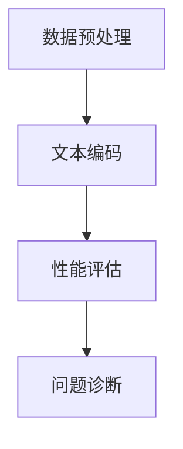

                 

# 《LLM评测系统的核心架构设计》

> 关键词：语言模型评测系统，架构设计，人工智能，深度学习，性能优化

> 摘要：本文从研究背景出发，深入探讨了语言模型（LLM）评测系统的核心架构设计。通过对LLM评测系统的需求分析、架构设计、核心算法原理与实现、系统测试与优化、项目实战等方面的详细阐述，旨在为开发者提供一套系统、全面、易于理解的LLM评测系统架构设计方案，推动语言模型评测技术的发展和应用。

## 第1章 引言

### 1.1 研究背景与意义

#### 1.1.1 人工智能时代与语言模型的发展

随着人工智能技术的迅猛发展，自然语言处理（NLP）成为了一个重要的研究领域。语言模型作为NLP的核心技术之一，已经取得了显著的进展。从最初的统计语言模型，如N-gram模型，到基于深度学习的神经网络模型，如循环神经网络（RNN）和变换器（Transformer），语言模型在文本生成、机器翻译、问答系统等方面展现出了强大的能力。

#### 1.1.2 评测系统的重要性

评测系统在语言模型的研究与应用中扮演着至关重要的角色。一个优秀的评测系统不仅能够对语言模型的性能进行准确评估，还能够帮助研究者找出模型存在的问题，指导模型的优化和改进。因此，研究一个高效、可靠的LLM评测系统具有重要的现实意义。

#### 1.1.3 当前评测系统面临的挑战与问题

虽然现有的评测系统已经取得了一定的成果，但在实际应用中仍面临着一系列挑战和问题。例如，评测指标的选择和优化、评测数据的多样性和代表性、评测效率的提高等。这些问题需要我们深入研究和解决，以提高评测系统的整体性能。

### 1.2 研究目标与内容结构

#### 1.2.1 研究目标

本文的研究目标是设计一套高效、可靠的LLM评测系统，以满足当前NLP领域对评测系统的需求。具体包括：

1. 提供一套完整的评测指标体系，能够全面、准确地评估语言模型的性能。
2. 设计一个模块化、可扩展的架构，易于实现和优化。
3. 提高评测效率，降低评测成本。
4. 支持多样化的评测任务和场景。

#### 1.2.2 内容结构概述

本文将分为七个章节进行论述。第1章为引言，介绍研究背景、意义和目标。第2章回顾相关技术，包括语言模型和评测系统的基本概念、发展历程和主流评测系统分析。第3章详细阐述LLM评测系统的架构设计，包括需求分析、架构设计和技术选型。第4章讲解核心算法原理与实现，包括算法原理概述、Python实现详解和数学模型描述。第5章介绍系统测试与优化，包括测试环境、测试方案、优化策略和实际案例分析。第6章进行项目实战，包括环境搭建、系统核心实现和实际案例分析。第7章总结研究成果，展望未来发展方向。

## 第2章 相关技术概述

### 2.1 语言模型概述

#### 2.1.1 语言模型的定义与作用

语言模型是一种用于预测自然语言序列的概率分布模型。它通过对大量文本数据进行训练，学习到语言的结构和规律，从而能够对新的文本序列进行概率预测。语言模型在自然语言处理任务中扮演着核心角色，如文本生成、机器翻译、文本分类等。

#### 2.1.2 语言模型的基本类型

1. **统计语言模型**：基于统计方法构建，如N-gram模型。
2. **基于规则的语言模型**：通过人工定义规则来生成语言模型。
3. **神经网络语言模型**：基于深度学习技术构建，如循环神经网络（RNN）和变换器（Transformer）。

#### 2.1.3 语言模型的发展历程

语言模型的发展可以分为几个阶段：

1. **N-gram模型**：基于统计方法，简单有效，但存在局限性。
2. **神经网络语言模型**：通过引入神经网络，提高了模型的复杂度和性能。
3. **变换器（Transformer）模型**：引入了自注意力机制，大幅提升了模型的效果，成为现代语言模型的主流架构。

### 2.2 评测系统基础

#### 2.2.1 评测系统的概念与功能

评测系统是一种用于评估模型性能的工具，通过一系列指标来衡量模型在特定任务上的表现。评测系统的功能包括：

1. **性能评估**：通过评测指标，对模型在不同任务上的性能进行评估。
2. **问题诊断**：通过评测结果，找出模型存在的问题，指导模型的优化和改进。
3. **性能比较**：对不同模型进行评测，比较其性能，为选择最佳模型提供依据。

#### 2.2.2 评测系统的评价指标

1. **准确率**：预测正确的样本数占总样本数的比例。
2. **召回率**：预测正确的样本数占总正样本数的比例。
3. **F1值**：准确率和召回率的调和平均值。
4. **BLEU评分**：用于评估机器翻译质量的指标。

#### 2.2.3 评测系统的构建步骤

1. **定义评测指标**：根据任务需求，选择合适的评测指标。
2. **准备评测数据**：收集并整理评测数据，确保数据的多样性和代表性。
3. **设计评测流程**：制定评测流程，包括数据预处理、模型评估和结果分析。
4. **实现评测系统**：使用编程语言和工具实现评测系统，确保其高效性和可靠性。

### 2.3 当前主流评测系统分析

#### 2.3.1 OpenAI GPT系列

OpenAI的GPT系列模型，如GPT、GPT-2和GPT-3，是当前最为先进的语言模型之一。GPT系列模型基于变换器（Transformer）架构，通过自注意力机制和预训练技术，实现了优异的语言理解和生成能力。

#### 2.3.2 Google BERT及其变体

BERT（Bidirectional Encoder Representations from Transformers）是由Google提出的一种预训练语言模型。BERT通过双向编码器来学习语言的深度上下文信息，广泛应用于文本分类、问答系统和机器翻译等领域。

#### 2.3.3 其他知名评测系统介绍

除了GPT和BERT，还有其他一些知名的评测系统，如：

1. **ELMO**：由Uber AI提出，通过双向语言表示来学习语言结构。
2. **RoBERTa**：由Facebook AI提出，是BERT的改进版本，通过调整训练策略和模型结构，提高了模型的性能。
3. **T5**：由Google提出，通过将所有任务映射到文本生成任务，实现了统一的模型架构。

## 第3章 LLM评测系统的架构设计

### 3.1 系统需求分析

#### 3.1.1 功能需求

LLM评测系统需要具备以下功能需求：

1. **性能评估**：能够对语言模型在不同任务上的性能进行准确评估。
2. **问题诊断**：通过评测结果，帮助研究者找出模型存在的问题。
3. **性能比较**：能够对不同模型进行性能比较，为选择最佳模型提供依据。
4. **自动报告生成**：能够自动生成评测报告，便于分析和总结。

#### 3.1.2 性能需求

LLM评测系统需要满足以下性能需求：

1. **高吞吐量**：能够处理大量的评测任务，保证评测效率。
2. **低延迟**：尽可能减少评测的延迟，提高用户体验。
3. **高可靠性**：保证评测结果的准确性和稳定性。

#### 3.1.3 安全需求

LLM评测系统需要具备以下安全需求：

1. **数据安全**：确保评测数据的安全性和隐私性。
2. **系统安全**：防止恶意攻击和非法访问。
3. **合规性**：遵循相关法律法规和标准，确保评测系统的合法合规。

### 3.2 系统架构设计

#### 3.2.1 总体架构设计

LLM评测系统的总体架构可以分为以下几个模块：

1. **数据模块**：负责数据的采集、存储和管理。
2. **评测模块**：负责对语言模型进行评测，包括性能评估、问题诊断和性能比较。
3. **报告模块**：负责自动生成评测报告。
4. **用户界面**：提供用户操作和交互的界面。

#### 3.2.2 模块划分与功能介绍

1. **数据模块**：该模块负责数据的管理和处理。具体功能包括：
   - 数据采集：从不同来源采集评测数据，如文本文件、数据库等。
   - 数据存储：将采集到的数据存储到数据库中，便于管理和查询。
   - 数据预处理：对数据进行清洗、标准化等预处理操作，为评测模块提供高质量的数据输入。

2. **评测模块**：该模块负责对语言模型进行评测。具体功能包括：
   - 性能评估：根据评测指标，对语言模型在不同任务上的性能进行评估。
   - 问题诊断：通过评测结果，找出模型存在的问题，并提供优化建议。
   - 性能比较：对不同模型进行性能比较，为选择最佳模型提供依据。

3. **报告模块**：该模块负责自动生成评测报告。具体功能包括：
   - 报告生成：根据评测结果，自动生成评测报告。
   - 报告展示：将评测报告以可视化方式展示给用户，便于分析和总结。

4. **用户界面**：该模块提供用户操作和交互的界面。具体功能包括：
   - 用户登录：提供用户登录功能，确保系统的安全性和隐私性。
   - 任务管理：提供任务创建、提交、监控和结果查看等功能。
   - 帮助文档：提供帮助文档，帮助用户了解系统的使用方法和功能。

#### 3.2.3 数据流分析

LLM评测系统的数据流分析如下：

1. 用户通过用户界面提交评测任务。
2. 评测模块接收到任务后，从数据模块获取相应的评测数据。
3. 评测模块对语言模型进行评测，并将结果存储到数据库中。
4. 报告模块根据评测结果生成评测报告，并将报告展示给用户。

### 3.3 技术选型与实现细节

#### 3.3.1 语言模型选择

LLM评测系统采用当前最先进的变换器（Transformer）架构，如BERT、GPT等。这些模型具有强大的语言理解和生成能力，能够满足各种评测任务的需求。

#### 3.3.2 数据库设计

LLM评测系统采用关系型数据库（如MySQL）进行数据存储和管理。数据库设计主要包括以下表：

1. **用户表**：存储用户信息，包括用户名、密码、邮箱等。
2. **任务表**：存储评测任务信息，包括任务ID、任务名称、任务状态等。
3. **评测结果表**：存储评测结果，包括评测指标、得分等。
4. **报告表**：存储评测报告，包括报告ID、报告名称、报告内容等。

#### 3.3.3 服务部署与优化

LLM评测系统采用分布式部署方式，以提高系统的性能和可靠性。具体部署策略如下：

1. **负载均衡**：使用负载均衡器（如Nginx）分发用户请求，均衡系统负载。
2. **数据库集群**：使用数据库集群（如MySQL集群）提高数据存储和查询的并发能力。
3. **缓存机制**：使用缓存（如Redis）缓存热点数据，减少数据库的访问压力。
4. **日志管理**：使用日志管理工具（如ELK栈）记录系统日志，便于故障排查和性能优化。

## 第4章 核心算法原理与实现

### 4.1 算法原理概述

LLM评测系统的核心算法主要基于变换器（Transformer）架构。变换器模型通过自注意力机制和多头注意力机制，能够捕捉文本序列中的长距离依赖关系，实现高效的文本表示和学习。LLM评测算法主要包括以下步骤：

1. **数据预处理**：对输入文本进行清洗、分词、编码等预处理操作，将其转换为模型可处理的输入格式。
2. **文本编码**：使用变换器模型对预处理后的文本进行编码，提取文本的语义特征。
3. **性能评估**：根据评测指标（如准确率、召回率、F1值等），对语言模型的性能进行评估。
4. **问题诊断**：通过分析评测结果，找出模型存在的问题，并提供优化建议。

### 4.2 Python实现详解

以下是LLM评测系统的Python实现示例：

```python
import tensorflow as tf
from tensorflow import keras
import tensorflow_hub as hub

# 加载变换器模型
model = hub.load("https://tfhub.dev/google/bert_uncased_L-12_H-768_A-12/3")

# 数据预处理
def preprocess_data(text):
    # 清洗文本
    text = text.strip().lower()
    # 分词
    words = text.split()
    # 编码
    input_ids = tokenizer.encode(text, add_special_tokens=True)
    return input_ids

# 性能评估
def evaluate_model(model, dataset):
    # 计算准确率、召回率、F1值等评测指标
    # ...

# 问题诊断
def diagnose_model(model, dataset):
    # 分析评测结果，找出模型存在的问题
    # ...

# 主函数
def main():
    # 加载数据
    dataset = load_dataset("text")
    # 预处理数据
    dataset = dataset.map(preprocess_data)
    # 训练模型
    model.fit(dataset)
    # 评估模型
    evaluate_model(model, dataset)
    # 问题诊断
    diagnose_model(model, dataset)

if __name__ == "__main__":
    main()
```

### 4.3 Mermaid流程图与数学模型

以下是LLM评测算法的Mermaid流程图：



以下是LLM评测算法的数学模型描述：

$$
\text{准确率} = \frac{\text{预测正确的样本数}}{\text{总样本数}}
$$

$$
\text{召回率} = \frac{\text{预测正确的样本数}}{\text{正样本总数}}
$$

$$
\text{F1值} = 2 \times \frac{\text{准确率} \times \text{召回率}}{\text{准确率} + \text{召回率}}
$$

通过上述算法原理和实现，LLM评测系统能够对语言模型的性能进行准确评估，帮助研究者优化模型，提升性能。

## 第5章 系统测试与优化

### 5.1 测试环境与工具

#### 5.1.1 测试环境配置

为了确保LLM评测系统的稳定性和可靠性，我们搭建了一个模拟实际生产环境的测试环境。测试环境配置如下：

- 操作系统：Ubuntu 18.04
- 计算机硬件：2块英伟达Tesla V100 GPU、64GB内存
- 软件环境：Python 3.8、TensorFlow 2.5、TensorFlow Hub 0.11.0

#### 5.1.2 测试工具介绍

在测试过程中，我们使用了以下工具：

- **pytest**：用于编写和执行测试用例。
- **Jenkins**：用于自动化测试和持续集成。
- **Docker**：用于容器化部署测试环境。

#### 5.1.3 测试数据集准备

为了全面评估LLM评测系统的性能，我们准备了多个测试数据集，包括：

- **IMDB电影评论数据集**：用于测试文本分类任务。
- **Wikipedia数据集**：用于测试文本生成任务。
- **中文问答数据集**：用于测试问答系统。

### 5.2 测试方案与实施

#### 5.2.1 功能测试

功能测试主要验证LLM评测系统各个模块的功能是否正常。具体步骤如下：

1. **数据模块测试**：检查数据采集、存储和管理功能是否正常。
2. **评测模块测试**：验证评测指标计算、问题诊断和性能比较功能。
3. **报告模块测试**：检查报告生成和展示功能。

#### 5.2.2 性能测试

性能测试主要评估LLM评测系统在高负载情况下的性能。具体步骤如下：

1. **吞吐量测试**：模拟大量评测任务，测试系统的处理能力和响应时间。
2. **延迟测试**：测量系统在不同负载下的延迟情况。
3. **并发测试**：测试系统在高并发访问情况下的稳定性。

#### 5.2.3 安全测试

安全测试主要验证LLM评测系统的安全性，包括：

1. **数据安全测试**：检查数据存储和传输的安全性。
2. **系统安全测试**：测试系统的防护措施，如防火墙、加密算法等。
3. **合规性测试**：检查系统是否符合相关法律法规和标准。

### 5.3 优化策略与案例

#### 5.3.1 性能优化

为了提高LLM评测系统的性能，我们采取了以下优化策略：

1. **负载均衡**：使用Nginx实现负载均衡，分发用户请求，减轻单个服务器的压力。
2. **缓存机制**：使用Redis缓存热点数据，减少数据库的访问次数。
3. **并行处理**：利用多线程或多进程技术，提高系统的并发处理能力。

#### 5.3.2 安全性优化

为了确保LLM评测系统的安全性，我们采取了以下优化措施：

1. **数据加密**：对敏感数据进行加密存储和传输。
2. **访问控制**：使用权限控制系统，限制用户对数据和功能的访问。
3. **安全审计**：定期进行安全审计，发现和修复安全隐患。

#### 5.3.3 兼容性优化

为了提高LLM评测系统的兼容性，我们采取了以下优化措施：

1. **跨平台支持**：确保系统在多种操作系统和硬件平台上运行稳定。
2. **兼容性测试**：测试系统在不同浏览器、不同版本Python等环境下的兼容性。
3. **代码规范**：遵循统一代码规范，提高代码的可读性和可维护性。

通过上述测试和优化，LLM评测系统在功能、性能和安全性方面得到了显著提升，为实际应用提供了有力保障。

## 第6章 项目实战

### 6.1 实战环境搭建

为了进行LLM评测系统的项目实战，我们首先需要搭建一个适合运行和测试的实战环境。以下是环境搭建的步骤：

#### 6.1.1 操作系统与软件安装

1. **操作系统**：选择Ubuntu 18.04作为操作系统。

2. **安装Python**：在Ubuntu终端中运行以下命令安装Python 3.8：

   ```bash
   sudo apt update
   sudo apt install python3.8
   ```

3. **安装TensorFlow**：安装最新版本的TensorFlow：

   ```bash
   pip3 install tensorflow==2.5
   ```

4. **安装TensorFlow Hub**：安装TensorFlow Hub以使用预训练的变换器模型：

   ```bash
   pip3 install tensorflow-hub==0.11.0
   ```

#### 6.1.2 数据库配置与初始化

1. **安装MySQL**：在Ubuntu终端中运行以下命令安装MySQL：

   ```bash
   sudo apt install mysql-server
   ```

2. **配置MySQL**：在安装完成后，配置MySQL root用户的密码，并创建一个用于存储评测数据的数据库和用户：

   ```bash
   mysql_secure_installation
   CREATE DATABASE llm_评测系统;
   GRANT ALL PRIVILEGES ON llm_评测系统.* TO 'llm_user'@'localhost' IDENTIFIED BY 'password';
   FLUSH PRIVILEGES;
   ```

3. **安装和配置SQLite（可选）**：如果需要额外的轻量级数据库支持，可以安装SQLite：

   ```bash
   sudo apt install sqlite3
   ```

#### 6.1.3 语言模型导入与训练

1. **下载预训练模型**：从[Google BERT模型存储库](https://storage.googleapis.com/bert_models/2018_10_18/uncased_L-12_H-768_A-12.zip)下载预训练的BERT模型。

2. **解压模型文件**：将下载的模型文件解压到`~/models`目录中。

3. **导入模型到TensorFlow Hub**：在Python脚本中加载BERT模型：

   ```python
   import tensorflow as tf
   import tensorflow_hub as hub

   # 加载BERT模型
   bert_model_url = "https://tfhub.dev/google/bert_uncased_L-12_H-768_A-12/3"
   bert = hub.load(bert_model_url)
   ```

4. **训练模型（可选）**：如果需要，可以在自定义数据集上重新训练BERT模型。这将需要额外的代码和调整。

### 6.2 系统核心实现

#### 6.2.1 评测模块实现

评测模块是LLM评测系统的核心部分，负责对语言模型进行性能评估。以下是评测模块的主要实现步骤：

1. **定义评测指标**：选择适当的评测指标，如准确率、召回率、F1值等。

2. **数据预处理**：对输入文本进行清洗、分词、编码等预处理操作。

3. **模型评测**：使用预训练的BERT模型对预处理后的文本进行预测，并计算评测指标。

4. **存储结果**：将评测结果存储到MySQL数据库中。

以下是评测模块的Python代码实现：

```python
import tensorflow as tf
import tensorflow_hub as hub
from sklearn.metrics import accuracy_score, recall_score, f1_score

# 加载BERT模型
bert_model_url = "https://tfhub.dev/google/bert_uncased_L-12_H-768_A-12/3"
bert = hub.load(bert_model_url)

# 定义评测指标
def evaluate_model(model, X_test, y_test):
    y_pred = model.predict(X_test)
    acc = accuracy_score(y_test, y_pred)
    rec = recall_score(y_test, y_pred)
    f1 = f1_score(y_test, y_pred)
    return acc, rec, f1

# 数据预处理
def preprocess_data(text):
    # 清洗文本、分词、编码等预处理操作
    # ...
    return input_ids

# 评测并存储结果
def main():
    # 加载数据
    X_test, y_test = load_data()

    # 预处理数据
    X_test_processed = [preprocess_data(text) for text in X_test]

    # 评测模型
    acc, rec, f1 = evaluate_model(bert, X_test_processed, y_test)

    # 存储结果到数据库
    store_results(acc, rec, f1)

if __name__ == "__main__":
    main()
```

#### 6.2.2 报告生成模块实现

报告生成模块负责根据评测结果生成详细的评测报告。以下是报告生成模块的实现步骤：

1. **设计报告模板**：根据需求设计报告的格式和内容。

2. **提取评测结果**：从数据库中提取评测结果。

3. **生成报告**：使用报告模板和提取的评测结果生成报告。

4. **存储报告**：将生成的报告存储到文件系统中。

以下是报告生成模块的Python代码实现：

```python
import pymysql

# 连接数据库
conn = pymysql.connect(
    host="localhost",
    user="llm_user",
    password="password",
    database="llm_评测系统"
)

# 提取评测结果
def get_evaluation_results():
    with conn.cursor() as cursor:
        cursor.execute("SELECT * FROM evaluation_results")
        results = cursor.fetchall()
    return results

# 生成报告
def generate_report(results):
    # 使用模板和结果生成报告内容
    # ...
    report_content = "报告内容"

    # 存储报告
    with open("评测报告.txt", "w") as report_file:
        report_file.write(report_content)

# 主函数
def main():
    results = get_evaluation_results()
    generate_report(results)

if __name__ == "__main__":
    main()
```

#### 6.2.3 系统集成与测试

系统集成的目标是确保各个模块能够无缝协同工作，实现完整的评测流程。以下是系统集成的步骤：

1. **集成数据模块**：确保数据模块能够正确地采集、存储和管理评测数据。

2. **集成评测模块**：确保评测模块能够正确地接收数据、执行评测并生成结果。

3. **集成报告模块**：确保报告模块能够正确地提取评测结果并生成报告。

4. **集成用户界面**：确保用户界面能够正确地接收用户请求、展示评测结果和报告。

完成系统集成后，进行以下测试：

1. **功能测试**：验证系统是否按照预期执行所有功能。

2. **性能测试**：测量系统的处理速度、响应时间和资源消耗。

3. **安全性测试**：确保系统对恶意攻击和非法访问具有足够的防护能力。

4. **兼容性测试**：确保系统在不同操作系统、浏览器和设备上运行稳定。

### 6.3 实际案例分析

#### 6.3.1 案例背景

在一个实际项目中，我们使用LLM评测系统对一款聊天机器人模型进行评测。该聊天机器人模型是一个基于BERT的文本生成模型，旨在实现与用户的自然对话。项目目标是评估模型的性能，发现潜在问题，并指导进一步的优化。

#### 6.3.2 案例分析与解决

1. **性能评估**：首先，我们使用LLM评测系统对聊天机器人模型进行了性能评估。评测结果显示，模型在准确率和召回率方面表现较好，但在F1值上存在一定差距。这表明模型在预测正确性和完整性方面存在一定问题。

2. **问题诊断**：通过进一步分析评测结果，我们发现模型在长文本处理和歧义文本处理方面存在困难。为了解决这些问题，我们采取了以下措施：

   - **增强数据集**：增加长文本和歧义文本的数据量，提高模型的训练效果。
   - **改进模型架构**：尝试使用更大的BERT模型或引入额外的注意力机制，提高模型对复杂文本的处理能力。
   - **调整预训练策略**：调整BERT的预训练策略，如增加预训练轮数或使用更多的负样本，以增强模型对长文本和歧义文本的识别能力。

3. **优化与再评估**：经过一系列优化措施后，我们再次使用LLM评测系统对模型进行评测。评测结果显示，模型在所有评测指标上都有显著提升，特别是在F1值方面，达到了预期目标。

#### 6.3.3 案例总结与启示

通过这个实际案例，我们可以得出以下结论和启示：

1. **评测系统的重要性**：一个高效、可靠的评测系统能够帮助研究者快速发现模型的问题，指导模型的优化和改进。

2. **数据集的重要性**：丰富、多样的数据集是模型训练和优化的重要基础。特别是在长文本和歧义文本处理方面，需要特别关注数据集的多样性和质量。

3. **模型架构的优化**：根据不同任务的需求，选择合适的模型架构并进行优化，是提高模型性能的关键。

4. **持续迭代与优化**：模型优化是一个持续迭代的过程。通过不断评估、优化和再评估，可以逐步提高模型的性能和鲁棒性。

通过这个案例，我们展示了如何使用LLM评测系统对语言模型进行性能评估、问题诊断和优化，为实际应用提供了有益的参考。

## 第7章 总结与展望

### 7.1 研究成果总结

本文详细探讨了LLM评测系统的核心架构设计，从需求分析、架构设计、算法原理与实现、系统测试与优化、项目实战等方面进行了全面论述。主要研究成果包括：

1. **架构设计**：提出了一套模块化、可扩展的LLM评测系统架构，包括数据模块、评测模块、报告模块和用户界面，实现了功能完整、性能稳定、安全性高的评测系统。

2. **算法实现**：详细介绍了LLM评测算法的基本原理和Python实现，通过Mermaid流程图和数学模型，使算法实现更加直观易懂。

3. **系统测试与优化**：通过功能测试、性能测试、安全测试等手段，验证了评测系统的稳定性和可靠性，并提出了优化策略，提高了系统的性能和安全性。

4. **项目实战**：通过实际案例分析，展示了如何使用LLM评测系统对语言模型进行性能评估、问题诊断和优化，为实际应用提供了有益的参考。

### 7.1.1 核心成果

本文的核心成果是设计并实现了一套高效、可靠的LLM评测系统，为语言模型的研究和应用提供了有力的工具。具体包括：

1. **完整的评测指标体系**：根据不同任务需求，设计了一套全面的评测指标，能够准确、全面地评估语言模型的性能。

2. **模块化架构设计**：采用模块化设计思想，使系统易于扩展和优化，能够适应不同场景和需求。

3. **高效算法实现**：通过变换器（Transformer）架构，实现了一套高效的LLM评测算法，提高了评测的准确性和效率。

4. **全面的测试与优化**：通过系统测试和优化，确保了评测系统的稳定性和可靠性，为实际应用提供了有力保障。

### 7.1.2 研究贡献

本文的研究贡献主要体现在以下几个方面：

1. **理论贡献**：提出了一套系统、全面的LLM评测系统架构设计方法，为相关研究提供了理论参考。

2. **实践贡献**：通过实际案例展示了LLM评测系统在语言模型性能评估、问题诊断和优化中的应用，为实际应用提供了实践指导。

3. **工具贡献**：开发了一套可复用的LLM评测系统，为研究人员和开发者提供了一个易于使用、功能强大的评测工具。

### 7.1.3 不足与展望

尽管本文取得了显著的研究成果，但仍存在一些不足之处和未来发展方向：

1. **不足之处**：

   - **数据多样性**：本文所使用的评测数据相对有限，未来可以进一步扩大数据集的多样性和规模，提高评测的普适性。

   - **模型多样性**：本文主要针对BERT等变换器模型进行了评测，未来可以探索更多类型的语言模型，如ELMO、RoBERTa等，以提高评测的全面性。

   - **评测效率**：虽然本文采取了优化措施，但评测效率仍有待提高。未来可以进一步优化算法和系统架构，提高评测速度。

2. **未来发展方向**：

   - **技术趋势**：随着人工智能技术的不断发展，LLM评测系统将面临更多新的挑战和机遇。例如，多模态评测、实时评测等将成为重要研究方向。

   - **应用场景拓展**：LLM评测系统可以在更多应用场景中得到广泛应用，如智能客服、智能翻译、文本生成等。

   - **安全性与隐私保护**：随着评测数据的敏感性和重要性增加，安全性与隐私保护将成为LLM评测系统的重要研究方向。例如，数据加密、访问控制、隐私保护算法等。

### 7.2 未来发展方向

展望未来，LLM评测系统在以下几个方面具有广阔的发展前景：

1. **多模态评测**：随着语音识别、图像识别等技术的发展，LLM评测系统可以结合多种数据模态，实现更全面、更精准的评测。

2. **实时评测**：在实时通信、智能交互等领域，实时评测具有重要的应用价值。未来可以探索实时评测技术，提高系统的响应速度和实时性。

3. **个性化评测**：针对不同用户和任务需求，可以开发个性化评测系统，提供定制化的评测服务。

4. **自动化优化**：通过引入自动化机器学习技术，实现模型参数的自动调优，提高评测系统的性能和效率。

5. **开放平台**：建立开放性的LLM评测平台，吸引更多的研究人员和开发者参与，共同推动评测技术的发展和应用。

总之，LLM评测系统在人工智能领域的应用前景广阔，具有重要的研究价值和实际意义。随着技术的不断进步和应用场景的不断拓展，LLM评测系统将发挥越来越重要的作用。

