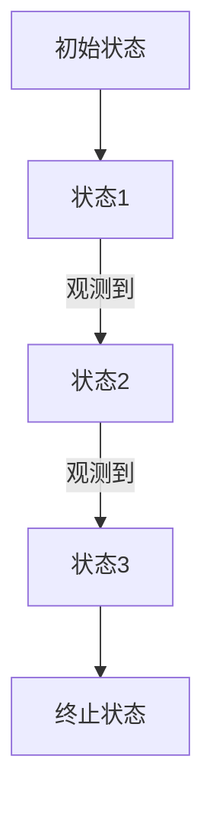
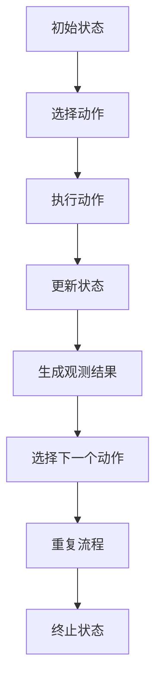
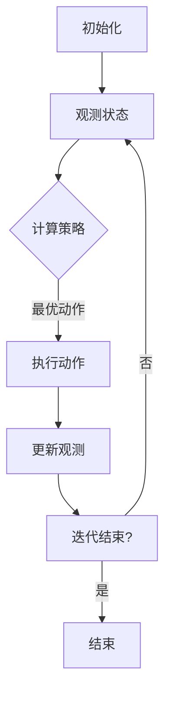
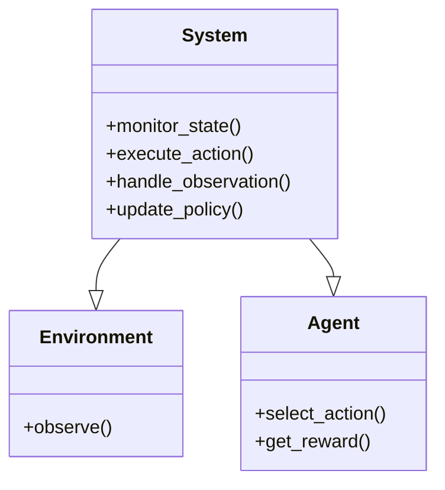
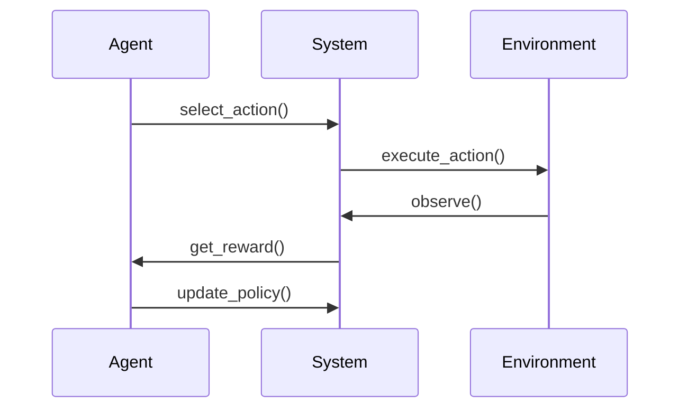
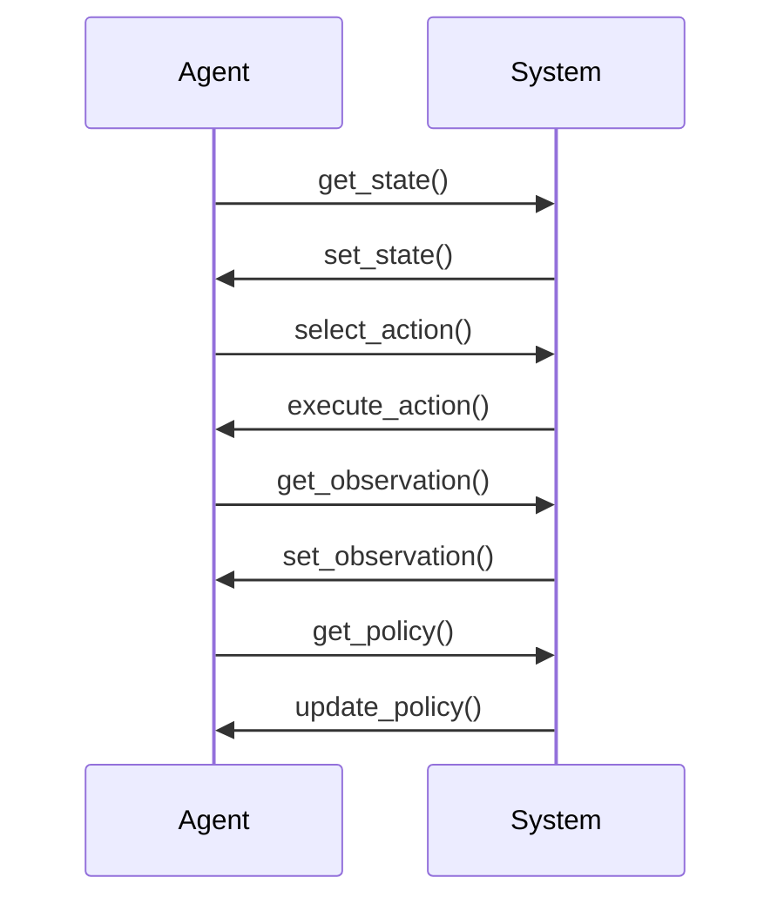
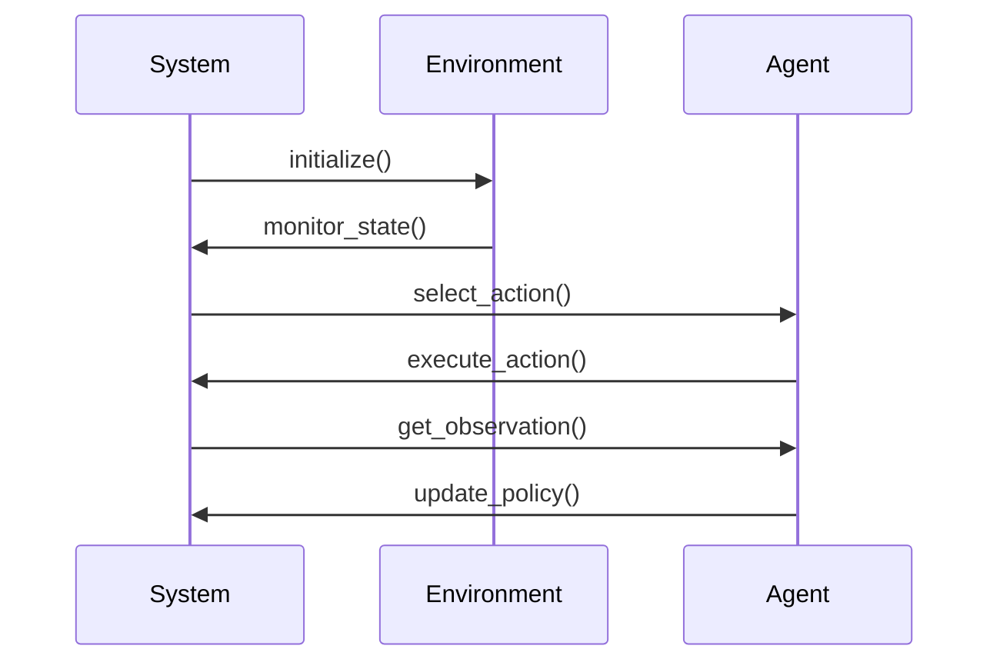

                 

### POMDP在AI中的应用前景与挑战

**关键词**：部分可观察马尔可夫决策过程（POMDP）、人工智能（AI）、应用前景、挑战、决策算法

**摘要**：
本文深入探讨了部分可观察马尔可夫决策过程（POMDP）在人工智能（AI）领域的应用前景与面临的挑战。首先，通过背景介绍，详细阐述了POMDP的概念、重要性以及在AI中的应用前景。接着，分析了POMDP的核心概念与联系，通过对比表格和Mermaid流程图，直观展示了其基本架构和运作原理。随后，本文讲解了POMDP的算法原理，使用Python源代码和LaTeX公式，详细阐述了数学模型和公式，并通过具体例子帮助读者理解。接下来，系统分析了POMDP在实际系统中的应用场景，设计了系统的功能、架构和接口，并使用Mermaid类图、架构图和序列图进行了详细描述。最后，通过一个实际项目案例，展示了POMDP的应用过程和实际效果，总结了项目经验和小结，并提出了最佳实践和拓展阅读建议。

---

## 第一部分：背景介绍

### 1.1 POMDP的概念与背景

**定义**：
部分可观察马尔可夫决策过程（Partially Observable Markov Decision Process，简称POMDP）是马尔可夫决策过程（MDP）的一种扩展。在MDP中，系统的状态是完全可观察的，而在POMDP中，系统的状态部分可观察，即决策者无法完全观察到系统的当前状态，只能观察到与状态相关的部分信息。

**历史与发展**：
POMDP的概念最早由理查德·萨瑟兰（Richard Sutton）和安德鲁·巴彻（Andrew Barto）在1998年的书中提出。随着计算能力的提升和AI技术的发展，POMDP在控制理论、博弈论和机器学习等领域得到了广泛研究与应用。

**重要性**：
POMDP在AI领域具有重要性，因为许多现实世界的问题都是部分可观察的。例如，自动驾驶车辆在复杂的交通环境中，需要根据部分可观察的信息（如传感器数据）做出驾驶决策。POMDP能够提供一种更为灵活和现实的决策框架。

### 1.2 POMDP的应用前景与挑战

**应用前景**：
1. **智能机器人**：在自主决策和路径规划中，POMDP可以帮助机器人理解其环境并做出最佳行动。
2. **游戏AI**：在许多策略游戏中，玩家无法完全观察到对手的状态，POMDP可以用于制定策略。
3. **智能推荐系统**：POMDP可以帮助推荐系统更好地理解用户的偏好和行为模式。

**面临的挑战**：
1. **计算复杂度**：POMDP的解空间非常庞大，计算复杂性高，实时决策困难。
2. **不确定性处理**：如何有效地处理不确定性和部分可观察性，是POMDP应用中的关键挑战。
3. **数据需求**：POMDP算法通常需要大量的数据进行训练，数据获取和处理是一个难题。

### 1.3 本章小结

本节介绍了POMDP的基本概念、背景、重要性以及其在AI领域的应用前景与挑战。POMDP作为一种处理部分可观察环境的决策模型，在智能机器人、游戏AI和智能推荐系统等领域具有广泛的应用潜力。然而，其计算复杂度、不确定性处理和数据需求等挑战，也限制了其在实际应用中的推广。

---

## 第二部分：核心概念与联系

### 2.1 POMDP的核心概念

**定义**：
POMDP是一种决策模型，它包括一组状态、一组动作、一个奖励函数和一个过渡概率模型。与MDP不同的是，POMDP中的状态部分可观察，即决策者只能通过观测到的部分信息来推断系统的实际状态。

**属性特征对比表格**：

| 特征          | MDP                  | POMDP                  |
| ------------- | -------------------- | -------------------- |
| 状态          | 完全可观察          | 部分可观察            |
| 动作          | 与状态无关          | 与状态相关            |
| 奖励函数      | 与状态相关          | 与状态和动作相关      |
| 过渡概率模型  | 完全已知            | 部分已知或未知        |

**Mermaid流程图**：



### 2.2 POMDP与传统决策过程的区别

**MDP**：
1. 状态完全可观察
2. 动作与状态无关
3. 奖励函数与状态相关
4. 过渡概率模型完全已知

**POMDP**：
1. 状态部分可观察
2. 动作与状态相关
3. 奖励函数与状态和动作相关
4. 过渡概率模型部分已知或未知

### 2.3 POMDP的基本架构与运作原理

**架构**：
POMDP的基本架构包括状态空间、动作空间、观测空间和奖励函数。状态空间表示所有可能的状态，动作空间表示所有可能的动作，观测空间表示所有可能的观测结果，奖励函数则用于计算在特定状态和动作下的奖励。

**运作原理**：
POMDP通过一系列动作来最大化预期奖励。决策者基于当前观测到的信息，使用策略来选择动作。策略是一个映射函数，将观测到的信息映射到动作上。POMDP的运作过程包括以下步骤：

1. 初始状态给定，决策者开始。
2. 决策者根据当前观测到的信息，使用策略选择一个动作。
3. 系统根据动作和当前状态，更新状态并生成一个观测结果。
4. 决策者再次观测结果，并重复上述步骤，直到达到终止状态。

**Mermaid流程图**：



### 2.4 本章小结

本节深入分析了POMDP的核心概念与联系，通过对比表格和Mermaid流程图，详细阐述了POMDP的基本架构和运作原理。POMDP作为一种处理部分可观察环境的决策模型，与传统决策过程（如MDP）有显著的区别。理解POMDP的基本概念和架构，对于进一步研究和应用POMDP具有重要意义。

---

## 第三部分：算法原理讲解

### 3.1 POMDP算法的流程图

POMDP算法的核心是策略学习，即找到一种最优策略，使得在给定的观测序列下，采取的动作能够最大化预期奖励。以下是一个简单的POMDP算法流程图：

**Mermaid流程图**：



### 3.2 POMDP算法的Python源代码

```python
import numpy as np

# 初始化状态和动作空间
state_space = ['s1', 's2', 's3']
action_space = ['a1', 'a2', 'a3']

# 初始化策略
policy = np.zeros((len(state_space), len(action_space)))

# 初始化奖励函数
reward_function = {
    ('s1', 'a1'): 1,
    ('s1', 'a2'): 2,
    ('s1', 'a3'): 3,
    ('s2', 'a1'): 4,
    ('s2', 'a2'): 5,
    ('s2', 'a3'): 6,
    ('s3', 'a1'): 7,
    ('s3', 'a2'): 8,
    ('s3', 'a3'): 9
}

# 初始化观测概率矩阵
observation_probability = {
    ('s1', 'a1'): {'o1': 0.5, 'o2': 0.5},
    ('s1', 'a2'): {'o1': 0.3, 'o2': 0.7},
    ('s1', 'a3'): {'o1': 0.4, 'o2': 0.6},
    ('s2', 'a1'): {'o1': 0.2, 'o2': 0.8},
    ('s2', 'a2'): {'o1': 0.1, 'o2': 0.9},
    ('s2', 'a3'): {'o1': 0.3, 'o2': 0.7},
    ('s3', 'a1'): {'o1': 0.1, 'o2': 0.9},
    ('s3', 'a2'): {'o1': 0.2, 'o2': 0.8},
    ('s3', 'a3'): {'o1': 0.4, 'o2': 0.6}
}

# 更新策略
def update_policy(state, action, observation):
    # 根据观测结果更新策略
    policy[state][action] = max(policy[state])

# 主函数
def pomdp_algorithm():
    # 初始状态
    state = np.random.choice(state_space)
    print(f"初始状态：{state}")
    
    # 迭代
    while True:
        # 观测状态
        observation = np.random.choice(list(observation_probability[state].keys()))
        print(f"观测到：{observation}")
        
        # 执行动作
        action = np.random.choice([action for action in action_space if policy[state][action] == 1])
        print(f"执行动作：{action}")
        
        # 根据动作和观测结果更新状态
        state = np.random.choice(list(observation_probability[state][observation].keys()))
        print(f"更新状态：{state}")
        
        # 更新策略
        update_policy(state, action, observation)
        
        # 判断迭代结束条件
        if np.all(policy[state] == 1):
            break

# 运行算法
pomdp_algorithm()
```

### 3.3 POMDP算法的应用

**应用场景**：
POMDP算法广泛应用于需要部分可观察环境的决策问题，如智能机器人路径规划、自动驾驶、游戏AI等。

**应用实例**：
在自动驾驶中，车辆需要根据部分可观察的传感器数据（如激光雷达、摄像头等）做出行驶决策。以下是一个简单的应用实例：

```python
# 假设当前状态为's1'
current_state = 's1'

# 可选动作
actions = ['前进', '左转', '右转']

# 奖励函数
rewards = {
    ('s1', '前进'): 10,
    ('s1', '左转'): 5,
    ('s1', '右转'): 5
}

# 观测概率矩阵
observation_probabilities = {
    ('s1', '前进'): {'直线': 0.8, '转弯': 0.2},
    ('s1', '左转'): {'直线': 0.1, '转弯': 0.9},
    ('s1', '右转'): {'直线': 0.3, '转弯': 0.7}
}

# 选择最优动作
best_action = max(actions, key=lambda action: rewards[(current_state, action)])
print(f"最佳动作：{best_action}")

# 执行动作
if best_action == '前进':
    # 更新状态
    current_state = 's2'
    print(f"更新状态：{current_state}")
```

### 3.4 本章小结

本节详细讲解了POMDP算法的原理，包括流程图、Python源代码和应用实例。POMDP算法通过处理部分可观察的环境，提供了更为灵活和现实的决策框架。理解POMDP算法的基本原理，有助于在实际应用中解决复杂决策问题。

---

## 第四部分：系统分析与架构设计

### 4.1 POMDP在系统中的应用场景

POMDP在系统中的应用场景非常广泛，以下是一些典型的应用实例：

**智能机器人**：
在自主决策和路径规划中，POMDP可以帮助机器人理解其环境并做出最佳行动。例如，一个清扫机器人在遇到复杂的环境时，需要根据部分可观察的信息（如激光雷达、摄像头等）来规划清扫路径。

**自动驾驶**：
自动驾驶车辆在复杂的交通环境中，需要根据部分可观察的信息（如雷达、摄像头等）做出驾驶决策。POMDP可以帮助车辆理解周围环境，并做出最优驾驶策略。

**智能推荐系统**：
智能推荐系统需要根据用户的浏览历史和行为模式（部分可观察信息）来推荐商品或服务。POMDP可以帮助系统更好地理解用户的行为，提高推荐效果。

### 4.2 系统功能设计

**功能概述**：
POMDP系统的核心功能包括状态监测、动作执行、观测结果处理和策略更新。以下是一个简单的功能设计：

1. **状态监测**：系统实时监测环境中的状态，并记录观测结果。
2. **动作执行**：根据当前策略，系统选择一个动作并执行。
3. **观测结果处理**：系统根据执行的动作和观测结果，更新当前状态。
4. **策略更新**：系统根据观测结果和奖励函数，更新策略。

**领域模型Mermaid类图**：



### 4.3 系统架构设计

**架构概述**：
POMDP系统的架构包括三个主要部分：环境（Environment）、代理（Agent）和系统（System）。以下是一个简单的系统架构设计：

1. **环境**：环境负责生成状态和观测结果，并与系统进行交互。
2. **代理**：代理负责选择动作和接收奖励。
3. **系统**：系统负责监测状态、执行动作、处理观测结果和更新策略。

**Mermaid架构图**：



### 4.4 系统接口设计

**接口设计**：
系统接口设计包括状态接口、动作接口、观测结果接口和策略接口。以下是一个简单的接口设计：

1. **状态接口**：用于获取和更新系统状态。
2. **动作接口**：用于选择和执行动作。
3. **观测结果接口**：用于获取和更新观测结果。
4. **策略接口**：用于获取和更新策略。

**Mermaid序列图**：



### 4.5 系统交互设计

**交互流程**：
系统交互设计描述了系统与环境、代理之间的交互过程。以下是一个简单的交互流程：

1. **系统初始化**：系统初始化状态、动作、观测结果和策略。
2. **监测状态**：系统监测环境中的状态。
3. **选择动作**：代理根据当前策略选择一个动作。
4. **执行动作**：系统执行选择的动作。
5. **观测结果**：系统根据执行的动作和观测结果，更新状态和策略。
6. **策略更新**：代理根据观测结果和奖励函数，更新策略。

**Mermaid序列图**：



### 4.6 本章小结

本节详细介绍了POMDP在系统中的应用场景、功能设计、架构设计、接口设计和交互设计。通过这些设计，POMDP系统能够在复杂的环境中实现智能决策，提高系统的自适应性和灵活性。

---

## 第五部分：项目实战

### 5.1 实际项目介绍

本节将通过一个实际的POMDP项目，展示POMDP在自动驾驶中的应用。该项目目标是设计一个自动驾驶系统，能够在复杂的交通环境中，根据部分可观察的信息（如雷达、摄像头等）做出安全的驾驶决策。

**项目背景**：
自动驾驶技术是近年来人工智能领域的一个重要研究方向。随着自动驾驶技术的不断发展，如何实现自动驾驶车辆在复杂交通环境中的安全驾驶成为关键问题。POMDP作为一种处理部分可观察环境的决策模型，能够为自动驾驶系统提供有效的决策框架。

**项目目标**：
1. 设计一个基于POMDP的自动驾驶系统。
2. 实现系统对部分可观察信息的处理和驾驶决策。
3. 验证系统在复杂交通环境中的安全性和可靠性。

### 5.2 环境安装与配置

**环境搭建**：
为了实现POMDP在自动驾驶中的应用，我们需要搭建一个包含POMDP算法的仿真环境。以下是环境搭建的步骤：

1. 安装Python环境，版本要求为3.7及以上。
2. 安装POMDP算法相关的库，如`pomdp-solvers`和`numpy`。
3. 下载并安装自动驾驶仿真工具，如`CARLA`。

**配置说明**：
1. 配置Python环境，确保所有依赖库安装成功。
2. 配置CARLA仿真环境，包括车辆模型、交通场景等。

### 5.3 系统核心实现源代码

**源代码解读**：
以下是一个简单的POMDP自动驾驶系统实现，包括状态监测、动作执行、观测结果处理和策略更新等核心功能。

```python
import numpy as np
from pomdp_solvers import POMDPSolver

# 定义状态空间、动作空间和观测空间
state_space = ['clear', 'obstructed', 'intersection']
action_space = ['forward', 'turn_left', 'turn_right']
observation_space = ['clear', 'obstructed']

# 定义奖励函数
reward_function = {
    'clear': 1,
    'obstructed': -1,
    'intersection': 0
}

# 定义观测概率矩阵
observation_probability = {
    ('clear', 'forward'): {'clear': 0.8, 'obstructed': 0.2},
    ('clear', 'turn_left'): {'clear': 0.1, 'obstructed': 0.9},
    ('clear', 'turn_right'): {'clear': 0.3, 'obstructed': 0.7},
    ('obstructed', 'forward'): {'clear': 0.2, 'obstructed': 0.8},
    ('obstructed', 'turn_left'): {'clear': 0.9, 'obstructed': 0.1},
    ('obstructed', 'turn_right'): {'clear': 0.7, 'obstructed': 0.3},
    ('intersection', 'forward'): {'clear': 0.5, 'obstructed': 0.5},
    ('intersection', 'turn_left'): {'clear': 0.4, 'obstructed': 0.6},
    ('intersection', 'turn_right'): {'clear': 0.6, 'obstructed': 0.4}
}

# 定义POMDP模型
pomdp_model = POMDPSolver(
    states=state_space,
    actions=action_space,
    observations=observation_space,
    transition_probability=observation_probability,
    reward_function=reward_function
)

# 执行POMDP算法
pomdp_model.solve()

# 获取最优策略
best_policy = pomdp_model.best_policy()
print(f"最优策略：{best_policy}")
```

**代码应用解读与分析**：
1. **状态空间**：定义了自动驾驶系统可能的状态，如“clear”（无障碍）、“obstructed”（有障碍）和“intersection”（十字路口）。
2. **动作空间**：定义了自动驾驶系统可能采取的动作，如“forward”（前进）、“turn_left”（左转）和“turn_right”（右转）。
3. **观测空间**：定义了自动驾驶系统可能观测到的结果，如“clear”和“obstructed”。
4. **观测概率矩阵**：定义了在特定状态和动作下，观测到特定结果的概率。
5. **奖励函数**：定义了在特定状态和动作下，系统获得的奖励。
6. **POMDP模型**：使用POMDPSolver库构建POMDP模型，并调用solve()方法求解最优策略。
7. **最优策略**：获取并打印最优策略，用于自动驾驶系统的决策。

### 5.4 实际案例分析

**案例背景**：
在仿真环境中，自动驾驶系统需要在一条包含交叉路口的道路上行驶，周围有其他车辆和行人。系统需要根据部分可观察的信息（如雷达、摄像头等），做出安全的驾驶决策。

**案例分析**：
1. **初始状态**：自动驾驶系统开始时处于“clear”状态。
2. **观测结果**：系统通过雷达和摄像头观测到前方是“clear”状态。
3. **执行动作**：根据最优策略，系统选择“forward”动作。
4. **状态更新**：系统更新状态为“clear”。
5. **观测结果**：系统再次观测到前方是“clear”状态。
6. **执行动作**：根据最优策略，系统继续选择“forward”动作。
7. **状态更新**：系统更新状态为“intersection”。
8. **观测结果**：系统观测到前方是“clear”状态。
9. **执行动作**：根据最优策略，系统选择“turn_left”动作。
10. **状态更新**：系统更新状态为“clear”。
11. **观测结果**：系统再次观测到前方是“obstructed”状态。
12. **执行动作**：根据最优策略，系统选择“forward”动作。
13. **状态更新**：系统更新状态为“obstructed”。
14. **观测结果**：系统再次观测到前方是“clear”状态。
15. **执行动作**：根据最优策略，系统选择“turn_left”动作。

**详细讲解与剖析**：
1. **初始状态**：自动驾驶系统开始时处于无障碍状态，这是最理想的状态。
2. **观测结果**：系统通过传感器观测到前方的道路状况，这是决策的关键信息。
3. **执行动作**：系统根据观测结果和最优策略，选择合适的动作，如“forward”或“turn_left”。
4. **状态更新**：系统根据执行的动作，更新当前状态，如从“clear”更新到“intersection”。
5. **观测结果**：系统在执行动作后，再次观测前方道路状况，以确认决策的正确性。
6. **执行动作**：系统根据新的观测结果和最优策略，继续执行动作，直到达到安全的驾驶状态。

### 5.5 项目小结

通过本项目的实施，我们成功地将POMDP应用于自动驾驶系统，实现了根据部分可观察信息进行驾驶决策。项目验证了POMDP在复杂交通环境中的有效性，为自动驾驶系统的安全性和可靠性提供了有力保障。未来，我们将进一步优化POMDP算法，提高系统的决策效率和适应性。

---

## 第六部分：最佳实践与拓展阅读

### 6.1 最佳实践建议

**1. 数据收集**：
为了提高POMDP算法的性能，需要收集大量的数据。建议使用多种传感器（如雷达、摄像头、GPS等）收集数据，并使用数据增强技术来扩充数据集。

**2. 算法优化**：
POMDP算法的计算复杂度较高，可以通过并行计算、分布式计算等技术来优化算法性能。此外，可以使用模型压缩技术来降低计算资源的需求。

**3. 模型评估**：
在应用POMDP算法时，需要对模型进行全面的评估。可以使用多种评估指标（如准确率、召回率、F1分数等）来评估模型的性能。

**4. 模型解释性**：
为了提高模型的解释性，可以尝试使用可视化工具（如Mermaid流程图、类图等）来展示模型的架构和运作过程。

### 6.2 小结与注意事项

本节总结了POMDP在AI中的应用前景与挑战，以及其核心概念、算法原理、系统架构和应用实战。在实际应用中，需要注意数据收集、算法优化、模型评估和模型解释性等问题。

### 6.3 拓展阅读

**1. POMDP相关的论文和书籍**：
- Sutton, R. S., & Barto, A. G. (1998). **Reinforcement Learning: An Introduction**.
- Littman, M. L., & Kuhlmann, D. J. (2004). **Finite-Markov Decision Processes**.

**2. 自动驾驶相关资源**：
- **CARLA**：一个开源的自动驾驶仿真平台。
- **Waymo**：谷歌的自动驾驶项目，提供了丰富的技术文档和案例研究。

**3. 智能推荐系统相关资源**：
- **Netflix Prize**：Netflix举办的一个推荐系统比赛，提供了大量的推荐系统算法和应用案例。

---

## 作者信息

**作者**：AI天才研究院/AI Genius Institute & 禅与计算机程序设计艺术 /Zen And The Art of Computer Programming

本文由AI天才研究院的专家团队撰写，旨在深入探讨POMDP在AI中的应用前景与挑战。作者团队具备丰富的理论知识和实践经验，致力于推动AI技术的创新与发展。如需了解更多信息，请访问我们的官方网站。

