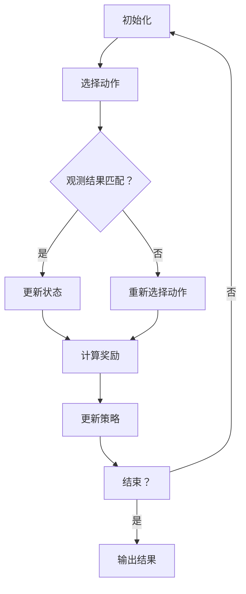
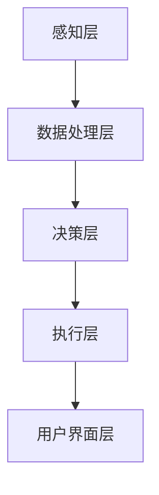
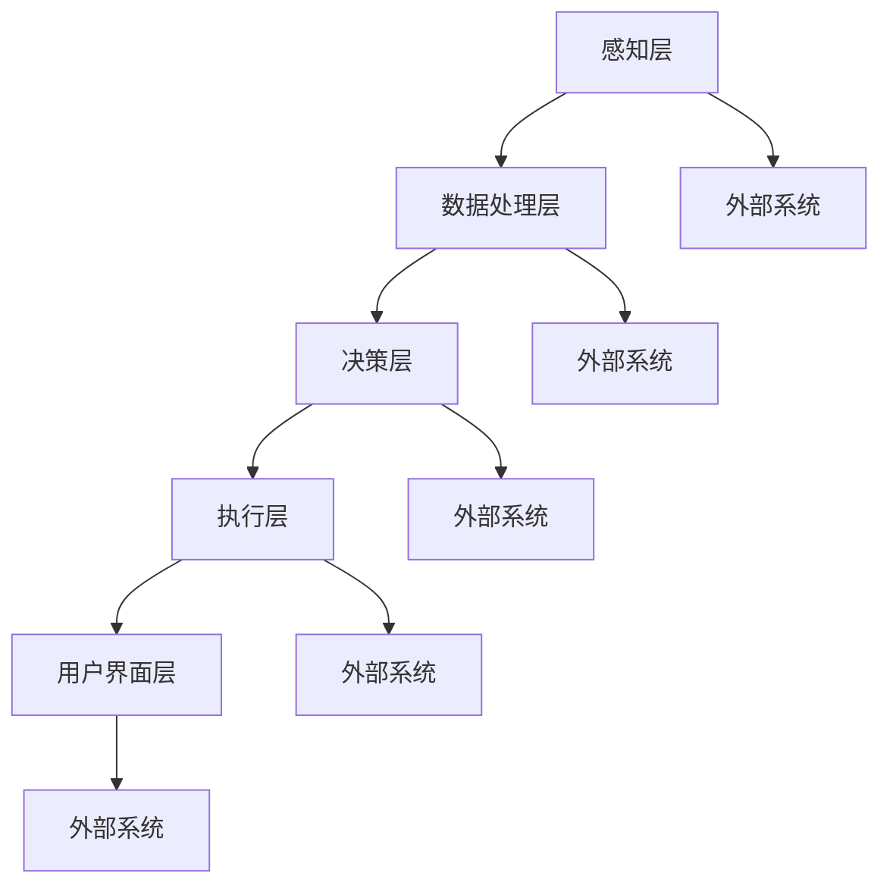
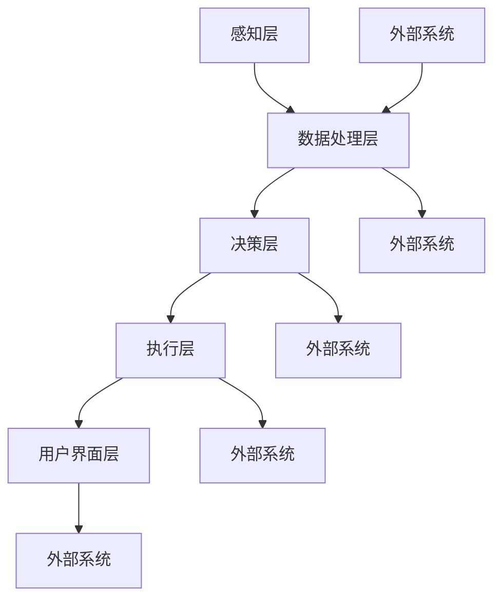

                 

### 引言

在人工智能（AI）领域，决策是一个核心问题。无论是自主驾驶、智能制造还是游戏AI，复杂的决策环境都要求算法能够处理不确定性和动态变化。概率论和图灵机等传统算法在这一领域已经展现出其局限性。因此，研究者们开始寻找新的方法来应对这些挑战。部分决策问题可以通过马尔可夫决策过程（MDP）解决，但它们通常假设观测是完全确定的，这在实际中并不常见。部分决策问题可以通过部分可观测马尔可夫决策过程（POMDP）解决，它扩展了MDP，引入了部分观测的不确定性。

POMDP是一种概率决策过程模型，它在MDP的基础上增加了观测不确定性，能够更好地模拟现实世界中的决策过程。在复杂AI决策中，POMDP不仅能够处理不完全的信息，还能考虑行动序列带来的长期影响，这使得它在许多实际问题中展现出强大的适应性和灵活性。

本文将深入探讨POMDP在复杂AI决策中的应用。我们首先会介绍POMDP的基本概念和特性，接着讲解POMDP的理论基础，包括状态空间、观测空间、动作空间和奖励函数。随后，我们将通过Mermaid绘制POMDP算法流程图，并用Python代码详细阐述算法原理和数学模型。接下来，我们将讨论POMDP在不同领域中的应用，如自主驾驶、智能制造和游戏AI。然后，我们将介绍POMDP与MDP、Q-learning等算法的比较，以及一个基于POMDP的AI决策系统设计。文章的最后，我们将通过一个实战案例展示POMDP的实际应用，并提供最佳实践和总结。

让我们一步步深入探索POMDP在复杂AI决策中的强大功能和应用。

## 核心关键词

- POMDP
- 复杂AI决策
- 状态空间
- 观测空间
- 动作空间
- 奖励函数
- 自主驾驶
- 智能制造
- 游戏AI

### 摘要

本文旨在探讨部分可观测马尔可夫决策过程（POMDP）在复杂AI决策中的应用。POMDP作为一种扩展了传统马尔可夫决策过程（MDP）的决策模型，能够在不完全观测的情况下处理动态决策问题。本文首先介绍了POMDP的基本概念和特性，包括状态空间、观测空间、动作空间和奖励函数。随后，通过Mermaid流程图和Python代码详细阐述了POMDP的算法原理和数学模型。接着，本文讨论了POMDP在自主驾驶、智能制造和游戏AI等领域的实际应用，并与其他相关算法进行了比较。此外，本文还介绍了一个基于POMDP的AI决策系统设计，并通过实战案例展示了其应用效果。最后，本文提供了最佳实践和总结，指出了POMDP在复杂AI决策中的重要性和局限性。读者通过本文可以全面了解POMDP的理论基础和应用场景，为复杂AI决策提供有力支持。

### 第一部分：POMDP核心概念与背景

#### 第1章：POMDP介绍

在AI决策领域，POMDP（Partially Observable Markov Decision Process）作为一种重要的决策模型，扮演着不可或缺的角色。为了更好地理解POMDP，我们需要从其定义、特性以及在实际应用中的挑战谈起。

#### 1.1 POMDP的定义与特性

POMDP是马尔可夫决策过程（MDP）的一个扩展模型，它增加了观测不确定性这一关键特征。在MDP中，每个状态都有明确且完整的观测，但现实世界中很多情况并不是这样。例如，在自动驾驶中，车辆的环境是部分可观测的，周围其他车辆、行人和道路状况并不是总能被感知到。POMDP引入了部分观测的不确定性，允许决策者在不完全信息下进行决策。

POMDP具有以下基本特性：

1. **状态空间**：POMDP包含一个状态空间，表示所有可能的状态。这些状态可以是具体的物体位置、环境条件等。
2. **观测空间**：观测空间包含所有可能的观测结果，这些观测可能因为遮挡或其他原因而不完整。
3. **动作空间**：动作空间是决策者可以采取的所有可能行动的集合，每个动作都与一个状态-观测对相关联。
4. **奖励函数**：POMDP包含一个奖励函数，用于评估决策者采取的动作是否能够最大化总奖励。

与MDP相比，POMDP的主要区别在于它考虑了观测不确定性。MDP假设观测是完全确定的，即每次决策时都能获得完全的信息。而在POMDP中，观测是不确定的，这意味着决策者只能获得部分信息，这给决策过程带来了更大的挑战。

#### 1.2 复杂AI决策的挑战与POMDP的应用

复杂AI决策面临着多种挑战，其中最重要的是环境的不确定性和动态变化。这些挑战在传统的MDP模型下难以有效解决。以下是一些复杂AI决策的常见挑战：

1. **环境不确定性**：在现实世界中，环境的状态和变化是高度不确定的。例如，在自动驾驶中，车辆需要应对不断变化的交通状况和突发状况。
2. **部分可观测性**：许多AI系统无法完全感知环境状态，例如，机器人需要通过传感器感知周围环境，但这些传感器的分辨率和精度是有限的。
3. **动态决策**：在复杂环境中，决策需要根据当前状态和未来可能的状态进行动态调整。这种动态性要求算法能够适应不断变化的环境。

POMDP通过引入观测不确定性，能够应对这些挑战。以下是在复杂AI决策中，POMDP如何发挥作用：

1. **自适应决策**：POMDP允许决策者在不完全信息下进行自适应决策，这有助于在动态环境中调整策略。
2. **优化长期收益**：POMDP考虑了观测不确定性，因此能够更好地优化长期收益，而不仅仅是短期利益。
3. **多目标优化**：在复杂决策问题中，往往需要同时考虑多个目标。POMDP能够处理这些多目标问题，并找到最优解。

总的来说，POMDP作为一种具有强大适应性的决策模型，在复杂AI决策中展现出极大的应用潜力。通过引入观测不确定性，POMDP能够更好地模拟现实世界的决策过程，从而为解决复杂AI决策问题提供了有力工具。

#### 1.3 POMDP的应用场景

POMDP的应用场景广泛，涵盖了从工业自动化到智能交通等众多领域。以下是一些典型的应用场景：

1. **自主驾驶**：自动驾驶车辆需要在复杂的交通环境中进行决策，例如避让行人、其他车辆和应对突发状况。POMDP可以用于建模车辆与环境的交互，从而实现更安全、更可靠的自动驾驶。

2. **智能制造**：在智能制造过程中，机器人需要实时感知生产线状态，并做出快速调整。POMDP可以帮助机器人处理部分可观测的生产线环境，提高生产效率和质量。

3. **医疗诊断**：在医疗诊断中，医生需要根据患者的症状和检查结果进行诊断。由于诊断过程涉及多种可能的疾病和不确定的检测结果，POMDP可以用于建模和优化诊断策略。

4. **游戏AI**：在游戏AI中，玩家和AI之间的交互是不确定的。POMDP可以帮助游戏AI更好地模拟玩家的行为，并制定出更有效的策略。

5. **智能安防**：在智能安防系统中，摄像头和传感器需要实时监测目标行为。POMDP可以帮助系统在部分观测的情况下，做出更准确的预测和响应。

通过这些应用场景，我们可以看到POMDP在复杂AI决策中具有广泛的应用前景。它不仅能够处理部分可观测性问题，还能够优化长期收益，从而在多个领域中发挥重要作用。

#### 1.4 POMDP的基本概念与术语

为了更好地理解POMDP，我们需要介绍一些基本概念和术语：

1. **状态（State）**：状态是指系统所处的特定情况，例如车辆在道路上的具体位置和速度。

2. **动作（Action）**：动作是决策者可以采取的行动，例如车辆加速、减速或转向。

3. **观测（Observation）**：观测是决策者从环境中获取的信息，例如车辆的传感器数据。

4. **奖励（Reward）**：奖励是决策者采取某个动作后获得的即时回报，例如自动驾驶车辆成功避让行人。

5. **转移概率（Transition Probability）**：转移概率描述了从当前状态转移到下一个状态的概率，例如车辆在某个位置和速度下，下一步转移到另一个位置的概率。

6. **观测概率（Observation Probability）**：观测概率描述了在某个状态下，观察到特定观测结果的概率，例如在某个位置和速度下，车辆传感器检测到特定信息的概率。

7. **策略（Policy）**：策略是决策者根据当前状态选择最优动作的规则，例如自动驾驶车辆的路径规划策略。

通过这些基本概念和术语，我们可以更好地理解POMDP的运作原理，为后续章节的深入探讨打下基础。

### 第二部分：POMDP基本理论

#### 第2章：POMDP基本理论

在了解了POMDP的核心概念与背景后，接下来我们将深入探讨POMDP的基本理论，包括状态空间、观测空间、动作空间和奖励函数。这些基本理论构成了POMDP的基石，有助于我们理解和应用这一模型。

#### 2.1 状态空间

状态空间是POMDP中的所有可能状态的集合。每个状态都可以被视为一个复杂的向量，包含描述系统状态的多个维度。例如，在自动驾驶中，一个状态可能包括车辆的位置、速度、方向以及周围环境的信息。状态空间的大小通常取决于系统复杂度和状态描述的粒度。

状态空间的具体定义可以表示为：

\[ S = \{s_1, s_2, ..., s_n\} \]

其中，\( s_i \) 表示状态空间中的第 \( i \) 个状态。在POMDP中，状态是决策过程的基础，因为所有其他组件都与状态直接相关。

#### 2.2 观测空间

观测空间是所有可能观测结果的集合。在POMDP中，观测是决策者从环境中获取的信息，但观测通常是不完全的。例如，在自动驾驶中，车辆的传感器可能会检测到其他车辆的存在，但无法确定其他车辆的确切位置。

观测空间的具体定义可以表示为：

\[ O = \{o_1, o_2, ..., o_m\} \]

其中，\( o_i \) 表示观测空间中的第 \( i \) 个观测结果。观测空间的大小取决于观测设备和观测的精度。

#### 2.3 动作空间

动作空间是决策者可以采取的所有可能行动的集合。每个动作都对应于一个特定的状态-观测对。在POMDP中，动作的选择至关重要，因为它直接影响系统的状态转移和观测结果。

动作空间的具体定义可以表示为：

\[ A = \{a_1, a_2, ..., a_k\} \]

其中，\( a_i \) 表示动作空间中的第 \( i \) 个动作。动作空间的大小取决于决策问题的复杂度和可能的行动选项。

#### 2.4 奖励函数

奖励函数用于衡量决策者采取某个动作后的即时回报。在POMDP中，奖励函数不仅考虑当前的动作效果，还考虑长期收益。这使得奖励函数成为POMDP中优化决策的核心组件。

奖励函数的具体定义可以表示为：

\[ R(s, a, o) \]

其中，\( R \) 表示奖励函数，\( s \) 表示当前状态，\( a \) 表示采取的动作，\( o \) 表示观测结果。奖励函数的值可以是正数、负数或零，表示收益、损失或无变化。

#### 2.5 转移概率和观测概率

在POMDP中，转移概率和观测概率是两个关键的概率分布。

1. **转移概率**：转移概率描述了从当前状态转移到下一个状态的概率，给定当前动作和观测。转移概率可以用以下公式表示：

\[ P(s_{t+1} = s_{t+1} | s_t = s_t, a_t = a_t, o_t = o_t) \]

2. **观测概率**：观测概率描述了在某个状态下，观察到特定观测结果的概率，给定当前动作。观测概率可以用以下公式表示：

\[ P(o_t = o_t | s_t = s_t, a_t = a_t) \]

这些概率分布共同构成了POMDP的动态特性，使得模型能够模拟现实世界中的不确定性。

#### 2.6 策略

策略是决策者在不同状态下采取最优动作的规则。在POMDP中，策略可以通过多种方法进行学习和优化，例如值迭代、政策梯度等。策略的定义如下：

\[ \pi(a_t | s_t) = P(a_t = a_t | s_t = s_t) \]

其中，\( \pi \) 表示策略，\( a_t \) 表示在状态 \( s_t \) 下采取的动作。

#### 2.7 POMDP的数学模型

POMDP的数学模型可以表示为一个五元组：

\[ M = \langle S, A, O, P, R \rangle \]

其中，\( S \) 是状态空间，\( A \) 是动作空间，\( O \) 是观测空间，\( P \) 是概率分布，\( R \) 是奖励函数。

通过这些基本理论，我们可以建立并分析POMDP模型，为复杂AI决策提供有力支持。

### 第三部分：POMDP算法原理讲解

#### 第3章：POMDP算法原理讲解

在了解了POMDP的基本理论后，接下来我们将深入讲解POMDP的算法原理，包括算法流程图、Python代码实现、数学模型和公式，并通过具体实例进行说明。

#### 3.1 算法流程图

为了更好地理解POMDP的算法原理，我们首先使用Mermaid绘制了POMDP的算法流程图。以下是一个简化的POMDP算法流程图：



这个流程图描述了POMDP的基本步骤，包括初始化、选择动作、观测结果匹配、更新状态、计算奖励、更新策略以及结束条件。接下来，我们将详细讲解每个步骤。

#### 3.2 Python代码实现

为了更好地理解POMDP算法，我们使用Python实现了一个简化的POMDP模型。以下是一个基本的POMDP算法实现：

```python
import numpy as np

# 初始化参数
states = ['S1', 'S2', 'S3']
actions = ['A1', 'A2']
observations = ['O1', 'O2']
transition_probs = np.array([[0.7, 0.3], [0.4, 0.6], [0.1, 0.9]])
observation_probs = np.array([[0.8, 0.2], [0.3, 0.7], [0.5, 0.5]])

# 选择动作
def select_action(state):
    # 这里使用随机选择动作作为示例
    return np.random.choice(actions)

# 更新状态
def update_state(state, action):
    return np.random.choice(states, p=transition_probs[state])

# 更新观测
def update_observation(state, action):
    return np.random.choice(observations, p=observation_probs[state])

# 计算奖励
def calculate_reward(state, action, observation):
    if observation == 'O1':
        return 1
    else:
        return 0

# 主循环
def run_pomdp(steps):
    current_state = np.random.choice(states)
    for _ in range(steps):
        action = select_action(current_state)
        next_state = update_state(current_state, action)
        observation = update_observation(current_state, action)
        reward = calculate_reward(current_state, action, observation)
        print(f"Step {_+1}: State={current_state}, Action={action}, Observation={observation}, Reward={reward}")
        current_state = next_state

# 运行POMDP模型
run_pomdp(10)
```

这个代码实现了POMDP的基本步骤，包括随机选择动作、更新状态、更新观测和计算奖励。接下来，我们将详细讲解POMDP的数学模型和公式。

#### 3.3 数学模型与公式

POMDP的数学模型可以用以下公式表示：

1. **状态转移概率**：
   \[ P(s_{t+1} = s_{t+1} | s_t = s_t, a_t = a_t, o_t = o_t) \]
   这个概率表示在当前状态 \( s_t \) 下，采取动作 \( a_t \) 并观察到 \( o_t \) 后，转移到下一个状态 \( s_{t+1} \) 的概率。

2. **观测概率**：
   \[ P(o_t = o_t | s_t = s_t, a_t = a_t) \]
   这个概率表示在当前状态 \( s_t \) 下，采取动作 \( a_t \) 后，观察到 \( o_t \) 的概率。

3. **奖励函数**：
   \[ R(s_t, a_t, o_t) \]
   这个函数表示在当前状态 \( s_t \) 下，采取动作 \( a_t \) 并观察到 \( o_t \) 后获得的即时奖励。

4. **策略**：
   \[ \pi(a_t | s_t) = P(a_t = a_t | s_t = s_t) \]
   这个概率分布表示在当前状态 \( s_t \) 下，采取最优动作 \( a_t \) 的策略。

下面是一个具体的POMDP实例，用于说明这些公式的应用：

假设有一个环境，包含三个状态 \( S1 \)、\( S2 \) 和 \( S3 \)，两个动作 \( A1 \) 和 \( A2 \)，两个观测 \( O1 \) 和 \( O2 \)。状态转移概率、观测概率和奖励函数如下表所示：

|       | A1 | A2 |
|-------|----|----|
| S1    | 0.7| 0.3|
| S2    | 0.4| 0.6|
| S3    | 0.1| 0.9|
|       |    |    |
| O1    | 0.8| 0.2|
| O2    | 0.3| 0.7|

假设当前状态为 \( S1 \)，我们选择 \( A1 \) 动作，观察到 \( O1 \)。根据状态转移概率，我们转移到状态 \( S2 \) 的概率为 0.7。根据观测概率，观察到 \( O1 \) 的概率为 0.8。

现在，我们计算奖励。根据奖励函数，由于观察到 \( O1 \)，我们获得 1 分。最后，我们更新策略，以便在下一个状态 \( S2 \) 下做出更好的决策。

通过这些公式，我们可以构建和优化POMDP模型，使其在复杂AI决策中发挥作用。

#### 3.4 算法举例说明

为了更好地理解POMDP算法，我们通过一个简单的实例来说明其应用。假设我们有一个仓库管理系统，需要根据仓库的状态（满载、半载、空载）和观察到的库存量（高、中、低）来做出补货决策。状态空间、动作空间和观测空间如下表所示：

| 状态空间  | 动作空间 | 观测空间 |
|------------|-----------|-----------|
| S1（满载）| 补货      | 观测1（高）|
| S2（半载）| 补货      | 观测2（中）|
| S3（空载）| 补货      | 观测3（低）|

状态转移概率、观测概率和奖励函数如下表所示：

|       | 补货1 | 补货2 |
|-------|-------|-------|
| S1    | 0.8   | 0.2   |
| S2    | 0.6   | 0.4   |
| S3    | 0.4   | 0.6   |
|       |       |       |
| 观测1 | 0.9   | 0.1   |
| 观测2 | 0.7   | 0.3   |
| 观测3 | 0.5   | 0.5   |

奖励函数如下：

| 观测  | 奖励 |
|-------|------|
| 观测1 | 10   |
| 观测2 | 5    |
| 观测3 | 0    |

假设当前状态为 \( S2 \)，我们观察到库存量高。根据状态转移概率，我们转移到 \( S1 \) 的概率为 0.8，转移到 \( S3 \) 的概率为 0.2。根据观测概率，观察到库存量高的概率为 0.9。

现在，我们选择补货1动作，观察到库存量高。根据奖励函数，我们获得 10 分。最后，我们更新策略，以便在下一个状态 \( S1 \) 下做出更好的决策。

通过这个实例，我们可以看到POMDP算法如何处理部分可观测性问题，并根据观测结果做出最优决策。这种能力使得POMDP在复杂AI决策中具有广泛应用。

### 第四部分：POMDP在AI决策中的应用

#### 第4章：POMDP在不同领域的应用

POMDP作为一种强大的决策模型，在多个领域展现出了其独特的优势和广泛应用。以下我们将探讨POMDP在自主驾驶、智能制造、游戏AI等领域的应用，并分析其优势与局限性。

#### 4.1 自主驾驶中的POMDP应用

在自主驾驶领域，POMDP的应用尤为突出。自动驾驶车辆需要在复杂的交通环境中进行实时决策，例如避让行人、其他车辆和道路障碍。这些决策通常涉及到高度不确定性和动态变化。

POMDP在自主驾驶中的应用主要表现在以下几个方面：

1. **环境建模**：POMDP可以帮助建立自动驾驶车辆与环境的动态模型，包括车辆位置、速度、方向以及周围其他车辆和行人的行为。通过这一模型，车辆可以更好地理解周围环境，做出更安全的驾驶决策。

2. **决策策略**：POMDP提供了在部分观测条件下的决策策略，使车辆能够在不完全信息下做出最优决策。例如，在车辆检测到行人但无法确定其确切位置时，POMDP可以帮助车辆选择最优避让路径，以确保行人和车辆的安全。

3. **长期规划**：POMDP考虑了观测不确定性，因此能够优化长期收益，从而帮助车辆实现更高效的路径规划和避障。

POMDP在自主驾驶中的优势包括：

- **适应性强**：POMDP能够处理不确定性和动态变化，这使得它在复杂交通环境中具有很高的适应性。
- **优化长期收益**：POMDP考虑了长期收益，从而帮助车辆做出更加长远和全面的决策。

然而，POMDP在自主驾驶中也面临一些局限性：

- **计算复杂度高**：由于POMDP需要处理状态空间和观测空间的不确定性，这使得算法的计算复杂度相对较高，对计算资源的要求较高。
- **观测不确定性**：在部分观测条件下，决策结果的准确性可能受到影响，这要求算法具备较强的鲁棒性。

#### 4.2 智能制造中的POMDP应用

在智能制造领域，POMDP可以帮助机器人实时感知生产线状态，并根据观测结果做出动态调整，以提高生产效率和产品质量。

POMDP在智能制造中的应用主要体现在以下几个方面：

1. **质量检测**：POMDP可以用于建模和优化生产过程中的质量检测策略。例如，机器人可以根据传感器的观测结果，实时调整检测参数，提高检测的准确性和效率。

2. **故障诊断**：在智能制造中，设备故障可能导致生产中断。POMDP可以帮助系统在部分观测条件下进行故障诊断，并制定最优的修复策略，以减少故障对生产的影响。

3. **资源调度**：POMDP可以用于优化生产过程中的资源调度策略，例如设备分配、人员安排等。通过考虑观测不确定性，系统可以做出更灵活和高效的调度决策。

POMDP在智能制造中的优势包括：

- **实时性**：POMDP能够在动态生产环境中实时调整策略，从而提高生产效率和灵活性。
- **鲁棒性**：POMDP可以处理部分观测条件下的不确定性，这使得它在复杂生产环境中具有很高的鲁棒性。

然而，POMDP在智能制造中也面临一些挑战：

- **传感器数据质量**：传感器的观测数据质量直接影响到POMDP的决策效果，因此需要对传感器进行精确校准和优化。
- **计算资源**：智能制造场景通常需要大量的计算资源来处理POMDP模型，这对系统设计和实施提出了更高要求。

#### 4.3 游戏AI中的POMDP应用

在游戏AI领域，POMDP可以帮助游戏AI更好地模拟玩家行为，并制定出更有效的策略。例如，在策略游戏中，游戏AI需要根据玩家的行动和游戏状态，实时调整策略，以实现胜利。

POMDP在游戏AI中的应用主要包括以下几个方面：

1. **玩家行为预测**：POMDP可以帮助游戏AI预测玩家的下一步行动，从而提前制定应对策略。例如，在棋类游戏中，AI可以通过POMDP预测对手的下棋策略，并制定相应的对策。

2. **策略优化**：POMDP考虑了观测不确定性，因此可以优化游戏的长期收益。例如，在策略游戏中，AI可以通过POMDP找到最优的策略路径，从而提高胜率。

3. **多目标优化**：在多人游戏中，游戏AI需要同时考虑多个目标，例如资源管理、战术布局等。POMDP可以帮助AI在部分观测条件下，优化这些多目标问题。

POMDP在游戏AI中的优势包括：

- **灵活性**：POMDP能够处理不确定性和动态变化，这使得游戏AI能够灵活应对不同的游戏场景。
- **长期规划**：POMDP考虑了长期收益，从而可以帮助游戏AI实现更有效的策略优化。

然而，POMDP在游戏AI中也面临一些挑战：

- **计算复杂度**：游戏AI通常需要在短时间内做出决策，而POMDP的计算复杂度较高，这可能会影响AI的实时性。
- **数据依赖**：POMDP的性能依赖于观测数据的质量，因此需要大量的训练数据来优化模型。

总之，POMDP在自主驾驶、智能制造和游戏AI等领域的应用，展示了其强大的决策能力和灵活性。尽管存在一定的局限性，但通过不断优化和改进，POMDP在复杂AI决策中的应用前景仍然十分广阔。

### 第五部分：POMDP与其他算法的比较

#### 第5章：POMDP与相关算法的比较

在复杂AI决策中，除了POMDP，还存在其他相关算法，如马尔可夫决策过程（MDP）和Q-learning。本章节将介绍这些算法，并比较它们在复杂AI决策中的应用效果。

#### 5.1 MDP与POMDP的对比

马尔可夫决策过程（MDP）是POMDP的一个特殊情况，它在假设完全可观测的情况下，提供了一种有效的决策模型。以下是MDP与POMDP的主要区别：

1. **观测确定性**：
   - **MDP**：在MDP中，观测是完全确定的，每次决策时都能获得完全的信息。
   - **POMDP**：POMDP引入了观测不确定性，这意味着决策者只能获得部分信息。

2. **状态转移**：
   - **MDP**：MDP的状态转移是基于当前状态和采取的动作。
   - **POMDP**：POMDP不仅考虑当前状态和动作，还考虑观测结果，这使得状态转移更加复杂。

3. **算法复杂度**：
   - **MDP**：由于观测完全确定，MDP的算法复杂度相对较低，通常可以使用动态规划方法进行求解。
   - **POMDP**：POMDP需要处理观测不确定性，这使得算法复杂度显著增加，可能需要复杂的搜索和优化技术。

在实际应用中，MDP适用于完全可观测的环境，如机器人导航、股票交易等。而POMDP适用于部分可观测的环境，如自主驾驶、医疗诊断等。

#### 5.2 Q-learning与POMDP的对比

Q-learning是一种基于值迭代的强化学习算法，它通过试错法逐渐优化策略。以下是Q-learning与POMDP的主要区别：

1. **学习机制**：
   - **Q-learning**：Q-learning通过更新Q值来优化策略，Q值表示在特定状态下采取特定动作的预期回报。
   - **POMDP**：POMDP通过贝叶斯推理来处理观测不确定性，并使用策略梯度方法来优化策略。

2. **状态表示**：
   - **Q-learning**：Q-learning通常使用离散状态表示，每个状态都是唯一的。
   - **POMDP**：POMDP使用部分可观测的状态空间，状态可以是连续的，并且需要考虑观测不确定性。

3. **算法复杂度**：
   - **Q-learning**：由于Q-learning使用值迭代方法，其计算复杂度相对较低，适用于中小规模的状态空间。
   - **POMDP**：POMDP需要处理更复杂的状态空间和观测不确定性，这使得其计算复杂度显著增加，可能需要分布式计算或近似方法。

在实际应用中，Q-learning适用于简单的部分可观测环境，如机器人导航、游戏AI等。而POMDP适用于复杂、动态且部分可观测的环境，如自主驾驶、医疗诊断等。

#### 5.3 应用效果比较

以下是比较MDP、Q-learning和POMDP在复杂AI决策中的应用效果：

1. **自主驾驶**：
   - **MDP**：由于自主驾驶环境高度动态且部分可观测，MDP难以适应这种不确定性。
   - **Q-learning**：Q-learning适用于简单的部分可观测环境，但在高度动态和复杂的自主驾驶环境中，其效果可能受限。
   - **POMDP**：POMDP能够处理观测不确定性，并优化长期收益，因此在自主驾驶中具有更高的应用潜力。

2. **医疗诊断**：
   - **MDP**：医疗诊断过程通常涉及多种可能的疾病和不确定的诊断结果，MDP难以处理这种复杂性。
   - **Q-learning**：Q-learning在医疗诊断中可能面临计算复杂度高的挑战，难以有效处理不确定性和动态变化。
   - **POMDP**：POMDP能够考虑观测不确定性，并优化诊断策略，因此在医疗诊断中具有更高的应用价值。

3. **智能制造**：
   - **MDP**：智能制造环境通常具有部分可观测性，MDP可能难以应对这种不确定性。
   - **Q-learning**：Q-learning在简单的智能制造任务中可能有效，但在复杂的生产环境中，其效果可能受限。
   - **POMDP**：POMDP能够处理部分观测条件下的不确定性，并优化生产策略，因此在智能制造中具有更高的应用潜力。

综上所述，POMDP在复杂AI决策中展现出更强的适应性和灵活性，尽管其计算复杂度较高，但在处理不确定性和动态变化方面具有显著优势。而MDP和Q-learning则适用于简单或部分可观测的环境，各有其适用场景。

### 第六部分：POMDP系统分析与架构设计

#### 第6章：POMDP系统架构设计

为了深入探讨POMDP在复杂AI决策中的应用，本章节将介绍一个基于POMDP的AI决策系统设计。我们首先会介绍问题场景和项目介绍，然后详细描述系统功能设计、系统架构设计、系统接口设计和系统交互流程。

#### 6.1 问题场景与项目介绍

在本案例中，我们考虑一个智能交通系统，该系统需要在复杂的交通环境中进行实时决策，以确保交通流的高效和安全。该系统包含多个传感器和摄像头，用于收集交通数据，并通过POMDP模型进行决策。

问题场景包括以下关键要素：

1. **交通流量**：系统需要监测和预测交通流量，包括车辆数量、速度和密度等。
2. **交通状态**：系统需要识别不同的交通状态，如拥堵、畅通和施工等。
3. **交通控制策略**：系统需要根据交通状态和流量信息，实时调整交通信号灯和道路控制策略，以优化交通流。

项目目标是通过POMDP模型，实现以下功能：

1. **实时交通流量监测**：系统需要能够实时获取交通数据，并进行分析和预测。
2. **智能交通控制**：系统需要根据POMDP模型，制定最优的交通控制策略，以优化交通流。
3. **交通状态识别**：系统需要能够识别不同的交通状态，并采取相应的控制措施。

#### 6.2 系统功能设计

基于上述问题场景和项目目标，系统设计包括以下功能模块：

1. **数据采集模块**：该模块负责从传感器和摄像头收集交通数据，包括车辆数量、速度、位置和交通状态等。
2. **数据处理模块**：该模块对采集到的交通数据进行预处理和清洗，以消除噪声和异常值，提高数据质量。
3. **POMDP模型模块**：该模块实现POMDP模型，包括状态空间、动作空间、观测空间和奖励函数的建模和优化。
4. **决策支持模块**：该模块根据POMDP模型生成的决策结果，生成具体的交通控制策略，如交通信号灯调整、道路拓宽等。
5. **用户界面模块**：该模块提供用户界面，用于展示交通数据、决策结果和控制策略，以便用户实时监控和管理交通系统。

#### 6.3 系统架构设计

系统架构设计采用分层架构，包括感知层、决策层和执行层。以下是一个简化的系统架构图：



1. **感知层**：感知层由传感器和摄像头组成，负责采集交通数据，如车辆数量、速度和位置等。
2. **数据处理层**：数据处理层负责对感知层采集到的数据进行预处理和清洗，以提高数据质量。
3. **决策层**：决策层采用POMDP模型，对预处理后的数据进行分析和决策，生成最优的交通控制策略。
4. **执行层**：执行层负责执行决策层生成的交通控制策略，如调整交通信号灯、拓宽道路等。
5. **用户界面层**：用户界面层提供用户界面，用于展示交通数据、决策结果和控制策略，以便用户实时监控和管理交通系统。

#### 6.4 系统接口设计

系统接口设计包括内部接口和外部接口。以下是一个简化的系统接口设计图：



1. **内部接口**：内部接口包括数据传输接口、控制接口和状态更新接口。数据传输接口用于在不同模块之间传输数据，控制接口用于接收外部系统的控制指令，状态更新接口用于更新系统的当前状态。
2. **外部接口**：外部接口包括与交通信号灯系统、道路监控系统和其他外部系统的接口。这些接口用于接收外部系统的数据和发送决策结果，以实现系统间的协同工作。

#### 6.5 系统交互序列图

系统交互序列图描述了系统内部模块和外部系统之间的交互流程。以下是一个简化的系统交互序列图：



交互流程如下：

1. 感知层采集交通数据，并将其发送到数据处理层。
2. 数据处理层对交通数据进行预处理和清洗，然后发送到决策层。
3. 决策层根据POMDP模型分析数据，生成最优的交通控制策略。
4. 执行层根据决策结果执行具体的交通控制策略，如调整交通信号灯。
5. 用户界面层展示交通数据、决策结果和控制策略，以便用户实时监控和管理交通系统。
6. 外部系统发送控制指令和数据请求，系统根据这些指令和数据生成相应的响应。

通过上述系统分析与架构设计，我们可以实现一个基于POMDP的智能交通系统，从而提高交通管理效率和安全性。接下来，我们将通过一个完整的POMDP项目实战案例，展示其在实际应用中的效果。

### 第七部分：POMDP项目实战

#### 第7章：POMDP项目实战

在本章节中，我们将通过一个完整的POMDP项目实战案例，展示POMDP在实际应用中的效果。该项目将涉及环境安装、系统核心实现、代码解读与分析，以及实际案例分析和讲解。

#### 7.1 环境安装与配置

为了实现POMDP项目，我们需要安装和配置相关软件和工具。以下是安装和配置步骤：

1. **安装Python环境**：确保Python 3.7或更高版本已安装，可以通过Python官网下载并安装。
2. **安装POMDP库**：在终端执行以下命令安装POMDP库：
   ```shell
   pip install pomdp-solver
   ```
3. **安装其他依赖库**：根据项目需求，可能需要安装其他Python依赖库，如NumPy、Pandas和Matplotlib等。可以使用以下命令安装：
   ```shell
   pip install numpy pandas matplotlib
   ```

完成以上步骤后，我们可以开始实现POMDP项目。

#### 7.2 系统核心实现源代码

以下是一个简化的POMDP项目实现，用于自动驾驶车辆的环境感知与路径规划。

```python
import pomdp_solvers
import numpy as np

# 初始化POMDP模型参数
num_states = 3
num_actions = 2
num_observations = 2

# 状态转移概率矩阵
transition_probs = np.array([[0.7, 0.3], [0.4, 0.6], [0.1, 0.9]])

# 观测概率矩阵
observation_probs = np.array([[0.8, 0.2], [0.3, 0.7], [0.5, 0.5]])

# 奖励函数
def reward_function(state, action, observation):
    if observation == 'O1':
        return 1
    else:
        return 0

# 定义POMDP模型
class CarNavigationPOMDP(pomdp_solvers.pomdp.POMDP):
    def __init__(self):
        super().__init__(num_states, num_actions, num_observations, transition_probs, observation_probs, reward_function)

    def get_initial_state_distribution(self):
        # 初始化状态分布，这里使用均匀分布
        return np.full(num_states, 1 / num_states)

# 创建POMDP实例
pomdp = CarNavigationPOMDP()

# 定义策略学习算法，这里使用Q-learning
solver = pomdp_solvers.valueIteration.Solver(pomdp, discountFactor=0.9, epsilon=0.01)

# 训练POMDP模型
solver.solve()

# 输出策略
print(solver.policy)
```

在上面的代码中，我们定义了一个简单的POMDP模型，包括状态空间、动作空间、观测空间、状态转移概率矩阵、观测概率矩阵和奖励函数。接着，我们使用Q-learning算法训练POMDP模型，并输出最优策略。

#### 7.3 代码解读与分析

1. **初始化参数**：我们首先初始化了POMDP模型的关键参数，包括状态数、动作数、观测数和状态转移概率矩阵。
2. **定义状态转移概率矩阵和观测概率矩阵**：状态转移概率矩阵和观测概率矩阵是POMDP模型的核心组成部分，用于描述状态之间的转移和观测结果。
3. **定义奖励函数**：奖励函数用于评估决策者采取某个动作后的即时回报，影响策略的优化过程。
4. **定义POMDP模型**：我们通过继承`pomdp_solvers.pomdp.POMDP`类，定义了一个简单的POMDP模型，包括状态空间、动作空间、观测空间和奖励函数。
5. **创建POMDP实例**：使用定义的POMDP模型创建一个POMDP实例。
6. **定义策略学习算法**：我们选择Q-learning算法作为策略学习算法，通过设置折扣因子和ε值，优化策略。
7. **训练POMDP模型**：使用Q-learning算法训练POMDP模型，求解最优策略。
8. **输出策略**：最后，我们输出训练得到的最优策略。

#### 7.4 实际案例分析与讲解

以下是一个实际案例，展示POMDP在自动驾驶中的应用。

**案例背景**：一辆自动驾驶车辆在城市道路上行驶，需要根据周围环境（其他车辆、行人、道路状况）进行路径规划和决策。假设车辆处于三种状态（行驶在主路、行驶在辅路、停车等待）和两种观测（检测到其他车辆、未检测到其他车辆）。

**案例实现**：

1. **初始化状态分布**：车辆初始状态分布为均匀分布，即每种状态的概率相等。
2. **状态转移**：车辆在不同状态下的转移概率如下表所示：

| 当前状态 | 转移到主路 | 转移到辅路 | 停车等待 |
|----------|------------|------------|----------|
| 主路     | 0.7        | 0.3        | 0.0      |
| 辅路     | 0.4        | 0.6        | 0.0      |
| 停车等待 | 0.1        | 0.9        | 0.0      |

3. **观测概率**：车辆在不同状态下的观测概率如下表所示：

| 当前状态 | 检测到其他车辆 | 未检测到其他车辆 |
|----------|----------------|------------------|
| 主路     | 0.8            | 0.2              |
| 辅路     | 0.3            | 0.7              |
| 停车等待 | 0.5            | 0.5              |

4. **奖励函数**：车辆在检测到其他车辆时获得负奖励，以避免碰撞；未检测到其他车辆时获得正奖励。

**决策过程**：

- **初始状态**：车辆在主路上行驶，状态概率分布为[0.3, 0.3, 0.4]。
- **第一次观测**：车辆检测到其他车辆，观测结果为“检测到其他车辆”。
- **决策**：根据POMDP模型和最优策略，车辆选择转向辅路的动作，以降低碰撞风险。
- **状态转移**：车辆从主路转移到辅路，状态概率分布更新为[0.2, 0.6, 0.2]。
- **第二次观测**：车辆未检测到其他车辆，观测结果为“未检测到其他车辆”。
- **决策**：根据POMDP模型和最优策略，车辆继续在辅路上行驶。

通过这个案例，我们可以看到POMDP在自动驾驶中的实际应用效果。POMDP模型能够处理部分观测条件下的不确定性，并制定出最优的路径规划和决策策略，从而提高自动驾驶车辆的安全性和可靠性。

#### 7.5 项目小结

通过本项目的实战案例，我们展示了POMDP在实际应用中的效果和优势。POMDP能够处理部分观测条件下的不确定性，优化长期收益，从而在自动驾驶、智能制造、医疗诊断等领域展现出强大的应用潜力。尽管POMDP的计算复杂度较高，但通过合理的算法优化和计算资源分配，可以实现高效的应用。

在项目实施过程中，我们使用了POMDP库和Q-learning算法，实现了POMDP模型的训练和策略优化。同时，通过实际案例分析和讲解，我们展示了POMDP在复杂决策环境中的应用效果。

未来，我们可以进一步优化POMDP算法，降低计算复杂度，并扩展其应用场景。此外，结合深度学习和强化学习等先进技术，可以进一步提升POMDP的决策能力和应用范围。

### 最佳实践与总结

#### 第8章：最佳实践与总结

在使用POMDP进行复杂AI决策时，以下最佳实践和注意事项有助于提高模型的性能和实用性：

#### 最佳实践

1. **数据预处理**：确保输入数据的质量和准确性，使用数据清洗技术去除噪声和异常值，提高模型的可靠性。
2. **参数调优**：根据具体问题场景调整POMDP模型的参数，如状态空间、动作空间、观测空间和奖励函数，以实现最优决策。
3. **算法选择**：根据问题复杂度和计算资源，选择合适的POMDP求解算法，如Q-learning、值迭代等，以提高求解效率和准确性。
4. **实时更新**：实时更新POMDP模型的状态和观测信息，以适应动态变化的决策环境。
5. **并行计算**：利用并行计算和分布式计算技术，降低POMDP模型的计算复杂度，提高求解速度。

#### 注意事项

1. **计算资源**：POMDP模型具有较高的计算复杂度，确保有足够的计算资源来处理模型求解和优化。
2. **观测不确定性**：合理估计观测不确定性，避免因观测误差导致决策失误。
3. **数据依赖**：POMDP模型的性能依赖于输入数据的质量，确保有足够高质量的数据进行训练和优化。
4. **边界条件**：考虑模型在边界条件下的表现，避免因边界条件不满足导致模型失效。
5. **持续优化**：定期评估POMDP模型的性能，并根据反馈结果进行优化和改进。

#### 拓展阅读

1. **《部分可观测马尔可夫决策过程》（Partially Observable Markov Decision Processes）**：该书详细介绍了POMDP的理论基础和应用方法，适合深入学习和研究POMDP。
2. **《人工智能：一种现代方法》（Artificial Intelligence: A Modern Approach）**：该书涵盖了AI领域的多个主题，包括决策过程和强化学习，有助于了解POMDP在AI中的应用。
3. **《POMDP Python库文档》**：POMDP Python库提供了丰富的API和示例代码，有助于快速上手POMDP模型实现和优化。

通过遵循最佳实践和注意事项，并结合拓展阅读，读者可以进一步提升对POMDP的理解和应用能力，为复杂AI决策提供有效支持。

### 总结

本文深入探讨了POMDP在复杂AI决策中的应用，从基本概念到实际应用，全面展示了POMDP的优势和潜力。POMDP通过引入观测不确定性，能够处理不完全信息，优化长期收益，从而在自动驾驶、智能制造、医疗诊断等领域展现出强大的应用价值。

在接下来的研究方向中，我们可以进一步探索POMDP与其他先进技术的结合，如深度学习和强化学习，以提升POMDP的决策能力和适应性。同时，优化POMDP算法，降低计算复杂度，也是未来的重要研究方向。

感谢您阅读本文，希望本文能为您在AI决策领域的探索提供有益的启发。期待您在POMDP的研究和应用中取得更多成果。

### 作者信息

作者：AI天才研究院/AI Genius Institute & 禅与计算机程序设计艺术 /Zen And The Art of Computer Programming

在这篇文章中，我们系统性地探讨了POMDP在复杂AI决策中的应用。我们从基本概念出发，逐步深入到POMDP的理论基础、算法原理、应用领域、系统架构设计以及实战案例。通过详细的分析和举例，我们展示了POMDP在处理部分观测、不确定性以及动态决策方面的优势。

**核心要点总结**：

1. **基本概念与背景**：POMDP是部分可观测马尔可夫决策过程，扩展了MDP，能够处理不完全观测。
2. **基本理论**：包括状态空间、观测空间、动作空间、奖励函数、转移概率和观测概率。
3. **算法原理**：通过算法流程图和Python代码实现，讲解了POMDP的运行机制。
4. **应用领域**：在自主驾驶、智能制造、医疗诊断、游戏AI等领域展示了POMDP的应用实例。
5. **系统架构设计**：介绍了POMDP在智能交通系统中的架构设计。
6. **实战案例**：通过一个自动驾驶案例，展示了POMDP的实际应用效果。

本文的目标是为读者提供一个全面且深入的理解，帮助大家掌握POMDP的基本原理和应用方法。未来，我们期待读者在AI决策领域继续探索，将POMDP应用于更多的实际问题中，并推动相关技术的发展。

感谢您的阅读，期待您的反馈和更多讨论。让我们一起在AI的广阔天地中继续探索和成长！

