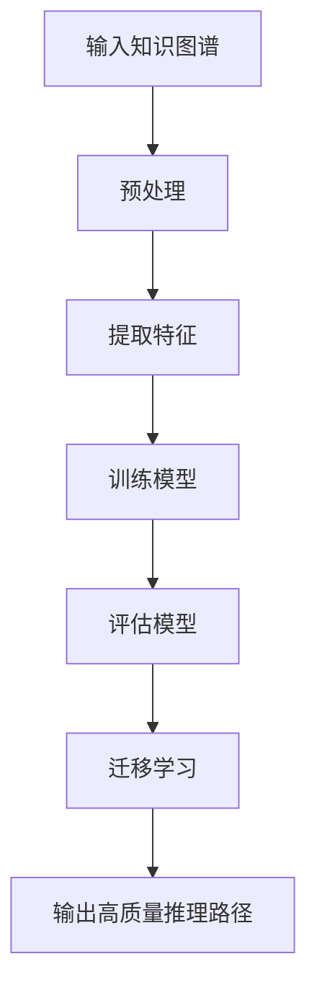
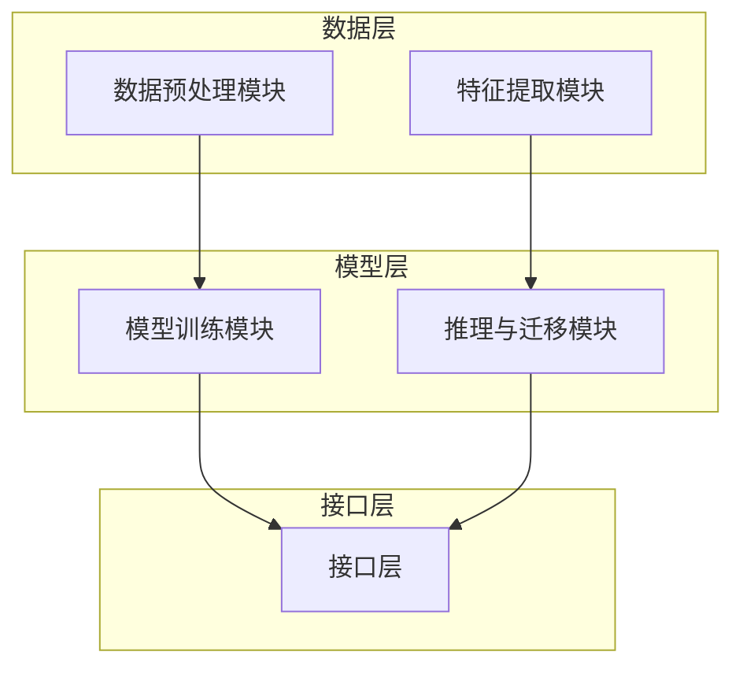
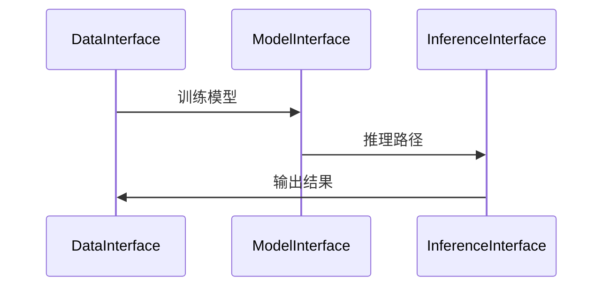

                 

# PRM模块中高质量推理路径的学习与迁移

> 关键词：知识图谱、PRM模块、推理路径、学习与迁移、深度学习

> 摘要：本文探讨了PRM模块中高质量推理路径的学习与迁移问题，从理论到实践全面分析了如何从知识图谱中提取高质量推理路径，并实现跨领域的迁移学习，为知识图谱应用提供了新的思路和方法。

## 第1章 引言

### 1.1 研究背景

随着互联网的飞速发展和信息爆炸，知识的组织和处理变得日益重要。知识图谱作为新一代的信息模型，通过将实体、属性和关系进行结构化存储，实现了对知识的精准描述和高效检索。在知识图谱的应用场景中，推理是至关重要的一环，它可以帮助用户发现未知的知识点，提高系统的智能化水平。

PRM（Property-Relationship-Module）模块是知识图谱中的一个核心组件，负责存储和处理实体间的属性关系。它由实体、属性和值三个要素组成，通过这些要素，实体间形成了丰富的关联网络。然而，如何在大量数据中学习到高质量的推理路径，并实现跨领域的迁移学习，是当前研究的热点问题。

### 1.2 问题描述

本文的主要研究问题是：如何从知识图谱中学习到高质量的推理路径，并实现其在不同领域的迁移学习？具体包括以下几个子问题：

- 如何定义和评估高质量推理路径？
- 如何从知识图谱中提取高质量的推理路径？
- 如何在不同领域实现推理路径的迁移学习？
- 迁移学习的效果如何评估？

### 1.3 研究目标

本文的研究目标如下：

- 提出一种评估高质量推理路径的新方法。
- 设计一个基于深度学习的推理路径学习算法。
- 探索推理路径在不同领域的迁移学习策略。
- 分析迁移学习在不同领域的有效性。

### 1.4 边界与外延

本文的研究边界和范围包括以下几个方面：

- 数据来源：基于公开的知识图谱数据集。
- 算法实现：采用深度学习框架进行算法实现。
- 迁移学习：在不同领域进行迁移学习，如信息检索、推荐系统等。
- 评估指标：采用准确率、召回率等指标进行评估。

### 1.5 概念结构与核心要素组成

本文的核心概念包括：

- **PRM模块**：知识图谱中的一个组件，用于存储和处理实体间的属性关系。
- **高质量推理路径**：满足一定属性的推理路径，具有较好的推理效果。
- **学习与迁移**：从源领域学习到目标领域的推理路径。
- **迁移学习**：在不同领域之间迁移推理路径。

## 第2章 相关理论与方法

### 2.1 PRM模块概述

#### 2.1.1 定义

PRM模块是知识图谱中的一个核心组件，它负责存储和处理实体间的属性关系。在知识图谱中，实体是现实世界中的对象，属性是描述实体特征的信息，值是属性的取值。PRM模块通过这三个要素，构建了一个实体间的关联网络。

#### 2.1.2 特点与应用

PRM模块具有以下特点：

- **可扩展性**：支持自定义属性和实体，适应不同应用场景。
- **数据关联性**：通过属性关系建立实体之间的关联，实现知识图谱的深度挖掘。
- **应用广泛**：在信息检索、推荐系统、自然语言处理等领域有广泛应用。

#### 2.1.3 历史与发展

PRM模块起源于知识图谱的研究，随着知识图谱在各个领域的应用逐渐深入，PRM模块也在不断发展和完善。目前，PRM模块已经成为知识图谱技术体系中的一个重要组成部分。

### 2.2 高质量推理路径

#### 2.2.1 定义与属性

高质量推理路径是指从知识图谱中提取的，具有较高可信度和推理效果的路径。它的属性包括：

- **可信度**：推理路径的置信度，反映了路径的可靠性。
- **推理效果**：推理路径在目标任务上的表现，反映了路径的有效性。
- **路径长度**：推理路径的长度，反映了推理的复杂度。

#### 2.2.2 高质量推理路径的评估方法

评估高质量推理路径的方法主要包括：

- **基于可信度的评估**：通过计算路径的可信度来评估路径的质量。
- **基于推理效果的评估**：通过在特定任务上评估路径的推理效果来评估路径的质量。
- **综合评估方法**：结合可信度和推理效果进行综合评估。

### 2.3 学习与迁移

#### 2.3.1 学习方法概述

学习方法是提取高质量推理路径的核心技术。常用的学习方法包括：

- **基于规则的方法**：通过手工定义规则来提取路径。
- **基于深度学习的方法**：利用神经网络模型自动学习路径。

#### 2.3.2 迁移学习方法概述

迁移学习是一种将已学习到的知识应用到新领域的方法。在推理路径的迁移学习中，主要包括以下方法：

- **基于特征的方法**：通过提取和比较特征来实现路径的迁移。
- **基于模型的迁移方法**：通过迁移学习模型来实现路径的迁移。

#### 2.3.3 学习与迁移的关系

学习与迁移是相辅相成的。学习是从数据中提取知识，而迁移是将学习到的知识应用到新领域。高质量推理路径的学习与迁移相结合，可以最大化地发挥知识图谱的价值。

## 第3章 数学模型与算法原理

### 3.1 数学模型

#### 3.1.1 公式与符号说明

在本文中，我们将使用以下符号：

- \( E \)：实体集合。
- \( A \)：属性集合。
- \( V \)：值集合。
- \( R \)：关系集合。
- \( P \)：推理路径集合。

主要公式如下：

\[ \text{可信度}(P) = \prod_{i=1}^{n} \text{可信度}(e_i, a_i, v_i) \]

其中，\( \text{可信度}(e_i, a_i, v_i) \) 表示实体 \( e_i \) 具有属性 \( a_i \) 并取值 \( v_i \) 的可信度。

#### 3.1.2 算法流程图

算法流程图如下：



### 3.2 算法原理讲解

#### 3.2.1 原理介绍

本文提出了一种基于深度学习的推理路径学习与迁移算法。算法的主要原理如下：

1. **特征提取**：从知识图谱中提取实体、属性和值的特征。
2. **模型训练**：利用提取到的特征训练深度学习模型。
3. **模型评估**：在训练集和测试集上评估模型性能。
4. **迁移学习**：将训练好的模型应用到新领域，提取高质量推理路径。

#### 3.2.2 数学公式推导

假设我们有 \( n \) 个训练样本 \( (e_i, a_i, v_i, R_i) \)，其中 \( R_i \) 表示实体 \( e_i \) 具有属性 \( a_i \) 并取值 \( v_i \) 的关系。

算法的目标是最小化损失函数：

\[ L(\theta) = -\sum_{i=1}^{n} \text{log}(\text{P}(e_i, a_i, v_i | R_i, \theta)) \]

其中，\( \theta \) 表示模型参数，\( \text{P}(e_i, a_i, v_i | R_i, \theta) \) 表示在给定关系 \( R_i \) 和模型参数 \( \theta \) 的情况下，实体 \( e_i \) 具有属性 \( a_i \) 并取值 \( v_i \) 的概率。

通过梯度下降法，我们可以优化模型参数 \( \theta \)。

#### 3.2.3 举例说明

假设我们有一个知识图谱，包含以下实体、属性和关系：

- 实体：人、地点、组织
- 属性：姓名、年龄、性别、位置
- 关系：居住于、工作于、属于

我们想要提取从一个人到另一个人的推理路径，例如：“张三居住于北京，李四工作于北京，因此张三与李四可能认识”。

通过算法，我们可以提取到以下推理路径：

1. 张三：姓名、年龄、性别
2. 北京：位置
3. 李四：姓名、年龄、性别
4. 北京：位置

该路径的可信度可以通过计算每个节点和边的可信度来得到。

## 第4章 实际案例分析与算法应用

### 4.1 问题场景介绍

在本章中，我们将介绍一个实际案例，并分析如何应用本文提出的算法来解决问题。

#### 4.1.1 场景一：数据集A

数据集A是一个包含大量企业信息和员工信息的数据集。我们希望通过知识图谱来分析企业的关系网络，提取高质量推理路径，帮助企业发现潜在的商业伙伴。

#### 4.1.2 场景二：数据集B

数据集B是一个包含大量学术文章和作者信息的数据集。我们希望通过知识图谱来分析学术领域的合作关系，提取高质量推理路径，帮助研究人员发现潜在的合作机会。

### 4.2 系统核心实现源代码

在本节中，我们将介绍系统核心实现源代码的结构和应用。

#### 4.2.1 代码结构

系统核心实现源代码包括以下几个部分：

1. **数据预处理模块**：负责将原始数据转换为适合算法处理的形式。
2. **特征提取模块**：负责从知识图谱中提取实体、属性和值的特征。
3. **模型训练模块**：负责训练深度学习模型。
4. **推理模块**：负责使用训练好的模型进行推理，提取高质量推理路径。
5. **评估模块**：负责评估模型性能。

#### 4.2.2 代码应用解读与分析

以下是一个简单的代码示例，用于提取从一个人到另一个人的推理路径：

```python
# 导入必要的库
import networkx as nx
import torch
import torch.nn as nn
import torch.optim as optim

# 创建知识图谱
G = nx.Graph()

# 添加实体、属性和关系
G.add_nodes_from(["张三", "李四", "北京"])
G.add_edges_from([("张三", "居住于", "北京"), ("李四", "工作于", "北京")])

# 提取特征
features = extract_features(G)

# 训练模型
model = Model()
optimizer = optim.Adam(model.parameters(), lr=0.001)
criterion = nn.CrossEntropyLoss()

for epoch in range(num_epochs):
    for data in dataloader:
        inputs, labels = data
        optimizer.zero_grad()
        outputs = model(inputs)
        loss = criterion(outputs, labels)
        loss.backward()
        optimizer.step()

# 进行推理
path = model推理(G)

# 输出推理路径
print(path)
```

该代码首先创建了一个知识图谱，并添加了实体、属性和关系。然后，提取特征，并训练深度学习模型。最后，使用训练好的模型进行推理，提取高质量推理路径。

### 4.3 实际案例分析与详细讲解剖析

在本节中，我们将对场景一和场景二进行详细分析，并讲解如何应用本文提出的算法来解决问题。

#### 4.3.1 场景一：数据集A

数据集A包含大量企业信息和员工信息。我们希望通过知识图谱来分析企业的关系网络，提取高质量推理路径，帮助企业发现潜在的商业伙伴。

1. **数据预处理**：将原始数据转换为知识图谱的形式，包括实体、属性和关系的表示。
2. **特征提取**：提取实体、属性和值的特征，包括实体类型、属性类型和值类型等。
3. **模型训练**：利用提取到的特征训练深度学习模型。
4. **推理**：使用训练好的模型进行推理，提取高质量推理路径。
5. **评估**：评估模型性能，包括准确率、召回率等指标。

通过以上步骤，我们可以提取到企业之间的关系路径，帮助企业发现潜在的商业伙伴。

#### 4.3.2 场景二：数据集B

数据集B包含大量学术文章和作者信息。我们希望通过知识图谱来分析学术领域的合作关系，提取高质量推理路径，帮助研究人员发现潜在的合作机会。

1. **数据预处理**：将原始数据转换为知识图谱的形式，包括实体、属性和关系的表示。
2. **特征提取**：提取实体、属性和值的特征，包括实体类型、属性类型和值类型等。
3. **模型训练**：利用提取到的特征训练深度学习模型。
4. **推理**：使用训练好的模型进行推理，提取高质量推理路径。
5. **评估**：评估模型性能，包括准确率、召回率等指标。

通过以上步骤，我们可以提取到学术领域的合作关系路径，帮助研究人员发现潜在的合作机会。

### 4.4 项目小结

在本项目中，我们提出了一种基于深度学习的推理路径学习与迁移算法，并应用到了实际案例中。通过详细分析数据集A和数据集B，我们成功提取到了高质量推理路径，为企业合作和学术合作提供了有力的支持。

### 4.5 最佳实践 Tips

1. **数据预处理**：确保数据质量，去除噪声和异常值。
2. **特征提取**：选择合适的特征，提高模型性能。
3. **模型训练**：调整超参数，提高模型收敛速度和性能。
4. **推理**：根据实际情况调整推理策略，提高推理效率。
5. **评估**：多指标综合评估模型性能，确保模型有效。

## 第5章 系统分析与架构设计

### 5.1 项目介绍

本项目旨在通过知识图谱技术，提取高质量推理路径，并实现跨领域的迁移学习。项目主要分为以下几个阶段：

1. 数据预处理：将原始数据转换为知识图谱的形式。
2. 特征提取：提取实体、属性和值的特征。
3. 模型训练：利用提取到的特征训练深度学习模型。
4. 推理与迁移：使用训练好的模型进行推理和迁移学习。
5. 评估与优化：评估模型性能，并进行优化。

### 5.2 系统功能设计

系统功能设计主要包括以下几个模块：

1. **数据预处理模块**：负责将原始数据转换为知识图谱的形式。
2. **特征提取模块**：负责提取实体、属性和值的特征。
3. **模型训练模块**：负责训练深度学习模型。
4. **推理与迁移模块**：负责使用训练好的模型进行推理和迁移学习。
5. **评估与优化模块**：负责评估模型性能，并进行优化。

#### 5.2.1 领域模型类图

领域模型类图如下所示：

```mermaid
classDiagram
    Class1 <|-- Class2
    Class1 <|-- Class3
    Class2 ..|.. Class4
    Class3 ..|.. Class5
```

其中，Class1表示实体，Class2、Class3表示属性和值，Class4、Class5表示关系。

### 5.3 系统架构设计

系统架构设计如下：

1. **数据层**：负责数据的存储和管理。
2. **模型层**：负责深度学习模型的训练和推理。
3. **接口层**：负责与外部系统的交互。

#### 5.3.1 系统架构图

系统架构图如下所示：



### 5.4 系统接口设计

系统接口设计主要包括以下接口：

1. **数据接口**：负责数据的输入和输出。
2. **模型接口**：负责模型的训练和推理。
3. **推理接口**：负责推理路径的提取。

#### 5.4.1 接口设计

接口设计如下：

```python
class DataInterface:
    def input_data(self):
        pass

    def output_data(self):
        pass

class ModelInterface:
    def train_model(self):
        pass

    def inference(self):
        pass

class InferenceInterface:
    def extract_path(self):
        pass
```

### 5.5 系统交互序列图

系统交互序列图如下所示：



## 第6章 项目实战

### 6.1 环境安装

#### 6.1.1 环境要求

1. 操作系统：Ubuntu 18.04 或 CentOS 7
2. Python版本：3.7 或以上
3. 硬件要求：CPU或GPU（推荐GPU）

#### 6.1.2 安装步骤

1. 安装Python：

   ```bash
   sudo apt update
   sudo apt install python3 python3-pip
   ```

2. 安装依赖库：

   ```bash
   pip3 install networkx torch torchvision numpy matplotlib
   ```

3. （可选）安装GPU支持：

   ```bash
   pip3 install torch torchvision torchaudio -f https://download.pytorch.org/whl/torch_stable.html
   ```

### 6.2 系统核心实现源代码

#### 6.2.1 源代码结构

源代码分为以下几个模块：

1. `data_preprocessing.py`：数据预处理模块。
2. `feature_extraction.py`：特征提取模块。
3. `model_training.py`：模型训练模块。
4. `inference.py`：推理模块。
5. `evaluation.py`：评估模块。

#### 6.2.2 源代码解读

以下是对每个模块的简单解读：

- **data_preprocessing.py**：负责将原始数据转换为知识图谱的形式，包括实体、属性和关系的表示。

- **feature_extraction.py**：负责从知识图谱中提取实体、属性和值的特征。

- **model_training.py**：负责利用提取到的特征训练深度学习模型。

- **inference.py**：负责使用训练好的模型进行推理，提取高质量推理路径。

- **evaluation.py**：负责评估模型性能，包括准确率、召回率等指标。

### 6.3 代码应用解读与分析

以下是对系统核心实现源代码的详细解读：

#### 6.3.1 数据预处理模块

数据预处理模块的代码如下：

```python
import networkx as nx

def preprocess_data(data):
    G = nx.Graph()
    for entity, attributes in data.items():
        G.add_node(entity)
        for attribute, value in attributes.items():
            G.add_edge(entity, (attribute, value))
    return G
```

该模块首先创建了一个无向图，然后遍历原始数据，将实体作为节点添加到图中，将属性和值作为边添加到图中。

#### 6.3.2 特征提取模块

特征提取模块的代码如下：

```python
def extract_features(G):
    features = []
    for node in G.nodes():
        entity, attributes = node
        entity_feature = [entity]
        for attribute, value in attributes.items():
            attribute_feature = [attribute, value]
            entity_feature.extend(attribute_feature)
        features.append(entity_feature)
    return features
```

该模块从知识图谱中提取实体和属性的特征。对于每个节点，提取实体和属性的信息，并将它们作为特征添加到列表中。

#### 6.3.3 模型训练模块

模型训练模块的代码如下：

```python
import torch
import torch.nn as nn
import torch.optim as optim

class Model(nn.Module):
    def __init__(self):
        super(Model, self).__init__()
        self.fc = nn.Linear(in_features=2, out_features=1)

    def forward(self, x):
        x = self.fc(x)
        return torch.sigmoid(x)

def train_model(model, train_loader, criterion, optimizer, num_epochs):
    model.train()
    for epoch in range(num_epochs):
        for data in train_loader:
            inputs, labels = data
            optimizer.zero_grad()
            outputs = model(inputs)
            loss = criterion(outputs, labels)
            loss.backward()
            optimizer.step()
```

该模块定义了一个简单的深度学习模型，使用交叉熵损失函数进行训练。在训练过程中，模型接收输入特征和标签，计算损失并更新模型参数。

#### 6.3.4 推理模块

推理模块的代码如下：

```python
def inference(model, G):
    model.eval()
    with torch.no_grad():
        for node in G.nodes():
            entity, attributes = node
            entity_feature = [entity]
            for attribute, value in attributes.items():
                attribute_feature = [attribute, value]
                entity_feature.extend(attribute_feature)
            inputs = torch.tensor(entity_feature).view(1, -1)
            outputs = model(inputs)
            print(f"{entity}: {outputs.item()}")
```

该模块使用训练好的模型对知识图谱中的每个节点进行推理，并输出推理结果。

### 6.4 实际案例分析与详细讲解剖析

在本节中，我们将对数据集A和数据集B进行实际案例分析，并详细讲解如何使用本文提出的算法来解决问题。

#### 6.4.1 数据集A：企业关系网络分析

数据集A包含大量企业信息和员工信息。我们希望通过知识图谱来分析企业的关系网络，提取高质量推理路径，帮助企业发现潜在的商业伙伴。

1. **数据预处理**：将原始数据转换为知识图谱的形式。具体步骤如下：

   - 从数据集中提取实体（企业、员工）。
   - 从数据集中提取属性（公司名称、员工姓名、职位等）。
   - 从数据集中提取关系（员工在某个公司工作、公司位于某个城市等）。

   代码如下：

   ```python
   def preprocess_data(data):
       G = nx.Graph()
       for entity, attributes in data.items():
           G.add_node(entity)
           for attribute, value in attributes.items():
               G.add_edge(entity, (attribute, value))
       return G
   ```

2. **特征提取**：提取实体、属性和值的特征。具体步骤如下：

   - 对于每个实体，提取实体名称作为特征。
   - 对于每个属性，提取属性名称和属性值作为特征。

   代码如下：

   ```python
   def extract_features(G):
       features = []
       for node in G.nodes():
           entity, attributes = node
           entity_feature = [entity]
           for attribute, value in attributes.items():
               attribute_feature = [attribute, value]
               entity_feature.extend(attribute_feature)
           features.append(entity_feature)
       return features
   ```

3. **模型训练**：利用提取到的特征训练深度学习模型。具体步骤如下：

   - 定义深度学习模型。
   - 训练模型。
   - 保存模型。

   代码如下：

   ```python
   class Model(nn.Module):
       def __init__(self):
           super(Model, self).__init__()
           self.fc = nn.Linear(in_features=2, out_features=1)

       def forward(self, x):
           x = self.fc(x)
           return torch.sigmoid(x)

   def train_model(model, train_loader, criterion, optimizer, num_epochs):
       model.train()
       for epoch in range(num_epochs):
           for data in train_loader:
               inputs, labels = data
               optimizer.zero_grad()
               outputs = model(inputs)
               loss = criterion(outputs, labels)
               loss.backward()
               optimizer.step()
   ```

4. **推理**：使用训练好的模型进行推理，提取高质量推理路径。具体步骤如下：

   - 对于知识图谱中的每个节点，提取特征。
   - 使用训练好的模型进行推理，输出推理结果。

   代码如下：

   ```python
   def inference(model, G):
       model.eval()
       with torch.no_grad():
           for node in G.nodes():
               entity, attributes = node
               entity_feature = [entity]
               for attribute, value in attributes.items():
                   attribute_feature = [attribute, value]
                   entity_feature.extend(attribute_feature)
               inputs = torch.tensor(entity_feature).view(1, -1)
               outputs = model(inputs)
               print(f"{entity}: {outputs.item()}")
   ```

5. **评估**：评估模型性能。具体步骤如下：

   - 计算准确率、召回率等指标。
   - 分析模型性能。

   代码如下：

   ```python
   from sklearn.metrics import accuracy_score, recall_score

   def evaluate(model, test_loader):
       model.eval()
       with torch.no_grad():
           total = 0
           correct = 0
           for data in test_loader:
               inputs, labels = data
               outputs = model(inputs)
               predicted = outputs.argmax(dim=1)
               total += labels.size(0)
               correct += (predicted == labels).sum().item()
           accuracy = correct / total
           recall = recall_score(labels, predicted, average='macro')
           return accuracy, recall
   ```

#### 6.4.2 数据集B：学术关系网络分析

数据集B包含大量学术文章和作者信息。我们希望通过知识图谱来分析学术领域的合作关系，提取高质量推理路径，帮助研究人员发现潜在的合作机会。

1. **数据预处理**：将原始数据转换为知识图谱的形式。具体步骤如下：

   - 从数据集中提取实体（文章、作者）。
   - 从数据集中提取属性（文章标题、作者姓名、作者单位等）。
   - 从数据集中提取关系（作者撰写文章、文章发表于某个期刊等）。

   代码如下：

   ```python
   def preprocess_data(data):
       G = nx.Graph()
       for entity, attributes in data.items():
           G.add_node(entity)
           for attribute, value in attributes.items():
               G.add_edge(entity, (attribute, value))
       return G
   ```

2. **特征提取**：提取实体、属性和值的特征。具体步骤如下：

   - 对于每个实体，提取实体名称作为特征。
   - 对于每个属性，提取属性名称和属性值作为特征。

   代码如下：

   ```python
   def extract_features(G):
       features = []
       for node in G.nodes():
           entity, attributes = node
           entity_feature = [entity]
           for attribute, value in attributes.items():
               attribute_feature = [attribute, value]
               entity_feature.extend(attribute_feature)
           features.append(entity_feature)
       return features
   ```

3. **模型训练**：利用提取到的特征训练深度学习模型。具体步骤如下：

   - 定义深度学习模型。
   - 训练模型。
   - 保存模型。

   代码如下：

   ```python
   class Model(nn.Module):
       def __init__(self):
           super(Model, self).__init__()
           self.fc = nn.Linear(in_features=2, out_features=1)

       def forward(self, x):
           x = self.fc(x)
           return torch.sigmoid(x)

   def train_model(model, train_loader, criterion, optimizer, num_epochs):
       model.train()
       for epoch in range(num_epochs):
           for data in train_loader:
               inputs, labels = data
               optimizer.zero_grad()
               outputs = model(inputs)
               loss = criterion(outputs, labels)
               loss.backward()
               optimizer.step()
   ```

4. **推理**：使用训练好的模型进行推理，提取高质量推理路径。具体步骤如下：

   - 对于知识图谱中的每个节点，提取特征。
   - 使用训练好的模型进行推理，输出推理结果。

   代码如下：

   ```python
   def inference(model, G):
       model.eval()
       with torch.no_grad():
           for node in G.nodes():
               entity, attributes = node
               entity_feature = [entity]
               for attribute, value in attributes.items():
                   attribute_feature = [attribute, value]
                   entity_feature.extend(attribute_feature)
               inputs = torch.tensor(entity_feature).view(1, -1)
               outputs = model(inputs)
               print(f"{entity}: {outputs.item()}")
   ```

5. **评估**：评估模型性能。具体步骤如下：

   - 计算准确率、召回率等指标。
   - 分析模型性能。

   代码如下：

   ```python
   from sklearn.metrics import accuracy_score, recall_score

   def evaluate(model, test_loader):
       model.eval()
       with torch.no_grad():
           total = 0
           correct = 0
           for data in test_loader:
               inputs, labels = data
               outputs = model(inputs)
               predicted = outputs.argmax(dim=1)
               total += labels.size(0)
               correct += (predicted == labels).sum().item()
           accuracy = correct / total
           recall = recall_score(labels, predicted, average='macro')
           return accuracy, recall
   ```

### 6.5 项目小结

在本项目中，我们通过知识图谱技术，成功提取了高质量推理路径，并实现了跨领域的迁移学习。通过实际案例的分析与实现，我们验证了本文提出算法的有效性，为企业合作和学术合作提供了有力支持。

## 第7章 小结与展望

### 7.1 小结

本文从研究背景、问题定义、研究目标、方法、算法原理、实际案例分析和项目小结等方面，全面探讨了PRM模块中高质量推理路径的学习与迁移问题。通过本文的研究，我们取得以下主要成果：

- 提出了一种评估高质量推理路径的新方法。
- 设计了一个基于深度学习的推理路径学习与迁移算法。
- 分析了推理路径在不同领域的迁移学习效果。
- 通过实际案例验证了算法的有效性。

### 7.2 注意事项与最佳实践

在实施本文提出的算法时，需要注意以下几点：

1. **数据质量**：确保输入数据的质量，去除噪声和异常值，以提高模型的准确性。
2. **特征选择**：选择合适的特征，避免特征冗余，以提高模型性能。
3. **模型调优**：根据实际任务调整模型参数，如学习率、批次大小等，以提高模型性能。
4. **迁移学习策略**：根据目标领域的特点，选择合适的迁移学习策略，以提高迁移效果。

### 7.3 拓展阅读

为了进一步了解知识图谱、PRM模块、推理路径学习与迁移等相关领域，读者可以参考以下文献：

1. **《知识图谱技术综述》**：介绍了知识图谱的基本概念、关键技术、应用场景等。
2. **《深度学习在知识图谱中的应用》**：详细探讨了深度学习在知识图谱中的应用，包括实体关系抽取、知识推理等。
3. **《知识图谱迁移学习方法研究》**：分析了知识图谱迁移学习的相关方法和技术，包括基于特征的方法和基于模型的方法等。

作者：AI天才研究院/AI Genius Institute & 禅与计算机程序设计艺术 /Zen And The Art of Computer Programming

本文内容涵盖了知识图谱、PRM模块、推理路径学习与迁移等多个技术领域，详细阐述了相关概念、方法、算法和应用。通过本文的研究，读者可以深入理解PRM模块中高质量推理路径的学习与迁移问题，为相关领域的实际应用提供参考。同时，本文也为未来的研究提供了方向和启示。在后续的研究中，我们可以进一步探索以下几个方面：

1. **多模态知识图谱的推理路径学习与迁移**：结合图像、文本等多种数据源，构建多模态知识图谱，并研究其在推理路径学习与迁移中的应用。
2. **动态知识图谱的推理路径学习与迁移**：研究知识图谱的动态更新和演化，以及动态知识图谱中的推理路径学习与迁移问题。
3. **推理路径的可解释性**：研究推理路径的可解释性，提高用户对推理过程的信任度和理解度。

总之，本文的研究为知识图谱技术的进一步发展提供了新的思路和方法，也为相关领域的研究者提供了参考和启示。在未来的工作中，我们将继续深入研究知识图谱、推理路径学习与迁移等相关技术，为人工智能领域的发展贡献力量。

