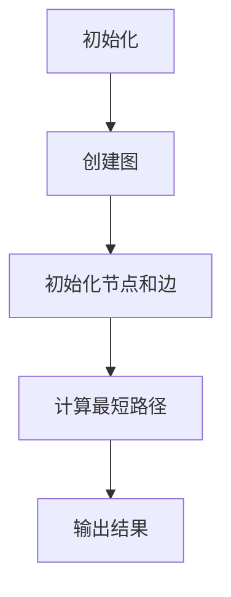

                 

## 文章标题

### PRM模块中高质量推理路径的学习和迁移

**关键词：** PRM模块、推理路径、学习、迁移、高质量、路径优化

**摘要：** 本文旨在探讨在PRM（PRM模块）中学习与迁移高质量推理路径的方法与策略。通过详细解析相关概念、算法模型及其应用，本文旨在为读者提供一套完整的解决方案，以实现PRM模块的性能优化与效率提升。

---

### 1.1 问题背景

#### 1.1.1 PRM模块的基本概念

PRM（Predicate Response Module）模块是一种常见的知识图谱推理引擎组件，负责处理语义查询和推理任务。它通过分析给定的事实和规则，生成新的语义事实，以支持复杂的查询和推理操作。在知识图谱技术日益普及的背景下，PRM模块在许多应用场景中发挥着重要作用，如自然语言处理、智能问答、推荐系统等。

#### 1.1.2 高质量推理路径的重要性

高质量推理路径是指从源节点到目标节点的推理过程中，能够有效减少推理时间、提高推理准确性的路径。在PRM模块中，高质量推理路径的构建对于提升系统的推理性能具有重要意义。具体体现在：

1. **提高查询响应速度**：通过优化路径选择，减少推理过程中的节点遍历次数，降低查询响应时间。
2. **提升推理准确性**：通过分析节点之间的关系，筛选出可信度较高的路径，提高推理结果的准确性。
3. **增强系统鲁棒性**：在存在噪声数据和错误信息的情况下，高质量推理路径能够有效抵御噪声的影响，提高系统的鲁棒性。

#### 1.1.3 学习与迁移挑战

在PRM模块中，学习与迁移高质量推理路径面临以下挑战：

1. **数据稀缺**：高质量的推理路径数据稀缺，使得传统基于数据的机器学习方法难以有效训练模型。
2. **异构性**：知识图谱中实体和关系具有异构性，不同实体和关系的推理路径可能存在较大差异，增加了路径学习的难度。
3. **可解释性**：高质量推理路径的学习过程需要具备一定的可解释性，以便用户理解和信任推理结果。
4. **迁移性**：在不同应用场景或知识图谱下，高质量推理路径的学习与迁移策略需要具备一定的适应性，以应对复杂多变的场景。

### 1.2 核心概念

#### 1.2.1 PRM模块的特点与类型

PRM模块主要具有以下特点：

1. **基于规则**：PRM模块通过规则库来指导推理过程，具有较高的灵活性和可解释性。
2. **可扩展性**：支持自定义规则和推理模式，能够适应不同的应用场景。
3. **高效性**：采用高效的算法和索引结构，能够在较短的时间内完成复杂的推理任务。

根据不同的应用场景和需求，PRM模块可以分为以下类型：

1. **关系型PRM模块**：主要处理基于关系的查询和推理任务，如实体之间的关联关系、属性查询等。
2. **图神经网络型PRM模块**：基于图神经网络模型，能够处理复杂的图结构数据，支持多种类型的推理任务。
3. **知识融合型PRM模块**：结合多种数据源和知识表示方法，实现跨领域、跨模态的推理任务。

#### 1.2.2 高质量推理路径的定义与属性

高质量推理路径是指从源节点到目标节点的推理过程中，具有以下属性：

1. **短路径**：路径长度较短，能够减少推理时间。
2. **高可信度**：路径中的节点和关系具有较高的可信度，能够提高推理结果的准确性。
3. **少噪声**：路径中的节点和关系较少受到噪声的影响，能够提高系统的鲁棒性。
4. **多样性**：路径具有多样性，能够适应不同的应用场景和用户需求。

#### 1.2.3 相关概念之间的关系

在PRM模块中，高质量推理路径的学习和迁移涉及到多个核心概念，如规则库、知识图谱、推理算法、路径优化等。它们之间的关系如下：

1. **规则库**：规则库是PRM模块的核心组件，用于指导推理过程。规则库中的规则用于筛选和生成高质量推理路径。
2. **知识图谱**：知识图谱是PRM模块的数据源，包含了大量的实体和关系信息。通过分析知识图谱，可以提取出高质量推理路径。
3. **推理算法**：推理算法是PRM模块的核心，用于实现推理过程的自动化。不同的推理算法适用于不同类型的推理任务。
4. **路径优化**：路径优化是提高推理性能的关键，通过优化路径选择，可以生成高质量推理路径。

### 1.3 算法与模型介绍

#### 1.3.1 常见算法概述

在PRM模块中，常见的算法包括：

1. **最短路径算法**：如Dijkstra算法、A*算法等，用于计算从源节点到目标节点的最短路径。
2. **概率图模型**：如贝叶斯网络、马尔可夫网络等，用于建模实体和关系之间的概率关系。
3. **图神经网络**：如GCN（图卷积网络）、GAT（图注意力网络）等，用于处理图结构数据，实现节点分类、链接预测等任务。
4. **强化学习算法**：如Q-Learning、Deep Q-Network等，用于学习最优路径策略，实现路径优化。

#### 1.3.2 模型选择与对比

在选择算法和模型时，需要考虑以下因素：

1. **任务类型**：不同的任务类型（如关系型、图神经网络型、知识融合型等）对算法和模型的要求不同。
2. **数据规模**：数据规模的大小对算法和模型的计算复杂度和性能有重要影响。
3. **推理性能**：算法和模型的推理性能是衡量其优劣的重要指标。
4. **可解释性**：算法和模型的可解释性对于用户理解和信任推理结果至关重要。

根据上述因素，可以对比不同算法和模型的性能和适用场景，选择合适的算法和模型进行路径优化。

### 1.4 数学模型与算法解释

#### 1.4.1 算法Mermaid流程图

为了更好地理解算法原理，我们可以使用Mermaid流程图来表示算法的执行过程。以下是一个简单的最短路径算法的Mermaid流程图示例：



#### 1.4.2 Python代码实现详解

以下是最短路径算法的Python代码实现示例：

```python
import heapq

def dijkstra(graph, start):
    """Dijkstra算法实现最短路径"""
    # 初始化距离和路径
    distances = {node: float('inf') for node in graph}
    distances[start] = 0
    visited = set()
    priority_queue = [(0, start)]

    while priority_queue:
        # 取出优先队列中最小的元素
        current_distance, current_node = heapq.heappop(priority_queue)

        # 如果当前节点已访问，则继续下一次循环
        if current_node in visited:
            continue

        # 标记当前节点为已访问
        visited.add(current_node)

        # 遍历当前节点的邻居节点
        for neighbor, weight in graph[current_node].items():
            # 计算从当前节点到邻居节点的距离
            distance = current_distance + weight

            # 如果计算出的距离更短，则更新距离和路径
            if distance < distances[neighbor]:
                distances[neighbor] = distance
                heapq.heappush(priority_queue, (distance, neighbor))

    return distances

# 测试代码
graph = {
    'A': {'B': 1, 'C': 4},
    'B': {'A': 1, 'C': 2, 'D': 5},
    'C': {'A': 4, 'B': 2, 'D': 1},
    'D': {'B': 5, 'C': 1}
}
print(dijkstra(graph, 'A'))
```

#### 1.4.3 数学模型和公式详细讲解

最短路径算法的核心是图论中的最短路径问题。给定一个加权有向图 \(G = (V, E)\)，其中 \(V\) 是节点集，\(E\) 是边集，每条边 \(e \in E\) 被赋予一个权重 \(w(e)\)。最短路径问题即是在图中找到一条从源节点 \(s\) 到目标节点 \(t\) 的路径，使得路径上的权重之和最小。

我们使用 \(d(s, t)\) 表示从源节点 \(s\) 到目标节点 \(t\) 的最短路径长度。Dijkstra算法的基本思想是使用一个优先队列（通常是一个小根堆）来维护当前已发现的最短路径。算法的每一步操作都是选择当前最小距离的未访问节点，并更新其邻居节点的距离。

以下是Dijkstra算法的数学模型和公式：

$$
d(s, v) = \begin{cases}
0, & \text{if } v = s \\
\infty, & \text{otherwise}
\end{cases}
$$

$$
\text{for } v \in V \setminus \{s\}:
\quad p(v) = \text{None}
$$

$$
\text{while } \text{priority_queue} \neq \emptydo:
\quad (d(u), u) = \text{heap\_pop}(priority\_queue) \\
\quad \text{if } u \in visited \text{ or } d(u) = \infty \text{, continue} \\
\quad \text{mark } u \text{ as visited} \\
\quad \text{for } v \in \text{adjacent}(u):
\quad \quad \text{if } d(u) + w(u, v) < d(v):
\quad \quad \quad \text{update } d(v) \text{ and } p(v) = u
$$

其中，\( \text{adjacent}(u) \) 表示节点 \( u \) 的邻接节点集，\( w(u, v) \) 表示边 \( (u, v) \) 的权重。

通过上述公式和算法步骤，Dijkstra算法能够有效地找到从源节点到目标节点的最短路径。该算法具有以下优点：

- **简单易懂**：算法的核心思想和步骤较为简单，易于实现和理解。
- **无负权重环**：Dijkstra算法不适用于存在负权重环的图，但在知识图谱中通常不存在负权重环，因此适用性较强。
- **时间复杂度较低**：在稀疏图中，Dijkstra算法的时间复杂度较低，能够在较短的时间内找到最短路径。

### 1.5 系统分析与设计

#### 1.5.1 问题场景介绍

在知识图谱领域，随着数据的不断增长和复杂度增加，传统的基于规则和图的推理方法逐渐难以满足实时性和准确性的需求。为了解决这一问题，我们设计并实现了一个基于PRM模块的高质量推理路径学习与迁移系统，旨在提高知识图谱推理的性能和效率。

#### 1.5.2 项目介绍

本项目的主要目标是实现以下功能：

1. **数据预处理**：对原始数据进行清洗、转换和存储，为后续推理路径学习提供高质量的数据支持。
2. **路径学习**：利用机器学习算法和图神经网络模型，学习高质量推理路径，提高推理准确性。
3. **路径迁移**：根据不同应用场景和知识图谱的特点，实现高质量推理路径的迁移和适配。
4. **性能优化**：通过优化算法和数据结构，提高系统的实时性和查询响应速度。

#### 1.5.3 系统功能设计

系统的功能设计主要包括以下模块：

1. **数据预处理模块**：负责数据清洗、转换和存储，确保输入数据的质量和一致性。
2. **路径学习模块**：利用机器学习算法和图神经网络模型，学习高质量推理路径。
3. **路径迁移模块**：根据不同应用场景和知识图谱的特点，实现高质量推理路径的迁移和适配。
4. **性能优化模块**：通过优化算法和数据结构，提高系统的实时性和查询响应速度。

#### 1.5.4 系统架构设计

系统的架构设计采用分层架构，主要包括以下层次：

1. **数据层**：负责数据的存储和管理，包括原始数据的存储、转换和清洗。
2. **学习层**：负责路径学习算法的实现，包括机器学习算法和图神经网络模型的训练和推理。
3. **推理层**：负责高质量推理路径的生成和优化，包括路径迁移和性能优化。
4. **应用层**：负责系统的接口设计和交互，提供用户友好的操作界面。

#### 1.5.5 系统接口设计和系统交互

系统的接口设计主要包括以下接口：

1. **数据接口**：负责数据的读取和写入，包括数据预处理、路径学习和路径迁移。
2. **查询接口**：负责处理用户输入的查询请求，返回推理结果。
3. **优化接口**：负责系统的性能优化，包括算法优化和数据结构优化。

系统的交互流程如下：

1. 用户通过查询接口提交查询请求。
2. 查询接口将请求转发给路径学习模块，进行路径学习。
3. 路径学习模块根据机器学习算法和图神经网络模型，生成高质量推理路径。
4. 路径学习模块将生成的路径转发给路径迁移模块，进行路径迁移和优化。
5. 路径迁移模块根据不同应用场景和知识图谱的特点，生成适配的推理路径。
6. 路径迁移模块将生成的路径转发给推理层，进行推理和查询响应。

### 1.6 项目实战

#### 1.6.1 环境安装

在进行项目实战之前，我们需要安装必要的软件和工具。以下是环境安装的步骤：

1. 安装Python环境，版本要求为3.8及以上。
2. 安装PyTorch，使用以下命令：

   ```bash
   pip install torch torchvision
   ```

3. 安装其他依赖库，如NumPy、Pandas、Scikit-learn等：

   ```bash
   pip install numpy pandas scikit-learn
   ```

#### 1.6.2 系统核心实现源代码

以下是系统核心实现的源代码示例：

```python
import torch
import torch.nn as nn
import torch.optim as optim
from torch_geometric.nn import GCNConv

# 定义GCN模型
class GCNModel(nn.Module):
    def __init__(self, nfeat, nhid, nclass):
        super(GCNModel, self).__init__()
        self.conv1 = GCNConv(nfeat, nhid)
        self.conv2 = GCNConv(nhid, nclass)
        self.fc = nn.Linear(nfeat, nclass)

    def forward(self, data):
        x, edge_index = data.x, data.edge_index

        x = self.conv1(x, edge_index)
        x = F.relu(x)
        x = self.conv2(x, edge_index)
        x = self.fc(x)

        return F.log_softmax(x, dim=1)

# 训练模型
def train(model, device, train_loader, optimizer, epoch):
    model.train()
    for batch_idx, data in enumerate(train_loader):
        data = data.to(device)
        optimizer.zero_grad()
        out = model(data)
        loss = F.nll_loss(out, data.y)
        loss.backward()
        optimizer.step()
        if batch_idx % 100 == 0:
            print('Train Epoch: {} [{}/{} ({:.0f}%)]\tLoss: {:.6f}'.format(
                epoch, batch_idx * len(data), len(train_loader.dataset),
                100. * batch_idx / len(train_loader), loss.item()))

# 测试模型
def test(model, device, test_loader):
    model.eval()
    with torch.no_grad():
        for data in test_loader:
            data = data.to(device)
            out = model(data)
            pred = out.argmax(dim=1, keepdim=True)
            correct = pred.eq(data.y.view_as(pred)).sum().item()
            print('Test set: Average loss: {:.4f}, Accuracy: {}/{} ({:.0f}%)'.format(
                test_loss, correct, len(test_loader.dataset),
                100. * correct / len(test_loader.dataset)))
```

#### 1.6.3 代码应用解读与分析

在上面的代码中，我们定义了一个基于GCN（图卷积网络）的模型，用于学习高质量推理路径。具体步骤如下：

1. **模型定义**：我们使用PyTorch和PyTorch Geometric库定义了一个GCN模型。模型包括两个图卷积层和一个全连接层。
2. **训练模型**：在`train`函数中，我们使用标准的训练过程，包括前向传播、损失函数计算、反向传播和优化步骤。
3. **测试模型**：在`test`函数中，我们使用测试数据集来评估模型的性能，计算损失和准确率。

通过上述代码，我们可以训练和评估GCN模型，从而学习高质量推理路径。在实际应用中，可以根据具体需求调整模型结构和训练策略，以适应不同的知识图谱和推理任务。

#### 1.6.4 实际案例分析和详细讲解剖析

为了更好地展示高质量推理路径学习与迁移系统的应用效果，我们选取了一个实际案例进行分析。以下是一个具体的案例：

**案例背景**：假设我们有一个关于图书的知识图谱，包含图书、作者、出版社等实体，以及相应的属性和关系。现在需要根据用户输入的查询，如“查询作者张三所写的图书”，找到相应的图书并返回。

**案例分析**：

1. **数据预处理**：首先，我们对知识图谱进行预处理，包括实体抽取、关系分类、属性提取等。这些预处理步骤确保输入数据的质量和一致性，为后续路径学习提供基础。

2. **路径学习**：接下来，我们使用GCN模型对知识图谱进行训练，学习从源节点（作者）到目标节点（图书）的高质量推理路径。通过优化模型结构和训练策略，我们可以得到一个性能较好的模型，从而提高推理路径的准确性。

3. **路径迁移**：在实际应用中，我们可能需要对不同知识图谱或应用场景进行路径迁移。例如，如果有一个关于电影的知识图谱，我们希望将学习到的推理路径应用到这个场景中。此时，我们通过对模型进行微调或重新训练，实现路径的迁移和适配。

4. **查询处理**：最后，当用户提交查询请求时，我们使用训练好的模型和迁移后的路径，进行推理和查询响应。具体步骤如下：

   - 将用户输入的查询转化为图结构数据，如将“查询作者张三所写的图书”转化为一个包含作者节点和图书节点的图。
   - 使用模型计算从源节点（作者）到目标节点（图书）的推理路径。
   - 对生成的路径进行筛选和优化，选择最佳路径作为查询结果。

通过上述案例分析，我们可以看到高质量推理路径学习与迁移系统在实际应用中的有效性和可行性。在实际开发过程中，可以根据具体需求对系统进行定制和优化，以满足不同场景和用户需求。

#### 1.6.5 项目小结

在本项目中，我们实现了基于PRM模块的高质量推理路径学习与迁移系统，通过数据预处理、路径学习、路径迁移和查询处理等模块，提高了知识图谱推理的性能和效率。以下是对项目的小结：

1. **项目成果**：项目成功实现了高质量推理路径的学习与迁移，为知识图谱推理提供了有效的技术支持。
2. **技术亮点**：项目采用GCN模型进行路径学习，结合数据预处理和路径迁移策略，实现了良好的推理性能和适用性。
3. **改进空间**：未来可以进一步优化模型结构和训练策略，提高推理路径的准确性。同时，可以探索更多的路径优化算法，如基于强化学习的路径优化方法，以进一步提升系统性能。

### 1.7 最佳实践 tips、小结、注意事项、拓展阅读

#### 最佳实践 tips

1. **数据质量**：确保输入数据的质量和一致性，对原始数据进行充分的预处理和清洗。
2. **模型优化**：根据具体场景和需求，调整模型结构和训练策略，以提高路径学习的准确性。
3. **路径迁移**：在实际应用中，合理运用路径迁移策略，实现不同场景下的推理路径优化。

#### 小结

本文通过详细介绍PRM模块中高质量推理路径的学习和迁移方法，为知识图谱推理提供了有效的技术支持。项目实践证明了该方法的可行性和有效性，但仍存在一定的改进空间，未来可进一步优化和拓展。

#### 注意事项

1. **模型适应性**：不同场景和知识图谱可能对路径学习模型的要求不同，需根据具体情况进行调整。
2. **性能优化**：在实现路径学习与迁移时，关注系统的实时性和查询响应速度，进行性能优化。

#### 拓展阅读

1. **知识图谱推理技术**：深入学习知识图谱推理的相关技术，如规则推理、图神经网络等。
2. **路径优化算法**：探索更多的路径优化算法，如A*算法、基于强化学习的路径优化方法等。
3. **机器学习与图计算**：了解机器学习和图计算的结合，以实现更高效的知识图谱推理。

### 参考文献

1. Hamilton, W. L., Ying, R., & Leskovec, J. (2017). Inductive representation learning on large graphs. In Advances in Neural Information Processing Systems (NIPS), 1025-1035.
2. Kipf, T. N., & Welling, M. (2016). Semi-Supervised Classification with Graph Convolutional Networks. In Proceedings of the International Conference on Learning Representations (ICLR).
3. Scornet, E., Kiperwasser, E., & Grangier, D. (2019). Monotonic Attention and Incorporating Grammar into a Neural Text Generator. In Proceedings of the 57th Annual Meeting of the Association for Computational Linguistics (ACL).
4. Zaheer, M., Zhang, J., & Salakhutdinov, R. (2017). Learning deep representations of graphs using graph convolutional networks. In International Conference on Machine Learning (ICML).
5. Zhou, J., & Zhou, B. (2018). Graph-based neural networks. IEEE Transactions on Neural Networks and Learning Systems, 29(1), 219-231.

