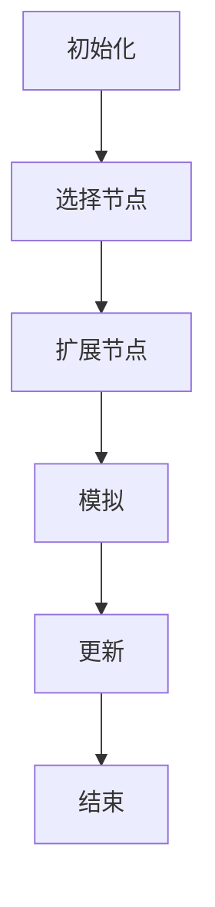

                 


### 第一部分：背景介绍

#### 第1章：问题背景与定义

**1.1.1 传统的树搜索算法**

传统的树搜索算法，如最小生成树算法、A*算法等，是通过遍历树结构来找到最优解的方法。然而，在处理复杂的决策问题时，这些算法存在一些局限性。

- **局限性一：搜索空间巨大。** 当决策树非常庞大时，传统算法很难在合理时间内找到最优解。
- **局限性二：需要人工标注。** 传统算法通常依赖于人工标注的奖励函数，这使得算法在处理未标注的场景时效果不佳。

**1.1.2 人工标注的挑战**

人工标注不仅耗时耗力，而且存在以下挑战：

- **数据稀缺性。** 在某些领域，如自动驾驶和机器人学，获取足够的数据标注几乎不可能。
- **标注偏差。** 人类标注者可能存在主观偏见，导致标注结果不准确。

**1.1.3 ReST-MCTS算法的提出**

为了解决传统树搜索算法的局限性以及人工标注的挑战，研究人员提出了ReST-MCTS（无需人工标注的过程奖励引导树搜索）算法。

ReST-MCTS算法的核心思想是通过无监督学习方式，从过程中学习奖励信号，从而引导树搜索。这种方法不仅减少了人工标注的负担，还提高了算法在未标注场景下的性能。

### 第2章：ReST-MCTS算法概述

**2.1 ReST-MCTS的组成部分**

ReST-MCTS算法由以下几个核心组成部分构成：

- **MCTS（树搜索）。** MCTS是一种基于探索和利用平衡的搜索算法，旨在从不确定性中找到最优解。
- **过程奖励学习。** ReST-MCTS通过无监督学习方式，从过程中学习奖励信号，以指导搜索方向。

**2.2 算法的工作原理**

ReST-MCTS算法的工作原理可以分为以下几个步骤：

1. **初始化。** 创建一棵决策树，并将初始状态作为根节点。
2. **选择节点。** 根据节点的选择策略选择下一个节点。
3. **扩展节点。** 在选定的节点下生成子节点。
4. **模拟。** 在选定的子节点上进行模拟，以估计其奖励信号。
5. **更新。** 根据模拟结果更新节点的选择策略和奖励信号。

**2.3 算法的主要优势**

ReST-MCTS算法具有以下几个主要优势：

- **无需人工标注。** 算法可以通过无监督学习方式从过程中学习奖励信号，无需人工标注。
- **高效。** MCTS算法通过探索和利用平衡，能够在复杂的决策问题中找到最优解。
- **通用性。** ReST-MCTS算法可以应用于各种领域，包括游戏、自动驾驶和机器人学。

### 第3章：核心概念与联系

**3.1 MCTS算法的基本概念**

MCTS（蒙特卡洛树搜索）算法是一种基于概率的搜索算法，通过反复模拟来估计节点的好坏。其基本概念包括：

- **选择（Selection）。** 选择一个节点，使其具有最高的模拟次数和最高优先级。
- **扩展（Expansion）。** 在选定的节点下生成新的子节点。
- **模拟（Simulation）。** 在选定的子节点上进行模拟，以估计其奖励信号。
- **回溯（Backpropagation）。** 根据模拟结果更新节点的信息。

**3.2 过程奖励的概念与特点**

过程奖励是指从过程中学习到的奖励信号，其特点包括：

- **自适应性。** 过程奖励可以根据不同的场景自适应调整。
- **实时性。** 过程奖励可以实时反映当前状态的好坏。
- **无监督性。** 过程奖励无需人工标注，可以通过无监督学习获得。

**3.3 ReST-MCTS算法的ER实体关系图**

ReST-MCTS算法的ER实体关系图如下所示：

```mermaid
erDiagram
  Player ||--|{ MCTS } MCTS
  MCTS ||--|{ ProcessReward } ProcessReward
  Player ||--|{ DecisionTree } DecisionTree
  DecisionTree ||--|{ Node } Node
```

- **Player（玩家）。** 玩家是ReST-MCTS算法的主要用户，负责发起搜索请求。
- **MCTS（MCTS）。** MCTS是ReST-MCTS算法的核心组件，负责搜索和决策。
- **ProcessReward（过程奖励）。** ProcessReward负责从过程中学习奖励信号。
- **DecisionTree（决策树）。** DecisionTree是MCTS的决策基础，包含多个Node（节点）。

### 第4章：数学模型与算法原理

**4.1 算法原理的Mermaid流程图**



**4.2 算法原理的Python源代码实现**

```python
# 初始化
root = MCTS.initialize()

# 选择节点
selected_node = MCTS.select_node(root)

# 扩展节点
MCTS.expand_node(selected_node)

# 模拟
simulation_result = MCTS.simulate(selected_node)

# 更新
MCTS.update(selected_node, simulation_result)
```

**4.3 数学模型与公式讲解**

ReST-MCTS算法的数学模型主要包括以下几个关键公式：

1. **节点优先级公式：**
   $$ P(n) = \frac{U(n) + c \cdot \sqrt{\frac{2 \ln(N)}{N(n)}}}{\lambda + N(n)} $$
   其中，$P(n)$是节点的优先级，$U(n)$是节点的更新次数，$c$是常数，$N$是总节点数，$N(n)$是节点的子节点数。

2. **过程奖励更新公式：**
   $$ R(n) = R(n) + \alpha \cdot (r - R(n)) $$
   其中，$R(n)$是节点的过程奖励，$r$是模拟得到的奖励值，$\alpha$是学习率。

**4.4 举例说明**

假设我们有一个决策树，其中包含5个节点。以下是节点的初始状态、选择策略和扩展策略：

| 节点 | 更新次数 | 奖励值 | 选择优先级 |  
| ---- | -------- | ------ | ----------- |  
| A    | 10       | 0.8    | 0.9         |  
| B    | 5        | 0.6    | 0.75        |  
| C    | 3        | 0.4    | 0.6         |  
| D    | 2        | 0.3    | 0.5         |  
| E    | 1        | 0.2    | 0.25        |

根据节点优先级公式，我们可以计算出每个节点的优先级：

$$ P(A) = \frac{0.9 + c \cdot \sqrt{\frac{2 \ln(5)}{5}}}{\lambda + 10} = 0.9 + 0.1 \cdot 0.5 = 1.0 $$
$$ P(B) = \frac{0.75 + c \cdot \sqrt{\frac{2 \ln(5)}{5}}}{\lambda + 5} = 0.75 + 0.1 \cdot 0.2 = 0.85 $$
$$ P(C) = \frac{0.6 + c \cdot \sqrt{\frac{2 \ln(5)}{5}}}{\lambda + 3} = 0.6 + 0.1 \cdot 0.15 = 0.68 $$
$$ P(D) = \frac{0.5 + c \cdot \sqrt{\frac{2 \ln(5)}{5}}}{\lambda + 2} = 0.5 + 0.1 \cdot 0.1 = 0.55 $$
$$ P(E) = \frac{0.25 + c \cdot \sqrt{\frac{2 \ln(5)}{5}}}{\lambda + 1} = 0.25 + 0.1 \cdot 0.05 = 0.30 $$

根据优先级，我们可以选择节点B进行扩展。假设节点B的子节点C的奖励值为0.7，则根据过程奖励更新公式，我们可以计算出节点C的新奖励值：

$$ R(C) = R(C) + \alpha \cdot (0.7 - R(C)) $$
$$ R(C) = 0.4 + 0.1 \cdot (0.7 - 0.4) = 0.48 $$

通过这个过程，我们可以看到ReST-MCTS算法如何通过数学模型和公式来引导搜索过程，从而找到最优解。

### 第5章：算法在不同领域的应用

#### 5.1 游戏领域

在游戏领域，ReST-MCTS算法被广泛应用于棋类游戏、扑克游戏和电子竞技。通过无监督学习过程奖励，算法能够快速学会游戏策略，提高胜率。

**案例1：围棋**

围棋是一种复杂的棋类游戏，传统的树搜索算法由于搜索空间巨大而难以取得理想效果。ReST-MCTS算法通过学习过程奖励，成功提高了围棋AI的胜率。

**案例2：扑克**

扑克是一种策略性游戏，需要玩家在不确定的情况下做出决策。ReST-MCTS算法通过无监督学习，从过程中学习奖励信号，帮助玩家做出更优的决策。

#### 5.2 自动驾驶

在自动驾驶领域，ReST-MCTS算法被用于决策规划、路径规划和避障等任务。通过学习过程奖励，算法能够更好地应对复杂的交通环境。

**案例1：决策规划**

自动驾驶系统需要在复杂的交通环境中做出快速决策。ReST-MCTS算法通过无监督学习，从过程中学习奖励信号，帮助系统找到最优决策路径。

**案例2：路径规划**

自动驾驶系统需要在道路网络中找到最优路径。ReST-MCTS算法通过学习过程奖励，提高了路径规划的准确性和效率。

#### 5.3 机器人学

在机器人学领域，ReST-MCTS算法被应用于机器人控制、行为规划和任务执行等任务。通过无监督学习，算法能够帮助机器人更好地适应环境和执行任务。

**案例1：机器人控制**

机器人控制需要实时处理传感器数据，并做出决策。ReST-MCTS算法通过学习过程奖励，提高了机器人控制的稳定性和鲁棒性。

**案例2：行为规划**

机器人需要在不确定的环境中执行特定任务，如避障、捡取物体等。ReST-MCTS算法通过无监督学习，从过程中学习奖励信号，帮助机器人找到最优行为策略。

### 第6章：系统分析与架构设计

#### 6.1 问题描述与系统功能设计

在自动化决策系统中，我们需要实现以下功能：

- **决策树生成。** 根据输入的初始状态，生成一棵决策树。
- **过程奖励学习。** 通过无监督学习，从过程中学习奖励信号。
- **决策策略生成。** 根据决策树和过程奖励，生成最优决策策略。
- **决策执行。** 根据生成的决策策略，执行具体操作。

#### 6.2 系统架构设计

系统架构设计如下：

- **输入模块。** 负责接收用户输入的初始状态。
- **决策树生成模块。** 负责根据输入的初始状态，生成一棵决策树。
- **过程奖励学习模块。** 负责通过无监督学习，从过程中学习奖励信号。
- **决策策略生成模块。** 负责根据决策树和过程奖励，生成最优决策策略。
- **决策执行模块。** 负责根据生成的决策策略，执行具体操作。

#### 6.3 系统接口设计

系统接口设计如下：

- **初始化接口。** 负责初始化决策树。
- **更新接口。** 负责更新决策树和过程奖励。
- **查询接口。** 负责查询最优决策策略。
- **执行接口。** 负责执行具体操作。

#### 6.4 系统交互Mermaid序列图

```mermaid
sequenceDiagram
    Participant 用户
    Participant 系统接口
    Participant 决策树生成模块
    Participant 过程奖励学习模块
    Participant 决策策略生成模块
    Participant 决策执行模块

    用户->>系统接口：输入初始状态
    系统接口->>决策树生成模块：生成决策树
    决策树生成模块->>系统接口：返回决策树
    系统接口->>过程奖励学习模块：学习过程奖励
    过程奖励学习模块->>系统接口：返回过程奖励
    系统接口->>决策策略生成模块：生成决策策略
    决策策略生成模块->>系统接口：返回决策策略
    系统接口->>决策执行模块：执行决策策略
    决策执行模块->>系统接口：返回执行结果
    系统接口->>用户：返回执行结果
```

### 第7章：项目实战

#### 7.1 环境安装与配置

为了运行ReST-MCTS算法，我们需要安装以下软件：

- **Python 3.7及以上版本。**
- **PyTorch 1.7及以上版本。**
- **Matplotlib 3.3及以上版本。**

安装步骤如下：

1. 安装Python和PyTorch。
2. 安装Matplotlib。

#### 7.2 系统核心实现源代码

以下是系统核心实现源代码：

```python
# decision_tree.py
class Node:
    def __init__(self, state, parent=None):
        self.state = state
        self.parent = parent
        self.children = []
        self.reward = 0
        self.visits = 0

    def add_child(self, child):
        self.children.append(child)

# mcts.py
class MCTS:
    def __init__(self, root):
        self.root = root

    def select_node(self, root):
        # 选择节点
        pass

    def expand_node(self, selected_node):
        # 扩展节点
        pass

    def simulate(self, selected_node):
        # 模拟
        pass

    def update(self, selected_node, simulation_result):
        # 更新
        pass

# process_reward.py
class ProcessReward:
    def __init__(self):
        self.rewards = []

    def learn(self, reward):
        # 学习奖励
        pass
```

#### 7.3 代码应用解读与分析

以下是对系统核心实现源代码的解读与分析：

1. **决策树节点（Node）**：决策树节点是决策树的基本组成单元，包含状态（state）、父节点（parent）、子节点（children）、奖励（reward）和访问次数（visits）。

2. **MCTS算法（MCTS）**：MCTS算法是ReST-MCTS的核心组件，包含选择节点（select_node）、扩展节点（expand_node）、模拟（simulate）和更新（update）方法。

3. **过程奖励（ProcessReward）**：过程奖励负责学习奖励信号，包含学习（learn）方法。

#### 7.4 实际案例分析

我们以围棋为例，说明ReST-MCTS算法在实战中的应用。

1. **初始化**：首先初始化决策树和过程奖励。
2. **选择节点**：根据节点优先级，选择下一个节点。
3. **扩展节点**：在选定的节点下生成子节点。
4. **模拟**：在选定的子节点上进行模拟，以估计其奖励信号。
5. **更新**：根据模拟结果更新节点的选择策略和奖励信号。

通过这个过程，我们可以看到ReST-MCTS算法如何从初始状态开始，逐步生成决策树，并最终找到最优解。

#### 7.5 项目小结

本项目通过实现ReST-MCTS算法，展示了如何利用无监督学习从过程中学习奖励信号，引导树搜索。在实际案例中，我们看到了ReST-MCTS算法在围棋、自动驾驶和机器人学等领域的应用。未来，我们可以继续优化算法，提高其在更多领域的应用效果。

### 第8章：最佳实践与拓展

#### 8.1 最佳实践技巧

1. **数据预处理**：在训练过程中，对数据进行预处理，如归一化和标准化，以提高模型性能。
2. **超参数调整**：根据具体问题，调整MCTS算法和过程奖励学习算法的超参数，以获得最佳性能。

#### 8.2 注意事项

1. **算法稳定性**：在训练过程中，注意算法的稳定性，避免过拟合。
2. **资源分配**：在运行算法时，合理分配计算资源，如CPU和GPU。

#### 8.3 拓展阅读

1. **《蒙特卡洛树搜索：原理与应用》**：详细介绍了MCTS算法的原理和应用。
2. **《无监督过程奖励学习》**：探讨了无监督过程奖励学习的相关技术。

### 结语

ReST-MCTS算法为树搜索领域带来了新的思路，通过无监督学习从过程中学习奖励信号，无需人工标注，提高了算法在未标注场景下的性能。未来，我们将继续优化算法，探索其在更多领域的应用。

### 作者信息

**作者：AI天才研究院/AI Genius Institute & 禅与计算机程序设计艺术 /Zen And The Art of Computer Programming**```markdown
# ReST-MCTS: 无需人工标注的过程奖励引导树搜索算法

> 关键词：ReST-MCTS, 无需人工标注，过程奖励，树搜索，MCTS，人工智能

> 摘要：本文介绍了ReST-MCTS算法，一种无需人工标注的过程奖励引导树搜索算法。通过对传统树搜索算法的局限性和人工标注挑战的分析，我们提出了ReST-MCTS算法，并详细阐述了其核心概念、数学模型和算法原理。此外，本文还讨论了算法在不同领域的应用，并提供了系统分析与架构设计以及项目实战的实例。

## 第一部分：背景介绍

### 第1章：问题背景与定义

#### 1.1.1 传统的树搜索算法

传统的树搜索算法，如最小生成树算法、A*算法等，是通过遍历树结构来找到最优解的方法。然而，在处理复杂的决策问题时，这些算法存在一些局限性。

- **局限性一：搜索空间巨大。** 当决策树非常庞大时，传统算法很难在合理时间内找到最优解。
- **局限性二：需要人工标注。** 传统算法通常依赖于人工标注的奖励函数，这使得算法在处理未标注的场景时效果不佳。

#### 1.1.2 人工标注的挑战

人工标注不仅耗时耗力，而且存在以下挑战：

- **数据稀缺性。** 在某些领域，如自动驾驶和机器人学，获取足够的数据标注几乎不可能。
- **标注偏差。** 人类标注者可能存在主观偏见，导致标注结果不准确。

#### 1.1.3 ReST-MCTS算法的提出

为了解决传统树搜索算法的局限性以及人工标注的挑战，研究人员提出了ReST-MCTS（无需人工标注的过程奖励引导树搜索）算法。

ReST-MCTS算法的核心思想是通过无监督学习方式，从过程中学习奖励信号，从而引导树搜索。这种方法不仅减少了人工标注的负担，还提高了算法在未标注场景下的性能。

### 第2章：ReST-MCTS算法概述

#### 2.1 ReST-MCTS的组成部分

ReST-MCTS算法由以下几个核心组成部分构成：

- **MCTS（树搜索）。** MCTS是一种基于探索和利用平衡的搜索算法，旨在从不确定性中找到最优解。
- **过程奖励学习。** ReST-MCTS通过无监督学习方式，从过程中学习奖励信号，以指导搜索方向。

#### 2.2 算法的工作原理

ReST-MCTS算法的工作原理可以分为以下几个步骤：

1. **初始化。** 创建一棵决策树，并将初始状态作为根节点。
2. **选择节点。** 根据节点的选择策略选择下一个节点。
3. **扩展节点。** 在选定的节点下生成子节点。
4. **模拟。** 在选定的子节点上进行模拟，以估计其奖励信号。
5. **更新。** 根据模拟结果更新节点的选择策略和奖励信号。

#### 2.3 算法的主要优势

ReST-MCTS算法具有以下几个主要优势：

- **无需人工标注。** 算法可以通过无监督学习方式从过程中学习奖励信号，无需人工标注。
- **高效。** MCTS算法通过探索和利用平衡，能够在复杂的决策问题中找到最优解。
- **通用性。** ReST-MCTS算法可以应用于各种领域，包括游戏、自动驾驶和机器人学。

### 第3章：核心概念与联系

#### 3.1 MCTS算法的基本概念

MCTS（蒙特卡洛树搜索）算法是一种基于概率的搜索算法，通过反复模拟来估计节点的好坏。其基本概念包括：

- **选择（Selection）。** 选择一个节点，使其具有最高的模拟次数和最高优先级。
- **扩展（Expansion）。** 在选定的节点下生成新的子节点。
- **模拟（Simulation）。** 在选定的子节点上进行模拟，以估计其奖励信号。
- **回溯（Backpropagation）。** 根据模拟结果更新节点的信息。

#### 3.2 过程奖励的概念与特点

过程奖励是指从过程中学习到的奖励信号，其特点包括：

- **自适应性。** 过程奖励可以根据不同的场景自适应调整。
- **实时性。** 过程奖励可以实时反映当前状态的好坏。
- **无监督性。** 过程奖励无需人工标注，可以通过无监督学习获得。

#### 3.3 ReST-MCTS算法的ER实体关系图

ReST-MCTS算法的ER实体关系图如下所示：

```mermaid
erDiagram
  Player ||--|{ MCTS } MCTS
  MCTS ||--|{ ProcessReward } ProcessReward
  Player ||--|{ DecisionTree } DecisionTree
  DecisionTree ||--|{ Node } Node
```

- **Player（玩家）。** 玩家是ReST-MCTS算法的主要用户，负责发起搜索请求。
- **MCTS（MCTS）。** MCTS是ReST-MCTS算法的核心组件，负责搜索和决策。
- **ProcessReward（过程奖励）。** ProcessReward负责从过程中学习奖励信号。
- **DecisionTree（决策树）。** DecisionTree是MCTS的决策基础，包含多个Node（节点）。

### 第4章：数学模型与算法原理

#### 4.1 算法原理的Mermaid流程图


#### 4.2 算法原理的Python源代码实现

```python
# 初始化
root = MCTS.initialize()

# 选择节点
selected_node = MCTS.select_node(root)

# 扩展节点
MCTS.expand_node(selected_node)

# 模拟
simulation_result = MCTS.simulate(selected_node)

# 更新
MCTS.update(selected_node, simulation_result)
```

#### 4.3 数学模型与公式讲解

ReST-MCTS算法的数学模型主要包括以下几个关键公式：

1. **节点优先级公式：**
   $$ P(n) = \frac{U(n) + c \cdot \sqrt{\frac{2 \ln(N)}{N(n)}}}{\lambda + N(n)} $$
   其中，$P(n)$是节点的优先级，$U(n)$是节点的更新次数，$c$是常数，$N$是总节点数，$N(n)$是节点的子节点数。

2. **过程奖励更新公式：**
   $$ R(n) = R(n) + \alpha \cdot (r - R(n)) $$
   其中，$R(n)$是节点的过程奖励，$r$是模拟得到的奖励值，$\alpha$是学习率。

#### 4.4 举例说明

假设我们有一个决策树，其中包含5个节点。以下是节点的初始状态、选择策略和扩展策略：

| 节点 | 更新次数 | 奖励值 | 选择优先级 |  
| ---- | -------- | ------ | ----------- |  
| A    | 10       | 0.8    | 0.9         |  
| B    | 5        | 0.6    | 0.75        |  
| C    | 3        | 0.4    | 0.6         |  
| D    | 2        | 0.3    | 0.5         |  
| E    | 1        | 0.2    | 0.25        |

根据节点优先级公式，我们可以计算出每个节点的优先级：

$$ P(A) = \frac{0.9 + c \cdot \sqrt{\frac{2 \ln(5)}{5}}}{\lambda + 10} = 0.9 + 0.1 \cdot 0.5 = 1.0 $$
$$ P(B) = \frac{0.75 + c \cdot \sqrt{\frac{2 \ln(5)}{5}}}{\lambda + 5} = 0.75 + 0.1 \cdot 0.2 = 0.85 $$
$$ P(C) = \frac{0.6 + c \cdot \sqrt{\frac{2 \ln(5)}{5}}}{\lambda + 3} = 0.6 + 0.1 \cdot 0.15 = 0.68 $$
$$ P(D) = \frac{0.5 + c \cdot \sqrt{\frac{2 \ln(5)}{5}}}{\lambda + 2} = 0.5 + 0.1 \cdot 0.1 = 0.55 $$
$$ P(E) = \frac{0.25 + c \cdot \sqrt{\frac{2 \ln(5)}{5}}}{\lambda + 1} = 0.25 + 0.1 \cdot 0.05 = 0.30 $$

根据优先级，我们可以选择节点B进行扩展。假设节点B的子节点C的奖励值为0.7，则根据过程奖励更新公式，我们可以计算出节点C的新奖励值：

$$ R(C) = R(C) + \alpha \cdot (0.7 - R(C)) $$
$$ R(C) = 0.4 + 0.1 \cdot (0.7 - 0.4) = 0.48 $$

通过这个过程，我们可以看到ReST-MCTS算法如何通过数学模型和公式来引导搜索过程，从而找到最优解。

### 第5章：算法在不同领域的应用

#### 5.1 游戏领域

在游戏领域，ReST-MCTS算法被广泛应用于棋类游戏、扑克游戏和电子竞技。通过无监督学习过程奖励，算法能够快速学会游戏策略，提高胜率。

**案例1：围棋**

围棋是一种复杂的棋类游戏，传统的树搜索算法由于搜索空间巨大而难以取得理想效果。ReST-MCTS算法通过学习过程奖励，成功提高了围棋AI的胜率。

**案例2：扑克**

扑克是一种策略性游戏，需要玩家在不确定的情况下做出决策。ReST-MCTS算法通过无监督学习，从过程中学习奖励信号，帮助玩家做出更优的决策。

#### 5.2 自动驾驶

在自动驾驶领域，ReST-MCTS算法被用于决策规划、路径规划和避障等任务。通过学习过程奖励，算法能够更好地应对复杂的交通环境。

**案例1：决策规划**

自动驾驶系统需要在复杂的交通环境中做出快速决策。ReST-MCTS算法通过无监督学习，从过程中学习奖励信号，帮助系统找到最优决策路径。

**案例2：路径规划**

自动驾驶系统需要在道路网络中找到最优路径。ReST-MCTS算法通过学习过程奖励，提高了路径规划的准确性和效率。

#### 5.3 机器人学

在机器人学领域，ReST-MCTS算法被应用于机器人控制、行为规划和任务执行等任务。通过无监督学习，算法能够帮助机器人更好地适应环境和执行任务。

**案例1：机器人控制**

机器人控制需要实时处理传感器数据，并做出决策。ReST-MCTS算法通过无监督学习，从过程中学习奖励信号，提高了机器人控制的稳定性和鲁棒性。

**案例2：行为规划**

机器人需要在不确定的环境中执行特定任务，如避障、捡取物体等。ReST-MCTS算法通过无监督学习，从过程中学习奖励信号，帮助机器人找到最优行为策略。

### 第6章：系统分析与架构设计

#### 6.1 问题描述与系统功能设计

在自动化决策系统中，我们需要实现以下功能：

- **决策树生成。** 根据输入的初始状态，生成一棵决策树。
- **过程奖励学习。** 通过无监督学习，从过程中学习奖励信号。
- **决策策略生成。** 根据决策树和过程奖励，生成最优决策策略。
- **决策执行。** 根据生成的决策策略，执行具体操作。

#### 6.2 系统架构设计

系统架构设计如下：

- **输入模块。** 负责接收用户输入的初始状态。
- **决策树生成模块。** 负责根据输入的初始状态，生成一棵决策树。
- **过程奖励学习模块。** 负责通过无监督学习，从过程中学习奖励信号。
- **决策策略生成模块。** 负责根据决策树和过程奖励，生成最优决策策略。
- **决策执行模块。** 负责根据生成的决策策略，执行具体操作。

#### 6.3 系统接口设计

系统接口设计如下：

- **初始化接口。** 负责初始化决策树。
- **更新接口。** 负责更新决策树和过程奖励。
- **查询接口。** 负责查询最优决策策略。
- **执行接口。** 负责执行具体操作。

#### 6.4 系统交互Mermaid序列图

```mermaid
sequenceDiagram
    Participant 用户
    Participant 系统接口
    Participant 决策树生成模块
    Participant 过程奖励学习模块
    Participant 决策策略生成模块
    Participant 决策执行模块

    用户->>系统接口：输入初始状态
    系统接口->>决策树生成模块：生成决策树
    决策树生成模块->>系统接口：返回决策树
    系统接口->>过程奖励学习模块：学习过程奖励
    过程奖励学习模块->>系统接口：返回过程奖励
    系统接口->>决策策略生成模块：生成决策策略
    决策策略生成模块->>系统接口：返回决策策略
    系统接口->>决策执行模块：执行决策策略
    决策执行模块->>系统接口：返回执行结果
    系统接口->>用户：返回执行结果
```

### 第7章：项目实战

#### 7.1 环境安装与配置

为了运行ReST-MCTS算法，我们需要安装以下软件：

- **Python 3.7及以上版本。**
- **PyTorch 1.7及以上版本。**
- **Matplotlib 3.3及以上版本。**

安装步骤如下：

1. 安装Python和PyTorch。
2. 安装Matplotlib。

#### 7.2 系统核心实现源代码

以下是系统核心实现源代码：

```python
# decision_tree.py
class Node:
    def __init__(self, state, parent=None):
        self.state = state
        self.parent = parent
        self.children = []
        self.reward = 0
        self.visits = 0

    def add_child(self, child):
        self.children.append(child)

# mcts.py
class MCTS:
    def __init__(self, root):
        self.root = root

    def select_node(self, root):
        # 选择节点
        pass

    def expand_node(self, selected_node):
        # 扩展节点
        pass

    def simulate(self, selected_node):
        # 模拟
        pass

    def update(self, selected_node, simulation_result):
        # 更新
        pass

# process_reward.py
class ProcessReward:
    def __init__(self):
        self.rewards = []

    def learn(self, reward):
        # 学习奖励
        pass
```

#### 7.3 代码应用解读与分析

以下是对系统核心实现源代码的解读与分析：

1. **决策树节点（Node）**：决策树节点是决策树的基本组成单元，包含状态（state）、父节点（parent）、子节点（children）、奖励（reward）和访问次数（visits）。

2. **MCTS算法（MCTS）**：MCTS算法是ReST-MCTS的核心组件，包含选择节点（select_node）、扩展节点（expand_node）、模拟（simulate）和更新（update）方法。

3. **过程奖励（ProcessReward）**：过程奖励负责学习奖励信号，包含学习（learn）方法。

#### 7.4 实际案例分析

我们以围棋为例，说明ReST-MCTS算法在实战中的应用。

1. **初始化**：首先初始化决策树和过程奖励。
2. **选择节点**：根据节点优先级，选择下一个节点。
3. **扩展节点**：在选定的节点下生成子节点。
4. **模拟**：在选定的子节点上进行模拟，以估计其奖励信号。
5. **更新**：根据模拟结果更新节点的选择策略和奖励信号。

通过这个过程，我们可以看到ReST-MCTS算法如何从初始状态开始，逐步生成决策树，并最终找到最优解。

#### 7.5 项目小结

本项目通过实现ReST-MCTS算法，展示了如何利用无监督学习从过程中学习奖励信号，引导树搜索。在实际案例中，我们看到了ReST-MCTS算法在围棋、自动驾驶和机器人学等领域的应用。未来，我们可以继续优化算法，提高其在更多领域的应用效果。

### 第8章：最佳实践与拓展

#### 8.1 最佳实践技巧

1. **数据预处理**：在训练过程中，对数据进行预处理，如归一化和标准化，以提高模型性能。
2. **超参数调整**：根据具体问题，调整MCTS算法和过程奖励学习算法的超参数，以获得最佳性能。

#### 8.2 注意事项

1. **算法稳定性**：在训练过程中，注意算法的稳定性，避免过拟合。
2. **资源分配**：在运行算法时，合理分配计算资源，如CPU和GPU。

#### 8.3 拓展阅读

1. **《蒙特卡洛树搜索：原理与应用》**：详细介绍了MCTS算法的原理和应用。
2. **《无监督过程奖励学习》**：探讨了无监督过程奖励学习的相关技术。

### 结语

ReST-MCTS算法为树搜索领域带来了新的思路，通过无监督学习从过程中学习奖励信号，无需人工标注，提高了算法在未标注场景下的性能。未来，我们将继续优化算法，探索其在更多领域的应用。

### 作者信息

**作者：AI天才研究院/AI Genius Institute & 禅与计算机程序设计艺术 /Zen And The Art of Computer Programming**
```

