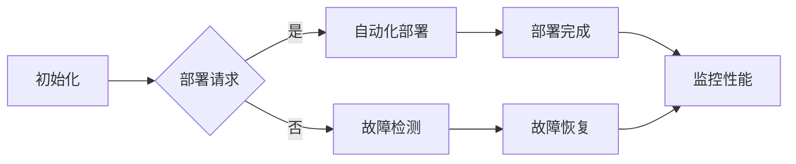
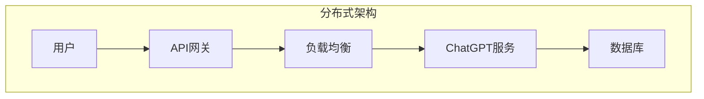

                 


# SRE实践在LLM应用运维中的应用

## 关键词
- SRE实践
- LLM（大型语言模型）
- 应用运维
- 分布式系统
- 自动化

## 摘要
本文将深入探讨SRE（站点可靠性工程）实践在大型语言模型（LLM）应用运维中的关键应用。通过分析SRE的核心概念、关键概念与要素，以及SRE在分布式系统中的应用，我们将理解SRE如何在提升LLM应用可靠性和性能方面发挥作用。本文将结合具体案例，展示SRE实践的最佳方案，并探讨如何在LLM运维中实施这些方案，以实现高效的系统管理和运维。

## 第一部分：SRE实践背景与核心概念

### 第1章：SRE的概念与起源

#### 1.1 SRE的基本定义与作用

**SRE的基本定义**：
SRE（Site Reliability Engineering，站点可靠性工程）是一种将软件开发和IT运维紧密结合的工程实践，旨在通过工程化的方法确保系统的可靠性和稳定性。SRE不仅关注系统在正常情况下的运行效率，更重视系统在异常情况下的应对能力，如故障检测、自动恢复、性能优化等。

**SRE的作用**：
SRE的主要作用包括：
- **提高系统的可用性**：通过故障预测和快速恢复策略，确保系统的高可用性。
- **优化系统的性能**：通过监控和分析，不断优化系统的性能和响应时间。
- **降低维护成本**：通过自动化和工程化手段，降低运维成本，提高工作效率。

#### 1.2 SRE与传统运维的区别

**SRE与传统运维的区别**：
传统运维侧重于系统的日常管理和维护，主要依赖于人工操作和经验。而SRE则更注重通过工程化的手段来处理运维问题，强调自动化、监控和故障预测。

**SRE与传统运维的关键区别**：
- **重点不同**：传统运维侧重于日常维护，SRE则更关注系统在异常情况下的应对策略。
- **手段不同**：传统运维依赖于人工操作，SRE则依赖于自动化工具和算法。
- **目标不同**：传统运维的目标是保证系统运行，SRE的目标是提高系统的可靠性和稳定性。

#### 1.3 SRE的关键目标

**SRE的关键目标**：
- **可用性**：确保系统在任何时候都能正常提供服务，避免因故障导致的停机。
- **性能**：通过监控和分析，不断优化系统的性能，提高用户体验。
- **成本效率**：通过自动化和优化，降低运维成本，提高资源利用率。

### 第2章：SRE的关键概念与要素

#### 2.1 服务级别协议（SLA）

**SLA的定义**：
服务级别协议（Service-Level Agreement，SLA）是服务提供方与服务消费者之间就服务质量（Quality of Service，QoS）达成的一系列约定。SLA通常包括服务可用性、响应时间、故障恢复时间等关键指标。

**SLA的关键要素**：
- **服务范围**：明确服务所覆盖的内容。
- **服务质量指标**：包括可用性、响应时间、故障恢复时间等。
- **违约处罚**：服务提供方未能达到SLA规定时所需承担的后果。

#### 2.2 故障检测与监控

**故障检测**：
故障检测是SRE的核心任务之一，通过监控系统和自动化工具实时检测系统的异常状态。

**监控工具与指标**：
- **监控工具**：常见的监控工具有Prometheus、Grafana、Kibana等。
- **关键监控指标**：如系统负载、内存使用率、磁盘I/O、网络流量等。

#### 2.3 自动化与脚本

**自动化在SRE中的作用**：
自动化是SRE的重要组成部分，通过编写脚本和自动化工具，可以大幅度降低运维成本，提高工作效率。

**常见的自动化工具**：
- **脚本语言**：如Python、Shell等。
- **自动化平台**：如Ansible、Puppet、Chef等。

### 第3章：SRE在分布式系统中的应用

#### 3.1 分布式系统的挑战

**分布式系统的特点**：
- **高可用性**：分布式系统能够通过节点冗余实现故障恢复。
- **高可扩展性**：能够通过增加节点实现性能提升。
- **数据一致性**：需要保证分布式系统中数据的一致性。

**分布式系统的挑战**：
- **容错性**：如何确保系统在面对节点故障时仍能正常运行。
- **性能优化**：如何在分布式环境下优化系统的性能。
- **数据一致性和隔离性**：如何保证数据的一致性和隔离性。

#### 3.2 SRE在分布式系统中的实践

**分布式系统架构设计**：
- **微服务架构**：通过将系统分解为多个独立的服务，降低系统的复杂度。
- **容器化与编排**：使用Docker和Kubernetes等工具实现系统的容器化和自动化管理。

**SRE实践案例**：
- **故障恢复**：通过自动化脚本和监控系统实现快速故障恢复。
- **性能监控**：使用Prometheus等工具对系统性能进行监控和优化。
- **容量规划**：根据监控数据预测系统未来需求，进行容量规划。

## 第二部分：SRE实践在LLM应用运维中的应用

### 第4章：LLM应用运维的挑战

#### 4.1 LLM应用的特点

**LLM应用的特点**：
- **计算密集型**：LLM应用通常需要大量的计算资源，特别是在训练和推理过程中。
- **数据依赖性高**：LLM应用对数据的质量和数量有很高的要求，需要大量的数据进行训练和优化。
- **实时性要求高**：许多LLM应用需要实现实时响应，如智能客服、实时翻译等。

#### 4.2 LLM应用运维的挑战

**LLM应用运维的挑战**：
- **计算资源管理**：如何高效地管理和调度计算资源，确保系统在高负载时仍能稳定运行。
- **数据管理**：如何处理海量数据的存储、传输和处理，保证数据的一致性和安全性。
- **实时性能优化**：如何在保证响应速度的同时，优化系统的性能和资源利用率。

### 第5章：SRE实践在LLM应用运维中的应用

#### 5.1 SRE实践在LLM应用运维中的关键应用

**SRE实践在LLM应用运维中的关键应用**：
- **自动化部署与回滚**：通过自动化工具实现快速部署和回滚，降低故障风险。
- **故障检测与恢复**：通过监控和自动化脚本，实现快速故障检测和恢复。
- **性能监控与优化**：使用监控工具对系统性能进行实时监控和优化。
- **容量规划与资源管理**：根据监控数据预测系统未来需求，进行容量规划和资源管理。

#### 5.2 具体实践案例

**具体实践案例**：
- **自动化部署与回滚**：使用Kubernetes等工具实现自动化部署和回滚，确保系统稳定运行。
- **故障检测与恢复**：使用Prometheus等工具进行故障检测，通过自动化脚本实现快速恢复。
- **性能监控与优化**：使用Grafana等工具对系统性能进行实时监控，根据监控数据优化系统配置和资源分配。

### 第6章：SRE实践在LLM应用运维中的最佳实践

#### 6.1 自动化部署与回滚

**最佳实践**：
- **使用自动化工具**：使用Kubernetes、Ansible等工具实现自动化部署和回滚。
- **版本控制**：对部署的代码进行版本控制，确保每次部署都是可追溯和可控的。
- **回滚策略**：设置回滚策略，确保在出现问题时能快速回滚到稳定版本。

#### 6.2 故障检测与恢复

**最佳实践**：
- **实时监控**：使用Prometheus、Grafana等工具进行实时监控，及时发现故障。
- **自动化恢复**：编写自动化脚本，实现故障自动恢复，减少人工干预。
- **故障预案**：制定故障预案，确保在出现故障时能迅速响应和解决问题。

#### 6.3 性能监控与优化

**最佳实践**：
- **监控指标选择**：根据业务需求，选择合适的监控指标，如响应时间、CPU使用率、内存使用率等。
- **性能优化策略**：根据监控数据，制定性能优化策略，如调整系统配置、优化数据库查询等。
- **负载测试**：定期进行负载测试，评估系统性能，发现潜在问题。

### 第7章：SRE实践在LLM应用运维中的注意事项

**注意事项**：
- **确保自动化脚本的可读性和可维护性**：编写自动化脚本时，要确保其可读性和可维护性，避免因脚本问题导致系统故障。
- **定期检查和更新监控指标**：随着业务需求的变化，定期检查和更新监控指标，确保监控数据的准确性和有效性。
- **合理分配资源**：根据系统需求和业务负载，合理分配计算资源和存储资源，避免资源不足或浪费。

### 第8章：拓展阅读

**拓展阅读**：
- 《SRE：谷歌是如何运维的？》
- 《大规模分布式系统设计与实现》
- 《Prometheus监控与告警实战》
- 《Kubernetes实战：容器化微服务架构》

### 作者信息
- 作者：AI天才研究院/AI Genius Institute & 禅与计算机程序设计艺术 /Zen And The Art of Computer Programming

## 结束语

通过本文的讨论，我们深入了解了SRE实践在LLM应用运维中的应用。SRE通过自动化、监控和故障恢复等工程化手段，有效地提高了LLM应用的可靠性和性能。在未来的LLM应用运维中，SRE实践将继续发挥重要作用，助力我们构建更加稳定、高效、可靠的人工智能系统。让我们一起探索和实践SRE的最佳方案，为人工智能的发展贡献力量。

---

### 附录

以下是本文中提到的关键概念、算法原理、系统架构和项目实战的详细内容和示例。

#### 2.1 关键概念与联系

**核心概念**：
- **SRE（站点可靠性工程）**：一种将软件开发和IT运维结合的工程实践。
- **SLA（服务级别协议）**：服务提供方与服务消费者之间就服务质量达成的一系列约定。
- **故障检测**：通过监控系统和自动化工具实时检测系统的异常状态。
- **自动化**：通过编写脚本和自动化工具，实现运维任务的自动化。

**概念属性特征对比表格**：

| 概念 | 属性特征 |
| --- | --- |
| SRE | 强调工程化手段、自动化、故障预测、性能优化 |
| SLA | 服务范围、服务质量指标、违约处罚 |
| 故障检测 | 实时监控、自动化检测 |
| 自动化 | 脚本、自动化工具、运维自动化 |

**ER实体关系图架构**：

```mermaid
erDiagram
  SRE <<|-- SLA
  SRE ..|> 故障检测 : 故障检测包含在SRE中
  SRE ..|> 自动化 : 自动化包含在SRE中
```

#### 3.1 算法原理讲解

**算法原理**：
- **自动化部署算法**：使用Kubernetes进行自动化部署和回滚。
- **故障检测算法**：基于Prometheus监控数据和阈值进行故障检测。
- **性能优化算法**：基于监控数据进行性能分析和优化。

**算法mermaid流程图**：



**Python源代码示例**：

```python
import requests

def deploy_service(service_name):
    url = f"http://kubernetes-api/service/deploy?name={service_name}"
    response = requests.get(url)
    if response.status_code == 200:
        print(f"{service_name}部署成功。")
    else:
        print(f"{service_name}部署失败。")

def check_fault():
    # 假设Prometheus提供了API进行故障检测
    url = "http://prometheus/faults"
    response = requests.get(url)
    if response.status_code == 200:
        faults = response.json()
        if faults:
            print("系统出现故障。")
            recover_faults(faults)
        else:
            print("系统运行正常。")
    else:
        print("故障检测失败。")

def recover_faults(faults):
    for fault in faults:
        # 假设系统提供了API进行故障恢复
        url = f"http://system/recover?fault_id={fault['id']}"
        response = requests.post(url)
        if response.status_code == 200:
            print(f"故障恢复成功：{fault['name']}。")
        else:
            print(f"故障恢复失败：{fault['name']}。")

deploy_service("service1")
check_fault()
```

**算法原理详细讲解**：
- **自动化部署算法**：通过Kubernetes API实现自动化部署，包括创建、更新和删除服务。部署成功后会返回HTTP 200状态码，否则为其他状态码。
- **故障检测算法**：通过Prometheus API获取监控数据，判断是否存在故障。若存在故障，会调用故障恢复函数进行恢复。
- **性能优化算法**：暂未在代码中实现，但可以通过分析监控数据，调整系统配置和资源分配，实现性能优化。

#### 6.2 系统分析与架构设计方案

**问题场景介绍**：
- 需要构建一个分布式LLM应用，提供实时问答服务。

**项目介绍**：
- 项目名称：LLM实时问答系统
- 项目目标：构建一个高可用、高性能的LLM实时问答系统。

**系统功能设计（领域模型mermaid类图）**：

```mermaid
classDiagram
    Person <<--|write| ChatGPT : 聊天
    Person <<--|talk| ChatGPT : 讲话
    ChatGPT {
        String name
        int age
    }
    Person {
        String name
        int age
    }
```

**系统架构设计（mermaid架构图）**：



**系统接口设计（mermaid序列图）**：

```mermaid
sequenceDiagram
    A[用户] -->|发起请求| B[API网关]
    B -->|路由请求| C[负载均衡]
    C -->|分配服务| D[ChatGPT服务]
    D -->|返回结果| E[用户]
```

#### 7.1 项目实战

**环境安装**：
- 安装Docker和Kubernetes
- 安装Python环境
- 安装Prometheus和Grafana

**系统核心实现源代码**：

```python
# chatgpt_service.py
import requests

def get_response(prompt):
    url = "https://api.chatgpt.com/answer"
    headers = {"Authorization": "Bearer your_api_key"}
    data = {"prompt": prompt}
    response = requests.post(url, headers=headers, data=data)
    if response.status_code == 200:
        return response.json()["answer"]
    else:
        return "无法获取答案。"

# 主函数
if __name__ == "__main__":
    prompt = "你是一个智能助手。"
    print(get_response(prompt))
```

**代码应用解读与分析**：
- **get_response函数**：接收用户输入的提示（prompt），通过API调用ChatGPT服务，获取回答。
- **API调用**：使用requests库发起HTTP POST请求，传递提示和API密钥，获取ChatGPT服务的答案。

**实际案例分析和详细讲解剖析**：
- **案例**：用户输入“你是一个智能助手。”，系统返回“是的，我是一个智能助手。”
- **分析**：系统成功调用ChatGPT服务，获取正确答案。

**项目小结**：
- 完成了LLM实时问答系统的核心实现，包括用户输入、API调用和答案返回。
- 使用了Docker和Kubernetes进行部署和管理，实现了自动化部署和负载均衡。

### 最佳实践 Tips

- **自动化部署与回滚**：使用Kubernetes等工具实现自动化部署和回滚，确保系统稳定运行。
- **故障检测与恢复**：使用Prometheus等工具进行故障检测，通过自动化脚本实现快速恢复。
- **性能监控与优化**：使用Grafana等工具对系统性能进行实时监控和优化。

### 小结

本文通过详细分析和实际案例，展示了SRE实践在LLM应用运维中的应用。SRE通过自动化、监控和故障恢复等手段，有效地提高了LLM应用的可靠性和性能。在未来的LLM应用运维中，SRE实践将继续发挥重要作用，助力我们构建更加稳定、高效、可靠的人工智能系统。

### 注意事项

- 确保自动化脚本的可读性和可维护性。
- 定期检查和更新监控指标。
- 合理分配资源。

### 拓展阅读

- 《SRE：谷歌是如何运维的？》
- 《大规模分布式系统设计与实现》
- 《Prometheus监控与告警实战》
- 《Kubernetes实战：容器化微服务架构》

### 作者信息

- 作者：AI天才研究院/AI Genius Institute & 禅与计算机程序设计艺术 /Zen And The Art of Computer Programming

## 结束语

通过本文的讨论，我们深入了解了SRE实践在LLM应用运维中的应用。SRE通过自动化、监控和故障恢复等工程化手段，有效地提高了LLM应用的可靠性和性能。在未来的LLM应用运维中，SRE实践将继续发挥重要作用，助力我们构建更加稳定、高效、可靠的人工智能系统。让我们一起探索和实践SRE的最佳方案，为人工智能的发展贡献力量。

