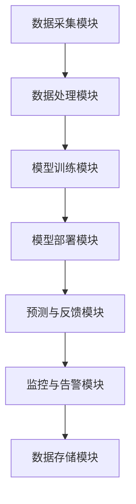

                 

### 文章标题：SRE实践：确保AI服务高可用性的运维方法

#### 关键词：SRE，高可用性，AI服务，运维方法，自动化，持续集成与部署，故障演练，持续学习

> **摘要：**本文深入探讨如何通过SRE（站点可靠性工程）实践来确保AI服务的高可用性。从SRE基础到高可用性测试与故障演练，我们逐步解析每个环节的关键点，提供系统分析与架构设计方法，并结合项目实战和最佳实践，助力读者掌握AI服务运维的核心技能。  

### 第一部分：引言

#### 第1章：SRE基础

#### 1.1 什么是SRE

**1.1.1 SRE的定义与起源**

SRE，即站点可靠性工程（Site Reliability Engineering），是Google在其庞大的云计算基础设施中开发的一种运维实践。SRE的核心思想是将运维视为工程问题，通过工程化的方法来解决系统的高可用性、可靠性和可维护性问题。

SRE起源于Google，最初是为了解决Google内部大规模服务的高可用性和可靠性问题。随着时间的推移，SRE的理念逐渐成熟，并逐渐被其他大型互联网公司采纳和推广。

**1.1.2 SRE与传统IT运维的区别**

传统IT运维主要依赖于人工监控和手动操作来维护系统的运行，而SRE则强调自动化、持续集成和持续部署，通过工程化的方法来提高系统的可靠性和可维护性。

**1.1.3 SRE在AI服务中的重要性**

随着人工智能技术的快速发展，AI服务已成为现代企业的核心竞争力之一。然而，AI服务的高可用性面临诸多挑战，如数据的不稳定性、模型的复杂性等。SRE提供了一套系统的运维方法，有助于确保AI服务的高可用性。

#### 1.2 AI服务的高可用性

**1.2.1 高可用性的定义与重要性**

高可用性（High Availability，简称HA）指的是系统在面临各种故障和异常时，能够快速恢复并保持正常运行的能力。对于AI服务来说，高可用性至关重要，因为它直接影响用户体验和业务连续性。

**1.2.2 AI服务高可用性的挑战**

AI服务的高可用性面临以下挑战：

1. **数据不稳定**：AI模型的训练和预测依赖于数据的质量和稳定性，数据的波动可能导致模型的性能下降。
2. **模型复杂性**：AI模型通常非常复杂，涉及大量的参数和算法，任何微小的变动都可能影响模型的性能和稳定性。
3. **系统依赖性**：AI服务往往依赖于其他系统和组件，如数据存储、计算资源和网络等，任何一个环节的故障都可能影响整个系统的可用性。

**1.2.3 SRE在解决高可用性问题中的作用**

SRE通过一系列的工程化和自动化方法，帮助解决AI服务高可用性问题：

1. **自动化运维**：通过自动化工具和脚本，减少人工干预，提高系统的稳定性和可靠性。
2. **持续集成与部署**：确保代码的稳定性和一致性，快速响应用户需求和业务变化。
3. **监控与告警**：实时监控系统的运行状态，及时发现和解决潜在问题。
4. **高可用性设计和架构**：通过合理的系统设计和架构，提高系统的容错能力和弹性。
5. **高可用性测试与故障演练**：通过模拟各种故障场景，验证系统的可靠性。

#### 1.3 本书结构

**1.3.1 主要内容概述**

本书分为六个部分，包括：

1. **SRE基础**：介绍SRE的定义、起源和重要性。
2. **SRE实践**：详细阐述SRE的各个环节，如工具选择、自动化运维、监控与告警等。
3. **系统设计与架构**：讨论系统设计原则、架构设计和弹性与容错策略。
4. **持续集成与部署**：介绍持续集成、持续部署和反馈优化。
5. **高可用性测试与故障演练**：讲解高可用性测试、故障演练和失败案例分析。
6. **持续学习与改进**：讨论SRE团队建设、持续学习和发展。

**1.3.2 阅读指南**

建议读者按顺序阅读本书，从SRE基础开始，逐步深入学习各个部分。通过实践和案例分析，读者可以更好地理解SRE的原理和应用，掌握确保AI服务高可用性的运维方法。

### 第二部分：SRE实践

#### 第2章：SRE工具与技术

**2.1 工具选择**

**2.1.1 SRE常用工具**

在SRE实践中，选择合适的工具至关重要。以下是一些常用的SRE工具：

1. **Kubernetes**：一个开源的容器编排平台，用于自动化部署、扩展和管理容器化应用。
2. **Prometheus**：一个开源的监控解决方案，用于收集、存储和可视化监控数据。
3. **Grafana**：一个开源的数据可视化工具，用于创建交互式的仪表盘。
4. **Puppet**：一个开源的自动化工具，用于配置管理和自动化部署。
5. **Ansible**：一个开源的自动化工具，用于配置管理和自动化部署。

**2.1.2 工具选择原则**

选择SRE工具时，应考虑以下原则：

1. **功能完整性**：所选工具应能够满足SRE的各项需求，如自动化部署、监控和告警等。
2. **社区支持**：具有活跃的社区和支持，可以方便地获取帮助和更新。
3. **可扩展性**：工具应支持扩展和定制，以适应不断变化的需求。
4. **兼容性**：工具应与现有的系统和架构兼容，减少集成难度。
5. **性能**：工具应具备良好的性能，以支持大规模系统的运维。

**2.1.3 工具集成与协同**

在实际应用中，SRE工具往往需要集成和协同工作。例如，可以使用Kubernetes进行容器编排，Prometheus进行监控数据收集，Grafana进行数据可视化，Ansible进行配置管理和自动化部署。

**2.2 自动化运维**

**2.2.1 自动化的优势**

自动化运维具有以下优势：

1. **提高效率**：自动化工具可以减少人工干预，提高运维效率。
2. **降低错误率**：自动化可以避免人为错误，提高系统的稳定性。
3. **快速响应**：自动化工具可以快速响应业务需求，缩短上线时间。
4. **可重复性**：自动化流程可以重复执行，确保每次操作的一致性。

**2.2.2 自动化运维实践**

在实际操作中，自动化运维可以分为以下步骤：

1. **需求分析**：分析业务需求和运维场景，确定需要自动化的任务。
2. **工具选型**：选择合适的自动化工具，如Puppet、Ansible等。
3. **脚本编写**：编写自动化脚本，实现具体任务的操作。
4. **测试与验证**：对自动化脚本进行测试和验证，确保其稳定性和正确性。
5. **部署与运行**：将自动化脚本部署到生产环境，并运行监控其效果。

**2.2.3 实现自动化运维的关键点**

实现自动化运维需要注意以下关键点：

1. **流程标准化**：确保自动化流程的标准化，减少变更和冲突。
2. **版本控制**：使用版本控制系统，如Git，管理自动化脚本和配置文件。
3. **文档记录**：详细记录自动化流程和脚本，以便后续维护和更新。
4. **监控与告警**：监控自动化流程的运行状态，及时发现问题并进行处理。
5. **培训与支持**：对运维团队进行培训，确保其掌握自动化工具的使用。

#### 第3章：系统设计与架构

**3.1 系统设计原则**

**3.1.1 高可用性设计**

高可用性设计是确保系统在面临各种故障和异常时，能够保持正常运行的关键。以下是一些高可用性设计原则：

1. **冗余设计**：通过冗余组件和备份机制，提高系统的容错能力。
2. **负载均衡**：通过负载均衡器，实现流量的均衡分配，避免单点故障。
3. **数据备份与恢复**：定期备份数据，并确保备份数据的可用性，以便在故障时快速恢复。
4. **故障隔离**：通过故障隔离机制，确保故障不会影响到其他组件和功能。

**3.1.2 弹性设计**

弹性设计是应对系统负载波动和业务变化的关键。以下是一些弹性设计原则：

1. **水平扩展**：通过增加节点数量，实现系统的水平扩展，提高处理能力。
2. **垂直扩展**：通过升级硬件配置，实现系统的垂直扩展，提高性能和吞吐量。
3. **自动伸缩**：通过自动伸缩策略，实现系统的自动扩展和缩放，以适应负载变化。
4. **弹性资源调度**：通过弹性资源调度策略，优化资源利用，提高系统效率。

**3.1.3 系统解耦**

系统解耦是提高系统可靠性和可维护性的关键。以下是一些系统解耦原则：

1. **服务化**：将系统功能模块化，实现服务化架构，提高系统的解耦程度。
2. **接口定义**：通过清晰的接口定义，确保不同模块之间的松耦合。
3. **异步通信**：通过异步通信机制，减少模块之间的依赖和阻塞。
4. **事件驱动**：通过事件驱动架构，实现模块之间的解耦和异步处理。

**3.2 系统架构设计**

**3.2.1 系统功能模块划分**

在系统架构设计过程中，首先需要划分系统功能模块。以下是一个典型的AI服务系统功能模块划分：

1. **数据采集模块**：负责采集和预处理输入数据。
2. **数据处理模块**：负责数据清洗、转换和建模。
3. **模型训练模块**：负责训练和优化AI模型。
4. **模型部署模块**：负责将训练好的模型部署到生产环境。
5. **预测与反馈模块**：负责生成预测结果，并提供反馈机制。
6. **监控与告警模块**：负责监控系统的运行状态，并及时发出告警。

**3.2.2 系统架构图**

以下是一个典型的AI服务系统架构图：

**3.2.3 系统交互设计**

系统交互设计是确保系统各模块之间协同工作的重要环节。以下是一个典型的AI服务系统交互设计：

1. **数据流**：数据从数据采集模块进入系统，经过数据处理模块、模型训练模块、模型部署模块和预测与反馈模块，最终存储到数据存储模块。
2. **控制流**：系统监控与告警模块实时监控系统运行状态，并发出告警通知。
3. **交互界面**：用户通过交互界面与系统进行交互，提交数据请求和查看预测结果。

#### 第4章：持续集成与持续部署

**4.1 持续集成**

**4.1.1 持续集成的基本概念**

持续集成（Continuous Integration，简称CI）是一种软件开发实践，通过持续地将代码集成到主干分支，以快速发现和解决集成过程中出现的问题。持续集成的核心目标是提高代码质量和缩短开发周期。

**4.1.2 持续集成的流程**

持续集成的流程通常包括以下步骤：

1. **代码提交**：开发人员将代码提交到版本控制系统。
2. **构建**：构建系统自动构建代码，生成可执行文件或容器镜像。
3. **测试**：运行自动化测试，包括单元测试、集成测试和端到端测试，以确保代码质量。
4. **反馈**：测试结果反馈给开发人员，包括通过、失败和警告等。
5. **部署**：将通过测试的代码部署到测试环境或生产环境。

**4.1.3 持续集成的工具选择**

选择合适的持续集成工具对于提高开发效率和代码质量至关重要。以下是一些常用的持续集成工具：

1. **Jenkins**：一个开源的持续集成服务器，支持多种插件和集成方式。
2. **Travis CI**：一个基于云的持续集成服务，支持GitHub和GitLab代码仓库。
3. **CircleCI**：一个基于云的持续集成服务，支持多种编程语言和平台。
4. **GitLab CI/CD**：GitLab内置的持续集成和持续部署服务，与GitLab代码仓库集成。

**4.2 持续部署**

**4.2.1 持续部署的基本概念**

持续部署（Continuous Deployment，简称CD）是一种软件开发实践，通过自动化部署流程，实现代码的持续发布。持续部署的核心目标是缩短发布周期，提高发布质量和降低风险。

**4.2.2 持续部署的流程**

持续部署的流程通常包括以下步骤：

1. **代码提交**：开发人员将代码提交到版本控制系统。
2. **构建**：构建系统自动构建代码，生成可执行文件或容器镜像。
3. **测试**：运行自动化测试，确保代码质量。
4. **部署**：将通过测试的代码部署到生产环境。

**4.2.3 持续部署的安全与质量控制**

持续部署的安全和质量控制是确保发布质量和降低风险的关键。以下是一些关键点：

1. **代码审查**：对提交的代码进行严格的审查，确保代码质量。
2. **自动化测试**：运行全面的自动化测试，确保代码功能正确。
3. **环境隔离**：部署前进行环境隔离，确保发布不影响其他环境和用户。
4. **回滚策略**：制定回滚策略，确保在发布失败时能够快速回滚。

**4.3 持续反馈与优化**

**4.3.1 反馈机制的构建**

持续反馈是持续集成与持续部署的重要环节，有助于优化开发流程和发布质量。以下是一些反馈机制的构建方法：

1. **自动化测试反馈**：将自动化测试结果实时反馈给开发人员，以便及时发现问题。
2. **用户反馈**：收集用户的反馈意见，了解产品的实际表现和用户需求。
3. **性能监控**：实时监控系统的性能指标，识别潜在问题和优化点。

**4.3.2 反馈数据的分析**

对反馈数据进行分析是持续改进的重要步骤。以下是一些反馈数据分析的方法：

1. **统计与图表**：使用统计方法和图表，对反馈数据进行可视化分析。
2. **趋势分析**：分析反馈数据的变化趋势，识别潜在问题和优化点。
3. **用户行为分析**：分析用户行为数据，了解用户的使用习惯和需求。

**4.3.3 部署优化策略**

根据反馈数据和分析结果，可以制定部署优化策略，提高发布质量和用户体验。以下是一些部署优化策略：

1. **代码优化**：优化代码质量，减少bug和性能问题。
2. **部署流程优化**：优化部署流程，提高部署效率和可靠性。
3. **环境优化**：优化测试环境和生产环境，提高系统性能和稳定性。
4. **用户培训**：提供用户培训和支持，提高用户的操作技能和体验。

### 第5章：高可用性测试与故障演练

**5.1 高可用性测试**

**5.1.1 高可用性测试的目的**

高可用性测试的目的是验证系统在面对各种故障和异常时，能否保持正常运行和提供稳定的服务。以下是一些高可用性测试的目的：

1. **验证系统可靠性**：通过模拟各种故障场景，验证系统在故障条件下的运行状态。
2. **发现潜在问题**：通过测试，发现系统中的潜在问题和隐患，以便及时修复。
3. **评估系统性能**：通过测试，评估系统在正常和故障条件下的性能和响应能力。
4. **优化系统设计**：根据测试结果，优化系统设计和架构，提高系统的可靠性和稳定性。

**5.1.2 高可用性测试的类型**

高可用性测试可以分为以下几种类型：

1. **功能测试**：验证系统功能是否正常，包括基本功能、扩展功能和边界条件。
2. **性能测试**：验证系统在负载和压力条件下的性能和响应能力。
3. **可用性测试**：验证系统在故障条件下的可用性和恢复能力。
4. **稳定性测试**：验证系统在长时间运行和持续负载条件下的稳定性和可靠性。

**5.1.3 高可用性测试的实施**

高可用性测试的实施可以分为以下步骤：

1. **测试规划**：制定测试计划，包括测试目标、测试类型、测试环境等。
2. **测试设计**：设计测试用例，包括故障场景、测试数据等。
3. **测试执行**：执行测试用例，记录测试结果。
4. **结果分析**：分析测试结果，识别潜在问题和优化点。
5. **报告编写**：编写测试报告，总结测试结果和优化建议。

**5.2 故障演练**

**5.2.1 故障演练的必要性**

故障演练是一种模拟真实故障场景的测试方法，通过演练，验证系统的故障恢复能力和应对策略。以下是一些故障演练的必要性：

1. **验证恢复策略**：通过演练，验证系统在故障条件下的恢复策略和恢复时间。
2. **提高应对能力**：通过演练，提高运维团队和开发团队的应对故障和异常的能力。
3. **发现潜在问题**：通过演练，发现系统中的潜在问题和隐患，以便及时修复。
4. **优化应急预案**：根据演练结果，优化应急预案和故障处理流程。

**5.2.2 故障演练的流程**

故障演练的流程可以分为以下步骤：

1. **演练规划**：制定演练计划，包括演练目标、演练场景、演练时间等。
2. **演练准备**：准备演练环境，包括测试环境、演练工具等。
3. **演练执行**：模拟故障场景，执行演练步骤。
4. **结果分析**：分析演练结果，总结演练经验和优化建议。
5. **演练报告**：编写演练报告，记录演练过程和结果。

**5.2.3 故障演练的效果评估**

故障演练的效果评估可以分为以下方面：

1. **故障恢复时间**：评估系统在故障条件下的恢复时间，包括故障发现、故障处理、故障恢复等环节。
2. **演练参与度**：评估运维团队和开发团队的参与度和配合程度。
3. **问题发现与解决**：评估演练过程中发现的问题和隐患，以及问题解决的效果。
4. **应急预案与流程**：评估应急预案和故障处理流程的合理性、完整性和可操作性。

**5.3 失败案例分析与总结**

**5.3.1 失败案例分析**

通过分析失败案例，可以了解系统在故障条件下的薄弱环节，以便进行改进。以下是一些常见的失败案例分析：

1. **系统单点故障**：由于系统设计中的单点故障，导致整个系统在故障条件下无法正常运行。
2. **网络故障**：由于网络故障，导致系统与其他组件的通信中断，从而影响系统正常运行。
3. **数据丢失**：由于数据备份策略不当，导致故障条件下数据丢失，影响系统的恢复能力。

**5.3.2 经验总结**

通过分析失败案例，可以总结以下经验：

1. **系统冗余设计**：确保系统中的关键组件和功能具有冗余设计，以提高系统的容错能力。
2. **网络优化**：优化系统的网络架构和通信协议，提高系统的网络稳定性。
3. **数据备份与恢复**：制定有效的数据备份和恢复策略，确保故障条件下的数据可用性。
4. **应急预案与演练**：制定详细的应急预案和定期进行故障演练，提高系统的故障恢复能力。

**5.3.3 避免失败的策略**

为了避免系统在故障条件下的失败，可以采取以下策略：

1. **故障检测与告警**：实时监测系统的运行状态，及时发现故障并发出告警。
2. **故障恢复与切换**：在故障发生时，迅速启动故障恢复和切换机制，确保系统的正常运行。
3. **系统优化与升级**：定期对系统进行优化和升级，提高系统的性能和稳定性。
4. **人员培训与演练**：对运维团队和开发团队进行培训，提高其故障处理能力和应急预案的执行能力。

### 第6章：持续学习与改进

**6.1 SRE团队建设**

**6.1.1 SRE团队的角色与职责**

SRE团队在确保AI服务高可用性中发挥着关键作用。以下是一些SRE团队的角色与职责：

1. **系统运维工程师**：负责系统的日常运维工作，包括监控、告警、故障处理等。
2. **架构师**：负责系统架构设计、优化和升级，确保系统的可靠性和性能。
3. **开发工程师**：负责开发自动化工具和脚本，提高运维效率和代码质量。
4. **测试工程师**：负责测试系统的功能和性能，确保系统的高可用性和稳定性。
5. **数据工程师**：负责数据处理和建模，确保数据的质量和稳定性。

**6.1.2 SRE团队建设的关键要素**

SRE团队建设的关键要素包括：

1. **技能与经验**：团队成员应具备丰富的技能和经验，熟悉SRE的原理和实践。
2. **协作与沟通**：团队成员应具备良好的协作和沟通能力，确保团队协作高效。
3. **培训与成长**：定期组织培训和分享，提升团队的整体能力和技术水平。
4. **激励机制**：建立激励机制，鼓励团队成员学习和创新，提高工作积极性和创造力。

**6.1.3 SRE团队的协作与沟通**

SRE团队的协作与沟通是确保系统运维质量和效率的关键。以下是一些协作与沟通的方法：

1. **定期会议**：定期召开团队会议，讨论工作进展、问题和解决方案。
2. **工作日志**：要求团队成员记录工作日志，分享经验和教训。
3. **知识库**：建立知识库，记录团队的知识和经验，便于后续学习和参考。
4. **工具与平台**：利用工具和平台，如项目管理工具、沟通工具和文档管理工具，提高团队协作效率。

**6.2 持续学习**

**6.2.1 SRE领域的最新发展**

SRE领域正处于快速发展阶段，以下是一些SRE领域的最新发展：

1. **云原生技术**：随着云计算的普及，云原生技术（如Kubernetes、Istio等）在SRE中的应用越来越广泛。
2. **人工智能与机器学习**：人工智能和机器学习技术在SRE中的应用，如自动化故障检测、自动化故障恢复等，正在不断发展和完善。
3. **微服务架构**：微服务架构在SRE中的应用，如服务拆分、服务自治等，提高了系统的灵活性和可维护性。
4. **DevOps文化**：DevOps文化的推广，如持续集成、持续部署、自动化测试等，促进了SRE与DevOps的融合。

**6.2.2 SRE团队的学习与发展**

SRE团队的学习与发展是确保团队持续进步和业务成功的关键。以下是一些学习与发展方法：

1. **专业培训**：参加专业培训课程，学习最新的SRE技术和最佳实践。
2. **技术交流**：参与技术交流会议、研讨会和活动，了解行业动态和技术趋势。
3. **实践经验**：通过实践项目和故障处理，积累经验和教训，提高实际操作能力。
4. **知识分享**：定期组织知识分享会，分享团队的经验和成果，促进知识传播和团队成长。

**6.2.3 持续学习的策略**

以下是一些持续学习的策略：

1. **目标设定**：设定明确的学习目标，确保学习的针对性和有效性。
2. **时间管理**：合理安排学习时间，确保学习与工作之间的平衡。
3. **学习资源**：利用各种学习资源，如书籍、博客、在线课程等，拓宽知识面。
4. **实践应用**：将学习到的知识和技能应用到实际工作中，提高实践能力和经验。

### 总结与展望

SRE实践是确保AI服务高可用性的关键。通过SRE的自动化运维、持续集成与部署、高可用性测试与故障演练，SRE团队可以构建一个稳定、可靠和高效的AI服务系统。未来，随着云计算、人工智能和DevOps等技术的不断发展，SRE实践将不断演进和优化，为AI服务的高可用性提供更加有力的保障。通过持续学习和改进，SRE团队可以不断提升自身的技能和水平，应对不断变化的业务需求和挑战。希望本文能为读者提供有价值的参考和启示，助力其在SRE实践的道路上取得成功。

