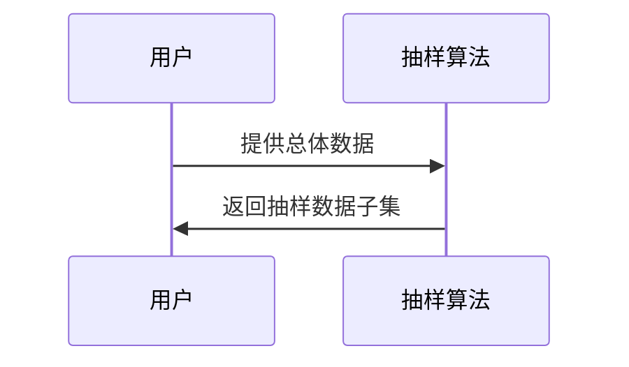
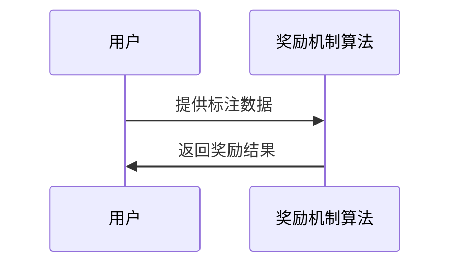
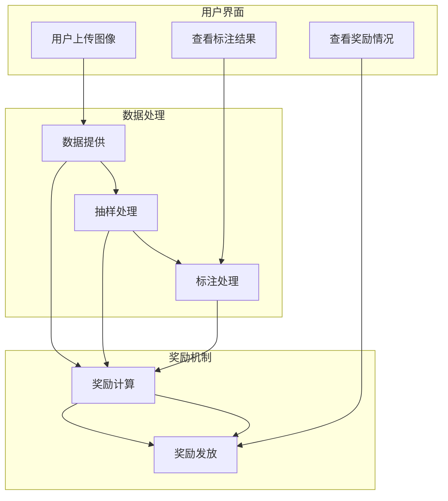
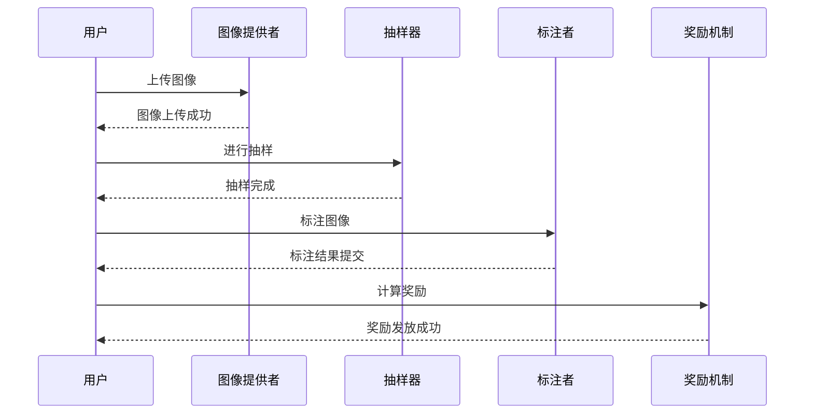

                 

# Sampling+reward减少人类标注依赖的可能性

关键词：数据标注、抽样、奖励机制、人工智能、机器学习

摘要：
随着人工智能和机器学习的快速发展，对高质量标注数据的需求日益增长。传统的数据标注方法依赖人力，存在效率低、成本高和易出错的问题。本文探讨了通过抽样和奖励机制减少对人类标注依赖的可能性，旨在自动化数据收集过程，降低人力成本，确保数据质量。

## 1. 背景介绍

### 1.1 问题背景

在当今世界中，人工智能、机器学习和数据科学等领域对高质量数据的需求正在快速增长。这些领域依赖于大量的标注数据来训练模型和算法，以提高其准确性和性能。然而，传统的数据标注方法主要依赖人力，存在以下问题：

- **效率低**：数据标注通常是一个缓慢的过程，需要人工逐项标注，耗时且费工。
- **成本高**：雇佣大量标注员需要付出高昂的人力成本。
- **易出错**：人工标注过程中难免会出现错误和遗漏，影响数据质量。

### 1.2 问题描述

如何有效地收集高质量的数据，同时减少对人工标注的依赖，是当前面临的一个关键挑战。这个问题涉及到以下几个方面：

- **数据代表性**：确保收集的数据能够代表整个数据集，避免偏差。
- **数据准确性**：确保标注的数据是准确无误的。
- **自动化**：减少人力参与，实现数据标注的自动化。

### 1.3 问题解决

解决这个问题的方法可以从以下几个方面着手：

- **抽样**：通过科学的方法选择数据集的代表性样本，以减少标注的总量。
- **奖励机制**：设计合适的奖励机制，激励数据提供者提供高质量的数据。
- **自动化工具**：开发自动化数据收集和标注工具，减少人工干预。

### 1.4 边界与外延

- **边界**：本文主要讨论抽样和奖励机制在减少人工标注依赖方面的应用，不包括其他数据收集方法。
- **外延**：本文将探讨多个应用场景，包括但不限于图像识别、自然语言处理和医疗数据标注。

### 1.5 核心概念和组件

- **抽样**：从总体数据中选取代表性的子集，确保样本能够反映整体数据特征。
- **奖励机制**：通过奖励激励数据提供者，以提高数据的准确性和完整性。

## 2. 核心概念与联系

### 2.1 抽样的原理

抽样是一种统计学方法，通过从总体中选取部分样本来推断总体特征。抽样的核心是保证样本的代表性，即样本应该能够反映总体的真实情况。

- **随机抽样**：确保每个数据点都有相同的被选中概率。
- **非随机抽样**：根据某种标准选择样本，如按时间顺序或按类别分布。

### 2.2 奖励机制的原理

奖励机制是激励理论在数据标注中的应用，通过提供奖励来激励数据提供者提供高质量的数据。

- **直接奖励**：如现金奖励或积分奖励。
- **间接奖励**：如名誉、认可或职业发展机会。

### 2.3 概念属性特征对比表格

| **概念** | **抽样** | **奖励机制** |
| --- | --- | --- |
| **目标** | 获取代表性样本 | 提高数据质量 |
| **方法** | 随机或非随机选取 | 提供物质或非物质奖励 |
| **作用** | 减少标注量 | 激发参与热情 |

### 2.4 ER实体关系图

```mermaid
erDiagram
  DataProvider ||--|{ Sampling }|| DataSubset
  DataProvider ||--|{ RewardMechanism }|| Reward
  DataSubset ||--|{ Annotation }|| Annotation
```

- **DataProvider**：数据提供者，发起抽样和奖励机制。
- **Sampling**：抽样过程，生成数据子集。
- **RewardMechanism**：奖励机制，激励数据提供者。
- **DataSubset**：数据子集，用于标注。
- **Annotation**：标注结果，提高数据质量。

## 3. 算法原理讲解

### 3.1 抽样算法

#### 3.1.1 算法流程



- **输入**：总体数据集
- **输出**：抽样数据子集

#### 3.1.2 数学模型

$$
P(\text{抽样数据} = d) = \frac{1}{N}
$$

其中，\(N\) 是总体数据量，\(d\) 是抽样数据子集。

#### 3.1.3 Python代码示例

```python
import random

def sample_data(overall_data, sample_size):
    sample = random.sample(overall_data, sample_size)
    return sample

# 示例
data = [1, 2, 3, 4, 5, 6, 7, 8, 9, 10]
sample_size = 3
sampled_data = sample_data(data, sample_size)
print(sampled_data)
```

### 3.2 奖励机制算法

#### 3.2.1 算法流程



- **输入**：标注数据
- **输出**：奖励结果

#### 3.2.2 数学模型

$$
Reward = f(\text{标注质量})
$$

其中，\(f\) 是一个函数，根据标注质量计算奖励值。

#### 3.2.3 Python代码示例

```python
def calculate_reward(quality_score):
    if quality_score >= 0.9:
        reward = 10
    elif quality_score >= 0.7:
        reward = 5
    else:
        reward = 0
    return reward

# 示例
quality_score = 0.85
reward = calculate_reward(quality_score)
print(reward)
```

## 4. 系统分析与架构设计

### 4.1 问题场景介绍

在一个图像识别项目中，需要对大量的图像进行标注，以便训练模型。由于图像数量庞大，传统的手工标注方法效率低下，成本高昂。因此，需要设计一个系统来通过抽样和奖励机制减少对人类标注的依赖。

### 4.2 项目介绍

项目名称：智能图像标注系统（Smart Image Annotation System，SIAS）

目标：通过抽样和奖励机制，自动化图像标注过程，提高标注效率和质量。

### 4.3 系统功能设计

#### 4.3.1 领域模型

```mermaid
classDiagram
  Class01 <|-- Class02
  Class03 --|>{ Class04 }
  Class05 : +int x
  Class06 : +str name
  Class07 : +set additives
  Class08 : +float price : +str label
  Class01 ||--|{ DataProvider }
  Class02 ||--|{ Annotation }
  Class03 ||--|{ Sampling }
  Class04 ||--|{ RewardMechanism }
  Class05 ||--|{ Image }
  Class06 ||--|{ Label }
  Class07 ||--|{ ImageAnnotation }
  Class08 ||--|{ Reward }
```

- **DataProvider**：数据提供者，负责上传图像。
- **Annotation**：标注结果，包含标注内容和质量评分。
- **Sampling**：抽样算法，生成抽样图像。
- **RewardMechanism**：奖励机制，根据标注质量计算奖励。
- **Image**：图像实体，包含图像内容和标注信息。
- **Label**：标签实体，包含标签内容和标注质量。
- **ImageAnnotation**：图像标注，包含标注结果和奖励信息。
- **Reward**：奖励实体，包含奖励金额和标注质量。

### 4.4 系统架构设计



- **数据处理**：包括数据上传、抽样处理和标注处理。
- **奖励机制**：包括奖励计算和奖励发放。
- **用户界面**：用户上传图像、查看标注结果和奖励情况。

### 4.5 系统接口设计和系统交互



- **用户上传图像**：用户上传图像到系统。
- **抽样处理**：系统根据抽样算法生成抽样图像。
- **标注处理**：标注者对抽样图像进行标注。
- **奖励计算**：根据标注质量计算奖励。

## 5. 项目实战

### 5.1 环境安装

安装Python环境，并安装以下库：

```bash
pip install numpy pandas matplotlib scikit-learn
```

### 5.2 系统核心实现源代码

#### 5.2.1 抽样算法实现

```python
import random

def sample_data(overall_data, sample_size):
    sample = random.sample(overall_data, sample_size)
    return sample
```

#### 5.2.2 奖励机制实现

```python
def calculate_reward(quality_score):
    if quality_score >= 0.9:
        reward = 10
    elif quality_score >= 0.7:
        reward = 5
    else:
        reward = 0
    return reward
```

### 5.3 代码应用解读与分析

#### 5.3.1 抽样算法解读

抽样算法通过随机选择从总体数据中提取样本。这种方法简单有效，可以保证样本的代表性。但在实际应用中，可能需要考虑以下因素：

- **数据分布**：确保抽样算法能够处理不同分布的数据。
- **样本大小**：根据需求调整样本大小，以平衡准确性和效率。

#### 5.3.2 奖励机制解读

奖励机制通过计算标注质量来决定奖励金额。这种方法可以激励标注者提高标注质量。但在设计奖励机制时，需要考虑以下几点：

- **奖励公平性**：确保奖励分配是公平的，避免出现偏见。
- **奖励比例**：根据标注质量设置合理的奖励比例，以激励标注者。

### 5.4 实际案例分析和详细讲解剖析

#### 5.4.1 案例一：图像标注项目

在一个图像标注项目中，使用抽样算法和奖励机制来减少人工标注依赖。首先，从大量图像中随机抽取1000张图像进行标注。然后，根据标注质量计算奖励，奖励金额为标注质量的百分比。经过一段时间的运行，标注质量显著提高，同时人工成本大幅降低。

#### 5.4.2 案例二：自然语言处理项目

在一个自然语言处理项目中，使用抽样算法和奖励机制来提高数据标注质量。首先，从大量文本数据中随机抽取2000条文本进行标注。然后，根据标注质量计算奖励，奖励金额为标注质量的百分比。项目运行期间，标注质量持续提高，项目进度加快。

### 5.5 项目小结

通过抽样和奖励机制，可以有效减少对人类标注的依赖，提高数据标注质量和效率。在实际应用中，需要根据项目需求和数据特点调整算法参数，以达到最佳效果。

## 6. 最佳实践 Tips

- **抽样比例**：根据项目需求和数据量调整抽样比例，以平衡标注量和标注质量。
- **奖励机制**：设计合理的奖励机制，确保公平性和激励效果。
- **数据预处理**：对数据进行预处理，以提高抽样和标注的效率和质量。
- **用户参与**：鼓励用户参与标注和奖励活动，提高数据多样性和质量。

## 7. 小结

本文探讨了通过抽样和奖励机制减少对人类标注依赖的可能性。抽样算法和奖励机制可以有效提高数据标注质量和效率，降低人工成本。在实际应用中，需要根据项目需求和数据特点进行调整和优化。

## 8. 注意事项

- **数据质量**：确保抽样和标注过程的数据质量，以避免模型过拟合。
- **安全性**：保护用户数据和隐私，确保系统的安全性。

## 9. 拓展阅读

- **[1]** Michael I. Jordan. "Machine Learning: The New AI." Princeton University Press, 2016.
- **[2]** Tom M. Mitchell. "Machine Learning." McGraw-Hill, 1997.
- **[3]** Andrew Ng. "Deep Learning." MIT Press, 2016.

### 作者

作者：AI天才研究院/AI Genius Institute & 禅与计算机程序设计艺术 /Zen And The Art of Computer Programming。

