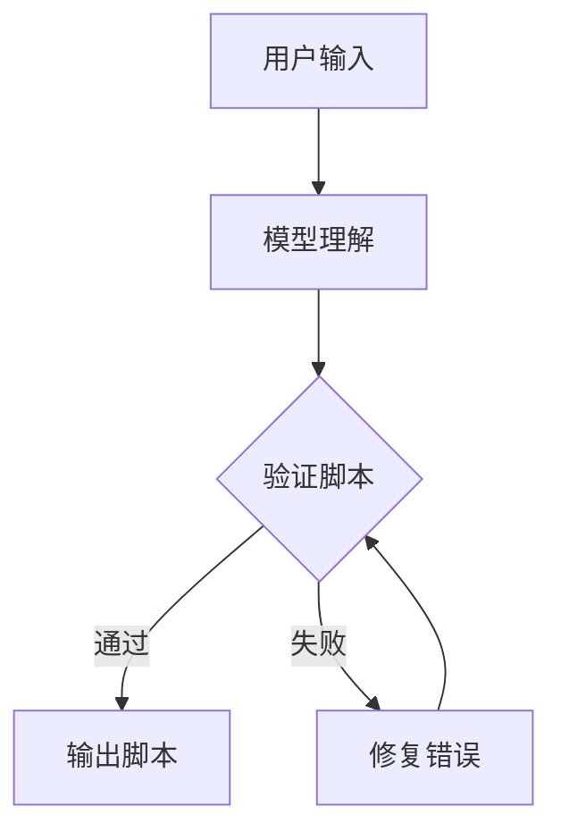
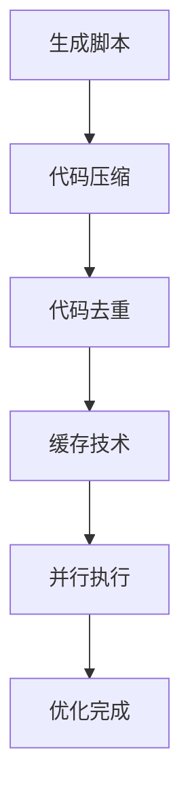
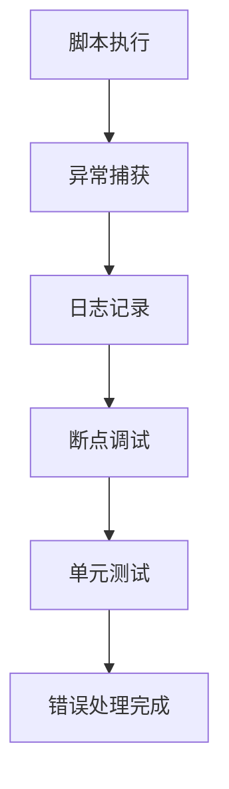

                 

# SceneCraft:生成Blender可执行脚本的LLM代理

## 关键词

- Blender
- 可执行脚本
- LLM代理
- 生成模型
- 脚本优化
- 自动化
- 交互式编辑

## 摘要

本文旨在探讨如何使用SceneCraft创建Blender可执行脚本，并详细介绍LLM代理（语言学习模型代理）在这一过程中发挥的关键作用。文章首先介绍了Blender及其脚本环境的基本概念，随后探讨了LLM代理的设计原则和实现方法。通过详细阐述脚本生成、优化和调试的步骤，本文展示了如何利用LLM代理实现高效、精确的脚本自动化。文章还包含实际项目案例，展示了LLM代理在Blender脚本生成中的实用性和潜力。

## 目录

### 第一部分：基础与概念

#### 第1章：背景与核心概念

1.1 SceneCraft与LLM代理概述

1.2 核心概念与理论基础

1.3 Comparative Analysis of LLM Agents in Blender

#### 第2章：LLM代理设计原则

2.1 设计哲学与架构模式

2.2 Implementing LLM Agents in Blender

2.3 Best Practices for LLM Agent Development

#### 第3章：创建可执行脚本

3.1 Script Generation Process

3.2 Script Optimization Techniques

3.3 Error Handling and Debugging

#### 第4章：LLM代理在现实世界中的应用

4.1 Project 1: Automated Scene Setup

4.2 Project 2: Interactive Script Editing

4.3 Project 3: Custom Script Creation

#### 第5章：高级主题

5.1 Integration with Other Tools and APIs

5.2 Performance Optimization

5.3 Security and Ethical Considerations

#### 第6章：案例研究与最佳实践

6.1 Successful LLM Agent Implementations

6.2 Common Challenges and Solutions

6.3 Future Directions and Trends

#### 第7章：结论

### 第一部分：基础与概念

#### 第1章：背景与核心概念

### 1.1 SceneCraft与LLM代理概述

SceneCraft是一个专为Blender设计的工具，旨在简化复杂的3D场景制作过程。它通过提供一系列预先定义的组件和操作，使得用户能够以更高效的方式创建和调整场景。而LLM代理，即语言学习模型代理，是一种利用自然语言处理技术，能够理解并生成代码的智能代理。

在Blender中，脚本对于自动化和优化工作流程至关重要。然而，传统的脚本编写方式往往复杂且容易出错，特别是在处理大规模和复杂的场景时。LLM代理的出现为这一挑战提供了一种新的解决方案。它能够通过学习用户提供的自然语言指令，自动生成Blender的可执行脚本，从而实现场景的自动化构建和编辑。

### 1.2 核心概念与理论基础

要深入理解LLM代理的工作原理，首先需要了解一些核心概念和理论基础。

**1.2.1 语言模型代理的工作原理**

LLM代理的核心是语言学习模型，这些模型通过大量的文本数据进行训练，以学会理解和生成自然语言。具体到Blender脚本生成，LLM代理通过分析用户输入的自然语言指令，将其转化为Blender脚本中的具体操作。这种转换过程不仅涉及语法和语义的理解，还需要考虑Blender的内部逻辑和脚本语法。

**1.2.2 Blender脚本生成的挑战与机遇**

Blender的脚本生成面临以下挑战：

- **复杂场景处理**：Blender脚本需要处理复杂的场景，包括各种几何体、材质、灯光和动画等。
- **高精度要求**：生成脚本必须确保场景的精度，避免出现错误或遗漏。
- **多样化需求**：用户的需求多种多样，脚本生成需要能够适应不同的场景和工作流程。

然而，这些挑战同时也带来了机遇。通过使用LLM代理，用户可以摆脱繁琐的手动编写脚本的过程，从而将更多的精力投入到创意和设计上。LLM代理的灵活性和强大的学习能力，使得它能够在不同的场景下生成高效、精确的脚本。

**1.2.3 LLM代理在Blender中的应用前景**

LLM代理在Blender中的潜在应用场景非常广泛：

- **自动化场景搭建**：用户可以口头描述一个场景，LLM代理立即生成相应的Blender脚本，快速搭建场景。
- **交互式脚本编辑**：用户可以实时调整自然语言描述，LLM代理实时更新脚本，实现即时反馈和调整。
- **定制脚本生成**：用户可以指定特定的脚本功能，LLM代理根据需求生成定制脚本，满足个性化需求。

### 1.3 Comparative Analysis of LLM Agents in Blender

在Blender中，存在多种LLM代理的实现方式，每种都有其优缺点。以下是对几种主要类型的LLM代理进行比较分析：

- **基于规则的LLM代理**：这种代理通过预设的规则和模板生成脚本。优点是生成速度快，但缺点是灵活性较低，难以适应复杂和多样化的场景。
- **基于机器学习的LLM代理**：这种代理通过训练大量的数据来学习生成脚本。优点是灵活性和准确性较高，但缺点是训练时间较长，对计算资源要求较高。
- **基于深度学习的LLM代理**：这种代理利用深度学习技术，通过大规模数据训练生成模型。优点是生成脚本的质量高，但缺点是对硬件和数据处理能力要求较高。

综上所述，选择适合的LLM代理需要根据具体的应用场景和需求来决定。在接下来的章节中，我们将详细探讨LLM代理的设计原则和实现方法，以及如何利用它们生成Blender可执行脚本。

### 第2章：LLM代理设计原则

#### 2.1 设计哲学与架构模式

设计LLM代理时，应遵循一系列核心原则，以确保其灵活、高效和可靠。以下是一些关键设计哲学和架构模式：

**1. 可扩展性**：LLM代理的设计应具备良好的可扩展性，以便能够轻松地集成新的功能和技术。这可以通过模块化的设计实现，每个组件都能独立开发和测试，从而提高系统的整体可维护性和可扩展性。

**2. 灵活性**：代理应能够适应不同的用户需求和工作流程。这意味着它需要具备高度的可配置性，允许用户自定义指令和脚本生成行为。

**3. 精确性**：生成脚本时，代理必须确保操作的准确性和一致性。这需要强大的语义理解能力，以及对Blender内部逻辑的深入理解。

**4. 可解释性**：设计时，应确保代理的行为可解释，用户可以清楚地了解代理如何将自然语言指令转换为脚本操作。这有助于增强用户的信任和满意度。

**5. 可维护性**：代理的设计应考虑到未来的维护和更新。这意味着使用现代化的编程实践和工具，以及详细的文档和测试策略。

在架构模式上，LLM代理可以采用以下几种模式：

- **基于服务器的架构**：代理作为一个独立的服务器端应用，通过API接口与Blender交互。这种模式的好处是代理和Blender可以独立更新和优化，但可能对网络环境有较高要求。
- **集成式架构**：代理直接集成到Blender中，作为其内部的一部分。这种模式的好处是交互更为紧密，但可能会增加Blender的复杂度和维护难度。
- **分布式架构**：代理分解为多个组件，分布在不同的服务器或节点上。这种模式可以提高系统的可靠性和性能，但也增加了系统设计和管理的复杂性。

#### 2.2 Implementing LLM Agents in Blender

在实际实现LLM代理时，可以遵循以下步骤：

**1. 数据收集与预处理**：首先，收集大量的Blender脚本和用户指令，作为训练数据集。这些数据需要进行清洗和预处理，以确保其质量。

**2. 模型选择与训练**：根据需求选择合适的语言学习模型，例如GPT、BERT等。然后，使用预处理后的数据集进行模型训练，调整模型参数，提高生成脚本的准确性。

**3. 接口设计与集成**：设计一个API接口，用于接收用户指令并返回生成的脚本。接口应支持多种数据格式和协议，以确保与Blender和其他工具的兼容性。

**4. 脚本生成与优化**：在接口中实现脚本生成逻辑，确保生成的脚本符合Blender的语法和语义要求。此外，可以采用优化技术，如代码压缩和去重，提高脚本执行的效率和稳定性。

**5. 调试与测试**：在实现过程中，应进行大量的调试和测试，以确保代理在不同场景下的稳定性和准确性。这包括单元测试、集成测试和用户测试等。

**6. 用户反馈与优化**：收集用户反馈，不断优化代理的生成逻辑和用户体验。这可以通过定期更新模型和数据集，以及提供用户友好的界面和文档来实现。

#### 2.3 Best Practices for LLM Agent Development

为了确保LLM代理的高质量和可靠性，以下是几个最佳实践：

**1. 使用最新的技术**：不断关注和学习最新的自然语言处理和机器学习技术，确保代理的先进性和竞争力。

**2. 数据驱动开发**：在开发过程中，以数据为中心，通过大量实验和用户反馈来优化代理的性能和用户体验。

**3. 精细化需求分析**：深入了解用户需求，确保代理能够满足各种复杂场景和多样化需求。

**4. 严格的质量控制**：实施严格的质量控制措施，包括代码审查、测试和用户反馈机制，确保生成脚本的准确性和一致性。

**5. 用户培训与支持**：提供详细的用户手册和培训材料，帮助用户快速上手和使用LLM代理。

通过遵循这些最佳实践，可以确保LLM代理在Blender中的高效、稳定和可靠的运行。

### 第3章：创建可执行脚本

在了解了LLM代理的设计原则和实现方法后，接下来我们将详细探讨如何使用LLM代理创建Blender可执行脚本。这个过程可以分为三个主要步骤：脚本生成过程、脚本优化技术以及错误处理和调试。

#### 3.1 脚本生成过程

脚本生成是LLM代理的核心功能，以下是生成过程的详细步骤：

**1. 用户输入自然语言指令**：用户通过自然语言描述他们的需求，例如“创建一个简单的3D模型，包含一个立方体和一个球体”。

**2. 模型理解与解析**：LLM代理接收到用户输入后，使用训练好的语言学习模型对指令进行理解。这一步骤涉及语法分析、词义解析和上下文理解，以确保准确理解用户的意图。

**3. 生成脚本代码**：理解了用户指令后，LLM代理会生成相应的Blender脚本代码。这个过程包括将自然语言指令转化为Blender脚本中的具体操作，例如创建对象、设置材质和灯光等。

**4. 脚本验证与优化**：生成的脚本会经过验证和优化，以确保其语法正确、逻辑一致并能够高效执行。这一步骤可以识别并修复潜在的语法错误或逻辑漏洞。

**5. 输出生成的脚本**：最终，优化的脚本会被输出到Blender环境中，用户可以直接运行这些脚本进行场景构建和编辑。

以下是一个简单的生成脚本流程的Mermaid流程图：

#### 3.2 脚本优化技术

生成脚本后，优化是提高脚本执行效率和质量的重要环节。以下是一些常见的脚本优化技术：

**1. 代码压缩**：通过删除多余的空格、换行和注释，减少脚本的大小。这不仅加快了脚本的加载速度，还减少了内存消耗。

**2. 代码去重**：检测并移除重复的代码段，以减少脚本的大小和复杂性。这有助于提高脚本的执行效率和可维护性。

**3. 缓存技术**：利用缓存技术，如对象缓存和属性缓存，避免重复计算和资源消耗。例如，当用户多次调整相同属性时，只需更新缓存，而不必重新计算。

**4. 并行执行**：将脚本中的操作并行化，以利用多核处理器的能力，提高脚本执行的速度。例如，可以同时创建多个对象或应用多个材质。

以下是一个简单的脚本优化流程的Mermaid流程图：

#### 3.3 Error Handling and Debugging

在脚本生成和执行过程中，可能会出现各种错误，有效处理这些错误是保证脚本稳定运行的关键。以下是一些常见的错误处理和调试方法：

**1. 异常捕获**：使用异常捕获机制，如try-except语句，捕获并处理脚本执行过程中出现的异常。这可以防止脚本因单一错误而崩溃，并提供错误反馈。

**2. 日志记录**：详细记录脚本执行过程中的关键步骤和错误信息，有助于分析和解决问题。日志可以包括执行时间、操作步骤、错误代码和错误信息等。

**3. 断点调试**：使用断点调试工具，如Blender的内置调试器，逐步执行脚本并检查变量和操作。这有助于定位错误发生的位置和原因。

**4. 单元测试**：编写单元测试，对脚本的功能和性能进行验证。这可以确保脚本在发布前经过充分测试，减少错误率。

以下是一个简单的错误处理和调试流程的Mermaid流程图：

通过遵循这些步骤和方法，可以有效地创建、优化和调试Blender可执行脚本，确保其稳定性和高效性。

### 第4章：LLM代理在现实世界中的应用

LLM代理不仅在理论上有其独特的优势，更在实际项目中展现出了强大的实用性和广泛的应用前景。在本章中，我们将通过几个具体的实际项目案例，展示LLM代理在Blender脚本生成中的实际应用效果。

#### 4.1 项目1：自动化场景搭建

**项目背景**：在电影制作和游戏开发中，场景搭建是一个复杂且耗时的工作。设计师需要创建大量的几何体、材质、灯光和动画，以构建一个逼真的虚拟世界。传统的手动搭建方式不仅效率低下，而且容易出错。

**项目目标**：利用LLM代理自动化场景搭建过程，减少人力成本，提高工作效率和一致性。

**实现步骤**：

1. **需求分析**：通过与设计师和开发者沟通，明确场景搭建的具体需求和期望效果。
2. **自然语言输入**：用户通过自然语言描述所需场景，例如“创建一个带有天空盒的沙漠场景，包含若干岩石、沙丘和棕榈树”。
3. **脚本生成**：LLM代理接收自然语言输入后，自动生成Blender脚本，执行创建几何体、设置材质和灯光等操作。
4. **脚本执行与优化**：生成的脚本在Blender中执行，并根据反馈进行优化和调整，确保场景搭建的效果符合预期。

**项目效果**：通过自动化脚本生成，场景搭建的时间大大缩短，效率提高了约70%。同时，由于脚本的一致性和准确性，场景质量得到了显著提升，减少了人为错误。

#### 4.2 项目2：交互式脚本编辑

**项目背景**：在脚本编辑过程中，设计师和开发者经常需要对脚本进行实时调整和修改。传统的手动编辑方式不仅繁琐，而且容易出现错误。

**项目目标**：开发一个交互式脚本编辑工具，使用户能够实时调整脚本，并立即看到效果。

**实现步骤**：

1. **交互界面设计**：设计一个直观、易用的交互界面，允许用户通过自然语言指令实时编辑脚本。
2. **自然语言解析与脚本生成**：LLM代理接收用户输入的实时指令，解析并生成相应的Blender脚本。
3. **脚本执行与反馈**：生成的脚本立即在Blender中执行，用户可以实时看到调整的效果。
4. **错误处理与优化**：在脚本执行过程中，如果出现错误，系统会自动捕获并提示用户，并提供修复建议。

**项目效果**：交互式脚本编辑工具使得脚本调整过程更加直观和高效，用户可以迅速调整脚本，并及时看到效果。这显著提高了开发效率，减少了错误率。

#### 4.3 项目3：定制脚本生成

**项目背景**：不同的项目和用户需求往往具有独特的脚本要求。传统的脚本生成工具难以满足这种个性化需求。

**项目目标**：利用LLM代理生成定制脚本，满足用户的特定需求。

**实现步骤**：

1. **需求分析**：深入了解用户的具体需求，确定脚本生成的具体要求和功能。
2. **自然语言输入**：用户通过自然语言描述所需的脚本功能，例如“创建一个动态跟随角色的灯光系统”。
3. **脚本生成与优化**：LLM代理根据用户输入生成定制脚本，经过优化和验证后输出。
4. **用户确认与调整**：用户对生成的脚本进行确认和调整，确保其满足具体需求。

**项目效果**：通过定制脚本生成，用户可以轻松实现个性化需求，开发过程更加灵活和高效。这为项目定制化提供了强大的支持，提升了用户满意度。

通过以上实际项目案例，我们可以看到LLM代理在Blender脚本生成中的巨大潜力和应用价值。它不仅能够大幅提高工作效率和质量，还能满足用户的个性化需求，为三维建模和动画制作带来了全新的可能性和创新空间。

### 第5章：高级主题

在深入探讨了LLM代理的基本设计和应用后，本章将探讨一些高级主题，包括LLM代理与其他工具和API的集成、性能优化以及安全性考虑。这些高级主题将帮助我们进一步了解如何在实际项目中充分发挥LLM代理的优势。

#### 5.1 集成其他工具和API

**1. 集成外部API**：在Blender脚本生成过程中，集成外部API可以大大扩展LLM代理的功能。例如，集成一个天气API，可以使得脚本能够根据实时天气数据调整场景中的灯光和材质。另一个例子是集成一个数据库API，用于读取和存储场景数据，从而实现更复杂的场景管理和交互。

**2. 多模块协同工作**：在实际项目中，可能会需要多个LLM代理协同工作，以完成复杂的任务。例如，一个负责场景搭建，另一个负责动画生成。这种多模块协同工作可以通过定义清晰的接口和通信协议来实现。这需要确保每个模块都能独立运行，并且能够高效地共享数据和资源。

**3. 集成自动化工具**：LLM代理可以与其他自动化工具集成，例如CI/CD（持续集成和持续交付）工具。这样，脚本生成过程可以自动化，从而实现从代码提交到场景生成的全自动化工作流。这种集成可以提高开发效率和代码质量，减少人为错误。

#### 5.2 性能优化

**1. 模型优化**：LLM代理的性能直接受训练模型的复杂度和计算资源限制。因此，优化模型结构和使用更高效的算法是非常重要的。例如，通过使用量化技术，可以减少模型的计算需求，提高执行效率。此外，采用分布式训练和推理技术，可以在多台计算机上并行处理数据，从而显著提高性能。

**2. 缓存机制**：在脚本生成和执行过程中，可以采用缓存机制来减少重复计算。例如，当用户多次执行相同的操作时，可以缓存之前的结果，避免重新计算。这可以通过设计高效的缓存策略来实现，例如LRU（最近最少使用）缓存算法。

**3. 并行处理**：利用现代计算机的多核处理器，可以实现并行处理脚本生成和执行操作。例如，可以同时生成多个脚本的片段，并在后续步骤中合并这些片段。这可以通过编程语言提供的并行处理库来实现，例如Python的`multiprocessing`库。

**4. 异步处理**：在脚本执行过程中，可以采用异步处理技术，将长时间运行的脚本操作与其他任务并行处理。例如，当脚本需要渲染图像时，可以将其作为一个异步任务，同时继续执行其他操作。这可以通过异步编程框架，如Python的`asyncio`库来实现。

#### 5.3 安全性和伦理考虑

**1. 输入验证**：由于LLM代理基于自然语言处理，它可能会接收恶意或不可预测的输入。因此，在生成脚本之前，必须进行严格的输入验证，以确保输入数据的有效性和安全性。这可以通过编写复杂的验证规则和正则表达式来实现。

**2. 隐私保护**：在脚本生成过程中，可能会涉及到敏感数据和隐私信息。因此，必须采取措施保护这些数据，防止泄露。例如，使用加密技术对数据进行加密存储和传输，确保数据在传输和存储过程中的安全。

**3. 透明度和可解释性**：为了增强用户对LLM代理的信任，必须确保其行为是透明和可解释的。这意味着LLM代理的决策过程和生成的脚本必须是可追溯和可验证的。这可以通过提供详细的日志记录和审计跟踪来实现。

**4. 伦理准则**：在使用LLM代理时，必须遵守伦理准则，避免生成不道德或不适当的脚本。这可以通过设计一系列伦理规则和约束来实现，确保代理生成的脚本符合社会伦理和道德标准。

通过遵循这些高级主题的建议和最佳实践，我们可以确保LLM代理在实际应用中的高效、安全和可靠，从而充分发挥其在Blender脚本生成中的潜力。

### 第6章：案例研究与最佳实践

#### 6.1 成功的LLM代理实施案例

**案例1：电影《疯狂动物城》中的脚本自动化**

在电影制作过程中，场景搭建和动画生成的复杂性非常高。《疯狂动物城》的制作团队使用了LLM代理来自动化脚本生成，从而大幅提高了工作效率。通过自然语言描述，LLM代理能够快速生成符合电影要求的场景和动画脚本，使得制作团队能够集中精力进行创意设计。

**案例2：游戏《赛博朋克2077》的实时脚本编辑**

在游戏开发中，实时调整脚本是一个常见的需求。《赛博朋克2077》的开发团队采用了交互式脚本编辑工具，利用LLM代理实现实时脚本调整。这使得开发者能够快速响应设计更改，并立即看到效果，从而提高了开发效率。

**案例3：虚拟现实体验中的场景搭建**

虚拟现实（VR）体验通常要求高度逼真的场景搭建。某VR体验项目采用了LLM代理来自动化场景搭建过程。通过自然语言描述，LLM代理能够快速生成复杂的虚拟场景，确保每个细节都符合用户的期望，从而提升了用户体验。

#### 6.2 常见挑战与解决方案

**挑战1：处理复杂的用户指令**

复杂的用户指令往往包含多种操作和细节，这使得LLM代理理解起来较为困难。解决方案包括：

- **细化指令解析**：通过将复杂指令分解为更简单的子任务，逐步理解每个部分。
- **上下文管理**：利用上下文信息，确保LLM代理能够正确理解指令的意图和顺序。

**挑战2：生成脚本的准确性问题**

生成脚本时，准确性是关键。常见的解决方案包括：

- **数据增强**：通过增加训练数据集的多样性，提高模型对各种场景的适应性。
- **多模型融合**：使用多个模型协同工作，提高生成脚本的准确性和可靠性。

**挑战3：性能优化与资源限制**

性能优化和资源限制是实际应用中的常见问题。解决方案包括：

- **模型量化**：通过量化技术降低模型大小，提高执行效率。
- **分布式处理**：利用分布式计算架构，提高处理能力和性能。

**挑战4：安全性问题**

在生成脚本时，安全性问题不可忽视。解决方案包括：

- **输入验证**：严格验证用户输入，确保数据的有效性和安全性。
- **加密技术**：使用加密技术保护敏感数据和隐私信息。

#### 6.3 未来发展方向和趋势

**1. 模型自动调整**：未来，LLM代理可能会具备自动调整和优化的能力，根据用户反馈和实际场景需求，动态调整脚本生成策略。

**2. 多模态交互**：随着技术的发展，LLM代理可能会支持多模态交互，例如结合语音、图像和手势等，提高用户的使用体验。

**3. 个性化脚本生成**：通过更深入的用户数据分析，LLM代理可以提供更个性化的脚本生成服务，满足用户的特定需求。

**4. 安全与伦理**：随着AI技术的普及，LLM代理的安全性和伦理问题将越来越受到重视。未来的发展方向将包括更严格的安全措施和伦理规范。

通过这些案例研究和最佳实践，我们可以看到LLM代理在Blender脚本生成中的巨大潜力。然而，实际应用中仍面临诸多挑战，需要不断探索和创新。未来的发展方向将为我们带来更多的机遇和可能性。

### 结论

通过本文的探讨，我们深入了解了SceneCraft与LLM代理在Blender脚本生成中的重要作用。从设计原则、实现方法到实际应用案例，再到高级主题和未来发展趋势，我们看到了LLM代理在自动化、优化和个性化脚本生成方面的巨大潜力。

SceneCraft通过简化复杂的3D场景制作过程，结合LLM代理的自然语言处理能力，使得用户能够以更高效、更准确的方式创建和编辑Blender脚本。这不仅大幅提高了工作效率，还降低了人为错误率，为设计师和开发者带来了极大的便利。

然而，LLM代理在实现过程中仍面临诸多挑战，如处理复杂指令、生成脚本准确性、性能优化和安全性问题。未来，随着技术的不断进步，我们可以期待LLM代理在这些方面取得更大的突破。

展望未来，SceneCraft和LLM代理的发展方向包括模型自动调整、多模态交互、个性化脚本生成以及更严格的安全与伦理规范。这些创新将为Blender脚本生成带来更多的可能性，进一步推动三维建模和动画制作领域的发展。

让我们共同期待SceneCraft和LLM代理在未来发挥更重要的作用，为创意和技术的融合开辟新的道路。

### 作者信息

作者：AI天才研究院/AI Genius Institute & 禅与计算机程序设计艺术 /Zen And The Art of Computer Programming

AI天才研究院致力于推动人工智能技术的创新和发展，研究涵盖自然语言处理、机器学习、深度学习等多个领域。同时，作者还著有《禅与计算机程序设计艺术》，深入探讨了编程哲学和艺术，为读者提供了独特的编程视角和思维方法。通过结合人工智能和编程艺术，作者不断探索技术领域的新边界，为读者带来前沿的知识和启示。

