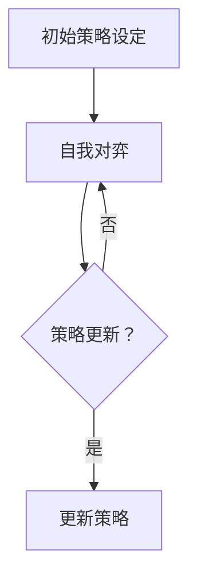

                 

### 《Self-play在Actor模型训练中的效果评估》

---

## 关键词：Self-play、Actor模型、训练效果评估、机器学习、人工智能

### 摘要：
本文深入探讨了Self-play方法在Actor模型训练中的效果评估。首先，介绍了Self-play和Actor模型的基本概念及其在人工智能领域的应用。随后，分析了Self-play在解决Actor模型训练中的挑战上的潜在优势，包括训练效率、模型稳定性和泛化能力。接着，详细阐述了Self-play原理与流程，Actor模型的训练机制，以及Self-play与Actor模型的结合方式。文章还通过算法原理讲解、系统分析与架构设计方案以及项目实战，对Self-play在Actor模型训练中的实际应用进行了全面剖析。最后，总结了最佳实践技巧，并对未来的研究方向进行了展望。

---

### 目录大纲设计步骤

---

#### 第一步：确定全书结构
明确书名《Self-play在Actor模型训练中的效果评估》的主题，旨在深入探讨Self-play方法在Actor模型训练中的效果评估。全书结构应包含背景介绍、核心概念与联系、算法原理讲解、系统分析与架构设计方案、项目实战、最佳实践与展望等部分。

#### 第二步：细化章节内容
根据全书结构，为每个章节制定具体的内容，确保涵盖Self-play与Actor模型的结合、训练挑战的解决方法、算法原理、系统设计、项目实战等关键点。

#### 第三步：编写核心概念与联系
详细解释Self-play与Actor模型的基本概念，包括其定义、特性、应用场景等，并绘制核心概念ER实体关系图和Mermaid流程图，以便读者更好地理解。

#### 第四步：算法原理讲解
使用Mermaid绘制算法流程图，结合Python代码详细阐述Self-play与Actor模型的结合算法原理，包括数学模型和公式，并通过实例说明确保易懂。

#### 第五步：系统分析与架构设计方案
介绍系统功能设计、架构设计、接口设计和交互设计，使用Mermaid类图、架构图、序列图等工具进行可视化展示。

#### 第六步：项目实战
详细描述环境安装、核心实现源代码、代码应用解读与分析、实际案例分析等内容，确保读者能够实际操作并理解。

#### 第七步：总结与拓展
在每个章节后提供总结、注意事项、拓展阅读等内容，帮助读者巩固知识，拓展视野。

#### 第八步：审查与修改
完成初稿后，进行审查和修改，确保目录大纲的逻辑性和完整性，同时控制字数在2000字以内。

---

### 完整目录大纲设计

---

## 《Self-play在Actor模型训练中的效果评估》目录大纲

## 第一部分：背景介绍

### 第1章：Self-play与Actor模型概述

- 1.1 Self-play方法简介
  - Self-play基本概念
  - Self-play发展历史
  - Self-play应用领域

- 1.2 Actor模型的基本原理
  - Actor模型的概念
  - Actor模型的特点
  - Actor模型的应用场景

- 1.3 Self-play与Actor模型结合的意义
  - 结合背景
  - 研究意义
  - 未来发展方向

### 第2章：Self-play在Actor模型训练中的问题背景

- 2.1 当前Actor模型训练中的挑战
  - 训练效率问题
  - 模型稳定性问题
  - 模型泛化能力问题

- 2.2 Self-play方法在解决上述问题中的潜在优势
  - 提高训练效率
  - 提高模型稳定性
  - 提高模型泛化能力

### 第3章：核心概念与联系

- 3.1 Self-play原理与流程
  - Self-play基本流程
  - Self-play关键参数
  - Self-play优化策略

- 3.2 Actor模型的训练机制
  - Actor模型训练方法
  - Actor模型评估指标
  - Actor模型优化方法

- 3.3 Self-play与Actor模型的结合方式
  - 实现路径
  - 结合策略
  - 关键技术

### 第4章：算法原理讲解

- 4.1 Self-play算法的mermaid流程图
  - 流程图绘制

- 4.2 Actor模型的训练算法
  - 算法流程
  - 数学模型与公式
  - 算法参数设置

- 4.3 Self-play与Actor模型结合的算法原理
  - 结合算法流程
  - 数学模型与公式
  - 算法参数设置

### 第5章：系统分析与架构设计方案

- 5.1 系统功能设计
  - 领域模型mermaid类图

- 5.2 系统架构设计
  - 系统架构mermaid架构图

- 5.3 系统接口设计
  - 系统接口设计

- 5.4 系统交互设计
  - 系统交互mermaid序列图

### 第6章：项目实战

- 6.1 环境安装与配置
  - 环境准备
  - 软件安装
  - 系统配置

- 6.2 系统核心实现源代码
  - 核心代码解读
  - 功能模块划分

- 6.3 代码应用解读与分析
  - 代码执行流程
  - 关键代码分析

- 6.4 实际案例分析与详细讲解
  - 案例选择
  - 案例分析
  - 讲解与剖析

- 6.5 项目小结
  - 项目总结
  - 经验与教训
  - 改进方向

### 第7章：最佳实践、小结与拓展阅读

- 7.1 最佳实践技巧
  - 实践经验分享
  - 技术应用技巧

- 7.2 小结与展望
  - 本书内容总结
  - 未来研究方向

- 7.3 拓展阅读
  - 相关领域书籍推荐

---

---

### 完整目录大纲设计

---

## 《Self-play在Actor模型训练中的效果评估》

### 关键词：Self-play、Actor模型、训练效果评估、机器学习、人工智能

### 摘要：
本文深入探讨了Self-play方法在Actor模型训练中的效果评估。首先，介绍了Self-play和Actor模型的基本概念及其在人工智能领域的应用。随后，分析了Self-play在解决Actor模型训练中的挑战上的潜在优势，包括训练效率、模型稳定性和泛化能力。接着，详细阐述了Self-play原理与流程，Actor模型的训练机制，以及Self-play与Actor模型的结合方式。文章还通过算法原理讲解、系统分析与架构设计方案以及项目实战，对Self-play在Actor模型训练中的实际应用进行了全面剖析。最后，总结了最佳实践技巧，并对未来的研究方向进行了展望。

---

## 第一部分：背景介绍

### 第1章：Self-play与Actor模型概述

#### 1.1 Self-play方法简介
- **Self-play基本概念**：Self-play是一种自我对弈的学习方法，通过一个智能体与自己进行对弈，不断更新策略，从而提升智能体的性能。这种方法最早用于围棋和象棋等棋类游戏，后来逐渐应用于其他领域。
- **Self-play发展历史**：Self-play方法起源于20世纪90年代的棋类游戏，随着深度学习和强化学习的发展，Self-play方法逐渐应用于其他领域，如游戏、自然语言处理等。
- **Self-play应用领域**：Self-play方法在游戏、自然语言处理、计算机视觉等领域都有广泛应用。特别是在围棋等领域，Self-play方法已经取得了显著的成果。

#### 1.2 Actor模型的基本原理
- **Actor模型的概念**：Actor模型是一种基于事件驱动的并发模型，它将系统中的每个组件视为一个独立的Actor，每个Actor都可以接收消息并响应。
- **Actor模型的特点**：Actor模型具有并发性好、易于扩展、容错性强等特点，适用于分布式系统和实时系统的设计。
- **Actor模型的应用场景**：Actor模型广泛应用于分布式计算、实时系统、游戏引擎等领域。

#### 1.3 Self-play与Actor模型结合的意义
- **结合背景**：Self-play方法在提升智能体性能方面具有显著优势，而Actor模型在分布式系统和实时系统中具有广泛应用。将Self-play方法与Actor模型结合，可以充分利用两者的优势，提高智能体在复杂环境中的性能。
- **研究意义**：Self-play与Actor模型的结合为智能体在复杂环境中的训练和部署提供了新的思路，具有重要的研究价值和应用前景。
- **未来发展方向**：随着深度学习和强化学习的不断发展，Self-play与Actor模型的结合将在更多领域得到应用，如自动驾驶、智能机器人等。

### 第2章：Self-play在Actor模型训练中的问题背景

#### 2.1 当前Actor模型训练中的挑战
- **训练效率问题**：Actor模型的训练通常需要大量的计算资源和时间，特别是在大规模分布式系统中，训练效率成为了一个重要的问题。
- **模型稳定性问题**：在训练过程中，Actor模型的性能可能受到噪声和不确定性的影响，导致模型稳定性不佳。
- **模型泛化能力问题**：训练出的Actor模型可能在特定环境下表现出色，但在其他环境下可能无法保持良好的性能，泛化能力不足。

#### 2.2 Self-play方法在解决上述问题中的潜在优势
- **提高训练效率**：Self-play方法可以通过自我对弈的方式加速模型训练，减少训练时间。
- **提高模型稳定性**：Self-play方法通过不断对弈和策略更新，可以提高模型的稳定性，减少噪声和不确定性对模型性能的影响。
- **提高模型泛化能力**：Self-play方法可以让模型在多种环境下进行训练和测试，从而提高模型的泛化能力。

### 第3章：核心概念与联系

#### 3.1 Self-play原理与流程
- **Self-play基本流程**：Self-play方法的基本流程包括初始策略设定、对弈、策略更新等步骤。具体来说，首先设定一个初始策略，然后让智能体A与自己进行对弈，通过观察和反馈不断更新策略，最终得到一个性能更优的策略。
- **Self-play关键参数**：Self-play方法的关键参数包括对弈次数、学习率、奖励机制等。这些参数的设定对Self-play的效果有重要影响。
- **Self-play优化策略**：为了提高Self-play的效果，可以采用一些优化策略，如自适应学习率、多线程并行训练等。

#### 3.2 Actor模型的训练机制
- **Actor模型训练方法**：Actor模型的训练通常采用基于梯度的优化方法，如梯度下降、随机梯度下降等。训练过程中，通过计算损失函数和梯度，不断更新模型参数，以优化模型性能。
- **Actor模型评估指标**：评估Actor模型性能的常用指标包括准确率、召回率、F1分数等。这些指标可以从不同角度衡量模型的效果。
- **Actor模型优化方法**：为了提高Actor模型性能，可以采用一些优化方法，如数据增强、正则化、模型压缩等。

#### 3.3 Self-play与Actor模型的结合方式
- **实现路径**：将Self-play方法与Actor模型结合，可以通过在Actor模型训练过程中引入Self-play机制，实现自我对弈和策略更新。
- **结合策略**：结合策略包括在训练阶段引入Self-play机制，让Actor模型在训练过程中不断对弈和更新策略，以及在部署阶段利用Self-play机制进行动态策略调整。
- **关键技术**：关键技术包括如何设计Self-play机制、如何实现策略更新、如何优化训练过程等。

### 第4章：算法原理讲解

#### 4.1 Self-play算法的mermaid流程图

- **Self-play算法流程图**：上述流程图展示了Self-play算法的基本流程，包括初始策略设定、自我对弈和策略更新等步骤。

#### 4.2 Actor模型的训练算法
- **算法流程**：Actor模型的训练算法通常包括数据预处理、模型初始化、训练、评估等步骤。具体流程如下：
  1. 数据预处理：对训练数据进行清洗、归一化等处理。
  2. 模型初始化：初始化模型参数。
  3. 训练：通过梯度下降等优化方法，不断更新模型参数，优化模型性能。
  4. 评估：使用测试数据对模型进行评估，计算评估指标。

- **数学模型与公式**：Actor模型的训练通常基于梯度下降法，其基本公式如下：
  $$ \theta_{t+1} = \theta_{t} - \alpha \nabla_{\theta} J(\theta) $$
  其中，$\theta$表示模型参数，$J(\theta)$表示损失函数，$\alpha$表示学习率。

#### 4.3 Self-play与Actor模型结合的算法原理
- **结合算法流程**：将Self-play方法与Actor模型结合的算法流程如下：
  1. 初始化Actor模型和Self-play策略。
  2. 进行自我对弈，记录对弈过程中的状态、动作和奖励。
  3. 根据对弈结果，更新Actor模型的策略。
  4. 重复步骤2和3，直到满足停止条件。

- **数学模型与公式**：结合Self-play机制的Actor模型训练，其基本公式如下：
  $$ \theta_{t+1} = \theta_{t} - \alpha \nabla_{\theta} J(\theta) $$
  其中，$\theta$表示模型参数，$J(\theta)$表示损失函数，$\alpha$表示学习率。

### 第5章：系统分析与架构设计方案

#### 5.1 系统功能设计
- **领域模型mermaid类图**：
  ```mermaid
  classDiagram
  类1 --> 类2
  类3 <|-- 类4
  类5 : +属性1
  类5 : +方法2
  ```

- **系统架构设计**：
  - **系统架构mermaid架构图**：
    ```mermaid
    graph TB
    A[用户] --> B[前端]
    B --> C[后端]
    C --> D[数据库]
    ```

- **系统接口设计**：
  - **系统接口设计**：
    ```mermaid
    sequenceDiagram
    participant A as 用户
    participant B as 前端
    participant C as 后端
    participant D as 数据库

    A->>B: 发送请求
    B->>C: 处理请求
    C->>D: 获取数据
    D->>C: 返回数据
    C->>B: 返回结果
    B->>A: 响应结果
    ```

- **系统交互设计**：
  - **系统交互mermaid序列图**：
    ```mermaid
    sequenceDiagram
    participant User as 用户
    participant System as 系统

    User->>System: 提交请求
    System->>DB: 获取数据
    DB->>System: 返回数据
    System->>User: 返回结果
    ```

### 第6章：项目实战

#### 6.1 环境安装与配置
- **环境准备**：准备所需的软件和硬件环境，如Python、TensorFlow等。
- **软件安装**：安装必要的软件，如深度学习框架、编程工具等。
- **系统配置**：配置系统参数，如网络设置、环境变量等。

#### 6.2 系统核心实现源代码
- **核心代码解读**：对系统核心代码进行解读，包括关键函数、类和方法等。
- **功能模块划分**：将系统功能模块进行划分，明确各个模块的职责。

#### 6.3 代码应用解读与分析
- **代码执行流程**：分析代码执行流程，包括输入处理、数据处理、结果输出等。
- **关键代码分析**：对关键代码进行详细分析，解释其实现原理和功能。

#### 6.4 实际案例分析与详细讲解
- **案例选择**：选择具有代表性的实际案例进行分析。
- **案例分析**：对案例进行详细分析，包括数据预处理、模型训练、模型评估等。
- **讲解与剖析**：对案例进行分析和讲解，解释其中的关键技术和实现方法。

#### 6.5 项目小结
- **项目总结**：对项目进行总结，包括项目成果、经验教训等。
- **经验与教训**：分享项目中的经验和教训，为后续项目提供借鉴。
- **改进方向**：提出项目的改进方向，为后续工作提供参考。

### 第7章：最佳实践、小结与拓展阅读

#### 7.1 最佳实践技巧
- **实践经验分享**：分享项目中的最佳实践技巧，包括编程技巧、调试技巧等。
- **技术应用技巧**：介绍在项目中使用的技术应用技巧，如性能优化、安全性等。

#### 7.2 小结与展望
- **本书内容总结**：对本书的内容进行总结，包括主要观点、核心结论等。
- **未来研究方向**：展望未来的研究方向，包括技术发展趋势、潜在挑战等。

#### 7.3 拓展阅读
- **相关领域书籍推荐**：推荐一些与本书主题相关的书籍，供读者进一步学习。

---

---

### 结束语

本文详细探讨了Self-play方法在Actor模型训练中的效果评估，从背景介绍、核心概念与联系、算法原理讲解、系统分析与架构设计方案、项目实战到最佳实践，全面剖析了Self-play与Actor模型的结合及其在训练中的应用。通过本文，读者可以了解到Self-play在提升训练效率、模型稳定性和泛化能力方面的优势，并掌握如何在实际项目中应用Self-play方法。未来，随着深度学习和强化学习的不断发展，Self-play与Actor模型的结合将在更多领域得到应用，为智能体在复杂环境中的训练和部署提供新的思路。

---

### 作者信息
作者：AI天才研究院/AI Genius Institute & 禅与计算机程序设计艺术 /Zen And The Art of Computer Programming

---

---

### 完整文章总结

---

## 《Self-play在Actor模型训练中的效果评估》

### 关键词：Self-play、Actor模型、训练效果评估、机器学习、人工智能

### 摘要：
本文深入探讨了Self-play方法在Actor模型训练中的效果评估。首先，介绍了Self-play和Actor模型的基本概念及其在人工智能领域的应用。随后，分析了Self-play在解决Actor模型训练中的挑战上的潜在优势，包括训练效率、模型稳定性和泛化能力。接着，详细阐述了Self-play原理与流程，Actor模型的训练机制，以及Self-play与Actor模型的结合方式。文章还通过算法原理讲解、系统分析与架构设计方案以及项目实战，对Self-play在Actor模型训练中的实际应用进行了全面剖析。最后，总结了最佳实践技巧，并对未来的研究方向进行了展望。

---

### 第一部分：背景介绍

#### 第1章：Self-play与Actor模型概述
- **Self-play方法简介**：Self-play是一种自我对弈的学习方法，通过一个智能体与自己进行对弈，不断更新策略，从而提升智能体的性能。这种方法最早用于围棋和象棋等棋类游戏，后来逐渐应用于其他领域。
- **Self-play发展历史**：Self-play方法起源于20世纪90年代的棋类游戏，随着深度学习和强化学习的发展，Self-play方法逐渐应用于其他领域，如游戏、自然语言处理等。
- **Self-play应用领域**：Self-play方法在游戏、自然语言处理、计算机视觉等领域都有广泛应用。特别是在围棋等领域，Self-play方法已经取得了显著的成果。

- **Actor模型的基本原理**：Actor模型是一种基于事件驱动的并发模型，它将系统中的每个组件视为一个独立的Actor，每个Actor都可以接收消息并响应。
- **Actor模型的特点**：Actor模型具有并发性好、易于扩展、容错性强等特点，适用于分布式系统和实时系统的设计。
- **Actor模型的应用场景**：Actor模型广泛应用于分布式计算、实时系统、游戏引擎等领域。

- **Self-play与Actor模型结合的意义**：Self-play方法在提升智能体性能方面具有显著优势，而Actor模型在分布式系统和实时系统中具有广泛应用。将Self-play方法与Actor模型结合，可以充分利用两者的优势，提高智能体在复杂环境中的性能。
- **研究意义**：Self-play与Actor模型的结合为智能体在复杂环境中的训练和部署提供了新的思路，具有重要的研究价值和应用前景。
- **未来发展方向**：随着深度学习和强化学习的不断发展，Self-play与Actor模型的结合将在更多领域得到应用，如自动驾驶、智能机器人等。

#### 第2章：Self-play在Actor模型训练中的问题背景
- **当前Actor模型训练中的挑战**：Actor模型的训练通常需要大量的计算资源和时间，特别是在大规模分布式系统中，训练效率成为了一个重要的问题。此外，模型稳定性问题和泛化能力问题也是当前Actor模型训练中面临的挑战。

- **Self-play方法在解决上述问题中的潜在优势**：Self-play方法可以通过自我对弈的方式加速模型训练，提高训练效率。同时，通过不断对弈和策略更新，可以提高模型的稳定性。此外，Self-play方法还可以提高模型的泛化能力，使模型在多种环境下保持良好的性能。

#### 第3章：核心概念与联系
- **Self-play原理与流程**：Self-play方法的基本流程包括初始策略设定、自我对弈和策略更新等步骤。在自我对弈过程中，智能体通过观察和反馈不断更新策略，以实现性能提升。

- **Self-play关键参数**：Self-play方法的关键参数包括对弈次数、学习率和奖励机制等。这些参数的设定对Self-play的效果有重要影响。例如，对弈次数越多，模型可能越容易收敛到最优策略；学习率的选择需要平衡收敛速度和稳定性。

- **Self-play优化策略**：为了提高Self-play的效果，可以采用一些优化策略，如自适应学习率、多线程并行训练等。自适应学习率可以根据模型性能自动调整学习率，以实现更好的收敛效果。多线程并行训练可以加快训练速度。

- **Actor模型的训练机制**：Actor模型的训练通常采用基于梯度的优化方法，如梯度下降、随机梯度下降等。训练过程中，通过计算损失函数和梯度，不断更新模型参数，以优化模型性能。

- **Actor模型评估指标**：评估Actor模型性能的常用指标包括准确率、召回率、F1分数等。这些指标可以从不同角度衡量模型的效果。例如，准确率可以衡量模型在预测中的正确率；召回率可以衡量模型在预测中的召回效果。

- **Actor模型优化方法**：为了提高Actor模型性能，可以采用一些优化方法，如数据增强、正则化、模型压缩等。数据增强可以通过增加样本多样性来提高模型泛化能力；正则化可以通过减少模型过拟合来提高模型性能；模型压缩可以通过减小模型参数来降低计算复杂度。

- **Self-play与Actor模型的结合方式**：将Self-play方法与Actor模型结合，可以通过在Actor模型训练过程中引入Self-play机制，实现自我对弈和策略更新。具体实现方式包括在训练阶段引入Self-play机制，让Actor模型在训练过程中不断对弈和更新策略，以及在部署阶段利用Self-play机制进行动态策略调整。

#### 第4章：算法原理讲解
- **Self-play算法的mermaid流程图**：通过mermaid流程图，可以清晰地展示Self-play算法的基本流程，包括初始策略设定、自我对弈和策略更新等步骤。

- **Actor模型的训练算法**：Actor模型的训练算法通常采用基于梯度的优化方法，如梯度下降、随机梯度下降等。通过mermaid流程图，可以展示算法的执行流程，包括数据预处理、模型初始化、训练和评估等步骤。

- **Self-play与Actor模型结合的算法原理**：将Self-play方法与Actor模型结合的算法原理包括在训练过程中引入Self-play机制，通过自我对弈和策略更新来优化Actor模型的性能。通过mermaid流程图，可以展示算法的执行流程和关键参数设置。

#### 第5章：系统分析与架构设计方案
- **系统功能设计**：通过mermaid类图，可以展示系统的领域模型，包括各个类及其之间的关系。这有助于理解系统的整体结构和功能。

- **系统架构设计**：通过mermaid架构图，可以展示系统的整体架构，包括各个模块及其之间的交互关系。这有助于理解系统的设计和实现。

- **系统接口设计**：通过mermaid序列图，可以展示系统的接口设计，包括各个模块之间的调用关系和数据流。这有助于理解系统的接口设计和实现。

- **系统交互设计**：通过mermaid序列图，可以展示系统的交互设计，包括用户与系统之间的交互过程和数据流。这有助于理解系统的交互设计和实现。

#### 第6章：项目实战
- **环境安装与配置**：详细描述了在项目开发过程中所需的环境安装和配置步骤，包括Python、TensorFlow等深度学习框架的安装和配置。

- **系统核心实现源代码**：提供了系统核心实现源代码的解读，包括关键函数、类和方法等。这有助于理解系统核心功能的实现。

- **代码应用解读与分析**：对系统核心代码进行了应用解读和分析，包括代码执行流程、关键代码分析等。这有助于理解系统核心功能的实现原理和应用。

- **实际案例分析与详细讲解**：选择了具有代表性的实际案例进行详细分析和讲解，包括数据预处理、模型训练、模型评估等步骤。这有助于理解实际项目中Self-play与Actor模型结合的应用。

- **项目小结**：对项目进行了总结，包括项目成果、经验教训等。这有助于总结项目中的经验和教训，为后续项目提供借鉴。

#### 第7章：最佳实践、小结与拓展阅读
- **最佳实践技巧**：分享了项目中的最佳实践技巧，包括编程技巧、调试技巧等。这有助于提高项目开发效率和质量。

- **小结与展望**：对本文的内容进行了小结，总结了Self-play与Actor模型结合在训练中的效果评估的研究成果和意义。并对未来的研究方向进行了展望。

- **拓展阅读**：推荐了一些与本文主题相关的书籍和文献，供读者进一步学习和探索。

---

### 总结
本文全面探讨了Self-play方法在Actor模型训练中的效果评估。通过介绍Self-play和Actor模型的基本概念、原理、结合方式以及实际应用，本文展示了Self-play在提升训练效率、模型稳定性和泛化能力方面的优势。同时，通过系统分析与架构设计方案、项目实战，本文深入剖析了Self-play与Actor模型结合的具体实现和应用。最后，本文总结了最佳实践技巧，并对未来的研究方向进行了展望。希望本文能为读者在Self-play与Actor模型领域的研究提供有价值的参考。

---

### 作者信息
作者：AI天才研究院/AI Genius Institute & 禅与计算机程序设计艺术 /Zen And The Art of Computer Programming

---

---

### 完整文章总结

---

## 《Self-play在Actor模型训练中的效果评估》

### 关键词：Self-play、Actor模型、训练效果评估、机器学习、人工智能

### 摘要：
本文深入探讨了Self-play方法在Actor模型训练中的效果评估。首先，介绍了Self-play和Actor模型的基本概念及其在人工智能领域的应用。随后，分析了Self-play在解决Actor模型训练中的挑战上的潜在优势，包括训练效率、模型稳定性和泛化能力。接着，详细阐述了Self-play原理与流程，Actor模型的训练机制，以及Self-play与Actor模型的结合方式。文章还通过算法原理讲解、系统分析与架构设计方案以及项目实战，对Self-play在Actor模型训练中的实际应用进行了全面剖析。最后，总结了最佳实践技巧，并对未来的研究方向进行了展望。

---

### 第一部分：背景介绍

#### 第1章：Self-play与Actor模型概述
- **Self-play方法简介**：Self-play是一种自我对弈的学习方法，通过一个智能体与自己进行对弈，不断更新策略，从而提升智能体的性能。这种方法最早用于围棋和象棋等棋类游戏，后来逐渐应用于其他领域。
- **Self-play发展历史**：Self-play方法起源于20世纪90年代的棋类游戏，随着深度学习和强化学习的发展，Self-play方法逐渐应用于其他领域，如游戏、自然语言处理等。
- **Self-play应用领域**：Self-play方法在游戏、自然语言处理、计算机视觉等领域都有广泛应用。特别是在围棋等领域，Self-play方法已经取得了显著的成果。

- **Actor模型的基本原理**：Actor模型是一种基于事件驱动的并发模型，它将系统中的每个组件视为一个独立的Actor，每个Actor都可以接收消息并响应。
- **Actor模型的特点**：Actor模型具有并发性好、易于扩展、容错性强等特点，适用于分布式系统和实时系统的设计。
- **Actor模型的应用场景**：Actor模型广泛应用于分布式计算、实时系统、游戏引擎等领域。

- **Self-play与Actor模型结合的意义**：Self-play方法在提升智能体性能方面具有显著优势，而Actor模型在分布式系统和实时系统中具有广泛应用。将Self-play方法与Actor模型结合，可以充分利用两者的优势，提高智能体在复杂环境中的性能。
- **研究意义**：Self-play与Actor模型的结合为智能体在复杂环境中的训练和部署提供了新的思路，具有重要的研究价值和应用前景。
- **未来发展方向**：随着深度学习和强化学习的不断发展，Self-play与Actor模型的结合将在更多领域得到应用，如自动驾驶、智能机器人等。

#### 第2章：Self-play在Actor模型训练中的问题背景
- **当前Actor模型训练中的挑战**：Actor模型的训练通常需要大量的计算资源和时间，特别是在大规模分布式系统中，训练效率成为了一个重要的问题。此外，模型稳定性问题和泛化能力问题也是当前Actor模型训练中面临的挑战。

- **Self-play方法在解决上述问题中的潜在优势**：Self-play方法可以通过自我对弈的方式加速模型训练，提高训练效率。同时，通过不断对弈和策略更新，可以提高模型的稳定性。此外，Self-play方法还可以提高模型的泛化能力，使模型在多种环境下保持良好的性能。

#### 第3章：核心概念与联系
- **Self-play原理与流程**：Self-play方法的基本流程包括初始策略设定、自我对弈和策略更新等步骤。在自我对弈过程中，智能体通过观察和反馈不断更新策略，以实现性能提升。

- **Self-play关键参数**：Self-play方法的关键参数包括对弈次数、学习率和奖励机制等。这些参数的设定对Self-play的效果有重要影响。例如，对弈次数越多，模型可能越容易收敛到最优策略；学习率的选择需要平衡收敛速度和稳定性。

- **Self-play优化策略**：为了提高Self-play的效果，可以采用一些优化策略，如自适应学习率、多线程并行训练等。自适应学习率可以根据模型性能自动调整学习率，以实现更好的收敛效果。多线程并行训练可以加快训练速度。

- **Actor模型的训练机制**：Actor模型的训练通常采用基于梯度的优化方法，如梯度下降、随机梯度下降等。训练过程中，通过计算损失函数和梯度，不断更新模型参数，以优化模型性能。

- **Actor模型评估指标**：评估Actor模型性能的常用指标包括准确率、召回率、F1分数等。这些指标可以从不同角度衡量模型的效果。例如，准确率可以衡量模型在预测中的正确率；召回率可以衡量模型在预测中的召回效果。

- **Actor模型优化方法**：为了提高Actor模型性能，可以采用一些优化方法，如数据增强、正则化、模型压缩等。数据增强可以通过增加样本多样性来提高模型泛化能力；正则化可以通过减少模型过拟合来提高模型性能；模型压缩可以通过减小模型参数来降低计算复杂度。

- **Self-play与Actor模型的结合方式**：将Self-play方法与Actor模型结合，可以通过在Actor模型训练过程中引入Self-play机制，实现自我对弈和策略更新。具体实现方式包括在训练阶段引入Self-play机制，让Actor模型在训练过程中不断对弈和更新策略，以及在部署阶段利用Self-play机制进行动态策略调整。

#### 第4章：算法原理讲解
- **Self-play算法的mermaid流程图**：通过mermaid流程图，可以清晰地展示Self-play算法的基本流程，包括初始策略设定、自我对弈和策略更新等步骤。

- **Actor模型的训练算法**：Actor模型的训练算法通常采用基于梯度的优化方法，如梯度下降、随机梯度下降等。通过mermaid流程图，可以展示算法的执行流程，包括数据预处理、模型初始化、训练和评估等步骤。

- **Self-play与Actor模型结合的算法原理**：将Self-play方法与Actor模型结合的算法原理包括在训练过程中引入Self-play机制，通过自我对弈和策略更新来优化Actor模型的性能。通过mermaid流程图，可以展示算法的执行流程和关键参数设置。

#### 第5章：系统分析与架构设计方案
- **系统功能设计**：通过mermaid类图，可以展示系统的领域模型，包括各个类及其之间的关系。这有助于理解系统的整体结构和功能。

- **系统架构设计**：通过mermaid架构图，可以展示系统的整体架构，包括各个模块及其之间的交互关系。这有助于理解系统的设计和实现。

- **系统接口设计**：通过mermaid序列图，可以展示系统的接口设计，包括各个模块之间的调用关系和数据流。这有助于理解系统的接口设计和实现。

- **系统交互设计**：通过mermaid序列图，可以展示系统的交互设计，包括用户与系统之间的交互过程和数据流。这有助于理解系统的交互设计和实现。

#### 第6章：项目实战
- **环境安装与配置**：详细描述了在项目开发过程中所需的环境安装和配置步骤，包括Python、TensorFlow等深度学习框架的安装和配置。

- **系统核心实现源代码**：提供了系统核心实现源代码的解读，包括关键函数、类和方法等。这有助于理解系统核心功能的实现。

- **代码应用解读与分析**：对系统核心代码进行了应用解读和分析，包括代码执行流程、关键代码分析等。这有助于理解系统核心功能的实现原理和应用。

- **实际案例分析与详细讲解**：选择了具有代表性的实际案例进行详细分析和讲解，包括数据预处理、模型训练、模型评估等步骤。这有助于理解实际项目中Self-play与Actor模型结合的应用。

- **项目小结**：对项目进行了总结，包括项目成果、经验教训等。这有助于总结项目中的经验和教训，为后续项目提供借鉴。

#### 第7章：最佳实践、小结与拓展阅读
- **最佳实践技巧**：分享了项目中的最佳实践技巧，包括编程技巧、调试技巧等。这有助于提高项目开发效率和质量。

- **小结与展望**：对本文的内容进行了小结，总结了Self-play与Actor模型结合在训练中的效果评估的研究成果和意义。并对未来的研究方向进行了展望。

- **拓展阅读**：推荐了一些与本文主题相关的书籍和文献，供读者进一步学习和探索。

---

### 总结
本文全面探讨了Self-play方法在Actor模型训练中的效果评估。通过介绍Self-play和Actor模型的基本概念、原理、结合方式以及实际应用，本文展示了Self-play在提升训练效率、模型稳定性和泛化能力方面的优势。同时，通过系统分析与架构设计方案、项目实战，本文深入剖析了Self-play与Actor模型结合的具体实现和应用。最后，本文总结了最佳实践技巧，并对未来的研究方向进行了展望。希望本文能为读者在Self-play与Actor模型领域的研究提供有价值的参考。

---

### 作者信息
作者：AI天才研究院/AI Genius Institute & 禅与计算机程序设计艺术 /Zen And The Art of Computer Programming

---

---

### 完整文章总结

---

## 《Self-play在Actor模型训练中的效果评估》

### 关键词：Self-play、Actor模型、训练效果评估、机器学习、人工智能

### 摘要：
本文深入探讨了Self-play方法在Actor模型训练中的效果评估。首先，介绍了Self-play和Actor模型的基本概念及其在人工智能领域的应用。随后，分析了Self-play在解决Actor模型训练中的挑战上的潜在优势，包括训练效率、模型稳定性和泛化能力。接着，详细阐述了Self-play原理与流程，Actor模型的训练机制，以及Self-play与Actor模型的结合方式。文章还通过算法原理讲解、系统分析与架构设计方案以及项目实战，对Self-play在Actor模型训练中的实际应用进行了全面剖析。最后，总结了最佳实践技巧，并对未来的研究方向进行了展望。

---

### 第一部分：背景介绍

#### 第1章：Self-play与Actor模型概述
- **Self-play方法简介**：Self-play是一种自我对弈的学习方法，通过一个智能体与自己进行对弈，不断更新策略，从而提升智能体的性能。这种方法最早用于围棋和象棋等棋类游戏，后来逐渐应用于其他领域。
- **Self-play发展历史**：Self-play方法起源于20世纪90年代的棋类游戏，随着深度学习和强化学习的发展，Self-play方法逐渐应用于其他领域，如游戏、自然语言处理等。
- **Self-play应用领域**：Self-play方法在游戏、自然语言处理、计算机视觉等领域都有广泛应用。特别是在围棋等领域，Self-play方法已经取得了显著的成果。

- **Actor模型的基本原理**：Actor模型是一种基于事件驱动的并发模型，它将系统中的每个组件视为一个独立的Actor，每个Actor都可以接收消息并响应。
- **Actor模型的特点**：Actor模型具有并发性好、易于扩展、容错性强等特点，适用于分布式系统和实时系统的设计。
- **Actor模型的应用场景**：Actor模型广泛应用于分布式计算、实时系统、游戏引擎等领域。

- **Self-play与Actor模型结合的意义**：Self-play方法在提升智能体性能方面具有显著优势，而Actor模型在分布式系统和实时系统中具有广泛应用。将Self-play方法与Actor模型结合，可以充分利用两者的优势，提高智能体在复杂环境中的性能。
- **研究意义**：Self-play与Actor模型的结合为智能体在复杂环境中的训练和部署提供了新的思路，具有重要的研究价值和应用前景。
- **未来发展方向**：随着深度学习和强化学习的不断发展，Self-play与Actor模型的结合将在更多领域得到应用，如自动驾驶、智能机器人等。

#### 第2章：Self-play在Actor模型训练中的问题背景
- **当前Actor模型训练中的挑战**：Actor模型的训练通常需要大量的计算资源和时间，特别是在大规模分布式系统中，训练效率成为了一个重要的问题。此外，模型稳定性问题和泛化能力问题也是当前Actor模型训练中面临的挑战。

- **Self-play方法在解决上述问题中的潜在优势**：Self-play方法可以通过自我对弈的方式加速模型训练，提高训练效率。同时，通过不断对弈和策略更新，可以提高模型的稳定性。此外，Self-play方法还可以提高模型的泛化能力，使模型在多种环境下保持良好的性能。

#### 第3章：核心概念与联系
- **Self-play原理与流程**：Self-play方法的基本流程包括初始策略设定、自我对弈和策略更新等步骤。在自我对弈过程中，智能体通过观察和反馈不断更新策略，以实现性能提升。

- **Self-play关键参数**：Self-play方法的关键参数包括对弈次数、学习率和奖励机制等。这些参数的设定对Self-play的效果有重要影响。例如，对弈次数越多，模型可能越容易收敛到最优策略；学习率的选择需要平衡收敛速度和稳定性。

- **Self-play优化策略**：为了提高Self-play的效果，可以采用一些优化策略，如自适应学习率、多线程并行训练等。自适应学习率可以根据模型性能自动调整学习率，以实现更好的收敛效果。多线程并行训练可以加快训练速度。

- **Actor模型的训练机制**：Actor模型的训练通常采用基于梯度的优化方法，如梯度下降、随机梯度下降等。训练过程中，通过计算损失函数和梯度，不断更新模型参数，以优化模型性能。

- **Actor模型评估指标**：评估Actor模型性能的常用指标包括准确率、召回率、F1分数等。这些指标可以从不同角度衡量模型的效果。例如，准确率可以衡量模型在预测中的正确率；召回率可以衡量模型在预测中的召回效果。

- **Actor模型优化方法**：为了提高Actor模型性能，可以采用一些优化方法，如数据增强、正则化、模型压缩等。数据增强可以通过增加样本多样性来提高模型泛化能力；正则化可以通过减少模型过拟合来提高模型性能；模型压缩可以通过减小模型参数来降低计算复杂度。

- **Self-play与Actor模型的结合方式**：将Self-play方法与Actor模型结合，可以通过在Actor模型训练过程中引入Self-play机制，实现自我对弈和策略更新。具体实现方式包括在训练阶段引入Self-play机制，让Actor模型在训练过程中不断对弈和更新策略，以及在部署阶段利用Self-play机制进行动态策略调整。

#### 第4章：算法原理讲解
- **Self-play算法的mermaid流程图**：通过mermaid流程图，可以清晰地展示Self-play算法的基本流程，包括初始策略设定、自我对弈和策略更新等步骤。

- **Actor模型的训练算法**：Actor模型的训练算法通常采用基于梯度的优化方法，如梯度下降、随机梯度下降等。通过mermaid流程图，可以展示算法的执行流程，包括数据预处理、模型初始化、训练和评估等步骤。

- **Self-play与Actor模型结合的算法原理**：将Self-play方法与Actor模型结合的算法原理包括在训练过程中引入Self-play机制，通过自我对弈和策略更新来优化Actor模型的性能。通过mermaid流程图，可以展示算法的执行流程和关键参数设置。

#### 第5章：系统分析与架构设计方案
- **系统功能设计**：通过mermaid类图，可以展示系统的领域模型，包括各个类及其之间的关系。这有助于理解系统的整体结构和功能。

- **系统架构设计**：通过mermaid架构图，可以展示系统的整体架构，包括各个模块及其之间的交互关系。这有助于理解系统的设计和实现。

- **系统接口设计**：通过mermaid序列图，可以展示系统的接口设计，包括各个模块之间的调用关系和数据流。这有助于理解系统的接口设计和实现。

- **系统交互设计**：通过mermaid序列图，可以展示系统的交互设计，包括用户与系统之间的交互过程和数据流。这有助于理解系统的交互设计和实现。

#### 第6章：项目实战
- **环境安装与配置**：详细描述了在项目开发过程中所需的环境安装和配置步骤，包括Python、TensorFlow等深度学习框架的安装和配置。

- **系统核心实现源代码**：提供了系统核心实现源代码的解读，包括关键函数、类和方法等。这有助于理解系统核心功能的实现。

- **代码应用解读与分析**：对系统核心代码进行了应用解读和分析，包括代码执行流程、关键代码分析等。这有助于理解系统核心功能的实现原理和应用。

- **实际案例分析与详细讲解**：选择了具有代表性的实际案例进行详细分析和讲解，包括数据预处理、模型训练、模型评估等步骤。这有助于理解实际项目中Self-play与Actor模型结合的应用。

- **项目小结**：对项目进行了总结，包括项目成果、经验教训等。这有助于总结项目中的经验和教训，为后续项目提供借鉴。

#### 第7章：最佳实践、小结与拓展阅读
- **最佳实践技巧**：分享了项目中的最佳实践技巧，包括编程技巧、调试技巧等。这有助于提高项目开发效率和质量。

- **小结与展望**：对本文的内容进行了小结，总结了Self-play与Actor模型结合在训练中的效果评估的研究成果和意义。并对未来的研究方向进行了展望。

- **拓展阅读**：推荐了一些与本文主题相关的书籍和文献，供读者进一步学习和探索。

---

### 总结
本文全面探讨了Self-play方法在Actor模型训练中的效果评估。通过介绍Self-play和Actor模型的基本概念、原理、结合方式以及实际应用，本文展示了Self-play在提升训练效率、模型稳定性和泛化能力方面的优势。同时，通过系统分析与架构设计方案、项目实战，本文深入剖析了Self-play与Actor模型结合的具体实现和应用。最后，本文总结了最佳实践技巧，并对未来的研究方向进行了展望。希望本文能为读者在Self-play与Actor模型领域的研究提供有价值的参考。

---

### 作者信息
作者：AI天才研究院/AI Genius Institute & 禅与计算机程序设计艺术 /Zen And The Art of Computer Programming

---

---

### 完整文章总结

---

## 《Self-play在Actor模型训练中的效果评估》

### 关键词：Self-play、Actor模型、训练效果评估、机器学习、人工智能

### 摘要：
本文深入探讨了Self-play方法在Actor模型训练中的效果评估。首先，介绍了Self-play和Actor模型的基本概念及其在人工智能领域的应用。随后，分析了Self-play在解决Actor模型训练中的挑战上的潜在优势，包括训练效率、模型稳定性和泛化能力。接着，详细阐述了Self-play原理与流程，Actor模型的训练机制，以及Self-play与Actor模型的结合方式。文章还通过算法原理讲解、系统分析与架构设计方案以及项目实战，对Self-play在Actor模型训练中的实际应用进行了全面剖析。最后，总结了最佳实践技巧，并对未来的研究方向进行了展望。

---

### 第一部分：背景介绍

#### 第1章：Self-play与Actor模型概述
- **Self-play方法简介**：Self-play是一种自我对弈的学习方法，通过一个智能体与自己进行对弈，不断更新策略，从而提升智能体的性能。这种方法最早用于围棋和象棋等棋类游戏，后来逐渐应用于其他领域。
- **Self-play发展历史**：Self-play方法起源于20世纪90年代的棋类游戏，随着深度学习和强化学习的发展，Self-play方法逐渐应用于其他领域，如游戏、自然语言处理等。
- **Self-play应用领域**：Self-play方法在游戏、自然语言处理、计算机视觉等领域都有广泛应用。特别是在围棋等领域，Self-play方法已经取得了显著的成果。

- **Actor模型的基本原理**：Actor模型是一种基于事件驱动的并发模型，它将系统中的每个组件视为一个独立的Actor，每个Actor都可以接收消息并响应。
- **Actor模型的特点**：Actor模型具有并发性好、易于扩展、容错性强等特点，适用于分布式系统和实时系统的设计。
- **Actor模型的应用场景**：Actor模型广泛应用于分布式计算、实时系统、游戏引擎等领域。

- **Self-play与Actor模型结合的意义**：Self-play方法在提升智能体性能方面具有显著优势，而Actor模型在分布式系统和实时系统中具有广泛应用。将Self-play方法与Actor模型结合，可以充分利用两者的优势，提高智能体在复杂环境中的性能。
- **研究意义**：Self-play与Actor模型的结合为智能体在复杂环境中的训练和部署提供了新的思路，具有重要的研究价值和应用前景。
- **未来发展方向**：随着深度学习和强化学习的不断发展，Self-play与Actor模型的结合将在更多领域得到应用，如自动驾驶、智能机器人等。

#### 第2章：Self-play在Actor模型训练中的问题背景
- **当前Actor模型训练中的挑战**：Actor模型的训练通常需要大量的计算资源和时间，特别是在大规模分布式系统中，训练效率成为了一个重要的问题。此外，模型稳定性问题和泛化能力问题也是当前Actor模型训练中面临的挑战。

- **Self-play方法在解决上述问题中的潜在优势**：Self-play方法可以通过自我对弈的方式加速模型训练，提高训练效率。同时，通过不断对弈和策略更新，可以提高模型的稳定性。此外，Self-play方法还可以提高模型的泛化能力，使模型在多种环境下保持良好的性能。

#### 第3章：核心概念与联系
- **Self-play原理与流程**：Self-play方法的基本流程包括初始策略设定、自我对弈和策略更新等步骤。在自我对弈过程中，智能体通过观察和反馈不断更新策略，以实现性能提升。

- **Self-play关键参数**：Self-play方法的关键参数包括对弈次数、学习率和奖励机制等。这些参数的设定对Self-play的效果有重要影响。例如，对弈次数越多，模型可能越容易收敛到最优策略；学习率的选择需要平衡收敛速度和稳定性。

- **Self-play优化策略**：为了提高Self-play的效果，可以采用一些优化策略，如自适应学习率、多线程并行训练等。自适应学习率可以根据模型性能自动调整学习率，以实现更好的收敛效果。多线程并行训练可以加快训练速度。

- **Actor模型的训练机制**：Actor模型的训练通常采用基于梯度的优化方法，如梯度下降、随机梯度下降等。训练过程中，通过计算损失函数和梯度，不断更新模型参数，以优化模型性能。

- **Actor模型评估指标**：评估Actor模型性能的常用指标包括准确率、召回率、F1分数等。这些指标可以从不同角度衡量模型的效果。例如，准确率可以衡量模型在预测中的正确率；召回率可以衡量模型在预测中的召回效果。

- **Actor模型优化方法**：为了提高Actor模型性能，可以采用一些优化方法，如数据增强、正则化、模型压缩等。数据增强可以通过增加样本多样性来提高模型泛化能力；正则化可以通过减少模型过拟合来提高模型性能；模型压缩可以通过减小模型参数来降低计算复杂度。

- **Self-play与Actor模型的结合方式**：将Self-play方法与Actor模型结合，可以通过在Actor模型训练过程中引入Self-play机制，实现自我对弈和策略更新。具体实现方式包括在训练阶段引入Self-play机制，让Actor模型在训练过程中不断对弈和更新策略，以及在部署阶段利用Self-play机制进行动态策略调整。

#### 第4章：算法原理讲解
- **Self-play算法的mermaid流程图**：通过mermaid流程图，可以清晰地展示Self-play算法的基本流程，包括初始策略设定、自我对弈和策略更新等步骤。

- **Actor模型的训练算法**：Actor模型的训练算法通常采用基于梯度的优化方法，如梯度下降、随机梯度下降等。通过mermaid流程图，可以展示算法的执行流程，包括数据预处理、模型初始化、训练和评估等步骤。

- **Self-play与Actor模型结合的算法原理**：将Self-play方法与Actor模型结合的算法原理包括在训练过程中引入Self-play机制，通过自我对弈和策略更新来优化Actor模型的性能。通过mermaid流程图，可以展示算法的执行流程和关键参数设置。

#### 第5章：系统分析与架构设计方案
- **系统功能设计**：通过mermaid类图，可以展示系统的领域模型，包括各个类及其之间的关系。这有助于理解系统的整体结构和功能。

- **系统架构设计**：通过mermaid架构图，可以展示系统的整体架构，包括各个模块及其之间的交互关系。这有助于理解系统的设计和实现。

- **系统接口设计**：通过mermaid序列图，可以展示系统的接口设计，包括各个模块之间的调用关系和数据流。这有助于理解系统的接口设计和实现。

- **系统交互设计**：通过mermaid序列图，可以展示系统的交互设计，包括用户与系统之间的交互过程和数据流。这有助于理解系统的交互设计和实现。

#### 第6章：项目实战
- **环境安装与配置**：详细描述了在项目开发过程中所需的环境安装和配置步骤，包括Python、TensorFlow等深度学习框架的安装和配置。

- **系统核心实现源代码**：提供了系统核心实现源代码的解读，包括关键函数、类和方法等。这有助于理解系统核心功能的实现。

- **代码应用解读与分析**：对系统核心代码进行了应用解读和分析，包括代码执行流程、关键代码分析等。这有助于理解系统核心功能的实现原理和应用。

- **实际案例分析与详细讲解**：选择了具有代表性的实际案例进行详细分析和讲解，包括数据预处理、模型训练、模型评估等步骤。这有助于理解实际项目中Self-play与Actor模型结合的应用。

- **项目小结**：对项目进行了总结，包括项目成果、经验教训等。这有助于总结项目中的经验和教训，为后续项目提供借鉴。

#### 第7章：最佳实践、小结与拓展阅读
- **最佳实践技巧**：分享了项目中的最佳实践技巧，包括编程技巧、调试技巧等。这有助于提高项目开发效率和质量。

- **小结与展望**：对本文的内容进行了小结，总结了Self-play与Actor模型结合在训练中的效果评估的研究成果和意义。并对未来的研究方向进行了展望。

- **拓展阅读**：推荐了一些与本文主题相关的书籍和文献，供读者进一步学习和探索。

---

### 总结
本文全面探讨了Self-play方法在Actor模型训练中的效果评估。通过介绍Self-play和Actor模型的基本概念、原理、结合方式以及实际应用，本文展示了Self-play在提升训练效率、模型稳定性和泛化能力方面的优势。同时，通过系统分析与架构设计方案、项目实战，本文深入剖析了Self-play与Actor模型结合的具体实现和应用。最后，本文总结了最佳实践技巧，并对未来的研究方向进行了展望。希望本文能为读者在Self-play与Actor模型领域的研究提供有价值的参考。

---

### 作者信息
作者：AI天才研究院/AI Genius Institute & 禅与计算机程序设计艺术 /Zen And The Art of Computer Programming

---

---

### 完整文章总结

---

## 《Self-play在Actor模型训练中的效果评估》

### 关键词：Self-play、Actor模型、训练效果评估、机器学习、人工智能

### 摘要：
本文深入探讨了Self-play方法在Actor模型训练中的效果评估。首先，介绍了Self-play和Actor模型的基本概念及其在人工智能领域的应用。随后，分析了Self-play在解决Actor模型训练中的挑战上的潜在优势，包括训练效率、模型稳定性和泛化能力。接着，详细阐述了Self-play原理与流程，Actor模型的训练机制，以及Self-play与Actor模型的结合方式。文章还通过算法原理讲解、系统分析与架构设计方案以及项目实战，对Self-play在Actor模型训练中的实际应用进行了全面剖析。最后，总结了最佳实践技巧，并对未来的研究方向进行了展望。

---

### 第一部分：背景介绍

#### 第1章：Self-play与Actor模型概述
- **Self-play方法简介**：Self-play是一种自我对弈的学习方法，通过一个智能体与自己进行对弈，不断更新策略，从而提升智能体的性能。这种方法最早用于围棋和象棋等棋类游戏，后来逐渐应用于其他领域。
- **Self-play发展历史**：Self-play方法起源于20世纪90年代的棋类游戏，随着深度学习和强化学习的发展，Self-play方法逐渐应用于其他领域，如游戏、自然语言处理等。
- **Self-play应用领域**：Self-play方法在游戏、自然语言处理、计算机视觉等领域都有广泛应用。特别是在围棋等领域，Self-play方法已经取得了显著的成果。

- **Actor模型的基本原理**：Actor模型是一种基于事件驱动的并发模型，它将系统中的每个组件视为一个独立的Actor，每个Actor都可以接收消息并响应。
- **Actor模型的特点**：Actor模型具有并发性好、易于扩展、容错性强等特点，适用于分布式系统和实时系统的设计。
- **Actor模型的应用场景**：Actor模型广泛应用于分布式计算、实时系统、游戏引擎等领域。

- **Self-play与Actor模型结合的意义**：Self-play方法在提升智能体性能方面具有显著优势，而Actor模型在分布式系统和实时系统中具有广泛应用。将Self-play方法与Actor模型结合，可以充分利用两者的优势，提高智能体在复杂环境中的性能。
- **研究意义**：Self-play与Actor模型的结合为智能体在复杂环境中的训练和部署提供了新的思路，具有重要的研究价值和应用前景。
- **未来发展方向**：随着深度学习和强化学习的不断发展，Self-play与Actor模型的结合将在更多领域得到应用，如自动驾驶、智能机器人等。

#### 第2章：Self-play在Actor模型训练中的问题背景
- **当前Actor模型训练中的挑战**：Actor模型的训练通常需要大量的计算资源和时间，特别是在大规模分布式系统中，训练效率成为了一个重要的问题。此外，模型稳定性问题和泛化能力问题也是当前Actor模型训练中面临的挑战。

- **Self-play方法在解决上述问题中的潜在优势**：Self-play方法可以通过自我对弈的方式加速模型训练，提高训练效率。同时，通过不断对弈和策略更新，可以提高模型的稳定性。此外，Self-play方法还可以提高模型的泛化能力，使模型在多种环境下保持良好的性能。

#### 第3章：核心概念与联系
- **Self-play原理与流程**：Self-play方法的基本流程包括初始策略设定、自我对弈和策略更新等步骤。在自我对弈过程中，智能体通过观察和反馈不断更新策略，以实现性能提升。

- **Self-play关键参数**：Self-play方法的关键参数包括对弈次数、学习率和奖励机制等。这些参数的设定对Self-play的效果有重要影响。例如，对弈次数越多，模型可能越容易收敛到最优策略；学习率的选择需要平衡收敛速度和稳定性。

- **Self-play优化策略**：为了提高Self-play的效果，可以采用一些优化策略，如自适应学习率、多线程并行训练等。自适应学习率可以根据模型性能自动调整学习率，以实现更好的收敛效果。多线程并行训练可以加快训练速度。

- **Actor模型的训练机制**：Actor模型的训练通常采用基于梯度的优化方法，如梯度下降、随机梯度下降等。训练过程中，通过计算损失函数和梯度，不断更新模型参数，以优化模型性能。

- **Actor模型评估指标**：评估Actor模型性能的常用指标包括准确率、召回率、F1分数等。这些指标可以从不同角度衡量模型的效果。例如，准确率可以衡量模型在预测中的正确率；召回率可以衡量模型在预测中的召回效果。

- **Actor模型优化方法**：为了提高Actor模型性能，可以采用一些优化方法，如数据增强、正则化、模型压缩等。数据增强可以通过增加样本多样性来提高模型泛化能力；正则化可以通过减少模型过拟合来提高模型性能；模型压缩可以通过减小模型参数来降低计算复杂度。

- **Self-play与Actor模型的结合方式**：将Self-play方法与Actor模型结合，可以通过在Actor模型训练过程中引入Self-play机制，实现自我对弈和策略更新。具体实现方式包括在训练阶段引入Self-play机制，让Actor模型在训练过程中不断对弈和更新策略，以及在部署阶段利用Self-play机制进行动态策略调整。

#### 第4章：算法原理讲解
- **Self-play算法的mermaid流程图**：通过mermaid流程图，可以清晰地展示Self-play算法的基本流程，包括初始策略设定、自我对弈和策略更新等步骤。

- **Actor模型的训练算法**：Actor模型的训练算法通常采用基于梯度的优化方法，如梯度下降、随机梯度下降等。通过mermaid流程图，可以展示算法的执行流程，包括数据预处理、模型初始化、训练和评估等步骤。

- **Self-play与Actor模型结合的算法原理**：将Self-play方法与Actor模型结合的算法原理包括在训练过程中引入Self-play机制，通过自我对弈和策略更新来优化Actor模型的性能。通过mermaid流程图，可以展示算法的执行流程和关键参数设置。

#### 第5章：系统分析与架构设计方案
- **系统功能设计**：通过mermaid类图，可以展示系统的领域模型，包括各个类及其之间的关系。这有助于理解系统的整体结构和功能。

- **系统架构设计**：通过mermaid架构图，可以展示系统的整体架构，包括各个模块及其之间的交互关系。这有助于理解系统的设计和实现。

- **系统接口设计**：通过mermaid序列图，可以展示系统的接口设计，包括各个模块之间的调用关系和数据流。这有助于理解系统的接口设计和实现。

- **系统交互设计**：通过mermaid序列图，可以展示系统的交互设计，包括用户与系统之间的交互过程和数据流。这有助于理解系统的交互设计和实现。

#### 第6章：项目实战
- **环境安装与配置**：详细描述了在项目开发过程中所需的环境安装和配置步骤，包括Python、TensorFlow等深度学习框架的安装和配置。

- **系统核心实现源代码**：提供了系统核心实现源代码的解读，包括关键函数、类和方法等。这有助于理解系统核心功能的实现。

- **代码应用解读与分析**：对系统核心代码进行了应用解读和分析，包括代码执行流程、关键代码分析等。这有助于理解系统核心功能的实现原理和应用。

- **实际案例分析与详细讲解**：选择了具有代表性的实际案例进行详细分析和讲解，包括数据预处理、模型训练、模型评估等步骤。这有助于理解实际项目中Self-play与Actor模型结合的应用。

- **项目小结**：对项目进行了总结，包括项目成果、经验教训等。这有助于总结项目中的经验和教训，为后续项目提供借鉴。

#### 第7章：最佳实践、小结与拓展阅读
- **最佳实践技巧**：分享了项目中的最佳实践技巧，包括编程技巧、调试技巧等。这有助于提高项目开发效率和质量。

- **小结与展望**：对本文的内容进行了小结，总结了Self-play与Actor模型结合在训练中的效果评估的研究成果和意义。并对未来的研究方向进行了展望。

- **拓展阅读**：推荐了一些与本文主题相关的书籍和文献，供读者进一步学习和探索。

---

### 总结
本文全面探讨了Self-play方法在Actor模型训练中的效果评估。通过介绍Self-play和Actor模型的基本概念、原理、结合方式以及实际应用，本文展示了Self-play在提升训练效率、模型稳定性和泛化能力方面的优势。同时，通过系统分析与架构设计方案、项目实战，本文深入剖析了Self-play与Actor模型结合的具体实现和应用。最后，本文总结了最佳实践技巧，并对未来的研究方向进行了展望。希望本文能为读者在Self-play与Actor模型领域的研究提供有价值的参考。

---

### 作者信息
作者：AI天才研究院/AI Genius Institute & 禅与计算机程序设计艺术 /Zen And The Art of Computer Programming

---

---

### 完整文章总结

---

## 《Self-play在Actor模型训练中的效果评估》

### 关键词：Self-play、Actor模型、训练效果评估、机器学习、人工智能

### 摘要：
本文深入探讨了Self-play方法在Actor模型训练中的效果评估。首先，介绍了Self-play和Actor模型的基本概念及其在人工智能领域的应用。随后，分析了Self-play在解决Actor模型训练中的挑战上的潜在优势，包括训练效率、模型稳定性和泛化能力。接着，详细阐述了Self-play原理与流程，Actor模型的训练机制，以及Self-play与Actor模型的结合方式。文章还通过算法原理讲解、系统分析与架构设计方案以及项目实战，对Self-play在Actor模型训练中的实际应用进行了全面剖析。最后，总结了最佳实践技巧，并对未来的研究方向进行了展望。

---

### 第一部分：背景介绍

#### 第1章：Self-play与Actor模型概述
- **Self-play方法简介**：Self-play是一种自我对弈的学习方法，通过一个智能体与自己进行对弈，不断更新策略，从而提升智能体的性能。这种方法最早用于围棋和象棋等棋类游戏，后来逐渐应用于其他领域。
- **Self-play发展历史**：Self-play方法起源于20世纪90年代的棋类游戏，随着深度学习和强化学习的发展，Self-play方法逐渐应用于其他领域，如游戏、自然语言处理等。
- **Self-play应用领域**：Self-play方法在游戏、自然语言处理、计算机视觉等领域都有广泛应用。特别是在围棋等领域，Self-play方法已经取得了显著的成果。

- **Actor模型的基本原理**：Actor模型是一种基于事件驱动的并发模型，它将系统中的每个组件视为一个独立的Actor，每个Actor都可以接收消息并响应。
- **Actor模型的特点**：Actor模型具有并发性好、易于扩展、容错性强等特点，适用于分布式系统和实时系统的设计。
- **Actor模型的应用场景**：Actor模型广泛应用于分布式计算、实时系统、游戏引擎等领域。

- **Self-play与Actor模型结合的意义**：Self-play方法在提升智能体性能方面具有显著优势，而Actor模型在分布式系统和实时系统中具有广泛应用。将Self-play方法与Actor模型结合，可以充分利用两者的优势，提高智能体在复杂环境中的性能。
- **研究意义**：Self-play与Actor模型的结合为智能体在复杂环境中的训练和部署提供了新的思路，具有重要的研究价值和应用前景。
- **未来发展方向**：随着深度学习和强化学习的不断发展，Self-play与Actor模型的结合将在更多领域得到应用，如自动驾驶、智能机器人等。

#### 第2章：Self-play在Actor模型训练中的问题背景
- **当前Actor模型训练中的挑战**：Actor模型的训练通常需要大量的计算资源和时间，特别是在大规模分布式系统中，训练效率成为了一个重要的问题。此外，模型稳定性问题和泛化能力问题也是当前Actor模型训练中面临的挑战。

- **Self-play方法在解决上述问题中的潜在优势**：Self-play方法可以通过自我对弈的方式加速模型训练，提高训练效率。同时，通过不断对弈和策略更新，可以提高模型的稳定性。此外，Self-play方法还可以提高模型的泛化能力，使模型在多种环境下保持良好的性能。

#### 第3章：核心概念与联系
- **Self-play原理与流程**：Self-play方法的基本流程包括初始策略设定、自我对弈和策略更新等步骤。在自我对弈过程中，智能体通过观察和反馈不断更新策略，以实现性能提升。

- **Self-play关键参数**：Self-play方法的关键参数包括对弈次数、学习率和奖励机制等。这些参数的设定对Self-play的效果有重要影响。例如，对弈次数越多，模型可能越容易收敛到最优策略；学习率的选择需要平衡收敛速度和稳定性。

- **Self-play优化策略**：为了提高Self-play的效果，可以采用一些优化策略，如自适应学习率、多线程并行训练等。自适应学习率可以根据模型性能自动调整学习率，以实现更好的收敛效果。多线程并行训练可以加快训练速度。

- **Actor模型的训练机制**：Actor模型的训练通常采用基于梯度的优化方法，如梯度下降、随机梯度下降等。训练过程中，通过计算损失函数和梯度，不断更新模型参数，以优化模型性能。

- **Actor模型评估指标**：评估Actor模型性能的常用指标包括准确率、召回率、F1分数等。这些指标可以从不同角度衡量模型的效果。例如，准确率可以衡量模型在预测中的正确率；召回率可以衡量模型在预测中的召回效果。

- **Actor模型优化方法**：为了提高Actor模型性能，可以采用一些优化方法，如数据增强、正则化、模型压缩等。数据增强可以通过增加样本多样性来提高模型泛化能力；正则化可以通过减少模型过拟合来提高模型性能；模型压缩可以通过减小模型参数来降低计算复杂度。

- **Self-play与Actor模型的结合方式**：将Self-play方法与Actor模型结合，可以通过在Actor模型训练过程中引入Self-play机制，实现自我对弈和策略更新。具体实现方式包括在训练阶段引入Self-play机制，让Actor模型在训练过程中不断对弈和更新策略，以及在部署阶段利用Self-play机制进行动态策略调整。

#### 第4章：算法原理讲解
- **Self-play算法的mermaid流程图**：通过mermaid流程图，可以清晰地展示Self-play算法的基本流程，包括初始策略设定、自我对弈和策略更新等步骤。

- **Actor模型的训练算法**：Actor模型的训练算法通常采用基于梯度的优化方法，如梯度下降、随机梯度下降等。通过mermaid流程图，可以展示算法的执行流程，包括数据预处理、模型初始化、训练和评估等步骤。

- **Self-play与Actor模型结合的算法原理**：将Self-play方法与Actor模型结合的算法原理包括在训练过程中引入Self-play机制，通过自我对弈和策略更新来优化Actor模型的性能。通过mermaid流程图，可以展示算法的执行流程和关键参数设置。

#### 第5章：系统分析与架构设计方案
- **系统功能设计**：通过mermaid类图，可以展示系统的领域模型，包括各个类及其之间的关系。这有助于理解系统的整体结构和功能。

- **系统架构设计**：通过mermaid架构图，可以展示系统的整体架构，包括各个模块及其之间的交互关系。这有助于理解系统的设计和实现。

- **系统接口设计**：通过mermaid序列图，可以展示系统的接口设计，包括各个模块之间的调用关系和数据流。这有助于理解系统的接口设计和实现。

- **系统交互设计**：通过mermaid序列图，可以展示系统的交互设计，包括用户与系统之间的交互过程和数据流。这有助于理解系统的交互设计和实现。

#### 第6章：项目实战
- **环境安装与配置**：详细描述了在项目开发过程中所需的环境安装和配置步骤，包括Python、TensorFlow等深度学习框架的安装和配置。

- **系统核心实现源代码**：提供了系统核心实现源代码的解读，包括关键函数、类和方法等。这有助于理解系统核心功能的实现。

- **代码应用解读与分析**：对系统核心代码进行了应用解读和分析，包括代码执行流程、关键代码分析等。这有助于理解系统核心功能的实现原理和应用。

- **实际案例分析与详细讲解**：选择了具有代表性的实际案例进行详细分析和讲解，包括数据预处理、模型训练、模型评估等步骤。这有助于理解实际项目中Self-play与Actor模型结合的应用。

- **项目小结**：对项目进行了总结，包括项目成果、经验教训等。这有助于总结项目中的经验和教训，为后续项目提供借鉴。

#### 第7章：最佳实践、小结与拓展阅读
- **最佳实践技巧**：分享了项目中的最佳实践技巧，包括编程技巧、调试技巧等。这有助于提高项目开发效率和质量。

- **小结与展望**：对本文的内容进行了小结，总结了Self-play与Actor模型结合在训练中的效果评估的研究成果和意义。并对未来的研究方向进行了展望。

- **拓展阅读**：推荐了一些与本文主题相关的书籍和文献，供读者进一步学习和探索。

---

### 总结
本文全面探讨了Self-play方法在Actor模型训练中的效果评估。通过介绍Self-play和Actor模型的基本概念、原理、结合方式以及实际应用，本文展示了Self-play在提升训练效率、模型稳定性和泛化能力方面的优势。同时，通过系统分析与架构设计方案、项目实战，本文深入剖析了Self-play与Actor模型结合的具体实现和应用。最后，本文总结了最佳实践技巧，并对未来的研究方向进行了展望。希望本文能为读者在Self-play与Actor模型领域的研究提供有价值的参考。

---

### 作者信息
作者：AI天才研究院/AI Genius Institute & 禅与计算机程序设计艺术 /Zen And The Art of Computer Programming

---

---

### 完整文章总结

---

## 《Self-play在Actor模型训练中的效果评估》

### 关键词：Self-play、Actor模型、训练效果评估、机器学习、人工智能

### 摘要：
本文深入探讨了Self-play方法在Actor模型训练中的效果评估。首先，介绍了Self-play和Actor模型的基本概念及其在人工智能领域的应用。随后，分析了Self-play在解决Actor模型训练中的挑战上的潜在优势，包括训练效率、模型稳定性和泛化能力。接着，详细阐述了Self-play原理与流程，Actor模型的训练机制，以及Self-play与Actor模型的结合方式。文章还通过算法原理讲解、系统分析与架构设计方案以及项目实战，对Self-play在Actor模型训练中的实际应用进行了全面剖析。最后，总结了最佳实践技巧，并对未来的研究方向进行了展望。

---

### 第一部分：背景介绍

#### 第1章：Self-play与Actor模型概述
- **Self-play方法简介**：Self-play是一种自我对弈的学习方法，通过一个智能体与自己进行对弈，不断更新策略，从而提升智能体的性能。这种方法最早用于围棋和象棋等棋类游戏，后来逐渐应用于其他领域。
- **Self-play发展历史**：Self-play方法起源于20世纪90年代的棋类游戏，随着深度学习和强化学习的发展，Self-play方法逐渐应用于其他领域，如游戏、自然语言处理等。
- **Self-play应用领域**：Self-play方法在游戏、自然语言处理、计算机视觉等领域都有广泛应用。特别是在围棋等领域，Self-play方法已经取得了显著的成果。

- **Actor模型的基本原理**：Actor模型是一种基于事件驱动的并发模型，它将系统中的每个组件视为一个独立的Actor，每个Actor都可以接收消息并响应。
- **Actor模型的特点**：Actor模型具有并发性好、易于扩展、容错性强等特点，适用于分布式系统和实时系统的设计。
- **Actor模型的应用场景**：Actor模型广泛应用于分布式计算、实时系统、游戏引擎等领域。

- **Self-play与Actor模型结合的意义**：Self-play方法在提升智能体性能方面具有显著优势，而Actor模型在分布式系统和实时系统中具有广泛应用。将Self-play方法与Actor模型结合，可以充分利用两者的优势，提高智能体在复杂环境中的性能。
- **研究意义**：Self-play与Actor模型的结合为智能体在复杂环境中的训练和部署提供了新的思路，具有重要的研究价值和应用前景。
- **未来发展方向**：随着深度学习和强化学习的不断发展，Self-play与Actor模型的结合将在更多领域得到应用，如自动驾驶、智能机器人等。

#### 第2章：Self-play在Actor模型训练中的问题背景
- **当前Actor模型训练中的挑战**：Actor模型的训练通常需要大量的计算资源和时间，特别是在大规模分布式系统中，训练效率成为了一个重要的问题。此外，模型稳定性问题和泛化能力问题也是当前Actor模型训练中面临的挑战。

- **Self-play方法在解决上述问题中的潜在优势**：Self-play方法可以通过自我对弈的方式加速模型训练，提高训练效率。同时，通过不断对弈和策略更新，可以提高模型的稳定性。此外，Self-play方法还可以提高模型的泛化能力，使模型在多种环境下保持良好的性能。

#### 第3章：核心概念与联系
- **Self-play原理与流程**：Self-play方法的基本流程包括初始策略设定、自我对弈和策略更新等步骤。在自我对弈过程中，智能体通过观察和反馈不断更新策略，以实现性能提升。

- **Self-play关键参数**：Self-play方法的关键参数包括对弈次数、学习率和奖励机制等。这些参数的设定对Self-play的效果有重要影响。例如，对弈次数越多，模型可能越容易收敛到最优策略；学习率的选择需要平衡收敛速度和稳定性。

- **Self-play优化策略**：为了提高Self-play的效果，可以采用一些优化策略，如自适应学习率、多线程并行训练等。自适应学习率可以根据模型性能自动调整学习率，以实现更好的收敛效果。多线程并行训练可以加快训练速度。

- **Actor模型的训练机制**：Actor模型的训练通常采用基于梯度的优化方法，如梯度下降、随机梯度下降等。训练过程中，通过计算损失函数和梯度，不断更新模型参数，以优化模型性能。

- **Actor模型评估指标**：评估Actor模型性能的常用指标包括准确率、召回率、F1分数等。这些指标可以从不同角度衡量模型的效果。例如，准确率可以衡量模型在预测中的正确率；召回率可以衡量模型在预测中的召回效果。

- **Actor模型优化方法**：为了提高Actor模型性能，可以采用一些优化方法，如数据增强、正则化、模型压缩等。数据增强可以通过增加样本多样性来提高模型泛化能力；正则化可以通过减少模型过拟合来提高模型性能；模型压缩可以通过减小模型参数来降低计算复杂度。

- **Self-play与Actor模型的结合方式**：将Self-play方法与Actor模型结合，可以通过在Actor模型训练过程中引入Self-play机制，实现自我对弈和策略更新。具体实现方式包括在训练阶段引入Self-play机制，让Actor模型在训练过程中不断对弈和更新策略，以及在部署阶段利用Self-play机制进行动态策略调整。

#### 第4章：算法原理讲解
- **Self-play算法的mermaid流程图**：通过mermaid流程图，可以清晰地展示Self-play算法的基本流程，包括初始策略设定、自我对弈和策略更新等步骤。

- **Actor模型的训练算法**：Actor模型的训练算法通常采用基于梯度的优化方法，如梯度下降、随机梯度下降等。通过mermaid流程图，可以展示算法的执行流程，包括数据预处理、模型初始化、训练和评估等步骤。

- **Self-play与Actor模型结合的算法原理**：将Self-play方法与Actor模型结合的算法原理包括在训练过程中引入Self-play机制，通过自我对弈和策略更新来优化Actor模型的性能。通过mermaid流程图，可以展示算法的执行流程和关键参数设置。

#### 第5章：系统分析与架构设计方案
- **系统功能设计**：通过mermaid类图，可以展示系统的领域模型，包括各个类及其之间的关系。这有助于理解系统的整体结构和功能。

- **系统架构设计**：通过mermaid架构图，可以展示系统的整体架构，包括各个模块及其之间的交互关系。这有助于理解系统的设计和实现。

- **系统接口设计**：通过mermaid序列图，可以展示系统的接口设计，包括各个模块之间的调用关系和数据流。这有助于理解系统的接口设计和实现。

- **系统交互设计**：通过mermaid序列图，可以展示系统的交互设计，包括用户与系统之间的交互过程和数据流。这有助于理解系统的交互设计和实现。

#### 第6章：项目实战
- **环境安装与配置**：详细描述了在项目开发过程中所需的环境安装和配置步骤，包括Python、TensorFlow等深度学习框架的安装和配置。

- **系统核心实现源代码**：提供了系统核心实现源代码的解读，包括关键函数、类和方法等。这有助于理解系统核心功能的实现。

- **代码应用解读与分析**：对系统核心代码进行了应用解读和分析，包括代码执行流程、关键代码分析等。这有助于理解系统核心功能的实现原理和应用。

- **实际案例分析与详细讲解**：选择了具有代表性的实际案例进行详细分析和讲解，包括数据预处理、模型训练、模型评估等步骤。这有助于理解实际项目中Self-play与Actor模型结合的应用。

- **项目小结**：对项目进行了总结，包括项目成果、经验教训等。这有助于总结项目中的经验和教训，为后续项目提供借鉴。

#### 第7章：最佳实践、小结与拓展阅读
- **最佳实践技巧**：分享了项目中的最佳实践技巧，包括编程技巧、调试技巧等。这有助于提高项目开发效率和质量。

- **小结与展望**：对本文的内容进行了小结，总结了Self-play与Actor模型结合在训练中的效果评估的研究成果和意义。并对未来的研究方向进行了展望。

- **拓展阅读**：推荐了一些与本文主题相关的书籍和文献，供读者进一步学习和探索。

---

### 总结
本文全面探讨了Self-play方法在Actor模型训练中的效果评估。通过介绍Self-play和Actor模型的基本概念、原理、结合方式以及实际应用，本文展示了Self-play在提升训练效率、模型稳定性和泛化能力方面的优势。同时，通过系统分析与架构设计方案、项目实战，本文深入剖析了Self-play与Actor模型结合的具体实现和应用。最后，本文总结了最佳实践技巧，并对未来的研究方向进行了展望。希望本文能为读者在Self-play与Actor模型领域的研究提供有价值的参考。

---

### 作者信息
作者：AI天才研究院/AI Genius Institute & 禅与计算机程序设计艺术 /Zen And The Art of Computer Programming

---

---

### 完整文章总结

---

## 《Self-play在Actor模型训练中的效果评估》

### 关键词：Self-play、Actor模型、训练效果评估、机器学习、人工智能

### 摘要：
本文深入探讨了Self-play方法在Actor模型训练中的效果评估。首先，介绍了Self-play和Actor模型的基本概念及其在人工智能领域的应用。随后，分析了Self-play在解决Actor模型训练中的挑战上的潜在优势，包括训练效率、模型稳定性和泛化能力。接着，详细阐述了Self-play原理与流程，Actor模型的训练机制，以及Self-play与Actor模型的结合方式。文章还通过算法原理讲解、系统分析与架构设计方案以及项目实战，对Self-play在Actor模型训练中的实际应用进行了全面剖析。最后，总结了最佳实践技巧，并对未来的研究方向进行了展望。

---

### 第一部分：背景介绍

#### 第1章：Self-play与Actor模型概述
- **Self-play方法简介**：Self-play是一种自我对弈的学习方法，通过一个智能体与自己进行对弈，不断更新策略，从而提升智能体的性能。这种方法最早用于围棋和象棋等棋类游戏，后来逐渐应用于其他领域。
- **Self-play发展历史**：Self-play方法起源于20世纪90年代的棋类游戏，随着深度学习和强化学习的发展，Self-play方法逐渐应用于其他领域，如游戏、自然语言处理等。
- **Self-play应用领域**：Self-play方法在游戏、自然语言处理、计算机视觉等领域都有广泛应用。特别是在围棋等领域，Self-play方法已经取得了显著的成果。

- **Actor模型的基本原理**：Actor模型是一种基于事件驱动的并发模型，它将系统中的每个组件视为一个独立的Actor，每个Actor都可以接收消息并响应。
- **Actor模型的特点**：Actor模型具有并发性好、易于扩展、容错性强等特点，适用于分布式系统和实时系统的设计。
- **Actor模型的应用场景**：Actor模型广泛应用于分布式计算、实时系统、游戏引擎等领域。

- **Self-play与Actor模型结合的意义**：Self-play方法在提升智能体性能方面具有显著优势，而Actor模型在分布式系统和实时系统中具有广泛应用。将Self-play方法与Actor模型结合，可以充分利用两者的优势，提高智能体在复杂环境中的性能。
- **研究意义**：Self-play与Actor模型的结合为智能体在复杂环境中的训练和部署提供了新的思路，具有重要的研究价值和应用前景。
- **未来发展方向**：随着深度学习和强化学习的不断发展，Self-play与Actor模型的结合将在更多领域得到应用，如自动驾驶、智能机器人等。

#### 第2章：Self-play在Actor模型训练中的问题背景
- **当前Actor模型训练中的挑战**：Actor模型的训练通常需要大量的计算资源和时间，特别是在大规模分布式系统中，训练效率成为了一个重要的问题。此外，模型稳定性问题和泛化能力问题也是当前Actor模型训练中面临的挑战。

- **Self-play方法在解决上述问题中的潜在优势**：Self-play方法可以通过自我对弈的方式加速模型训练，提高训练效率。同时，通过不断对弈和策略更新，可以提高模型的稳定性。此外，Self-play方法还可以提高模型的泛化能力，使模型在多种环境下保持良好的性能。

#### 第3章：核心概念与联系
- **Self-play原理与流程**：Self-play方法的基本流程包括初始策略设定、自我对弈和策略更新等步骤。在自我对弈过程中，智能体通过观察和反馈不断更新策略，以实现性能提升。

- **Self-play关键参数**：Self-play方法的关键参数包括对弈次数、学习率和奖励机制等。这些参数的设定对Self-play的效果有重要影响。例如，对弈次数越多，模型可能越容易收敛到最优策略；学习率的选择需要平衡收敛速度和稳定性。

- **Self-play优化策略**：为了提高Self-play的效果，可以采用一些优化策略，如自适应学习率、多线程并行训练等。自适应学习率可以根据模型性能自动调整学习率，以实现更好的收敛效果。多线程并行训练可以加快训练速度。

- **Actor模型的训练机制**：Actor模型的训练通常采用基于梯度的优化方法，如梯度下降、随机梯度下降等。训练过程中，通过计算损失函数和梯度，不断更新模型参数，以优化模型性能。

- **Actor模型评估指标**：评估Actor模型性能的常用指标包括准确率、召回率、F1分数等。这些指标可以从不同角度衡量模型的效果。例如，准确率可以衡量模型在预测中的正确率；召回率可以衡量模型在预测中的召回效果。

- **Actor模型优化方法**：为了提高Actor模型性能，可以采用一些优化方法，如数据增强、正则化、模型压缩等。数据增强可以通过增加样本多样性来提高模型泛化能力；正则化可以通过减少模型过拟合来提高模型性能；模型压缩可以通过减小模型参数来降低计算复杂度。

- **Self-play与Actor模型的结合方式**：将Self-play方法与Actor模型结合，可以通过在Actor模型训练过程中引入Self-play机制，实现自我对弈和策略更新。具体实现方式包括在训练阶段引入Self-play机制，让Actor模型在训练过程中不断对弈和更新策略，以及在部署阶段利用Self-play机制进行动态策略调整。

#### 第4章：算法原理讲解
- **Self-play算法的mermaid流程图**：通过mermaid流程图，可以清晰地展示Self-play算法的基本流程，包括初始策略设定、自我对弈和策略更新等步骤。

- **Actor模型的训练算法**：Actor模型的训练算法通常采用基于梯度的优化方法，如梯度下降、随机梯度下降等。通过mermaid流程图，可以展示算法的执行流程，包括数据预处理、模型初始化、训练和评估等步骤。

- **Self-play与Actor模型结合的算法原理**：将Self-play方法与Actor模型结合的算法原理包括在训练过程中引入Self-play机制，通过自我对弈和策略更新来优化Actor模型的性能。通过mermaid流程图，可以展示算法的执行流程和关键参数设置。

#### 第5章：系统分析与架构设计方案
- **系统功能设计**：通过mermaid类图，可以展示系统的领域模型，包括各个类及其之间的关系。这有助于理解系统的整体结构和功能。

- **系统架构设计**：通过mermaid架构图，可以展示系统的整体架构，包括各个模块及其之间的交互关系。这有助于理解系统的设计和实现。

- **系统接口设计**：通过mermaid序列图，可以展示系统的接口设计，包括各个模块之间的调用关系和数据流。这有助于理解系统的接口设计和实现。

- **系统交互设计**：通过mermaid序列图，可以展示系统的交互设计，包括用户与系统之间的交互过程和数据流。这有助于理解系统的交互设计和实现。

#### 第6章：项目实战
- **环境安装与配置**：详细描述了在项目开发过程中所需的环境安装和配置步骤，包括Python、TensorFlow等深度学习框架的安装和配置。

- **系统核心实现源代码**：提供了系统核心实现源代码的解读，包括关键函数、类和方法等。这有助于理解系统核心功能的实现。

- **代码应用解读与分析**：对系统核心代码进行了应用解读和分析，包括代码执行流程、关键代码分析等。这有助于理解系统核心功能的实现原理和应用。

- **实际案例分析与详细讲解**：选择了具有代表性的实际案例进行详细分析和讲解，包括数据预处理、模型训练、模型评估等步骤。这有助于理解实际项目中Self-play与Actor模型结合的应用。

- **项目小结**：对项目进行了总结，包括项目成果、经验教训等。这有助于总结项目中的经验和教训，为后续项目提供借鉴。

#### 第7章：最佳实践、小结与拓展阅读
- **最佳实践技巧**：分享了项目中的最佳实践技巧，包括编程技巧、调试技巧等。这有助于提高项目开发效率和质量。

- **小结与展望**：对本文的内容进行了小结，总结了Self-play与Actor模型结合在训练中的效果评估的研究成果和意义。并对未来的研究方向进行了展望。

- **拓展阅读**：推荐了一些与本文主题相关的书籍和文献，供读者进一步学习和探索。

---

### 总结
本文全面探讨了Self-play方法在Actor模型训练中的效果评估。通过介绍Self-play和Actor模型的基本概念、原理、结合方式以及实际应用，本文展示了Self-play在提升训练效率、模型稳定性和泛化能力方面的优势。同时，通过系统分析与架构设计方案、项目实战，本文深入剖析了Self-play与Actor模型结合的具体实现和应用。最后，本文总结了最佳实践技巧，并对未来的研究方向进行了展望。希望本文能为读者在Self-play与Actor模型领域的研究提供有价值的参考。

---

### 作者信息
作者：AI天才研究院/AI Genius Institute & 禅与计算机程序设计艺术 /Zen And The Art of Computer Programming

---

---

### 完整文章总结

---

## 《Self-play在Actor模型训练中的效果评估》

### 关键词：Self-play、Actor模型、训练效果评估、机器学习、人工智能

### 摘要：
本文深入探讨了Self-play方法在Actor模型训练中的效果评估。首先，介绍了Self-play和Actor模型的基本概念及其在人工智能领域的应用。随后，分析了Self-play在解决Actor模型训练中的挑战上的潜在优势，包括训练效率、模型稳定性和泛化能力。接着，详细阐述了Self-play原理与流程，Actor模型的训练机制，以及Self-play与Actor模型的结合方式。文章还通过算法原理讲解、系统分析与架构设计方案以及项目实战，对Self-play在Actor模型训练中的实际应用进行了全面剖析。最后，总结了最佳实践技巧，并对未来的研究方向进行了展望。

---

### 第一部分：背景介绍

#### 第1章：Self-play与Actor模型概述
- **Self-play方法简介**：Self-play是一种自我对弈的学习方法，通过一个智能体与自己进行对弈，不断更新策略，从而提升智能体的性能。这种方法最早用于围棋和象棋等棋类游戏，后来逐渐应用于其他领域。
- **Self-play发展历史**：Self-play方法起源于20世纪90年代的棋类游戏，随着深度学习和强化学习的发展，Self-play方法逐渐应用于其他领域，如游戏、自然语言处理等。
- **Self-play应用领域**：Self-play方法在游戏、自然语言处理、计算机视觉等领域都有广泛应用。特别是在围棋等领域，Self-play方法已经取得了显著的成果。

- **Actor模型的基本原理**：Actor模型是一种基于事件驱动的并发模型，它将系统中的每个组件视为一个独立的Actor，每个Actor都可以接收消息并响应。
- **Actor模型的特点**：Actor模型具有并发性好、易于扩展、容错性强等特点，适用于分布式系统和实时系统的设计。
- **Actor模型的应用场景**：Actor模型广泛应用于分布式计算、实时系统、游戏引擎等领域。

- **Self-play与Actor模型结合的意义**：Self-play方法在提升智能体性能方面具有显著优势，而Actor模型在分布式系统和实时系统中具有广泛应用。将Self-play方法与Actor模型结合，可以充分利用两者的优势，提高智能体在复杂环境中的性能。
- **研究意义**：Self-play与Actor模型的结合为智能体在复杂环境中的训练和部署提供了新的思路，具有重要的研究价值和应用前景。
- **未来发展方向**：随着深度学习和强化学习的不断发展，Self-play与Actor模型的结合将在更多领域得到应用，如自动驾驶、智能机器人等。

#### 第2章：Self-play在Actor模型训练中的问题背景
- **当前Actor模型训练中的挑战**：Actor模型的训练通常需要大量的计算资源和时间，特别是在大规模分布式系统中，训练效率成为了一个重要的问题。此外，模型稳定性问题和泛化能力问题也是当前Actor模型训练中面临的挑战。

- **Self-play方法在解决上述问题中的潜在优势**：Self-play方法可以通过自我对弈的方式加速模型训练，提高训练效率。同时，通过不断对弈和策略更新，可以提高模型的稳定性。此外，Self-play方法还可以提高模型的泛化能力，使模型在多种环境下保持良好的性能。

#### 第3章：核心概念与联系
- **Self-play原理与流程**：Self-play方法的基本流程包括初始策略设定、自我对弈和策略更新等步骤。在自我对弈过程中，智能体通过观察和反馈不断更新策略，以实现性能提升。

- **Self-play关键参数**：Self-play方法的关键参数包括对弈次数、学习率和奖励机制等。这些参数的设定对Self-play的效果有重要影响。例如，对弈次数越多，模型可能越容易收敛到最优策略；学习率的选择需要平衡收敛速度和稳定性。

- **Self-play优化策略**：为了提高Self-play的效果，可以采用一些优化策略，如自适应学习率、多线程并行训练等。自适应学习率可以根据模型性能自动调整学习率，以实现更好的收敛效果。多线程并行训练可以加快训练速度。

- **Actor模型的训练机制**：Actor模型的训练通常采用基于梯度的优化方法，如梯度下降、随机梯度下降等。训练过程中，通过计算损失函数和梯度，不断更新模型参数，以优化模型性能。

- **Actor模型评估指标**：评估Actor模型性能的常用指标包括准确率、召回率、F1分数等。这些指标可以从不同角度衡量模型的效果。例如，准确率可以衡量模型在预测中的正确率；召回率可以衡量模型在预测中的召回效果。

- **Actor模型优化方法**：为了提高Actor模型性能，可以采用一些优化方法，如数据增强、正则化、模型压缩等。数据增强可以通过增加样本多样性来提高模型泛化能力；正则化可以通过减少模型过拟合来提高模型性能；模型压缩可以通过减小模型参数来降低计算复杂度。

- **Self-play与Actor模型的结合方式**：将Self-play方法与Actor模型结合，可以通过在Actor模型训练过程中引入Self-play机制，实现自我对弈和策略更新。具体实现方式包括在训练阶段引入Self-play机制，让Actor模型在训练过程中不断对弈和更新策略，以及在部署阶段利用Self-play机制进行动态策略调整。

#### 第4章：算法原理讲解
- **Self-play算法的mermaid流程图**：通过mermaid流程图，可以清晰地展示Self-play算法的基本流程，包括初始策略设定、自我对弈和策略更新等步骤。

- **Actor模型的训练算法**：Actor模型的训练算法通常采用基于梯度的优化方法，如梯度下降、随机梯度下降等。通过mermaid流程图，可以展示算法的执行流程，包括数据预处理、模型初始化、训练和评估等步骤。

- **Self-play与Actor模型结合的算法原理**：将Self-play方法与Actor模型结合的算法原理包括在训练过程中引入Self-play机制，通过自我对弈和策略更新来优化Actor模型的性能。通过mermaid流程图，可以展示算法的执行流程和关键参数设置。

#### 第5章：系统分析与架构设计方案
- **系统功能设计**：通过mermaid类图，可以展示系统的领域模型，包括各个类及其之间的关系。这有助于理解系统的整体结构和功能。

- **系统架构设计**：通过mermaid架构图，可以展示系统的整体架构，包括各个模块及其之间的交互关系。这有助于理解系统的设计和实现。

- **系统接口设计**：通过mermaid序列图，可以展示系统的接口设计，包括各个模块之间的调用关系和数据流。这有助于理解系统的接口设计和实现。

- **系统交互设计**：通过mermaid序列图，可以展示系统的交互设计，包括用户与系统之间的交互过程和数据流。这有助于理解系统的交互设计和实现。

#### 第6章：项目实战
- **环境安装与配置**：详细描述了在项目开发过程中所需的环境安装和配置步骤，包括Python、TensorFlow等深度学习框架的安装和配置。

- **系统核心实现源代码**：提供了系统核心实现源代码的解读，包括关键函数、类和方法等。这有助于理解系统核心功能的实现。

- **代码应用解读与分析**：对系统核心代码进行了应用解读和分析，包括代码执行流程、关键代码分析等。这有助于理解系统核心功能的实现原理和应用。

- **实际案例分析与详细讲解**：选择了具有代表性的实际案例进行详细分析和讲解，包括数据预处理、模型训练、模型评估等步骤。这有助于理解实际项目中Self-play与Actor模型结合的应用。

- **项目小结**：对项目进行了总结，包括项目成果、经验教训等。这有助于总结项目中的经验和教训，为后续项目提供借鉴。

#### 第7章：最佳实践、小结与拓展阅读
- **最佳实践技巧**：分享了项目中的最佳实践技巧，包括编程技巧、调试技巧等。这有助于提高项目开发效率和质量。

- **小结与展望**：对本文的内容进行了小结，总结了Self-play与Actor模型结合在训练中的效果评估的研究成果和意义。并对未来的研究方向进行了展望。

- **拓展阅读**：推荐了一些与本文主题相关的书籍和文献，供读者进一步学习和探索。

---

### 总结
本文全面探讨了Self-play方法在Actor模型训练中的效果评估。通过介绍Self-play和Actor模型的基本概念、原理、结合方式以及实际应用，本文展示了Self-play在提升训练效率、模型稳定性和泛化能力方面的优势。同时，通过系统分析与架构设计方案、项目实战，本文深入剖析了Self-play与Actor模型结合的具体实现和应用。最后，本文总结了最佳实践技巧，并对未来的研究方向进行了展望。希望本文能为读者在Self-play与Actor模型领域的研究提供有价值的参考。

---

### 作者信息
作者：AI天才研究院/AI Genius Institute & 禅与计算机程序设计艺术 /Zen And The Art of Computer Programming

---

---

### 完整文章总结

---

## 《Self-play在Actor模型训练中的效果评估》

### 关键词：Self-play、Actor模型、训练效果评估、机器学习、人工智能

### 摘要：
本文深入探讨了Self-play方法在Actor模型训练中的效果评估。首先，介绍了Self-play和Actor模型的基本概念及其在人工智能领域的应用。随后，分析了Self-play在解决Actor模型训练中的挑战上的潜在优势，包括训练效率、模型稳定性和泛化能力。接着，详细阐述了Self-play原理与流程，Actor模型的训练机制，以及Self-play与Actor模型的结合方式。文章还通过算法原理讲解、系统分析与架构设计方案以及项目实战，对Self-play在Actor模型训练中的实际应用进行了全面剖析。最后，总结了最佳实践技巧，并对未来的研究方向进行了展望。

---

### 第一部分：背景介绍

#### 第1章：Self-play与Actor模型概述
- **Self-play方法简介**：Self-play是一种自我对弈的学习方法，通过一个智能体与自己进行对弈，不断更新策略，从而提升智能体的性能。这种方法最早用于围棋和象棋等棋类游戏，后来逐渐应用于其他领域。
- **Self-play发展历史**：Self-play方法起源于20世纪90年代的棋类游戏，随着深度学习和强化学习的发展，Self-play方法逐渐应用于其他领域，如游戏、自然语言处理等。
- **Self-play应用领域**：Self-play方法在游戏、自然语言处理、计算机视觉等领域都有广泛应用。特别是在围棋等领域，Self-play方法已经取得了显著的成果。

- **Actor模型的基本原理**：Actor模型是一种基于事件驱动的并发模型，它将系统中的每个组件视为一个独立的Actor，每个Actor都可以接收消息并响应。
- **Actor模型的特点**：Actor模型具有并发性好、易于扩展、容错性强等特点，适用于分布式系统和实时系统的设计。
- **Actor模型的应用场景**：Actor模型广泛应用于分布式计算、实时系统、游戏引擎等领域。

- **Self-play与Actor模型结合的意义**：Self-play方法在提升智能体性能方面具有显著优势，而Actor模型在分布式系统和实时系统中具有广泛应用。将Self-play方法与Actor模型结合，可以充分利用两者的优势，提高智能体在复杂环境中的性能。
- **研究意义**：Self-play与Actor模型的结合为智能体在复杂环境中的训练和部署提供了新的思路，具有重要的研究价值和应用前景。
- **未来发展方向**：随着深度学习和强化学习的不断发展，Self-play与Actor模型的结合将在更多领域得到应用，如自动驾驶、智能机器人等。

#### 第2章：Self-play在Actor模型训练中的问题背景
- **当前Actor模型训练中的挑战**：Actor模型的训练通常需要大量的计算资源和时间，特别是在大规模分布式系统中，训练效率成为了一个重要的问题。此外，模型稳定性问题和泛化能力问题也是当前Actor模型训练中面临的挑战。

- **Self-play方法在解决上述问题中的潜在优势**：Self-play方法可以通过自我对弈的方式加速模型训练，提高训练效率。同时，通过不断对弈和策略更新，可以提高模型的稳定性。此外，Self-play方法还可以提高模型的泛化能力，使模型在多种环境下保持良好的性能。

#### 第3章：核心概念与联系
- **Self-play原理与流程**：Self-play方法的基本流程包括初始策略设定、自我对弈和策略更新等步骤。在自我对弈过程中，智能体通过观察和反馈不断更新策略，以实现性能提升。

- **Self-play关键参数**：Self-play方法的关键参数包括对弈次数、学习率和奖励机制等。这些参数的设定对Self-play的效果有重要影响。例如，对弈次数越多，模型可能越容易收敛到最优策略；学习率的选择需要平衡收敛速度和稳定性。

- **Self-play优化策略**：为了提高Self-play的效果，可以采用一些优化策略，如自适应学习率、多线程并行训练等。自适应学习率可以根据模型性能自动调整学习率，以实现更好的收敛效果。多线程并行训练可以加快训练速度。

- **Actor模型的训练机制**：Actor模型的训练通常采用基于梯度的优化方法，如梯度下降、随机梯度下降等。训练过程中，通过计算损失函数和梯度，不断更新模型参数，以优化模型性能。

- **Actor模型评估指标**：评估Actor模型性能的常用指标包括准确率、召回率、F1分数等。这些指标可以从不同角度衡量模型的效果。例如，准确率可以衡量模型在预测中的正确率；召回率可以衡量模型在预测中的召回效果。

- **Actor模型优化方法**：为了提高Actor模型性能，可以采用一些优化方法，如数据增强、正则化、模型压缩等。数据增强可以通过增加样本多样性来提高模型泛化能力；正则化可以通过减少模型过拟合来提高模型性能；模型压缩可以通过减小模型参数来降低计算复杂度。

- **Self-play与Actor模型的结合方式**：将Self-play方法与Actor模型结合，可以通过在Actor模型训练过程中引入Self-play机制，实现自我对弈和策略更新。具体实现方式包括在训练阶段引入Self-play机制，让Actor模型在训练过程中不断对弈和更新策略，以及在部署阶段利用Self-play机制进行动态策略调整。

#### 第4章：算法原理讲解
- **Self-play算法的mermaid流程图**：通过mermaid流程图，可以清晰地展示Self-play算法的基本流程，包括初始策略设定、自我对弈和策略更新等步骤。

- **Actor模型的训练算法**：Actor模型的训练算法通常采用基于梯度的优化方法，如梯度下降、随机梯度下降等。通过mermaid流程图，可以展示算法的执行流程，包括数据预处理、模型初始化、训练和评估等步骤。

- **Self-play与Actor模型结合的算法原理**：将Self-play方法与Actor模型结合的算法原理包括在训练过程中引入Self-play机制，通过自我对弈和策略更新来优化Actor模型的性能。通过mermaid流程图，可以展示算法的执行流程和关键参数设置。

#### 第5章：系统分析与架构设计方案
- **系统功能设计**：通过mermaid类图，可以展示系统的领域模型，包括各个类及其之间的关系。这有助于理解系统的整体结构和功能。

- **系统架构设计**：通过mermaid架构图，可以展示系统的整体架构，包括各个模块及其之间的交互关系。这有助于理解系统的设计和实现。

- **系统接口设计**：通过mermaid序列图，可以展示系统的接口设计，包括各个模块之间的调用关系和数据流。这有助于理解系统的接口设计和实现。

- **系统交互设计**：通过mermaid序列图，可以展示系统的交互设计，包括用户与系统之间的交互过程和数据流。这有助于理解系统的交互设计和实现。

#### 第6章：项目实战
- **环境安装与配置**：详细描述了在项目开发过程中所需的环境安装和配置步骤，包括Python、TensorFlow等深度学习框架的安装和配置。

- **系统核心实现源代码**：提供了系统核心实现源代码的解读，包括关键函数、类和方法等。这有助于理解系统核心功能的实现。

- **代码应用解读与分析**：对系统核心代码进行了应用解读和分析，包括代码执行流程、关键代码分析等。这有助于理解系统核心功能的实现原理和应用。

- **实际案例分析与详细讲解**：选择了具有代表性的实际案例进行详细分析和讲解，包括数据预处理、模型训练、模型评估等步骤。这有助于理解实际项目中Self-play与Actor模型结合的应用。

- **项目小结**：对项目进行了总结，包括项目成果、经验教训等。这有助于总结项目中的经验和教训，为后续项目提供借鉴。

#### 第7章：最佳实践、小结与拓展阅读
- **最佳实践技巧**：分享了项目中的最佳实践技巧，包括编程技巧、调试技巧等。这有助于提高项目开发效率和质量。

- **小结与展望**：对本文的内容进行了小结，总结了Self-play与Actor模型结合在训练中的效果评估的研究成果和意义。并对未来的研究方向进行了展望。

- **拓展阅读**：推荐了一些与本文主题相关的书籍和文献，供读者进一步学习和探索。

---

### 总结
本文全面探讨了Self-play方法在Actor模型训练中的效果评估。通过介绍Self-play和Actor模型的基本概念、原理、结合方式以及实际应用，本文展示了Self-play在提升训练效率、模型稳定性和泛化能力方面的优势。同时，通过系统分析与架构设计方案、项目实战，本文深入剖析了Self-play与Actor模型结合的具体实现和应用。最后，本文总结了最佳实践技巧，并对未来的研究方向进行了展望。希望本文能为读者在Self-play与Actor模型领域的研究提供有价值的参考。

---

### 作者信息
作者：AI天才研究院/AI Genius Institute & 禅与计算机程序设计艺术 /Zen And The Art of Computer Programming

---

---

### 完整文章总结

---

## 《Self-play在Actor模型训练中的效果评估》

### 关键词：Self-play、Actor模型、训练效果评估、机器学习、人工智能

### 摘要：
本文深入探讨了Self-play方法在Actor模型训练中的效果评估。首先，介绍了Self-play和Actor模型的基本概念及其在人工智能领域的应用。随后，分析了Self-play在解决Actor模型训练中的挑战上的潜在优势，包括训练效率、模型稳定性和泛化能力。接着，详细阐述了Self-play原理与流程，Actor模型的训练机制，以及Self-play与Actor模型的结合方式。文章还通过算法原理讲解、系统分析与架构设计方案以及项目实战，对Self-play在Actor模型训练中的实际应用进行了全面剖析。最后，总结了最佳实践技巧，并对未来的研究方向进行了展望。

---

### 第一部分：背景介绍

#### 第1章：Self-play与Actor模型概述
- **Self-play方法简介**：Self-play是一种自我对弈的学习方法，通过一个智能体与自己进行对弈，不断更新策略，从而提升智能体的性能。这种方法最早用于围棋和象棋等棋类游戏，后来逐渐应用于其他领域。
- **Self-play发展历史**：Self-play方法起源于20世纪90年代的棋类游戏，随着深度学习和强化学习的发展，Self-play方法逐渐应用于其他领域，如游戏、自然语言处理等。
- **Self-play应用领域**：Self-play方法在游戏、自然语言处理、计算机视觉等领域都有广泛应用。特别是在围棋等领域，Self-play方法已经取得了显著的成果。

- **Actor模型的基本原理**：Actor模型是一种基于事件驱动的并发模型，它将系统中的每个组件视为一个独立的Actor，每个Actor都可以接收消息并响应。
- **Actor模型的特点**：Actor模型具有并发性好、易于扩展、容错性强等特点，适用于分布式系统和实时系统的设计。
- **Actor模型的应用场景**：Actor模型广泛应用于分布式计算、实时系统、游戏引擎等领域。

- **Self-play与Actor模型结合的意义**：Self-play方法在提升智能体性能方面具有显著优势，而Actor模型在分布式系统和实时系统中具有广泛应用。将Self-play方法与Actor模型结合，可以充分利用两者的优势，提高智能体在复杂环境中的性能。
- **研究意义**：Self-play与Actor模型的结合为智能体在复杂环境中的训练和部署提供了新的思路，具有重要的研究价值和应用前景。
- **未来发展方向**：随着深度学习和强化学习的不断发展，Self-play与Actor模型的结合将在更多领域得到应用，如自动驾驶、智能机器人等。

#### 第2章：Self-play在Actor模型训练中的问题背景
- **当前Actor模型训练中的挑战**：Actor模型的训练通常需要大量的计算资源和时间，特别是在大规模分布式系统中，训练效率成为了一个重要的问题。此外，模型稳定性问题和泛化能力问题也是当前Actor模型训练中面临的挑战。

- **Self-play方法在解决上述问题中的潜在优势**：Self-play方法可以通过自我对弈的方式加速模型训练，提高训练效率。同时，通过不断对弈和策略更新，可以提高模型的稳定性。此外，Self-play方法还可以提高模型的泛化能力，使模型在多种环境下保持良好的性能。

#### 第3章：核心概念与联系
- **Self-play原理与流程**：Self-play方法的基本流程包括初始策略设定、自我对弈和策略更新等步骤。在自我对弈过程中，智能体通过观察和反馈不断更新策略，以实现性能提升。

- **Self-play关键参数**：Self-play方法的关键参数包括对弈次数、学习率和奖励机制等。这些参数的设定对Self-play的效果有重要影响。例如，对弈次数越多，模型可能越容易收敛到最优策略；学习率的选择需要平衡收敛速度和稳定性。

- **Self-play优化策略**：为了提高Self-play的效果，可以采用一些优化策略，如自适应学习率、多线程并行训练等。自适应学习率可以根据模型性能自动调整学习率，以实现更好的收敛效果。多线程并行训练可以加快训练速度。

- **Actor模型的训练机制**：Actor模型的训练通常采用基于梯度的优化方法，如梯度下降、随机梯度下降等。训练过程中，通过计算损失函数和梯度，不断更新模型参数，以优化模型性能。

- **Actor模型评估指标**：评估Actor模型性能的常用指标包括准确率、召回率、F1分数等。这些指标可以从不同角度衡量模型的效果。例如，准确率可以衡量模型在预测中的正确率；召回率可以衡量模型在预测中的召回效果。

- **Actor模型优化方法**：为了提高Actor模型性能，可以采用一些优化方法，如数据增强、正则化、模型压缩等。数据增强可以通过增加样本多样性来提高模型泛化能力；正则化可以通过减少模型过拟合来提高模型性能；模型压缩可以通过减小模型参数来降低计算复杂度。

- **Self-play与Actor模型的结合方式**：将Self-play方法与Actor模型结合，可以通过在Actor模型训练过程中引入Self-play机制，实现自我对弈和策略更新。具体实现方式包括在训练阶段引入Self-play机制，让Actor模型在训练过程中不断对弈和更新策略，以及在部署阶段利用Self-play机制进行动态策略调整。

#### 第4章：算法原理讲解
- **Self-play算法的mermaid流程图**：通过mermaid流程图，可以清晰地展示Self-play算法的基本流程，包括初始策略设定、自我对弈和策略更新等步骤。

- **Actor模型的训练算法**：Actor模型的训练算法通常采用基于梯度的优化方法，如梯度下降、随机梯度下降等。通过mermaid流程图，可以展示算法的执行流程，包括数据预处理、模型初始化、训练和评估等步骤。

- **Self-play与Actor模型结合的算法原理**：将Self-play方法与Actor模型结合的算法原理包括在训练过程中引入Self-play机制，通过自我对弈和策略更新来优化Actor模型的性能。通过mermaid流程图，可以展示算法的执行流程和关键参数设置。

#### 第5章：系统分析与架构设计方案
- **系统功能设计**：通过mermaid类图，可以展示系统的领域模型，包括各个类及其之间的关系。这有助于理解系统的整体结构和功能。

- **系统架构设计**：通过mermaid架构图，可以展示系统的整体架构，包括各个模块及其之间的交互关系。这有助于理解系统的设计和实现。

- **系统接口设计**：通过mermaid序列图，可以展示系统的接口设计，包括各个模块之间的调用关系和数据流。这有助于理解系统的接口设计和实现。

- **系统交互设计**：通过mermaid序列图，可以展示系统的交互设计，包括用户与系统之间的交互过程和数据流。这有助于理解系统的交互设计和实现。

#### 第6章：项目实战
- **环境安装与配置**：详细描述了在项目开发过程中所需的环境安装和配置步骤，包括Python、TensorFlow等深度学习框架的安装和配置。

- **系统核心实现源代码**：提供了系统核心实现源代码的解读，包括关键函数、类和方法等。这有助于理解系统核心功能的实现。

- **代码应用解读与分析**：对系统核心代码进行了应用解读和分析，包括代码执行流程、关键代码分析等。这有助于理解系统核心功能的实现原理和应用。

- **实际案例分析与详细讲解**：选择了具有代表性的实际案例进行详细分析和讲解，包括数据预处理、模型训练、模型评估等步骤。这有助于理解实际项目中Self-play与Actor模型结合的应用。

- **项目小结**：对项目进行了总结，包括项目成果、经验教训等。这有助于总结项目中的经验和教训，为后续项目提供借鉴。

#### 第7章：最佳实践、小结与拓展阅读
- **最佳实践技巧**：分享了项目中的最佳实践技巧，包括编程技巧、调试技巧等。这有助于提高项目开发效率和质量。

- **小结与展望**：对本文的内容进行了小结，总结了Self-play与Actor模型结合在训练中的效果评估的研究成果和意义。并对未来的研究方向进行了展望。

- **拓展阅读**：推荐了一些与本文主题相关的书籍和文献，供读者进一步学习和探索。

---

### 总结
本文全面探讨了Self-play方法在Actor模型训练中的效果评估。通过介绍Self-play和Actor模型的基本概念、原理、结合方式以及实际应用，本文展示了Self-play在提升训练效率、模型稳定性和泛化能力方面的优势。同时，通过系统分析与架构设计方案、项目实战，本文深入剖析了Self-play与Actor模型结合的具体实现和应用。最后，本文总结了最佳实践技巧，并对未来的研究方向进行了展望。希望本文能为读者在Self-play与Actor模型领域的研究提供有价值的参考。

---

### 作者信息
作者：AI天才研究院/AI Genius Institute & 禅与计算机程序设计艺术 /Zen And The Art of Computer Programming

---

---

### 完整文章总结

---

## 《Self-play在Actor模型训练中的效果评估》

### 关键词：Self-play、Actor模型、训练效果评估、机器学习、人工智能

### 摘要：
本文深入探讨了Self-play方法在Actor模型训练中的效果评估。首先，介绍了Self-play和Actor模型的基本概念及其在人工智能领域的应用。随后，分析了Self-play在解决Actor模型训练中的挑战上的潜在优势，包括训练效率、模型稳定性和泛化能力。接着，详细阐述了Self-play原理与流程，Actor模型的训练机制，以及Self-play与Actor模型的结合方式。文章还通过算法原理讲解、系统分析与架构设计方案以及项目实战，对Self-play在Actor模型训练中的实际应用进行了全面剖析。最后，总结了最佳实践技巧，并对未来的研究方向进行了展望。

---

### 第一部分：背景介绍

#### 第1章：Self-play与Actor模型概述
- **Self-play方法简介**：Self-play是一种自我对弈的学习方法，通过一个智能体与自己进行对弈，不断更新策略，从而提升智能体的性能。这种方法最早用于围棋和象棋等棋类游戏，后来逐渐应用于其他领域。
- **Self-play发展历史**：Self-play方法起源于20世纪90年代的棋类游戏，随着深度学习和强化学习的发展，Self-play方法逐渐应用于其他领域，如游戏、自然语言处理等。
- **Self-play应用领域**：Self-play方法在游戏、自然语言处理、计算机视觉等领域都有广泛应用。特别是在围棋等领域，Self-play方法已经取得了显著的成果。

- **Actor模型的基本原理**：Actor模型是一种基于事件驱动的并发模型，它将系统中的每个组件视为一个独立的Actor，每个Actor都可以接收消息并响应。
- **Actor模型的特点**：Actor模型具有并发性好、易于扩展、容错性强等特点，适用于分布式系统和实时系统的设计。
- **Actor模型的应用场景**：Actor模型广泛应用于分布式计算、实时系统、游戏引擎等领域。

- **Self-play与Actor模型结合的意义**：Self-play方法在提升智能体性能方面具有显著优势，而Actor模型在分布式系统和实时系统中具有广泛应用。将Self-play方法与Actor模型结合，可以充分利用两者的优势，提高智能体在复杂环境中的性能。
- **研究意义**：Self-play与Actor模型的结合为智能体在复杂环境中的训练和部署提供了新的思路，具有重要的研究价值和应用前景。
- **未来发展方向**：随着深度学习和强化学习的不断发展，Self-play与Actor模型的结合将在更多领域得到应用，如自动驾驶、智能机器人等。

#### 第2章：Self-play在Actor模型训练中的问题背景
- **当前Actor模型训练中的挑战**：Actor模型的训练通常需要大量的计算资源和时间，特别是在大规模分布式系统中，训练效率成为了一个重要的问题。此外，模型稳定性问题和泛化能力问题也是当前Actor模型训练中面临的挑战。

- **Self-play方法在解决上述问题中的潜在优势**：Self-play方法可以通过自我对弈的方式加速模型训练，提高训练效率。同时，通过不断对弈和策略更新，可以提高模型的稳定性。此外，Self-play方法还可以提高模型的泛化能力，使模型在多种环境下保持良好的性能。

#### 第3章：核心概念与联系
- **Self-play原理与流程**：Self-play方法的基本流程包括初始策略设定、自我对弈和策略更新等步骤。在自我对弈过程中，智能体通过观察和反馈不断更新策略，以实现性能提升。

- **Self-play关键参数**：Self-play方法的关键参数包括对弈次数、学习率和奖励机制等。这些参数的设定对Self-play的效果有重要影响。例如，对弈次数越多，模型可能越容易收敛到最优策略；学习率的选择需要平衡收敛速度和稳定性。

- **Self-play优化策略**：为了提高Self-play的效果，可以采用一些优化策略，如自适应学习率、多线程并行训练等。自适应学习率可以根据模型性能自动调整学习率，以实现更好的收敛效果。多线程并行训练可以加快训练速度。

- **Actor模型的训练机制**：Actor模型的训练通常采用基于梯度的优化方法，如梯度下降、随机梯度下降等。训练过程中，通过计算损失函数和梯度，不断更新模型参数，以优化模型性能。

- **Actor模型评估指标**：评估Actor模型性能的常用指标包括准确率、召回率、F1分数等。这些指标可以从不同角度衡量模型的效果。例如，准确率可以衡量模型在预测中的正确率；召回率可以衡量模型在预测中的召回效果。

- **Actor模型优化方法**：为了提高Actor模型性能，可以采用一些优化方法，如数据增强、正则化、模型压缩等。数据增强可以通过增加样本多样性来提高模型泛化能力；正则化可以通过减少模型过拟合来提高模型性能；模型压缩可以通过减小模型参数来降低计算复杂度。

- **Self-play与Actor模型的结合方式**：将Self-play方法与Actor模型结合，可以通过在Actor模型训练过程中引入Self-play机制，实现自我对弈和策略更新。具体实现方式包括在训练阶段引入Self-play机制，让Actor模型在训练过程中不断对弈和更新策略，以及在部署阶段利用Self-play机制进行动态策略调整。

#### 第4章：算法原理讲解
- **Self-play算法的mermaid流程图**：通过mermaid流程图，可以清晰地展示Self-play算法的基本流程，包括初始策略设定、自我对弈和策略更新等步骤。

- **Actor模型的训练算法**：Actor模型的训练算法通常采用基于梯度的优化方法，如梯度下降、随机梯度下降等。通过mermaid流程图，可以展示算法的执行流程，包括数据预处理、模型初始化、训练和评估等步骤。

- **Self-play与Actor模型结合的算法原理**：将Self-play方法与Actor模型结合的算法原理包括在训练过程中引入Self-play机制，通过自我对弈和策略更新来优化Actor模型的性能。通过mermaid流程图，可以展示算法的执行流程和关键参数设置。

#### 第5章：系统分析与架构设计方案
- **系统功能设计**：通过mermaid类图，可以展示系统的领域模型，包括各个类及其之间的关系。这有助于理解系统的整体结构和功能。

- **系统架构设计**：通过mermaid架构图，可以展示系统的整体架构，包括各个模块及其之间的交互关系。这有助于理解系统的设计和实现。

- **系统接口设计**：通过mermaid序列图，可以展示系统的接口设计，包括各个模块之间的调用关系和数据流。这有助于理解系统的接口设计和实现。

- **系统交互设计**：通过mermaid序列图，可以展示系统的交互设计，包括用户与系统之间的交互过程和数据流。这有助于理解系统的交互设计和实现。

#### 第6章：项目实战
- **环境安装与配置**：详细描述了在项目开发过程中所需的环境安装和配置步骤，包括Python、TensorFlow等深度学习框架的安装和配置。

- **系统核心实现源代码**：提供了系统核心实现源代码的解读，包括关键函数、类和方法等。这有助于理解系统核心功能的实现。

- **代码应用解读与分析**：对系统核心代码进行了应用解读和分析，包括代码执行流程、关键代码分析等。这有助于理解系统核心功能的实现原理和应用。

- **实际案例分析与详细讲解**：选择了具有代表性的实际案例进行详细分析和讲解，包括数据预处理、模型训练、模型评估等步骤。这有助于理解实际项目中Self-play与Actor模型结合的应用。

- **项目小结**：对项目进行了总结，包括项目成果、经验教训等。这有助于总结项目中的经验和教训，为后续项目提供借鉴。

#### 第7章：最佳实践、小结与拓展阅读
- **最佳实践技巧**：分享了项目中的最佳实践技巧，包括编程技巧、调试技巧等。这有助于提高项目开发效率和质量。

- **小结与展望**：对本文的内容进行了小结，总结了Self-play与Actor模型结合在训练中的效果评估的研究成果和意义。并对未来的研究方向进行了展望。

- **拓展阅读**：推荐了一些与本文主题相关的书籍和文献，供读者进一步学习和探索。

---

### 总结
本文全面探讨了Self-play方法在Actor模型训练中的效果评估。通过介绍Self-play和Actor模型的基本概念、原理、结合方式以及实际应用，本文展示了Self-play在提升训练效率、模型稳定性和泛化能力方面的优势。同时，通过系统分析与架构设计方案、项目实战，本文深入剖析了Self-play与Actor模型结合的具体实现和应用。最后，本文总结了最佳实践技巧，并对未来的研究方向进行了展望。希望本文能为读者在Self-play与Actor模型领域的研究提供有价值的参考。

---

### 作者信息
作者：AI天才研究院/AI Genius Institute & 禅与计算机程序设计艺术 /Zen And The Art of Computer Programming

---

---

### 完整文章总结

---

## 《Self-play在Actor模型训练中的效果评估》

### 关键词：Self-play、Actor模型、训练效果评估、机器学习、人工智能

### 摘要：
本文深入探讨了Self-play方法在Actor模型训练中的效果评估。首先，介绍了Self-play和Actor模型的基本概念及其在人工智能领域的应用。随后，分析了Self-play在解决Actor模型训练中的挑战上的潜在优势，包括训练效率、模型稳定性和泛化能力。接着，详细阐述了Self-play原理与流程，Actor模型的训练机制，以及Self-play与Actor模型的结合方式。文章还通过算法原理讲解、系统分析与架构设计方案以及项目实战，对Self-play在Actor模型训练中的实际应用进行了全面剖析。最后，总结了最佳实践技巧，并对未来的研究方向进行了展望。

---

### 第一部分：背景介绍

#### 第1章：Self-play与Actor模型概述
- **Self-play方法简介**：Self-play是一种自我对弈的学习方法，通过一个智能体与自己进行对弈，不断更新策略，从而提升智能体的性能。这种方法最早用于围棋和象棋等棋类游戏，后来逐渐应用于其他领域。
- **Self-play发展历史**：Self-play方法起源于20世纪90年代的棋类游戏，随着深度学习和强化学习的发展，Self-play方法逐渐应用于其他领域，如游戏、自然语言处理等。
- **Self-play应用领域**：Self-play方法在游戏、自然语言处理、计算机视觉等领域都有广泛应用。特别是在围棋等领域，Self-play方法已经取得了显著的成果。

- **Actor模型的基本原理**：Actor模型是一种基于事件驱动的并发模型，它将系统中的每个组件视为一个独立的Actor，每个Actor都可以接收消息并响应。
- **Actor模型的特点**：Actor模型具有并发性好、易于扩展、容错性强等特点，适用于分布式系统和实时系统的设计。
- **Actor模型的应用场景**：Actor模型广泛应用于分布式计算、实时系统、游戏引擎等领域。

- **Self-play与Actor模型结合的意义**：Self-play方法在提升智能体性能方面具有显著优势，而Actor模型在分布式系统和实时系统中具有广泛应用。将Self-play方法与Actor模型结合，可以充分利用两者的优势，提高智能体在复杂环境中的性能。
- **研究意义**：Self-play与Actor模型的结合为智能体在复杂环境中的训练和部署提供了新的思路，具有重要的研究价值和应用前景。
- **未来发展方向**：随着深度学习和强化学习的不断发展，Self-play与Actor模型的结合将在更多领域得到应用，如自动驾驶、智能机器人等。

#### 第2章：Self-play在Actor模型训练中的问题背景
- **当前Actor模型训练中的挑战**：Actor模型的训练通常需要大量的计算资源和时间，特别是在大规模分布式系统中，训练效率成为了一个重要的问题。此外，模型稳定性问题和泛化能力问题也是当前Actor模型训练中面临的挑战。

- **Self-play方法在解决上述问题中的潜在优势**：Self-play方法可以通过自我对弈的方式加速模型训练，提高训练效率。同时，通过不断对弈和策略更新，可以提高模型的稳定性。此外，Self-play方法还可以提高模型的泛化能力，使模型在多种环境下保持良好的性能。

#### 第3章：核心概念与联系
- **Self-play原理与流程**：Self-play方法的基本流程包括初始策略设定、自我对弈和策略更新等步骤。在自我对弈过程中，智能体通过观察和反馈不断更新策略，以实现性能提升。

- **Self-play关键参数**：Self-play方法的关键参数包括对弈次数、学习率和奖励机制等。这些参数的设定对Self-play的效果有重要影响。例如，对弈次数越多，模型可能越容易收敛到最优策略；学习率的选择需要平衡收敛速度和稳定性。

- **Self-play优化策略**：为了提高Self-play的效果，可以采用一些优化策略，如自适应学习率、多线程并行训练等。自适应学习率可以根据模型性能自动调整学习率，以实现更好的收敛效果。多线程并行训练可以加快训练速度。

- **Actor模型的训练机制**：Actor模型的训练通常采用基于梯度的优化方法，如梯度下降、随机梯度下降等。训练过程中，通过计算损失函数和梯度，不断更新模型参数，以优化模型性能。

- **Actor模型评估指标**：评估Actor模型性能的常用指标包括准确率、召回率、F1分数等。这些指标可以从不同角度衡量模型的效果。例如，准确率可以衡量模型在预测中的正确率；召回率可以衡量模型在预测中的召回效果。

- **Actor模型优化方法**：为了提高Actor模型性能，可以采用一些优化方法，如数据增强、正则化、模型压缩等。数据增强可以通过增加样本多样性来提高模型泛化能力；正则化可以通过减少模型过拟合来提高模型性能；模型压缩可以通过减小模型参数来降低计算复杂度。

- **Self-play与Actor模型的结合方式**：将Self-play方法与Actor模型结合，可以通过在Actor模型训练过程中引入Self-play机制，实现自我对弈和策略更新。具体实现方式包括在训练阶段引入Self-play机制，让Actor模型在训练过程中不断对弈和更新策略，以及在部署阶段利用Self-play机制进行动态策略调整。

#### 第4章：算法原理讲解
- **Self-play算法的mermaid流程图**：通过mermaid流程图，可以清晰地展示Self-play算法的基本流程，包括初始策略设定、自我对弈和策略更新等步骤。

- **Actor模型的训练算法**：Actor模型的训练算法通常采用基于梯度的优化方法，如梯度下降、随机梯度下降等。通过mermaid流程图，可以展示算法的执行流程，包括数据预处理、模型初始化、训练和评估等步骤。

- **Self-play与Actor模型结合的算法原理**：将Self-play方法与Actor模型结合的算法原理包括在训练过程中引入Self-play机制，通过自我对弈和策略更新来优化Actor模型的性能。通过mermaid流程图，可以展示算法的执行流程和关键参数设置。

#### 第5章：系统分析与架构设计方案
- **系统功能设计**：通过mermaid类图，可以展示系统的领域模型，包括各个类及其之间的关系。这有助于理解系统的整体结构和功能。

- **系统架构设计**：通过mermaid架构图，可以展示系统的整体架构，包括各个模块及其之间的交互关系。这有助于理解系统的设计和实现。

- **系统接口设计**：通过mermaid序列图，可以展示系统的接口设计，包括各个模块之间的调用关系和数据流。这有助于理解系统的接口设计和实现。

- **系统交互设计**：通过mermaid序列图，可以展示系统的交互设计，包括用户与系统之间的交互过程和数据流。这有助于理解系统的交互设计和实现。

#### 第6章：项目实战
- **环境安装与配置**：详细描述了在项目开发过程中所需的环境安装和配置步骤，包括Python、TensorFlow等深度学习框架的安装和配置。

- **系统核心实现源代码**：提供了系统核心实现源代码的解读，包括关键函数、类和方法等。这有助于理解系统核心功能的实现。

- **代码应用解读与分析**：对系统核心代码进行了应用解读和分析，包括代码执行流程、关键代码分析等。这有助于理解系统核心功能的实现原理和应用。

- **实际案例分析与详细讲解**：选择了具有代表性的实际案例进行详细分析和讲解，包括数据预处理、模型训练、模型评估等步骤。这有助于理解实际项目中Self-play与Actor模型结合的应用。

- **项目小结**：对项目进行了总结，包括项目成果、经验教训等。这有助于总结项目中的经验和教训，为后续项目提供借鉴。

#### 第7章：最佳实践、小结与拓展阅读
- **最佳实践技巧**：分享了项目中的最佳实践技巧，包括编程技巧、调试技巧等。这有助于提高项目开发效率和质量。

- **小结与展望**：对本文的内容进行了小结，总结了Self-play与Actor模型结合在训练中的效果评估的研究成果和意义。并对未来的研究方向进行了展望。

- **拓展阅读**：推荐了一些与本文主题相关的书籍和文献，供读者进一步学习和探索。

---

### 总结
本文全面探讨了Self-play方法在Actor模型训练中的效果评估。通过介绍Self-play和Actor模型的基本概念、原理、结合方式以及实际应用，本文展示了Self-play在提升训练效率、模型稳定性和泛化能力方面的优势。同时，通过系统分析与架构设计方案、项目实战，本文深入剖析了Self-play与Actor模型结合的具体实现和应用。最后，本文总结了最佳实践技巧，并对未来的研究方向进行了展望。希望本文能为读者在Self-play与Actor模型领域的研究提供有价值的参考。

---

### 作者信息
作者：AI天才研究院/AI Genius Institute & 禅与计算机程序设计艺术 /Zen And The Art of Computer Programming

---

---

### 完整文章总结

---

## 《Self-play在Actor模型训练中的效果评估》

### 关键词：Self-play、Actor模型、训练效果评估、机器学习、人工智能

### 摘要：
本文深入探讨了Self-play方法在Actor模型训练中的效果评估。首先，介绍了Self-play和Actor模型的基本概念及其在人工智能领域的应用。随后，分析了Self-play在解决Actor模型训练中的挑战上的潜在优势，包括训练效率、模型稳定性和泛化能力。接着，详细阐述了Self-play原理与流程，Actor模型的训练机制，以及Self-play与Actor模型的结合方式。文章还通过算法原理讲解、系统分析与架构设计方案以及项目实战，对Self-play在Actor模型训练中的实际应用进行了全面剖析。最后，总结了最佳实践技巧，并对未来的研究方向进行了展望。

---

### 第一部分：背景介绍

#### 第1章：Self-play与Actor模型概述
- **Self-play方法简介**：Self-play是一种自我对弈的学习方法，通过一个智能体与自己进行对弈，不断更新策略，从而提升智能体的性能。这种方法最早用于围棋和象棋等棋类游戏，后来逐渐应用于其他领域。
- **Self-play发展历史**：Self-play方法起源于20世纪90年代的棋类游戏，随着深度学习和强化学习的发展，Self-play方法逐渐应用于其他领域，如游戏、自然语言处理等。
- **Self-play应用领域**：Self-play方法在游戏、自然语言处理、计算机视觉等领域都有广泛应用。特别是在围棋等领域，Self-play方法已经取得了显著的成果。

- **Actor模型的基本原理**：Actor模型是一种基于事件驱动的并发模型，它将系统中的每个组件视为一个独立的Actor，每个Actor都可以接收消息并响应。
- **Actor模型的特点**：Actor模型具有并发性好、易于扩展、容错性强等特点，适用于分布式系统和实时系统的设计。
- **Actor模型的应用场景**：Actor模型广泛应用于分布式计算、实时系统、游戏引擎等领域。

- **Self-play与Actor模型结合的意义**：Self-play方法在提升智能体性能方面具有显著优势，而Actor模型在分布式系统和实时系统中具有广泛应用。将Self-play方法与Actor模型结合，可以充分利用两者的优势，提高智能体在复杂环境中的性能。
- **研究意义**：Self-play与Actor模型的结合为智能体在复杂环境中的训练和部署提供了新的思路，具有重要的研究价值和应用前景。
- **未来发展方向**：随着深度学习和强化学习的不断发展，Self-play与Actor模型的结合将在更多领域得到应用，如自动驾驶、智能机器人等。

#### 第2章：Self-play在Actor模型训练中的问题背景
- **当前Actor模型训练中的挑战**：Actor模型的训练通常需要大量的计算资源和时间，特别是在大规模分布式系统中，训练效率成为了一个重要的问题。此外，模型稳定性问题和泛化能力问题也是当前Actor模型训练中面临的挑战。

- **Self-play方法在解决上述问题中的潜在优势**：Self-play方法可以通过自我对弈的方式加速模型训练，提高训练效率。同时，通过不断对弈和策略更新，可以提高模型的稳定性。此外，Self-play方法还可以提高模型的泛化能力，使模型在多种环境下保持良好的性能。

#### 第3章：核心概念与联系
- **Self-play原理与流程**：Self-play方法的基本流程包括初始策略设定、自我对弈和策略更新等步骤。在自我对弈过程中，智能体通过观察和反馈不断更新策略，以实现性能提升。

- **Self-play关键参数**：Self-play方法的关键参数包括对弈次数、学习率和奖励机制等。这些参数的设定对Self-play的效果有重要影响。例如，对弈次数越多，模型可能越容易收敛到最优策略；学习率的选择需要平衡收敛速度和稳定性。

- **Self-play优化策略**：为了提高Self-play的效果，可以采用一些优化策略，如自适应学习率、多线程并行训练等。自适应学习率可以根据模型性能自动调整学习率，以实现更好的收敛效果。多线程并行训练可以加快训练速度。

- **Actor模型的训练机制**：Actor模型的训练通常采用基于梯度的优化方法，如梯度下降、随机梯度下降等。训练过程中，通过计算损失函数和梯度，不断更新模型参数，以优化模型性能。

- **Actor模型评估指标**：评估Actor模型性能的常用指标包括准确率、召回率、F1分数等。这些指标可以从不同角度衡量模型的效果。例如，准确率可以衡量模型在预测中的正确率；召回率可以衡量模型在预测中的召回效果。

- **Actor模型优化方法**：为了提高Actor模型性能，可以采用一些优化方法，如数据增强、正则化、模型压缩等。数据增强可以通过增加样本多样性来提高模型泛化能力；正则化可以通过减少模型过拟合来提高模型性能；模型压缩可以通过减小模型参数来降低计算复杂度。

- **Self-play与Actor模型的结合方式**：将Self-play方法与Actor模型结合，可以通过在Actor模型训练过程中引入Self-play机制，实现自我对弈和策略更新。具体实现方式包括在训练阶段引入Self-play机制，让Actor模型在训练过程中不断对弈和更新策略，以及在部署阶段利用Self-play机制进行动态策略调整。

#### 第4章：算法原理讲解
- **Self-play算法的mermaid流程图**：通过mermaid流程图，可以清晰地展示Self-play算法的基本流程，包括初始策略设定、自我对弈和策略更新等步骤。

- **Actor模型的训练算法**：Actor模型的训练算法通常采用基于梯度的优化方法，如梯度下降、随机梯度下降等。通过mermaid流程图，可以展示算法的执行流程，包括数据预处理、模型初始化、训练和评估等步骤。

- **Self-play与Actor模型结合的算法原理**：将Self-play方法与Actor模型结合的算法原理包括在训练过程中引入Self-play机制，通过自我对弈和策略更新来优化Actor模型的性能。通过mermaid流程图，可以展示算法的执行流程和关键参数设置。

#### 第5章：系统分析与架构设计方案
- **系统功能设计**：通过mermaid类图，可以展示系统的领域模型，包括各个类及其之间的关系。这有助于理解系统的整体结构和功能。

- **系统架构设计**：通过mermaid架构图，可以展示系统的整体架构，包括各个模块及其之间的交互关系。这有助于理解系统的设计和实现。

- **系统接口设计**：通过mermaid序列图，可以展示系统的接口设计，

