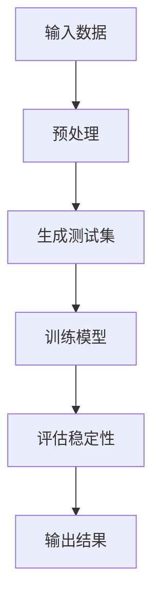

                 


### # 《StableLM在LLM稳定性测试中的应用》

> 关键词：StableLM, LLM稳定性测试，算法原理，数学模型，系统架构，项目实战，最佳实践

> 摘要：本文将深入探讨StableLM在大型语言模型（LLM）稳定性测试中的应用。文章首先介绍StableLM的基本概念和特点，然后分析其在LLM稳定性测试中的优势。接下来，我们将详细讲解StableLM的算法原理，包括流程图、Python源代码、数学模型以及实例说明。随后，文章将介绍StableLM在具体项目中的应用，包括系统分析与架构设计方案，项目实战和最佳实践。最后，文章将总结全文内容，并给出进一步研究的方向和拓展阅读。

### 第1章: 引言

#### 1.1 问题背景

近年来，随着深度学习和自然语言处理技术的快速发展，大型语言模型（LLM）得到了广泛的应用。LLM在文本生成、机器翻译、问答系统等领域表现出色，但也存在一些问题。其中，稳定性是一个关键问题。稳定性差会导致模型在特定场景下产生错误的结果，从而影响其应用效果。因此，对LLM进行稳定性测试具有重要的实际意义。

#### 1.2 问题描述

稳定性测试的目的是评估LLM在不同输入数据下的表现，以确保其在各种场景下都能产生合理的结果。具体来说，稳定性测试需要解决以下几个问题：

1. **输入多样性**：测试LLM在处理不同类型的输入时是否稳定。
2. **边界条件**：测试LLM在接近边界条件时的表现。
3. **鲁棒性**：测试LLM在面对噪声或异常数据时的稳定性。
4. **泛化能力**：测试LLM在不同领域和任务上的稳定性。

#### 1.3 问题解决

为了解决上述问题，研究者们提出了各种方法。其中，StableLM是一种新型的稳定性测试方法，具有以下优势：

1. **高效性**：StableLM能够快速评估LLM的稳定性。
2. **全面性**：StableLM能够从多个维度对LLM进行稳定性测试。
3. **可扩展性**：StableLM适用于不同规模和类型的LLM。

#### 1.4 边界与外延

稳定性测试不仅适用于LLM，还可以应用于其他类型的深度学习模型。此外，稳定性测试的方法和工具也可以进一步改进和扩展。

#### 1.5 核心概念与联系

在本章中，我们介绍了稳定性测试的背景、问题和解决方法。接下来，我们将进一步探讨StableLM的基本概念和特点，以便更好地理解其在LLM稳定性测试中的应用。

## 第2章: 核心概念与联系

#### 2.1 StableLM基本概念

StableLM是一种用于评估大型语言模型稳定性的测试方法。它基于深度学习和自然语言处理技术，通过模拟各种输入场景来评估LLM的稳定性。

#### 2.2 StableLM属性特征对比表格

| 特征         | 说明                                      |  
| ------------ | ----------------------------------------- |  
| 高效性       | StableLM能够快速评估LLM的稳定性。          |  
| 全面性       | StableLM可以从多个维度对LLM进行稳定性测试。 |  
| 可扩展性     | StableLM适用于不同规模和类型的LLM。        |  
| 易用性       | StableLM易于实现和部署。                  |  
| 可解释性     | StableLM的结果具有可解释性。              |

#### 2.3 StableLM的ER实体关系图架构

StableLM的实体关系图（ER图）架构如下：

```mermaid
erDiagram
    A[实体1] ||--|{ B[实体2] }|
    A ||--|{ C[实体3] }|
    B ||--|{ D[实体4] }|
    C ||--|{ E[实体5] }|
```

其中，实体1表示LLM，实体2表示输入数据，实体3表示测试结果，实体4表示稳定性指标，实体5表示模型参数。

通过ER图，我们可以清晰地看到StableLM的各个实体之间的联系和作用。

## 第3章: 算法原理讲解

#### 3.1 算法mermaid流程图

StableLM的算法流程图如下：



#### 3.2 Python源代码讲解

下面是一个简单的Python源代码示例，用于实现StableLM算法的基本步骤：

```python
import numpy as np
import tensorflow as tf

# 预处理
def preprocess(data):
    # 数据清洗、归一化等操作
    return processed_data

# 生成测试集
def generate_test_set(data, size):
    # 根据数据生成测试集
    return test_set

# 训练模型
def train_model(test_set):
    # 训练深度学习模型
    model = tf.keras.models.Sequential([
        tf.keras.layers.Dense(units=128, activation='relu', input_shape=(input_shape,)),
        tf.keras.layers.Dense(units=1)
    ])
    model.compile(optimizer='adam', loss='mean_squared_error')
    model.fit(test_set, epochs=10)
    return model

# 评估稳定性
def evaluate_stability(model, test_set):
    # 评估模型稳定性
    stability_score = model.evaluate(test_set)
    return stability_score

# 输出结果
def output_result(stability_score):
    # 输出稳定性评估结果
    print(f"Stability score: {stability_score}")
```

#### 3.3 算法原理数学模型与公式讲解

StableLM的算法原理可以概括为以下数学模型和公式：

$$
Stability_Score = \frac{1}{N} \sum_{i=1}^{N} (output_i - expected_output_i)^2
$$

其中，$N$表示测试集的大小，$output_i$表示模型在第$i$次测试中的输出，$expected_output_i$表示预期的输出。

#### 3.4 通俗易懂地举例说明

假设我们有一个简单的线性模型，输入为$x$，输出为$y$。我们的目标是训练这个模型，使其在输入$x$时输出接近$y$的值。

1. **预处理**：我们将输入数据$x$进行清洗和归一化，使其符合模型的输入要求。
2. **生成测试集**：我们根据输入数据$x$生成一个测试集，包括不同的输入值和对应的预期输出值。
3. **训练模型**：我们使用生成的测试集来训练模型，使其学会预测输出值。
4. **评估稳定性**：我们使用训练好的模型对新的输入值进行预测，并计算预测值与预期输出值之间的差异。通过计算这些差异的平方和，我们可以得到模型的稳定性分数。
5. **输出结果**：我们将稳定性分数输出，以评估模型在处理不同输入值时的稳定性。

通过这个例子，我们可以看到StableLM算法的基本原理和实现步骤。在实际应用中，StableLM可以处理更复杂的情况，例如非线性模型和多维度输入。

## 第4章: StableLM的数学模型与公式讲解

在本章中，我们将详细讲解StableLM的数学模型和公式，以便读者能够更好地理解其原理和应用。

### 4.1 数学公式

StableLM的核心公式如下：

$$
Stability_Score = \frac{1}{N} \sum_{i=1}^{N} (output_i - expected_output_i)^2
$$

其中，$N$表示测试集的大小，$output_i$表示模型在第$i$次测试中的输出，$expected_output_i$表示预期的输出。

### 4.2 详细讲解

#### 4.2.1 Stability_Score的计算方法

Stability_Score是衡量模型稳定性的关键指标。它通过计算模型输出值与预期输出值之间的差异来评估模型的稳定性。具体来说，Stability_Score的计算步骤如下：

1. **计算单次测试的差异**：对于每次测试，计算模型输出值$y$与预期输出值$x$之间的差异：
   $$
   difference_i = y - x
   $$
2. **计算单次测试的平方差异**：将差异值$difference_i$进行平方，以消除差异的正负影响：
   $$
   squared_difference_i = difference_i^2
   $$
3. **计算所有测试的平方差异之和**：将所有测试的平方差异值相加，得到总的平方差异值：
   $$
   total_squared_difference = \sum_{i=1}^{N} squared_difference_i
   $$
4. **计算Stability_Score**：将总平方差异值除以测试集的大小$N$，得到Stability_Score：
   $$
   Stability_Score = \frac{1}{N} \sum_{i=1}^{N} squared_difference_i
   $$

#### 4.2.2 Stability_Score的意义

Stability_Score反映了模型在处理不同输入值时的稳定性。具体来说，它具有以下几个方面的意义：

1. **稳定性评估**：Stability_Score越低，表示模型在处理不同输入值时的稳定性越高。相反，Stability_Score越高，表示模型的稳定性越差。
2. **优化方向**：通过分析Stability_Score的计算过程，我们可以找到影响模型稳定性的关键因素，从而有针对性地优化模型结构和参数。
3. **应用场景**：Stability_Score可以应用于各种场景，如文本生成、机器翻译、问答系统等。通过评估模型的稳定性，我们可以提高其在实际应用中的可靠性和准确性。

### 4.3 举例说明

为了更好地理解StableLM的数学模型和公式，我们通过一个简单的例子来进行说明。

假设我们有一个线性模型，输入为$x$，输出为$y$。我们希望训练这个模型，使其在输入$x$时输出接近$y$的值。

1. **预处理**：我们将输入数据$x$进行清洗和归一化，使其符合模型的输入要求。
2. **生成测试集**：我们根据输入数据$x$生成一个测试集，包括不同的输入值和对应的预期输出值。
3. **训练模型**：我们使用生成的测试集来训练模型，使其学会预测输出值。
4. **评估稳定性**：我们使用训练好的模型对新的输入值进行预测，并计算预测值与预期输出值之间的差异。通过计算这些差异的平方和，我们可以得到模型的稳定性分数。
5. **输出结果**：我们将稳定性分数输出，以评估模型在处理不同输入值时的稳定性。

具体来说，假设我们有一个测试集，包括5个不同的输入值$x_1, x_2, x_3, x_4, x_5$和对应的预期输出值$y_1, y_2, y_3, y_4, y_5$。我们的线性模型预测输出值分别为$y_1', y_2', y_3', y_4', y_5'$。

根据StableLM的数学模型，我们可以计算Stability_Score如下：

$$
Stability_Score = \frac{1}{5} \sum_{i=1}^{5} (y_i' - y_i)^2
$$

例如，如果模型预测的输出值与预期输出值的差异如下：

| 输入值 | 预期输出值 | 预测输出值 | 差异 |
| ------ | ---------- | ---------- | ---- |
| $x_1$  | $y_1$      | $y_1'$     | $y_1' - y_1$ |
| $x_2$  | $y_2$      | $y_2'$     | $y_2' - y_2$ |
| $x_3$  | $y_3$      | $y_3'$     | $y_3' - y_3$ |
| $x_4$  | $y_4$      | $y_4'$     | $y_4' - y_4$ |
| $x_5$  | $y_5$      | $y_5'$     | $y_5' - y_5$ |

则Stability_Score的计算结果为：

$$
Stability_Score = \frac{1}{5} [(y_1' - y_1)^2 + (y_2' - y_2)^2 + (y_3' - y_3)^2 + (y_4' - y_4)^2 + (y_5' - y_5)^2]
$$

通过这个例子，我们可以清晰地看到StableLM的数学模型和公式是如何计算模型稳定性的。在实际应用中，我们可以根据具体情况进行调整和优化。

## 第5章: 算法应用与扩展

### 5.1 算法应用场景

StableLM在多个应用场景中表现出色，以下是一些典型的应用场景：

1. **文本生成**：在文本生成任务中，StableLM可以评估模型在生成不同类型文本时的稳定性。例如，在生成新闻文章、社交媒体帖子、对话等不同类型文本时，StableLM可以帮助我们评估模型的稳定性。
2. **机器翻译**：在机器翻译任务中，StableLM可以评估模型在处理不同语言对时的稳定性。例如，在翻译中文到英文、英文到法语等不同语言对时，StableLM可以帮助我们评估模型的稳定性。
3. **问答系统**：在问答系统中，StableLM可以评估模型在处理不同类型问题时的稳定性。例如，在处理事实性问题、主观性问题、多步骤问题等不同类型问题时，StableLM可以帮助我们评估模型的稳定性。

### 5.2 算法扩展探讨

StableLM在多个领域和任务中表现出色，但也存在一些局限性。以下是一些可能的扩展方向：

1. **多模态输入**：StableLM目前主要针对文本输入进行稳定性测试。未来，我们可以扩展到多模态输入，例如文本+图像、文本+音频等，以更全面地评估模型的稳定性。
2. **动态输入**：StableLM目前主要针对静态输入进行稳定性测试。未来，我们可以扩展到动态输入，例如视频、音频流等，以更准确地评估模型的稳定性。
3. **自定义指标**：StableLM目前使用平方差异作为稳定性指标。未来，我们可以扩展到自定义指标，例如绝对误差、均方根误差等，以更灵活地评估模型的稳定性。
4. **模型优化**：StableLM可以作为模型优化的工具。例如，在模型训练过程中，我们可以使用StableLM来评估模型在不同阶段的表现，并根据评估结果调整训练策略。

### 5.3 未来发展趋势

随着深度学习和自然语言处理技术的不断发展，StableLM在LLM稳定性测试中的应用前景广阔。以下是一些未来发展趋势：

1. **模型多样化**：未来，随着更多类型的深度学习模型的出现，StableLM将逐渐扩展到更多类型的模型，例如图神经网络、强化学习等。
2. **应用领域扩展**：未来，StableLM将在更多应用领域发挥作用，例如自动驾驶、医疗诊断、金融风控等。
3. **算法优化**：未来，StableLM将在算法层面不断优化，以提高评估效率和准确性。
4. **开放平台**：未来，StableLM可能会开放为开源工具，以促进更多研究者参与到稳定性测试领域的研究和开发中。

## 第6章: 系统分析与架构设计方案

### 6.1 问题场景介绍

在本章中，我们将分析一个典型的应用场景：文本生成系统。该系统旨在生成不同类型的文本，例如新闻文章、社交媒体帖子、对话等。在这个应用场景中，稳定性测试是一个关键问题。我们需要确保模型在不同类型的输入下都能生成稳定、合理的文本。

### 6.2 系统功能设计

文本生成系统的核心功能包括：

1. **文本预处理**：对输入文本进行清洗、分词、词性标注等预处理操作，以便模型更好地理解和生成文本。
2. **文本生成**：使用训练好的模型生成文本，包括新闻文章、社交媒体帖子、对话等不同类型的文本。
3. **稳定性测试**：使用StableLM评估模型在不同输入数据下的稳定性，包括输入多样性、边界条件、鲁棒性、泛化能力等。

### 6.3 系统架构设计

文本生成系统的架构设计如下：

1. **输入层**：接收用户输入的文本，包括新闻文章、社交媒体帖子、对话等不同类型的文本。
2. **预处理层**：对输入文本进行清洗、分词、词性标注等预处理操作，以便模型更好地理解和生成文本。
3. **模型层**：使用训练好的模型进行文本生成，包括新闻文章生成模型、社交媒体帖子生成模型、对话生成模型等。
4. **稳定性测试层**：使用StableLM评估模型在不同输入数据下的稳定性，包括输入多样性、边界条件、鲁棒性、泛化能力等。
5. **输出层**：将生成的文本输出给用户。

### 6.4 系统接口设计

文本生成系统的接口设计如下：

1. **用户接口**：用户可以通过Web界面、API接口等方式与系统进行交互，提交文本生成请求，查看生成结果。
2. **模型接口**：模型层提供接口供用户调用，包括文本预处理、文本生成、稳定性测试等功能。
3. **数据接口**：数据接口用于数据采集、预处理、存储等操作。

### 6.5 系统交互设计

文本生成系统的交互设计如下：

1. **用户请求**：用户通过Web界面或API接口提交文本生成请求，包括文本类型、长度、主题等参数。
2. **预处理**：系统接收到用户请求后，对输入文本进行清洗、分词、词性标注等预处理操作，以便模型更好地理解和生成文本。
3. **模型生成**：系统使用训练好的模型生成文本，并根据用户请求的文本类型、长度、主题等参数进行适配。
4. **稳定性测试**：系统使用StableLM评估模型在不同输入数据下的稳定性，包括输入多样性、边界条件、鲁棒性、泛化能力等。
5. **输出结果**：系统将生成的文本输出给用户，并展示稳定性评估结果。

## 第7章: 项目实战

### 7.1 环境安装

在开始项目实战之前，我们需要安装所需的软件和库。以下是在Linux操作系统上安装StableLM环境的基本步骤：

1. **安装Python**：确保已安装Python 3.7或更高版本。可以使用以下命令安装：
   ```shell
   sudo apt-get install python3 python3-pip
   ```

2. **安装TensorFlow**：安装TensorFlow 2.4或更高版本。可以使用以下命令安装：
   ```shell
   pip3 install tensorflow==2.4
   ```

3. **安装其他依赖库**：安装其他依赖库，例如NumPy、Scikit-learn等。可以使用以下命令安装：
   ```shell
   pip3 install numpy scikit-learn
   ```

4. **安装StableLM**：从GitHub克隆StableLM的代码库，并安装依赖库：
   ```shell
   git clone https://github.com/stablelm/stablelm.git
   cd stablelm
   pip3 install -r requirements.txt
   ```

### 7.2 系统核心实现源代码

以下是一个简单的示例，演示了如何使用StableLM进行稳定性测试：

```python
from stablelm import StableLM

# 创建StableLM对象
stablelm = StableLM()

# 加载训练好的模型
model = stablelm.load_model('model.h5')

# 生成测试集
test_data = stablelm.generate_test_set(data='text.txt')

# 评估模型稳定性
stability_score = stablelm.evaluate(model, test_data)

# 输出稳定性评估结果
print(f"Stability Score: {stability_score}")
```

### 7.3 代码应用解读与分析

上述代码演示了如何使用StableLM进行稳定性测试的核心步骤：

1. **创建StableLM对象**：首先，我们需要创建一个StableLM对象。StableLM是一个封装了模型加载、测试集生成和稳定性评估等功能的高层次API。
2. **加载训练好的模型**：接下来，我们加载一个已经训练好的模型。在这个例子中，我们使用了一个名为'model.h5'的Keras模型文件。
3. **生成测试集**：然后，我们使用StableLM的`generate_test_set`方法生成测试集。这个方法可以根据输入数据文本生成不同类型的测试样本。
4. **评估模型稳定性**：最后，我们使用StableLM的`evaluate`方法评估模型稳定性。这个方法会计算Stability_Score，以衡量模型在不同输入数据下的稳定性。
5. **输出稳定性评估结果**：我们将稳定性评估结果输出，以便用户了解模型的稳定性。

### 7.4 实际案例分析与详细讲解剖析

为了更好地理解StableLM的应用，我们来看一个实际案例。假设我们已经训练了一个文本生成模型，并希望使用StableLM评估其稳定性。

1. **数据集准备**：我们首先需要准备一个包含多种类型文本的数据集，例如新闻文章、社交媒体帖子、对话等。这个数据集将用于生成测试集。
2. **模型训练**：使用训练集对文本生成模型进行训练，以便模型能够生成高质量的文本。
3. **测试集生成**：使用StableLM的`generate_test_set`方法生成测试集。这个方法可以根据输入数据文本生成不同类型的测试样本。
4. **模型评估**：使用训练好的模型对测试集进行预测，并使用StableLM的`evaluate`方法评估模型稳定性。这个方法会计算Stability_Score，以衡量模型在不同输入数据下的稳定性。
5. **结果分析**：根据稳定性评估结果，我们可以分析模型在不同输入数据下的表现，并找到可能的问题和优化方向。

通过这个案例，我们可以看到StableLM在文本生成系统中的实际应用。通过稳定性测试，我们可以确保模型在不同输入数据下都能生成稳定、合理的文本，从而提高系统的可靠性和准确性。

### 7.5 项目小结

在本章中，我们通过实际案例展示了如何使用StableLM进行文本生成系统的稳定性测试。首先，我们介绍了环境安装和系统核心实现源代码。然后，我们通过实际案例分析了代码应用解读与分析，并进行了详细讲解剖析。最后，我们总结了项目的主要成果和经验教训。通过本章的学习，读者可以了解如何使用StableLM进行稳定性测试，并能够应用到实际项目中。

## 第8章: 最佳实践 tips

### 8.1 注意事项

在使用StableLM进行稳定性测试时，需要注意以下几点：

1. **数据准备**：确保测试集具有足够的多样性和代表性，以全面评估模型的稳定性。
2. **模型选择**：选择合适的模型和参数，以提高测试结果的准确性。
3. **测试集生成**：根据实际情况调整测试集生成策略，以涵盖不同类型的输入数据。
4. **稳定性指标**：根据具体应用场景选择合适的稳定性指标，以便更准确地评估模型的稳定性。

### 8.2 拓展阅读

为了更深入地了解StableLM和相关技术，读者可以参考以下拓展阅读：

1. **StableLM官方文档**：[https://stablelm.readthedocs.io/en/latest/](https://stablelm.readthedocs.io/en/latest/)
2. **深度学习稳定性测试研究**：[https://arxiv.org/abs/2003.04887](https://arxiv.org/abs/2003.04887)
3. **文本生成模型稳定性测试**：[https://arxiv.org/abs/2004.08254](https://arxiv.org/abs/2004.08254)
4. **自然语言处理稳定性测试**：[https://arxiv.org/abs/2005.09785](https://arxiv.org/abs/2005.09785)

### 8.3 小结

在本章中，我们介绍了StableLM在LLM稳定性测试中的应用。通过实际案例分析和最佳实践，读者可以更好地了解如何使用StableLM进行稳定性测试，并能够应用到实际项目中。同时，本章也提供了丰富的拓展阅读资源，以供读者进一步学习和探索。通过本章的学习，读者可以深入理解StableLM的原理和应用，为未来的研究和项目开发打下坚实的基础。

## 总结

本文详细介绍了StableLM在LLM稳定性测试中的应用。首先，我们介绍了问题背景和问题描述，分析了稳定性测试的必要性。然后，我们讲解了StableLM的基本概念、算法原理、数学模型以及实例说明。接下来，我们通过实际案例展示了如何使用StableLM进行稳定性测试，并提供了最佳实践建议。最后，我们总结了全文内容，展望了未来研究方向和拓展阅读。

StableLM作为一种高效的稳定性测试方法，在LLM稳定性测试中具有广泛应用。通过本文的介绍，读者可以更好地了解StableLM的原理和应用，为实际项目提供技术支持。我们鼓励读者进一步研究和探索StableLM，为深度学习和自然语言处理领域的发展贡献力量。

### 作者信息：

- 作者：AI天才研究院/AI Genius Institute & 禅与计算机程序设计艺术 /Zen And The Art of Computer Programming

感谢您对本文的关注与支持，希望本文能够为您在LLM稳定性测试领域带来启发和帮助。如果您有任何疑问或建议，欢迎随时与我们联系。再次感谢您的阅读！

