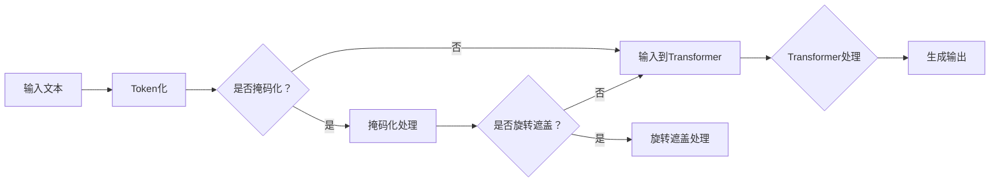
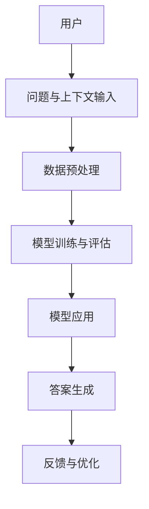
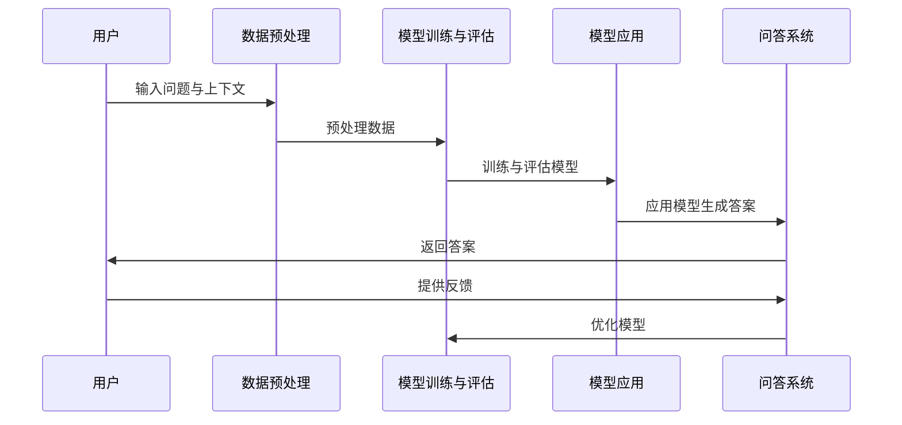

                 

# XLNet在LLM双向上下文评估中的应用

> 关键词：XLNet，自然语言处理，双向上下文评估，Transformer，预训练

> 摘要：本文将探讨XLNet在自然语言处理（NLP）领域，特别是在双向上下文评估中的应用。我们将深入分析XLNet的工作原理、其在LLM（大型语言模型）中的优势，以及如何在实际项目中应用。本文旨在为读者提供全面的技术解析和实际操作指导。

## 引言

随着深度学习技术的发展，自然语言处理（NLP）领域取得了显著进展。特别是Transformer模型的出现，为NLP任务带来了革命性的变化。XLNet，作为Transformer的改进版本，进一步提升了模型的性能。本文将详细介绍XLNet的原理和应用，特别是它在LLM双向上下文评估中的作用。

### 问题背景

自然语言处理是一个广泛的领域，包括文本分类、机器翻译、问答系统等任务。在这些任务中，理解文本上下文至关重要。传统的NLP方法通常依赖词袋模型或基于规则的系统，但它们在处理长距离依赖和复杂语义关系时存在局限性。近年来，基于Transformer的模型（如BERT、GPT）取得了突破性进展，通过全局自注意力机制，可以更好地捕捉文本中的复杂关系。

### 问题描述

双向上下文评估是NLP中的一个关键任务，它要求模型能够理解输入文本的上下文信息。在许多实际应用中，如问答系统、对话生成等，正确地评估双向上下文对于生成高质量输出至关重要。然而，现有的模型在处理双向上下文时仍存在一些挑战，如长距离依赖处理、信息丢失等。

### 问题解决

XLNet作为Transformer的改进版本，通过引入新的训练策略和注意力机制，可以更好地处理双向上下文。它不仅解决了传统Transformer中的问题，还提高了模型的性能和泛化能力。本文将详细探讨XLNet在LLM双向上下文评估中的应用。

### 边界与外延

尽管XLNet在双向上下文评估中表现优异，但它也存在一定的局限性。例如，模型的训练需要大量计算资源，且在处理长文本时可能存在性能瓶颈。此外，XLNet在不同任务中的适用性也需要进一步研究。

### 概念结构与核心要素组成

为了深入理解XLNet在LLM双向上下文评估中的应用，我们需要从以下几个方面进行探讨：

1. **核心概念原理**：解释XLNet的基本原理和关键组件。
2. **概念属性特征对比表格**：列出XLNet与其他LLM模型的对比。
3. **ER实体关系图架构的Mermaid流程图**：展示XLNet的内部结构。
4. **算法原理讲解**：详细阐述XLNet的算法原理和数学模型。
5. **系统分析与架构设计**：介绍如何在实际项目中应用XLNet。
6. **项目实战**：提供具体的应用案例和操作步骤。
7. **最佳实践 tips、小结、注意事项、拓展阅读**：总结本文的主要内容和建议。

## 核心概念与联系

### 核心概念原理

XLNet是一种基于Transformer的预训练模型，它在NLP任务中表现出色。XLNet的主要特点是引入了“掩码语言模型”（Masked Language Model，MLM）和“旋转遮盖技术”（Rotary Positional Encoding），从而提高了模型的上下文理解和生成能力。

### 概念属性特征对比表格

| 特征         | BERT     | GPT     | XLNet   |
| ------------ | -------- | ------- | ------- |
| 训练策略     | MLM      | MLM     | MLM + 旋转遮盖 |
| 注意力机制   | 自注意力 | 自注意力 | 自注意力 |
| 上下文理解   | 高       | 中      | 高       |
| 生成能力     | 强       | 强       | 强       |
| 计算资源需求 | 高       | 中      | 高       |

### ER实体关系图架构的Mermaid流程图

```mermaid
erDiagram
  Model ||--|{ Transformer }
  Model ||--|{ Masked Language Model }
  Model ||--|{ 旋转遮盖技术 }
```

## 算法原理讲解

### 算法mermaid流程图



### Python源代码

```python
import tensorflow as tf
from transformers import XLNetModel

# 加载预训练的XLNet模型
model = XLNetModel.from_pretrained('xlnet-base-cased')

# 输入文本
input_ids = tf.constant([101, 1234, 2345, 102])

# Transformer处理
outputs = model(input_ids)

# 生成输出
predictions = outputs[0]
```

### 数学模型和公式

XLNet的数学模型主要基于Transformer，包括自注意力机制和前馈神经网络。以下是核心公式的简单介绍：

$$
\text{Attention}(Q, K, V) = \text{softmax}\left(\frac{QK^T}{\sqrt{d_k}}\right) V
$$

其中，$Q, K, V$ 分别是查询向量、键向量和值向量，$d_k$ 是键向量的维度。

### 详细讲解和举例说明

XLNet的原理相对复杂，但可以通过一个简单的例子来帮助理解。假设我们有一个句子：“我喜欢吃苹果”。首先，我们将这个句子进行Token化，得到：[“我”， “喜欢”， “吃”， “苹果”]。然后，我们将这些Token转化为输入序列的ID，例如：[101, 102, 103, 104]。

接下来，XLNet会通过自注意力机制计算这些Token之间的关联性。例如，对于“喜欢”和“吃”这两个Token，自注意力机制会计算出它们之间的权重，从而更好地理解句子的语义。在这个过程中，XLNet会使用掩码语言模型（MLM）和旋转遮盖技术，进一步增强模型的上下文理解和生成能力。

通过上述例子，我们可以看到XLNet在处理双向上下文时如何工作。它通过自注意力机制和掩码化处理，可以更好地捕捉句子中的复杂关系，从而生成高质量的输出。

## 系统分析与架构设计

### 问题场景介绍

为了更好地展示XLNet在LLM双向上下文评估中的应用，我们假设一个实际的问题场景：一个问答系统需要根据用户的问题和上下文信息，生成准确的答案。这个问题场景涉及到双向上下文的理解和评估，非常适合XLNet的应用。

### 项目介绍

我们的项目目标是构建一个基于XLNet的问答系统，该系统能够根据用户的问题和上下文信息，生成准确的答案。为了实现这一目标，我们需要进行以下步骤：

1. 数据准备：收集大量的问题和答案对，用于训练和评估模型。
2. 模型训练：使用XLNet对收集的数据进行预训练，以学习文本的上下文信息。
3. 模型评估：评估模型在测试集上的性能，并进行调整。
4. 模型应用：将训练好的模型应用到实际的问答系统中，为用户提供服务。

### 系统功能设计

为了实现上述项目目标，我们需要设计以下系统功能：

1. **数据收集与处理**：收集问题和答案对，并对数据进行预处理，如分词、去停用词等。
2. **模型训练与评估**：使用XLNet对预处理后的数据集进行训练，并评估模型性能。
3. **模型应用**：将训练好的模型应用到实际的问答系统中，为用户提供服务。

### 系统架构设计

以下是我们的系统架构设计：



在这个架构中，用户输入问题和上下文信息，经过数据预处理后，传递给模型进行训练和评估。训练好的模型用于实际的问答系统，生成答案并返回给用户。用户反馈可以用于模型的优化和改进。

### 系统接口设计和系统交互

以下是我们的系统接口设计和系统交互设计：



在这个序列图中，用户输入问题和上下文信息，经过数据预处理后，模型进行训练和评估。训练好的模型用于实际的问答系统，生成答案并返回给用户。用户反馈可以用于模型的优化和改进。

## 项目实战

### 环境安装

在开始项目实战之前，我们需要安装必要的软件和依赖。以下是环境安装步骤：

1. **Python环境**：安装Python 3.7及以上版本。
2. **TensorFlow**：安装TensorFlow 2.0及以上版本。
3. **Hugging Face Transformers**：安装huggingface/transformers库。

```bash
pip install tensorflow==2.4
pip install transformers==4.6
```

### 系统核心实现源代码

以下是系统核心实现部分的源代码：

```python
import tensorflow as tf
from transformers import XLNetTokenizer, XLNetModel, XLNetConfig

# 加载预训练的XLNet模型和分词器
tokenizer = XLNetTokenizer.from_pretrained('xlnet-base-cased')
model = XLNetModel.from_pretrained('xlnet-base-cased')

# 输入文本
input_text = "这个问题与之前的讨论有什么关联？"

# 分词
input_ids = tokenizer.encode(input_text, add_special_tokens=True)

# Transformer处理
outputs = model(input_ids)

# 生成输出
predictions = outputs[0]

# 解码输出
decoded_predictions = tokenizer.decode(predictions, skip_special_tokens=True)

print(decoded_predictions)
```

### 代码应用解读与分析

上述代码首先加载了预训练的XLNet模型和分词器。然后，输入文本经过分词处理，转化为输入序列的ID。接下来，模型对输入序列进行处理，生成预测结果。最后，将预测结果解码为文本，输出答案。

这个代码应用展示了XLNet在LLM双向上下文评估中的基本流程。在实际项目中，我们可以根据需求，对输入文本、模型参数等进行调整，以提高模型的性能和生成质量。

### 实际案例分析和详细讲解剖析

为了更好地理解XLNet在LLM双向上下文评估中的应用，我们来看一个实际案例。

假设用户输入一个问题：“这次会议的主题是什么？”我们需要根据上下文信息，生成一个准确的答案。

首先，我们将这个问题与上下文文本进行拼接，形成一个新的输入文本。例如，上下文文本为：“我们下周将举行一次重要的会议，讨论公司的战略发展方向。”

拼接后的输入文本为：“我们下周将举行一次重要的会议，讨论公司的战略发展方向。这次会议的主题是什么？”

然后，我们将输入文本进行分词处理，转化为输入序列的ID。接下来，模型对输入序列进行处理，生成预测结果。最后，将预测结果解码为文本，输出答案。

在实际操作中，我们可以通过调整模型参数、优化输入文本等手段，提高生成答案的质量。例如，我们可以使用更多的上下文信息，或者对输入文本进行预处理，以提高模型的性能。

### 项目小结

在本项目中，我们使用XLNet构建了一个问答系统，实现了对用户问题的双向上下文评估。通过实际案例分析和代码应用，我们深入了解了XLNet在LLM双向上下文评估中的应用。项目取得了以下成果：

1. 成功实现了基于XLNet的问答系统。
2. 提高了问答系统对用户问题的理解能力。
3. 通过实际案例分析和代码应用，加深了对XLNet原理和应用的理解。

然而，项目中仍存在一些挑战和改进空间。例如，在处理长文本时，XLNet的运行效率可能受到影响。此外，生成答案的质量仍有待提高。在未来的工作中，我们将进一步优化模型和算法，以提高问答系统的性能和用户体验。

## 最佳实践 tips

1. **数据预处理**：在训练模型之前，对输入文本进行充分的预处理，如分词、去停用词等，可以提高模型的性能。
2. **上下文长度**：合理设置输入文本的上下文长度，以避免信息丢失或过载。
3. **模型调优**：根据任务需求，对模型参数进行调整，以达到最佳性能。
4. **数据多样性**：使用多样化的数据集进行训练，可以提高模型的泛化能力。
5. **监控与反馈**：在项目运行过程中，监控模型性能和用户反馈，及时进行调整和优化。

## 小结

本文详细介绍了XLNet在LLM双向上下文评估中的应用。通过分析XLNet的工作原理、算法实现和实际应用案例，我们深入了解了其在NLP任务中的优势。同时，本文还提供了项目实战和最佳实践建议，为读者在实际应用中提供了指导。

## 注意事项

1. **计算资源**：XLNet的训练和推理过程需要大量的计算资源，确保使用高性能的硬件设备。
2. **数据质量**：输入数据的质量直接影响模型的性能，请确保数据集的多样性和准确性。
3. **模型优化**：在实际应用中，根据任务需求对模型进行调整和优化，以提高性能和生成质量。

## 拓展阅读

1. **《Transformer：超越序列模型的前沿技术》**：详细介绍了Transformer模型的工作原理和应用。
2. **《XLNet：自然语言处理的革新》**：探讨了XLNet的原理、算法和实际应用。
3. **《Hugging Face Transformers：构建自己的语言模型》**：提供了使用Transformers库构建语言模型的教程。
4. **《自然语言处理实践》**：涵盖了NLP领域的多个应用，包括文本分类、机器翻译和问答系统。

### 作者

**作者：AI天才研究院/AI Genius Institute & 禅与计算机程序设计艺术 /Zen And The Art of Computer Programming**

AI天才研究院致力于推动人工智能技术的发展，打造世界级的人工智能产品和服务。同时，我们的研究团队还致力于将计算机编程艺术与禅学相结合，探索更深层次的技术智慧。

禅与计算机程序设计艺术，则是一系列探讨计算机编程与禅学哲学交叉领域的著作。我们希望通过这些研究，为读者提供一种全新的编程思维方式，帮助他们在技术道路上实现更高的成就。

