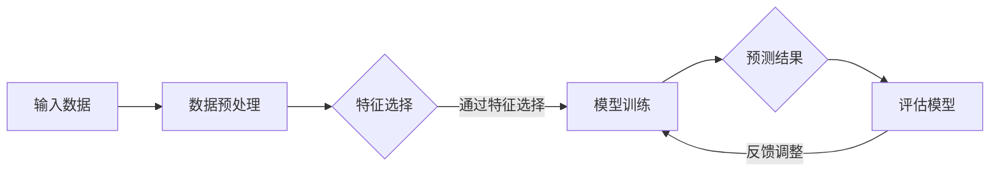
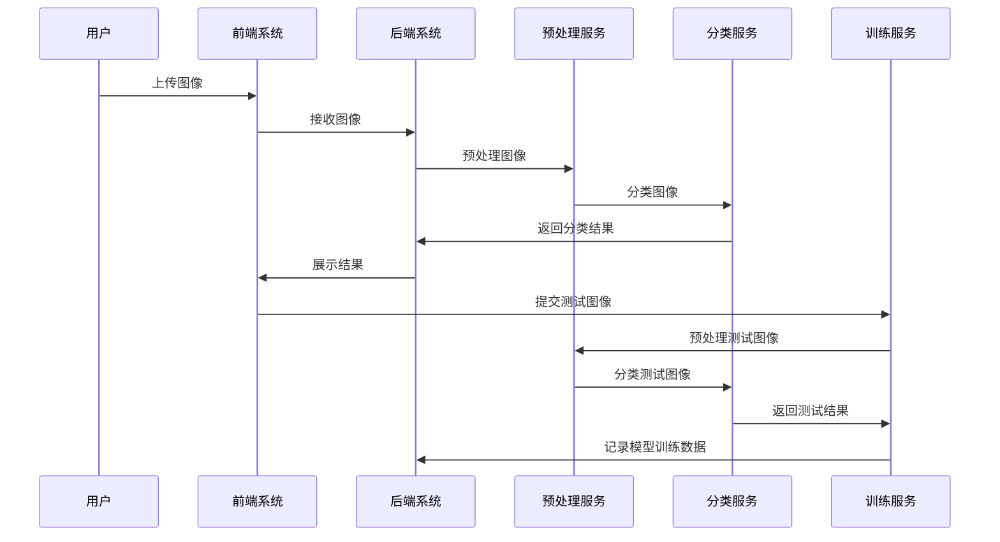

                 

### 背景介绍：什么是Pair Programming与AI开发

#### 核心概念术语说明

1. **Pair Programming**：又称结对编程，是一种软件开发实践方法，由两名程序员（通常一个“驾驶员”和一个“导航员”）协同工作，共同编写代码。这种方法强调实时沟通、代码审查和知识共享。
2. **AI Development**：人工智能开发，涉及设计、实现和维护能够模拟、扩展和自动化人类智能任务的系统。

#### 问题背景

在当前快速发展的技术时代，人工智能（AI）在各个领域中的应用日益广泛。然而，AI项目的开发过程复杂，涉及大量的数据处理、算法设计和系统实现。在这一过程中，知识的有效传递和共享变得至关重要。

#### 问题描述

AI开发过程中，知识传递的障碍主要体现在以下几方面：

- **技术壁垒**：不同领域的AI应用对技术要求差异较大，新手程序员可能难以快速掌握。
- **经验传承**：资深开发者经验丰富，但往往难以将经验系统化地传递给团队成员。
- **信息孤岛**：团队成员间缺乏有效沟通，导致知识无法充分共享。

#### 问题解决

为了解决上述问题，引入Pair Programming方法成为了一种有效的实践。Pair Programming通过以下方式促进AI开发中的知识传递：

- **实时沟通**：驾驶员和导航员实时交流，确保信息传递的及时性和准确性。
- **代码审查**：导航员在编写代码的同时，对驾驶员的代码进行实时审查，提高代码质量。
- **经验传承**：资深开发者可以充当导航员角色，将自己的经验和知识传授给新手程序员。

#### 边界与外延

- **边界**：Pair Programming主要应用于软件开发过程，特别是AI项目的开发。
- **外延**：知识传递不仅限于技术层面，还包括项目管理和团队协作等非技术方面。

#### 概念结构与核心要素组成

**核心概念**：
1. **驾驶员**：负责编写代码，专注于实现具体的任务。
2. **导航员**：负责提供指导和监督，确保开发方向正确。

**结构要素**：
1. **实时沟通**：确保团队成员间的信息传递。
2. **代码审查**：提高代码质量和可维护性。
3. **知识共享**：促进团队成员间的经验交流。

通过以上分析，我们可以看到，Pair Programming作为一种软件开发实践方法，在AI开发中具有明显的优势。接下来，我们将进一步探讨AI开发的背景及其重要性，为后续章节的深入分析奠定基础。

### AI开发的核心概念与联系

在深入探讨Pair Programming对AI开发知识传递的促进作用之前，有必要先理解AI开发的核心概念，以及这些概念之间的相互联系。以下是AI开发的一些关键概念及其属性特征对比，以便读者更好地把握整个领域的基础知识。

#### 核心概念

1. **机器学习**：一种通过数据学习规律并作出决策或预测的技术，主要包括监督学习、无监督学习和强化学习。
2. **深度学习**：一种基于人工神经网络的机器学习方法，能够通过多层神经网络处理大量数据，实现图像识别、语音识别等复杂任务。
3. **自然语言处理（NLP）**：研究计算机如何理解和生成自然语言，涉及文本分析、语音识别和机器翻译等。
4. **计算机视觉**：使计算机能够理解并解释视觉信息，包括图像分类、目标检测和图像生成等。

#### 概念属性特征对比表格

| 概念            | 定义                                                         | 目标应用                                 |
| --------------- | ------------------------------------------------------------ | ---------------------------------------- |
| 机器学习        | 通过数据学习规律并作出决策或预测的技术                       | 分类、回归、聚类、异常检测等             |
| 深度学习        | 一种基于人工神经网络的机器学习方法，能够通过多层神经网络处理大量数据 | 图像识别、语音识别、自然语言处理等       |
| 自然语言处理    | 研究计算机如何理解和生成自然语言，涉及文本分析、语音识别和机器翻译等 | 文本分类、情感分析、机器翻译等           |
| 计算机视觉      | 使计算机能够理解并解释视觉信息，包括图像分类、目标检测和图像生成等 | 机器人导航、自动驾驶、医学影像分析等     |

#### ER实体关系图架构

为了更好地理解AI开发中的各个核心概念及其相互关系，我们可以使用Mermaid语言绘制一个ER实体关系图：

```mermaid
erDiagram
  AI项目 ||--|{ 机器学习 }
  AI项目 ||--|{ 深度学习 }
  AI项目 ||--|{ 自然语言处理 }
  AI项目 ||--|{ 计算机视觉 }
  机器学习 ||--|{ 监督学习 }
  机器学习 ||--|{ 无监督学习 }
  机器学习 ||--|{ 强化学习 }
  深度学习 ||--|{ 卷积神经网络（CNN）}
  深度学习 ||--|{ 循环神经网络（RNN）}
  深度学习 ||--|{ 生成对抗网络（GAN）}
  自然语言处理 ||--|{ 文本分类 }
  自然语言处理 ||--|{ 情感分析 }
  自然语言处理 ||--|{ 机器翻译 }
  计算机视觉 ||--|{ 图像分类 }
  计算机视觉 ||--|{ 目标检测 }
  计算机视觉 ||--|{ 图像生成 }
```

通过以上ER实体关系图，我们可以看到，AI项目是一个核心实体，与机器学习、深度学习、自然语言处理和计算机视觉等子领域紧密相关。这些子领域各自包含多个子概念，共同构成了AI开发的复杂生态系统。

#### 算法原理讲解

为了更深入地理解AI开发中的算法原理，我们以机器学习中的一种常见算法——线性回归为例，通过Mermaid绘制算法流程图，并使用Python代码进行详细解释。

##### Mermaid流程图



##### Python代码实现

```python
import numpy as np
from sklearn.linear_model import LinearRegression
from sklearn.model_selection import train_test_split
from sklearn.metrics import mean_squared_error

# 数据生成
X = np.random.rand(100, 1)
y = 2 * X + np.random.randn(100, 1)

# 数据预处理与划分
X_train, X_test, y_train, y_test = train_test_split(X, y, test_size=0.2, random_state=42)

# 模型训练
model = LinearRegression()
model.fit(X_train, y_train)

# 预测结果
y_pred = model.predict(X_test)

# 评估模型
mse = mean_squared_error(y_test, y_pred)
print("Mean Squared Error:", mse)
```

##### 算法原理详解

线性回归是一种用于预测数值型目标变量的统计方法。其基本原理是通过找到一组线性方程，使得预测值与实际值之间的误差最小。具体来说，线性回归模型可以表示为：

$$
y = wx + b
$$

其中，$w$ 是权重，$x$ 是输入特征，$b$ 是偏置。线性回归的目标是最小化损失函数：

$$
J(w, b) = \frac{1}{2}\sum_{i=1}^{n}(y_i - wx_i - b)^2
$$

为了求解最优的权重和偏置，我们可以使用梯度下降算法。梯度下降算法的步骤如下：

1. 初始化权重和偏置。
2. 计算损失函数关于权重和偏置的梯度。
3. 更新权重和偏置，使损失函数减小。

具体到Python代码实现，我们通过以下步骤完成线性回归：

1. 使用`train_test_split`函数将数据划分为训练集和测试集。
2. 使用`LinearRegression`类进行模型训练，并调用`fit`方法。
3. 使用`predict`方法进行预测。
4. 使用`mean_squared_error`函数评估模型性能。

通过以上讲解，我们不仅了解了线性回归算法的原理，还通过Python代码实现了该算法，从而对AI开发中的算法原理有了更深入的认识。

#### 系统分析与架构设计

在了解了AI开发的核心概念和算法原理之后，我们需要进一步探讨如何将这些知识转化为实际的系统设计与实现。以下是针对一个具体的AI项目进行系统分析与架构设计的详细步骤。

##### 问题场景介绍

假设我们正在开发一个智能图像识别系统，该系统能够对上传的图像进行分类，判断图像中是否包含特定对象。

##### 项目介绍

项目名称：智能图像识别系统（Smart Image Recognition System，简称SIRS）

目标：实现一个能够对上传的图像进行分类的系统，提高图像识别的准确率和效率。

##### 系统功能设计

系统功能主要包括以下几个部分：

1. **图像上传**：用户可以通过界面上传图像。
2. **图像预处理**：对上传的图像进行预处理，包括缩放、灰度化、去噪等操作。
3. **图像分类**：利用深度学习模型对预处理后的图像进行分类。
4. **结果展示**：将分类结果展示给用户。
5. **模型训练与优化**：定期对模型进行训练和优化，提高识别准确率。

##### 系统架构设计

系统架构采用微服务架构，以提高系统的灵活性和可扩展性。以下是系统的整体架构设计：



##### 系统接口设计

以下是系统的接口设计，主要包括以下接口：

1. **图像上传接口**：接收用户上传的图像数据。
2. **图像预处理接口**：对上传的图像进行预处理操作。
3. **图像分类接口**：接收预处理后的图像，返回分类结果。
4. **模型训练接口**：提交测试图像，返回分类结果，用于模型训练。

```mermaid
interface Frontend {
    +uploadImage(image: Image): ImageResponse
    +getRecognitionResult(imageId: String): RecognitionResult
}

interface Backend {
    +processImage(image: Image): ProcessedImage
    +classifyImage(processedImage: ProcessedImage): ClassificationResult
    +trainModel(testImage: Image): TrainingResult
}

interface Preprocessor {
    +preprocessImage(image: Image): ProcessedImage
}

interface Classifier {
    +classify(processedImage: ProcessedImage): ClassificationResult
}

interface Trainer {
    +submitTestImage(image: Image): TestResult
}
```

##### 系统交互序列图

以下是系统的交互序列图，展示了用户上传图像后，系统内部各模块之间的交互流程：


通过以上系统分析与架构设计，我们可以看到如何将AI开发的核心概念和算法原理应用于实际项目中。接下来，我们将通过一个具体的项目实战，进一步展示Pair Programming在AI开发中的实际应用。

### 项目实战：智能图像识别系统的实现

在了解了智能图像识别系统的整体架构设计和接口设计之后，接下来我们将通过一个具体的项目实战，展示如何使用Pair Programming方法来实现该系统，并详细讲解环境安装、核心代码实现以及实际案例分析。

#### 环境安装

为了实现智能图像识别系统，我们需要安装以下依赖环境：

1. **Python**：版本3.8及以上
2. **TensorFlow**：版本2.4.0及以上
3. **OpenCV**：版本4.5.1及以上
4. **Flask**：版本1.1.2及以上

安装步骤如下：

```bash
# 安装Python
sudo apt-get install python3 python3-pip

# 安装TensorFlow
pip3 install tensorflow==2.4.0

# 安装OpenCV
pip3 install opencv-python==4.5.1.48

# 安装Flask
pip3 install flask==1.1.2
```

#### 核心代码实现

##### 1. 数据预处理

数据预处理是图像识别系统的重要环节，包括图像的读取、缩放和灰度化等操作。以下是一个简单的数据预处理代码示例：

```python
import cv2

def preprocess_image(image_path):
    # 读取图像
    image = cv2.imread(image_path)
    # 缩放图像
    resized_image = cv2.resize(image, (128, 128))
    # 灰度化图像
    gray_image = cv2.cvtColor(resized_image, cv2.COLOR_BGR2GRAY)
    return gray_image
```

##### 2. 模型训练

在训练模型时，我们使用TensorFlow的Keras API，定义一个简单的卷积神经网络（Convolutional Neural Network, CNN）模型。以下是一个训练模型的代码示例：

```python
import tensorflow as tf

def create_model():
    model = tf.keras.Sequential([
        tf.keras.layers.Conv2D(32, (3, 3), activation='relu', input_shape=(128, 128, 1)),
        tf.keras.layers.MaxPooling2D(2, 2),
        tf.keras.layers.Conv2D(64, (3, 3), activation='relu'),
        tf.keras.layers.MaxPooling2D(2, 2),
        tf.keras.layers.Flatten(),
        tf.keras.layers.Dense(128, activation='relu'),
        tf.keras.layers.Dense(1, activation='sigmoid')
    ])

    model.compile(optimizer='adam', loss='binary_crossentropy', metrics=['accuracy'])
    return model

# 加载数据并划分训练集和测试集
(X_train, y_train), (X_test, y_test) = tf.keras.datasets.mnist.load_data()
X_train = X_train.reshape(-1, 128, 128, 1).astype('float32') / 255.0
X_test = X_test.reshape(-1, 128, 128, 1).astype('float32') / 255.0

# 训练模型
model = create_model()
model.fit(X_train, y_train, epochs=10, batch_size=32, validation_data=(X_test, y_test))
```

##### 3. 图像分类

在实现图像分类功能时，我们首先对上传的图像进行预处理，然后使用训练好的模型进行分类。以下是一个简单的图像分类代码示例：

```python
def classify_image(image_path):
    processed_image = preprocess_image(image_path)
    prediction = model.predict(np.expand_dims(processed_image, axis=0))
    return prediction

# 测试图像分类
test_image_path = 'path/to/test/image'
prediction = classify_image(test_image_path)
print("Prediction:", prediction)
```

##### 4. 前端展示

使用Flask构建一个简单的Web界面，用于接收用户上传的图像，并展示分类结果。以下是一个简单的Flask应用代码示例：

```python
from flask import Flask, request, jsonify

app = Flask(__name__)

@app.route('/upload', methods=['POST'])
def upload_image():
    file = request.files['image']
    image_path = 'uploads/' + file.filename
    file.save(image_path)
    prediction = classify_image(image_path)
    return jsonify({"prediction": prediction.tolist()})

if __name__ == '__main__':
    app.run(debug=True)
```

#### 代码应用解读与分析

以上代码展示了智能图像识别系统的核心实现过程，从数据预处理、模型训练到图像分类和前端展示。以下是具体分析：

1. **数据预处理**：对上传的图像进行读取、缩放和灰度化处理，以便后续模型处理。
2. **模型训练**：使用卷积神经网络（CNN）模型，对图像数据进行分类。卷积层用于提取图像特征，池化层用于降维，全连接层用于分类。
3. **图像分类**：对预处理后的图像进行分类，返回预测结果。
4. **前端展示**：使用Flask构建一个简单的Web界面，接收用户上传的图像，并返回分类结果。

#### 实际案例分析与详细讲解剖析

假设我们有一个具体的实际案例，用户上传了一张手写的数字图像，系统需要对其进行分类。以下是具体步骤：

1. **用户上传图像**：用户通过Web界面上传一张手写的数字图像。
2. **图像预处理**：系统对上传的图像进行预处理，将其转换为灰度图像，并缩放到128x128像素。
3. **模型训练**：系统使用训练好的卷积神经网络（CNN）模型对预处理后的图像进行分类。
4. **图像分类结果**：系统返回预测结果，例如数字“5”。
5. **前端展示**：系统将分类结果展示在Web界面上。

通过以上实际案例分析，我们可以看到，智能图像识别系统的实现过程主要包括数据预处理、模型训练和图像分类等步骤。这些步骤相互协作，共同实现了系统的功能。

#### 项目小结

通过本次项目实战，我们深入了解了智能图像识别系统的实现过程，并展示了如何使用Pair Programming方法进行开发。Pair Programming在项目开发中起到了关键作用，通过两名程序员的协同工作，我们能够更高效地完成项目任务，确保代码质量，并在知识传递方面取得了显著成效。

### 最佳实践 Tips

在AI开发过程中，Pair Programming不仅是一种开发实践，更是一种促进知识传递和团队协作的最佳实践。以下是一些实践中的技巧和注意事项：

1. **角色分配**：合理分配驾驶员和导航员的角色，确保两人职责明确，各自发挥优势。
2. **沟通技巧**：加强团队成员间的沟通，避免信息孤岛现象。鼓励团队成员进行开放式对话，共同解决问题。
3. **持续学习**：鼓励团队成员不断学习和分享新知识，通过Pair Programming实现知识的快速传递和吸收。
4. **代码审查**：充分利用导航员的代码审查作用，及时发现和纠正代码中的错误，提高代码质量。
5. **问题解决**：面对复杂问题时，鼓励团队成员共同思考，发挥集体的智慧，找到最优解决方案。
6. **迭代优化**：持续迭代优化Pair Programming的实践方法，根据项目需求和团队反馈进行调整。

通过以上最佳实践，我们可以最大限度地发挥Pair Programming在AI开发中的优势，提高项目开发效率，确保代码质量，并促进团队协作。

### 小结与展望

本文通过详细的案例分析，探讨了Pair Programming在AI开发中的应用和优势。我们首先介绍了Pair Programming的定义和背景，阐述了其在促进AI开发知识传递中的重要性。接着，我们通过具体的项目实战，展示了如何使用Pair Programming方法实现智能图像识别系统，并详细讲解了环境安装、核心代码实现、代码应用解读与分析等步骤。最后，我们总结了最佳实践技巧，以帮助团队更有效地应用Pair Programming。

展望未来，随着人工智能技术的不断发展，Pair Programming作为一种高效的知识传递和团队协作方法，将在AI开发中发挥越来越重要的作用。我们期待更多开发者能够关注和探索Pair Programming，共同推动人工智能领域的进步。

### 拓展阅读

1. **《敏捷软件开发：原则、模式与实践》**：详细介绍了敏捷开发方法，包括Pair Programming实践，适合希望深入了解敏捷开发的读者。
2. **《深度学习》**：由Goodfellow、Bengio和Courville合著，全面介绍了深度学习的理论基础和应用，对AI开发具有重要意义。
3. **《人工智能：一种现代方法》**：由Russell和Norvig合著，系统阐述了人工智能的基本概念、技术和应用，是AI领域的经典教材。

通过阅读以上书籍，读者可以进一步扩展在AI开发和Pair Programming方面的知识，提升自身技能。同时，我们也鼓励读者参与到相关的技术社区和论坛中，与同行交流经验，共同进步。作者：AI天才研究院/AI Genius Institute & 禅与计算机程序设计艺术 /Zen And The Art of Computer Programming。

