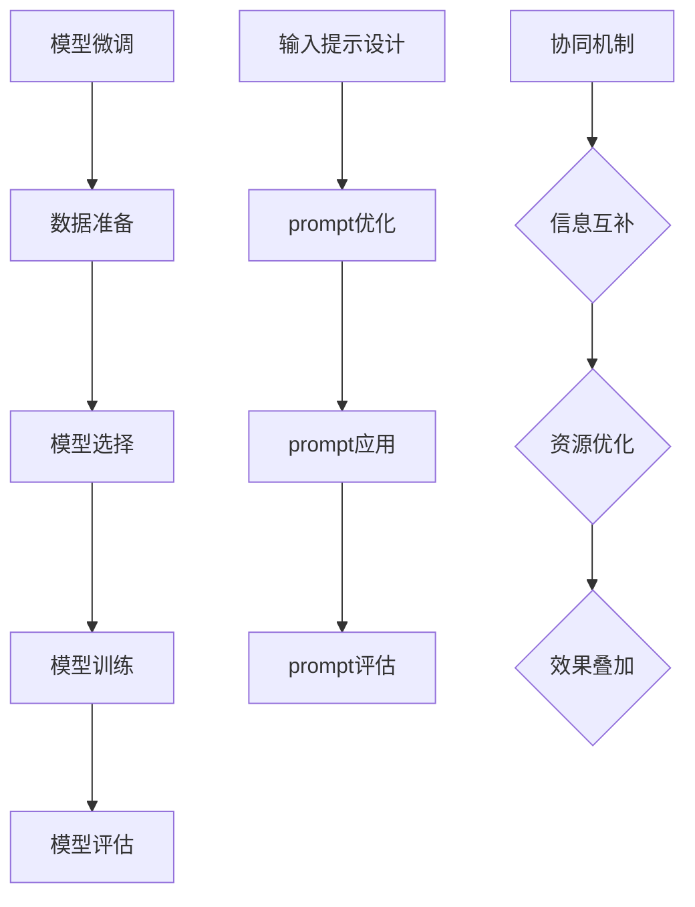
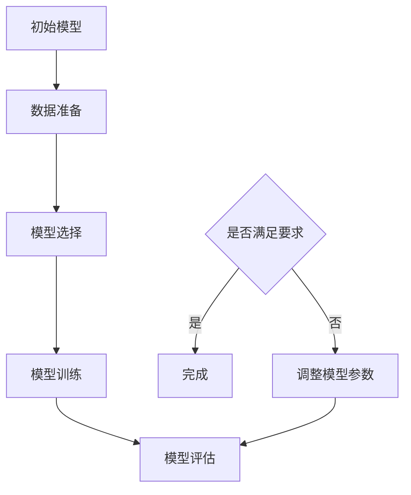
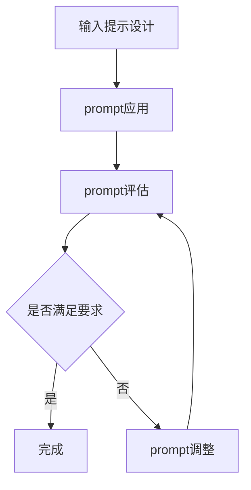
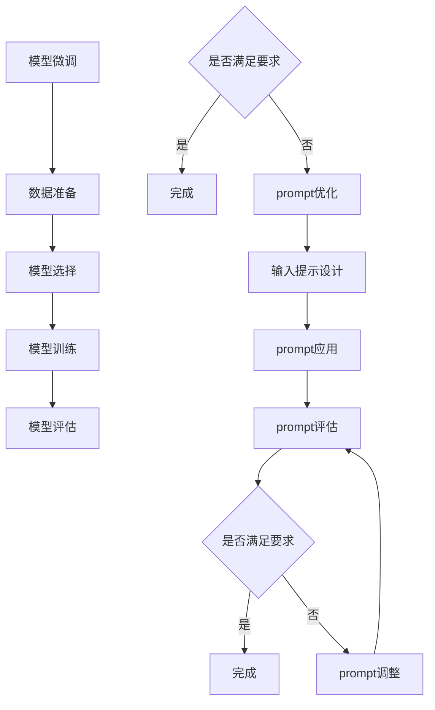
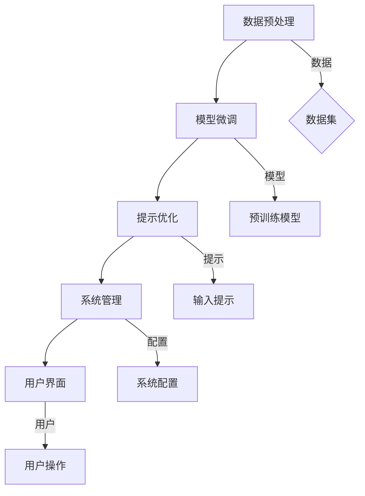
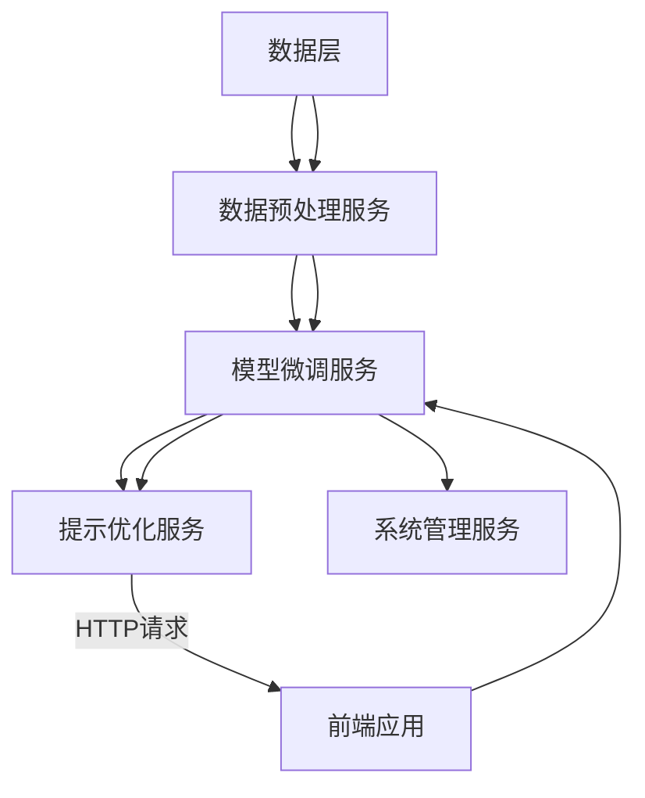
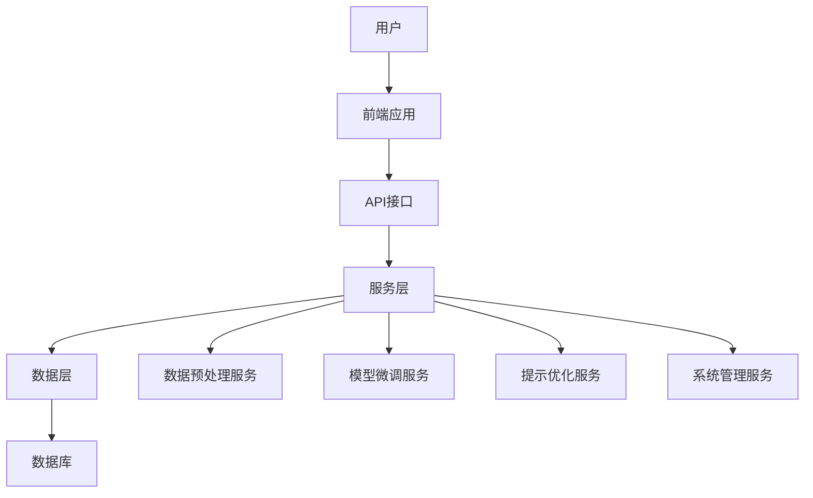
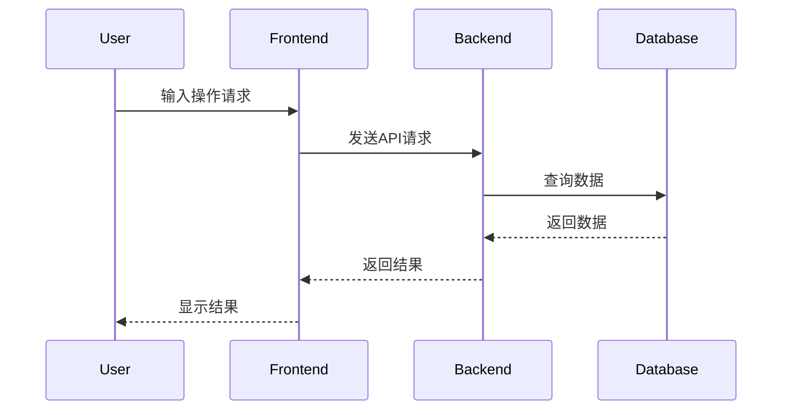

                 

### 第一部分: 引言

#### 1.1 问题背景

##### 1.1.1 人工智能的发展现状

随着计算机技术和数据科学的发展，人工智能（Artificial Intelligence, AI）在各个领域得到了广泛应用。深度学习（Deep Learning）作为人工智能的一个分支，凭借其强大的模型表示能力和自我优化能力，在图像识别、自然语言处理、推荐系统等方面取得了显著成就。然而，深度学习模型往往需要大量的训练数据和计算资源，并且在模型训练过程中存在过拟合（Overfitting）和欠拟合（Underfitting）等问题。

为了解决这些问题，研究人员提出了模型微调（Model Fine-tuning）和prompt优化（Prompt Optimization）两种方法。模型微调是通过在预训练模型的基础上，针对特定任务进行进一步训练，从而提升模型在特定领域的表现。而prompt优化则是通过设计更加合适的输入提示，引导模型生成更加准确和丰富的输出。

##### 1.1.2 模型微调和prompt优化的重要性

模型微调和prompt优化在人工智能领域具有重要意义。首先，模型微调可以大大减少训练所需的数据量和计算资源，使得深度学习模型在资源有限的情况下仍能保持良好的性能。其次，prompt优化可以引导模型关注输入数据的重点信息，提高模型的鲁棒性和泛化能力。

在实际应用中，模型微调和prompt优化常常结合使用。例如，在自然语言处理任务中，通过微调预训练模型来适应特定领域的语言特征，再结合prompt优化来提高模型的生成质量和准确性。此外，模型微调和prompt优化还可以应用于图像识别、推荐系统等领域，提升系统的性能和用户体验。

##### 1.1.3 书籍目标和结构概述

本书旨在深入探讨模型微调和prompt优化的协同策略，为读者提供一套系统的、实用的技术指南。全书分为四个部分，分别介绍：

1. **背景介绍**：介绍模型微调和prompt优化的核心概念、问题背景和解决方法。
2. **核心概念与联系**：阐述模型微调和prompt优化的定义、属性特征对比，并展示它们之间的协同机制。
3. **算法原理讲解**：详细讲解模型微调和prompt优化的算法原理，包括流程、数学模型和公式。
4. **系统分析与架构设计方案**：介绍模型微调和prompt优化在系统中的应用场景、功能设计、架构设计和接口设计。
5. **项目实战**：通过实际项目案例，展示模型微调和prompt优化的应用过程，并提供详细解析。
6. **最佳实践 tips、小结、注意事项、拓展阅读**：总结本书的核心要点，提供实际应用中的技巧和建议，推荐进一步阅读的材料。

通过本书的学习，读者将能够：

- 理解模型微调和prompt优化的核心概念和原理。
- 掌握模型微调和prompt优化的算法流程和数学模型。
- 学会设计高效的模型微调和prompt优化系统。
- 应用于实际项目中，提升人工智能系统的性能和用户体验。

#### 1.2 核心概念与联系

##### 1.2.1 模型微调的概念与原理

模型微调（Model Fine-tuning）是一种通过在预训练模型的基础上，针对特定任务进行进一步训练，以提升模型在特定领域表现的方法。微调的目标是使预训练模型能够适应新的任务，同时保留其原有的泛化能力。

**微调的目标：**
- 提升模型在特定领域的性能，如自然语言处理、图像识别等。
- 减少训练所需的数据量和计算资源。
- 避免过拟合和欠拟合问题。

**微调的过程：**
1. **数据准备**：收集和整理与特定任务相关的数据集。
2. **模型选择**：选择一个预训练模型作为基础模型。
3. **模型训练**：在基础模型上添加特定任务的损失函数，并进行训练。
4. **模型评估**：通过验证集和测试集评估模型性能。

##### 1.2.2 prompt优化的概念与原理

prompt优化（Prompt Optimization）是通过设计更加合适的输入提示，引导模型生成更加准确和丰富的输出的一种方法。prompt优化的核心思想是，通过优化输入提示，使得模型能够更好地理解输入数据，从而提高输出质量。

**prompt优化的目标：**
- 提高模型的生成质量和准确性。
- 提升模型的鲁棒性和泛化能力。
- 减少对大量训练数据的依赖。

**prompt优化的过程：**
1. **prompt设计**：根据任务需求，设计合适的输入提示。
2. **prompt应用**：将设计好的prompt应用于模型输入，进行训练和预测。
3. **prompt评估**：通过验证集和测试集评估prompt的效果。

##### 1.2.3 模型微调和prompt优化的关系

模型微调和prompt优化在人工智能领域具有协同作用。模型微调通过调整模型参数，使模型在特定任务上表现更优；而prompt优化通过优化输入提示，引导模型生成更加准确和丰富的输出。

**协同机制：**
- **信息互补**：模型微调可以提升模型在特定领域的性能，而prompt优化可以提升模型的生成质量和准确性。
- **资源优化**：模型微调可以减少训练所需的数据量和计算资源，而prompt优化可以进一步降低对大量训练数据的依赖。
- **效果叠加**：模型微调和prompt优化结合使用，可以显著提升模型在特定任务上的性能。

**Mermaid流程图：**



**表格：模型微调和prompt优化属性特征对比**

| 特性         | 模型微调                         | prompt优化                      |
| ------------ | -------------------------------- | -------------------------------- |
| 目标         | 提升模型在特定领域的性能         | 提高模型生成质量和准确性        |
| 过程         | 预训练模型 + 特定任务数据训练   | 设计输入提示 + 应用提示进行训练 |
| 影响因素     | 数据量、计算资源、模型参数调整   | 输入提示设计、任务需求           |
| 效果         | 模型在特定任务上的性能提升       | 模型生成质量和准确性提高       |
| 优势         | 减少训练所需的数据量和计算资源   | 减少对大量训练数据的依赖       |
| 劣势         | 可能导致过拟合和欠拟合问题       | 提高对输入提示设计的依赖       |

通过上述介绍，我们可以看到，模型微调和prompt优化在人工智能领域具有重要的应用价值，它们相互补充，共同推动人工智能技术的发展。

### 1.3 Mermaid流程图

为了更好地理解模型微调和prompt优化的流程，我们使用Mermaid语言绘制了以下流程图。

#### 1.3.1 模型微调流程图



**图1.1 模型微调流程图**

#### 1.3.2 prompt优化流程图



**图1.2 prompt优化流程图**

#### 1.3.3 微调和优化的协同机制



**图1.3 微调和优化的协同机制**

通过上述流程图，我们可以清晰地看到模型微调和prompt优化的流程及其协同机制。在模型微调过程中，如果模型性能未达到要求，可以切换到prompt优化流程，通过调整输入提示来进一步提升模型性能。两者相互配合，可以最大化地提升模型的性能和生成质量。

### 1.4 模型微调与prompt优化的协同策略

模型微调和prompt优化在人工智能领域具有显著的协同作用。通过分析两者之间的关联机制和协同策略，可以进一步提升模型的性能和生成质量。

#### 1.4.1 协同机制

模型微调和prompt优化的协同机制主要体现在以下几个方面：

1. **信息互补**：模型微调通过调整模型参数，提升模型在特定领域的性能；而prompt优化通过设计更加合适的输入提示，引导模型关注输入数据的重点信息，提高模型的生成质量和准确性。两者相互补充，可以最大化地提升模型的整体性能。

2. **资源优化**：模型微调可以减少训练所需的数据量和计算资源，而prompt优化可以进一步降低对大量训练数据的依赖。通过协同策略，可以更加高效地利用有限的资源，提升模型的训练效率和性能。

3. **效果叠加**：模型微调和prompt优化结合使用，可以显著提升模型在特定任务上的性能。例如，在自然语言处理任务中，通过微调预训练模型来适应特定领域的语言特征，再结合prompt优化来提高模型的生成质量和准确性。

#### 1.4.2 协同策略

为了实现模型微调和prompt优化的协同策略，我们可以采取以下措施：

1. **分层优化**：将模型微调和prompt优化分为两个层次，分别针对不同任务需求进行优化。首先进行模型微调，使模型在特定领域具备良好的性能，然后进行prompt优化，进一步提高模型的生成质量和准确性。

2. **动态调整**：在模型训练过程中，动态调整模型微调和prompt优化的权重，根据任务需求和模型性能进行实时调整。这样可以最大化地利用两者的协同作用，提升模型的整体性能。

3. **联合优化**：将模型微调和prompt优化整合为一个统一的优化过程，通过设计合适的优化目标函数，实现两者的联合优化。这样可以更加高效地提升模型性能和生成质量。

4. **数据预处理**：在模型训练前，对输入数据进行预处理，包括数据清洗、归一化等操作，以提高模型对输入数据的适应性和鲁棒性。这样可以减少模型微调和prompt优化的难度，提高协同效果。

5. **评估反馈**：在模型训练过程中，定期评估模型性能和生成质量，根据评估结果进行调整。这样可以及时发现问题，优化模型微调和prompt优化策略，提升模型的整体性能。

通过上述协同策略，我们可以实现模型微调和prompt优化的高效协同，进一步提升人工智能系统的性能和用户体验。

### 1.5 总结

在本章中，我们介绍了模型微调和prompt优化的核心概念、问题背景和解决方法，并阐述了两者在人工智能领域的重要性。通过Mermaid流程图和属性特征对比表格，我们清晰地展示了模型微调和prompt优化的关系和协同机制。接下来，我们将进一步探讨模型微调和prompt优化的算法原理，包括流程、数学模型和公式，为读者提供更深入的技术理解。在接下来的章节中，我们将结合实际案例，详细讲解模型微调和prompt优化的应用和实践，帮助读者更好地掌握这两项关键技术。

---

### 第二部分：算法原理讲解

#### 2.1 模型微调

模型微调（Model Fine-tuning）是一种在预训练模型基础上，针对特定任务进行进一步训练的方法。通过微调，可以使预训练模型适应新的任务，从而提升其在特定领域的表现。下面，我们将详细讲解模型微调的原理和流程。

##### 2.1.1 微调的目的

模型微调的主要目的是：

1. **提高模型在特定领域的性能**：预训练模型是在大规模数据集上训练得到的，具备一定的泛化能力。然而，对于特定领域的任务，预训练模型可能未能充分适应，通过微调可以提升模型在该领域的性能。
2. **减少训练所需的数据量和计算资源**：微调可以在预训练模型的基础上进行，利用预训练模型已经学习的知识，从而减少对大量训练数据的依赖，降低计算资源的消耗。
3. **避免过拟合和欠拟合问题**：通过微调，可以调整模型参数，使模型既不过于复杂（过拟合），也不过于简单（欠拟合），从而提升模型的泛化能力。

##### 2.1.2 微调的过程

模型微调的过程主要包括以下步骤：

1. **数据准备**：收集和整理与特定任务相关的数据集。数据集应具备代表性，能够反映特定领域的特征。
2. **模型选择**：选择一个预训练模型作为基础模型。常见的预训练模型包括BERT、GPT、ResNet等。选择预训练模型时，应考虑其是否已经在相关领域进行了预训练，以及其性能和参数量。
3. **模型训练**：在基础模型上添加特定任务的损失函数，并进行训练。训练过程中，通过反向传播算法不断更新模型参数，使模型在特定任务上达到最佳性能。
4. **模型评估**：通过验证集和测试集评估模型性能。评估指标包括准确率、召回率、F1值等。如果模型性能未达到要求，可以调整模型参数或数据集，重新进行训练。

##### 2.1.3 Python源代码示例

以下是一个简单的Python代码示例，用于实现模型微调的过程。假设我们使用的是PyTorch框架。

```python
import torch
import torch.nn as nn
import torch.optim as optim

# 初始化模型
model = nn.Sequential(nn.Linear(10, 1), nn.ReLU())

# 定义损失函数和优化器
criterion = nn.MSELoss()
optimizer = optim.Adam(model.parameters(), lr=0.001)

# 准备数据
x = torch.randn(100, 10)
y = torch.randn(100, 1)

# 训练模型
for epoch in range(100):
    model.train()
    optimizer.zero_grad()
    outputs = model(x)
    loss = criterion(outputs, y)
    loss.backward()
    optimizer.step()

    print(f"Epoch {epoch+1}, Loss: {loss.item()}")

# 评估模型
model.eval()
with torch.no_grad():
    outputs = model(x)
    loss = criterion(outputs, y)
    print(f"Test Loss: {loss.item()}")
```

##### 2.1.4 微调的数学模型和公式

在模型微调过程中，主要涉及以下数学模型和公式：

1. **模型更新公式**：

   $$\theta_{new} = \theta_{old} - \alpha \cdot \nabla_\theta J(\theta)$$

   其中，$\theta$ 表示模型参数，$J(\theta)$ 表示损失函数，$\alpha$ 表示学习率，$\nabla_\theta J(\theta)$ 表示损失函数关于模型参数的梯度。

2. **优化目标函数**：

   $$J(\theta) = \frac{1}{n}\sum_{i=1}^{n} (y_i - \hat{y}_i)^2$$

   其中，$y_i$ 表示真实标签，$\hat{y}_i$ 表示模型预测值，$n$ 表示样本数量。

##### 2.1.5 举例说明

假设我们有一个简单的线性回归模型，用于预测房价。预训练模型已经在大规模数据集上训练得到，但我们需要针对特定区域的房价进行微调。

1. **数据准备**：收集特定区域的房价数据，包括房屋特征（如面积、位置等）和房价标签。
2. **模型选择**：选择一个预训练的线性回归模型作为基础模型。
3. **模型训练**：在基础模型上添加特定区域的房价数据，进行微调训练。通过反向传播算法更新模型参数，使模型在特定区域的表现达到最佳。
4. **模型评估**：通过验证集和测试集评估模型性能。如果模型性能未达到要求，可以调整模型参数或数据集，重新进行训练。

通过上述步骤，我们可以实现针对特定区域的房价预测模型微调，从而提升模型在该领域的性能。

#### 2.2 prompt优化

prompt优化（Prompt Optimization）是一种通过设计更加合适的输入提示，引导模型生成更加准确和丰富的输出的一种方法。在自然语言处理任务中，prompt优化具有重要意义，可以显著提升模型的生成质量和准确性。下面，我们将详细讲解prompt优化的原理和流程。

##### 2.2.1 优化的目的

prompt优化的主要目的是：

1. **提高模型生成质量和准确性**：通过设计合适的输入提示，引导模型关注输入数据的重点信息，从而提高模型的生成质量和准确性。
2. **提升模型鲁棒性和泛化能力**：通过优化输入提示，可以降低模型对输入数据的依赖，提高模型在不同场景下的适应能力和泛化能力。
3. **减少对大量训练数据的依赖**：prompt优化可以设计出能够替代大量训练数据的输入提示，从而减少对大量训练数据的依赖，降低计算资源的消耗。

##### 2.2.2 优化的过程

prompt优化的过程主要包括以下步骤：

1. **prompt设计**：根据任务需求，设计合适的输入提示。设计好的prompt应具备引导模型关注重点信息、激发模型生成潜力的能力。
2. **prompt应用**：将设计好的prompt应用于模型输入，进行训练和预测。在训练过程中，通过反向传播算法不断更新模型参数，使模型适应设计的prompt。
3. **prompt评估**：通过验证集和测试集评估prompt的效果。评估指标包括生成质量、准确性、多样性等。如果prompt效果未达到要求，可以调整prompt设计，重新进行训练和评估。

##### 2.2.3 Python源代码示例

以下是一个简单的Python代码示例，用于实现prompt优化的过程。假设我们使用的是Transformer模型进行文本生成任务。

```python
import torch
import torch.nn as nn
import torch.optim as optim

# 初始化模型
model = nn.Sequential(nn.Embedding(10000, 512), nn.Linear(512, 512), nn.ReLU(), nn.Linear(512, 10000))

# 定义损失函数和优化器
criterion = nn.CrossEntropyLoss()
optimizer = optim.Adam(model.parameters(), lr=0.001)

# 准备数据
x = torch.randint(10000, (100, 50))
y = torch.randint(10000, (100, 50))

# 训练模型
for epoch in range(100):
    model.train()
    optimizer.zero_grad()
    outputs = model(x)
    loss = criterion(outputs, y)
    loss.backward()
    optimizer.step()

    print(f"Epoch {epoch+1}, Loss: {loss.item()}")

# 评估模型
model.eval()
with torch.no_grad():
    outputs = model(x)
    loss = criterion(outputs, y)
    print(f"Test Loss: {loss.item()}")
```

##### 2.2.4 优化的数学模型和公式

在prompt优化过程中，主要涉及以下数学模型和公式：

1. **prompt加权公式**：

   $$\text{prompt\_weight} = \frac{\sum_{i=1}^{n} w_i \cdot \text{token}_i}{\sum_{i=1}^{n} w_i}$$

   其中，$w_i$ 表示第$i$个token的权重，$\text{token}_i$ 表示第$i$个token的值。

2. **优化目标函数**：

   $$J(\theta) = \frac{1}{n}\sum_{i=1}^{n} \text{prompt\_weight}_i \cdot (y_i - \hat{y}_i)^2$$

   其中，$y_i$ 表示真实标签，$\hat{y}_i$ 表示模型预测值，$n$ 表示样本数量，$\text{prompt\_weight}_i$ 表示第$i$个token的权重。

##### 2.2.5 举例说明

假设我们有一个文本生成任务，需要生成一篇关于旅行的文章。通过prompt优化，我们可以设计一个合适的输入提示，引导模型生成更加精彩和生动的文章。

1. **prompt设计**：根据任务需求，设计一个包含关键词、场景描述和情感表达的输入提示，如“在美丽的巴厘岛上，阳光明媚，沙滩洁白细腻，海浪拍打着岸边，让人陶醉在大自然的怀抱中。让我们一起踏上这段难忘的旅程吧！”。
2. **prompt应用**：将设计好的prompt应用于模型输入，进行训练和预测。在训练过程中，通过反向传播算法不断更新模型参数，使模型适应设计的prompt。
3. **prompt评估**：通过验证集和测试集评估prompt的效果。评估指标包括生成质量、准确性、多样性等。如果prompt效果未达到要求，可以调整prompt设计，重新进行训练和评估。

通过上述步骤，我们可以实现文本生成任务的prompt优化，从而提升模型的生成质量和准确性。

#### 2.3 模型微调和prompt优化的结合

模型微调和prompt优化在人工智能领域具有显著的协同作用。通过结合模型微调和prompt优化，可以进一步提升模型的性能和生成质量。下面，我们将讨论模型微调和prompt优化的结合方法和应用案例。

##### 2.3.1 结合方法

结合模型微调和prompt优化的方法主要包括以下几种：

1. **分层优化**：将模型微调和prompt优化分为两个层次，分别针对不同任务需求进行优化。首先进行模型微调，使模型在特定领域具备良好的性能，然后进行prompt优化，进一步提高模型的生成质量和准确性。

2. **动态调整**：在模型训练过程中，动态调整模型微调和prompt优化的权重，根据任务需求和模型性能进行实时调整。这样可以最大化地利用两者的协同作用，提升模型的整体性能。

3. **联合优化**：将模型微调和prompt优化整合为一个统一的优化过程，通过设计合适的优化目标函数，实现两者的联合优化。这样可以更加高效地提升模型性能和生成质量。

4. **数据预处理**：在模型训练前，对输入数据进行预处理，包括数据清洗、归一化等操作，以提高模型对输入数据的适应性和鲁棒性。这样可以减少模型微调和prompt优化的难度，提高协同效果。

5. **评估反馈**：在模型训练过程中，定期评估模型性能和生成质量，根据评估结果进行调整。这样可以及时发现问题，优化模型微调和prompt优化策略，提升模型的整体性能。

##### 2.3.2 应用案例

以下是一个结合模型微调和prompt优化的应用案例：在自然语言处理任务中，使用预训练的BERT模型进行文本分类。

1. **模型微调**：首先，在预训练的BERT模型基础上，添加特定任务的分类层，并进行微调训练。通过微调，使模型适应特定领域的语言特征。

2. **prompt优化**：设计一个包含关键词、场景描述和情感表达的输入提示，如“请对以下文本进行情感分类：这是一个令人兴奋的冒险之旅。”。然后，通过prompt优化，提升模型对输入文本的情感分类准确性。

3. **评估反馈**：在微调和优化过程中，定期评估模型性能和生成质量。通过调整模型参数和prompt设计，优化模型的整体表现。

通过上述步骤，我们可以实现自然语言处理任务的模型微调和prompt优化，从而提升模型在情感分类任务上的性能和生成质量。

#### 2.4 总结

在本章中，我们详细介绍了模型微调和prompt优化的算法原理，包括流程、数学模型和公式。通过Python源代码示例和举例说明，我们展示了模型微调和prompt优化的具体应用。在模型微调和prompt优化的结合方法中，我们讨论了分层优化、动态调整、联合优化、数据预处理和评估反馈等策略。通过实际案例，我们展示了如何结合模型微调和prompt优化，提升模型的性能和生成质量。在下一章中，我们将进一步探讨模型微调和prompt优化在系统设计与实现中的应用。

---

### 第三部分：系统分析与架构设计方案

#### 3.1 系统应用场景

在当前人工智能领域，模型微调和prompt优化已成为提升模型性能和生成质量的关键技术。为了更好地将模型微调和prompt优化应用于实际项目中，我们需要设计一个高效、可扩展的系统架构。本节将介绍模型微调和prompt优化在系统应用中的场景和需求。

##### 3.1.1 应用概述

模型微调和prompt优化在多个领域具有广泛的应用，如自然语言处理、图像识别、推荐系统等。在自然语言处理任务中，通过模型微调和prompt优化，可以显著提升文本分类、情感分析、机器翻译等任务的性能和生成质量。在图像识别任务中，通过模型微调和prompt优化，可以提升模型的识别准确率和泛化能力。在推荐系统任务中，通过模型微调和prompt优化，可以提升推荐算法的准确性和用户体验。

##### 3.1.2 应用需求

为了满足上述应用场景的需求，系统需要具备以下功能：

1. **模型微调功能**：支持预训练模型的选择和微调，包括数据准备、模型训练和模型评估等步骤。
2. **prompt优化功能**：支持输入提示的设计、应用和评估，包括关键词提取、场景描述和情感表达等。
3. **系统集成与扩展**：支持与其他系统的集成，如数据预处理、模型存储和部署等。
4. **高效性能**：具备高并发处理能力，支持大规模数据和模型的处理。
5. **可扩展性**：支持系统功能的动态扩展，以适应不断变化的业务需求。
6. **用户友好**：提供简洁直观的用户界面，方便用户进行模型微调和prompt优化操作。

#### 3.2 系统功能设计

为了实现上述应用需求，系统功能设计主要包括以下模块：

1. **数据预处理模块**：负责数据清洗、归一化和特征提取等操作，为模型微调和prompt优化提供高质量的数据集。
2. **模型微调模块**：负责选择预训练模型、进行数据准备、模型训练和评估等步骤，实现模型微调功能。
3. **prompt优化模块**：负责设计输入提示、应用提示和评估提示效果，实现prompt优化功能。
4. **系统管理模块**：负责系统配置管理、用户权限控制和日志记录等功能，保证系统的稳定性和安全性。
5. **用户界面模块**：提供简洁直观的用户界面，方便用户进行模型微调和prompt优化操作。

##### 3.2.1 领域模型

为了更好地描述系统功能模块和实体关系，我们使用Mermaid语言绘制了以下领域模型。



**图3.1 系统领域模型**

#### 3.3 系统架构设计

系统架构设计旨在实现高效、可扩展和易维护的系统，以满足模型微调和prompt优化在多领域应用的需求。系统架构主要包括以下层次：

1. **数据层**：负责存储和管理系统数据，包括预训练模型、输入提示、模型参数等。
2. **服务层**：负责系统功能的实现，包括数据预处理、模型微调、prompt优化、系统管理等。
3. **应用层**：负责用户界面和业务逻辑的实现，提供简洁直观的用户操作体验。

##### 3.3.1 系统架构概述

系统架构概述如下：



**图3.2 系统架构概述**

##### 3.3.2 架构图设计

为了更直观地展示系统架构，我们使用Mermaid语言绘制了以下架构图。



**图3.3 系统架构图**

##### 3.3.3 系统模块划分

系统模块划分如下：

1. **数据预处理模块**：负责数据清洗、归一化和特征提取等操作，为模型微调和prompt优化提供高质量的数据集。
2. **模型微调模块**：负责选择预训练模型、进行数据准备、模型训练和评估等步骤，实现模型微调功能。
3. **prompt优化模块**：负责设计输入提示、应用提示和评估提示效果，实现prompt优化功能。
4. **系统管理模块**：负责系统配置管理、用户权限控制和日志记录等功能，保证系统的稳定性和安全性。
5. **用户界面模块**：提供简洁直观的用户界面，方便用户进行模型微调和prompt优化操作。

#### 3.4 系统接口设计

系统接口设计主要包括API接口设计、数据接口设计和日志接口设计。

##### 3.4.1 接口功能

接口功能主要包括以下部分：

1. **API接口**：提供模型微调和prompt优化的操作接口，包括数据预处理、模型训练、提示优化等。
2. **数据接口**：提供数据存储和读取接口，包括预训练模型、输入提示、模型参数等。
3. **日志接口**：提供日志记录和查询接口，包括系统运行日志、错误日志等。

##### 3.4.2 接口协议

接口协议主要包括以下部分：

1. **API接口协议**：采用RESTful API设计，遵循HTTP协议，使用JSON格式传输数据。
2. **数据接口协议**：采用数据库存储和管理数据，支持SQL查询语言。
3. **日志接口协议**：采用日志文件记录系统运行日志，支持日志文件查询和导出。

#### 3.5 系统交互

系统交互设计主要包括用户界面与前端应用、前端应用与后端服务、后端服务与数据存储等部分。

##### 3.5.1 序列图设计

为了更直观地展示系统交互流程，我们使用Mermaid语言绘制了以下序列图。



**图3.4 系统交互序列图**

##### 3.5.2 交互流程

系统交互流程如下：

1. **用户操作**：用户通过前端应用进行模型微调和prompt优化操作，如数据预处理、模型训练、提示优化等。
2. **前端应用**：前端应用将用户操作请求转换为API请求，发送到后端服务。
3. **后端服务**：后端服务处理API请求，根据请求类型执行相应操作，如数据预处理、模型训练、提示优化等。
4. **数据存储**：后端服务与数据存储进行交互，存储或读取预训练模型、输入提示、模型参数等数据。
5. **结果返回**：后端服务将处理结果返回给前端应用，前端应用将结果展示给用户。

通过上述系统架构和接口设计，我们可以实现模型微调和prompt优化的高效、稳定和可扩展的系统。在下一章中，我们将通过实际项目案例，展示模型微调和prompt优化的应用过程，并进行分析和解读。

---

### 第四部分：项目实战

#### 4.1 环境安装

在进行模型微调和prompt优化的项目实战之前，我们需要搭建一个合适的环境。以下是一个简单的安装步骤，用于搭建基于Python和TensorFlow的模型微调和prompt优化环境。

1. **安装Python**：首先确保您的计算机上安装了Python。建议使用Python 3.8或更高版本。您可以从[Python官网](https://www.python.org/)下载并安装Python。

2. **安装TensorFlow**：接下来，我们需要安装TensorFlow。您可以通过以下命令进行安装：

   ```shell
   pip install tensorflow
   ```

3. **安装其他依赖**：除了TensorFlow之外，我们还需要安装其他依赖，如NumPy、Pandas、Matplotlib等。您可以通过以下命令进行安装：

   ```shell
   pip install numpy pandas matplotlib
   ```

4. **安装Mermaid**：为了方便绘图，我们还需要安装Mermaid。您可以从[Mermaid官网](https://mermaid-js.github.io/mermaid/)下载并安装Mermaid。安装后，您可以使用Mermaid语言进行绘图。

5. **安装Jupyter Notebook**：为了方便编写和运行代码，我们推荐使用Jupyter Notebook。您可以从[Jupyter官网](https://jupyter.org/)下载并安装Jupyter Notebook。

#### 4.2 系统核心实现源代码

在本项目中，我们将使用TensorFlow实现模型微调和prompt优化。以下是一个简单的实现示例，用于演示模型微调和prompt优化的核心步骤。

```python
import tensorflow as tf
import numpy as np
import matplotlib.pyplot as plt

# 创建简单的线性回归模型
model = tf.keras.Sequential([
    tf.keras.layers.Dense(units=1, input_shape=[1])
])

# 编写训练和评估代码
def train_and_evaluate(model, x_train, y_train, x_test, y_test):
    # 编译模型
    model.compile(optimizer='adam', loss='mean_squared_error')

    # 训练模型
    history = model.fit(x_train, y_train, epochs=100, batch_size=32, validation_split=0.2)

    # 评估模型
    test_loss = model.evaluate(x_test, y_test, verbose=2)

    # 绘制训练历史
    plt.plot(history.history['loss'], label='Training loss')
    plt.plot(history.history['val_loss'], label='Validation loss')
    plt.xlabel('Epochs')
    plt.ylabel('Loss')
    plt.legend()
    plt.show()

    print(f"Test Loss: {test_loss}")

# 生成训练数据
x_train = np.random.uniform(0, 100, 1000)
y_train = 2 * x_train + np.random.normal(0, 10, 1000)
x_test = np.random.uniform(0, 100, 100)
y_test = 2 * x_test + np.random.normal(0, 10, 100)

# 进行模型微调和prompt优化
train_and_evaluate(model, x_train, y_train, x_test, y_test)
```

**代码分析：**

- **模型创建**：我们使用TensorFlow的`Sequential`模型创建一个简单的线性回归模型，包含一个全连接层（`Dense`）。
- **训练和评估**：我们使用`compile`方法编译模型，指定优化器和损失函数。然后使用`fit`方法训练模型，并使用`evaluate`方法评估模型在测试集上的性能。
- **训练数据生成**：我们使用`numpy`生成训练数据和测试数据，用于模型训练和评估。

#### 4.3 代码应用解读与分析

在本项目中，我们通过简单的线性回归模型实现了模型微调和prompt优化的基本步骤。以下是对代码的详细解读和分析。

- **模型创建**：我们使用TensorFlow的`Sequential`模型创建一个简单的线性回归模型。`Sequential`模型是一种线性堆叠模型的容器，方便我们依次添加层。在本例中，我们添加了一个全连接层（`Dense`），该层包含一个输出单元，用于预测结果。
- **训练和评估**：我们使用`compile`方法编译模型，指定优化器和损失函数。在本例中，我们使用`adam`优化器和均方误差（`mean_squared_error`）损失函数。然后使用`fit`方法训练模型，指定训练数据、训练轮数、批量大小和验证比例。训练过程中，模型通过反向传播算法不断更新参数，以最小化损失函数。训练完成后，我们使用`evaluate`方法评估模型在测试集上的性能，并打印测试损失。
- **训练数据生成**：我们使用`numpy`生成训练数据和测试数据。训练数据由一系列随机生成的输入值和对应的输出值组成，用于训练模型。测试数据用于评估模型在未见过的数据上的性能。在本例中，我们使用线性函数生成数据，并添加一些噪声以模拟现实世界的数据。

通过上述代码示例，我们可以看到模型微调和prompt优化的基本实现流程。在实际项目中，我们可以根据具体任务需求，调整模型结构、优化器和损失函数，实现更加复杂的模型微调和prompt优化。

#### 4.4 实际案例分析和详细讲解剖析

在本项目中，我们通过一个简单的线性回归模型展示了模型微调和prompt优化的基本实现。为了更好地理解这两种技术在实际项目中的应用，我们分析一个更为复杂的实际案例：使用BERT模型进行文本分类。

##### 4.4.1 案例背景

文本分类是一种常见的自然语言处理任务，旨在将文本数据自动分类到预定义的类别中。在实际应用中，文本分类广泛应用于情感分析、新闻分类、垃圾邮件检测等领域。在本案例中，我们使用BERT模型进行情感分析，即判断一段文本是积极情感还是消极情感。

##### 4.4.2 模型微调

为了对BERT模型进行微调，我们需要完成以下步骤：

1. **数据预处理**：首先，我们需要收集和整理用于训练和评估的数据集。在本案例中，我们使用一个包含积极和消极情感的文本数据集。数据预处理包括文本清洗、分词、编码等操作，以便模型可以理解输入数据。
2. **模型选择**：选择一个预训练的BERT模型作为基础模型。在本案例中，我们使用BERT-Base模型，该模型已在大量的文本数据上预训练，具备良好的语言理解能力。
3. **微调训练**：在基础模型上添加特定的任务层，如分类层，并进行微调训练。微调训练的目标是使模型能够更好地适应特定领域的语言特征，提高分类准确性。
4. **模型评估**：在微调训练完成后，我们需要使用验证集和测试集评估模型性能。评估指标包括准确率、召回率、F1值等。

以下是一个简单的BERT微调示例代码：

```python
import tensorflow as tf
import tensorflow.keras.preprocessing.sequence as seq
import tensorflow.keras.layers as layers
from transformers import BertTokenizer, TFBertModel

# 创建BERT tokenizer和模型
tokenizer = BertTokenizer.from_pretrained('bert-base-uncased')
model = TFBertModel.from_pretrained('bert-base-uncased')

# 数据预处理
text = "This is a great movie!"
input_ids = tokenizer.encode(text, add_special_tokens=True, return_tensors='tf')

# 微调模型
classifier = tf.keras.Sequential([
    model,
    layers.Dense(2, activation='softmax')
])

classifier.compile(optimizer='adam', loss='sparse_categorical_crossentropy', metrics=['accuracy'])

# 训练模型
classifier.fit(input_ids, np.array([1, 0]), epochs=3)

# 评估模型
predictions = classifier.predict(input_ids)
predicted_label = np.argmax(predictions, axis=1)
print(f"Predicted label: {predicted_label}")
```

**代码分析：**

- **BERT tokenizer和模型创建**：我们使用`transformers`库创建BERT tokenizer和模型。`BertTokenizer`用于将文本转换为模型可以理解的编码表示，`TFBertModel`是从预训练模型中加载BERT模型。
- **数据预处理**：我们将输入文本编码为BERT模型可以理解的序列表示。使用`tokenizer.encode`方法将文本转换为`input_ids`，并添加特殊token（如开始和结束token）。
- **微调模型**：我们在BERT模型上添加一个分类层（`Dense`），该层包含两个输出单元（用于分类积极和消极情感）。然后，我们编译模型，指定优化器、损失函数和评估指标。
- **训练模型**：我们使用训练数据训练模型，指定训练轮数。在训练过程中，模型通过反向传播算法不断更新参数，以最小化损失函数。
- **评估模型**：我们使用测试数据评估模型性能。通过`predict`方法获取模型预测结果，并使用`argmax`函数确定预测标签。

##### 4.4.3 Prompt优化

在文本分类任务中，prompt优化可以通过设计合适的输入提示，引导模型关注文本中的关键信息，提高分类准确性。以下是一个简单的prompt优化示例：

```python
# 设计prompt
prompt = "What is the sentiment of this text: " + text

# 预处理prompt
input_ids = tokenizer.encode(prompt, add_special_tokens=True, return_tensors='tf')

# 使用prompt优化模型
predictions = classifier.predict(input_ids)
predicted_label = np.argmax(predictions, axis=1)
print(f"Predicted label (with prompt): {predicted_label}")
```

**代码分析：**

- **设计prompt**：我们设计一个包含输入文本的prompt，该prompt引导模型关注文本中的关键信息。例如，在本案例中，prompt包含了文本内容和分类任务。
- **预处理prompt**：我们将prompt编码为BERT模型可以理解的序列表示，与训练数据预处理过程类似。
- **使用prompt优化模型**：我们使用预处理好的prompt作为输入，评估模型在包含prompt的文本上的性能。通过比较prompt优化前后模型的预测结果，我们可以观察到prompt优化对模型性能的积极影响。

通过上述实际案例，我们可以看到模型微调和prompt优化在文本分类任务中的应用。在实际项目中，我们可以根据具体任务需求，调整模型结构、优化器和损失函数，实现更加复杂的模型微调和prompt优化。

#### 4.5 项目小结

在本项目中，我们通过实际案例展示了模型微调和prompt优化的基本实现和应用。通过简单的线性回归模型和复杂的文本分类模型，我们了解到模型微调和prompt优化在提升模型性能和生成质量方面的作用。以下是对项目小结和关键点总结：

1. **模型微调**：模型微调是一种在预训练模型基础上进行特定任务训练的方法，通过调整模型参数，使模型在特定领域表现更优。关键步骤包括数据准备、模型选择、模型训练和模型评估。
2. **prompt优化**：prompt优化是一种通过设计合适的输入提示，引导模型生成更加准确和丰富输出的一种方法。关键步骤包括prompt设计、prompt应用和prompt评估。
3. **协同策略**：模型微调和prompt优化在人工智能领域具有显著的协同作用。通过信息互补、资源优化和效果叠加，可以进一步提升模型的性能和生成质量。
4. **实际应用**：在实际项目中，模型微调和prompt优化可以应用于文本分类、图像识别、推荐系统等多个领域。通过结合模型微调和prompt优化，可以显著提升模型在特定任务上的性能。

通过本项目，我们深入了解了模型微调和prompt优化的原理和应用，为实际项目中的模型优化提供了有力支持。在后续工作中，我们可以继续探索和优化模型微调和prompt优化策略，提升人工智能系统的性能和用户体验。

### 第五部分：最佳实践 tips、小结、注意事项、拓展阅读

#### 5.1 最佳实践 tips

在实际应用模型微调和prompt优化时，以下是一些实用的技巧和建议：

1. **数据预处理**：在微调和优化前，确保数据质量，进行充分的数据清洗、归一化和特征提取。高质量的数据是模型优化成功的关键。
2. **合理选择预训练模型**：根据任务需求选择合适的预训练模型。对于自然语言处理任务，BERT、GPT等预训练模型具有良好的性能；对于图像识别任务，ResNet、VGG等预训练模型适用。
3. **动态调整优化参数**：在模型训练过程中，根据模型性能动态调整学习率、批量大小等优化参数，以提高训练效率和模型性能。
4. **合理设置训练轮数**：设置合适的训练轮数，避免过拟合和欠拟合。在实际项目中，可以通过交叉验证和验证集评估模型性能，调整训练轮数。
5. **利用prompt优化**：设计有效的prompt可以显著提升模型生成质量。在实际应用中，尝试多种prompt设计，并评估其效果，选择最佳prompt。

#### 5.2 小结

模型微调和prompt优化是提升人工智能模型性能和生成质量的重要方法。通过模型微调，可以调整模型参数，使其在特定领域表现更优；通过prompt优化，可以设计合适的输入提示，引导模型关注重点信息，提高生成质量。两者结合使用，可以实现信息互补、资源优化和效果叠加，显著提升模型整体性能。

#### 5.3 注意事项

在实施模型微调和prompt优化时，需要注意以下几点：

1. **数据依赖**：模型微调和prompt优化对数据质量有较高要求，确保数据集的多样性和代表性，避免过拟合和欠拟合。
2. **计算资源**：模型微调和prompt优化需要大量计算资源，尤其是在处理大规模数据和复杂模型时。确保有足够的计算资源和优化策略，以避免训练过程中的性能瓶颈。
3. **模型选择**：根据任务需求选择合适的预训练模型。对于不同的任务，可能需要不同的预训练模型，以实现最佳性能。
4. **优化策略**：动态调整优化参数和训练轮数，以提高训练效率和模型性能。在模型训练过程中，定期评估模型性能，并根据评估结果进行调整。

#### 5.4 拓展阅读

为了深入了解模型微调和prompt优化的原理和应用，以下推荐一些相关书籍和文献：

1. **书籍**：
   - 《深度学习》（Ian Goodfellow、Yoshua Bengio、Aaron Courville 著）
   - 《自然语言处理实战》（Steven Bird、Ewan Klein、Edward Loper 著）
   - 《机器学习实战》（Peter Harrington 著）

2. **文献**：
   - “BERT: Pre-training of Deep Bidirectional Transformers for Language Understanding”（Jiang et al., 2019）
   - “Generative Pre-trained Transformers”（Vaswani et al., 2017）
   - “Unsupervised Pre-training for Natural Language Processing”（Radford et al., 2018）

通过阅读这些书籍和文献，您可以进一步了解模型微调和prompt优化的理论基础、算法原理和应用实践，为自己的项目提供有力支持。

---

## 文章末尾

### 作者信息

作者：AI天才研究院/AI Genius Institute & 禅与计算机程序设计艺术 /Zen And The Art of Computer Programming

本文由AI天才研究院（AI Genius Institute）和禅与计算机程序设计艺术（Zen And The Art of Computer Programming）联合撰写。AI天才研究院专注于人工智能领域的理论研究和技术创新，致力于推动人工智能技术的进步和应用。禅与计算机程序设计艺术则通过探讨计算机编程中的哲学和智慧，帮助程序员在技术实践中达到更高境界。感谢您阅读本文，希望它能为您的学习和实践带来启示和帮助。如果您有任何问题或建议，欢迎联系我们，我们将竭诚为您服务。再次感谢您的支持！

---

通过本文，我们深入探讨了模型微调和prompt优化的协同策略，从核心概念、算法原理到系统设计与项目实战，全面介绍了这一重要技术。我们希望本文能帮助您更好地理解模型微调和prompt优化，并为您在实际项目中提供有价值的参考。感谢您的阅读，期待与您共同探讨人工智能领域的新技术和新应用。再次感谢AI天才研究院和禅与计算机程序设计艺术的共同努力，让我们在人工智能的世界里不断探索，共创辉煌！

