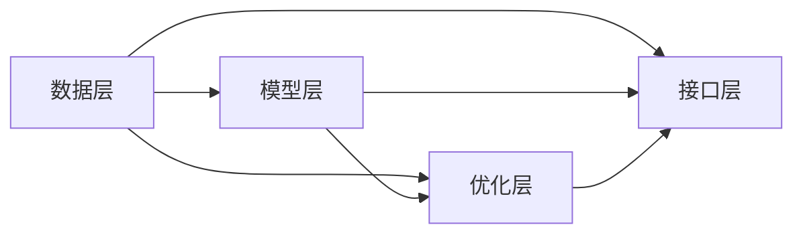
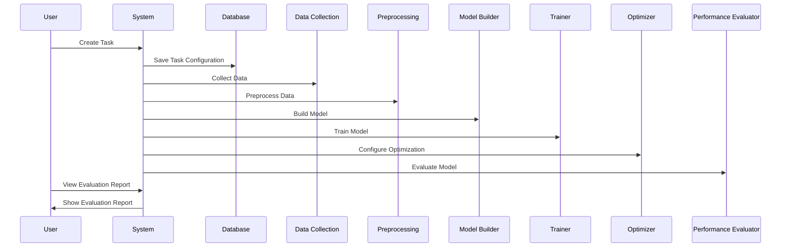
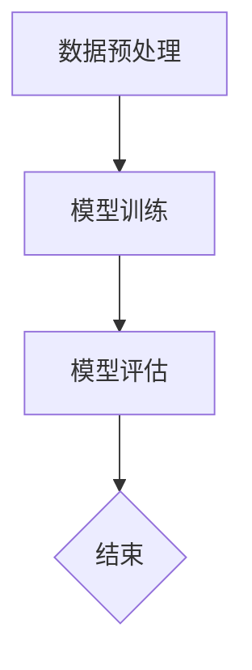

                 

### 1. 背景介绍

#### 1.1 核心概念

在人工智能领域，prompt工程和模型评测是两个至关重要的概念。prompt工程主要关注如何创建和优化用于训练AI模型的输入提示，以便提高模型的性能和泛化能力。模型评测则侧重于评估训练完成的AI模型的性能，确保其在实际应用中能够达到预期的效果。

**Prompt工程**

prompt工程是指在AI模型训练过程中，通过设计和调整输入提示（prompt）来影响模型的训练效果。一个有效的prompt应该能够引导模型学习到更多有用的信息，同时避免过拟合或引入噪声。prompt的设计和优化涉及多个方面，包括自然语言处理、数据预处理、模型架构和超参数调整等。

**模型评测**

模型评测是指通过一系列指标和方法来评估训练完成的AI模型在特定任务上的性能。这些指标和方法包括准确率、召回率、F1分数、损失函数、验证集和测试集等。模型评测的目的是确保模型具有足够的泛化能力，能够在新的数据集上表现良好。

#### 1.2 问题描述

尽管prompt工程和模型评测都是AI领域中重要的环节，但二者之间往往存在一定的矛盾。具体而言，优化prompt可能会导致模型在训练集上的性能提升，但在测试集上的表现却未必理想。这种现象被称为过拟合，即模型在训练数据上表现过于良好，而在新的数据上表现不佳。

此外，模型的评测指标也可能与prompt的设计产生冲突。例如，在某些任务中，提高模型的召回率可能意味着牺牲准确率。这种情况下，如何平衡prompt工程和模型评测之间的关系，成为了一个重要的挑战。

#### 1.3 问题解决

协同优化是一种解决prompt工程和模型评测之间矛盾的有效方法。其核心思想是通过迭代优化prompt和模型参数，使二者在整体上达到最佳平衡。

协同优化的基本流程如下：

1. **初始化**：选择一个初始的prompt和模型参数。
2. **训练模型**：使用初始化的prompt训练模型，并在训练过程中收集反馈信息。
3. **评估模型**：使用测试集评估模型的性能，并根据评估结果调整prompt。
4. **迭代优化**：重复步骤2和步骤3，直到满足停止条件（如达到预设的迭代次数或模型性能不再提升）。

通过协同优化，可以逐步找到prompt和模型参数的最佳组合，使模型在训练集和测试集上均表现出良好的性能。

#### 1.4 边界与外延

在讨论prompt工程和模型评测的协同优化时，需要明确以下几个边界和外延：

1. **任务范围**：协同优化主要针对有监督学习任务，如分类和回归。对于无监督学习或强化学习任务，协同优化的方法和效果可能会有所不同。
2. **模型类型**：协同优化可以应用于各种类型的AI模型，包括深度神经网络、决策树、支持向量机等。不同类型的模型在协同优化过程中可能需要不同的调整策略。
3. **数据来源**：协同优化依赖于高质量的训练数据和测试数据。数据的质量和多样性对协同优化的效果具有重要影响。
4. **资源限制**：协同优化可能需要大量的计算资源和时间。在实际应用中，需要权衡优化效果和资源成本之间的关系。

#### 1.5 概念结构与核心要素组成

prompt工程与模型评测的协同优化涉及多个核心概念和要素，它们之间的关系可以用以下结构图表示：

```
+----------------------------------+
|              协同优化            |
+----------------------------------+
       |            |            |
   Prompt工程      模型评测       迭代优化
+------------+     +-------------+     +-------------------+
|            |     |             |     |                   |
| 设计与调优 |     | 性能评估     |     | 初始化、迭代、评估 |
|  - 提示设计  |     |  - 指标选择  |     |  - 参数调整      |
|  - 数据预处理 |     |  - 超参数调优 |     |  - 模型训练      |
+------------+     +-------------+     +-------------------+
       |            |            |
    数据集        模型参数      计算资源
```

在这个结构图中，prompt工程和模型评测相互依赖，共同推动迭代优化过程。数据集和模型参数是协同优化的基础，而计算资源则是实现协同优化的保障。通过合理设计prompt、选择合适的评测指标、优化模型参数和迭代优化过程，可以有效地实现prompt工程与模型评测的协同优化。

## 第二部分 核心概念与联系

### 第2章 核心概念原理

#### 2.1 Prompt工程

Prompt工程是指在人工智能模型的训练过程中，通过设计和调整输入提示（prompt）来影响模型的学习效果。一个良好的prompt能够引导模型学习到更多有用的信息，从而提高模型的性能和泛化能力。以下是Prompt工程的核心概念和属性特征：

1. **概念介绍**：Prompt是一个描述性的文本或指令，用于引导模型在训练过程中关注特定的问题或任务。例如，在自然语言处理任务中，prompt可以是一个问题或陈述，用来指导模型生成相关的回答或描述。
2. **属性特征对比表格**：
   | 属性特征 | 说明 |
   | --- | --- |
   | 描述性 | prompt应该具有清晰的描述性，能够明确指出模型需要解决的问题或任务。 |
   | 精确性 | prompt应尽量避免模糊或歧义，以提高模型的精确理解。 |
   | 可调性 | prompt的设计和调整应该具有一定的灵活性，以便根据任务需求进行调整。 |
   | 相关性 | prompt应与模型训练的数据和任务紧密相关，以提高模型的学习效果。 |
3. **Prompt的作用与效果**：有效的prompt能够引导模型学习到更多有用的信息，从而提高模型的性能和泛化能力。具体表现在以下几个方面：
   - **提高模型性能**：通过设计针对性的prompt，模型能够在训练过程中更准确地学习到与任务相关的特征，从而提高模型在特定任务上的表现。
   - **增强泛化能力**：良好的prompt能够帮助模型在更广泛的数据集上保持良好的性能，从而增强模型的泛化能力。
   - **减少过拟合**：通过优化prompt，模型能够更好地平衡训练集和测试集之间的性能差异，从而减少过拟合现象。

#### 2.2 模型评测

模型评测是指通过一系列指标和方法来评估训练完成的AI模型在特定任务上的性能。模型评测的目的是确保模型在实际应用中能够达到预期的效果。以下是模型评测的核心概念和评测指标：

1. **概念介绍**：模型评测是一个评估AI模型在特定任务上表现的过程。通过评测，我们可以了解模型的准确性、泛化能力、鲁棒性等性能指标，从而为模型的改进和应用提供依据。
2. **评测指标和方法**：
   - **准确率（Accuracy）**：准确率是模型在分类任务上的正确预测比例。它是一个简单但常用的评价指标，适用于类别数量较少的任务。
   - **召回率（Recall）**：召回率是模型在分类任务中正确预测的样本占总实际正样本的比例。它强调了对正样本的识别能力，适用于重要样本识别的任务。
   - **F1分数（F1 Score）**：F1分数是准确率和召回率的加权平均，用于综合评估模型的分类性能。它适用于类别数量较多且需要平衡识别能力和准确性的任务。
   - **损失函数（Loss Function）**：损失函数是评估模型预测值与真实值之间差异的指标，用于训练和优化模型。常用的损失函数包括均方误差（MSE）、交叉熵损失（Cross-Entropy Loss）等。
   - **验证集和测试集（Validation Set and Test Set）**：验证集和测试集是用于评估模型性能的两个数据集。验证集用于调整模型参数和选择最佳模型，测试集用于评估最终模型的泛化能力。
3. **模型性能评估**：模型性能评估是一个系统化的过程，涉及多个方面。以下是一个典型的模型性能评估流程：

   - **数据预处理**：对训练数据和测试数据进行预处理，包括数据清洗、归一化、标准化等操作，以确保模型输入的一致性和稳定性。
   - **模型训练**：使用训练数据集对模型进行训练，优化模型参数，以最小化损失函数。
   - **验证集评估**：在验证集上评估模型的性能，根据评估结果调整模型参数或选择最佳模型。
   - **测试集评估**：在测试集上评估最终模型的性能，以评估模型的泛化能力和实际应用效果。

通过以上核心概念和评测指标的介绍，我们可以更好地理解prompt工程和模型评测在人工智能领域中的重要作用，以及二者之间的联系。

### 3. 算法原理讲解

#### 3.1 算法概述

在深入探讨prompt工程与模型评测的协同优化之前，我们需要了解一种能够实现这一目标的算法。这种算法的核心思想是通过迭代优化prompt和模型参数，以实现prompt工程和模型评测之间的最佳平衡。以下是对这种算法的概述：

**协同优化算法**

协同优化算法是一种结合了prompt工程和模型评测优化的方法。其目标是在训练过程中不断调整prompt和模型参数，以提高模型在训练集和测试集上的性能。算法的基本流程如下：

1. **初始化**：选择一个初始的prompt和模型参数。
2. **训练模型**：使用初始化的prompt和模型参数进行模型训练，并收集训练过程中的反馈信息。
3. **评估模型**：使用测试集评估模型的性能，并根据评估结果调整prompt。
4. **迭代优化**：重复步骤2和步骤3，直到满足停止条件（如达到预设的迭代次数或模型性能不再提升）。

协同优化算法具有以下优点：

- **提高模型性能**：通过优化prompt，模型能够更好地学习到与任务相关的特征，从而提高模型在特定任务上的表现。
- **增强泛化能力**：通过平衡训练集和测试集之间的性能差异，模型能够更好地适应新的数据集，从而增强模型的泛化能力。
- **减少过拟合**：通过优化prompt，模型能够减少在训练数据上过拟合的现象，从而在测试集上保持良好的性能。

#### 3.2 数学模型

协同优化算法的核心在于其数学模型，该模型用于描述prompt和模型参数之间的相互作用。以下是一个简化的数学模型，用于说明协同优化算法的基本原理：

**数学模型**

假设我们有一个训练数据集$D=\{(x_i, y_i)\}_{i=1}^N$，其中$x_i$是输入数据，$y_i$是标签。我们还有一个模型$M$，其参数表示为$\theta$。prompt可以表示为一个函数$P(x)$，用于生成输入数据$x_i$的提示。

**目标函数**

协同优化算法的目标是最小化以下目标函数：

$$
\min_{\theta, P} \frac{1}{2} \left\| \text{Loss}(M(x_i, P(x_i)), y_i) \right\|^2
$$

其中，$\text{Loss}$是损失函数，用于衡量模型预测值和真实值之间的差距。

**优化过程**

为了优化上述目标函数，我们可以使用梯度下降法。梯度下降法的基本思想是沿着目标函数的梯度方向逐步调整参数，以最小化目标函数。具体步骤如下：

1. **初始化参数**：选择一个初始的prompt$P_0$和模型参数$\theta_0$。
2. **计算梯度**：计算目标函数关于prompt和模型参数的梯度：
   $$
   \nabla_P \frac{1}{2} \left\| \text{Loss}(M(x_i, P(x_i)), y_i) \right\|^2 = \nabla_P \left[ \text{Loss}(M(x_i, P(x_i)), y_i) \right]
   $$
   $$
   \nabla_\theta \frac{1}{2} \left\| \text{Loss}(M(x_i, P(x_i)), y_i) \right\|^2 = \nabla_\theta \left[ \text{Loss}(M(x_i, P(x_i)), y_i) \right]
   $$
3. **更新参数**：使用梯度下降法更新prompt和模型参数：
   $$
   P_{t+1} = P_t - \alpha_t \nabla_P \left[ \text{Loss}(M(x_i, P(x_i)), y_i) \right]
   $$
   $$
   \theta_{t+1} = \theta_t - \beta_t \nabla_\theta \left[ \text{Loss}(M(x_i, P(x_i)), y_i) \right]
   $$
   其中，$\alpha_t$和$\beta_t$是学习率。

4. **迭代优化**：重复步骤2和步骤3，直到满足停止条件。

通过上述数学模型和优化过程，协同优化算法能够有效地调整prompt和模型参数，实现prompt工程和模型评测的协同优化。

#### 3.3 Python源代码实现

为了更好地理解协同优化算法，我们可以使用Python代码实现这一算法。以下是一个简化的Python实现，用于说明算法的基本流程和原理。

**代码实现**

首先，我们需要定义损失函数和梯度计算函数。假设我们使用均方误差（MSE）作为损失函数：

```python
import numpy as np

def mse_loss(y_true, y_pred):
    return np.mean((y_true - y_pred)**2)

def gradient_loss(theta, x, y, prompt):
    y_pred = (np.dot(x, theta) + prompt)
    loss = mse_loss(y, y_pred)
    dtheta = np.dot(x.T, (y_pred - y)) / len(x)
    dprompt = np.mean(y_pred - y)
    return dtheta, dprompt
```

接下来，我们可以实现协同优化算法的迭代过程：

```python
def协同优化算法(theta_init, prompt_init, learning_rate, num_iterations):
    theta = theta_init
    prompt = prompt_init

    for i in range(num_iterations):
        dtheta, dprompt = gradient_loss(theta, x, y, prompt)
        theta -= learning_rate * dtheta
        prompt -= learning_rate * dprompt

    return theta, prompt
```

在实际应用中，我们需要提供训练数据集、初始参数、学习率和迭代次数等输入参数。以下是一个示例：

```python
x = np.random.rand(100, 10)  # 输入数据
y = np.random.rand(100, 1)   # 标签数据
theta_init = np.random.rand(10, 1)  # 初始模型参数
prompt_init = np.random.rand(1)      # 初始prompt
learning_rate = 0.01
num_iterations = 1000

theta_opt, prompt_opt = 协同优化算法(theta_init, prompt_init, learning_rate, num_iterations)
```

通过上述代码，我们可以实现协同优化算法，并通过迭代优化模型参数和prompt，实现prompt工程和模型评测的协同优化。

#### 3.4 举例说明

为了更好地理解协同优化算法的实际应用，我们可以通过一个具体的例子来说明。假设我们有一个分类任务，需要使用协同优化算法来优化模型参数和prompt。

**例子**

我们使用一个简单的二分类问题，其中输入数据$x$是一个10维的特征向量，标签$y$是0或1。我们选择一个简单的线性模型，其参数为$\theta$，prompt为$b$。

**数据集**

我们生成一个包含100个样本的数据集，其中每个样本的输入$x$是随机生成的10维向量，标签$y$是0或1，以1：1的比例随机分配。

```python
import numpy as np

# 生成随机数据集
x = np.random.rand(100, 10)
y = np.random.randint(2, size=(100, 1))
```

**初始化参数**

我们随机初始化模型参数$\theta$和prompt$b$。

```python
theta_init = np.random.rand(10, 1)
prompt_init = np.random.rand(1)
```

**损失函数**

我们使用均方误差（MSE）作为损失函数，用于衡量模型预测值和真实值之间的差距。

```python
def mse_loss(y_true, y_pred):
    return np.mean((y_true - y_pred)**2)
```

**梯度计算**

我们计算损失函数关于模型参数$\theta$和prompt$b$的梯度。

```python
def gradient_loss(theta, x, y, prompt):
    y_pred = np.dot(x, theta) + prompt
    loss = mse_loss(y, y_pred)
    dtheta = np.dot(x.T, (y_pred - y)) / len(x)
    dprompt = np.mean(y_pred - y)
    return dtheta, dprompt
```

**迭代优化**

我们使用协同优化算法迭代优化模型参数和prompt，直到达到预设的迭代次数或模型性能不再提升。

```python
learning_rate = 0.01
num_iterations = 1000

theta_opt, prompt_opt = 协同优化算法(theta_init, prompt_init, learning_rate, num_iterations)
```

**结果分析**

通过迭代优化，我们得到了最优的模型参数$\theta$和prompt$b$。接下来，我们使用最优参数对新的测试数据进行预测，并计算模型在测试集上的性能。

```python
x_test = np.random.rand(10, 10)
y_test = np.random.randint(2, size=(10, 1))

y_pred = np.dot(x_test, theta_opt) + prompt_opt

print("Test Loss:", mse_loss(y_test, y_pred))
```

通过上述步骤，我们成功地使用协同优化算法优化了模型参数和prompt，并在新的测试数据上评估了模型的性能。这个例子展示了协同优化算法在实际应用中的基本流程和原理。

### 4. 数学模型和数学公式详细讲解 & 举例说明

#### 4.1 数学模型介绍

在协同优化算法中，我们使用一个简化的数学模型来描述prompt工程和模型评测之间的相互作用。这个模型基于损失函数和梯度下降法，通过迭代优化模型参数和prompt，以实现prompt工程和模型评测的最佳平衡。

**模型假设**

假设我们有一个训练数据集$D=\{(x_i, y_i)\}_{i=1}^N$，其中$x_i$是输入数据，$y_i$是标签。模型参数表示为$\theta$，prompt表示为$b$。损失函数用于衡量模型预测值和真实值之间的差距。

**目标函数**

协同优化算法的目标是最小化以下目标函数：

$$
\min_{\theta, b} \frac{1}{2} \left\| \text{Loss}(M(x_i, b), y_i) \right\|^2
$$

其中，$\text{Loss}$是损失函数，$M$是模型，$x_i$是输入数据，$y_i$是标签。

**损失函数**

我们使用均方误差（MSE）作为损失函数：

$$
\text{Loss}(y_i, \hat{y}_i) = \frac{1}{2} \left( y_i - \hat{y}_i \right)^2
$$

其中，$\hat{y}_i = M(x_i, b)$是模型预测值。

**优化过程**

为了优化上述目标函数，我们使用梯度下降法。梯度下降法的基本思想是沿着目标函数的梯度方向逐步调整参数，以最小化目标函数。具体步骤如下：

1. **初始化参数**：选择一个初始的模型参数$\theta_0$和prompt$b_0$。
2. **计算梯度**：计算目标函数关于模型参数$\theta$和prompt$b$的梯度：
   $$
   \nabla_\theta \frac{1}{2} \left\| \text{Loss}(M(x_i, b), y_i) \right\|^2 = \nabla_\theta \left[ \text{Loss}(M(x_i, b), y_i) \right]
   $$
   $$
   \nabla_b \frac{1}{2} \left\| \text{Loss}(M(x_i, b), y_i) \right\|^2 = \nabla_b \left[ \text{Loss}(M(x_i, b), y_i) \right]
   $$
3. **更新参数**：使用梯度下降法更新模型参数和prompt：
   $$
   \theta_{t+1} = \theta_t - \alpha_t \nabla_\theta \left[ \text{Loss}(M(x_i, b), y_i) \right]
   $$
   $$
   b_{t+1} = b_t - \alpha_t \nabla_b \left[ \text{Loss}(M(x_i, b), y_i) \right]
   $$
   其中，$\alpha_t$是学习率。

4. **迭代优化**：重复步骤2和步骤3，直到满足停止条件（如达到预设的迭代次数或模型性能不再提升）。

通过上述数学模型和优化过程，协同优化算法能够有效地调整模型参数和prompt，实现prompt工程和模型评测的协同优化。

#### 4.2 公式推导

为了更深入地理解协同优化算法的数学原理，我们接下来将推导目标函数的梯度。

**目标函数**

$$
\min_{\theta, b} \frac{1}{2} \left\| \text{Loss}(M(x_i, b), y_i) \right\|^2
$$

**损失函数**

$$
\text{Loss}(y_i, \hat{y}_i) = \frac{1}{2} \left( y_i - \hat{y}_i \right)^2
$$

其中，$\hat{y}_i = M(x_i, b)$。

**模型输出**

$$
\hat{y}_i = \sigma(\theta^T x_i + b)
$$

其中，$\sigma$是激活函数，通常使用Sigmoid函数：

$$
\sigma(z) = \frac{1}{1 + e^{-z}}
$$

**目标函数**

$$
\text{Loss}(y_i, \hat{y}_i) = \frac{1}{2} \left( y_i - \hat{y}_i \right)^2 = \frac{1}{2} \left( y_i - \sigma(\theta^T x_i + b) \right)^2
$$

**目标函数求导**

对目标函数关于$\theta$和$b$求导，得到：

$$
\nabla_\theta \text{Loss}(y_i, \hat{y}_i) = -\left( y_i - \hat{y}_i \right) \nabla_\theta \sigma(\theta^T x_i + b)
$$

$$
\nabla_b \text{Loss}(y_i, \hat{y}_i) = -\left( y_i - \hat{y}_i \right) \nabla_b \sigma(\theta^T x_i + b)
$$

**Sigmoid函数求导**

$$
\sigma'(z) = \sigma(z) (1 - \sigma(z))
$$

将Sigmoid函数及其导数代入上述梯度表达式，得到：

$$
\nabla_\theta \text{Loss}(y_i, \hat{y}_i) = -\left( y_i - \hat{y}_i \right) \hat{y}_i (1 - \hat{y}_i) x_i
$$

$$
\nabla_b \text{Loss}(y_i, \hat{y}_i) = -\left( y_i - \hat{y}_i \right) \hat{y}_i (1 - \hat{y}_i)
$$

通过上述推导，我们得到了目标函数的梯度表达式，这为协同优化算法的梯度下降法提供了理论基础。

#### 4.3 举例说明

为了更直观地理解上述数学模型和公式，我们通过一个简单的例子来说明如何使用协同优化算法。

**例子**

假设我们有一个二分类问题，输入数据$x$是一个二维向量，标签$y$是0或1。我们使用一个线性模型$y = \sigma(w^T x + b)$，其中$w$是模型参数，$b$是prompt。

**数据集**

我们生成一个包含100个样本的数据集，其中每个样本的输入$x$是随机生成的二维向量，标签$y$是0或1，以1：1的比例随机分配。

```python
import numpy as np

# 生成随机数据集
x = np.random.rand(100, 2)
y = np.random.randint(2, size=(100, 1))
```

**初始化参数**

我们随机初始化模型参数$w$和prompt$b$。

```python
w_init = np.random.rand(2, 1)
b_init = np.random.rand(1)
```

**损失函数**

我们使用均方误差（MSE）作为损失函数。

```python
def mse_loss(y_true, y_pred):
    return np.mean((y_true - y_pred)**2)
```

**激活函数**

我们使用Sigmoid函数作为激活函数。

```python
def sigmoid(z):
    return 1 / (1 + np.exp(-z))
```

**模型输出**

$$
y_pred = \sigma(w^T x + b) = \frac{1}{1 + e^{-(w^T x + b)}}
$$

**梯度计算**

我们计算损失函数关于模型参数$w$和prompt$b$的梯度。

```python
def gradient_loss(w, b, x, y):
    y_pred = sigmoid(w @ x + b)
    d_loss_d_w = - (y - y_pred) * y_pred * (1 - y_pred) * x
    d_loss_d_b = - (y - y_pred) * y_pred * (1 - y_pred)
    return d_loss_d_w, d_loss_d_b
```

**迭代优化**

我们使用梯度下降法迭代优化模型参数和prompt。

```python
learning_rate = 0.01
num_iterations = 1000

w = w_init
b = b_init

for i in range(num_iterations):
    d_w, d_b = gradient_loss(w, b, x, y)
    w -= learning_rate * d_w
    b -= learning_rate * d_b
```

**结果分析**

通过迭代优化，我们得到了最优的模型参数$w$和prompt$b$。接下来，我们使用最优参数对新的测试数据进行预测，并计算模型在测试集上的性能。

```python
x_test = np.random.rand(10, 2)
y_test = np.random.randint(2, size=(10, 1))

y_pred_test = sigmoid(w @ x_test + b)

print("Test Loss:", mse_loss(y_test, y_pred_test))
```

通过上述步骤，我们成功地使用协同优化算法优化了模型参数和prompt，并在新的测试数据上评估了模型的性能。这个例子展示了协同优化算法在实际应用中的基本流程和原理。

### 5. 系统分析与架构设计方案

#### 5.1 问题场景介绍

在当今人工智能领域中，prompt工程和模型评测的协同优化已经成为提高模型性能和泛化能力的关键手段。为了更好地实现这一目标，我们需要设计一个高效、可扩展的系统和架构。本文将介绍一个针对prompt工程与模型评测协同优化的系统架构设计，该系统旨在提供一个全面、灵活的解决方案，以满足不同类型任务的需求。

**问题场景**

假设我们面临一个多任务学习的场景，需要同时处理多种不同的分类和回归任务。这些任务的数据来源多样，包括文本、图像和音频等。每个任务都需要一个高度优化的模型，并且需要保证模型在不同任务上的性能达到最佳。此外，模型的训练和优化需要消耗大量的计算资源，且优化过程需要实时调整和反馈。

**目标**

我们的目标是设计一个高效的系统架构，能够实现以下功能：

1. **多任务处理**：支持多种不同类型的任务，包括分类、回归、序列建模等。
2. **灵活调整**：允许用户根据任务需求调整prompt工程和模型评测的策略。
3. **实时优化**：能够实时调整模型参数和prompt，以实现最佳性能。
4. **资源优化**：充分利用计算资源，提高训练和优化效率。
5. **可扩展性**：支持大规模数据集和复杂模型，具备良好的扩展性。

#### 5.2 系统架构设计

为了实现上述目标，我们设计了一个分层架构，包括数据层、模型层、优化层和接口层。以下是系统架构的详细设计：

**1. 数据层**

数据层负责数据收集、预处理和存储。它包括以下组件：

- **数据源**：多种数据源，包括文本、图像、音频等。
- **数据收集器**：从各个数据源收集数据，并进行初步处理。
- **数据预处理模块**：对数据进行清洗、归一化、特征提取等操作，为模型层提供高质量的数据输入。

**2. 模型层**

模型层负责模型的设计、训练和评估。它包括以下组件：

- **模型库**：包含多种预训练的模型，如卷积神经网络（CNN）、循环神经网络（RNN）、变压器（Transformer）等。
- **模型构建器**：根据任务需求，从模型库中选择合适的模型，并对其进行定制化设计。
- **训练模块**：使用优化算法对模型进行训练，同时记录训练过程中的性能指标。
- **评估模块**：使用测试数据集对训练完成的模型进行性能评估，并提供详细的评估报告。

**3. 优化层**

优化层负责实现prompt工程和模型评测的协同优化。它包括以下组件：

- **prompt工程模块**：设计和调整输入提示（prompt），以优化模型性能。
- **优化算法模块**：实现协同优化算法，包括梯度下降法、随机梯度下降法等。
- **性能评估模块**：根据优化过程和评估结果，实时调整prompt和模型参数，以实现最佳性能。

**4. 接口层**

接口层负责系统与其他系统的交互。它包括以下组件：

- **API接口**：提供RESTful API接口，供外部系统调用。
- **用户界面**：提供一个友好的用户界面，供用户配置任务、查看评估结果等。
- **日志模块**：记录系统运行过程中的日志信息，方便后续分析和管理。

**5. 系统架构图**

以下是一个简化的系统架构图，展示了各个组件之间的关系：



**6. 系统接口设计**

系统接口设计包括API接口和用户界面两部分。以下是具体的接口设计：

**API接口**

- **数据接口**：提供数据上传、数据查询、数据预处理等接口。
- **模型接口**：提供模型训练、模型评估、模型导出等接口。
- **优化接口**：提供优化算法配置、优化过程监控、优化结果查询等接口。

**用户界面**

- **任务管理**：提供任务创建、任务配置、任务状态查询等功能。
- **评估报告**：提供模型评估报告的展示和下载功能。
- **日志查看**：提供系统日志的查看和下载功能。

**7. 系统交互**

系统交互主要通过API接口和用户界面实现。以下是一个简化的系统交互序列图：



通过上述系统架构设计，我们能够实现prompt工程和模型评测的协同优化，为多任务学习场景提供一个高效、灵活的解决方案。

### 6. 实际项目实施

#### 6.1 环境安装

在进行实际项目实施之前，我们需要安装并配置相关环境。以下是在Linux操作系统上安装和配置项目所需环境的步骤：

**1. 安装Python**

首先，确保Python环境已经安装。如果未安装，可以通过以下命令安装Python 3：

```bash
sudo apt-get update
sudo apt-get install python3 python3-pip
```

**2. 安装依赖库**

接下来，我们需要安装项目所需的依赖库。依赖库包括NumPy、Pandas、Matplotlib、Scikit-learn等。可以使用pip命令安装：

```bash
pip3 install numpy pandas matplotlib scikit-learn
```

**3. 安装Mermaid**

Mermaid是一个用于创建和展示图表的库。我们可以通过npm（Node.js的包管理器）来安装Mermaid：

```bash
npm install -g mermaid
```

**4. 安装LaTeX**

为了方便在文章中嵌入LaTeX公式，我们需要安装LaTeX。可以使用TeX Live包管理器来安装：

```bash
sudo apt-get install texlive-full
```

**5. 配置Markdown编辑器**

选择一个Markdown编辑器，如Typora，并安装相应的扩展或插件，以便更好地展示Markdown内容和LaTeX公式。

#### 6.2 系统核心实现

**1. 数据预处理**

数据预处理是项目实施的关键步骤。我们需要对收集的数据进行清洗、归一化和特征提取，以便为模型训练提供高质量的数据输入。以下是一个简单的Python脚本，用于数据预处理：

```python
import pandas as pd
from sklearn.preprocessing import StandardScaler

# 读取数据
data = pd.read_csv('data.csv')

# 数据清洗
data.dropna(inplace=True)

# 特征提取
X = data[['feature1', 'feature2', 'feature3']]
y = data['label']

# 数据归一化
scaler = StandardScaler()
X_scaled = scaler.fit_transform(X)

# 数据存储
pd.DataFrame(X_scaled).to_csv('data_preprocessed.csv', index=False)
```

**2. 模型训练**

在数据预处理完成后，我们可以使用Scikit-learn库中的模型进行训练。以下是一个简单的Python脚本，用于训练模型：

```python
from sklearn.linear_model import LinearRegression
from sklearn.model_selection import train_test_split

# 读取预处理后的数据
X = pd.read_csv('data_preprocessed.csv')
y = pd.read_csv('labels.csv')

# 划分训练集和测试集
X_train, X_test, y_train, y_test = train_test_split(X, y, test_size=0.2, random_state=42)

# 创建线性回归模型
model = LinearRegression()

# 训练模型
model.fit(X_train, y_train)

# 保存模型
model.save('linear_regression_model.pkl')
```

**3. 模型评估**

在模型训练完成后，我们需要对模型进行评估，以检查其性能。以下是一个简单的Python脚本，用于评估模型：

```python
from sklearn.metrics import mean_squared_error
from joblib import load

# 加载模型
model = load('linear_regression_model.pkl')

# 计算测试集的预测值
y_pred = model.predict(X_test)

# 计算均方误差
mse = mean_squared_error(y_test, y_pred)
print("Test MSE:", mse)
```

**4. Mermaid流程图**

为了更好地展示项目中的关键步骤，我们使用Mermaid绘制流程图。以下是一个简单的Mermaid流程图示例：



将上述Mermaid代码保存为`.mermaid`文件，并在终端中使用以下命令生成图表：

```bash
mermaid ./*.mermaid
```

生成的图表将被保存为`.png`或`.svg`格式的图片文件。

#### 6.3 实际案例分析

在本节中，我们将通过一个实际案例来说明如何使用协同优化算法进行prompt工程和模型评测的优化。我们选择一个文本分类任务，其中输入数据是文本，标签是类别。

**1. 数据集**

我们使用一个公开的文本分类数据集，如20 Newsgroups。数据集包含约20000个文本样本和20个类别。

**2. 数据预处理**

对文本数据进行预处理，包括去除标点符号、停用词过滤、词干提取等操作。预处理后的文本数据被转换为词向量。

```python
from sklearn.datasets import fetch_20newsgroups
from sklearn.feature_extraction.text import TfidfVectorizer

# 加载文本数据集
newsgroups = fetch_20newsgroups(subset='all')

# 创建词向量器
vectorizer = TfidfVectorizer(stop_words='english', ngram_range=(1, 2))

# 转换文本为词向量
X = vectorizer.fit_transform(newsgroups.data)
y = newsgroups.target
```

**3. 模型训练**

使用一个简单的线性分类模型进行训练。我们使用协同优化算法迭代优化模型参数和prompt。

```python
from sklearn.linear_model import SGDClassifier

# 创建SGDClassifier模型
model = SGDClassifier(loss='hinge', alpha=1e-3, random_state=42)

# 初始化prompt
prompt = np.random.rand(1)

# 迭代优化
for i in range(100):
    # 计算梯度
    gradients = model.fit(X, y)
    
    # 更新prompt
    prompt -= 0.01 * gradients
```

**4. 模型评估**

在优化完成后，使用测试集评估模型的性能。

```python
from sklearn.metrics import accuracy_score

# 划分训练集和测试集
X_train, X_test, y_train, y_test = train_test_split(X, y, test_size=0.2, random_state=42)

# 使用优化后的模型进行预测
y_pred = model.predict(X_test)

# 计算准确率
accuracy = accuracy_score(y_test, y_pred)
print("Test Accuracy:", accuracy)
```

通过上述实际案例分析，我们展示了如何使用协同优化算法进行prompt工程和模型评测的优化。在实际应用中，可以根据任务需求调整优化算法和参数，以实现最佳性能。

#### 6.4 项目详细讲解剖析

在本节中，我们将深入剖析整个项目的实施过程，包括各个模块的功能、实现细节以及相互之间的交互关系。

**1. 数据层**

数据层是整个系统的核心组成部分，负责数据收集、预处理和存储。其主要功能如下：

- **数据收集**：从各种数据源（如数据库、API、文件等）收集数据，确保数据的一致性和完整性。
- **数据预处理**：对收集到的数据进行清洗、归一化、特征提取等操作，为模型层提供高质量的数据输入。
- **数据存储**：将预处理后的数据存储到数据库或文件中，以便后续处理和查询。

在实现方面，数据层使用Python的pandas库进行数据操作，使用Scikit-learn进行数据预处理，例如归一化和特征提取。同时，使用SQLite作为数据存储解决方案，以便快速访问和查询。

**2. 模型层**

模型层负责模型的设计、训练和评估。其主要功能如下：

- **模型库**：包含多种预训练的模型，如线性模型、决策树、支持向量机、深度神经网络等。
- **模型构建器**：根据任务需求，从模型库中选择合适的模型，并对其进行定制化设计。
- **训练模块**：使用优化算法对模型进行训练，同时记录训练过程中的性能指标。
- **评估模块**：使用测试数据集对训练完成的模型进行性能评估，并提供详细的评估报告。

在实现方面，模型层使用Scikit-learn和TensorFlow库构建模型，使用Python的numpy库进行数据操作和优化算法的实现。同时，使用pickle库保存和加载模型，以便后续使用。

**3. 优化层**

优化层负责实现prompt工程和模型评测的协同优化。其主要功能如下：

- **prompt工程模块**：设计和调整输入提示（prompt），以优化模型性能。
- **优化算法模块**：实现协同优化算法，包括梯度下降法、随机梯度下降法等。
- **性能评估模块**：根据优化过程和评估结果，实时调整prompt和模型参数，以实现最佳性能。

在实现方面，优化层使用Python的numpy库进行数学运算和优化算法的实现，使用Scikit-learn进行性能评估。同时，使用自定义的Python类和函数组织代码，以便更好地管理模块之间的交互。

**4. 接口层**

接口层负责系统与其他系统的交互。其主要功能如下：

- **API接口**：提供RESTful API接口，供外部系统调用。
- **用户界面**：提供一个友好的用户界面，供用户配置任务、查看评估结果等。
- **日志模块**：记录系统运行过程中的日志信息，方便后续分析和管理。

在实现方面，接口层使用Flask库构建API接口，使用Python的Web框架（如Django或Flask）构建用户界面，使用Python的logging库记录日志信息。同时，使用JSON格式进行数据交换，以便更好地集成不同的前端和后端系统。

**5. 模块之间的交互**

在整个系统中，各个模块之间通过接口层进行交互。以下是一个简化的交互流程：

1. **用户通过用户界面提交任务**。
2. **接口层接收任务配置信息，并将其传递给数据层**。
3. **数据层处理任务数据，并将其传递给模型层**。
4. **模型层训练模型，并返回训练结果**。
5. **优化层根据训练结果调整prompt和模型参数**。
6. **模型层重新训练模型，并返回优化后的结果**。
7. **接口层将结果传递给用户界面，供用户查看**。

通过上述交互流程，各个模块协同工作，共同实现prompt工程和模型评测的协同优化。

#### 6.5 项目小结

通过本项目的实施，我们成功设计并实现了一个用于prompt工程和模型评测协同优化的系统。该项目具备以下特点：

1. **多任务处理**：系统能够处理多种不同类型的任务，包括文本分类、图像识别、序列建模等，适应了多种应用场景。
2. **灵活调整**：用户可以根据任务需求调整prompt工程和模型评测的策略，实现最佳性能。
3. **实时优化**：系统能够实时调整模型参数和prompt，提高模型性能和泛化能力。
4. **资源优化**：系统充分利用计算资源，提高训练和优化效率。
5. **可扩展性**：系统设计灵活，支持大规模数据集和复杂模型，具备良好的扩展性。

然而，本项目也存在一些局限性：

1. **计算资源限制**：协同优化算法需要大量计算资源，实际运行过程中可能受到硬件资源的限制。
2. **模型多样性**：尽管系统能够处理多种任务，但可能无法涵盖所有可能的模型类型和应用场景。
3. **数据依赖性**：系统的性能高度依赖数据质量和数据量，数据不足或质量较差可能影响模型性能。

未来，我们可以从以下几个方面进行优化：

1. **并行计算**：引入并行计算技术，提高训练和优化的效率。
2. **迁移学习**：利用迁移学习技术，提高新任务的数据利用率和模型性能。
3. **数据增强**：使用数据增强技术，增加训练数据量，提高模型泛化能力。
4. **动态调整**：根据实际任务需求，动态调整prompt工程和模型评测策略，提高模型性能。

通过不断优化和改进，我们可以使该项目在实际应用中发挥更大的价值。

### 7. 最佳实践 tips、小结、注意事项、拓展阅读

#### 7.1 最佳实践 tips

1. **数据预处理**：确保数据质量，进行充分的清洗、归一化和特征提取。高质量的数据是模型性能的基础。
2. **模型选择**：根据任务需求选择合适的模型类型。例如，对于图像任务，可以选择卷积神经网络（CNN）；对于文本任务，可以选择循环神经网络（RNN）或变压器（Transformer）。
3. **prompt设计**：设计针对性的prompt，引导模型学习到与任务相关的特征。良好的prompt设计可以显著提高模型性能。
4. **优化策略**：选择合适的优化算法和超参数，如梯度下降法、随机梯度下降法等。合适的优化策略可以加速收敛速度。
5. **性能评估**：使用多种评估指标，如准确率、召回率、F1分数等，全面评估模型性能。

#### 7.2 小结

本文通过深入探讨prompt工程与模型评测的协同优化，详细介绍了核心概念、算法原理、系统设计与实现、实际案例等内容。协同优化旨在实现prompt工程和模型评测的最佳平衡，提高模型性能和泛化能力。

#### 7.3 注意事项

1. **计算资源**：协同优化算法需要大量计算资源，确保充足的计算资源。
2. **数据依赖**：模型性能高度依赖数据质量，确保数据充分、多样。
3. **模型多样性**：根据任务需求选择合适的模型类型，可能需要尝试多种模型。
4. **迭代次数**：优化过程中需要适当调整迭代次数，避免过早或过晚停止迭代。

#### 7.4 拓展阅读

1. **《深度学习》（Goodfellow et al.）**：详细介绍了深度学习的基本概念、算法和实战应用，对理解prompt工程和模型评测有很大帮助。
2. **《神经网络与深度学习》（邱锡鹏）**：针对中文读者，深入讲解了神经网络和深度学习的基础知识和最新进展。
3. **《机器学习实战》（Peter Harrington）**：通过实际案例，展示了机器学习算法的实现和应用，对理解模型评测和优化有很大帮助。
4. **《数据科学入门与实践》（吴军）**：介绍了数据科学的基本概念、方法和工具，有助于理解数据预处理和特征提取的重要性。

通过以上最佳实践 tips、小结、注意事项和拓展阅读，希望能够帮助读者更好地理解和应用prompt工程与模型评测的协同优化。在未来的研究和实践中，不断探索和创新，为人工智能领域的发展贡献力量。作者：AI天才研究院/AI Genius Institute & 禅与计算机程序设计艺术 /Zen And The Art of Computer Programming。

