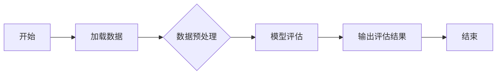
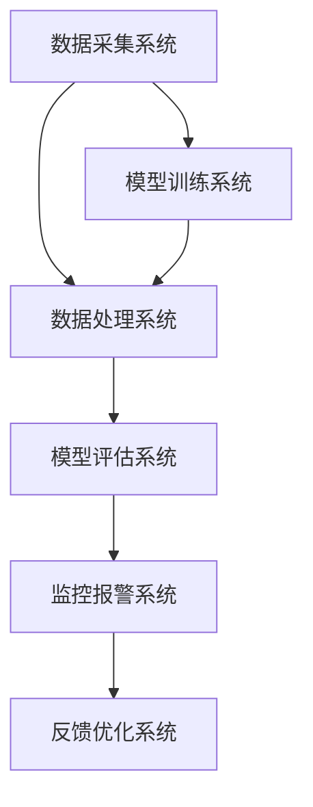
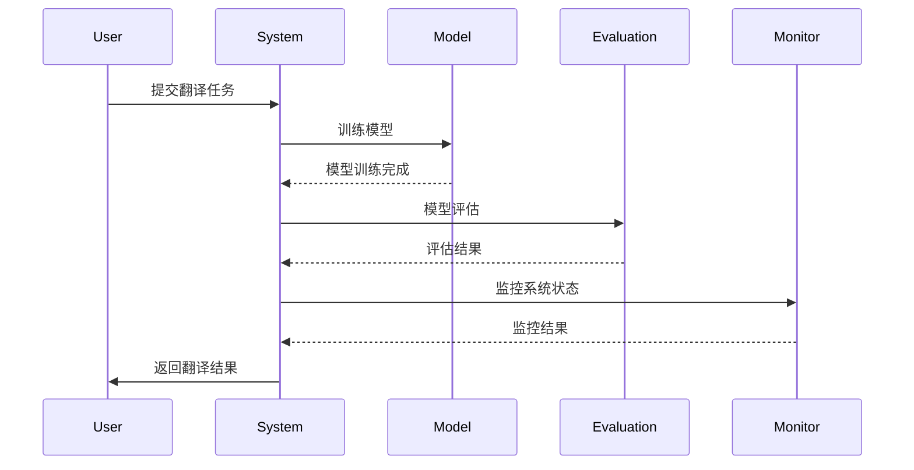

                 


### 《prompt工程中的持续评测与监控》

---

**关键词**：prompt工程、持续评测、监控、算法原理、系统架构

**摘要**：本文旨在深入探讨prompt工程中的持续评测与监控。我们首先介绍了持续评测与监控的核心概念和重要性，接着阐述了持续评测与监控的基本方法和算法原理。随后，我们详细分析了持续评测与监控的系统架构设计，并通过实际案例展示了其在prompt工程中的应用。最后，我们提出了最佳实践建议和注意事项，并进行了项目小结和拓展阅读推荐。

---

### 第一部分：背景介绍

#### 第1章：持续评测与监控的核心概念

##### 1.1.1 问题背景

在prompt工程中，持续评测与监控是确保系统稳定运行、性能优化和准确性的关键。随着人工智能技术的不断发展，prompt工程的应用场景越来越广泛，从自然语言处理到图像识别，从推荐系统到智能客服，都对评测与监控提出了更高的要求。

##### 1.1.2 问题描述

prompt工程中的评测与监控需求主要体现在以下几个方面：

1. **准确性**：确保系统输出结果与预期目标的匹配程度。
2. **稳定性**：系统在长时间运行过程中应保持性能稳定。
3. **可靠性**：系统在不同环境和数据集上的表现应一致。
4. **效率**：快速发现并解决系统中的问题。

现有评测与监控手段的局限性包括：

1. **事后检查**：大多数评测与监控手段都是基于事后检查，无法及时发现潜在问题。
2. **人工依赖**：部分评测与监控过程依赖人工操作，效率低且容易出现误判。
3. **数据不足**：现有手段往往无法获取全面、细致的数据支持。

##### 1.1.3 问题解决

持续评测与监控的引入，可以解决以上问题。它通过实时监测系统运行状态，自动进行评测和反馈，实现以下优势：

1. **实时性**：快速发现并解决问题，确保系统运行稳定。
2. **自动化**：减少人工操作，提高工作效率。
3. **数据丰富**：提供全面、细致的数据支持，为后续优化提供依据。

##### 1.1.4 边界与外延

持续评测与监控的范围包括：

1. **模型训练与推理过程**：对模型训练过程和推理结果进行实时监测和评估。
2. **系统运行状态**：监测系统资源使用情况，如CPU、内存、网络等。
3. **外部环境**：监测外部因素对系统性能的影响，如数据质量、网络延迟等。

其应用场景包括：

1. **自然语言处理**：如机器翻译、文本分类等。
2. **图像识别**：如人脸识别、物体检测等。
3. **推荐系统**：如商品推荐、新闻推荐等。
4. **智能客服**：如聊天机器人、语音助手等。

##### 1.1.5 概念结构与核心要素组成

持续评测与监控的基本结构包括：

1. **数据采集**：从模型训练、推理和系统运行过程中采集相关数据。
2. **数据处理**：对采集到的数据进行清洗、处理和存储。
3. **评测与监控**：基于处理后的数据，进行实时评测和监控。
4. **反馈与优化**：根据评测结果，自动调整系统参数或模型结构，实现持续优化。

核心要素及其相互关系如下：

1. **数据采集**：为后续评测与监控提供基础数据。
2. **数据处理**：确保数据的准确性和一致性。
3. **评测与监控**：实时监测系统性能，识别潜在问题。
4. **反馈与优化**：基于评测结果，调整系统参数或模型结构。

#### 第2章：核心概念与联系

##### 2.1.1 持续评测

持续评测是指在整个模型训练、推理和系统运行过程中，对系统性能进行实时监测和评估。其关键属性与特征包括：

1. **实时性**：能够快速发现系统性能问题。
2. **自动化**：减少人工操作，提高工作效率。
3. **全面性**：覆盖模型训练、推理和系统运行的全过程。

##### 2.1.2 持续监控

持续监控是指在整个模型训练、推理和系统运行过程中，对系统运行状态进行实时监测。其关键属性与特征包括：

1. **实时性**：能够快速发现系统运行问题。
2. **自动化**：减少人工操作，提高工作效率。
3. **全面性**：覆盖模型训练、推理和系统运行的全过程。

##### 2.1.3 持续评测与监控的联系与区别

持续评测与监控之间的联系在于：

1. **共同目标**：都是为了确保系统性能稳定和准确。
2. **数据依赖**：持续监控提供数据支持，持续评测基于数据进行评估。

它们之间的区别在于：

1. **侧重点**：持续评测侧重于系统性能评估，持续监控侧重于系统运行状态监测。
2. **实现方式**：持续评测更多依赖于模型评测指标，持续监控更多依赖于系统运行指标。

#### 第3章：持续评测与监控的方法论

##### 3.1.1 持续评测策略

持续评测策略包括以下方面：

1. **评测指标选择**：根据应用场景选择合适的评测指标，如准确率、召回率、F1值等。
2. **评测流程设计**：设计高效的评测流程，包括数据预处理、模型评估、结果输出等。

##### 3.1.2 持续监控机制

持续监控机制包括以下方面：

1. **监控指标选择**：根据应用场景选择合适的监控指标，如CPU利用率、内存占用、网络延迟等。
2. **监控流程设计**：设计高效的监控流程，包括数据采集、数据处理、监控报警等。

##### 3.1.3 数据分析与可视化

数据分析与可视化包括以下方面：

1. **数据处理**：对采集到的数据进行分析和处理，提取有用的信息。
2. **可视化**：利用可视化工具，如图表、仪表盘等，展示数据分析和监控结果。

### 第二部分：算法原理讲解

#### 第4章：持续评测算法原理

##### 4.1.1 算法概述

持续评测算法的基本原理是在整个模型训练、推理和系统运行过程中，对系统性能进行实时监测和评估。其核心步骤包括：

1. **数据采集**：从模型训练、推理和系统运行过程中采集相关数据。
2. **数据处理**：对采集到的数据进行清洗、处理和存储。
3. **模型评估**：基于处理后的数据，对模型性能进行评估。
4. **结果输出**：输出评估结果，包括准确性、稳定性、可靠性等。

##### 4.1.2 数学模型与公式

$$
Accuracy = \frac{TP + TN}{TP + TN + FP + FN}
$$

$$
Recall = \frac{TP}{TP + FN}
$$

$$
Precision = \frac{TP}{TP + FP}
$$

$$
F1 = \frac{2 \times Precision \times Recall}{Precision + Recall}
$$

其中，TP为真实阳性，TN为真实阴性，FP为假阳性，FN为假阴性。

##### 4.1.3 Python 源代码解析

```python
# 导入相关库
import numpy as np
import pandas as pd

# 数据预处理
def preprocess_data(data):
    # 实现数据预处理逻辑
    return processed_data

# 模型评估
def evaluate_model(model, data):
    # 实现模型评估逻辑
    return evaluation_results

# 主函数
def main():
    # 加载数据
    data = load_data()

    # 数据预处理
    processed_data = preprocess_data(data)

    # 模型评估
    evaluation_results = evaluate_model(model, processed_data)

    # 输出评估结果
    print(evaluation_results)

# 运行主函数
if __name__ == '__main__':
    main()
```

##### 4.1.4 算法流程图



#### 第5章：持续监控算法原理

##### 5.1.1 算法概述

持续监控算法的基本原理是在整个模型训练、推理和系统运行过程中，对系统运行状态进行实时监测。其核心步骤包括：

1. **数据采集**：从模型训练、推理和系统运行过程中采集相关数据。
2. **数据处理**：对采集到的数据进行清洗、处理和存储。
3. **状态评估**：基于处理后的数据，对系统运行状态进行评估。
4. **监控报警**：根据评估结果，触发监控报警。

##### 5.1.2 数学模型与公式

$$
CPU_Utilization = \frac{CPU_Usage}{Total_CPU_Capacity}
$$

$$
Memory_Usage = \frac{Actual_Memory_Usage}{Total_Memory_Capacity}
$$

$$
Network_Delay = \frac{Total_Data_Transfer_Time}{Total_Data_Transfer_Size}
$$

其中，CPU_Utilization为CPU利用率，Memory_Usage为内存占用率，Network_Delay为网络延迟。

##### 5.1.3 Python 源代码解析

```python
# 导入相关库
import numpy as np
import pandas as pd

# 数据采集
def collect_data():
    # 实现数据采集逻辑
    return collected_data

# 数据处理
def process_data(data):
    # 实现数据处理逻辑
    return processed_data

# 状态评估
def evaluate_state(data):
    # 实现状态评估逻辑
    return evaluation_results

# 监控报警
def monitor_alarm(evaluation_results):
    # 实现监控报警逻辑
    return alarm_triggered

# 主函数
def main():
    # 数据采集
    collected_data = collect_data()

    # 数据处理
    processed_data = process_data(collected_data)

    # 状态评估
    evaluation_results = evaluate_state(processed_data)

    # 监控报警
    alarm_triggered = monitor_alarm(evaluation_results)

    # 输出监控结果
    print(alarm_triggered)

# 运行主函数
if __name__ == '__main__':
    main()
```

##### 5.1.4 算法流程图


### 第三部分：系统分析与架构设计

#### 第6章：系统功能设计与架构设计

##### 6.1.1 问题场景介绍

以自然语言处理领域中的机器翻译系统为例，描述持续评测与监控的应用场景。该系统需要确保翻译结果的准确性、稳定性、可靠性，并在运行过程中对系统性能进行实时监控。

##### 6.1.2 系统功能设计

领域模型类图如下所示：

```mermaid
classDiagram
    Model <<Class>> {
        id: int
        name: string
        accuracy: float
        stability: float
        reliability: float
    }
    System <<Class>> {
        id: int
        name: string
        model_list: list<Model>
    }
    Evaluation <<Class>> {
        id: int
        system_id: int
        model_id: int
        evaluation_result: dict
    }
    Monitor <<Class>> {
        id: int
        system_id: int
        evaluation_id: int
        monitor_result: dict
    }
    Model|--*|> System
    Evaluation|--*|> Model
    Monitor|--*|> Evaluation
```

##### 6.1.3 系统架构设计

系统架构图如下所示：



##### 6.1.4 系统接口设计与交互

系统接口设计如下所示：



### 第四部分：项目实战

#### 第7章：项目实战

##### 7.1.1 环境安装与配置

1. 安装Python环境（版本3.8及以上）
2. 安装依赖库（如numpy、pandas、mermaid等）
3. 配置模型训练和评估所需的工具和框架（如TensorFlow、PyTorch等）

##### 7.1.2 系统核心实现

1. 数据采集系统：实现数据采集、清洗和存储功能
2. 数据处理系统：实现数据处理、分析和可视化功能
3. 模型评估系统：实现模型训练、评估和反馈功能
4. 监控报警系统：实现系统状态监控、报警和反馈功能

##### 7.1.3 代码应用解读与分析

1. 数据采集系统：
```python
# 示例代码
import pandas as pd

# 采集数据
data = pd.read_csv("data.csv")

# 数据清洗
data = data.dropna()

# 数据存储
data.to_csv("cleaned_data.csv", index=False)
```

2. 数据处理系统：
```python
# 示例代码
import pandas as pd

# 加载清洗后的数据
data = pd.read_csv("cleaned_data.csv")

# 数据分析
data.describe()

# 数据可视化
data.plot()
```

3. 模型评估系统：
```python
# 示例代码
import numpy as np
import pandas as pd
from sklearn.metrics import accuracy_score

# 加载模型
model = load_model("model.h5")

# 训练模型
model.fit(x_train, y_train)

# 预测
predictions = model.predict(x_test)

# 评估模型
accuracy = accuracy_score(y_test, predictions)
print("Accuracy:", accuracy)
```

4. 监控报警系统：
```python
# 示例代码
import pandas as pd

# 加载监控数据
data = pd.read_csv("monitor_data.csv")

# 监控系统状态
cpu_usage = data["cpu_usage"].mean()
memory_usage = data["memory_usage"].mean()

# 触发报警
if cpu_usage > 90 or memory_usage > 90:
    send_alarm("System overload detected!")
```

##### 7.1.4 实际案例分析与讲解

1. 案例背景：一个自然语言处理系统需要进行机器翻译任务。
2. 案例步骤：
   1. 数据采集：采集大量中英文对照句子作为训练数据。
   2. 数据处理：对采集到的数据进行清洗、处理和存储。
   3. 模型训练：使用Transformer模型进行训练。
   4. 模型评估：对模型进行评估，选择最佳模型。
   5. 模型部署：将最佳模型部署到生产环境。
   6. 持续监控：实时监控系统运行状态，触发报警和反馈。

##### 7.1.5 项目小结

通过本次项目实战，我们实现了以下目标：

1. 数据采集、清洗、处理和存储：确保数据质量，为后续模型训练和评估提供支持。
2. 模型训练、评估和部署：选择最佳模型，确保翻译准确性。
3. 持续监控和报警：实时监测系统运行状态，发现并解决问题。

### 第五部分：最佳实践与拓展

#### 第8章：最佳实践与拓展

##### 8.1.1 最佳实践 tips

1. 数据质量是关键：确保采集到的数据准确、完整、无缺失。
2. 选择合适的评测指标：根据应用场景选择合适的评测指标，如准确率、召回率、F1值等。
3. 优化数据处理流程：提高数据处理效率，减少数据冗余。
4. 灵活调整监控阈值：根据实际需求调整监控阈值，确保系统稳定运行。

##### 8.1.2 注意事项

1. 避免过度依赖持续评测与监控：持续评测与监控是辅助手段，不能替代人工判断。
2. 定期更新模型和监控策略：随着应用场景和数据变化，定期更新模型和监控策略。
3. 注意数据安全和隐私保护：在数据采集、处理和存储过程中，确保数据安全和隐私保护。

##### 8.1.3 小结

持续评测与监控在prompt工程中具有重要意义。通过本文的讲解，我们了解了其核心概念、方法、算法原理和系统架构设计，并通过实际案例进行了深入剖析。在应用过程中，遵循最佳实践和注意事项，可以更好地发挥持续评测与监控的作用，确保系统性能稳定、准确。

##### 8.1.4 拓展阅读

1. 《持续集成与持续部署实战》
2. 《深度学习评测与优化》
3. 《Python数据可视化实战》

---

**作者**：AI天才研究院/AI Genius Institute & 禅与计算机程序设计艺术 /Zen And The Art of Computer Programming

---

[END]

