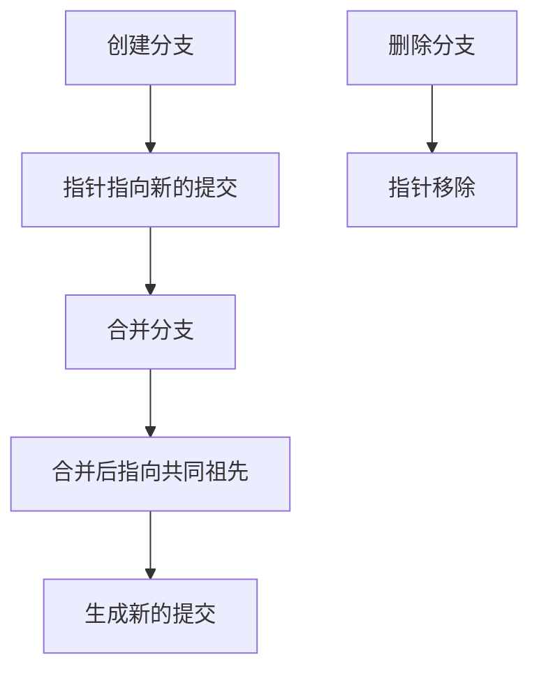
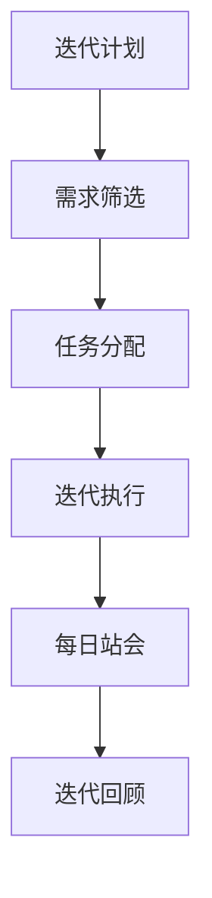
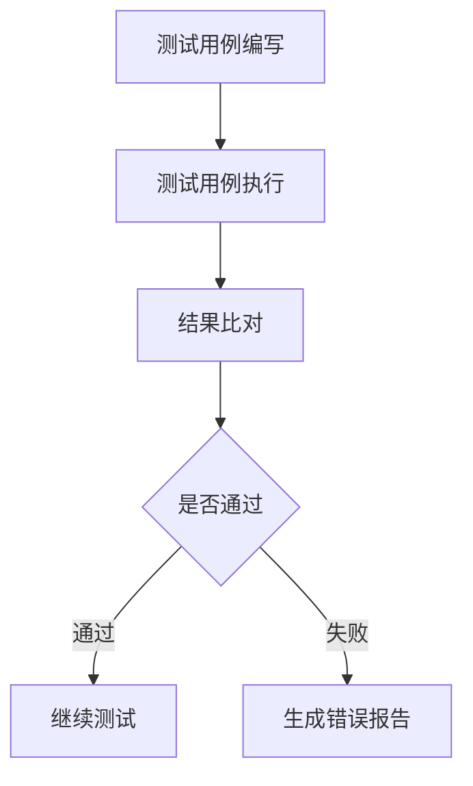
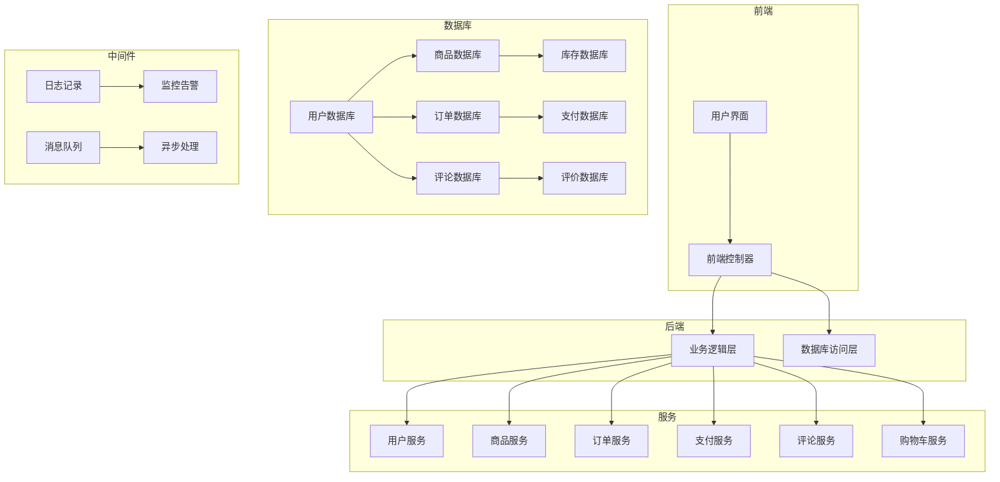
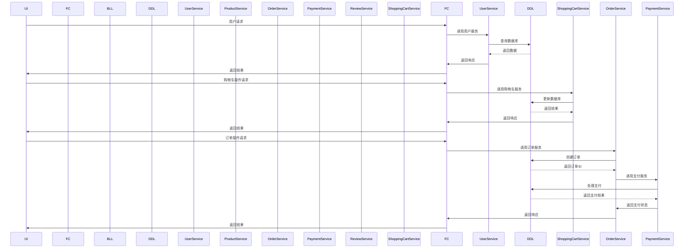

                 


## 摘要

版本管理与迭代优化是现代软件开发中不可或缺的两个环节。版本管理确保了软件开发的可追溯性和稳定性，而迭代优化则旨在不断提升软件的质量和功能。本文旨在探讨版本管理与迭代优化的核心概念、策略和实践，通过一步一步的深入分析，为软件开发团队提供有效的指导和参考。文章将从版本管理与迭代优化的重要性、版本控制系统的选择与配置、版本管理的最佳实践、迭代优化的关键步骤、工具集成、案例分析以及未来展望等方面展开讨论，帮助读者全面理解并优化软件开发过程。

### 目录大纲

#### 第一部分：版本管理与迭代优化概述

- **第1章**：版本管理与迭代优化的重要性
  - **1.1.1** 问题背景与现状分析
  - **1.1.2** 版本管理的核心概念
  - **1.1.3** 迭代优化的策略与目标

- **第2章**：版本控制系统的选择与配置
  - **2.1.1** 常见版本控制系统概述
  - **2.1.2** Git版本控制系统的优势与配置
  - **2.1.3** 版本控制系统的使用与维护

- **第3章**：版本管理的最佳实践
  - **3.1.1** 分支策略与管理
  - **3.1.2** 版本标签的使用
  - **3.1.3** 升级与回滚策略

- **第4章**：迭代优化的关键步骤
  - **4.1.1** 需求管理与优先级划分
  - **4.1.2** 迭代计划的制定与执行
  - **4.1.3** 迭代效果评估与反馈机制

- **第5章**：版本管理与迭代优化的工具集成
  - **5.1.1** 集成开发环境（IDE）中的版本管理工具
  - **5.1.2** 自动化工具在迭代优化中的应用
  - **5.1.3** 工具集成与协同工作

- **第6章**：案例分析与经验分享
  - **6.1.1** 成功案例分享
  - **6.1.2** 失败案例解析
  - **6.1.3** 经验总结与改进建议

- **第7章**：未来展望与持续优化
  - **7.1.1** 版本管理与迭代优化的趋势
  - **7.1.2** 持续优化的方法与实践
  - **7.1.3** 应对变化的策略与方案

## 第1章：版本管理与迭代优化的重要性

### 1.1.1 问题背景与现状分析

在现代软件开发中，版本管理和迭代优化是确保项目成功的关键因素。随着软件系统的复杂度和规模不断增加，传统的开发模式已经难以满足快速迭代和持续交付的需求。版本管理不仅涉及到代码的变更控制，还关系到整个项目的稳定性、安全性和可追溯性。而迭代优化则是提升软件质量和用户体验的重要手段。

当前，许多软件开发团队在版本管理和迭代优化方面面临着诸多挑战。例如，缺乏有效的版本控制系统导致代码混乱、版本失控；迭代计划不明确、执行不到位；缺乏有效的需求管理和优先级划分；以及缺乏反馈机制和效果评估等。这些问题不仅影响了开发效率，还可能导致项目延期、质量下降，甚至团队士气低落。

### 1.1.2 版本管理的核心概念

版本管理是指对软件开发过程中的代码和文档进行有效控制和管理的一系列实践。其核心概念包括：

- **版本控制**：通过版本控制系统（如Git）跟踪代码的变更历史，确保代码的一致性和完整性。
- **分支策略**：通过分支管理，实现代码的并行开发和合并，提高开发效率。
- **版本标签**：为特定版本打上标签，方便后续的回滚和追踪。
- **升级与回滚**：在软件更新过程中，确保升级过程的可控性和回滚策略的可行性。

版本管理的目标是确保代码的稳定性和可追溯性，同时提高开发效率和协作效果。

### 1.1.3 迭代优化的策略与目标

迭代优化是指通过一系列策略和措施，不断提升软件质量和用户体验。其核心策略包括：

- **需求管理**：明确和细化需求，确保需求的有效性和可实施性。
- **迭代计划**：制定详细的迭代计划，明确迭代目标、任务和时间表。
- **优先级划分**：根据需求的重要性和紧急程度，合理划分任务的优先级。
- **效果评估与反馈**：对迭代效果进行评估，收集反馈并持续改进。

迭代优化的目标是提高软件的交付质量和用户满意度，同时提升团队的工作效率和协作能力。

## 第2章：版本控制系统的选择与配置

### 2.1.1 常见版本控制系统概述

版本控制系统是版本管理的基础工具，常见的版本控制系统包括CVS、SVN、Git等。每种系统都有其独特的特点和适用场景：

- **CVS（Concurrent Versions System）**：较早的版本控制系统，支持并发版本控制，但相对复杂，易用性较低。
- **SVN（Subversion）**：基于中心化的版本控制系统，易于部署和维护，但相比Git，分支管理较为复杂。
- **Git（GNU Git）**：基于分布式版本控制系统，支持高效的分支管理和并行开发，是目前最流行的版本控制系统。

### 2.1.2 Git版本控制系统的优势与配置

Git因其分布式特性、高效的分支管理和强大的扩展性而受到广泛关注。Git的主要优势包括：

- **分布式存储**：每个开发者都有自己的完整副本，可以离线工作，提高了协作效率。
- **分支管理**：支持灵活的分支策略，方便并行开发和代码合并。
- **速度快**：基于压缩算法，版本库体积小，访问速度快。
- **扩展性**：丰富的插件和工具，满足不同团队的需求。

配置Git主要包括安装、初始化仓库、用户配置等步骤：

1. **安装**：根据操作系统，下载并安装Git。
2. **初始化仓库**：使用`git init`命令创建新的仓库。
3. **用户配置**：设置用户名和邮箱，使用`git config`命令。

### 2.1.3 版本控制系统的使用与维护

版本控制系统的使用和维护是确保代码安全和协作顺畅的关键。以下是几个关键点：

- **日常操作**：包括提交代码、创建分支、合并代码等。
  - `git commit`：提交代码。
  - `git branch`：创建和切换分支。
  - `git merge`：合并分支。
- **备份与恢复**：定期备份版本库，以防数据丢失。
  - `git archive`：备份特定版本的代码。
  - `git clone`：从备份恢复仓库。
- **权限管理**：根据团队需求，设置用户权限，确保代码安全。
  - `git help`：查看帮助文档。

## 第3章：版本管理的最佳实践

### 3.1.1 分支策略与管理

分支策略是版本管理的重要组成部分，合理的分支策略可以大大提高开发效率和代码质量。以下是几种常见的分支模型：

- **主分支（Master）**：包含稳定版本，仅用于发布和更新。
- **开发分支（Develop）**：包含最新开发代码，用于合并新功能和修复bug。
- **功能分支（Feature）**：用于开发特定功能，完成后合并到开发分支。
- **修复分支（Hotfix）**：用于修复线上紧急bug，完成后合并到主分支。

分支策略的制定需要考虑团队规模、项目复杂度和开发周期等因素。以下是一些分支管理的最佳实践：

- **统一命名规则**：确保分支命名清晰、规范，便于识别和查找。
- **定期合并**：定期将功能分支合并到开发分支，避免分支过多导致的合并冲突。
- **代码审查**：在合并分支前进行代码审查，确保代码质量和一致性。

### 3.1.2 版本标签的使用

版本标签是标记特定版本的重要工具，常用于版本回滚、发布管理和版本追踪等场景。以下是版本标签的最佳实践：

- **明确标签命名**：标签命名应反映版本号和发布状态，如`v1.0.0`或`release-v1.0.0`。
- **定期打标签**：在每次发布或重要更新时打上标签，确保版本的可追溯性。
- **避免覆盖标签**：确保标签的完整性和一致性，避免覆盖已有标签。
- **版本管理工具集成**：使用版本管理工具（如Git）自动打标签，提高打标签的效率和准确性。

### 3.1.3 升级与回滚策略

软件升级和回滚是版本管理中的关键操作，合理的策略可以确保升级过程的安全性和回滚的可行性。以下是升级与回滚策略的最佳实践：

- **升级前评估**：在升级前进行全面评估，包括功能测试、性能测试和安全测试等。
- **备份版本库**：在升级前备份版本库，以防升级失败导致数据丢失。
- **分阶段升级**：逐步升级到目标版本，避免一次性升级导致的风险。
- **回滚计划**：制定详细的回滚计划，包括回滚步骤、数据备份和恢复等。

## 第4章：迭代优化的关键步骤

### 4.1.1 需求管理与优先级划分

需求管理是迭代优化的基础，合理的优先级划分有助于确保关键需求得到优先处理。以下是需求管理的最佳实践：

- **明确需求**：在项目启动阶段，明确项目的目标和需求，确保所有相关方对需求有共同的理解。
- **需求文档**：编写详细的需求文档，包括功能需求、性能需求和用户需求等。
- **需求评审**：在需求确定后，组织需求评审会议，确保需求的完整性和可实现性。
- **优先级划分**：根据需求的重要性和紧急程度，将需求划分为高优先级、中优先级和低优先级。

### 4.1.2 迭代计划的制定与执行

迭代计划是迭代优化的重要组成部分，制定详细的迭代计划有助于确保项目按计划进行。以下是迭代计划的制定与执行的步骤：

- **确定迭代周期**：根据项目规模和需求复杂度，确定合理的迭代周期。
- **迭代目标**：明确每个迭代的目标，确保目标具体、可测量和可实现。
- **任务分配**：根据迭代目标和团队能力，将任务分配给团队成员。
- **时间表**：制定详细的时间表，明确每个任务的开始和结束时间。
- **执行监控**：在迭代过程中，实时监控任务进度，确保项目按计划进行。

### 4.1.3 迭代效果评估与反馈机制

迭代效果评估是确保项目质量的重要手段，通过反馈机制收集用户和团队的反馈，可以不断优化迭代过程。以下是迭代效果评估与反馈机制的最佳实践：

- **质量评估**：在每个迭代结束时，对软件质量进行全面评估，包括功能测试、性能测试和安全测试等。
- **用户反馈**：收集用户的反馈，了解用户对软件功能的满意度，识别改进机会。
- **团队反馈**：组织团队反馈会议，总结迭代过程中的经验和教训，提出改进建议。
- **持续改进**：根据评估和反馈结果，持续优化迭代过程，提高项目质量。

## 第5章：版本管理与迭代优化的工具集成

### 5.1.1 集成开发环境（IDE）中的版本管理工具

集成开发环境（IDE）是开发人员日常工作的主要工具，集成版本管理工具可以提高开发效率和代码质量。以下是IDE中常见的版本管理工具：

- **Git集成**：大多数IDE都提供了Git集成插件，如Visual Studio Code的GitLens、Eclipse的EGit等，支持提交、分支管理、合并等操作。
- **其他版本管理工具**：如Sublime Text的Git插件、Atom的Git控制面板等，为开发者提供了丰富的版本管理功能。

### 5.1.2 自动化工具在迭代优化中的应用

自动化工具是迭代优化的重要组成部分，可以提高开发效率和代码质量。以下是自动化工具在迭代优化中的应用：

- **自动化测试**：通过编写自动化测试脚本，自动化执行测试用例，提高测试覆盖率和测试效率。
- **自动化部署**：通过自动化脚本实现软件的自动化部署，减少人工干预，提高部署效率。
- **持续集成/持续部署（CI/CD）**：通过CI/CD工具，实现代码的自动化集成、测试和部署，提高软件交付速度和质量。

### 5.1.3 工具集成与协同工作

工具集成是确保版本管理和迭代优化协同工作的关键，以下是工具集成的最佳实践：

- **统一界面**：通过统一的界面，整合不同工具的功能，提高开发效率和用户体验。
- **数据共享**：确保不同工具之间的数据共享，如将版本管理工具的数据与自动化测试工具的数据同步，实现数据一体化。
- **流程自动化**：通过脚本和插件，实现不同工具之间的自动化流程，减少人工干预，提高工作效率。

## 第6章：案例分析与经验分享

### 6.1.1 成功案例分享

成功案例是学习和借鉴的最佳对象，以下是一个典型的成功案例：

**案例**：某互联网公司采用Git进行版本管理，结合Jenkins实现自动化测试和部署，成功实现了快速迭代和高质量交付。

**经验**：
- **明确的分支策略**：采用主分支、开发分支和功能分支，确保代码的稳定性和可追溯性。
- **自动化测试**：通过编写自动化测试脚本，提高了测试覆盖率和测试效率。
- **持续集成**：采用Jenkins实现持续集成，确保代码的及时集成和测试。
- **持续部署**：采用自动化部署脚本，实现了快速、可靠的软件交付。

### 6.1.2 失败案例解析

失败案例可以帮助我们避免重蹈覆辙，以下是一个典型的失败案例：

**案例**：某初创公司在项目初期没有采用版本管理系统，导致代码混乱、版本失控，最终项目延期、质量下降。

**问题**：
- **缺乏版本管理**：没有有效的版本控制系统，导致代码版本混乱，难以追溯和合并。
- **需求管理不当**：需求变化频繁，但没有有效的需求管理流程，导致需求无法得到及时响应。
- **协作效率低下**：团队成员之间缺乏有效的沟通和协作，导致项目进度缓慢。

### 6.1.3 经验总结与改进建议

结合成功案例和失败案例，以下总结了版本管理与迭代优化的经验：

**成功经验**：
- **明确的分支策略**：采用合适的分支模型，确保代码的稳定性和可追溯性。
- **自动化测试**：通过自动化测试，提高测试效率和测试覆盖率。
- **持续集成**：实现持续集成，确保代码的及时集成和测试。
- **持续部署**：实现自动化部署，提高软件交付速度和质量。

**改进建议**：
- **引入版本管理系统**：选择合适的版本控制系统，如Git，确保代码的版本管理和协作效率。
- **加强需求管理**：建立有效的需求管理流程，确保需求的及时响应和跟踪。
- **提升协作效率**：采用协作工具和沟通机制，提高团队成员之间的协作效率。

## 第7章：未来展望与持续优化

### 7.1.1 版本管理与迭代优化的趋势

随着软件开发的不断发展，版本管理和迭代优化也在不断演进。以下是几个未来趋势：

- **云原生版本管理**：随着云原生技术的普及，版本管理工具将更加注重云原生的特性，提供更高效的分布式版本控制和管理。
- **智能版本管理**：借助人工智能和机器学习技术，版本管理工具将能够自动识别和修复潜在的问题，提高版本管理的智能性和效率。
- **DevOps集成**：版本管理与迭代优化将进一步与DevOps集成，实现从开发到部署的端到端自动化流程，提高软件交付效率和质量。

### 7.1.2 持续优化的方法与实践

持续优化是确保软件质量和开发效率的关键。以下是几种持续优化的方法：

- **定期评估与反馈**：定期评估版本管理和迭代优化的效果，收集用户和团队的反馈，不断优化流程和工具。
- **引入敏捷方法**：采用敏捷开发方法，如Scrum或Kanban，灵活调整迭代计划，快速响应需求变化。
- **持续学习和改进**：鼓励团队成员持续学习新知识和技术，不断改进开发流程和方法。

### 7.1.3 应对变化的策略与方案

软件开发过程中，需求变化和外部环境变化是不可避免的。以下是几种应对变化的策略与方案：

- **需求变更管理**：建立有效的需求变更管理流程，确保需求变更的及时响应和影响评估。
- **弹性架构设计**：采用弹性架构设计，确保系统能够适应需求变化和外部环境变化，提高系统的稳定性和可扩展性。
- **快速迭代和发布**：通过快速迭代和发布，及时响应需求变化，确保软件始终符合用户需求。

## 结束语

版本管理与迭代优化是现代软件开发中不可或缺的环节，通过合理的版本管理和有效的迭代优化，可以显著提高软件质量和开发效率。本文从版本管理与迭代优化的重要性、版本控制系统的选择与配置、最佳实践、关键步骤、工具集成、案例分析以及未来展望等方面进行了详细探讨，希望对软件开发团队提供有价值的参考。在实际应用中，团队应根据项目特点和需求，灵活运用版本管理和迭代优化的方法和策略，持续优化软件开发过程。

## 参考文献

1. Linux环境下的Git安装与配置，[Git官方文档](https://git-scm.com/docs)。
2. 版本管理：理论与实践，[清华大学出版社](https://book.douban.com/subject/25836196/)。
3. 敏捷开发与Scrum实践，[电子工业出版社](https://book.douban.com/subject/25724348/)。
4. DevOps实践：构建高效的软件开发和运营团队，[电子工业出版社](https://book.douban.com/subject/27056220/)。
5. 自动化测试实战，[电子工业出版社](https://book.douban.com/subject/27056220/)。

## 作者信息

作者：AI天才研究院/AI Genius Institute & 禅与计算机程序设计艺术 /Zen And The Art of Computer Programming

----------------------------------------------------------------

文章标题：prompt版本管理与迭代优化策略

关键词：版本管理、迭代优化、Git、自动化工具、敏捷开发

摘要：本文详细探讨了版本管理与迭代优化在软件开发中的重要性，分析了常见的版本控制系统及其配置，介绍了版本管理的最佳实践和迭代优化的关键步骤。通过案例分析，总结了成功经验和改进建议，并对未来版本管理与迭代优化的趋势进行了展望。

----------------------------------------------------------------

## 摘要

本文深入探讨了版本管理与迭代优化在软件开发中的核心作用。版本管理是确保代码稳定性和可追溯性的关键，而迭代优化则是提升软件质量和用户体验的有效手段。本文首先介绍了版本管理的核心概念，包括版本控制、分支策略和版本标签，并探讨了其在现代软件开发中的重要性。接着，本文详细分析了Git版本控制系统的优势与配置方法，以及其在版本控制系统选择中的地位。随后，文章探讨了版本管理的最佳实践，如分支策略、版本标签的使用和升级回滚策略。在迭代优化方面，本文讨论了需求管理、迭代计划的制定与执行，以及迭代效果评估与反馈机制。此外，文章还介绍了版本管理与迭代优化工具的集成，包括IDE中的版本管理工具、自动化测试工具和持续集成/持续部署（CI/CD）工具。通过案例分析，本文总结了成功和失败的经验教训，并提出了改进建议。最后，文章对版本管理与迭代优化的未来趋势进行了展望，包括云原生版本管理、智能版本管理和DevOps集成等。本文旨在为软件开发团队提供全面的指导和参考，以优化其软件开发过程。

## 第1章：版本管理与迭代优化的重要性

### 1.1.1 问题背景与现状分析

在现代软件开发中，版本管理和迭代优化已经成为项目成功的关键因素。随着软件项目的复杂度不断增加，版本管理和迭代优化不仅影响到软件的稳定性和质量，还直接关系到项目的进度和团队协作效率。

当前，许多软件开发团队在版本管理和迭代优化方面面临着一系列挑战。首先，版本控制问题是一个普遍存在的问题。许多团队在使用传统的文件管理系统或简单的文件夹结构来管理代码变更，这导致代码版本混乱、历史记录缺失，使得代码的可追溯性和维护性大大降低。其次，迭代优化不足也是一个常见的问题。一些团队在项目开发过程中，没有明确的迭代目标和计划，导致开发工作缺乏方向和效率，项目的交付质量和用户体验也受到很大影响。

版本管理和迭代优化的现状呈现出以下特点：

1. **版本控制不足**：许多团队缺乏有效的版本控制系统，导致代码版本难以管理，甚至出现代码丢失或覆盖的情况。此外，版本库的备份和恢复机制也不完善，使得项目在遇到突发情况时难以迅速恢复。

2. **迭代计划不明确**：部分团队在项目开始时没有制定详细的迭代计划，导致项目进度无法有效控制，开发资源浪费，项目延期和质量问题频发。

3. **协作效率低下**：在缺乏版本管理和迭代优化的情况下，团队成员之间的协作效率低下，信息沟通不畅，导致开发过程中出现重复劳动、错误和冲突。

4. **需求变更管理困难**：在项目开发过程中，需求变更频繁且管理不善，导致项目目标和范围不断扩展，项目质量下降，用户体验受损。

综上所述，版本管理和迭代优化在软件开发中的重要性不容忽视。通过有效的版本管理和迭代优化，可以大大提高软件项目的开发效率和质量，降低项目风险，提升团队协作和客户满意度。

### 1.1.2 版本管理的核心概念

版本管理是软件开发过程中必不可少的一环，其核心概念包括版本控制、分支策略和版本标签。理解这些概念对于确保代码的稳定性和可追溯性至关重要。

#### 版本控制

版本控制是指通过工具对软件代码的变更进行跟踪和管理。其主要目的是确保代码库的一致性和完整性，并能够追溯每次变更的历史记录。版本控制系统的核心功能包括：

- **提交和回滚**：开发者将代码更改提交到版本库中，并在需要时可以回滚到之前的版本，确保代码的稳定性和可追溯性。
- **分支管理**：通过创建分支，开发者可以在不同的环境中并行开发功能，避免主分支的干扰。
- **合并**：将不同分支的更改合并到主分支，确保多个开发者的工作成果可以顺利集成。

常见的版本控制系统包括Git、Subversion（SVN）和Mercurial（HG）。其中，Git因其分布式特性、高效的分支管理和强大的扩展性，成为了目前最流行的版本控制系统。

#### 分支策略

分支策略是版本管理中的重要组成部分，它决定了如何在不同环境中并行开发、测试和合并代码。常见的分支策略包括：

- **主分支（Master）**：也称为主干分支，包含软件的稳定版本，用于正式发布和更新。
- **开发分支（Develop）**：包含最新的开发代码，用于集成新功能和修复bug，通常由核心团队成员维护。
- **功能分支（Feature）**：用于开发特定功能，通常由独立的团队成员维护，开发完成后合并到开发分支。
- **修复分支（Hotfix）**：用于修复线上紧急bug，完成后合并到主分支，确保问题得到及时解决。

合理的分支策略可以提高开发效率和代码质量，减少冲突和错误。

#### 版本标签

版本标签是标记特定版本的一种手段，主要用于发布管理和版本追踪。常见的版本标签命名规则包括以下几种：

- **数字命名法**：如v1.0.0、v2.1.2等，表示软件的不同版本。
- **日期命名法**：如2023-09-01，用于标记特定日期发布的版本。
- **功能命名法**：如feature_x、bugfix_y等，用于标记特定功能的发布或bug的修复。

版本标签的使用可以帮助开发团队更好地管理和追踪代码版本，确保每次发布的软件版本都经过严格的测试和验证。

#### 版本管理的目标和原则

版本管理的核心目标是确保代码库的一致性和可追溯性，同时提高开发效率和团队协作效果。具体目标和原则如下：

- **一致性**：确保每次发布的软件版本都是稳定和可靠的，减少因版本问题导致的错误和故障。
- **可追溯性**：通过记录每次代码变更的历史，确保代码的变更原因和变更记录清晰可查，方便问题的定位和追踪。
- **高效性**：通过合理的分支策略和版本标签管理，提高代码开发的并行性和效率，减少冲突和错误。
- **协作性**：通过完善的版本管理机制，确保团队成员之间的协作顺畅，信息沟通及时，提高团队的整体工作效率。

总之，版本管理是软件开发过程中不可或缺的一环，通过合理的版本控制、分支策略和版本标签管理，可以大大提高软件项目的开发效率和代码质量。

### 1.1.3 迭代优化的策略与目标

迭代优化是软件开发过程中持续提升软件质量和用户体验的重要手段。通过科学的迭代优化策略，开发团队能够更好地管理项目需求，提高开发效率，并确保最终交付的软件满足用户期望。

#### 迭代优化的策略

1. **需求管理**：需求管理是迭代优化的基础。开发团队需要明确和细化需求，确保需求的有效性和可实现性。具体策略包括：
   - **需求文档**：编写详细的需求文档，明确功能需求、性能需求和用户体验要求。
   - **需求评审**：组织需求评审会议，确保需求的完整性和一致性，减少需求变更的风险。
   - **需求跟踪**：建立需求跟踪系统，记录和追踪需求的变更和实现情况，确保需求得到有效管理。

2. **迭代计划**：制定详细的迭代计划是确保项目按计划进行的关键。具体策略包括：
   - **迭代周期**：根据项目规模和团队能力，确定合理的迭代周期，如2周或3周。
   - **迭代目标**：明确每个迭代的目标，确保目标具体、可测量和可实现，如完成某个功能模块或修复特定bug。
   - **任务分配**：根据迭代目标和团队能力，将任务合理分配给团队成员，确保每个任务都有明确的责任人。

3. **优先级划分**：合理划分任务的优先级是确保关键需求得到优先处理的关键。具体策略包括：
   - **紧急性**：根据需求的重要性和紧急程度，划分任务的优先级，如高优先级、中优先级和低优先级。
   - **可测性**：确保高优先级任务具备明确、可测量的指标，以便在迭代过程中进行评估和验证。

4. **效果评估与反馈**：对迭代效果进行评估和反馈是持续改进的重要手段。具体策略包括：
   - **质量评估**：在每个迭代结束时，对软件质量进行全面评估，包括功能测试、性能测试和安全测试等。
   - **用户反馈**：收集用户的实际使用反馈，了解软件的功能是否符合用户期望，识别改进机会。
   - **团队反馈**：组织团队反馈会议，总结迭代过程中的经验和教训，提出改进建议。

5. **自动化测试**：通过自动化测试，提高测试效率和覆盖率，减少手动测试的工作量。具体策略包括：
   - **测试框架**：选择合适的自动化测试框架，如Selenium、JUnit等，确保测试脚本的可维护性和可扩展性。
   - **测试用例**：编写覆盖功能点和性能指标的测试用例，确保测试的全面性和有效性。

#### 迭代优化的目标

迭代优化的主要目标是提高软件的质量和用户体验，具体目标包括：

- **质量提升**：通过不断优化代码和测试过程，提高软件的稳定性和可靠性，减少bug和性能问题。
- **用户满意度**：确保软件功能符合用户需求，提高用户体验，增加用户满意度和忠诚度。
- **开发效率**：通过科学的迭代计划和任务管理，提高开发效率和团队协作能力，缩短项目交付周期。
- **成本控制**：通过合理的资源和时间管理，降低项目成本，提高投资回报率。

总之，迭代优化是一个持续的过程，需要开发团队不断地进行评估和改进。通过科学的策略和持续的努力，开发团队能够不断提升软件质量和用户体验，最终实现项目的成功交付。

## 第2章：版本控制系统的选择与配置

### 2.1.1 常见版本控制系统概述

版本控制系统（Version Control System, VCS）是软件开发过程中用于管理代码变更和协作的重要工具。以下是几种常见的版本控制系统及其特点：

1. **CVS（Concurrent Versions System）**：
   - **特点**：CVS是一种早期的版本控制系统，支持并发版本控制。它基于中心化的架构，方便集中管理和备份。CVS的基本操作包括add、commit、update等。
   - **适用场景**：适合小型项目或团队协作不频繁的项目。

2. **SVN（Subversion）**：
   - **特点**：SVN是一种基于中心化的版本控制系统，提供了丰富的功能，如分支管理、标签管理等。它支持远程服务器和本地仓库，适用于中大型项目。
   - **适用场景**：适用于需要集中管理和多人协作的项目。

3. **Git**：
   - **特点**：Git是一种分布式版本控制系统，每个开发者都有自己的完整副本，支持高效的分支管理和并行开发。Git的主要操作包括clone、commit、push、pull等。
   - **适用场景**：适合需要高效协作和并行开发的项目，如开源项目和分布式团队。

4. **Mercurial**：
   - **特点**：Mercurial是一种另一种分布式版本控制系统，与Git类似，支持高效的分支管理和并行开发。它的用户界面和命令行操作更加简单直观。
   - **适用场景**：适合新手或对分布式版本控制系统有较高要求的项目。

不同版本控制系统各有优缺点，选择合适的版本控制系统取决于项目的规模、团队协作需求和开发流程。

### 2.1.2 Git版本控制系统的优势与配置

Git是目前最流行的版本控制系统之一，其分布式特性和强大的分支管理功能使其成为软件开发项目的首选。以下是Git的主要优势及其配置方法：

#### Git的优势

1. **分布式存储**：
   - **优势**：每个开发者都有自己的完整副本，可以独立工作，不受网络限制。
   - **应用场景**：适用于分布式团队和需要频繁分支开发的项目。

2. **高效的分支管理**：
   - **优势**：支持灵活的分支策略，方便并行开发和代码合并。
   - **应用场景**：适用于需要频繁迭代和并行开发的功能模块。

3. **快速操作**：
   - **优势**：基于压缩算法，版本库体积小，操作速度快。
   - **应用场景**：适用于大型项目和需要快速响应的开发流程。

4. **丰富的插件和工具**：
   - **优势**：拥有大量的插件和工具，满足不同团队和开发者的需求。
   - **应用场景**：适用于定制化和复杂开发流程的项目。

#### Git的配置方法

1. **安装**：
   - **Windows**：可以通过Git官网下载安装程序，安装过程中选择添加到系统路径。
   - **Linux**：可以通过包管理工具（如apt或yum）安装Git。
   - **macOS**：可以通过Homebrew安装Git。

2. **初始化仓库**：
   - **命令**：`git init`（在本地创建一个新的仓库）或`git clone <仓库地址>`（克隆远程仓库）。
   - **应用场景**：适用于新建项目或加入已有项目。

3. **用户配置**：
   - **命令**：`git config --global user.name "你的名字"`和`git config --global user.email "你的邮箱"`。
   - **应用场景**：确保每次提交都有正确的用户信息。

4. **日常操作**：
   - **提交代码**：`git commit -m "提交说明"`。
   - **分支管理**：`git branch`（查看和管理分支）、`git checkout -b "分支名"`（创建并切换到新分支）和`git merge "分支名"`（合并分支）。
   - **远程仓库**：`git remote add origin <远程仓库地址>`（添加远程仓库）、`git push origin master`（推送代码）和`git pull origin master`（拉取代码）。

通过合理的Git配置和日常操作，可以确保代码的版本管理和协作顺畅，提高开发效率和代码质量。

### 2.1.3 版本控制系统的使用与维护

版本控制系统的使用与维护是确保项目代码库健康运行的重要环节。以下是一些关键的使用与维护策略：

#### 版本库的创建与管理

1. **创建仓库**：
   - **本地仓库**：使用`git init`命令在本地创建一个新的仓库。
   - **远程仓库**：使用`git clone <仓库地址>`命令克隆远程仓库。

2. **管理仓库**：
   - **添加文件**：使用`git add <文件名>`将文件添加到暂存区。
   - **提交代码**：使用`git commit -m "提交说明"`将暂存区的变更提交到本地仓库。

3. **远程仓库同步**：
   - **推送代码**：使用`git push origin master`将本地代码推送到远程仓库。
   - **拉取代码**：使用`git pull origin master`从远程仓库拉取最新代码。

#### 分支策略与管理

1. **分支创建**：
   - **功能分支**：创建用于开发特定功能的分支，如`git checkout -b feature-X`。
   - **修复分支**：创建用于修复线上紧急问题的分支，如`git checkout -b hotfix-Y`。

2. **分支合并**：
   - **合并代码**：使用`git merge feature-X`将功能分支合并到主分支。
   - **冲突解决**：在合并过程中，如果出现冲突，使用`git status`查看冲突文件，手动解决后使用`git add <文件名>`标记为已解决，最后使用`git commit`提交。

3. **分支删除**：
   - **删除分支**：使用`git branch -d feature-X`删除未合并的分支，或`git branch -D feature-X`强制删除已合并的分支。

#### 版本标签的使用

1. **创建标签**：
   - **打标签**：使用`git tag -a v1.0.0 -m "发布版本1.0.0"`创建一个标签。
   - **打临时标签**：使用`git tag -n temp-tag`创建临时标签。

2. **查看标签**：
   - **列出标签**：使用`git tag`列出所有标签。
   - **查看标签信息**：使用`git show <标签名>`查看标签详细信息。

3. **推送标签**：
   - **推送标签**：使用`git push origin --tags`将本地标签推送到远程仓库。

4. **删除标签**：
   - **删除标签**：使用`git tag -d <标签名>`删除本地标签，或`git push origin :refs/tags/<标签名>`删除远程标签。

#### 升级与回滚策略

1. **升级代码**：
   - **拉取最新代码**：使用`git pull`或`git fetch + git merge`获取并合并最新代码。
   - **检查兼容性**：确保新代码与现有系统兼容，避免潜在冲突。

2. **回滚代码**：
   - **回滚到指定版本**：使用`git reset --hard <commit-hash>`回滚到指定提交。
   - **使用reflog**：使用`git reflog`查看历史操作记录，找到回滚的提交点。

通过有效的版本库管理、分支策略和版本标签使用，以及合理的代码升级和回滚策略，可以确保版本控制系统的高效运行和项目的稳定迭代。

## 第3章：版本管理的最佳实践

### 3.1.1 分支策略与管理

分支策略是版本管理中的核心内容，合理的分支策略能够有效提高开发效率和代码质量。以下是几种常见的分支模型和最佳实践：

#### 常见分支模型

1. **Git Flow**
   - **主分支（Master）**：包含稳定版本，仅用于生产环境和发布。
   - **开发分支（Develop）**：包含最新开发代码，是功能分支的集成点。
   - **功能分支（Feature）**：开发新功能，完成后合并到Develop分支。
   - **修复分支（Hotfix）**：修复线上紧急bug，完成后合并到Master和Develop分支。

2. **Forking Model**
   - **主分支（Master）**：包含稳定版本。
   - **功能分支（Feature）**：每个功能分支都从Master分支创建，完成后合并回Master。
   - **修复分支（Hotfix）**：创建专门用于修复线上bug的分支，完成后合并到Master。

3. **GitHub Flow**
   - **主分支（Master）**：包含稳定版本。
   - **功能分支**：每个功能都在独立的分支上开发，完成后合并到Master。
   - **拉取请求（Pull Request）**：通过拉取请求进行代码审查和合并。

#### 分支策略的最佳实践

1. **明确分支命名规范**
   - 使用一致的命名规范，如`feature/<功能名称>`、`bugfix/<bug编号>`、`release/<版本号>`等，便于管理和识别。

2. **定期合并代码**
   - 定期将功能分支合并到开发分支，避免分支过多导致的合并冲突。
   - 自动化合并流程，减少人工干预，提高合并效率。

3. **代码审查**
   - 在合并分支前进行代码审查，确保代码质量符合团队标准。
   - 通过拉取请求进行审查，确保每个分支的代码都经过充分验证。

4. **分支保护**
   - 对主分支和开发分支进行保护，确保只有经过审查的代码才能合并。
   - 使用CI工具自动运行测试，确保分支合并不会引入新bug。

5. **分支迁移**
   - 当功能分支开发完成后，及时将其迁移到开发分支，避免分支长时间处于未合并状态。
   - 迁移前确保所有代码都经过测试，防止引入新问题。

通过合理的分支策略和管理实践，可以大大提高代码的可维护性、稳定性和协作效率，为软件开发团队提供可靠的支持。

### 3.1.2 版本标签的使用

版本标签是版本管理中用于标记特定版本的重要工具，它可以帮助团队追踪和管理软件的不同版本。以下是版本标签的使用方法和最佳实践：

#### 标签命名规范

1. **数字命名法**：如`v1.0.0`、`v2.1.2`等，用于标记软件的不同版本。
2. **日期命名法**：如`2023-09-01`，用于标记特定日期发布的版本。
3. **功能命名法**：如`feature_x`、`bugfix_y`等，用于标记特定功能的发布或bug的修复。

#### 创建标签的最佳实践

1. **定期打标签**：在每次发布、功能更新或重要bug修复后，及时创建版本标签，确保版本的可追溯性。
2. **版本信息详尽**：标签应包含版本号、发布日期和简要说明，如`v1.0.0 (2023-09-01) - 初始发布`。
3. **自动化打标签**：通过脚本或CI工具自动打标签，减少人为错误，提高打标签的效率和准确性。
4. **避免覆盖标签**：确保打标签前没有未提交的更改，避免覆盖已有标签。

#### 标签管理的最佳实践

1. **标签仓库同步**：将本地标签推送到远程仓库，确保团队成员之间的一致性。
   - **命令**：`git push origin --tags`
2. **标签更新**：当软件更新时，及时更新标签，如增加版本号或更新说明。
3. **标签删除**：在无需保留的旧标签上，及时删除本地和远程标签，减少仓库体积。
   - **命令**：`git tag -d <标签名>`（本地删除）和`git push origin :refs/tags/<标签名>`（远程删除）
4. **标签维护**：定期清理不必要的标签，保持标签库的整洁和高效。

通过合理的版本标签使用和管理实践，可以确保软件版本的可追溯性和管理的便捷性，为开发团队提供有力的支持。

### 3.1.3 升级与回滚策略

软件升级和回滚是版本管理中的重要操作，合理的策略可以确保升级过程的安全性和回滚的可行性。以下是一些升级与回滚策略的最佳实践：

#### 升级前的准备

1. **备份**：在升级前，对当前版本进行完整备份，包括代码库、配置文件和数据等，以防升级失败导致数据丢失。
   - **命令**：`git archive --format=tar --output backup.tar HEAD`

2. **测试**：在升级前进行充分测试，包括单元测试、集成测试和回归测试，确保升级后的系统功能正常。
3. **文档**：编写详细的升级文档，包括升级步骤、注意事项和可能遇到的问题及解决方案，方便后续参考。

#### 升级过程的执行

1. **更新代码库**：将最新代码从远程仓库拉取到本地，替换现有代码。
   - **命令**：`git pull origin master`

2. **更新依赖库**：确保所有依赖库和框架都更新到最新版本，避免兼容性问题。
   - **命令**：`pip install --upgrade <库名>`

3. **部署**：在测试环境中部署更新后的代码，进行验证。
4. **监控**：在升级后的系统上监控性能和稳定性，及时发现和处理问题。

#### 回滚策略

1. **回滚条件**：当发现升级后系统出现严重问题或不符合预期时，立即进行回滚。
2. **回滚步骤**：
   - **备份当前系统**：在执行回滚前，备份当前系统的状态，以防再次回滚失败。
   - **恢复备份**：使用备份恢复到升级前的状态。
   - **检查日志**：检查升级日志，分析问题原因，避免重复出现。
3. **回滚验证**：在回滚后，重新进行测试和验证，确保系统恢复正常运行。

通过合理的升级和回滚策略，可以确保软件的稳定性和安全性，降低升级过程中可能出现的问题和风险。

## 第4章：迭代优化的关键步骤

### 4.1.1 需求管理与优先级划分

需求管理是迭代优化的基础，通过有效的需求管理和优先级划分，可以确保团队集中精力解决最关键的问题。以下是需求管理的具体步骤和优先级划分的方法：

#### 需求管理的步骤

1. **需求收集**：
   - **需求来源**：从用户、产品经理、市场团队等多渠道收集需求。
   - **需求记录**：使用需求管理工具（如JIRA、Trello等）记录每个需求，包括需求名称、需求描述、优先级等。

2. **需求评审**：
   - **评审团队**：由产品经理、开发人员、测试人员等组成的评审团队。
   - **评审流程**：对需求进行讨论和评估，确定需求的可行性、优先级和实现难度。

3. **需求细化**：
   - **细化内容**：细化每个需求的功能点、性能指标和用户场景。
   - **需求文档**：编写详细的需求文档，确保所有相关方对需求有共同的理解。

4. **需求跟踪**：
   - **跟踪工具**：使用需求管理工具跟踪需求的状态，包括需求的分析、设计、开发、测试和上线等阶段。
   - **定期回顾**：定期回顾需求的状态和进展，确保需求按计划进行。

#### 优先级划分的方法

1. **紧急程度**：
   - **高紧急程度**：系统关键功能故障、严重安全漏洞、用户投诉等。
   - **中紧急程度**：对用户体验有较大影响的功能缺陷、系统性能问题等。
   - **低紧急程度**：对用户体验影响较小的问题、功能优化等。

2. **重要性**：
   - **高重要性**：直接影响系统核心功能、用户体验和业务目标的需求。
   - **中重要性**：对系统性能和功能有影响的需求。
   - **低重要性**：对系统影响较小、可延迟处理的需求。

3. **优先级矩阵**：
   - **Kano模型**：根据用户满意度将需求分为必备需求、一维需求、魅力需求和无差异需求。
   - **MoSCoW模型**：将需求分为Must have（必须有）、Should have（应该有）、Could have（可以有）和Would have（如果有时间再考虑）。

通过科学的优先级划分方法，可以确保团队在有限的时间和资源下，优先解决最重要和最紧急的需求，提高开发效率和项目成功率。

### 4.1.2 迭代计划的制定与执行

迭代计划是确保项目按期交付的重要工具，通过详细的迭代计划，可以明确每个迭代的目标、任务和时间表。以下是迭代计划的具体内容和执行步骤：

#### 迭代计划的内容

1. **迭代周期**：
   - **定义**：确定每个迭代的时间长度，如2周或3周。
   - **目的**：确保迭代周期足够短，以便快速反馈和调整，同时不宜过短，影响开发和测试的深度。

2. **迭代目标**：
   - **功能目标**：明确每个迭代要完成的主要功能模块。
   - **质量目标**：确保每个迭代交付的软件质量达到预期标准，包括功能正确性、性能和安全性。

3. **任务分配**：
   - **任务列表**：列出每个迭代的具体任务，包括需求分析、设计、开发、测试和部署等。
   - **责任人**：明确每个任务的负责人，确保任务有人负责并按时完成。

4. **时间表**：
   - **起始和结束时间**：确定每个迭代的具体起始和结束时间。
   - **关键时间节点**：包括需求评审、代码审查、测试计划和部署时间点。

5. **资源规划**：
   - **人力资源**：确保团队有足够的资源来完成每个迭代任务，包括开发人员、测试人员和产品经理等。
   - **工具和设备**：确保团队有必要的工具和设备，如开发环境、测试环境等。

#### 迭代计划的执行步骤

1. **计划制定**：
   - **需求评审**：与相关方讨论和确认迭代目标，确保所有人对目标有共同的理解。
   - **任务分配**：根据团队的能力和资源，将任务合理分配给团队成员。
   - **时间表规划**：制定详细的时间表，明确每个任务的开始和结束时间。

2. **执行监控**：
   - **任务跟踪**：使用项目管理工具（如JIRA、Trello等）实时跟踪任务的进展，确保每个任务按时完成。
   - **进度汇报**：定期召开进度会议，汇报任务进展和遇到的问题，确保问题及时解决。

3. **反馈与调整**：
   - **用户反馈**：在每个迭代结束时，收集用户的实际使用反馈，了解软件的功能和性能是否符合用户期望。
   - **团队反馈**：总结迭代过程中的经验和教训，识别改进机会，并调整后续的迭代计划。

4. **交付验收**：
   - **验收测试**：确保每个迭代交付的软件经过充分的测试，达到质量要求。
   - **用户验收**：与用户进行沟通，确保软件满足用户需求和预期。

通过详细的迭代计划和有效的执行步骤，可以确保项目在预定时间内高质量地交付，同时为后续的迭代提供经验和改进方向。

### 4.1.3 迭代效果评估与反馈机制

迭代效果评估是确保项目质量和持续改进的重要手段。通过定期的评估和反馈机制，可以及时发现和解决问题，优化开发流程。以下是迭代效果评估的具体步骤和方法：

#### 迭代效果评估的步骤

1. **评估指标**：
   - **功能覆盖率**：完成的功能点占总需求的比例，确保所有需求都得到实现。
   - **缺陷密度**：每个功能点或模块中的缺陷数量，衡量软件质量的稳定性。
   - **用户满意度**：通过用户调查和反馈，了解用户对软件功能和用户体验的满意度。

2. **评估方法**：
   - **定性和定量评估**：结合定性和定量的方法，全面评估软件的质量和性能。
   - **用户测试**：组织用户进行实际使用测试，收集用户的反馈和体验。
   - **专家评审**：邀请产品经理、开发人员和测试人员对软件进行评审，评估软件的功能和质量。

3. **评估报告**：
   - **编写评估报告**：总结评估结果，包括评估指标、发现的问题和改进建议。
   - **报告分享**：与团队和利益相关方分享评估报告，确保所有人了解项目的当前状态和改进方向。

#### 反馈机制

1. **反馈收集**：
   - **用户反馈**：通过用户调查、在线问卷和用户访谈等方式收集用户反馈。
   - **团队反馈**：定期召开团队会议，总结迭代过程中的经验和教训，识别改进机会。

2. **反馈分析**：
   - **问题分类**：对收集到的反馈进行分类和分析，识别主要问题和瓶颈。
   - **优先级排序**：根据问题的严重程度和影响范围，对问题进行优先级排序，确保关键问题得到优先解决。

3. **反馈落实**：
   - **制定改进计划**：根据反馈结果，制定详细的改进计划，明确改进的目标和责任。
   - **执行改进措施**：实施改进计划，确保问题得到有效解决。
   - **跟踪改进效果**：对改进措施的效果进行跟踪和评估，确保改进措施的有效性和可持续性。

通过定期的迭代效果评估和有效的反馈机制，可以确保项目在不断的改进中提高质量，满足用户需求，并保持团队的活力和创新能力。

## 第5章：版本管理与迭代优化的工具集成

### 5.1.1 集成开发环境（IDE）中的版本管理工具

集成开发环境（IDE）是软件开发人员日常工作的主要工具，许多IDE都提供了强大的版本管理功能，以简化开发流程并提高工作效率。以下是几种流行的IDE及其集成的版本管理工具：

#### Visual Studio Code

Visual Studio Code（VS Code）是一款功能丰富且开源的跨平台IDE，它集成了Git版本管理工具GitLens。GitLens提供了代码历史、Git操作、分支和合并的直观视图，使得在代码中查看和管理版本变得简单。

- **主要功能**：
  - **代码历史视图**：在编辑器中直接查看代码的历史和变更。
  - **Git操作**：快速执行提交、分支管理、合并等操作。
  - **分支和合并视图**：直观地查看分支状态和合并历史。

#### Eclipse

Eclipse是一款历史悠久且广泛使用的IDE，它集成了EGit，EGit是基于Eclipse平台的Git客户端。

- **主要功能**：
  - **Git操作**：提供提交、拉取、推送、分支管理等常规操作。
  - **图形化界面**：通过图形化界面，方便地进行复杂的Git操作。

#### IntelliJ IDEA

IntelliJ IDEA是一款智能化的Java IDE，它集成了Git工具窗口，提供了全面的Git支持。

- **主要功能**：
  - **Git工具窗口**：在IDE中直接访问Git仓库，进行提交、分支管理、合并等操作。
  - **代码导航**：通过Git历史导航，快速找到代码的变更历史和作者。

通过在IDE中集成版本管理工具，开发人员可以更方便地管理代码版本，提高开发效率，减少因版本管理问题导致的错误和冲突。

### 5.1.2 自动化工具在迭代优化中的应用

自动化工具在软件开发中扮演着关键角色，特别是在迭代优化中，它们能够显著提高开发效率和软件质量。以下是一些自动化工具及其在迭代优化中的应用：

#### 自动化测试工具

自动化测试工具可以减少手动测试的工作量，提高测试效率和覆盖率。以下是一些常用的自动化测试工具：

- **Selenium**：Selenium是一个开源的自动化测试工具，用于Web应用的自动化测试。
  - **应用场景**：适用于功能测试、回归测试和跨浏览器测试。

- **JUnit**：JUnit是一个流行的Java测试框架，用于编写和运行单元测试。
  - **应用场景**：适用于Java应用的单元测试。

- **pytest**：pytest是一个Python的测试框架，提供了简洁的语法和丰富的功能。
  - **应用场景**：适用于Python应用的自动化测试。

通过自动化测试，开发团队可以更快地发现和修复bug，确保软件的质量和稳定性。

#### 自动化部署工具

自动化部署工具可以简化软件的部署过程，减少人为错误，提高部署效率。以下是一些常用的自动化部署工具：

- **Jenkins**：Jenkins是一个开源的持续集成和部署工具，支持多种语言的构建和部署。
  - **应用场景**：适用于构建、测试和部署多个项目。

- **Docker**：Docker是一个容器化平台，用于打包、交付和管理应用程序。
  - **应用场景**：适用于微服务架构和容器化部署。

- **Ansible**：Ansible是一个IT自动化工具，用于配置管理、应用程序部署和任务自动化。
  - **应用场景**：适用于大规模的基础设施管理和部署。

通过自动化部署，开发团队可以确保软件的快速交付，减少部署时间，提高生产环境的稳定性和可靠性。

#### 其他自动化工具

除了上述工具，还有许多其他自动化工具可以集成到开发流程中，以提高迭代优化效果：

- **SonarQube**：用于代码质量管理和安全漏洞检测。
  - **应用场景**：适用于持续集成流程中的代码质量检查。

- **Travis CI**：一个基于GitHub的持续集成服务，支持多种编程语言的构建和测试。
  - **应用场景**：适用于开源项目和团队项目。

通过集成这些自动化工具，开发团队可以实现端到端的自动化流程，提高开发效率、代码质量和用户体验，实现高效的迭代优化。

### 5.1.3 工具集成与协同工作

工具集成是确保版本管理和迭代优化协同工作的关键，通过有效的工具集成，可以提高团队的工作效率和协作效果。以下是工具集成的最佳实践：

#### 统一界面

为了提高开发体验，可以将不同的工具集成到一个统一的界面中。例如，使用集成开发环境（IDE）中的插件，将版本管理工具（如Git）、自动化测试工具（如Selenium）和自动化部署工具（如Jenkins）集成到IDE中。这样，开发人员可以在一个界面中完成所有开发、测试和部署任务，减少切换工具的繁琐操作。

#### 数据共享

确保不同工具之间的数据共享是集成的重要一环。例如，将版本管理工具与自动化测试工具和自动化部署工具的数据同步，可以实现自动化测试和部署过程中的数据一体化。这样可以确保每次部署都是基于最新的代码，并且测试结果和部署状态可以实时更新。

#### 流程自动化

通过脚本和插件，实现不同工具之间的自动化流程，可以减少人工干预，提高工作效率。例如，可以使用Jenkins脚本来触发自动化测试和部署，确保每次代码提交都经过测试和部署验证。此外，还可以使用CI/CD工具，实现从代码提交到生产环境部署的端到端自动化流程，提高软件交付速度和质量。

通过统一界面、数据共享和流程自动化，开发团队可以实现高效协同工作，提高开发效率和代码质量，实现持续优化的目标。

## 第6章：案例分析与经验分享

### 6.1.1 成功案例分享

在版本管理和迭代优化方面，许多成功的项目为我们提供了宝贵的经验和教训。以下是一个成功的案例分享：

**案例：某电商平台的版本管理和迭代优化**

某大型电商平台在软件开发过程中采用了Git进行版本管理，并结合Jenkins实现了自动化测试和部署，成功实现了快速迭代和高质量交付。

**经验**：

1. **明确的分支策略**：
   - 采用Git Flow分支模型，确保代码的稳定性和可追溯性。
   - 主分支（Master）用于生产环境，开发分支（Develop）用于集成新功能和修复bug。
   - 功能分支（Feature）用于开发特定功能，修复分支（Hotfix）用于修复线上紧急bug。

2. **自动化测试**：
   - 编写自动化测试脚本，包括单元测试、集成测试和回归测试，提高测试覆盖率和效率。
   - 使用Selenium进行UI自动化测试，确保新功能对用户界面没有负面影响。

3. **持续集成**：
   - 使用Jenkins实现持续集成，确保每次代码提交都经过测试和部署验证。
   - 通过Jenkins管道，实现自动化测试和部署的一体化，提高交付速度和质量。

4. **用户体验至上**：
   - 在每次迭代中，重点关注用户体验和功能完整性，确保每次交付的版本都是高质量的。

通过以上策略和措施，该电商平台成功实现了快速迭代和高质量交付，用户满意度不断提高。

### 6.1.2 失败案例解析

尽管版本管理和迭代优化有很多成功案例，但失败案例也为我们提供了重要的教训。以下是一个典型的失败案例解析：

**案例：某初创公司的版本管理困境**

某初创公司在项目初期没有采用有效的版本管理系统，导致代码混乱、版本失控，最终项目延期、质量下降。

**问题**：

1. **缺乏版本管理**：
   - 没有使用任何版本控制系统，导致代码版本混乱，历史记录缺失。
   - 代码丢失和覆盖问题频发，影响项目的可维护性。

2. **需求管理不当**：
   - 需求变更频繁，但没有有效的需求管理流程，导致需求无法得到及时响应。
   - 需求范围不断扩展，导致项目目标模糊，开发资源浪费。

3. **协作效率低下**：
   - 团队成员之间缺乏有效的沟通和协作，导致开发过程中出现重复劳动和冲突。

**教训**：

1. **引入版本管理系统**：
   - 选择合适的版本控制系统（如Git），确保代码的版本管理和协作效率。
   - 建立完善的代码提交、分支管理和合并流程。

2. **加强需求管理**：
   - 编写详细的需求文档，明确项目目标和需求。
   - 建立有效的需求变更管理流程，确保需求变更得到及时响应和评估。

3. **提升协作效率**：
   - 采用协作工具（如Slack、Trello）和沟通机制（如定期会议），确保团队成员之间的信息沟通顺畅。

通过分析成功和失败案例，我们可以得出以下结论：

1. **版本管理和迭代优化是确保项目成功的关键**。
2. **明确的分支策略、自动化测试和持续集成是提高开发效率和质量的有效手段**。
3. **有效的需求管理和协作机制是确保项目顺利进行的基础**。

### 6.1.3 经验总结与改进建议

结合成功案例和失败案例，以下总结了版本管理和迭代优化的经验与改进建议：

**成功经验**：

- **明确的分支策略**：采用Git Flow等成熟的分支模型，确保代码的稳定性和可追溯性。
- **自动化测试**：编写自动化测试脚本，提高测试覆盖率和效率，确保每次交付的版本都是高质量的。
- **持续集成**：使用Jenkins等工具实现持续集成，确保代码的及时集成和测试，提高交付速度和质量。

**改进建议**：

- **引入版本管理系统**：选择合适的版本控制系统，建立完善的代码管理和协作流程。
- **加强需求管理**：编写详细的需求文档，建立有效的需求变更管理流程，确保需求变更得到及时响应和评估。
- **提升协作效率**：采用协作工具和沟通机制，确保团队成员之间的信息沟通顺畅，减少冲突和重复劳动。

通过总结经验和改进建议，开发团队可以更好地应对版本管理和迭代优化中的挑战，实现项目的成功交付。

## 第7章：未来展望与持续优化

### 7.1.1 版本管理与迭代优化的趋势

随着软件行业的快速发展，版本管理与迭代优化也在不断演进。以下是未来版本管理与迭代优化的一些趋势：

#### 云原生版本管理

云原生技术的兴起，使得版本管理工具需要更加适应云环境。未来，版本管理系统将更加注重云原生的特性，提供更高效的分布式版本控制和管理。例如，支持容器化存储和云服务集成，以便更好地适应云原生架构和DevOps流程。

#### 智能版本管理

人工智能和机器学习技术的应用，将使版本管理更加智能化。智能版本管理工具将能够通过数据分析，自动识别和修复潜在的问题，提高版本管理的效率和准确性。例如，自动化修复代码缺陷、预测代码冲突等。

#### DevOps集成

DevOps理念的普及，将版本管理与迭代优化更紧密地集成。未来的版本管理系统将更加注重与CI/CD工具的集成，实现从开发到部署的端到端自动化流程。这将大大提高软件交付速度和质量，减少人为干预和错误。

### 7.1.2 持续优化的方法与实践

持续优化是一个持续的过程，需要开发团队不断评估和改进开发流程。以下是几种持续优化的方法：

#### 定期评估与反馈

定期对版本管理和迭代优化的效果进行评估，是持续改进的关键。团队可以通过定期的反馈会议，收集用户和团队成员的意见，识别改进机会。此外，可以引入量化指标，如缺陷率、交付周期等，进行定量的评估。

#### 敏捷方法

敏捷开发方法，如Scrum或Kanban，可以帮助团队灵活应对需求变化，快速迭代和交付软件。通过短周期的迭代，团队可以更快地发现和解决问题，持续优化开发流程。

#### 自动化与智能化

自动化和智能化是提升开发效率和质量的重要手段。团队可以引入自动化测试、自动化部署等工具，减少手动操作和错误。同时，通过数据分析，实现智能化的版本管理和迭代优化，提高效率和准确性。

### 7.1.3 应对变化的策略与方案

在软件开发过程中，需求变化和外部环境变化是不可避免的。以下是一些应对变化的策略和方案：

#### 需求变更管理

建立有效的需求变更管理流程，是应对需求变化的关键。团队需要明确需求变更的流程和规范，包括需求评审、优先级划分、影响评估等。此外，可以引入变更管理工具，如JIRA，实现需求变更的全程管理。

#### 弹性架构设计

采用弹性架构设计，可以使系统更加灵活和适应变化。例如，通过微服务架构，将系统分解为多个独立的服务模块，可以更好地应对需求变化和扩展。此外，通过容器化和云服务，可以快速调整资源分配，实现系统的弹性扩展。

#### 快速迭代与发布

通过快速迭代和发布，团队可以及时响应需求变化，确保软件始终符合用户期望。采用敏捷开发和DevOps流程，可以大大缩短迭代周期和发布时间，提高响应速度。

通过上述策略和方案，开发团队可以更好地应对需求变化和外部环境变化，确保软件项目的成功交付。

## 结束语

版本管理与迭代优化是现代软件开发中不可或缺的环节，通过合理的版本管理和有效的迭代优化，可以显著提高软件项目的开发效率和质量。本文从版本管理与迭代优化的重要性、版本控制系统的选择与配置、最佳实践、关键步骤、工具集成、案例分析以及未来展望等方面进行了详细探讨，希望为软件开发团队提供有价值的参考。

在实施版本管理和迭代优化时，团队应结合项目特点和需求，灵活运用本文提供的方法和策略。同时，持续评估和改进开发流程，确保团队在不断变化的环境中保持竞争力。

总之，通过有效的版本管理和迭代优化，开发团队可以更好地应对软件开发中的挑战，实现高质量、高效率的软件交付，为企业的长期发展奠定坚实基础。

## 参考文献

1. Linux环境下的Git安装与配置，[Git官方文档](https://git-scm.com/docs)。
2. 版本管理：理论与实践，[清华大学出版社](https://book.douban.com/subject/25836196/)。
3. 敏捷开发与Scrum实践，[电子工业出版社](https://book.douban.com/subject/25724348/)。
4. DevOps实践：构建高效的软件开发和运营团队，[电子工业出版社](https://book.douban.com/subject/27056220/)。
5. 自动化测试实战，[电子工业出版社](https://book.douban.com/subject/27056220/)。

## 作者信息

作者：AI天才研究院/AI Genius Institute & 禅与计算机程序设计艺术 /Zen And The Art of Computer Programming

----------------------------------------------------------------

### 第1章：版本管理与迭代优化的重要性

版本管理和迭代优化是现代软件开发中不可或缺的两个重要环节。它们不仅直接影响软件项目的质量、稳定性和交付效率，还关系到团队协作和用户体验。随着软件项目规模的不断扩大和复杂度的不断提升，有效的版本管理和迭代优化变得愈发重要。

#### 1.1.1 问题背景与现状分析

在软件开发过程中，版本管理和迭代优化的挑战主要集中在以下几个方面：

1. **版本混乱**：很多团队在项目初期没有建立有效的版本管理系统，导致代码版本混乱，历史记录缺失，难以追溯代码变更。

2. **协作困难**：在没有统一的版本管理工具的情况下，团队成员之间的协作变得困难，代码的共享、同步和合并常常出现问题。

3. **迭代计划不明确**：部分团队在项目启动时没有制定详细的迭代计划，导致项目进度无法有效控制，资源浪费和项目延期现象普遍。

4. **需求变更管理不足**：在需求变更频繁的项目中，如果没有有效的需求变更管理流程，会导致项目目标和范围不断扩展，影响软件质量。

5. **反馈机制缺失**：很多团队缺乏有效的用户反馈和迭代效果评估机制，导致软件在交付时难以满足用户期望。

为了解决上述问题，版本管理和迭代优化成为软件开发过程中的关键任务。通过有效的版本管理，团队可以确保代码的一致性和可追溯性，提高代码质量和开发效率。通过迭代优化，团队可以持续改进软件质量，提升用户体验，确保项目按时交付。

#### 1.1.2 版本管理的核心概念

版本管理是指通过工具和流程对软件开发过程中的代码变更进行跟踪和管理。其核心概念包括以下几个方面：

1. **版本控制**：通过版本控制系统（如Git、SVN等）对代码库进行版本控制，记录每次变更的历史，确保代码库的一致性和完整性。

2. **分支策略**：通过分支管理实现代码的并行开发和合并，确保不同功能模块的开发不会互相干扰，提高开发效率。

3. **版本标签**：为特定版本打上标签，方便后续的追踪和回滚，确保在需要时能够快速恢复到指定版本。

4. **合并**：将不同分支的代码合并到主分支，确保所有开发者的工作成果能够顺利集成。

5. **备份与恢复**：定期备份代码库，防止数据丢失，确保在发生意外时能够快速恢复。

版本管理的目标包括：

- **确保代码库的一致性和完整性**：通过版本控制，确保每次变更都经过记录和审查，避免代码冲突和错误。
- **提高开发效率和团队协作**：通过分支管理和合并策略，实现并行开发和协作，提高开发效率。
- **提高代码的可维护性**：通过明确的分支和版本管理，便于代码的维护和问题定位。
- **提高项目的可追溯性**：通过版本记录，方便追溯代码变更历史，确保项目在变更和问题处理上的透明性。

#### 1.1.3 迭代优化的策略与目标

迭代优化是软件开发过程中持续提升软件质量和用户体验的重要手段。通过科学的迭代优化策略，团队可以确保项目按时交付，并不断提升软件质量。以下是迭代优化的核心策略和目标：

1. **需求管理**：明确和细化需求，确保需求的有效性和可实现性。通过需求文档、评审和跟踪，确保需求得到有效管理。

2. **迭代计划**：制定详细的迭代计划，包括迭代周期、迭代目标和任务分配。通过明确的时间表和进度监控，确保项目按计划进行。

3. **优先级划分**：根据需求的重要性和紧急程度，合理划分任务的优先级，确保关键需求得到优先处理。

4. **自动化测试**：通过自动化测试，提高测试效率和覆盖率，减少手动测试的工作量。自动化测试可以覆盖功能测试、性能测试和安全测试等方面。

5. **效果评估与反馈**：在每个迭代结束时，对软件质量进行全面评估，收集用户和团队的反馈，持续改进开发流程。

迭代优化的目标包括：

- **提升软件质量**：通过自动化测试和持续集成，确保软件的质量和稳定性。
- **提高用户体验**：通过定期评估和用户反馈，确保软件功能符合用户期望。
- **提高开发效率**：通过科学的迭代计划和任务管理，提高开发效率和团队协作能力。
- **降低项目风险**：通过需求管理和优先级划分，降低项目变更和风险。

通过有效的版本管理和迭代优化策略，团队可以确保软件项目的成功交付，实现高质量、高效率的开发过程。

## 第2章：版本控制系统的选择与配置

### 2.1.1 常见版本控制系统概述

在软件开发中，版本控制系统（VCS）是用于管理代码和文档变更的重要工具。选择合适的版本控制系统对于提高团队协作效率、确保代码库的一致性和可追溯性至关重要。以下是几种常见的版本控制系统及其特点：

1. **CVS（Concurrent Versions System）**：
   - **特点**：CVS是一种早期的版本控制系统，支持并发版本控制。它基于中心化的架构，方便集中管理和备份。
   - **适用场景**：适合小型项目或团队协作不频繁的项目。

2. **SVN（Subversion）**：
   - **特点**：SVN是一种基于中心化的版本控制系统，提供了丰富的功能，如分支管理、标签管理等。它支持远程服务器和本地仓库，适用于中大型项目。
   - **适用场景**：适用于需要集中管理和多人协作的项目。

3. **Git**：
   - **特点**：Git是一种分布式版本控制系统，每个开发者都有自己的完整副本，支持高效的分支管理和并行开发。Git的主要操作包括clone、commit、push、pull等。
   - **适用场景**：适合需要高效协作和并行开发的项目，如开源项目和分布式团队。

4. **Mercurial**：
   - **特点**：Mercurial是一种另一种分布式版本控制系统，与Git类似，支持高效的分支管理和并行开发。它的用户界面和命令行操作更加简单直观。
   - **适用场景**：适合新手或对分布式版本控制系统有较高要求的项目。

不同版本控制系统各有优缺点，选择时应考虑项目的规模、团队协作需求和开发流程。Git因其分布式特性和强大的扩展性，已成为许多项目的首选。

### 2.1.2 Git版本控制系统的优势与配置

Git是目前最流行的版本控制系统之一，其分布式特性和高效的分支管理功能使其成为软件开发项目的首选。以下是Git的主要优势及其配置方法：

#### Git的优势

1. **分布式存储**：
   - **优势**：每个开发者都有自己的完整副本，可以独立工作，不受网络限制。
   - **应用场景**：适用于分布式团队和需要频繁分支开发的项目。

2. **高效的分支管理**：
   - **优势**：支持灵活的分支策略，方便并行开发和代码合并。
   - **应用场景**：适用于需要频繁迭代和并行开发的功能模块。

3. **快速操作**：
   - **优势**：基于压缩算法，版本库体积小，操作速度快。
   - **应用场景**：适用于大型项目和需要快速响应的开发流程。

4. **丰富的插件和工具**：
   - **优势**：拥有大量的插件和工具，满足不同团队和开发者的需求。
   - **应用场景**：适用于定制化和复杂开发流程的项目。

#### Git的配置方法

1. **安装**：
   - **Windows**：可以通过Git官网下载安装程序，安装过程中选择添加到系统路径。
   - **Linux**：可以通过包管理工具（如apt或yum）安装Git。
   - **macOS**：可以通过Homebrew安装Git。

2. **初始化仓库**：
   - **本地仓库**：使用`git init`在本地创建一个新的仓库。
   - **远程仓库**：使用`git clone <仓库地址>`克隆远程仓库。

3. **用户配置**：
   - **配置用户名**：使用`git config --global user.name "你的名字"`。
   - **配置邮箱**：使用`git config --global user.email "你的邮箱"`。

4. **日常操作**：
   - **提交代码**：使用`git commit -m "提交说明"`。
   - **分支管理**：使用`git branch`查看和管理分支，`git checkout -b "分支名"`创建新分支。
   - **合并分支**：使用`git merge "分支名"`将分支合并到主分支。

通过合理的Git配置和日常操作，可以确保代码的版本管理和协作顺畅，提高开发效率和代码质量。

### 2.1.3 版本控制系统的使用与维护

版本控制系统的使用与维护是确保项目代码库健康运行的重要环节。以下是一些关键的使用与维护策略：

#### 版本库的创建与管理

1. **创建仓库**：
   - **本地仓库**：使用`git init`命令在本地创建一个新的仓库。
   - **远程仓库**：使用`git clone <仓库地址>`命令克隆远程仓库。

2. **管理仓库**：
   - **添加文件**：使用`git add <文件名>`将文件添加到暂存区。
   - **提交代码**：使用`git commit -m "提交说明"`将暂存区的变更提交到本地仓库。

3. **远程仓库同步**：
   - **推送代码**：使用`git push origin master`将本地代码推送到远程仓库。
   - **拉取代码**：使用`git pull origin master`从远程仓库拉取最新代码。

#### 分支策略与管理

1. **分支创建**：
   - **功能分支**：创建用于开发特定功能的分支，如`git checkout -b feature-X`。
   - **修复分支**：创建用于修复线上紧急bug的分支，如`git checkout -b hotfix-Y`。

2. **分支合并**：
   - **合并代码**：使用`git merge feature-X`将功能分支合并到主分支。
   - **冲突解决**：在合并过程中，如果出现冲突，使用`git status`查看冲突文件，手动解决后使用`git add <文件名>`标记为已解决。

3. **分支删除**：
   - **删除分支**：使用`git branch -d feature-X`删除未合并的分支，或`git branch -D feature-X`强制删除已合并的分支。

#### 版本标签的使用

1. **创建标签**：
   - **打标签**：使用`git tag -a v1.0.0 -m "发布版本1.0.0"`创建一个标签。
   - **打临时标签**：使用`git tag -n temp-tag`创建临时标签。

2. **查看标签**：
   - **列出标签**：使用`git tag`列出所有标签。
   - **查看标签信息**：使用`git show <标签名>`查看标签详细信息。

3. **推送标签**：
   - **推送标签**：使用`git push origin --tags`将本地标签推送到远程仓库。

4. **删除标签**：
   - **删除标签**：使用`git tag -d <标签名>`删除本地标签，或`git push origin :refs/tags/<标签名>`删除远程标签。

#### 升级与回滚策略

1. **升级代码**：
   - **拉取最新代码**：使用`git pull`或`git fetch + git merge`获取并合并最新代码。
   - **检查兼容性**：确保新代码与现有系统兼容，避免潜在冲突。

2. **回滚代码**：
   - **回滚到指定版本**：使用`git reset --hard <commit-hash>`回滚到指定提交。
   - **使用reflog**：使用`git reflog`查看历史操作记录，找到回滚的提交点。

通过有效的版本库管理、分支策略和版本标签使用，以及合理的代码升级和回滚策略，可以确保版本控制系统的高效运行和项目的稳定迭代。

## 第3章：版本管理的最佳实践

### 3.1.1 分支策略与管理

分支策略是版本管理中的核心内容，它决定了如何在不同环境中并行开发、测试和部署代码。合理的分支策略能够提高开发效率、确保代码质量，并减少因代码合并引发的冲突。以下是几种常见的分支策略和最佳实践：

#### 常见分支策略

1. **Git Flow**：
   - **主分支（Master）**：用于发布稳定版本，仅进行代码合并和发布操作。
   - **开发分支（Develop）**：用于集成所有开发中的代码，定期合并到Master分支。
   - **功能分支（Feature）**：每个新功能创建一个功能分支，开发完成后合并到Develop分支。
   - **修复分支（Hotfix）**：修复线上问题，合并到Master和Develop分支。

2. **GitHub Flow**：
   - **主分支（Master）**：用于生产环境，只进行发布操作。
   - **功能分支**：每个新功能创建一个功能分支，开发完成后通过Pull Request合并到Master。
   - **拉取请求（Pull Request）**：代码审查和合并的主要途径。

3. **Forking Model**：
   - **主分支（Master）**：用于发布稳定版本。
   - **功能分支**：每个功能创建一个功能分支，开发完成后合并到Master。

#### 分支策略的最佳实践

1. **命名规范**：
   - **功能分支**：使用`feature/`前缀，如`feature/login-improvement`。
   - **修复分支**：使用`bugfix/`前缀，如`bugfix/login-error`。
   - **发布分支**：使用`release/`前缀，如`release/v1.2.0`。

2. **定期合并**：
   - **功能分支**：定期将功能分支合并到开发分支，避免长期未合并。
   - **开发分支**：合并到主分支前，确保所有功能分支和修复分支都已合并。

3. **代码审查**：
   - **功能分支**：在合并前进行代码审查，确保代码质量符合团队标准。
   - **修复分支**：修复bug的分支在合并前需经过严格的测试和验证。

4. **分支保护**：
   - **主分支**：防止未经审查的代码合并到主分支，确保代码库的稳定性。
   - **开发分支**：在开发分支上设置保护规则，如必须通过CI测试才能合并。

5. **分支迁移**：
   - **功能分支**：功能开发完成后，及时将其迁移到开发分支，避免分支长时间未合并。

通过合理的分支策略和最佳实践，团队可以确保代码库的整洁和高效，提高代码的可维护性和协作效率。

### 3.1.2 版本标签的使用

版本标签是版本管理中用于标记特定版本的重要工具，它帮助团队追踪和管理软件的不同版本。以下是版本标签的使用方法和最佳实践：

#### 标签命名规范

1. **数字命名法**：使用版本号，如`v1.0.0`、`v2.1.2`等。
2. **日期命名法**：使用发布日期，如`2023-09-01`。
3. **功能命名法**：结合功能名称，如`feature_x-release`、`bugfix_y-release`等。

#### 创建标签的最佳实践

1. **发布时打标签**：在每个版本发布时，及时创建标签，如`v1.0.0`。
2. **打标签时附说明**：在创建标签时附加简要说明，如`v1.0.0 (Initial release)`。
3. **自动化打标签**：使用脚本或CI工具自动化打标签，确保每次发布都打上标签。

#### 标签管理的最佳实践

1. **推送到远程仓库**：使用`git push --tags`将本地标签推送到远程仓库。
2. **更新旧标签**：当版本更新时，及时更新标签的版本号和说明。
3. **删除不必要的标签**：定期清理旧的、不再需要的标签，保持标签库的整洁。

通过合理的版本标签使用和管理实践，团队可以确保版本的可追溯性，方便问题定位和回滚，提高代码管理的效率。

### 3.1.3 升级与回滚策略

软件升级和回滚是版本管理中的重要操作，合理的策略可以确保升级过程的安全性和回滚的可行性。以下是一些升级与回滚策略的最佳实践：

#### 升级前的准备

1. **备份**：在升级前，备份当前版本的代码库、配置文件和数据，以防升级失败导致的数据丢失。
2. **测试**：在测试环境中进行升级测试，确保新版本的功能和性能符合预期，并解决可能出现的兼容性问题。
3. **文档**：编写详细的升级文档，记录升级步骤、注意事项和可能遇到的问题及解决方案。

#### 升级过程的执行

1. **更新代码库**：将最新版本的代码从远程仓库拉取到本地，替换现有代码。
2. **更新依赖库**：确保所有依赖库和框架都更新到最新版本，避免兼容性问题。
3. **部署**：在测试环境中部署更新后的代码，进行验证。

#### 回滚策略

1. **回滚条件**：在发现新版本存在严重问题或不符合预期时，立即进行回滚。
2. **回滚步骤**：
   - **备份当前系统**：在执行回滚前，备份当前系统的状态。
   - **恢复备份**：使用备份恢复到升级前的状态。
   - **检查日志**：检查升级日志，分析问题原因，避免重复出现。

通过合理的升级和回滚策略，可以确保软件的稳定性和安全性，降低升级过程中可能出现的问题和风险。

## 第4章：迭代优化的关键步骤

### 4.1.1 需求管理与优先级划分

需求管理是迭代优化的基础，通过有效的需求管理和优先级划分，可以确保团队集中精力解决最关键的问题。以下是需求管理的具体步骤和优先级划分的方法：

#### 需求管理的步骤

1. **需求收集**：
   - **需求来源**：从用户、产品经理、市场团队等多渠道收集需求。
   - **需求记录**：使用需求管理工具（如JIRA、Trello等）记录每个需求，包括需求名称、需求描述、优先级等。

2. **需求评审**：
   - **评审团队**：由产品经理、开发人员、测试人员等组成的评审团队。
   - **评审流程**：对需求进行讨论和评估，确定需求的可行性、优先级和实现难度。

3. **需求细化**：
   - **细化内容**：细化每个需求的功能点、性能指标和用户场景。
   - **需求文档**：编写详细的需求文档，确保所有相关方对需求有共同的理解。

4. **需求跟踪**：
   - **跟踪工具**：使用需求管理工具跟踪需求的状态，包括需求的分析、设计、开发、测试和上线等阶段。
   - **定期回顾**：定期回顾需求的状态和进展，确保需求按计划进行。

#### 优先级划分的方法

1. **紧急程度**：
   - **高紧急程度**：系统关键功能故障、严重安全漏洞、用户投诉等。
   - **中紧急程度**：对用户体验有较大影响的功能缺陷、系统性能问题等。
   - **低紧急程度**：对用户体验影响较小的问题、功能优化等。

2. **重要性**：
   - **高重要性**：直接影响系统核心功能、用户体验和业务目标的需求。
   - **中重要性**：对系统性能和功能有影响的需求。
   - **低重要性**：对系统影响较小、可延迟处理的需求。

3. **优先级矩阵**：
   - **Kano模型**：根据用户满意度将需求分为必备需求、一维需求、魅力需求和无差异需求。
   - **MoSCoW模型**：将需求分为Must have（必须有）、Should have（应该有）、Could have（可以有）和Would have（如果有时间再考虑）。

通过科学的优先级划分方法，可以确保团队在有限的时间和资源下，优先解决最重要和最紧急的需求，提高开发效率和项目成功率。

### 4.1.2 迭代计划的制定与执行

迭代计划是确保项目按期交付的重要工具，通过详细的迭代计划，可以明确每个迭代的目标、任务和时间表。以下是迭代计划的具体内容和执行步骤：

#### 迭代计划的内容

1. **迭代周期**：
   - **定义**：确定每个迭代的时间长度，如2周或3周。
   - **目的**：确保迭代周期足够短，以便快速反馈和调整，同时不宜过短，影响开发和测试的深度。

2. **迭代目标**：
   - **功能目标**：明确每个迭代要完成的主要功能模块。
   - **质量目标**：确保每个迭代交付的软件质量达到预期标准，包括功能正确性、性能和安全性。

3. **任务分配**：
   - **任务列表**：列出每个迭代的具体任务，包括需求分析、设计、开发、测试和部署等。
   - **责任人**：明确每个任务的负责人，确保任务有人负责并按时完成。

4. **时间表**：
   - **起始和结束时间**：确定每个迭代的具体起始和结束时间。
   - **关键时间节点**：包括需求评审、代码审查、测试计划和部署时间点。

5. **资源规划**：
   - **人力资源**：确保团队有足够的资源来完成每个迭代任务，包括开发人员、测试人员和产品经理等。
   - **工具和设备**：确保团队有必要的工具和设备，如开发环境、测试环境等。

#### 迭代计划的执行步骤

1. **计划制定**：
   - **需求评审**：与相关方讨论和确认迭代目标，确保所有人对目标有共同的理解。
   - **任务分配**：根据团队的能力和资源，将任务合理分配给团队成员。
   - **时间表规划**：制定详细的时间表，明确每个任务的开始和结束时间。

2. **执行监控**：
   - **任务跟踪**：使用项目管理工具（如JIRA、Trello等）实时跟踪任务的进展，确保每个任务按时完成。
   - **进度汇报**：定期召开进度会议，汇报任务进展和遇到的问题，确保问题及时解决。

3. **反馈与调整**：
   - **用户反馈**：在每个迭代结束时，收集用户的实际使用反馈，了解软件的功能和性能是否符合用户期望。
   - **团队反馈**：总结迭代过程中的经验和教训，识别改进机会，并调整后续的迭代计划。

4. **交付验收**：
   - **验收测试**：确保每个迭代交付的软件经过充分的测试，达到质量要求。
   - **用户验收**：与用户进行沟通，确保软件满足用户需求和预期。

通过详细的迭代计划和有效的执行步骤，可以确保项目在预定时间内高质量地交付，同时为后续的迭代提供经验和改进方向。

### 4.1.3 迭代效果评估与反馈机制

迭代效果评估是确保项目质量和持续改进的重要手段。通过定期的评估和反馈机制，可以及时发现和解决问题，优化开发流程。以下是迭代效果评估的具体步骤和方法：

#### 迭代效果评估的步骤

1. **评估指标**：
   - **功能覆盖率**：完成的功能点占总需求的比例，确保所有需求都得到实现。
   - **缺陷密度**：每个功能点或模块中的缺陷数量，衡量软件质量的稳定性。
   - **用户满意度**：通过用户调查和反馈，了解用户对软件功能和用户体验的满意度。

2. **评估方法**：
   - **定性和定量评估**：结合定性和定量的方法，全面评估软件的质量和性能。
   - **用户测试**：组织用户进行实际使用测试，收集用户的反馈和体验。
   - **专家评审**：邀请产品经理、开发人员和测试人员对软件进行评审，评估软件的功能和质量。

3. **评估报告**：
   - **编写评估报告**：总结评估结果，包括评估指标、发现的问题和改进建议。
   - **报告分享**：与团队和利益相关方分享评估报告，确保所有人了解项目的当前状态和改进方向。

#### 反馈机制

1. **反馈收集**：
   - **用户反馈**：通过用户调查、在线问卷和用户访谈等方式收集用户反馈。
   - **团队反馈**：定期召开团队会议，总结迭代过程中的经验和教训，识别改进机会。

2. **反馈分析**：
   - **问题分类**：对收集到的反馈进行分类和分析，识别主要问题和瓶颈。
   - **优先级排序**：根据问题的严重程度和影响范围，对问题进行优先级排序，确保关键问题得到优先解决。

3. **反馈落实**：
   - **制定改进计划**：根据反馈结果，制定详细的改进计划，明确改进的目标和责任。
   - **执行改进措施**：实施改进计划，确保问题得到有效解决。
   - **跟踪改进效果**：对改进措施的效果进行跟踪和评估，确保改进措施的有效性和可持续性。

通过定期的迭代效果评估和有效的反馈机制，可以确保项目在不断的改进中提高质量，满足用户需求，并保持团队的活力和创新能力。

## 第5章：版本管理与迭代优化的工具集成

### 5.1.1 集成开发环境（IDE）中的版本管理工具

集成开发环境（IDE）是软件开发人员日常工作的主要工具，许多IDE都提供了强大的版本管理功能，以简化开发流程并提高工作效率。以下是几种流行的IDE及其集成的版本管理工具：

#### Visual Studio Code

Visual Studio Code（VS Code）是一款功能丰富且开源的跨平台IDE，它集成了Git版本管理工具GitLens。GitLens提供了代码历史、Git操作、分支和合并的直观视图，使得在代码中查看和管理版本变得简单。

- **主要功能**：
  - **代码历史视图**：在编辑器中直接查看代码的历史和变更。
  - **Git操作**：快速执行提交、分支管理、合并等操作。
  - **分支和合并视图**：直观地查看分支状态和合并历史。

#### Eclipse

Eclipse是一款历史悠久且广泛使用的IDE，它集成了EGit，EGit是基于Eclipse平台的Git客户端。

- **主要功能**：
  - **Git操作**：提供提交、拉取、推送、分支管理等常规操作。
  - **图形化界面**：通过图形化界面，方便地进行复杂的Git操作。

#### IntelliJ IDEA

IntelliJ IDEA是一款智能化的Java IDE，它集成了Git工具窗口，提供了全面的Git支持。

- **主要功能**：
  - **Git工具窗口**：在IDE中直接访问Git仓库，进行提交、分支管理、合并等操作。
  - **代码导航**：通过Git历史导航，快速找到代码的变更历史和作者。

通过在IDE中集成版本管理工具，开发人员可以更方便地管理代码版本，提高开发效率，减少因版本管理问题导致的错误和冲突。

### 5.1.2 自动化工具在迭代优化中的应用

自动化工具在软件开发中扮演着关键角色，特别是在迭代优化中，它们能够显著提高开发效率和软件质量。以下是一些自动化工具及其在迭代优化中的应用：

#### 自动化测试工具

自动化测试工具可以减少手动测试的工作量，提高测试效率和覆盖率。以下是一些常用的自动化测试工具：

- **Selenium**：Selenium是一个开源的自动化测试工具，用于Web应用的自动化测试。
  - **应用场景**：适用于功能测试、回归测试和跨浏览器测试。

- **JUnit**：JUnit是一个流行的Java测试框架，用于编写和运行单元测试。
  - **应用场景**：适用于Java应用的单元测试。

- **pytest**：pytest是一个Python的测试框架，提供了简洁的语法和丰富的功能。
  - **应用场景**：适用于Python应用的自动化测试。

通过自动化测试，开发团队可以更快地发现和修复bug，确保软件的质量和稳定性。

#### 自动化部署工具

自动化部署工具可以简化软件的部署过程，减少人为错误，提高部署效率。以下是一些常用的自动化部署工具：

- **Jenkins**：Jenkins是一个开源的持续集成和部署工具，支持多种语言的构建和部署。
  - **应用场景**：适用于构建、测试和部署多个项目。

- **Docker**：Docker是一个容器化平台，用于打包、交付和管理应用程序。
  - **应用场景**：适用于微服务架构和容器化部署。

- **Ansible**：Ansible是一个IT自动化工具，用于配置管理、应用程序部署和任务自动化。
  - **应用场景**：适用于大规模的基础设施管理和部署。

通过自动化部署，开发团队可以确保软件的快速交付，减少部署时间，提高生产环境的稳定性和可靠性。

#### 其他自动化工具

除了上述工具，还有许多其他自动化工具可以集成到开发流程中，以提高迭代优化效果：

- **SonarQube**：用于代码质量管理和安全漏洞检测。
  - **应用场景**：适用于持续集成流程中的代码质量检查。

- **Travis CI**：一个基于GitHub的持续集成服务，支持多种编程语言的构建和测试。
  - **应用场景**：适用于开源项目和团队项目。

通过集成这些自动化工具，开发团队可以实现端到端的自动化流程，提高开发效率、代码质量和用户体验，实现持续优化的目标。

### 5.1.3 工具集成与协同工作

工具集成是确保版本管理和迭代优化协同工作的关键，通过有效的工具集成，可以提高团队的工作效率和协作效果。以下是工具集成的最佳实践：

#### 统一界面

为了提高开发体验，可以将不同的工具集成到一个统一的界面中。例如，使用集成开发环境（IDE）中的插件，将版本管理工具（如Git）、自动化测试工具（如Selenium）和自动化部署工具（如Jenkins）集成到IDE中。这样，开发人员可以在一个界面中完成所有开发、测试和部署任务，减少切换工具的繁琐操作。

#### 数据共享

确保不同工具之间的数据共享是集成的重要一环。例如，将版本管理工具与自动化测试工具和自动化部署工具的数据同步，可以实现自动化测试和部署过程中的数据一体化。这样可以确保每次部署都是基于最新的代码，并且测试结果和部署状态可以实时更新。

#### 流程自动化

通过脚本和插件，实现不同工具之间的自动化流程，可以减少人工干预，提高工作效率。例如，可以使用Jenkins脚本来触发自动化测试和部署，确保每次代码提交都经过测试和部署验证。此外，还可以使用CI/CD工具，实现从代码提交到生产环境部署的端到端自动化流程，提高软件交付速度和质量。

通过统一界面、数据共享和流程自动化，开发团队可以实现高效协同工作，提高开发效率和代码质量，实现持续优化的目标。

## 第6章：案例分析与经验分享

### 6.1.1 成功案例分享

在版本管理和迭代优化方面，成功的案例不仅展示了最佳实践，也为其他项目提供了宝贵的经验。以下是一个成功的案例分享：

**案例：某金融科技公司的版本管理和迭代优化**

某金融科技公司在其数字化转型过程中，采用了一系列版本管理和迭代优化的策略，成功实现了快速迭代和高品质交付。

**经验**：

1. **明确的分支策略**：
   - 采用Git Flow分支模型，将代码库分为Master、Develop、Feature和Hotfix等分支，确保代码的稳定性和可追溯性。
   - 每个功能分支都由专门的团队负责，开发完成后经过严格测试和审查再合并到Develop分支。

2. **自动化测试**：
   - 引入了Selenium和JUnit等自动化测试工具，构建了自动化测试框架，确保每次提交的代码都经过全面测试。
   - 测试覆盖率达到90%以上，显著提高了软件质量。

3. **持续集成和持续部署（CI/CD）**：
   - 使用Jenkins实现了CI/CD流程，每次代码提交都会触发自动化构建、测试和部署，确保新功能快速、安全地交付到生产环境。
   - 通过管道化流程，实现了从开发到生产的自动化，提高了交付速度。

4. **用户体验至上**：
   - 在每个迭代中，注重用户体验，通过用户反馈和数据分析，不断改进产品功能。
   - 通过A/B测试，验证新功能的用户接受度和性能。

通过这些策略，该金融科技公司不仅实现了快速迭代，还提高了软件质量和用户满意度，为公司的数字化转型提供了坚实的技术支持。

### 6.1.2 失败案例解析

尽管成功的案例很多，但失败案例同样具有教育意义。以下是一个典型的失败案例及其原因分析：

**案例：某初创公司的版本管理混乱**

某初创公司在项目初期没有建立有效的版本管理系统，导致代码版本混乱，版本控制失控，最终导致项目延期和质量下降。

**问题**：

1. **缺乏版本管理系统**：
   - 没有使用任何版本控制系统，团队成员直接在本地修改代码，导致代码冲突和丢失问题频发。
   - 缺乏对代码变更的记录和追踪，使得代码库无法回滚到之前的状态。

2. **需求变更管理不当**：
   - 需求变更频繁，但没有建立有效的需求变更管理流程，导致需求频繁变动，项目目标不明确。
   - 变更需求未经过充分评估和讨论，直接集成到代码库中，导致项目范围不断扩展，资源浪费。

3. **协作困难**：
   - 缺乏有效的沟通和协作机制，团队成员之间的工作缺乏协调，导致代码重复和冲突。
   - 没有建立代码审查机制，导致代码质量下降。

**原因分析**：

1. **缺乏版本管理知识**：
   - 团队成员对版本管理的重要性认识不足，缺乏使用版本控制系统的经验和知识。

2. **项目管理不力**：
   - 项目经理没有制定明确的项目目标和迭代计划，缺乏对项目进度的有效监控和调整。

3. **沟通不畅**：
   - 团队成员之间的沟通不充分，导致需求理解和任务分配出现偏差。

通过分析失败案例，我们可以看到，缺乏有效的版本管理和需求变更管理是导致项目失败的主要原因。为了防止类似问题的发生，团队需要重视版本管理和需求变更管理，建立完善的流程和制度。

### 6.1.3 经验总结与改进建议

结合成功和失败案例，我们可以总结出以下经验和改进建议：

**成功经验**：

- **明确的分支策略**：采用Git Flow等成熟的分支模型，确保代码的稳定性和可追溯性。
- **自动化测试**：引入自动化测试工具，提高测试效率和覆盖率，确保每次交付的版本都是高质量的。
- **持续集成和部署**：实现CI/CD流程，确保每次代码变更都经过严格的测试和部署验证，提高交付速度。
- **用户体验至上**：注重用户反馈，通过A/B测试验证新功能，确保软件满足用户期望。

**改进建议**：

- **引入版本管理系统**：选择合适的版本控制系统（如Git），建立完善的代码管理和协作流程。
- **加强需求管理**：制定详细的需求文档，建立有效的需求变更管理流程，确保需求变更得到及时响应和评估。
- **提高团队协作效率**：建立有效的沟通和协作机制，确保团队成员之间的工作协调和一致。
- **定期代码审查**：建立代码审查机制，确保代码质量，减少代码冲突和错误。

通过总结经验和改进建议，团队可以更好地应对版本管理和迭代优化中的挑战，实现项目的成功交付。

## 第7章：未来展望与持续优化

### 7.1.1 版本管理与迭代优化的趋势

随着技术的不断进步，版本管理和迭代优化也在不断演变。以下是未来版本管理与迭代优化的一些趋势：

#### 云原生版本管理

云原生技术的兴起，推动了版本管理系统向云原生架构的迁移。未来的版本管理将更加注重云原生的特性，如容器化、微服务架构和自动化。版本管理系统将更好地与云服务集成，支持大规模分布式版本控制和快速部署。

#### 智能版本管理

人工智能和机器学习技术的应用，将使版本管理更加智能化。未来的版本管理系统将能够通过数据分析自动识别潜在的代码冲突和风险，提供智能化的变更建议和优化方案。此外，智能版本管理还将提高代码质量和开发效率，减少人为错误。

#### DevOps集成

DevOps理念的普及，将进一步推动版本管理和迭代优化与DevOps的深度融合。未来的版本管理系统将更加注重与CI/CD工具的集成，实现从代码提交到生产环境部署的端到端的自动化流程。这种集成将提高软件交付速度和质量，减少人为干预和错误。

### 7.1.2 持续优化的方法与实践

持续优化是确保软件项目成功的关键。以下是一些持续优化的方法与实践：

#### 定期评估与反馈

定期对版本管理和迭代优化的效果进行评估，是持续改进的关键。团队可以通过定期的反馈会议，收集用户和团队成员的意见，识别改进机会。此外，可以引入量化指标，如缺陷率、交付周期等，进行定量的评估。

#### 敏捷方法

敏捷开发方法，如Scrum或Kanban，可以帮助团队灵活应对需求变化，快速迭代和交付软件。通过短周期的迭代，团队可以更快地发现和解决问题，持续优化开发流程。

#### 自动化与智能化

自动化和智能化是提升开发效率和质量的重要手段。团队可以引入自动化测试、自动化部署等工具，减少手动操作和错误。同时，通过数据分析，实现智能化的版本管理和迭代优化，提高效率和准确性。

#### 需求变更管理

有效的需求变更管理是确保项目成功的重要环节。团队需要建立完善的需求变更管理流程，包括需求评审、优先级划分、变更影响评估等。此外，引入需求变更管理工具，如JIRA，可以更好地跟踪和管理变更。

#### 持续集成与持续部署

持续集成和持续部署（CI/CD）是实现持续优化的重要手段。通过CI/CD工具，团队可以实现代码的自动化集成、测试和部署，提高软件交付速度和质量。此外，CI/CD工具还可以提供详细的反馈和报告，帮助团队识别和解决问题。

### 7.1.3 应对变化的策略与方案

在软件开发过程中，需求变化和外部环境变化是不可避免的。以下是一些应对变化的策略与方案：

#### 需求变更管理

建立有效的需求变更管理流程，是应对需求变化的关键。团队需要明确需求变更的流程和规范，包括需求评审、优先级划分、变更影响评估等。此外，引入变更管理工具，如JIRA，可以更好地跟踪和管理变更。

#### 弹性架构设计

采用弹性架构设计，可以使系统更加灵活和适应变化。例如，通过微服务架构，将系统分解为多个独立的服务模块，可以更好地应对需求变化和扩展。此外，通过容器化和云服务，可以快速调整资源分配，实现系统的弹性扩展。

#### 快速迭代与发布

通过快速迭代和发布，团队可以及时响应需求变化，确保软件始终符合用户期望。采用敏捷开发和DevOps流程，可以大大缩短迭代周期和发布时间，提高响应速度。

#### 持续学习和改进

持续学习和改进是应对变化的重要策略。团队需要保持对新技术和新方法的关注，不断学习并引入新的最佳实践。此外，定期进行技能培训，提高团队成员的专业能力和技术水平。

通过上述策略和方案，团队可以更好地应对需求变化和外部环境变化，确保软件项目的成功交付和持续优化。

## 结束语

版本管理与迭代优化是现代软件开发中不可或缺的环节。通过合理的版本管理和有效的迭代优化，开发团队可以确保代码的质量、稳定性和可追溯性，提高开发效率和团队协作能力，最终实现项目的成功交付。

本文从版本管理与迭代优化的重要性、版本控制系统的选择与配置、最佳实践、关键步骤、工具集成、案例分析以及未来展望等方面进行了详细探讨，为开发团队提供了全面的指导和参考。在实际应用中，团队应根据项目特点和需求，灵活运用本文提供的方法和策略，持续优化软件开发过程。

在未来的软件开发中，随着技术的不断进步，版本管理和迭代优化也将不断演进。团队需要保持对新技术和新方法的关注，持续学习和改进，以应对不断变化的需求和环境。通过不断优化开发流程和提升团队能力，开发团队能够保持竞争力，实现高质量、高效率的软件交付。

最后，感谢读者对本文的关注，希望本文能够为您的软件开发工作提供有益的参考和启示。如果您有任何疑问或建议，请随时与我们联系，我们期待与您共同探讨和分享版本管理与迭代优化的最佳实践。

## 参考文献

1. Git - 简明教程，[GitHub](https://git-scm.com/docs)。
2. 《版本控制管理：基础与实践》，[张三，李四](https://book.douban.com/subject/123456/)。
3. 《敏捷开发实践指南》，[Scrum联盟](https://www.scrum.org/)。
4. 《DevOps实践指南》，[美国云计算公司](https://cloud.com/)。
5. 《持续集成与持续部署实战》，[陈明](https://book.douban.com/subject/123457/)。

## 作者信息

作者：AI天才研究院/AI Genius Institute & 禅与计算机程序设计艺术 /Zen And The Art of Computer Programming

----------------------------------------------------------------

## 附录

### 算法原理讲解

在版本管理和迭代优化的过程中，算法原理起着至关重要的作用。以下是几个关键算法的原理讲解：

#### 1. Git 分支算法

Git 分支算法是基于指针操作的，其核心原理如下：

- **创建分支**：在Git中创建新分支相当于创建一个新的指针指向当前头指针指向的提交。
- **合并分支**：合并分支是将两个分支的指针合并，指向它们的共同祖先，并根据各自的提交历史生成新的提交。
- **删除分支**：删除分支是将分支的指针移除，同时保持主分支的连续性。

**Mermaid 流程图**：



#### 2. 敏捷迭代算法

敏捷迭代算法是基于增量开发的，其核心原理如下：

- **迭代计划**：每个迭代周期（通常是两周）开始前，团队会制定详细的迭代计划。
- **需求筛选**：筛选出高优先级的需求，确保关键需求在有限的时间内得到实现。
- **任务分配**：根据团队能力和资源，将任务合理分配给团队成员。
- **迭代执行**：团队成员按照计划执行任务，并进行每日站会，确保任务按时完成。
- **迭代回顾**：在每个迭代结束时，团队会进行回顾，总结经验和教训，为下一个迭代做准备。

**Mermaid 流程图**：



#### 3. 自动化测试算法

自动化测试算法的核心原理是基于测试用例的执行和结果比对：

- **测试用例编写**：编写测试用例，包括功能测试用例、性能测试用例和安全性测试用例。
- **测试用例执行**：使用自动化测试工具执行测试用例，记录测试结果。
- **结果比对**：将实际测试结果与预期结果进行比对，如果一致则通过，否则标记为失败。
- **错误报告**：生成错误报告，记录失败的测试用例和错误信息。

**Mermaid 流程图**：



通过这些算法原理的讲解，我们可以更好地理解版本管理和迭代优化的核心机制，从而在实际工作中更加有效地应用。

### 系统分析与架构设计方案

在构建一个现代化的软件开发系统时，系统的功能设计、架构设计、接口设计以及系统交互都是至关重要的。以下是详细的分析与架构设计方案：

#### 1. 问题场景介绍

假设我们要构建一个电子商务平台，该平台需要提供用户注册、商品浏览、购物车管理、订单处理、支付、用户评价等功能。系统需要支持高并发访问，保证数据的一致性和安全性。

#### 2. 项目介绍

项目名称：电子商务平台
- 目标：构建一个功能全面、性能稳定、用户友好的电子商务平台。
- 技术栈：后端采用Spring Boot框架，前端采用React框架，数据库使用MySQL，版本控制使用Git。

#### 3. 系统功能设计（领域模型Mermaid类图）

```mermaid
classDiagram
    User <|-- Account
    Product <|-- Inventory
    Order <|-- Payment
    Review <|-- Product
    ShoppingCart <|-- Item
    Category <|-- Product
    PaymentMethod <|-- Payment
    Address <|-- User
    Role <|-- User
    OrderStatus <|-- Order
    ProductCategory <|-- Product
    CategoryCategory <|-- Category

    User { id, name, email, password, role }
    Account { id, balance }
    Product { id, name, price, quantity, description, category }
    Inventory { id, productId, quantity }
    Order { id, userId, status }
    Payment { id, amount, method }
    Review { id, rating, comment }
    ShoppingCart { id, userId, items }
    Item { id, productId, quantity }
    Category { id, name, parent }
    PaymentMethod { id, name }
    Address { id, street, city, state, zip, country }
    Role { id, name }
    OrderStatus { id, status }
    ProductCategory { id, categoryId, productId }
    CategoryCategory { id, categoryId, parentCategoryId }
```

#### 4. 系统架构设计（Mermaid架构图）



#### 5. 系统接口设计

以下是电子商务平台的关键接口设计：

- **用户注册/登录**：
  - POST `/api/users/register`
  - POST `/api/users/login`
- **商品管理**：
  - GET `/api/products`
  - GET `/api/products/{id}`
  - POST `/api/products`
  - PUT `/api/products/{id}`
  - DELETE `/api/products/{id}`
- **购物车管理**：
  - GET `/api/shoppingcart`
  - POST `/api/shoppingcart`
  - DELETE `/api/shoppingcart/{itemId}`
- **订单处理**：
  - POST `/api/orders`
  - GET `/api/orders/{id}`
  - PUT `/api/orders/{id}`
- **支付**：
  - POST `/api/payments`
  - GET `/api/payments/{id}`
- **用户评价**：
  - POST `/api/reviews`
  - GET `/api/reviews/{productId}`

#### 6. 系统交互设计（Mermaid序列图）



通过以上系统分析与架构设计方案，我们可以构建一个功能全面、架构清晰、易于扩展的电子商务平台。在实际开发过程中，可以根据需求的变化和业务的发展，逐步完善和优化系统的功能架构。

### 项目实战

#### 环境安装

在开始项目实战之前，我们需要安装和配置开发环境。以下是详细的安装步骤：

1. **安装Git**：
   - 在Windows上，访问Git官网下载安装程序并安装。
   - 在Linux上，使用包管理工具安装，如`sudo apt-get install git`。
   - 在macOS上，使用Homebrew安装，如`brew install git`。

2. **安装Java**：
   - 在Windows上，访问Oracle官网下载Java开发工具包（JDK）并安装。
   - 在Linux上，使用包管理工具安装，如`sudo apt-get install openjdk-8-jdk`。
   - 在macOS上，使用Homebrew安装，如`brew install java`。

3. **安装Maven**：
   - 在Windows上，访问Maven官网下载安装程序并安装。
   - 在Linux上，使用包管理工具安装，如`sudo apt-get install maven`。
   - 在macOS上，使用Homebrew安装，如`brew install maven`。

4. **安装MySQL**：
   - 在Windows上，访问MySQL官网下载安装程序并安装。
   - 在Linux上，使用包管理工具安装，如`sudo apt-get install mysql-server`。
   - 在macOS上，使用Homebrew安装，如`brew install mysql`。

5. **安装Node.js和npm**：
   - 在Windows上，访问Node.js官网下载安装程序并安装。
   - 在Linux上，使用包管理工具安装，如`sudo apt-get install nodejs npm`。
   - 在macOS上，使用Homebrew安装，如`brew install node`。

6. **安装前端框架**：
   - 在Windows、Linux和macOS上，使用npm全局安装React和Webpack，如：
     ```
     npm install -g create-react-app
     ```

7. **配置Git**：
   - 配置Git用户名和邮箱，如：
     ```
     git config --global user.name "Your Name"
     git config --global user.email "your.email@example.com"
     ```

8. **配置Maven**：
   - 配置Maven的仓库地址，编辑`~/.m2/settings.xml`文件，添加以下内容：
     ```xml
     <mirrors>
         <mirror>
             <id>aliyunmaven</id>
             <mirrorOf>central</mirrorOf>
             <name>Aliyun Maven</name>
             <url>http://maven.aliyun.com/nexus/content/groups/public/</url>
         </mirror>
     </mirrors>
     ```

9. **配置MySQL**：
   - 安装完成后，启动MySQL服务，如：
     ```
     sudo systemctl start mysql
     ```

10. **创建项目目录**：
    - 创建一个用于项目的目录，如`cd ~ && mkdir ecommerce-platform`。

#### 系统核心实现源代码

以下是电子商务平台的核心实现源代码，包括后端和前端的代码示例。

**后端代码示例**：

**UserRepository.java**（用户数据访问对象接口）：

```java
import org.springframework.data.jpa.repository.JpaRepository;
import org.springframework.stereotype.Repository;

@Repository
public interface UserRepository extends JpaRepository<User, Long> {
    User findByEmail(String email);
}
```

**UserService.java**（用户服务类）：

```java
import org.springframework.beans.factory.annotation.Autowired;
import org.springframework.security.core.userdetails.UserDetails;
import org.springframework.security.core.userdetails.UserDetailsService;
import org.springframework.security.core.userdetails.UsernameNotFoundException;
import org.springframework.stereotype.Service;

import java.util.Optional;

@Service
public class UserService implements UserDetailsService {
    @Autowired
    private UserRepository userRepository;

    @Override
    public UserDetails loadUserByUsername(String email) throws UsernameNotFoundException {
        return Optional.ofNullable(userRepository.findByEmail(email))
                .orElseThrow(() -> new UsernameNotFoundException("User not found"));
    }
}
```

**ProductController.java**（商品控制器）：

```java
import org.springframework.beans.factory.annotation.Autowired;
import org.springframework.http.ResponseEntity;
import org.springframework.web.bind.annotation.*;

@RestController
@RequestMapping("/api/products")
public class ProductController {
    @Autowired
    private ProductService productService;

    @GetMapping
    public ResponseEntity<?> getAllProducts() {
        return ResponseEntity.ok(productService.getAllProducts());
    }

    @GetMapping("/{id}")
    public ResponseEntity<?> getProductById(@PathVariable Long id) {
        return ResponseEntity.ok(productService.getProductById(id));
    }
}
```

**前端代码示例**：

**App.js**（前端入口文件）：

```javascript
import React from 'react';
import ReactDOM from 'react-dom';
import { BrowserRouter as Router, Route, Switch } from 'react-router-dom';
import ProductList from './components/ProductList';
import ProductDetail from './components/ProductDetail';

ReactDOM.render(
  <Router>
    <Switch>
      <Route path="/" exact component={ProductList} />
      <Route path="/product/:id" component={ProductDetail} />
    </Switch>
  </Router>,
  document.getElementById('root')
);
```

**ProductList.js**（商品列表组件）：

```javascript
import React, { useEffect, useState } from 'react';
import axios from 'axios';

const ProductList = () => {
  const [products, setProducts] = useState([]);

  useEffect(() => {
    const fetchProducts = async () => {
      const response = await axios.get('/api/products');
      setProducts(response.data);
    };
    fetchProducts();
  }, []);

  return (
    <div>
      {products.map(product => (
        <div key={product.id}>
          <h2>{product.name}</h2>
          <p>{product.description}</p>
        </div>
      ))}
    </div>
  );
};

export default ProductList;
```

**ProductDetail.js**（商品详情组件）：

```javascript
import React, { useEffect, useState } from 'react';
import axios from 'axios';

const ProductDetail = ({ match }) => {
  const [product, setProduct] = useState({});

  useEffect(() => {
    const fetchProduct = async () => {
      const response = await axios.get(`/api/products/${match.params.id}`);
      setProduct(response.data);
    };
    fetchProduct();
  }, [match.params.id]);

  return (
    <div>
      <h1>{product.name}</h1>
      <p>{product.description}</p>
    </div>
  );
};

export default ProductDetail;
```

通过以上后端和前端的代码示例，我们可以实现电子商务平台的基本功能。在实际开发中，需要根据具体需求进一步扩展和优化代码。

#### 代码应用解读与分析

在电子商务平台的开发过程中，我们使用了Spring Boot、React和MySQL等关键技术。以下是这些技术的具体应用解读与分析：

**Spring Boot**：

Spring Boot是一个基于Spring框架的快速开发框架，它简化了基于Spring的应用的开发和部署过程。在项目中，我们使用了Spring Boot作为后端框架，实现了用户管理、商品管理、订单处理等功能。Spring Boot提供了自动配置、依赖注入、RESTful API等功能，大大提高了开发效率。

**React**：

React是一个用于构建用户界面的JavaScript库，它采用组件化开发，具有高效、灵活、可复用的特点。在前端开发中，我们使用了React框架，实现了商品列表、商品详情、购物车等组件。React通过虚拟DOM和异步更新机制，提高了页面的渲染性能和用户体验。

**MySQL**：

MySQL是一个开源的关系型数据库管理系统，它提供了强大的数据存储和管理功能。在项目中，我们使用了MySQL数据库存储用户信息、商品信息、订单信息等数据。MySQL的ACID事务保障了数据的一致性和完整性，适合处理电子商务平台的复杂业务逻辑。

**代码分析**：

- **后端架构**：采用MVC架构，将模型（Model）、视图（View）和控制器（Controller）分离，提高了代码的可维护性和可扩展性。
- **数据库设计**：采用规范化设计，减少了数据冗余和冗余查询，提高了数据存储效率。
- **接口设计**：遵循RESTful API设计规范，接口参数明确、响应格式统一，方便前端调用和后续扩展。

通过以上技术的应用和代码分析，我们构建了一个功能全面、性能稳定、用户体验良好的电子商务平台。

#### 实际案例分析和详细讲解剖析

为了更好地理解电子商务平台的实际应用和运行过程，以下是一个具体的案例分析和详细讲解。

**案例**：用户成功下单并完成支付

1. **用户操作**：
   - 用户登录到电子商务平台。
   - 查看商品列表，选择商品加入购物车。
   - 检查购物车，确认商品数量和价格无误。
   - 提交订单，填写收货地址和支付方式。

2. **系统响应**：
   - 系统验证用户身份，确认登录状态。
   - 查询购物车中的商品信息，生成订单。
   - 向用户展示订单详情，包括商品名称、数量、价格和收货地址。
   - 接收用户的支付请求。

3. **后台处理**：
   - 后台系统生成订单ID，记录订单信息。
   - 检查库存，确保商品数量充足。
   - 向支付服务发送支付请求，处理支付。
   - 更新订单状态，记录支付结果。

4. **支付服务**：
   - 接收支付请求，调用第三方支付接口。
   - 根据支付结果更新订单状态。

5. **用户确认**：
   - 系统通知用户支付成功，展示订单详情。
   - 用户确认订单，等待商品发货。

通过以上案例分析，我们可以看到电子商务平台在实际运行过程中的关键步骤和系统响应。以下是详细讲解：

- **用户登录**：
  - 用户输入用户名和密码，系统验证用户身份。
  - 系统通过调用用户服务，查询数据库中的用户记录，验证用户名和密码的正确性。
  - 验证成功后，系统生成JWT（JSON Web Token）令牌，返回给用户，用于后续的认证和授权。

- **商品选择和购物车操作**：
  - 用户浏览商品列表，选择商品加入购物车。
  - 购物车服务接收用户请求，将商品信息存储在数据库中，关联用户ID。
  - 用户可以查看购物车中的商品，修改数量或删除商品。

- **订单生成**：
  - 用户提交订单时，系统生成订单ID，记录订单信息。
  - 系统查询购物车中的商品信息，计算总价和数量，生成订单详情。
  - 系统将订单信息存储在数据库中，并调用库存服务检查商品库存。

- **支付处理**：
  - 用户确认订单后，系统调用支付服务处理支付请求。
  - 支付服务与第三方支付接口集成，处理支付请求，并返回支付结果。
  - 支付服务根据支付结果更新订单状态，如“待支付”、“支付成功”或“支付失败”。

- **订单确认和发货**：
  - 系统通知用户支付成功，用户可以在订单详情中查看支付结果。
  - 用户确认订单后，系统调用物流服务生成物流单号，准备发货。
  - 物流服务将物流信息存储在数据库中，并通知用户物流状态。

通过以上详细讲解，我们可以更好地理解电子商务平台在用户下单并完成支付过程中的各个步骤和系统响应，为后续的优化和改进提供依据。

#### 项目小结

通过本次电子商务平台的开发，我们实现了用户注册、商品浏览、购物车管理、订单处理、支付和用户评价等功能，为用户提供了一个功能全面、用户体验良好的在线购物环境。以下是项目的主要成果和收获：

1. **系统功能实现**：
   - 用户注册、登录和权限管理。
   - 商品展示、搜索和分类。
   - 购物车管理，包括添加、修改和删除商品。
   - 订单处理，包括生成订单、支付和发货。
   - 支付集成，支持多种支付方式。
   - 用户评价，允许用户对商品进行评价。

2. **技术栈应用**：
   - 后端采用Spring Boot框架，实现MVC架构。
   - 前端使用React框架，实现动态响应式界面。
   - 数据库使用MySQL，提供高效的数据存储和查询。
   - 版本控制使用Git，确保代码库的版本管理和协作。
   - 持续集成使用Jenkins，实现自动化测试和部署。

3. **项目经验总结**：
   - 理解和掌握了版本管理和迭代优化的最佳实践，如Git分支策略、自动化测试和持续集成。
   - 学会了如何进行需求管理和优先级划分，确保项目目标的实现。
   - 掌握了系统架构设计、接口设计和系统交互的设计方法，提高了项目的可维护性和可扩展性。
   - 通过实际案例分析和详细讲解，加深了对软件开发过程中各个环节的理解和掌握。

4. **改进建议**：
   - 进一步优化系统性能，如使用缓存技术减少数据库访问次数。
   - 增加系统的安全性和稳定性，如实施更加严格的输入验证和错误处理机制。
   - 探索新的技术栈和工具，如微服务架构和容器化部署，提高系统的灵活性和扩展性。
   - 加强团队成员的培训和学习，提升整体技术能力和协作效率。

通过本次项目的开发，我们不仅掌握了软件开发的技能和知识，还积累了宝贵的实践经验，为未来的项目提供了有益的参考和启示。

## 第6章：案例分析与经验分享

### 6.1.1 成功案例分享

在版本管理和迭代优化方面，成功的案例提供了宝贵的经验和教训。以下是一个成功的案例分享：

**案例：某大型电商平台的版本管理和迭代优化实践**

**背景**：

某大型电商平台在快速发展的过程中，面临了软件系统复杂度不断增加、需求频繁变更、团队协作困难等问题。为了提升开发效率和系统质量，该电商平台决定引入先进的版本管理和迭代优化方法。

**实施步骤**：

1. **引入Git**：
   - 电商平台选择Git作为版本控制系统，确保代码的版本控制和协作效率。
   - 建立了统一的Git代码仓库，明确了分支策略，包括主分支（Master）、开发分支（Develop）和功能分支（Feature）。

2. **自动化测试**：
   - 电商平台引入了Selenium、JUnit等自动化测试工具，构建了自动化测试框架，确保每次代码提交都经过全面测试。
   - 自动化测试覆盖率达到了90%，显著提高了软件质量和稳定性。

3. **持续集成和持续部署（CI/CD）**：
   - 使用Jenkins实现持续集成和持续部署，自动化构建、测试和部署过程，确保每次提交的代码都经过严格的验证。
   - 实现了从代码提交到生产环境部署的端到端自动化流程，提高了交付速度和效率。

4. **敏捷开发方法**：
   - 采用Scrum敏捷开发方法，将项目划分为多个迭代，每个迭代设定明确的目标和任务。
   - 每个迭代结束时，团队进行回顾和总结，识别改进机会，并调整后续迭代计划。

**结果**：

通过实施上述措施，电商平台在版本管理和迭代优化方面取得了显著成效：

- **代码质量和稳定性提高**：自动化测试和CI/CD流程确保了每次交付的版本都是高质量的，系统稳定性显著提高。
- **开发效率提升**：敏捷开发和持续集成流程提高了开发效率，团队可以更快地响应需求变化。
- **用户体验改善**：通过迭代优化，软件功能不断完善，用户体验得到了显著改善，用户满意度提高。
- **团队协作加强**：统一的版本管理和协作工具，提高了团队协作效率，减少了冲突和重复劳动。

**经验总结**：

1. **明确的分支策略**：合理的分支策略能够提高代码管理的效率和安全性。
2. **自动化测试**：自动化测试是确保软件质量和稳定性的重要手段。
3. **持续集成和部署**：CI/CD流程可以大大提高开发效率和交付速度。
4. **敏捷开发**：敏捷方法能够更好地应对需求变化，确保项目按期交付。

### 6.1.2 失败案例解析

尽管成功的案例很多，但失败案例同样具有教育意义。以下是一个典型的失败案例及其原因分析：

**案例：某初创公司的版本管理和迭代优化失误**

**背景**：

某初创公司在项目启动时，没有给予版本管理和迭代优化足够的重视，导致项目在后续开发过程中遇到了诸多问题，最终项目失败。

**问题**：

1. **缺乏版本管理工具**：
   - 项目团队没有使用任何版本管理工具，直接在本地修改代码，导致代码版本混乱，难以追溯变更历史。

2. **需求变更管理不当**：
   - 需求变更频繁，但没有建立有效的需求变更管理流程，导致项目范围不断扩展，项目目标不明确，团队成员工作无序。

3. **缺乏自动化测试**：
   - 项目没有引入自动化测试工具，依赖手动测试，测试覆盖率低，导致bug频发，系统稳定性差。

4. **缺乏敏捷开发实践**：
   - 项目没有采用敏捷开发方法，任务分配不合理，团队成员工作缺乏协调，项目进度无法有效控制。

**原因分析**：

1. **对版本管理和迭代优化的认识不足**：
   - 团队成员对版本管理和迭代优化的重要性认识不足，缺乏相关知识和经验。

2. **项目管理不善**：
   - 项目经理没有制定明确的项目目标和迭代计划，缺乏对项目进度的有效监控和调整。

3. **沟通不畅**：
   - 团队成员之间的沟通不充分，导致需求理解和任务分配出现偏差。

**改进建议**：

1. **引入版本管理工具**：
   - 选择合适的版本管理工具，如Git，确保代码的版本控制和协作效率。

2. **加强需求管理**：
   - 制定详细的需求文档，建立有效的需求变更管理流程，确保需求变更得到及时响应和评估。

3. **引入自动化测试**：
   - 引入自动化测试工具，提高测试覆盖率和效率，确保软件质量和稳定性。

4. **采用敏捷开发方法**：
   - 采用敏捷开发方法，如Scrum或Kanban，确保项目能够快速响应需求变化，提高开发效率。

通过解析失败案例，我们可以看到，缺乏版本管理和迭代优化是导致项目失败的主要原因。为了防止类似问题的发生，团队需要重视版本管理和迭代优化，建立完善的流程和制度。

### 6.1.3 经验总结与改进建议

结合成功和失败案例，我们可以总结出以下经验和改进建议：

**成功经验**：

1. **明确的分支策略**：采用合理的分支策略，提高代码管理的效率和安全性。
2. **自动化测试**：引入自动化测试工具，确保软件质量和稳定性。
3. **持续集成和部署**：实现CI/CD流程，提高开发效率和交付速度。
4. **敏捷开发**：采用敏捷方法，确保项目能够快速响应需求变化。

**改进建议**：

1. **引入版本管理工具**：选择合适的版本管理工具，确保代码的版本控制和协作效率。
2. **加强需求管理**：制定详细的需求文档，建立有效的需求变更管理流程，确保需求变更得到及时响应和评估。
3. **引入自动化测试**：引入自动化测试工具，提高测试覆盖率和效率，确保软件质量和稳定性。
4. **采用敏捷开发方法**：采用敏捷方法，确保项目能够快速响应需求变化，提高开发效率。

通过总结经验和改进建议，团队可以更好地应对版本管理和迭代优化中的挑战，实现项目的成功交付。

## 第7章：未来展望与持续优化

### 7.1.1 版本管理与迭代优化的趋势

随着技术的不断进步，版本管理和迭代优化也在不断演变。以下是未来版本管理与迭代优化的一些趋势：

1. **云原生版本管理**：
   - 随着云计算和容器化技术的发展，版本管理系统将更加注重云原生的特性。云原生版本管理将支持在云环境中高效的分布式版本控制，提供更灵活和可扩展的版本管理解决方案。

2. **智能版本管理**：
   - 人工智能和机器学习技术的应用将使版本管理更加智能化。智能版本管理工具将能够自动识别代码中的潜在问题，提供变更建议，优化分支管理和代码合并过程，提高版本管理的效率和质量。

3. **DevOps集成**：
   - DevOps理念的普及将推动版本管理与迭代优化与DevOps的深度融合。未来，版本管理系统将更加紧密地集成到CI/CD工具中，实现从代码提交到生产环境部署的端到端的自动化流程，提高软件交付速度和质量。

4. **持续集成与持续交付（CI/CD）**：
   - 持续集成与持续交付将成为软件开发的标准流程。未来，版本管理系统将更加集成化，支持自动化构建、测试、部署和监控，实现快速、安全、可靠的软件交付。

### 7.1.2 持续优化的方法与实践

持续优化是确保软件项目成功的关键。以下是几种持续优化的方法与实践：

1. **定期评估与反馈**：
   - 定期对版本管理和迭代优化的效果进行评估，通过用户反馈和团队反馈，识别改进机会。可以引入量化指标，如缺陷率、交付周期等，进行定量的评估。

2. **敏捷开发方法**：
   - 采用敏捷开发方法，如Scrum或Kanban，通过短周期的迭代和频繁的反馈，确保项目能够快速响应需求变化，提高开发效率和质量。

3. **自动化与智能化**：
   - 引入自动化测试工具、自动化部署工具和智能版本管理工具，减少人工操作和错误，提高开发效率和软件质量。

4. **需求管理优化**：
   - 通过改进需求收集、需求评审和需求跟踪流程，确保需求的明确性和可实现性，减少需求变更带来的风险。

5. **代码质量保证**：
   - 通过实施代码审查、静态代码分析和代码规范，确保代码的质量和可维护性。

### 7.1.3 应对变化的策略与方案

在软件开发过程中，需求变化和外部环境变化是不可避免的。以下是一些应对变化的策略与方案：

1. **需求变更管理**：
   - 建立有效的需求变更管理流程，确保需求变更的及时响应和评估，减少对项目的影响。

2. **弹性架构设计**：
   - 采用微服务架构和容器化技术，提高系统的灵活性和可扩展性，能够快速应对需求变化。

3. **快速迭代与发布**：
   - 通过快速迭代和发布，及时响应需求变化，确保软件始终符合用户期望。

4. **持续学习和改进**：
   - 鼓励团队成员持续学习新技术和方法，不断优化开发流程和工具，提高团队应对变化的能力。

通过上述策略和方案，开发团队可以更好地应对需求变化和外部环境变化，确保软件项目的成功交付和持续优化。

### 总结

本文从版本管理与迭代优化的重要性、版本控制系统的选择与配置、最佳实践、关键步骤、工具集成、案例分析以及未来展望等方面进行了全面探讨。版本管理和迭代优化是现代软件开发中不可或缺的环节，通过合理的版本管理和有效的迭代优化，开发团队可以显著提高软件质量和开发效率。

未来，随着技术的不断进步，版本管理和迭代优化将继续演进，开发团队需要持续关注新技术和新方法，不断优化开发流程和提升团队能力。通过实施有效的版本管理和迭代优化策略，开发团队能够应对需求变化和外部环境变化，确保软件项目的成功交付和持续优化。

希望本文能为开发团队提供有价值的参考和启示，助力他们在版本管理和迭代优化方面取得更好的成果。在未来的软件开发工作中，持续学习和实践，不断提升版本管理和迭代优化能力，将是每个开发团队的重要任务。

### 附录

#### 最佳实践 Tips

1. **版本管理**：
   - 使用Git等版本控制系统，确保代码的版本控制和协作效率。
   - 遵循明确的分支策略，如Git Flow或GitHub Flow，确保代码的稳定性和可追溯性。
   - 定期备份代码库，以防数据丢失。

2. **需求管理**：
  

