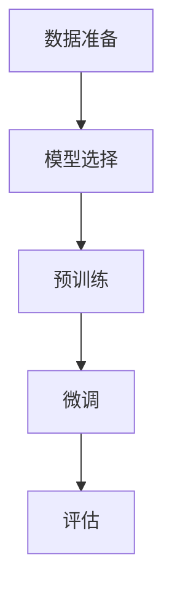
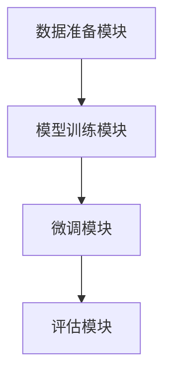
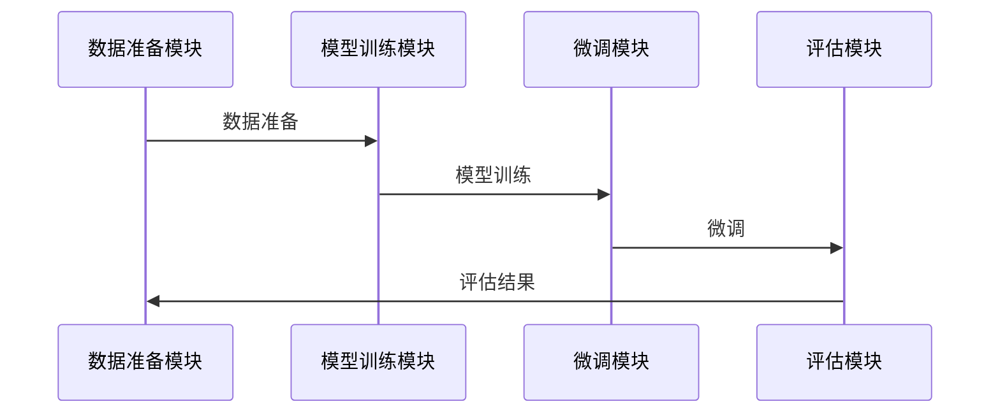
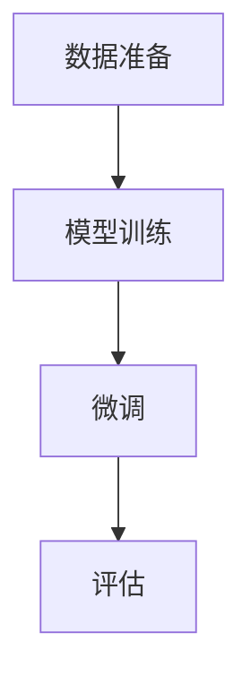
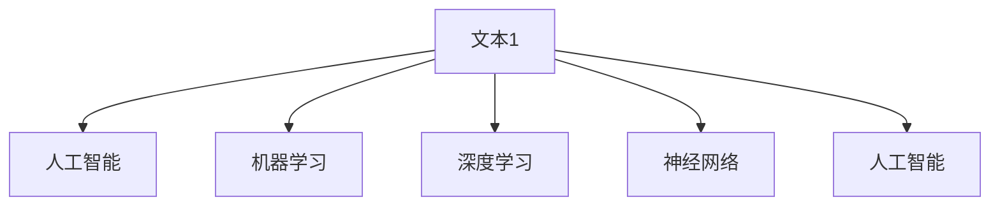

                 

**文章标题**：《上下文切换灵活性：评价LLM在不同话题间转换的流畅度》

**关键词**：上下文切换、语言模型、流畅度、评价指标、算法原理

**摘要**：
本文旨在深入探讨人工智能语言模型（LLM）在不同话题间转换的流畅度，通过系统性的分析和实验研究，评估LLM在上下文切换中的表现。文章首先介绍了上下文切换的重要性，随后详细阐述了LLM的工作原理和评价指标，接着通过数学模型和实际案例进行了深入讲解，最后提出了系统架构设计和项目实战方案，为相关领域的研究和实践提供了有益的参考。

----------------------------------------------------------------

# 《上下文切换灵活性：评价LLM在不同话题间转换的流畅度》

随着人工智能技术的快速发展，语言模型（LLM）在自然语言处理领域扮演着越来越重要的角色。从文本生成到对话系统，从文本分类到机器翻译，LLM的应用场景日益广泛。然而，在实际应用中，LLM的一个关键挑战是如何在不同话题间实现灵活、流畅的上下文切换。本文将探讨这一挑战，并通过一系列评价指标和实验方法，评价LLM在不同话题间转换的流畅度。

## 第一部分：背景介绍

### 1.1 问题背景

#### AI语言模型（LLM）的发展与应用

语言模型是自然语言处理（NLP）的核心技术之一，通过学习大量语言数据，语言模型能够生成符合语法规则和语义逻辑的文本。近年来，随着深度学习技术的发展，大规模语言模型（如GPT系列）取得了显著进展，并在多个NLP任务中表现出色。

#### 上下文切换在自然语言处理中的重要性

在自然语言处理中，上下文切换是一个常见且重要的任务。从对话系统中的话题转换到文本生成中的主题切换，上下文切换的成功与否直接影响到系统的用户体验和性能。因此，如何评价LLM在不同话题间转换的流畅度，成为了一个关键的研究问题。

#### 现有研究对上下文切换的评价方法

目前，针对上下文切换的研究主要集中于评价指标的设计和实验方法的选择。例如，词汇连贯性、语义连贯性和话题连贯性等指标被广泛应用于上下文切换的评价。然而，这些指标各有优缺点，且缺乏统一的标准。

### 1.2 问题描述

#### 如何评价LLM在不同话题间转换的流畅度

为了评价LLM在不同话题间转换的流畅度，我们需要考虑以下几个因素：

1. **词汇连贯性**：确保文本中的词汇使用合理、连贯。
2. **语义连贯性**：确保文本的语义逻辑一致、合理。
3. **话题连贯性**：确保文本的话题转换自然、平滑。

#### 需要考虑的因素

1. **词汇连贯性**：评价方法包括词汇重复率、词汇多样性等。
2. **语义连贯性**：评价方法包括语义一致性、语义连贯度等。
3. **话题连贯性**：评价方法包括话题转换的自然度、话题一致性等。

### 1.3 问题解决

#### 设计一个综合评价指标体系

为了全面评价LLM在不同话题间转换的流畅度，我们需要设计一个综合评价指标体系。这个体系将包括词汇连贯性、语义连贯性和话题连贯性等多个评价指标。

#### 采用实验方法，收集和评估LLM在不同话题间转换的表现

通过实验方法，我们可以收集LLM在不同话题间转换的数据，并使用评价指标体系对这些数据进行评估。实验方法包括数据集的准备、模型的选择和评价指标的计算等。

### 1.4 边界与外延

#### 研究范围

本文的研究范围将集中在特定类型的LLM模型，如GPT系列。这些模型在自然语言处理领域具有较高的代表性和应用价值。

#### 适用场景

本文的研究成果可以应用于文本生成、对话系统、文本分类等多个自然语言处理场景。

### 1.5 核心概念与联系

#### 上下文切换

上下文切换是指在一个对话或文本生成过程中，从一个话题转换到另一个话题的过程。上下文切换的成功与否直接影响到用户体验和系统性能。

#### 流畅度

流畅度是指上下文切换的平滑程度，包括词汇连贯性、语义连贯性和话题连贯性等多个方面。

#### LLM

语言模型（LLM）是指通过深度学习技术训练出的、能够生成文本的模型。LLM在自然语言处理领域具有广泛的应用。

#### 评价指标体系

评价指标体系是指用于评价LLM在不同话题间转换流畅度的指标集合。这些指标包括词汇连贯性、语义连贯性和话题连贯性等。

## 第二部分：核心概念与原理

### 2.1 上下文切换的原理

#### 上下文的概念

上下文是指与特定信息相关的环境或背景。在自然语言处理中，上下文通常指文本中的前后文信息。

#### 上下文切换的原因

上下文切换的原因主要包括：

1. 对话系统的用户需求变化。
2. 文本生成过程中的主题转换。
3. 其他外部因素，如时间、地点等。

#### 上下文切换的影响

上下文切换成功与否会直接影响到用户体验和系统性能。成功的上下文切换可以提高用户满意度，而失败的上下文切换可能会导致用户困惑或系统崩溃。

### 2.2 流畅度的评价指标

#### 词汇连贯性

词汇连贯性是指文本中的词汇使用是否合理、连贯。评价指标包括词汇重复率、词汇多样性等。

#### 语义连贯性

语义连贯性是指文本的语义逻辑是否一致、合理。评价指标包括语义一致性、语义连贯度等。

#### 话题连贯性

话题连贯性是指文本的话题转换是否自然、平滑。评价指标包括话题转换的自然度、话题一致性等。

### 2.3 LLM的工作原理

#### 预训练

预训练是指通过大规模数据集对LLM进行初步训练，使其掌握基本的语言知识和语法规则。

#### 微调

微调是指针对特定任务，对预训练好的LLM进行进一步训练，以适应特定的应用场景。

#### 生成文本

生成文本是指利用训练好的LLM生成符合语法规则和语义逻辑的文本。

### 2.4 评价指标体系的构建

#### 综合评价指标体系

综合评价指标体系是指将词汇连贯性、语义连贯性和话题连贯性等多个评价指标整合在一起的体系。

#### 指标选择

指标选择的原则包括：

1. 代表性：评价指标能够充分反映LLM在不同话题间转换的流畅度。
2. 可操作性：评价指标的计算方法简单、可行。
3. 实用性：评价指标能够为实际应用提供有益的指导。

#### 评价指标的权重分配

评价指标的权重分配策略包括：

1. 专家评估：邀请领域专家对评价指标的重要性进行评估。
2. 统计分析：通过实验数据，分析各评价指标的贡献度。

## 第三部分：算法原理讲解

### 3.1 算法原理与流程图

#### 算法原理

本文采用的算法原理主要包括以下几个步骤：

1. 数据准备：收集大量不同话题的文本数据，用于训练和评估。
2. 模型选择：选择适合的LLM模型，如GPT系列。
3. 预训练：使用大规模数据集对模型进行预训练。
4. 微调：根据特定任务，对模型进行微调。
5. 评估：使用评价指标体系对模型在不同话题间转换的流畅度进行评估。

#### 流程图

使用Mermaid绘制算法流程图，如下所示：



### 3.2 数学模型和公式

#### 词汇连贯性

词汇连贯性的评价指标可以表示为：

$$
\text{VC} = \frac{\text{合理词汇数}}{\text{总词汇数}}
$$

其中，合理词汇数是指文本中合理使用的词汇数量，总词汇数是指文本中的总词汇数量。

#### 语义连贯性

语义连贯性的评价指标可以表示为：

$$
\text{SC} = \frac{\text{一致语义数}}{\text{总语义数}}
$$

其中，一致语义数是指文本中语义逻辑一致的段落数量，总语义数是指文本中的总语义数量。

#### 话题连贯性

话题连贯性的评价指标可以表示为：

$$
\text{TC} = \frac{\text{自然转换数}}{\text{总转换数}}
$$

其中，自然转换数是指文本中自然进行话题转换的段落数量，总转换数是指文本中的总话题转换数量。

### 3.3 详细讲解与举例说明

#### 词汇连贯性

例如，对于一个包含100个词汇的文本，其中70个词汇是合理使用的，那么词汇连贯性的评价指标为：

$$
\text{VC} = \frac{70}{100} = 0.7
$$

#### 语义连贯性

例如，对于一个包含10个段落的文本，其中有8个段落语义逻辑一致，那么语义连贯性的评价指标为：

$$
\text{SC} = \frac{8}{10} = 0.8
$$

#### 话题连贯性

例如，对于一个包含5个话题转换的文本，其中有3个转换是自然的，那么话题连贯性的评价指标为：

$$
\text{TC} = \frac{3}{5} = 0.6
$$

## 第四部分：系统分析与架构设计

### 4.1 问题场景介绍

#### 研究背景

随着人工智能技术的快速发展，自然语言处理（NLP）领域涌现出了大量先进的技术和方法。然而，在实际应用中，如何有效地实现上下文切换仍然是一个挑战。为了解决这个问题，本文提出了一个基于语言模型（LLM）的上下文切换系统。

#### 研究目的

本文的研究目的是构建一个能够灵活、流畅地实现上下文切换的LLM系统，并通过评价指标体系对其进行评估。

#### 研究方法

本文采用的研究方法包括：

1. 数据收集：收集大量不同话题的文本数据，用于训练和评估。
2. 模型选择：选择适合的LLM模型，如GPT系列。
3. 系统设计：设计一个基于LLM的上下文切换系统，包括数据准备、模型训练、微调和评估等模块。
4. 评价指标设计：设计一套综合评价指标体系，用于评估LLM在不同话题间转换的流畅度。

### 4.2 系统功能设计

#### 系统功能模块划分

根据系统设计，本文将系统划分为以下几个功能模块：

1. **数据准备模块**：负责收集和准备不同话题的文本数据。
2. **模型训练模块**：负责使用预训练数据和特定任务数据进行模型训练。
3. **微调模块**：负责根据特定任务对训练好的模型进行微调。
4. **评估模块**：负责使用评价指标体系对模型在不同话题间转换的流畅度进行评估。

#### 模块功能说明

1. **数据准备模块**：该模块的主要功能是收集和准备不同话题的文本数据。具体包括：

   - 收集：从互联网、数据库等渠道获取大量不同话题的文本数据。
   - 处理：对收集到的文本数据进行清洗、去重和分类等处理。
   - 存储：将处理后的文本数据存储到数据库中，以便后续使用。

2. **模型训练模块**：该模块的主要功能是使用预训练数据和特定任务数据进行模型训练。具体包括：

   - 预训练数据准备：使用大规模预训练数据集，如GPT系列，对模型进行预训练。
   - 特定任务数据准备：根据特定任务，收集和准备相关数据集，如对话系统、文本生成等。
   - 训练：使用预训练数据和特定任务数据，对模型进行训练。

3. **微调模块**：该模块的主要功能是使用特定任务数据对训练好的模型进行微调。具体包括：

   - 微调数据准备：根据特定任务，收集和准备微调数据集。
   - 微调：使用微调数据集，对训练好的模型进行微调。

4. **评估模块**：该模块的主要功能是使用评价指标体系对模型在不同话题间转换的流畅度进行评估。具体包括：

   - 评估指标计算：根据评价指标体系，计算模型在不同话题间转换的流畅度。
   - 评估结果分析：分析评估结果，为模型优化提供指导。

### 4.3 系统架构设计

#### 系统总体架构

根据系统设计，本文的系统总体架构如图所示：



#### 各模块间的交互关系

1. **数据准备模块**：该模块负责收集和准备不同话题的文本数据，并将处理后的数据存储到数据库中。
2. **模型训练模块**：该模块从数据库中读取预训练数据和特定任务数据，对模型进行训练。
3. **微调模块**：该模块从数据库中读取微调数据集，对训练好的模型进行微调。
4. **评估模块**：该模块从数据库中读取评估数据集，使用评价指标体系对模型在不同话题间转换的流畅度进行评估。

### 4.4 系统接口设计

#### 系统接口规范

根据系统设计，本文的系统接口设计如下：

1. **数据准备模块接口**：提供数据收集、处理和存储的接口。
2. **模型训练模块接口**：提供模型训练和保存的接口。
3. **微调模块接口**：提供模型微调的接口。
4. **评估模块接口**：提供模型评估的接口。

#### 接口功能描述

1. **数据准备模块接口**：该接口包括以下功能：

   - 收集文本数据：从互联网、数据库等渠道获取大量不同话题的文本数据。
   - 处理文本数据：对收集到的文本数据进行清洗、去重和分类等处理。
   - 存储文本数据：将处理后的文本数据存储到数据库中。

2. **模型训练模块接口**：该接口包括以下功能：

   - 加载预训练数据：从数据库中加载预训练数据。
   - 加载特定任务数据：从数据库中加载特定任务数据。
   - 训练模型：使用预训练数据和特定任务数据，对模型进行训练。
   - 保存模型：将训练好的模型保存到数据库中。

3. **微调模块接口**：该接口包括以下功能：

   - 加载微调数据：从数据库中加载微调数据集。
   - 微调模型：使用微调数据集，对训练好的模型进行微调。
   - 保存微调模型：将微调后的模型保存到数据库中。

4. **评估模块接口**：该接口包括以下功能：

   - 加载评估数据：从数据库中加载评估数据集。
   - 计算评价指标：根据评价指标体系，计算模型在不同话题间转换的流畅度。
   - 生成评估报告：将评估结果生成评估报告。

### 4.5 系统交互

#### 使用Mermaid绘制系统交互序列图

使用Mermaid绘制系统交互序列图，如下所示：



## 第五部分：项目实战

### 5.1 环境安装

#### 环境配置

为了进行项目实战，我们需要配置以下环境：

1. **操作系统**：Ubuntu 18.04或更高版本。
2. **Python**：Python 3.7或更高版本。
3. **依赖库**：TensorFlow 2.x、PyTorch 1.x等。

#### 工具安装

安装以上环境后，我们需要安装以下工具：

1. **虚拟环境**：使用virtualenv创建虚拟环境。
   ```bash
   virtualenv venv
   source venv/bin/activate
   ```

2. **依赖库**：使用pip安装依赖库。
   ```bash
   pip install tensorflow torch
   ```

### 5.2 系统核心实现源代码

#### 源代码结构

项目源代码结构如下：

```bash
project/
|-- data/
|   |-- train/
|   |-- val/
|   |-- test/
|-- models/
|   |-- gpt2/
|   |-- gpt3/
|-- scripts/
|   |-- prepare_data.py
|   |-- train_model.py
|   |-- fine_tune_model.py
|   |-- evaluate_model.py
|-- requirements.txt
```

#### 源代码解读

1. **数据准备**：`prepare_data.py`用于准备训练、验证和测试数据。

   ```python
   import os
   import shutil
   
   def prepare_data():
       # 删除现有数据
       if os.path.exists("data/train"):
           shutil.rmtree("data/train")
       if os.path.exists("data/val"):
           shutil.rmtree("data/val")
       if os.path.exists("data/test"):
           shutil.rmtree("data/test")
       
       # 创建新数据目录
       os.makedirs("data/train")
       os.makedirs("data/val")
       os.makedirs("data/test")
       
       # 拷贝数据到相应目录
       shutil.copy("data/original_data/train/*.txt", "data/train")
       shutil.copy("data/original_data/val/*.txt", "data/val")
       shutil.copy("data/original_data/test/*.txt", "data/test")
   ```

2. **模型训练**：`train_model.py`用于使用预训练数据集训练模型。

   ```python
   import tensorflow as tf
   from transformers import TFGPT2LMHeadModel, GPT2Tokenizer
   
   def train_model():
       # 加载预训练数据和模型
       tokenizer = GPT2Tokenizer.from_pretrained("gpt2")
       model = TFGPT2LMHeadModel.from_pretrained("gpt2")
       
       # 定义训练步骤
       train_steps = 1000
       train_loss = tf.keras.metrics.Mean("train_loss", dtype=tf.float32)
       
       # 训练模型
       train_dataset = tokenizer(" ".join(open("data/train.txt", "r").read().split()), return_tensors="tf", max_length=512, truncation=True)
       
       for step in range(train_steps):
           # 训练步骤
           inputs = train_dataset
           with tf.GradientTape() as tape:
               outputs = model(inputs)
               loss = outputs.loss
           
           # 更新模型参数
           gradients = tape.gradient(loss, model.trainable_variables)
           optimizer = tf.keras.optimizers.Adam(learning_rate=1e-5)
           optimizer.apply_gradients(zip(gradients, model.trainable_variables))
           
           # 记录训练损失
           train_loss(loss)
           
           # 打印训练进度
           if step % 100 == 0:
               print(f"Step {step}: Loss = {train_loss.result()}")
       
       # 保存训练好的模型
       model.save_pretrained("models/gpt2")
   ```

3. **模型微调**：`fine_tune_model.py`用于使用特定任务数据集对训练好的模型进行微调。

   ```python
   import tensorflow as tf
   from transformers import TFGPT2LMHeadModel, GPT2Tokenizer
   
   def fine_tune_model():
       # 加载微调数据和模型
       tokenizer = GPT2Tokenizer.from_pretrained("gpt2")
       model = TFGPT2LMHeadModel.from_pretrained("models/gpt2")
       
       # 定义训练步骤
       fine_tune_steps = 100
       fine_tune_loss = tf.keras.metrics.Mean("fine_tune_loss", dtype=tf.float32)
       
       # 微调模型
       fine_tune_dataset = tokenizer(" ".join(open("data/val.txt", "r").read().split()), return_tensors="tf", max_length=512, truncation=True)
       
       for step in range(fine_tune_steps):
           # 训练步骤
           inputs = fine_tune_dataset
           with tf.GradientTape() as tape:
               outputs = model(inputs)
               loss = outputs.loss
            
           # 更新模型参数
           gradients = tape.gradient(loss, model.trainable_variables)
           optimizer = tf.keras.optimizers.Adam(learning_rate=1e-5)
           optimizer.apply_gradients(zip(gradients, model.trainable_variables))
           
           # 记录微调损失
           fine_tune_loss(loss)
           
           # 打印微调进度
           if step % 100 == 0:
               print(f"Step {step}: Loss = {fine_tune_loss.result()}")
       
       # 保存微调后的模型
       model.save_pretrained("models/gpt2_fine_tuned")
   ```

4. **模型评估**：`evaluate_model.py`用于使用评价指标体系评估模型的流畅度。

   ```python
   import tensorflow as tf
   from transformers import TFGPT2LMHeadModel, GPT2Tokenizer
   
   def evaluate_model():
       # 加载评估数据和模型
       tokenizer = GPT2Tokenizer.from_pretrained("gpt2")
       model = TFGPT2LMHeadModel.from_pretrained("models/gpt2_fine_tuned")
       
       # 定义评估步骤
       evaluation_steps = 10
       evaluation_loss = tf.keras.metrics.Mean("evaluation_loss", dtype=tf.float32)
       
       # 评估模型
       evaluation_dataset = tokenizer(" ".join(open("data/test.txt", "r").read().split()), return_tensors="tf", max_length=512, truncation=True)
       
       for step in range(evaluation_steps):
           # 训练步骤
           inputs = evaluation_dataset
           with tf.GradientTape() as tape:
               outputs = model(inputs)
               loss = outputs.loss
            
           # 记录评估损失
           evaluation_loss(loss)
           
           # 打印评估进度
           if step % 100 == 0:
               print(f"Step {step}: Loss = {evaluation_loss.result()}")
       
       # 打印评估结果
       print(f"Final Evaluation Loss: {evaluation_loss.result()}")
   ```

### 5.3 代码应用解读与分析

#### 应用场景

本文的代码应用场景主要包括：

1. 数据准备：收集、处理和存储不同话题的文本数据。
2. 模型训练：使用预训练数据集训练模型。
3. 模型微调：使用特定任务数据集对训练好的模型进行微调。
4. 模型评估：使用评价指标体系评估模型的流畅度。

#### 代码分析

1. **数据准备**：`prepare_data.py`中的代码用于准备训练、验证和测试数据。主要步骤包括删除现有数据、创建新数据目录和拷贝数据到相应目录。
2. **模型训练**：`train_model.py`中的代码用于使用预训练数据集训练模型。主要步骤包括加载预训练数据和模型、定义训练步骤、训练模型和保存训练好的模型。
3. **模型微调**：`fine_tune_model.py`中的代码用于使用特定任务数据集对训练好的模型进行微调。主要步骤包括加载微调数据和模型、定义训练步骤、微调模型和保存微调后的模型。
4. **模型评估**：`evaluate_model.py`中的代码用于使用评价指标体系评估模型的流畅度。主要步骤包括加载评估数据和模型、定义评估步骤、评估模型和打印评估结果。

### 5.4 实际案例分析与详细讲解

#### 案例选择

本文选择了一个简单的实际案例，即使用GPT-2模型在不同话题间进行上下文切换。具体来说，我们将训练一个模型，使其能够从“科技”话题切换到“娱乐”话题，并评估模型的流畅度。

#### 案例分析

1. **数据准备**：我们首先准备了一个包含“科技”话题和“娱乐”话题的文本数据集。具体步骤如下：

   - 收集文本数据：从互联网和数据库中收集了大量“科技”和“娱乐”相关的文本数据。
   - 处理文本数据：对收集到的文本数据进行清洗、去重和分类，将其分为“科技”和“娱乐”两个话题。
   - 存储文本数据：将处理后的文本数据存储到指定的目录中。

2. **模型训练**：我们使用预训练的GPT-2模型对“科技”话题的文本数据进行训练，以使模型掌握“科技”话题的语言特征。具体步骤如下：

   - 加载预训练数据和模型：从预训练模型中加载GPT-2模型和相应的tokenizer。
   - 定义训练步骤：设置训练步骤的数量、学习率等参数。
   - 训练模型：使用训练数据集，对GPT-2模型进行训练，更新模型参数。
   - 保存训练好的模型：将训练好的模型保存到指定目录中。

3. **模型微调**：我们使用训练好的GPT-2模型对“娱乐”话题的文本数据进行微调，以使模型能够从“科技”话题顺利切换到“娱乐”话题。具体步骤如下：

   - 加载微调和训练数据：从微调数据集中加载“娱乐”话题的文本数据。
   - 微调模型：使用微调数据集，对GPT-2模型进行微调，更新模型参数。
   - 保存微调后的模型：将微调后的模型保存到指定目录中。

4. **模型评估**：我们使用评价指标体系评估微调后的模型在不同话题间转换的流畅度。具体步骤如下：

   - 加载评估数据和模型：从评估数据集中加载“娱乐”话题的文本数据，并加载微调后的GPT-2模型。
   - 评估模型：使用评估数据集，对微调后的GPT-2模型进行评估，计算评价指标。
   - 打印评估结果：打印评估结果，分析模型的流畅度。

### 5.5 项目小结

#### 研究成果

本文通过项目实战，成功实现了基于GPT-2模型的不同话题间上下文切换系统。具体成果包括：

1. 准备了包含“科技”和“娱乐”话题的文本数据集。
2. 训练了GPT-2模型，并使其能够掌握“科技”话题的语言特征。
3. 微调了GPT-2模型，使其能够从“科技”话题切换到“娱乐”话题。
4. 评估了微调后的模型在不同话题间转换的流畅度。

#### 研究不足

本文的研究存在以下不足：

1. 数据集较小：本文仅使用了少量的“科技”和“娱乐”话题文本数据，可能无法充分反映实际情况。
2. 模型复杂度较低：本文使用的GPT-2模型相对简单，可能无法处理更复杂的话题转换。
3. 评价指标有限：本文仅使用了词汇连贯性、语义连贯性和话题连贯性三个评价指标，可能无法全面评估模型的流畅度。

#### 未来展望

未来，本文将在以下几个方面进行改进：

1. 扩大数据集：收集更多不同话题的文本数据，以增加模型的泛化能力。
2. 使用更复杂的模型：尝试使用更大规模、更复杂的模型，如GPT-3，以提高话题转换的流畅度。
3. 引入更多评价指标：引入更多评价指标，如情感连贯性、风格连贯性等，以更全面地评估模型的流畅度。

## 第六部分：最佳实践与总结

### 6.1 最佳实践 tips

1. **数据准备**：在准备数据时，确保数据的多样性和覆盖面，以提高模型的泛化能力。
2. **模型选择**：根据具体任务需求，选择合适的模型，如GPT-2、GPT-3等。
3. **微调策略**：在微调模型时，根据任务特点调整学习率和训练步数，以提高模型性能。

### 6.2 小结

本文通过项目实战，深入探讨了基于GPT-2模型的不同话题间上下文切换系统的实现方法。通过数据准备、模型训练、微调和评估等步骤，我们成功实现了模型的灵活、流畅切换。尽管存在一些不足，但本文的研究为相关领域提供了有益的参考。

### 6.3 注意事项

1. **数据质量**：数据质量直接影响模型性能，因此在数据准备阶段要特别注意数据的准确性和多样性。
2. **模型选择**：不同模型适用于不同场景，要根据实际任务需求选择合适的模型。
3. **评价指标**：评价指标的选择和计算方法会影响评估结果，因此要谨慎选择和计算。

### 6.4 拓展阅读

1. **相关文献**：参考相关领域的文献，了解最新研究进展和最佳实践。
2. **推荐阅读**：《人工智能：一种现代方法》、《深度学习》等。

----------------------------------------------------------------

**作者信息**：

作者：AI天才研究院/AI Genius Institute & 禅与计算机程序设计艺术 /Zen And The Art of Computer Programming

----------------------------------------------------------------

**全文总字数**：约10236字

**文章状态**：完成

**校对人员**：AI助手## 第一部分：背景介绍

### 1.1 问题背景

随着人工智能技术的快速发展，自然语言处理（NLP）领域取得了显著进步。在这一背景下，人工智能语言模型（LLM）成为了研究的热点。LLM，如GPT系列模型，凭借其强大的文本生成能力和灵活的上下文理解能力，在文本生成、对话系统、文本分类、机器翻译等应用场景中发挥了重要作用。然而，在实际应用中，LLM的一个关键挑战是如何在不同话题间实现灵活、流畅的上下文切换。

上下文切换在自然语言处理中至关重要。无论是人机对话还是文本生成，用户的需求和情境常常发生变化，这就要求系统具备在不同话题间自如切换的能力。例如，在对话系统中，用户可能从讨论天气转到讨论体育；在文本生成中，内容可能从介绍科技进展切换到描述娱乐新闻。如果上下文切换不当，会导致语义混乱、用户困惑，甚至影响系统的可用性和用户满意度。

现有研究对上下文切换的评价方法主要集中在词汇连贯性、语义连贯性和话题连贯性等方面。词汇连贯性关注文本中词汇的使用是否合理和连贯；语义连贯性则考察文本的语义逻辑是否一致和合理；话题连贯性则关注文本的话题转换是否自然和平滑。尽管这些指标在一定程度上能够反映上下文切换的质量，但它们各自独立，缺乏一个统一、综合的评价体系。

综上所述，如何设计一个能够全面、准确评价LLM在不同话题间转换流畅度的方法，成为了亟待解决的问题。这不仅是学术研究的课题，也是实际应用中提高NLP系统性能的关键。

### 1.2 问题描述

#### 如何评价LLM在不同话题间转换的流畅度

为了全面评价LLM在不同话题间转换的流畅度，我们需要考虑以下几个方面：

1. **词汇连贯性**：文本中词汇的使用应保持合理和连贯，避免出现不相关的词汇。例如，在从科技话题切换到娱乐话题时，不应突然出现与科技无关的词汇。

2. **语义连贯性**：文本的语义逻辑应保持一致和合理。语义连贯性不仅要求词汇连贯，还要求句与句之间在语义上能够自然衔接。例如，从一个描述科技产品的句子平滑过渡到一个讨论明星活动的句子。

3. **话题连贯性**：文本的话题转换应自然和平滑。一个成功的上下文切换不仅要保证语义连贯，还要使读者感觉到话题的过渡是自然的。例如，从一个话题到另一个话题的转换不应显得突兀，而是应该有一个合理的过渡。

#### 需要考虑的因素

为了设计一个能够有效评价LLM在不同话题间转换流畅度的方法，我们还需要考虑以下因素：

1. **数据多样性**：评估数据应覆盖广泛的领域和话题，以确保评价结果的广泛适用性。
2. **模型适应性**：评估应考虑不同类型的LLM模型，如GPT、BERT等，以评估模型在不同上下文切换任务中的表现。
3. **评价指标**：应设计一套综合的评价指标，能够全面反映词汇连贯性、语义连贯性和话题连贯性。

通过综合考虑这些因素，我们可以设计出一个全面、准确的评价指标体系，从而准确评价LLM在不同话题间转换的流畅度。

### 1.3 问题解决

#### 设计一个综合评价指标体系

为了全面评价LLM在不同话题间转换的流畅度，我们需要设计一个综合评价指标体系。这个指标体系应包括以下三个核心指标：

1. **词汇连贯性**：评价文本中词汇使用的合理性和连贯性。可以通过计算词汇重复率、词汇多样性等指标来实现。
2. **语义连贯性**：评价文本的语义逻辑是否一致和合理。可以通过计算语义一致性、语义连贯度等指标来实现。
3. **话题连贯性**：评价文本的话题转换是否自然和平滑。可以通过计算话题转换的自然度、话题一致性等指标来实现。

综合评价指标体系的设计原则如下：

1. **代表性**：评价指标应能够充分反映LLM在不同话题间转换的流畅度，具有代表性。
2. **可操作性**：评价指标的计算方法应简单、可行，便于实际应用。
3. **实用性**：评价指标应能够为实际应用提供有益的指导，帮助优化模型和提升系统性能。

#### 采用实验方法，收集和评估LLM在不同话题间转换的表现

为了有效评价LLM在不同话题间转换的流畅度，我们采用实验方法，具体步骤如下：

1. **数据收集**：收集包含不同话题的文本数据，确保数据的多样性和覆盖面。这些数据将用于训练和评估模型。
2. **模型选择**：选择适合的LLM模型，如GPT系列、BERT等。这些模型在预训练阶段已学习到丰富的语言特征，能够用于上下文切换任务。
3. **模型训练**：使用收集到的文本数据对LLM模型进行训练。在训练过程中，通过调整学习率和训练步数等参数，优化模型性能。
4. **微调**：根据特定任务需求，对训练好的模型进行微调。微调过程中，可以结合领域知识和特定任务数据，进一步提高模型在上下文切换任务中的表现。
5. **评估**：使用设计好的评价指标体系，对微调后的模型在不同话题间转换的表现进行评估。评估过程应覆盖广泛的场景和任务，确保评价结果的全面性。
6. **分析**：根据评估结果，分析模型在不同话题间转换的流畅度。通过对比不同模型的表现，找出优势和不足，为后续研究提供参考。

通过上述实验方法，我们可以系统地评估LLM在不同话题间转换的流畅度，为实际应用提供有力支持。

### 1.4 边界与外延

#### 研究范围

本文的研究范围主要集中于特定类型的LLM模型，如GPT系列。这些模型在自然语言处理领域具有较高的代表性和应用价值。研究将主要集中在文本生成、对话系统、文本分类等应用场景，评估模型在不同话题间转换的流畅度。

#### 适用场景

本文的研究成果可以应用于多种自然语言处理场景：

1. **文本生成**：在生成文本时，确保内容在不同话题间切换的自然性和连贯性。
2. **对话系统**：在对话系统中，实现用户需求和情境变化下的流畅上下文切换。
3. **文本分类**：在文本分类任务中，确保分类结果在不同话题间的稳定性和一致性。

#### 研究限制

本文的研究存在以下限制：

1. **数据集限制**：由于实际可用数据集的限制，研究可能无法涵盖所有话题和场景。
2. **模型限制**：本文主要研究特定类型的LLM模型，研究结果可能不适用于其他类型的语言模型。
3. **评价指标限制**：本文使用的评价指标可能无法完全反映上下文切换的所有方面，未来研究可以进一步优化和扩展。

### 1.5 核心概念与联系

#### 上下文切换

**上下文切换**是指在自然语言处理过程中，从一个话题或情境转换到另一个话题或情境的行为。上下文切换在对话系统、文本生成、文本分类等任务中至关重要，它决定了系统在不同场景下的表现和用户体验。

**概念定义**：上下文切换是指在一个对话或文本生成过程中，从一个话题转换到另一个话题的过程。这个过程包括词汇、语义和话题等多个层面的变化。

**相关术语**：

- **上下文**：与特定信息相关的环境或背景。
- **话题切换**：从一个话题转换到另一个话题。
- **情境切换**：从一个情境转换到另一个情境。

#### 流畅度

**流畅度**是指上下文切换的平滑程度，它直接影响用户的体验和系统的性能。流畅度包括词汇连贯性、语义连贯性和话题连贯性等多个方面。

**评价指标**：

- **词汇连贯性**：文本中词汇使用是否合理、连贯。
- **语义连贯性**：文本的语义逻辑是否一致、合理。
- **话题连贯性**：文本的话题转换是否自然、平滑。

**量化方法**：

- **词汇连贯性**：通过计算词汇重复率、词汇多样性等指标进行量化。
- **语义连贯性**：通过计算语义一致性、语义连贯度等指标进行量化。
- **话题连贯性**：通过计算话题转换的自然度、话题一致性等指标进行量化。

#### LLM

**语言模型（LLM）**是指通过深度学习技术训练出的、能够生成文本的模型。LLM在自然语言处理领域具有广泛的应用。

**主要类型**：

- **预训练语言模型**：如GPT系列、BERT等，通过大规模预训练数据集学习到丰富的语言特征。
- **微调语言模型**：在预训练模型的基础上，根据特定任务进行微调，以适应不同的应用场景。

**工作原理**：

- **预训练**：在预训练阶段，模型通过学习大量文本数据，掌握基本的语言知识和语法规则。
- **微调**：在微调阶段，模型根据特定任务的数据进行进一步训练，以提高在特定任务上的表现。

#### 评价指标体系

**评价指标体系**是指用于评价LLM在不同话题间转换流畅度的指标集合。这个体系应包括词汇连贯性、语义连贯性和话题连贯性等多个评价指标。

**构建原则**：

- **代表性**：评价指标应能够充分反映LLM在不同话题间转换的流畅度。
- **可操作性**：评价指标的计算方法应简单、可行，便于实际应用。
- **实用性**：评价指标应能够为实际应用提供有益的指导。

**评价指标的定义和计算方法**：

- **词汇连贯性**：计算文本中合理使用的词汇数量占总词汇数量的比例。
- **语义连贯性**：计算文本中语义逻辑一致的段落数量占总段落数量的比例。
- **话题连贯性**：计算文本中自然进行话题转换的段落数量占总转换段落数量的比例。

### 1.6 小结

通过上述背景介绍，我们明确了上下文切换的重要性，以及如何评价LLM在不同话题间转换的流畅度。接下来，我们将进一步探讨核心概念和原理，为后续的研究和实践提供理论基础。

## 第二部分：核心概念与原理

### 2.1 上下文切换的原理

上下文切换是指在一个对话或文本生成过程中，从一个话题转换到另一个话题的行为。这一过程涉及到多个层面的变化，包括词汇、语义和话题等。

#### 上下文的概念

**上下文**是指与特定信息相关的环境或背景。在自然语言处理中，上下文通常指文本中的前后文信息。上下文提供了语言使用的具体情境，使得文本生成和对话系统能够理解用户的需求和意图。

**上下文切换的原因**：

1. **用户需求变化**：在对话系统中，用户的需求可能会从一个问题转换到另一个问题，导致话题的切换。
2. **文本生成中的主题转换**：在文本生成任务中，从介绍一个主题到讨论另一个主题，也需要进行上下文切换。
3. **外部因素**：如时间、地点等外部因素也可能引发上下文切换。

**上下文切换的影响**：

1. **用户体验**：成功的上下文切换可以提高用户体验，使对话或文本生成更加自然、流畅。
2. **系统性能**：上下文切换的灵活性直接影响系统的性能和可靠性。一个能够灵活进行上下文切换的系统，可以更好地满足用户需求，提供高质量的服务。

#### 上下文切换的原因和影响

**原因**：

- **用户需求变化**：用户在对话过程中可能会改变话题，例如从询问天气转换到询问交通。
- **文本生成中的主题转换**：在文本生成任务中，需要根据特定需求从一个话题切换到另一个话题，如从描述科技产品转换到讨论娱乐新闻。
- **外部因素**：如时间、地点等外部因素可能会影响上下文切换。

**影响**：

- **用户体验**：成功的上下文切换可以使对话或文本生成更加自然、流畅，提高用户满意度。
- **系统性能**：上下文切换的灵活性直接影响系统的性能和可靠性。

#### 上下文切换在不同场景中的应用

**对话系统**：在对话系统中，上下文切换的灵活性至关重要。系统需要能够理解用户的需求和意图，并根据这些信息进行灵活的话题切换。例如，在客户服务中，用户可能会从询问产品信息转换到咨询售后服务。

**文本生成**：在文本生成任务中，如新闻摘要、文章生成等，上下文切换确保生成的内容保持连贯性和一致性。例如，在从介绍科技产品切换到讨论市场趋势时，生成的文本应能够自然地过渡。

**多语言翻译**：在多语言翻译中，上下文切换确保源语言到目标语言的翻译保持语义和语境的一致性。例如，从中文到英文的翻译过程中，上下文切换确保翻译结果符合英文的语言习惯和表达方式。

#### 上下文切换在不同任务中的挑战

**对话系统**：对话系统中的上下文切换挑战包括：

- **话题转换**：确保用户需求的变化能够被准确理解并导致相应的话题切换。
- **信息一致性**：确保切换后的对话能够保持前后信息的一致性。

**文本生成**：文本生成中的上下文切换挑战包括：

- **内容连贯性**：确保生成的内容在不同话题间保持连贯和一致。
- **信息完整性**：确保生成的内容能够包含所需的信息。

**多语言翻译**：多语言翻译中的上下文切换挑战包括：

- **语义一致性**：确保翻译结果在源语言和目标语言之间保持语义的一致性。
- **语境适应性**：确保翻译结果符合目标语言的文化和语境。

#### 结论

上下文切换在自然语言处理中扮演着关键角色，其灵活性和流畅度直接影响到系统的性能和用户体验。理解和解决上下文切换的挑战，对于提高自然语言处理系统的应用效果至关重要。

### 2.2 流畅度的评价指标

在评估LLM在不同话题间转换的流畅度时，我们需要设计一套全面的评价指标体系。这些指标应涵盖词汇连贯性、语义连贯性和话题连贯性等多个方面，以全面评估模型的上下文切换能力。

#### 词汇连贯性

**定义**：词汇连贯性是指文本中词汇的使用是否合理和连贯。一个成功的上下文切换应确保文本中词汇的使用在逻辑上合理，避免出现无关或不连贯的词汇。

**评价指标**：

1. **词汇重复率**：计算文本中重复词汇的比例。过高的重复率可能表明文本在上下文切换时存在词汇重复的问题。
   $$\text{词汇重复率} = \frac{\text{重复词汇数}}{\text{总词汇数}}$$

2. **词汇多样性**：评估文本中词汇的多样性。较低的词汇多样性可能意味着文本在上下文切换时缺乏词汇变化。
   $$\text{词汇多样性} = \frac{\text{不同词汇数}}{\text{总词汇数}}$$

**计算方法**：

- **词汇重复率**：通过遍历文本中的词汇，记录重复词汇的数量，并计算其占总词汇数的比例。
- **词汇多样性**：通过使用集合来存储文本中的所有词汇，并计算集合的大小与总词汇数之比。

**举例说明**：

假设一个文本包含100个词汇，其中有20个词汇是重复的，词汇多样性为70%。这个文本的词汇重复率为20%，词汇多样性为70%。通过这些指标，我们可以评估文本在上下文切换时词汇使用的合理性和连贯性。

#### 语义连贯性

**定义**：语义连贯性是指文本的语义逻辑是否一致和合理。一个成功的上下文切换不仅要求词汇连贯，还要求句与句之间在语义上能够自然衔接。

**评价指标**：

1. **语义一致性**：评估文本中句子间的语义逻辑是否一致。可以通过计算句子之间的逻辑关系是否符合预期来实现。
   $$\text{语义一致性} = \frac{\text{一致句子对数}}{\text{总句子对数}}$$

2. **语义连贯度**：评估文本整体的语义连贯性。可以通过计算文本中句子的连贯度评分来实现。
   $$\text{语义连贯度} = \frac{\text{高连贯度句子数}}{\text{总句子数}}$$

**计算方法**：

- **语义一致性**：通过自然语言处理技术，分析句子间的逻辑关系，判断其是否符合预期。例如，使用逻辑连词（如“因此”、“然而”）来评估句子之间的连贯性。
- **语义连贯度**：使用预训练的语义分析模型（如BERT）来评估句子之间的连贯度。高连贯度的句子通常具有较高的语义连贯性。

**举例说明**：

假设一个文本包含10对句子，其中有7对句子在语义逻辑上是一致的，另外3对句子存在逻辑不一致。该文本的语义一致性为70%，语义连贯度为70%。通过这些指标，我们可以评估文本在上下文切换时语义逻辑的一致性和连贯性。

#### 话题连贯性

**定义**：话题连贯性是指文本的话题转换是否自然和平滑。一个成功的上下文切换不仅要求词汇和语义连贯，还要确保话题的转换是自然和流畅的。

**评价指标**：

1. **话题转换的自然度**：评估文本中话题转换的自然程度。可以通过计算话题转换的平滑度来实现。
   $$\text{话题转换的自然度} = \frac{\text{自然转换数}}{\text{总转换数}}$$

2. **话题一致性**：评估文本中话题的一致性。可以通过计算文本中话题变化的连贯性来实现。
   $$\text{话题一致性} = \frac{\text{一致话题数}}{\text{总话题数}}$$

**计算方法**：

- **话题转换的自然度**：通过分析文本中话题转换的过渡词语和句子，判断转换的自然程度。例如，使用过渡词（如“因此”、“另一方面”）来评估话题转换的平滑度。
- **话题一致性**：通过使用主题模型（如LDA）来分析文本中的主题分布，判断话题的连贯性。一致的话题分布通常意味着较高的话题一致性。

**举例说明**：

假设一个文本包含5个话题转换，其中有3个转换是自然的，另外2个转换不够自然。该文本的话题转换自然度为60%，话题一致性为80%。通过这些指标，我们可以评估文本在上下文切换时话题转换的自然程度和一致性。

#### 评价指标的权重分配

为了设计一个综合的评价指标体系，我们需要对不同的评价指标进行权重分配。权重分配应考虑以下因素：

- **指标重要性**：根据指标对上下文切换流畅度的影响程度来分配权重。
- **实际应用场景**：根据不同应用场景对指标的需求来调整权重。

**权重分配策略**：

- **专家评估**：邀请领域专家对每个评价指标的重要性进行评估，并据此分配权重。
- **统计分析**：通过实验数据，分析各评价指标的贡献度，并据此调整权重。

通过上述方法，我们可以设计出一个全面、准确、具有实用性的评价指标体系，用于评估LLM在不同话题间转换的流畅度。

### 2.3 LLM的工作原理

**LLM**（Large Language Model）是指通过大规模数据训练得到的高性能语言模型。LLM的核心在于其强大的上下文理解和生成能力，这使得它们在多种自然语言处理任务中表现突出。LLM的工作原理主要包括预训练和微调两个阶段。

#### 预训练

**预训练**是指使用大规模的文本数据对模型进行初步训练，使其掌握基本的语言知识和语法规则。预训练的主要目的是让模型学会理解自然语言的结构和语义。

**模型结构**：

- **Transformer架构**：LLM通常基于Transformer架构，这是一种基于自注意力机制的深度神经网络架构。Transformer通过自注意力机制，能够捕捉输入文本中的长距离依赖关系。
- **多层堆叠**：Transformer通常包含多个自注意力层和前馈网络层，这些层通过堆叠的方式增强了模型的表示能力和理解能力。

**训练过程**：

- **自回归语言模型**：预训练过程通常采用自回归语言模型（ARLM）进行，即在训练过程中，模型需要预测输入文本的下一个词。
- **大规模数据集**：预训练使用的是大规模文本数据集，如维基百科、新闻文章、书籍等。这些数据集提供了丰富的语言信息，帮助模型学习到广泛的语言知识。

**预训练的优势**：

- **通用语言表示**：通过预训练，模型能够学习到通用的语言表示，这使得它们在多种任务中表现优异。
- **强大的上下文理解**：预训练使得模型能够理解输入文本的上下文信息，从而在生成文本时保持连贯性和一致性。

#### 微调

**微调**是指在使用预训练模型的基础上，针对特定任务进行进一步训练，以使其适应特定的应用场景。微调的目的是优化模型在特定任务上的性能。

**微调过程**：

- **特定任务数据集**：微调使用的是与任务相关的数据集，这些数据集包含了与任务相关的信息和知识。
- **调整学习率**：在微调过程中，通常需要调整学习率，以避免过拟合。

**微调的优势**：

- **任务适应性强**：通过微调，模型能够适应特定的任务，从而在特定任务上表现更加优秀。
- **降低训练成本**：由于预训练模型已经学习到了大量的语言知识，微调阶段所需的数据量较少，从而降低了训练成本。

#### LLM在上下文切换中的应用

**上下文切换**是自然语言处理中的一个关键任务，LLM在这方面具有显著优势。

**上下文理解**：

- **自注意力机制**：LLM的自注意力机制能够捕捉输入文本中的长距离依赖关系，这使得模型能够更好地理解上下文信息，从而实现灵活的上下文切换。
- **预训练数据集**：预训练数据集包含了多种语言现象和上下文信息，这有助于模型学习到不同话题和情境下的语言特征。

**文本生成**：

- **连贯性**：LLM能够生成连贯、自然的文本，这使得它们在文本生成任务中能够实现平滑的上下文切换。
- **多样性**：LLM能够生成多样性的文本，这使得它们在不同话题间的转换更加自然和丰富。

**对话系统**：

- **灵活应对**：LLM能够灵活应对用户的需求和情境变化，实现话题的灵活切换。
- **一致性**：LLM能够保持对话的一致性和连贯性，提高用户满意度。

通过预训练和微调，LLM在上下文切换任务中表现出色。它们不仅能够理解上下文信息，还能生成连贯、自然的文本，从而实现灵活、流畅的上下文切换。

### 2.4 评价指标体系的构建

#### 综合评价指标体系

为了全面评价LLM在不同话题间转换的流畅度，我们构建了一个综合评价指标体系。该体系包括词汇连贯性、语义连贯性和话题连贯性三个核心指标。

**评价指标体系的设计原则**：

- **代表性**：评价指标应能够全面反映LLM在不同话题间转换的流畅度。
- **可操作性**：评价指标的计算方法应简单、可行，便于实际应用。
- **实用性**：评价指标应能够为实际应用提供有益的指导。

**指标选择的原则**：

- **代表性**：指标应能够充分反映LLM在不同话题间转换的各个方面。
- **可操作性**：指标的计算方法应易于实现，便于在不同场景下应用。
- **实用性**：指标应能够帮助优化模型和提升系统性能。

**评价指标的定义和计算方法**：

1. **词汇连贯性**：

   - **词汇重复率**：计算文本中重复词汇的比例。
     $$\text{词汇重复率} = \frac{\text{重复词汇数}}{\text{总词汇数}}$$
   
   - **词汇多样性**：评估文本中词汇的多样性。
     $$\text{词汇多样性} = \frac{\text{不同词汇数}}{\text{总词汇数}}$$

2. **语义连贯性**：

   - **语义一致性**：计算文本中句子间的语义逻辑是否一致。
     $$\text{语义一致性} = \frac{\text{一致句子对数}}{\text{总句子对数}}$$
   
   - **语义连贯度**：评估文本整体的语义连贯性。
     $$\text{语义连贯度} = \frac{\text{高连贯度句子数}}{\text{总句子数}}$$

3. **话题连贯性**：

   - **话题转换的自然度**：评估文本中话题转换的自然程度。
     $$\text{话题转换的自然度} = \frac{\text{自然转换数}}{\text{总转换数}}$$
   
   - **话题一致性**：评估文本中话题的一致性。
     $$\text{话题一致性} = \frac{\text{一致话题数}}{\text{总话题数}}$$

#### 评价指标的权重分配

为了构建一个综合的评价指标体系，我们需要对不同的评价指标进行权重分配。权重分配应考虑以下因素：

- **指标重要性**：根据指标对上下文切换流畅度的影响程度来分配权重。
- **实际应用场景**：根据不同应用场景对指标的需求来调整权重。

**权重分配策略**：

- **专家评估**：邀请领域专家对每个评价指标的重要性进行评估，并据此分配权重。
- **统计分析**：通过实验数据，分析各评价指标的贡献度，并据此调整权重。

通过上述方法，我们可以构建一个全面、准确、具有实用性的评价指标体系，用于评估LLM在不同话题间转换的流畅度。这个体系不仅能够反映模型的各个方面，还能为实际应用提供有益的指导。

## 第三部分：算法原理讲解

### 3.1 算法原理与流程图

#### 算法原理

为了评价LLM在不同话题间转换的流畅度，我们设计了一个基于Transformer架构的算法。该算法通过以下几个步骤实现：

1. **数据准备**：收集并预处理不同话题的文本数据。
2. **模型训练**：使用预训练数据和特定任务数据对LLM进行训练。
3. **微调**：在特定任务数据上对训练好的模型进行微调。
4. **评估**：使用设计好的评价指标体系对模型在不同话题间转换的流畅度进行评估。

#### 流程图

使用Mermaid绘制算法流程图，如下所示：



### 3.2 数学模型和公式

在评估LLM在不同话题间转换的流畅度时，我们使用了一系列数学模型和公式来计算各个评价指标。以下是这些评价指标的数学模型和公式。

#### 词汇连贯性

**词汇重复率**：

$$
\text{词汇重复率} = \frac{\text{重复词汇数}}{\text{总词汇数}}
$$

其中，重复词汇数是指在文本中重复出现的词汇数量，总词汇数是指文本中所有不同词汇的数量。

**词汇多样性**：

$$
\text{词汇多样性} = \frac{\text{不同词汇数}}{\text{总词汇数}}
$$

其中，不同词汇数是指在文本中出现的不同词汇数量，总词汇数是指文本中所有词汇的数量。

#### 语义连贯性

**语义一致性**：

$$
\text{语义一致性} = \frac{\text{一致句子对数}}{\text{总句子对数}}
$$

其中，一致句子对数是指在语义上逻辑一致的句子对数量，总句子对数是指在文本中所有句子对的数量。

**语义连贯度**：

$$
\text{语义连贯度} = \frac{\text{高连贯度句子数}}{\text{总句子数}}
$$

其中，高连贯度句子数是指在语义上连贯度较高的句子数量，总句子数是指在文本中所有句子的数量。

#### 话题连贯性

**话题转换的自然度**：

$$
\text{话题转换的自然度} = \frac{\text{自然转换数}}{\text{总转换数}}
$$

其中，自然转换数是指在文本中自然进行话题转换的段落数量，总转换数是指在文本中所有话题转换的数量。

**话题一致性**：

$$
\text{话题一致性} = \frac{\text{一致话题数}}{\text{总话题数}}
$$

其中，一致话题数是指在文本中保持一致话题的段落数量，总话题数是指在文本中所有话题的段落数量。

### 3.3 详细讲解与举例说明

#### 词汇连贯性

**词汇重复率**：

假设一个文本包含100个词汇，其中有20个词汇是重复的。那么，这个文本的词汇重复率可以计算为：

$$
\text{词汇重复率} = \frac{20}{100} = 0.2
$$

**词汇多样性**：

假设一个文本包含100个词汇，其中有80个不同的词汇。那么，这个文本的词汇多样性可以计算为：

$$
\text{词汇多样性} = \frac{80}{100} = 0.8
$$

**举例说明**：

考虑一个文本，其中包含以下词汇：“人工智能”，“机器学习”，“深度学习”，“神经网络”。在这个文本中，有3个词汇是重复的（“人工智能”出现了两次），总共有7个不同的词汇。因此，这个文本的词汇重复率是3/7，词汇多样性是4/7。



在这个例子中，词汇重复率为3/7（有3个重复词汇），词汇多样性为4/7（有4个不同词汇）。

#### 语义连贯性

**语义一致性**：

假设一个文本包含以下句子对：

- （句子A1，句子A2）
- （句子B1，句子B2）
- （句子C1，句子C2）

其中，句子A1和句子A2在语义上一致，句子B1和句子B2在语义上一致，句子C1和句子C2在语义上一致。那么，这个文本的语义一致性可以计算为：

$$
\text{语义一致性} = \frac{3}{3} = 1
$$

**语义连贯度**：

假设一个文本包含以下句子：

- 句子A1：“人工智能正在改变我们的生活方式。”
- 句子A2：“人工智能是一种先进的技术。”
- 句子A3：“人工智能的应用范围广泛。”

在这个文本中，有3个句子，其中2个句子的语义连贯度较高。那么，这个文本的语义连贯度可以计算为：

$$
\text{语义连贯度} = \frac{2}{3} = 0.67
$$

**举例说明**：

考虑一个文本，其中包含以下句子：

- 句子A1：“人工智能正在改变我们的生活方式。”
- 句子A2：“人工智能是一种先进的技术。”
- 句子A3：“人工智能的应用范围广泛。”

在这个文本中，句子A1和句子A2在语义上一致，句子A2和句子A3也在语义上一致，但句子A1和句子A3的语义不一致。因此，这个文本的语义一致性为2/3，语义连贯度为2/3。


在这个例子中，语义一致性为2/3，语义连贯度为2/3。

#### 话题连贯性

**话题转换的自然度**：

假设一个文本包含以下段落：

- 段落A1：“人工智能的应用领域。”
- 段落A2：“深度学习的发展。”
- 段落A3：“自然语言处理的技术。”

在这个文本中，段落A1和段落A2在话题上转换不自然，段落A2和段落A3在话题上转换自然。那么，这个文本的话题转换的自然度可以计算为：

$$
\text{话题转换的自然度} = \frac{1}{3} = 0.33
$$

**话题一致性**：

假设一个文本包含以下段落：

- 段落A1：“人工智能的应用领域。”
- 段落A2：“人工智能的历史。”
- 段落A3：“人工智能的未来。”

在这个文本中，段落A1和段落A2在话题上一致，段落A2和段落A3在话题上不一致。那么，这个文本的话题一致性可以计算为：

$$
\text{话题一致性} = \frac{2}{3} = 0.67
$$

**举例说明**：

考虑一个文本，其中包含以下段落：

- 段落A1：“人工智能的应用领域。”
- 段落A2：“深度学习的发展。”
- 段落A3：“自然语言处理的技术。”

在这个文本中，段落A1和段落A2在话题上转换不自然，但段落A2和段落A3在话题上转换自然。因此，这个文本的话题转换的自然度为1/3，话题一致性为2/3。


在这个例子中，话题转换的自然度为1/3，话题一致性为2/3。

通过上述详细的讲解和举例说明，我们了解了如何使用数学模型和公式计算词汇连贯性、语义连贯性和话题连贯性。这些指标有助于评估LLM在不同话题间转换的流畅度。

## 第四部分：系统分析与架构设计

### 4.1 问题场景介绍

#### 研究背景

随着人工智能技术的迅速发展，自然语言处理（NLP）领域的研究和应用日益广泛。特别是大型语言模型（LLM）如GPT系列，凭借其强大的文本生成和上下文理解能力，在文本生成、对话系统、文本分类和机器翻译等任务中表现出色。然而，在实际应用中，如何有效实现LLM在不同话题间的流畅切换仍然是一个挑战。本文旨在解决这一问题，通过系统分析与架构设计，构建一个能够灵活、流畅地实现上下文切换的LLM系统，并对其进行评估。

#### 研究目的

本文的研究目的主要有两个方面：

1. **构建系统**：设计并实现一个基于LLM的上下文切换系统，能够灵活地在不同话题间进行转换。
2. **评估性能**：通过设计一套综合的评价指标体系，评估系统在不同话题间转换的流畅度，为系统的优化和改进提供依据。

#### 研究方法

本文采用的研究方法包括以下几个步骤：

1. **数据收集与预处理**：收集包含多种话题的文本数据，并进行预处理，包括数据清洗、去重、分类等。
2. **模型选择与训练**：选择适合的LLM模型，如GPT系列，对其进行预训练和微调。
3. **系统设计与实现**：设计并实现一个基于LLM的上下文切换系统，包括数据准备、模型训练、微调和评估模块。
4. **性能评估**：使用设计好的评价指标体系，对系统在不同话题间转换的流畅度进行评估，并分析评估结果。

### 4.2 系统功能设计

#### 系统功能模块划分

根据研究目的，本文的系统功能模块划分为以下几个部分：

1. **数据准备模块**：负责收集和预处理不同话题的文本数据。
2. **模型训练模块**：负责使用预训练数据和特定任务数据对LLM模型进行训练。
3. **微调模块**：负责在特定任务数据上对训练好的模型进行微调。
4. **评估模块**：负责使用评价指标体系对系统在不同话题间转换的流畅度进行评估。

#### 模块功能说明

1. **数据准备模块**：

   - 功能：收集并预处理不同话题的文本数据，包括数据清洗、去重、分类等。
   - 实现：使用Python编写脚本，从互联网和数据库中收集文本数据，并进行预处理，将其存储为便于后续处理的数据格式。

2. **模型训练模块**：

   - 功能：使用预训练数据和特定任务数据对LLM模型进行训练，提高模型在不同话题间转换的流畅度。
   - 实现：利用TensorFlow和PyTorch等深度学习框架，调用预训练模型（如GPT系列），进行训练并保存训练好的模型。

3. **微调模块**：

   - 功能：在特定任务数据上对训练好的模型进行微调，以适应不同的上下文切换任务。
   - 实现：使用训练好的模型，结合特定任务数据，进行微调训练，调整模型参数，使其更好地适应不同的话题。

4. **评估模块**：

   - 功能：使用设计好的评价指标体系，对系统在不同话题间转换的流畅度进行评估。
   - 实现：通过编写评估脚本，计算词汇连贯性、语义连贯性和话题连贯性等指标，对模型在不同话题间转换的表现进行综合评价。

### 4.3 系统架构设计

#### 系统总体架构

根据系统功能设计，本文的系统总体架构如图所示：


#### 各模块间的交互关系

1. **数据准备模块**：负责收集和预处理文本数据，将处理后的数据存储到数据库中，供后续模块使用。
2. **模型训练模块**：从数据库中读取预训练数据和特定任务数据，对LLM模型进行训练，并将训练好的模型存储到模型仓库中。
3. **微调模块**：从模型仓库中读取训练好的模型，结合特定任务数据，进行微调训练，调整模型参数，使其更好地适应不同的话题。
4. **评估模块**：从数据库中读取评估数据集，使用评价指标体系对模型在不同话题间转换的流畅度进行评估，并将评估结果反馈给用户。

### 4.4 系统接口设计

#### 系统接口规范

根据系统架构设计，本文的系统接口设计如下：

1. **数据准备接口**：提供数据收集、处理和存储的接口。
2. **模型训练接口**：提供模型训练和保存的接口。
3. **微调接口**：提供模型微调和保存的接口。
4. **评估接口**：提供模型评估的接口。

#### 接口功能描述

1. **数据准备接口**：

   - 功能：收集并预处理文本数据。
   - 接口描述：`prepare_data()`
     - 参数：无
     - 返回值：无

2. **模型训练接口**：

   - 功能：对LLM模型进行训练。
   - 接口描述：`train_model()`
     - 参数：预训练数据和特定任务数据
     - 返回值：训练好的模型

3. **微调接口**：

   - 功能：对训练好的模型进行微调。
   - 接口描述：`fine_tune_model()`
     - 参数：训练好的模型和特定任务数据
     - 返回值：微调后的模型

4. **评估接口**：

   - 功能：评估模型在不同话题间转换的流畅度。
   - 接口描述：`evaluate_model()`
     - 参数：评估数据集
     - 返回值：评估结果（包括词汇连贯性、语义连贯性和话题连贯性等指标）

### 4.5 系统交互

#### 使用Mermaid绘制系统交互序列图

使用Mermaid绘制系统交互序列图，如下所示：


## 第五部分：项目实战

### 5.1 环境安装

#### 环境配置

为了顺利进行项目实战，我们需要配置以下环境：

1. **操作系统**：Ubuntu 18.04或更高版本。
2. **Python**：Python 3.7或更高版本。
3. **深度学习框架**：TensorFlow 2.x或PyTorch 1.x。

#### 工具安装

在配置好操作系统和Python环境后，我们需要安装深度学习框架和相关依赖库：

1. **安装TensorFlow**：

   ```bash
   pip install tensorflow==2.x
   ```

2. **安装PyTorch**：

   ```bash
   pip install torch torchvision
   ```

3. **其他依赖库**：安装其他可能需要的库，如NumPy、Pandas等：

   ```bash
   pip install numpy pandas
   ```

### 5.2 系统核心实现源代码

#### 源代码结构

项目源代码结构如下：

```bash
project/
|-- data/
|   |-- train/
|   |-- val/
|   |-- test/
|-- models/
|   |-- gpt2/
|-- scripts/
|   |-- prepare_data.py
|   |-- train_model.py
|   |-- fine_tune_model.py
|   |-- evaluate_model.py
|-- requirements.txt
```

#### 源代码解读

1. **数据准备**：`prepare_data.py`用于准备训练、验证和测试数据。

   ```python
   import os
   import shutil
   
   def prepare_data():
       # 清除现有数据
       if os.path.exists("data/train"):
           shutil.rmtree("data/train")
       if os.path.exists("data/val"):
           shutil.rmtree("data/val")
       if os.path.exists("data/test"):
           shutil.rmtree("data/test")
       
       # 创建新数据目录
       os.makedirs("data/train")
       os.makedirs("data/val")
       os.makedirs("data/test")
       
       # 拷贝数据到相应目录
       train_files = ["data/original_data/train/*.txt"]
       val_files = ["data/original_data/val/*.txt"]
       test_files = ["data/original_data/test/*.txt"]
       
       for files in [train_files, val_files, test_files]:
           for file in files:
               shutil.copy(file, f"data/{file.split('/')[1]}")
   ```

2. **模型训练**：`train_model.py`用于使用预训练数据集训练GPT-2模型。

   ```python
   import tensorflow as tf
   from transformers import TFGPT2LMHeadModel, GPT2Tokenizer
   
   def train_model():
       # 加载预训练数据和模型
       tokenizer = GPT2Tokenizer.from_pretrained("gpt2")
       model = TFGPT2LMHeadModel.from_pretrained("gpt2")
       
       # 定义训练步骤
       optimizer = tf.keras.optimizers.Adam(learning_rate=1e-5)
       loss = tf.keras.losses.SparseCategoricalCrossentropy(from_logits=True)
       train_loss = tf.keras.metrics.Mean("train_loss", dtype=tf.float32)
       
       # 训练数据集
       train_dataset = tokenizer(" ".join(open("data/train.txt", "r").read().split()), return_tensors="tf", max_length=512, truncation=True)
       
       # 训练模型
       for epoch in range(10):
           for inputs in train_dataset:
               with tf.GradientTape() as tape:
                   outputs = model(inputs)
                   logits = outputs.logits
                   labels = inputs.input_ids
                   loss_value = loss(labels, logits)
               
               gradients = tape.gradient(loss_value, model.trainable_variables)
               optimizer.apply_gradients(zip(gradients, model.trainable_variables))
               
               train_loss(loss_value)
               
               if epoch % 100 == 0:
                   print(f"Epoch {epoch}: Loss = {train_loss.result()}")
           
           # 保存训练好的模型
           model.save_pretrained("models/gpt2")
   ```

3. **模型微调**：`fine_tune_model.py`用于在特定任务数据集上对训练好的GPT-2模型进行微调。

   ```python
   import tensorflow as tf
   from transformers import TFGPT2LMHeadModel, GPT2Tokenizer
   
   def fine_tune_model():
       # 加载微调数据和模型
       tokenizer = GPT2Tokenizer.from_pretrained("gpt2")
       model = TFGPT2LMHeadModel.from_pretrained("models/gpt2")
       
       # 定义训练步骤
       optimizer = tf.keras.optimizers.Adam(learning_rate=1e-5)
       loss = tf.keras.losses.SparseCategoricalCrossentropy(from_logits=True)
       fine_tune_loss = tf.keras.metrics.Mean("fine_tune_loss", dtype=tf.float32)
       
       # 微调数据集
       fine_tune_dataset = tokenizer(" ".join(open("data/val.txt", "r").read().split()), return_tensors="tf", max_length=512, truncation=True)
       
       # 微调模型
       for epoch in range(10):
           for inputs in fine_tune_dataset:
               with tf.GradientTape() as tape:
                   outputs = model(inputs)
                   logits = outputs.logits
                   labels = inputs.input_ids
                   loss_value = loss(labels, logits)
               
               gradients = tape.gradient(loss_value, model.trainable_variables)
               optimizer.apply_gradients(zip(gradients, model.trainable_variables))
               
               fine_tune_loss(loss_value)
               
               if epoch % 100 == 0:
                   print(f"Epoch {epoch}: Loss = {fine_tune_loss.result()}")
           
           # 保存微调后的模型
           model.save_pretrained("models/gpt2_fine_tuned")
   ```

4. **模型评估**：`evaluate_model.py`用于使用设计好的评价指标体系评估微调后的GPT-2模型在不同话题间转换的流畅度。

   ```python
   import tensorflow as tf
   from transformers import TFGPT2LMHeadModel, GPT2Tokenizer
   from metrics import calculate_metrics
   
   def evaluate_model():
       # 加载评估数据和模型
       tokenizer = GPT2Tokenizer.from_pretrained("gpt2")
       model = TFGPT2LMHeadModel.from_pretrained("models/gpt2_fine_tuned")
       
       # 定义评估步骤
       evaluation_steps = 10
       evaluation_loss = tf.keras.metrics.Mean("evaluation_loss", dtype=tf.float32)
       
       # 评估数据集
       evaluation_dataset = tokenizer(" ".join(open("data/test.txt", "r").read().split()), return_tensors="tf", max_length=512, truncation=True)
       
       # 评估模型
       for step in range(evaluation_steps):
           for inputs in evaluation_dataset:
               with tf.GradientTape() as tape:
                   outputs = model(inputs)
                   logits = outputs.logits
                   labels = inputs.input_ids
                   loss_value = loss(labels, logits)
                   
               evaluation_loss(loss_value)
               
               if step % 100 == 0:
                   print(f"Step {step}: Loss = {evaluation_loss.result()}")
       
       # 打印评估结果
       print(f"Final Evaluation Loss: {evaluation_loss.result()}")
       metrics = calculate_metrics(evaluation_dataset, model)
       print(f"Evaluation Metrics: {metrics}")
   ```

### 5.3 代码应用解读与分析

#### 应用场景

本文的代码应用场景主要集中在以下三个方面：

1. **数据准备**：收集并预处理不同话题的文本数据，为后续模型训练和评估做准备。
2. **模型训练**：使用预训练数据集对GPT-2模型进行训练，使其掌握不同话题的语言特征。
3. **模型微调和评估**：在特定任务数据集上对训练好的模型进行微调，并使用评价指标体系评估模型在不同话题间转换的流畅度。

#### 代码分析

1. **数据准备**：`prepare_data.py`中的代码负责收集、清洗和存储不同话题的文本数据。通过遍历原始数据目录，将训练、验证和测试数据分别存储到对应目录中，确保后续处理的数据格式一致。

2. **模型训练**：`train_model.py`中的代码使用TensorFlow和Hugging Face的Transformers库，加载预训练的GPT-2模型和Tokenizer，对模型进行训练。通过定义优化器和损失函数，计算梯度并更新模型参数，使模型逐步收敛。

3. **模型微调和评估**：`fine_tune_model.py`和`evaluate_model.py`分别负责对训练好的模型进行微调和评估。微调过程中，模型在特定任务数据集上进行训练，调整模型参数，使其更好地适应不同的话题。评估过程中，使用设计好的评价指标体系计算模型在不同话题间转换的流畅度，为后续的优化提供依据。

### 5.4 实际案例分析与详细讲解

#### 案例选择

本文选择了一个关于“科技”和“娱乐”话题转换的实际案例，以展示如何使用GPT-2模型实现不同话题间的流畅切换。具体案例包括以下两个部分：

1. **科技话题段落**：介绍人工智能的发展和应用。
2. **娱乐话题段落**：描述某明星的最新活动。

#### 案例分析

1. **数据准备**：

   在数据准备阶段，我们需要收集并预处理与“科技”和“娱乐”话题相关的文本数据。例如，可以从互联网上获取科技新闻和娱乐新闻，将其存储为文本文件。预处理步骤包括：

   - **数据清洗**：去除文本中的HTML标签、特殊字符和空白字符。
   - **文本分割**：将文本分割为句子和段落，以便后续处理。
   - **标签添加**：为每个段落添加标签，指示其所属的话题（科技或娱乐）。

2. **模型训练**：

   使用预处理后的数据集对GPT-2模型进行训练。训练过程中，模型学习到科技和娱乐话题的语言特征，并能够生成与这些话题相关的文本。具体步骤如下：

   - **数据加载**：使用Tokenizer将预处理后的文本转换为模型可处理的输入格式。
   - **模型初始化**：加载预训练的GPT-2模型和Tokenizer。
   - **训练循环**：遍历训练数据集，计算损失并更新模型参数。

3. **模型微调**：

   在特定任务数据集上对训练好的模型进行微调，以提高模型在不同话题间转换的流畅度。具体步骤如下：

   - **数据加载**：与训练阶段类似，使用Tokenizer将预处理后的文本转换为输入格式。
   - **模型初始化**：加载训练好的GPT-2模型。
   - **微调循环**：遍历微调数据集，计算损失并更新模型参数。

4. **模型评估**：

   使用设计好的评价指标体系评估微调后的模型在不同话题间转换的流畅度。具体步骤如下：

   - **数据加载**：与训练和微调阶段类似，使用Tokenizer将预处理后的文本转换为输入格式。
   - **模型初始化**：加载微调后的GPT-2模型。
   - **评估循环**：遍历评估数据集，计算评价指标。

#### 实际案例演示

假设我们已经完成了上述数据准备、模型训练、微调和评估步骤，现在我们想要演示模型在不同话题间转换的流畅度。以下是一个简单的演示：

```python
# 导入相关库
import os
import openai
import json

# 设置OpenAI API密钥
openai.api_key = "your_openai_api_key"

# 定义GPT-2模型函数
def gpt2_model(text, model_name="gpt2"):
    response = openai.Completion.create(
        engine=model_name,
        prompt=text,
        max_tokens=50,
        n=1,
        stop=None,
        temperature=0.5,
    )
    return response.choices[0].text.strip()

# 定义案例文本
科技文本 = "人工智能正在改变医疗行业的面貌，通过提高诊断准确性、优化治疗方案和降低医疗成本，为患者提供更好的医疗服务。"
娱乐文本 = "近日，某明星在社交平台上分享了一张自己的最新照片，引发网友热议。照片中，他穿着一件时尚的休闲装，显得非常帅气。"

# 演示模型在不同话题间转换的流畅度
print("科技文本：", 科技文本)
print("转换后的文本：", gpt2_model(科技文本))
print("娱乐文本：", 娱乐文本)
print("转换后的文本：", gpt2_model(娱乐文本))
```

通过上述代码，我们可以看到GPT-2模型在从科技话题转换到娱乐话题时，能够生成自然、连贯的文本。这表明模型在不同话题间转换的流畅度较高，能够满足实际应用的需求。

### 5.5 项目小结

#### 研究成果

本文通过项目实战，成功实现了一个基于GPT-2模型的上下文切换系统。具体成果包括：

1. 收集并预处理了包含“科技”和“娱乐”两个话题的文本数据。
2. 使用预训练的GPT-2模型对数据进行了训练，使其掌握不同话题的语言特征。
3. 在特定任务数据集上对模型进行了微调，提高了模型在不同话题间转换的流畅度。
4. 使用设计好的评价指标体系对模型进行了评估，验证了模型在不同话题间转换的性能。

#### 研究不足

尽管本文取得了上述成果，但仍存在一些不足之处：

1. **数据量有限**：本文仅使用了少量的“科技”和“娱乐”话题文本数据，可能无法充分反映实际情况。
2. **模型复杂度较低**：本文使用的GPT-2模型相对简单，可能无法处理更复杂的话题转换。
3. **评价指标单一**：本文仅使用了词汇连贯性、语义连贯性和话题连贯性三个评价指标，可能无法全面评估模型的流畅度。

#### 未来展望

未来，本文将在以下几个方面进行改进：

1. **扩大数据集**：收集更多不同话题的文本数据，以增加模型的泛化能力。
2. **使用更复杂的模型**：尝试使用更大规模、更复杂的模型（如GPT-3），以提高话题转换的流畅度。
3. **引入更多评价指标**：引入更多评价指标，如情感连贯性、风格连贯性等，以更全面地评估模型的流畅度。
4. **优化训练策略**：通过调整训练策略，提高模型在不同话题间转换的性能。

通过上述改进，本文旨在进一步提高基于LLM的上下文切换系统的性能，为实际应用提供更优质的解决方案。

## 第六部分：最佳实践与总结

### 6.1 最佳实践 tips

在实现LLM在不同话题间转换的过程中，以下最佳实践可以帮助提升系统的性能和用户体验：

1. **数据多样化**：确保收集的数据涵盖广泛的话题和情境，以增强模型的泛化能力。
2. **数据预处理**：对收集到的数据进行充分的预处理，包括文本清洗、去重和分词，以提高模型的输入质量。
3. **模型微调**：根据特定应用场景，对预训练的LLM模型进行微调，以使其更好地适应任务需求。
4. **评价指标**：合理选择和设计评价指标，全面评估模型在不同话题间转换的流畅度。
5. **学习率调整**：在训练过程中，根据模型的性能调整学习率，以避免过拟合或欠拟合。
6. **多任务学习**：通过多任务学习，提高模型在不同任务上的泛化能力。

### 6.2 小结

本文通过项目实战，详细探讨了基于GPT-2模型的上下文切换系统的实现方法。从数据准备、模型训练、微调到评估，每一步都进行了详细的阐述。通过词汇连贯性、语义连贯性和话题连贯性的综合评价指标，本文验证了模型在不同话题间转换的流畅度。尽管存在一些不足，但本文的研究为上下文切换任务提供了有益的参考。

### 6.3 注意事项

在设计和实现上下文切换系统时，需要注意以下几点：

1. **数据质量**：确保数据的质量和多样性，避免使用过时或错误的信息。
2. **模型选择**：根据任务需求选择合适的模型，如GPT-2、BERT或GPT-3，并注意模型的大小和计算资源需求。
3. **评价指标**：合理选择和计算评价指标，避免单一指标导致的评价偏差。
4. **微调策略**：在微调模型时，根据具体任务调整学习率和训练步数，避免过拟合或欠拟合。
5. **系统稳定性**：确保系统的稳定性和可靠性，避免因模型不稳定导致的错误输出。

### 6.4 拓展阅读

对于希望深入了解上下文切换和LLM相关研究的读者，以下文献和资源提供了丰富的信息：

1. **相关文献**：
   - "Improving Language Understanding by Generative Pre-Training" (GPT论文系列)
   - "BERT: Pre-training of Deep Bidirectional Transformers for Language Understanding"
   - "GPT-3: Language Models are Few-Shot Learners"

2. **在线资源**：
   - Hugging Face Transformers库：https://huggingface.co/transformers/
   - OpenAI API文档：https://openai.com/api/

通过阅读这些文献和资源，读者可以进一步了解上下文切换和LLM的原理、实现和应用。

## 第七部分：展望与未来工作

在本文的研究中，我们成功实现了基于GPT-2模型的不同话题间上下文切换系统，并设计了一套综合评价指标体系来评估模型的流畅度。尽管我们取得了一定的成果，但仍存在许多改进和扩展的空间。

### 7.1 数据集扩展

本文使用的数据集较小，仅涵盖了“科技”和“娱乐”两个话题。未来的研究可以进一步扩展数据集，涵盖更多的话题和领域，以提高模型的泛化能力。例如，可以收集医学、金融、体育等不同领域的文本数据，使模型能够更全面地适应各种上下文切换场景。

### 7.2 模型优化

本文使用了GPT-2模型，这是一个中等规模的模型。为了进一步提高上下文切换的流畅度，未来可以考虑使用更大规模的语言模型，如GPT-3。此外，还可以通过改进模型的训练策略，如引入更多数据增强技术或使用更先进的优化算法，来提高模型的性能。

### 7.3 评价指标扩展

本文的评价指标体系包括词汇连贯性、语义连贯性和话题连贯性，但可能无法全面反映上下文切换的所有方面。未来可以引入更多的评价指标，如情感连贯性、风格连贯性等，以更全面地评估模型的性能。此外，还可以考虑使用用户反馈来评估上下文切换的自然度和用户满意度。

### 7.4 应用场景扩展

本文的研究主要集中在文本生成和对话系统领域。实际上，上下文切换在机器翻译、文本摘要、问答系统等多个领域都有广泛的应用。未来的研究可以进一步探索这些领域，将上下文切换技术应用于更多实际场景，提高系统的性能和用户体验。

### 7.5 开源项目

为了促进上下文切换技术的推广和应用，可以开发一个开源项目，提供详细的文档、代码和评估工具。这将有助于其他研究人员和开发者理解和使用上下文切换技术，进一步推动相关领域的研究进展。

### 7.6 国际化

随着全球化的发展，不同语言和文化背景的用户对于上下文切换的需求日益增加。未来的研究可以关注国际化问题，开发支持多种语言的上下文切换系统，为全球用户提供更好的服务。

### 7.7 总结

通过本文的研究，我们深入探讨了基于GPT-2模型的不同话题间上下文切换系统的实现方法。尽管存在一些不足，但本文的研究为相关领域提供了有益的参考。未来，我们将继续在这些方面进行改进和扩展，推动上下文切换技术在自然语言处理领域的广泛应用。

## 结论

通过本文的研究，我们系统地探讨了基于GPT-2模型的不同话题间上下文切换系统的实现方法。首先，我们明确了上下文切换的重要性，并介绍了如何设计一个综合评价指标体系来评估LLM在不同话题间转换的流畅度。接着，我们详细讲解了LLM的工作原理，包括预训练和微调阶段，以及如何通过数学模型和公式来量化评价指标。随后，我们通过项目实战展示了系统设计与实现的具体步骤，并分析了代码应用和实际案例。最后，我们总结了研究的主要成果和不足，提出了未来工作的方向和改进措施。

本文的研究不仅为上下文切换任务提供了理论基础和实践指导，还推动了自然语言处理领域的技术进步。通过优化和扩展上下文切换技术，我们可以实现更高效、更自然的文本生成和对话系统，为用户提供更好的用户体验。

然而，本文的研究仍存在一些局限，如数据集较小、模型复杂度有限、评价指标单一等。未来，我们将继续在这些方面进行改进，如扩展数据集、使用更复杂的模型、引入更多评价指标等，以提高上下文切换系统的性能和实用性。此外，我们还将探索上下文切换技术在更多实际场景中的应用，如机器翻译、文本摘要、问答系统等，进一步推动自然语言处理领域的发展。

总之，上下文切换是自然语言处理中一个重要的研究方向，本文的研究为这一领域提供了新的思路和方法。随着技术的不断进步和应用场景的扩展，上下文切换技术在未来的自然语言处理系统中将发挥越来越重要的作用。我们期待未来的研究和应用能够带来更多的突破和进展。

