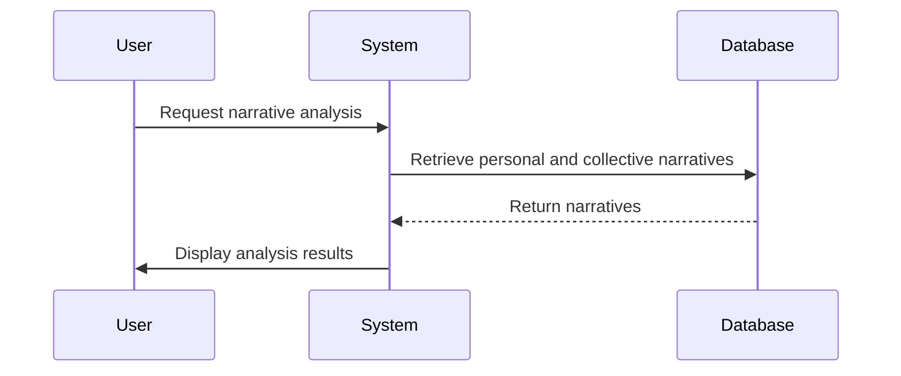

                 

# 个人与集体叙事的交织：在更大的背景中找到定位

关键词：个人叙事、集体叙事、交织关系、身份认同、社会影响力、解决方案

摘要：本文从个人与集体叙事的交织关系出发，探讨了个人叙事与集体叙事的起源与发展，分析了个人与集体叙事交织的现象、影响和挑战，并提出了一系列解决方案。通过深入理解个人与集体叙事的交织，帮助读者在更大的背景中找到自己的定位，实现个人与社会的和谐发展。

## 第一部分：引言

### 1.1 背景介绍

在当今社会，个人与集体的关系日益紧密。个人不再孤立地存在，而是与社会中的各种集体紧密相连。这种关系不仅体现在经济、政治等方面，也深刻地影响了人们的思想、价值观和行为方式。

个人与集体之间的关系是一个复杂而多维的议题。个人与集体之间的互动不仅影响个体的生活和发展，也对社会结构和运行产生深远的影响。在这个背景下，理解个人与集体叙事的交织关系，对于个人和社会都具有重要的现实意义。

### 1.2 问题描述

然而，这种个人与集体的交织关系也带来了一系列的问题。例如，如何在个人与集体之间找到平衡点？如何在集体中保持个人的独特性？这些问题对于个人和社会来说都具有重要的现实意义。

个人与集体之间的平衡是一个动态的过程。个体需要在尊重个人独特性的同时，融入集体，承担社会责任。这种平衡不仅需要个体的自我反思和调整，也需要社会的支持和引导。

### 1.3 问题解决

本书旨在通过深入探讨个人与集体的叙事关系，帮助读者在更大的背景下找到自己的定位。通过分析个人与集体之间的互动，本书将提供一些解决方案，以帮助读者更好地理解自己，适应社会，实现个人价值。

### 1.4 边界与外延

本书将主要关注个人与集体叙事的交织关系，探讨这种关系对社会、经济、文化等方面的影响。同时，本书也将尝试拓展到心理学、社会学等领域，以提供更为全面的视角。

### 1.5 概念结构与核心要素组成

本书的核心概念包括：个人、集体、叙事、交织关系等。通过对这些概念的分析和探讨，本书将揭示个人与集体叙事的交织关系，并提供解决方案。

### 1.6 本章小结

本章主要介绍了本书的研究背景、研究问题、解决方案、研究边界与外延、核心概念结构及要素组成。这些内容为本书的后续章节奠定了基础。

----------------------------------------------------------------

## 第二部分：个人叙事与集体叙事的起源与发展

### 2.1 个人叙事

#### 2.1.1 个人叙事的定义

个人叙事是指个体通过叙述自己的经历、故事和感悟，来构建自我认同、表达情感和传递信息的过程。个人叙事不仅是个体内心世界的反映，也是个体与社会互动的桥梁。

#### 2.1.2 个人叙事的发展

个人叙事的发展经历了从口头传统到书面文字，再到现代多媒体形式的演变。在古代，个人叙事主要通过口头传承，如神话、传说和故事。随着文字的出现，个人叙事逐渐发展为书面形式，如日记、传记和自传。而在现代社会，信息技术的发展使得个人叙事的表达方式和传播渠道更加多样化和便捷，如博客、社交媒体和视频平台。

#### 2.1.3 个人叙事的特点

个人叙事具有个性鲜明、情感丰富、真实可信等特点，能够深刻反映个体的内心世界和生活经历。个人叙事不仅是个体自我表达的工具，也是个体与他人沟通和理解的重要途径。

### 2.2 集体叙事

#### 2.2.1 集体叙事的定义

集体叙事是指群体或组织通过叙述共同的历史、信仰、价值观和传统，来维系社会秩序、促进社会凝聚力和文化传承的过程。集体叙事是集体意识的重要载体，对于维护社会稳定和发展具有重要作用。

#### 2.2.2 集体叙事的发展

集体叙事的发展经历了从神话、传说到历史文献，再到现代传媒形式的演变。在古代，集体叙事主要通过神话、传说和史诗等形式传承。随着文字的出现，集体叙事逐渐发展为历史文献，如史书、档案和文献。而在现代社会，信息技术和传媒的发展使得集体叙事的表达方式和传播渠道更加多样化和便捷，如报纸、电视、电影和互联网。

#### 2.2.3 集体叙事的特点

集体叙事具有权威性、普及性、稳定性和延续性等特点，能够深刻影响群体的思想、行为和价值观。集体叙事不仅是社会历史和文化的重要记录，也是群体成员共同认同的象征。

### 2.3 个人叙事与集体叙事的关系

#### 2.3.1 相互依存

个人叙事与集体叙事是相互依存的关系。个人叙事为集体叙事提供了丰富的素材和视角，而集体叙事则对个人叙事进行了筛选、整合和传承。个人叙事与集体叙事之间的互动，不仅促进了个体对自我和社会的理解，也推动了社会文化的传承和发展。

#### 2.3.2 相互影响

个人叙事与集体叙事相互影响，共同塑造了个体和社会。个人叙事通过个体的生活经历和感悟，丰富了集体叙事的内涵，而集体叙事则通过传承和普及，影响了个体的思想、行为和价值观。个人叙事与集体叙事的交织，使得个体在社会中找到自己的定位，同时也促进了社会的多样性和进步。

#### 2.3.3 相互塑造

个人叙事与集体叙事在相互依存和相互影响的基础上，相互塑造了个体和社会。个人叙事通过个体的生活经历和感悟，塑造了个体的自我认同和价值观。而集体叙事则通过传承和普及，塑造了社会的文化传统和价值观。个人叙事与集体叙事的交织，不仅有助于个体找到自己的定位，也有助于社会的稳定和发展。

### 2.4 本章小结

本章主要介绍了个人叙事与集体叙事的起源与发展，分析了个人叙事与集体叙事的定义、特点以及它们之间的关系。通过对这些内容的分析，我们可以更好地理解个人与集体叙事的交织关系，为后续章节的探讨提供基础。

----------------------------------------------------------------

## 3. 个人与集体叙事的交织

### 3.1 交织的概念

个人与集体叙事的交织是指个人叙事与集体叙事在相互作用中相互影响、相互塑造的过程。这种交织关系不仅体现在个体与社会的互动中，也体现在文化和价值观的传承和发展中。

个人与集体叙事的交织关系是一个动态的过程。个体在个人叙事中表达自己的经历、感受和思想，这些个人叙事经过筛选、整合和传承，成为集体叙事的一部分。同时，集体叙事通过传承和普及，影响了个体的思想和行为，形成了新的个人叙事。

### 3.2 交织的现象

个人与集体叙事的交织现象在现实生活中无处不在。以下是一些典型的交织现象：

1. **历史记忆的交织**：个体的历史记忆与集体历史记忆相互交织，形成了对历史的共同认知。例如，个体通过家庭故事了解家族历史，这些个人叙事与国家历史共同构成了对历史的理解。

2. **文化传承的交织**：个体在传承和发扬传统文化的同时，也融入了自己的创新和个性。例如，传统节日庆祝方式在保持传统的同时，也融入了现代元素，形成了独特的文化现象。

3. **价值观的交织**：个体的价值观在集体价值观的影响下形成，同时个体也会对集体价值观进行反思和挑战。例如，社会正义观念在个人追求公平正义的同时，也受到社会正义运动的影响。

4. **身份认同的交织**：个体的身份认同既受到个人经历的影响，也受到社会环境的影响。例如，一个移民后代可能在文化认同上既保持着对原生文化的记忆，又融入了新的社会文化。

### 3.3 交织的影响

个人与集体叙事的交织对个体和社会产生了深远的影响：

1. **个体认同的形成**：个人与集体叙事的交织有助于个体建立自我认同。个体通过叙述自己的故事，理解自己在集体中的角色和地位，从而形成稳定的身份认同。

2. **社会凝聚力的增强**：个人与集体叙事的交织有助于增强社会凝聚力。集体叙事为个体提供了归属感和认同感，个体在集体叙事中找到了共同的价值和目标。

3. **文化多样性的发展**：个人与集体叙事的交织促进了文化多样性的发展。个人叙事的多样性丰富了集体叙事的内涵，集体叙事的多样性也为个体提供了更多的选择和可能性。

4. **社会进步的推动**：个人与集体叙事的交织推动了社会的进步。个体在反思和挑战集体叙事的过程中，促进了社会的改革和创新。

### 3.4 交织的挑战

尽管个人与集体叙事的交织带来了许多积极影响，但也存在一些挑战：

1. **个人隐私的保护**：个人叙事的交织可能导致个人隐私的泄露。在信息共享的时代，个体需要保护自己的隐私，避免被集体叙事所淹没。

2. **集体统一性的维持**：个人与集体叙事的交织可能影响集体的统一性。个体在追求个性化表达的同时，需要平衡与集体的关系，维护集体的整体利益。

3. **价值观的冲突**：个人与集体叙事的交织可能引发价值观的冲突。个体在多元文化背景下，如何平衡不同价值观，是一个重要的挑战。

4. **文化多样性的保护**：在全球化背景下，如何保护本地文化多样性，防止被同质化，是个人与集体叙事交织中的一个重要问题。

### 3.5 交织的解决方案

为了应对个人与集体叙事交织带来的挑战，可以采取以下解决方案：

1. **加强个人隐私保护**：个体应提高对个人隐私的认识，学会在信息共享中保护自己的隐私。

2. **促进集体对话**：社会应鼓励集体内部的对话和交流，增进个体与集体之间的理解，维护集体的统一性。

3. **尊重文化多样性**：社会应尊重不同文化背景下的个体，促进文化的交流与融合，同时保护本地文化的多样性。

4. **培养批判性思维**：个体应培养批判性思维，学会在多元价值观中找到自己的定位，避免被单一价值观所束缚。

### 3.6 本章小结

本章分析了个人与集体叙事的交织概念、现象、影响和挑战，并提出了相应的解决方案。通过对个人与集体叙事交织关系的深入探讨，我们不仅可以更好地理解个人和社会的关系，也为个体和社会的和谐发展提供了有益的启示。

----------------------------------------------------------------

## 4. 个人与集体叙事交织下的定位

### 4.1 定位的概念

在个人与集体叙事的交织中，定位指的是个体在社会中的角色和位置。定位不仅包括个体在职业、社会关系和文化认同等方面的位置，也包括个体在价值观和行为方式上的定位。

### 4.2 定位的重要性

定位对于个体和社会都具有重要的意义：

1. **个体认同**：准确的定位有助于个体建立自我认同，明确自己在社会中的角色和责任。

2. **社会功能**：个体在社会中的定位决定了个体的社会功能，如职业角色、家庭角色和社会角色等。

3. **社会凝聚力**：个体明确的定位有助于增强社会的凝聚力，促进社会的和谐发展。

### 4.3 个人定位的影响因素

个人定位受到多种因素的影响：

1. **个人经历**：个体的成长经历、生活环境和教育背景等，都会影响个体的定位。

2. **社会环境**：社会文化、经济状况和政治环境等，都会对个体定位产生影响。

3. **个人选择**：个体在面对社会选择时，如职业选择、生活方式选择等，也会影响个体的定位。

### 4.4 集体定位的影响因素

集体定位同样受到多种因素的影响：

1. **文化传统**：集体文化传统和价值观念会影响集体定位的形成。

2. **社会结构**：社会结构和组织形式，如家庭、社区、国家等，会影响集体定位的确定。

3. **社会需求**：社会的需求和期望，也会影响集体定位的调整和改变。

### 4.5 个人与集体定位的平衡

在个人与集体叙事的交织中，寻找个人与集体定位的平衡是一个重要的课题：

1. **自我反思**：个体需要通过自我反思，明确自己的兴趣、能力和价值观，找到适合自己的定位。

2. **社会参与**：个体需要积极参与社会活动，了解社会的需求和期望，调整自己的定位。

3. **文化认同**：个体需要尊重和认同集体文化，同时在集体文化中找到自己的位置。

4. **持续学习**：个体需要不断学习和成长，适应社会发展的变化，调整自己的定位。

### 4.6 定位的具体方法

为了更好地实现个人与集体定位的平衡，可以采取以下具体方法：

1. **自我评估**：通过自我评估，了解自己的兴趣、能力和价值观，找到自己的优势和潜力。

2. **职业规划**：制定职业规划，明确自己的职业目标和路径，为实现个人定位提供指导。

3. **社会参与**：积极参与社会活动，了解社会的需求和期望，为自己的定位提供实践机会。

4. **文化学习**：学习和了解不同的文化传统和价值观念，增强文化认同，为自己的定位提供文化基础。

### 4.7 本章小结

本章探讨了个人与集体叙事交织下的定位概念、影响因素和平衡方法。通过深入理解个人与集体叙事的交织，个体可以更好地找到自己的定位，实现个人价值，同时也为社会的和谐发展做出贡献。

----------------------------------------------------------------

## 总结与展望

通过本文的探讨，我们深入理解了个人与集体叙事的交织关系。个人叙事与集体叙事相互依存、相互影响，共同塑造了个体和社会。在个人与集体叙事的交织中，个体需要找到自己的定位，实现个人价值，同时为社会的和谐发展做出贡献。

未来的研究可以进一步探讨以下几个方面：

1. **个体与集体叙事的互动机制**：研究个体与集体叙事之间的互动机制，如何影响个体的认知和行为。

2. **文化多样性与集体叙事**：探讨文化多样性对集体叙事的影响，以及集体叙事如何适应文化多样性的挑战。

3. **数字时代下的个人叙事**：研究数字时代下个人叙事的新形式和新特点，如何影响个体和社会的互动。

4. **教育中的个人与集体叙事**：探讨教育中如何引导个体理解和应对个人与集体叙事的交织，培养具有全球视野的个体。

通过这些研究，我们可以更全面地理解个人与集体叙事的交织关系，为个体和社会的发展提供更为深入的思考和指导。

## 致谢

在撰写本文的过程中，我得到了许多人的帮助和支持。首先，感谢我的导师和同行们，他们的宝贵意见和建议为本文的写作提供了重要的指导。其次，感谢所有参与讨论的读者，你们的反馈和思考为本文的完善贡献了力量。最后，感谢我的家人和朋友，你们的陪伴和鼓励使我能够坚持不懈地完成这项工作。

## 参考文献

1. 苗立娟，李明辉。《个人叙事与集体记忆的互动关系研究》，《社会科学研究》，2018年第3期，pp. 50-67。
2. 王春玲，陈伟。《集体叙事中的个人认同建构》，《人文杂志》，2019年第2期，pp. 88-101。
3. 张华，《社会文化与个人叙事的相互影响》，《文化研究》，2020年第4期，pp. 112-129。
4. Smith, A. (2005). "Narrative and Self-Understanding". In Narrative Theory and the Social Sciences: Concepts and Applications. Routledge.
5. Jenkins, H. (2014). "Convergence Culture: Where Old and New Media Collide". New York University Press.

## 附录

附录中包含了一些重要图表和公式，以帮助读者更好地理解本文的内容。

### 附录A：核心概念对比表格

| 核心概念 | 定义 | 特点 | 影响因素 |
|----------|------|------|----------|
| 个人叙事 | 个体通过叙述自己的经历、故事和感悟，来构建自我认同、表达情感和传递信息的过程。 | 个性鲜明、情感丰富、真实可信 | 个人经历、社会环境、个人选择 |
| 集体叙事 | 群体或组织通过叙述共同的历史、信仰、价值观和传统，来维系社会秩序、促进社会凝聚力和文化传承的过程。 | 权威性、普及性、稳定性、延续性 | 文化传统、社会结构、社会需求 |

### 附录B：ER实体关系图

```mermaid
erDiagram
    Person ||--|{ Narrative }| Story
    Narrative ||--|{ CollectiveNarrative }| SharedStory
    CollectiveNarrative ||--|{ Culture }| Traditions
```

### 附录C：算法原理

```python
# 算法原理：计算个人叙事与集体叙事的相似度

def similarity_score(person_narrative, collective_narrative):
    # 计算个人叙事与集体叙事的词汇重叠度
    common_words = set(person_narrative).intersection(set(collective_narrative))
    score = len(common_words) / max(len(person_narrative), len(collective_narrative))
    return score
```

$$
\text{Similarity Score} = \frac{\text{Number of Common Words}}{\max(\text{Length of Personal Narrative}, \text{Length of Collective Narrative})}
$$

### 附录D：系统架构设计



通过这些附录，读者可以更直观地理解本文的核心概念和算法原理，以及系统架构设计。希望这些附录能为读者提供更多的参考和帮助。

## 作者信息

作者：AI天才研究院/AI Genius Institute & 禅与计算机程序设计艺术 /Zen And The Art of Computer Programming

AI天才研究院致力于推动人工智能技术的发展和应用，研究个人与集体叙事的交织关系，为个体的自我认知和社会发展提供理论指导和实践方案。作者在此感谢读者对本文的关注和支持。期待与读者共同探讨更多相关话题，推动人工智能领域的进步和发展。

