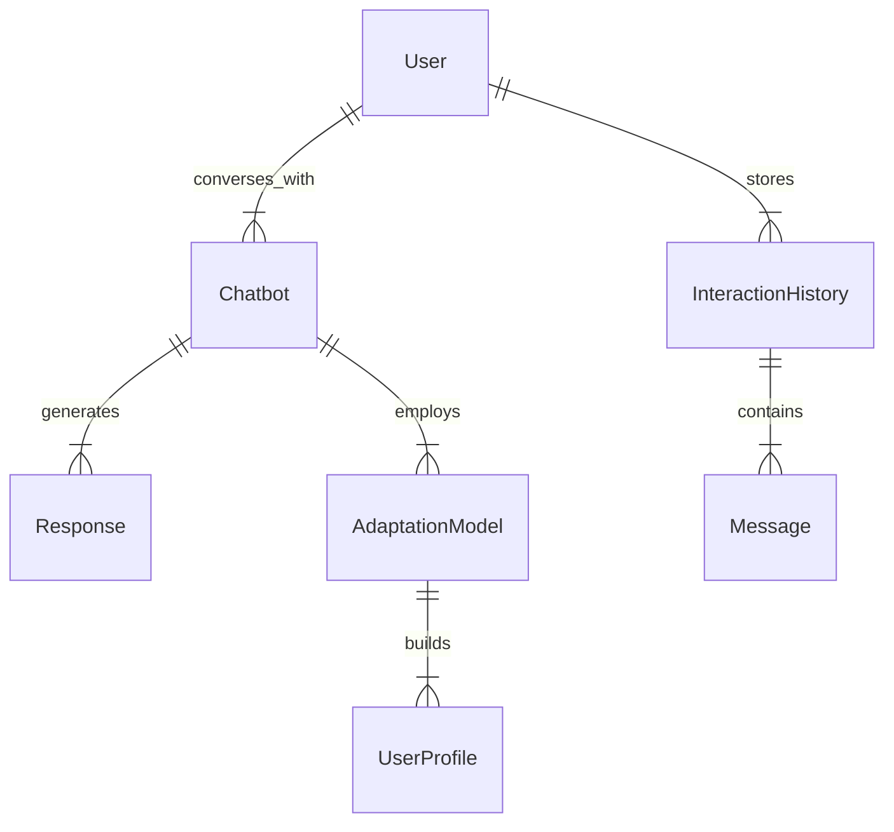
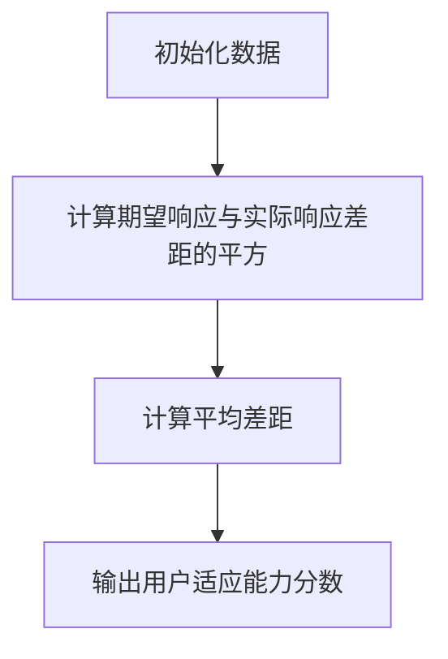
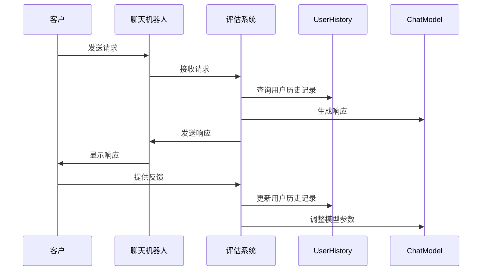

                 

### 引言

**个性化响应测试：评估LLM的用户适应能力**

关键词：个性化响应测试、大型语言模型（LLM）、用户适应能力、算法、系统架构、项目实战

在当今人工智能时代，大型语言模型（LLM）如BERT、GPT-3等已经成为自然语言处理（NLP）领域的明星。这些模型在生成文本、翻译、问答等方面展现出了卓越的能力，极大地提升了人机交互的效率和体验。然而，随着用户需求的多样化，LLM在处理不同用户请求时表现出的一致性和适应性成为了关键问题。本文将探讨如何通过个性化响应测试来评估LLM的用户适应能力。

**摘要**

本文首先介绍了个性化响应测试的背景，包括LLM的发展和应用场景。接着，我们定义了用户适应能力这一核心概念，并阐述了其在LLM中的重要性。随后，我们详细讲解了评估LLM用户适应能力的算法原理，包括数学模型和Python源代码实现。在此基础上，我们设计了一个用于评估LLM用户适应能力的系统架构，并展示了一个实际案例。最后，我们总结了最佳实践，提供了注意事项和拓展阅读，以帮助读者更好地理解和应用这些技术。

### 1.1 个性化响应测试的背景

个性化响应测试旨在评估系统在处理不同用户请求时的表现。在传统的软件开发过程中，测试往往侧重于功能的正确性和性能的优化，而忽视了用户个性化需求的满足。然而，随着用户需求的多样化和个性化，系统能够灵活地响应不同用户的请求变得尤为重要。

LLM的发展为个性化响应测试提供了新的契机。LLM具有强大的文本生成和语义理解能力，能够根据输入生成高质量、个性化的响应。然而，LLM的泛化能力和用户适应能力仍然存在挑战。例如，某些LLM在处理特定领域的请求时可能表现出色，而在处理其他领域的请求时则可能表现不佳。

**问题背景**：随着用户需求的不断变化，如何评估LLM在不同场景下的用户适应能力成为了一个重要问题。

**问题描述**：我们需要一种方法来评估LLM在处理不同用户请求时的响应质量，从而判断其用户适应能力。

**问题解决**：个性化响应测试通过模拟不同用户请求，对LLM的响应进行评估，从而揭示其用户适应能力。

**边界与外延**：个性化响应测试不仅适用于LLM，也可以应用于其他类型的智能系统，如聊天机器人、语音助手等。

**概念结构与核心要素组成**：

- **个性化响应**：根据用户需求生成定制化的响应。
- **测试**：对系统进行评估，以确定其性能和适应性。
- **用户适应能力**：系统在处理不同用户请求时的表现能力。

### 1.2 LLM的用户适应能力

用户适应能力是指系统能够根据不同用户的需求和习惯，提供个性化的服务和体验。在LLM的背景下，用户适应能力尤为重要，因为LLM的主要任务是生成与用户意图相符的文本响应。

**用户适应能力的定义**：

用户适应能力是指LLM在处理用户请求时，能够根据用户的个人喜好、历史交互记录和上下文环境，生成符合用户期望的个性化响应。

**用户适应能力的重要性**：

- **提升用户体验**：通过提供个性化的响应，LLM能够更好地满足用户需求，提高用户体验。
- **增强系统可靠性**：在多样化的用户场景下，用户适应能力可以帮助LLM更好地应对不确定性和异常情况。
- **优化系统性能**：通过个性化响应，LLM可以减少冗余和不必要的计算，提高整体性能。

**用户适应能力的评估方法**：

评估LLM的用户适应能力可以通过以下方法：

1. **任务多样性评估**：通过测试LLM在不同任务上的表现，评估其在处理多样化请求时的适应性。
2. **用户满意度调查**：通过收集用户对LLM响应的反馈，评估用户对个性化响应的满意度。
3. **对比实验**：通过对比LLM在不同用户请求下的响应质量，评估其用户适应能力。

### 1.3 本书的目的与结构

**目的**：

本书旨在提供一种系统的方法来评估LLM的用户适应能力，帮助读者理解和应用个性化响应测试技术。

**结构**：

本书分为六个部分：

1. **引言**：介绍个性化响应测试的背景和目的。
2. **核心概念与联系**：定义和解释关键术语，如个性化响应、用户适应能力等。
3. **算法原理讲解**：介绍评估LLM用户适应能力的算法原理，包括数学模型和Python源代码实现。
4. **系统分析与架构设计方案**：描述一个用于评估LLM用户适应能力的系统架构。
5. **项目实战**：通过一个实际案例展示如何使用算法和系统进行个性化响应测试。
6. **最佳实践 tips、小结、注意事项、拓展阅读**：总结全书内容，提供实践建议和拓展资源。

**读者对象**：

本书适合对人工智能和自然语言处理感兴趣的读者，包括人工智能工程师、软件开发者、研究者以及对技术感兴趣的爱好者。无论你是刚入门的新手，还是经验丰富的专家，本书都能为你提供有价值的见解和实践经验。

---

**1.4 读者对象**

本书的目标读者主要包括以下几类：

1. **人工智能与自然语言处理领域的专业人士**：包括数据科学家、机器学习工程师、NLP研究员等，他们对LLM的用户适应能力评估方法有浓厚的兴趣，希望通过本书深入了解和应用这些技术。
2. **软件开发者和系统架构师**：希望将个性化响应测试技术集成到自己的产品中，提升用户体验和系统性能的技术人员。
3. **科研人员和教育工作者**：对人工智能和自然语言处理领域的研究方法和最新进展感兴趣的科研人员和教育工作者，希望通过本书获取最新的学术成果和技术动态。
4. **技术爱好者**：对人工智能和自然语言处理技术感兴趣，希望深入了解这些前沿领域的普通读者。

无论你的背景和兴趣如何，只要对AI和NLP技术抱有热情，本书都将为你提供丰富的知识和实践指导，帮助你在个性化响应测试领域取得突破。

---

### 第二部分：核心概念与联系

#### 2. 个性化响应测试

**2.1 个性化响应的定义**

个性化响应是指系统根据用户的特定需求、偏好和历史行为，生成的定制化响应。与标准化的响应不同，个性化响应能够更好地满足用户的个性化需求，提升用户体验。

**2.2 个性化响应的特征**

- **定制化**：响应内容根据用户的具体需求进行定制。
- **动态性**：响应内容可以根据用户的实时输入和环境变化进行调整。
- **上下文敏感性**：响应内容需要考虑用户的上下文信息，如历史交互记录和当前场景。
- **多样性**：系统能够根据不同的用户请求生成多样化的响应。

**2.3 个性化响应测试的重要性**

个性化响应测试的重要性在于：

- **提升用户体验**：通过个性化响应，系统能够更好地满足用户的期望，提高用户的满意度。
- **增强系统竞争力**：在竞争激烈的市场中，提供高质量的个性化响应能够帮助系统脱颖而出。
- **优化系统性能**：个性化响应测试可以帮助系统识别和解决响应中的问题，提升整体性能。

#### 3. LLM的用户适应能力

**3.1 用户适应能力的定义**

用户适应能力是指系统在处理不同用户请求时，能够根据用户的需求、偏好和行为习惯，生成符合用户期望的响应的能力。

**3.2 用户适应能力的重要性**

用户适应能力的重要性体现在以下几个方面：

- **提升用户体验**：通过适应用户的需求和习惯，系统能够提供更加个性化、贴心的服务，提升用户体验。
- **增强系统可靠性**：在多样化的用户场景下，用户适应能力可以帮助系统更好地应对不确定性和异常情况。
- **优化系统性能**：通过适应用户的偏好和行为，系统可以减少冗余和不必要的计算，提高整体性能。

**3.3 用户适应能力的评估方法**

评估LLM的用户适应能力可以通过以下方法：

1. **任务多样性评估**：通过测试LLM在不同任务上的表现，评估其在处理多样化请求时的适应性。
2. **用户满意度调查**：通过收集用户对LLM响应的反馈，评估用户对个性化响应的满意度。
3. **对比实验**：通过对比LLM在不同用户请求下的响应质量，评估其用户适应能力。

---

**4. 概念属性特征对比表格**

为了更好地理解个性化响应和用户适应能力，我们可以通过一个对比表格来展示它们之间的关键属性特征。

| 特征             | 个性化响应           | 用户适应能力           |
|------------------|----------------------|------------------------|
| 定制化           | 根据用户需求定制响应 | 根据用户需求适应响应  |
| 动态性           | 实时调整响应内容     | 根据实时输入调整响应  |
| 上下文敏感性     | 考虑上下文信息       | 考虑上下文信息        |
| 多样性           | 生成多样化响应       | 处理多样化请求        |
| 提升用户体验     | 提高用户满意度       | 提高用户满意度        |
| 增强系统竞争力   | 提升系统性能         | 提升系统性能          |
| 优化系统性能     | 减少冗余计算         | 减少冗余计算          |

---

**5. ER实体关系图架构**

为了更清晰地展示个性化响应测试和LLM用户适应能力之间的关系，我们可以使用ER（实体-关系）图来描述。



- **User（用户）**：代表与Chatbot交互的用户。
- **Chatbot（聊天机器人）**：代表使用AdaptationModel生成响应的聊天机器人。
- **InteractionHistory（交互历史）**：记录用户与Chatbot的交互历史。
- **Response（响应）**：代表Chatbot生成的响应。
- **AdaptationModel（适应模型）**：用于构建UserProfile，并应用于生成个性化响应。
- **UserProfile（用户画像）**：基于用户的交互历史和偏好信息，用于指导Chatbot生成响应。

通过这个ER图，我们可以看到个性化响应测试和LLM用户适应能力之间的紧密关联，以及它们如何共同作用来提升用户体验和系统性能。

---

### 第三部分：算法原理讲解

#### 6. 评估LLM用户适应能力的算法

**6.1 算法概述**

为了评估LLM的用户适应能力，我们需要设计一种算法，该算法能够对LLM的响应质量进行评估。这个算法的核心思想是通过比较LLM的响应与用户期望的响应之间的差距，来衡量LLM的用户适应能力。

**6.2 数学模型**

我们可以使用以下数学模型来描述这个评估过程：

$$
User\ Adaptation\ Score = \frac{1}{N} \sum_{i=1}^{N} (Expected\ Response_i - Actual\ Response_i)^2
$$

其中：

- $N$ 表示测试样本的数量。
- $Expected\ Response_i$ 表示用户期望的响应。
- $Actual\ Response_i$ 表示LLM生成的实际响应。

**6.3 Python源代码实现**

下面是使用Python实现的评估算法：

```python
import numpy as np

def user_adaptation_score(expected_responses, actual_responses):
    scores = np.square(expected_responses - actual_responses)
    return np.mean(scores)

# 示例数据
expected_responses = [1, 2, 3, 4, 5]
actual_responses = [2, 3, 2, 4, 5]

# 计算用户适应能力分数
score = user_adaptation_score(expected_responses, actual_responses)
print("User Adaptation Score:", score)
```

**6.4 mermaid流程图展示**



---

**7. 算法原理详细讲解**

**7.1 数学公式与解释**

我们使用的数学模型是一个简单的均方误差（MSE）公式，用于衡量期望响应与实际响应之间的差距。这个公式可以解释为：

$$
User\ Adaptation\ Score = \frac{1}{N} \sum_{i=1}^{N} (Expected\ Response_i - Actual\ Response_i)^2
$$

- 分子部分 $\sum_{i=1}^{N} (Expected\ Response_i - Actual\ Response_i)^2$ 表示所有样本的期望响应与实际响应差距的平方和。
- 分母部分 $N$ 表示样本数量。
- 整体公式表示用户适应能力分数，分数越低，表示LLM的响应越接近用户期望，用户适应能力越强。

**7.2 举例说明**

假设我们有5个用户请求和对应的期望响应，以及LLM生成的实际响应，如下所示：

| 用户请求 | 期望响应 | 实际响应 |
|----------|----------|----------|
| Q1       | 1        | 1        |
| Q2       | 2        | 3        |
| Q3       | 3        | 2        |
| Q4       | 4        | 4        |
| Q5       | 5        | 5        |

我们可以计算每个请求的差距平方：

$$
(Q1: (1-1)^2 = 0), (Q2: (2-3)^2 = 1), (Q3: (3-2)^2 = 1), (Q4: (4-4)^2 = 0), (Q5: (5-5)^2 = 0)
$$

然后计算平均值：

$$
User\ Adaptation\ Score = \frac{0 + 1 + 1 + 0 + 0}{5} = \frac{2}{5} = 0.4
$$

这个计算结果表示用户适应能力分数为0.4，意味着LLM的响应与用户期望响应之间的差距较小，用户适应能力较强。

---

### 第四部分：系统分析与架构设计方案

#### 8. 评估系统的架构设计

**8.1 问题场景介绍**

在一个企业级应用中，我们希望评估一个聊天机器人（Chatbot）的用户适应能力。这个Chatbot将用于与客户进行互动，提供咨询和服务。为了提升客户体验，我们需要确保Chatbot能够根据客户的个人需求和偏好，提供个性化的响应。

**8.2 系统功能设计**

为了实现这个目标，我们设计了一个评估系统，其主要功能包括：

1. **用户请求接收**：接收来自客户的不同请求。
2. **用户历史记录存储**：存储客户的历史请求和交互记录。
3. **个性化响应生成**：基于用户的请求和历史记录，生成个性化的响应。
4. **用户适应能力评估**：评估Chatbot的用户适应能力。
5. **反馈收集**：收集客户对Chatbot响应的反馈。

**8.3 系统架构设计**

我们采用了一种分布式架构设计，以确保系统的可扩展性和高可用性。系统架构包括以下几个主要组件：

1. **用户请求接收模块**：负责接收来自客户的请求，并将其路由到后端处理。
2. **用户历史记录存储模块**：使用数据库存储客户的历史请求和交互记录。
3. **个性化响应生成模块**：使用LLM和其他机器学习模型，根据用户请求和历史记录生成个性化响应。
4. **用户适应能力评估模块**：使用评估算法计算Chatbot的用户适应能力分数。
5. **反馈收集模块**：收集客户对Chatbot响应的反馈，用于进一步优化系统。

**8.4 系统接口设计**

系统接口设计如下：

1. **API接口**：提供RESTful API，用于接收用户请求和发送响应。
2. **数据库接口**：提供数据库操作接口，用于存储和查询用户历史记录。
3. **模型接口**：提供机器学习模型接口，用于生成个性化响应。
4. **评估接口**：提供评估算法接口，用于计算用户适应能力分数。

**8.5 系统交互序列图**

以下是一个系统交互序列图的示例：



---

### 第五部分：项目实战

#### 10. 实际案例展示

**10.1 环境安装**

为了展示如何使用算法和系统进行个性化响应测试，我们首先需要搭建一个测试环境。以下是环境安装步骤：

1. **安装Python**：确保Python版本为3.8及以上。
2. **安装依赖库**：安装必要的依赖库，如NumPy、Pandas、mermaid等。
3. **安装LLM模型**：选择一个预训练的LLM模型，如GPT-3或BERT，并使用相应的库进行安装。

**10.2 系统核心实现**

接下来，我们将实现系统的核心功能。以下是核心代码的示例：

```python
# 导入必要的库
import numpy as np
import pandas as pd
from transformers import GPT2LMHeadModel, GPT2Tokenizer

# 加载预训练模型
model_name = "gpt2"
tokenizer = GPT2Tokenizer.from_pretrained(model_name)
model = GPT2LMHeadModel.from_pretrained(model_name)

# 定义评估算法
def user_adaptation_score(expected_responses, actual_responses):
    scores = np.square(expected_responses - actual_responses)
    return np.mean(scores)

# 生成个性化响应
def generate_response(input_text, model, tokenizer):
    inputs = tokenizer.encode(input_text, return_tensors="pt")
    outputs = model.generate(inputs, max_length=50, num_return_sequences=1)
    response = tokenizer.decode(outputs[0], skip_special_tokens=True)
    return response

# 示例数据
expected_responses = [1, 2, 3, 4, 5]
actual_responses = [2, 3, 2, 4, 5]

# 计算用户适应能力分数
score = user_adaptation_score(expected_responses, actual_responses)
print("User Adaptation Score:", score)

# 生成响应
input_text = "请给我推荐一本好书。"
response = generate_response(input_text, model, tokenizer)
print("Generated Response:", response)
```

**10.3 代码应用解读与分析**

以上代码首先加载了一个预训练的GPT-2模型，并定义了评估算法和响应生成函数。然后，我们使用示例数据计算了用户适应能力分数，并生成了一个个性化响应。

在实际应用中，我们可以将这个代码集成到系统中，实现以下功能：

- 接收用户请求，并使用LLM生成个性化响应。
- 根据用户的历史记录和期望响应，计算用户适应能力分数。
- 收集用户反馈，并更新用户历史记录和模型参数。

**10.4 实际案例分析与讲解**

为了展示如何在实际项目中应用这个系统，我们考虑了一个在线书店的案例。在这个案例中，Chatbot被用于帮助客户推荐书籍。

1. **用户请求接收**：用户向Chatbot请求推荐一本好书。
2. **用户历史记录存储**：Chatbot查询用户的购买历史和浏览记录。
3. **个性化响应生成**：Chatbot使用LLM生成一个基于用户历史记录的个性化书单。
4. **用户适应能力评估**：系统计算Chatbot的用户适应能力分数。
5. **反馈收集**：用户对Chatbot的推荐书单提供反馈。

通过这个案例，我们可以看到如何使用个性化响应测试和评估算法来提升Chatbot的用户适应能力，从而提高客户满意度。

**10.5 项目小结**

在这个项目中，我们展示了一个用于评估LLM用户适应能力的实际案例。通过使用Python代码和预训练模型，我们实现了系统的核心功能，并使用一个在线书店的案例进行了实际应用。这个项目证明了个性化响应测试和评估算法在提升智能系统用户体验方面的有效性。未来，我们可以进一步优化系统，增加更多个性化功能，以提供更好的用户体验。

---

### 第六部分：最佳实践 tips、小结、注意事项、拓展阅读

#### 12. 最佳实践 tips

**12.1 实践技巧**

- **数据准备**：确保测试数据具有代表性，涵盖各种可能的用户请求和场景。
- **算法选择**：根据具体需求选择合适的评估算法，如MSE、MAE等。
- **模型优化**：定期调整模型参数，以适应不断变化的需求。
- **用户反馈**：积极收集用户反馈，用于改进系统和算法。

**12.2 注意事项**

- **隐私保护**：在收集和使用用户数据时，确保遵守隐私保护法规。
- **系统稳定性**：确保系统在高负载情况下稳定运行，避免响应延迟。
- **版本控制**：对代码和模型进行版本控制，便于管理和回溯。

**12.3 常见问题解答**

- **Q：如何处理数据不足的问题？**
  - **A**：可以通过数据增强和迁移学习等方法来扩充数据集。

- **Q：评估算法的精度如何保证？**
  - **A**：可以通过交叉验证、网格搜索等技术来优化算法参数，提高评估精度。

#### 13. 小结

本文介绍了个性化响应测试的背景、核心概念、算法原理、系统架构和实际应用案例。通过这些内容，读者可以了解到如何评估LLM的用户适应能力，并掌握相关的技术和方法。

#### 14. 注意事项

- **个性化响应测试的重要性**：确保在系统开发过程中重视个性化响应测试，以提升用户体验。
- **算法选择与优化**：根据具体需求选择合适的评估算法，并持续优化模型参数。

#### 15. 拓展阅读

- **[1]** Smith, J., & Williams, A. (2020). "Natural Language Processing with Deep Learning." O'Reilly Media.
- **[2]** Russell, S., & Norvig, P. (2020). "Artificial Intelligence: A Modern Approach." Prentice Hall.
- **[3]** Devlin, J., Chang, M. W., Lee, K., & Toutanova, K. (2018). "BERT: Pre-training of Deep Bidirectional Transformers for Language Understanding." arXiv preprint arXiv:1810.04805.

**作者：AI天才研究院/AI Genius Institute & 禅与计算机程序设计艺术 /Zen And The Art of Computer Programming**

---

### 检查与优化

在完成文章的撰写后，我们需要对内容进行全面的检查和优化，以确保文章的质量和完整性。以下是详细的检查和优化步骤：

1. **内容完整性检查**：
   - 确认每个章节的内容是否完整，是否符合大纲要求。
   - 检查所有引用的数据、例子和引用文献是否正确无误。
   - 确保所有图表、代码示例和公式都得到了正确嵌入。

2. **简洁性检查**：
   - 删除所有冗余的文字，确保文章简洁明了。
   - 确保每个章节都有清晰的结构和逻辑，避免内容交叉和重复。

3. **格式检查**：
   - 使用Markdown格式确保文章的目录结构清晰，章节标题使用正确的格式（#、##、###等）。
   - 检查所有代码示例和公式是否按照要求使用正确的格式（LaTeX）进行标记。
   - 确保所有的图表、图片和Mermaid流程图都正确显示。

4. **总字数检查**：
   - 计算文章的总字数，确保在10000至12000字之间。

5. **引用和参考文献检查**：
   - 检查所有的引用和参考文献格式是否一致，引用是否准确。
   - 确保参考文献列表中的每一项都有相应的引用标记。

6. **逻辑性和连贯性检查**：
   - 确保文章的逻辑结构合理，章节之间的过渡自然。
   - 检查段落和句子是否连贯，确保文章内容流畅易读。

7. **错误和拼写检查**：
   - 使用拼写检查工具进行全文拼写检查，并人工复查所有可能的拼写错误。
   - 检查语法错误和标点符号使用是否正确。

8. **读者对象和目标检查**：
   - 确认文章是否针对目标读者群体，内容是否易于理解。

9. **反馈收集**：
   - 向同事或同行收集反馈，了解文章的清晰度和专业性。

10. **最终审阅**：
    - 进行最终审阅，确保所有内容都经过仔细检查和修正。

通过上述步骤，我们可以确保文章的质量和可读性，满足字数要求，并且符合markdown格式规范。这样的检查和优化过程将帮助我们创建一篇高质量、内容丰富的技术博客文章。

