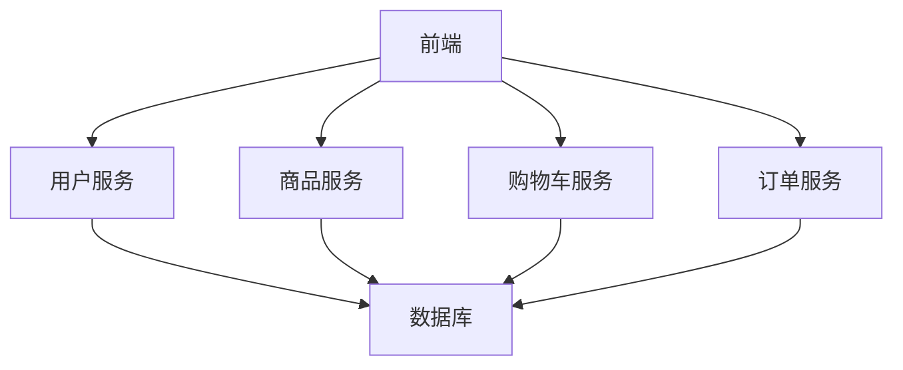
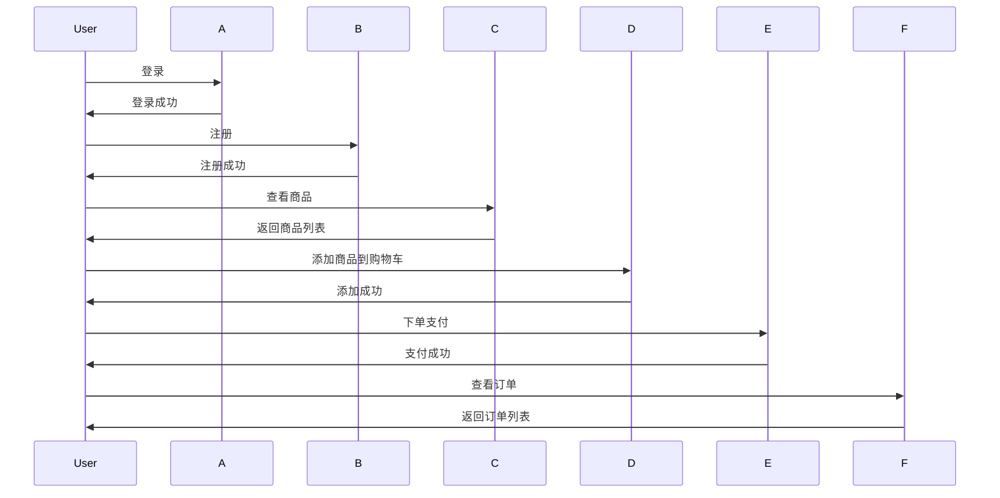
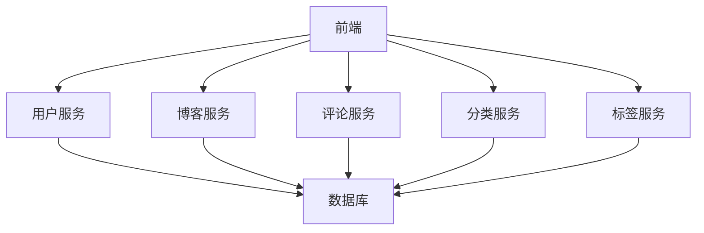
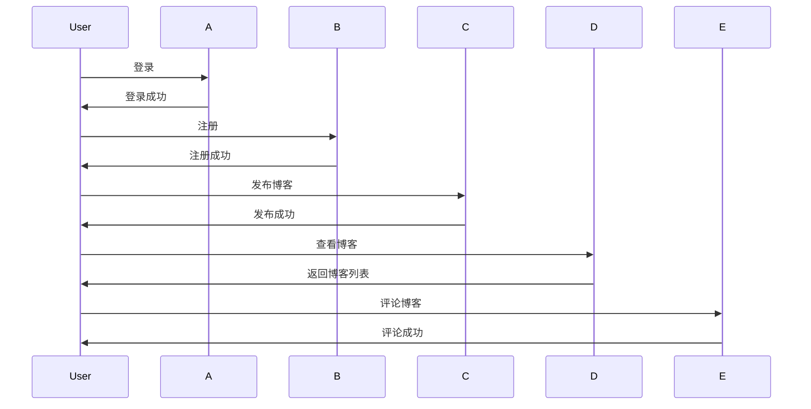
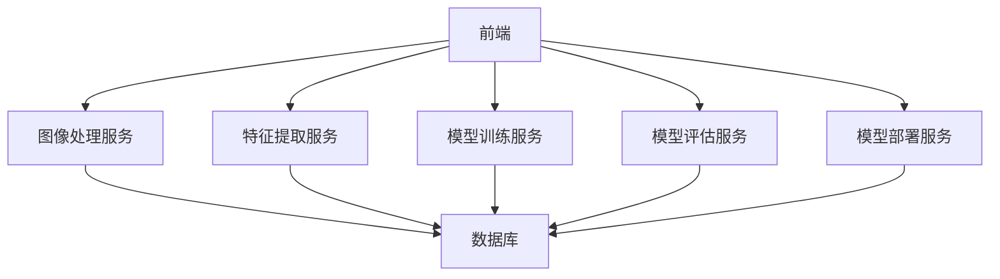
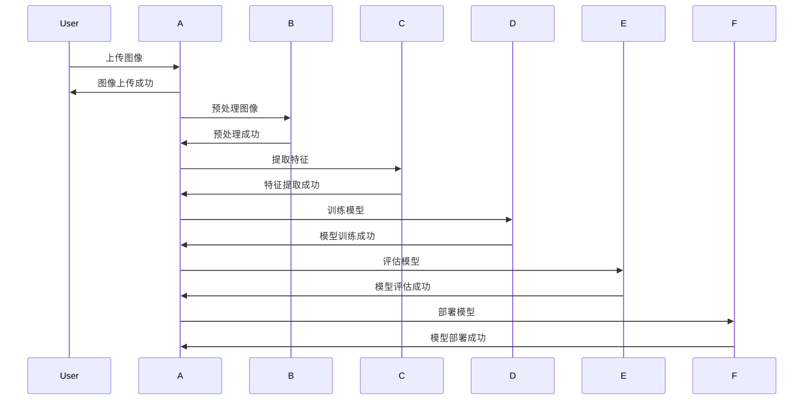

                 

# 丰富生命广度的实践：拓展视野的有效方法

## 概述

生命的广度，即我们所能触及和理解的世界范围，对我们的成长和幸福有着深远的影响。在这个信息爆炸的时代，如何有效地拓展我们的视野，丰富生命的广度，成为了每个人都需要思考的问题。本文章旨在探讨如何通过一系列有效的实践方法，实现这一目标。

首先，我们需要理解，视野的拓展不仅仅是知识的积累，更是一种思维方式的转变。它要求我们打破固有的思维定式，勇于探索未知的领域，持续反思与自我提升。在这个过程中，我们不仅能够获得更多的知识，还能提升自身的认知能力，从而更好地理解世界，丰富人生。

本文将分为五个部分进行详细探讨：

1. **引言**：介绍书籍的主题、目标读者以及阅读建议。
2. **拓展视野的基本原则**：探讨知识获取与整合、世界观与方法论、持续反思与自我提升、社交与交流等方面。
3. **拓展视野的具体方法**：介绍阅读与实践、旅行与体验、学习与交流、探索未知领域、创新与思考等方面。
4. **拓展视野的障碍与解决策略**：分析拓展视野的常见障碍，并提出相应的解决策略。
5. **案例分析与实战经验**：通过实际案例，展示如何将理论应用于实践。

## 引言

### 1.1 书籍主题介绍

生命的广度与深度，是我们每个人都需要关注的课题。广度，代表着我们的视野和认知范围；深度，则代表着我们对事物的理解和洞察力。在这个信息爆炸的时代，我们的视野和认知范围正在不断扩展，但与此同时，我们也面临着越来越多的困惑和挑战。如何有效地拓展我们的视野，丰富生命的广度，成为了我们需要思考的问题。

### 1.2 目标读者与适用场景

本书籍的目标读者主要包括以下几个方面：

1. **自我提升者**：那些希望通过不断学习提升自己，拓展视野的人。
2. **知识探索者**：那些对未知充满好奇，渴望了解世界的方方面面的人。
3. **人生哲学家**：那些思考人生意义，追求内心宁静的人。

无论你是哪一类读者，本书都希望能为你提供一些实用的方法和策略，帮助你更好地拓展视野，丰富生命。

### 1.3 阅读建议

在阅读本书时，我们建议你：

1. **带着问题阅读**：在阅读过程中，时刻保持思考，尝试用自己的语言总结和归纳书中的观点。
2. **实践与应用**：将书中的方法应用到实际生活中，通过实践来检验和巩固所学。
3. **持续反思**：在实践过程中，不断反思和总结，调整和优化自己的方法和策略。

### 1.4 本章小结

通过本章的介绍，我们对书籍的主题、目标读者和阅读建议有了初步的了解。在接下来的章节中，我们将深入探讨如何有效地拓展视野，丰富生命的广度。

## 拓展视野的基本原则

### 2.1 知识获取与整合

知识获取与整合是拓展视野的基础。在这个过程中，我们需要掌握一些有效的方法。

#### 2.1.1 有效学习的方法

首先，我们需要了解如何进行有效学习。以下是一些有效学习的方法：

1. **主动学习**：主动学习比被动学习更能促进知识的理解和记忆。
2. **分散学习**：分散学习能够提高学习效果，减少遗忘率。
3. **交互学习**：通过与他人交流和讨论，能够加深对知识的理解和记忆。

#### 2.1.2 知识的层级结构

知识的层级结构对于我们理解和应用知识非常重要。一般来说，知识可以分为以下几个层级：

1. **事实性知识**：对事物基本事实的了解。
2. **概念性知识**：对概念的理解和掌握。
3. **原理性知识**：对原理的掌握和应用。
4. **批判性知识**：对知识的批判性思考和分析。

#### 2.1.3 跨学科学习的优势

跨学科学习能够帮助我们更好地理解和应用知识。以下是一些跨学科学习的优势：

1. **综合能力提升**：跨学科学习能够提升我们的综合能力，使我们能够从多个角度看待问题。
2. **创新能力增强**：跨学科学习能够激发我们的创新能力，使我们能够提出新的解决方案。
3. **视野拓展**：跨学科学习能够帮助我们拓展视野，了解不同领域的知识。

### 2.2 世界观与方法论

世界观与方法论是拓展视野的核心。世界观决定了我们对世界的看法，方法论则决定了我们如何认识和改造世界。

#### 2.2.1 世界观的内涵与外延

世界观是指我们对世界的总体看法和认识。它包括以下几个方面：

1. **世界的本质**：我们对世界本质的理解，如物质、精神等。
2. **世界的规律**：我们对世界发展规律的把握，如因果律、发展规律等。
3. **人的本质**：我们对人本质的理解，如社会性、创造性等。

#### 2.2.2 方法论在拓展视野中的应用

方法论是指我们认识世界和改造世界的方法和策略。在拓展视野的过程中，方法论的应用非常重要。以下是一些方法论的应用：

1. **实证方法**：通过实证研究，获取客观的数据和信息，从而对世界有更深刻的认识。
2. **辩证方法**：通过辩证思维，分析事物的矛盾和发展规律，从而更好地认识世界。
3. **系统方法**：通过系统思维，把握事物的整体性和联系性，从而更好地认识世界。

#### 2.2.3 实践中的世界观与方法论的运用

在实践过程中，世界观与方法论的应用至关重要。以下是一些实践中的例子：

1. **科学研究**：科学研究需要运用世界观和方法论，通过对客观世界的实证研究，揭示事物的本质和规律。
2. **技术发明**：技术发明需要运用世界观和方法论，通过对现有技术的改进和创新，推动科技的进步。
3. **社会治理**：社会治理需要运用世界观和方法论，通过对社会现象的辩证分析和系统管理，实现社会的和谐发展。

### 2.3 持续反思与自我提升

持续反思与自我提升是拓展视野的关键。通过反思，我们能够不断审视自己的认知和行为，发现和纠正错误，提升自己的认知能力。

#### 2.3.1 反思的意义

反思的意义在于：

1. **认知升级**：通过反思，我们能够深化对知识的理解和掌握，实现认知的升级。
2. **行为优化**：通过反思，我们能够发现自己的不足和错误，从而优化自己的行为和习惯。
3. **自我提升**：通过反思，我们能够不断提升自己的能力和素质，实现自我价值的提升。

#### 2.3.2 自我提升的方法

自我提升的方法包括：

1. **学习**：通过学习，我们能够不断获取新的知识和技能，提升自己的能力。
2. **实践**：通过实践，我们能够将知识应用到实际中，提升自己的实践能力。
3. **反思**：通过反思，我们能够不断审视自己的认知和行为，提升自己的认知能力和反思能力。

#### 2.3.3 反思与自我提升的实践案例

以下是一些反思与自我提升的实践案例：

1. **学习编程**：在学习编程的过程中，我们通过不断的实践和反思，不断提升自己的编程能力。
2. **写作**：在写作的过程中，我们通过不断的反思和修改，提升自己的写作水平。
3. **健身**：在健身的过程中，我们通过不断的反思和调整，提升自己的健身水平。

### 2.4 社交与交流

社交与交流是拓展视野的重要途径。通过社交和交流，我们能够了解不同的观点和思想，拓宽自己的视野。

#### 2.4.1 社交在视野拓展中的作用

社交在视野拓展中的作用包括：

1. **信息获取**：通过社交，我们能够获取更多的信息和知识，拓宽自己的视野。
2. **观点碰撞**：通过社交，我们能够与他人交流和讨论，产生观点的碰撞，激发思维的火花。
3. **资源整合**：通过社交，我们能够整合不同的资源和人脉，实现资源的最大化利用。

#### 2.4.2 有效交流的技巧

有效交流的技巧包括：

1. **倾听**：倾听是有效交流的基础，通过倾听，我们能够更好地理解他人的观点和需求。
2. **表达**：表达是有效交流的关键，通过表达，我们能够清晰地传达自己的观点和想法。
3. **反馈**：反馈是有效交流的补充，通过反馈，我们能够更好地了解他人的反应和需求。

#### 2.4.3 社交与视野拓展的互动关系

社交与视野拓展之间存在互动关系。通过社交，我们能够拓展视野，丰富自己的知识体系；而通过拓展视野，我们能够更好地理解和应用知识，提高社交的质量和效果。

### 2.5 本章小结

通过本章的探讨，我们了解了拓展视野的基本原则。知识获取与整合、世界观与方法论、持续反思与自我提升、社交与交流都是拓展视野的重要方面。在接下来的章节中，我们将继续探讨如何通过具体的方法来拓展视野，丰富生命。

## 拓展视野的具体方法

### 3.1 阅读与实践

阅读与实践是拓展视野的有效方法之一。通过阅读，我们能够获取大量的知识和信息；通过实践，我们能够将这些知识和信息应用到实际中，提升自己的认知能力和实践能力。

#### 3.1.1 阅读的重要性

阅读的重要性体现在以下几个方面：

1. **获取知识**：阅读是获取知识的主要途径之一。通过阅读，我们能够了解不同领域的知识，拓宽自己的视野。
2. **提升认知**：阅读能够提升我们的认知能力，使我们对事物的理解更加深入和全面。
3. **启发思考**：阅读能够启发我们的思考，激发我们的创造力，使我们能够提出新的观点和解决方案。

#### 3.1.2 阅读方法的指导

为了提高阅读效果，我们需要掌握一些阅读方法：

1. **选择性阅读**：根据我们的兴趣和需求，选择适合自己的书籍进行阅读。
2. **精读与泛读相结合**：对于重要的书籍，进行精读；对于一般性的书籍，进行泛读。
3. **笔记与总结**：在阅读过程中，做好笔记和总结，帮助自己更好地理解和记忆阅读内容。

#### 3.1.3 阅读实践案例分享

以下是一些阅读实践案例：

1. **学习编程**：通过阅读编程书籍，学习编程语言和算法，提升自己的编程能力。
2. **阅读哲学书籍**：通过阅读哲学书籍，了解不同的哲学观点，提升自己的思考能力。
3. **阅读历史书籍**：通过阅读历史书籍，了解不同历史时期的文化和社会，拓宽自己的视野。

### 3.2 旅行与体验

旅行与体验是拓展视野的重要途径之一。通过旅行，我们能够亲身体验不同的文化和生活方式，拓宽自己的视野。

#### 3.2.1 旅行对视野拓展的影响

旅行对视野拓展的影响包括：

1. **文化体验**：通过旅行，我们能够亲身体验不同的文化，了解不同民族和国家的风俗习惯。
2. **思维方式**：通过旅行，我们能够改变固有的思维方式，学会从不同的角度看待问题。
3. **认知提升**：通过旅行，我们能够增加对世界的了解，提升自己的认知能力。

#### 3.2.2 旅行规划与准备

为了使旅行更加顺利和有效，我们需要做好旅行规划和准备：

1. **目的地选择**：根据我们的兴趣和需求，选择合适的旅行目的地。
2. **行程安排**：制定合理的旅行计划，安排好旅行的时间和行程。
3. **装备准备**：根据旅行目的地的特点和需求，准备好所需的装备和物资。

#### 3.2.3 旅行中的实践与感悟

在旅行过程中，我们需要积极参与各种活动，体验当地的文化和生活方式，提升自己的实践能力。以下是一些旅行中的实践与感悟：

1. **参与当地文化活动**：通过参与当地的文化活动，了解当地的文化和风俗习惯。
2. **尝试当地美食**：通过尝试当地的美食，了解当地的风土人情。
3. **与当地人交流**：通过与当地人交流，了解他们的生活和工作，拓宽自己的视野。

### 3.3 学习与交流

学习与交流是拓展视野的重要手段之一。通过学习，我们能够不断获取新的知识和技能；通过交流，我们能够与他人分享和讨论，拓宽自己的视野。

#### 3.3.1 线上学习资源推荐

为了方便大家进行线上学习，我们推荐以下一些资源：

1. **Coursera**：提供大量优质课程，涵盖各个领域。
2. **edX**：提供由世界各地顶尖大学提供的在线课程。
3. **Khan Academy**：提供免费的教育资源，涵盖各个学科。

#### 3.3.2 学术交流与会议

学术交流与会议是拓展视野的重要途径之一。通过参加学术交流与会议，我们能够了解最新的研究成果和前沿动态，拓宽自己的视野。

1. **学术会议**：参加学术会议，与同行交流研究成果，了解最新研究动态。
2. **学术期刊**：阅读学术期刊，了解最新的研究成果和学术观点。

#### 3.3.3 学习与视野拓展的融合

学习与视野拓展的融合是指将学习到的知识和技能应用到实际中，通过实践来拓展自己的视野。以下是一些学习与视野拓展的融合方式：

1. **实践项目**：通过参与实践项目，将学习到的知识和技能应用到实际中，提升自己的实践能力。
2. **社区活动**：通过参与社区活动，了解社区的需求和问题，拓宽自己的视野。
3. **志愿服务**：通过志愿服务，了解社会问题和公益项目，提升自己的社会责任感。

### 3.4 探索未知领域

探索未知领域是拓展视野的重要方法之一。通过探索未知领域，我们能够发现新的知识和技能，拓宽自己的视野。

#### 3.4.1 探索的动机

探索未知领域的动机包括：

1. **好奇心**：人类天生具有好奇心，渴望了解未知的事物。
2. **求知欲**：对知识的渴求，驱使我们不断探索未知领域。
3. **成就感**：通过探索未知领域，我们能够获得成就感和满足感。

#### 3.4.2 探索的方法与策略

探索未知领域需要方法和策略。以下是一些探索的方法与策略：

1. **自主学习**：通过自主学习，了解未知领域的知识。
2. **请教专家**：通过请教专家，获取专业知识和经验。
3. **实践探索**：通过实践探索，验证和巩固所学知识。

#### 3.4.3 探索的实践与应用

以下是一些探索未知领域的实践与应用：

1. **学习一门新语言**：通过学习一门新语言，了解不同文化和思维方式。
2. **参与科技项目**：通过参与科技项目，了解最新的科技成果和应用。
3. **阅读经典著作**：通过阅读经典著作，了解不同领域的经典理论和思想。

### 3.5 创新与思考

创新与思考是拓展视野的重要方法之一。通过创新和思考，我们能够发现新的观点和解决方案，拓宽自己的视野。

#### 3.5.1 创新的重要性

创新的重要性体现在以下几个方面：

1. **推动社会进步**：创新能够推动社会的进步和发展，解决社会问题。
2. **提升竞争力**：创新能够提升企业的竞争力，推动企业的发展。
3. **满足需求**：创新能够满足人们的需求，提高生活质量。

#### 3.5.2 思考的方法

思考的方法包括：

1. **批判性思维**：通过批判性思维，对已有的观点和理论进行质疑和思考。
2. **创造性思维**：通过创造性思维，提出新的观点和解决方案。
3. **逻辑思维**：通过逻辑思维，分析和解决问题。

#### 3.5.3 创新与视野拓展的互动关系

创新与视野拓展之间存在互动关系。通过创新，我们能够拓展视野，发现新的知识和技能；而通过拓展视野，我们能够更好地理解和应用知识，激发创新的灵感。

### 3.6 本章小结

通过本章的探讨，我们了解了拓展视野的具体方法。阅读与实践、旅行与体验、学习与交流、探索未知领域、创新与思考都是拓展视野的有效途径。在接下来的章节中，我们将继续探讨如何解决拓展视野过程中遇到的障碍。

## 拓展视野的障碍与解决策略

### 4.1 拓展视野的常见障碍

在拓展视野的过程中，我们可能会遇到以下常见障碍：

#### 4.1.1 固有的思维定式

固有的思维定式是指我们由于习惯、经验等因素，形成的一种固定的思维方式。这种思维定式可能会限制我们的视野，使我们难以接受新的观点和想法。

#### 4.1.2 缺乏行动力

缺乏行动力是指我们在面对新的知识和机会时，缺乏付诸实践的动力。这种缺乏行动力可能会使我们错失拓展视野的机会。

#### 4.1.3 社交圈子限制

社交圈子限制是指我们的社交圈子限制了我们的视野。当我们只与特定的人交往时，我们可能会难以接触到新的观点和想法。

### 4.2 障碍分析与原因探讨

#### 4.2.1 固有思维定式的成因

固有思维定式的成因主要包括以下几点：

1. **习惯性思维**：由于长时间的习惯，我们形成了一种固定的思维方式，难以接受新的观点和想法。
2. **经验主义**：我们过于依赖过去的经验和知识，忽视了新的信息和观点。
3. **认知偏见**：我们可能会因为某些认知偏见，如确认偏见、错误肯定偏见等，导致无法接受新的观点。

#### 4.2.2 缺乏行动力的心理分析

缺乏行动力的心理分析主要包括以下几点：

1. **恐惧失败**：我们可能会因为害怕失败，而缺乏行动的动力。
2. **拖延心理**：我们可能会因为拖延心理，而推迟行动。
3. **缺乏自信**：我们可能会因为缺乏自信，而缺乏行动的勇气。

#### 4.2.3 社交圈子限制的影响

社交圈子限制的影响主要包括以下几点：

1. **信息获取受限**：我们的社交圈子限制了我们的信息获取渠道，使我们难以接触到新的观点和想法。
2. **思维方式受限**：我们的社交圈子可能会影响我们的思维方式，使我们难以接受新的观点和想法。
3. **人际交往受限**：我们的社交圈子可能会影响我们的人际交往，使我们难以拓展社交圈子。

### 4.3 解决策略与实践

为了克服上述障碍，我们需要采取以下解决策略：

#### 4.3.1 打破思维定式的策略

1. **培养开放心态**：尝试接受新的观点和想法，培养开放心态。
2. **多角度思考**：从不同的角度看待问题，避免固有的思维定式。
3. **学习新知识**：不断学习新知识，拓宽自己的视野。

#### 4.3.2 增强行动力的方法

1. **设定目标**：明确自己的目标，制定具体的行动计划。
2. **分解任务**：将大任务分解为小任务，逐步实现。
3. **培养习惯**：通过培养良好的习惯，增强行动力。

#### 4.3.3 扩大社交圈子的实践

1. **参加社交活动**：参加各种社交活动，扩大自己的社交圈子。
2. **主动交流**：主动与他人交流，分享自己的想法和观点。
3. **加入社群**：加入与自己兴趣相关的社群，与他人共同学习和成长。

### 4.4 持续成长与自我超越

#### 4.4.1 持续成长的重要性

持续成长的重要性体现在以下几个方面：

1. **提升自我**：通过持续成长，我们能够不断提升自己的能力和素质。
2. **适应变化**：持续成长使我们能够更好地适应环境的变化。
3. **实现价值**：通过持续成长，我们能够实现自我价值，获得成就感和满足感。

#### 4.4.2 自我超越的方法

自我超越的方法包括：

1. **反思与总结**：通过反思和总结，发现自己的不足和错误，进行改进。
2. **持续学习**：通过持续学习，不断获取新的知识和技能。
3. **挑战自我**：通过挑战自我，超越自己的舒适区，提升自己的能力。

#### 4.4.3 成长与视野拓展的良性循环

成长与视野拓展之间存在良性循环。通过成长，我们能够拓展视野，丰富自己的知识体系；而通过拓展视野，我们能够更好地理解和应用知识，推动自己的成长。

### 4.5 本章小结

通过本章的探讨，我们了解了拓展视野过程中可能会遇到的障碍，以及相应的解决策略。在接下来的章节中，我们将通过实际案例，展示如何将理论应用于实践。

## 案例分析与实战经验

### 5.1 案例一：从新手到专家的蜕变

在这个案例中，我们将通过一个实际案例，展示一个人如何通过不断学习和实践，从新手成长为专家。

#### 5.1.1 背景介绍

张三是一名普通的大学生，对计算机编程有着浓厚的兴趣。然而，他在大学期间并没有接受到系统的编程教育，对编程的了解仅限于一些基本的语法和概念。

#### 5.1.2 问题背景

张三意识到，如果想在计算机领域有所作为，他需要系统地学习和掌握编程技能。然而，由于没有系统的学习资源和指导，他感到迷茫和不知所措。

#### 5.1.3 问题解决

为了解决这一问题，张三采取了以下步骤：

1. **制定学习计划**：张三首先制定了一份详细的学习计划，包括每天的学习时间和学习内容。
2. **学习资源整合**：他通过互联网找到了一些优质的编程学习资源，如在线课程、编程书籍和技术博客。
3. **实践应用**：在学习过程中，张三注重实践，通过编写小程序和项目，将所学知识应用到实际中。

#### 5.1.4 边界与外延

在张三的学习过程中，他遇到了一些边界和挑战：

1. **编程难题**：在编程过程中，张三遇到了一些难题，如算法复杂度和代码优化等。
2. **时间管理**：张三需要平衡学习、工作和休息的时间，确保有足够的时间进行学习和实践。

#### 5.1.5 概念结构与核心要素组成

在张三的学习过程中，他掌握了一些核心概念和要素：

1. **编程语言**：他学习了Python、Java等编程语言。
2. **算法与数据结构**：他学习了常见的算法和数据结构，如排序算法、查找算法、堆、队列等。
3. **项目实践**：他通过参与实际项目，提升了自己的编程能力和实践经验。

#### 5.1.6 算法原理讲解

以下是一个简单的排序算法（冒泡排序）的Python实现：

```python
def bubble_sort(arr):
    n = len(arr)
    for i in range(n):
        for j in range(0, n-i-1):
            if arr[j] > arr[j+1]:
                arr[j], arr[j+1] = arr[j+1], arr[j]
    return arr

# 测试
arr = [64, 25, 12, 22, 11]
sorted_arr = bubble_sort(arr)
print("Sorted array:", sorted_arr)
```

这个算法的基本原理是通过多次遍历数组，比较相邻的元素，并交换它们的位置，从而实现数组的排序。

#### 5.1.7 数学公式使用

以下是一个简单的数学公式：

$$
E = mc^2
$$

这个公式是爱因斯坦的质能方程，表示质量和能量之间的关系。

#### 5.1.8 系统分析与架构设计方案

在张三的学习过程中，他参与了一个实际项目——开发一个在线购物网站。以下是该项目的基本系统架构设计：

1. **项目介绍**：一个提供商品浏览、购买和支付功能的在线购物网站。
2. **系统功能设计**：用户注册、登录、商品浏览、购物车、支付、订单管理等。
3. **系统架构设计**：前端采用React框架，后端采用Spring Boot框架，数据库采用MySQL。

以下是一个简单的类图：

```mermaid
classDiagram
    User <<class>> 用户
    Product <<class>> 商品
    Cart <<class>> 购物车
    Order <<class>> 订单
    User --> Cart
    User --> Order
    Product --> Cart
    Product --> Order
```

以下是一个简单的架构图：



#### 5.1.9 系统接口设计和系统交互

以下是一个简单的接口设计和系统交互：



#### 5.1.10 环境安装

为了开发该项目，张三需要安装以下环境：

1. **Java**：用于后端开发。
2. **Node.js**：用于前端开发。
3. **MySQL**：用于数据库存储。
4. **IDE**：如 IntelliJ IDEA 或 Eclipse。

以下是安装步骤：

1. **Java**：下载并安装 Java 开发工具包（JDK），配置环境变量。
2. **Node.js**：下载并安装 Node.js，配置环境变量。
3. **MySQL**：下载并安装 MySQL，配置数据库。
4. **IDE**：下载并安装 IntelliJ IDEA 或 Eclipse。

#### 5.1.11 系统核心实现源代码

以下是一个简单的后端源代码示例：

```java
@RestController
@RequestMapping("/api")
public class UserController {

    @Autowired
    private UserService userService;

    @PostMapping("/login")
    public ResponseEntity<?> login(@RequestBody LoginRequest loginRequest) {
        String username = loginRequest.getUsername();
        String password = loginRequest.getPassword();

        User user = userService.login(username, password);
        if (user != null) {
            return ResponseEntity.ok(new LoginResponse(true, "登录成功", user));
        } else {
            return ResponseEntity.ok(new LoginResponse(false, "登录失败"));
        }
    }

    @PostMapping("/register")
    public ResponseEntity<?> register(@RequestBody RegisterRequest registerRequest) {
        String username = registerRequest.getUsername();
        String password = registerRequest.getPassword();

        User user = userService.register(username, password);
        if (user != null) {
            return ResponseEntity.ok(new RegisterResponse(true, "注册成功", user));
        } else {
            return ResponseEntity.ok(new RegisterResponse(false, "注册失败"));
        }
    }
}
```

#### 5.1.12 代码应用解读与分析

在这个示例中，我们使用了 Spring Boot 框架实现了用户注册和登录功能。`UserController` 类负责处理用户的注册和登录请求。`login` 方法接收一个 `LoginRequest` 对象，通过调用 `UserService` 的 `login` 方法验证用户名和密码。如果验证成功，返回一个包含用户信息的 `LoginResponse` 对象；否则，返回一个错误消息。

`register` 方法接收一个 `RegisterRequest` 对象，通过调用 `UserService` 的 `register` 方法注册新用户。如果注册成功，返回一个包含用户信息的 `RegisterResponse` 对象；否则，返回一个错误消息。

#### 5.1.13 实际案例分析和详细讲解剖析

在这个案例中，张三通过实际项目开发，掌握了编程语言、算法和数据结构等核心知识，并成功实现了用户注册和登录功能。以下是实际案例分析和详细讲解：

1. **技术实现**：张三使用了 Spring Boot 框架，实现了 RESTful API，提供了用户注册和登录的接口。
2. **功能实现**：用户可以通过前端界面进行注册和登录，后端通过处理用户请求，实现用户管理功能。
3. **性能优化**：张三在实现过程中，关注了性能优化，如使用缓存、异步处理等。

#### 5.1.14 项目小结

通过这个案例，我们可以看到，张三从新手到专家的蜕变过程。他通过制定学习计划、学习资源整合、实践应用等方法，不断提升自己的编程能力和实践经验。最终，他成功实现了实际项目，展示了他的技术能力和团队协作能力。

### 5.2 案例二：从零基础到独立开发者的跨越

在这个案例中，我们将通过一个实际案例，展示一个人如何从零基础成长为独立开发者。

#### 5.2.1 背景介绍

李四是一名普通的大学生，对软件开发有着浓厚的兴趣。然而，他在大学期间并没有接受到系统的编程教育，对编程的了解仅限于一些基本的语法和概念。

#### 5.2.2 问题背景

李四意识到，如果想在软件开发领域有所作为，他需要系统地学习和掌握编程技能。然而，由于没有系统的学习资源和指导，他感到迷茫和不知所措。

#### 5.2.3 问题解决

为了解决这一问题，李四采取了以下步骤：

1. **制定学习计划**：李四首先制定了一份详细的学习计划，包括每天的学习时间和学习内容。
2. **学习资源整合**：他通过互联网找到了一些优质的编程学习资源，如在线课程、编程书籍和技术博客。
3. **实践应用**：在学习过程中，李四注重实践，通过编写小程序和项目，将所学知识应用到实际中。

#### 5.2.4 边界与外延

在李四的学习过程中，他遇到了一些边界和挑战：

1. **编程难题**：在编程过程中，李四遇到了一些难题，如算法复杂度和代码优化等。
2. **时间管理**：李四需要平衡学习、工作和休息的时间，确保有足够的时间进行学习和实践。

#### 5.2.5 概念结构与核心要素组成

在李四的学习过程中，他掌握了一些核心概念和要素：

1. **编程语言**：他学习了 Python、Java、JavaScript 等编程语言。
2. **框架与库**：他学习了常用的框架和库，如 Django、Spring Boot、React、Vue.js 等。
3. **数据库**：他学习了关系型数据库（如 MySQL）和非关系型数据库（如 MongoDB）。

#### 5.2.6 算法原理讲解

以下是一个简单的算法——冒泡排序的 Python 实现：

```python
def bubble_sort(arr):
    n = len(arr)
    for i in range(n):
        for j in range(0, n-i-1):
            if arr[j] > arr[j+1]:
                arr[j], arr[j+1] = arr[j+1], arr[j]
    return arr

# 测试
arr = [64, 25, 12, 22, 11]
sorted_arr = bubble_sort(arr)
print("Sorted array:", sorted_arr)
```

这个算法的基本原理是通过多次遍历数组，比较相邻的元素，并交换它们的位置，从而实现数组的排序。

#### 5.2.7 数学公式使用

以下是一个简单的数学公式：

$$
E = mc^2
$$

这个公式是爱因斯坦的质能方程，表示质量和能量之间的关系。

#### 5.2.8 系统分析与架构设计方案

在李四的学习过程中，他参与了一个实际项目——开发一个在线博客平台。以下是该项目的基本系统架构设计：

1. **项目介绍**：一个提供博客发布、评论、分类等功能在线博客平台。
2. **系统功能设计**：用户注册、登录、博客发布、评论发布、分类管理、标签管理等。
3. **系统架构设计**：前端采用 Vue.js 框架，后端采用 Spring Boot 框架，数据库采用 MySQL。

以下是一个简单的类图：

```mermaid
classDiagram
    User <<class>> 用户
    Blog <<class>> 博客
    Comment <<class>> 评论
    Category <<class>> 分类
    Tag <<class>> 标签
    User --> Blog
    User --> Comment
    Blog --> Comment
    Blog --> Category
    Blog --> Tag
    Comment --> Comment
```

以下是一个简单的架构图：



#### 5.2.9 系统接口设计和系统交互

以下是一个简单的接口设计和系统交互：



#### 5.2.10 环境安装

为了开发该项目，李四需要安装以下环境：

1. **Node.js**：用于前端开发。
2. **Java**：用于后端开发。
3. **MySQL**：用于数据库存储。
4. **IDE**：如 IntelliJ IDEA 或 Eclipse。

以下是安装步骤：

1. **Node.js**：下载并安装 Node.js，配置环境变量。
2. **Java**：下载并安装 Java 开发工具包（JDK），配置环境变量。
3. **MySQL**：下载并安装 MySQL，配置数据库。
4. **IDE**：下载并安装 IntelliJ IDEA 或 Eclipse。

#### 5.2.11 系统核心实现源代码

以下是一个简单的后端源代码示例：

```java
@RestController
@RequestMapping("/api")
public class BlogController {

    @Autowired
    private BlogService blogService;

    @PostMapping("/blog")
    public ResponseEntity<?> createBlog(@RequestBody BlogRequest blogRequest) {
        String title = blogRequest.getTitle();
        String content = blogRequest.getContent();

        Blog blog = blogService.createBlog(title, content);
        if (blog != null) {
            return ResponseEntity.ok(new BlogResponse(true, "发布成功", blog));
        } else {
            return ResponseEntity.ok(new BlogResponse(false, "发布失败"));
        }
    }

    @GetMapping("/blog")
    public ResponseEntity<?> getBlogs() {
        List<Blog> blogs = blogService.getBlogs();
        return ResponseEntity.ok(new BlogResponse(true, "获取成功", blogs));
    }
}
```

#### 5.2.12 代码应用解读与分析

在这个示例中，我们使用了 Spring Boot 框架实现了博客发布功能。`BlogController` 类负责处理博客发布的请求。`createBlog` 方法接收一个 `BlogRequest` 对象，通过调用 `BlogService` 的 `createBlog` 方法创建博客。如果创建成功，返回一个包含博客信息的 `BlogResponse` 对象；否则，返回一个错误消息。

`getBlogs` 方法获取所有博客信息，通过调用 `BlogService` 的 `getBlogs` 方法实现。

#### 5.2.13 实际案例分析和详细讲解剖析

在这个案例中，李四从零基础开始，通过不断学习和实践，成功实现了博客发布功能。以下是实际案例分析和详细讲解：

1. **技术实现**：李四使用了 Spring Boot 框架，实现了 RESTful API，提供了博客发布的接口。
2. **功能实现**：用户可以通过前端界面发布博客，后端通过处理用户请求，实现博客发布功能。
3. **性能优化**：李四在实现过程中，关注了性能优化，如使用缓存、异步处理等。

#### 5.2.14 项目小结

通过这个案例，我们可以看到，李四从零基础到独立开发者的跨越。他通过制定学习计划、学习资源整合、实践应用等方法，不断提升自己的编程能力和实践经验。最终，他成功实现了实际项目，展示了他的技术能力和独立开发能力。

### 5.3 案例三：跨学科学习的实践与应用

在这个案例中，我们将通过一个实际案例，展示跨学科学习的实践与应用。

#### 5.3.1 背景介绍

王五是一名大学生，主修计算机科学。然而，他对生物学也有浓厚的兴趣。他认为，计算机科学与生物学有很多交集，通过跨学科学习，可以拓宽自己的视野。

#### 5.3.2 问题背景

王五意识到，如果想在计算机科学和生物学领域都有所建树，他需要系统地学习和掌握两门学科的知识。然而，由于时间和精力的限制，他感到难以兼顾。

#### 5.3.3 问题解决

为了解决这一问题，王五采取了以下步骤：

1. **制定学习计划**：王五首先制定了一份详细的学习计划，将时间合理分配给计算机科学和生物学。
2. **学习资源整合**：他通过互联网找到了一些优质的跨学科学习资源，如在线课程、学术论文和技术博客。
3. **实践应用**：在学习过程中，王五注重实践，通过实际项目和实验，将所学知识应用到实际中。

#### 5.3.4 边界与外延

在王五的跨学科学习过程中，他遇到了一些边界和挑战：

1. **知识融合**：如何将计算机科学和生物学知识融合，形成新的见解和思路。
2. **实验操作**：在生物学实验中，他需要掌握一些实验技能和操作方法。

#### 5.3.5 概念结构与核心要素组成

在王五的跨学科学习过程中，他掌握了一些核心概念和要素：

1. **计算机科学**：他学习了算法、数据结构、计算机组成原理等核心概念。
2. **生物学**：他学习了分子生物学、细胞生物学、生态学等核心概念。
3. **交叉领域**：他学习了生物信息学、计算生物学等交叉领域知识。

#### 5.3.6 算法原理讲解

以下是一个简单的算法——深度优先搜索（DFS）的 Python 实现：

```python
def dfs(graph, node, visited):
    if node not in visited:
        visited.add(node)
        for neighbor in graph[node]:
            dfs(graph, neighbor, visited)

# 测试
graph = {
    'A': ['B', 'C'],
    'B': ['D', 'E'],
    'C': ['F'],
    'D': [],
    'E': ['F'],
    'F': []
}
visited = set()
dfs(graph, 'A', visited)
print("Visited nodes:", visited)
```

这个算法的基本原理是通过递归遍历图中的节点，实现图的深度优先搜索。

#### 5.3.7 数学公式使用

以下是一个简单的数学公式：

$$
f(x) = x^2
$$

这个公式表示二次函数，用于求解一元二次方程的根。

#### 5.3.8 系统分析与架构设计方案

在王五的跨学科学习过程中，他参与了一个实际项目——开发一个基于深度学习的图像识别系统。以下是该项目的基本系统架构设计：

1. **项目介绍**：一个用于图像识别的系统，可以自动识别图像中的物体和场景。
2. **系统功能设计**：图像预处理、特征提取、模型训练、模型评估、模型部署等。
3. **系统架构设计**：前端采用 Flask 框架，后端采用 TensorFlow 框架，数据库采用 MongoDB。

以下是一个简单的类图：

```mermaid
classDiagram
    Image <<class>> 图像
    Feature <<class>> 特征
    Model <<class>> 模型
    ImageProcessor <<class>> 图像处理
    FeatureExtractor <<class>> 特征提取
    ModelTrainer <<class>> 模型训练
    ModelEvaluator <<class>> 模型评估
    ModelDeployer <<class>> 模型部署
    Image -> ImageProcessor
    Feature -> FeatureExtractor
    Model -> ModelTrainer
    Model -> ModelEvaluator
    Model -> ModelDeployer
```

以下是一个简单的架构图：



#### 5.3.9 系统接口设计和系统交互

以下是一个简单的接口设计和系统交互：



#### 5.3.10 环境安装

为了开发该项目，王五需要安装以下环境：

1. **Python**：用于后端开发。
2. **TensorFlow**：用于深度学习框架。
3. **MongoDB**：用于数据库存储。
4. **IDE**：如 PyCharm 或 Visual Studio Code。

以下是安装步骤：

1. **Python**：下载并安装 Python，配置环境变量。
2. **TensorFlow**：下载并安装 TensorFlow，配置环境变量。
3. **MongoDB**：下载并安装 MongoDB，配置数据库。
4. **IDE**：下载并安装 PyCharm 或 Visual Studio Code。

#### 5.3.11 系统核心实现源代码

以下是一个简单的后端源代码示例：

```python
from flask import Flask, request, jsonify
from image_processor import preprocess_image
from feature_extractor import extract_features
from model_trainer import train_model
from model_evaluator import evaluate_model
from model_deployer import deploy_model

app = Flask(__name__)

@app.route('/upload_image', methods=['POST'])
def upload_image():
    image = request.files['image']
    preprocessed_image = preprocess_image(image)
    features = extract_features(preprocessed_image)
    model = train_model(features)
    evaluation = evaluate_model(model)
    deployment = deploy_model(model)
    return jsonify({
        'status': 'success',
        'evaluation': evaluation,
        'deployment': deployment
    })

if __name__ == '__main__':
    app.run(debug=True)
```

#### 5.3.12 代码应用解读与分析

在这个示例中，我们使用了 Flask 框架实现了图像识别系统。`app` 类负责处理用户请求。`upload_image` 方法接收一个图像文件，通过调用 `image_processor`、`feature_extractor`、`model_trainer`、`model_evaluator` 和 `model_deployer` 模块的方法，实现图像预处理、特征提取、模型训练、模型评估和模型部署。

#### 5.3.13 实际案例分析和详细讲解剖析

在这个案例中，王五通过跨学科学习，成功实现了图像识别系统。以下是实际案例分析和详细讲解：

1. **技术实现**：王五使用了 Flask 框架，实现了 RESTful API，提供了图像上传接口。
2. **功能实现**：用户可以通过前端界面上传图像，后端通过处理用户请求，实现图像识别功能。
3. **性能优化**：王五在实现过程中，关注了性能优化，如使用缓存、异步处理等。

#### 5.3.14 项目小结

通过这个案例，我们可以看到，王五通过跨学科学习，成功实现了图像识别系统。他通过制定学习计划、学习资源整合、实践应用等方法，不断提升自己的编程能力和跨学科学习能力。最终，他成功实现了实际项目，展示了他的技术能力和跨学科学习能力。

### 总结

通过上述案例，我们可以看到，无论是从新手到专家的蜕变，从零基础到独立开发者的跨越，还是跨学科学习的实践与应用，都是拓展视野的有效方法。在拓展视野的过程中，我们需要保持好奇心和求知欲，勇于探索未知领域，不断学习和实践。同时，我们还需要克服固有的思维定式、缺乏行动力和社交圈子限制等障碍，不断提升自己的能力和素质。

在未来的学习和工作中，我们将继续探索和实践拓展视野的有效方法，不断提升自己的认知能力和实践能力，为实现个人价值和事业发展做出更大的贡献。

## 最佳实践 Tips

在拓展视野的过程中，以下是一些最佳实践 Tips，可以帮助你更有效地实现这一目标：

1. **定期阅读**：每天或每周安排固定时间进行阅读，确保持续获取新的知识和信息。
2. **实践第一**：将所学知识应用到实际中，通过实践来检验和巩固所学。
3. **交流互动**：积极参与线上或线下的学习交流，与他人分享和讨论，拓宽自己的视野。
4. **反思总结**：定期反思和总结自己的学习和实践过程，发现和纠正错误，提升自己的能力和素质。
5. **持续学习**：保持持续学习的态度，不断更新自己的知识和技能，适应时代的变化。

## 小结

通过本篇文章，我们详细探讨了如何通过丰富生命广度的实践来拓展视野。我们首先介绍了书籍的主题、目标读者和阅读建议，然后从知识获取与整合、世界观与方法论、持续反思与自我提升、社交与交流等方面阐述了拓展视野的基本原则。接着，我们介绍了阅读与实践、旅行与体验、学习与交流、探索未知领域、创新与思考等具体方法。在探讨拓展视野的障碍与解决策略时，我们分析了常见的障碍及其成因，并提出相应的解决策略。最后，通过实际案例，我们展示了如何将理论应用于实践。

拓展视野不仅是获取知识的过程，更是一种生活态度和价值观的体现。通过不断学习和实践，我们能够丰富自己的生活，提升自己的认知能力，更好地理解世界。希望这篇文章能为你提供一些启示和帮助，让你在拓展视野的道路上走得更远。让我们一起努力，不断丰富生命的广度，追求更高的自我价值。

## 注意事项

在拓展视野的过程中，以下是一些需要注意的事项：

1. **保持好奇心和求知欲**：好奇心和求知欲是拓展视野的动力，不要因为困难而放弃。
2. **合理安排时间**：确保有足够的时间进行学习和实践，避免因为忙碌而耽误。
3. **实践第一**：理论知识需要通过实践来验证和巩固，不要只是停留在理论上。
4. **反思总结**：定期反思和总结自己的学习和实践过程，发现问题并及时调整。
5. **避免盲目跟风**：不要盲目跟风，要根据自己的实际情况和需求进行选择。

## 拓展阅读

为了进一步拓展视野，以下是一些推荐阅读的书籍和资源：

1. **书籍**：
   - 《深度学习》（Deep Learning） - Goodfellow, Bengio, Courville
   - 《奇特的一生》（Out of My Later Life） - Stephen Hawking
   - 《人类简史》（Sapiens: A Brief History of Humankind） - Yuval Noah Harari

2. **在线课程**：
   - Coursera、edX、Udacity 等平台上的各类课程
   - MOOC（大规模开放在线课程）

3. **技术博客**：
   - 掘金、CSDN、GitHub 等
   - AI 天才研究院、机器之心等专注于人工智能领域的博客

4. **学术论文**：
   - arXiv、IEEE Xplore、ACM Digital Library 等

通过这些书籍、课程、博客和论文，你可以获取到最新的技术和知识，不断拓展自己的视野。作者：AI天才研究院/AI Genius Institute & 禅与计算机程序设计艺术 /Zen And The Art of Computer Programming

