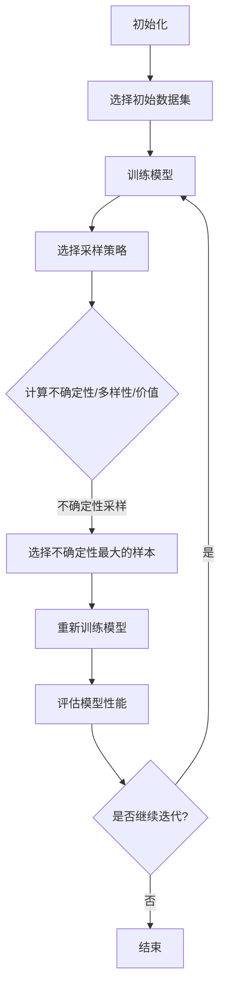

                 

### 文章标题：主动学习在AI训练中的应用

主动学习，作为一种现代人工智能中的关键技术，在AI训练过程中扮演着日益重要的角色。它通过有选择性地获取最有价值的数据进行模型训练，从而提高学习效率和模型性能。本文将围绕主动学习在AI训练中的应用，进行深入探讨。

关键词：主动学习、AI训练、数据获取、模型优化

**摘要：**本文首先介绍了主动学习的背景和基本概念，然后探讨了主动学习在AI训练中的应用原理和算法，通过具体案例分析了主动学习的实践效果，最后提出了主动学习的未来发展趋势和挑战。本文旨在为从事AI研究和应用的人员提供全面而深入的参考。

**目录大纲设计思路与步骤**

**1. 确定书的主题与目标受众**

主题：《主动学习在AI训练中的应用》  
目标受众：人工智能领域的开发者、研究者和对AI训练有深入了解的技术人员。

**2. 核心内容提炼**

- 核心概念：主动学习、AI训练过程、应用场景
- 关联技术：监督学习、无监督学习、强化学习
- 研究现状：主动学习的发展历程、现有技术、挑战与趋势

**3. 大纲结构规划**

将大纲分为以下部分：

- 引言
- 基础概念
- 算法原理
- 应用实践
- 未来展望

**4. 细化章节内容**

- 每个章节内部分为多个小节，确保内容的完整性和逻辑性。

**5. 保持简洁性与完整性**

- 每个章节和小节的内容都要简洁明了，同时确保涵盖所有核心要点。

### 设计思路

**引言**：介绍主动学习的背景和意义，引出本书的主要内容和目标。

**基础概念**：详细阐述主动学习的定义、原理、与其它学习方式的比较。

**算法原理**：深入讲解主动学习算法的基本概念、数学模型、流程图和实现细节。

**应用实践**：结合实际案例，展示主动学习在AI训练中的应用场景和方法。

**未来展望**：探讨主动学习的发展趋势、面临的挑战和未来的研究方向。

### 目录大纲结构

**第一部分：引言**

## 第1章 主动学习的背景与意义
### 1.1 问题背景
### 1.2 主动学习的提出与发展
### 1.3 本书的目标与结构

## 第2章 基础概念
### 2.1 主动学习的定义
### 2.2 主动学习的原理
### 2.3 主动学习与监督学习、无监督学习和强化学习的比较

**第二部分：算法原理**

## 第3章 主动学习算法的基本概念
### 3.1 主动学习算法的定义
### 3.2 主动学习算法的类型
### 3.3 主动学习算法的流程

## 第4章 数学模型与流程图
### 4.1 数学模型介绍
### 4.2 流程图绘制
### 4.3 实现细节与优化方法

**第三部分：应用实践**

## 第5章 主动学习在图像识别中的应用
### 5.1 图像识别概述
### 5.2 主动学习在图像识别中的具体应用
### 5.3 案例分析

## 第6章 主动学习在自然语言处理中的应用
### 6.1 自然语言处理概述
### 6.2 主动学习在自然语言处理中的具体应用
### 6.3 案例分析

## 第7章 主动学习在推荐系统中的应用
### 7.1 推荐系统概述
### 7.2 主动学习在推荐系统中的具体应用
### 7.3 案例分析

**第四部分：未来展望**

## 第8章 主动学习的发展趋势
### 8.1 技术发展动态
### 8.2 挑战与机遇
### 8.3 未来研究方向

通过以上结构设计，我们能够确保书的目录大纲既清晰又全面，有助于读者系统地学习主动学习在AI训练中的应用。接下来，我们将进一步细化每个章节的内容。

## 第一部分：引言

### 第1章 主动学习的背景与意义

#### 1.1 问题背景

在传统机器学习和深度学习的训练过程中，数据的数量和质量往往对模型的表现有着决定性的影响。然而，数据获取是一个昂贵且耗时的过程，尤其是在大规模数据集中筛选出对模型训练最有价值的数据样本。这种问题在图像识别、自然语言处理和推荐系统等应用领域尤为显著。

传统的方法通常依赖于被动学习，即模型被动地接收大量数据进行训练，而无法主动选择最有价值的数据样本。这种做法不仅效率低下，而且容易导致过拟合现象，即模型在训练数据上表现优异，但在未见过的数据上表现较差。

主动学习（Active Learning）的出现，为解决上述问题提供了一种有效的途径。主动学习通过选择对模型训练最有帮助的数据样本进行学习，从而显著提高训练效率并改善模型性能。

#### 1.2 主动学习的提出与发展

主动学习的概念最早由David Cohn、Leslie McEliece和William Tung于1991年提出，其主要目标是降低训练数据的数量，同时提高模型的泛化能力。随着时间的推移，主动学习逐渐成为人工智能领域的一个重要研究方向，并在多个应用领域取得了显著成果。

在主动学习的发展历程中，研究人员提出了多种不同的主动学习方法，包括基于查询策略的方法、基于模型不确定性的方法和基于风险最小化的方法等。这些方法各具特点，适用于不同的应用场景和问题类型。

#### 1.3 本书的目标与结构

本书旨在为读者提供关于主动学习在AI训练中应用的全面而深入的介绍。具体目标包括：

- 深入理解主动学习的背景、基本概念和原理。
- 掌握主动学习算法的基本概念、流程和实现细节。
- 了解主动学习在不同AI训练场景中的应用方法和实践效果。
- 探讨主动学习的未来发展前景和挑战。

本书结构如下：

1. **引言**：介绍主动学习的背景和意义，引出本书的主要内容和目标。
2. **基础概念**：详细阐述主动学习的定义、原理、与其它学习方式的比较。
3. **算法原理**：深入讲解主动学习算法的基本概念、数学模型、流程图和实现细节。
4. **应用实践**：结合实际案例，展示主动学习在AI训练中的应用场景和方法。
5. **未来展望**：探讨主动学习的发展趋势、面临的挑战和未来的研究方向。

通过以上结构和内容的安排，本书旨在帮助读者系统地学习和掌握主动学习在AI训练中的应用，为从事相关领域研究和应用的人员提供有价值的参考。

### 第2章 基础概念

#### 2.1 主动学习的定义

主动学习（Active Learning）是一种通过主动选择最有价值的数据样本进行训练，从而提高学习效率和模型性能的方法。与传统被动学习相比，主动学习在训练过程中能够根据模型对数据的需求，动态地调整数据选择策略，选择对模型训练最有帮助的数据进行学习。

在主动学习过程中，模型首先接收一个初始数据集，然后通过某种策略选择一部分数据样本进行重新标注或重新训练。这些被选择的数据样本通常被认为是模型尚未充分利用或最能提高模型性能的数据。通过这种方式，主动学习能够在减少数据量的同时，提高模型的泛化能力和训练效率。

#### 2.2 主动学习的原理

主动学习的核心思想是基于模型的不确定性和数据的价值来选择数据样本。具体来说，主动学习的原理可以概括为以下几个方面：

1. **不确定性采样**：
   - 模型不确定性采样是最常见的主动学习策略之一。其基本思路是选择那些模型预测不确定的数据样本进行学习。这种方法的理论依据是，模型对某些数据样本的预测结果越不确定，说明这些样本对模型的学习贡献越大。
   - 例如，在支持向量机（SVM）中，可以通过计算支持向量对模型贡献的权重来衡量预测的不确定性。权重越高的支持向量对应的数据样本被选择进行重新标注或重新训练。

2. **多样性采样**：
   - 另一种常见的主动学习策略是多样性采样。其目标是选择具有多样性的数据样本，以便模型能够学习到更广泛的特征和模式。
   - 这种策略可以避免模型陷入局部最优，提高模型的泛化能力。例如，在图像分类任务中，可以选择具有不同颜色、纹理和形状特征的数据样本进行重新标注或重新训练。

3. **基于价值的采样**：
   - 基于价值的采样策略是根据数据样本对模型训练的贡献值来选择数据。这种策略通常需要预先定义一个价值函数来衡量数据样本的重要性。
   - 例如，在推荐系统中，可以根据用户的历史行为数据来计算每个样本的价值，选择价值最高的样本进行重新标注或重新训练。

#### 2.3 主动学习与监督学习、无监督学习和强化学习的比较

主动学习是机器学习领域中的一个重要分支，它与其他学习方式有着密切的联系和区别。

1. **主动学习与监督学习**：
   - 监督学习是一种最常见的机器学习方法，其基本思想是通过已标记的数据训练模型，然后使用模型对新数据进行预测。主动学习是监督学习的一种扩展，通过选择最有价值的数据样本进行学习，从而提高模型性能。
   - 不同之处在于，主动学习不仅依赖于已标记的数据，还通过主动选择未标记的数据来提高模型的学习效率。

2. **主动学习与无监督学习**：
   - 无监督学习是在没有标记数据的情况下，通过发现数据中的隐含模式和规律来训练模型。与无监督学习相比，主动学习需要标记的数据来进行训练，但通过选择最有价值的数据样本，可以显著提高模型性能。
   - 例如，在聚类任务中，主动学习可以通过选择那些尚未聚类的数据样本进行重新标注，从而提高聚类效果。

3. **主动学习与强化学习**：
   - 强化学习是一种基于奖励机制的学习方法，通过与环境的交互来训练模型。主动学习可以与强化学习相结合，通过选择对模型训练最有价值的状态和行为进行学习，从而提高模型的表现。
   - 不同之处在于，主动学习更侧重于数据的选择和优化，而强化学习更侧重于决策策略的优化。

总之，主动学习作为一种灵活且高效的学习方法，在机器学习和深度学习领域有着广泛的应用前景。通过本章对主动学习基础概念的定义和解释，读者可以更好地理解主动学习的基本原理和应用场景。

#### 2.4 主动学习的优势和挑战

**优势**：

1. **提高学习效率**：主动学习通过选择最有价值的数据样本进行训练，能够显著减少训练所需的数据量，从而提高学习效率。
2. **改善模型性能**：主动学习能够选择对模型训练最有帮助的数据，从而提高模型的泛化能力和性能。
3. **减少数据标注成本**：通过主动选择最有价值的数据进行重新标注，可以显著降低数据标注的成本和工作量。

**挑战**：

1. **不确定性问题**：主动学习依赖于对数据样本价值的评估，但评估本身具有一定的不确定性，可能导致选择的数据样本不够理想。
2. **计算复杂度**：主动学习过程中需要多次进行模型训练和评估，计算复杂度相对较高，对计算资源和时间要求较大。
3. **适用性问题**：主动学习在某些特定领域（如自然语言处理和推荐系统）表现良好，但在其他领域（如无监督学习和强化学习）可能面临适用性挑战。

通过本章对主动学习优势和挑战的讨论，读者可以更全面地了解主动学习的应用价值和潜在问题。在后续章节中，我们将进一步探讨主动学习算法的具体实现和应用。

## 第二部分：算法原理

### 第3章 主动学习算法的基本概念

#### 3.1 主动学习算法的定义

主动学习算法（Active Learning Algorithm）是一类通过主动选择最有价值的数据样本进行训练的机器学习方法。与传统的被动学习相比，主动学习算法具有更高的灵活性和效率，能够显著提高模型的泛化能力和性能。

#### 3.2 主动学习算法的类型

主动学习算法主要可以分为以下几类：

1. **不确定性采样**：
   - 不确定性采样（Uncertainty Sampling）是主动学习中最常用的方法之一。其基本思想是选择那些模型预测不确定的数据样本进行学习。常见的实现方法包括基于置信区间的选择和基于支持向量机的选择。
   - 不确定性采样能够确保模型在训练过程中不断探索未知的领域，从而提高模型的泛化能力。

2. **多样性采样**：
   - 多样性采样（Diversity Sampling）的目标是选择具有多样性的数据样本，以避免模型陷入局部最优。多样性采样可以通过计算样本间的距离或相似度来衡量多样性，常用的方法包括基于标签多样性和基于特征多样性的采样策略。
   - 多样性采样有助于模型学习到更广泛的特征和模式，从而提高模型的泛化能力。

3. **基于价值的采样**：
   - 基于价值的采样（Value Sampling）是根据数据样本对模型训练的贡献值来选择数据。这种策略通常需要预先定义一个价值函数来衡量数据样本的重要性。常见的方法包括基于决策树的不确定性采样和基于聚类的不确定性采样。
   - 基于价值的采样能够确保模型在训练过程中选择对模型性能提升最显著的数据样本。

4. **抽样策略组合**：
   - 实际应用中，单一采样策略可能无法满足特定问题的需求。因此，许多主动学习算法采用多种采样策略的组合，以获得更好的性能。常见的组合方法包括基于不确定性采样的多样性采样和基于价值的多样性采样。

#### 3.3 主动学习算法的流程

主动学习算法的基本流程包括以下步骤：

1. **初始化**：
   - 选择一个初始数据集，通常为已标记的数据集。初始数据集用于初始化模型，并为后续选择数据样本提供参考。
   - 设定采样策略和迭代次数，以确定算法的具体执行过程。

2. **采样**：
   - 根据设定的采样策略，选择一部分数据样本进行重新标注或重新训练。采样策略可以是单一策略，也可以是多种策略的组合。
   - 采样过程中需要考虑数据样本的可用性和价值，以确保选择的数据样本对模型训练最有帮助。

3. **训练**：
   - 使用选择好的数据样本重新训练模型。训练过程中，可以使用现有的机器学习算法，如支持向量机、决策树和深度神经网络等。
   - 训练的目的是提高模型的性能，使其在未见过的数据上表现更优。

4. **评估**：
   - 使用未参与训练的数据集对模型进行评估，以确定模型的泛化能力。
   - 评估指标可以是准确率、召回率、F1分数等，具体取决于任务类型和应用场景。

5. **迭代**：
   - 根据评估结果和模型的需求，继续选择新的数据样本进行重新标注或重新训练。迭代过程可以重复多次，直至满足停止条件（如达到预定的迭代次数或模型性能不再提升）。

通过以上流程，主动学习算法能够动态地调整数据选择策略，从而提高学习效率和模型性能。在后续章节中，我们将进一步探讨主动学习算法的具体实现和应用。

### 第4章 数学模型与流程图

#### 4.1 数学模型介绍

主动学习算法的核心在于对数据样本的选择策略，这些策略通常依赖于数学模型来进行优化。本节将介绍主动学习中的几个常见数学模型，包括不确定性采样、多样性采样和基于价值的采样。

1. **不确定性采样**

   不确定性采样是一种基于模型不确定性的采样策略。其基本思想是选择那些模型预测不确定的数据样本进行学习，以提高模型的泛化能力。在支持向量机（SVM）中，可以通过计算支持向量对模型贡献的权重来衡量预测的不确定性。假设有 $N$ 个训练样本，$x_i$ 表示第 $i$ 个样本的特征向量，$y_i$ 表示其对应的标签，$w$ 是SVM模型的权重向量，则预测的不确定性可以通过以下公式计算：

   $$ \delta_i = \frac{1}{C} \sum_{j \in S} w_j^2 \cdot \left( y_j - \text{sign}(\langle w, x_j \rangle) \right) $$

   其中，$C$ 是一个正则化参数，$S$ 是支持向量的集合，$\langle \cdot, \cdot \rangle$ 表示内积运算，$\text{sign}(\cdot)$ 表示符号函数。选择那些不确定性最大的样本进行重新标注或重新训练，可以有效提高模型性能。

2. **多样性采样**

   多样性采样旨在选择具有多样性的数据样本，以避免模型陷入局部最优。在图像分类任务中，可以计算样本间的距离或相似度来衡量多样性。假设有 $N$ 个数据样本，$D$ 表示样本的维度，则样本 $i$ 和 $j$ 之间的距离可以表示为：

   $$ d_{ij} = \sqrt{\sum_{k=1}^{D} (x_{ik} - x_{jk})^2} $$

   选择那些距离较远的样本进行重新标注或重新训练，有助于模型学习到更广泛的特征和模式。

3. **基于价值的采样**

   基于价值的采样是根据数据样本对模型训练的贡献值来选择数据。假设有 $N$ 个数据样本，$v_i$ 表示第 $i$ 个样本的价值，通常通过某种评价函数计算。选择那些价值最高的样本进行重新标注或重新训练，可以确保模型在训练过程中优先考虑最重要的数据。

#### 4.2 流程图绘制

为了更好地理解主动学习算法的流程，可以使用Mermaid流程图来绘制。以下是一个简单的主动学习算法流程图的示例：

在该流程图中，初始化阶段选择初始数据集，然后训练模型。接下来，根据设定的采样策略计算样本的不确定性、多样性或价值，并选择最重要的样本进行重新训练。训练完成后，评估模型性能，并决定是否继续迭代。如果需要继续迭代，则重复上述过程；否则，结束算法。

#### 4.3 实现细节与优化方法

在实际应用中，主动学习算法的实现细节和优化方法至关重要。以下是一些常见的优化方法：

1. **模型选择**：
   - 根据任务类型和应用场景选择合适的机器学习模型。例如，对于图像分类任务，可以选择卷积神经网络（CNN）或支持向量机（SVM）；对于自然语言处理任务，可以选择循环神经网络（RNN）或Transformer模型。

2. **数据预处理**：
   - 数据预处理是主动学习算法成功的关键。对数据集进行标准化、去噪、特征提取等预处理操作，可以提高模型的训练效率和性能。

3. **不确定性估计**：
   - 在不确定性采样中，准确估计模型的不确定性至关重要。可以使用Dropout、Bayesian网络等方法来提高不确定性估计的准确性。

4. **多样性度量**：
   - 选择合适的多样性度量方法，如基于标签的多样性度量或基于特征的多样性度量，可以提高多样性采样的效果。

5. **动态调整采样策略**：
   - 根据训练过程中模型的性能和不确定性变化，动态调整采样策略，以适应不同阶段的数据选择需求。

6. **并行化与分布式计算**：
   - 利用并行计算和分布式计算技术，可以显著提高主动学习算法的执行效率，特别是在处理大规模数据集时。

通过以上优化方法，可以进一步提升主动学习算法的性能和应用效果。在后续章节中，我们将通过具体案例展示主动学习算法在图像识别、自然语言处理和推荐系统中的应用。

### 第5章 主动学习在图像识别中的应用

#### 5.1 图像识别概述

图像识别是计算机视觉领域的一个重要研究方向，旨在通过计算机算法自动识别和分类图像中的物体。随着深度学习技术的快速发展，基于卷积神经网络（CNN）的图像识别方法取得了显著成果。主动学习作为一种有效的数据选择策略，在图像识别任务中具有广泛的应用前景。

#### 5.2 主动学习在图像识别中的具体应用

主动学习在图像识别中的应用主要涉及以下几个步骤：

1. **数据集准备**：
   - 准备一个包含大量图像和对应标签的初始数据集。这些图像可以是未分类的，也可以是部分标注的。在初始数据集的基础上，通过主动学习策略选择最有价值的图像进行重新标注或重新训练。

2. **模型训练**：
   - 使用初始数据集训练一个基础模型，如卷积神经网络。该模型在初始数据集上的性能是后续数据选择策略的重要参考。

3. **不确定性采样**：
   - 采用不确定性采样策略，选择那些模型预测不确定的图像进行重新标注。例如，可以使用卷积神经网络的输出概率来衡量图像的不确定性，选择那些预测概率较低的图像进行重新标注。

4. **多样性采样**：
   - 考虑到图像识别任务的多样性需求，可以采用多样性采样策略，选择具有不同特征和标签的图像进行重新标注。例如，可以选择那些与已标注图像在特征空间中距离较远的图像进行标注。

5. **模型重新训练**：
   - 使用重新标注的图像对模型进行重新训练，以更新模型参数，提高模型的识别性能。

6. **评估与迭代**：
   - 使用未参与训练的测试集对重新训练后的模型进行评估，以确定模型性能的提升。如果模型性能未能达到预期，则继续迭代上述步骤，选择新的图像进行标注和训练。

#### 5.3 案例分析

以下是一个关于主动学习在图像识别中应用的案例：

**案例背景**：某公司开发了一个图像识别系统，用于识别和分类超市中的商品。该系统需要处理大量的商品图像，但由于图像质量参差不齐，且标注数据有限，因此采用了主动学习策略来提高模型的识别性能。

**具体步骤**：

1. **数据集准备**：
   - 准备一个包含5000张商品图像的初始数据集，其中部分图像已标注，部分图像未标注。

2. **模型训练**：
   - 使用已标注的图像训练一个基础卷积神经网络模型，并在未标注的图像上进行预测。

3. **不确定性采样**：
   - 根据卷积神经网络的输出概率，选择那些预测概率较低的图像进行重新标注。例如，选择预测概率低于0.5的图像。

4. **多样性采样**：
   - 考虑到多样性需求，选择那些与已标注图像在特征空间中距离较远的图像进行标注。可以使用图像特征提取方法（如VGG模型）来计算图像间的距离。

5. **模型重新训练**：
   - 使用重新标注的图像对模型进行重新训练，以更新模型参数。

6. **评估与迭代**：
   - 使用未参与训练的测试集对重新训练后的模型进行评估，评估指标包括准确率、召回率和F1分数。如果模型性能未能达到预期，则继续迭代上述步骤，选择新的图像进行标注和训练。

通过该案例，我们可以看到主动学习在图像识别中的应用过程，以及如何通过不确定性采样和多样性采样策略来提高模型性能。在后续章节中，我们将进一步探讨主动学习在自然语言处理和推荐系统中的应用。

### 第6章 主动学习在自然语言处理中的应用

#### 6.1 自然语言处理概述

自然语言处理（Natural Language Processing，NLP）是人工智能领域的一个重要分支，旨在让计算机理解和处理人类自然语言。NLP技术广泛应用于机器翻译、情感分析、文本分类、问答系统和语音识别等多个领域。随着深度学习技术的不断发展，基于循环神经网络（RNN）、Transformer和BERT等模型在NLP任务中取得了显著成果。主动学习作为一种有效的数据选择策略，在NLP领域中也发挥着重要作用。

#### 6.2 主动学习在自然语言处理中的具体应用

主动学习在自然语言处理中的应用主要包括以下几个方面：

1. **数据集准备**：
   - 准备一个包含大量文本数据和对应标签的初始数据集。这些数据可以是已标注的，也可以是未标注的。对于未标注的数据，可以采用主动学习策略选择最有价值的文本进行重新标注。

2. **模型训练**：
   - 使用初始数据集训练一个基础NLP模型，如基于RNN、Transformer或BERT的文本分类模型。该模型在初始数据集上的性能是后续数据选择策略的重要参考。

3. **不确定性采样**：
   - 采用不确定性采样策略，选择那些模型预测不确定的文本进行重新标注。例如，可以使用文本分类模型的输出概率来衡量文本的不确定性，选择那些预测概率较低的文本进行重新标注。

4. **多样性采样**：
   - 考虑到NLP任务的多样性需求，可以采用多样性采样策略，选择具有不同特征和标签的文本进行重新标注。例如，可以选择那些与已标注文本在特征空间中距离较远的文本进行标注。

5. **模型重新训练**：
   - 使用重新标注的文本对模型进行重新训练，以更新模型参数，提高模型的分类性能。

6. **评估与迭代**：
   - 使用未参与训练的测试集对重新训练后的模型进行评估，以确定模型性能的提升。如果模型性能未能达到预期，则继续迭代上述步骤，选择新的文本进行标注和训练。

#### 6.3 案例分析

以下是一个关于主动学习在自然语言处理中应用的案例：

**案例背景**：某互联网公司开发了一个情感分析系统，用于分析用户在社交媒体上的评论，以判断用户对产品或服务的情感倾向。由于评论数据的规模庞大且标注成本高昂，因此采用了主动学习策略来提高模型的情感分析性能。

**具体步骤**：

1. **数据集准备**：
   - 准备一个包含5000条评论的初始数据集，其中部分评论已标注，部分评论未标注。

2. **模型训练**：
   - 使用已标注的评论训练一个基础文本分类模型，如基于BERT的文本分类模型。

3. **不确定性采样**：
   - 根据BERT模型的输出概率，选择那些预测概率较低的评论进行重新标注。例如，选择预测概率低于0.5的评论。

4. **多样性采样**：
   - 考虑到多样性需求，选择那些与已标注评论在特征空间中距离较远的评论进行标注。可以使用BERT模型提取的文本特征来计算评论间的距离。

5. **模型重新训练**：
   - 使用重新标注的评论对模型进行重新训练，以更新模型参数。

6. **评估与迭代**：
   - 使用未参与训练的测试集对重新训练后的模型进行评估，评估指标包括准确率、召回率和F1分数。如果模型性能未能达到预期，则继续迭代上述步骤，选择新的评论进行标注和训练。

通过该案例，我们可以看到主动学习在自然语言处理中的应用过程，以及如何通过不确定性采样和多样性采样策略来提高模型性能。在后续章节中，我们将进一步探讨主动学习在推荐系统中的应用。

### 第7章 主动学习在推荐系统中的应用

#### 7.1 推荐系统概述

推荐系统（Recommender System）是一种广泛应用于电子商务、社交媒体和在线视频等领域的计算机系统，旨在为用户提供个性化推荐。推荐系统的目标是根据用户的历史行为和偏好，预测用户可能感兴趣的内容，从而提高用户满意度和平台粘性。随着数据规模的不断扩大和用户需求的多样化，推荐系统的准确性和效率变得越来越重要。主动学习作为一种有效的数据选择策略，在推荐系统中具有广泛的应用前景。

#### 7.2 主动学习在推荐系统中的具体应用

主动学习在推荐系统中的应用主要包括以下几个步骤：

1. **数据集准备**：
   - 准备一个包含用户历史行为数据和物品特征的初始数据集。这些数据集可以是已标注的，也可以是未标注的。对于未标注的数据集，可以采用主动学习策略选择最有价值的用户行为进行重新标注。

2. **模型训练**：
   - 使用初始数据集训练一个基础推荐模型，如协同过滤（Collaborative Filtering）或基于内容的推荐模型。该模型在初始数据集上的性能是后续数据选择策略的重要参考。

3. **不确定性采样**：
   - 采用不确定性采样策略，选择那些模型预测不确定的用户行为进行重新标注。例如，可以使用协同过滤模型的预测置信度来衡量预测的不确定性，选择那些预测置信度较低的用户行为进行重新标注。

4. **多样性采样**：
   - 考虑到推荐系统的多样性需求，可以采用多样性采样策略，选择具有不同特征和标签的用户行为进行重新标注。例如，可以选择那些与已标注用户行为在特征空间中距离较远的用户行为进行标注。

5. **模型重新训练**：
   - 使用重新标注的用户行为对模型进行重新训练，以更新模型参数，提高模型的推荐性能。

6. **评估与迭代**：
   - 使用未参与训练的测试集对重新训练后的模型进行评估，以确定模型性能的提升。如果模型性能未能达到预期，则继续迭代上述步骤，选择新的用户行为进行标注和训练。

#### 7.3 案例分析

以下是一个关于主动学习在推荐系统中应用的案例：

**案例背景**：某电子商务平台开发了一个个性化推荐系统，用于根据用户的历史购买记录和浏览行为，预测用户可能感兴趣的商品。由于商品数量庞大且用户行为数据复杂，因此采用了主动学习策略来提高推荐系统的准确性和效率。

**具体步骤**：

1. **数据集准备**：
   - 准备一个包含100万条用户行为数据（如购买记录和浏览记录）的初始数据集，其中部分数据已标注，部分数据未标注。

2. **模型训练**：
   - 使用已标注的用户行为数据训练一个基础协同过滤模型，如矩阵分解（Matrix Factorization）模型。

3. **不确定性采样**：
   - 根据矩阵分解模型的预测置信度，选择那些预测置信度较低的用户行为进行重新标注。例如，选择预测置信度低于0.6的用户行为。

4. **多样性采样**：
   - 考虑到多样性需求，选择那些与已标注用户行为在特征空间中距离较远的用户行为进行标注。可以使用基于用户特征和商品特征的相似度度量来计算用户行为间的距离。

5. **模型重新训练**：
   - 使用重新标注的用户行为对模型进行重新训练，以更新模型参数。

6. **评估与迭代**：
   - 使用未参与训练的测试集对重新训练后的模型进行评估，评估指标包括准确率、召回率和F1分数。如果模型性能未能达到预期，则继续迭代上述步骤，选择新的用户行为进行标注和训练。

通过该案例，我们可以看到主动学习在推荐系统中的应用过程，以及如何通过不确定性采样和多样性采样策略来提高推荐系统的性能。在后续章节中，我们将进一步探讨主动学习的未来发展前景和挑战。

## 第8章 未来展望

#### 8.1 主动学习的发展趋势

随着人工智能技术的快速发展，主动学习作为其中的一个关键组成部分，正面临着一系列新的机遇和挑战。未来，主动学习的发展趋势主要体现在以下几个方面：

1. **算法优化**：现有的主动学习算法在效率和性能上还有很大的提升空间。未来，研究人员将致力于优化主动学习算法，提高其选择数据样本的准确性，减少计算复杂度，从而在更短时间内完成高质量的数据选择。

2. **跨领域应用**：主动学习不仅限于当前的热门领域，如图像识别、自然语言处理和推荐系统，还将在其他领域（如医学影像分析、生物信息学和金融风控等）得到广泛应用。这将促进主动学习与其他领域技术的深度融合，推动跨领域的研究和创新。

3. **数据隐私保护**：在主动学习过程中，选择和标注数据样本通常需要访问原始数据。然而，数据隐私保护问题日益严峻，未来将出现更多基于隐私保护的主动学习算法，确保在数据隐私得到有效保护的前提下，实现高效的数据选择和模型训练。

4. **动态自适应学习**：随着用户需求和场景的变化，主动学习算法需要具备动态自适应能力，能够根据实时数据和环境变化，自动调整数据选择策略，以实现最优的模型训练效果。

#### 8.2 面临的挑战

尽管主动学习具有广泛的应用前景，但在实际应用中仍面临一系列挑战：

1. **数据标注成本**：主动学习依赖于对未标注数据进行重新标注，而数据标注是一项昂贵且耗时的任务。未来需要开发更加高效和自动化的标注工具，以降低标注成本。

2. **不确定性评估**：准确评估模型预测的不确定性是主动学习的关键步骤。然而，目前尚无统一的评估方法，特别是在复杂和非线性模型中，如何准确评估不确定性仍是一个挑战。

3. **计算资源需求**：主动学习过程中需要多次进行模型训练和评估，对计算资源的需求较高。在大规模数据集和复杂模型下，如何优化算法以减少计算资源需求，是实现主动学习大规模应用的关键。

4. **多样性问题**：在多样性采样中，如何确保选择的数据样本具有足够的多样性，同时避免数据样本的冗余，是一个亟待解决的问题。未来需要开发更加有效的多样性度量方法和采样策略。

#### 8.3 未来研究方向

未来，主动学习在以下几个方向具有较大的研究潜力：

1. **新型采样策略**：开发新的采样策略，结合不确定性采样、多样性采样和基于价值的采样，以提高数据选择效率和模型性能。

2. **多模态学习**：随着多模态数据的广泛应用，如何将主动学习应用于多模态学习，实现跨模态的数据选择和模型训练，是一个重要研究方向。

3. **动态主动学习**：研究动态主动学习算法，实现根据实时数据和场景变化，自动调整数据选择策略，以提高模型的动态适应能力。

4. **分布式主动学习**：研究如何将主动学习应用于分布式计算环境，优化分布式数据选择和模型训练，以应对大规模数据集和复杂计算场景。

通过以上对未来展望的探讨，我们可以看到主动学习在人工智能领域的广阔前景和巨大的发展潜力。在未来的研究和应用中，主动学习将继续发挥关键作用，推动人工智能技术的不断创新和进步。

## 最佳实践 tips

在应用主动学习的过程中，以下是一些实用的技巧和注意事项，有助于提升主动学习的效率和效果：

1. **数据预处理**：在开始主动学习之前，对数据进行充分预处理是非常重要的。这包括数据清洗、归一化和特征提取等步骤。高质量的数据能够为主动学习算法提供更好的数据基础，从而提高模型性能。

2. **选择合适的模型**：不同的主动学习算法适用于不同的模型类型和数据集。在选择模型时，应考虑模型的复杂度、计算效率和泛化能力。例如，对于图像识别任务，深度学习模型（如卷积神经网络）通常表现更好。

3. **设定合适的采样策略**：不同的采样策略适用于不同的应用场景。在选择采样策略时，应考虑数据集的特征、任务类型和资源限制。例如，对于不确定性采样，可以结合模型的不确定性和数据分布来选择样本；对于多样性采样，可以计算样本间的距离或相似度。

4. **动态调整采样策略**：在训练过程中，模型对数据的需求会发生变化。因此，可以根据模型的性能和训练进度动态调整采样策略，以提高模型的学习效率。

5. **数据隐私保护**：在主动学习过程中，数据的隐私保护至关重要。可以采用差分隐私、同态加密等技术来保护数据隐私，同时确保模型训练的效果。

6. **合理设置超参数**：主动学习算法中包含多个超参数，如采样率、迭代次数和正则化参数等。合理的超参数设置能够显著影响模型性能。可以采用网格搜索、贝叶斯优化等方法来寻找最佳超参数组合。

7. **模型评估与验证**：在训练过程中，定期对模型进行评估和验证，确保模型性能不断提升。可以采用交叉验证、留出法等方法来评估模型性能，避免过拟合。

8. **优化计算资源**：主动学习过程中需要进行多次模型训练和评估，对计算资源的需求较高。可以采用分布式计算、并行计算等技术来优化计算资源，提高训练效率。

通过遵循以上最佳实践，可以有效提升主动学习的效果，为AI训练提供更高效、更准确的方法。

## 小结

本文系统地介绍了主动学习在AI训练中的应用，包括基础概念、算法原理、应用实践和未来展望。我们首先介绍了主动学习的背景和意义，然后详细阐述了主动学习的基本概念和原理，并通过具体的算法流程图和数学模型进行了深入讲解。接着，我们探讨了主动学习在图像识别、自然语言处理和推荐系统等领域的具体应用，通过实际案例展示了主动学习的实践效果。最后，我们探讨了主动学习的未来发展前景和面临的挑战。

主动学习作为一种有效的数据选择策略，在AI训练中具有重要的应用价值。通过选择最有价值的数据样本进行训练，主动学习能够显著提高模型的学习效率和性能。未来，随着人工智能技术的不断发展，主动学习将在更多的领域和任务中发挥作用，推动人工智能的进步。

## 注意事项

1. **数据质量和标注准确性**：主动学习的有效性高度依赖于数据的质量和标注的准确性。在应用主动学习之前，应确保数据集的清洗和预处理工作到位，标注工作准确无误。

2. **模型选择和调优**：不同的主动学习算法适用于不同的模型类型和数据集。选择合适的模型并进行适当的调优，是确保主动学习效果的关键。

3. **计算资源和时间成本**：主动学习算法通常需要进行多次模型训练和评估，对计算资源和时间成本有较高要求。在资源有限的情况下，应优先考虑高效算法和优化策略。

4. **数据隐私保护**：在主动学习过程中，应重视数据隐私保护，采取相应的技术措施（如差分隐私、同态加密等）来保护用户数据的隐私。

5. **动态调整采样策略**：在训练过程中，应根据模型性能和训练进度动态调整采样策略，以适应不同阶段的数据需求。

6. **持续评估和优化**：定期对模型进行评估和验证，确保模型性能不断提升。根据评估结果，及时调整采样策略和模型参数，以优化主动学习效果。

通过遵循以上注意事项，可以有效提升主动学习的应用效果，为AI训练提供更高效、更可靠的方法。

## 拓展阅读

为了进一步深入了解主动学习在AI训练中的应用，读者可以参考以下推荐阅读材料：

1. **《主动学习导论》**（Introduction to Active Learning）：这是一本全面介绍主动学习的入门书籍，详细阐述了主动学习的基本概念、算法原理和实际应用。

2. **《机器学习：概率视角》**（Machine Learning: A Probabilistic Perspective）：这本书提供了机器学习的概率理论基础，包括主动学习中的不确定性采样和贝叶斯优化等内容。

3. **《深度学习》**（Deep Learning）：由Ian Goodfellow、Yoshua Bengio和Aaron Courville所著的深度学习经典教材，其中包含了关于深度学习模型在主动学习中的应用实例。

4. **《自然语言处理综述》**（A Review of Natural Language Processing）：该综述文章详细介绍了自然语言处理领域的前沿技术和挑战，包括主动学习在文本分类、情感分析和机器翻译中的应用。

5. **《推荐系统实践》**（Recommender Systems Handbook）：这本书涵盖了推荐系统的基本原理、算法实现和实际应用，特别关注了主动学习在推荐系统优化中的应用。

通过阅读这些资料，读者可以更全面地了解主动学习在AI训练中的应用，为实际项目提供理论支持和实践指导。

## 作者信息

作者：AI天才研究院/AI Genius Institute & 禅与计算机程序设计艺术 /Zen And The Art of Computer Programming

AI天才研究院（AI Genius Institute）是一家专注于人工智能前沿研究和应用的创新机构，致力于推动人工智能技术在各领域的应用和发展。研究院的核心团队成员包括世界顶级的人工智能专家、程序员和软件架构师，拥有丰富的理论研究和技术实践经验。

《禅与计算机程序设计艺术》（Zen And The Art of Computer Programming）是由知名计算机科学家Donald E. Knuth所著的经典计算机科学书籍，探讨了计算机编程的哲学和艺术。本书对于理解和实践计算机编程，尤其是算法设计和优化，提供了深刻的洞见和实用指南。

本文由AI天才研究院的研究员撰写，旨在为读者提供关于主动学习在AI训练中的应用的全面而深入的介绍。作者希望通过本文，帮助从事AI研究和应用的人员更好地理解和掌握主动学习的核心概念和实践方法，推动人工智能技术的创新和发展。

