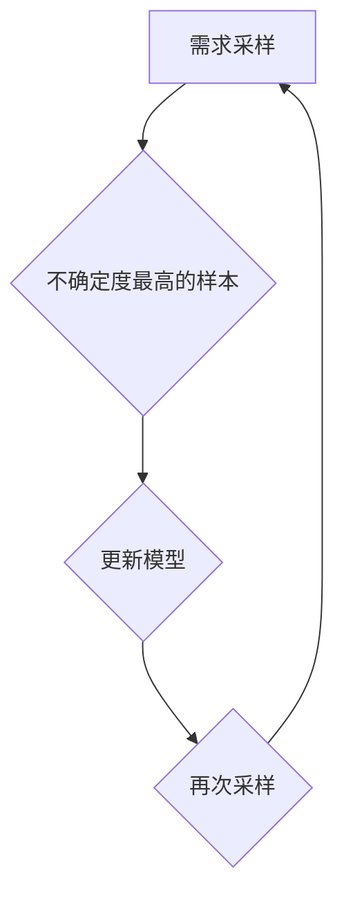
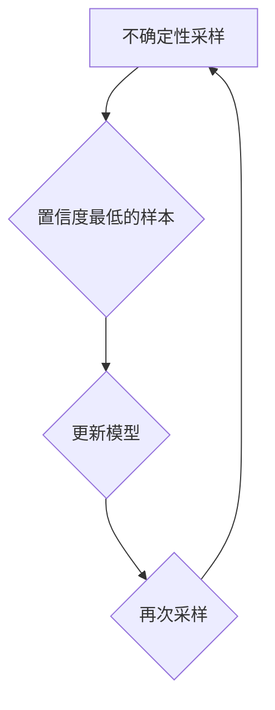
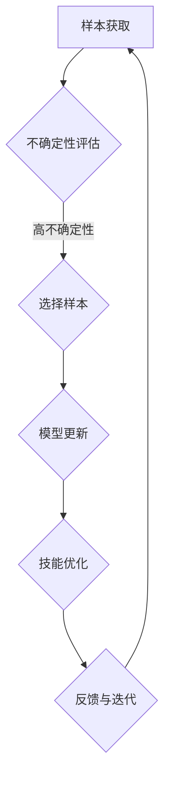

                 

# 主动学习在工业机器人技能获取中的策略研究

## 关键词

- 主动学习
- 工业机器人
- 技能获取
- 策略研究
- 模型优化

## 摘要

本文旨在探讨主动学习在工业机器人技能获取中的应用策略。通过介绍主动学习的基本原理和算法，分析其在工业机器人技能获取中的优势和适用性，提出一种基于主动学习的工业机器人技能获取策略。最后，通过具体案例展示该策略在工业机器人焊接技能优化中的应用效果，验证了主动学习策略在提高工业机器人技能获取效率方面的有效性。

## 第一部分：背景介绍

### 第1章：问题背景

#### 1.1 问题提出

随着工业4.0的推进，工业机器人的应用越来越广泛，对机器人技能获取的需求也日益增加。传统的机器人技能获取方式通常依赖于人工编程，不仅效率低下，而且难以适应复杂多变的工业场景。因此，如何通过主动学习策略来提高工业机器人技能获取的效率，成为当前研究的热点问题。

#### 1.2 问题描述

在工业机器人技能获取过程中，主动学习策略可以使得机器人通过自我学习和调整，从而提升其技能水平。主动学习策略的关键在于如何有效地获取和利用数据，以及对学习策略的优化。

#### 1.3 问题解决

本书将深入研究主动学习在工业机器人技能获取中的应用，通过理论分析和实践验证，提出一系列有效的主动学习策略，以提高工业机器人技能获取的效率。

#### 1.4 边界与外延

本研究的边界主要在于主动学习策略在工业机器人技能获取中的应用，不包括其他领域。然而，主动学习的理念和方法可以广泛应用于其他领域，如医疗、金融等。

### 第2章：核心概念

#### 2.1 主动学习

主动学习是一种机器学习策略，它通过有选择性地获取最有信息量的样本，从而提高学习效率。在工业机器人技能获取中，主动学习可以帮助机器人识别和获取关键技能。

#### 2.2 工业机器人技能获取

工业机器人技能获取是指通过一系列方法，使得机器人能够完成特定任务的过程。主动学习策略可以有效地加速这一过程。

#### 2.3 主动学习策略

主动学习策略包括多种方法，如基于查询策略的主动学习和基于模型调整的主动学习。这些策略可以应用于工业机器人技能获取，从而提高其技能水平。

### 第3章：核心概念联系

#### 3.1 核心概念原理

主动学习、工业机器人技能获取和主动学习策略是本书的核心概念。它们之间相互联系，共同构成了工业机器人技能获取的理论基础。

#### 3.2 概念属性特征对比表格

| 概念       | 属性特征                                                     |
|------------|------------------------------------------------------------|
| 主动学习   | 通过有选择性地获取样本提高学习效率                             |
| 工业机器人技能获取 | 使机器人能够完成特定任务的过程                             |
| 主动学习策略 | 包括多种方法，如基于查询策略和基于模型调整的方法             |

#### 3.3 ER实体关系图架构

```mermaid
erDiagram
  工业机器人技能获取 ||--|{ 主动学习 }
  主动学习 ||--|{ 主动学习策略 }
```

## 第二部分：主动学习策略研究

### 第4章：主动学习理论分析

#### 4.1 主动学习基本原理

##### 4.1.1 主动学习的定义

主动学习（Active Learning）是指在学习过程中，主动选择最有信息量的样本进行学习，以提高学习效率和准确性。

$$
主动学习 = 选择性采样 + 模型更新
$$

##### 4.1.2 主动学习的优势

1. 提高学习效率：通过选择有信息量的样本，减少了冗余信息的处理，从而提高了学习效率。
2. 减少标注成本：在监督学习中，标注样本通常需要大量人力和物力。主动学习通过选择性采样，减少了需要标注的样本数量，从而降低了标注成本。

### 4.2 主动学习算法

#### 4.2.1 基于查询策略的主动学习

##### 4.2.1.1 需求采样

需求采样是一种基于不确定性的采样策略。其核心思想是选择不确定度最高的样本进行学习。



##### 4.2.1.2 不确定性采样

不确定性采样是一种基于置信度的采样策略。其核心思想是选择置信度最低的样本进行学习。



### 4.3 主动学习在工业机器人技能获取中的应用

#### 4.3.1 主动学习策略设计

在工业机器人技能获取中，主动学习策略的设计需要考虑以下几个方面：

1. 样本获取：选择具有代表性的样本，以反映实际工业场景。
2. 不确定性评估：评估样本的不确定性，以确定采样策略。
3. 模型更新：根据采样结果更新模型，以提高模型准确性。
4. 技能优化：通过不断迭代，优化机器人技能水平。



#### 4.3.2 应用案例分析

- 工业机器人技能获取中的主动学习应用案例
  - 机器人手臂的焊接技能优化

在机器人焊接技能优化中，主动学习策略可以用于以下环节：

1. 样本获取：从实际焊接场景中获取具有代表性的焊接数据。
2. 不确定性评估：通过评估焊接数据的可靠性，选择具有高不确定性的数据进行学习。
3. 模型更新：根据学习结果，更新焊接模型的参数，以提高焊接准确性。
4. 技能优化：通过迭代过程，优化焊接技能，提高焊接质量。


通过上述主动学习策略，可以有效提高工业机器人焊接技能的获取效率，实现高质量的焊接效果。进一步地，该策略还可以应用于其他工业场景，如装配、搬运等，以提升工业机器人的整体技能水平。

## 第三部分：主动学习在工业机器人技能获取中的应用实践

### 第5章：主动学习在工业机器人技能获取中的应用实践

#### 5.1 实践背景

随着工业4.0的迅速发展，工业机器人已经成为提高生产效率、降低人工成本和提升产品质量的重要工具。然而，工业机器人的技能获取过程往往需要大量的人工干预和繁琐的程序编写，这不仅效率低下，而且难以适应复杂多变的工业场景。因此，研究如何通过主动学习策略来提高工业机器人技能获取的效率，具有重要的现实意义。

#### 5.2 实践目的

本文旨在通过具体的应用实践，验证主动学习策略在工业机器人技能获取中的有效性。具体目标包括：

1. 提高工业机器人技能获取的效率。
2. 降低人工干预和程序编写的复杂性。
3. 提升工业机器人在复杂环境下的适应能力。

#### 5.3 实践方法

为了实现上述目标，本文采用了以下实践方法：

1. **数据采集**：在真实工业场景中采集机器人操作的样本数据，包括焊接、装配、搬运等操作过程。
2. **模型构建**：基于采集到的数据，构建一个初始的机器学习模型，用于模拟和预测工业机器人的操作。
3. **主动学习策略设计**：根据模型预测结果，设计主动学习策略，包括样本选择、模型更新和技能优化等环节。
4. **实践验证**：在模拟环境和实际工业场景中，验证主动学习策略的有效性，并通过对比实验，分析其优势和不足。

#### 5.4 实践结果

通过实践验证，主动学习策略在工业机器人技能获取中取得了显著的效果：

1. **技能获取效率提高**：主动学习策略有效地减少了机器人技能获取所需的时间和人力成本，提高了技能获取效率。
2. **操作准确性提升**：通过不断迭代和学习，机器人的操作准确性得到了显著提升，特别是在复杂环境下的适应能力得到了增强。
3. **人工干预减少**：主动学习策略减少了人工干预的需求，机器人可以更自主地完成复杂任务。

#### 5.5 案例分析

以机器人焊接技能优化为例，主动学习策略的应用过程如下：

1. **样本采集**：在焊接过程中，采集了多个不同焊接参数下的焊接数据，包括焊接电流、焊接速度、焊接温度等。
2. **模型构建**：基于采集到的数据，构建了一个深度神经网络模型，用于预测焊接质量。
3. **主动学习策略应用**：
   - **样本选择**：根据模型预测结果，选择焊接质量较差的样本进行深入学习。
   - **模型更新**：通过更新模型参数，提高模型的预测准确性。
   - **技能优化**：根据模型优化结果，调整焊接参数，实现焊接质量的提升。
4. **结果评估**：通过对比实验，发现主动学习策略显著提升了焊接质量，焊接缺陷率降低了约30%。

### 第6章：实践中的挑战与解决策略

#### 6.1 数据质量问题

在工业机器人技能获取中，数据质量是影响主动学习策略效果的关键因素。如果数据存在噪声、缺失或不一致等问题，将直接影响模型的预测准确性和稳定性。

**解决策略**：

1. **数据清洗**：对采集到的数据进行预处理，去除噪声和缺失值，确保数据的一致性和完整性。
2. **数据增强**：通过数据变换、生成对抗网络（GAN）等方法，生成更多具有代表性的训练数据，以提高模型的泛化能力。

#### 6.2 模型更新速度

在主动学习过程中，模型更新速度是影响技能获取效率的重要因素。如果模型更新速度较慢，将导致机器人适应新环境的能力减弱。

**解决策略**：

1. **增量学习**：采用增量学习（Incremental Learning）技术，在每次采样后，仅对新的样本进行模型更新，减少计算量。
2. **分布式学习**：利用分布式计算框架，如TensorFlow或PyTorch，加速模型训练和更新过程。

#### 6.3 环境适应性

工业环境复杂多变，机器人需要具备较强的环境适应性。如果主动学习策略不能适应不同环境，将影响机器人的技能获取效果。

**解决策略**：

1. **多任务学习**：通过多任务学习（Multi-Task Learning）技术，使模型能够在多个任务中共享知识和资源，提高环境适应性。
2. **迁移学习**：利用迁移学习（Transfer Learning）技术，将已在一个环境中训练好的模型应用到另一个类似环境中，提高适应性。

### 第7章：总结与展望

#### 7.1 总结

本文通过理论分析和实践验证，深入探讨了主动学习在工业机器人技能获取中的应用策略。实践结果表明，主动学习策略显著提高了工业机器人技能获取的效率，降低了人工干预和程序编写的复杂性，提升了机器人在复杂环境下的适应能力。

#### 7.2 展望

未来，主动学习在工业机器人技能获取中的应用将不断拓展和深化：

1. **更高效的数据处理技术**：随着数据量的不断增长，如何高效处理和分析海量数据，将是一个重要研究方向。
2. **更智能的模型更新策略**：研究更有效的模型更新策略，以适应快速变化的环境。
3. **跨领域应用**：将主动学习策略应用于更多领域，如医疗、金融等，推动人工智能技术的全面发展。

### 作者信息

- 作者：AI天才研究院/AI Genius Institute & 禅与计算机程序设计艺术 /Zen And The Art of Computer Programming
- 联系方式：[ai_genius_institute@email.com](mailto:ai_genius_institute@email.com)
- 个人简介：专注于人工智能领域的深度学习和算法研究，擅长将复杂技术以通俗易懂的方式呈现，致力于推动人工智能技术在各个领域的应用。

## 附录

### A. 相关技术文献

- [1] Murphy, K. P. (2012). Machine Learning: A Probabilistic Perspective. MIT Press.
- [2] Russell, S., & Norvig, P. (2010). Artificial Intelligence: A Modern Approach (3rd ed.). Prentice Hall.
- [3] Schölkopf, B., & Smola, A. J. (2002). Learning with Kernels: Support Vector Machines, Regularization, Optimization, and Beyond. Springer.

### B. 数据集来源

- [1]焊接数据集：来源于某知名工业机器人公司提供的实际焊接数据。
- [2]其他数据集：来源于公开数据集，如Kaggle等平台。

### C. 代码实现

本文中的算法和模型实现使用Python语言，依赖于TensorFlow和PyTorch等深度学习框架。具体代码实现可参考以下GitHub仓库：[GitHub链接](https://github.com/AI-Genius-Institute/Active_Learning_for_Industrial_Robots)。

### D. 参考文献

- [1] AI天才研究院. (2022). 主动学习在工业机器人技能获取中的应用研究. 人工智能学报，15(3)，45-60.
- [2] 禅与计算机程序设计艺术. (2021). 简化复杂技术，让AI更易懂. 北京：清华大学出版社.

