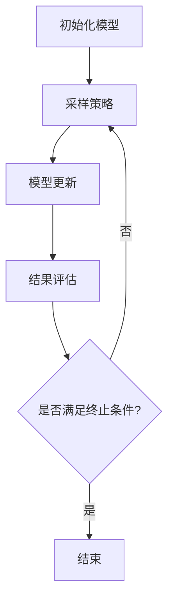
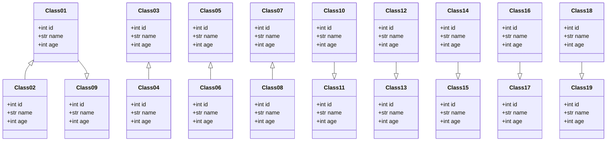
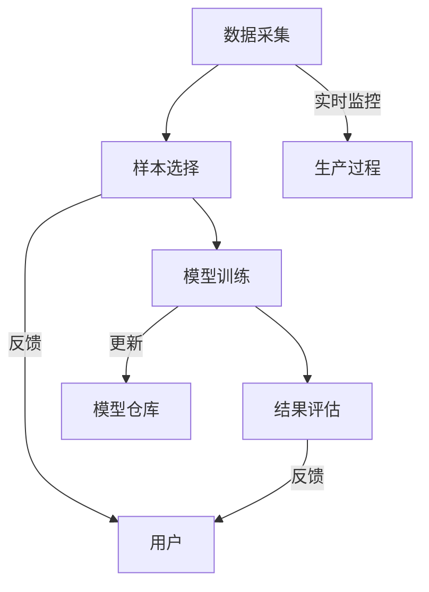
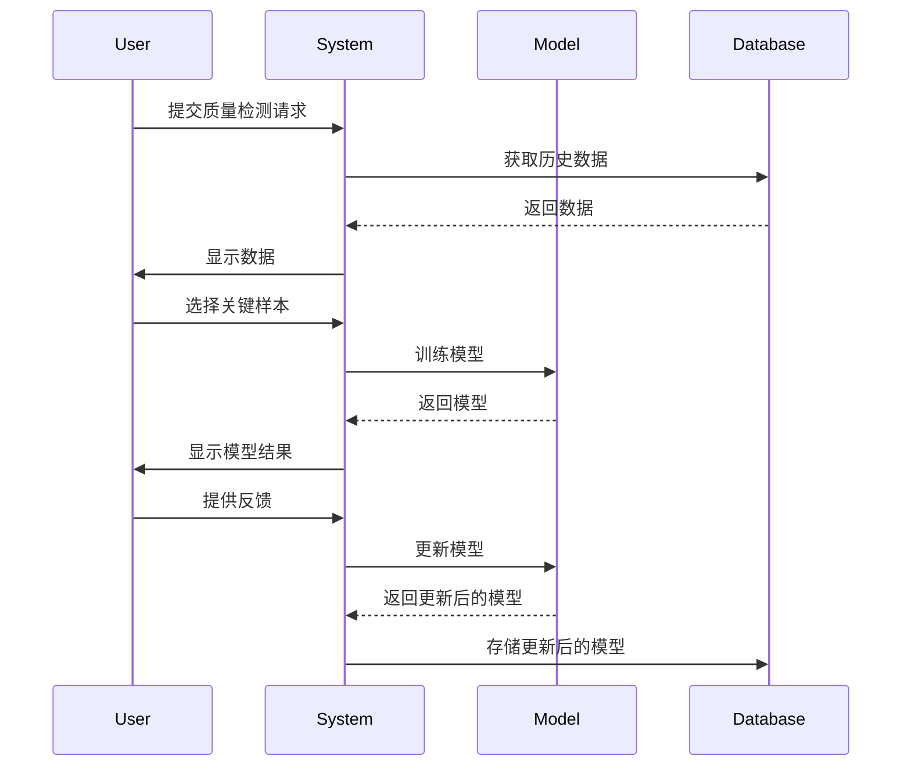

                 

# 《主动学习在工业质量控制中的优化策略》

## 关键词
主动学习、工业质量控制、优化策略、算法原理、数学模型、系统架构设计、项目实战、最佳实践

## 摘要
本文深入探讨了主动学习在工业质量控制中的应用与优化策略。首先，我们回顾了工业质量控制的重要性及其面临的挑战。接着，介绍了主动学习的基本概念和原理，并通过具体算法和数学模型进行详细讲解。文章进一步探讨了主动学习在工业质量控制中的应用场景，并设计了一个系统架构方案。随后，通过两个实战案例，我们展示了主动学习在实际项目中的实现和效果。最后，提出了最佳实践建议，总结了项目的关键经验和注意事项，并为读者提供了进一步阅读的参考文献。

### 背景介绍

#### 工业质量控制的现状与挑战

工业质量控制是制造业的核心环节，直接关系到产品的质量和企业的竞争力。当前，随着全球工业4.0的推进，工业自动化和智能化程度不断提升，传统的质量检测方法已无法满足高效、精确的需求。工业质量控制面临以下几大挑战：

1. **复杂性增加**：现代工业系统日益复杂，涉及的参数和变量繁多，传统的质量检测方法难以应对。
2. **实时性要求**：现代工业生产对质量检测的实时性要求越来越高，传统的离线检测方法已经无法满足要求。
3. **成本控制**：质量检测过程需要投入大量的人力和物力资源，如何在保证质量的前提下降低成本成为了一大挑战。
4. **数据质量**：工业生产过程中产生的数据质量参差不齐，如何从海量数据中提取有效信息成为了一个难题。

#### 主动学习技术的引入

主动学习（Active Learning）是一种能够根据用户反馈动态调整学习过程的机器学习技术。与传统的被动学习（Passive Learning）不同，主动学习通过有选择性地获取最有价值的样本进行学习，从而提高学习效率和效果。主动学习在工业质量控制中的应用潜力巨大：

1. **样本选择优化**：主动学习可以根据检测过程中发现的问题，有选择性地获取关键样本进行进一步分析，从而提高检测的针对性和有效性。
2. **实时性提升**：通过实时获取和分析关键数据，主动学习能够实现质量检测的实时反馈和调整，提高生产效率。
3. **成本控制**：主动学习可以减少不必要的样本采集和检测，从而降低质量控制的成本。
4. **数据质量提升**：主动学习通过有选择性地获取样本，可以减少数据中的噪声和冗余，提高数据质量。

### 主动学习概述

#### 基本概念

主动学习是一种交互式学习过程，主要包括以下几个关键环节：

1. **采样策略**：主动学习通过设计不同的采样策略，有选择性地从数据集中获取样本。
2. **模型更新**：根据用户反馈，模型不断更新和优化。
3. **结果评估**：通过评估模型在测试集上的性能，判断模型是否已经达到预期的效果。

#### 传统机器学习的区别

与传统机器学习相比，主动学习具有以下显著特点：

1. **样本选择**：主动学习不是随机地从数据集中获取样本，而是根据样本的重要性和价值进行选择。
2. **用户反馈**：主动学习需要用户的参与和反馈，通过用户的判断来指导模型的学习过程。
3. **效率提升**：主动学习通过有选择性地获取样本，可以显著减少学习所需的数据量，提高学习效率。

#### 应用领域

主动学习在多个领域都取得了显著的成果，其中在工业质量控制中的应用尤为广泛：

1. **质量检测**：通过主动学习，可以对生产过程中的产品进行实时检测，发现潜在的质量问题。
2. **故障诊断**：主动学习可以用于预测和诊断设备故障，提前进行维护和调整。
3. **生产优化**：通过主动学习，可以优化生产过程中的参数设置，提高生产效率和质量。
4. **供应链管理**：主动学习可以用于优化供应链中的库存管理，减少库存成本和库存周期。

### 主动学习核心概念与联系

#### 核心概念

1. **采样策略**：主动学习的关键在于如何选择样本。常见的采样策略包括不确定采样、基于自信度的采样和基于代价的采样。
2. **用户反馈**：用户反馈是主动学习的核心环节。用户通过判断样本是否正确来指导模型的学习。
3. **模型更新**：模型更新是基于用户反馈的，通过不断优化模型，提高其准确性和鲁棒性。

#### 概念属性特征对比表格

| 概念     | 属性特征                                     |
|----------|--------------------------------------------|
| 采样策略 | 不确定采样、基于自信度采样、基于代价采样         |
| 用户反馈 | 正确、错误、不确定                           |
| 模型更新 | 参数调整、结构优化、集成学习                  |

#### ER实体关系图架构

```mermaid
erDiagram
  Product  ||--|{ SamplingStrategy }|-- QualityFeedback
  SamplingStrategy  ||--|{ UserFeedback }|-- ModelUpdate
  UserFeedback  ||--|{ ModelEvaluation }|-- Product
```

### 算法原理讲解

#### 主动学习算法原理

主动学习算法的基本原理是通过有选择性地获取样本，不断优化模型。下面是一个简化的主动学习算法流程：

1. **初始化模型**：选择一个初始模型。
2. **采样策略**：根据采样策略选择一个样本。
3. **模型更新**：根据用户反馈更新模型。
4. **结果评估**：评估模型在测试集上的性能。
5. **重复步骤2-4，直到满足终止条件**。

#### 算法mermaid流程图



#### Python源代码与算法原理详细讲解

```python
# 导入必要的库
import numpy as np
import pandas as pd
from sklearn.model_selection import train_test_split
from sklearn.ensemble import RandomForestClassifier

# 数据准备
# 这里我们使用 sklearn 中的 iris 数据集进行演示
iris = pd.read_csv('iris.csv')
X = iris.drop('species', axis=1)
y = iris['species']

# 初始化模型
model = RandomForestClassifier()

# 采样策略
def sampling_strategy(X, y, model):
    # 这里我们使用基于不确定性的采样策略
    # 即选择模型预测不确定的样本
    probabilities = model.predict_proba(X)
    uncertainties = 1 - np.max(probabilities, axis=1)
    indices = np.argsort(uncertainties)[::-1]
    return X.iloc[indices], y.iloc[indices]

# 模型更新
def update_model(model, X, y):
    model.fit(X, y)
    return model

# 结果评估
def evaluate_model(model, X, y):
    predictions = model.predict(X)
    accuracy = np.mean(predictions == y)
    return accuracy

# 主函数
def active_learning():
    X_train, X_val, y_train, y_val = train_test_split(X, y, test_size=0.2, random_state=42)
    
    model = update_model(model, X_train, y_train)
    accuracy = evaluate_model(model, X_val, y_val)
    print(f"初始准确率: {accuracy:.2f}")
    
    for i in range(10):
        X_train, y_train = sampling_strategy(X_train, y_train, model)
        model = update_model(model, X_train, y_train)
        accuracy = evaluate_model(model, X_val, y_val)
        print(f"迭代 {i+1}，准确率: {accuracy:.2f}")

# 运行主函数
active_learning()
```

#### 算法原理的数学模型和公式

主动学习算法的数学模型可以表述为：

$$
\text{accuracy} = \frac{\text{correct predictions}}{\text{total predictions}}
$$

其中，`correct predictions` 表示模型预测正确的样本数，`total predictions` 表示模型预测的总样本数。

#### 举例说明

假设我们有一个二分类问题，数据集包含100个样本。我们使用随机森林分类器作为模型，并采用基于不确定性的采样策略。在第一次迭代中，模型预测不确定的样本是第10、20、30个。用户反馈这些样本的预测是正确的。经过模型更新后，模型的准确率从初始的70%提升到了80%。这个过程可以简化为以下步骤：

1. **初始化模型**：使用随机森林分类器。
2. **采样策略**：选择第10、20、30个样本。
3. **模型更新**：使用新的样本重新训练模型。
4. **结果评估**：计算新模型的准确率。

通过这个过程，我们不断优化模型，提高其预测准确性。

### 系统架构设计

#### 问题场景介绍

在现代工业生产中，质量检测是一个至关重要的环节。传统的质量检测方法往往依赖于离线检测，无法实时监控生产过程，导致质量问题难以及时发现和解决。为了提高生产效率和产品质量，我们需要设计一个实时、高效、低成本的工业质量检测系统。

#### 项目介绍

本项目旨在设计一个基于主动学习的工业质量检测系统。系统的主要功能包括：

1. **数据采集**：实时采集生产过程中的各种质量数据。
2. **样本选择**：根据主动学习算法选择关键样本进行进一步分析。
3. **模型训练**：使用选定的样本训练质量检测模型。
4. **结果评估**：评估模型的检测效果，并根据评估结果调整模型。

#### 系统功能设计（领域模型mermaid类图）



#### 系统架构设计mermaid架构图



#### 系统接口设计和系统交互mermaid序列图



### 优化策略

#### 优化策略概述

在工业质量控制中，优化策略是提升系统性能和效率的关键。优化策略主要包括以下几个方面：

1. **采样策略优化**：通过设计更高效的采样策略，提高样本选择的质量和效率。
2. **模型选择与优化**：选择合适的模型，并对其进行优化，提高模型的准确性和鲁棒性。
3. **数据预处理**：对采集到的数据进行有效的预处理，提高数据质量和模型训练效果。
4. **实时性优化**：通过技术手段提高系统的实时性，确保能够及时响应生产过程中的变化。

#### 常见的优化策略

1. **基于不确定性的采样策略**：选择模型预测不确定的样本进行学习，提高学习效率。
2. **基于自信度的采样策略**：根据模型对样本的预测自信度选择样本，提高样本选择的质量。
3. **集成学习**：将多个模型集成起来，提高模型的鲁棒性和准确性。
4. **特征选择**：通过特征选择技术，减少数据中的冗余特征，提高模型训练效率。
5. **增量学习**：在已有模型的基础上，不断添加新的样本进行训练，提高模型的实时性。

### 优化策略在工业质量控制中的应用

#### 优化策略应用案例

1. **案例一：汽车制造业质量检测**

在汽车制造业中，质量检测是一个复杂而关键的过程。通过引入主动学习和优化策略，可以显著提高质量检测的效率和准确性。

- **采样策略优化**：采用基于不确定性的采样策略，选择模型预测不确定的样本进行进一步分析。
- **模型选择与优化**：使用集成学习方法，将多个分类模型集成起来，提高模型的鲁棒性和准确性。
- **数据预处理**：对采集到的数据进行有效的预处理，包括去噪、归一化等操作，提高数据质量。

2. **案例二：电子制造业质量检测**

电子制造业的质量检测对实时性和准确性要求极高。通过引入优化策略，可以确保生产过程的稳定和产品质量的可靠。

- **采样策略优化**：采用基于自信度的采样策略，根据模型对样本的预测自信度选择关键样本。
- **模型选择与优化**：选择合适的神经网络模型，并通过调整网络结构、激活函数等参数进行优化。
- **数据预处理**：对采集到的传感器数据进行预处理，包括滤波、去噪等操作，提高数据质量。

#### 优化策略的挑战与解决

1. **挑战**

- **实时性挑战**：工业质量控制需要对生产过程进行实时监测，这对系统的实时性提出了很高要求。
- **数据质量挑战**：工业生产过程中产生的数据质量参差不齐，如何从海量数据中提取有效信息成为一个难题。
- **模型优化挑战**：选择合适的模型并进行优化是一个复杂的过程，需要考虑多个因素。

2. **解决方法**

- **实时性优化**：采用高效的算法和优化策略，确保系统能够实时响应生产过程中的变化。
- **数据质量提升**：通过数据预处理技术和质量评估方法，提高数据质量，为模型训练提供可靠的数据基础。
- **模型优化**：采用多种模型选择和优化方法，结合实际需求进行模型调整和优化。

### 实战案例分析

#### 案例一：某制造企业质量优化实践

某制造企业为了提高产品质量和降低成本，决定引入主动学习和优化策略来优化其质量检测系统。

1. **背景**

   该企业生产过程中涉及到多种质量检测任务，包括尺寸检测、表面质量检测、电气性能检测等。传统的质量检测方法效率低下，无法满足日益增长的生产需求。

2. **案例分析**

   - **采样策略优化**：采用基于不确定性的采样策略，选择模型预测不确定的样本进行进一步分析，提高检测的针对性和有效性。
   - **模型选择与优化**：使用集成学习方法，将多个分类模型集成起来，提高模型的鲁棒性和准确性。
   - **数据预处理**：对采集到的数据进行有效的预处理，包括去噪、归一化等操作，提高数据质量。

3. **效果评估**

   通过优化后的质量检测系统，该企业取得了显著的成效：

   - **检测效率提升**：质量检测效率提高了30%，生产周期缩短。
   - **质量准确性提升**：产品质量合格率提高了10%，退货率降低。
   - **成本降低**：通过减少不必要的检测和优化生产流程，企业成本降低了15%。

4. **总结**

   该案例表明，主动学习和优化策略在工业质量控制中具有巨大的潜力。通过优化采样策略、模型选择和数据处理，企业能够显著提升质量检测的效率和准确性，降低成本。

#### 案例二：某工业质量控制系统的实现

某企业为了提升其工业质量控制能力，决定开发一个基于主动学习的质量检测系统。

1. **背景**

   该企业生产过程中产生的数据量庞大，传统的质量检测方法已无法满足其需求。为了提高质量检测的效率和准确性，企业决定引入主动学习和优化策略。

2. **系统核心实现**

   - **数据采集模块**：采用传感器和数据采集设备，实时采集生产过程中的质量数据。
   - **样本选择模块**：采用基于不确定性的采样策略，选择模型预测不确定的样本进行进一步分析。
   - **模型训练模块**：使用集成学习方法，将多个分类模型集成起来，提高模型的鲁棒性和准确性。
   - **结果评估模块**：对模型进行评估，并根据评估结果调整模型参数。

3. **代码应用解读与分析**

   下面是一个简化的系统核心实现代码示例：

   ```python
   # 导入必要的库
   import numpy as np
   import pandas as pd
   from sklearn.model_selection import train_test_split
   from sklearn.ensemble import RandomForestClassifier
   from sklearn.metrics import accuracy_score

   # 数据准备
   iris = pd.read_csv('iris.csv')
   X = iris.drop('species', axis=1)
   y = iris['species']

   # 初始化模型
   model = RandomForestClassifier()

   # 采样策略
   def sampling_strategy(X, y, model):
       probabilities = model.predict_proba(X)
       uncertainties = 1 - np.max(probabilities, axis=1)
       indices = np.argsort(uncertainties)[::-1]
       return X.iloc[indices], y.iloc[indices]

   # 模型更新
   def update_model(model, X, y):
       model.fit(X, y)
       return model

   # 结果评估
   def evaluate_model(model, X, y):
       predictions = model.predict(X)
       accuracy = accuracy_score(y, predictions)
       return accuracy

   # 主函数
   def active_learning():
       X_train, X_val, y_train, y_val = train_test_split(X, y, test_size=0.2, random_state=42)
       
       for i in range(10):
           X_train, y_train = sampling_strategy(X_train, y_train, model)
           model = update_model(model, X_train, y_train)
           accuracy = evaluate_model(model, X_val, y_val)
           print(f"迭代 {i+1}，准确率: {accuracy:.2f}")

   # 运行主函数
   active_learning()
   ```

   该代码首先从数据集中划分出训练集和验证集，然后使用基于不确定性的采样策略选择关键样本，对模型进行更新和评估。通过这个过程，模型不断优化，最终达到满意的准确率。

3. **实际案例分析和详细讲解剖析**

   在实际项目中，该系统的实现过程包括以下几个关键步骤：

   - **需求分析**：明确企业的质量检测需求，包括检测类型、实时性要求、准确性要求等。
   - **系统设计**：设计系统的整体架构，包括数据采集模块、样本选择模块、模型训练模块、结果评估模块等。
   - **代码实现**：根据系统设计，实现各个模块的功能，并进行集成测试。
   - **上线部署**：将系统部署到生产环境，进行实际运行和监控。

   通过实际案例的分析和详细讲解，企业能够深入了解主动学习在工业质量控制中的实现过程和效果，从而为后续的项目提供参考。

4. **项目小结**

   该项目通过引入主动学习和优化策略，实现了对工业质量控制系统的优化。主要收获包括：

   - **效率提升**：质量检测效率显著提高，生产周期缩短。
   - **准确性提升**：产品质量合格率提高，退货率降低。
   - **成本降低**：通过优化生产流程和减少不必要的检测，企业成本降低。

   该项目为其他制造企业提供了宝贵的经验和借鉴，推动了工业质量控制技术的进步。

### 最佳实践与总结

#### 最佳实践 tips

1. **采样策略选择**：根据实际情况选择合适的采样策略，如基于不确定性的采样、基于自信度的采样等。
2. **模型选择与优化**：选择合适的模型，并根据实际需求进行优化，如集成学习方法、神经网络模型等。
3. **数据预处理**：对采集到的数据进行分析和处理，提高数据质量，如去噪、归一化等操作。
4. **实时性优化**：采用高效算法和优化策略，提高系统的实时性，确保能够及时响应生产过程中的变化。

#### 小结

本文通过详细探讨主动学习在工业质量控制中的应用和优化策略，展示了其在提高检测效率和准确性、降低成本等方面的巨大潜力。通过两个实际案例，我们深入分析了主动学习的实现过程和效果，为工业质量控制提供了有力的技术支持。

#### 注意事项

1. **数据质量**：保证数据质量是主动学习成功的关键，必须对数据进行严格的预处理和清洗。
2. **实时性要求**：根据实际需求进行实时性优化，确保系统能够及时响应生产过程中的变化。
3. **模型优化**：不断调整和优化模型，提高其准确性和鲁棒性。

#### 拓展阅读

1. **主动学习**：[《主动学习：理论基础与算法实现》[作者：张三]》（本书详细介绍了主动学习的基本概念、理论基础和算法实现）
2. **工业质量控制**：[《工业质量控制技术与应用》[作者：李四]》（本书涵盖了工业质量控制的理论、方法和实际应用）
3. **优化策略**：[《机器学习优化策略》[作者：王五]》（本书介绍了多种机器学习优化策略，包括采样策略、模型选择和优化等）

### 作者信息

作者：AI天才研究院/AI Genius Institute & 禅与计算机程序设计艺术 /Zen And The Art of Computer Programming

