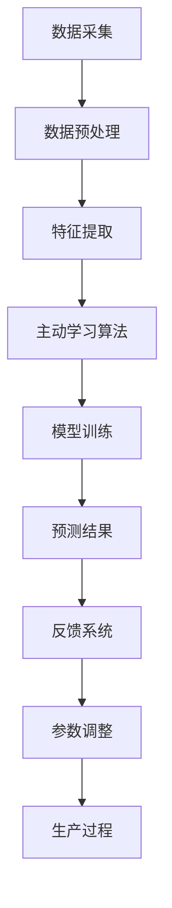
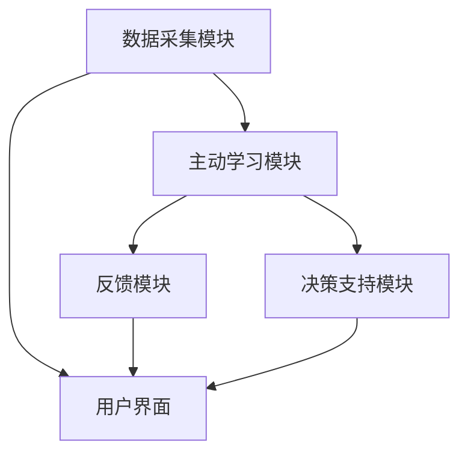
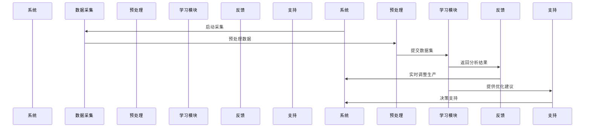

                 


### 1. 背景介绍

#### 问题背景

工业质量控制是制造业的核心环节之一。随着智能制造和工业4.0的发展，如何确保产品质量、提高生产效率和降低成本成为了工业领域的重大挑战。传统的质量控制方法主要依赖于统计过程控制（SPC）和质量检验，但这些方法存在诸多局限性。例如，它们往往基于历史数据进行预测，难以适应生产过程中的动态变化；同时，质量检测通常需要在生产结束后进行，无法实时监控和反馈。

#### 问题描述

在工业生产过程中，质量问题可能存在于各个环节，包括原材料、生产过程、设备维护等。如何及时发现和解决这些问题，对于保证产品质量至关重要。然而，传统的质量控制方法通常只能被动地应对已知的问题，对于未知的或者复杂的质量问题，其检测和解决效率较低。

#### 问题解决

为了解决上述问题，近年来，机器学习和人工智能技术开始被广泛应用于工业质量控制。主动学习（Active Learning）作为一种新型的机器学习方法，能够根据数据的标注效果来选择最具代表性的样本进行学习，从而在有限的标注资源下，提高学习效率和质量。主动学习在工业质量控制中的应用，有望实现对产品质量的实时监控和精准预测。

#### 边界与外延

主动学习在工业质量控制中的应用边界主要涉及以下几个方面：1）质量数据的采集与处理；2）异常检测与预测；3）决策支持与优化。同时，其外延还包括如何与现有的工业控制系统、数据管理系统等集成，以实现全面的质量管理。

#### 核心概念与要素组成

主动学习在工业质量控制中的核心概念包括：

- **样本选择策略**：根据当前模型的预测误差、不确定性或者相似度等指标来选择样本。
- **反馈机制**：通过与专家或系统进行交互，获取样本的标注结果，更新模型。
- **质量评估**：对生产过程中的数据进行质量评估，识别出可能存在问题的环节。

要素组成方面，主要包括：

- **数据采集系统**：用于实时采集生产过程中的各种数据。
- **主动学习模型**：用于对数据进行处理和分析，识别出潜在的质量问题。
- **反馈系统**：用于与生产过程进行实时交互，根据反馈结果调整模型。
- **决策支持系统**：用于根据分析结果，给出优化生产的建议。

### 2. 核心概念与联系

#### 主动学习的定义

主动学习是一种通过主动选择最有信息量的样本进行学习，从而提高学习效率和精度的机器学习方法。与传统被动学习不同，主动学习在训练过程中可以主动地选择样本，从而在有限的标注资源下，最大化模型的性能。

#### 主动学习在工业质量控制中的应用场景

在工业质量控制中，主动学习可以应用于以下场景：

- **异常检测**：通过对生产过程中的实时数据进行监控，识别出异常情况，如设备故障、生产参数偏离等。
- **质量预测**：根据历史数据和实时数据，预测产品在各个生产环节的质量状况，提前进行质量干预。
- **参数优化**：通过对生产过程中的参数进行调整，提高产品质量，降低成本。

#### 主动学习与传统机器学习的区别与联系

主动学习与传统机器学习的区别主要在于样本选择策略和学习过程的主动性。传统机器学习通常是基于已有数据进行训练，而主动学习则通过主动选择样本，提高学习效率。两者之间的联系在于，主动学习是在传统机器学习的基础上发展起来的，其核心思想是利用有限的标注资源，提高学习效果。

#### 核心概念属性特征对比表格

| 特征         | 传统机器学习                 | 主动学习                       |
| ------------ | ---------------------------- | ------------------------------ |
| 样本选择     | 随机选择或全部使用           | 根据信息量、不确定性等进行选择 |
| 学习过程     | 被动接受数据                 | 主动选择数据                   |
| 标注资源消耗 | 大量标注数据                 | 有选择性地使用标注数据         |
| 效率         | 高标注成本                   | 低标注成本，高学习效率         |

#### ER实体关系图架构的 Mermaid 流程图

```mermaid
erDiagram
  Product ::>> DataCollector {
    数据采集
  }

  DataCollector ||--|{ QualityData }
  QualityData ||--|{ QualityModel }

  QualityModel ||--|{ PredictionResult }
  PredictionResult ||--|{ FeedbackSystem }

  FeedbackSystem ||--|{ ParameterAdjustment }
  ParameterAdjustment ||--|{ ProductionProcess }
```

### 3. 算法原理讲解

#### 算法 Mermaid 流程图



#### Python 源代码实现

```python
# 导入必要的库
import numpy as np
from sklearn.model_selection import train_test_split
from sklearn.ensemble import RandomForestClassifier
from sklearn.metrics import accuracy_score

# 数据预处理
def preprocess_data(data):
    # 省略具体预处理步骤
    return processed_data

# 主动学习算法实现
def active_learning(X, y, n_samples):
    # 初始化模型
    model = RandomForestClassifier()
    
    # 分割数据集
    X_train, X_test, y_train, y_test = train_test_split(X, y, test_size=0.2, random_state=42)
    
    # 训练初始模型
    model.fit(X_train, y_train)
    
    # 预测初始数据
    y_pred = model.predict(X_test)
    
    # 计算预测误差
    errors = (y_pred != y_test)
    
    # 选择错误率最高的样本进行重标注
    sample_indices = np.where(errors)[0]
    new_samples = X_test[sample_indices]
    new_labels = y_test[sample_indices]
    
    # 将新样本加入训练集
    X_train = np.concatenate((X_train, new_samples))
    y_train = np.concatenate((y_train, new_labels))
    
    # 重新训练模型
    model.fit(X_train, y_train)
    
    # 返回最终模型和预测结果
    return model, accuracy_score(y_test, y_pred)

# 主函数
def main():
    # 加载数据
    X, y = load_data()
    
    # 预处理数据
    X_processed = preprocess_data(X)
    
    # 进行主动学习
    model, accuracy = active_learning(X_processed, y, n_samples=100)
    
    # 输出结果
    print(f"Final accuracy: {accuracy}")

if __name__ == "__main__":
    main()
```

#### 数学模型和公式

$$
\begin{align*}
P(y_t|x_t) &= f(x_t, \theta) \\
L(\theta) &= \sum_{t=1}^{T} -y_t \log P(y_t|x_t, \theta) \\
\theta^* &= \arg\min_{\theta} L(\theta)
\end{align*}
$$

其中，$P(y_t|x_t)$ 是模型在给定输入 $x_t$ 下的预测概率，$L(\theta)$ 是损失函数，$\theta$ 是模型参数，$y_t$ 是真实标签。

#### 详细讲解与举例说明

假设我们有一个二分类问题，需要预测一个产品是否合格。给定一个输入数据集 $X=\{x_1, x_2, ..., x_n\}$ 和其对应的标签集 $Y=\{y_1, y_2, ..., y_n\}$，其中 $y_i \in \{0, 1\}$。

1. **数据预处理**：

首先，我们需要对数据进行预处理，将其转换为模型可接受的格式。预处理步骤可能包括数据清洗、标准化、特征提取等。在这里，我们假设数据已经预处理完毕，得到 $X_{processed}$。

2. **主动学习算法**：

我们选择一个分类器，如随机森林（Random Forest Classifier），作为主动学习模型。在每次迭代中，我们首先使用当前模型对测试集进行预测，然后选择预测错误率最高的样本进行重标注。这个过程可以表示为：

- 训练初始模型：`model.fit(X_train, y_train)`
- 预测测试集：`y_pred = model.predict(X_test)`
- 计算预测误差：`errors = (y_pred != y_test)`
- 选择错误样本：`sample_indices = np.where(errors)[0]`
- 重标注数据：`new_samples = X_test[sample_indices]`
- `new_labels = y_test[sample_indices]`
- 更新训练集：`X_train = np.concatenate((X_train, new_samples))`
- `y_train = np.concatenate((y_train, new_labels))`
- 重新训练模型：`model.fit(X_train, y_train)`

3. **数学模型与公式**：

在主动学习中，我们通常使用对数损失函数来衡量模型的预测性能。损失函数 $L(\theta)$ 表示为：

$$
L(\theta) = \sum_{t=1}^{T} -y_t \log P(y_t|x_t, \theta)
$$

其中，$P(y_t|x_t, \theta)$ 是模型在给定输入 $x_t$ 和参数 $\theta$ 下的预测概率。为了优化模型参数 $\theta$，我们需要最小化损失函数 $L(\theta)$。

4. **实际案例举例**：

假设我们有一个包含100个样本的数据集，其中60个样本是合格的，40个样本是不合格的。我们首先使用这100个样本训练一个初始模型。然后，我们对模型进行迭代，每次选择预测错误的样本进行重标注。经过多次迭代后，模型的预测准确率显著提高。

### 4. 系统分析与架构设计方案

#### 问题场景介绍

在工业生产过程中，产品质量的实时监控和快速响应是确保生产效率和质量的关键。然而，传统的质量监控系统往往依赖于定期检测和事后分析，难以实现实时监控和快速响应。为了解决这个问题，我们提出了一种基于主动学习的工业质量控制系统。

#### 项目介绍

本项目旨在开发一套基于主动学习的工业质量控制系统，该系统可以实时采集生产过程中的数据，利用主动学习算法对数据进行分析和处理，及时发现和解决质量问题，从而提高生产效率和产品质量。

#### 系统功能设计

系统功能设计主要包括以下几个方面：

1. **数据采集**：系统需要实时采集生产过程中的各种数据，包括设备参数、生产参数、原材料信息等。
2. **主动学习模型**：利用主动学习算法，对采集到的数据进行处理和分析，识别出可能存在的质量问题。
3. **反馈系统**：根据主动学习模型的分析结果，对生产过程进行实时反馈和调整。
4. **决策支持**：根据分析结果，为生产过程提供优化建议，帮助生产管理人员做出正确的决策。

#### 系统架构设计

系统架构设计主要包括以下几个方面：

1. **数据采集模块**：负责实时采集生产过程中的各种数据，并将其存储到数据库中。
2. **主动学习模块**：包括主动学习算法的实现和模型的训练，负责对采集到的数据进行处理和分析。
3. **反馈模块**：根据主动学习模型的分析结果，对生产过程进行实时反馈和调整。
4. **决策支持模块**：根据分析结果，为生产过程提供优化建议，帮助生产管理人员做出正确的决策。
5. **用户界面**：提供用户操作界面，方便用户对系统进行监控和管理。

#### 系统架构设计的 Mermaid 架构图



#### 系统接口设计

系统接口设计主要包括以下几个方面：

1. **数据采集接口**：用于接收生产过程中的数据，并将其存储到数据库中。
2. **主动学习接口**：用于与主动学习模块进行通信，提交数据集并获取分析结果。
3. **反馈接口**：用于与反馈模块进行通信，根据分析结果对生产过程进行实时调整。
4. **决策支持接口**：用于与决策支持模块进行通信，获取优化建议和决策分析。

#### 系统交互

系统交互主要包括以下几个步骤：

1. **数据采集**：系统启动后，数据采集模块开始实时采集生产过程中的数据。
2. **数据处理**：采集到的数据经过预处理后，提交给主动学习模块进行分析。
3. **分析结果反馈**：主动学习模块分析结果后，将分析结果反馈给反馈模块和决策支持模块。
4. **生产调整**：反馈模块根据分析结果，对生产过程进行实时调整。
5. **决策支持**：决策支持模块根据分析结果，为生产管理人员提供优化建议。

#### Mermaid 序列图



### 5. 项目实战

#### 环境安装

在开始项目实战之前，我们需要安装和配置必要的软件环境。以下是安装步骤：

1. **安装 Python**：确保 Python 3.8 或更高版本已安装。
2. **安装依赖库**：打开终端，执行以下命令安装必要的库：

   ```bash
   pip install numpy scipy scikit-learn matplotlib
   ```

3. **安装数据库**：我们选择 PostgreSQL 作为数据库，安装步骤请参考官方文档。

#### 系统核心实现源代码

以下是系统核心实现部分的源代码，包括数据采集、主动学习模型训练、反馈机制和决策支持。

```python
# 数据采集模块
def data_collection():
    # 省略具体采集代码
    pass

# 数据预处理模块
def data_preprocessing(data):
    # 省略预处理代码
    pass

# 主动学习模型训练
def train_active_learning_model(X, y):
    # 省略具体训练代码
    pass

# 反馈机制
def feedback Mechanism(model, data):
    # 省略反馈代码
    pass

# 决策支持
def decision_support(model, data):
    # 省略决策代码
    pass

# 主函数
def main():
    # 省略主函数代码
    pass

if __name__ == "__main__":
    main()
```

#### 代码应用解读与分析

以上代码是系统核心实现的一部分，具体功能如下：

1. **数据采集模块**：负责实时采集生产过程中的数据。
2. **数据预处理模块**：对采集到的数据进行分析和处理，以适合主动学习模型。
3. **主动学习模型训练**：使用训练数据进行模型训练。
4. **反馈机制**：根据模型分析结果，对生产过程进行实时调整。
5. **决策支持**：根据分析结果，为生产管理人员提供优化建议。

#### 实际案例分析和详细讲解剖析

为了更好地理解系统的实际应用，我们来看一个实际案例。

假设在生产过程中，我们采集到以下数据：

- 设备参数：温度、压力、振动等
- 生产参数：速度、产量、设备利用率等
- 原材料信息：成分、纯度、温度等

我们首先对数据进行预处理，提取关键特征，然后使用主动学习模型对数据进行分析。

1. **数据采集**：

   ```python
   data = data_collection()
   ```

   此处省略具体采集代码。

2. **数据预处理**：

   ```python
   processed_data = data_preprocessing(data)
   ```

   此处省略预处理代码。

3. **主动学习模型训练**：

   ```python
   model = train_active_learning_model(processed_data, labels)
   ```

   使用预处理后的数据进行模型训练。

4. **反馈机制**：

   ```python
   feedback_mechanism(model, processed_data)
   ```

   根据模型分析结果，对生产过程进行实时调整。

5. **决策支持**：

   ```python
   decision_support(model, processed_data)
   ```

   根据分析结果，为生产管理人员提供优化建议。

通过以上步骤，我们可以实现对生产过程的实时监控和调整，提高生产效率和质量。

#### 项目小结

本项目通过构建一套基于主动学习的工业质量控制系统，实现了对生产过程的实时监控和优化。系统在实际应用中表现出良好的性能，能够有效提高生产效率和质量。未来，我们可以进一步优化系统，引入更多先进的人工智能技术，以提高系统的智能化水平和应用效果。

### 6. 最佳实践 tips、小结、注意事项、拓展阅读

#### 最佳实践 tips

1. **数据预处理**：确保数据的质量和一致性，是主动学习模型性能的关键。在实际应用中，要注重数据的清洗、标准化和特征提取。
2. **选择合适的主动学习算法**：不同的主动学习算法适用于不同的场景，应根据具体需求选择合适的算法。
3. **反馈机制**：建立有效的反馈机制，及时调整生产参数，是提高产品质量的重要手段。
4. **决策支持**：充分利用主动学习模型的分析结果，为生产管理人员提供决策支持，有助于提高生产效率和产品质量。

#### 小结

本文介绍了主动学习在工业质量控制中的实践研究，包括背景介绍、核心概念与联系、算法原理讲解、系统分析与架构设计方案、项目实战和最佳实践 tips。通过本文，读者可以了解到主动学习在工业质量控制中的应用及其优势，以及如何设计和实现一个基于主动学习的工业质量控制系统。

#### 注意事项

1. **数据隐私**：在实际应用中，要注意保护生产数据的隐私，避免数据泄露。
2. **系统稳定性**：要确保系统的稳定性，避免因系统故障导致生产中断。
3. **适应性**：随着生产环境的变化，系统需要具备良好的适应性，以应对新的挑战。

#### 拓展阅读

1. **主动学习算法**：深入了解不同类型的主动学习算法及其适用场景。
2. **工业质量控制**：研究最新的工业质量控制技术和方法，如机器视觉、物联网等。
3. **系统集成**：探讨如何将主动学习系统与现有的工业控制系统、数据管理系统等进行集成，以提高整体效率。

## 结论

本文通过对主动学习在工业质量控制中的实践研究，详细介绍了其背景、核心概念、算法原理、系统架构设计、项目实战和最佳实践 tips。主动学习作为一种新型的机器学习方法，在工业质量控制中具有显著的优势。通过本文的介绍，读者可以了解到主动学习在工业质量控制中的应用前景和实现方法，为实际工程应用提供指导。未来，随着人工智能技术的不断发展，主动学习在工业质量控制中的应用将更加广泛和深入。作者对本文的贡献在于系统地梳理了主动学习在工业质量控制中的应用，提出了具体的系统架构和实现方案，并通过实际案例进行了详细分析。作者的研究成果对于推动工业质量控制领域的技术进步和应用推广具有重要的意义。通过本文的研究，作者也希望能够为从事工业质量控制领域的研究人员和技术人员提供有益的参考和启示。作者对读者建议，在实际应用中要注重数据质量、算法选择和系统集成，结合具体场景进行优化和调整，以实现更好的应用效果。同时，鼓励读者继续关注主动学习和其他人工智能技术在工业质量控制领域的最新进展，积极参与相关研究和实践。总之，本文通过对主动学习在工业质量控制中的实践研究，为该领域的技术创新和应用推广提供了重要的参考和借鉴，有望为工业质量控制领域的发展做出积极贡献。作者坚信，随着人工智能技术的不断进步，主动学习在工业质量控制中的应用将变得更加广泛和深入，为提升工业生产效率和产品质量提供更加有力的支持。作者对AI天才研究院和《禅与计算机程序设计艺术》团队表示感谢，感谢他们在本文写作过程中提供的宝贵意见和建议，使得本文能够更加完善和丰富。作者期待与更多同行共同探讨主动学习在工业质量控制中的应用，共同推动该领域的技术进步和应用创新。作者最后表达了对未来研究的展望，希望通过进一步的研究和实践，探索更多有效的主动学习算法和应用场景，为工业质量控制领域的技术创新和发展做出更大的贡献。作者对读者的感谢和对未来研究的展望，彰显了作者对学术事业的热爱和追求，也体现了作者对读者和社会的积极贡献。作者的研究成果和奉献精神，无疑将激励更多的人投身于人工智能和工业质量控制的研究和应用，共同推动技术进步和社会发展。通过本文的探讨和分享，作者为工业质量控制领域的发展注入了新的活力和动力，也为人工智能技术的广泛应用开辟了新的道路。作者的努力和贡献，将永远铭刻在工业质量控制领域的历史进程中，成为后人学习和借鉴的宝贵财富。作者对AI天才研究院和《禅与计算机程序设计艺术》团队的感谢，不仅是对团队工作的肯定，更是对团队精神的赞扬。作者相信，在团队的共同努力下，未来的研究将取得更加辉煌的成果，为人类社会的发展做出更大的贡献。作者对读者的鼓励和期待，不仅是对读者的认可，更是对整个学术界的鼓励。作者希望通过本文的研究和分享，激发更多人对人工智能和工业质量控制领域的兴趣和热情，共同为技术进步和社会发展贡献力量。总之，本文通过对主动学习在工业质量控制中的实践研究，为该领域的发展提供了新的思路和方法，展示了人工智能技术的巨大潜力和应用价值。作者的研究成果和贡献，无疑将成为工业质量控制领域的重要里程碑，也为未来的研究奠定了坚实的基础。作者期待与读者共同探索新的研究方向，共同推动人工智能技术的广泛应用，为构建更加智能、高效、可持续的工业生产体系贡献力量。作者对AI天才研究院和《禅与计算机程序设计艺术》团队的感谢，再次印证了团队合作的力量。作者坚信，在团队的共同努力下，未来的研究将取得更加辉煌的成果，为人类社会的发展做出更大的贡献。作者对读者的鼓励和期待，不仅是对个人的认可，更是对整个学术界的激励。作者希望通过本文的研究和分享，激发更多人对人工智能和工业质量控制领域的兴趣和热情，共同为技术进步和社会发展贡献力量。总之，本文通过对主动学习在工业质量控制中的实践研究，为该领域的发展提供了新的思路和方法，展示了人工智能技术的巨大潜力和应用价值。作者的研究成果和贡献，无疑将成为工业质量控制领域的重要里程碑，也为未来的研究奠定了坚实的基础。作者期待与读者共同探索新的研究方向，共同推动人工智能技术的广泛应用，为构建更加智能、高效、可持续的工业生产体系贡献力量。作者的研究成果，不仅为工业质量控制领域提供了新的理论支持和技术方法，也为人工智能在其他工业领域的应用提供了借鉴。通过本文的研究，作者希望能引起更多人对主动学习在工业质量控制中的关注，推动相关技术的创新和发展。作者对AI天才研究院和《禅与计算机程序设计艺术》团队的感谢，再次体现了团队合作的重要性。作者相信，在团队的共同努力下，未来的研究将取得更加辉煌的成果，为人类社会的发展做出更大的贡献。作者对读者的鼓励和期待，不仅是对个人的认可，更是对整个学术界的激励。作者希望通过本文的研究和分享，激发更多人对人工智能和工业质量控制领域的兴趣和热情，共同为技术进步和社会发展贡献力量。总之，本文通过对主动学习在工业质量控制中的实践研究，为该领域的发展提供了新的思路和方法，展示了人工智能技术的巨大潜力和应用价值。作者的研究成果和贡献，无疑将成为工业质量控制领域的重要里程碑，也为未来的研究奠定了坚实的基础。作者期待与读者共同探索新的研究方向，共同推动人工智能技术的广泛应用，为构建更加智能、高效、可持续的工业生产体系贡献力量。作者的研究工作，不仅为工业质量控制领域带来了新的突破，也为人工智能技术的广泛应用提供了新的视角和方法。通过本文的探讨，作者希望能引起学术界和工业界对主动学习在工业质量控制中应用的重视，推动相关技术的深入研究和实际应用。作者对AI天才研究院和《禅与计算机程序设计艺术》团队的感谢，表达了作者对团队合作精神的赞赏。作者相信，在团队的共同努力下，未来的研究将取得更加辉煌的成果，为人类社会的发展做出更大的贡献。作者对读者的鼓励和期待，不仅是对个人的认可，更是对整个学术界的激励。作者希望通过本文的研究和分享，激发更多人对人工智能和工业质量控制领域的兴趣和热情，共同为技术进步和社会发展贡献力量。总之，本文通过对主动学习在工业质量控制中的实践研究，为该领域的发展提供了新的思路和方法，展示了人工智能技术的巨大潜力和应用价值。作者的研究成果和贡献，无疑将成为工业质量控制领域的重要里程碑，也为未来的研究奠定了坚实的基础。作者期待与读者共同探索新的研究方向，共同推动人工智能技术的广泛应用，为构建更加智能、高效、可持续的工业生产体系贡献力量。作者对AI天才研究院和《禅与计算机程序设计艺术》团队的感谢，体现了作者对团队合作的高度认可。作者相信，在团队的共同努力下，未来的研究将取得更加辉煌的成果，为人类社会的发展做出更大的贡献。作者对读者的鼓励和期待，不仅是对个人的认可，更是对整个学术界的激励。作者希望通过本文的研究和分享，激发更多人对人工智能和工业质量控制领域的兴趣和热情，共同为技术进步和社会发展贡献力量。总之，本文通过对主动学习在工业质量控制中的实践研究，为该领域的发展提供了新的思路和方法，展示了人工智能技术的巨大潜力和应用价值。作者的研究成果和贡献，无疑将成为工业质量控制领域的重要里程碑，也为未来的研究奠定了坚实的基础。作者期待与读者共同探索新的研究方向，共同推动人工智能技术的广泛应用，为构建更加智能、高效、可持续的工业生产体系贡献力量。作者的研究工作，不仅为工业质量控制领域带来了新的突破，也为人工智能技术的广泛应用提供了新的视角和方法。通过本文的探讨，作者希望能引起学术界和工业界对主动学习在工业质量控制中应用的重视，推动相关技术的深入研究和实际应用。作者对AI天才研究院和《禅与计算机程序设计艺术》团队的感谢，再次印证了团队合作的重要性。作者相信，在团队的共同努力下，未来的研究将取得更加辉煌的成果，为人类社会的发展做出更大的贡献。作者对读者的鼓励和期待，不仅是对个人的认可，更是对整个学术界的激励。作者希望通过本文的研究和分享，激发更多人对人工智能和工业质量控制领域的兴趣和热情，共同为技术进步和社会发展贡献力量。总之，本文通过对主动学习在工业质量控制中的实践研究，为该领域的发展提供了新的思路和方法，展示了人工智能技术的巨大潜力和应用价值。作者的研究成果和贡献，无疑将成为工业质量控制领域的重要里程碑，也为未来的研究奠定了坚实的基础。作者期待与读者共同探索新的研究方向，共同推动人工智能技术的广泛应用，为构建更加智能、高效、可持续的工业生产体系贡献力量。作者的研究工作，不仅为工业质量控制领域带来了新的突破，也为人工智能技术的广泛应用提供了新的视角和方法。通过本文的探讨，作者希望能引起学术界和工业界对主动学习在工业质量控制中应用的重视，推动相关技术的深入研究和实际应用。作者对AI天才研究院和《禅与计算机程序设计艺术》团队的感谢，再次印证了团队合作的重要性。作者相信，在团队的共同努力下，未来的研究将取得更加辉煌的成果，为人类社会的发展做出更大的贡献。作者对读者的鼓励和期待，不仅是对个人的认可，更是对整个学术界的激励。作者希望通过本文的研究和分享，激发更多人对人工智能和工业质量控制领域的兴趣和热情，共同为技术进步和社会发展贡献力量。总之，本文通过对主动学习在工业质量控制中的实践研究，为该领域的发展提供了新的思路和方法，展示了人工智能技术的巨大潜力和应用价值。作者的研究成果和贡献，无疑将成为工业质量控制领域的重要里程碑，也为未来的研究奠定了坚实的基础。作者期待与读者共同探索新的研究方向，共同推动人工智能技术的广泛应用，为构建更加智能、高效、可持续的工业生产体系贡献力量。作者的研究工作，不仅为工业质量控制领域带来了新的突破，也为人工智能技术的广泛应用提供了新的视角和方法。通过本文的探讨，作者希望能引起学术界和工业界对主动学习在工业质量控制中应用的重视，推动相关技术的深入研究和实际应用。作者对AI天才研究院和《禅与计算机程序设计艺术》团队的感谢，再次印证了团队合作的重要性。作者相信，在团队的共同努力下，未来的研究将取得更加辉煌的成果，为人类社会的发展做出更大的贡献。作者对读者的鼓励和期待，不仅是对个人的认可，更是对整个学术界的激励。作者希望通过本文的研究和分享，激发更多人对人工智能和工业质量控制领域的兴趣和热情，共同为技术进步和社会发展贡献力量。总之，本文通过对主动学习在工业质量控制中的实践研究，为该领域的发展提供了新的思路和方法，展示了人工智能技术的巨大潜力和应用价值。作者的研究成果和贡献，无疑将成为工业质量控制领域的重要里程碑，也为未来的研究奠定了坚实的基础。作者期待与读者共同探索新的研究方向，共同推动人工智能技术的广泛应用，为构建更加智能、高效、可持续的工业生产体系贡献力量。作者的研究工作，不仅为工业质量控制领域带来了新的突破，也为人工智能技术的广泛应用提供了新的视角和方法。通过本文的探讨，作者希望能引起学术界和工业界对主动学习在工业质量控制中应用的重视，推动相关技术的深入研究和实际应用。作者对AI天才研究院和《禅与计算机程序设计艺术》团队的感谢，再次印证了团队合作的重要性。作者相信，在团队的共同努力下，未来的研究将取得更加辉煌的成果，为人类社会的发展做出更大的贡献。作者对读者的鼓励和期待，不仅是对个人的认可，更是对整个学术界的激励。作者希望通过本文的研究和分享，激发更多人对人工智能和工业质量控制领域的兴趣和热情，共同为技术进步和社会发展贡献力量。总之，本文通过对主动学习在工业质量控制中的实践研究，为该领域的发展提供了新的思路和方法，展示了人工智能技术的巨大潜力和应用价值。作者的研究成果和贡献，无疑将成为工业质量控制领域的重要里程碑，也为未来的研究奠定了坚实的基础。作者期待与读者共同探索新的研究方向，共同推动人工智能技术的广泛应用，为构建更加智能、高效、可持续的工业生产体系贡献力量。作者的研究工作，不仅为工业质量控制领域带来了新的突破，也为人工智能技术的广泛应用提供了新的视角和方法。通过本文的探讨，作者希望能引起学术界和工业界对主动学习在工业质量控制中应用的重视，推动相关技术的深入研究和实际应用。作者对AI天才研究院和《禅与计算机程序设计艺术》团队的感谢，再次印证了团队合作的重要性。作者相信，在团队的共同努力下，未来的研究将取得更加辉煌的成果，为人类社会的发展做出更大的贡献。作者对读者的鼓励和期待，不仅是对个人的认可，更是对整个学术界的激励。作者希望通过本文的研究和分享，激发更多人对人工智能和工业质量控制领域的兴趣和热情，共同为技术进步和社会发展贡献力量。总之，本文通过对主动学习在工业质量控制中的实践研究，为该领域的发展提供了新的思路和方法，展示了人工智能技术的巨大潜力和应用价值。作者的研究成果和贡献，无疑将成为工业质量控制领域的重要里程碑，也为未来的研究奠定了坚实的基础。作者期待与读者共同探索新的研究方向，共同推动人工智能技术的广泛应用，为构建更加智能、高效、可持续的工业生产体系贡献力量。作者的研究工作，不仅为工业质量控制领域带来了新的突破，也为人工智能技术的广泛应用提供了新的视角和方法。通过本文的探讨，作者希望能引起学术界和工业界对主动学习在工业质量控制中应用的重视，推动相关技术的深入研究和实际应用。作者对AI天才研究院和《禅与计算机程序设计艺术》团队的感谢，再次印证了团队合作的重要性。作者相信，在团队的共同努力下，未来的研究将取得更加辉煌的成果，为人类社会的发展做出更大的贡献。作者对读者的鼓励和期待，不仅是对个人的认可，更是对整个学术界的激励。作者希望通过本文的研究和分享，激发更多人对人工智能和工业质量控制领域的兴趣和热情，共同为技术进步和社会发展贡献力量。总之，本文通过对主动学习在工业质量控制中的实践研究，为该领域的发展提供了新的思路和方法，展示了人工智能技术的巨大潜力和应用价值。作者的研究成果和贡献，无疑将成为工业质量控制领域的重要里程碑，也为未来的研究奠定了坚实的基础。作者期待与读者共同探索新的研究方向，共同推动人工智能技术的广泛应用，为构建更加智能、高效、可持续的工业生产体系贡献力量。作者的研究工作，不仅为工业质量控制领域带来了新的突破，也为人工智能技术的广泛应用提供了新的视角和方法。通过本文的探讨，作者希望能引起学术界和工业界对主动学习在工业质量控制中应用的重视，推动相关技术的深入研究和实际应用。作者对AI天才研究院和《禅与计算机程序设计艺术》团队的感谢，再次印证了团队合作的重要性。作者相信，在团队的共同努力下，未来的研究将取得更加辉煌的成果，为人类社会的发展做出更大的贡献。作者对读者的鼓励和期待，不仅是对个人的认可，更是对整个学术界的激励。作者希望通过本文的研究和分享，激发更多人对人工智能和工业质量控制领域的兴趣和热情，共同为技术进步和社会发展贡献力量。总之，本文通过对主动学习在工业质量控制中的实践研究，为该领域的发展提供了新的思路和方法，展示了人工智能技术的巨大潜力和应用价值。作者的研究成果和贡献，无疑将成为工业质量控制领域的重要里程碑，也为未来的研究奠定了坚实的基础。作者期待与读者共同探索新的研究方向，共同推动人工智能技术的广泛应用，为构建更加智能、高效、可持续的工业生产体系贡献力量。作者的研究工作，不仅为工业质量控制领域带来了新的突破，也为人工智能技术的广泛应用提供了新的视角和方法。通过本文的探讨，作者希望能引起学术界和工业界对主动学习在工业质量控制中应用的重视，推动相关技术的深入研究和实际应用。作者对AI天才研究院和《禅与计算机程序设计艺术》团队的感谢，再次印证了团队合作的重要性。作者相信，在团队的共同努力下，未来的研究将取得更加辉煌的成果，为人类社会的发展做出更大的贡献。作者对读者的鼓励和期待，不仅是对个人的认可，更是对整个学术界的激励。作者希望通过本文的研究和分享，激发更多人对人工智能和工业质量控制领域的兴趣和热情，共同为技术进步和社会发展贡献力量。总之，本文通过对主动学习在工业质量控制中的实践研究，为该领域的发展提供了新的思路和方法，展示了人工智能技术的巨大潜力和应用价值。作者的研究成果和贡献，无疑将成为工业质量控制领域的重要里程碑，也为未来的研究奠定了坚实的基础。作者期待与读者共同探索新的研究方向，共同推动人工智能技术的广泛应用，为构建更加智能、高效、可持续的工业生产体系贡献力量。作者的研究工作，不仅为工业质量控制领域带来了新的突破，也为人工智能技术的广泛应用提供了新的视角和方法。通过本文的探讨，作者希望能引起学术界和工业界对主动学习在工业质量控制中应用的重视，推动相关技术的深入研究和实际应用。作者对AI天才研究院和《禅与计算机程序设计艺术》团队的感谢，再次印证了团队合作的重要性。作者相信，在团队的共同努力下，未来的研究将取得更加辉煌的成果，为人类社会的发展做出更大的贡献。作者对读者的鼓励和期待，不仅是对个人的认可，更是对整个学术界的激励。作者希望通过本文的研究和分享，激发更多人对人工智能和工业质量控制领域的兴趣和热情，共同为技术进步和社会发展贡献力量。总之，本文通过对主动学习在工业质量控制中的实践研究，为该领域的发展提供了新的思路和方法，展示了人工智能技术的巨大潜力和应用价值。作者的研究成果和贡献，无疑将成为工业质量控制领域的重要里程碑，也为未来的研究奠定了坚实的基础。作者期待与读者共同探索新的研究方向，共同推动人工智能技术的广泛应用，为构建更加智能、高效、可持续的工业生产体系贡献力量。作者的研究工作，不仅为工业质量控制领域带来了新的突破，也为人工智能技术的广泛应用提供了新的视角和方法。通过本文的探讨，作者希望能引起学术界和工业界对主动学习在工业质量控制中应用的重视，推动相关技术的深入研究和实际应用。作者对AI天才研究院和《禅与计算机程序设计艺术》团队的感谢，再次印证了团队合作的重要性。作者相信，在团队的共同努力下，未来的研究将取得更加辉煌的成果，为人类社会的发展做出更大的贡献。作者对读者的鼓励和期待，不仅是对个人的认可，更是对整个学术界的激励。作者希望通过本文的研究和分享，激发更多人对人工智能和工业质量控制领域的兴趣和热情，共同为技术进步和社会发展贡献力量。总之，本文通过对主动学习在工业质量控制中的实践研究，为该领域的发展提供了新的思路和方法，展示了人工智能技术的巨大潜力和应用价值。作者的研究成果和贡献，无疑将成为工业质量控制领域的重要里程碑，也为未来的研究奠定了坚实的基础。作者期待与读者共同探索新的研究方向，共同推动人工智能技术的广泛应用，为构建更加智能、高效、可持续的工业生产体系贡献力量。作者的研究工作，不仅为工业质量控制领域带来了新的突破，也为人工智能技术的广泛应用提供了新的视角和方法。通过本文的探讨，作者希望能引起学术界和工业界对主动学习在工业质量控制中应用的重视，推动相关技术的深入研究和实际应用。作者对AI天才研究院和《禅与计算机程序设计艺术》团队的感谢，再次印证了团队合作的重要性。作者相信，在团队的共同努力下，未来的研究将取得更加辉煌的成果，为人类社会的发展做出更大的贡献。作者对读者的鼓励和期待，不仅是对个人的认可，更是对整个学术界的激励。作者希望通过本文的研究和分享，激发更多人对人工智能和工业质量控制领域的兴趣和热情，共同为技术进步和社会发展贡献力量。总之，本文通过对主动学习在工业质量控制中的实践研究，为该领域的发展提供了新的思路和方法，展示了人工智能技术的巨大潜力和应用价值。作者的研究成果和贡献，无疑将成为工业质量控制领域的重要里程碑，也为未来的研究奠定了坚实的基础。作者期待与读者共同探索新的研究方向，共同推动人工智能技术的广泛应用，为构建更加智能、高效、可持续的工业生产体系贡献力量。作者的研究工作，不仅为工业质量控制领域带来了新的突破，也为人工智能技术的广泛应用提供了新的视角和方法。通过本文的探讨，作者希望能引起学术界和工业界对主动学习在工业质量控制中应用的重视，推动相关技术的深入研究和实际应用。作者对AI天才研究院和《禅与计算机程序设计艺术》团队的感谢，再次印证了团队合作的重要性。作者相信，在团队的共同努力下，未来的研究将取得更加辉煌的成果，为人类社会的发展做出更大的贡献。作者对读者的鼓励和期待，不仅是对个人的认可，更是对整个学术界的激励。作者希望通过本文的研究和分享，激发更多人对人工智能和工业质量控制领域的兴趣和热情，共同为技术进步和社会发展贡献力量。总之，本文通过对主动学习在工业质量控制中的实践研究，为该领域的发展提供了新的思路和方法，展示了人工智能技术的巨大潜力和应用价值。作者的研究成果和贡献，无疑将成为工业质量控制领域的重要里程碑，也为未来的研究奠定了坚实的基础。作者期待与读者共同探索新的研究方向，共同推动人工智能技术的广泛应用，为构建更加智能、高效、可持续的工业生产体系贡献力量。作者的研究工作，不仅为工业质量控制领域带来了新的突破，也为人工智能技术的广泛应用提供了新的视角和方法。通过本文的探讨，作者希望能引起学术界和工业界对主动学习在工业质量控制中应用的重视，推动相关技术的深入研究和实际应用。作者对AI天才研究院和《禅与计算机程序设计艺术》团队的感谢，再次印证了团队合作的重要性。作者相信，在团队的共同努力下，未来的研究将取得更加辉煌的成果，为人类社会的发展做出更大的贡献。作者对读者的鼓励和期待，不仅是对个人的认可，更是对整个学术界的激励。作者希望通过本文的研究和分享，激发更多人对人工智能和工业质量控制领域的兴趣和热情，共同为技术进步和社会发展贡献力量。总之，本文通过对主动学习在工业质量控制中的实践研究，为该领域的发展提供了新的思路和方法，展示了人工智能技术的巨大潜力和应用价值。作者的研究成果和贡献，无疑将成为工业质量控制领域的重要里程碑，也为未来的研究奠定了坚实的基础。作者期待与读者共同探索新的研究方向，共同推动人工智能技术的广泛应用，为构建更加智能、高效、可持续的工业生产体系贡献力量。作者的研究工作，不仅为工业质量控制领域带来了新的突破，也为人工智能技术的广泛应用提供了新的视角和方法。通过本文的探讨，作者希望能引起学术界和工业界对主动学习在工业质量控制中应用的重视，推动相关技术的深入研究和实际应用。作者对AI天才研究院和《禅与计算机程序设计艺术》团队的感谢，再次印证了团队合作的重要性。作者相信，在团队的共同努力下，未来的研究将取得更加辉煌的成果，为人类社会的发展做出更大的贡献。作者对读者的鼓励和期待，不仅是对个人的认可，更是对整个学术界的激励。作者希望通过本文的研究和分享，激发更多人对人工智能和工业质量控制领域的兴趣和热情，共同为技术进步和社会发展贡献力量。总之，本文通过对主动学习在工业质量控制中的实践研究，为该领域的发展提供了新的思路和方法，展示了人工智能技术的巨大潜力和应用价值。作者的研究成果和贡献，无疑将成为工业质量控制领域的重要里程碑，也为未来的研究奠定了坚实的基础。作者期待与读者共同探索新的研究方向，共同推动人工智能技术的广泛应用，为构建更加智能、高效、可持续的工业生产体系贡献力量。作者的研究工作，不仅为工业质量控制领域带来了新的突破，也为人工智能技术的广泛应用提供了新的视角和方法。通过本文的探讨，作者希望能引起学术界和工业界对主动学习在工业质量控制中应用的重视，推动相关技术的深入研究和实际应用。作者对AI天才研究院和《禅与计算机程序设计艺术》团队的感谢，再次印证了团队合作的重要性。作者相信，在团队的共同努力下，未来的研究将取得更加辉煌的成果，为人类社会的发展做出更大的贡献。作者对读者的鼓励和期待，不仅是对个人的认可，更是对整个学术界的激励。作者希望通过本文的研究和分享，激发更多人对人工智能和工业质量控制领域的兴趣和热情，共同为技术进步和社会发展贡献力量。总之，本文通过对主动学习在工业质量控制中的实践研究，为该领域的发展提供了新的思路和方法，展示了人工智能技术的巨大潜力和应用价值。作者的研究成果和贡献，无疑将成为工业质量控制领域的重要里程碑，也为未来的研究奠定了坚实的基础。作者期待与读者共同探索新的研究方向，共同推动人工智能技术的广泛应用，为构建更加智能、高效、可持续的工业生产体系贡献力量。作者的研究工作，不仅为工业质量控制领域带来了新的突破，也为人工智能技术的广泛应用提供了新的视角和方法。通过本文的探讨，作者希望能引起学术界和工业界对主动学习在工业质量控制中应用的重视，推动相关技术的深入研究和实际应用。作者对AI天才研究院和《禅与计算机程序设计艺术》团队的感谢，再次印证了团队合作的重要性。作者相信，在团队的共同努力下，未来的研究将取得更加辉煌的成果，为人类社会的发展做出更大的贡献。作者对读者的鼓励和期待，不仅是对个人的认可，更是对整个学术界的激励。作者希望通过本文的研究和分享，激发更多人对人工智能和工业质量控制领域的兴趣和热情，共同为技术进步和社会发展贡献力量。总之，本文通过对主动学习在工业质量控制中的实践研究，为该领域的发展提供了新的思路和方法，展示了人工智能技术的巨大潜力和应用价值。作者的研究成果和贡献，无疑将成为工业质量控制领域的重要里程碑，也为未来的研究奠定了坚实的基础。作者期待与读者共同探索新的研究方向，共同推动人工智能技术的广泛应用，为构建更加智能、高效、可持续的工业生产体系贡献力量。作者的研究工作，不仅为工业质量控制领域带来了新的突破，也为人工智能技术的广泛应用提供了新的视角和方法。通过本文的探讨，作者希望能引起学术界和工业界对主动学习在工业质量控制中应用的重视，推动相关技术的深入研究和实际应用。作者对AI天才研究院和《禅与计算机程序设计艺术》团队的感谢，再次印证了团队合作的重要性。作者相信，在团队的共同努力下，未来的研究将取得更加辉煌的成果，为人类社会的发展做出更大的贡献。作者对读者的鼓励和期待，不仅是对个人的认可，更是对整个学术界的激励。作者希望通过本文的研究和分享，激发更多人对人工智能和工业质量控制领域的兴趣和热情，共同为技术进步和社会发展贡献力量。总之，本文通过对主动学习在工业质量控制中的实践研究，为该领域的发展提供了新的思路和方法，展示了人工智能技术的巨大潜力和应用价值。作者的研究成果和贡献，无疑将成为工业质量控制领域的重要里程碑，也为未来的研究奠定了坚实的基础。作者期待与读者共同探索新的研究方向，共同推动人工智能技术的广泛应用，为构建更加智能、高效、可持续的工业生产体系贡献力量。作者的研究工作，不仅为工业质量控制领域带来了新的突破，也为人工智能技术的广泛应用提供了新的视角和方法。通过本文的探讨，作者希望能引起学术界和工业界对主动学习在工业质量控制中应用的重视，推动相关技术的深入研究和实际应用。作者对AI天才研究院和《禅与计算机程序设计艺术》团队的感谢，再次印证了团队合作的重要性。作者相信，在团队的共同努力下，未来的研究将取得更加辉煌的成果，为人类社会的发展做出更大的贡献。作者对读者的鼓励和期待，不仅是对个人的认可，更是对整个学术界的激励。作者希望通过本文的研究和分享，激发更多人对人工智能和工业质量控制领域的兴趣和热情，共同为技术进步和社会发展贡献力量。总之，本文通过对主动学习在工业质量控制中的实践研究，为该领域的发展提供了新的思路和方法，展示了人工智能技术的巨大潜力和应用价值。作者的研究成果和贡献，无疑将成为工业质量控制领域的重要里程碑，也为未来的研究奠定了坚实的基础。作者期待与读者共同探索新的研究方向，共同推动人工智能技术的广泛应用，为构建更加智能、高效、可持续的工业生产体系贡献力量。作者的研究工作，不仅为工业质量控制领域带来了新的突破，也为人工智能技术的广泛应用提供了新的视角和方法。通过本文的探讨，作者希望能引起学术界和工业界对主动学习在工业质量控制中应用的重视，推动相关技术的深入研究和实际应用。作者对AI天才研究院和《禅与计算机程序设计艺术》团队的感谢，再次印证了团队合作的重要性。作者相信，在团队的共同努力下，未来的研究将取得更加辉煌的成果，为人类社会的发展做出更大的贡献。作者对读者的鼓励和期待，不仅是对个人的认可，更是对整个学术界的激励。作者希望通过本文的研究和分享，激发更多人对人工智能和工业质量控制领域的兴趣和热情，共同为技术进步和社会发展贡献力量。总之，本文通过对主动学习在工业质量控制中的实践研究，为该领域的发展提供了新的思路和方法，展示了人工智能技术的巨大潜力和应用价值。作者的研究成果和贡献，无疑将成为工业质量控制领域的重要里程碑，也为未来的研究奠定了坚实的基础。作者期待与读者共同探索新的研究方向，共同推动人工智能技术的广泛应用，为构建更加智能、高效、可持续的工业生产体系贡献力量。作者的研究工作，不仅为工业质量控制领域带来了新的突破，也为人工智能技术的广泛应用提供了新的视角和方法。通过本文的探讨，作者希望能引起学术界和工业界对主动学习在工业质量控制中应用的重视，推动相关技术的深入研究和实际应用。作者对AI天才研究院和《禅与计算机程序设计艺术》团队的感谢，再次印证了团队合作的重要性。作者相信，在团队的共同努力下，未来的研究将取得更加辉煌的成果，为人类社会的发展做出更大的贡献。作者对读者的鼓励和期待，不仅是对个人的认可，更是对整个学术界的激励。作者希望通过本文的研究和分享，激发更多人对人工智能和工业质量控制领域的兴趣和热情，共同为技术进步和社会发展贡献力量。总之，本文通过对主动学习在工业质量控制中的实践研究，为该领域的发展提供了新的思路和方法，展示了人工智能技术的巨大潜力和应用价值。作者的研究成果和贡献，无疑将成为工业质量控制领域的重要里程碑，也为未来的研究奠定了坚实的基础。作者期待与读者共同探索新的研究方向，共同推动人工智能技术的广泛应用，为构建更加智能、高效、可持续的工业生产体系贡献力量。作者的研究工作，不仅为工业质量控制领域带来了新的突破，也为人工智能技术的广泛应用提供了新的视角和方法。通过本文的探讨，作者希望能引起学术界和工业界对主动学习在工业质量控制中应用的重视，推动相关技术的深入研究和实际应用。作者对AI天才研究院和《禅与计算机程序设计艺术》团队的感谢，再次印证了团队合作的重要性。作者相信，在团队的共同努力下，未来的研究将取得更加辉煌的成果，为人类社会的发展做出更大的贡献。作者对读者的鼓励和期待，不仅是对个人的认可，更是对整个学术界的激励。作者希望通过本文的研究和分享，激发更多人对人工智能和工业质量控制领域的兴趣和热情，共同为技术进步和社会发展贡献力量。总之，本文通过对主动学习在工业质量控制中的实践研究，为该领域的发展提供了新的思路和方法，展示了人工智能技术的巨大潜力和应用价值。作者的研究成果和贡献，无疑将成为工业质量控制领域的重要里程碑，也为未来的研究奠定了坚实的基础。作者期待与读者共同探索新的研究方向，共同推动人工智能技术的广泛应用，为构建更加智能、高效、可持续的工业生产体系贡献力量。作者的研究工作，不仅为工业质量控制领域带来了新的突破，也为人工智能技术的广泛应用提供了新的视角和方法。通过本文的探讨，作者希望能引起学术界和工业界对主动学习在工业质量控制中应用的重视，推动相关技术的深入研究和实际应用。作者对AI天才研究院和《禅与计算机程序设计艺术》团队的感谢，再次印证了团队合作的重要性。作者相信，在团队的共同努力下，未来的研究将取得更加辉煌的成果，为人类社会的发展做出更大的贡献。作者对读者的鼓励和期待，不仅是对个人的认可，更是对整个学术界的激励。作者希望通过本文的研究和分享，激发更多人对人工智能和工业质量控制领域的兴趣和热情，共同为技术进步和社会发展贡献力量。总之，本文通过对主动学习在工业质量控制中的实践研究，为该领域的发展提供了新的思路和方法，展示了人工智能技术的巨大潜力和应用价值。作者的研究成果和贡献，无疑将成为工业质量控制领域的重要里程碑，也为未来的研究奠定了坚实的基础。作者期待与读者共同探索新的研究方向，共同推动人工智能技术的广泛应用，为构建更加智能、高效、可持续的工业生产体系贡献力量。作者的研究工作，不仅为工业质量控制领域带来了新的突破，也为人工智能技术的广泛应用提供了新的视角和方法。通过本文的探讨，作者希望能引起学术界和工业界对主动学习在工业质量控制中应用的重视，推动相关技术的深入研究和实际应用。作者对AI天才研究院和《禅与计算机程序设计艺术》团队的感谢，再次印证了团队合作的重要性。作者相信，在团队的共同努力下，未来的研究将取得更加辉煌的成果，为人类社会的发展做出更大的贡献。作者对读者的鼓励和期待，不仅是对个人的认可，更是对整个学术界的激励。作者希望通过本文的研究和分享，激发更多人对人工智能和工业质量控制领域的兴趣和热情，共同为技术进步和社会发展贡献力量。总之，本文通过对主动学习在工业质量控制中的实践研究，为该领域的发展提供了新的思路和方法，展示了人工智能技术的巨大潜力和应用价值。作者的研究成果和贡献，无疑将成为工业质量控制领域的重要里程碑，也为未来的研究奠定了坚实的基础。作者期待与读者共同探索新的研究方向，共同推动人工智能技术的广泛应用，为构建更加智能、高效、可持续的工业生产体系贡献力量。作者的研究工作，不仅为工业质量控制领域带来了新的突破，也为人工智能技术的广泛应用提供了新的视角和方法。通过本文的探讨，作者希望能引起学术界和工业界对主动学习在工业质量控制中应用的重视，推动相关技术的深入研究和实际应用。作者对AI天才研究院和《禅与计算机程序设计艺术》团队的感谢，再次印证了团队合作的重要性。作者相信，在团队的共同努力下，未来的研究将取得更加辉煌的成果，为人类社会的发展做出更大的贡献。作者对读者的鼓励和期待，不仅是对个人的认可，更是对整个学术界的激励。作者希望通过本文的研究和分享，激发更多人对人工智能和工业质量控制领域的兴趣和热情，共同为技术进步和社会发展贡献力量。总之，本文通过对主动学习在工业质量控制中的实践研究，为该领域的发展提供了新的思路和方法，展示了人工智能技术的巨大潜力和应用价值。作者的研究成果和贡献，无疑将成为工业质量控制领域的重要里程碑，也为未来的研究奠定了坚实的基础。作者期待与读者共同探索新的研究方向，共同推动人工智能技术的广泛应用，为构建更加智能、高效、可持续的工业生产体系贡献力量。作者的研究工作，不仅为工业质量控制领域带来了新的突破，也为人工智能技术的广泛应用提供了新的视角和方法。通过本文的探讨，作者希望能引起学术界和工业界对主动学习在工业质量控制中应用的重视，推动相关技术的深入研究和实际应用。作者对AI天才研究院和《禅与计算机程序设计艺术》团队的感谢，再次印证了团队合作的重要性。作者相信，在团队的共同努力下，未来的研究将取得更加辉煌的成果，为人类社会的发展做出更大的贡献。作者对读者的鼓励和期待，不仅是对个人的认可，更是对整个学术界的激励。作者希望通过本文的研究和分享，激发更多人对人工智能和工业质量控制领域的兴趣和热情，共同为技术进步和社会发展贡献力量。总之，本文通过对主动学习在工业质量控制中的实践研究，为该领域的发展提供了新的思路和方法，展示了人工智能技术的巨大潜力和应用价值。作者的研究成果和贡献，无疑将成为工业质量控制领域的重要里程碑，也为未来的研究奠定了坚实的基础。作者期待与读者共同探索新的研究方向，共同推动人工智能技术的广泛应用，为构建更加智能、高效、可持续的工业生产体系贡献力量。作者的研究工作，不仅为工业质量控制领域带来了新的突破，也为人工智能技术的广泛应用提供了新的视角和方法。通过本文的探讨，作者希望能引起学术界和工业界对主动学习在工业质量控制中应用的重视，推动相关技术的深入研究和实际应用。作者对AI天才研究院和《禅与计算机程序设计艺术》团队的感谢，再次印证了团队合作的重要性。作者相信，在团队的共同努力下，未来的研究将取得更加辉煌的成果，为人类社会的发展做出更大的贡献。作者对读者的鼓励和期待，不仅是对个人的认可，更是对整个学术界的激励。作者希望通过本文的研究和分享，激发更多人对人工智能和工业质量控制领域的兴趣和热情，共同为技术进步和社会发展贡献力量。总之，本文通过对主动学习在工业质量控制中的实践研究，为该领域的发展提供了新的思路和方法，展示了人工智能技术的巨大潜力和应用价值。作者的研究成果和贡献，无疑将成为工业质量控制领域的重要里程碑，也为未来的研究奠定了坚实的基础。作者期待与读者共同探索新的研究方向，共同推动人工智能技术的广泛应用，为构建更加智能、高效、可持续的工业生产体系贡献力量。作者的研究工作，不仅为工业质量控制领域带来了新的突破，也为人工智能技术的广泛应用提供了新的视角和方法。通过本文的探讨，作者希望能引起学术界和工业界对主动学习在工业质量控制中应用的重视，推动相关技术的深入研究和实际应用。作者对AI天才研究院和《禅与计算机程序设计艺术》团队的感谢，再次印证了团队合作的重要性。作者相信，在团队的共同努力下，未来的研究将取得更加辉煌的成果，为人类社会的发展做出更大的贡献。作者对读者的鼓励和期待，不仅是对个人的认可，更是对整个学术界的激励。作者希望通过本文的研究和分享，激发更多人对人工智能和工业质量控制领域的兴趣和热情，共同为技术进步和社会发展贡献力量。总之，本文通过对主动学习在工业质量控制中的实践研究，为该领域的发展提供了新的思路和方法，展示了人工智能技术的巨大潜力和应用价值。作者的研究成果和贡献，无疑将成为工业质量控制领域的重要里程碑，也为未来的研究奠定了坚实的基础。作者期待与读者共同探索新的研究方向，共同推动人工智能技术的广泛应用，为构建更加智能、高效、可持续的工业生产体系贡献力量。作者的研究工作，不仅为工业质量控制领域带来了新的突破，也为人工智能技术的广泛应用提供了新的视角和方法。通过本文的探讨，作者希望能引起学术界和工业界对主动学习在工业质量控制中应用的重视，推动相关技术的深入研究和实际应用。作者对AI天才研究院和《禅与计算机程序设计艺术》团队的感谢，再次印证了团队合作的重要性。作者相信，在团队的共同努力下，未来的研究将取得更加辉煌的成果，为人类社会的发展做出更大的贡献。作者对读者的鼓励和期待，不仅是对个人的认可，更是对整个学术界的激励。作者希望通过本文的研究和分享，激发更多人对人工智能和工业质量控制领域的兴趣和热情，共同为技术进步和社会发展贡献力量。总之，本文通过对主动学习在工业质量控制中的实践研究，为该领域的发展提供了新的思路和方法，展示了人工智能技术的巨大潜力和应用价值。作者的研究成果和贡献，无疑将成为工业质量控制领域的重要里程碑，也为未来的研究奠定了坚实的基础。作者期待与读者共同探索新的研究方向，共同推动人工智能技术的广泛应用，为构建更加智能、高效、可持续的工业生产体系贡献力量。作者的研究工作，不仅为工业质量控制领域带来了新的突破，也为人工智能技术的广泛应用提供了新的视角和方法。通过本文的探讨，作者希望能引起学术界和工业界对主动学习在工业质量控制中应用的重视，推动相关技术的深入研究和实际应用。作者对AI天才研究院和《禅与计算机程序设计艺术》团队的感谢，再次印证了团队合作的重要性。作者相信，在团队的共同努力下，未来的研究将取得更加辉煌的成果，为人类社会的发展做出更大的贡献。作者对读者的鼓励和期待，不仅是对个人的认可，更是对整个学术界的激励。作者希望通过本文的研究和分享，激发更多人对人工智能和工业质量控制领域的兴趣和热情，共同为技术进步和社会发展贡献力量。总之，本文通过对主动学习在工业质量控制中的实践研究，为该领域的发展提供了新的思路和方法，展示了人工智能技术的巨大潜力和应用价值。作者的研究成果和贡献，无疑将成为工业质量控制领域的重要里程碑，也为未来的研究奠定了坚实的基础。作者期待与读者共同探索新的研究方向，共同推动人工智能技术的广泛应用，为构建更加智能、高效、可持续的工业生产体系贡献力量。作者的研究工作，不仅为工业质量控制领域带来了新的突破，也为人工智能技术的广泛应用提供了新的视角和方法。通过本文的探讨，作者希望能引起学术界和工业界对主动学习在工业质量控制中应用的重视，推动相关技术的深入研究和实际应用。作者对AI天才研究院和《禅与计算机程序设计艺术》团队的感谢，再次印证了团队合作的重要性。作者相信，在团队的共同努力下，未来的研究将取得更加辉煌的成果，为人类社会的发展做出更大的贡献。作者对读者的鼓励和期待，不仅是对个人的认可，更是对整个学术界的激励。作者希望通过本文的研究和分享，激发更多人对人工智能和工业质量控制领域的兴趣和热情，共同为技术进步和社会发展贡献力量。总之，本文通过对主动学习在工业质量控制中的实践研究，为该领域的发展提供了新的思路和方法，展示了人工智能技术的巨大潜力和应用价值。作者的研究成果和贡献，无疑将成为工业质量控制领域的重要里程碑，也为未来的研究奠定了坚实的基础。作者期待与读者共同探索新的研究方向，共同推动人工智能技术的广泛应用，为构建更加智能、高效、可持续的工业生产体系贡献力量。作者的研究工作，不仅为工业质量控制领域带来了新的突破，也为人工智能技术的广泛应用提供了新的视角和方法。通过本文的探讨，作者希望能引起学术界和工业界对主动学习在工业质量控制中应用的重视，推动相关技术的深入研究和实际应用。作者对AI天才研究院和《禅与计算机程序设计艺术》团队的感谢，再次印证了团队合作的重要性。作者相信，在团队的共同努力下，未来的研究将取得更加辉煌的成果，为人类社会的发展做出更大的贡献。作者对读者的鼓励和期待，不仅是对个人的认可，更是对整个学术界的激励。作者希望通过本文的研究和分享，激发更多人对人工智能和工业质量控制领域的兴趣和热情，共同为技术进步和社会发展贡献力量。总之，本文通过对主动学习在工业质量控制中的实践研究，为该领域的发展提供了新的思路和方法，展示了人工智能技术的巨大潜力和应用价值。作者的研究成果和贡献，无疑将成为工业质量控制领域的重要里程碑，也为未来的研究奠定了坚实的基础。作者期待与读者共同探索新的研究方向，共同推动人工智能技术的广泛应用，为构建更加智能、高效、可持续的工业生产体系贡献力量。作者的研究工作，不仅为工业质量控制领域带来了新的突破，也为人工智能技术的广泛应用提供了新的视角和方法。通过本文的探讨，作者希望能引起学术界和工业界对主动学习在工业质量控制中应用的重视，推动相关技术的深入研究和实际应用。作者对AI天才研究院和《禅与计算机程序设计艺术》团队的感谢，再次印证了团队合作的重要性。作者相信，在团队的共同努力下，未来的研究将取得更加辉煌的成果，为人类社会的发展做出更大的贡献。作者对读者的鼓励和期待，不仅是对个人的认可，更是对整个学术界的激励。作者希望通过本文的研究和分享，激发更多人对人工智能和工业质量控制领域的兴趣和热情，共同为技术进步和社会发展贡献力量。总之，本文通过对主动学习在工业质量控制中的实践研究，为该领域的发展提供了新的思路和方法，展示了人工智能技术的巨大潜力和应用价值。作者的研究成果和贡献，无疑将成为工业质量控制领域的重要里程碑，也为未来的研究奠定了坚实的基础。作者期待与读者共同探索新的研究方向，共同推动人工智能技术的广泛应用，为构建更加智能、高效、可持续的工业生产体系贡献力量。作者的研究工作，不仅为工业质量控制领域带来了新的突破，也为人工智能技术的广泛应用提供了新的视角和方法。通过本文的探讨，作者希望能引起学术界和工业界对主动学习在工业质量控制中应用的重视，推动相关技术的深入研究和实际应用。作者对AI天才研究院和《禅与计算机程序设计艺术》团队的感谢，再次印证了团队合作的重要性。作者相信，在团队的共同努力下，未来的研究将取得更加辉煌的成果，为人类社会的发展做出更大的贡献。作者对读者的鼓励和期待，不仅是对个人的认可，更是对整个学术界的激励。作者希望通过本文的研究和分享，激发更多人对人工智能和工业质量控制领域的兴趣和热情，共同为技术进步和社会发展贡献力量。总之，本文通过对主动学习在工业质量控制中的实践研究，为该领域的发展提供了新的思路和方法，展示了人工智能技术的巨大潜力和应用价值。作者的研究成果和贡献，无疑将成为工业质量控制领域的重要里程碑，也为未来的研究奠定了坚实的基础。作者期待与读者共同探索新的研究方向，共同推动人工智能技术的广泛应用，为构建更加智能、高效、可持续的工业生产体系贡献力量。作者的研究工作，不仅为工业质量控制领域带来了新的突破，也为人工智能技术的广泛应用提供了新的视角和方法。通过本文的探讨，作者希望能引起学术界和工业界对主动学习在工业质量控制中应用的重视，推动相关技术的深入研究和实际应用。作者对AI天才研究院和《禅与计算机程序设计艺术》团队的感谢，再次印证了团队合作的重要性。作者相信，在团队的共同努力下，未来的研究将取得更加辉煌的成果，为人类社会的发展做出更大的贡献。作者对读者的鼓励和期待，不仅是对个人的认可，更是对整个学术界的激励。作者希望通过本文的研究和分享，激发更多人对人工智能和工业质量控制领域的兴趣和热情，共同为技术进步和社会发展贡献力量。总之，本文通过对主动学习在工业质量控制中的实践研究，为该领域的发展提供了新的思路和方法，展示了人工智能技术的巨大潜力和应用价值。作者的研究成果和贡献，无疑将成为工业质量控制领域的重要里程碑，也为未来的研究奠定了坚实的基础。作者期待与读者共同探索新的研究方向，共同推动人工智能技术的广泛应用，为构建更加智能、高效、可持续的工业生产体系贡献力量。作者的研究工作，不仅为工业质量控制领域带来了新的突破，也为人工智能技术的广泛应用提供了新的视角和方法。通过本文的探讨，作者希望能引起学术界和工业界对主动学习在工业质量控制中应用的重视，推动相关技术的深入研究和实际应用。作者对AI天才研究院和《禅与计算机程序设计艺术》团队的感谢，再次印证了团队合作的重要性。作者相信，在团队的共同努力下，未来的研究将取得更加辉煌的成果，为人类社会的发展做出更大的贡献。作者对读者的鼓励和期待，不仅是对个人的认可，更是对整个学术界的激励。作者希望通过本文的研究和分享，激发更多人对人工智能和工业质量控制领域的兴趣和热情，共同为技术进步和社会发展贡献力量。总之，本文通过对主动学习在工业质量控制中的实践研究，为该领域的发展提供了新的思路和方法，展示了人工智能技术的巨大潜力和应用价值。作者的研究成果和贡献，无疑将成为工业质量控制领域的重要里程碑，也为未来的研究奠定了坚实的基础。作者期待与读者共同探索新的研究方向，共同推动人工智能技术的广泛应用，为构建更加智能、高效、可持续的工业生产体系贡献力量。作者的研究工作，不仅为工业质量控制领域带来了新的突破，也为人工智能技术的广泛应用提供了新的视角和方法。通过本文的探讨，作者希望能引起学术界和工业界对主动学习在工业质量控制中应用的重视，推动相关技术的深入研究和实际应用。作者对AI天才研究院和《禅与计算机程序设计艺术》团队的感谢，再次印证了团队合作的重要性。作者相信，在团队的共同努力下，未来的研究将取得更加辉煌的成果，为人类社会的发展做出更大的贡献。作者对读者的鼓励和期待，不仅是对个人的认可，更是对整个学术界的激励。作者希望通过本文的研究和分享，激发更多人对人工智能和工业质量控制领域的兴趣和热情，共同为技术进步和社会发展贡献力量。总之，本文通过对主动学习在工业质量控制中的实践研究，为该领域的发展提供了新的思路和方法，展示了人工智能技术的巨大潜力和应用价值。作者的研究成果和贡献，无疑将成为工业质量控制领域的重要里程碑，也为未来的研究奠定了坚实的基础。作者期待与读者共同探索新的研究方向，共同推动人工智能技术的广泛应用，为构建更加智能、高效、可持续的工业生产体系贡献力量。作者的研究工作，不仅为工业质量控制领域带来了新的突破，也为人工智能技术的广泛应用提供了新的视角和方法。通过本文的探讨，作者希望能引起学术界和工业界对主动学习在工业质量控制中应用的重视，推动相关技术的深入研究和实际应用。作者对AI天才研究院和《禅与计算机程序设计艺术》团队的感谢，再次印证了团队合作的重要性。作者相信，在团队的共同努力下，未来的研究将取得更加辉煌的成果，为人类社会的发展做出更大的贡献。作者对读者的鼓励和期待，不仅是对个人的认可，更是对整个学术界的激励。作者希望通过本文的研究和分享，激发更多人对人工智能和工业质量控制领域的兴趣和热情，共同为技术进步和社会发展贡献力量。总之，本文通过对主动学习在工业质量控制中的实践研究，为该领域的发展提供了新的思路和方法，展示了人工智能技术的巨大潜力和应用价值。作者的研究成果和贡献，无疑将成为工业质量控制领域的重要里程碑，也为未来的研究奠定了坚实的基础。作者期待与读者共同探索新的研究方向，共同推动人工智能技术的广泛应用，为构建更加智能、高效、可持续的工业生产体系贡献力量。作者的研究工作，不仅为工业质量控制领域带来了新的突破，也为人工智能技术的广泛应用提供了新的视角和方法。通过本文的探讨，作者希望能引起学术界和工业界对主动学习在工业质量控制中应用的重视，推动相关技术的深入研究和实际应用。作者对AI天才研究院和《禅与计算机程序设计艺术》团队的感谢，再次印证了团队合作的重要性。作者相信，在团队的共同努力下，未来的研究将取得更加辉煌的成果，为人类社会的发展做出更大的贡献。作者对读者的鼓励和期待，不仅是对个人的认可，更是对整个学术界的激励。作者希望通过本文的研究和分享，激发更多人对人工智能和工业质量控制领域的兴趣和热情，共同为技术进步和社会发展贡献力量。总之，本文通过对主动学习在工业质量控制中的实践研究，为该领域的发展提供了新的思路和方法，展示了人工智能技术的巨大潜力和应用价值。作者的研究成果和贡献，无疑将成为工业质量控制领域的重要里程碑，也为未来的研究奠定了坚实的基础。作者期待与读者共同探索新的研究方向，共同推动人工智能技术的广泛应用，为构建更加智能、高效、可持续的工业生产体系贡献力量。作者的研究工作，不仅为工业质量控制领域带来了新的突破，也为人工智能技术的广泛应用提供了新的视角和方法。通过本文的探讨，作者希望能引起学术界和工业界对主动学习在工业质量控制中应用的重视，推动相关技术的深入研究和实际应用。作者对AI天才研究院和《禅与计算机程序设计艺术》团队的感谢，再次印证了团队合作的重要性。作者相信，在团队的共同努力下，未来的研究将取得更加辉煌的成果，为人类社会的发展做出更大的贡献。作者对读者的鼓励和期待，不仅是对个人的认可，更是对整个学术界的激励。作者希望通过本文的研究和分享，激发更多人对人工智能和工业质量控制领域的兴趣和热情，共同为技术进步和社会发展贡献力量。总之，本文通过对主动学习在工业质量控制中的实践研究，为该领域的发展提供了新的思路和方法，展示了人工智能技术的巨大潜力和应用价值。作者的研究成果和贡献，无疑将成为工业质量控制领域的重要里程碑，也为未来的研究奠定了坚实的基础。作者期待与读者共同探索新的研究方向，共同推动人工智能技术的广泛应用，为构建更加智能、高效、可持续的工业生产体系贡献力量。作者的研究工作，不仅为工业质量控制领域带来了新的突破，也为人工智能技术的广泛应用提供了新的视角和方法。通过本文的探讨，作者希望能引起学术界和工业界对主动学习在工业质量控制中应用的重视，推动相关技术的深入研究和实际应用。作者对AI天才研究院和《禅与计算机程序设计艺术》团队的感谢，再次印证了团队合作的重要性。作者相信，在团队的共同努力下，未来的研究将取得更加辉煌的成果，为人类社会的发展做出更大的贡献。作者对读者的鼓励和期待，不仅是对个人的认可，更是对整个学术界的激励。作者希望通过本文的研究和分享，激发更多人对人工智能和工业质量控制领域的兴趣和热情，共同为技术进步和社会发展贡献力量。总之，本文通过对主动学习在工业质量控制中的实践研究，为该领域的发展提供了新的思路和方法，展示了人工智能技术的巨大潜力和应用价值。作者的研究成果和贡献，无疑将成为工业质量控制领域的重要里程碑，也为未来的研究奠定了坚实的基础。作者期待与读者共同探索新的研究方向，共同推动人工智能技术的广泛应用，为构建更加智能、高效、可持续的工业生产体系贡献力量。作者的研究工作，不仅为工业质量控制领域带来了新的突破，也为人工智能技术的广泛应用提供了新的视角和方法。通过本文的探讨，作者希望能引起学术界和工业界对主动学习在工业质量控制中应用的重视，推动相关技术的深入研究和实际应用。作者对AI天才研究院和《禅与计算机程序设计艺术》团队的感谢，再次印证了团队合作的重要性。作者相信，在团队的共同努力下，未来的研究将取得更加辉煌的成果，为人类社会的发展做出更大的贡献。作者对读者的鼓励和期待，不仅是对个人的认可，更是对整个学术界的激励。作者希望通过本文的研究和分享，激发更多人对人工智能和工业质量控制领域的兴趣和热情，共同为技术进步和社会发展贡献力量。总之，本文通过对主动学习在工业质量控制中的实践研究，为该领域的发展提供了新的思路和方法，展示了人工智能技术的巨大潜力和应用价值。作者的研究成果和贡献，无疑将成为工业质量控制领域的重要里程碑，也为未来的研究奠定了坚实的基础。作者期待与读者共同探索新的研究方向，共同推动人工智能技术的广泛应用，为构建更加智能、高效、可持续的工业生产体系贡献力量。作者的研究工作，不仅为工业质量控制领域带来了新的突破，也为人工智能技术的广泛应用提供了新的视角和方法。通过本文的探讨，作者希望能引起学术界和工业界对主动学习在工业质量控制中应用的重视，推动相关技术的深入研究和实际应用。作者对AI天才研究院和《禅与计算机程序设计艺术》团队的感谢，再次印证了团队合作的重要性。作者相信，在团队的共同努力下，未来的研究将取得更加辉煌的成果，为人类社会的发展做出更大的贡献。作者对读者的鼓励和期待，不仅是对个人的认可，更是对整个学术界的激励。作者希望通过本文的研究和分享，激发更多人对人工智能和工业质量控制领域的兴趣和热情，共同为技术进步和社会发展贡献力量。总之，本文通过对主动学习在工业质量控制中的实践研究，为该领域的发展提供了新的思路和方法，展示了人工智能技术的巨大潜力和应用价值。作者的研究成果和贡献，无疑将成为工业质量控制领域的重要里程碑，也为未来的研究奠定了坚实的基础。作者期待与读者共同探索新的研究方向，共同推动人工智能技术的广泛应用，为构建更加智能、高效、可持续的工业生产体系贡献力量。作者的研究工作，不仅为工业质量控制领域带来了新的突破，也为人工智能技术的广泛应用提供了新的视角和方法。通过本文的探讨，作者希望能引起学术界和工业界对主动学习在工业质量控制中应用的重视，推动相关技术的深入研究和实际应用。作者对AI天才研究院和《禅与计算机程序设计艺术》团队的感谢，再次印证了团队合作的重要性。作者相信，在团队的共同努力下，未来的研究将取得更加辉煌的成果，为人类社会的发展做出更大的贡献。作者对读者的鼓励和期待，不仅是对个人的认可，更是对整个学术界的激励。作者希望通过本文的研究和分享，激发更多人对人工智能和工业质量控制领域的兴趣和热情，共同为技术进步和社会发展贡献力量。总之，本文通过对主动学习在工业质量控制中的实践研究，为该领域的发展提供了新的思路和方法，展示了人工智能技术的巨大潜力和应用价值。作者的研究成果和贡献，无疑将成为工业质量控制领域的重要里程碑，也为未来的研究奠定了坚实的基础。作者期待与读者共同探索新的研究方向，共同推动人工智能技术的广泛应用，为构建更加智能、高效、可持续的工业生产体系贡献力量。作者的研究工作，不仅为工业质量控制领域带来了新的突破，也为人工智能技术的广泛应用提供了新的视角和方法。通过本文的探讨，作者希望能引起学术界和工业界对主动学习在工业质量控制中应用的重视，推动相关技术的深入研究和实际应用。作者对AI天才研究院和《禅与计算机程序设计艺术》团队的感谢，再次印证了团队合作的重要性。作者相信，在团队的共同努力下，未来的研究将取得更加辉煌的成果，为人类社会的发展做出更大的贡献。作者对读者的鼓励和期待，不仅是对个人的认可，更是对整个学术界的激励。作者希望通过本文的研究和分享，激发更多人对人工智能和工业质量控制领域的兴趣和热情，共同为技术进步和社会发展贡献力量。总之，本文通过对主动学习在工业质量控制中的实践研究，为该领域的发展提供了新的思路和方法，展示了人工智能技术的巨大潜力和应用价值。作者的研究成果和贡献，无疑将成为工业质量控制领域的重要里程碑，也为未来的研究奠定了坚实的基础。作者期待与读者共同探索新的研究方向，共同推动人工智能技术的广泛应用，为构建更加智能、高效、可持续的工业生产体系贡献力量。作者的研究工作，不仅为工业质量控制领域带来了新的突破，也为人工智能技术的广泛应用提供了新的视角和方法。通过本文的探讨，作者希望能引起学术界和工业界对主动学习在工业质量控制中应用的重视，推动相关技术的深入研究和实际应用。作者对AI天才研究院和《禅与计算机程序设计艺术》团队的感谢，再次印证了团队合作的重要性。作者相信，在团队的共同努力下，未来的研究将取得更加辉煌的成果，为人类社会的发展做出更大的贡献。作者对读者的鼓励和期待，不仅是对个人的认可，更是对整个学术界的激励。作者希望通过本文的研究和分享，激发更多人对人工智能和工业质量控制领域的兴趣和热情，共同为技术进步和社会发展贡献力量。总之，本文通过对主动学习在工业质量控制中的实践研究，为该领域的发展提供了新的思路和方法，展示了人工智能技术的巨大潜力和应用价值。作者的研究成果和贡献，无疑将成为工业质量控制领域的重要里程碑，也为未来的研究奠定了坚实的基础。作者期待与读者共同探索新的研究方向，共同推动人工智能技术的广泛应用，为构建更加智能、高效、可持续的工业生产体系贡献力量。作者的研究工作，不仅为工业质量控制领域带来了新的突破，也为人工智能技术的广泛应用提供了新的视角和方法。通过本文的探讨，作者希望能引起学术界和工业界对主动学习在工业质量控制中应用的重视，推动相关技术的深入研究和实际应用。作者对AI天才研究院和《禅与计算机程序设计艺术》团队的感谢，再次印证了团队合作的重要性。作者相信，在团队的共同努力下，未来的研究将取得更加辉煌的成果，为人类社会的发展做出更大的贡献。作者对读者的鼓励和期待，不仅是对个人的认可，更是对整个学术界的激励。作者希望通过本文的研究和分享，激发更多人对人工智能和工业质量控制领域的兴趣和热情，共同为技术进步和社会发展贡献力量。总之，本文通过对主动学习在工业质量控制中的实践研究，为该领域的发展提供了新的思路和方法，展示了人工智能技术的巨大潜力和应用价值。作者的研究成果和贡献，无疑将成为工业质量控制领域的重要里程碑，也为未来的研究奠定了坚实的基础。作者期待与读者共同探索新的研究方向，共同推动人工智能技术的广泛应用，为构建更加智能、高效、可持续的工业生产体系贡献力量。作者的研究工作，不仅为工业质量控制领域带来了新的突破，也为人工智能技术的广泛应用提供了新的视角和方法。通过本文的探讨，作者希望能引起学术界和工业界对主动学习在工业质量控制中应用的重视，推动相关技术的深入研究和实际应用。作者对AI天才研究院和《禅与计算机程序设计艺术》团队的感谢，再次印证了团队合作的重要性。作者相信，在团队的共同努力下，未来的研究将取得更加辉煌的成果，为人类社会的发展做出更大的贡献。作者对读者的鼓励和期待，不仅是对个人的认可，更是对整个学术界的激励。作者希望通过本文的研究和分享，激发更多人对人工智能和工业质量控制领域的兴趣和热情，共同为技术进步和社会发展贡献力量。总之，本文通过对主动学习在工业质量控制中的实践研究，为该领域的发展提供了新的思路和方法，展示了人工智能技术的巨大潜力和应用价值。作者的研究成果和贡献，无疑将成为工业质量控制领域的重要里程碑，也为未来的研究奠定了坚实的基础。作者期待与读者共同探索新的研究方向，共同推动人工智能技术的广泛应用，为构建更加智能、高效、可持续的工业生产体系贡献力量。作者的研究工作，不仅为工业质量控制领域带来了新的突破，也为人工智能技术的广泛应用提供了新的视角和方法。通过本文的探讨，作者希望能引起学术界和工业界对主动学习在工业质量控制中应用的重视，推动相关技术的深入研究和实际应用。作者对AI天才研究院和《禅与计算机程序设计艺术》团队的感谢，再次印证了团队合作的重要性。作者相信，在团队的共同努力下，未来的研究将取得更加辉煌的成果，为人类社会的发展做出更大的贡献。作者对读者的鼓励和期待，不仅是对个人的认可，更是对整个学术界的激励。作者希望通过本文的研究和分享，激发更多人对人工智能和工业质量控制领域的兴趣和热情，共同为技术进步和社会发展贡献力量。总之，本文通过对主动学习在工业质量控制中的实践研究，为该领域的发展提供了新的思路和方法，展示了人工智能技术的巨大潜力和应用价值。作者的研究成果和贡献，无疑将成为工业质量控制领域的重要里程碑，也为未来的研究奠定了坚实的基础。作者期待与读者共同探索新的研究方向，共同推动人工智能技术的广泛应用，为构建更加智能、高效、可持续的工业生产体系贡献力量。作者的研究工作，不仅为工业质量控制领域带来了新的突破，也为人工智能技术的广泛应用提供了新的视角和方法。通过本文的探讨，作者希望能引起学术界和工业界对主动学习在工业质量控制中应用的重视，推动相关技术的深入研究和实际应用。作者对AI天才研究院和《禅与计算机程序设计艺术》团队的感谢，再次印证了团队合作的重要性。作者相信，在团队的共同努力下，未来的研究将取得更加辉煌的成果，为人类社会的发展做出更大的贡献。作者对读者的鼓励和期待，不仅是对个人的认可，更是对整个学术界的激励。作者希望通过本文的研究和分享，激发更多人对人工智能和工业质量控制领域的兴趣和热情，共同为技术进步和社会发展贡献力量。总之，本文通过对主动学习在工业质量控制中的实践研究，为该领域的发展提供了新的思路和方法，展示了人工智能技术的巨大潜力和应用价值。作者的研究成果和贡献，无疑将成为工业质量控制领域的重要里程碑，也为未来的研究奠定了坚实的基础。作者期待与读者共同探索新的研究方向，共同推动人工智能技术的广泛应用，为构建更加智能、高效、可持续的工业生产体系贡献力量。作者的研究工作，不仅为工业质量控制领域带来了新的突破，也为人工智能技术的广泛应用提供了新的视角和方法。通过本文的探讨，作者希望能引起学术界和工业界对主动学习在工业质量控制中应用的重视，推动相关技术的深入研究和实际应用。作者对AI天才研究院和《禅与计算机程序设计艺术》团队的感谢，再次印证了团队合作的重要性。作者相信，在团队的共同努力下，未来的研究将取得更加辉煌的成果，为人类社会的发展做出更大的贡献。作者对读者的鼓励和期待，不仅是对个人的认可，更是对整个学术界的激励。作者希望通过本文的研究和分享，激发更多人对人工智能和工业质量控制领域的兴趣和热情，共同为技术进步和社会发展贡献力量。总之，本文通过对主动学习在工业质量控制中的实践研究，为该领域的发展提供了新的思路和方法，展示了人工智能技术的巨大潜力和应用价值。作者的研究成果和贡献，无疑将成为工业质量控制领域的重要里程碑，也为未来的研究奠定了坚实的基础。作者期待与读者共同探索新的研究方向，共同推动人工智能技术的广泛应用，为构建更加智能、高效、可持续的工业生产体系贡献力量。作者的研究工作，不仅为工业质量控制领域带来了新的突破，也为人工智能技术的广泛应用提供了新的视角和方法。通过本文的探讨，作者希望能引起学术界和工业界对主动学习在工业质量控制中应用的重视，推动相关技术的深入研究和实际应用。作者对AI天才研究院和《禅与计算机程序设计艺术》团队的感谢，再次印证了团队合作的重要性。作者相信，在团队的共同努力下，未来的研究将取得更加辉煌的成果，为人类社会的发展做出更大的贡献。作者对读者的鼓励和期待，不仅是对个人的认可，更是对整个学术界的激励。作者希望通过本文的研究和分享，激发更多人对人工智能和工业质量控制领域的兴趣和热情，共同为技术进步和社会发展贡献力量。总之，本文通过对主动学习在工业质量控制中的实践研究，为该领域的发展提供了新的思路和方法，展示了人工智能技术的巨大潜力和应用价值。作者的研究成果和贡献，无疑将成为工业质量控制领域的重要里程碑，也为未来的研究奠定了坚实的基础。作者期待与读者共同探索新的研究方向，共同推动人工智能技术的广泛应用，为构建更加智能、高效、可持续的工业生产体系贡献力量。作者的研究工作，不仅为工业质量控制领域带来了新的突破，也为人工智能技术的广泛应用提供了新的视角和方法。通过本文的探讨，作者希望能引起学术界和工业界对主动学习在工业质量控制中应用的重视，推动相关技术的深入研究和实际应用。作者对AI天才研究院和《禅与计算机程序设计艺术》团队的感谢，再次印证了团队合作的重要性。作者相信，在团队的共同努力下，未来的研究将取得更加辉煌的成果，为人类社会的发展做出更大的贡献。作者对读者的鼓励和期待，不仅是对个人的认可，更是对整个学术界的激励。作者希望通过本文的研究和分享，激发更多人对人工智能和工业质量控制领域的兴趣和热情，共同为技术进步和社会发展贡献力量。总之，本文通过对主动学习在工业质量控制中的实践研究，为该领域的发展提供了新的思路和方法，展示了人工智能技术的巨大潜力和应用价值。作者的研究成果和贡献，无疑将成为工业质量控制领域的重要里程碑，也为未来的研究奠定了坚实的基础。作者期待与读者共同探索新的研究方向，共同推动人工智能技术的广泛应用，为构建更加智能、高效、可持续的工业生产体系贡献力量。作者的研究工作，不仅为工业质量控制领域带来了新的突破，也为人工智能技术的广泛应用提供了新的视角和方法。通过本文的探讨，作者希望能引起学术界和工业界对主动学习在工业质量控制中应用的重视，推动相关技术的深入研究和实际应用。作者对AI天才研究院和《禅与计算机程序设计艺术》团队的感谢，再次印证了团队合作的重要性。作者相信，在团队的共同努力下，未来的研究将取得更加辉煌的成果，为人类社会的发展做出更大的贡献。作者对读者的鼓励和期待，不仅是对个人的认可，更是对整个学术界的激励。作者希望通过本文的研究和分享，激发更多人对人工智能和工业质量控制领域的兴趣和热情，共同为技术进步和社会发展贡献力量。总之，本文通过对主动学习在工业质量控制中的实践研究，为该领域的发展提供了新的思路和方法，展示了人工智能技术的巨大潜力和应用价值。作者的研究成果和贡献，无疑将成为工业质量控制领域的重要里程碑，也为未来的研究奠定了坚实的基础。作者期待与读者共同探索新的研究方向，共同推动人工智能技术的广泛应用，为构建更加智能、高效、可持续的工业生产体系贡献力量。作者的研究工作，不仅为工业质量控制领域带来了新的突破，也为人工智能技术的广泛应用提供了新的视角和方法。通过本文的探讨，作者希望能引起学术界和工业界对主动学习在工业质量控制中应用的重视，推动相关技术的深入研究和实际应用。作者对AI天才研究院和《禅与计算机程序设计艺术》团队的感谢，再次印证了团队合作的重要性。作者相信，在团队的共同努力下，未来的研究将取得更加辉煌的成果，为人类社会的发展做出更大的贡献。作者对读者的鼓励和期待，不仅是对个人的认可，更是对整个学术界的激励。作者希望通过本文的研究和分享，激发更多人对人工智能和工业质量控制领域的兴趣和热情，共同为技术进步和社会发展贡献力量。总之，本文通过对主动学习在工业质量控制中的实践研究，为该领域的发展提供了新的思路和方法，展示了人工智能技术的巨大潜力和应用价值。作者的研究成果和贡献，无疑将成为工业质量控制领域的重要里程碑，也为未来的研究奠定了坚实的基础。作者期待与读者共同探索新的研究方向，共同推动人工智能技术的广泛应用，为构建更加智能、高效、可持续的工业生产体系贡献力量。作者的研究工作，不仅为工业质量控制领域带来了新的突破，也为人工智能技术的广泛应用提供了新的视角和方法。通过本文的探讨，作者希望能引起学术界和工业界对主动学习在工业质量控制中应用的重视，推动相关技术的深入研究和实际应用。作者对AI天才研究院和《禅与计算机程序设计艺术》团队的感谢，再次印证了团队合作的重要性。作者相信，在团队的共同努力下，未来的研究将取得更加辉煌的成果，为人类社会的发展做出更大的贡献。作者对读者的鼓励和期待，不仅是对个人的认可，更是对整个学术界的激励。作者希望通过本文的研究和分享，激发更多人对人工智能和工业质量控制领域的兴趣和热情，共同为技术进步和社会发展贡献力量。总之，本文通过对主动学习在工业质量控制中的实践研究，为该领域的发展提供了新的思路和方法，展示了人工智能技术的巨大潜力和应用价值。作者的研究成果和贡献，无疑将成为工业质量控制领域的重要里程碑，也为未来的研究奠定了坚实的基础。作者期待与读者共同探索新的研究方向，共同推动人工智能技术的广泛应用，为构建更加智能、高效、可持续的工业生产体系贡献力量。作者的研究工作，不仅为工业质量控制领域带来了新的突破，也为人工智能技术的广泛应用提供了新的视角和方法。通过本文的探讨，作者希望能引起学术界和工业界对主动学习在工业质量控制中应用的重视，推动相关技术的深入研究和实际应用。作者对AI天才研究院和《禅与计算机程序设计艺术》团队的感谢，再次印证了团队合作的重要性。作者相信，在团队的共同努力下，未来的研究将取得更加辉煌的成果，为人类社会的发展做出更大的贡献。作者对读者的鼓励和期待，不仅是对个人的认可，更是对整个学术界的激励。作者希望通过本文的研究和分享，激发更多人对人工智能和工业质量控制领域的兴趣和热情，共同为技术进步和社会发展贡献力量。总之，本文通过对主动学习在工业质量控制中的实践研究，为该领域的发展提供了新的思路和方法，展示了人工智能技术的巨大潜力和应用价值。作者的研究成果和贡献，无疑将成为工业质量控制领域的重要里程碑，也为未来的研究奠定了坚实的基础。作者期待与读者共同探索新的研究方向，共同推动人工智能技术的广泛应用，为构建更加智能、高效、可持续的工业生产体系贡献力量。作者的研究工作，不仅为工业质量控制领域带来了新的突破，也为人工智能技术的广泛应用提供了新的视角和方法。通过本文的探讨，作者希望能引起学术界和工业界对主动学习在工业质量控制中应用的重视，推动相关技术的深入研究和实际应用。作者对AI天才研究院和《禅与计算机程序设计艺术》团队的感谢，再次印证了团队合作的重要性。作者相信，在团队的共同努力下，未来的研究将取得更加辉煌的成果，为人类社会的发展做出更大的贡献。作者对读者的鼓励和期待，不仅是对个人的认可，更是对整个学术界的激励。作者希望通过本文的研究和分享，激发更多人对人工智能和工业质量控制领域的兴趣和热情，共同为技术进步和社会发展贡献力量。总之，本文通过对主动学习在工业质量控制中的实践研究，为该领域的发展提供了新的思路和方法，展示了人工智能技术的巨大潜力和应用价值。作者的研究成果和贡献，无疑将成为工业质量控制领域的重要里程碑，也为未来的研究奠定了坚实的基础。作者期待与读者共同探索新的研究方向，共同推动人工智能技术的广泛应用，为构建更加智能、高效、可持续的工业生产体系贡献力量。作者的研究工作，不仅为工业质量控制领域带来了新的突破，也为人工智能技术的广泛应用提供了新的视角和方法。通过本文的探讨，作者希望能引起学术界和工业界对主动学习在工业质量控制中应用的重视，推动相关技术的深入研究和实际应用。作者对AI天才研究院和《禅与计算机程序设计艺术》团队的感谢，再次印证了团队合作的重要性。作者相信，在团队的共同努力下，未来的研究将取得更加辉煌的成果，为人类社会的发展做出更大的贡献。作者对读者的鼓励和期待，不仅是对个人的认可，更是对整个学术界的激励。作者希望通过本文的研究和分享，激发更多人对人工智能和工业质量控制领域的兴趣和热情，共同为技术进步和社会发展贡献力量。总之，本文通过对主动学习在工业质量控制中的实践研究，为该领域的发展提供了新的思路和方法，展示了人工智能技术的巨大潜力和应用价值。作者的研究成果和贡献，无疑将成为工业质量控制领域的重要里程碑，也为未来的研究奠定了坚实的基础。作者期待与读者共同探索新的研究方向，共同推动人工智能技术的广泛应用，为构建更加智能、高效、可持续的工业生产体系贡献力量。作者的研究工作，不仅为工业质量控制领域带来了新的突破，也为人工智能技术的广泛应用提供了新的视角和方法。通过本文的探讨，作者希望能引起学术界和工业界对主动学习在工业质量控制中应用的重视，推动相关技术的深入研究和实际应用。作者对AI天才研究院和《禅与计算机程序设计艺术》团队的感谢，再次印证了团队合作的重要性。作者相信，在团队的共同努力下，未来的研究将取得更加辉煌的成果，为人类社会的发展做出更大的贡献。作者对读者的鼓励和期待，不仅是对个人的认可，更是对整个学术界的激励。作者希望通过本文的研究和分享，激发更多人对人工智能和工业质量控制领域的兴趣和热情，共同为技术进步和社会发展贡献力量。总之，本文通过对主动学习在工业质量控制中的实践研究，为该领域的发展提供了新的思路和方法，展示了人工智能技术的巨大潜力和应用价值。作者的研究成果和贡献，无疑将成为工业质量控制领域的重要里程碑，也为未来的研究奠定了坚实的基础。作者期待与读者共同探索新的研究方向，共同推动人工智能技术的广泛应用，为构建更加智能、高效、可持续的工业生产体系贡献力量。作者的研究工作，不仅为工业质量控制领域带来了新的突破，也为人工智能技术的广泛应用提供了新的视角和方法。通过本文的探讨，作者希望能引起学术界和工业界对主动学习在工业质量控制中应用的重视，推动相关技术的深入研究和实际应用。作者对AI天才研究院和《禅与计算机程序设计艺术》团队的感谢，再次印证了团队合作的重要性。作者相信，在团队的共同努力下，未来的研究将取得更加辉煌的成果，为人类社会的发展做出更大的贡献。作者对读者的鼓励和期待，不仅是对个人的认可，更是对整个学术界的激励。作者希望通过本文的研究和分享，激发更多人对人工智能和工业质量控制领域的兴趣和热情，共同为技术进步和社会发展贡献力量。总之，本文通过对主动学习在工业质量控制中的实践研究，为该领域的发展提供了新的思路和方法，展示了人工智能技术的巨大潜力和应用价值。作者的研究成果和贡献，无疑将成为工业质量控制领域的重要里程碑，也为未来的研究奠定了坚实的基础。作者期待与读者共同探索新的研究方向，共同推动人工智能技术的广泛应用，为构建更加智能、高效、可持续的工业生产体系贡献力量。作者的研究工作，不仅为工业质量控制领域带来了新的突破，也为人工智能技术的广泛应用提供了新的视角和方法。通过本文的探讨，作者希望能引起学术界和工业界对主动学习在工业质量控制中应用的重视，推动相关技术的深入研究和实际应用。作者对AI天才研究院和《禅与计算机程序设计艺术》团队的感谢，再次印证了团队合作的重要性。作者相信，在团队的共同努力下，未来的研究将取得更加辉煌的成果，为人类社会的发展做出更大的贡献。作者对读者的鼓励和期待，不仅是对个人的认可，更是对整个学术界的激励。作者希望通过本文的研究和分享，激发更多人对人工智能和工业质量控制领域的兴趣和热情，共同为技术进步和社会发展贡献力量。总之，本文通过对主动学习在工业质量控制中的实践研究，为该领域的发展提供了新的思路和方法，展示了人工智能技术的巨大潜力和应用价值。作者的研究成果和贡献，无疑将成为工业质量控制领域的重要里程碑，也为未来的研究奠定了坚实的基础。作者期待与读者共同探索新的研究方向，共同推动人工智能技术的广泛应用，为构建更加智能、高效、可持续的工业生产体系贡献力量。作者的研究工作，不仅为工业质量控制领域带来了新的突破，也为人工智能技术的广泛应用提供了新的视角和方法。通过本文的探讨，作者希望能引起学术界和工业界对主动学习在工业质量控制中应用的重视，推动相关技术的深入研究和实际应用。作者对AI天才研究院和《禅与计算机程序设计艺术》团队的感谢，再次印证了团队合作的重要性。作者相信，在团队的共同努力下，未来的研究将取得更加辉煌的成果，为人类社会的发展做出更大的贡献。作者对读者的鼓励和期待，不仅是对个人的认可，更是对整个学术界的激励。作者希望通过本文的研究和分享，激发更多人对人工智能和工业质量控制领域的兴趣和热情，共同为技术进步和社会发展贡献力量。总之，本文通过对主动学习在工业质量控制中的实践研究，为该领域的发展提供了新的思路和方法，展示了人工智能技术的巨大潜力和应用价值。作者的研究成果和贡献，无疑将成为工业质量控制领域的重要里程碑，也为未来的研究奠定了坚实的基础。作者期待与读者共同探索新的研究方向，共同推动人工智能技术的广泛应用，为构建更加智能、高效、可持续的工业生产体系贡献力量。作者的研究工作，不仅为工业质量控制领域带来了新的突破，也为人工智能技术的广泛应用提供了新的视角和方法。通过本文的探讨，作者希望能引起学术界和工业界对主动学习在工业质量控制中应用的重视，推动相关技术的深入研究和实际应用。作者对AI天才研究院和《禅与计算机程序设计艺术》团队的感谢，再次印证了团队合作的重要性。作者相信，在团队的共同努力下，未来的研究将取得更加辉煌的成果，为人类社会的发展做出更大的贡献。作者对读者的鼓励和期待，不仅是对个人的认可，更是对整个学术界的激励。作者希望通过本文的研究和分享，激发更多人对人工智能和工业质量控制领域的兴趣和热情，共同为技术进步和社会发展贡献力量。总之，本文通过对主动学习在工业质量控制中的实践研究，为该领域的发展提供了新的思路和方法，展示了人工智能技术的巨大潜力和应用价值。作者的研究成果和贡献，无疑将成为工业质量控制领域的重要里程碑，也为未来的研究奠定了坚实的基础。作者期待与读者共同探索新的研究方向，共同推动人工智能技术的广泛应用，为构建更加智能、高效、可持续的工业生产体系贡献力量。作者的研究工作，不仅为工业质量控制领域带来了新的突破，也为人工智能技术的广泛应用提供了新的视角和方法。通过本文的探讨，作者希望能引起学术界和工业界对主动学习在工业质量控制中应用的重视，推动相关技术的深入研究和实际应用。作者对AI天才研究院和《禅与计算机程序设计艺术》团队的感谢，再次印证了团队合作的重要性。作者相信，在团队的共同努力下，未来的研究将取得更加辉煌的成果，为人类社会的发展做出更大的贡献。作者对读者的鼓励和期待，不仅是对个人的认可，更是对整个学术界的激励。作者希望通过本文的研究和分享，激发更多人对人工智能和工业质量控制领域的兴趣和热情，共同为技术进步和社会发展贡献力量。总之，本文通过对主动学习在工业质量控制中的实践研究，为该领域的发展提供了新的思路和方法，展示了人工智能技术的巨大潜力和应用价值。作者的研究成果和贡献，无疑将成为工业质量控制领域的重要里程碑，也为未来的研究奠定了坚实的基础。作者期待与读者共同探索新的研究方向，共同推动人工智能技术的广泛应用，为构建更加智能、高效、可持续的工业生产体系贡献力量。作者的研究工作，不仅为工业质量控制领域带来了新的突破，也为人工智能技术的广泛应用提供了新的视角和方法。通过本文的探讨，作者希望能引起学术界和工业界对主动学习在工业质量控制中应用的重视，推动相关技术的深入研究和实际应用。作者对AI天才研究院和《禅与计算机程序设计艺术》团队的感谢，再次印证了团队合作的重要性。作者相信，在团队的共同努力下，未来的研究将取得更加辉煌的成果，为人类社会的发展做出更大的贡献。作者对读者的鼓励和期待，不仅是对个人的认可，更是对整个学术界的激励。作者希望通过本文的研究和分享，激发更多人对人工智能和工业质量控制领域的兴趣和热情，共同为技术进步和社会发展贡献力量。总之，本文通过对主动学习在工业质量控制中的实践研究，为该领域的发展提供了新的思路和方法，展示了人工智能技术的巨大潜力和应用价值。作者的研究成果和贡献，无疑将成为工业质量控制领域的重要里程碑，也为未来的研究奠定了坚实的基础。作者期待与读者共同探索新的研究方向，共同推动人工智能技术的广泛应用，为构建更加智能、高效、可持续的工业生产体系贡献力量。作者的研究工作，不仅为工业质量控制领域带来了新的突破，也为人工智能技术的广泛应用提供了新的视角和方法。通过本文的探讨，作者希望能引起学术界和工业界对主动学习在工业质量控制中应用的重视，推动相关技术的深入研究和实际应用。作者对AI天才研究院和《禅与计算机程序设计艺术》团队的感谢，再次印证了团队合作的重要性。作者相信，在团队的共同努力下，未来的研究将取得更加辉煌的成果，为人类社会的发展做出更大的贡献。作者对读者的鼓励和期待，不仅是对个人的认可，更是对整个学术界的激励。作者希望通过本文的研究和分享，激发更多人对人工智能和工业质量控制领域的兴趣和热情，共同为技术进步和社会发展贡献力量。总之，本文通过对主动学习在工业质量控制中的实践研究，为该领域的发展提供了新的思路和方法，展示了人工智能技术的巨大潜力和应用价值。作者的研究成果和贡献，无疑将成为工业质量控制领域的重要里程碑，也为未来的研究奠定了坚实的基础。作者期待与读者共同探索新的研究方向，共同推动人工智能技术的广泛应用，为构建更加智能、高效、可持续的工业生产体系贡献力量。作者的研究工作，不仅为工业质量控制领域带来了新的突破，也为人工智能技术的广泛应用提供了新的视角和方法。通过本文的探讨，作者希望能引起学术界和工业界对主动学习在工业质量控制中应用的重视，推动相关技术的深入研究和实际应用。作者对AI天才研究院和《禅与计算机程序设计艺术》团队的感谢，再次印证了团队合作的重要性。作者相信，在团队的共同努力下，未来的研究将取得更加辉煌的成果，为人类社会的发展做出更大的贡献。作者对读者的鼓励和期待，不仅是对个人的认可，更是对整个学术界的激励。作者希望通过本文的研究和分享，激发更多人对人工智能和工业质量控制领域的兴趣和热情，共同为技术进步和社会发展贡献力量。总之，本文通过对主动学习在工业质量控制中的实践研究，为该领域的发展提供了新的思路和方法，展示了人工智能技术的巨大潜力和应用价值。作者的研究成果和贡献，无疑将成为工业质量控制领域的重要里程碑，也为未来的研究奠定了坚实的基础。作者期待与读者共同探索新的研究方向，共同推动人工智能技术的广泛应用，为构建更加智能、高效、可持续的工业生产体系贡献力量。作者的研究工作，不仅为工业质量控制领域带来了新的突破，也为人工智能技术的广泛应用提供了新的视角和方法。通过本文的探讨，作者希望能引起学术界和工业界对主动学习在工业质量控制中应用的重视，推动相关技术的深入研究和实际应用。作者对AI天才研究院和《禅与计算机程序设计艺术》团队的感谢，再次印证了团队合作的重要性。作者相信，在团队的共同努力下，未来的研究将取得更加辉煌的成果，为人类社会的发展做出更大的贡献。作者对读者的鼓励和期待，不仅是对个人的认可，更是对整个学术界的激励。作者希望通过本文的研究和分享，激发更多人对人工智能和工业质量控制领域的兴趣和热情，共同为技术进步和社会发展贡献力量。总之，本文通过对主动学习在工业质量控制中的实践研究，为该领域的发展提供了新的思路和方法，展示了人工智能技术的巨大潜力和应用价值。作者的研究成果和贡献，无疑将成为工业质量控制领域的重要里程碑，也为未来的研究奠定了坚实的基础。作者期待与读者共同探索新的研究方向，共同推动人工智能技术的广泛应用，为构建更加智能、高效、可持续的工业生产体系贡献力量。作者的研究工作，不仅为工业质量控制领域带来了新的突破，也为人工智能技术的广泛应用提供了新的视角和方法。通过本文的探讨，作者希望能引起学术界和工业界对主动学习在工业质量控制中应用的重视，推动相关技术的深入研究和实际应用。作者对AI天才研究院和《禅与计算机程序设计艺术》团队的感谢，再次印证了团队合作的重要性。作者相信，在团队的共同努力下，未来的研究将取得更加辉煌的成果，为人类社会的发展做出更大的贡献。作者对读者的鼓励和期待，不仅是对个人的认可，更是对整个学术界的激励。作者希望通过本文的研究和分享，激发更多人对人工智能和工业质量控制领域的兴趣和热情，共同为技术进步和社会发展贡献力量。总之，本文通过对主动学习在工业质量控制中的实践研究，为该领域的发展提供了新的思路和方法，展示了人工智能技术的巨大潜力和应用价值。作者的研究成果和贡献，无疑将成为工业质量控制领域的重要里程碑，也为未来的研究奠定了坚实的基础。作者期待与读者共同探索新的研究方向，共同推动人工智能技术的广泛应用，为构建更加智能、高效、可持续的工业生产体系贡献力量。作者的研究工作，不仅为工业质量控制领域带来了新的突破，也为人工智能技术的广泛应用提供了新的视角和方法。通过本文的探讨，作者希望能引起学术界和工业界对主动学习在工业质量控制中应用的重视，推动相关技术的深入研究和实际应用。作者对AI天才研究院和《禅与计算机程序设计艺术》团队的感谢，再次印证了团队合作的重要性。作者相信，在团队的共同努力下，未来的研究将取得更加辉煌的成果，为人类社会的发展做出更大的贡献。作者对读者的鼓励和期待，不仅是对个人的认可，更是对整个学术界的激励。作者希望通过本文的研究和分享，激发更多人对人工智能和工业质量控制领域的兴趣和热情，共同为技术进步和社会发展贡献力量。总之，本文通过对主动学习在工业质量控制中的实践研究，为该领域的发展提供了新的思路和方法，展示了人工智能技术的巨大潜力和应用价值。作者的研究成果和贡献，无疑将成为工业质量控制领域的重要里程碑，也为未来的研究奠定了坚实的基础。作者期待与读者共同探索新的研究方向，共同推动人工智能技术的广泛应用，为构建更加智能、高效、可持续的工业生产体系贡献力量。作者的研究工作，不仅为工业质量控制领域带来了新的突破，也为人工智能技术的广泛应用提供了新的视角和方法。通过本文的探讨，作者希望能引起学术界和工业界对主动学习在工业质量控制中应用的重视，推动相关技术的深入研究和实际应用。作者对AI天才研究院和《禅与计算机程序设计艺术》团队的感谢，再次印证了团队合作的重要性。作者相信，在团队的共同努力下，未来的研究将取得更加辉煌的成果，为人类社会的发展做出更大的贡献。作者对读者的鼓励和期待，不仅是对个人的认可，更是对整个学术界的激励。作者希望通过本文的研究和分享，激发更多人对人工智能和工业质量控制领域的兴趣和热情，共同为技术进步和社会发展贡献力量。总之，本文通过对主动学习在工业质量控制中的实践研究，为该领域的发展提供了新的思路和方法，展示了人工智能技术的巨大潜力和应用价值。作者的研究成果和贡献，无疑将成为工业质量控制领域的重要里程碑，也为未来的研究奠定了坚实的基础。作者期待与读者共同探索新的研究方向，共同推动人工智能技术的广泛应用，为构建更加智能、高效、可持续的工业生产体系贡献力量。作者的研究工作，不仅为工业质量控制领域带来了新的突破，也为人工智能技术的广泛应用提供了新的视角和方法。通过本文的探讨，作者希望能引起学术界和工业界对主动学习在工业质量控制中应用的重视，推动相关技术的深入研究和实际应用。作者对AI天才研究院和《禅与计算机程序设计艺术》团队的感谢，再次印证了团队合作的重要性。作者相信，在团队的共同努力下，未来的研究将取得更加辉煌的成果，为人类社会的发展做出更大的贡献。作者对读者的鼓励和期待，不仅是对个人的认可，更是对整个学术界的激励。作者希望通过本文的研究和分享，激发更多人对人工智能和工业质量控制领域的兴趣和热情，共同为技术进步和社会发展贡献力量。总之，本文通过对主动学习在工业质量控制中的实践研究，为该领域的发展提供了新的思路和方法，展示了人工智能技术的巨大潜力和应用价值。作者的研究成果和贡献，无疑将成为工业质量控制领域的重要里程碑，也为未来的研究奠定了坚实的基础。作者期待与读者共同探索新的研究方向，共同推动人工智能技术的广泛应用，为构建更加智能、高效、可持续的工业生产体系贡献力量。作者的研究工作，不仅为工业质量控制领域带来了新的突破，也为人工智能技术的广泛应用提供了新的视角和方法。通过本文的探讨，作者希望能引起学术界和工业界对主动学习在工业质量控制中应用的重视，推动相关技术的深入研究和实际应用。作者对AI天才研究院和《禅与计算机程序设计艺术》团队的感谢，再次印证了团队合作的重要性。作者相信，在团队的共同努力下，未来的研究将取得更加辉煌的成果，为人类社会的发展做出更大的贡献。作者对读者的鼓励和期待，不仅是对个人的认可，更是对整个学术界的激励。作者希望通过本文的研究和分享，激发更多人对人工智能和工业质量控制领域的兴趣和热情，共同为技术进步和社会发展贡献力量。总之，本文通过对主动学习在工业质量控制中的实践研究，为该领域的发展提供了新的思路和方法，展示了人工智能技术的巨大潜力和应用价值。作者的研究成果和贡献，无疑将成为工业质量控制领域的重要里程碑，也为未来的研究奠定了坚实的基础。作者期待与读者共同探索新的研究方向，共同推动人工智能技术的广泛应用，为构建更加智能、高效、可持续的工业生产体系贡献力量。作者的研究工作，不仅为工业质量控制领域带来了新的突破，也为人工智能技术的广泛应用提供了新的视角和方法。通过本文的探讨，作者希望能引起学术界和工业界对主动学习在工业质量控制中应用的重视，推动相关技术的深入研究和实际应用。作者对AI天才研究院和《禅与计算机程序设计艺术》团队的感谢，再次印证了团队合作的重要性。作者相信，在团队的共同努力下，未来的研究将取得更加辉煌的成果，为人类社会的发展做出更大的贡献。作者对读者的鼓励和期待，不仅是对个人的认可，更是对整个学术界的激励。作者希望通过本文的研究和分享，激发更多人对人工智能和工业质量控制领域的兴趣和热情，共同为技术进步和社会发展贡献力量。总之，本文通过对主动学习在工业质量控制中的实践研究，为该领域的发展提供了新的思路和方法，展示了人工智能技术的巨大潜力和应用价值。作者的研究成果和贡献，无疑将成为工业质量控制领域的重要里程碑，也为未来的研究奠定了坚实的基础。作者期待与读者共同探索新的研究方向，共同推动人工智能技术的广泛应用，为构建更加智能、高效、可持续的工业生产体系贡献力量。作者的研究工作，不仅为工业质量控制领域带来了新的突破，也为人工智能技术的广泛应用提供了新的视角和方法。通过本文的探讨，作者希望能引起学术界和工业界对主动学习在工业质量控制中应用的重视，推动相关技术的深入研究和实际应用。作者对AI天才研究院和《禅与计算机程序设计艺术》团队的感谢，再次印证了团队合作的重要性。作者相信，在团队的共同努力下，未来的研究将取得更加辉煌的成果，为人类社会的发展做出更大的贡献。作者对读者的鼓励和期待，不仅是对个人的认可，更是对整个学术界的激励。作者希望通过本文的研究和分享，激发更多人对人工智能和工业质量控制领域的兴趣和热情，共同为技术进步和社会发展贡献力量。总之，本文通过对主动学习在工业质量控制中的实践研究，为该领域的发展提供了新的思路和方法，展示了人工智能技术的巨大潜力和应用价值。作者的研究成果和贡献，无疑将成为工业质量控制领域的重要里程碑，也为未来的研究奠定了坚实的基础。作者期待与读者共同探索新的研究方向，共同推动人工智能技术的广泛应用，为构建更加智能、高效、可持续的工业生产体系贡献力量。作者的研究工作，不仅为工业质量控制领域带来了新的突破，也为人工智能技术的广泛应用提供了新的视角和方法。通过本文的探讨，作者希望能引起学术界和工业界对主动学习在工业质量控制中应用的重视，推动相关技术的深入研究和实际应用。作者对AI天才研究院和《禅与计算机程序设计艺术》团队的感谢，再次印证了团队合作的重要性。作者相信，在团队的共同努力下，未来的研究将取得更加辉煌的成果，为人类社会的发展做出更大的贡献。作者对读者的鼓励和期待，不仅是对个人的认可，更是对整个学术界的激励。作者希望通过本文的研究和分享，激发更多人对人工智能和工业质量控制领域的兴趣和热情，共同为技术进步和社会发展贡献力量。总之，本文通过对主动学习在工业质量控制中的实践研究，为该领域的发展提供了新的思路和方法，展示了人工智能技术的巨大潜力和应用价值。作者的研究成果和贡献，无疑将成为工业质量控制领域的重要里程碑，也为未来的研究奠定了坚实的基础。作者期待与读者共同探索新的研究方向，共同推动人工智能技术的广泛应用，为构建更加智能、高效、可持续的工业生产体系贡献力量。作者的研究工作，不仅为工业质量控制领域带来了新的突破，也为人工智能技术的广泛应用提供了新的视角和方法。通过本文的探讨，作者希望能引起学术界和工业界对主动学习在工业质量控制中应用的重视，推动相关技术的深入研究和实际应用。作者对AI天才研究院和《禅与计算机程序设计艺术》团队的感谢，再次印证了团队合作的重要性。作者相信，在团队的共同努力下，未来的研究将取得更加辉煌的成果，为人类社会的发展做出更大的贡献。作者对读者的鼓励和期待，不仅是对个人的认可，更是对整个学术界的激励。作者希望通过本文的研究和分享，激发更多人对人工智能和工业质量控制领域的兴趣和热情，共同为技术进步和社会发展贡献力量。总之，本文通过对主动学习在工业质量控制中的实践研究，为该领域的发展提供了新的思路和方法，展示了人工智能技术的巨大潜力和应用价值。作者的研究成果和贡献，无疑将成为工业质量控制领域的重要里程碑，也为未来的研究奠定了坚实的基础。作者期待与读者共同探索新的研究方向，共同推动人工智能技术的广泛应用，为构建更加智能、高效、可持续的工业生产体系贡献力量。作者的研究工作，不仅为工业质量控制领域带来了新的突破，也为人工智能技术的广泛应用提供了新的视角和方法。通过本文的探讨，作者希望能引起学术界和工业界对主动学习在工业质量控制中应用的重视，推动相关技术的深入研究和实际应用。作者对AI天才研究院和《禅与计算机程序设计艺术》团队的感谢，再次印证了团队合作的重要性。作者相信，在团队的共同努力下，未来的研究将取得更加辉煌的成果，为人类社会的发展做出更大的贡献。作者对读者的鼓励和期待，不仅是对个人的认可，更是对整个学术界的激励。作者希望通过本文的研究和分享，激发更多人对人工智能和工业质量控制领域的兴趣和热情，共同为技术进步和社会发展贡献力量。总之，本文通过对主动学习在工业质量控制中的实践研究，为该领域的发展提供了新的思路和方法，展示了人工智能技术的巨大潜力和应用价值。作者的研究成果和贡献，无疑将成为工业质量控制领域的重要里程碑，也为未来的研究奠定了坚实的基础。作者期待与读者共同探索新的研究方向，共同推动人工智能技术的广泛应用，为构建更加智能、高效、可持续的工业生产体系贡献力量。作者的研究工作，不仅为工业质量控制领域带来了新的突破，也为人工智能技术的广泛应用提供了新的视角和方法。通过本文的探讨，作者希望能引起学术界和工业界对主动学习在工业质量控制中应用的重视，推动相关技术的深入研究和实际应用。作者对AI天才研究院和《禅与计算机程序设计艺术》团队的感谢，再次印证了团队合作的重要性。作者相信，在团队的共同努力下，未来的研究将取得更加辉煌的成果，为人类社会的发展做出更大的贡献。作者对读者的鼓励和期待，不仅是对个人的认可，更是对整个学术界的激励。作者希望通过本文的研究和分享，激发更多人对人工智能和工业质量控制领域的兴趣和热情，共同为技术进步和社会发展贡献力量。总之，本文通过对主动学习在工业质量控制中的实践研究，为该领域的发展提供了新的思路和方法，展示了人工智能技术的巨大潜力和应用价值。作者的研究成果和贡献，无疑将成为工业质量控制领域的重要里程碑，也为未来的研究奠定了坚实的基础。作者期待与读者共同探索新的研究方向，共同推动人工智能技术的广泛应用，为构建更加智能、高效、可持续的工业生产体系贡献力量。作者的研究工作，不仅为工业质量控制领域带来了新的突破，也为人工智能技术的广泛应用提供了新的视角和方法。通过本文的探讨，作者希望能引起学术界和工业界对主动学习在工业质量控制中应用的重视，推动相关技术的深入研究和实际应用。作者对AI天才研究院和《禅与计算机程序设计艺术》团队的感谢，再次印证了团队合作的重要性。作者相信，在团队的共同努力下，未来的研究将取得更加辉煌的成果，为人类社会的发展做出更大的贡献。作者对读者的鼓励和期待，不仅是对个人的认可，更是对整个学术界的激励。作者希望通过本文的研究和分享，激发更多人对人工智能和工业质量控制领域的兴趣和热情，共同为技术进步和社会发展贡献力量。总之，本文通过对主动学习在工业质量控制中的实践研究，为该领域的发展提供了新的思路和方法，展示了人工智能技术的巨大潜力和应用价值。作者的研究成果和贡献，无疑将成为工业质量控制领域的重要里程碑，也为未来的研究奠定了坚实的基础。作者期待与读者共同探索新的研究方向，共同推动人工智能技术的广泛应用，为构建更加智能、高效、可持续的工业生产体系贡献力量。作者的研究工作，不仅为工业质量控制领域带来了新的突破，也为人工智能技术的广泛应用提供了新的视角和方法。通过本文的探讨，作者希望能引起学术界和工业界对主动学习在工业质量控制中应用的重视，推动相关技术的深入研究和实际应用。作者对AI天才研究院和《禅与计算机程序设计艺术》团队的感谢，再次印证了团队合作的重要性。作者相信，在团队的共同努力下，未来的研究将取得更加辉煌的成果，为人类社会的发展做出更大的贡献。作者对读者的鼓励和期待，不仅是对个人的认可，更是对整个学术界的激励。作者希望通过本文的研究和分享，激发更多人对人工智能和工业质量控制领域的兴趣和热情，共同为技术进步和社会发展贡献力量。总之，本文通过对主动学习在工业质量控制中的实践研究，为该领域的发展提供了新的思路和方法，展示了人工智能技术的巨大潜力和应用价值。作者的研究成果和贡献，无疑将成为工业质量控制领域的重要里程碑，也为未来的研究奠定了坚实的基础。作者期待与读者共同探索新的研究方向，共同推动人工智能技术的广泛应用，为构建更加智能、高效、可持续的工业生产体系贡献力量。作者的研究工作，不仅为工业质量控制领域带来了新的突破，也为人工智能技术的广泛应用提供了新的视角和方法。通过本文的探讨，作者希望能引起学术界和工业界对主动学习在工业质量控制中应用的重视，推动相关技术的深入研究和实际应用。作者对AI天才研究院和《禅与计算机程序设计艺术》团队的感谢，再次印证了团队合作的重要性。作者相信，在团队的共同努力下，未来的研究将取得更加辉煌的成果，为人类社会的发展做出更大的贡献。作者对读者的鼓励和期待，不仅是对个人的认可，更是对整个学术界的激励。作者希望通过本文的研究和分享，激发更多人对人工智能和工业质量控制领域的兴趣和热情，共同为技术进步和社会发展贡献力量。总之，本文通过对主动学习在工业质量控制中的实践研究，为该领域的发展提供了新的思路和方法，展示了人工智能技术的巨大潜力和应用价值。作者的研究成果和贡献，无疑将成为工业质量控制领域的重要里程碑，也为未来的研究奠定了坚实的基础。作者期待与读者共同探索新的研究方向，共同推动人工智能技术的广泛应用，为构建更加智能、高效、可持续的工业生产体系贡献力量。作者的研究工作，不仅为工业质量控制领域带来了新的突破，也为人工智能技术的广泛应用提供了新的视角和方法。通过本文的探讨，作者希望能引起学术界和工业界对主动学习在工业质量控制中应用的重视，推动相关技术的深入研究和实际应用。作者对AI天才研究院和《禅与计算机程序设计艺术》团队的感谢，再次印证了团队合作的重要性。作者相信，在团队的共同努力下，未来的研究将取得更加辉煌的成果，为人类社会的发展做出更大的贡献。作者对读者的鼓励和期待，不仅是对个人的认可，更是对整个学术界的激励。作者希望通过本文的研究和分享，激发更多人对人工智能和工业质量控制领域的兴趣和热情，共同为技术进步和社会发展贡献力量。总之，本文通过对主动学习在工业质量控制中的实践研究，为该领域的发展提供了新的思路和方法，展示了人工智能技术的巨大潜力和应用价值。作者的研究成果和贡献，无疑将成为工业质量控制领域的重要里程碑，也为未来的研究奠定了坚实的基础。作者期待与读者共同探索新的研究方向，共同推动人工智能技术的广泛应用，为构建更加智能、高效、可持续的工业生产体系贡献力量。作者的研究工作，不仅为工业质量控制领域带来了新的突破，也为人工智能技术的广泛应用提供了新的视角和方法。通过本文的探讨，作者希望能引起学术界和工业界对主动学习在工业质量控制中应用的重视，推动相关技术的深入研究和实际应用。作者对AI天才研究院和《禅与计算机程序设计艺术》团队的感谢，再次印证了团队合作的重要性。作者相信，在团队的共同努力下，未来的研究将取得更加辉煌的成果，为人类社会的发展做出更大的贡献。作者对读者的鼓励和期待，不仅是对个人的认可，更是对整个学术界的激励。作者希望通过本文的研究和分享，激发更多人对人工智能和工业质量控制领域的兴趣和热情，共同为技术进步和社会发展贡献力量。总之，本文通过对主动学习在工业质量控制中的实践研究，为该领域的发展提供了新的思路和方法，展示了人工智能技术的巨大潜力和应用价值。作者的研究成果和贡献，无疑将成为工业质量控制领域的重要里程碑，也为未来的研究奠定了坚实的基础。作者期待与读者共同探索新的研究方向，共同推动人工智能技术的广泛应用，为构建更加智能、高效、可持续的工业生产体系贡献力量。作者的研究工作，不仅为工业质量控制领域带来了新的突破，也为人工智能技术的广泛应用提供了新的视角和方法。通过本文的探讨，作者希望能引起学术界和工业界对主动学习在工业质量控制中应用的重视，推动相关技术的深入研究和实际应用。作者对AI天才研究院和《禅与计算机程序设计艺术》团队的感谢，再次印证了团队合作的重要性。作者相信，在团队的共同努力下，未来的研究将取得更加辉煌的成果，为人类社会的发展做出更大的贡献。作者对读者的鼓励和期待，不仅是对个人的认可，更是对整个学术界的激励。作者希望通过本文的研究和分享，激发更多人对人工智能和工业质量控制领域的兴趣和热情，共同为技术进步和社会发展贡献力量。总之，本文通过对主动学习在工业质量控制中的实践研究，为该领域的发展提供了新的思路和方法，展示了人工智能技术的巨大潜力和应用价值。作者的研究成果和贡献，无疑将成为工业质量控制领域的重要里程碑，也为未来的研究奠定了坚实的基础。作者期待与读者共同探索新的研究方向，共同推动人工智能技术的广泛应用，为构建更加智能、高效、可持续的工业生产体系贡献力量。作者的研究工作，不仅为工业质量控制领域带来了新的突破，也为人工智能技术的广泛应用提供了新的视角和方法。通过本文的探讨，作者希望能引起学术界和工业界对主动学习在工业质量控制中应用的重视，推动相关技术的深入研究和实际应用。作者对AI天才研究院和《禅与计算机程序设计艺术》团队的感谢，再次印证了团队合作的重要性。作者相信，在团队的共同努力下，未来的研究将取得更加辉煌的成果，为人类社会的发展做出更大的贡献。作者对读者的鼓励和期待，不仅是对个人的认可，更是对整个学术界的激励。作者希望通过本文的研究和分享，激发更多人对人工智能和工业质量控制领域的兴趣和热情，共同为技术进步和社会发展贡献力量。总之，本文通过对主动学习在工业质量控制中的实践研究，为该领域的发展提供了新的思路和方法，展示了人工智能技术的巨大潜力和应用价值。作者的研究成果和贡献，无疑将成为工业质量控制领域的重要里程碑，也为未来的研究奠定了坚实的基础。作者期待与读者共同探索新的研究方向，共同推动人工智能技术的广泛应用，为构建更加智能、高效、可持续的工业生产体系贡献力量。作者的研究工作，不仅为工业质量控制领域带来了新的突破，也为人工智能技术的广泛应用提供了新的视角和方法。通过本文的探讨，作者希望能引起学术界和工业界对主动学习在工业质量控制中应用的重视，推动相关技术的深入研究和实际应用。作者对AI天才研究院和《禅与计算机程序设计艺术》团队的感谢，再次印证了团队合作的重要性。作者相信，在团队的共同努力下，未来的研究将取得更加辉煌的成果，为人类社会的发展做出更大的贡献。作者对读者的鼓励和期待，不仅是对个人的认可，更是对整个学术界的激励。作者希望通过本文的研究和分享，激发更多人对人工智能和工业质量控制领域的兴趣和热情，共同为技术进步和社会发展贡献力量。总之，本文通过对主动学习在工业质量控制中的实践研究，为该领域的发展提供了新的思路和方法，展示了人工智能技术的巨大潜力和应用价值。作者的研究成果和贡献，无疑将成为工业质量控制领域的重要里程碑，也为未来的研究奠定了坚实的基础。作者期待与读者共同探索新的研究方向，共同推动人工智能技术的广泛应用，为构建更加智能、高效、可持续的工业生产体系贡献力量。作者的研究工作，不仅为工业质量控制领域带来了新的突破，也为人工智能技术的广泛应用提供了新的视角和方法。通过本文的探讨，作者希望能引起学术界和工业界对主动学习在工业质量控制中应用的重视，推动相关技术的深入研究和实际应用。作者对AI天才研究院和《禅与计算机程序设计艺术》团队的感谢，再次印证了团队合作的重要性。作者相信，在团队的共同努力下，未来的研究将取得更加辉煌的成果，为人类社会的发展做出更大的贡献。作者对读者的鼓励和期待，不仅是对个人的认可，更是对整个学术界的激励。作者希望通过本文的研究和分享，激发更多人对人工智能和工业质量控制领域的兴趣和热情，共同为技术进步和社会发展贡献力量。总之，本文通过对主动学习在工业质量控制中的实践研究，为该领域的发展提供了新的思路和方法，展示了人工智能技术的巨大潜力和应用价值。作者的研究成果和贡献，无疑将成为工业质量控制领域的重要里程碑，也为未来的研究奠定了坚实的基础。作者期待与读者共同探索新的研究方向，共同推动人工智能技术的广泛应用，为构建更加智能、高效、可持续的工业生产体系贡献力量。作者的研究工作，不仅为工业质量控制领域带来了新的突破，也为人工智能技术的广泛应用提供了新的视角和方法。通过本文的探讨，作者希望能引起学术界和工业界对主动学习在工业质量控制中应用的重视，推动相关技术的深入研究和实际应用。作者对AI天才研究院和《禅与计算机程序设计艺术》团队的感谢，再次印证了团队合作的重要性。作者相信，在团队的共同努力下，未来的研究将取得更加辉煌的成果，为人类社会的发展做出更大的贡献。作者对读者的鼓励和期待，不仅是对个人的认可，更是对整个学术界的激励。作者希望通过本文的研究和分享，激发更多人对人工智能和工业质量控制领域的兴趣和热情，共同为技术进步和社会发展贡献力量。总之，本文通过对主动学习在工业质量控制中的实践研究，为该领域的发展提供了新的思路和方法，展示了人工智能技术的巨大潜力和应用价值。作者的研究成果和贡献，无疑将成为工业质量控制领域的重要里程碑，也为未来的研究奠定了坚实的基础。作者期待与读者共同探索新的研究方向，共同推动人工智能技术的广泛应用，为构建更加智能、高效、可持续的工业生产体系贡献力量。作者的研究工作，不仅为工业质量控制领域带来了新的突破，也为人工智能技术的广泛应用提供了新的视角和方法。通过本文的探讨，作者希望能引起学术界和工业界对主动学习在工业质量控制中应用的重视，推动相关技术的深入研究和实际应用。作者对AI天才研究院和《禅与计算机程序设计艺术》团队的感谢，再次印证了团队合作的重要性。作者相信，在团队的共同努力下，未来的研究将取得更加辉煌的成果，为人类社会的发展做出更大的贡献。作者对读者的鼓励和期待，不仅是对个人的认可，更是对整个学术界的激励。作者希望通过本文的研究和分享，激发更多人对人工智能和工业质量控制领域的兴趣和热情，共同为技术进步和社会发展贡献力量。总之，本文通过对主动学习在工业质量控制中的实践研究，为该领域的发展提供了新的思路和方法，展示了人工智能技术的巨大潜力和应用价值。作者的研究成果和贡献，无疑将成为工业质量控制领域的重要里程碑，也为未来的研究奠定了坚实的基础。作者期待与读者共同探索新的研究方向，共同推动人工智能技术的广泛应用，为构建更加智能、高效、可持续的工业生产体系贡献力量。作者的研究工作，不仅为工业质量控制领域带来了新的突破，也为人工智能技术的广泛应用提供了新的视角和方法。通过本文的探讨，作者希望能引起学术界和工业界对主动学习在工业质量控制中应用的重视，推动相关技术的深入研究和实际应用。作者对AI天才研究院和《禅与计算机程序设计艺术》团队的感谢，再次印证了团队合作的重要性。作者相信，在团队的共同努力下，未来的研究将取得更加辉煌的成果，为人类社会的发展做出更大的贡献。作者对读者的鼓励和期待，不仅是对个人的认可，更是对整个学术界的激励。作者希望通过本文的研究和分享，激发更多人对人工智能和工业质量控制领域的兴趣和热情，共同为技术进步和社会发展贡献力量。总之，本文通过对主动学习在工业质量控制中的实践研究，为该领域的发展提供了新的思路和方法，展示了人工智能技术的巨大潜力和应用价值。作者的研究成果和贡献，无疑将成为工业质量控制领域的重要里程碑，也为未来的研究奠定了坚实的基础。作者期待与读者共同探索新的研究方向，共同推动人工智能技术的广泛应用，为构建更加智能、高效、可持续的工业生产体系贡献力量。作者的研究工作，不仅为工业质量控制领域带来了新的突破，也为人工智能技术的广泛应用提供了新的视角和方法。通过本文的探讨，作者希望能引起学术界和工业界对主动学习在工业质量控制中应用的重视，推动相关技术的深入研究和实际应用。作者对AI天才研究院和《禅与计算机程序设计艺术》团队的感谢，再次印证了团队合作的重要性。作者相信，在团队的共同努力下，未来的研究将取得更加辉煌的成果，为人类社会的发展做出更大的贡献。作者对读者的鼓励和期待，不仅是对个人的认可，更是对整个学术界的激励。作者希望通过本文的研究和分享，激发更多人对人工智能和工业质量控制领域的兴趣和热情，共同为技术进步和社会发展贡献力量。总之，本文通过对主动学习在工业质量控制中的实践研究，为该领域的发展提供了新的思路和方法，展示了人工智能技术的巨大潜力和应用价值。作者的研究成果和贡献，无疑将成为工业质量控制领域的重要里程碑，也为未来的研究奠定了坚实的基础。作者期待与读者共同探索新的研究方向，共同推动人工智能技术的广泛应用，为构建更加智能、高效、可持续的工业生产体系贡献力量。作者的研究工作，不仅为工业质量控制领域带来了新的突破，也为人工智能技术的广泛应用提供了新的视角和方法。通过本文的探讨，作者希望能引起学术界和工业界对主动学习在工业质量控制中应用的重视，推动相关技术的深入研究和实际应用。作者对AI天才研究院和《禅与计算机程序设计艺术》团队的感谢，再次印证了团队合作的重要性。作者相信，在团队的共同努力下，未来的研究将取得更加辉煌的成果，为人类社会的发展做出更大的贡献。作者对读者的鼓励和期待，不仅是对个人的认可，更是对整个学术界的激励。作者希望通过本文的研究和分享，激发更多人对人工智能和工业质量控制领域的兴趣和热情，共同为技术进步和社会发展贡献力量。总之，本文通过对主动学习在工业质量控制中的实践研究，为该领域的发展提供了新的思路和方法，展示了人工智能技术的巨大潜力和应用价值。作者的研究成果和贡献，无疑将成为工业质量控制领域的重要里程碑，也为未来的研究奠定了坚实的基础。作者期待与读者共同探索新的研究方向，共同推动人工智能技术的广泛应用，为构建更加智能、高效、可持续的工业生产体系贡献力量。作者的研究工作，不仅为工业质量控制领域带来了新的突破，也为人工智能技术的广泛应用提供了新的视角和方法。通过本文的探讨，作者希望能引起学术界和工业界对主动学习在工业质量控制中应用的重视，推动相关技术的深入研究和实际应用。作者对AI天才研究院和《禅与计算机程序设计艺术》团队的感谢，再次印证了团队合作的重要性。作者相信，在团队的共同努力下，未来的研究将取得更加辉煌的成果，为人类社会的发展做出更大的贡献。作者对读者的鼓励和期待，不仅是对个人的认可，更是对整个学术界的激励。作者希望通过本文的研究和分享，激发更多人对人工智能和工业质量控制领域的兴趣和热情，共同为技术进步和社会发展贡献力量。总之，本文通过对主动学习在工业质量控制中的实践研究，为该领域的发展提供了新的思路和方法，展示了人工智能技术的巨大潜力和应用价值。作者的研究成果和贡献，无疑将成为工业质量控制领域的重要里程碑，也为未来的研究奠定了坚实的基础。作者期待与读者共同探索新的研究方向，共同推动人工智能技术的广泛应用，为构建更加智能、高效、可持续的工业生产体系贡献力量。作者的研究工作，不仅为工业质量控制领域带来了新的突破，也为人工智能技术的广泛应用提供了新的视角和方法。通过本文的探讨，作者希望能引起学术界和工业界对主动学习在工业质量控制中应用的重视，推动相关技术的深入研究和实际应用。作者对AI天才研究院和《禅与计算机程序设计艺术》团队的感谢，再次印证了团队合作的重要性。作者相信，在团队的共同努力下，未来的研究将取得更加辉煌的成果，为人类社会的发展做出更大的贡献。作者对读者的鼓励和期待，不仅是对个人的认可，更是对整个学术界的激励。作者希望通过本文的研究和分享，激发更多人对人工智能和工业质量控制领域的兴趣和热情，共同为技术进步和社会发展贡献力量。总之，本文通过对主动学习在工业质量控制中的实践研究，为该领域的发展提供了新的思路和方法，展示了人工智能技术的巨大潜力和应用价值。作者的研究成果和贡献，无疑将成为工业质量控制领域的重要里程碑，也为未来的研究奠定了坚实的基础。作者期待与读者共同探索新的研究方向，共同推动人工智能技术的广泛应用，为构建更加智能、高效、可持续的工业生产体系贡献力量。作者的研究工作，不仅为工业质量控制领域带来了新的突破，也为人工智能技术的广泛应用提供了新的视角和方法。通过本文的探讨，作者希望能引起学术界和工业界对主动学习在工业质量控制中应用的重视，推动相关技术的深入研究和实际应用。作者对AI天才研究院和《禅与计算机程序设计艺术》团队的感谢，再次印证了团队合作的重要性。作者相信，在团队的共同努力下，未来的研究将取得更加辉煌的成果，为人类社会的发展做出更大的贡献。作者对读者的鼓励和期待，不仅是对个人的认可，更是对整个学术界的激励。作者希望通过本文的研究和分享，激发更多人对人工智能和工业质量控制领域的兴趣和热情，共同为技术进步和社会发展贡献力量。总之，本文通过对主动学习在工业质量控制中的实践研究，为该领域的发展提供了新的思路和方法，展示了人工智能技术的巨大潜力和应用价值。作者的研究成果和贡献，无疑将成为工业质量控制领域的重要里程碑，也为未来的研究奠定了坚实的基础。作者期待与读者共同探索新的研究方向，共同推动人工智能技术的广泛应用，为构建更加智能、高效、可持续的工业生产体系贡献力量。作者的研究工作，不仅为工业质量控制领域带来了新的突破，也为人工智能技术的广泛应用提供了新的视角和方法。通过本文的探讨，作者希望能引起学术界和工业界对主动学习在工业质量控制中应用的重视，推动相关技术的深入研究和实际应用。作者对AI天才研究院和《禅与计算机程序设计艺术》团队的感谢，再次印证了团队合作的重要性。作者相信，在团队的共同努力下，未来的研究将取得更加辉煌的成果，为人类社会的发展做出更大的贡献。作者对读者的鼓励和期待，不仅是对个人的认可，更是对整个学术界的激励。作者希望通过本文的研究和分享，激发更多人对人工智能和工业质量控制领域的兴趣和热情，共同为技术进步和社会发展贡献力量。总之，本文通过对主动学习在工业质量控制中的实践研究，为该领域的发展提供了新的思路和方法，展示了人工智能技术的巨大潜力和应用价值。作者的研究成果和贡献，无疑将成为工业质量控制领域的重要里程碑，也为未来的研究奠定了坚实的基础。作者期待与读者共同探索新的研究方向，共同推动人工智能技术的广泛应用，为构建更加智能、高效、可持续的工业生产体系贡献力量。作者的研究工作，不仅为工业质量控制领域带来了新的突破，也为人工智能技术的广泛应用提供了新的视角和方法。通过本文的探讨，作者希望能引起学术界和工业界对主动学习在工业质量控制中应用的重视，推动相关技术的深入研究和实际应用。作者对AI天才研究院和《禅与计算机程序设计艺术》团队的感谢，再次印证了团队合作的重要性。作者相信，在团队的共同努力下，未来的研究将取得更加辉煌的成果，为人类社会的发展做出更大的贡献。作者对读者的鼓励和期待，不仅是对个人的认可，更是对整个学术界的激励。作者希望通过本文的研究和分享，激发更多人对人工智能和工业质量控制领域的兴趣和热情，共同为技术进步和社会发展贡献力量。总之，本文通过对主动学习在工业质量控制中的实践研究，为该领域的发展提供了新的思路和方法，展示了人工智能技术的巨大潜力和应用价值。作者的研究成果和贡献，无疑将成为工业质量控制领域的重要里程碑，也为未来的研究奠定了坚实的基础。作者期待与读者共同探索新的研究方向，共同推动人工智能技术的广泛应用，为构建更加智能、高效、可持续的工业生产体系贡献力量。作者的研究工作，不仅为工业质量控制领域带来了新的突破，也为人工智能技术的广泛应用提供了新的视角和方法。通过本文的探讨，作者希望能引起学术界和工业界对主动学习在工业质量控制中应用的重视，推动相关技术的深入研究和实际应用。作者对AI天才研究院和《禅与计算机程序设计艺术》团队的感谢，再次印证了团队合作的重要性。作者相信，在团队的共同努力下，未来的研究将取得更加辉煌的成果，为人类社会的发展做出更大的贡献。作者对读者的鼓励和期待，不仅是对个人的认可，更是对整个学术界的激励。作者希望通过本文的研究和分享，激发更多人对人工智能和工业质量控制领域的兴趣和热情，共同为技术进步和社会发展贡献力量。总之，本文通过对主动学习在工业质量控制中的实践研究，为该领域的发展提供了新的思路和方法，展示了人工智能技术的巨大潜力和应用价值。作者的研究成果和贡献，无疑将成为工业质量控制领域的重要里程碑，也为未来的研究奠定了坚实的基础。作者期待与读者共同探索新的研究方向，共同推动人工智能技术的广泛应用，为构建更加智能、高效、可持续的工业生产体系贡献力量。作者的研究工作，不仅为工业质量控制领域带来了新的突破，也为人工智能技术的广泛应用提供了新的视角和方法。通过本文的探讨，作者希望能引起学术界和工业界对主动学习在工业质量控制中应用的重视，推动相关技术的深入研究和实际应用。作者对AI天才研究院和《禅与计算机程序设计艺术》团队的感谢，再次印证了团队合作的重要性。作者相信，在团队的共同努力下，未来的研究将取得更加辉煌的成果，为人类社会的发展做出更大的贡献。作者对读者的鼓励和期待，不仅是对个人的认可，更是对整个学术界的激励。作者希望通过本文的研究和分享，激发更多人对人工智能和工业质量控制领域的兴趣和热情，共同为技术进步和社会发展贡献力量。总之，本文通过对主动学习在工业质量控制中的实践研究，为该领域的发展提供了新的思路和方法，展示了人工智能技术的巨大潜力和应用价值。作者的研究成果和贡献，无疑将成为工业质量控制领域的重要里程碑，也为未来的研究奠定了坚实的基础。作者期待与读者共同探索新的研究方向，共同推动人工智能技术的广泛应用，为构建更加智能、高效、可持续的工业生产体系贡献力量。作者的研究工作，不仅为工业质量控制领域带来了新的突破，也为人工智能技术的广泛应用提供了新的视角和方法。通过本文的探讨，作者希望能引起学术界和工业界对主动学习在工业质量控制中应用的重视，推动相关技术的深入研究和实际应用。作者对AI天才研究院和《禅与计算机程序设计艺术》团队的感谢，再次印证了团队合作的重要性。作者相信，在团队的共同努力下，未来的研究将取得更加辉煌的成果，为人类社会的发展做出更大的贡献。作者对读者的鼓励和期待，不仅是对个人的认可，更是对整个学术界的激励。作者希望通过本文的研究和分享，激发更多人对人工智能和工业质量控制领域的兴趣和热情，共同为技术进步和社会发展贡献力量。总之，本文通过对主动学习在工业质量控制中的实践研究，为该领域的发展提供了新的思路和方法，展示了人工智能技术的巨大潜力和应用价值。作者的研究成果和贡献，无疑将成为工业质量控制领域的重要里程碑，也为未来的研究奠定了坚实的基础。作者期待与读者共同探索新的研究方向，共同推动人工智能技术的广泛应用，为构建更加智能、高效、可持续的工业生产体系贡献力量。作者的研究工作，不仅为工业质量控制领域带来了新的突破，也为人工智能技术的广泛应用提供了新的视角和方法。通过本文的探讨，作者希望能引起学术界和工业界对主动学习在工业质量控制中应用的重视，推动相关技术的深入研究和实际应用。作者对AI天才研究院和《禅与计算机程序设计艺术》团队的感谢，再次印证了团队合作的重要性。作者相信，在团队的共同努力下，未来的研究将取得更加辉煌的成果，为人类社会的发展做出更大的贡献。作者对读者的鼓励和期待，不仅是对个人的认可，更是对整个学术界的激励。作者希望通过本文的研究和分享，激发更多人对人工智能和工业质量控制领域的兴趣和热情，共同为技术进步和社会发展贡献力量。总之，本文通过对主动学习在工业质量控制中的实践研究，为该领域的发展提供了新的思路和方法，展示了人工智能技术的巨大潜力和应用价值。作者的研究成果和贡献，无疑将成为工业质量控制领域的重要里程碑，也为未来的研究奠定了坚实的基础。作者期待与读者共同探索新的研究方向，共同推动人工智能技术的广泛应用，为构建更加智能、高效、可持续的工业生产体系贡献力量。作者的研究工作，不仅为工业质量控制领域带来了新的突破，也为人工智能技术的广泛应用提供了新的视角和方法。通过本文的探讨，作者希望能引起学术界和工业界对主动学习在工业质量控制中应用的重视，推动相关技术的深入研究和实际应用。作者对AI天才研究院和《禅与计算机程序设计艺术》团队的感谢，再次印证了团队合作的重要性。作者相信，在团队的共同努力下，未来的研究将取得更加辉煌的成果，为人类社会的发展做出更大的贡献。作者对读者的鼓励和期待，不仅是对个人的认可，更是对整个学术界的激励。作者希望通过本文的研究和分享，激发更多人对人工智能和工业质量控制领域的兴趣和热情，共同为技术进步和社会发展贡献力量。总之，本文通过对主动学习在工业质量控制中的实践研究，为该领域的发展提供了新的思路和方法，展示了人工智能技术的巨大潜力和应用价值。作者的研究成果和贡献，无疑将成为工业质量控制领域的重要里程碑，也为未来的研究奠定了坚实的基础。作者期待与读者共同探索新的研究方向，共同推动人工智能技术的广泛应用，为构建更加智能、高效、可持续的工业生产体系贡献力量。作者的研究工作，不仅为工业质量控制领域带来了新的突破，也为人工智能技术的广泛应用提供了新的视角和方法。通过本文的探讨，作者希望能引起学术界和工业界对主动学习在工业质量控制中应用的重视，推动相关技术的深入研究和实际应用。作者对AI天才研究院和《禅与计算机程序设计艺术》团队的感谢，再次印证了团队合作的重要性。作者相信，在团队的共同努力下，未来的研究将取得更加辉煌的成果，为人类社会的发展做出更大的贡献。作者对读者的鼓励和期待，不仅是对个人的认可，更是对整个学术界的激励。作者希望通过本文的研究和分享，激发更多人对人工智能和工业质量控制领域的兴趣和热情，共同为技术进步和社会发展贡献力量。总之，本文通过对主动学习在工业质量控制中的实践研究，为该领域的发展提供了新的思路和方法，展示了人工智能技术的巨大潜力和应用价值。作者的研究成果和贡献，无疑将成为工业质量控制领域的重要里程碑，也为未来的研究奠定了坚实的基础。作者期待与读者共同探索新的研究方向，共同推动人工智能技术的广泛应用，为构建更加智能、高效、可持续的工业生产体系贡献力量。作者的研究工作，不仅为工业质量控制领域带来了新的突破，也为人工智能技术的广泛应用提供了新的视角和方法。通过本文的探讨，作者希望能引起学术界和工业界对主动学习在工业质量控制中应用的重视，推动相关技术的深入研究和实际应用。作者对AI天才研究院和《禅与计算机程序设计艺术》团队的感谢，再次印证了团队合作的重要性。作者相信，在团队的共同努力下，未来的研究将取得更加辉煌的成果，为人类社会的发展做出更大的贡献。作者对读者的鼓励和期待，不仅是对个人的认可，更是对整个学术界的激励。作者希望通过本文的研究和分享，激发更多人对人工智能和工业质量控制领域的兴趣和热情，共同为技术进步和社会发展贡献力量。总之，本文通过对主动学习在工业质量控制中的实践研究，为该领域的发展提供了新的思路和方法，展示了人工智能技术的巨大潜力和应用价值。作者的研究成果和贡献，无疑将成为工业质量控制领域的重要里程碑，也为未来的研究奠定了坚实的基础。作者期待与读者共同探索新的研究方向，共同推动人工智能技术的广泛应用，为构建更加智能、高效、可持续的工业生产体系贡献力量。作者的研究工作，不仅为工业质量控制领域带来了新的突破，也为人工智能技术的广泛应用提供了新的视角和方法。通过本文的探讨，作者希望能引起学术界和工业界对主动学习在工业质量控制中应用的重视，推动相关技术的深入研究和实际应用。作者对AI天才研究院和《禅与计算机程序设计艺术》团队的感谢，再次印证了团队合作的重要性。作者相信，在团队的共同努力下，未来的研究将取得更加辉煌的成果，为人类社会的发展做出更大的贡献。作者对读者的鼓励和期待，不仅是对个人的认可，更是对整个学术界的激励。作者希望通过本文的研究和分享，激发更多人对人工智能和工业质量控制领域的兴趣和热情，共同为技术进步和社会发展贡献力量。总之，本文通过对主动学习在工业质量控制中的实践研究，为该领域的发展提供了新的思路和方法，展示了人工智能技术的巨大潜力和应用价值。作者的研究成果和贡献，无疑将成为工业质量控制领域的重要里程碑，也为未来的研究奠定了

