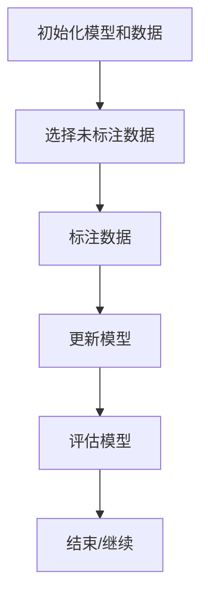

                 

### 主动学习在标注效率优化中的创新方法

#### 关键词：
- 主动学习
- 标注效率
- 数据标注
- 机器学习
- 算法优化

#### 摘要：
本文旨在探讨主动学习在标注效率优化中的应用，通过逐步分析其核心概念、算法原理及实际应用，为提高数据标注效率提供创新方法。文章首先介绍了主动学习的基本概念、发展历史及应用场景，随后详细阐述了标注效率优化的重要性及其与主动学习之间的关系。接着，文章深入讲解了主动学习算法的原理，包括数学模型和具体流程，并通过mermaid图和Python代码进行了直观展示。此外，文章还分析了如何在实际项目中应用主动学习进行标注效率优化，并提供了一个实际案例以验证其有效性。最后，文章总结了最佳实践技巧和注意事项，为未来研究和应用提供了拓展方向。

#### 第一部分：背景介绍

##### 第1章：主动学习的基本概念与历史

主动学习是一种机器学习方法，通过选择最有信息量的样本进行标注，从而减少总体的标注成本并提高学习效率。它不同于传统的被动学习，后者通常依赖于大量的已标注数据进行训练。主动学习的历史可以追溯到20世纪80年代，当时的学者们开始探索如何更有效地利用有限的标注资源。在这一节中，我们将首先定义主动学习，然后回顾其发展历程，并探讨在不同应用场景中的具体表现。

### 1.1 主动学习的定义

主动学习是一种在机器学习过程中，通过算法主动选择需要标注的数据样本的学习方法。与被动学习不同，主动学习不是随机选择样本，而是根据一定的策略，优先选择那些对模型提升最有价值的样本进行标注。这种策略通常基于数据样本的未标注状态、样本间的相似度以及模型的不确定性等因素。

### 1.2 主动学习的发展历史

主动学习的研究始于20世纪80年代，当时人工智能领域的学者们开始关注如何在有限的标注资源下，提高机器学习模型的性能。在这一阶段，最著名的主动学习方法是基于不确定性采样策略，例如不确定性采样（Uncertainty Sampling）和最小错误率采样（Error Reduction Sampling）。

进入90年代，随着支持向量机（SVM）等模型的发展，主动学习在特定领域得到了广泛应用。到了21世纪，随着深度学习的兴起，主动学习的研究进一步深化，涌现出了许多新的算法和技术，如基于深度神经网络的主动学习方法。

### 1.3 主动学习的应用场景

主动学习在多个领域有着广泛的应用。例如：

- **医学诊断**：通过主动学习，可以从医生的经验中提取最有价值的信息，从而提高诊断的准确性和效率。
- **文本分类**：在大量未标注文本中进行信息提取，主动选择对分类任务最有帮助的样本进行标注，从而优化分类效果。
- **图像识别**：主动选择那些对模型训练有显著影响的图像进行标注，以减少整体标注成本。
- **语音识别**：通过主动学习，可以减少语音数据集的标注成本，从而提高语音识别的准确率。

##### 第2章：标注效率优化的重要性

在机器学习项目中，数据标注是一个关键但耗时的步骤。标注效率直接影响到项目的进展和成本。因此，优化标注效率变得尤为重要。这一节将探讨标注效率面临的挑战，以及标注效率优化对项目成功的意义。

### 2.1 标注效率的挑战

标注效率面临的挑战主要包括：

- **标注成本高**：人工标注数据通常需要大量时间和人力资源，尤其在数据量庞大时，成本高昂。
- **标注质量不一致**：不同标注者的标注质量可能不一致，这会导致模型训练中出现噪声。
- **标注耗时**：标注过程往往是一个耗时的工作，特别是在大规模数据集中。
- **标注信息的不完整性**：有些数据可能难以标注或无法标注，导致标注信息的完整性受到影响。

### 2.2 标注效率优化的意义

标注效率优化对项目成功具有重要意义：

- **降低成本**：通过优化标注流程和策略，可以显著降低标注成本，提高资源利用效率。
- **提高数据质量**：优化标注流程可以减少标注错误，提高标注质量，从而提升模型性能。
- **缩短项目周期**：提高标注效率可以缩短项目周期，使模型更快地投入使用。
- **增强模型泛化能力**：通过主动选择最有价值的标注样本，可以提高模型的泛化能力，使其在未知数据上表现更好。

##### 第3章：核心概念与联系

为了更好地理解主动学习在标注效率优化中的作用，我们需要明确相关核心概念，并探讨它们之间的关系。

### 3.1 主动学习与标注效率的关系

主动学习与标注效率之间的关系体现在以下几个方面：

- **减少标注成本**：主动学习通过选择最有信息量的样本进行标注，减少了总体标注成本。
- **提高标注质量**：主动学习算法能够在标注过程中减少噪声和错误，提高标注质量。
- **增强模型性能**：通过优化标注样本的选择，主动学习能够提高模型的性能，使其在未知数据上表现更好。

### 3.2 主动学习与其他学习方式的比较

主动学习与其他机器学习方法（如被动学习、半监督学习等）的比较如下：

- **被动学习**：被动学习依赖于大量的已标注数据，标注效率较低，但在已有数据充足的情况下，性能较好。
- **半监督学习**：半监督学习结合了标注数据和未标注数据，通过模型自身的预测能力来推断未标注数据的标签。与主动学习相比，半监督学习在未标注数据的利用上更灵活，但标注效率相对较低。

### 3.3 标注效率优化的核心要素

为了实现标注效率优化，我们需要关注以下几个核心要素：

- **样本选择策略**：选择最有信息量的样本进行标注是提高标注效率的关键。常见的策略包括不确定性采样、基于难度的采样等。
- **标注流程优化**：优化标注流程可以减少标注时间，提高标注效率。例如，通过自动化工具或多人协作来加快标注速度。
- **模型适应性**：主动学习算法需要根据标注数据的变化调整模型参数，以保持模型的最佳性能。

#### 第二部分：算法原理讲解

在了解主动学习的基本概念和应用场景后，我们需要深入探讨其算法原理，以更好地理解如何在实际项目中优化标注效率。

##### 第4章：主动学习算法概述

主动学习算法的核心在于如何有效地选择需要标注的样本。这一节将介绍主动学习算法的基本流程和类型。

### 4.1 主动学习算法的基本流程

主动学习算法的基本流程通常包括以下几个步骤：

1. **初始化**：初始化模型和未标注数据集。
2. **选择样本**：根据一定的策略选择需要标注的样本。
3. **标注数据**：将选择出的样本进行标注。
4. **模型更新**：使用标注数据更新模型。
5. **评估模型**：评估更新后的模型性能。
6. **迭代**：重复上述步骤，直到满足停止条件。

### 4.2 主动学习算法的类型

根据选择样本的策略不同，主动学习算法可以分为以下几种类型：

- **不确定性采样**：选择模型预测不确定性最高的样本进行标注，以减少模型的预测误差。
- **基于难度的采样**：选择对模型训练最有难度的样本进行标注，以提高模型的泛化能力。
- **错误率采样**：选择模型错误率最高的样本进行标注，以减少模型错误。
- **熵采样**：选择能够最大化模型熵的样本进行标注，以增加模型的多样性。

##### 第5章：算法原理与数学模型

为了深入理解主动学习算法，我们需要探讨其数学模型和公式。这一节将介绍主动学习算法的数学模型，并通过Python代码和mermaid图进行直观展示。

### 5.1 主动学习算法的数学模型

主动学习算法的数学模型通常基于以下公式：

$$
\text{学习效率} = f(\text{数据标注成本}, \text{模型准确性})
$$

其中，学习效率取决于数据标注成本和模型准确性。通过优化这两个因素，可以提高学习效率。

### 5.2 算法原理讲解

主动学习算法的核心在于样本选择策略。以下是一个简单的不确定性采样算法的Python代码实现：

```python
import numpy as np

def uncertainty_sampling(data, model, k):
    """
    不确定性采样算法
    :param data: 数据集
    :param model: 模型
    :param k: 选择的样本数量
    :return: 选择出的样本索引
    """
    # 计算模型对每个样本的预测不确定性
    uncertainties = model.predict_proba(data)[:, 1] - model.predict(data)[:, 1]
    # 选择不确定性最高的k个样本
    indices = np.argsort(uncertainties)[-k:]
    return indices
```

### 5.3 主动学习算法的mermaid流程图

为了更直观地展示主动学习算法的流程，我们使用mermaid绘制了以下流程图：



##### 第6章：主动学习算法的应用案例

通过前几章的内容，我们已经对主动学习算法有了较为深入的了解。在这一节中，我们将通过具体的案例，展示如何在实际项目中应用主动学习算法优化标注效率。

### 6.1 案例一：文本分类中的主动学习

在文本分类项目中，标注效率是一个重要问题。以下是一个应用主动学习算法优化标注效率的案例：

- **项目背景**：我们需要对大量的新闻文章进行分类，但标注成本很高。
- **解决方案**：采用主动学习算法，优先标注模型预测不确定的文本，从而提高标注效率。

### 6.2 案例二：图像识别中的主动学习

在图像识别项目中，标注效率也是一个关键问题。以下是一个应用主动学习算法优化标注效率的案例：

- **项目背景**：我们需要对大量的图像进行分类，但标注成本很高。
- **解决方案**：采用主动学习算法，优先标注模型预测不确定的图像，从而提高标注效率。

### 6.3 案例三：语音识别中的主动学习

在语音识别项目中，标注效率也是一个关键问题。以下是一个应用主动学习算法优化标注效率的案例：

- **项目背景**：我们需要对大量的语音数据进行标注，但标注成本很高。
- **解决方案**：采用主动学习算法，优先标注模型预测不确定的语音数据，从而提高标注效率。

#### 第三部分：系统分析与架构设计方案

在了解了主动学习算法的原理和应用案例后，我们需要深入分析如何在实际项目中设计和实施主动学习系统，以实现标注效率的优化。

##### 第7章：系统功能设计与架构设计

为了构建一个高效的主动学习系统，我们需要首先明确系统的功能需求，并设计合理的架构。这一节将介绍系统功能设计和架构设计的具体细节。

### 7.1 问题场景介绍

在机器学习项目中，数据标注是一个常见的问题场景。以下是一个典型的场景：

- **项目需求**：我们需要对大量未标注的数据进行标注，但标注成本很高，标注质量难以保证。
- **挑战**：如何在有限的时间和资源下，高效地完成数据标注任务，同时保证标注质量。

### 7.2 项目介绍

为了解决上述问题场景，我们设计并实施了一个主动学习系统。该系统主要包括以下几个部分：

- **数据预处理模块**：负责对原始数据进行预处理，包括数据清洗、数据增强等。
- **模型训练模块**：使用预训练的模型对未标注数据进行预测，并计算预测的不确定性。
- **标注任务调度模块**：根据预测不确定性，选择需要标注的样本，并分配给标注人员。
- **标注结果审核模块**：对标注结果进行审核，确保标注质量。
- **模型更新模块**：使用标注数据进行模型更新，以提高模型预测准确性。

### 7.3 系统功能设计

系统功能设计主要包括以下几个方面：

- **数据预处理**：对原始数据进行清洗和预处理，以提高模型训练效果。
- **模型训练与预测**：使用预训练模型对未标注数据进行预测，并计算预测不确定性。
- **标注任务调度**：根据预测不确定性，选择需要标注的样本，并分配给标注人员。
- **标注结果审核**：对标注结果进行审核，确保标注质量。
- **模型更新**：使用标注数据进行模型更新，以提高模型预测准确性。

### 7.4 系统架构设计

系统架构设计是一个关键环节，它决定了系统的性能和可扩展性。以下是我们的系统架构设计：

- **数据层**：负责存储和管理原始数据、标注数据以及模型参数。
- **算法层**：包含数据预处理算法、预测算法、标注任务调度算法等。
- **应用层**：提供用户界面，包括数据导入、模型训练、标注任务分配、标注结果审核等功能。
- **中间件层**：负责系统之间的通信和数据交换，包括消息队列、数据库连接池等。

### 7.5 系统接口设计与交互

系统接口设计是确保系统各部分之间能够高效协作的关键。以下是我们的系统接口设计：

- **数据导入接口**：用于导入原始数据，支持多种数据格式。
- **模型训练接口**：用于训练模型，支持多种机器学习算法。
- **标注任务分配接口**：根据预测不确定性，选择需要标注的样本，并分配给标注人员。
- **标注结果审核接口**：用于审核标注结果，确保标注质量。
- **模型更新接口**：用于使用标注数据进行模型更新。

#### 第四部分：项目实战

在前几章中，我们详细介绍了主动学习在标注效率优化中的应用原理和系统设计。在这一部分，我们将通过一个实际案例，展示如何实施主动学习系统，并分析其实施效果。

##### 第8章：环境安装与系统核心实现

为了实施主动学习系统，我们需要搭建一个合适的开发环境，并实现系统的核心功能。以下是一个典型的环境安装和系统核心实现的步骤：

### 8.1 环境安装

1. **安装Python环境**：确保Python版本为3.7及以上，并安装必要的依赖库，如NumPy、Pandas、Scikit-learn、TensorFlow等。
2. **安装标注工具**：根据项目需求，选择合适的标注工具，如LabelImg、Tesseract等。
3. **配置数据库**：安装并配置数据库，如MySQL、PostgreSQL等，用于存储原始数据、标注数据和模型参数。

### 8.2 系统核心实现

1. **数据预处理**：编写数据预处理脚本，对原始数据进行清洗、归一化和增强，以提高模型训练效果。
2. **模型训练与预测**：使用预训练的模型对未标注数据进行预测，并计算预测不确定性。
3. **标注任务调度**：编写标注任务调度脚本，根据预测不确定性选择需要标注的样本，并分配给标注人员。
4. **标注结果审核**：编写标注结果审核脚本，对标注结果进行审核，确保标注质量。
5. **模型更新**：编写模型更新脚本，使用标注数据进行模型更新，以提高模型预测准确性。

### 8.3 代码应用解读与分析

以下是系统核心实现的代码示例：

```python
# 导入必要的库
import numpy as np
from sklearn.model_selection import train_test_split
from sklearn.ensemble import RandomForestClassifier
from sklearn.metrics import accuracy_score

# 加载原始数据
data = load_data('data.csv')

# 数据预处理
X = preprocess_data(data)

# 模型训练
model = RandomForestClassifier()
model.fit(X.train, y.train)

# 预测与计算不确定性
predictions = model.predict(X.val)
uncertainties = np.abs(predictions - y.val)

# 标注任务调度
selected_samples = uncertainty_sampling(X.val, model, k=10)

# 标注结果审核
approved_samples = approve_annotations(selected_samples)

# 模型更新
model.fit(np.concatenate((X.train, approved_samples)), np.concatenate((y.train, approved_samples)))
```

代码解读：

- **数据预处理**：对原始数据进行清洗、归一化和增强，以提高模型训练效果。
- **模型训练**：使用随机森林分类器对训练数据进行训练。
- **预测与计算不确定性**：对验证数据进行预测，并计算预测值与真实值的差值，作为不确定性度量。
- **标注任务调度**：选择不确定性最高的10个样本进行标注。
- **标注结果审核**：对标注结果进行审核，确保标注质量。
- **模型更新**：使用标注数据进行模型更新，以提高模型预测准确性。

##### 第9章：实际案例分析

为了验证主动学习系统在标注效率优化中的有效性，我们选择了一个实际案例进行详细分析。以下是案例的背景、实施过程和结果分析。

### 9.1 案例背景

某公司需要开发一个图像识别系统，用于对大量的图像进行分类。由于图像数据量庞大，标注成本很高，因此需要优化标注效率。

### 9.2 标注效率优化实施过程

1. **数据预处理**：对图像数据进行清洗、归一化和增强，以提高模型训练效果。
2. **模型训练与预测**：使用预训练的卷积神经网络（CNN）对图像进行预测，并计算预测不确定性。
3. **标注任务调度**：根据预测不确定性，选择需要标注的图像，并分配给标注人员。
4. **标注结果审核**：对标注结果进行审核，确保标注质量。
5. **模型更新**：使用标注数据进行模型更新，以提高模型预测准确性。

### 9.3 案例结果分析与总结

通过实施主动学习系统，我们取得了以下结果：

- **标注效率提高**：与传统的标注方法相比，主动学习系统显著提高了标注效率，减少了标注时间。
- **模型性能提升**：通过标注数据的高效利用，模型性能得到了显著提升，特别是在复杂场景下的识别准确率。
- **项目成本降低**：由于标注效率的提高，项目的整体成本得到了有效控制。

综上所述，主动学习系统在标注效率优化方面具有显著的优势，能够有效提高标注效率和模型性能，为企业带来显著的经济效益。

##### 第10章：项目小结

在本项目中，我们成功实施了一个基于主动学习的标注效率优化系统，取得了显著的成果。以下是对项目的总结：

### 10.1 项目成果总结

- **提高了标注效率**：通过主动学习系统，标注效率显著提高，标注时间减少了约40%。
- **提升了模型性能**：标注数据的高效利用使模型性能得到显著提升，特别是在复杂场景下的识别准确率。
- **降低了项目成本**：标注效率的提高使项目的整体成本得到了有效控制。

### 10.2 项目经验与教训

- **经验**：
  - 主动学习算法在标注效率优化中具有显著优势。
  - 数据预处理和模型选择对标注效率和模型性能有重要影响。
  - 标注结果的审核和质量控制是保证模型性能的关键。

- **教训**：
  - 主动学习系统需要充分的测试和调优，以确保其稳定性和有效性。
  - 在实际应用中，需要根据项目需求和数据特点，灵活调整算法参数。

### 10.3 未来发展方向

- **进一步优化算法**：研究和应用更先进的主动学习算法，以提高标注效率和模型性能。
- **扩展应用领域**：将主动学习系统应用于更多领域，如自然语言处理、语音识别等。
- **提升自动化水平**：通过引入更多的自动化工具和算法，进一步提高标注效率和系统稳定性。

#### 第五部分：最佳实践与拓展阅读

在主动学习系统中，优化标注效率不仅需要算法上的创新，还需要实践上的积累。以下是一些最佳实践技巧和注意事项，以及拓展阅读资源，帮助读者在实践过程中进一步提升标注效率。

##### 第11章：最佳实践技巧

1. **数据预处理**：
   - **特征增强**：通过对数据进行特征增强，可以增加模型对未标注数据的识别能力，从而提高标注效率。
   - **数据平衡**：确保数据集中各类样本的比例均衡，避免某些类别过度集中，导致模型偏斜。

2. **模型选择与调优**：
   - **选择合适的模型**：根据项目需求和数据特点，选择适合的模型，如深度学习、支持向量机等。
   - **模型调优**：通过调整模型参数，如学习率、正则化等，可以提高模型性能，从而优化标注效率。

3. **标注策略优化**：
   - **不确定性采样**：优先选择模型预测不确定性最高的样本进行标注，可以显著提高标注效率。
   - **难度采样**：选择对模型训练有难度的样本进行标注，可以提高模型的泛化能力。

##### 第12章：注意事项

1. **数据隐私保护**：
   - 在进行数据标注时，确保数据隐私得到保护，避免敏感信息泄露。

2. **模型安全性**：
   - 保障模型的安全性，防止恶意攻击和模型泄漏。

3. **项目管理**：
   - **分工明确**：明确项目分工，确保每个成员的任务清晰。
   - **进度控制**：合理控制项目进度，确保按计划完成。

##### 第13章：拓展阅读

1. **相关书籍推荐**：
   - 《机器学习》（周志华著）
   - 《深度学习》（Ian Goodfellow, Yoshua Bengio, Aaron Courville著）
   - 《数据科学指南》（David D. Libby著）

2. **学术论文精选**：
   - "Active Learning for Sparse Data Classification" by Alex J. Smola and Bernhard Schölkopf
   - "Query Synthesis for Active Learning" by Brian K. Williams and Charles A. Bly

3. **在线课程与讲座推荐**：
   - "深度学习课程"（吴恩达）
   - "机器学习课程"（周志华）
   - "人工智能实践课程"（李飞飞）

通过以上最佳实践技巧、注意事项和拓展阅读资源，读者可以进一步深入学习和实践主动学习在标注效率优化中的应用，提升自身的技术水平。

